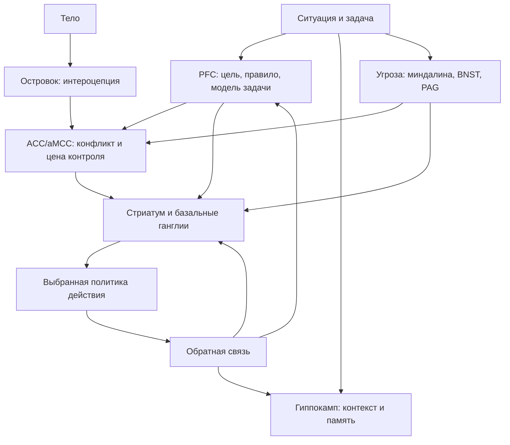

# Карта объяснения главы 13. Контуры действия

## Назначение карты

Эта карта переводит [[../Паспорта/13-Контуры-действия]] в маршрут главы. Читатель уже знает из главы 12, что нельзя прыгать от переживания к одной области мозга. Теперь нужно показать, как говорить о мозговых контурах так, чтобы они усиливали понимание, а не заменяли его нейромифом.

## Движение объяснения

| Шаг | Что объяснить | Какой вопрос закрывает |
| --- | --- | --- |
| 1 | После главы 12 можно вводить мозг, но только как уровень реализации. | Почему глава не начинается с анатомического справочника? |
| 2 | Контур не равен центру поведения. | Почему нельзя говорить "PFC отвечает за волю"? |
| 3 | PFC удерживает цель, правило и рабочую модель задачи. | Что в мозге поддерживает действие, когда стимулы тянут в сторону? |
| 4 | ACC/aMCC оценивает конфликт, цену контроля, усилие и ошибки. | Где встречаются трудность, контроль и неприятность усилия? |
| 5 | Стриатум и базальные ганглии участвуют в выборе, запуске и автоматизации действий. | Почему легкие действия часто запускаются быстрее важных? |
| 6 | Миндалина, BNST и PAG поддерживают угрозу и защитные режимы. | Почему "страх" нельзя свести к миндалине? |
| 7 | Островок приносит телесную цену и значимость. | Почему "нет сил" и "не могу войти" часто ощущаются телесно? |
| 8 | Гиппокамп связывает ситуацию с памятью, контекстом и будущими сценариями. | Почему прошлый опыт меняет текущую управляемость? |
| 9 | Один пример собирает контуры в систему действия. | Как пользоваться картой без самодиагностики? |
| 10 | Переход к главе 14. | Как медиаторы будут читаться как регуляторы режима контуров? |

## Скелет будущей главы

### 1. Не "центры", а контуры

Начать с прямого предупреждения:

```text
мозговая структура участвует в функции, но не является самой функцией
```

### 2. Карта функциональных узлов

Ввести общую схему:



### 3. Разбор узлов

Разделы:

- PFC: рабочая модель, цель, правило, произвольный контроль;
- ACC/aMCC: конфликт, цена контроля, усилие, ошибка;
- стриатум/базальные ганглии: выбор, запуск, пороги, привычки;
- миндалина/BNST/PAG: значимость, угроза, защитные действия;
- островок: интероцепция, salience, телесная цена;
- гиппокамп: контекст, память, моделирование будущего.

### 4. Сборка примера

Пример:

```text
важная задача не открывается, человек уходит в легкое действие
```

Важный ход: не спрашивать "какая зона виновата?", а разложить ситуацию по функциям.

### 5. Практическая таблица

Таблица:

| Если заметно | Возможный функциональный сбой | Первый инженерный ход |
| --- | --- | --- |
| Не удерживается задача | Слабый внешний и внутренний контекст | Восстановить карту задачи |
| Высокая тревога ошибки | Угроза выше управляемости | Снизить ставку первой попытки |
| Легкое действие побеждает | Порог запуска важной задачи выше | Упростить вход и убрать ближайшие приманки |
| "Нет сил" телесно | Высока интероцептивная цена | Снизить нагрузку или восстановиться |
| Прошлый провал тянет назад | Контекст памяти окрашивает прогноз | Создать малый новый опыт контроля |

### 6. Границы

Закрыть главу предупреждением:

```text
контурная карта - не медицинская диагностика и не инструкция по прямому управлению мозгом
```

### 7. Переход к медиаторам

Глава 14 объяснит, как дофамин, норадреналин, серотонин, ГАМК, ацетилхолин, кортизол и другие регуляторы меняют режимы этих контуров.

## Визуальная опора главы

Использовать две опоры:

1. Карта функциональных узлов действия.
2. Таблица "структура / функция в модели / типичная ошибка / инженерный вопрос".

Вторая таблица нужна, чтобы читатель не запомнил только схему, а научился переводить ее в вопросы.

## Основной пример

Ситуация:

```text
разработчик должен открыть большую туманную задачу, но вместо этого читает мелкие уведомления
```

Разбор:

- PFC: рабочая модель задачи не восстановлена;
- ACC/aMCC: цена контроля высока, конфликт между важной и легкой задачей силен;
- стриатум: уведомления имеют низкий порог запуска и быстрый цикл подкрепления;
- угроза: большая задача несет риск ошибки, оценки или бессилия;
- островок: тело сообщает усталость или напряжение;
- гиппокамп: похожие задачи раньше были долгими, неприятными или провальными;
- среда: уведомления находятся ближе, чем рабочий контекст.

Вывод: первая помощь не "прокачать PFC", а восстановить внешний контекст, снизить ставку первого шага и убрать дешевые конкурирующие действия.

## Проверка полноты перед черновиком

Глава готова к черновику, если она:

- объясняет контур как сетевой узел, а не центр поведения;
- вводит все структуры ровно настолько, насколько нужно для учебной модели;
- не уходит в подробную нейрохимию;
- содержит карту и практическую таблицу;
- использует один сквозной пример;
- готовит главу 14.

## Риск слабого текста

Главный риск — сделать сухой список структур. Глава должна читаться как карта действия: как цель удерживается, как конфликт становится дорогим, как угроза меняет политику, как тело приносит цену, как прошлый опыт меняет прогноз и как действие получает или не получает запуск.

## Статус

`ready-for-review`

Черновик главы создан: [[../Главы/13-Контуры-действия]].

Источниковый пакет создан: [[../Источники/2026-05-24 Пакет источников для главы 13]].

Связка с предыдущей главой проверена: [[../Проверки/2026-05-24 Связка глав 12-13]].

Ревизия блока: [[../Проверки/2026-05-25 Ревизия блока 12-15]].

Следующий шаг: при финальной редактуре проверить, что глава сохраняет маршрут "функция -> контур -> инженерный вопрос".
