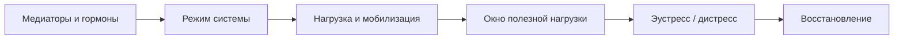

# Карта объяснения главы 14. Нейромедиаторы и гормоны

## Назначение карты

Эта карта переводит [[../Паспорта/14-Нейромедиаторы-и-гормоны]] в маршрут главы. Читатель уже знает, что мозговые структуры нужно понимать как узлы контуров, а не как "центры" поведения. Теперь нужно показать, что медиаторы и гормоны тоже нельзя читать как простые подписи к эмоциям.

Глава должна стать не справочником "вещество -> функция", а учебным мостом:

```text
контур действия -> режим работы контура -> медиаторы и гормоны как регуляторы режима -> инженерный вопрос
```

## Движение объяснения

| Шаг | Что объяснить | Какой вопрос закрывает |
| --- | --- | --- |
| 1 | После карты контуров можно вводить химию, но только как слой настройки. | Почему глава не начинается с "дофамин отвечает за..."? |
| 2 | Нейромедиатор, нейромодулятор, гормон и рецептор — разные вещи. | Почему одно слово "гормон" часто путает больше, чем объясняет? |
| 3 | Эффект вещества зависит от области, рецептора, уровня, режима и задачи. | Почему "больше" не значит "лучше"? |
| 4 | Дофамин связан с prediction error, effort, incentive salience, action selection и learning, но не равен удовольствию. | Почему "дофамин = мотивация" слишком грубо? |
| 5 | Норадреналин связан с arousal, gain, LC-NE, неожиданной неопределенностью и переключением режима. | Почему бодрость может быть как фокусом, так и тревожной мобилизацией? |
| 6 | Серотонин связан с aversive control, inhibition, punishment, delay и социально-аффективной регуляцией. | Почему "серотонин = настроение" не помогает понимать действие? |
| 7 | Ацетилхолин связан с обнаружением сигналов, вниманием, кодированием и ожидаемой неопределенностью. | Почему внимание — не один прожектор, а настройка обработки сигнала? |
| 8 | Глутамат и ГАМК задают базовую архитектуру возбуждения и торможения. | Почему устойчивость мышления требует не максимального возбуждения, а правильной фильтрации? |
| 9 | Кортизол и HPA-ось связывают мобилизацию, стрессовую цену и аллостаз. | Почему стресс нельзя считать только вредным или только полезным? |
| 10 | Окситоцин, опиоидные системы и половые гормоны работают контекстно. | Почему "гормоны любви", "счастья" и "доминирования" создают ложную ясность? |
| 11 | Сквозной пример собирает все в один эпизод действия. | Как читать биохимию без самодиагностики? |
| 12 | Переход к главе 15. | Как из химической настройки перейти к стрессу и окну полезной нагрузки? |

## Скелет будущей главы

### 1. Не химические ярлыки, а регуляторы режима

Начать с прямого предупреждения:

```text
медиатор не является психологическим состоянием
```

Затем сразу дать более точную формулу:

```text
медиаторы и гормоны меняют вероятность, стоимость, чувствительность и режимы работы контуров
```

### 2. Четыре базовых понятия

Ввести коротко:

- нейромедиатор;
- нейромодулятор;
- гормон;
- рецептор.

Не уходить в биохимию синтеза и фармакологию. Читателю нужен рабочий язык для понимания модели.

### 3. Почему "больше" не значит "лучше"

Обязательный блок про:

- нелинейные эффекты;
- inverted-U;
- tonic/phasic режимы;
- разные рецепторы;
- разные области мозга;
- зависимость от задачи и состояния.

Ключевой смысл:

```text
у системы часто есть не максимум, а рабочий диапазон
```

### 4. Дофамин: обучение, усилие, значимость, действие

Раскрыть:

- prediction error;
- ожидание и обновление прогноза;
- incentive salience;
- effort allocation;
- action selection;
- границу pleasure/liking.

Главная защита:

```text
дофамин помогает системе учиться и двигаться к значимому, но удовольствие не сводится к дофамину
```

### 5. Норадреналин: готовность, gain и режим поиска

Раскрыть:

- LC-NE;
- arousal;
- phasic/tonic режимы;
- exploitation/exploration;
- unexpected uncertainty;
- почему высокий arousal может разрушать сложную работу.

### 6. Серотонин: торможение, наказание, задержка

Раскрыть осторожно:

- aversive control;
- punishment-induced inhibition;
- delay, patience, impulsivity;
- социально-аффективные контексты;
- почему серотонин нельзя свести к "хорошему настроению".

### 7. Ацетилхолин: точность сигнала и обработка

Раскрыть:

- обнаружение сигналов;
- attention;
- encoding;
- expected uncertainty;
- переключение режима обработки;
- почему это не "таблетка памяти".

### 8. Глутамат и ГАМК: возбуждение и торможение

Раскрыть:

- глутамат как главный возбуждающий медиатор;
- ГАМК как главный тормозной медиатор;
- возбуждение/торможение как настройку сигнала, времени и устойчивости;
- почему метафора "газ и тормоз" полезна только как первый вход, но слишком бедна.

### 9. Кортизол и HPA-ось: мобилизация с ценой

Связать с главой 11:

- аллостаз;
- мобилизация;
- неконтролируемый стресс;
- PFC под стрессом;
- краткая польза и хроническая цена.

Не раскрывать полностью главу 15. Здесь только подготовить переход.

### 10. Социальные и телесные модуляторы

Окситоцин:

```text
не "любовь", а усиление социальной значимости в контексте
```

Опиоидные системы:

```text
liking, облегчение, удовольствие и социальное тепло не равны дофаминовому wanting
```

Тестостерон, прогестерон, половые гормональные оси:

```text
использовать только как осторожный мост к контекстам статуса, принадлежности, близости и угрозы
```

### 11. Сквозной пример

Пример:

```text
вечером нужно войти в важную туманную задачу, но система уходит в уведомления и подготовку
```

Разобрать не как "низкий дофамин", а как режим:

- слабая обратная связь и высокий effort cost;
- тревожная mobilization вместо точного фокуса;
- высокий шум и низкая фильтрация;
- социальная угроза оценки;
- накопленная аллостатическая цена дня;
- дешевые конкурирующие подкрепления.

### 12. Практический перевод

Закрыть главу таблицей:

| Если хочется сказать | Лучше спросить |
| --- | --- |
| "Мне не хватает дофамина" | Где распался прогноз, обратная связь или управляемость? |
| "У меня высокий кортизол" | Что сейчас неконтролируемо, неопределенно или слишком долго мобилизует систему? |
| "Нужен серотонин" | Что система тормозит, чего боится, какую цену наказания ожидает? |
| "Надо успокоиться" | Где избыток сигнала, шума, угрозы или конкурирующих действий? |
| "Нужно больше мотивации" | Какой режим действия должен включиться: фокус, поиск, восстановление, малый шаг, социальная поддержка? |

## Визуальная опора главы

Использовать три опоры:

1. Схема "медиаторы как регуляторы режима контуров".
2. Таблица "популярная формула / точнее / инженерный вопрос".
3. Карта перехода к главе 15:



## Основной пример

Ситуация:

```text
важная задача есть, ценность понятна, но вход неприятен и не запускается
```

Разбор:

- дофамин: не "нет удовольствия", а слабый прогноз продвижения, дорогой effort allocation и сильные конкурирующие быстрые награды;
- норадреналин: высокая готовность может быть не фокусом, а тревожным поиском угроз и альтернатив;
- серотонин: действие может тормозиться из-за ожидаемого наказания, задержки, социальной цены или aversive control;
- ацетилхолин: сигнал задачи может быть недостаточно выделен из шума;
- ГАМК/глутамат: система может быть либо перегружена возбуждением, либо плохо фильтровать лишние импульсы;
- кортизол/HPA: накопленная мобилизация может делать вход дорогим;
- окситоцин/социальные системы: если задача социально значима, поддержка и оценка меняют ее вес;
- опиоидные системы: легкие действия могут давать облегчение и приятное "liking", не решая задачу.

Вывод: биохимия не отменяет уже изученные вмешательства. Она помогает понять, почему они работают:

- внешний контекст снижает цену удержания;
- малый шаг снижает цену контроля;
- обратная связь улучшает обучение;
- удаление быстрых наград меняет конкуренцию действий;
- восстановление возвращает переносимый режим;
- социальная безопасность снижает угрозу.

## Проверка полноты перед черновиком

Глава готова к черновику, если она:

- не начинает с "дофамин отвечает за";
- вводит различие медиатора, нейромодулятора, гормона и рецептора;
- показывает нелинейность и контекстность эффектов;
- объясняет каждый блок через режим контуров;
- содержит таблицу популярных формул и более точных переводов;
- не дает фармакологических и нутрицевтических советов;
- готовит главу 15 о стрессе и аллостазе.

## Риск слабого текста

Главный риск — написать красивую, но вредную таблицу "вещество -> состояние". Такой текст будет легко читать, но он разрушит дисциплину глав 12-13.

Нужный текст сложнее: он должен удержать несколько уровней одновременно и показать, что биохимия важна именно потому, что она регулирует контуры, а не потому, что заменяет психологию, среду и практику.

## Статус

`ready-for-review`

Черновик главы создан: [[../Главы/14-Нейромедиаторы-и-гормоны]].

Связка с предыдущей главой проверена: [[../Проверки/2026-05-24 Связка глав 13-14]].

Источниковый пакет создан: [[../Источники/2026-05-24 Пакет источников для главы 14]].

Ревизия блока: [[../Проверки/2026-05-25 Ревизия блока 12-15]].

Следующий шаг: при финальной редактуре проверить, что глава сохраняет маршрут "контур -> режим -> медиатор -> инженерный вопрос" и не становится таблицей "вещество -> состояние".
