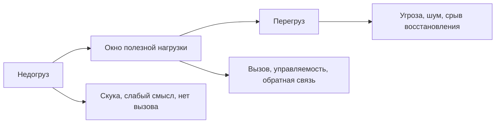
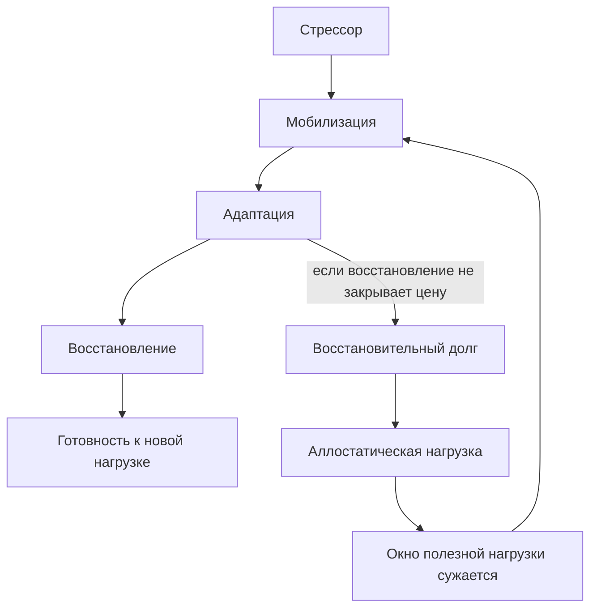

# Карта объяснения главы 15. Стресс, аллостаз и окно полезной нагрузки

## Назначение карты

Эта карта переводит [[../Паспорта/15-Стресс-аллостаз-и-окно-полезной-нагрузки]] в маршрут главы.

Глава должна закрыть часть IV: читатель уже знает уровни объяснения, контуры действия и нейрохимические регуляторы режима. Теперь нужно показать, как из этих уровней собирается стресс: не "кортизол", не "нервы", не "плохое состояние", а режим мобилизации и адаптации, который полезен только в рабочем диапазоне.

## Движение объяснения

| Шаг | Что объяснить | Какой вопрос закрывает |
| --- | --- | --- |
| 1 | После главы 14 нельзя говорить "стресс = кортизол"; стресс — системный режим. | Почему эта глава не является продолжением таблицы гормонов? |
| 2 | Стрессор, стрессовая реакция и субъективное переживание — разные уровни. | Почему одно и то же событие у разных людей работает по-разному? |
| 3 | Мобилизация может помогать: внимание собирается, тело готовится, лишнее отсекается. | Почему стресс не всегда вреден? |
| 4 | Полезность зависит от задачи: простая задача переносит больше активации, сложная требует более спокойного режима. | Зачем нужен закон Йеркса-Додсона? |
| 5 | Эустресс и дистресс различаются не приятностью, а результатом для адаптации и восстановления. | Где проходит порог между "собрало" и "начало ломать"? |
| 6 | Аллостаз — устойчивость через изменение, а аллостатическая нагрузка — цена повторной адаптации. | Почему можно "держаться" и одновременно копить долг? |
| 7 | PFC и сложное управление особенно уязвимы к высокому, неконтролируемому и длительному стрессу. | Почему при перегрузе падает не только настроение, но и мышление? |
| 8 | Недогруз тоже выводит из окна: мало вызова, смысла и обратной связи не собирают систему. | Почему скука может истощать? |
| 9 | Управляемость, длительность, восстановление, социальная безопасность и WIP меняют форму окна. | Почему "одинаковая нагрузка" не одинаковая? |
| 10 | Инженерное вмешательство — не всегда добавить стимул; иногда нужно снизить ставки, сузить WIP, вернуть управляемость или добавить вызов. | Как применять главу practically? |
| 11 | Переход к главе 16. | Почему обучение требует правильного окна нагрузки? |

## Скелет будущей главы

### 1. Стресс после главы о медиаторах

Начать с явного перехода:

```text
кортизол связан со стрессовой мобилизацией,
но стресс не равен кортизолу
```

Затем показать рабочую формулу:

```text
стресс = требование адаптации + мобилизация + оценка управляемости + цена восстановления
```

### 2. Стрессор, реакция и переживание

Развести:

- внешнее требование;
- телесную и нейронную реакцию;
- субъективное ощущение;
- поведение;
- последствия для восстановления.

Это защитит главу от объяснений вида "задача стрессовая сама по себе" или "мне тревожно, значит нагрузка объективно слишком большая".

### 3. Мобилизация как рабочий режим

Показать полезную сторону:

- сужение на важном сигнале;
- повышение готовности;
- сокращение лишних вариантов;
- запуск действия при срочности;
- энергия на короткий ответ.

Но сразу дать условие:

```text
мобилизация полезна, пока она помогает действию и закрывается восстановлением
```

### 4. Окно полезной нагрузки

Ввести как центральную модель главы.

Не как точный график, а как инженерную карту:

```text
недогруз -> рабочее окно -> перегруз
```

Ключевой тезис:

```text
чем сложнее задача, тем меньше она терпит грубый нажим
```

### 5. Эустресс и дистресс

Развести через эффект:

| Состояние | Что происходит |
| --- | --- |
| Эустресс | Напряжение помогает адаптации и не разрушает восстановление. |
| Дистресс | Напряжение перестает помогать и начинает оставлять только цену. |

Не писать "эустресс приятный". Он может быть неприятным, но рабочим.

### 6. Аллостаз и аллостатическая нагрузка

Дать простую связку:

```text
гомеостаз - удержание важных параметров в допустимых пределах
аллостаз - удержание устойчивости через изменение режима
аллостатическая нагрузка - цена повторной и хронической адаптации
```

Пример: срочная неделя может быть выдержана, но если каждую неделю жить как аварийную, система перестает возвращаться в исходное состояние.

### 7. Почему под стрессом хуже думается

Связать с главами 13-14:

- PFC нужна для удержания цели, правила, контекста и гибкого выбора;
- высокая угроза и неконтролируемость смещают систему к быстрому реагированию;
- норадреналиновая и стрессовая мобилизация может помочь простой реакции, но ухудшить сложную рабочую модель;
- внимание сужается на угрозе и ошибках;
- рабочая память теряет устойчивость.

### 8. Верхний и нижний перекос

Собрать локальные заметки:

- выгорание стресса как верхний перекос;
- выгорание скуки как нижний перекос;
- обе траектории могут выглядеть как "нет мотивации", но требуют разных вмешательств.

### 9. От чего зависит окно

Показать параметры:

- сложность задачи;
- новизна;
- управляемость;
- длительность;
- WIP;
- социальная безопасность;
- обратная связь;
- восстановление;
- накопленная нагрузка.

### 10. Инженерная диагностика

Дать практическую развилку:

```text
ниже окна -> добавить смысл, вызов, ответственность, обратную связь
внутри окна -> удержать ритм и восстановление
выше окна -> снизить давление, WIP, неопределенность, угрозу, размер шага
```

### 11. Переход к обучению

Закончить тем, что обучение и понимание требуют правильного окна:

- слишком мало вызова не создает активного извлечения и перестройки;
- слишком много угрозы ломает рабочую память и гибкость;
- полезная трудность должна быть дозированной.

## Визуальные опоры главы

### Окно полезной нагрузки



### Динамика аллостатической нагрузки



### Диагностическая развилка

| Признак | Вероятный режим | Первый инженерный вопрос |
| --- | --- | --- |
| Скучно, не цепляет, нет чувства вклада. | Ниже окна. | Как добавить смысл, вызов, ответственность или обратную связь? |
| Есть напряжение, но шаг понятен и после работы остается опора. | Внутри окна. | Как удержать ритм и восстановление? |
| Срочность шумит, ошибки пугают, мысль сужается. | Выше окна. | Что снизит давление, WIP, угрозу или неопределенность? |
| Долго "держусь", но восстановление не догоняет. | Аллостатический долг. | Что нужно перестать тащить как норму? |

## Основной пример

Ситуация:

```text
разработчик должен вечером доделать сложный архитектурный кусок после дня встреч
```

Разбор:

- если задача понятна, есть короткий следующий шаг и вечерний блок ограничен, напряжение может помочь собраться;
- если весь день уже съел рабочую память, задача туманна, ставки высоки, а завтра снова ранние встречи, тот же блок становится дистрессом;
- проблема не в "нет мотивации", а в выходе выше окна полезной нагрузки;
- инженерное решение может быть не в новом стимуле, а в восстановлении, снижении WIP, создании контрольной точки, переносе сложной части на утро или сужении шага до диагностического действия.

## Проверка полноты перед черновиком

Глава готова к черновику, если она:

- не сводит стресс к кортизолу;
- разводит стрессор, реакцию, переживание и поведение;
- объясняет эустресс и дистресс через адаптацию и восстановление;
- вводит аллостаз и аллостатическую нагрузку без метафоры "бака";
- использует закон Йеркса-Додсона осторожно, как эвристику;
- показывает верхний и нижний перекос окна;
- связывает стресс с PFC, рабочей памятью, угрозой и управляемостью;
- содержит практическую диагностическую развилку;
- готовит главу 16 про обучение и полезную трудность.

## Риск слабого текста

Главный риск — сделать главу мотивационной: "стресс полезен, главное правильно относиться". Это будет ошибка.

Второй риск — сделать главу тревожной: "стресс вреден, его нужно избегать". Это тоже ошибка.

Нужный текст должен держать среднюю линию: нагрузка нужна для адаптации, но полезность нагрузки определяется не героизмом, а соответствием сложности, управляемости, длительности и восстановлению.

## Статус

`ready-for-review`

Черновик главы создан: [[../Главы/15-Стресс-аллостаз-и-окно-полезной-нагрузки]].

Источниковый пакет создан: [[../Источники/2026-05-24 Пакет источников для главы 15]].

Связка с предыдущей главой проверена: [[../Проверки/2026-05-24 Связка глав 14-15]].

Ревизия блока: [[../Проверки/2026-05-25 Ревизия блока 12-15]].

Следующий шаг: при финальной редактуре проверить, что глава удерживает среднюю линию между романтизацией стресса и тревожным запретом нагрузки.
