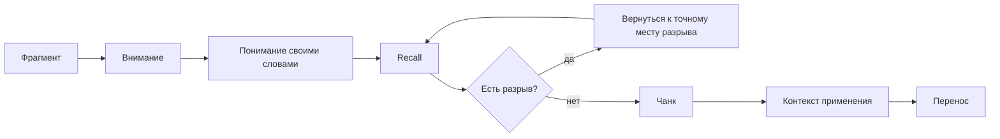
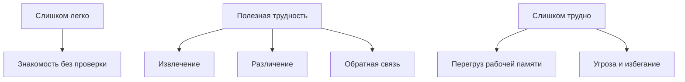

# Карта объяснения главы 16. Как строится понимание

## Назначение карты

Эта карта переводит [[../Паспорта/16-Как-строится-понимание]] в маршрут главы.

Глава открывает блок обучения и преодоления. Нужно перейти от динамики нагрузки к пониманию: не всякая трудность полезна, но без правильно дозированной трудности знание остается знакомостью, а не рабочей единицей.

## Движение объяснения

| Шаг | Что объяснить | Какой вопрос закрывает |
| --- | --- | --- |
| 1 | После главы 15 обучение читается через окно полезной нагрузки. | Почему понимание зависит не только от "способностей", но и от режима нагрузки? |
| 2 | Знакомость, узнавание и понимание — разные состояния. | Почему "мне понятно при чтении" еще не значит "я знаю"? |
| 3 | Рабочая память ограничена и плохо держит россыпь фрагментов. | Почему новый материал быстро рассыпается? |
| 4 | Чанк сжимает несколько элементов в одну рабочую единицу через смысл или действие. | Что такое чанк и почему он снижает нагрузку? |
| 5 | Чанкинг проходит через внимание, понимание и контекст. | Как фрагменты становятся рабочим блоком? |
| 6 | Recall без источника показывает разрывы и укрепляет знание. | Почему проверка памятью полезнее очередного гладкого перечитывания? |
| 7 | Иллюзия компетентности возникает, когда знакомость выдается за знание. | Почему повторное чтение может обманывать? |
| 8 | Карточки смысла, интервалы и синопсисы работают после первичной сборки, а не вместо нее. | Как закреплять знание, не обслуживая знакомость? |
| 9 | Контекст применения и перемежение нужны для переноса. | Почему знание может работать только в исходном примере? |
| 10 | Полезная трудность должна создавать извлечение и обратную связь, а не перегруз. | Как отличить развивающую трудность от бесполезной? |
| 11 | Переход к главе 17. | Почему после первичной сборки нужны сон, паузы и консолидация? |

## Скелет будущей главы

### 1. Почему понимание идет после окна нагрузки

Начать с перехода:

```text
обучение требует нагрузки,
но не всякая нагрузка помогает учиться
```

Показать:

- слишком слабая нагрузка оставляет знакомость без проверки;
- чрезмерная нагрузка перегружает рабочую память и повышает угрозу;
- полезная трудность заставляет восстановить, различить, ошибиться безопасно и поправить.

### 2. Знакомость не равна пониманию

Развести уровни:

| Уровень | Проверка |
| --- | --- |
| Знакомость | Я узнаю текст или термин. |
| Первичное понимание | Я могу пересказать главную мысль своими словами. |
| Рабочее понимание | Я могу связать мысль с соседними знаниями и применить. |
| Перенос | Я узнаю принцип вне исходного примера. |

Ключевая фраза:

```text
знакомость возникает при встрече с материалом,
понимание проверяется при его отсутствии
```

### 3. Рабочая память и россыпь фрагментов

Показать, что новый материал сначала приходит как отдельные элементы:

- термин;
- пример;
- шаг;
- причина;
- исключение;
- контекст;
- связь с прошлым знанием.

Пока они не собраны, рабочая память держит их как много отдельных объектов. Поэтому человек может "все прочитать" и все равно не удержать мысль.

### 4. Что такое чанк

Определить:

```text
чанк - это блок знания,
который возвращается почти целиком
и работает как одна единица для мышления или действия
```

Развести:

- чанк и папку;
- чанк и список;
- чанк и тему;
- чанк и заученную формулировку.

### 5. Как строится чанк

Три слоя из локальных заметок:

1. внимание;
2. понимание;
3. контекст применения.

Сбой:

- без внимания остается смутное узнавание;
- без понимания остается чужая формулировка;
- без контекста знание не приходит в момент применения.

### 6. Recall как проверка и обучение

Показать цикл:

```text
прочитал -> закрыл источник -> восстановил -> нашел разрыв -> вернулся только к разрыву -> снова восстановил
```

Важно: провал recall не означает "плохая память". Это диагностический сигнал.

### 7. Иллюзия компетентности

Объяснить, почему перечитывание обманывает:

- тот же порядок;
- те же примеры;
- та же визуальная оболочка;
- та же чужая формулировка.

Чем больше знакомость, тем легче принять ее за знание.

### 8. Карточки, интервалы, синопсисы

Показать порядок:

```text
recall -> ремонт разрыва -> карточка смысла -> интервалы -> синопсис -> применение
```

Карточка должна спрашивать смысл, связь или применение, а не только узнавание строки.

Синопсис появляется позже, когда тема должна пережить интервал и сжаться в собственный каркас.

### 9. Контекст применения и перенос

Показать, что чанк должен иметь условия вызова:

- когда он нужен;
- по каким признакам ситуация его вызывает;
- где он не подходит;
- какой соседний чанк с ним конкурирует.

Перемежение полезно после первичной сборки: оно убирает привычный порядок и заставляет выбрать нужный блок по ситуации.

### 10. Полезная и бесполезная трудность

Дать таблицу:

| Трудность | Что делает |
| --- | --- |
| Полезная | Запускает извлечение, различение, обратную связь и перенос. |
| Бесполезная | Повышает шум, угрозу, перегруз и не дает понять, что именно чинить. |

### 11. Переход к консолидации

Закончить:

- понимание строится не одним контактом;
- первый контакт, recall и карточка создают рабочий след;
- сон, паузы и повторные касания будут темой главы 17.

## Визуальные опоры главы

### Центральная схема



### Диагностика состояния знания

| Если я могу... | Это означает... | Следующий ход |
| --- | --- | --- |
| только узнать термин | есть знакомость | закрыть источник и сделать recall |
| пересказать мысль | есть первичное понимание | найти связь с соседним знанием |
| объяснить связь | собирается чанк | назвать контекст применения |
| применить в похожем примере | есть близкий перенос | попробовать перемежение или новый пример |
| выбрать принцип в новой ситуации | есть более сильный перенос | закрепить через синопсис и практику |

### Полезная трудность



## Основной пример

Ситуация:

```text
читатель изучает "окно полезной нагрузки" из главы 15
```

Плохой учебный ход:

- перечитать главу;
- выделить несколько фраз;
- согласиться, что "все логично";
- перейти дальше.

Рабочий учебный ход:

- закрыть главу и объяснить окно своими словами;
- назвать три режима: недогруз, рабочее окно, перегруз;
- найти один личный или рабочий пример;
- проверить, что в этом примере нужно менять: вызов, WIP, угрозу, управляемость или восстановление;
- сделать карточку смысла с вопросом не "что такое окно", а "как понять, задача ниже окна или выше окна".

## Проверка полноты перед черновиком

Глава готова к черновику, если она:

- начинает с перехода от окна нагрузки к полезной трудности;
- разводит знакомость, узнавание, понимание, чанк и перенос;
- объясняет ограничение рабочей памяти без закрепления нейромифа про точное число слотов;
- показывает чанк как рабочую единицу знания, а не как папку;
- дает цикл recall и ремонта разрыва;
- объясняет иллюзию компетентности и ловушку избыточного обучения;
- показывает место карточек, интервалов и синопсисов;
- объясняет контекст применения и перенос;
- содержит центральную схему и практический протокол;
- готовит главу 17 про сон и консолидацию.

## Риск слабого текста

Главный риск — сделать главу набором учебных советов: "делайте карточки, повторяйте, применяйте". Это будет слишком поверхностно.

Нужный текст должен объяснить механизм: почему рабочая память перегружается, почему чанк снижает нагрузку, почему recall лучше знакомости, почему перенос требует контекста и почему трудность полезна только в рабочем окне.

## Статус

`ready-for-review`

Черновик главы создан: [[../Главы/16-Как-строится-понимание]].

Источниковый пакет создан: [[../Источники/2026-05-24 Пакет источников для главы 16]].

Ревизия блока: [[../Проверки/2026-05-25 Ревизия блока 16-19]].

Следующий шаг: при финальной редактуре проверить, что знакомость, recall, чанк, контекст применения и перенос остаются разведены.
