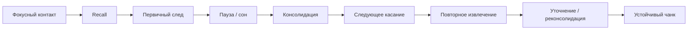
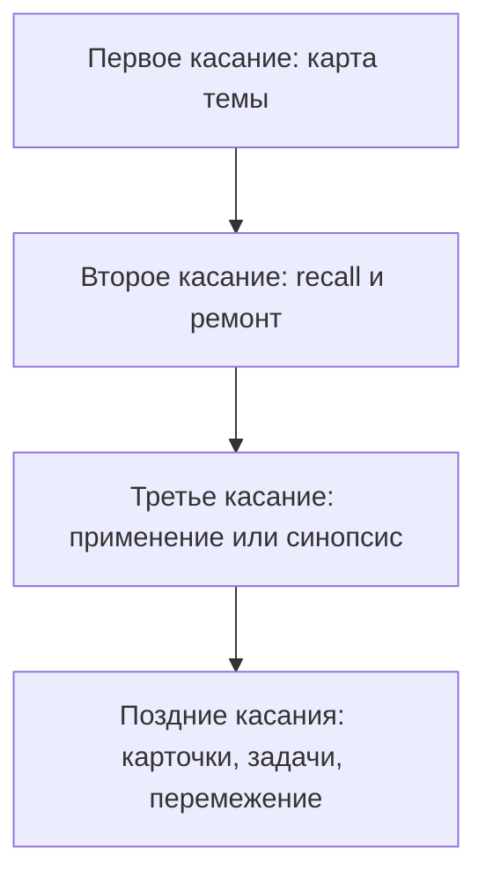

# Карта объяснения главы 17. Сон, восстановление и консолидация

## Назначение карты

Эта карта переводит [[../Паспорта/17-Сон-восстановление-и-консолидация]] в маршрут главы.

Глава должна объяснить, что происходит после первичного понимания. В главе 16 знание стало кандидатом в чанк через внимание, recall и контекст. В главе 17 нужно показать, почему этот кандидат еще хрупкий и почему паузы, сон и интервальные возвраты — не украшение учебы, а часть механизма.

## Движение объяснения

| Шаг | Что объяснить | Какой вопрос закрывает |
| --- | --- | --- |
| 1 | Фокусный контакт создает первичный след, но не завершает обучение. | Почему "я понял вечером" еще не значит "я буду владеть этим завтра"? |
| 2 | Пауза между подходами может быть рабочей частью обучения. | Почему непрерывный поток материала часто хуже разнесенных касаний? |
| 3 | Сон — активное состояние, связанное с памятью, регуляцией и восстановлением. | Почему сон нельзя просто обменять на дополнительные учебные часы? |
| 4 | Консолидация — стабилизация и реорганизация следов, а не мгновенная запись. | Что происходит с первичным следом после учебного контакта? |
| 5 | Реактивация и реконсолидация означают, что повторное обращение к памяти укрепляет и меняет ее. | Почему повторение должно быть извлечением и уточнением, а не просмотром знакомого? |
| 6 | Недосып ухудшает состояние внимания, рабочей памяти, контроля и регуляции. | Почему "еще немного поработать ночью" может ухудшить не только энергию, но и обучение? |
| 7 | Интервалы между касаниями делают повторное извлечение полезной трудностью. | Почему spacing работает лучше массового повторения? |
| 8 | Рассеянный режим и прогулки помогают после фокусного контакта, но не заменяют его. | Где граница между восстановлением и избеганием? |
| 9 | Учебный цикл должен оставлять точку возврата. | Как practically проектировать обучение с учетом сна и пауз? |
| 10 | Переход к главе 18. | Почему прокрастинация не равна восстановительной паузе? |

## Скелет будущей главы

### 1. После recall знание еще хрупкое

Начать с продолжения главы 16:

```text
закрыть источник и восстановить мысль - это важный порог,
но не финальная запись знания
```

Показать, что первичный чанк может держаться в свежем следе, но еще зависеть от контекста, недавнего чтения и текущего состояния.

### 2. Пауза как часть учебного цикла

Развести:

- пауза как восстановление и интервал перед следующим извлечением;
- пауза как избегание без точки возврата.

Критерий:

```text
после паузы задача становится доступнее
или только страшнее и дальше?
```

### 3. Сон не выключает мозг

Ввести без нейромифов:

- сон имеет несколько функций;
- сон связан с памятью, регуляцией и восстановлением;
- разные стадии сна могут по-разному участвовать в процессах памяти;
- простая формула "выучил перед сном -> гарантированно запомнил" слишком груба.

### 4. Консолидация

Дать простую модель:

```text
первичный след -> стабилизация -> реорганизация -> интеграция с прежними знаниями
```

Осторожно ввести гиппокампально-неокортикальный диалог как продвинутый слой, не перегружая главу нейроанатомией.

### 5. Реактивация и реконсолидация

Показать, что при повторном обращении память не просто достается как файл.

Она собирается, может укрепляться и уточняться, но может и искажаться.

Это связывает главу с:

- recall;
- карточками смысла;
- эффектом дезинформации;
- рабочим журналом как внешней фиксацией.

### 6. Недосып как проблема состояния

Не писать "сон полезен" как общий совет.

Показать параметры:

- sustained attention;
- рабочая память;
- торможение;
- эмоциональная регуляция;
- риск и импульсивность;
- качество повторного входа в сложную задачу.

### 7. Интервальные касания

Связать локальную "теорию трех касаний" с spacing effect:

```text
новое касание - это не перечитать то же самое,
а вернуться другим действием:
recall, карточка, синопсис, задача, применение
```

Показать, что интервал зависит от цели удержания. Не давать универсальное расписание как закон.

### 8. Двигательная пауза и прогулка

Показать:

- движение может быть сменой состояния;
- прогулка может помочь генерации идей;
- короткая пауза полезна после фокусного контакта;
- без точки возврата пауза легко становится избеганием.

### 9. Практический цикл

Собрать цикл:

```text
фокусный блок -> recall -> вопрос возврата -> пауза/сон -> повторное извлечение -> уточнение -> применение
```

### 10. Переход к прокрастинации

Закончить тем, что восстановление и прокрастинация могут выглядеть одинаково внешне: человек не работает. Но восстановление улучшает доступ к задаче, а прокрастинация часто ухудшает следующий вход.

## Визуальные опоры главы

### Центральный цикл



### Пауза или избегание

| Признак | Восстановительная пауза | Избегание |
| --- | --- | --- |
| Перед паузой | Есть фокусный контакт или честная фиксация состояния. | Нет контакта с задачей или он оборван на угрозе. |
| Точка возврата | Записан вопрос, следующий шаг или критерий входа. | Возврат не определен. |
| После паузы | Задача становится доступнее. | Задача становится страшнее, туманнее или дороже. |
| Роль состояния | Восстанавливает внимание и управляемость. | Снимает неприятное чувство сейчас, но не меняет условия входа. |

### Интервальные касания



## Основной пример

Ситуация:

```text
человек вечером изучает главу 16 и чувствует, что понял
```

Разбор:

- если он сразу читает еще три главы, свежая знакомость может создать иллюзию большого прогресса;
- если он закрывает источник, делает recall и оставляет вопрос для завтра, появляется первичный след;
- если после сна он способен восстановить мысль без источника, можно укреплять чанк;
- если мысль распалась, это не провал, а нормальная диагностика следующего разрыва.

## Проверка полноты перед черновиком

Глава готова к черновику, если она:

- продолжает главу 16, а не начинает заново тему памяти;
- объясняет сон как активное состояние, не как "выключение";
- вводит консолидацию, реактивацию и реконсолидацию;
- показывает, что пауза полезна только при наличии фокусного контакта и точки возврата;
- связывает недосып с состоянием внимания, рабочей памяти и контроля;
- объясняет интервальные касания без универсального расписания;
- осторожно вводит физическую активность и прогулки;
- не дает медицинских советов;
- готовит главу 18 через различение восстановления и избегания.

## Риск слабого текста

Главный риск — написать главу как набор банальных советов: "спите, гуляйте, делайте перерывы". Это будет ниже уровня учебника.

Нужный текст должен объяснить, почему эти действия являются частью контура памяти и состояния: что именно они делают после фокусного контакта, как связаны с recall, где помогают, а где не заменяют работу.

## Статус

`ready-for-review`

Черновик главы создан: [[../Главы/17-Сон-восстановление-и-консолидация]].

Источниковый пакет создан: [[../Источники/2026-05-24 Пакет источников для главы 17]].

Ревизия блока: [[../Проверки/2026-05-25 Ревизия блока 16-19]].

Следующий шаг: при финальной редактуре проверить границу восстановления, паузы, сна, интервального касания и прокрастинации.
