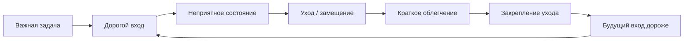
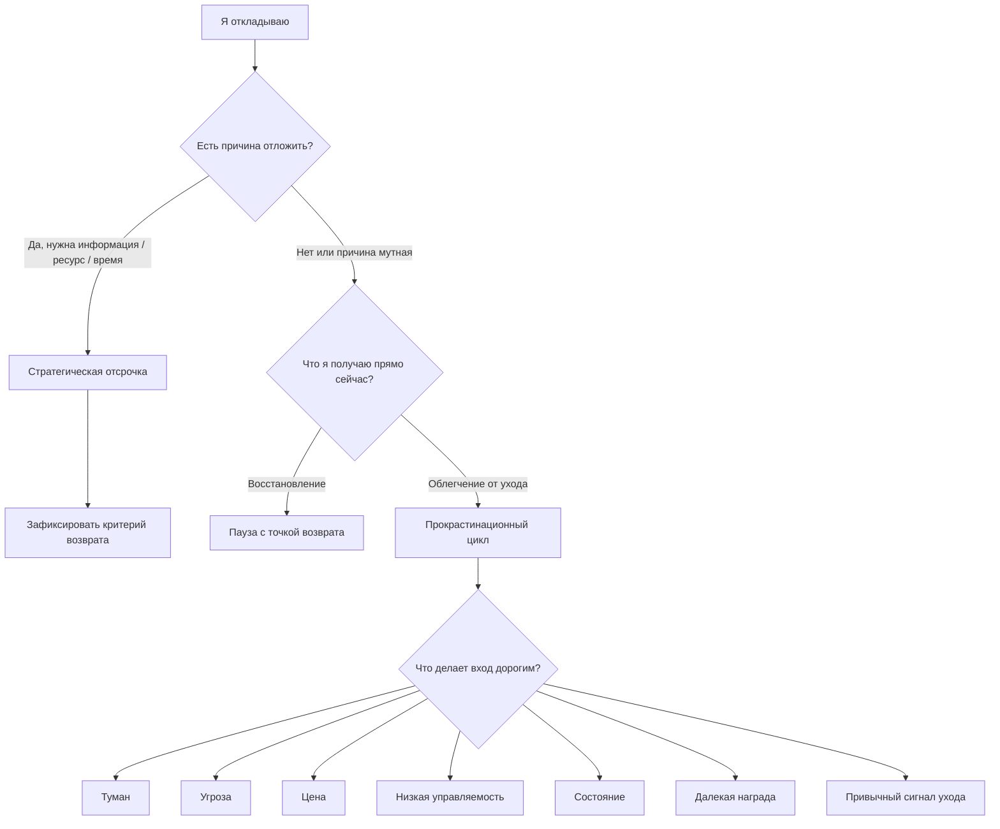

# Карта объяснения главы 18. Прокрастинация как конфликт систем

## Назначение карты

Эта карта переводит [[../Паспорта/18-Прокрастинация-как-конфликт-систем]] в маршрут главы.

Глава должна взять уже введенные понятия — избегание, управляемость, цена усилия, восстановление, точка возврата — и собрать из них объяснение прокрастинации. Нельзя начинать заново с бытовой темы "как перестать откладывать". Нужно показать системный конфликт.

## Движение объяснения

| Шаг | Что объяснить | Какой вопрос закрывает |
| --- | --- | --- |
| 1 | Восстановление и прокрастинация внешне похожи, но имеют разный системный эффект. | Почему не всякое "я не работаю" означает одно и то же? |
| 2 | Прокрастинация — это отсрочка важного действия с будущей ценой, а не всякая задержка. | Почему стратегическая пауза и прокрастинация различаются? |
| 3 | Важная задача может быть одновременно ценной и угрожающей. | Почему человек откладывает то, что ему действительно важно? |
| 4 | Краткосрочная регуляция настроения часто выигрывает у будущей пользы. | Почему откладывание приносит облегчение? |
| 5 | Будущая цена растет: туман, стыд, дедлайн, потеря контекста. | Почему прокрастинация самоподдерживается? |
| 6 | Необходимо диагностировать, что именно делает вход дорогим. | Почему один и тот же совет не работает для всех случаев? |
| 7 | Подготовка, планирование и "полезные дела" могут быть замаскированным избеганием. | Почему человек может быть занят и все равно прокрастинировать? |
| 8 | Малый шаг снижает цену входа и возвращает контакт с задачей. | Почему полезен первый наблюдаемый шаг, а не лозунг "просто начни"? |
| 9 | If-then planning и среда работают как переключатели, но не как магия. | Как заранее уменьшать вероятность ухода? |
| 10 | Переход к главе 19: преодоление начинается с удержания контакта. | Как из главы о прокрастинации перейти к опыту преодоления? |

## Скелет будущей главы

### 1. Почему глава стоит после сна и восстановления

Начать с различения:

```text
восстановление улучшает следующий вход;
прокрастинация часто ухудшает следующий вход
```

Показать, что внешне оба процесса могут выглядеть одинаково: человек отходит от задачи. Критерий — не внешний вид, а то, что происходит с будущим контактом.

### 2. Что считать прокрастинацией

Дать аккуратное определение:

```text
прокрастинация - добровольная отсрочка важного или ожидаемо нужного действия,
несмотря на вероятную будущую цену этой отсрочки
```

Сразу развести:

- отдых;
- стратегическую отсрочку;
- ожидание недостающей информации;
- изменение приоритета;
- отказ от ненужной задачи.

### 3. Важная задача как конфликт

Показать, что задача может одновременно:

- иметь большую ценность;
- угрожать самооценке;
- требовать усилия;
- быть туманной;
- иметь отложенную награду;
- давать слабую обратную связь;
- казаться малоуправляемой.

### 4. Ловушка краткого облегчения

Центральная схема:

```text
туман / угроза / цена
-> неприятное состояние
-> уход
-> облегчение
-> закрепление ухода
-> будущий вход дороже
```

Важно: прокрастинация может быть способом регулировать состояние, а не способом выразить реальное отношение к задаче.

### 5. Почему следующий вход дорожает

Разложить будущую цену:

- меньше времени;
- меньше свежего контекста;
- больше стыда;
- выше ставка проверки;
- больше неопределенности;
- сильнее привычка уходить;
- слабее вера в собственную управляемость.

### 6. Диагностика дорогого входа

Сделать таблицу причин:

| Причина | Как ощущается | Что делать |
| --- | --- | --- |
| Туман | Непонятно, с чего начать. | Выписать факты, неизвестные и первую проверку. |
| Угроза | Страшно увидеть ошибку или оценку. | Сделать черновой, обратимый контакт. |
| Цена усилия | Слишком тяжело удерживать задачу. | Уменьшить контейнер входа. |
| Низкая управляемость | Все равно ничего не изменится. | Найти рычаг, критерий продвижения или запросить поддержку. |
| Состояние | Нет даже короткого фокуса. | Восстановление, снижение нагрузки, сон, пауза с точкой возврата. |
| Далекая награда | Сейчас есть более легкие награды. | Сделать близкую обратную связь. |
| Привычный уход | Рука сама тянется в чат, ленту, почту. | Изменить сигнал запуска и заранее задать ответ по схеме "если - то". |

### 7. Замаскированная продуктивность

Разобрать:

- бесконечное чтение;
- настройку инструментов;
- уборку рабочего пространства;
- мелкие задачи;
- "еще один план";
- уточнения без проверки;
- подготовку без входа.

Критерий:

```text
после этого действия я ближе к проверяемому контакту с задачей
или только дальше от неприятного места?
```

### 8. Первый наблюдаемый шаг

Показать отличие:

```text
плохо: сделать проект
лучше: открыть файл и выписать три неизвестных
```

Малый шаг должен быть:

- физически исполнимым;
- коротким;
- проверяемым;
- связанным с реальностью задачи;
- не требующим финального качества;
- достаточно безопасным, чтобы войти.

### 9. Планирование по схеме "если - то"

Ввести намерения реализации как инженерный переключатель:

```text
если я открыл задачу и хочу уйти в чат,
то я сначала записываю одну строку: "что сейчас страшно / туманно?"
```

Не обещать, что это решит все. План по схеме "если - то" работает лучше, когда:

- ситуация узнаваема;
- действие конкретно;
- шаг не слишком велик;
- среда не сделала уход самым легким вариантом;
- состояние не находится в тяжелом перегрузе.

### 10. Переход к опыту преодоления

Закончить так:

Прокрастинация показывает место, где система уходит от контакта. Преодоление начинается не с героического насилия над собой, а с удержания малого контакта с трудным, получения обратной связи и роста управляемости.

## Визуальные опоры главы

### Центральный цикл



### Диагностическая развилка



### Карта вмешательств

| Если вход дорог из-за... | Инженерный ход |
| --- | --- |
| Тумана | Карта контекста: факты, неизвестные, первая проверка. |
| Угрозы | Черновой вход без обязательства финального качества. |
| Высокой цены | Контейнер 5-15 минут и один наблюдаемый результат. |
| Низкой управляемости | Найти рычаг влияния или внешний запрос. |
| Состояния | Восстановление, сон, снижение WIP, пауза с точкой возврата. |
| Далекой награды | Близкая обратная связь, промежуточная контрольная точка. |
| Привычного ухода | Убрать легкий сигнал запуска, задать план по схеме "если - то", изменить первый экран. |

## Основной пример

Ситуация:

```text
нужно написать сложный раздел учебника,
но вместо этого человек перечитывает источники, правит структуру,
ищет еще одну статью и обновляет список ссылок
```

Разбор:

- если новые источники закрывают реальный пробел, это подготовка;
- если они снова и снова откладывают первый черновой абзац, это замещающее действие;
- если после часа подготовки есть первый проверяемый фрагмент текста, вход состоялся;
- если после часа подготовки стало только страшнее писать, цикл прокрастинации укрепился.

Рабочий вход:

```text
за 15 минут написать плохой первый абзац,
в котором перечислены не выводы,
а вопросы, на которые должен ответить раздел
```

## Проверка полноты перед черновиком

Глава готова к черновику, если она:

- продолжает главу 17 через различение восстановления и откладывания;
- определяет прокрастинацию аккуратно, не смешивая ее со всякой задержкой;
- объясняет конфликт ценности, угрозы, цены, управляемости, состояния и времени;
- раскрывает short-term mood regulation как центральный механизм;
- показывает, почему будущий вход дорожает;
- дает диагностику разных причин откладывания;
- различает подготовку и избегание проверки;
- вводит первый наблюдаемый шаг;
- вводит implementation intentions с ограничениями;
- не морализирует и не дает клинических обещаний;
- готовит главу 19 про опыт преодоления.

## Риск слабого текста

Главный риск — написать обычную productivity-главу: "разбейте задачу, поставьте таймер, уберите телефон". Такие советы могут быть полезными, но без механизма они снова звучат как поверхностный список.

Нужный текст должен объяснить:

```text
почему именно этот вход стал дорогим,
какая система сейчас выигрывает конфликт,
какое вмешательство меняет цену, угрозу или управляемость
```

## Статус

`ready-for-review`

Черновик главы создан: [[../Главы/18-Прокрастинация-как-конфликт-систем]].

Источниковый пакет создан: [[../Источники/2026-05-24 Пакет источников для главы 18]].

Ревизия блока: [[../Проверки/2026-05-25 Ревизия блока 16-19]].

Следующий шаг: при финальной редактуре проверить, что глава не распухла в справочник всех видов прокрастинации.

Черновик главы создан: [[../Главы/18-Прокрастинация-как-конфликт-систем]].
