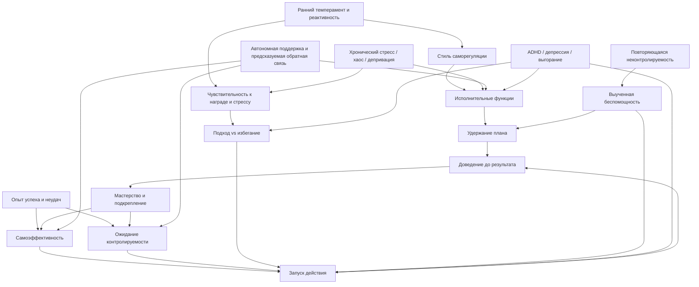
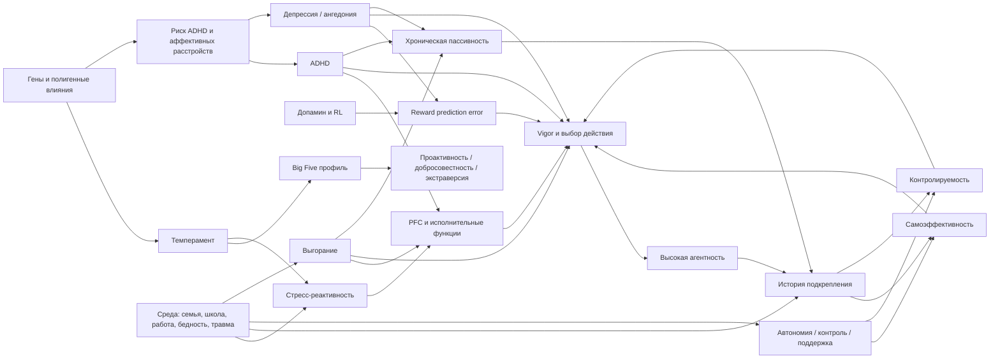

# Психологические и нейробиологические основы устойчивой инициативности и хронической пассивности

## Краткое резюме

Современная наука не поддерживает простую дихотомию "одни люди по природе бойцы, другие по природе тряпки". Устойчивая инициативность и хроническая пассивность лучше понимать как итог работы нескольких уровней сразу: темперамента, наследуемых различий личности, исполнительных функций, ожиданий контроля, истории подкрепления, социальной среды и клинических состояний. На одном полюсе чаще оказываются люди с более высоким самоконтролем, добросовестностью, самоэффективностью, проактивной установкой, сохранной рабочей памятью и тормозным контролем, а также с опытом того, что усилие обычно приносит результат. На другом полюсе чаще возникают сочетания низкой ожидаемой контролируемости, повторяющихся неудач, дефицитов внимания и исполнительного контроля, ангедонии, истощения, сильного стресса и сред, где инициатива системно не вознаграждается или прямо наказывается. Это не один "признак", а динамический контур агентности. citeturn46view0turn47view0turn0search1turn21search0turn18search5turn29search0turn22search20turn22search2turn9search3turn10search7

Наследственность важна, но не фатальна. В крупной мета-аналитической сводке по человеческим признакам средняя наследуемость была около 49%, а для личностных черт в другой мета-аналитической работе суммарная наследуемость была около 40%; при этом для детского темперамента близнецовые и приемные исследования стабильно показывают генетическое влияние, но также подчеркивают роль неразделяемой среды. Иначе говоря, вопрос "врожденное или приобретенное" поставлен слишком грубо: корректнее говорить "врожденные смещения плюс накопленный опыт плюс текущая среда и состояние". citeturn1search0turn6search0turn35search0turn35search2

Главная практическая мысль для книги такая: агентность изменяема. Не все источники поддаются изменению одинаково легко, но контролируемость можно учить, самоэффективность можно повышать, привычки усилия можно закреплять, исполнительные функции и организацию поведения можно частично улучшать, а депрессию, СДВГ и выгорание можно лечить или компенсировать. Даже личностные черты в среднем меняются под воздействием интервенций, причем в мета-анализе это сопровождалось заметным средним сдвигом порядка d = 0.37. citeturn37search0turn11search7turn40search0turn10search0turn10search1turn11search13

## Интегративная модель агентности и пассивности

Устойчивую инициативность удобно описывать как совмещение пяти процессов. Во-первых, человек должен ожидать, что его действия вообще влияют на исход; это линия "локуса контроля" и "контролируемости". Во-вторых, он должен верить, что способен выполнить действие; это линия самоэффективности. В-третьих, ему нужны энергетика и мотивационный уклон к приближению, а не только к избеганию. В-четвертых, должны быть доступны исполнительные механизмы: удержание цели, подавление отвлекающих импульсов, планирование, переключение. В-пятых, среда должна хотя бы иногда подкреплять инициативу, а не делать усилие статистически бессмысленным. Именно поэтому высокий уровень агентности редко объясняется одной чертой и почти никогда не сводится к "силе воли" в бытовом смысле. citeturn0search1turn46view0turn21search0turn22search20turn18search5turn29search0

Классическая работа Роттера ввела различие между внутренними и внешними ожиданиями контроля, а Bandura показал, что самоэффективность определяет, будет ли поведение вообще запущено, сколько усилий будет затрачено и как долго человек сохранит настойчивость при препятствиях. Это делает инициативность не просто "чертой", а когнитивно-мотивационной системой ожиданий: "мои действия что-то меняют" плюс "я умею это делать". Когда оба ожидания высоки, вероятность агентного поведения резко возрастает; когда оба низки, возрастает риск избегания, откладывания, зависимости от внешнего толчка и развития пассивности. citeturn0search1turn46view0turn47view0

Self-Determination Theory добавляет еще один важный слой: внутренняя, самоподдерживаемая мотивация лучше формируется там, где поддерживаются базовые психологические потребности в автономии, компетентности и связанности. Современные мета-анализы показывают, что поддержка автономии и других базовых потребностей тесно связана с удовлетворением этих потребностей и с более самодетерминированной мотивацией, в том числе в обучении и работе. Поэтому "инициативность" нельзя корректно объяснять только характером человека; она частично выращивается социальными контекстами, которые дают человеку опыт выбора, компетентности и предсказуемой обратной связи. citeturn21search0turn21search5turn7search35turn21search17

Проактивная личность в организационной психологии описывает склонность замечать возможности, инициировать изменения и не быть полностью детерминированным ситуацией. При этом более новые лонгитюдные данные показывают двустороннюю динамику: не только проактивность меняет рабочую среду, но и сама рабочая среда, особенно требования к работе и контроль над ней, со временем меняет уровень проактивности. Это особенно важно для книги: среда не просто "раскрывает" врожденный потенциал, она постепенно перенастраивает систему агентности. citeturn3search1turn28search4

Отсюда следует важное различие между "пассивностью как низкой нормой активности" и "пассивностью как патологией или выученным состоянием". У одних людей низкая инициативность отражает комбинацию низкой экстраверсии, умеренной добросовестности и меньшей потребности в новизне без выраженного страдания. У других та же внешняя картина возникает из-за СДВГ, депрессии, ангедонии, выгорания, длительного стресса, когнитивного истощения или выученной беспомощности. По внешнему поведению они могут выглядеть сходно, а по механизму и по стратегии помощи - принципиально различаются. citeturn24search2turn22search2turn9search3turn10search7turn18search5

## Биология, развитие и среда

Темперамент и личность дают стартовые смещения. В обзоре Rothbart темперамент описывается как система биологически укорененных индивидуальных различий в реактивности и саморегуляции, а в детской и подростковой личности Shiner и Caspi показывают, что ранние индивидуальные различия прослеживаются в измеряемых профилях темперамента и личности уже в детстве. Для темы инициативности особенно важны усилийный контроль, реактивность к вознаграждению, поведенческое приближение и негативная эмоциональность. Ребенок с более сильным усилийным контролем и меньшей дестабилизацией при стрессе с большей вероятностью накопит опыт успешного доведения дел до конца. citeturn35search3turn7search1turn35search0

Генетическое влияние на эти различия не является ни слабым, ни тотальным. Обобщающая мета-аналитическая работа Polderman по тысячам признаков показала существенную наследуемость человеческих вариаций в целом, а мета-анализ Vukasovic и Bratko по Big Five дал ориентир примерно в 40% для личностных черт. Исследования близнецов и обзоры по темпераменту также подчеркивают, что неразделяемая среда, то есть разные индивидуальные опыты даже внутри одной семьи, играет большую роль. Практический вывод: семейное воспитание важно, но одинаковое воспитание не делает детей одинаково агентными, потому что дети различаются в базовой реактивности, а затем по-разному отбирают и конструируют собственные среды. citeturn1search0turn6search0turn35search0turn35search2

Big Five особенно полезна потому, что добросовестность и, в ряде контекстов, экстраверсия систематически связаны с производительностью и инициативным поведением. Уже в классической мета-аналитической работе Barrick и Mount добросовестность показала устойчивую связь с критериями job performance в разных группах профессий, а экстраверсия была особенно полезна там, где работа требует активного социального взаимодействия. Дополнительные данные по contextual performance и voice behavior показывают, что добросовестность, экстраверсия и согласованность сильнее связаны с активным вкладом в общий процесс, чем с узко понимаемой задачной продуктивностью. Это делает добросовестность близкой к "тихой агентности", а экстраверсию - к более заметной, экспрессивной инициативности. citeturn45search1turn45search11turn28search6

Нейробиологически один из ключевых узлов - это связка дофамина, префронтальной коры и обучения по подкреплению. Schultz показал, что дофаминовые нейроны кодируют reward prediction error, то есть расхождение между ожидаемым и полученным вознаграждением, а Niv и коллеги связали тонический дофамин с "ценой упущенной возможности" и vigor, скоростью и энергией реагирования. На психологическом языке это означает, что инициативность подпитывается не только удовольствием от результата, но и самой статистикой среды: если мир в среднем вознаграждает действия, система учится действовать быстрее и энергичнее; если усилие систематически не окупается, vigor снижается. citeturn8search9turn8search2turn8search3

Префронтальная кора обеспечивает тот самый "ментальный каркас" агентности: рабочую память, подавление импульсов, удержание плана и гибкое переключение. В обзорах Miyake и Diamond исполнительные функции описаны как единая, но неоднородная система с тремя особенно важными компонентами: рабочая память, тормозный контроль и когнитивная гибкость. При этом Arnsten показывает, что PFC особенно чувствительна к стрессу: даже умеренный неконтролируемый стресс может быстро ухудшать высокоуровневые когнитивные функции. С учетом этого "ленивость" под нагрузкой часто оказывается не снижением морали, а временным коллапсом фронтального контроля. citeturn1search3turn22search20turn8search1turn33view4

К этой картине добавляется знаменитая inverted-U-модель дофамина и норадреналина: и слишком мало, и слишком много катехоламиновой активации ухудшают рабочую память и когнитивный контроль. Это особенно важно для книги, потому что общественная интуиция часто ошибочно предполагает линейную модель: "чем больше адреналина и драйва, тем выше результат". На самом деле и заторможенность, и перевозбуждение могут одинаково ломать агентность, просто по разным маршрутам. citeturn8search4turn33view4

Развитие идет по петлям обратной связи. В Dunedin cohort ранний самоконтроль предсказывал более благоприятные результаты для здоровья, финансового функционирования, зависимости и правонарушений, а последующие работы той же традиции показали, что детские темпераментные и поведенческие профили прослеживаются во взрослом возрасте. Это означает, что небольшие стартовые различия могут раздуваться за счет накопления успехов или неудач: более организованный ребенок получает больше мастерства, доверия и шансов; более дезорганизованный - больше наказаний, фрустрации и статуса "того, кто не справляется". Так формируется траектория, а не одноразовая судьба. citeturn7search0turn7search6turn7search15

Среда действует не абстрактно, а через конкретные механизмы: дефицит когнитивной стимуляции, бедность, семейный хаос, насилие, непредсказуемость, низкий контроль на работе, плохой сон, хронический стресс, слабую поддержку автономии. Исследования cumulative risk и Family Life Project показывают связи между социальным риском и исполнительными функциями у детей, а лонгитюдные мета-анализы по автономной поддержке указывают, что среда, которая помогает человеку чувствовать компетентность и субъектность, системно связана с лучшей мотивацией и благополучием. Поэтому "агентность" - это не только свойство мозга, но и свойство биографии. citeturn7search5turn7search21turn7search9turn7search35turn21search5

## Клинические состояния и механизмы срыва агентности

Выученная беспомощность остается центральной моделью для понимания хронической пассивности. С момента классического эксперимента Seligman и Maier стало ясно, что повторяющийся опыт неконтролируемости может приводить к дефицитам инициации действий и избегания даже там, где контроль позже появляется. Abramson, Seligman и Teasdale затем показали, что у людей решающее значение имеет не только сама неконтролируемость, но и то, как она объясняется: стабильными или нестабильными, глобальными или специфическими, внутренними или внешними причинами. Иначе говоря, пассивность - это не просто привычка, а часто стиль интерпретации собственной неуспешности. citeturn18search0turn46view1turn19search5

Современная нейронаука беспомощности уточнила, что мозг по умолчанию скорее учится беспомощности под неконтролируемым стрессом, а "урок контролируемости" должен быть активно закодирован. В линии работ Maier, Amat и коллег центральную роль играет медиальная префронтальная кора, которая при контролируемом стрессоре подавляет реактивность dorsal raphe nucleus и тем самым защищает от последующей пассивности и чрезмерного страха. Это очень сильная идея для книги: субъектность формируется не только позитивным обучением успеху, но и нейробиологическим опытом "я могу что-то сделать со стрессором". citeturn18search5turn8search0turn18search9

СДВГ - один из самых частых клинических маршрутов к хронической неинициативности и хаотической недоделанности, особенно у взрослых, которых в детстве не распознали. Современные обзоры и primer-статьи описывают СДВГ как пожизненное нейроразвитийное расстройство с большим вкладом генетики и с проблемами организации, устойчивого внимания, планирования, торможения и саморегуляции. Barkley еще в 1997 году построил модель, в которой поведенческое торможение связано с несколькими исполнительными функциями, а мета-анализ Willcutt показал, что у групп с ADHD есть надежные нарушения по всем EF-задачам с эффектами в среднем диапазоне, причем сильнее всего страдают response inhibition, vigilance, working memory и planning. Для темы агентности это критично: человек может не быть "пассивным" мотивационно, но систематически обрушивать выполнение на уровне запуска, удержания и завершения. citeturn22search2turn22search17turn22search0turn42search0

Модель Sonuga-Barke усилила это понимание, добавив к исполнительному дефициту отдельный мотивационный маршрут - delay aversion и нарушения оценки задержанного вознаграждения. Поэтому часть людей с ADHD выглядит не просто рассеянными, а именно невыносящими длинные траектории без частой обратной связи. Для книги это полезно, потому что объясняет, почему умный и мотивированный человек может делать рывки в кратких задачах и проваливаться в долгих многошаговых проектах. citeturn22search1turn22search6turn22search16

Депрессия бьет по агентности и через аффект, и через когницию, и через мотивацию. NICE прямо описывает депрессию как состояние с потерей позитивного аффекта, сниженным настроением и когнитивными, физическими и поведенческими симптомами. Мета-анализы Snyder и Rock показывают, что MDD сопровождается широкими нарушениями исполнительных функций, а обзоры Pizzagalli и Halahakoon подчеркивают ключевую роль ангедонии, нарушений reward bias, option valuation и reinforcement learning. Это значит, что депрессивная пассивность - не просто "не хочет", а часто комбинация сниженного ожидания удовольствия, сниженного энергетического запуска и ослабленного обучения на вознаграждении. citeturn33view0turn31search4turn43search0turn9search3turn9search6

Хронический стресс и ранняя депривация дополнительно ухудшают эту систему. Pizzagalli и Pechtel связывают стресс с изменениями в reward-системах и развитием ангедонии, а обзоры по early life stress и HPA-axis показывают долговременные последствия для регуляции стресса и риска психических расстройств. Это важная поправка против морализаторства: иногда то, что выглядит как "низкая воля", есть результат затянувшейся нейробиологической адаптации к среде, где усилие не окупалось, а стресс был хроническим. citeturn9search0turn9search8turn8search10

С выгоранием нужно быть особенно точным. WHO относит burnout в ICD-11 к occupational phenomenon, а не к медицинскому заболеванию, и определяет его через истощение, психическую дистанцию или цинизм по отношению к работе и снижение профессиональной эффективности. При этом ряд работ Bianchi, Schonfeld и Laurent показывает сильное перекрытие выгорания и депрессии и даже аргументирует, что значительная часть того, что измеряется как burnout, по сути близка к депрессивной симптоматике в рабочем контексте. Для книги отсюда следует важная развилка: снижение инициативы на работе нельзя автоматически считать "чисто характерологическим" или "чисто организационным"; нередко это перекрывающиеся процессы истощения, депрессии и утраты контролируемости. citeturn10search7turn17search0turn17search1turn17search16turn17search22

## Что реально меняется интервенциями

Самое надежное, что можно сказать: агентность меняется лучше всего там, где меняют одновременно поведение, ожидания и среду подкрепления. Bandura подчеркивал роль mastery experiences, а Eisenberger - то, что усилие, если оно систематически вознаграждается, может становиться "выученной трудолюбивостью", то есть переносимой склонностью сохранять усилие и на новые задачи. Современные экспериментальные работы по effort-contingent reward подтверждают, что люди могут научаться больше ценить усилие и даже испытывать большее удовольствие после него. Это делает неправдоподобной фаталистическую позицию "инициативность либо есть, либо нет". citeturn46view0turn29search0turn29search2turn29search3turn29search4

Для депрессии мощным маршрутом повышения агентности остается behavioral activation. Уже ранний мета-анализ показал большой посттестовый эффект около 0.87, а более поздние обзоры продолжают подтверждать, что BA эффективна против депрессивной симптоматики и одновременно повышает activation. В теоретическом плане это почти прямая анти-helplessness интервенция: человек получает структуру действий, предсказуемое выполнение, контакт с вознаграждением и восстановление связи "действие -> результат". citeturn40search0turn11search11turn11search30

Для взрослых с ADHD хорошая доказательная база есть у CBT как дополнения к медикаментам или как отдельной психосоциальной стратегии. Мета-анализы показывают средние и средне-крупные эффекты как по самооценке симптомов, так и по функциональным исходам; в более новом синтезе Young и коллег CBT была лучше waiting list с SMD около 0.76. На практике это означает, что хроническая недоведенность, забывчивость и "разбросанность" у части людей поддаются не увещеваниям, а структурированному обучению: внешние опоры, разбиение задач, time blocking, работа с отвлечением, мониторинг запуска и завершения. citeturn41search1turn41search3turn11search7turn11search9

Для личности в широком смысле наиболее важны данные Roberts и коллег: по 207 исследованиям интервенции сопровождались заметными изменениями personality trait measures, особенно в направлении эмоциональной стабильности и экстраверсии. Это не значит, что можно быстро "сделать любого человека другим", но значит, что черты не являются полностью закрытой системой. В книге это позволяет корректно соединить поведенческие и личностные уровни: терапия, обучение и среда не просто временно "натаскивают" человека, а при определенных условиях меняют и более общие диспозиции. citeturn37search0

Для выгорания эффект интервенций обычно скромнее, особенно если вмешательство ограничивается только индивидуальными техниками. Систематические обзоры по врачам показывают небольшие, но реальные улучшения, причем организационные стратегии часто дают лучший эффект, чем чисто индивидуальные. Это согласуется и с WHO-логикой, и с моделями work context: если источник беспомощности находится в низком контроле, перегрузке и конфликте ролей, невозможно полностью "вылечить" его одними mindfulness-протоколами. citeturn11search13turn11search23turn11search3turn17search6turn10search7

Официальные клинические рекомендации хорошо ложатся на ту же картину. NICE по ADHD требует распознавания, точной диагностики и комплексного менеджмента, а NICE по депрессии подчеркивает совместное принятие решений, надежду на восстановление, выбор психологических и фармакологических методов по тяжести состояния и значимость барьеров доступа, создаваемых симптомами и стигмой. Для книги это ценно тем, что показывает: современная клиническая практика уже не мыслит низкую агентность как моральный дефект; она мыслит ее как смесь функционального дефицита, опыта и контекста, который надо разбирать по частям. citeturn33view1turn33view0

## Сравнительная таблица и mermaid-схемы

Ниже дана рабочая сравнительная таблица для книги. Там, где по какому-то конструкту в этой подборке нет надежно верифицированной стандартной оценки наследуемости или единого "типичного" эффекта, я пометил это прямо, чтобы не создавать ложной точности.

| Конструкт | Рабочее определение | Типичные меры | Наследуемость | Типичные эффекты, важные для темы инициативности | Типичные интервенции |
|---|---|---|---|---|---|
| Темперамент | Биологически укорененные различия реактивности и саморегуляции; особенно важны effortful control, reward sensitivity, negative emotionality. citeturn35search3turn35search0 | IBQ, CBQ, ECBQ, ATQ; наблюдение, родительские отчеты. citeturn35search0turn35search3 | Умеренная; близнецовые и приемные исследования стабильно находят генетическое влияние, но велика роль неразделяемой среды. citeturn35search0turn1search0 | Нет одного канонического ES; в лонгитюдных когортах ранний self-control/temperament надежно предсказывает широкий спектр взрослых исходов. citeturn7search0turn7search6 | Поддержка саморегуляции, стабильная среда, навыки самоконтроля, сон, физическая активность, родительская автономная поддержка. citeturn7search35turn21search5 |
| Самоэффективность | Ожидание собственной способности выполнить действие и выдержать препятствия. citeturn46view0turn47view0 | General Self-Efficacy Scale, domain-specific efficacy scales. citeturn27search0turn27search3 | Нет общепринятой "trait h²" в этой подборке; конструкт частично диспозиционен, но сильно зависит от состояния и опыта mastery. citeturn46view0turn16search3 | Связь с work performance в старой мета-аналитике сильная; generalized self-efficacy в работе по core self-evaluations коррелировала с job performance около .23. citeturn13search0turn16search3 | Mastery experiences, моделирование, verbal persuasion, когнитивно-поведенческие техники, пошаговое наращивание контроля. citeturn46view0turn30search5turn30search16 |
| Выученная беспомощность | Пассивность и дефицит действия после опыта неконтролируемости; у людей сильно зависит от атрибуций причин. citeturn18search0turn46view1turn19search5 | Attributional Style Questionnaire, Learned Helplessness Scale, экспериментальные paradigms controllability. citeturn18search17turn19search5 | Для феномена как такового стандартной h²-оценки нет; это скорее learning-state и cognitive style, чем единая черта. citeturn18search5turn46view1 | Единый "типичный ES" отсутствует; эффект надежно проявляется экспериментально и транслируется в depression-like passivity. citeturn18search0turn18search5 | Attributional retraining, поведенческая активация, graded mastery, восстановление controllability, CBT. citeturn18search5turn40search0turn10search1 |
| Добросовестность | Big Five-черта, связанная с организованностью, ответственностью, настойчивостью, goal orientation. citeturn24search2turn45search14 | NEO-PI-R, BFI/BFI-2, IPIP Big Five. citeturn24search2 | Около 40% в суммарных оценках личностных черт; для отдельных факторных доменов варьирует. citeturn6search0turn1search0 | Устойчивый предиктор job performance; в более поздних сводках для overall performance типично около .20-.24. citeturn45search1turn44search8 | Долгие поведенческие практики, терапия, социальные роли, структурирование среды; trait change возможен. citeturn37search0turn7search2 |
| Исполнительные функции | Рабочая память, тормозный контроль, когнитивная гибкость; когнитивный каркас саморегуляции и доведения дел до конца. citeturn1search3turn22search20 | Stroop, Go/No-Go, Stop-Signal, n-back, WCST, Tower tasks, BRIEF/BRIEF-A. citeturn1search3turn22search20 | Для латентного common EF в близнецовых моделях наследуемость высокая; на уровне отдельных задач оценки ниже и шумнее. citeturn5search2turn1search0 | В ADHD дефициты по EF-задачам обычно medium range, примерно .46-.69. При депрессии дефициты по EF умеренные. citeturn42search0turn43search0 | Сон, снижение стресса, exercise, структурирование среды, лечение ADHD/депрессии, часть видов cognitive remediation. citeturn8search1turn22search31turn31search3 |
| ADHD | Нейроразвитийное расстройство с нарушениями внимания, торможения, организации, самоконтроля и часто мотивации к отсроченному вознаграждению. citeturn22search2turn22search0turn22search1 | DSM/ICD-диагностика, клиническое интервью, rating scales, EF testing. citeturn10search0turn22search2 | Обычно 60-80% по обзорам. citeturn6search31turn22search17 | EF-дефициты medium range; CBT для взрослых показывает moderate-to-large effects, one synthesis SMD ~0.76 vs waiting list. citeturn42search0turn41search1turn41search3 | Стимулянты и другие препараты, CBT, coaching, внешние системы организации, exercise. citeturn10search0turn41search1turn22search26 |
| Депрессия | Снижение позитивного аффекта, low mood, когнитивные, физические и поведенческие симптомы; часто ангедония и снижение reward learning. citeturn33view0turn9search3turn9search6 | PHQ-9, HAM-D, BDI, клиническое интервью; reward tasks, EF tests. citeturn33view0turn9search3 | В этой подборке точная h²-оценка не сверялась; для книги надежнее подчеркивать умеренную наследственную предрасположенность плюс стрессовые и когнитивные механизмы, а не выводить точное число. | Мета-анализы дают умеренные когнитивные дефициты; reward bias, option valuation и reinforcement learning также нарушены. BA и CBT эффективны, BA в ранней мета-аналитике дала ES ~0.87. citeturn43search0turn9search6turn40search0turn40search7 | CBT, BA, antidepressants, exercise, лечение ангедонии и когнитивных нарушений, снижение стресса. citeturn10search1turn40search0turn40search7 |

Ниже две mermaid-схемы, которые можно почти без изменений вставлять в рабочий материал книги. Они синтезируют линии Bandura, Seligman-Maier-Abramson, SDT, EF-модели, dopamine/RL и клинические контуры ADHD-депрессии-выгорания. citeturn46view0turn46view1turn18search5turn21search0turn22search20turn8search9turn8search3turn22search2turn9search3turn10search7

## Аннотированная библиография

### Теории агентности, контроля и беспомощности

*Self-efficacy: Toward a Unifying Theory of Behavioral Change*. Albert Bandura. 1977. Psychological Review, 84(2), 191-215. DOI: 10.1037/0033-295X.84.2.191. Поиск: `Bandura 1977 self-efficacy toward a unifying theory of behavioral change pdf`. Тема: самоэффективность как центральный механизм запуска действия, усилия и настойчивости. Для книги это базовый источник, потому что он непосредственно связывает инициативу с ожиданием способности действовать. Где смотреть: стартовая стр. 191, особенно первый абзац; ранние страницы статьи по источникам самоэффективности. Короткий фрагмент: "how much effort" и "four principal sources". citeturn46view0turn47view0

*Generalized expectancies for internal versus external control of reinforcement*. Julian B. Rotter. 1966. Psychological Monographs, 80(1), 1-28. DOI: 10.1037/h0092976. Поиск: `Rotter 1966 generalized expectancies internal external control reinforcement`. Тема: locus of control. Полезность: дает язык для различия между людьми, ожидающими субъектного влияния на исход, и людьми, ожидающими внешнего управления собственной жизнью. Где смотреть: в начале статьи, формулировка generalized expectancy; статья целиком короткая и концептуально плотная. Короткий фрагмент: "internal versus external control". citeturn0search1

*Self-determination theory and the facilitation of intrinsic motivation, social development, and well-being*. Edward L. Deci, Richard M. Ryan. 2000. American Psychologist, 55(1), 68-78. DOI: 10.1037/0003-066X.55.1.68. Поиск: `Deci Ryan 2000 self-determination theory intrinsic motivation pdf`. Тема: автономия, компетентность, связанность. Для книги важна потому, что соединяет инициативность не только с чертой личности, но и с социальной поддержкой автономии и компетентности. Где смотреть: Abstract и ранние разделы с тремя базовыми потребностями. Короткий фрагмент: "autonomy, competence, and relatedness". citeturn21search0

*The proactive component of organizational behavior: A measure and correlates*. Thomas S. Bateman, J. Michael Crant. 1993. Journal of Organizational Behavior, 14(2), 103-118. DOI: 10.1002/job.4030140202. Поиск: `Bateman Crant 1993 proactive component organizational behavior DOI`. Тема: проактивная личность. Полезность: один из исходных текстов для концепта "человек сам инициирует изменения и не полностью определяется ситуацией". Где смотреть: вводные разделы и описание шкалы proactive personality. Короткий фрагмент: "proactive component". citeturn3search1

*Failure to escape traumatic shock*. Martin E. P. Seligman, Steven F. Maier. 1967. Journal of Experimental Psychology, 74(1), 1-9. DOI: 10.1037/h0024514. Поиск: `Failure to escape traumatic shock 1967 Maier Seligman`. Тема: исходный эксперимент по learned helplessness. Для книги это первичный эмпирический источник идеи, что опыт неконтролируемости ломает последующее действие. Где смотреть: весь текст короткий; особенно результаты по failure to escape. Короткий фрагмент: "failure to escape". citeturn18search0

*Learned Helplessness in Humans: Critique and Reformulation*. Lyn Y. Abramson, Martin E. P. Seligman, John D. Teasdale. 1978. Journal of Abnormal Psychology, 87(1), 49-74. DOI: 10.1037/0021-843X.87.1.49. Поиск: `Abramson Seligman Teasdale 1978 learned helplessness in humans critique and reformulation pdf`. Тема: атрибутивная переработка теории беспомощности. Полезность: ключевой мост от animal model к человеческой пассивности, депрессивным стилям объяснения и устойчивости симптомов. Где смотреть: стр. 49, первый абзац; далее разделы о stable/unstable, global/specific, internal/external причинах. Короткий фрагмент: "global or specific" и "internal or external". citeturn46view1turn47view1

*Learned helplessness at fifty: Insights from neuroscience*. Steven F. Maier, Martin E. P. Seligman. 2016. Psychological Review, 123(4), 349-367. DOI: 10.1037/rev0000033. Поиск: `Maier Seligman 2016 learned helplessness at fifty neuroscience`. Тема: современная нейронаучная версия learned helplessness. Для книги особенно ценно то, что авторы переопределяют роль controllability и показывают нейроцепи vmPFC-DRN. Где смотреть: Abstract; средние разделы о controllability detection и neural circuitry. Короткий фрагмент: "insights from neuroscience". citeturn18search5

*Learned industriousness*. Robert Eisenberger. 1992. Psychological Review, 99(2), 248-267. DOI: 10.1037/0033-295X.99.2.248. Поиск: `Eisenberger 1992 learned industriousness DOI`. Тема: выученная трудолюбивость. Полезность: редкий, но крайне полезный контрапункт к learned helplessness; показывает, как вознаграждаемое усилие может закреплять дальнейшую настойчивость. Где смотреть: Abstract и начальные теоретические страницы. Короткий фрагмент: "rewarded effort". citeturn29search0

### Темперамент, личность, наследуемость и развитие

*Temperament and personality: origins and outcomes*. Mary K. Rothbart, Douglas Derryberry, Karen C. Posner. 2000. Journal of Personality and Social Psychology special issue / related review entry. Поиск: `Rothbart temperament and personality origins and outcomes 2000`. Тема: связь темперамента и личности. Полезность: помогает аккуратно соединить раннюю реактивность с взрослой инициативностью без грубого биологизаторства. Где смотреть: обзорные разделы о biologically based individual differences и self-regulation. Короткий фрагмент: "origins and outcomes". citeturn35search3

*Behavioral genetics and child temperament*. Kimberly J. Saudino. 2005. Journal of Developmental & Behavioral Pediatrics, 26(3), 214-223. DOI: 10.1097/00004703-200506000-00010. Поиск: `Saudino 2005 behavioral genetics child temperament pdf`. Тема: поведенческая генетика темперамента. Для книги полезна тем, что дает осторожный, но твердый ответ на вопрос о врожденной компоненте и роли неразделяемой среды. Где смотреть: Abstract; разделы о genetic continuity and environmental change. Короткий фрагмент: "genetically influenced". citeturn35search0

*Meta-analysis of the heritability of human traits based on fifty years of twin studies*. Benjamin M. Polderman et al. 2015. Nature Genetics, 47(7), 702-709. DOI: 10.1038/ng.3285. Поиск: `Polderman 2015 heritability human traits twin meta-analysis`. Тема: общая карта наследуемости человеческих признаков. Полезность: дает макрорамку против ложной оппозиции "все от генов" против "все от среды". Где смотреть: Abstract; таблицы и figures по усредненной наследуемости. Короткий фрагмент: "fifty years of twin studies". citeturn1search0

*Heritability of personality: A meta-analysis of behavior genetic studies*. Tena Vukasovic, Denis Bratko. 2015. Psychological Bulletin. DOI: 10.1037/bul0000017. Поиск: `Vukasovic Bratko 2015 heritability personality meta-analysis`. Тема: наследуемость Big Five. Полезность: лучшая короткая опора для главы о том, что личность умеренно наследуема, но не запрограммирована жестко. Где смотреть: Abstract и summary tables. Короткий фрагмент: "heritability of personality". citeturn6search0

*An introduction to the five-factor model and its applications*. Robert R. McCrae, Oliver P. John. 1992. Journal of Personality, 60(2), 175-215. DOI: 10.1111/j.1467-6494.1992.tb00970.x. Поиск: `McCrae John 1992 five-factor model applications`. Тема: Big Five как общая карта личности. Полезность: дает самый удобный общий словарь для описания добросовестности, экстраверсии, нейротизма и т.д. Где смотреть: Abstract и вводные разделы с определениями факторов. Короткий фрагмент: "five basic dimensions". citeturn24search2

*The Big Five Personality Dimensions and Job Performance: A Meta-Analysis*. Murray R. Barrick, Michael K. Mount. 1991. Personnel Psychology, 44(1), 1-26. DOI: 10.1111/j.1744-6570.1991.tb00688.x. Поиск: `Barrick Mount 1991 big five job performance meta-analysis`. Тема: связи Big Five с работой и задачной эффективностью. Для книги полезна как одно из лучших оснований для тезиса, что добросовестность - статистически один из самых последовательных предикторов доведения дел до результата. Где смотреть: абстракт и итоговые таблицы; отдельно результаты по conscientiousness и extraversion. Короткий фрагмент: "consistent relations" и "valid predictor". citeturn45search1turn45search11

*Toward a theory of the biological basis of personality traits*. Colin G. DeYoung. 2010. Psychological Bulletin, 136(5), 768-795. DOI: 10.1037/a0019668. Поиск: `DeYoung 2010 biological basis of personality traits`. Тема: биология Big Five, включая reward systems и control systems. Полезность: хороший мост между trait-психологией и нейробиологией инициативы, особенно для экстраверсии, добросовестности и нейротизма. Где смотреть: Abstract и разделы о cybernetic theory and trait biology. Короткий фрагмент: "biological basis". citeturn2search1

*Unity and diversity of executive functions and their contributions to complex "Frontal Lobe" tasks: A latent variable analysis*. Akira Miyake et al. 2000. Cognitive Psychology, 41(1), 49-100. DOI: 10.1006/cogp.1999.0734. Поиск: `Miyake 2000 unity and diversity executive functions`. Тема: структура исполнительных функций. Полезность: это canonical text для разбора того, почему у человека может быть сохранен один контур саморегуляции и проседать другой. Где смотреть: Abstract; sections on updating, shifting, inhibition. Короткий фрагмент: "unity and diversity". citeturn1search3

*Executive functions*. Adele Diamond. 2013. Annual Review of Psychology, 64, 135-168. DOI: 10.1146/annurev-psych-113011-143750. Поиск: `Diamond 2013 executive functions`. Тема: обзор EF, развития и интервенций. Для книги полезна как главная обзорная точка по рабочей памяти, торможению и когнитивной гибкости. Где смотреть: Abstract и разделы про core EFs; часть об операционализации и развитии. Короткий фрагмент: "think before acting". citeturn22search20

*Individual differences in executive functions are almost entirely genetic in origin*. Naomi P. Friedman et al. 2008. Journal of Experimental Psychology: General, 137(2), 201-225. DOI: 10.1037/0096-3445.137.2.201. Поиск: `Friedman 2008 executive functions almost entirely genetic in origin`. Тема: наследуемость латентного common EF. Полезность: нужен, чтобы не недооценить врожденную компоненту в когнитивном контроле, но одновременно различать латентные EF и шумные task scores. Где смотреть: Abstract и structural model results. Короткий фрагмент: "almost entirely genetic". citeturn5search2

*A gradient of childhood self-control predicts health, wealth, and public safety*. Terrie E. Moffitt et al. 2011. PNAS, 108(7), 2693-2698. DOI: 10.1073/pnas.1010076108. Поиск: `Moffitt 2011 childhood self-control health wealth public safety`. Тема: долговременные последствия раннего самоконтроля. Для книги это сильнейшая эмпирическая опора на развитие агентности как жизненной траектории. Где смотреть: Abstract; Figure 1 и основные regression tables. Короткий фрагмент: "predicts health, wealth". citeturn7search0

*Personality continuities from childhood to adulthood in a longitudinal birth cohort*. Avshalom Caspi, Phil A. Silva et al. 2000. Journal of Personality and Social Psychology. Поиск: `Caspi personality continuities from childhood to adulthood longitudinal birth cohort`. Тема: непрерывность темперамента/личности с раннего детства. Полезность: показывает, что уже в 3 года появляются профили, имеющие отдаленные взрослые корреляты. Где смотреть: Abstract и sections on temperament groups. Короткий фрагмент: "continuities from childhood". citeturn7search6

### Нейробиология контроля, стресса и вознаграждения

*Stress signalling pathways that impair prefrontal cortex structure and function*. Amy F. T. Arnsten. 2009. Nature Reviews Neuroscience, 10(6), 410-422. DOI: 10.1038/nrn2648. Поиск: `Arnsten 2009 stress signalling pathways impair prefrontal cortex`. Тема: как стресс выключает PFC. Полезность: практически идеальный источник для объяснения, почему под неконтролируемым стрессом человек теряет планирование, рабочую память и самоконтроль. Где смотреть: Abstract; Figure 2 по inverted-U; Figure 3 по intracellular pathways. Короткий фрагмент: "quite mild acute uncontrollable stress" и "inverted U-shaped". citeturn33view4turn8search1

*Medial prefrontal cortex determines how stressor controllability affects behavior and dorsal raphe nucleus*. Jordi Amat et al. 2005. Nature Neuroscience, 8(3), 365-371. DOI: 10.1038/nn1399. Поиск: `Amat 2005 stressor controllability dorsal raphe medial prefrontal cortex`. Тема: нейромаршрут controllability. Полезность: лучший первичный источник для главы о том, что опыт контроля биологически "вшивается" как защита от беспомощности. Где смотреть: Abstract и result sections on mPFC manipulation. Короткий фрагмент: "stressor controllability". citeturn8search0

*A neural substrate of prediction and reward*. Wolfram Schultz, Peter Dayan, P. Read Montague. 1997. Science, 275(5306), 1593-1599. DOI: 10.1126/science.275.5306.1593. Поиск: `Schultz Dayan Montague 1997 neural substrate prediction reward`. Тема: reward prediction error. Полезность: фундамент для объяснения, как мозг учится на успехах и неудачах и почему это важно для инициативы. Где смотреть: Abstract и discussion. Короткий фрагмент: "prediction and reward". citeturn8search9

*Tonic dopamine: opportunity costs and the control of response vigor*. Yael Niv, Nathaniel D. Daw, Dan Joel, Peter Dayan. 2007. Psychopharmacology, 191(3), 507-520. DOI: 10.1007/s00213-006-0502-4. Поиск: `Niv 2007 tonic dopamine opportunity costs response vigor`. Тема: дофамин и vigor. Полезность: напрямую связывает статистику вознаграждения с энергией и скоростью действия; очень полезно для объяснения "психической тяги к действию". Где смотреть: Abstract, особенно results/conclusions. Короткий фрагмент: "control of response vigor". citeturn8search3

*Inverted-U-shaped dopamine actions on human working memory and cognitive control*. Roshan Cools, Mark D'Esposito. 2011. Biological Psychiatry, 69(12), e113-e125. DOI: 10.1016/j.biopsych.2011.03.028. Поиск: `Cools D'Esposito 2011 inverted U dopamine working memory cognitive control`. Тема: нелинейное влияние дофамина на контроль. Полезность: не дает свалиться в упрощение "больше дофамина = больше продуктивности". Где смотреть: Abstract и sections on baseline-dependence. Короткий фрагмент: "inverted-U-shaped". citeturn8search4

### ADHD, депрессия, выгорание и смежные контуры

*Constructing a unifying theory of ADHD*. Russell A. Barkley. 1997. Psychological Bulletin, 121(1), 65-94. DOI: 10.1037/0033-2909.121.1.65. Поиск: `Barkley 1997 unifying theory ADHD`. Тема: ингибиция и EF в ADHD. Полезность: классический текст, объясняющий, почему хроническая неорганизованность и недоведенность при ADHD не равны "слабому характеру". Где смотреть: Abstract и sections connecting inhibition to EF. Короткий фрагмент: "links inhibition". citeturn22search0

*The dual pathway model of AD/HD: an elaboration of neuro-developmental characteristics*. Edmund J. S. Sonuga-Barke. 2003. Neuroscience & Biobehavioral Reviews, 27(7), 593-604. DOI: 10.1016/j.neubiorev.2003.08.005. Поиск: `Sonuga-Barke 2003 dual pathway model ADHD`. Тема: исполнительный и мотивационный контуры ADHD. Полезность: особенно хорош для книги, потому что добавляет к EF-дефициту delay aversion и reward-based route. Где смотреть: Abstract и early theoretical sections. Короткий фрагмент: "dual pathway model". citeturn22search1

*Validity of the executive function theory of ADHD: A meta-analytic review*. Erik G. Willcutt et al. 2005. Biological Psychiatry / related source. DOI: 10.1016/j.biopsych.2005.02.006. Поиск: `Willcutt 2005 executive function theory ADHD meta-analysis`. Тема: эмпирическая сила EF-объяснения ADHD. Полезность: дает удобные ориентиры по effect sizes и списку наиболее поражаемых функций. Где смотреть: Abstract, summary tables. Короткий фрагмент: "medium range (.46-.69)". citeturn42search0

*Attention-deficit/hyperactivity disorder*. Stephen V. Faraone et al. 2024. Nature Reviews Disease Primers, 10(1), 11. DOI: 10.1038/s41572-024-00495-0. Поиск: `Faraone 2024 ADHD Nat Rev Dis Primers`. Тема: современный общий reference по ADHD. Полезность: лучший компактный источник для этиологии, течения, нейробиологии и лечения, который можно цитировать в книге как актуальный обзор. Где смотреть: primer abstract и разделы по causes, outcomes and management. Короткий фрагмент: "recognising ... adults" у NICE и современный primer вместе дают полный клинический контур. citeturn22search2turn33view1

*208 Evidence-based conclusions about the disorder*. Stephen V. Faraone et al. 2021. Neuroscience & Biobehavioral Reviews. DOI: 10.1016/j.neubiorev.2021.01.022. Поиск: `208 evidence-based conclusions ADHD 2021 Faraone`. Тема: сжатая карта того, что по ADHD можно считать твердо установленным. Полезность: отличный "sanity check" для главы, чтобы отделить устойчивые знания от спорных гипотез. Где смотреть: Abstract и box-like list of conclusions. Короткий фрагмент: "supported by meta-analysis". citeturn22search17

*Toward a Better Understanding of the Mechanisms and Pathophysiology of Anhedonia: Are We Ready for Translation?* Diego A. Pizzagalli. 2022. American Journal of Psychiatry, 179(7), 458-469. DOI: 10.1176/appi.ajp.20220423. Поиск: `Pizzagalli 2022 pathophysiology of anhedonia`. Тема: ангедония, reward circuitry, профилактика и лечение. Полезность: один из лучших современных источников о том, почему депрессия подтачивает инициативу именно через reward-system dysfunction. Где смотреть: Abstract; Figure 1 по subprocesses of reward processing; Figure 2 по neural abnormalities. Короткий фрагмент: "poor disease course". citeturn9search3

*Reward-Processing Behavior in Depressed Participants Relative to Healthy Volunteers: A Systematic Review and Meta-analysis*. D. C. Halahakoon et al. 2020. JAMA Psychiatry / similar indexed source. DOI: 10.1001/jamapsychiatry.2020.2139. Поиск: `Halahakoon 2020 reward processing depressed participants meta-analysis`. Тема: reward bias, valuation, reinforcement learning при депрессии. Полезность: систематическая количественная опора для заявлений о снижении reward-based agency в депрессии. Где смотреть: Abstract и outcome categories. Короткий фрагмент: "reinforcement learning". citeturn9search6

*Cognitive impairment in depression: a systematic review and meta-analysis*. Philip L. Rock et al. 2014. Psychological Medicine, 44(10), 2029-2040. DOI: 10.1017/S0033291713002535. Поиск: `Rock 2014 cognitive impairment depression meta-analysis`. Тема: когнитивные нарушения в депрессии. Полезность: дает аккуратную эмпирическую базу против тезиса, что депрессия - "только настроение". Где смотреть: Abstract и domain-specific results. Короткий фрагмент: "moderate cognitive deficits". citeturn43search0

*Job burnout*. Christina Maslach, Wilmar B. Schaufeli, Michael P. Leiter. 2001. Annual Review of Psychology, 52, 397-422. DOI: 10.1146/annurev.psych.52.1.397. Поиск: `Maslach Schaufeli Leiter 2001 job burnout`. Тема: классическая модель выгорания. Полезность: базовый текст по эмоциональному истощению, деперсонализации и снижению личных достижений. Где смотреть: Abstract и sections on the three dimensions. Короткий фрагмент: "job burnout". citeturn17search0

*Burn-out an occupational phenomenon*. World Health Organization. Updated FAQ / ICD-11 framing. Поиск: `WHO burnout occupational phenomenon ICD-11`. Тема: официальный статус burnout. Полезность: позволяет в книге быть терминологически точным и не называть burnout полноценным медицинским диагнозом в ICD-11. Где смотреть: определение WHO и три компонента. Короткий фрагмент: "not classified as a medical condition". citeturn10search7

*Burnout-depression overlap: a review*. Renzo Bianchi, Irvin Sam Schonfeld, Eric Laurent. 2015. Clinical Psychology Review, 36, 28-41. DOI: 10.1016/j.cpr.2015.01.004. Поиск: `Bianchi Schonfeld Laurent 2015 burnout depression overlap review`. Тема: перекрытие burnout и depression. Полезность: важный корректирующий источник, чтобы не романтизировать "выгорание" как нечто полностью отдельное от депрессии. Где смотреть: Abstract и conclusion. Короткий фрагмент: "overlap". citeturn17search1

### Интервенции, изменение личности и официальные рекомендации

*A systematic review of personality trait change through intervention*. Brent W. Roberts et al. 2017. Psychological Bulletin, 143(2), 117-141. DOI: 10.1037/bul0000088. Поиск: `Roberts 2017 personality trait change intervention`. Тема: изменяемость черт личности. Полезность: один из самых ценных источников для главы о том, что даже устойчивые диспозиции не полностью фиксированы. Где смотреть: Abstract; особое внимание к среднему d = .37 и различиям между trait domains. Короткий фрагмент: "marked changes". citeturn37search0

*Meta-analysis of cognitive-behavioral treatments for adult ADHD*. Laurie E. Knouse et al. 2017. Journal of Consulting and Clinical Psychology / similar indexed source. DOI: 10.1037/ccp0000216. Поиск: `Knouse 2017 meta-analysis cognitive behavioral treatments adult ADHD`. Тема: эффективность CBT у взрослых с ADHD. Полезность: дает численные эффекты для психотерапевтического восстановления агентности при ADHD. Где смотреть: Abstract и outcome breakdown. Короткий фрагмент: "medium-to-large effects". citeturn41search1

*The Efficacy of Cognitive Behavioral Therapy for Adults With ADHD: A Systematic Review and Meta-Analysis of Randomized Controlled Trials*. Zhen Young et al. 2020. Journal of Attention Disorders / similar indexed source. DOI: 10.1177/1087054719852258. Поиск: `Young 2020 efficacy CBT adults ADHD meta-analysis`. Тема: RCT-данные по CBT при adult ADHD. Полезность: удобный второй источник для количественной части о восстановлении организационной агентности. Где смотреть: Abstract; comparison with waiting list. Короткий фрагмент: "SMD = 0.76". citeturn41search3

*Behavioral activation treatments of depression: a meta-analysis*. Jacobson / Cuijpers line, 2007. Clinical Psychology Review, 27(3), 318-326. DOI: 10.1016/j.cpr.2006.11.001. Поиск: `behavioral activation treatments depression meta-analysis 2007`. Тема: BA при депрессии. Полезность: один из самых практических источников для темы "как возвращать человека в действие". Где смотреть: Abstract и pooled effect size. Короткий фрагмент: "effect size ... 0.87". citeturn40search0

*Interventions to prevent and reduce physician burnout: a systematic review and meta-analysis*. Colin P. West et al. 2016. The Lancet, 388(10057), 2272-2281. DOI: 10.1016/S0140-6736(16)31279-X. Поиск: `West 2016 physician burnout systematic review meta-analysis`. Тема: интервенции при выгорании. Полезность: хороший источник для честного вывода, что индивидуальные меры помогают, но эффект обычно скромный и системный. Где смотреть: Abstract и summary tables. Короткий фрагмент: "prevent and reduce burnout". citeturn11search13

*Controlled Interventions to Reduce Burnout in Physicians: A Systematic Review and Meta-analysis*. Maria Panagioti et al. 2017. JAMA Internal Medicine. DOI: 10.1001/jamainternmed.2016.7674. Поиск: `Panagioti 2017 burnout physicians meta-analysis`. Тема: size of effect burnout interventions. Полезность: подтверждает, что benefits обычно small and real, особенно полезно для раздела о границах индивидуальных техник. Где смотреть: Abstract и subgroup results. Короткий фрагмент: "small benefits". citeturn39search0

*Reciprocal relationship between proactive personality and work characteristics: a latent change score approach*. Wen-Dong Li et al. 2014. Journal of Applied Psychology, 99(5), 948-965. DOI: 10.1037/a0036169. Поиск: `Li Fay Frese Harms Gao 2014 proactive personality work characteristics`. Тема: двусторонняя динамика личности и среды. Полезность: блестящий источник для утверждения, что инициативность и среда взаимно выращивают друг друга. Где смотреть: Abstract; sections on job demands and job control. Короткий фрагмент: "reciprocal relationship". citeturn28search4

*NICE Guideline NG87: Attention deficit hyperactivity disorder: diagnosis and management*. National Institute for Health and Care Excellence. 2018, reviewed 2025. Поиск: `NICE NG87 ADHD diagnosis and management`. Тема: официальное руководство по ADHD для детей, подростков и взрослых. Полезность: обязательный официальный источник для раздела о клинической дифференциации "пассивности" и "исполнительной дисфункции". Где смотреть: Overview; recommendations on recognition, diagnosis, managing ADHD, medication, adherence. Короткий фрагмент: "children, young people and adults". citeturn33view1

*NICE Guideline NG222: Depression in adults: treatment and management*. National Institute for Health and Care Excellence. 2022, reviewed 2026. Поиск: `NICE NG222 depression in adults treatment and management`. Тема: официальное руководство по депрессии. Полезность: дает клинически строгую опору для описания депрессивной пассивности и легитимных путей лечения. Где смотреть: Overview, definitions of depression and severity, principles of care, choice of treatments; в NCBI Bookshelf удобно смотреть lines 63-105 и 242-254. Короткий фрагмент: "loss of interest and enjoyment". citeturn33view0

### Русскоязычные ориентиры

*Что такое "executive functions" и их развитие в онтогенезе*. Е. И. Николаева. 2017. Русскоязычный обзор, CyberLeninka. Поиск: точное название статьи. Тема: перевод и развитие понятия executive functions в русскоязычном контексте. Полезность: хороший русскоязычный обзор для главы о саморегуляции, если нужен отечественный понятийный аппарат. Где смотреть: вводные разделы с обсуждением перевода термина и его состава. Короткий фрагмент: "их развитие в онтогенезе". citeturn25search1

*Теоретико-методологический анализ исследований выученной беспомощности: актуальность психосоматического подхода*. О. В. Волкова. 2013. CyberLeninka. Поиск: точное название статьи. Тема: русскоязычный обзор выученной беспомощности. Полезность: пригоден для русской терминологии, связанной с беспомощностью, жертвенной позицией и психосоматическими аспектами. Где смотреть: обзорные разделы и заключение. Короткий фрагмент: "убежденностью личности". citeturn25search0

*Соотношение личностной беспомощности и смежных с ней психологических феноменов*. Д. А. Циринг. 2009. CyberLeninka. Поиск: точное название статьи. Тема: различие между личностной беспомощностью, выученной беспомощностью и родственными конструктами. Полезность: полезен, если в книге нужно развести "ситуативную беспомощность" и более стабильную личностную конфигурацию. Где смотреть: разделы со сравнительным анализом терминов. Короткий фрагмент: "звено в цепочке". citeturn25search18

*Современные подходы к коррекции выученной беспомощности у детей и подростков*. Д. А. Циринг. 2008. CyberLeninka. Поиск: точное название статьи. Тема: коррекция helplessness в отечественной литературе. Полезность: пригоден для практического русскоязычного раздела о психокоррекционных программах и профилактике пассивности. Где смотреть: вводные классификации проявлений и коррекционные предложения. Короткий фрагмент: "склонности к чувству вины". citeturn25search15

*Синдром эмоционального выгорания. Взгляд психолога и невролога*. О. Е. Баксанский и соавт. 2021. Обзор литературы, CyberLeninka. Поиск: точное название статьи. Тема: русскоязычный обзор burnout. Полезность: хорош для отечественного читателя и для аккуратного изложения симптомов истощения без англоязычной терминологической перегрузки. Где смотреть: разделы о проявлениях и диагностическом понимании синдрома. Короткий фрагмент: "истощенным морально, умственно и физически". citeturn25search2

## Ограничения и открытые вопросы

Этот отчет собран как высоконадежное "ядро" литературы для книги, а не как исчерпывающий каталог всех существующих статей. Я сознательно делал упор на семинальные первоисточники, meta-analysis, систематические обзоры и официальные руководства. По нескольким темам, прежде всего по точным современным оценкам наследуемости для депрессии и по некоторым более узким геномным находкам для конкретных профилей проактивности, здесь лучше не создавать иллюзии точности: такие числа требуют отдельной специализированной сводки psychiatric genetics. Кроме того, русскоязычная литература по этим темам чаще представлена обзорами и концептуальными статьями, а не первичными крупными longitudinal или twin studies.

Главные нерешенные вопросы для науки сегодня такие. Во-первых, что является наиболее каузальным предиктором агентности: reward sensitivity, self-efficacy, EF, social reinforcement или их конкретные комбинации. Во-вторых, можно ли надежно выделить подтипы хронической пассивности по механизму, а не только по симптомам. В-третьих, насколько далеко простирается перенос "выученной трудолюбивости" между доменами. В-четвертых, какие интервенции реально меняют не только симптомы, но и долгосрочную вероятность самоинициированного действия в реальной жизни, а не только на шкалах и когнитивных тестах.
