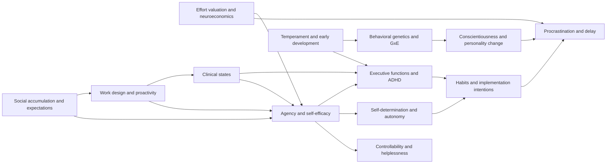
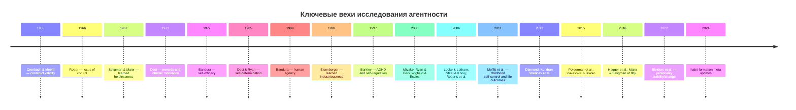

# Исчерпывающая карта первоисточников по индивидуальной агентности

## Executive summary

По состоянию на **14 июня 2026 года** надёжная научная литература не поддерживает ни простую схему «всё врождённое», ни простую схему «всё воспитание». Индивидуальная агентность — то есть способность начинать действие, удерживать цель, регулировать усилие, доводить дело до конца и извлекать уроки из обратной связи — складывается как минимум из семи уровней: **убеждений о собственной эффективности и контроле**, **качества мотивации**, **исполнительных функций и внимания**, **темперамента и раннего развития**, **генетической и средовой чувствительности**, **личностных черт и привычек**, а также **социального дизайна среды и клинических состояний**. Внутри современной литературы это лучше всего подтверждают линии Bandura, learned helplessness/controllability, SDT, EF/ADHD, Dunedin, behavioural genetics, conscientiousness, effort valuation, procrastination, habit science, work design и клиническая литература о депрессии, выгорании, травме и сне. citeturn20search3turn20search6turn12search0turn12search2turn21search0turn2search2turn1search0turn3search0turn19search1turn14search0turn14search1

Самые важные выводы для книги таковы. Во-первых, **ранние индивидуальные различия реальны**: темперамент, effortful control, поведенческая заторможенность/расторможенность и наследуемые различия заметны уже в детстве. Во-вторых, **они не фатальны**: личностные черты меняются на протяжении жизни, интервенции могут улучшать саморегуляцию, а рабочая и учебная среда способна либо раскрывать агентность, либо систематически её гасить. В-третьих, то, что в бытовой речи называют «леностью» или «безволием», нередко маскирует **ADHD, депрессию, выгорание, травматизацию, хронический недосып или learned helplessness**, то есть состояния с иным механизмом и иными последствиями для помощи. citeturn27search5turn27search6turn18search1turn18search3turn17search2turn32search1turn14search0turn14search1turn14search18turn12search1

Отдельно важно, что старая «ресурсная» картина self-control в версии **ego depletion** сегодня считается **оспариваемой**: на фоне мета-аналитической критики и крупной preregistered multilab‑репликации исследовательский центр тяжести сместился к моделям **allocation of control**, **opportunity costs**, **expected value of control**, а также к устойчивым различиям в trait self-control, привычках, skill deficits и контексту. Это критически важно, если книга должна избежать устаревшей морализации и опираться на современную доказательную базу. citeturn5search1turn5search2turn1search1turn2search0turn2search1turn1search2

Карта выше отражает консенсусную логику поля: агентность — это не один признак, а **узел пересечения развития, мотивации, когнитивного контроля, вознаграждения, среды и здоровья**. citeturn20search3turn21search0turn2search2turn27search6turn13search1turn24search3turn14search0

## Область охвата и критерии включения

Ниже я даю **не вики-обзоры и не агрегаторы**, а **первичные статьи, классические книги, крупные лонгитюды, мета-анализы, систематические обзоры и официальные/авторские страницы**, которые помогают найти именно первоисточник. Для каждой записи я использую формат: **запрос/DOI — название — авторы — год/источник — главная тема — чем полезно — опорные элементы — сниппет**. Если точная страница/DOI в данной сессии не была надёжно проверена, я отмечаю это как **«неуточнено»** и даю поисковый запрос, достаточный для открытия источника. Для добора материала сверх списка приоритетны **PubMed, PsycINFO, Web of Science, Scopus, Google Scholar, eLIBRARY/RSCI**; исключать следует блоги, популярные пересказы и вики, а также работы без рецензирования, если есть рецензируемый аналог. Методологические требования к валидности, конструктивной точности и репликации здесь опираются на классические работы по construct validity, MTMM, WEIRD-предвзятости и репликации. citeturn31search1turn31search17turn9search0turn31search20

Самое важное правило интерпретации для книги: **не смешивать**
**агентность** с **добросовестностью**,
**добросовестность** с **self-control**,
**self-control** с **executive functions**,
**низкую инициативу** с **клинической пассивностью**,
а **ранние различия** — с **неизменяемостью**. Именно эти смешения чаще всего делают популярные книги неточными. citeturn19search1turn1search1turn2search2turn14search0turn18search3

## Список скелетных источников

Ниже — 40 опорных источников, на которых можно строить «скелет» книги.

| Приоритет | DOI / запрос | Источник | Почему скелетный |
|---|---|---|---|
| A | 10.1037/0033-295X.84.2.191 | Bandura, 1977, *Self-efficacy* | Стартовая формулировка self-efficacy |
| A | `Bandura 1989 human agency in social cognitive theory` | Bandura, 1989, *Human Agency in Social Cognitive Theory* | 4 функции агентности |
| A | `Bandura 2001 social cognitive theory an agentic perspective` | Bandura, 2001 | Краткий канон SCT |
| A | 10.1037/h0024514 | Seligman & Maier, 1967, *Failure to Escape Traumatic Shock* | Открытие helplessness |
| A | `Maier Seligman 1976 learned helplessness theory and evidence` | Maier & Seligman, 1976 | Теоретический каркас controllability |
| A | 10.1037/0021-843X.87.1.49 | Abramson et al., 1978 | Атрибутивная переработка helplessness |
| A | `Deci Ryan 1985 Intrinsic Motivation and Self-Determination` | Deci & Ryan, 1985 | Основание SDT |
| A | `Ryan Deci 2000 self-determination theory and the facilitation...` | Ryan & Deci, 2000 | Краткий канон SDT |
| A | 10.1006/ceps.1999.1015 | Wigfield & Eccles, 2000 | Expectancy-value |
| A | `Locke Latham 2002 building a practically useful theory` | Locke & Latham, 2002 | Goal-setting theory |
| A | 10.1037//0022-3514.74.5.1252 | Baumeister et al., 1998 | Ресурсная модель self-control |
| A | `Hagger 2016 multilab preregistered replication ego depletion` | Hagger et al., 2016 | Критическая репликация ego depletion |
| A | 10.1017/S0140525X12003196 | Kurzban et al., 2013 | Opportunity-cost model |
| A | 10.1016/j.neuron.2013.07.007 | Shenhav et al., 2013 | Expected value of control |
| A | 10.1146/annurev-psych-113011-143750 | Diamond, 2013, *Executive Functions* | Главный обзор EF |
| A | `Barkley 1997 unifying theory of ADHD` | Barkley, 1997 | ADHD как regulator disorder |
| A | `Miyake 2000 unity and diversity of executive functions` | Miyake et al., 2000 | Структура EF |
| A | `Sonuga-Barke 2002 dual pathway model ADHD` | Sonuga-Barke, 2002 | Delay aversion + inhibition |
| A | `Rothbart temperament and personality origins and outcomes` | Rothbart et al., 2000 | Темперамент → личность |
| A | `Posner Rothbart 2000 mechanisms of self-regulation` | Posner & Rothbart, 2000 | Развитие effortful control |
| A | `Moffitt 2011 gradient of childhood self-control` | Moffitt et al., 2011 | Dunedin, life outcomes |
| A | `Polderman 2015 meta-analysis heritability human traits` | Polderman et al., 2015 | Большой мета-анализ heritability |
| A | `Vukasovic Bratko 2015 heritability of personality` | Vukasović & Bratko, 2015 | Наследуемость personality |
| A | `Belsky Pluess 2009 differential susceptibility` | Belsky & Pluess, 2009 | Plasticity > vulnerability-only |
| A | `Roberts et al 2007 power of personality` | Roberts et al., 2007 | Личность как сильный предиктор |
| A | `Roberts Walton Viechtbauer 2006 mean-level change` | Roberts et al., 2006 | Изменяемость traits |
| A | `Bleidorn et al 2022 personality stability and change` | Bleidorn et al., 2022 | Актуальное обновление |
| A | `Eisenberger 1992 learned industriousness` | Eisenberger, 1992 | Усилие как подкрепляемое |
| A | `Salamone 2007 effort-related functions dopamine` | Salamone et al., 2007 | Нейробиология effort choice |
| A | `Treadway 2009 EEfRT` | Treadway et al., 2009 | Измерение willingness to expend effort |
| A | `Steel 2007 nature of procrastination` | Steel, 2007 | Главный мета-анализ procrastination |
| A | `Steel Konig 2006 integrating theories motivation` | Steel & König, 2006 | Temporal Motivation Theory |
| A | 10.1016/S0065-2601(06)38002-1 | Gollwitzer & Sheeran, 2006 | Мета-анализ implementation intentions |
| A | 10.1002/ejsp.674 | Lally et al., 2010 | Habit formation in vivo |
| A | `Wood Neal 2007 habit-goal interface` | Wood & Neal, 2007 | Главный обзор habit science |
| A | `Frese Fay 2001 personal initiative` | Frese & Fay, 2001 | Самый сильный орг-псих блок про инициативу |
| A | `Humphrey Nahrgang Morgeson 2007 work design meta-analysis` | Humphrey et al., 2007 | Work design → motivation/outcomes |
| A | `Maslach Leiter 2001 job burnout` | Maslach & Leiter, 2001 | Выгорание как differential diagnosis |
| A | `Grahek et al 2019 motivation and cognitive control in depression` | Grahek et al., 2019 | Depression ≠ moral weakness |
| A | 10.1017/S0140525X0999152X | Henrich et al., 2010 | WEIRD limitation |
| A | `Open Science Collaboration 2015 reproducibility` | Open Science Collaboration, 2015 | Репликационная критика поля |

## Полная библиография по блокам

Формат записи: **запрос/DOI — название — авторы — год/источник — тема — польза — опорные элементы — сниппет**.

**Agency / Bandura / self-efficacy.** Этот блок нужен как центральный «внутренний механизм» агентности: belief in efficacy, intentionality, forethought, self-regulation, collective efficacy. citeturn20search3turn20search6turn20search8

- `10.1037/0033-295X.84.2.191` — *Self-efficacy: Toward a Unifying Theory of Behavioral Change* — Albert Bandura — 1977, *Psychological Review* — self-efficacy — база для инициативы и настойчивости — DOI; abstract — “self-efficacy”.
- `Bandura 1982 self-efficacy mechanism in human agency` — *Self-Efficacy Mechanism in Human Agency* — Albert Bandura — 1982, *American Psychologist* — human agency — переводит efficacy в язык действия — неуточнено; гл./разделы об agency — “human agency”.
- `Bandura 1986 Social Foundations of Thought and Action` — *Social Foundations of Thought and Action* — Albert Bandura — 1986, Prentice-Hall — SCT — фундаментальная книга о reciprocal determinism — гл. о self-regulation и efficacy — “social cognitive theory”.
- `Bandura 1989 human agency in social cognitive theory` — *Human Agency in Social Cognitive Theory* — Albert Bandura — 1989, *American Psychologist* — 4 функции агентности — ключевой каркас для книги — разделы on intentionality/forethought — “human agency”.
- `Wood Bandura 1989 social cognitive theory organizational management` — *Social Cognitive Theory of Organizational Management* — Robert Wood; Albert Bandura — 1989, *Academy of Management Review* — agency at work — нужен для организационной главы — DOI/sections on goals and efficacy — “organizational management”.
- `Bandura 1991 social cognitive theory of self-regulation` — *Social Cognitive Theory of Self-Regulation* — Albert Bandura — 1991, *OBHDP* — self-regulation — связывает стандарты, мониторинг и action — sections on self-monitoring — “self-regulation”.
- `Bandura 1995 Self-Efficacy in Changing Societies` — *Self-Efficacy in Changing Societies* — Albert Bandura, ed. — 1995, Cambridge UP — collective efficacy — важен для культуры и институций — гл. 1–2 — “changing societies”.
- `Bandura 1997 Self-Efficacy The Exercise of Control` — *Self-Efficacy: The Exercise of Control* — Albert Bandura — 1997, W. H. Freeman — efficacy theory — главная монография — гл. 1–5; index self-regulation — “exercise of control”.

**Learned helplessness / controllability.** Этот блок объясняет не просто пассивность, а пассивность после опыта неконтролируемости и неудачного атрибутивного научения. citeturn12search0turn12search1turn12search2turn12search3

- `10.1037/h0024514` — *Failure to Escape Traumatic Shock* — Martin E. P. Seligman; Steven F. Maier — 1967, *Journal of Experimental Psychology* — discovery paper — первоисточник helplessness — DOI; abstract — “Failure to escape”.
- `Seligman 1972 learned helplessness annual review of medicine` — *Learned Helplessness* — Martin E. P. Seligman — 1972, *Annual Review of Medicine* — early synthesis — краткий canonical review — entire review — “learned helplessness”.
- `Maier Seligman 1976 learned helplessness theory and evidence` — *Learned Helplessness: Theory and Evidence* — Steven F. Maier; Martin E. P. Seligman — 1976, *JEP: General* — theory/evidence — систематический каркас — sections on controllability — “theory and evidence”.
- `10.1037/0021-843X.87.1.49` — *Learned Helplessness in Humans: Critique and Reformulation* — Abramson; Seligman; Teasdale — 1978, *Journal of Abnormal Psychology* — attributional reformulation — ключ к человеческой версии — DOI; abstract — “critique and reformulation”.
- `Hiroto 1974 locus of control and learned helplessness` — *Locus of Control and Learned Helplessness* — D. S. Hiroto — 1974, *Journal of Experimental Psychology* — human experiment — перенос controllability на людей — sections on human task performance — “locus of control”.
- `Alloy Abramson 1979 sadder but wiser` — *Judgment of Contingency in Depressed and Nondepressed Students: Sadder but Wiser?* — Alloy; Abramson — 1979, *JEP: General* — depressive realism — важно против грубого морализма — entire article — “sadder but wiser”.
- `Peterson et al 1982 attributional style questionnaire` — *The Attributional Style Questionnaire* — Christopher Peterson et al. — 1982, *Cognitive Therapy and Research* — measurement — инструмент for explanatory style — scoring sections — “Attributional Style Questionnaire”.
- `Maier Watkins 2005 coping resilience medial prefrontal cortex` — *Role of the Medial Prefrontal Cortex in Coping and Resilience* — Maier; Watkins — 2005, *Brain Research Reviews* — neuroscience of control — контур resilience circuitry — sections on controllability circuitry — “coping and resilience”.

**Self-determination theory.** Блок нужен, чтобы отличать не просто “много/мало мотивации”, а **качество мотивации**: автономную, контролируемую и amotivation. citeturn21search0turn21search7turn21search12turn21search14

- `Deci 1971 rewards intrinsic motivation` — *Effects of Externally Mediated Rewards on Intrinsic Motivation* — Edward L. Deci — 1971, *JPSP* — intrinsic motivation — классический reward-undermining experiment — experiment sections — “intrinsic motivation”.
- `Deci Ryan 1985 Intrinsic Motivation and Self-Determination` — *Intrinsic Motivation and Self-Determination in Human Behavior* — Deci; Ryan — 1985, Plenum — founding book — базовый теоретический каркас — гл. 1–6 — “self-determination”.
- `Ryan Connell 1989 perceived locus of causality` — *Perceived Locus of Causality and Internalization* — Ryan; Connell — 1989, *JPSP* — internalization continuum — важен для автономии vs compliance — continuum sections — “locus of causality”.
- `Deci Connell Ryan 1989 self-determination in a work organization` — *Self-Determination in a Work Organization* — Deci; Connell; Ryan — 1989, *Journal of Applied Psychology* — work SDT — мость для организационной главы — entire article — “work organization”.
- `Vallerand Bissonnette 1992 amotivational styles` — *Intrinsic, Extrinsic, and Amotivational Styles as Predictors of Behavior* — Vallerand; Bissonnette — 1992, *Journal of Personality* — amotivation — полезно для пассивности как особого motivational state — prospective results — “amotivational styles”.
- `Ryan Deci 2000 facilitation of intrinsic motivation` — *Self-Determination Theory and the Facilitation of Intrinsic Motivation, Social Development, and Well-Being* — Ryan; Deci — 2000, *American Psychologist* — short canon — обязательный обзор — pp. 68–78 — “facilitation”.
- `Deci Ryan 2000 what and why of goal pursuits` — *The “What” and “Why” of Goal Pursuits* — Deci; Ryan — 2000, *Psychological Inquiry* — needs/goals — показывает, почему одни цели питают агентность — entire article — “what and why”.
- `Gagne Deci 2005 work motivation` — *Self-Determination Theory and Work Motivation* — Gagné; Deci — 2005, *Journal of Organizational Behavior* — applied SDT — соединяет job design и quality of motivation — entire article — “work motivation”.

**Self-control / ego depletion / critique.** Этот блок нужен, чтобы книгу не утащила в устаревшую батареечную метафору самоконтроля. citeturn5search1turn5search2turn1search1turn2search0turn2search1turn1search2

- `10.1037//0022-3514.74.5.1252` — *Ego Depletion: Is the Active Self a Limited Resource?* — Baumeister et al. — 1998, *JPSP* — resource model — классика, которую надо критически обсуждать — DOI; experiments — “limited resource”.
- `Muraven Baumeister 2000 does self-control resemble a muscle` — *Self-Regulation and Depletion of Limited Resources* — Muraven; Baumeister — 2000, *Psychological Bulletin* — review — сильный ресурсный обзор — entire review — “resemble a muscle”.
- `Tangney Baumeister Boone 2004 high self-control predicts...` — *High Self-Control Predicts Good Adjustment...* — Tangney; Baumeister; Boone — 2004, *Journal of Personality* — trait self-control — один из лучших trait-sources — PMID 15016066 — “better grades”.
- `Vohs et al 2008 making choices impairs subsequent self-control` — *Making Choices Impairs Subsequent Self-Control* — Vohs et al. — 2008, *JPSP* — decision fatigue — useful but not definitive — experiments — “making choices impairs”.
- `de Ridder et al 2012 taking stock of self-control` — *Taking Stock of Self-Control* — de Ridder et al. — 2012, *PSPR* — meta-analysis — лучший meta on trait self-control — PMID 21878607 — “wide range of behaviors”.
- `Inzlicht Schmeichel 2012 what is ego depletion` — *What Is Ego Depletion?* — Inzlicht; Schmeichel — 2012, *Perspectives on Psychological Science* — critique — переводит debate from resource to process — entire article — “mechanistic revision”.
- `10.1017/S0140525X12003196` — *An Opportunity Cost Model of Subjective Effort and Task Performance* — Kurzban et al. — 2013, *Behavioral and Brain Sciences* — opportunity costs — главный альтернативный framework — Fig. 1 — “opportunity cost”.
- `10.1016/j.neuron.2013.07.007` — *The Expected Value of Control* — Shenhav; Botvinick; Cohen — 2013, *Neuron* — control allocation — современный нейро-мотивационный каркас — Fig. 2 — “expected value of control”.

**Executive functions / ADHD.** Здесь литература показывает, что многие формы “ненадёжности” суть смесь inhibition, WM, flexibility, delay aversion и timing problems, а не просто “нехватка характера”. citeturn4search2turn6search2turn6search3turn2search2

- `Miyake et al 2000 unity and diversity` — *The Unity and Diversity of Executive Functions...* — Miyake et al. — 2000, *Cognitive Psychology* — EF structure — базовая latent-variable article — PMID 10945922 — “unity and diversity”.
- `Barkley 1997 unifying theory of ADHD` — *Behavioral Inhibition, Sustained Attention, and Executive Functions* — Russell A. Barkley — 1997, *Psychological Bulletin* — ADHD inhibition model — must-have — PMID 9000892 — “unifying theory of ADHD”.
- `Barkley 1997 self-regulation and time` — *Attention-Deficit/Hyperactivity Disorder, Self-Regulation, and Time* — Barkley — 1997, *JDBP* — temporal regulation — важен для procrastination link — PMID 9276836 — “self-regulation, and time”.
- `Sonuga-Barke 2002 dual pathway model` — *Psychological Heterogeneity in AD/HD* — Sonuga-Barke — 2002, *Behavioural Brain Research* — dual pathway — delay aversion branch — PMID 11864715 — “dual pathway”.
- `Willcutt et al 2005 executive function theory ADHD meta-analysis` — *Validity of the Executive Function Theory of ADHD* — Willcutt et al. — 2005, *Biological Psychiatry* — meta-analysis — масштаб EF deficits — неуточнено; search query — “meta-analytic review”.
- `Nigg 2005 state of the field ADHD` — *Neuropsychologic Theory and Findings in ADHD: The State of the Field...* — Joel T. Nigg — 2005, *Biological Psychiatry* — review — сравнение competing models — search query — “state of the field”.
- `Martinussen et al 2005 working memory impairments ADHD` — *A Meta-Analysis of Working Memory Impairments in Children With ADHD* — Martinussen et al. — 2005, *JAACAP* — WM deficits — важен for incomplete follow-through — search query — “working memory impairments”.
- `10.1146/annurev-psych-113011-143750` — *Executive Functions* — Adele Diamond — 2013, *Annual Review of Psychology* — grand review — must-have for chapter on control — PMID 23020641 — “think before acting”.

**Temperament / early development / Dunedin.** Этот слой отвечает на вопрос о ранних, частично врождённых различиях в реактивности, подходе, страхе и effortful control. citeturn27search5turn27search6turn27search0turn1search0turn0search7

- `Thomas Chess 1977 Temperament and Development` — *Temperament and Development* — Thomas; Chess — 1977, Brunner/Mazel — temperament styles — historical cornerstone — chapters on goodness of fit — “temperament and development”.
- `Buss Plomin 1984 Temperament` — *Temperament: Early Developing Personality Traits* — Buss; Plomin — 1984, Erlbaum — EAS model — useful historical contrast — chapters on emotionality/activity — “early developing traits”.
- `Kagan Reznick Gibbons 1989 inhibited and uninhibited types of children` — *Inhibited and Uninhibited Types of Children* — Kagan et al. — 1989, *Child Development* — behavioral inhibition — classic longitudinal paper — PMID 2758880 — “inhibited and uninhibited”.
- `Rothbart Derryberry 1981 individual differences in temperament` — *Development of Individual Differences in Temperament* — Rothbart; Derryberry — 1981, *Advances in Developmental Psychology* — theory paper — roots of effortful control line — search query — “individual differences in temperament”.
- `Rothbart et al 2001 Children's Behavior Questionnaire` — *Investigations of Temperament at Three to Seven Years* — Rothbart et al. — 2001, *Child Development* — measurement — classic CBQ source — PMID 11699677 — “Effortful Control”.
- `Rothbart Ahadi Evans 2000 temperament and personality` — *Temperament and Personality: Origins and Outcomes* — Rothbart et al. — 2000, *JPSP* — temperament ↔ personality bridge — key integrative paper — PMID 10653510 — “origins and outcomes”.
- `Posner Rothbart 2000 developing mechanisms of self-regulation` — *Developing Mechanisms of Self-Regulation* — Posner; Rothbart — 2000, *Development and Psychopathology* — attention development — ties brain networks to effortful control — PMID 11014746 — “mechanisms of self-regulation”.
- `Moffitt et al 2011 gradient of childhood self-control` — *A Gradient of Childhood Self-Control Predicts Health, Wealth, and Public Safety* — Moffitt et al. — 2011, *PNAS* — Dunedin — strongest life-course paper — PMID 21262822 — “predicts health, wealth”.

**Behavioral genetics / heritability / GxE.** Этот блок нужен, чтобы писать о природе индивидуальных различий без генетического детерминизма и без генетического нигилизма. citeturn3search0turn3search1turn28search2turn28search4turn28search0

- `Turkheimer 2000 three laws of behavior genetics` — *Three Laws of Behavior Genetics and What They Mean* — Eric Turkheimer — 2000, *Current Directions in Psychological Science* — classic laws — короткий must-read — entire article — “Three Laws”.
- `Bouchard McGue 2003 psychological differences` — *Genetic and Environmental Influences on Human Psychological Differences* — Bouchard; McGue — 2003, *Journal of Neurobiology* — overview — good for design primer — search query — “psychological differences”.
- `Plomin et al 2016 Behavioral Genetics` — *Behavioral Genetics* — Plomin et al. — 2016, Worth — textbook — twin/adoption/GxE manual — chapters by design — “behavioral genetics”.
- `10.1038/ng.3285` / `Polderman 2015 heritability` — *Meta-analysis of the Heritability of Human Traits...* — Polderman et al. — 2015, *Nature Genetics* — huge meta-analysis — very high priority — PMID 25985137 — “fifty years of twin studies”.
- `10.1037/bul0000017` / `Vukasovic Bratko 2015 personality heritability` — *Heritability of Personality* — Vukasović; Bratko — 2015, *Psychological Bulletin* — personality heritability — must-have for Big Five chapter — PMID 25961374 — “40%”.
- `10.1177/0963721415580430` — *The Fourth Law of Behavior Genetics* — Chabris et al. — 2015, *Current Directions in Psychological Science* — polygenicity — guard against candidate-gene simplism — PMID 26556960 — “very many genetic variants”.
- `Caspi et al 2003 5-HTT stress depression` — *Influence of Life Stress on Depression...* — Caspi et al. — 2003, *Science* — GxE classic — include with caveat about replication history — PMID 12869766 — “moderation by a polymorphism”.
- `Belsky Pluess 2009 differential susceptibility` — *Beyond Diathesis Stress* — Belsky; Pluess — 2009, *Psychological Bulletin* — differential susceptibility — useful for orchid/dandelion framing — PMID 19883141 — “differential susceptibility”.

**Conscientiousness / Big Five / personality change.** Здесь находятся самые прямые trait-связи с надёжностью, долговременным follow-through и жизненными исходами. citeturn19search1turn18search2turn9search2turn18search1turn18search3

- `Costa McCrae 1992 NEO PI-R manual` — *NEO PI-R Professional Manual* — Costa; McCrae — 1992, PAR — Big Five measurement — нужен для facets conscientiousness — manual facets — “NEO PI-R”.
- `Goldberg 1993 phenotypic personality traits` — *The Structure of Phenotypic Personality Traits* — Lewis R. Goldberg — 1993, *American Psychologist* — lexical Big Five — foundational — search query — “phenotypic personality traits”.
- `Roberts et al 2007 power of personality` — *The Power of Personality* — Roberts et al. — 2007, *Perspectives on Psychological Science* — predictive validity — skeleton source — PMID 26151971 — “power of personality”.
- `Dudley et al 2006 conscientiousness workplace` — *A Meta-Analytic Investigation of Conscientiousness...* — Dudley et al. — 2006, *Journal of Applied Psychology* — facets at work — good for dependable behavior — PMID 16435937 — “narrow traits”.
- `Roberts Walton Viechtbauer 2006 life-course change` — *Patterns of Mean-Level Change...* — Roberts et al. — 2006, *Psychological Bulletin* — trait change — crucial anti-essentialist source — PMID 16435954 — “life course”.
- `Roberts et al 2017 trait change through intervention` — *A Systematic Review of Personality Trait Change Through Intervention* — Roberts et al. — 2017, *Psychological Bulletin* — intervention meta-analysis — can traits change? yes, somewhat — PMID 28054797 — “through intervention”.
- `Bleidorn et al 2022 personality stability and change` — *Personality Stability and Change* — Bleidorn et al. — 2022, *Psychological Bulletin* — latest meta — up-to-date stability/change synthesis — PMID 35834197 — “stable and changeable”.
- `Bogg Roberts 2004 conscientiousness and health-related behaviors` — *Conscientiousness and Health-Related Behaviors* — Bogg; Roberts — 2004, *Psychological Bulletin* — mechanism paper — good for behavior-pathway explanation — PMID 15535742 — “health-related behaviors”.

**Learned industriousness / effort valuation / neuroeconomics of effort.** Этот слой объясняет, почему для одних усилие становится почти самоподкрепляющимся стилем, а для других — постоянно высокой субъективной стоимостью. citeturn13search0turn13search1turn13search2turn13search6turn2search1

- `Eisenberger 1992 learned industriousness` — *Learned Industriousness* — Robert Eisenberger — 1992, *Psychological Review* — theory — core source on rewarded effort — PMID 1594725 — “rewarded effort”.
- `Eisenberger Leonard 1980 generalized persistence` — *Effects of Conceptual Task Difficulty on Generalized Persistence* — Eisenberger; Leonard — 1980, *American Journal of Psychology* — effort generalization — useful primary experiment — search query — “generalized persistence”.
- `Eisenberger Masterson McDermitt 1982 generalized effort` — *Effects of Task Difficulty on Generalized Effort* — Eisenberger et al. — 1982, *JPSP* — training effort — another primary experiment — search query — “generalized effort”.
- `Converse DeShon 2009 tale of two tasks` — *A Tale of Two Tasks* — Converse; DeShon — 2009, *Journal of Applied Psychology* — effort framing — bridge to depletion debate — PMID 19702373 — “reversing the depletion effect”.
- `Salamone et al 2007 effort-related functions dopamine` — *Effort-Related Functions of Nucleus Accumbens Dopamine...* — Salamone et al. — 2007, *Psychopharmacology* — dopamine/effort — canonical neurobiology paper — PMID 17225164 — “effort-related functions”.
- `Niv et al 2007 tonic dopamine response vigor` — *Tonic Dopamine: Opportunity Costs and the Control of Response Vigor* — Niv et al. — 2007, *Psychopharmacology* — response vigor — links cost of time to vigor — search query — “response vigor”.
- `Treadway et al 2009 EEfRT` — *Worth the “EEfRT”?* — Treadway et al. — 2009, *PLoS ONE* — task measure — essential method for effort-based choice — PMID 19672310 — “effort expenditure for rewards”.
- `Kool et al 2010 avoidance of cognitive demand` — *Decision Making and the Avoidance of Cognitive Demand* — Kool et al. — 2010, *JEP: General* — cognitive effort — primary demand-avoidance study — PMID 20853993 — “avoidance of cognitive demand”.

**Procrastination / temporal motivation.** Блок нужен, чтобы различить delay, impulsiveness, self-efficacy, task aversiveness и mood repair. citeturn4search0turn25search3turn25search12

- `Solomon Rothblum 1984 academic procrastination` — *Academic Procrastination: Frequency and Cognitive-Behavioral Correlates* — Solomon; Rothblum — 1984, *Journal of Counseling Psychology* — classic measure — первичная шкала и correlates — search query — “academic procrastination”.
- `Tice Baumeister 1997 long-term costs of short-term benefits` — *Long-Term Costs of Short-Term Benefits* — Tice; Baumeister — 1997, *Psychological Science* — costs — сильный early paper on consequences — search query — “long-term costs”.
- `van Eerde 2003 procrastination nomological network` — *A Meta-Analytically Derived Nomological Network of Procrastination* — Wendelien van Eerde — 2003, неуточнено — early meta framework — useful historical synthesis — search query — “nomological network”.
- `Steel 2007 nature of procrastination` — *The Nature of Procrastination* — Piers Steel — 2007, *Psychological Bulletin* — main meta-analysis — must-have — PMID 17201571 — “self-regulatory failure”.
- `Steel Konig 2006 integrating theories of motivation` — *Integrating Theories of Motivation* — Steel; König — 2006, *Academy of Management Review* — TMT — mathematical core of deadlines — search query — “integrating theories”.
- `Sirois Pychyl 2013 short-term mood regulation` — *Procrastination and the Priority of Short-Term Mood Regulation* — Sirois; Pychyl — 2013, *SPPC* — emotion view — anti-moralizing source — search query — “short-term mood regulation”.
- `Steel et al 2018 longitudinal TMT` — *A Longitudinal Study of Temporal Motivation Theory* — Steel et al. — 2018, *Journal of Research in Personality* — testing TMT — useful longitudinal evidence — PMC5891720 — “longitudinal study”.
- `Sirois 2023 procrastination and stress` — *Procrastination and Stress: A Conceptual Review of Why Context Matters* — F. M. Sirois — 2023, review — stress context — modern framing — PMID 36981941 — “why context matters”.

**Habits / implementation intentions / environment design.** Здесь литература сильнее всего показывает, как «надёжность» может быть вынесена из морали в **дизайн поведения**. citeturn6search19turn6search11turn6search17turn17search3

- `Ouellette Wood 1998 habit and intention in everyday life` — *Habit and Intention in Everyday Life* — Ouellette; Wood — 1998, *Psychological Bulletin* — habit-intention relation — must-have foundation — search query — “past behavior predicts future behavior”.
- `Wood Neal 2007 habit-goal interface` — *A New Look at Habits and the Habit-Goal Interface* — Wood; Neal — 2007, *Psychological Review* — habit science — central theory review — search query — “habit-goal interface”.
- `Neal Wood Quinn 2006 repeat performance` — *Habits — A Repeat Performance* — Neal; Wood; Quinn — 2006, *Current Directions in Psychological Science* — automaticity — brief core review — search query — “repeat performance”.
- `Verplanken Orbell 2003 self-report index of habit strength` — *Reflections on Past Behavior* — Verplanken; Orbell — 2003, *JASP* — measure — SRHI source — search query — “habit strength”.
- `Gollwitzer 1999 strong effects of simple plans` — *Implementation Intentions: Strong Effects of Simple Plans* — Peter M. Gollwitzer — 1999, *American Psychologist* — if-then planning — canonical primary source — search query — “simple plans”.
- `10.1016/S0065-2601(06)38002-1` — *Implementation Intentions and Goal Achievement* — Gollwitzer; Sheeran — 2006, *Advances in Experimental Social Psychology* — meta-analysis — must-have effect synthesis — DOI — “effects and processes”.
- `10.1002/ejsp.674` — *How Are Habits Formed* — Lally et al. — 2010, *European Journal of Social Psychology* — real-world habit formation — classic longitudinal paper — DOI — “in the real world”.
- `Gardner Lally Wardle 2012 making health habitual` — *Making Health Habitual* — Gardner; Lally; Wardle — 2012, *BJGP* — applied habit interventions — good bridge to practice — PMC3505409 — “making health habitual”.

**Work design / proactivity / organizational psychology.** Блок важен, потому что надёжность и инициативность — не только “внутри человека”, но и в структуре роли, автономии, обратной связи, интердепендентности, нагрузок и возможностей. citeturn24search3turn7search6turn7search7turn8search24turn8search16

- `10.1037/h0076546` — *Development of the Job Diagnostic Survey* — Hackman; Oldham — 1975, *Journal of Applied Psychology* — classic job design measure — must-have — DOI — “Job Diagnostic Survey”.
- `Hackman Oldham 1980 Work Redesign` — *Work Redesign* — Hackman; Oldham — 1980, Addison-Wesley — job design theory — foundational book — chapters on motivating potential — “work redesign”.
- `Bateman Crant 1993 proactive component of organizational behavior` — *The Proactive Component of Organizational Behavior* — Bateman; Crant — 1993, *Journal of Organizational Behavior* — proactive personality — classic primary source — search query — “proactive component”.
- `10.1016/S0191-3085(01)23005-6` — *Personal Initiative* — Frese; Fay — 2001, *Research in Organizational Behavior* — personal initiative — strongest occupational source on self-starting action — DOI — “active performance concept”.
- `10.1037/0021-9010.91.6.1321` — *The Work Design Questionnaire* — Morgeson; Humphrey — 2006, *Journal of Applied Psychology* — WDQ — comprehensive work design measurement — DOI — “nature of work”.
- `Parker Williams Turner 2006 antecedents of proactive behavior` — *Modeling the Antecedents of Proactive Behavior at Work* — Parker; Williams; Turner — 2006, *Journal of Applied Psychology* — antecedents — excellent primary article — search query — “antecedents”.
- `Humphrey Nahrgang Morgeson 2007 work design meta-analysis` — *Integrating Motivational, Social, and Contextual Work Design Features...* — Humphrey et al. — 2007, meta-analysis — work design outcomes — key synthesis — PMID 17845089 — “meta-analytic”.
- `10.1177/0149206308321554` — *Taking Stock* — Parker; Collins — 2010, *Journal of Management* — proactive behaviors taxonomy — organizes construct space — DOI — “Taking Stock”.

**Clinical differentials: depression / burnout / trauma / sleep.** Этот блок обязателен, чтобы не приписывать moral failure там, где действуют illness, exhaustion or threat-related adaptation. citeturn14search0turn14search1turn14search7turn14search18turn14search26

- `Beck 1967 depression clinical experimental and theoretical aspects` — *Depression: Clinical, Experimental, and Theoretical Aspects* — Aaron T. Beck — 1967, Harper & Row — depression theory — classical cognitive model — chapters on motivation — “depression”.
- `Gotlib Joormann 2010 cognition and depression` — *Cognition and Depression* — Gotlib; Joormann — 2010, *Annual Review of Clinical Psychology* — review — key synthesis on depressive cognition — PMID 20192795 — “current status”.
- `Grahek et al 2019 motivation and cognitive control in depression` — *Motivation and Cognitive Control in Depression* — Grahek et al. — 2019, *Neuroscience & Biobehavioral Reviews* — cognitive control deficits — mechanistic link — PMID 31047891 — “motivation and cognitive control”.
- `Semkovska et al 2019 cognitive function following a major depressive episode` — *Cognitive Function Following a Major Depressive Episode* — Semkovska et al. — 2019, *Lancet Psychiatry* — meta-analysis — persistent deficits — PMID 31422920 — “persist in remission”.
- `Maslach Leiter 2001 job burnout` — *Job Burnout* — Maslach; Leiter — 2001, *Annual Review of Psychology* — burnout — classic review — PMID 11148311 — “prolonged response”.
- `Maslach Leiter 2016 understanding the burnout experience` — *Understanding the Burnout Experience* — Maslach; Leiter — 2016, *World Psychiatry* — update — better modern framing — PMID 27265691 — “burnout experience”.
- `Lund et al 2020 adverse childhood experiences and executive function difficulties` — *Adverse Childhood Experiences and Executive Function Difficulties in Children* — Lund et al. — 2020, review — ACEs/EF — key for developmental differentials — PMID 32388225 — “executive function difficulties”.
- `Killgore 2010 effects of sleep deprivation on cognition` — *Effects of Sleep Deprivation on Cognition* — Killgore — 2010, *Progress in Brain Research* — sleep/cognition — classic review — PMID 21075236 — “sleep deprivation”.

**Motivation theories: expectancy-value / goal setting / achievement motive.** Эти источники нужны, чтобы не сводить действие к одной переменной, а показать формулу: **ожидание успеха × ценность / стоимость задержки и усилия**. citeturn10search1turn33search0turn26search0turn26search1

- `Atkinson 1957 risk-taking behavior` — *Motivational Determinants of Risk-Taking Behavior* — John W. Atkinson — 1957, *Psychological Review* — achievement motivation — classical formula — search query — “risk-taking behavior”.
- `Atkinson Feather 1966 theory of achievement motivation` — *A Theory of Achievement Motivation* — Atkinson; Feather — 1966, Wiley — book — historical backbone — chapters on tendency to achieve / avoid failure — “achievement motivation”.
- `McClelland et al 1953 achievement motive` — *The Achievement Motive* — McClelland et al. — 1953, Appleton-Century-Crofts — nAch — classic origin — chapters on motive assessment — “achievement motive”.
- `McClelland 1961 achieving society` — *The Achieving Society* — D. C. McClelland — 1961, Van Nostrand — culture/achievement — useful for macro-level framing — chapters on achievement culture — “The Achieving Society”.
- `10.1006/ceps.1999.1015` — *Expectancy-Value Theory of Achievement Motivation* — Wigfield; Eccles — 2000, *Contemporary Educational Psychology* — core theory — must-have — PMID 10620382 — “expectancy-value”.
- `Eccles Wigfield 2002 motivational beliefs values and goals` — *Motivational Beliefs, Values, and Goals* — Eccles; Wigfield — 2002, *Annual Review of Psychology* — review — broad map of motivation — PMID 11752481 — “beliefs, values, and goals”.
- `Locke Latham 1990 theory of goal setting and task performance` — *A Theory of Goal Setting and Task Performance* — Locke; Latham — 1990, Prentice Hall — goal setting — classic monograph — chapters on specificity and feedback — “goal setting”.
- `Locke Latham 2002 practically useful theory` — *Building a Practically Useful Theory of Goal Setting and Task Motivation* — Locke; Latham — 2002, *American Psychologist* — review — usable summary of 35 years — PMID 12237980 — “practically useful”.

**Social accumulation: Matthew effect / social capital / teacher expectations.** Этот слой показывает, как микроразличия превращаются в макрорасхождения благодаря эффектам накопления, ярлыкам, ожиданиям и структурам доступа. citeturn11search2turn30search1turn30search0turn30search2turn30search3

- `Merton 1968 Matthew effect in science` — *The Matthew Effect in Science* — Robert K. Merton — 1968, *Science* — cumulative advantage — canonical source — PMID 5634379 — “Matthew effect”.
- `Rosenthal Jacobson 1968 Pygmalion in the Classroom` — *Pygmalion in the Classroom* — Rosenthal; Jacobson — 1968, Holt — teacher expectations — classic and controversial primary source — chapters on experiment — “Pygmalion”.
- `Raudenbush 1984 teacher expectancy effects` — *Magnitude of Teacher Expectancy Effects...* — Stephen W. Raudenbush — 1984, *Journal of Educational Psychology* — meta-analysis — effect-size reality check — search query — “teacher expectancy effects”.
- `Jussim Harber 2005 self-fulfilling prophecies` — *Teacher Expectations and Self-Fulfilling Prophecies* — Jussim; Harber — 2005, *PSPR* — critical review — essential balanced source — PMID 15869379 — “knowns and unknowns”.
- `Coleman 1988 social capital in the creation of human capital` — *Social Capital in the Creation of Human Capital* — James S. Coleman — 1988, *AJS* — social capital — classic source — search query — “social capital”.
- `Putnam 2000 Bowling Alone` — *Bowling Alone* — Robert D. Putnam — 2000, Simon & Schuster — community capital — useful macro context — chapters on civic decline — “Bowling Alone”.
- `Berkman et al 2000 social integration to health` — *From Social Integration to Health* — Berkman et al. — 2000, *Social Science & Medicine* — social integration pathways — strong review — PMID 10972429 — “social integration”.
- `DiPrete Eirich 2006 cumulative advantage` — *Cumulative Advantage as a Mechanism for Inequality* — DiPrete; Eirich — 2006, *Annual Review of Sociology* — cumulative inequality — strong macro mechanism review — search query — “cumulative advantage”.

**Russian / Soviet tradition.** Эти источники важны не как «история идей», а как полноценные механистические линии: опосредование, произвольность, деятельность, ориентировка, функциональные системы, нейропсихология и индивидуальные различия. citeturn22search15turn22search1turn22search2turn23search4turn23search13turn23search19

- `Выготский история развития высших психических функций` — *История развития высших психических функций* — Л. С. Выготский — 1931/совр. изд. — культурно-историческая теория — must-have для произвольности — части I–II; гл. “Метод” — “высшие психические функции”.
- `Выготский мышление и речь` — *Мышление и речь* — Л. С. Выготский — 1934 — internal speech/self-regulation — нужен для главы о внутренней регуляции — гл. 5–7 — “мышление и речь”.
- `Леонтьев деятельность сознание личность` — *Деятельность. Сознание. Личность* — А. Н. Леонтьев — 1975, Политиздат — activity theory — ключ к мотиву/действию/операции — гл. I–III — “деятельность”.
- `Лурия высшие корковые функции человека` — *Высшие корковые функции человека* — А. Р. Лурия — 1962 — neuropsychology — нужен для лобных механизмов программирования и контроля — разделы о лобных долях — “высшие корковые функции”.
- `Гальперин введение в психологию` — *Введение в психологию* — П. Я. Гальперин — 2000 (сборное изд.) — orientation basis — полезно для механизма ориентировки — главы о предмете психологии — “введение в психологию”.
- `Анохин очерки по физиологии функциональных систем` — *Очерки по физиологии функциональных систем* — П. К. Анохин — 1975, Медицина — functional systems — сильный физиологический каркас цели и обратной связи — главы об афферентном синтезе — “функциональных систем”.
- `Рубинштейн основы общей психологии` — *Основы общей психологии* — С. Л. Рубинштейн — 1940/1989 изд. — subject-activity approach — важен для воли и личности — т. 1–2, разделы о воле — “основы общей психологии”.
- `Небылицын основные свойства нервной системы человека` — *Основные свойства нервной системы человека* — В. Д. Небылицын — 1966, Просвещение — differential psychophysiology — помогает обсуждать врождённые динамические различия — главы по свойствам НС — “основные свойства”.

**Methodology / replication / WEIRD / measurement.** Без этих работ книга легко превратится либо в сборник нестойких эффектов, либо в неверную унификацию разных конструктов. citeturn9search0turn31search1turn31search17turn31search20

- `Cronbach Meehl 1955 construct validity` — *Construct Validity in Psychological Tests* — Cronbach; Meehl — 1955, *Psychological Bulletin* — construct validity — обязательный методологический фундамент — search query — “construct validity”.
- `Campbell Fiske 1959 MTMM` — *Convergent and Discriminant Validation by the Multitrait-Multimethod Matrix* — Campbell; Fiske — 1959, *Psychological Bulletin* — MTMM — нужен для различения agency/grit/self-control/conscientiousness — search query — “multitrait-multimethod”.
- `10.1017/S0140525X0999152X` — *The Weirdest People in the World?* — Henrich; Heine; Norenzayan — 2010, *BBS* — WEIRD critique — обязательный источник — PMID 20550733 — “WEIRD”.
- `Henrich Heine Norenzayan 2010 most people are not WEIRD` — *Most People Are Not WEIRD* — Henrich et al. — 2010, *Nature* — short summary — удобен для framing — PMID 20595995 — “not WEIRD”.
- `Open Science Collaboration 2015 reproducibility` — *Estimating the Reproducibility of Psychological Science* — OSC — 2015, *Science* — replication crisis — must-have — PMID 26315443 — “reproducibility”.
- `Nosek Errington 2020 what is replication` — *What Is Replication?* — Nosek; Errington — 2020, *PLOS Biology* — replication concept — строгая дефиниция — PMID 32218571 — “What is replication?”.
- `Carter et al 2015 depletion effect publication bias` — *A Series of Meta-Analytic Tests of the Depletion Effect* — Carter et al. — 2015, неуточнено — bias critique — важен для ego depletion — search query — “depletion effect”.
- `Revelle Condon 2019 alpha to omega` — *Reliability From Alpha to Omega: A Tutorial* — Revelle; Condon — 2019, *Psychological Assessment* — reliability — нужен для любой шкалы в книге — PMID 31380696 — “alpha to omega”.

## Интервенции и доказательная эффективность

По состоянию на середину 2026 года самые надёжные интервенционные линии для “пассивности/ненадёжности” — это не абстрактные exhortations, а **behavioral activation**, **CBT и skills training**, **motivational interviewing** в подходящих задачах, **лечение ADHD**, **habit formation / implementation intentions**, а также **изменение среды и рабочего дизайна**. Сила доказательств выше всего там, где есть RCT, мета-анализы и Cochrane‑подобные обзоры. citeturn16search1turn16search4turn16search13turn16search11turn16search2turn17search2turn17search14turn15search14turn17search1turn32search1

- `Jacobson et al 1996 component analysis CBT depression` — *A Component Analysis of Cognitive-Behavioral Treatment for Depression* — Jacobson et al. — 1996, *JCCP* — BA dismantling RCT — ключевой поворот к BA — PMID 8871414 — “component analysis”.
- `Dimidjian et al 2006 randomized trial BA CT meds` — *Randomized Trial of Behavioral Activation, Cognitive Therapy, and Antidepressant Medication...* — Dimidjian et al. — 2006, *JCCP* — BA RCT — high-value comparative trial — PMID 16881773 — “randomized trial”.
- `Ekers et al 2014 behavioural activation meta-analysis` — *Behavioural Activation for Depression* — Ekers et al. — 2014, meta-analysis — BA effectiveness — useful quantitative synthesis — PMID 24936656 — “meta-analysis”.
- `Uphoff et al 2020 behavioural activation therapy for depression in adults` — *Behavioural Activation Therapy for Depression in Adults* — Uphoff et al. — 2020, *Cochrane* — high-level synthesis — best evidence review — PMID 32628293 — “more effective”.
- `Cuijpers et al 2013 CBT adult depression meta-analysis` — *A Meta-Analysis of Cognitive-Behavioural Therapy for Adult Depression* — Cuijpers et al. — 2013, *Canadian Journal of Psychiatry* — CBT meta-analysis — strong base for CBT — PMID 23870719 — “CBT is effective”.
- `Cuijpers et al 2020 fifteen therapies adult depression` — *The Effects of Fifteen Evidence-Supported Therapies for Adult Depression* — Cuijpers et al. — 2020, *World Psychiatry* — comparative psychotherapy — useful if chapter compares mechanisms — PMID 31394976 — “fifteen therapies”.
- `Rubak et al 2005 motivational interviewing meta-analysis` — *Motivational Interviewing: A Systematic Review and Meta-Analysis* — Rubak et al. — 2005, *BJGP* — MI — core overview — PMID 15826439 — “outperforms traditional advice giving”.
- `Burke Arkowitz Menchola 2003 MI efficacy controlled trials` — *The Efficacy of Motivational Interviewing* — Burke et al. — 2003, *JCCP* — MI efficacy — influential early meta-analysis — PMID 14516234 — “efficacy”.
- `Magill et al 2018 MI process` — *A Meta-Analysis of Motivational Interviewing Process* — Magill et al. — 2018, *JCCP* — mechanisms — useful process evidence — PMID 29265832 — “technical and relational hypotheses”.
- `Safren et al 2010 CBT adults ADHD` — *Cognitive Behavioral Therapy vs Relaxation With Educational Support...* — Safren et al. — 2010, *JAMA* — adult ADHD RCT — major psychosocial ADHD trial — PMID 20736471 — “maintained at 12 months”.
- `Solanto et al 2010 meta-cognitive therapy ADHD` — *Efficacy of Meta-Cognitive Therapy for Adult ADHD* — Solanto et al. — 2010, *AJP* — organization/planning skills — highly relevant for reliability deficits — PMID 20231319 — “greater improvements”.
- `Knouse et al 2017 CBT adult ADHD meta-analysis` — *Meta-Analysis of Cognitive-Behavioral Treatments for Adult ADHD* — Knouse et al. — 2017, *JCCP* — meta-analysis — medium-to-large effects — PMID 28504540 — “medium-to-large”.
- `Cortese et al 2018 ADHD medications network meta-analysis` — *Comparative Efficacy and Tolerability of Medications for ADHD...* — Cortese et al. — 2018, *Lancet Psychiatry* — meds NMA — core pharmacology source — PMID 30097390 — “network meta-analysis”.
- `Ma et al 2023 habit formation interventions` — *Effects of Habit Formation Interventions on Physical Activity Habit...* — Ma et al. — 2023, meta-analysis — habit interventions — strong evidence that automaticity is trainable — PMID 37700303 — “significantly increased”.
- `Singh et al 2024 time to form a habit` — *Time to Form a Habit: A Systematic Review and Meta-Analysis* — Singh et al. — 2024 — habit timeline — useful against the “21 days” myth — PMID 39685110 — “time to form a habit”.
- `Campos et al 2017 teaching personal initiative` — *Teaching Personal Initiative Beats Traditional Training...* — Campos et al. — 2017, *Science* — proactive mindset training RCT — rare direct intervention on agency — PMID 28935805 — “personal initiative”.
- `Cohen et al 2023 workplace interventions burnout` — *Workplace Interventions to Improve Well-Being and Reduce Burnout in Health Care Professionals* — Cohen et al. — 2023 — evidence review — work redesign/system interventions matter — PMID 37385740 — “increase well-being”.

## Ограничения и открытые вопросы

Этот отчёт даёт **высоконадежную карту поля** и **ядро библиографии**, но не претендует на то, что каждая библиографическая мелочь уже перепроверена по издательской карточке: там, где в данной сессии не был надёжно подтверждён DOI или точный диапазон страниц, я оставил **поисковый запрос** или пометку **«неуточнено»**. Это сознательно лучше, чем подставлять сомнительные детали. Наиболее спорные или требующие особенно аккуратной подачи узлы — это **candidate-gene era**, **сильные claims о Pygmalion effects**, **универсальные трактовки ego depletion**, а также любое популярное смешение **agency, grit, conscientiousness, self-control и EF**. Именно эти места в книге стоит снабжать максимально строгими оговорками, сравнительными таблицами понятий и ясным разделением механизмов. citeturn28search0turn30search1turn5search2turn29search0turn19search1turn2search2

Для автоматического добора в библиотеку используйте такие запросы:
`("self-efficacy" OR agency OR "perceived control") AND longitudinal`;
`("learned helplessness" OR controllability) AND humans`;
`("self-determination theory" AND autonomy AND work)`;
`("executive functions" AND ADHD AND meta-analysis)`;
`(temperament AND "effortful control" AND longitudinal)`;
`(conscientiousness AND "personality change" AND meta-analysis)`;
`("effort expenditure" OR "cognitive demand avoidance" OR "expected value of control")`;
`(procrastination AND "temporal motivation theory")`;
`(habit formation AND "implementation intentions" AND randomized)`;
`("personal initiative" OR proactivity AND work)`;
`(burnout OR depression OR sleep deprivation) AND cognitive control`;
`(WEIRD OR replication OR "construct validity") AND psychology`.
