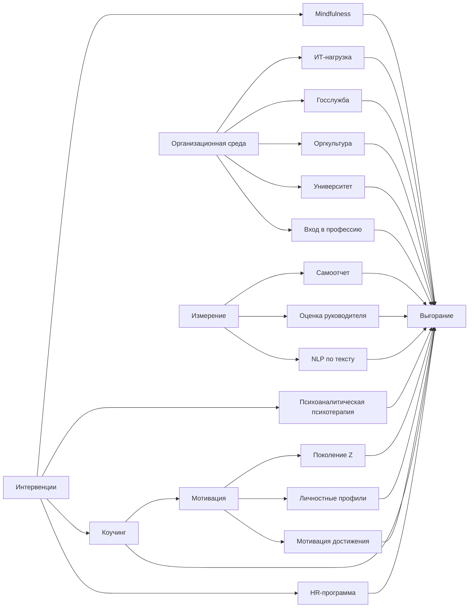

# Новизна в магистерских ВШЭ 2026 по мотивации и выгоранию

## Рамка исследования

Ниже собрана аналитическая выжимка по указанным работам ВШЭ 2026 года о мотивации, выгорании и интервенциях. Я опирался прежде всего на карточки ВКР ВШЭ и, где это удалось, на полный PDF из LMS ВШЭ. Для корпуса ВШЭ важно помнить: аннотации ВКР публикуются в открытом доступе всегда, а полный текст появляется только при согласии автора. В этой сессии полноценно извлекся PDF только у работы Ангелины Ароновой; у работ Ксении Цациной, Артёма Удалова и Михаила Меркулова на карточках есть ссылка "Текст работы", но автоматическое извлечение PDF по ссылке LMS вернуло ошибку, поэтому по ним анализ сделан по открытым карточкам и аннотациям ВШЭ. Для работ без полного текста новизна извлечена только из аннотаций, как ты и просил. citeturn4view0turn8view0turn8view1turn9view0turn10view0turn10view1turn10view2

В целом по этому набору новизна 2026 года в ВШЭ выглядит не как одна "большая теория", а как серия прикладных сдвигов. Во-первых, выгорание почти везде перестает рассматриваться только как индивидуальная проблема и описывается как эффект сочетания личностных особенностей, организационной среды и режима труда. Во-вторых, мотивация в работах этого года все чаще персонализируется: через поколение Z, личностные характеристики, специфику ИТ, госслужбы, университета и молодых педагогов. В-третьих, заметен разворот к интервенциям и инструментам: от психотерапии и mindfulness до коучинга, HR-программ, multi-source measurement и NLP-моделей оценки выгорания. citeturn17view0turn18view0turn18view1turn18view2turn19view0turn19view1turn21view0

## Краткая сводка

Если смотреть только на "главную новизну" по теме мотивации и выгорания, то корпус делится на четыре смысловых кластера. Первый кластер - различение и интеграция подходов помощи. У Ароновой новизна состоит в системном сопоставлении психоаналитической психотерапии и mindfulness не как "конкурирующих техник", а как методов разного порядка, решающих разные задачи и лишь частично дополняющих друг друга. Это полезно для психотерапевтов, консультантов и HR-практиков, потому что работа фактически предлагает рамку выбора интервенции под тип запроса. citeturn6view3turn7view0turn16view0turn16view1turn21view0

Второй кластер - таргетирование мотивации. У Удалова новизна в адаптации системы мотивации под поколение Z в нефтегазовом секторе; у Меркулова - в прямой увязке профессиональной мотивации с личностными характеристиками сотрудников; у Цациной - в прикладной интеграции коучинговых и психологических инструментов в HR-практики среднего бизнеса с фокусом на мотивацию, стрессоустойчивость и профилактику выгорания. Вместе эти работы сдвигают обсуждение от "универсальных стимулов" к контекстной настройке мотивационных систем. citeturn8view0turn8view1turn9view0

Третий кластер - организационные факторы выгорания. У Скаловой центральная мысль в том, что высокая мотивация достижения может быть не только ресурсом, но и фактором риска выгорания; у Кудиновой - в превращении диагностики стресса и выгорания в адресную HR-программу для ИТ-компании; у Ермаковой и Затикян - в рассмотрении выгорания как функции управленческой среды, справедливости распределения задач, поддержки руководителя и типа организационной культуры. Здесь главный сдвиг состоит в переходе от "лечить сотрудника" к "перенастраивать рабочую систему". citeturn17view0turn18view0turn18view1turn18view2

Четвертый кластер - измерение и технологизация. У Эспиносы Гаоны новизна в том, что самоотчеты и оценки руководителей предлагаются как комплементарные, а не взаимозаменяемые источники данных о выгорании. У Коршунова - в использовании русскоязычной NLP-модели для предсказания индекса выгорания по свободным текстовым ответам. На уровне исследовательской повестки это, пожалуй, самый "методологически новый" пласт всего корпуса. citeturn19view1turn19view0

## Сравнительная таблица

| Автор и тема | Доступность | Формулировка новизны | Методология и выборка | Ключевой результат | Практическая ценность |
|---|---|---|---|---|---|
| Аронова Ангелина. "Психоаналитическая психотерапия и практики осознанности..." | Полный текст доступен и извлечен | Системное сопоставление психоаналитической психотерапии и mindfulness применительно к тревоге и выгоранию как комплексу переживаний, а не единому термину | Качественный сравнительный дизайн; 11 первичных встреч, 3 потока 8-недельных mindfulness-групп по 5-6 человек, плюс клинические случаи и наблюдения автора | Подтверждена гипотеза о разных задачах и границах методов: mindfulness полезен для саморегуляции, но не заменяет психотерапию | Помогает выбирать формат помощи и не смешивать методы без понимания рамки citeturn6view3turn7view0turn16view0turn16view1turn21view0 |
| Цацина Ксения. "Лучшие практики использования психологических и коучинговых инструментов..." | На карточке ВШЭ есть PDF-ссылка, но PDF не извлекся в сессии | По аннотации новизна в прикладной интеграции коучинга, стресс-менеджмента и профилактики выгорания в управление персоналом малого и среднего бизнеса РФ, с учетом рисков псевдокоучинга | Анализ современных коучинговых практик и кейсов; разработка рекомендаций для средней компании в Нижнем Новгороде | Коучинг описан как инструмент не только повышения эффективности, но и улучшения психологического климата, мотивации и стрессоустойчивости | Готовые рекомендации по внедрению коучинговых инструментов в HR и менеджмент citeturn8view0turn10view0 |
| Удалов Артём. "Система мотивации сотрудников поколения Z..." | На карточке ВШЭ есть PDF-ссылка, но PDF не извлекся в сессии | По аннотации новизна в адаптации мотивационной системы нефтегазовой компании под ценности и поведение поколения Z | Эмпирическое исследование; точные методы и выборка в карточке не раскрыты, но упомянут статистический анализ связей мотивационных факторов с удовлетворенностью трудом | Подтверждена необходимость сочетать материальные и нематериальные стимулы для молодых специалистов | Полезно для удержания и вовлечения Gen Z в отрасли с дефицитом кадров citeturn9view0turn10view1 |
| Меркулов Михаил. "Повышение профессиональной мотивации..." | На карточке ВШЭ есть PDF-ссылка, но PDF не извлекся в сессии | По аннотации новизна в прямой увязке мотивации с личностными характеристиками работников; автор прямо фиксирует дефицит таких исследований | Исследование работников логистической компании; анализ внутренней, внешней положительной и внешней отрицательной мотивации в связи с ценностями, направленностью и чертами личности | Выделены разные личностные профили для разных типов мотивации | Основа для персонализированных HR-интервенций вместо единых схем мотивации citeturn8view1turn10view2 |
| Скалова Карина. "Профессиональное выгорание у людей с высокой мотивацией достижения" | Аннотация | Новизна по аннотации: показ высокой мотивации достижения как возможного фактора риска выгорания, а не только ресурса успеха | Количественный этап с психодиагностическим анкетированием и качественный этап с полуструктурированными интервью; точная выборка не раскрыта | Исследование направлено на выявление связи между высокой мотивацией достижения и показателями выгорания, а также факторов риска: перфекционизм, трудоголизм, FOMO, дисбаланс работы и жизни | Полезно для психологического консультирования, коучинга и профилактических программ для высокомотивированных сотрудников citeturn1search0turn17view0 |
| Кудинова Светлана. "Разработка программы снижения стресса..." | Аннотация | Новизна по аннотации: переход от диагностики к адресной 4-компонентной программе для ИТ-компании по практическому HR-запросу | Диагностика 84 сотрудников; PSM-25, ПВ-IT, "Цифровой аутизм", оценка стрессогенности трудных IT-ситуаций | Подтвержден повышенный уровень стресса и выгорания; программа передана HR-службе и принята к внедрению | Практически готовая модель внедрения профилактики в ИТ-компании citeturn17view1turn18view0 |
| Ермакова Мария. "Управление профессиональным выгоранием..." | Аннотация | Новизна по аннотации: трактовка выгорания как управленческого риска в госслужбе, а не только психологического состояния | Анкетирование, сравнительный и корреляционный анализ, полуструктурированные интервью; MBI в адаптации Водопьяновой и Старченковой | Высокий уровень эмоционального истощения связан с характеристиками управленческой среды | Может лечь в кадровую политику госслужбы, мониторинг и развитие руководителей citeturn17view2turn18view1 |
| Затикян Полина. "Организационная культура, вовлеченность и эмоциональное выгорание..." | Аннотация | Новизна по аннотации: проверка того, как тип организационной культуры в публичной власти связан одновременно с вовлеченностью и выгоранием | Анкетирование и корреляционный анализ; Cameron-Quinn, Gallup Q12, MBI | Иерархическая культура связана с большим выгоранием, клановая - с большей вовлеченностью | Дает основу для культурных, а не только индивидуальных мер профилактики выгорания citeturn17view3turn18view2 |
| Эспиноса Гаона Хосе Йовнни. "Объективизация измерения профессионального выгорания..." | Аннотация | Новизна по аннотации: интеграция самоотчетов и оценок руководителей как двух комплементарных перспектив измерения | Кросс-секционный количественный дизайн; 91 диада "библиотекарь - руководитель"; BAT-23, ICC, MTMM, линейная регрессия | Самооценки систематически выше руководительских; согласованность низкая; методы дополняют друг друга | Полезно для redesign корпоративной диагностики выгорания | citeturn17view4turn19view1 |
| Коршунов Алексей. "Выявление профессионального выгорания сотрудников на основе методов искусственного интеллекта" | Аннотация | Новизна по аннотации: русскоязычная NLP-оценка выгорания по свободному тексту | Два независимых российских датасета; сравнение 4 регрессионных моделей; связь c MBI, PHQ-9, TIS-6 | Лучшая модель TF-IDF + Ridge: R2 = 0.374, Pearson = 0.624; текстовые сигналы воспроизводят индекс выгорания | Потенциально масштабируемый скрининг выгорания в русскоязычных организациях citeturn17view5turn19view0 |
| Давлетова Алина. "Эмоциональный труд преподавателей..." | Аннотация | Новизна по аннотации: выгорание рассматривается через призму эмоционального труда преподавателя, включая переписку, консультации и поддержание профессионального тона | По карточке точные методы не раскрыты; результаты говорят о качественном анализе представлений преподавателей | Причины выгорания: нагрузка, бюрократия, нестабильность, внешняя оценка, дефицит признания и ресурсов | Полезно для академического менеджмента и программ благополучия преподавателей citeturn17view6turn18view4 |
| Кацуба Валерия. "Организационный стресс, профессиональное выгорание..." | Аннотация | Новизна по аннотации: связка стресса, выгорания и личностно-профессиональной устойчивости у молодых педагогов внутри программы поддержки | Смешанный дизайн: анкетирование и интервью; участники программы "Выбираю учить" | На фоне высокого организационного стресса и нарастающего выгорания участники сохраняют сравнительно высокую устойчивость | Полезно для проектирования программ входа в профессию и сопровождения молодых педагогов citeturn17view7turn18view5 |

## Карточки целевых работ

### Аронова Ангелина Александровна

Карточка ВШЭ:
```text
https://www.hse.ru/edu/vkr/1159982075
```

PDF:
```text
https://lms.hse.ru/ap_service.php?getwork=1&guid=0DA195C9-6331-470B-BD0C-9EB8622014DC
```

Формулировка новизны. Здесь есть прямая авторская формулировка: "научная новизна исследования заключается в попытке системного сопоставления психоаналитической психотерапии и практик осознанности (Mindfulness) применительно к работе с тревогой и выгоранием" как комплексом переживаний эмоционального истощения, утраты живости и внутренней замороженности; работа направлена на выявление общих элементов, принципиальных различий, границ применимости и условий возможного совместного применения. Это главное и наиболее четко сформулированное "новое" во всем наборе. Источник: страница 8 PDF, раздел "Научная новизна исследования". citeturn6view3turn15view0

Ключевые гипотезы и вопросы. Гипотеза сформулирована явно: психоаналитическая психотерапия и mindfulness имеют разные задачи и пределы применения; mindfulness в большей степени применим как инструмент саморегуляции и снижения стресса, а психоаналитическая психотерапия - для работы с внутренними конфликтами, защитами и устойчивыми способами психического функционирования; при определенных условиях возможно взаимодополнение. Исследовательский вопрос фактически звучит так: где проходит граница между психотерапевтическим методом и прикладными практиками и возможна ли их осторожная интеграция. Источник: введение, страницы 5-6 PDF. citeturn5view0turn21view0

Методология и выборка. Работа построена как качественное сравнительное исследование. Эмпирическая часть опирается на 11 первичных консультативных встреч с респондентами 27-42 лет, три клиента Центра психологического консультирования НИУ ВШЭ, одного личного клиента в длительной работе, семь интервью-консультаций суммарно на 40 часов и три потока 8-недельных mindfulness-групп по 5-6 человек. Кроме того, используются клинические случаи из психоаналитической литературы. Источник: раздел 2.1 "Материалы исследования и логика анализа", страницы 40-43 PDF. citeturn21view0

Основные результаты и выводы. В выводах автор прямо пишет, что психоаналитическая психотерапия и mindfulness "не являются методами одного порядка". Психоанализ отвечает на вопрос о смысле, происхождении и функции симптома, а mindfulness помогает заметить опыт, остановиться, вернуться к телу и иначе отнестись к тому, что уже происходит. Подтверждается гипотеза о разных задачах и пределах применения: mindfulness ценен для саморегуляции и снижения стресса, но не может рассматриваться как самостоятельная психотерапия и универсальная форма лечения. Источник: выводы, страницы 82-84 PDF. citeturn7view0turn16view0turn16view1

Практические рекомендации. Практический вывод работы очень прикладной: не подменять терапию mindfulness-практиками, использовать mindfulness как опору для раннего распознавания перегрузки и саморегуляции, а психоаналитическую психотерапию - там, где нужно работать с внутренним конфликтом, защитами, травматическим опытом и личностной организацией. Для HR и консультирования это означает: разные жалобы на "выгорание" требуют разной глубины вмешательства. citeturn7view0turn16view0turn16view1

Ограничения и дальнейшие исследования. Явный раздел "ограничения исследования" в тексте не выделен, но из дизайна работы видны три ограничения: это качественное исследование без количественной проверки эффективности mindfulness; выборка небольшая и контекстно-специфичная; материал носит интерпретативный и иллюстративный характер. Логичное продолжение этой работы - количественно проверять, для каких профилей клиентов и каких форм выгорания комбинация психотерапии и mindfulness действительно работает лучше раздельного применения. Это уже моя осторожная аналитическая экстраполяция из описанного дизайна, а не прямая формулировка автора. citeturn21view0turn20view3

### Цацина Ксения Андреевна

Карточка ВШЭ:
```text
https://www.hse.ru/edu/vkr/1163516208
```

PDF:
```text
https://lms.hse.ru/ap_service.php?getwork=1&guid=BF28DF5C-818F-432A-B472-F7DE21AA9B4A
```

Формулировка новизны. Прямой формулировки "научная новизна" в доступной карточке нет, поэтому новизна реконструируется по аннотации: работа объединяет коучинговые технологии, стресс-менеджмент, мотивацию сотрудников, организационную культуру и профилактику выгорания в одном прикладном управленческом дизайне для малого и среднего бизнеса РФ. Дополнительный новый акцент - не только на эффектах коучинга, но и на рисках псевдокоучинговых практик и зависимости результата от квалификации коуча. Источник ниже - аннотация карточки ВШЭ. citeturn8view0

Ключевые вопросы. По аннотации центральные вопросы выглядят так: как коучинговые технологии влияют на мотивацию, организационную культуру, стрессоустойчивость и качество управленческих решений; какие практики коучинга работают в российском SME-контексте; как внедрять коучинг так, чтобы он помогал развитию персонала и профилактике выгорания, а не оставался модным, но пустым форматом. citeturn8view0

Методология и выборка. По карточке видно, что работа включает анализ современных коучинговых практик в российском бизнесе, практические кейсы работы коучей с представителями малого и среднего бизнеса и прикладную разработку практик для средней организации в Нижнем Новгороде. Точная выборка, страницы и полноценный раздел методов в текущей сессии не извлеклись, хотя ссылка на PDF на карточке есть. citeturn8view0turn10view0

Основные результаты и выводы. Коучинг в этой работе показан как инструмент не только производительности и экономических показателей, но и психологического климата, мотивации, командного взаимодействия и стрессоустойчивости. Важная оговорка автора по аннотации состоит в том, что эффект коучинга зависит от доверия в организации, ясности целей и квалификации специалистов. citeturn8view0

Практические рекомендации. Главная прикладная ценность - рекомендации по внедрению коучинговых инструментов в систему управления персоналом с учетом российской организационной культуры и управленческих традиций. Для HR это, по сути, аргумент в пользу коучинга как части системы благополучия и развития персонала, а не "внешней модной услуги". citeturn8view0

Ограничения и дальнейшие исследования. В доступной аннотации ограничения не раскрыты. Осторожный вывод по дизайну: работа, вероятно, сильно завязана на кейсовый и организационно-специфичный материал, поэтому дальше было бы логично проверить предлагаемые практики на более широком наборе компаний и отраслей. Это аналитический вывод из описания аннотации, а не прямая цитата. citeturn8view0

### Удалов Артём Алексеевич

Карточка ВШЭ:
```text
https://www.hse.ru/edu/vkr/1159022650
```

PDF:
```text
https://lms.hse.ru/ap_service.php?getwork=1&guid=56505D77-D48F-47AE-9D71-651CBC7AD1D0
```

Формулировка новизны. По аннотации новизна здесь состоит в адаптации системы мотивации под поколение Z именно в российском нефтегазовом секторе. Автор не говорит просто о "молодых сотрудниках", а ставит задачу привязать кадровые практики к ценностям, ожиданиям и трудовому поведению Gen Z и специально фиксирует несоответствие традиционных моделей мотивации этой группе. citeturn9view0

Ключевые вопросы. Основной вопрос работы: какие факторы действительно влияют на трудовую мотивацию молодых специалистов поколения Z и как на этой основе перестроить систему мотивации для вовлеченности и удержания. Это сильная прикладная постановка, особенно для отрасли с высокой стоимостью адаптации и оттоком кадров. citeturn9view0

Методология и выборка. Точная выборка и инструменты в карточке не приведены, но из аннотации видно, что была эмпирическая часть и статистический анализ связей между отдельными мотивационными факторами и удовлетворенностью трудом. Полный PDF на карточке есть, но в сессии не извлекся. citeturn9view0turn10view1

Основные результаты и выводы. Автор пишет о статистически значимых связях между мотивационными факторами и удовлетворенностью трудом и о подтверждении необходимости сочетать материальные и нематериальные стимулы. Сам по себе этот вывод не революционен, но новизна в отраслевой и поколенческой настройке: не "больше платить всем", а комбинировать стимулы под ценности Gen Z. citeturn9view0

Практические рекомендации. Работа прямо ориентирована на инструменты вовлечения и удержания молодых специалистов в нефтегазовой компании. Для практики это означает пересмотр HR-пакета, коммуникации, карьерных траекторий и нематериальных стимулов с фокусом на поколенческие ожидания. citeturn9view0

Ограничения и дальнейшие исследования. В аннотации ограничения не раскрыты. Из карточки видно только, что выводы отраслевые; логично ожидать необходимость сравнений с другими секторами и более точной сегментации внутри Gen Z. Это аналитическая экстраполяция, а не авторская формулировка. citeturn9view0

### Меркулов Михаил Александрович

Карточка ВШЭ:
```text
https://www.hse.ru/edu/vkr/1159341966
```

PDF:
```text
https://lms.hse.ru/ap_service.php?getwork=1&guid=1CBB61AD-7DC9-47C3-8627-541AB3D853F6
```

Формулировка новизны. Здесь новизна наиболее четко просматривается прямо в аннотации: "проблема исследования заключается в отсутствии исследований, связывающих профессиональную мотивацию с личностными характеристиками сотрудников". Иными словами, работа претендует на восполнение дефицита исследований, где мотивация персонала связывается не только с условиями труда и стимулированием, но и с ценностями, эмоциональной направленностью и личностными чертами. citeturn8view1

Ключевые вопросы. Главный вопрос - какие личностные характеристики связаны с внутренней, внешней положительной и внешней отрицательной мотивацией и какие HR-практики подходят работникам с разными профилями. Это одна из самых содержательных работ по теме "персонализированная мотивация". citeturn8view1

Методология и выборка. Объект - профессиональная мотивация, предмет - взаимосвязь личностных характеристик и мотивации у работников логистической компании. Точные размеры выборки и перечень методик на карточке не раскрыты, но по результатам видно, что анализировались ценности, направленность личности и эмоциональная направленность. Полный PDF на карточке есть, но в текущей сессии он не извлекся. citeturn8view1turn10view2

Основные результаты и выводы. Для внутренней мотивации автор связывает благоприятный профиль с ясностью целей, разнообразием задач, ограничением социальных контактов, отсутствием требований к креативности в работе и рядом личностных качеств. Для внешней положительной мотивации важны зарплата, социальные контакты, признание и такие черты, как направленность на себя, аккуратность и независимость. Для внешней отрицательной мотивации - хорошие условия работы, стабильные отношения и определенные ценностные профили. Это делает работу ценной именно как карту дифференцированных мотивационных профилей. citeturn8view1

Практические рекомендации. Основной прикладной вывод: единая "мотивационная программа для всех" заведомо проигрывает сегментированным решениям, где HR учитывает личностный профиль сотрудника. Это может быть полезно для адаптации, развития, удержания и проектирования job design. citeturn8view1

Ограничения и дальнейшие исследования. В доступной карточке ограничения прямо не описаны. Но из аннотации видно, что речь идет об одной логистической компании, поэтому дальнейшие исследования логично проводить на межотраслевых выборках и с валидацией профилей в разных организационных культурах. Это аналитический вывод по дизайну. citeturn8view1

### Скалова Карина Александровна

Карточка ВШЭ:
```text
https://www.hse.ru/edu/vkr/1160979188
```

Формулировка новизны. Так как полный текст не опубликован, новизна берется из аннотации. Самое ценное здесь - разворот перспективы: высокая мотивация достижения рассматривается не просто как ресурс, а как условный фактор риска выгорания. Для российской HR- и бизнес-психологии это сильный ход, потому что он ставит под сомнение простую логику "чем выше drive, тем лучше". citeturn1search0turn17view0

Ключевые вопросы. Работа ищет психологические особенности выгорания у людей с высокой мотивацией достижения и направления психологического консультирования для этой группы. Внутри аннотации обозначены и факторы риска: перфекционизм, трудоголизм, нарушение work-life balance, FOMO, дефицит саморегуляции, кризис смыслов. citeturn1search0turn17view0

Методология и выборка. Есть количественный этап с психодиагностическим анкетированием и качественный - с полуструктурированными интервью. Точная выборка и набор методик в аннотации не уточняются. citeturn1search0turn17view0

Основные результаты и выводы. Карточка описывает исследование как направленное на выявление связи между уровнем мотивации достижения и показателями выгорания и на анализ усилителей эмоционального истощения. С высокой вероятностью именно эта работа ближе всех в корпусе к проблеме "выгорания отличников и высокоэффективных". citeturn1search0turn17view0

Практические рекомендации. Практическая значимость прямо названа: результаты могут использоваться в психологическом консультировании, бизнес-психологии, коучинге и профилактических программах, развивающих саморегуляцию и устойчивое управление нагрузкой. citeturn1search0

Ограничения и дальнейшие исследования. В доступной аннотации не раскрыты. Логичное продолжение - продольные исследования: когда именно высокая мотивация достижения перестает быть ресурсом и становится стрессором. Это уже аналитический вывод. citeturn17view0

### Кудинова Светлана Григорьевна

Карточка ВШЭ:
```text
https://www.hse.ru/edu/vkr/1160302114
```

Формулировка новизны. В аннотации новизна задается не теорией, а конструкцией вмешательства: по практическому запросу HR ИТ-компании автор проводит диагностику, выделяет группы риска и строит индивидуализированную программу управления стрессом и выгоранием. Для магистерской работы это сильная прикладная новизна. citeturn17view1turn18view0

Ключевые вопросы. Центральный вопрос звучит так: как на основе диагностики стресса и выгорания спроектировать адресную программу вмешательства именно для ИТ-среды с высокой когнитивной нагрузкой, agile-режимом и удаленным форматом работы. citeturn17view1turn18view0

Методология и выборка. Выборка - 84 сотрудника. Методы: PSM-25, опросник ПВ-IT, анкета "Цифровой аутизм", методика оценки субъективной стрессогенности трудных профессиональных ситуаций в IT. Это один из самых методически конкретных открытых анонсов среди работ без полного текста. citeturn17view1turn18view0

Основные результаты и выводы. Исследование подтвердило наличие повышенного уровня стресса и выгорания. На этой базе разработана программа с четырьмя направлениями: адресная поддержка групп риска, работа с руководителями, развитие навыков саморегуляции, развитие коммуникации и эмоционального интеллекта. Важно, что программа уже передана HR-службе заказчика и принята к внедрению. citeturn18view0

Практические рекомендации. Это практически готовый blueprint корпоративной программы профилактики выгорания для ИТ-компании, причем с дорожной картой на год и показателями эффективности. citeturn18view0

Ограничения и дальнейшие исследования. В аннотации ограничения не раскрыты. По дизайну видно, что материал однокомпанейский; следующим шагом было бы сравнить разные ИТ-команды, роли и режимы работы и оценить эффект внедрения программы в динамике. Это аналитический вывод из открытого описания. citeturn18view0

## Дополнительные релевантные работы

### Ермакова Мария Александровна

Карточка ВШЭ:
```text
https://www.hse.ru/edu/vkr/1159343034
```

Новизна по аннотации - представление выгорания государственных гражданских служащих как управленческого риска, влияющего на качество публичного управления, а не только как индивидуального психологического состояния. Ключевая гипотеза фактически подтверждена: показатели выгорания устойчиво связаны с характеристиками управленческой среды. Методология включает анкетирование, корреляционный и сравнительный анализ, полуструктурированные интервью и MBI. Практический выход - мониторинг состояния персонала, развитие компетенций руководителей, корректировка практик распределения нагрузки и встраивание профилактики выгорания в кадровую политику госслужбы. Ограничения в аннотации не сформулированы. citeturn17view2turn18view1

### Затикян Полина Александровна

Карточка ВШЭ:
```text
https://www.hse.ru/edu/vkr/1159022859
```

Новизна по аннотации - связка трех переменных в секторе публичной власти: организационная культура, вовлеченность и эмоциональное выгорание. Гипотезы даны явно: иерархическая культура должна коррелировать с более высоким выгоранием, а клановая - с большей вовлеченностью. Методы - Cameron-Quinn, Gallup Q12, MBI, анкетирование и корреляционный анализ. Ключевой результат: организационная культура действительно значимо влияет на психологическое состояние и профессиональную эффективность госслужащих. Практическая ценность - возможность проектировать профилактику выгорания через изменение культуры, а не только через индивидуальные программы помощи. Ограничения в аннотации не описаны. citeturn17view3turn18view2

### Эспиноса Гаона Хосе Йовнни

Карточка ВШЭ:
```text
https://www.hse.ru/edu/vkr/1165080741
```

Новизна здесь методологическая: ставится под сомнение достаточность самоотчетов и предлагается multi-source assessment выгорания с включением оценок непосредственных руководителей. Дизайн очень четкий: 91 диада "библиотекарь - руководитель", BAT-23 в двух форматах, ICC, MTMM и линейная регрессия. Главное открытие - низкая согласованность самоотчетов и сторонних оценок: библиотекари оценивают свое выгорание систематически выше, а эффекты метода оказываются сильнее эффектов признака. Практическая ценность огромна для HR-аналитики: если опираться только на self-report, измерение выгорания будет систематически неполным. Ограничения в открытой аннотации не раскрыты, но следующий шаг явно просится - проверка модели на других профессиях, кроме библиотекарей. citeturn19view1

### Коршунов Алексей Александрович

Карточка ВШЭ:
```text
https://www.hse.ru/edu/vkr/1159341346
```

Новизна - использование русскоязычного NLP для оценки выгорания по открытым текстам. Вопрос работы: может ли свободный текст предсказать индекс эмоционального выгорания, полученный из MBI. Методы: два независимых российских датасета, несколько схем разделения данных, четыре регрессионные модели; лучшая модель TF-IDF + Ridge достигла R2 = 0.374 и Pearson = 0.624, при одновременной связи с PHQ-9 и TIS-6. Практическая ценность - возможность недорогого масштабируемого скрининга выгорания в русскоязычных выборках. Ограничения в аннотации не перечислены, но из описания ясно, что впереди встает вопрос внешней валидации на новых датасетах и профессиональных группах. citeturn19view0

### Давлетова Алина Ильдаровна

Карточка ВШЭ:
```text
https://www.hse.ru/edu/vkr/1165080819
```

Новизна по аннотации - перенос фокуса с "эмоционального выгорания преподавателя" на эмоциональный труд как скрытую повседневную часть академической роли: переписка, консультации, обратная связь, поддержание эмоционального тона и границ. Автор показывает, что выгорание преподавателей связано не только с нагрузкой, но и с бюрократизацией, нестабильностью, внешней оценкой и дефицитом признания. Практическая ценность - аргументация для университетских программ благополучия, перераспределения нагрузки и поддержки преподавателей. Ограничения в аннотации не раскрыты. citeturn17view6turn18view4

### Кацуба Валерия Евгеньевна

Карточка ВШЭ:
```text
https://www.hse.ru/edu/vkr/1103817213
```

Новизна по аннотации - одновременный анализ организационного стресса, выгорания и личностно-профессиональной устойчивости молодых педагогов в рамках конкретной программы ранней профессионализации. Работа сочетает анкетирование и интервью. Ключевой результат: у участников программы одновременно растут организационный стресс и выгорание, но при этом остается достаточно высокая устойчивость; кроме того, разные группы участников по-разному видят элементы программы. Практический смысл - проектирование программ сопровождения молодых педагогов должно учитывать не только развитие компетенций, но и профилактику перегрузки. Ограничения в аннотации не обозначены. citeturn17view7turn18view5

## Тематическая карта и выводы

Ниже - компактная карта пересечений. Она полезна, если нужно быстро увидеть, где в корпусе расположены основные "точки новизны": мотивация как персонализированный драйвер, выгорание как результат перегрузки и организационной среды, интервенции как дизайн помощи, измерение как отдельная методологическая задача. Схема является аналитической синтезирующей визуализацией по работам выше. citeturn6view3turn8view0turn8view1turn9view0turn17view0turn18view0turn18view1turn18view2turn19view0turn19view1



Если свести все работы к одному краткому выводу для учебы и практики, получится так. Новизна корпуса ВШЭ-2026 по теме мотивации и выгорания не в изобретении новых базовых теорий мотивации или burnout, а в четырех прикладных шагах: в персонализации мотивации под группу и личность, в переносе выгорания из области "слабости сотрудника" в область организационного дизайна, в развитии программ интервенций под конкретные контексты и в переходе к более сложному измерению - с multi-source assessment и AI-инструментами. Для академика это хорошая карта тем, где можно строить дальнейшее исследование. Для HR-практика - это набор почти готовых логик действий: сегментировать, не абсолютизировать высокую мотивацию, смотреть на культуру и руководителя, а не только на сотрудника, и измерять выгорание более умно, чем одним опросником. citeturn17view0turn18view0turn18view1turn18view2turn19view0turn19view1turn21view0