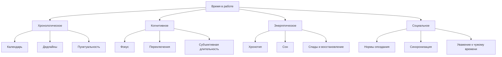
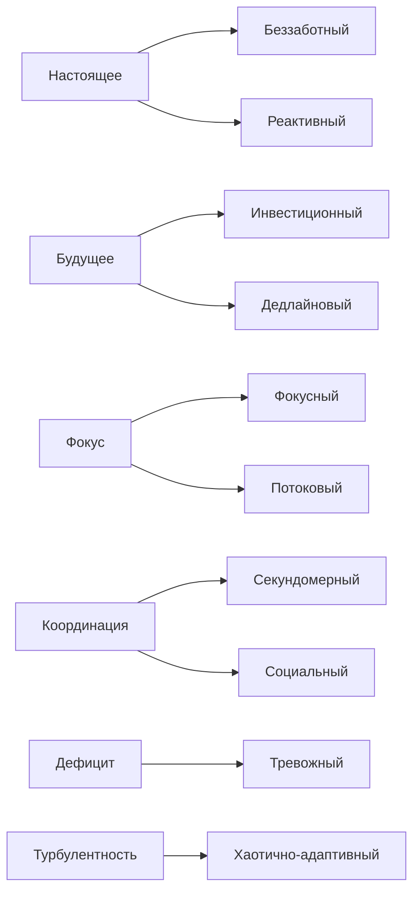
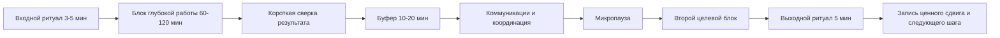

# Восприятие времени, эффективность и результативность

## Executive summary

Этот отчёт исходит из двух рабочих предположений, заданных в запросе: книга объёмом примерно 40-80 тысяч слов и аудитория "профессионалы, менеджеры, люди, интересующиеся саморазвитием". На основании академических обзоров, мета-анализов, полевых исследований труда и проверяемых практик главный вывод таков: "хорошее отношение ко времени" не сводится ни к жёсткой пунктуальности, ни к расслабленной спонтанности. Наиболее устойчивые результаты даёт не один универсальный стиль, а согласование четырёх слоёв времени: хронологического, когнитивного, энергетического и социального. Именно несогласованность этих слоёв обычно и создаёт ощущение "день ушёл, а ценного сдвига нет". citeturn18view2turn19view2turn29view0turn20view6

Эмпирическая база хорошо поддерживает несколько опорных тезисов. Во-первых, тайм-менеджмент в среднем связан с лучшей работой, академическими результатами и благополучием, причём по современным данным его связь с благополучием иногда даже сильнее, чем связь с "голой" производительностью; при этом личностный фактор conscientiousness остаётся самым стабильным индивидуальным предиктором. Во-вторых, будущая временная перспектива и сбалансированная временная перспектива работают не как "мотивационные лозунги", а через механизмы саморегуляции: постановку целей, мониторинг прогресса, целенаправленное действие и способность удерживать курс. citeturn18view2turn33view3turn19view2turn32view0turn32view2turn30view0

В-третьих, когнитивная цена фрагментации внимания реальна. Исследования task switching и interruptions показывают, что переключения увеличивают время возобновления задачи, вероятность ошибок и субъективное чувство перегруза; при этом прерывания менее вредны, если попадают в естественные точки останова, а предварительная подготовка к переключению заметно снижает ошибочность. Это особенно важно для "реактивных" и "секундомерных" людей: внешняя собранность может скрывать высокую внутреннюю дробность дня. citeturn20view3turn33view0turn20view1turn0search2turn0search5

В-четвёртых, хронотип имеет значение, но не в виде упрощённой схемы "жаворонки эффективны, совы нет". Современный обзор по когнитивным эффектам хронотипа показывает, что прямой общий эффект хронотипа на когницию выявляется не всегда, зато довольно часто наблюдается synchrony effect: результаты лучше, когда тип и время суток согласованы. Рабочие дневниковые исследования также показывают, что время суток и хронотип совместно определяют, когда человек переживает бодрость, обучение и "процветание на работе". Отсюда следует важный практический вывод: энергетическое время нельзя подменять календарным. citeturn4search3turn29view0turn12search5turn11search3

В-пятых, прокрастинация - это не просто "леность" и не только плохая организация. Классический мета-анализ Пирса Стила показывает, что наиболее устойчивые предикторы прокрастинации - неприятность задачи, удалённость вознаграждения, импульсивность, низкая самоэффективность и слабая добросовестность; позднейшие обзоры и мета-анализы интервенций показывают, что снижения прокрастинации можно добиваться, но эффекты сильно зависят от дизайна вмешательства. Наиболее убедительно выглядят когнитивно-поведенческие подходы, структурирование задачи, реализация "если-то" планов и системы промежуточных ориентиров. citeturn1search2turn26view2turn26view3turn19view5turn27search13

В-шестых, отношение к чужому времени - не вторичная этика, а производственный фактор. Исследования совещаний показывают, что опоздание ухудшает удовлетворённость встречей, её воспринимаемую эффективность, реальные групповые результаты, доверие и психологическую безопасность; при этом кросс-культурные исследования подтверждают, что нормы опоздания различаются между clock-time и event-time культурами и зависят от статуса. Следовательно, привычка "приходить заранее" и привычка "регулярно опаздывать" - это не просто черты характера, а элементы социального контракта. citeturn20view6turn18view6turn20view5turn21view3

Для книги и для практики наиболее сильной рамкой видится не бинарная оппозиция "дисциплинированный - недисциплинированный", а система из десяти синтетических временных стилей: беззаботный, реактивный, дедлайновый, инвестиционный, фокусный, секундомерный, потоковый, социальный, тревожный, хаотично-адаптивный. Эти типы не являются канонической академической типологией; они предложены здесь как практическая схема, собранная из исследований time perspective, chronotype, workload fragmentation, punctuality, polychronicity и self-regulation. Её сила в том, что она позволяет обсуждать не "какой вы человек", а "какая временная логика сейчас управляет вашим днём". citeturn19view2turn19view0turn20view3turn20view6turn2search20

Главный практический вывод отчёта можно сформулировать жёстко: максимальная результативность обычно не у тех, кто живёт по секундам, и не у тех, кто "не зациклен на времени", а у тех, у кого день объясним, переключения имеют цену и потому ограничены, важные задачи получают защищённые блоки, энергия согласована с типом работы, а социальное время построено на уважении к чужим обязательствам. Это и есть базовая конструкция зрелого временного режима. citeturn18view2turn20view3turn23view1turn28view5turn30view0

## Исследовательская рамка и ключевые концепты

В академической литературе "время" не является одной переменной. По сути, полезно различать по меньшей мере четыре слоя. Хронологическое время - это часы, календари, дедлайны, длительности и последовательности; когнитивное время - это переживание длительности, переключения, внимание, ожидание и субъективная "скорость дня"; энергетическое время - это сон, циркадные ритмы, бодрость, спад, восстановление; социальное время - это нормы пунктуальности, допустимого опоздания, синхронизации, статуса, событийности и уважения к чужим обязательствам. Такой разбор не просто удобен теоретически: разные слои опираются на разные исследовательские традиции и требуют разных интервенций. citeturn19view2turn29view0turn12search5turn20view5turn33view3

С точки зрения психологии саморегуляции особенно важна time perspective - временная перспектива. Исходная традиция Зимбардо и Бойда предложила рассматривать устойчивые способы привязки поведения к прошлому, настоящему и будущему; более поздний мета-анализ Baird и коллег показал, что прежде всего будущая временная перспектива связана с лучшими исходами через мониторинг целей, goal operating и self-regulatory ability, а balanced time perspective может быть даже сильнее связана со способностью к саморегуляции, чем просто "ориентация в будущее". Это означает, что зрелый стиль времени - не постоянное бегство в будущее, а умение переключаться между временными рамками по требованиям ситуации. citeturn17search20turn32view0turn32view2turn32view3

Будущая временная перспектива в рабочем контексте также связана не только с мотивацией, но и с job crafting, work engagement и намерением продолжать работу. Систематический обзор Henry и коллег показал, что workplace FTP зависит и от возраста, и от ресурсов, и от характеристик работы, а Kooij и коллеги показали на более широком материале, что способность предвидеть и планировать желаемые будущие исходы важна для поведения, мотивации и благополучия. Для книги это важно потому, что "инвестиционное" отношение ко времени нельзя описывать только как нравственную добродетель; это наблюдаемый психологический механизм распределения усилий. citeturn19view0turn13search13turn13search16

Хронотип и сон составляют энергетический слой времени. Мета-анализы по сну и работе показывают, что количество и качество сна положительно связаны с рабочими исходами, а плохой сон связан со снижением производительности, большими рисками presenteeism и ошибками. При этом современный обзор по chronotype and synchrony effects подчёркивает, что прямой "главный эффект" хронотипа по когниции не всегда стабилен, но совпадение внутреннего ритма и времени выполнения задач часто оказывается значимым. Поэтому практическая ошибка многих тайм-менеджерских систем состоит в том, что они пытаются оптимизировать календарь, игнорируя биологию. citeturn12search5turn12search21turn11search0turn4search3turn29view0

Когнитивный слой времени особенно ярко проявляется в многозадачности и фрагментации дня. Эксперименты по task switching и исследования interruptions показывают, что цена переключения измеряется не только потерянными минутами, но и ошибками, стрессом, resumption lag и размыванием субъективного чувства продуктивности. Дневниковые исследования Gloria Mark и коллег добавляют важную деталь: чем больше времени уходит на email, face-to-face interruptions и screen switching, тем менее продуктивным человек чувствует себя к концу дня. Это даёт очень сильный аргумент против наивной идеи "быстро реагирую - значит эффективен". citeturn20view3turn33view0turn20view1turn9search0turn0search5

Социальный слой времени лучше всего виден в исследованиях совещаний, опозданий и культурных различий. Статья Allen, Lehmann-Willenbrock и Rogelberg показывает, что позднее начало совещаний ухудшает и субъективные оценки, и реальные групповые результаты. Обзор CIPD суммирует, что lateness связана с более низкой эффективностью встреч, меньшей job satisfaction, меньшей психологической безопасностью, худшим доверием и большим disrespect. При этом van Eerde и Azar показывают, что нормы "когда уже поздно" различаются культурно, а значит, часть конфликтов вокруг времени - это не личная испорченность, а столкновение temporal norms. citeturn20view6turn18view6turn20view5

Наконец, классический concept time urgency полезен для понимания "секундомерного" и "тревожного" стилей. Исследования валидности конструкта time urgency связывают его с наблюдаемым временным поведением и подчёркивают, что чрезмерная срочность - это не просто дисциплина, а отдельная психологическая установка со своими последствиями. Для результата это принципиально: высокая чувствительность ко времени может одновременно повышать координацию и создавать раздражительность, спешку и избыточный контроль. citeturn2search1turn2search15

Диаграмма выше - не академическая классификация "как в учебнике", а рабочая модель для книги. Её исследовательское основание, однако, достаточно прочное: time perspective и self-regulation описывают темпоральный каркас поведения; chronotype и sleep объясняют, почему один и тот же календарь неравноценен для разных людей; interruptions и task switching объясняют цену дробного дня; meeting lateness и cultural norms показывают, что время является не только ресурсом, но и отношением. citeturn19view2turn12search5turn20view3turn20view5

## Практическая типология временных стилей

Ниже - синтетическая типология, предложенная специально для книги. Она не совпадает один к одному ни с ZTPI, ни с chronotype inventories, ни с polychronicity scales. Это авторская рабочая схема, собранная из нескольких эмпирических традиций и полезная именно в разговоре об эффективности, результативности и ежедневной организации. Её задача - не поставить человеку ярлык, а выделить доминирующую временную логику поведения. citeturn19view2turn19view0turn20view3turn20view5turn2search20

| Стиль | Логика времени | Потенциальные преимущества | Типичные риски | Что оптимизировать |
|---|---|---|---|---|
| Беззаботный | Настоящее важнее расписания; высокая переносимость неопределённости | Низкая тревожность, творчество, лёгкое восстановление; полезен там, где слишком ранняя фиксация мешает поиску решений citeturn24search5turn24search16 | Недооценка дедлайнов, слабый goal monitoring, конфликт с координационными задачами citeturn32view2turn20view6 | Вводить внешние контрольные точки и минимальный календарный каркас |
| Реактивный | Поведение управляется входящими сигналами и срочностью других людей | Быстрая responsiveness, полезен в support, incident response, кризисных ролях citeturn20view1turn33view4 | Высокая фрагментация, потеря глубины, ложное чувство занятости вместо результата citeturn20view3turn28view7 | Ограничивать окна реакции, batch-processing коммуникаций |
| Дедлайновый | Мобилизация возникает по мере приближения срока | Может давать мощный краткосрочный всплеск концентрации на коротких задачах; опирается на temporal motivation logic citeturn1search2turn26view3 | Прокрастинация, качество "в последний момент", перегрев команды при кооперации citeturn26view2turn20view6 | Разбивать дальние сроки на промежуточные deliverables |
| Инвестиционный | Время рассматривается как капитал для будущих выгод | Сильная связь с goal monitoring, job crafting, engagement и self-regulation citeturn19view0turn32view2 | Риск отсроченной жизни, хронического недовосстановления и чрезмерной инструментализации времени citeturn18view2turn11search3 | Балансировать будущее и настоящее, добавлять recovery quotas |
| Фокусный | Главная ценность - длительные участки непрерывной концентрации | Высокая результативность в cognitively demanding work, меньше switching costs, выше шанс на deep work и flow citeturn21view5turn20view3turn28view0 | Социальная "недоступность", плохая совместимость с средой постоянных запросов | Защищать фокус блоками и объяснять правила доступности команде |
| Секундомерный | Часы и точность - центральный регулятор поведения | Отличен для high-coordination work, встреч, логистики, операций; помогает избегать внешнего хаоса citeturn20view6turn18view6 | Time urgency, раздражительность, спешка, переоценка микроопозданий citeturn2search1turn2search15 | Добавлять буферы и снижать мониторинг там, где цена минуты низка |
| Потоковый | Важна не длительность сама по себе, а погружение и согласование вызова со skill | Высокие well-being и performance, субъективная "потеря времени" при реальном росте качества citeturn28view0turn24search24 | Хрупкость к прерываниям, трудность запуска, риск ухода в интересное вместо важного | Ритуал входа, ясная цель блока, ограничение interruptions |
| Социальный | Время определяется событиями, отношениями и синхронизацией с другими | Хорош для leadership, care work, переговоров, культур с сильным event-time элементом citeturn20view5turn21view3 | Размытые границы, опоздания, "плавающее" начало и конец задач | Фиксировать несколько жёстких опорных моментов дня |
| Тревожный | Время переживается как постоянно уходящий дефицит | Высокая мобилизация на коротком горизонте | Стресс, overcontrol, потеря качества, трудно восстанавливаться; time achieved, value not achieved citeturn18view2turn11search3 | Перестраивать систему на explainability и limits, а не на постоянную гонку |
| Хаотично-адаптивный | Человек умеет жить в турбулентности и часто переключаться без полного коллапса | Полезен в стартапах, кризисных средах, меняющихся проектах; tolerates ambiguity | Можно спутать выносливость с эффективностью; часто нет стратегии накопления результата citeturn20view1turn28view7 | Добавлять weekly review, приоритеты и explicit stop-rules |

Ключевой критический вывод по этой типологии таков: ни один стиль не является универсальным "лучшим". Фокусный и инвестиционный режимы ближе всего к устойчивой интеллектуальной результативности; секундомерный и социальный режимы особенно важны для координации; дедлайновый и реактивный стили могут быть функциональны в коротких интенсивных циклах, но плохо масштабируются на сложную, совместную и долгую работу; тревожный стиль почти всегда переоценивают, потому что он производит много движения, но не гарантирует ценного сдвига. citeturn18view2turn20view3turn20view6turn19view2

Если свести типологию к управленческому языку, то становится видно следующее. Временные стили различаются не только отношением к расписанию, но и главным механизмом управления поведением: удовольствие настоящего, внешний сигнал, дальняя выгода, цена переключения, ритм тела, отношение к другим людям, тревога или навык выживания в хаосе. Это важнее, чем бытовые ярлыки "организованный" и "неорганизованный", потому что позволяет подбирать интервенции под механизм, а не под моральный диагноз. citeturn19view2turn30view0turn20view3

## Что реально связано с эффективностью и результативностью

Самый устойчивый эмпирический вывод состоит в том, что эффективность не максимальна ни при полном игнорировании времени, ни при тотальной микроконтролирующей регуляции. Старые обзоры тайм-менеджмента были осторожны и показывали, что тренинг повышает perceived control and satisfaction, но не всегда переносится в performance; более новый мета-анализ Aeon, Faber и Panaccio уже показывает умеренную связь time management с job performance, achievement и wellbeing, а также заметную отрицательную связь с distress. Это значит, что разговор о времени нужно вести не только через output, но и через качество функционирования человека как системы. citeturn33view3turn18view2

Будущая ориентация сама по себе ещё не делает человека результативным, если она не превращается в цели, мониторинг и действие. Именно поэтому Baird и коллеги показывают, что goal monitoring, goal operating и self-regulatory ability медиируют связь time perspective с outcomes, а simple goal setting без последующих механизмов оказывается недостаточно. Практически это означает простую вещь: календарь без контрольных точек - слабый инструмент; контрольные точки без внешнего следа прогресса - тоже. citeturn32view0turn32view1turn32view2

Прокрастинация особенно хорошо демонстрирует различие между "занятостью" и "результативностью". Согласно Steel, сильнейшие предикторы прокрастинации - aversiveness задачи, delay, impulsiveness, low self-efficacy и слабая conscientiousness. Поэтому типичный дедлайновый человек может объективно быть очень деятельным на коротких дистанциях и при этом хронически проигрывать на задачах с длинной обратной связью, туманным финалом и высокими требованиями к предварительной структуре. Отсюда же понятна эффективность малых сроков, промежуточных сдач, публичной подотчётности и if-then planning. citeturn1search2turn26view2turn26view3turn19view5

Фрагментация дня является отдельным разрушителем результативности. Microsoft в Work Trend Index фиксирует, что в современном knowledge work сотрудники подвергаются прерываниям примерно каждые две минуты в ядре рабочего времени, а суммарно получают до 275 interruptions в день; Asana показывает, что 60 процентов рабочего времени уходит на "work about work"; Atlassian сообщает, что команды теряют 25 процентов времени на поиск ответов и нужной информации. Эти цифры не доказывают автоматически падение производительности в каждом отдельном случае, но вместе с экспериментальной литературой по interruptions они убедительно показывают: временная среда сама стала источником системной когнитивной потери. citeturn18view0turn28view7turn18view1

Именно поэтому фокусный стиль настолько силён в сложной интеллектуальной работе. Newport формулирует это на языке "deep work" как способность фокусироваться без отвлечений на cognitively demanding task, а экспериментальная литература добавляет к этому механический слой: переключение повышает resumption lag и error rate, а естественные breakpoints и advance preparation снижают вред. Иначе говоря, "фокус" - не просто ценность или эстетика, а режим с измеряемой когнитивной экономикой. citeturn21view5turn20view3turn33view0

Потоковый стиль отличается от фокусного тем, что делает ставку не просто на непрерывность, а на состояние погружения. Мета-анализ по work-related flow показывает, что flow связан и с благополучием, и с performance, а дневниковое исследование Pluut и коллег показывает, что multitasking ухудшает flow и через это снижает субъективную performance. Практически это важно для книги: поток нельзя описывать как "магическое состояние творцов". Это управляемый, но хрупкий режим, в котором ясность цели, баланс вызова и навыка, а также защита от прерываний создают качественный скачок в отдаче. citeturn28view0turn28view1

Энергетическое время - второй крупный фильтр результативности. Daniel Pink в популярной форме верно пересказывает академическую идею, что когнитивные способности не постоянны в течение дня и что break patterns имеют значение; современные исследования сна и хронотипа в целом поддерживают это направление, хотя и требуют большей тонкости, чем дают бестселлеры. Правильная формулировка здесь такая: "делать правильную работу в правильное внутреннее время" обычно важнее, чем просто "делать её пораньше". Для аналитических задач у многих людей лучше работает peak period; для более инсайтных и креативных задач может быть полезен не исключительно пик, а другое фазовое окно. citeturn23view1turn12search5turn4search3turn29view0

Микропаузы и короткие перерывы нельзя редуцировать к "лени". Мета-анализы по break literature показывают, что частые короткие rest breaks улучшают quality и quantity of task performance без роста strain, а систематический обзор micro-breaks показывает более надёжные эффекты на vigor и fatigue, чем на performance. Это очень важная оговорка: паузы полезны не потому, что магически повышают output, а потому, что предотвращают накопление утомления и поддерживают энергетическую базу, без которой output начинает разрушаться сам. citeturn28view5turn25search0turn25news38

Отношение к своему времени и к чужому времени имеет прямое значение для командной эффективности. Хроническое опоздание на личные deep-work блоки обычно бьёт по собственным долгосрочным результатам; хроническое опоздание на встречи бьёт уже по нескольким людям сразу, потому что создаёт асимметрию потерь. Эмпирика по совещаниям показывает, что meeting lateness ухудшает satisfaction, effectiveness, idea quality and feasibility, а CIPD связывает lateness с падением psychological safety и trust. Поэтому уважение к чужому времени - это не манерность, а форма распределения общих издержек. citeturn20view6turn18view6

Кросс-культурная поправка здесь обязательна. Van Eerde и Azar показывают, что в event-time культурах диапазон допустимого опоздания шире, а статус может влиять на терпимость к ожиданию. Это не отменяет организационных издержек lateness, но запрещает делать слишком простые моральные выводы. Правильнее говорить не о "хороших" и "плохих" людях, а о совпадении или несовпадении временных норм между человеком, командой и контекстом. citeturn20view5turn21view3

### Привычка приходить заранее и привычка опаздывать

Привычка приходить заранее обычно имеет три источника: стремление снизить неопределённость, уважение к координации и тревогу перед возможным опозданием. В ситуациях высокой цены старта - выступления, интервью, клиентские встречи, синхронные командные созвоны, поездки, очные хирургические или операционные процессы - ранний приход почти всегда рационален, потому что работает как buffer against variance. Для совещаний и координационных событий это особенно важно, поскольку стоимость опоздания распределяется на всю группу. Этот вывод представляет собой синтез литературы о meeting lateness, buffer logic и interruption costs. citeturn20view6turn18view6turn20view3

Однако хроническое "слишком заранее" тоже бывает неоптимальным. Если человек везде приходит существенно раньше из-за time urgency, тревоги и недоверия к собственной системе, ранний приход превращается в скрытую утечку времени и энергии. На уровне книги важно развести "ранний приход как буфер" и "ранний приход как симптом". Первый повышает устойчивость; второй часто маскирует тревожный стиль времени. Исследования time urgency и distress не дают прямой формулы, но хорошо поддерживают именно такую интерпретацию. citeturn2search1turn18view2turn11search3

Привычка опаздывать чаще всего распадается на несколько разных случаев. Есть культурно-нормативная вариативность, есть плохая оценка длительности и transition costs, есть хроническая реактивность, есть прокрастинационное избегание, а есть статусная демонстрация "моё время дороже". С практической точки зрения это разные феномены и работать с ними нужно по-разному. Но в организационном контексте их итог сходен: подрыв предсказуемости, доверия и explainability совместной работы. citeturn20view5turn20view6turn26view3

### Критерии ценного сдвига, объяснимости дня и контрольной точки

Термины "ценный сдвиг", "объяснимость дня" и "контрольная точка" не являются установленными академическими конструктами. Ниже они вводятся как синтетические рабочие критерии, опирающиеся на исследования time perspective, control theory, interruptions, work-about-work и implementation intentions. citeturn19view2turn20view3turn28view7turn19view5

| Критерий | Рабочее определение | На что указывает | Как измерять |
|---|---|---|---|
| Ценный сдвиг | Завершённое действие, которое уменьшило дистанцию до значимой цели, а не просто обслужило текущий шум | Что день произвёл реальную траекторию, а не имитацию занятости citeturn32view2turn28view7 | 1-3 вопроса в конце дня: "Что сегодня продвинуло важное?" "Что стало необратимо лучше?" |
| Объяснимость дня | Способность реконструировать, куда ушло время и почему это имело или не имело смысл | Что человек не потерял контроль над temporal architecture дня citeturn28view7turn20view1 | Короткий дневной лог: блоки, прерывания, outcome, причина отклонения |
| Контрольная точка | Заранее запланированный момент сверки факта с намерением | Что goal monitoring встроен в день, а не надеется на спонтанную память citeturn32view2turn19view5 | Время сверки, критерий успеха, следующее действие, решение об эскалации |

Эти три критерия полезны, потому что смещают разговор с "сколько часов я отработал" на "можно ли причинно объяснить, почему день создал или не создал ценность". Для руководителей и высококвалифицированных специалистов это особенно важно: в плохо объяснимом дне обычно тонут не рутинные задачи, а самые дорогие по последствиям решения. citeturn28view7turn18view1turn20view3

## Практические методики и проверённые интервенции

Практика даёт лучший результат тогда, когда каждая техника соотнесена с конкретным механизмом. Не "тайм-блокинг для всех", а "тайм-блокинг против фрагментации"; не "буферы, потому что так советуют", а "буферы против вариативности и социальных издержек опоздания"; не "ритуалы ради атмосферы", а "ритуалы для переключения режима внимания". Именно такой язык позволяет соединить академическую строгость с применимостью. citeturn20view3turn21view4turn15search0turn18view6

| Интервенция | Механизм | Для кого особенно полезна | Что говорит база | Где ломается |
|---|---|---|---|---|
| Тайм-блокинг | Защищает фокус, снижает switching и делает день объяснимым | Реактивные, дедлайновые, хаотично-адаптивные, менеджеры с перегрузкой чатов | Newport описывает time blocking как планирование дня по блокам; литература по interruptions и deep work поддерживает идею защиты непрерывных участков внимания citeturn21view4turn21view5turn20view3 | Если блоки слишком плотные и не имеют buffer time |
| Буферы | Амортизируют variability, снижают социальную цену сбоев | Секундомерные, тревожные, все coordination-heavy роли | Логика подтверждается исследованиями lateness и interruption recovery; ранний резерв времени снижает вероятность каскадных задержек citeturn20view6turn18view6turn20view3 | Если буферы превращаются в постоянный hidden waiting |
| Контрольные точки | Встраивают goal monitoring внутрь дня или недели | Беззаботные, дедлайновые, хаотично-адаптивные | Self-regulation framework показывает, что outcomes работают через monitoring и goal operating, а не только через goals as such citeturn32view2turn32view1 | Если checkpoint не приводит к следующему действию |
| If-then plans | Уменьшают intention-behavior gap | Прокрастинирующие, тревожные, люди с нестабильным стартом задач | Мета-анализы implementation intentions показывают устойчивые эффекты по goal attainment; в клинических и analogue samples эффект может быть крупным citeturn19view5turn27search0turn27search13 | Если триггер ситуации неясен или действие слишком расплывчато |
| Ритуалы входа и выхода | Облегчают переход между контекстами и создают cueing | Реактивные, фокусные, работающие из дома, hybrid workers | Habit research показывает роль стабильного контекста и cue-response links; remote work research подчёркивает значение self-discipline и границ citeturn33view1turn33view4 | Если ритуал красивый, но не привязан к конкретному режиму работы |
| Микропаузы и короткие rest breaks | Снижают fatigue, поддерживают vigor, могут защищать качество | Секундомерные, тревожные, долго сидящие в аналитике | Мета-анализы показывают улучшение vigor/fatigue и малые, но положительные эффекты частых коротких перерывов на performance quality/quantity citeturn28view5turn25search0turn25news38 | Если перерыв превращается в новый канал отвлечений |
| Batch-коммуникации | Уменьшают число переключений и resumption lag | Реактивные, менеджеры, tech-команды | Литература по interruptions, Microsoft telemetry и Asana/Atlassian reports прямо указывают на цену постоянной доступности и fragmented work citeturn20view3turn18view0turn28view7turn18view1 | Если роль требует real-time incident handling |
| Хронотипное планирование | Совмещает тип задачи с энергетическим окном | Все, кто делает сложную умственную работу | Исследования по chronotype и sleep показывают важность alignment, а не абстрактной ранности | Если организационный режим полностью негибкий citeturn4search3turn29view0turn12search5 |
| Meeting punctuality protocol | Снижает коллективные потери и восстанавливает временной контракт | Команды, лидеры, проектные группы | Совещания, начинающиеся поздно, показывают худшие outcomes и хуже переживаются участниками citeturn20view6turn18view6 | Если культура терпит неопределённость, но правила не проговорены |

### Практический чек-лист для читателя

Ниже - компактная схема самоаудита. Она специально сделана не моральной, а диагностической.

- За последние 10 рабочих дней: было ли минимум 6 дней, в которых можно назвать хотя бы один ценный сдвиг. Если нет, проблема, скорее всего, не в усилии, а в temporal design дня. citeturn32view2turn28view7
- Можете ли вы за 3 минуты объяснить вчерашний рабочий день по блокам, прерываниям и результатам. Если нет, у вас низкая объяснимость дня. citeturn20view1turn28view7
- Есть ли у вас хотя бы два защищённых окна без реактивных коммуникаций в неделю. Если нет, вы почти наверняка живёте в реактивном режиме. citeturn20view3turn18view0
- Совпадает ли самая сложная аналитическая работа с вашим энергопиком, а не с первым свободным слотом в календаре. Если нет, хронологическое время подавляет энергетическое. citeturn29view0turn12search5
- Есть ли явные контрольные точки внутри длинных задач. Если нет, дедлайн остаётся единственным регулятором и риск прокрастинации выше. citeturn26view3turn32view2
- Уважаете ли вы чужое время так же строго, как своё. Если нет, рано или поздно это станет проблемой доверия и coordination cost. citeturn18view6turn20view6

### Упражнения для книги

Упражнение "Слепок дня". В течение семи дней фиксируйте начало и конец каждого рабочего блока, число прерываний, тип задачи, субъективную энергию и итоговый outcome. Через неделю распределите блоки по четырём слоям времени: календарное намерение, реальная когнитивная непрерывность, энергия, социальные вмешательства. Эта практика опирается на идеи explanation, self-monitoring и research on fragmented work. citeturn20view1turn32view2turn28view7

Упражнение "Сдвиг вместо шума". Каждый вечер формулируйте один необратимый сдвиг на завтра: не "поработать над проектом", а "согласовать архитектурное решение", "написать черновик раздела", "получить решение клиента". Затем заранее впишите контрольную точку, на которой станет ясно, происходит движение или имитация занятости. Это прямая практическая производная от literature on goal monitoring and implementation intentions. citeturn32view2turn19view5

Упражнение "Пунктуальность как контракт". Для всех повторяющихся встреч определите три уровня: приход заранее, приход точно вовремя, допустимое окно опоздания. Затем проговорите это командой. Упражнение кажется банальным, но исследования по meeting lateness показывают, что именно непроговорённые temporal norms порождают наибольшее раздражение и скрытые потери. citeturn20view5turn20view6turn18view6

Упражнение "Ритуал входа". Выберите одну cognitively demanding activity и привяжите её к устойчивому cue: место, музыка без слов, открытие одного документа, выключение уведомлений, двустрочный план блока. Исследования habit formation показывают, что ситуация как cue часто работает лучше, чем простое обещание "в такое-то время начну". citeturn33view1

Упражнение "Ритуал выхода". В конце блока отвечайте на три вопроса: "что завершено", "что остаётся незавершённым", "какой первый шаг у следующего входа". Это уменьшает resumption lag при возврате и повышает explainability дня; принцип согласуется с исследованиями interruption recovery и advance preparation. citeturn20view3turn33view0

Эта схема дня не претендует на универсальность. Она просто отражает наиболее устойчивые выводы базы: сложная работа нуждается в защищённости; переключения имеют цену; координация требует отдельного окна; перерывы поддерживают состояние; конец блока должен уменьшать стоимость следующего входа. Для книги это может стать одним из центральных мостов между исследованием и практикой. citeturn20view3turn28view5turn23view1

## Подробный план книги

Ниже предложен план монографии или практико-аналитической книги на 40-80 тысяч слов. Он строится так, чтобы идти от теории и доказательств к типологии, затем к повседневной диагностике и, наконец, к личной и командной архитектуре времени.

| Глава | Содержание | Ключевые источники |
|---|---|---|
| Время как скрытая архитектура результата | Введение в проблему: почему люди с одинаковым количеством часов показывают разную результативность; различие между занятостью, эффективностью и результативностью | Aeon et al. 2021; Asana Anatomy of Work; Microsoft Work Trend Index citeturn18view2turn28view7turn18view0 |
| Четыре слоя времени | Хронологическое, когнитивное, энергетическое, социальное время; почему попытка управлять только календарём почти всегда проваливается | Baird et al. 2021; Litwiller et al. 2017; van Eerde & Azar 2020; Brumby 2019 citeturn19view2turn12search5turn20view5turn20view3 |
| Временная перспектива и саморегуляция | Прошлое, настоящее, будущее, balanced time perspective; how time perspective becomes behavior through self-regulation | Zimbardo & Boyd tradition; Kooij et al. 2018; Baird et al. 2021 citeturn17search20turn13search13turn32view0 |
| Хронотип, сон и энергетическое время | Chronotype, synchrony effect, social jetlag, sleep and work performance; почему "вставай раньше" - слишком грубый совет | Chauhan et al. 2025 review; Schilbach et al. 2025; Litwiller et al. 2017; Henderson et al. 2020 citeturn4search3turn29view0turn12search5turn12search21 |
| Внимание, прерывания и цена переключения | Task switching, interruptions, reorientation, error cost, emotional exhaustion; современный цифровой workday | Rubinstein et al. 2001; Mark et al. 2008, 2014; Brumby 2019; Microsoft 2025 WTI citeturn0search2turn20view0turn20view1turn20view3turn18view0 |
| Прокрастинация как временная патология | Temporal motivation theory, aversive tasks, delay discounting, self-efficacy; граница между "дождался правильного момента" и саботажем | Steel 2007; Rozental et al. 2018; van Eerde & Klingsieck 2018 citeturn1search2turn26view3turn26view2 |
| Пунктуальность, опоздания и уважение к времени | Meeting lateness, cultural norms, time as social contract; разница между точностью, контролем и уважением | Allen et al. 2018; CIPD 2023; van Eerde & Azar 2020; cross-cultural meeting lateness 2025 citeturn20view6turn18view6turn20view5turn21view3 |
| Десять временных стилей | Центральная авторская типология книги; поведенческие признаки, сильные стороны, ловушки, контексты применимости | Синтез на базе источников по time perspective, chronotype, interruptions, polychronicity and meetings citeturn19view2turn29view0turn20view3turn2search20 |
| От шумного дня к объяснимому дню | Ценный сдвиг, explainability, контрольные точки, недельный ритм, видимость прогресса | Baird et al. 2021; Asana 2026; implementation intentions literature citeturn32view2turn28view7turn19view5 |
| Практики личной архитектуры времени | Тайм-блокинг, буферы, batching, rituals, if-then plans, recovery, meeting norms | Newport; Gollwitzer & Sheeran; BAuA rest-break meta-analysis; Lally habit formation citeturn21view4turn21view5turn27search0turn28view5turn33view1 |
| Время команды и системы работы | Как нормы коммуникации, async-work, meeting design и access rules влияют на результативность команд | Atlassian 2025; Asana 2026; Wang et al. 2021; CIPD 2023 citeturn18view1turn28view7turn33view4turn18view6 |
| Эксперименты, измерения и личная система | Как читателю собрать свою собственную temporal operating system, не копируя чужие ритуалы | de Ridder et al. 2012; Cobb-Clark et al. 2022; Aeon et al. 2021 citeturn30view0turn30view3turn18view2 |

С композиционной точки зрения книга выиграет, если не противопоставлять научную часть и практическую. Лучший вариант - строить каждую главу трёхслойно: сначала эмпирический факт, затем типологическая интерпретация, потом короткая практика или кейс. Это поможет избежать типичной ошибки self-help литературы, когда советы даны раньше, чем доказано, какую именно проблему они решают. citeturn33view3turn18view2

## Предложения по эмпирическим исследованиям и структуре опроса

Для проверки гипотез книги разумно заложить двухуровневую исследовательскую программу: крупный кросс-секционный опрос и вложенное дневниковое исследование. Именно такая комбинация лучше всего позволяет связать устойчивые стили времени с внутридневной динамикой энергии, переключений, опозданий и субъективной результативности. Академическая база по thriving, multitasking, remote work challenges и self-regulation прямо показывает пользу такого дизайна. citeturn29view0turn28view1turn33view4turn19view2

### Основные гипотезы

Гипотеза первая: инвестиционный, фокусный и сбалансированный стили будут положительно связаны с explainability дня, числом ценного сдвига в неделю и субъективной результативностью. Основание - данные о future time perspective, time management, flow и self-control. citeturn32view2turn18view2turn28view0turn30view0

Гипотеза вторая: реактивный и хаотично-адаптивный стили будут демонстрировать высокую perceived busyness, но более низкую explainability и меньшую стабильность meaningful progress, особенно в knowledge work с высокой цифровой нагрузкой. Основание - исследования interruptions, work about work и end-of-day productivity. citeturn20view1turn18view0turn28view7

Гипотеза третья: дедлайновый стиль будет умеренно эффективен на коротких, ясных, индивидуальных задачах, но хуже - на длинных, кооперативных и многозвенных задачах. Основание - procrastination research и meeting coordination evidence. citeturn1search2turn26view2turn20view6

Гипотеза четвёртая: punctuality norms and respect for others' time будут положительно связаны с team trust, perceived meeting usefulness и psychological safety. Основание - Allen et al. и CIPD. citeturn20view6turn18view6

Гипотеза пятая: согласование chronotype и временного окна сложной работы будет связано с большей субъективной продуктивностью и vitality. Основание - chronotype diary studies and synchrony literature. citeturn29view0turn4search3

### Дизайн исследования

Рекомендуемая выборка для основного опроса - не менее 1200 респондентов, из них не менее 700 knowledge workers, 250 people managers и 250 специалистов из coordination-heavy roles, где цена совместного времени особенно высока. Желательно включить как минимум 4-6 стран или, если это невозможно, разные культурные микрорежимы внутри одной страны: IT, продажи, креативные индустрии, производство, медицина, образование. Кросс-культурные исследования lateness показывают, что temporal norms сильно контекстуальны, поэтому одноотраслевой срез даст слишком бедную картину. citeturn20view5turn21view3

Для дневниковой части разумно взять 150-250 человек на 10 рабочих дней. Каждый день - 3-4 коротких замера: начало дня, середина, конец основного блока, конец дня. Такой дизайн уже доказал полезность в исследованиях thriving, multitasking and remote work. citeturn29view0turn28view1turn33view4

### Предлагаемые метрики

Базовый пакет шкал должен включать: краткую шкалу future time perspective или balanced time perspective; brief self-control scale; краткую прокрастинационную шкалу; chronotype measure; perceived control of time; work fragmentation; punctuality norms; meeting lateness sensitivity; end-of-day productivity; work-related flow; explainability of day; count of valuable shifts. Это сочетание позволяет связать установку, привычку, энергетику, среду и итог. citeturn19view2turn30view0turn26view3turn29view0turn28view1

### Черновик вопросов опроса

Ниже - рабочая структура блока вопросов. Это не валидизированная шкала в готовом виде, а каркас для пилота.

| Блок | Пример вопроса | Тип ответа | Метрика |
|---|---|---|---|
| Временная перспектива | "Я регулярно жертвую удобством сегодня ради значимого выигрыша в будущем" | Likert 1-7 | Инвестиционный стиль |
| Реактивность | "Мой рабочий день в основном определяется входящими запросами" | Likert 1-7 | Реактивный стиль |
| Фокус | "У меня есть защищённые промежутки, когда меня не отвлекают" | Likert 1-7 | Фокусный стиль |
| Дедлайновая мобилизация | "По-настоящему включаюсь я только когда срок уже близко" | Likert 1-7 | Дедлайновый стиль |
| Time urgency | "Даже небольшие задержки вызывают у меня внутреннее напряжение" | Likert 1-7 | Секундомерный/тревожный стиль |
| Социальное время | "Если встреча началась поздно, я воспринимаю это как неуважение к группе" | Likert 1-7 | Чувствительность к нормам времени |
| Пунктуальность | "Когда событие важно, я предпочитаю приходить заранее" | Likert 1-7 | Буферная стратегия |
| Опоздания | "Я часто недооцениваю время между встречами или задачами" | Likert 1-7 | Transition underestimation |
| Объяснимость дня | "В конце дня я могу ясно объяснить, на что ушло время и чего это дало" | Likert 1-7 | Explainability |
| Ценный сдвиг | "Сегодня я сделал хотя бы одну вещь, которая реально продвинула важную цель" | 0/1 или Likert | Valuable shift |
| Энергетическое соответствие | "Самую сложную работу я обычно делаю в тот период дня, когда у меня максимум ясности" | Likert 1-7 | Chronotype-task fit |
| Фрагментация | "Сколько раз за последний рабочий час вы переключались между задачами/приложениями?" | Count | Work fragmentation |
| Встречи | "Средняя полезность совещаний за сегодня" | 0-10 | Meeting effectiveness |
| Восстановление | "У меня были короткие паузы, после которых я стал бодрее" | Likert 1-7 | Recovery quality |

### Аналитический план

Для книги особенно полезны будут latent profile analysis или cluster analysis, чтобы проверить, появились ли эмпирически близкие к предложенной типологии профили времени. Затем multilevel models для дневниковых данных покажут, как стили взаимодействуют с фрагментацией, хронотипом и встречами. Если типология не воспроизведётся дословно, это будет не поражение, а преимущество: книгу можно будет честно опереть на реальные профили, а не на чисто концептуальные категории. Такой научный ход усилит доверие к проекту. citeturn29view0turn28view1turn19view2

## Приоритетная библиография с аннотациями

Ниже - приоритетный список источников для книги. Он отобран по принципу "сначала первоисточник и обзор, затем сильная прикладная книга, затем отчёт". Список не исчерпывающий, но достаточно глубокий для проектирования книги и собственной эмпирической программы.

| Приоритет | Источник | Краткая аннотация |
|---|---|---|
| Очень высокий | Zimbardo, P. G., Boyd, J. N. 1999. Putting Time in Perspective. citeturn17search10turn17search20 | Канонический старт для time perspective. Нужен не как догма, а как основа понятийного словаря. |
| Очень высокий | Kooij, T. A. M. et al. 2018. Future Time Perspective: A Systematic Review and Meta-Analysis. citeturn13search13 | Один из главных обзоров по связи будущей перспективы с мотивацией, поведением и благополучием. |
| Очень высокий | Baird, H. M. et al. 2021. Understanding the Effects of Time Perspective. citeturn19view2turn32view0turn32view3 | Ключевой мета-анализ: показывает, что time perspective работает через self-regulatory mechanisms. |
| Очень высокий | Claessens, B. J. C. et al. 2007. A Review of the Time Management Literature. citeturn33view3 | Классический критический обзор: полезен тем, что не преувеличивает силу тайм-менеджмента и подчёркивает методологические ограничения. |
| Очень высокий | Aeon, B., Faber, A., Panaccio, A. 2021. Does Time Management Work? A Meta-Analysis. citeturn18view2 | На сегодняшний день один из самых ценных источников по вопросу "работает ли вообще тайм-менеджмент". |
| Очень высокий | Steel, P. 2007. The Nature of Procrastination. citeturn1search2turn5search23 | Базовый мета-анализ по прокрастинации и temporal motivation logic. |
| Очень высокий | van Eerde, W., Klingsieck, K. B. 2018. Overcoming Procrastination? A Meta-Analysis of Intervention Studies. citeturn26view2 | Лучший обзор по интервенциям против прокрастинации; особенно важен для практической части книги. |
| Очень высокий | Rozental, A. et al. 2018. Targeting Procrastination Using Psychological Treatments. citeturn26view3 | Систематический обзор и мета-анализ психологических вмешательств; хорош для честной оценки того, что реально помогает. |
| Очень высокий | de Ridder, D. T. D. et al. 2012. Taking Stock of Self-Control. citeturn30view0 | Сильный мета-анализ по trait self-control; важен, чтобы не сводить самоконтроль только к "силе воли". |
| Очень высокий | Cobb-Clark, D. A. et al. 2022. The Predictive Power of Self-Control for Life Outcomes. citeturn30view3 | Полезен для главы о долгосрочных результатах и "инвестиционном" стиле времени. |
| Очень высокий | Litwiller, B. et al. 2017. The Relationship Between Sleep and Work: A Meta-Analysis. citeturn12search5turn12search16 | Один из центральных источников по связи сна с рабочими исходами. |
| Очень высокий | Henderson, A. A. et al. 2020. A Meta-Analysis of Sleep and Work Performance. citeturn12search21 | Дополняет Litwiller и хорошо закрывает блок про performance, здоровье и сон. |
| Очень высокий | Chauhan, S. et al. 2025. Chronotype and Synchrony Effects in Human Cognitive Function. citeturn4search3turn4search7 | Современный систематический обзор, важный именно своей нюансировкой, а не лозунгами. |
| Очень высокий | Schilbach, M. et al. 2025. The Impact of Employees' Chronotype on Time of Day and Thriving at Work. citeturn29view0 | Удачный мост между хронотипом и реальной дневной работой сотрудников. |
| Очень высокий | Rubinstein, J. S. et al. 2001. Executive Control of Cognitive Processes in Task Switching. citeturn0search2 | Один из классических источников по цене переключения задач. |
| Очень высокий | Mark, G. et al. 2008. The Cost of Interrupted Work. citeturn20view0turn9search14 | Полевая классика по цене прерываний, стрессу и перестройке после interruption. |
| Очень высокий | Mark, G. et al. 2014. Focused, Aroused, but so Distractible. citeturn20view1 | Очень полезен для главы о fragmented day и ложной продуктивности. |
| Очень высокий | Brumby, D. et al. 2019. How Do Interruptions Affect Productivity? citeturn20view3 | Лучший прикладной обзор для связывания лабораторной и реальной работы. |
| Очень высокий | Meiran, N. et al. 2005. Advance Task Preparation Reduces Task Error Rate. citeturn33view0 | Сильный аргумент в пользу ritualized transition and checkpoint design. |
| Высокий | Allen, J. A. et al. 2018. Meeting Lateness and Actual Meeting Outcomes. citeturn20view6 | Главный эмпирический источник для главы про опоздания, доверие и эффективность встреч. |
| Высокий | CIPD 2023. Productive Meetings: An Evidence Review. citeturn18view6 | Качественный прикладной обзор для практик командного времени и meeting discipline. |
| Высокий | van Eerde, W., Azar, S. 2020. Cultural Norms Regarding Lateness for Meetings and Appointments. citeturn20view5 | Обязателен для культурной оговорки: нормы времени не универсальны. |
| Высокий | Liu, W. et al. 2023. Antecedents and Outcomes of Work-Related Flow. citeturn28view0 | Один из лучших современных мета-анализов по flow at work. |
| Высокий | Pluut, H. et al. 2024. Why and When Does Multitasking Impair Flow and Subjective Performance? citeturn28view1 | Показывает, как fragmented work разрушает flow и субъективную performance по дням. |
| Высокий | Albulescu, P. et al. 2022. Give Me a Break. citeturn25search0turn25search17 | Нужен для аккуратной, неидеологической главы о micro-breaks. |
| Высокий | Wendsche, J. et al. 2016. The Impact of Supplementary Short Rest Breaks on Task Performance. citeturn28view5 | Даёт количественную опору для разговора о полезности коротких перерывов. |
| Высокий | Lally, P. et al. 2010. Modelling Habit Formation in the Real World. citeturn33view1 | Один из лучших первоисточников для ритуалов, привычек входа и поведения по cue. |
| Высокий | Wang, B. et al. 2021. Achieving Effective Remote Working During the COVID-19 Pandemic. citeturn33view4 | Особенно ценен для раздела о self-discipline, procrastination и границах в удалённой работе. |
| Высокий | Mammadov, S. 2022. Big Five Personality Traits and Academic Performance. citeturn0search7 | Нужен как фоновый источник о роли conscientiousness в производственных исходах. |
| Высокий | Kahneman, D. 2011. Thinking, Fast and Slow. citeturn22view0 | Не первоисточник по времени как таковому, но важнейшая рамка для главы о быстрых решениях, искажениях и когнитивной экономии. |
| Высокий | Newport, C. 2016. Deep Work. citeturn21view5 | Сильная практическая книга, особенно полезна как популярный язык для главы о фокусе. |
| Высокий | Pink, D. H. 2018. When. citeturn23view1 | Хороший мост между наукой о timing и широкой аудиторией; использовать с поправкой на популяризаторский жанр. |
| Высокий | Duhigg, C. 2016. Smarter Faster Better. citeturn21view7turn23view3 | Полезен не как строгая теория, а как набор сильных narrative cases о выборе, фокусе, goal setting и командной динамике. |
| Прикладной | Microsoft 2025 Work Trend Index. citeturn18view0turn3search0 | Один из важнейших официальных отчётов о современном режиме прерываний и after-hours work. |
| Прикладной | Asana Anatomy of Work Index. citeturn28view7 | Лучший корпоративный отчёт для раздела о "work about work". |
| Прикладной | Atlassian State of Teams 2025. citeturn18view1 | Хорошо показывает цену информационного трения и координационного шума. |

### Критическая оценка книг и бестселлеров

Книги Kahneman, Newport, Duhigg и Pink полезны, но их нужно расположить в иерархии источников правильно. Kahneman даёт сильнейшую когнитивную рамку, но не является книгой о time management; Newport даёт мощную и практически применимую идею deep work, однако её эффект зависит от структуры роли и организационного режима; Pink хорошо переводит research on timing в понятный язык, но местами рискует сглаживать индивидуальные и отраслевые различия; Duhigg ценен как рассказчик и организатор случаев, а не как автор завершённой общей теории времени. Поэтому в книге эти тексты лучше использовать как интерпретаторы и проводники, а не как финальный арбитр данных. citeturn22view0turn21view5turn23view1turn21view7turn18view2turn33view3

### Русскоязычный контур

Для русскоязычной аудитории желательно включить не только переводы англоязычных бестселлеров, но и русские обзорные материалы по психологии времени, если они проходят хоть минимальный фильтр качества. В доступном поле заметны обзорные публикации по когнитивным теориям восприятия времени, социокультурной психологии времени и общим методам изучения времени. Однако здесь стоит быть честным: англоязычная рецензируемая база по теме существенно сильнее и методологически богаче, чем русскоязычный корпус открытых обзоров, поэтому русские источники лучше использовать как вспомогательный слой контекста, а не как доказательную основу центральных тезисов. citeturn16search5turn16search7turn16search11turn16search9
