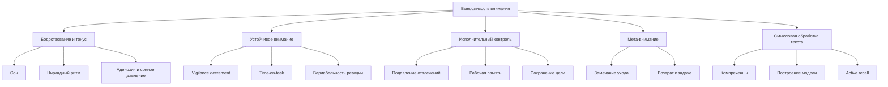
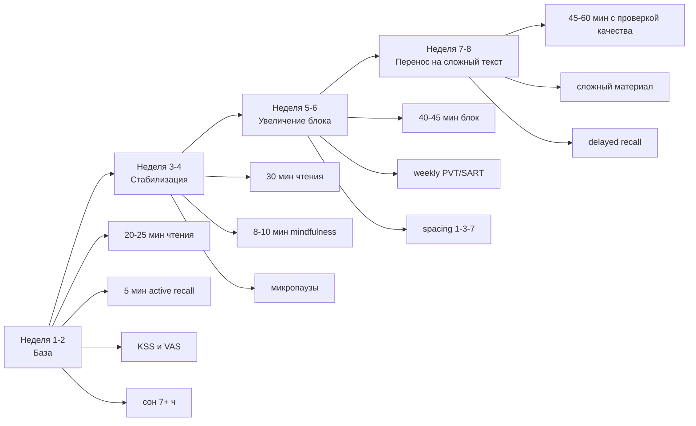

# Корпус источников для книги о выносливости внимания при чтении и обучении

## Executive summary

Для книги о выносливости внимания при чтении и обучении достаточно надежная доказательная база уже существует, но она не распределена по одной дисциплине. Ее приходится собирать на стыке когнитивной психологии, нейронауки внимания, исследований чтения, психофизиологии усталости, науки об обучении и методологии измерений. Наиболее устойчивые опоры для книги таковы: sustained attention и vigilance decrement как ядро проблемы; executive control и рабочая память как механизмы удержания цели; mind wandering как главный конкурент чтению; сон, циркадные факторы и физическая активность как базовые регуляторы; retrieval practice и spacing как сильнейшие интервенции для усвоения; а generic cognitive training и многие коммерческие "тренировки мозга" как область со слабым или спорным переносом. citeturn1search0turn1search19turn1search27turn5search0turn7search11turn7search3turn7search6turn7search28

Если цель книги - не популяризаторское повторение общих мест, а строгий практический труд, то каркас должен строиться не вокруг абстрактной "силы воли", а вокруг нескольких проверяемых тезисов. Во-первых, внимание флуктуирует и распадается не только из-за "истощения", но и из-за скуки, низкой мотивации, переключения на внутренние мысли, циркадного неблагополучия и sleep pressure. Во-вторых, при чтении сложного материала узкое место чаще находится не в скорости движений глаз, а в построении и удержании смысловой модели текста. В-третьих, заметная практическая прибавка в "усвоении в час" обычно достигается не тренировкой глаз, а улучшением сна, режимов нагрузки, борьбы со срывами внимания, активного извлечения из памяти и распределенного повторения. citeturn1search14turn21search11turn21search3turn1search3turn17search5turn11search10turn11search17

По силе доказательств для прикладной части книги на первом месте стоят: нормализация сна и защита циркадного режима; регулярная физическая активность; retrieval practice и spacing; грамотные измерения бдительности и внимания; mindfulness в умеренно осторожной трактовке; и только затем специальные программы тренировки sustained attention. По ограничениям и критике на первом месте стоят: слабый far transfer у brain training, неидеальная валидность некоторых "внимательных" тестов при смешении с мотивацией и скоростной стратегией, а также риск путать субъективное усилие с единым "расходом ресурса". citeturn8search1turn8search0turn7search33turn11search10turn11search20turn1search10turn7search6turn21search0turn21search1turn2search5

Ниже дан не просто список статей, а рабочий комплект для книги: синтез теории, таблицы по интервенциям и измерениям, практические протоколы, каркас глав и аннотированный корпус из более чем 60 источников с приоритетом на первоисточники, крупные обзоры, мета-анализы и официальные документы. Там, где доступны PMC, открытые PDF или официальные публикации, они отмечены как более предпочтительные точки входа. citeturn17search5turn8search2turn14search28

## Как читать и использовать этот корпус

Этот комплект разумно использовать в трех режимах. Для теоретического основания книги нужно чтение "по вертикали": сначала обзоры и мета-анализы по sustained attention, mind wandering, fatigue и reading, затем ключевые первоисточники, которые задают конструкции и методы. Для практических глав нужно чтение "по горизонтали": сон, физическая активность, mindfulness, retrieval practice, spacing, self-alert и pausation сравниваются по силе эффекта, качеству контроля и наличию переноса в реальные учебные задачи. Для главы об измерениях нужен отдельный методический слой: PVT, SART, CPT/CCPT, KSS, MWQ, CFQ и простые VAS нельзя смешивать, потому что они измеряют разные аспекты - от поведенческой бдительности до повседневных срывов внимания и субъективной усталости. citeturn12search3turn23search0turn2search9turn12search1turn13search6turn20search1turn13search22

Для написания книги лучше разделить литературу на "ядерную", "механистическую" и "прикладную". Ядерная литература должна задавать определения и спорные линии: что такое sustained attention, чем executive control отличается от vigilance, как понимать mind wandering и meta-awareness, что реально измеряет SART и когда он начинает смешиваться с speed-accuracy strategy. Механистическая литература нужна, чтобы не скатиться в псевдобиологию: LC-NE, cholinergic control, adenosine, circadian regulation, локальный сон, глутамат и cognitive fatigue надо описывать как исследовательские модели и гипотезы с разной степенью зрелости, а не как завершенную энциклопедию. Прикладная литература должна давать дозированные выводы: что действительно работает для учебы и чтения, а что работает только как near transfer или вообще не выдерживает контроля ожиданий. citeturn5search1turn3search3turn8search1turn5search3turn25search0turn25search1turn21search1

Для книги особенно важно держать в одном поле зрения два разных уровня объяснения. Первый - "момент к моменту": как фокус теряется во время чтения, как меняются вариабельность ответов, eye movements, self-caught/probe-caught reports и ошибки. Второй - "день к дню": как действуют накопленный недосып, циркадный сдвиг, монотонность, мотивация, стресс, привычка к цифровым переключениям и физическая неактивность. Без этого книга получится либо слишком лабораторной, либо слишком советной. citeturn5search15turn15search2turn12search13turn23search19turn10search3

Схема выше - синтетическая модель книги, собранная из исследований sustained attention, mind wandering, executive control и reading comprehension; это не отдельная опубликованная модель, а рабочая композиция для книги. Ее можно защищать эмпирически, потому что каждый слой имеет собственный класс измерений и вмешательств. citeturn1search19turn5search0turn23search21turn1search3

## Синтез доказательств для книги

Теоретическое ядро книги должно исходить из того, что sustained attention - это не "способность долго смотреть в одну точку", а способность поддерживать релевантную обработку и контроль в течение времени, несмотря на скуку, однообразие, снижение arousal, внутренние мысли и time-on-task. Классическая литература о vigilance decrement показывает, что ухудшение наступает как минимум через рост ошибок, вариабельности и замедления, но спор идет о механизме: ресурсное истощение, underload/boredom, opportunity cost и колебания arousal дают частично конкурирующие, а частично совместимые объяснения. Для книги лучше не выбирать одну "верную" теорию, а показывать, где каждая из них объясняет данные лучше. citeturn1search27turn1search1turn21search11turn21search3

Mind wandering для книги - не второстепенная тема, а центральный механизм потери качества чтения. Современные обзоры и эксперименты показывают, что уход внимания от текста связан с perceptual decoupling, ухудшением encoding и падением comprehension; кроме того, важны различия между intentional и unintentional mind wandering, а также между self-caught и probe-caught эпизодами. Для главы о чтении особенно ценны работы, связывающие mind wandering с eye movements, reading behavior и рабочей памятью. citeturn5search0turn5search15turn1search6turn18search1turn18search2turn15search2

Нейрофизиологический слой следует подавать осторожно. Наиболее зрелая линия - LC-NE как система adaptive gain, регулирующая баланс tonic/phasic режима, arousal и готовность к exploitation/exploration; вторая - cholinergic contribution к top-down attentional control; третья - аденозин и sleep pressure как важнейший механизм сонливости и падения vigilant attention; четвертая - local sleep-like slow waves как объяснение кратких lapses даже в бодрствовании; пятая - нейрометаболические модели cognitive fatigue, включая накопление глутамата в control-related cortical regions после длительной demanding work. Но последняя линия пока остается исследовательской и не должна в книге превращаться в бытовое объяснение вроде "в мозге кончилась энергия". citeturn5search1turn5search2turn3search3turn8search1turn5search3turn25search0turn25search1turn26search0

Эмпирика чтения дает несколько жестких ограничений, которые книге полезно проговорить прямо. Быстрочтение в сильных вариантах плохо совместимо с глубоким пониманием; fast readers действительно часто имеют больший perceptual span, но это не означает возможности без потерь "читать блоками" сложный материал; inner speech и phonological coding не являются мусорным побочным процессом и часто поддерживают comprehension; а mindless reading можно регистрировать по поведению глаз, но такие индикаторы не идеальны. В прикладном выводе это означает: для книги стоит различать ознакомительное чтение, сканирование, глубокое учебное чтение и чтение ради применения. citeturn1search3turn24search1turn17search5turn17search0turn15search2turn15search6

На практическом уровне наиболее надежный совет для книги парадоксально прост. Если цель - общее качество усвоения и выносливость при чтении, то первыми вмешательствами должны быть сон и физическая активность, затем организация среды, затем active recall и spacing, затем уже mindfulness и специфические упражнения на давление отвлечений или alertness. Наоборот, generic working-memory training и brain-training программы должны обсуждаться в критической главе: эффект near transfer может быть, но ультимативных доказательств широкого far transfer нет, а дизайн многих работ ослаблен ожиданиями и несовершенным placebo control. citeturn8search1turn7search33turn11search10turn11search20turn19search15turn7search6turn7search28turn21search0turn21search1

## Таблицы, методики и практические протоколы

Таблица ниже - синтетическая оценка силы доказательств. Она не копирует одну конкретную публикацию, а суммирует качество обзоров, наличие мета-анализа, величину эффекта, устойчивость результата и риск артефактов. citeturn8search1turn7search33turn19search15turn7search6turn21search1turn7search11turn11search20

| Интервенция | Сила доказательств | Тип эффекта | Перенос в чтение и обучение | Переносимость | Практический вердикт | Основания |
|---|---|---|---|---|---|---|
| Нормализация сна и защита циркадного режима | Высокая | Сильный для vigilant attention, вариабельности, lapses | Высокий | Средняя, но базовая | Основа всей системы | citeturn8search1turn7search0turn1search14turn1search8 |
| Регулярная физическая активность | Высокая | Малый-средний, но устойчивый для cognition/EF | Средний-высокий | Высокая | Ставить в фундамент книги | citeturn8search0turn7search33turn7search1 |
| Acute exercise перед учебным блоком | Средняя | Небольшой острый выигрыш для EF/скорости | Средний | Высокая | Полезно как практический инструмент | citeturn19search14turn19search6 |
| Retrieval practice | Высокая | Сильный для долговременного удержания | Высокий | Средняя | Ключевой механизм усвоения | citeturn11search10turn11search7turn11search23 |
| Spacing | Высокая | Сильный для retention | Высокий | Высокая | Второй столп практики | citeturn11search20turn7search7 |
| Mindfulness / focused attention practice | Средняя | Малый-средний, неоднородный | Средний | Средняя | Полезно, но без чудес | citeturn1search4turn19search15turn19search7 |
| Brief breaks / rare mental breaks | Средняя | Умеренный эффект на vigilance | Средний | Высокая | Очень практично для длинных блоков | citeturn1search5 |
| Self-alert / alertness training | Низкая-средняя | Обещающий, но узкий | Низкий-средний | Средняя | Использовать как опциональный модуль | citeturn28search0turn28search3 |
| Caffeine как адъювант | Средняя | Помогает при sleep-loss related vigilance deficits | Средний, контекстный | Средняя | Осторожно, не вместо сна | citeturn9search9turn3search2 |
| Generic cognitive training / WM training | Низкая для far transfer | Near transfer выше far transfer | Низкий | Средняя | В критическую главу, не в ядро практики | citeturn7search6turn7search28turn21search0turn21search1 |

Таблица с измерениями нужна, потому что без нее рукопись почти гарантированно смешает "внимание", "сонливость", "усталость" и "ошибки чтения" в один комок. На практике для книги стоит различать поведенческие задачи, саморепорты и reading-specific online measures. citeturn12search3turn23search0turn12search1turn15search6

| Методика | Что измеряет | Длительность | Главные метрики | Где применять | Ограничения | Основания |
|---|---|---|---|---|---|---|
| PVT 10 min | Поведенческая бдительность/alertness | 10 мин | lapses, mean 1/RT, slowest 10% | Сон, time-on-task, baseline alertness | Не reading-specific | citeturn12search3turn12search12 |
| Brief PVT 3 min | Скрининг alertness в полевых условиях | 3 мин | lapses, response speed | Дневник режима, before/after blocks | Ниже чувствительность, чем 10 min | citeturn12search14turn12search6 |
| SART | Sustained attention/lapses under monotony | 5-10 мин | commission errors, RT variability, pre-error speeding | Лаборатория, inexpensive repeated testing | Спорная конструктивная валидность; смешение со стратегией | citeturn23search0turn2search5turn2search8 |
| CPT / CCPT | Sustained attention + inhibition | 10-15 мин | omission/commission, RT, variability | Клиника, исследования индивидуальных различий | Не чистое измерение одного конструкта | citeturn23search1turn2search9turn23search13 |
| KSS | Субъективная сонливость | 1 мин | 9-балльная оценка | Before/after study block, sleep protocols | Саморепорт, чувствителен к контексту | citeturn12search1 |
| VAS fatigue | Субъективная усталость | 1 мин | шкала 0-100 | Короткие repeated measures | Низкая специфичность | citeturn12search7turn13search22 |
| MWQ | Trait-level mind wandering | 2-3 мин | суммарный балл | Базовый профиль отвлекаемости | Не заменяет online probes | citeturn13search6 |
| TUT probes | Task-unrelated thought online | Встроенно | доля off-task thought | Reading/lab experiments | Чувствительны к мотивации и инструкции | citeturn13search15turn21search2 |
| CFQ | Everyday cognitive failures | 5-10 мин | общий балл и подшкалы | Повседневные срывы, trait profile | Не процессное измерение | citeturn20search1 |
| MAAS-LO | Lapses of awareness | 2-3 мин | частота срывов | Ежедневная невнимательность | Тоже trait-like, не task-specific | citeturn20search0 |
| Eye tracking during reading | Online reading control | 10-60 мин | fixation duration, regressions, erratic behavior | Research chapters on reading | Дорого и методически сложно | citeturn15search2turn6search5 |

Ниже - два рекомендуемых протокола. Они являются синтезом из компонент, а не прямой калькой одного RCT; это важно прямо сказать в книге. Их логика опирается на сон, exercise, mindfulness, brief breaks, retrieval practice и spacing. citeturn8search1turn7search33turn1search4turn1search5turn11search10turn11search20

| Протокол | Недели | Расписание | Что измерять | Критерии прогресса |
|---|---|---|---|---|
| 4-недельный базовый | 1-4 | 5 дней в неделю: 20-30 мин глубокого чтения + 5 мин active recall; 8-10 мин mindful breathing 4-5 раз в неделю; 150-300 мин умеренной активности в неделю; 7+ ч сна; 1 короткий weekly PVT/SART check | KSS до блока, VAS fatigue после, 5 тезисов из памяти, weekly PVT или SART | Меньше self-reported mind wandering; стабильные тезисы; меньше lapses/ошибок; увеличение качественного блока до 30-35 мин |
| 8-недельный расширенный | 1-8 | Недели 1-2: как базовый; 3-4: 2 блока по 25-30 мин; 5-6: один тяжелый блок 40-45 мин; 7-8: 45-60 мин с микропаузой и spaced review через 1-3-7 дней | PVT раз в 2 недели; MWQ/CFQ в начале и конце; retention test по материалу через 1 и 7 дней | Рост длины блока без падения пересказа; выше delayed retention; меньше erratic rereading; субъективная нагрузка не растет непропорционально |

Для книги имеет смысл отдельно отметить, что прогресс должен оцениваться не по "длительности сидения", а по комбинации трех классов показателей: поведенческая стабильность, качество понимания и субъективная стоимость блока. Это защищает от типичной ошибки, когда человек учится терпеть скуку, но не сохранять смысл текста. citeturn12search3turn18search1turn13search22

## План книги и план библиографии

Оптимальная структура книги может состоять из 12 глав. Каждая глава ниже очерчена в пределах 1-2 страниц будущего плана и сразу привязана к классу источников, чтобы не возникло провисания между теорией и практикой. Под "ядерной" библиографией здесь понимаются источники, которые следует постоянно цитировать в тексте; под "расширенной" - источники для сносок, методических примечаний и разделов "ограничения". citeturn14search14turn14search28turn23search21

1. Введение: что такое выносливость внимания. Определения, разграничение vigilance, sustained attention, executive control, effort и fatigue; ядро - Langner, Esterman, Smallwood, Diamond; расширение - российские обзоры систем внимания. citeturn1search27turn1search19turn5search0turn23search21turn22search16

2. Архитектура внимания. LC-NE, cholinergic control, arousal, circadian factors, local sleep; ядро - Aston-Jones, Sara, Sarter, Hudson, Andrillon; расширение - Jamadar, Wiehler, Pessiglione. citeturn5search1turn5search2turn3search3turn1search14turn5search3turn25search0turn25search1

3. Почему внимание уплывает. Mind wandering, meta-awareness, boredom, opportunity cost, мотивация; ядро - Smallwood, Seli, Wong, Kurzban; расширение - Seli 2015 о мотивации, Hawkins 2022 о self-reports. citeturn5search13turn5search12turn1search9turn21search3turn21search2turn1search12

4. Чтение как задача внимания. Eye movements, perceptual span, regressions, inner speech, comprehension; ядро - Rayner, Leinenger, Daneman, Reichle; расширение - eye-tracking scoping reviews. citeturn1search3turn6search0turn24search1turn17search5turn17search0turn15search2turn6search5

5. Усталость при чтении и обучении. Time-on-task, mental fatigue, subjective effort, variability; ядро - van der Linden, Boksem, Hopstaken, Pattyn; расширение - Borragán и neuro-metabolic линия. citeturn27view4turn10search0turn10search1turn1search1turn9search12turn25search0

6. Рабочая память и контроль смысла. Роль WMC в reading comprehension, interference control, attention control; ядро - McVay & Kane, Daneman & Merikle, Unsworth meta-analysis; расширение - Baddeley как теоретический фон. citeturn18search2turn18search4turn21search26turn14search25

7. Измерения и диагностика. PVT, SART, CPT, KSS, MWQ, CFQ, diary-based assessment; ядро - Basner, Robertson, Dang, Kaida, Broadbent; расширение - mobile PVT, ecological momentary assessment. citeturn12search3turn23search0turn2search5turn12search1turn20search1turn12search4turn20search5

8. Сон как фундамент внимания. Sleep duration, restriction, recovery, adenosine, caffeine as adjunct not substitute; ядро - AASM/Watson, Lim & Dinges, Hudson, Dinges 1997; расширение - caffeine/sleep review. citeturn8search1turn7search0turn1search8turn1search14turn12search13turn3search2

9. Физическая активность и состояние ума. Chronic exercise, acute exercise, evidence scaling and realistic expectations; ядро - WHO, Singh, Erickson, Chang; расширение - acute cycling meta-analysis. citeturn8search0turn7search33turn7search1turn19search14turn19search6turn19search12

10. Практики управления вниманием. Mindfulness, self-alert, microbreaks, environmental design; ядро - Roy, Zainal, Mrazek, Ariga, O'Connell; расширение - Milewski-Lopez. citeturn1search4turn19search15turn5search20turn1search5turn28search0turn28search3

11. Как реально растет усвоение. Retrieval practice, spacing, active monitoring of comprehension; ядро - Dunlosky, Cepeda, Rowland, Roediger, Pan, Karpicke; расширение - chapter-specific educational applications. citeturn7search11turn11search20turn11search10turn11search0turn11search5turn11search23

12. Ограничения, мифы и критика. Brain training, placebo, expectation effects, speed reading, problems of construct validity; ядро - Melby-Lervåg, Sala, Masurovsky, Boot, Rayner, Dang; расширение - Slattery as balanced review of interventions. citeturn7search6turn7search28turn21search0turn21search1turn1search3turn2search5turn1search10

План библиографии лучше строить в три слоя. Слой А - "основной текст": 35-40 источников, которые реально будут жить в главах и примечаниях. Слой B - "методический": 15-20 источников по тестам, шкалам, ограничениям и конструктивной валидности. Слой C - "дискуссионный": 10-15 источников по спорным механизмам, placebo effects, boredom, energetic/metabolic interpretations и спору о far transfer. Такая структура удобна и для автора, и для редактора, потому что позволяет не перегружать основное повествование деталями методологии, но не терять академическую строгость. citeturn21search1turn2search5turn25search1turn26search0

## Аннотированный корпус источников

Ниже дан корпус из 64 источников. Для каждого источника указаны ссылка через цитату, краткое аннотационное резюме, ключевой вывод, ограничения и релевантность для книги.

1. [Теория] Huang H. et al. "A review of visual sustained attention: neural mechanisms and computational models", 2023. Современный обзор sustained attention с акцентом на нейронные сети, вычислительные модели и причины флуктуаций внимания. Ограничение: это narrative review, а не мета-анализ; для книги полезен как вводный обзор понятий и механизмов. citeturn1search0

2. [Теория] Esterman M., Rothlein D. "Models of sustained attention", 2019. Теоретическое сопоставление моделей arousal, mind wandering, cognitive resource allocation и effort. Ограничение: обзор концептуален и не решает спор окончательно; для книги это хороший каркас главы о competing models. citeturn1search19

3. [Теория] Langner R. et al. "Sustaining attention to simple tasks: a meta-analytic review of the neural mechanisms of vigilant attention", 2013. Крупный мета-анализ нейровизуализационных работ по vigilant attention. Ограничение: задачи часто искусственно просты; для книги это первоклассная опора на нейронный уровень. citeturn1search27

4. [Теория] "Recent theoretical, neural, and clinical advances in sustained attention", 2017. Широкий обзор теорий и клинических применений sustained attention. Ограничение: не reading-specific; для книги полезен для перехода от базовой науки к прикладным нарушениям. citeturn1search23

5. [Теория] Pattyn N. et al. "Psychophysiological investigation of vigilance decrement", 2008. Классическая работа по вопросу, является ли vigilance decrement больше boredom или cognitive fatigue. Ограничение: не закрывает спор о механизме; для книги важна как мост между поведенческими и физиологическими объяснениями. citeturn1search1

6. [Теория] Hockey G.R.J. "Compensatory control in the regulation of human performance under stress and high workload", 1997. Влиятельная когнитивно-энергетическая модель, где fatigue понимается через контроль, перераспределение усилия и цену поддержания результата. Ограничение: модель шире темы чтения; для книги важна как теоретическая альтернатива простому "истощению ресурса". citeturn10search2

7. [Теория] Danckert J., Merrifield C. "Boredom, sustained attention and the default mode network", 2018. Обзор, связывающий boredom, DMN и провалы sustained attention. Ограничение: сильнее объясняет монотонные задачи, чем сложное смысловое чтение; для книги полезен в главе о скуке и underload. citeturn21search11

8. [Теория] Gallen C.L. et al. "Contribution of sustained attention abilities to real-world outcomes", 2023. Показано, что sustained attention предсказывает значимые реальные исходы и развивается неодинаково у людей. Ограничение: не про чтение напрямую; для книги ценен как аргумент, что речь идет не о лабораторной мелочи. citeturn1search13

9. [Теория] Unsworth N. et al. "Individual differences in attention control: A meta-analysis and re-analysis of latent variable studies", 2024. Большой количественный обзор подтверждает существование широкого attention control factor, связанного с working memory, reading comprehension и task-unrelated thoughts. Ограничение: это индивидуальные различия, а не интервенции; для книги это опора на связь внимания и понимания текста. citeturn3search4

10. [Mind wandering] Smallwood J., Schooler J.W. "The restless mind", 2006. Классический обзор, который сделал mind wandering центральной проблемой исследований внимания. Ограничение: ранняя фаза поля; для книги важен как исторический источник и для главы о смене парадигмы. citeturn5search13

11. [Mind wandering] Smallwood J., Schooler J.W. "The science of mind wandering: empirically navigating the stream of consciousness", 2015. Один из главных современных обзоров по mind wandering, феноменологии, функциям и метакогниции. Ограничение: обзор широк и не заточен под reading; для книги это обязательный ядерный источник. citeturn5search0

12. [Mind wandering] Seli P. et al. "Mind-Wandering as a Natural Kind: A Family-Resemblances View", 2018. Работа показывает, что "mind wandering" - гетерогенный конструкт, а не одна вещь. Ограничение: концептуальная, не интервенционная; для книги важна, чтобы избежать грубых определений. citeturn5search12

13. [Mind wandering] Wong Y.S. et al. "Reconceptualizing mind wandering from a switching perspective", 2023. Обзор предлагает смотреть на mind wandering через cognitive flexibility и переключение. Ограничение: новая рамка еще не доминирует; для книги полезно в дискуссионной части. citeturn1search9

14. [Mind wandering] Schooler J.W. et al. "Meta-awareness, perceptual decoupling and the wandering mind", 2011. Ключевая работа о различии между самим уходом внимания и осознанием этого ухода. Ограничение: концептуальна; для книги нужна как основа главы о meta-awareness. citeturn5search15

15. [Mind wandering] Randall J.G. et al. "Mind-wandering, cognition, and performance: a theory-driven meta-analysis", 2014. Мета-анализ показывает, что mind wandering систематически связан с ухудшением performance, но величина эффекта зависит от task demands и ресурсов. Ограничение: неоднородность операционализаций; для книги это один из лучших количественных источников. citeturn21search20

16. [Mind wandering и память] Blondé P. et al. "A systematic review on the influence of mind wandering on memory", 2022. Систематический обзор подтверждает, что stimulus-independent mind wandering обычно ухудшает encoding. Ограничение: не все задачи эквивалентны чтению; для книги это хорошее основание для разговора об усвоении материала. citeturn1search6

17. [Русский обзор] Костина Н.А. и соавт. "Феномен 'ухода в свои мысли' и его изучение", 2017. Русскоязычное введение в mind wandering, терминологию и ключевые линии исследования. Ограничение: не заменяет англоязычные обзоры и мета-анализы; для книги полезно как русский входной текст и терминологическая опора. citeturn4search3

18. [Русский обзор] Мачинская Р.И. "Нейрофизиологические механизмы произвольного внимания", 2003. Русский аналитический обзор внимания как функции контроля и регуляции поведения. Ограничение: до современной волны работ по mind wandering и LC-NE; для книги полезен как отечественный теоретический контекст. citeturn4search1

19. [Русский обзор] Воронин Н.А. "Современные представления о системах внимания", 2016. Русскоязычный обзор развития представлений о нейросетях внимания и их пластичности. Ограничение: не привязан к чтению; для книги хорош как обзорный отечественный источник по attention systems. citeturn22search16

20. [Нейрофизиология] Aston-Jones G., Cohen J. "An integrative theory of locus coeruleus-norepinephrine function", 2005. Классическая adaptive gain theory LC-NE, одна из самых цитируемых работ в области arousal и внимания. Ограничение: теоретическая модель, которой позже добавляли нюансы; для книги незаменима в нейробиологической части. citeturn5search1

21. [Нейрофизиология] Sara S.J. "The locus coeruleus and noradrenergic modulation of cognition", 2009. Ключевой обзор роли LC в внимании, ориентировке и памяти. Ограничение: до недавних high-resolution исследований LC; для книги он полезен как мост между молекулярным и когнитивным уровнем. citeturn5search2

22. [Нейрофизиология] Poe G.R. et al. "Locus coeruleus: a new look at the blue spot", 2020. Современный обзор функциональной неоднородности LC и более тонкой организации его проекций. Ограничение: сложен для неподготовленного читателя; для книги хорош в продвинутой главе или рамке "что изменилось в последние годы". citeturn5search11

23. [Нейрофизиология] Berridge C.W., Waterhouse B.D. "The locus coeruleus-noradrenergic system", 2003. Классический обзор системной роли LC-NE. Ограничение: старше современных методов; для книги полезен как исторически важный фундамент. citeturn5search14

24. [Нейрофизиология] Sarter M. et al. "Deficits in attentional control: cholinergic mechanisms and circuitry-based treatment approaches", 2011. Обзор холинергических механизмов attentional control, distractibility и lapses. Ограничение: сильный клинический акцент; для книги полезен, чтобы не сводить все к одному норадреналину. citeturn3search3

25. [Сон и бодрствование] Zeitzer J.M. "Control of sleep and wakefulness in health and disease", 2013. Обзор нейробиологии регуляции сна и бодрствования. Ограничение: книга/глава обзорного типа; для книги полезна как общий физиологический фон. citeturn3search8

26. [Официальный документ] Watson N.F. et al. "Recommended Amount of Sleep for a Healthy Adult", 2015. Официальный консенсус AASM/SRS о необходимости 7 и более часов сна у взрослых на регулярной основе. Ограничение: это guideline, а не механизм; для книги это практический нормативный ориентир. citeturn7search0

27. [Официальный документ] "Joint Consensus Statement of the American Academy of Sleep Medicine and Sleep Research Society", 2015. Методологическое описание того, как был построен sleep-duration consensus. Ограничение: не про конкретно чтение и учение; для книги важно как официальный опорный документ. citeturn8search1

28. [Сон и внимание] Hudson A.N. et al. "Sleep deprivation, vigilant attention, and brain function: a review", 2020. Современный обзор того, как недосып бьет по vigilant attention и response variability, включая тему trait vulnerability. Ограничение: не centered on education; для книги это один из лучших обзорных источников по цене недосыпа. citeturn1search14

29. [Сон и внимание] Lim J., Dinges D.F. "Sleep deprivation and vigilant attention", 2008. Классический обзор про PVT, lapses и уязвимость vigilant attention к sleep loss. Ограничение: центрируется на sleep research; для книги необходим в главе о базовом физиологическом фундаменте внимания. citeturn1search8

30. [Сон и внимание] Doran S.M. et al. "Sustained attention performance during sleep deprivation", 2001. Первоклассный первоисточник о распаде sustained attention при длительном бодрствовании. Ограничение: жесткий лабораторный протокол; для книги полезен как демонстрация механики lapses. citeturn21search14

31. [Сон и внимание] Dinges D.F. et al. "Cumulative sleepiness, mood disturbance, and psychomotor vigilance performance decrements", 1997. Классическая работа по кумулятивным последствиям ограничения сна и ухудшению PVT. Ограничение: не educational design; для книги важна как первоисточник по накопительному эффекту недосыпа. citeturn12search13

32. [Локальный сон] Andrillon T. et al. "Predicting lapses of attention with sleep-like slow waves", 2021. Очень важная работа о local sleep-like activity как физиологической основе attentional lapses. Ограничение: лабораторная сложность и еще развивающаяся линия; для книги это сильный нейрофизиологический акцент. citeturn5search3

33. [ERP и mind wandering] Kam J.W.Y. "Electrophysiological markers of mind wandering", 2022. Обзор EEG/ERP-маркеров mind wandering, включая редукцию сенсорных ERP компонентов. Ограничение: не все маркеры одинаково специфичны; для книги полезен в главе о measurable signatures. citeturn1search2

34. [Когнитивная усталость] van der Linden D. et al. "Mental fatigue and the control of cognitive processes", 2003. Эксперимент показывает, что после 2 часов demanding work страдают planning и flexibility больше, чем простая memory task. Ограничение: лабораторная fatigue induction; для книги это центральный первоисточник по executive cost of fatigue. citeturn27view4

35. [Когнитивная усталость] Boksem M.A.S., Tops M. "Mental fatigue: costs and benefits", 2008. Влиятельный обзор, трактующий fatigue через баланс затрат, вознаграждения и адаптивного disengagement. Ограничение: частью концептуален; для книги нужен в споре с простыми "батареечными" метафорами. citeturn10search0

36. [Когнитивная усталость] Hopstaken J.F. et al. "Task disengagement and mental fatigue covary with pupil dynamics", 2015. Работа показывает связь fatigue/disengagement с показателями pupil size. Ограничение: лабораторная валидность не тождественна полевым ситуациям; для книги полезна для главы об объективных индикаторах. citeturn10search1

37. [Когнитивная усталость] Hopstaken J.F. et al. "A multifaceted investigation of the link between mental fatigue and task disengagement", 2015. С ростом fatigue ухудшаются performance, P3 и pupil measures, но вознаграждение частично модулирует картину. Ограничение: это не прямой reading task; для книги источник особенно ценен для темы мотивации. citeturn10search5

38. [Когнитивная усталость] Boksem M.A.S. et al. "Effects of mental fatigue on attention: an ERP study", 2005. Показан рост misses/false alarms и снижение эффективности обработки при fatigue. Ограничение: старый ERP design; для книги полезен как первоисточник поведенческих и нейрофизиологических сдвигов. citeturn9search1

39. [Когнитивная усталость] Borragán G. et al. "Cognitive fatigue: A Time-based Resource-sharing account", 2017. Предлагается TBRS-объяснение cognitive fatigue через processing time-related load и падение alertness. Ограничение: одна модель среди других; для книги полезно как дискуссионное расширение. citeturn9search12

40. [Нейрометаболизм] Wiehler A. et al. "A neuro-metabolic account of why daylong cognitive work alters the control of economic decisions", 2022. Влиятельный первоисточник про глутамат в lateral prefrontal cortex после длительной когнитивной нагрузки. Ограничение: нельзя напрямую редуцировать всю fatigue к глутамату; для книги нужен как осторожная mechanistic chapter. citeturn25search0

41. [Нейрометаболизм] "Origins and consequences of cognitive fatigue", 2025. Современный обзор, предлагающий метаболические изменения в control-related brain regions как основу fatigue. Ограничение: обзор нового поколения, часть тезисов еще дискуссионна; для книги полезен для актуализации поля. citeturn25search1

42. [Метаболизм] Jamadar S.D. et al. "The metabolic costs of cognition", 2025. Современный обзор о метаболической цене cognition и ограничениях энергетических метафор. Ограничение: не специализирован на attention endurance; для книги особенно ценен как antidote против упрощенного "мозг сжег ресурс". citeturn26search0

43. [Чтение] Rayner K. et al. "How Do We Read, and Can Speed Reading Help?", 2016. Один из самых важных обзорных текстов против завышенных обещаний speed reading; показывает trade-off speed-accuracy. Ограничение: не о всех новых digital reading вопросах; для книги это обязательный источник. citeturn1search3

44. [Чтение] Rayner K. "Eye movements and attention in reading, scene perception, and visual search", 2009. Большой обзор по движению глаз, perceptual span, preview benefit и роли внимания в чтении. Ограничение: обзор огромен и требует отбора; для книги базовый reading-science anchor. citeturn6search0

45. [Чтение] Rayner K. et al. "Eye movements, the perceptual span, and reading speed", 2010. Показано, что быстрые читатели имеют больший perceptual span, но это не отменяет ограничений comprehension. Ограничение: речь о skilled readers, не о training effects; для книги особенно полезен против спекуляций о "расширении поля зрения". citeturn24search1

46. [Чтение] Rayner K. et al. "Eye Movements in Reading: Models and Data", 2009. Обзор моделей E-Z Reader и SWIFT и данных по контролю глазодвигательного поведения в чтении. Ограничение: технически насыщен; для книги важен для методически строгой главы о том, что действительно известно о reading process. citeturn14search23

47. [Чтение и inner speech] Leinenger M. "Phonological coding during reading", 2014. Один из лучших обзоров по phonological coding, inner voice и silent reading. Ограничение: это обзор, а не единый эксперимент; для книги незаменим в разделе о субвокализации. Открытый доступ: PMC. citeturn17search5

48. [Чтение и inner speech] Daneman M., Newson M. "Assessing the importance of subvocalization during normal silent reading", 1992. Эксперимент показывает, что concurrent speaking ухудшает comprehension и recall details/gist. Ограничение: парадигма мешающей артикуляции не равна обычному чтению; для книги нужен как первоисточник против идеи о полной бесполезности субвокализации. citeturn17search0

49. [Чтение и mind wandering] Reichle E.D. et al. "Eye movements during mindless reading", 2010. Очень важный первоисточник: при mindless reading фиксации длиннее и меньше зависят от лингвистических факторов. Ограничение: индикаторы не идеальны для индивидуальной диагностики; для книги это один из лучших reading-specific экспериментов. citeturn15search2

50. [Чтение и mind wandering] Franklin M.S. et al. "Using behavioral indices to detect mindless reading in real time", 2011. Попытка распознавать mindless reading по поведенческим индексам. Ограничение: real-time detection остается сложной задачей; для книги хороший источник о перспективах и границах диагностики. citeturn15search1

51. [Чтение и coherence] Smallwood J. et al. "The curious incident of the wandering mind", 2008. Показывает, что zoning out при чтении связано с провалом построения situation model текста. Ограничение: узкий экспериментальный контекст; для книги очень хорош для объяснения, почему глаза еще читают, а смысл уже нет. citeturn15search4

52. [Чтение и comprehension] Bonifacci P. et al. "The relationship between mind wandering and reading comprehension", 2023. Современный обзор и/или синтез по связи mind wandering и reading comprehension. Ограничение: область неоднородна по задачам и возрастам; для книги полезен как актуализирующий обзор. citeturn1search18

53. [Чтение и working memory] Unsworth N., McMillan B. "Mind wandering and reading comprehension", 2013. Показано, что на чтение влияет working memory capacity, topic interest и motivation через mind wandering. Ограничение: выборка и задачи лабораторны; для книги это очень сильный источник о механике comprehension failures. citeturn18search1

54. [Чтение и working memory] McVay J.C., Kane M.J. "Why does working memory capacity predict variation in reading comprehension?", 2012. Показано, что mind wandering существенно медиирует связь WMC и reading comprehension. Ограничение: медиаторный анализ не исчерпывает причинность; для книги один из главных источников по связи WM и чтения. citeturn18search2

55. [Чтение и working memory] Daneman M., Merikle P.M. "Working memory and language comprehension: a meta-analysis", 1996. Классический мета-анализ по связи WM measures и language comprehension. Ограничение: старое состояние поля; для книги исторически и методически очень важен. citeturn18search4

56. [Измерения] Basner M., Dinges D.F. "Maximizing sensitivity of the psychomotor vigilance test", 2011. Одна из главных работ по тому, какие PVT metrics действительно чувствительны к sleep loss. Ограничение: PVT измеряет alertness, а не comprehension; для книги нужен как методический стандарт. citeturn12search3

57. [Измерения] Basner M. et al. "Validity and Sensitivity of a Brief Psychomotor Vigilance Test", 2011. Валидация короткой версии PVT для полевых и прикладных условий. Ограничение: brief versions жертвуют частью чувствительности; для книги хорош как практический инструмент мониторинга. citeturn12search14

58. [Измерения] Robertson I.H. et al. "Performance correlates of everyday attentional failures in traumatic brain injured and normal subjects", 1997. Классический первоисточник SART; ошибки предсказываются ускорением RT перед срывом. Ограничение: задача не чисто reading-related; для книги это обязательное происхождение SART. citeturn23search0

59. [Критика измерений] Dang J. et al. "You are measuring the decision to be fast, not inattention", 2018. Важная критика SART: часть вариации может отражать strategy rather than pure inattention. Ограничение: критика не аннулирует SART полностью; для книги это необходимо для раздела "чего тесты не измеряют". citeturn2search5

60. [Критика измерений] Dillard M.B. et al. "The SART does not promote mindlessness", 2014. Скептическая оценка валидности SART как средства провоцировать mindlessness. Ограничение: спор касается некоторых интерпретаций, а не всей задачи; для книги полезен как баланс. citeturn2search8

61. [Измерения] Riccio C.A. et al. "Continuous Performance Tests are sensitive to ADHD in adults but lack specificity", 2001. Обзор CPT показывает высокую чувствительность, но проблемную специфичность. Ограничение: клинический фокус; для книги важен, чтобы не переоценивать CPT как "чистое внимание". citeturn23search1

62. [Измерения] Shalev L. et al. "Conjunctive Continuous Performance Task (CCPT): a pure measure of sustained attention?", 2011. Попытка сконструировать более чистую CPT-парадигму с минимальными сторонними компонентами. Ограничение: "чистота" относительна; для книги полезно в методическом сравнении задач. citeturn2search9

63. [Измерения] Kaida K. et al. "Validation of the Karolinska Sleepiness Scale", 2006. Хорошо валидированная субъективная шкала сонливости, связанная с EEG и поведением. Ограничение: все же саморепорт; для книги полезна как дешевая repeated measure шкала. citeturn12search1

64. [Измерения] Broadbent D.E. et al. "The Cognitive Failures Questionnaire", 1982. Классическая шкала повседневных когнитивных ошибок. Ограничение: trait-like и ретроспективна; для книги полезна как фон профиля внимания вне лаборатории. citeturn20search1

65. [Измерения] Cheyne J.A. et al. "Lapses of conscious awareness and everyday cognitive failures", 2006. Создана короткая шкала кратких срывов sustained attention в повседневности. Ограничение: тоже саморепорт; для книги полезна как комплементарная к CFQ мера. citeturn20search0

66. [Измерения] Mrazek M.D. et al. "Validation of the Mind-Wandering Questionnaire", 2013. Валидация MWQ на нескольких возрастных выборках. Ограничение: не online measure; для книги полезен для trait-level раздела по mind wandering. citeturn13search6

67. [Измерения] Cella M., Chalder T. "Measuring fatigue in clinical and community settings", 2010. Обзор и развитие fatigue measures, включая различение mental/physical fatigue. Ограничение: шире, чем внимание; для книги нужен как точка входа в self-report fatigue. citeturn13search22

68. [Интервенции] Slattery E.J. et al. "Popular interventions to enhance sustained attention in healthy individuals", 2022. Систематический обзор cognitive training, mindfulness и exercise/intervention literature по sustained attention. Ограничение: heterogeneous protocols и mixed quality; для книги это лучший обзор для сравнительной прикладной главы. citeturn1search10

69. [Интервенции] Roy A. et al. "The impact of meditation on sustained attention", 2024. Новый обзор здоровых популяций: meditation часто показывает позитивные эффекты на sustained attention, но исследования неоднородны. Ограничение: немного качественных RCT и разные практики; для книги хороший актуальный балансированный источник. citeturn1search4

70. [Интервенции] Zainal N.H., Newman M.G. "Mindfulness enhances cognitive functioning: a meta-analysis", 2024. Мета-анализ сообщает малые-средние эффекты MBI на global cognition и executive attention. Ограничение: эффекты неоднородны и зависят от дизайна; для книги важен как количественная база по mindfulness. citeturn19search15

71. [Интервенции] Goyal M. et al. "Meditation programs for psychological stress and well-being", 2014. Авторитетный AHRQ-sponsored review: для внимания и ряда когнитивных исходов доказательств было мало или недостаточно. Ограничение: поле с тех пор выросло; для книги это необходимый трезвый контрапункт. citeturn19search7

72. [Интервенции] Mrazek M.D. et al. "Finding convergence through opposing constructs", 2012. Даже 8 минут mindful breathing сокращали behavioral indicators of mind wandering в SART. Ограничение: очень краткосрочный эффект; для книги полезен как минималистичный вход в practice-based interventions. citeturn5search20

73. [Интервенции] Mrazek M.D. et al. "Mindfulness training improves working memory capacity and GRE performance", 2013. Знаковая работа: mindfulness training снижала distracting thoughts и улучшала WMC и reading-related academic performance. Ограничение: специфическая популяция и короткий курс; для книги хороший, но не единственный аргумент. citeturn18search3

74. [Интервенции] Chang Y.K. et al. "The effects of acute exercise on cognitive performance", 2012. Один из главных мета-анализов об остром эффекте exercise на cognition. Ограничение: эффекты обычно небольшие; для книги полезен для практики "размять тело перед тяжелым чтением". citeturn19search14

75. [Интервенции] Ludyga S. et al. "Acute effects of moderate aerobic exercise on specific aspects of executive function", 2016. Мета-анализ показывает дифференцированные acute exercise effects по компонентам EF. Ограничение: фокус на EF, а не прямо на reading endurance; для книги полезен как тонкая поправка к общему meta-выводу. citeturn19search6

76. [Интервенции] Singh B. et al. "Effectiveness of exercise for improving cognition, memory and executive function", 2025. Umbrella review/meta-meta-analysis сообщает сильную общую пользу exercise даже при легкой интенсивности. Ограничение: объединяет разные популяции; для книги это сильный современный источник высокого уровня. citeturn7search33

77. [Официальный документ] WHO "Guidelines on physical activity and sedentary behaviour", 2020. Официальные рекомендации по 150-300 минутам умеренной активности в неделю для взрослых. Ограничение: guideline, а не когнитивный RCT; для книги это нормативная практическая рамка. Открытый доступ: WHO. citeturn8search0turn8search2

78. [Интервенции] Erickson K.I. et al. "Physical Activity, Cognition, and Brain Outcomes", 2019. Официально-подобный консенсусный обзор о связи PA, cognition и brain outcomes across lifespan. Ограничение: не сводится к sustained attention; для книги хорош как мост от guidelines к когнитивной механике. citeturn7search1

79. [Интервенции] Melby-Lervåg M. et al. "Working Memory Training Does Not Improve ... Far Transfer", 2016. Сильный мета-анализ против широких заявлений о far transfer WM training. Ограничение: не все training paradigms одинаковы; для книги обязательный антидот к brain-training hype. citeturn7search6

80. [Интервенции] Sala G., Gobet F. "Cognitive Training Does Not Enhance General Cognition", 2019. Сильная критическая статья и обзор против широких claims о cognitive training. Ограничение: часть исследователей спорит с силой формулировки; для книги нужен в критической главе. citeturn7search28

81. [Критика интервенций] Masurovsky A. et al. "Controlling for Placebo Effects in Computerized Cognitive Training", 2020. Обзор показывает слабый placebo control во многих исследованиях cognitive training. Ограничение: сфокусирован на older adults и recent studies; для книги это необходимый методологический аргумент. citeturn21search0

82. [Критика интервенций] Boot W.R. et al. "Why Active Control Groups Are Not Sufficient to Rule Out Placebo Effects", 2013. Один из лучших методологических текстов о том, почему active control без matched expectations не решает проблему placebo. Ограничение: не узко про attention training; для книги это must-have для главы о дизайне исследований. citeturn21search1

83. [Обучение] Dunlosky J. et al. "Improving Students' Learning With Effective Learning Techniques", 2013. Одна из главных монографий по техникам обучения; retrieval practice и distributed practice среди наиболее сильных, перечитывание и подчеркивание значительно слабее. Ограничение: это обзор 10 техник, а не книга про внимание; для вашей книги это центральная прикладная опора. citeturn7search11

84. [Обучение] Cepeda N.J. et al. "Distributed practice in verbal recall tasks: A review and quantitative synthesis", 2006. Классический мета-анализ spacing effect. Ограничение: значительная вариативность задач и интервалов; для книги это основной количественный источник по distributed practice. citeturn11search20

85. [Обучение] Cepeda N.J. et al. "Spacing effects in learning: a temporal ridgeline of optimal retention", 2008. Эмпирическая работа показывает, что оптимальный gap зависит от retention interval. Ограничение: не охватывает все типы материалов; для книги полезно для конкретных рекомендаций по расписанию повторений. citeturn7search7

86. [Обучение] Roediger H.L., Karpicke J.D. "Taking memory tests improves long-term retention", 2006. Классический первоисточник testing effect. Ограничение: лабораторный дизайн; для книги это фундамент active recall. citeturn11search0

87. [Обучение] Rowland C.A. "The effect of testing versus restudy on retention: a meta-analysis", 2014. Большой мета-анализ testing effect против restudy. Ограничение: вариативность задач и задержек; для книги это один из самых сильных количественных источников по retrieval practice. citeturn11search10

88. [Обучение] Pan S.C., Rickard T.C. "Transfer of Test-Enhanced Learning: Meta-analytic Review", 2018. Мета-анализ о переносе testing effect за пределы прямого повторения фактов. Ограничение: transfer тоже не универсален; для книги очень ценен, потому что помогает не завышать обещания. citeturn11search5

89. [Обучение] Roediger H.L., Butler A.C. "The critical role of retrieval practice in long-term retention", 2011. Обзор и синтез по retrieval practice как мощному enhancer памяти. Ограничение: не охватывает всю современную образовательную аналитику; для книги это очень удобный обзорный источник. citeturn11search7

90. [Обучение] Soderstrom N.C., Bjork R.A. "The Critical Importance of Retrieval - and Spacing", 2016. Практически очень удачная статья, объясняющая why desirable difficulties matter. Ограничение: не мета-анализ; для книги полезна как мост между наукой и практикой обучения. citeturn11search17

91. [Обучение] Karpicke J.D., Blunt J.R. "Retrieval practice produces more learning than elaborative studying with concept mapping", 2011. Очень цитируемая работа, полезная для борьбы с интуицией, что "красивый конспект" всегда лучше. Ограничение: конкретный comparison design; для книги сильна как ясный практический контраст. citeturn11search23

92. [Интервенции внимания] Ariga A., Lleras A. "Brief and rare mental 'breaks' keep you focused", 2011. Хороший первоисточник о пользе редких коротких перерывов для предотвращения vigilance decrement. Ограничение: не всякий break одинаково полезен; для книги это сильный аргумент против непрерывного "героического" сидения. citeturn1search5

93. [Интервенции внимания] O'Connell R.G. et al. "Self-Alert Training: volitional modulation of autonomic arousal and sustained attention", 2008. Показано, что volitional modulation of arousal может улучшать sustained attention. Ограничение: узкий intervention tradition и не массово реплицированное решение; для книги хорошо как дополнительный продвинутый модуль. citeturn28search0

94. [Интервенции внимания] Milewski-Lopez A. et al. "An evaluation of alertness training for older adults", 2014. Плацебо-контролируемая оценка biofeedback-aided alertness training с улучшением sustained attention. Ограничение: старшие взрослые и специфический протокол; для книги полезно как пример узкоспециализированного, но не магического тренинга. Открытый доступ: PMC. citeturn28search3

95. [Книги] Hockey R. "The Psychology of Fatigue: Work, Effort and Control", 2013. Крупная академическая монография, полезная для главы о fatigue как регуляторном и мотивационном сигнале, а не только как "исчерпании". Ограничение: книга, а не систематический обзор; для рукописи это важный глубинный фон. citeturn14search28

96. [Книги] Baddeley A. "Working Memory, Thought, and Action", 2007. Каноническая книга по working memory и ее месту в мышлении, comprehension и действии. Ограничение: не внимание-специфична; для книги это основная теоретическая опора по рабочей памяти. citeturn14search25

97. [Книги] Nobre A.C., Kastner S. "The Oxford Handbook of Attention", 2014. Большой академический справочник по attention research. Ограничение: формат handbook означает неравномерную глубину глав; для книги это полезный мета-источник и дорожная карта дисциплины. citeturn14search14

98. [Русский обзор] Виленская Г.А. "Исполнительные функции: природа и развитие", 2016. Русскоязычный обзор по executor functions, включая working memory и self-regulation. Ограничение: не centered on reading; для книги полезен как отечественный контекст главы об executive control. citeturn22search13

99. [Русский обзор] Войтов В.К. "Рабочая память как перспективный конструкт", 2015. Русскоязычный обзор теоретической и прикладной роли working memory. Ограничение: обзорный и не фокусируется на attention endurance; для книги ценен как русская опора на WM. citeturn22search15

100. [Критика мотивации] Seli P. et al. "Implications for assessments of task-unrelated thought", 2015. Показывает, что reports of mind wandering связаны и с мотивацией к выполнению задачи. Ограничение: не отменяет конструкта MW, а усложняет его; для книги важен как методологическое предостережение. citeturn21search2

101. [Критика усилия] Kurzban R. et al. "An opportunity cost model of subjective effort and task performance", 2013. Влиятельная теория субъективного усилия как сигнала о выгодах и альтернативных издержках, а не просто об истощении. Ограничение: теория остается спорной; для книги очень полезна в интерпретации "не могу продолжать". citeturn21search3

102. [Индивидуальные различия] Hawkins G.E. et al. "Self-reported mind wandering reflects executive control lapses more than working memory limits", 2022. Современная работа о том, что MW self-reports тесно связаны с executive control impairments. Ограничение: саморепорты по природе ограничены; для книги полезно как уточнение связи MW и control. citeturn1search12

103. [Everyday failures] Smilek D. et al. "Failures of sustained attention in life, lab, and brain", 2010. Обзор о том, как лабораторные indices sustained attention соотносятся с повседневными cognitive failures. Ограничение: часть меры спорна; для книги это важный мост между лабораторией и реальной учебой. citeturn2search2

104. [Повседневные срывы] Carriere J.S.A. et al. "Everyday attention lapses and memory failures", 2008. Показаны связи между self-reported attention lapses и memory failures. Ограничение: корреляционность; для книги полезно как аргумент, что everyday mindlessness имеет практические последствия. citeturn20search6

105. [Сон и mind wandering] Cárdenas-Egúsquiza A.L. et al. "Sleep well, mind wander less", 2022. Систематический обзор связи сна и spontaneous cognition. Ограничение: поле еще неоднородно; для книги это удобный мост между sleep hygiene и устойчивостью внимания. citeturn1search21

106. [Чтение и экология] Brishtel I. et al. "Mind Wandering in a Multimodal Reading Setting", 2020. Работа рассматривает MW в более приближенной к реальности мультимодальной среде чтения. Ограничение: не базовый теоретический источник; для книги полезна для главы о цифровом чтении и контекстах. citeturn0search7

107. [Self-report validity] Kane M.J. et al. "Testing the construct validity of competing measurement approaches to mind wandering", 2021. Важная методологическая работа о валидности different MW measures. Ограничение: сложна для популярного изложения; для книги необходима в разделе про методы. citeturn13search15

108. [PVT field methods] Price E. et al. "Validation of a Smartphone-Based Approach to In Situ Cognitive Fatigue Assessment", 2017. Показана валидность мобильного PVT-подхода для полевого измерения alertness/fatigue. Ограничение: смартфон и среда вносят шум; для книги полезен в главе о self-tracking. citeturn12search4

109. [Чтение and speech] Filik R., Barber E. "Inner Speech during Silent Reading Reflects the Reader's Regional Accent", 2011. Изящное подтверждение того, что inner speech при silent reading реально отражает фонологические особенности читателя. Ограничение: не про comprehension cost/benefit напрямую; для книги полезно против мифа, что inner voice - чистая иллюзия. citeturn17search13

110. [Практический reading outcome] Roberts B.R.T. et al. "Reading text aloud benefits memory but not comprehension", 2024. Современная работа показывает, что reading aloud может усиливать memory, но не обязательно comprehension. Ограничение: это не argument за чтение вслух как универсальную технику; для книги полезно как тонкое уточнение про production effect. citeturn18search18

Этого корпуса достаточно для написания строгой книги. Если держать основной текст на слоях A и B библиографии, а спорные и расширяющие линии выносить в рамки, примечания и приложения, книга получится одновременно академически надежной и практически применимой. citeturn14search14turn14search28turn7search11turn1search10
