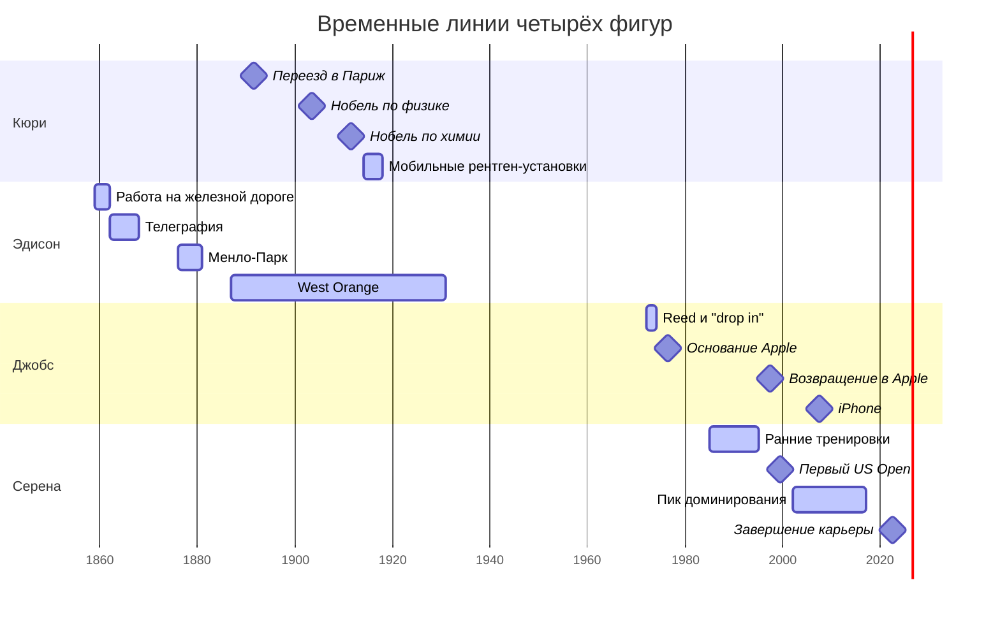
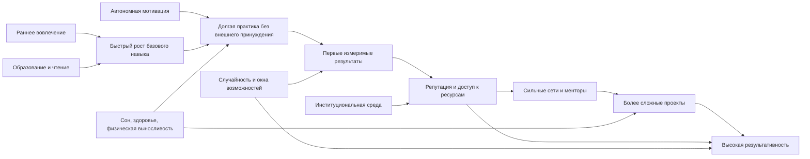

# Высокая активность и результативность великих людей прошлого и современности

## Executive summary

Феномен исключительной активности у выдающихся людей не сводится ни к "врождённому гению", ни к одной дисциплинарной привычке. По совокупности биографий и исследований лучше всего работает многофакторная модель: раннее вовлечение в сложную деятельность, доступ к инструментам и среде, сильная автономная мотивация, многолетняя практика с обратной связью, способность выдерживать длительные периоды неопределённости, а также институциональные эффекты накопления преимуществ. Наиболее устойчивые общие черты в этой выборке: очень ранний контакт с доменом, высокая терпимость к монотонной работе и ошибкам, плотные сети менторов и соавторов, а также умение конвертировать локальные успехи в новые ресурсы и новые задачи. citeturn20view0turn21view0turn22view1turn32view0turn33view3turn6search17turn7search26turn7search3

При этом "универсального режима" не существует. У Франклина результативность шла через самонаблюдение и дисциплину; у Леонардо и Пикассо - через экстремальную визуальную продукцию и переходы между задачами; у Эдисона и Джобса - через организацию команд и производственных систем; у Кюри и Карико - через годы низкостатусной, но настойчивой научной работы; у Серены Уильямс и Магнуса Карлсена - через раннюю специализацию, соревновательный стресс и тонкую настройку навыка. Это скорее семейство траекторий, чем один тип личности. citeturn19view0turn19view2turn19view4turn22view0turn31view2turn15view0turn33view0

С инженерной точки зрения продуктивность здесь лучше трактовать как функцию пяти блоков: когнитивная мощность и обучаемость, направленная практика, энергетическая устойчивость, сетевой капитал, институциональное усиление. Из этого можно собрать воспроизводимый алгоритм повышения результативности: рано выбрать "ядро домена", быстро нарастить часы deliberate practice, строить сеть сильной обратной связи, защищать сон и физическую выносливость, системно капитализировать достижения. Доказательная база сильнее всего для сна, образования, физической активности и накопительного карьерного эффекта; слабее - для популярных нарративов о "грит", режимах гениев и ретроспективных биографических объяснениях. citeturn6search22turn7search26turn7search3turn7search12turn6search16turn6search24turn6search17turn6search11turn6search23

## Выборка и логика отбора

Я выбрал 10 фигур из разных эпох и сфер, чтобы избежать узкой модели "успеха только в науке" или "только в бизнесе". Критерии были три: разнообразие доменов, наличие архивно подтверждаемых результатов и наличие источников о раннем развитии, карьере и рабочих практиках. В выборке есть наука, искусство, бизнес, политика, изобретательство и спорт. Это снижает риск перепутать свойства конкретной профессии с более общими механизмами результативности. citeturn20view0turn21view0turn22view0turn19view4turn25view1turn31view2turn15view1turn33view0

| Фигура | Сфера | Почему включена | Основные источники |
|---|---|---|---|
| Леонардо да Винчи | искусство, инженерия | экстремальная междисциплинарность и огромный корпус записей | Royal Collection Trust, National Gallery citeturn19view2turn20view0turn37search10 |
| Бенджамин Франклин | наука, политика, издательство | редкое сочетание высокой гражданской, научной и коммерческой продуктивности | Library of Congress, Yale Franklin Papers, UPenn Archives citeturn21view0turn21view1turn21view2 |
| Мария Кюри | наука | высокие измеримые достижения и хорошая архивная база | Nobel Prize, Institut Curie, AIP citeturn19view0turn19view1turn38search1 |
| Томас Эдисон | изобретательство, бизнес | рекорд по патентам и ранняя индустриализация НИОКР | Thomas A. Edison Papers, NPS citeturn22view0turn22view1turn23search7 |
| Пабло Пикассо | искусство | аномально высокий объём работ и длинная творческая траектория | Musée Picasso Paris, Museu Picasso Barcelona citeturn19view3turn19view4turn26search15 |
| Уинстон Черчилль | политика, письмо | огромный письменный корпус плюс управленческая нагрузка | Churchill Archives Centre, Nobel, Churchill Project citeturn25view1turn10view0turn25view0 |
| Стив Джобс | бизнес, технологии | влияние на несколько продуктовых платформ и организационный дизайн | Steve Jobs Archive, Smithsonian, Stanford, CHM citeturn11view0turn11view1turn11view3turn27search0 |
| Серена Уильямс | спорт | исключительная соревновательная долговечность и измеримая доминация | WTA, Olympics, интервью спортсменки citeturn31view2turn13search3turn31view0 |
| Магнус Карлсен | спорт, когнитивная экспертиза | исключительная устойчивость на вершине и богатая информация о развитии навыка | FIDE, официальный сайт, интервью семьи citeturn15view0turn15view1turn32view0 |
| Каталин Карико | современная наука | пример сверхдлинной латентности между работой и признанием | UPenn, University of Szeged, Issues in Science and Technology citeturn33view0turn33view1turn33view3 |

iturn28image1turn30image1turn30image3turn29image9

## Профили фигур и сравнительная таблица

Ниже дан сжатый профиль по каждой фигуре. Я сознательно разделяю "хорошо подтверждённые факты" и "слабее подтверждённые бытовые детали": по сну, питанию и ежедневному режиму у исторических фигур доказательность сильно хуже, чем по датам, публикациям и архивам. citeturn20view0turn21view2turn22view1turn25view1turn33view3

| Фигура | Детство и ранние влияния | Образование и путь | Показатели продуктивности | Режим, здоровье, сеть, психологический профиль |
|---|---|---|---|---|
| Леонардо | Родился в 1452 близ Винчи; внебрачный сын нотариуса и крестьянки, воспитывался в доме деда; вырос в среде, где книги и письмо были "под рукой". citeturn20view0turn37search18 | Раннее обучение у Андреа дель Верроккьо во Флоренции; затем Милан, Флоренция, Рим, Франция. citeturn37search10turn20view0 | Оставил 2000+ листов рисунков и десятки тетрадей; около 550 его рисунков сегодня в Royal Collection. citeturn20view0turn19view2 | Почти непрерывное рисование и переходы между проектами; широчайшая любознательность, но много незавершённого; к 1517 сообщалось о параличе правой руки. Данных о сне и питании мало. citeturn20view0 |
| Франклин | Вырос в небогатой семье ремесленника; рано работал у отца, затем учеником-печатником у брата. citeturn21view1turn21view0 | Формального высшего образования не получил; систематическая самообразовательная траектория через чтение и печатное дело. citeturn21view1turn36search9 | Junto, Pennsylvania Gazette, Poor Richard's Almanack, Franklin stove, APS, Experiments and Observations on Electricity, дипломатия, Конституционный конвент. citeturn21view0turn21view1 | В автобиографии описал систему 13 добродетелей и ежедневный самоконтроль; выделял чтение и "industry"; признавал, что идеальный порядок выдерживать трудно. Сеть Junto и огромная переписка были ключевым усилителем. citeturn36search0turn36search2turn36search5turn21view2 |
| Кюри | Родилась в Варшаве в семье учителей; женский доступ к университету был закрыт. citeturn38search1turn38search4 | Переехала в Париж, закончила физику с отличием в 1893 и математику в 1894. citeturn38search1 | Два Нобеля; открытие полония и радия; многочисленные статьи; Traité de Radioactivité; 20 мобильных рентген-установок в войну. citeturn19view0turn19view1 | Работала в плохих лабораторных условиях и параллельно много преподавала; высокий уровень настойчивости и научной аскезы. Долговременное облучение подорвало здоровье. Ключевая сеть: Пьер Кюри, Беккерель, Сольвеевский круг. citeturn19view0turn19view1 |
| Эдисон | Мать была учительницей; школа была краткой, дальше шло домашнее обучение и чтение в библиотеке отца. С юности сочетал работу, коммерцию и эксперименты. citeturn22view0turn22view1 | Телеграфист, затем независимый изобретатель; от мастерских в Ньюарке к Менло-Парку и West Orange. citeturn22view0turn22view1 | 1093 патента; 300+ компаний; фонограф, телефонный передатчик, системы освещения, кинотехника. citeturn22view0 | Работал ночами и короткими снами; NPS и Edison Papers фиксируют быстрые дремы прямо в лаборатории. Сильные стороны: жёсткая экспериментальная производительность, предпринимательское мышление, командная организация. Ограничение: авторство часто было коллективным. citeturn23search7turn23search0turn22view0 |
| Пикассо | Родился в Малаге; отец был преподавателем рисунка и куратором музея, рано водил сына в музей и обучал. citeturn19view3turn18search8 | Учился в школах искусств в Ла-Корунье, Барселоне и Мадриде; молодёжная среда Барселоны ускорила модернистский сдвиг. citeturn26search13turn26search6 | В коллекции Musée Picasso-Paris более 5000 работ и огромный архив процесса; в Барселоне документированы 175 скетчбуков 1894-1967. citeturn19view4turn26search15 | Главный паттерн - почти непрерывное производство и радикальная смена стилей. Подтверждённых архивом данных о сне и питании немного. Решающее раннее влияние: отец, академическая школа, затем художественные круги и дилеры. citeturn19view3turn26search6 |
| Черчилль | Аристократическое происхождение, но эмоционально дистанцированные родители; важна фигура няни Mrs Everest. В Harrow не блистал, в Sandhurst поступил с третьей попытки. citeturn10view1turn9view1 | Harrow, Sandhurst, ранняя военная служба и журналистика, затем политика. citeturn10view1turn25view2 | Более 1 млн документов в архиве; десятки книг; 34 тома Collected Works и 8 томов Complete Speeches; Нобель по литературе. citeturn25view1turn10view0 | Официально описан поздний подъём, работа в постели, ровно часовой дневной сон и второй рабочий цикл ночью; многочасовая редактура речей. Это пример не "героического недосыпа", а личной хронотипической подстройки плюс стратегический сон. citeturn25view0 |
| Джобс | Был усыновлён; сам подчёркивал, что обещание дать ему колледж повлияло на старт жизни. Ранняя Калифорния, контркультура и "Whole Earth Catalog" стали важной интеллектуальной средой. citeturn12view0turn12view3 | Reed бросил через 6 месяцев, но ещё около полутора лет посещал интересные курсы, включая каллиграфию. citeturn12view1turn11view3 | Apple I, Macintosh, NeXT, Pixar, iPod, iPhone; после возвращения в Apple - один из крупнейших разворотов компании в истории. citeturn12view2turn27search0turn11view1 | Ключ к продуктивности - предельная селективность, вкус, фокус на "great people", постоянная доводка выступлений и продуктов до последнего часа. Здоровье ударило по карьере в конце, но не объясняет ранние пики. citeturn12view2turn11view1 |
| Серена | Ранняя домашняя и спортивная социализация в семействе Уильямс; тренировки с отцом, затем академия Рика Макки. citeturn13search3turn31view2 | Школьная траектория была подчинена спорту; ранний выход в профессиональный теннис. citeturn13search3turn31view2 | 23 Шлема в одиночке, 73 титула, 319 недель номер 1, 858-156, доминирующий сезон 2013, олимпийское золото. citeturn31view2 | Из первичных интервью: "hate to lose"; вне корта использовала theraband, бег, йогу и пилатес. В MasterClass акцентирует ментальные навыки и подготовку к игровому дню. Надёжных архивных данных о сне мало. citeturn31view0turn31view1 |
| Карлсен | Отец познакомил с шахматами в 4,5 года, но семья подчёркивает: интерес должен был стать его собственностью, без жёсткого давления. citeturn32view0 | Формально не завершил школу, приоритетом стали турниры. Тренеры: Ringdall, Agdestein, позже коротко Kasparov. citeturn32view0 | Гроссмейстер в 13, номер 1 в 19, пиковый рейтинг 2882, серия без поражений 125 партий, многократный чемпион мира в классике, рапиде и блице. citeturn15view0turn15view1 | Отличительные черты - автономность, мощная устойчивость после проигрышей, отказ от слишком жёсткой внешней директивности. Прямых данных о сне и диете мало; домен сильно нагружает рабочую память и вычислительную выносливость. citeturn32view0turn6search22 |
| Карико | Выросла в бедной, но учебно ориентированной семье; рано выигрывала биологические конкурсы, в школе попала в сильную биологическую группу и переписывалась с крупными учёными. citeturn33view1 | BSc 1978, PhD 1982 в Сегеде; постдоки в Венгрии и США; затем Penn и BioNTech. citeturn33view0 | Десятилетия работы по мРНК; с Weissman показала, что модифицированные нуклеозиды снимают иммуногенность мРНК, что стало базой для вакцин Pfizer-BioNTech и Moderna. citeturn33view0turn33view3 | В собственном интервью подчёркивает: физическое и психическое здоровье, регулярные упражнения, фокус на управляемом и обучение на неудачах. Это редкий современный случай, где психологическая стратегия проговорена первоисточником. citeturn33view3 |



Ключевая общая черта этих траекторий - длинный "разгон" до первого крупного прорыва и затем длительная фаза наращивания капитала навыка, репутации и ресурсов. У Карико эта латентность растянулась на десятилетия; у Карлсена и Серены она была короче, потому что спортивные рынки рано и жёстко ранжируют результат. citeturn19view0turn22view1turn11view1turn31view2turn15view0turn33view3

## Сопоставительный анализ и механистическая модель

Самый сильный общий паттерн - ранний вход в домен плюс высокая плотность практики. Франклин рано вошёл в печатное дело; Эдисон - в телеграфию и прикладную электронику; Пикассо и Леонардо - в мастерские и визуальное ремесло; Серена и Карлсен - в раннюю соревновательную специализацию; Карико и Кюри - в академическую науку ещё до институционального признания. Дополнительное образование реально повышает когнитивные показатели: мета-анализ показывает эффект порядка 1-5 IQ баллов на дополнительный год образования, что согласуется с ролью раннего обучения и длительной когнитивной нагрузки в биографиях выборки. citeturn21view0turn22view1turn19view3turn20view0turn31view2turn32view0turn33view1turn7search26

Второй паттерн - автономная мотивация. У Карлсена семья сознательно не "толкала" ребёнка, чтобы шахматы стали его делом; у Джобса ключевые решения шли из внутреннего вкуса и любопытства; у Карико устойчивость строилась на фокусе на задаче, а не на статусе; у Франклина - на добровольно выбранной системе самоконтроля. Это важно потому, что "грит" сам по себе даёт не очень сильный и не всегда стабильный вклад в результативность; в обзорах и мета-анализах он работает лучше, когда persistence сочетается с долгосрочной страстью к цели, а не подменяет её. citeturn32view0turn12view3turn33view3turn36search0turn6search11turn6search23

Третий паттерн - сеть и кумулятивное преимущество. Гений почти никогда не действует "в вакууме". Franklin имел Junto и огромную переписку; Curie - научную сеть вокруг Беккереля, Пьера и Сольвеевских встреч; Edison строил лаборатории и команды; Jobs опирался на Wozniak, Homebrew и A-player teams; Serena - на семью и тренеров; Carlsen - на семейную поддержку, тренеров и турнирную инфраструктуру. Здесь важен не только талант, но и Matthew effect: ранние успехи увеличивают доступ к ресурсам, а ресурсы повышают вероятность следующих успехов. В науке это эмпирически хорошо описано как cumulative advantage. citeturn21view2turn19view0turn22view0turn12view2turn31view2turn32view0turn6search17turn6search25

Четвёртый паттерн - энергетическое управление, а не просто "больше часов". Черчилль был продуктивен не потому, что игнорировал сон, а потому, что подстроил режим под свой хронотип и использовал обязательный дневной сон. Эдисон, вопреки популярному мифу о полном отрицании сна, фактически опирался на серию быстрых дрем. Современная литература намного строже: даже одна ночь ограничения сна заметно ухудшает внимание и когнитивное функционирование, а недостаточный сон системно бьёт по продуктивности и безопасности. Физическая активность тоже помогает когнитивной устойчивости, по крайней мере в RCT и мета-анализах у взрослых и пожилых; у Серены и Карико это видно и в биографическом материале. citeturn25view0turn23search7turn7search3turn7search7turn7search12turn6search16turn6search24turn31view0turn33view3

Пятый паттерн - когнитивная база всё же имеет значение. В шахматах мета-анализ показывает устойчивую связь между навыком и fluid reasoning, knowledge, short-term memory и processing speed, со средними корреляциями около 0,22-0,25. Это не отменяет роль практики, но исключает объяснение "чисто часами". На нейробиологическом уровне интеллект связан с паттернами активации рабочих сетей памяти; однако прямых нейроданных по историческим фигурам почти нет, и здесь нужно избегать псевдонаучных портретов. citeturn6search22turn6search14



Эта схема лучше описывает данные, чем мифы о "одном таланте" или "одной суперпривычке". В ней самым управляемым узлом для обычного человека является не врождённая способность, а объём и качество практики, управление энергией, а также дизайн среды и обратной связи. citeturn7search26turn7search3turn6search16turn6search17turn33view3

```mermaid
xychart-beta
    title "Годы от серьёзного входа в домен до первого большого прорыва"
    x-axis [Карлсен, Франклин, Кюри, Эдисон, Серена, Карико]
    y-axis "Лет" 0 --> 30
    bar [6, 11, 12, 15, 14, 27]
```

Этот график - только эвристика, а не строгая междоменная метрика: "прорыв" в шахматах, науке и бизнесе несопоставим напрямую. Но он показывает важную вещь: даже у выдающихся людей норма - не мгновенный успех, а многолетний инкубационный период. Особенно это видно у Карико, что хорошо согласуется с инновационными доменами, где институциональное признание часто запаздывает относительно реальной работы. citeturn32view0turn21view0turn19view0turn22view1turn31view2turn33view3

## Модели повышения активности и результативности

Практически полезнее всего не копировать чьи-то ритуалы, а собрать воспроизводимый контур работы. Ниже две модели.

Первая - модель "ядро домена". Переменные: D = глубина доменного ядра, P = часы направленной практики, F = качество обратной связи, E = энергетическая устойчивость, N = сетевой капитал, C = накопленный репутационный капитал. Шаги: выбрать один домен на 2-5 лет; декомпозировать навык на 3-5 поднавыков; поставить недельный объём deliberate practice; обеспечить внешний review; защитить сон, физическую активность и календарь; каждые 90 дней публиковать измеримый результат; использовать результат для входа в более сильную сеть. Метрики: часы глубокой работы, скорость обратной связи, число законченных артефактов, quality-adjusted output, доля времени без переключений, latency от идеи до публикации/релиза. Эта модель хорошо согласуется и с биографиями, и с современными данными по образованию, сну и накопительному преимуществу. citeturn7search26turn7search3turn7search7turn6search17turn21view0turn22view0turn11view1turn31view2

Вторая - модель "двухконтурной продуктивности". Внутренний контур отвечает за когнитивный прогресс: чтение, практика, исправление ошибок. Внешний контур отвечает за капитализацию: публикация, демонстрация, сеть, поиск менторов, финансирование, карьерные окна. Без внутреннего контура будут пустые амбиции; без внешнего контура - как у многих учёных и художников - будет хорошая работа без сильного мультипликатора. Карико, Франклин и Джобс особенно хорошо показывают, что качество идеи не гарантирует результат без правильной институциональной упаковки. citeturn33view3turn21view2turn12view2turn6search17

Риски этих моделей тоже очевидны: ранняя гиперспециализация может сжигать интерес; жёсткая самодисциплина без восстановления ведёт к когнитивному падению; внешняя капитализация может подсадить на статусную гонку и убить внутреннюю мотивацию. Поэтому полезнее оптимизировать не максимальное число часов, а устойчивое число качественных часов на протяжении лет. citeturn6search23turn7search3turn7search12

## Практические интервенции и доказательная сила

Ниже - интервенции, которые можно применять индивидуально и организационно. Я сортирую их по уровню доказательной силы.

| Интервенция | Механизм | Что делать | Доказательная сила |
|---|---|---|---|
| Защита сна | Улучшает внимание, рабочую память, принятие решений | Фиксировать время сна, не строить режим на хроническом недосыпе; при необходимости использовать короткий дневной сон, а не "героизм" | Высокая citeturn7search3turn7search7turn25view0 |
| Направленная практика с быстрой обратной связью | Ускоряет рост навыка и снижает иллюзию компетентности | 5-10 часов в неделю строго на слабые звенья, а не на комфортное повторение | Высокая для skill domains; биографически подтверждено во всех кейсах citeturn31view1turn32view0turn22view1 |
| Регулярная физическая активность | Поддерживает когнитивную устойчивость и стрессоустойчивость | 150+ мин умеренной нагрузки в неделю плюс силовая/мобилизация по ситуации | Средне-высокая citeturn6search16turn6search24turn31view0turn33view3 |
| Удлинение образования и плотное чтение | Повышает когнитивный резерв и расширяет карту домена | Не столько "диплом", сколько системное обучение и чтение первоисточников | Высокая для cognition, средняя для elite output citeturn7search26turn21view1turn20view0 |
| Сильная менторская и peer-среда | Увеличивает качество задач и скорость коррекции | Мастер-группа, лаборатория, клуб, редактор, тренер, разборы | Средняя, но биографически очень сильная citeturn21view2turn22view0turn32view0 |
| Автономия и ownership | Повышает долговременную мотивацию | Держать проект "своим", а не полностью навязанным извне | Средняя, особенно для долгих траекторий citeturn32view0turn33view3turn12view3 |
| Система самоучёта | Переводит расплывчатую амбицию в управляемые метрики | Трекер часов, finished artifacts, review latency, sleep, exercise | Средняя; исторически подтверждено у Франклина и современных исследователей привычек citeturn36search0turn36search2 |
| Организационный дизайн под длинные проекты | Снижает потерю перспективных идей из-за краткосрочных KPI | Больше времени на exploration, маленькие внутренние гранты, терпимость к долгой инкубации | Средняя; особенно важна для науки и R&D citeturn33view3turn22view0turn6search17 |

На личном уровне самые практичные шаги такие: убрать хронический недосып; выбрать один главный домен на ближайшие 2 года; завести еженедельный цикл "практика - review - публикация"; сделать обязательным внешний разбор результата хотя бы раз в 2 недели; поддерживать физическую форму как когнитивную инфраструктуру; строить сеть не по принципу "полезные знакомства", а по принципу плотной совместной работы. Эти шаги менее романтичны, чем мифы о гениях, но гораздо лучше подтверждаются данными. citeturn7search3turn7search7turn6search16turn6search17turn33view3

## Ограничения, неопределённости и надёжность источников

Главное ограничение - эффект выжившего. Мы изучаем тех, у кого активность совпала с видимым успехом; про тысячи столь же трудолюбивых, но менее удачливых людей известно намного меньше. Второе ограничение - ретроспективная биография: поздняя слава заставляет переоценивать детские сигналы и недооценивать случайность. Третье - несоизмеримость метрик между доменами: 1093 патента, 23 Шлема, 175 скетчбуков и два Нобеля нельзя честно складывать в одну шкалу "результативности". Четвёртое - бытовые детали вроде сна, диеты и распорядка у исторических фигур часто документированы хуже, чем любят популярные книги. citeturn22view0turn31view2turn26search15turn19view0turn6search17

С точки зрения надёжности источников самый высокий вес в этом отчёте имеют: официальные архивы и проекты документов, включая Franklin Papers, Churchill Archives, Edison Papers, Royal Collection Trust, Nobel Prize, University of Pennsylvania и University of Szeged; далее идут академические обзоры и мета-анализы по сну, образованию, физической активности, кумулятивному преимуществу и шахматной экспертизе; ещё ниже - музейные биографии и интервью, которые полезны, но нередко более нарративны. Я сознательно не строил выводы на социальных сетях, фан-сайтах и популярных биографиях без архивной опоры. citeturn21view2turn25view1turn22view0turn19view2turn19view0turn33view0turn33view1turn7search26turn7search3turn6search16turn6search17turn6search22

Открытые вопросы остаются. По части наследуемых различий мы знаем, что генетическая компонента образовательного и профессионального достижения существует, но она полигенна, статистична и далека от детерминизма. По части нейробиологии у нас почти нет прямых данных по историческим фигурам, поэтому любые "диагнозы гения" задним числом надо считать спекуляцией. И наконец, связь между чертами личности и выдающимся результатом неоднородна: настойчивость помогает, но без интереса, среды и окна возможностей она обычно не превращается в мировую результативность. citeturn7search17turn6search14turn6search11turn6search23

Итоговый вывод простой и жёсткий. Исключительная результативность чаще всего возникает не из одной чудесной причины, а из длительного сцепления пяти факторов: ранний вход, автономная мотивация, многолетняя качественная практика, защищённая энергия и правильно устроенная сеть/институция. Именно это общий знаменатель, который повторяется у великих людей прошлого и современности гораздо чаще, чем любые красивые легенды о "врождённой исключительности". citeturn20view0turn21view0turn22view1turn25view0turn31view2turn32view0turn33view3turn6search17turn7search26