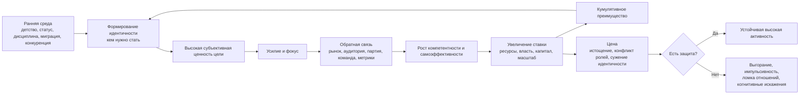
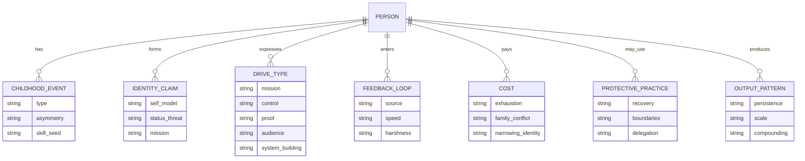

# Феномен высокой активности и результативности у выдающихся политиков и бизнесменов

## Executive summary

Главный вывод исследования такой: у выдающихся людей почти никогда нет одного "магического" свойства, которое само по себе объясняет их сверхактивность. Намного лучше феномен объясняется как контур с высоким коэффициентом усиления: сильная идентичность или "ставка на себя", высокая субъективная ценность цели, приемлемая или вытесняемая цена усилия, частая обратная связь, быстрый рост компетентности и затем кумулятивное преимущество, когда результаты начинают сами подпитывать новые усилия. Такой контур хорошо согласуется с теориями самодетерминации, целеполагания, самоэффективности, обратной связи, expectancy-value-cost и с современными обзорами по вовлеченности, выгоранию и психологии предпринимательства. citeturn40search2turn40search12turn36search3turn31search5turn26search3turn37view0turn39search0turn39search17turn31search1

По 14 разобранным кейсам видно, что "шило в одном месте" обычно относится не к энергии как таковой, а к одному из нескольких устойчивых драйверов: миссия и исторический масштаб, стремление к контролю и суверенитету, компульсивное доказательство собственной состоятельности, любовь к построению систем, сцена и аудитория как постоянный источник подкрепления, либо сочетание нескольких таких мотивов. После определенного уровня достатка деньги почти нигде не выглядят главным мотором; намного чаще они выступают счетчиком выигрыша, маркером свободы действий или побочным продуктом игры за более крупную цель. Это видно и по предпринимателям с долгим горизонтом, и по политикам с высокой ставкой на власть, престиж, порядок или историческое наследие. citeturn14view10turn19search3turn19search7turn19search0turn19search9turn30view0turn22view0turn20search2turn21view0turn23search3

Детство и ранняя среда важны, но не в форме примитивного мифа "сначала травма, потом величие". По кейсам повторяются более конкретные входы: ранняя компетентность и самоэффективность, опыт перемещения между мирами и культурами, жизнь в тесной конкуренции, ранний контакт с большими системами, чувство аутсайдерства, жесткая дисциплина, публичные сравнения, а также родители или институты, которые одновременно давали высокую планку и понятные контуры обратной связи. Однако ни травма, ни жестокая депривация не являются ни необходимым, ни безопасным условием высокой результативности. citeturn18view4turn18view2turn15view0turn15view2turn15view4turn33view0turn34view0turn15view8turn18view0

То, что действительно можно воспроизводить безопасно, это не патологическую переработку, а архитектуру: ясную ставку, короткие циклы проверки реальности, измеримые промежуточные цели, формирование идентичности "я тот, кто делает X", плотную среду компетентных людей, осмысленную публичную или рыночную обратную связь, а также систему защиты от истощения. Современные обзоры показывают, что вовлеченность и высокая результативность лучше поддерживаются ресурсами работы и ощущением смысла, чем просто неконтролируемым напором; напротив, трудоголизм связан с рисками для здоровья и семьи и не гарантирует лучшую производительность. citeturn39search0turn39search15turn39search17turn27search8turn27search13turn38search0turn25search15

Ниже вывод сформулирован инженерно: феномен объясняется не "врожденной бешеной энергией", а тем, что у некоторых людей складывается устойчивый контур "идентичность -> ставка -> усилие -> обратная связь -> рост компетентности -> увеличение масштаба -> еще более сильная идентичность". Такой контур можно в значимой части собрать искусственно, но только если одновременно проектировать и двигатель, и тормозную систему. citeturn40search2turn36search3turn31search5turn26search6turn39search7

## Теоретическая рамка

Самая надежная теоретическая основа здесь состоит не из одной теории, а из связки нескольких моделей. Теория самодетерминации говорит, что устойчивая мотивация усиливается, когда человек ощущает автономию, компетентность и связанность с другими; автономная мотивация обычно лучше держится во времени, чем чисто внешнее давление. Современные обзоры по intrinsic motivation и SDT описывают именно это различие между "делаю потому что это мое" и "делаю потому что меня давит внешняя или внутренняя палка". citeturn40search2turn40search12turn36search4turn40search21

Модель expectancy-value-cost добавляет важный слой: усилие зависит не только от ценности цели и ожидания успеха, но и от переживаемой "цены" действия, включая упущенные альтернативы, эмоциональное истощение и физиологическую нагрузку. Исследования effort discounting показывают, что люди систематически "дисконтируют" награду, требующую больших усилий, а обзоры EVT подчеркивают, что ценность, ожидание успеха и cost нужно рассматривать совместно. Именно поэтому два человека с одинаковой целью могут прикладывать radically разный объем усилий: у одного выше ожидаемый выигрыш и ниже субъективная стоимость, у другого наоборот. citeturn37view0turn36search2turn36search10turn36search14

Далее включается идентичность. В современных работах по мотивации и achievement goals важная мысль состоит в том, что человек особенно устойчиво преследует те цели, которые подтверждают его центральное "кто я". Если цель переживается не как внешний KPI, а как доказательство собственной сущности, настойчивость растет, а отказ от цели начинает переживаться как угроза Я-концепции. Это хорошо объясняет, почему у выдающихся деятелей активность часто выглядит "личной", а не просто профессиональной: они не просто делают работу, они постоянно подтверждают образ себя. citeturn37view0turn36search1turn36search5turn26search22

Целеполагание и обратная связь работают как исполнительный механизм. Классическая теория Locke и Latham показывает, что конкретные и трудные, но принятые человеком цели обычно дают лучший результат, чем расплывчатые установки. Современный обзор по feedback at work добавляет, что не сама по себе оценка, а именно хорошо устроенные циклы обратной связи и feedback-seeking помогают корректировать курс, повышают развитие самоэффективности и поддерживают продвижение. citeturn36search3turn36search11turn31search2turn31search5turn31search12

Самоэффективность здесь критична. По Бандуре и последующим обзорам, вера в свою способность справиться влияет на выбор задач, настойчивость и интерпретацию неудач. При этом самое сильное топливо для самоэффективности - не мотивационные лозунги, а mastery experiences, то есть опыт реального преодоления и накопления рабочих побед. Это хорошо видно почти во всех кейсах: ранние мини-успехи создавали не просто компетентность, а привычку ожидать от себя результата. citeturn26search3turn26search6turn26search7

Для выдающейся результативности важен и компаунд-эффект. Организационная литература о star performers и cumulative advantage показывает, что различия в производительности распределяются крайне неравномерно, а ранние преимущества часто усиливаются последующими возможностями, доступом к лучшим задачам, капиталу, командам и репутации. В реальной жизни это означает: тот, кто рано вошел в цикл "быстрый навык -> высокая ставка -> сильная обратная связь", потом выигрывает не линейно, а ускоряясь. citeturn25search2turn31search0turn31search3

Но этот же механизм имеет темную сторону. WHO определяет burnout как синдром, возникающий из-за хронического стресса на работе, который не был успешно управляем; он описывается тремя измерениями: истощение, ментальная дистанция или цинизм по отношению к работе и снижение профессиональной эффективности. Современные обзоры по JD-R и work engagement показывают, что высокая вовлеченность и высокая перегрузка - не одно и то же: вовлеченность связана с vigor, dedication и absorption, а burnout и workaholism - с рисками для здоровья, отношений и устойчивости. Более того, обзор по workaholism подчеркивает, что трудоголики не обязаны работать лучше и могут показывать даже худшие результаты, особенно вдолгую. citeturn38search0turn38search1turn39search0turn39search15turn39search17turn27search8turn27search13turn25search15

Это и есть научное ядро ответа: феномен высокой активности лучше объясняется не "сверхсилой", а специфической конфигурацией мотивации, идентичности, обратной связи, самоэффективности и структуры среды. С инженерной точки зрения это настраиваемый, но опасный контур. citeturn40search2turn37view0turn31search5turn26search6turn39search7

## Методология и критика публичных мифов

В выборку включены 14 кейсов, по которым есть относительно плотный публичный след: Илон Маск, Джефф Безос, Билл Гейтс, Стив Джобс, Дженсен Хуанг, Джек Ма, Индра Нуйи, Ангела Меркель, Нарендра Моди, Си Цзиньпин, Владимир Путин, Дональд Трамп, Владимир Зеленский и Ли Куан Ю. Выборка преднамеренно неоднородна по культурам, типам институтов и характеру ставок: бизнес, демократии, партии-государства, персоналистская политика, кризисное лидерство, иммигрантские и постколониальные траектории. Источники ранжированы так: официальные биографии и документы, собственные письма и мемуарные материалы, энциклопедические биографии с фактчекингом, затем крупные интервью и качественная пресса для свежих деталей. Там, где детство или частные мотивы плохо документированы, это помечено как "не указано" или оформлено как интерпретация, а не факт. citeturn18view4turn14view10turn18view5turn30view0turn22view0turn20search2turn21view0turn23search3turn32view3

Важно и то, что это не клиническая диагностика. По публичным биографиям можно уверенно реконструировать контуры деятельности, стимулы, среды обратной связи и повторяющиеся механизмы, но нельзя с полной точностью утверждать внутренние переживания. Поэтому в кейсах я различаю наблюдаемое, документированное и вероятностную интерпретацию. Для книги это сильнее, чем популярный жанр "объяснения личности по одному анекдоту". citeturn31search2turn31search12turn25search15

Самые вредные мифы, которые методологически надо отбросить, следующие. Первый миф: "это чисто врожденный темперамент". Реальность сложнее: исследования показывают роль мотивационной среды, навыков, целей, потребностей и обратной связи. Второй миф: "обязательно нужна травма". Некоторые биографии включают жесткость, потерю, вытеснение или раннее унижение, но многие показывают и другие входы: раннюю интеллектуальную игру, организованную среду, автономию, политическую социализацию, доступ к сложным задачам. Третий миф: "если человек много работает, он неизбежно эффективен". Современная литература по workaholism это не подтверждает. Четвертый миф: "все делается ради денег". На длинной дистанции намного чаще видны статус, контроль, миссия, власть, эстетика, историческая память или просто невозможность внутренне согласиться на маленькую жизнь. citeturn40search2turn36search4turn27search8turn39search15turn19search3turn19search9turn22view0turn34view0

## Кейс-биографии и сравнительные таблицы

Ниже сначала даны две сравнительные таблицы, а затем короткий аналитический разбор повторяющихся сюжетов.

| Кейс | Детство и ранняя среда | Триггер и ставка | Обратная связь | Цена | Воспроизводимость |
|---|---|---|---|---|---|
| Илон Маск | Ранняя склонность к компьютерам и предпринимательству; в 12 лет продал собственную игру; уехал из Южной Африки, не желая поддерживать апартеид и стремясь к большим возможностям США. | Ставка быстро стала исторической: строить компании, которые меняют базовую инфраструктуру будущего; в официальном нарративе SpaceX цель формулируется как многопланетность человечества. | Очень жесткая техническая и рыночная обратная связь: продукт либо работает, либо нет; капитал подтверждает или опровергает масштаб амбиций. | Хроническая перегрузка, экстремальная управленческая турбулентность, высокая цена личной стабильности. | Воспроизводимы миссия, техническая ставка и короткие циклы проверки; не стоит копировать постоянный кризис как стиль жизни. |
| Джефф Безос | Уже в школе делал проект Dream Institute; затем Princeton, D.E. Shaw и раннее увиденный взрывной рост Интернета. | Драйвер похож на построение машины долгого горизонта: customer obsession и "Day 1". | Рынок, метрики клиентов, масштаб платформы, повторные покупки, long-term compounding. | Многолетняя подчиненность настоящего будущему; высокие организационные требования к себе и другим. | Очень воспроизводимы долгий горизонт, customer obsession, дисциплина метрик и повторяемые процессы. |
| Билл Гейтс | Очень конкурентный ребенок; много читал; в 13 написал первую программу; конфликтовал с родителями из-за стремления к автономии; сильная роль наставников и друзей. | Ранняя ставка на программное обеспечение как платформу, а не на единичный продукт. | Компьютерный код дает мгновенную ясность; рынок ПО усилил эту обратную связь на огромном масштабе. | Риск узкой идентичности "мозг и победа", социальная шероховатость ранних лет. | Воспроизводимы ранние mastery experiences, плотная интеллектуальная среда и культ глубокой работы. |
| Стив Джобс | Усыновление; воспитание в Кремниевой долине; интерес к инженерии, затем Atari, Индия, буддизм; рано соединил технологию и эстетику. | Ставка выглядела как создание не просто устройств, а "правильных" продуктов и целых категорий опыта. | Мгновенная обратная связь от продукта, дизайна, пользователей и сцены презентаций. | Высочайшая эмоциональная цена для окружения при жестком перфекционизме. | Воспроизводимы продуктовая ясность, вкус, интеграция техники и дизайна; опасно копировать культ конфликтности. |
| Дженсен Хуанг | В 9 лет оказался в религиозной reform school в Кентукки, где чистил туалеты; затем семья в Орегоне, спорт, инженерное образование. | Драйвер сочетает выживание, техническое мастерство и долгую ставку на платформу accelerated computing. | Чрезвычайно плотная инженерная обратная связь и долгие технологические циклы; сам Хуанг в 2026 году описывал свою жизнь как в основном состоящую из работы и семьи. | Постоянная когнитивная мобилизация и высокая организационная требовательность. | Очень воспроизводимы техническая глубина, долгая ставка и дисциплина платформенного мышления. |
| Джек Ма | С детства тянулся к английскому, в подростковом возрасте работал гидом для иностранцев; дважды проваливал вступительный экзамен, поступил с третьей попытки; был преподавателем английского. | Ставка началась как мост между Китаем и внешним миром, затем как цифровое усиление малого бизнеса. | Быстрая обратная связь от торговли, пользователей платформы и публичных выступлений. | Высокий уровень отказов и публичной уязвимости на раннем этапе. | Воспроизводимы языковая открытость, социальное обучение, устойчивость к отказам. |
| Индра Нуйи | Родилась в Мадрасе; химия, IIM Calcutta, затем Yale SOM; иммигрантская траектория. | Ставка на управление крупной системой и доказательство состоятельности через стратегическую глубину; сама Нуйи подчеркивала, что удержаться наверху ей помогал "brutal hard work". | Корпоративные результаты, стратегические повороты, совет директоров, глобальные рынки. | Тяжелый конфликт семьи и карьеры; Нуйи открыто говорила, что "баланса" в простом виде нет. | Воспроизводимы стратегическое мышление, дисциплина подготовки и опора на образование; не стоит романтизировать хронический ролевой перегруз. |
| Источники |  |  |  |  | Маск: citeturn18view0turn19search0turn19search9; Безос: citeturn18view1turn14view10turn19search3turn19search7; Гейтс: citeturn18view2turn18view4turn19search2; Джобс: citeturn18view3turn14view11; Хуанг: citeturn15view0turn18view5turn29view0; Ма: citeturn15view2turn10search3; Нуйи: citeturn14view2turn15view3turn30view0 |

| Кейс | Детство и ранняя среда | Триггер и ставка | Обратная связь | Цена | Воспроизводимость |
|---|---|---|---|---|---|
| Ангела Меркель | Семья вскоре после ее рождения переехала в ГДР; отличная учебная траектория, физика и докторская по квантовой химии; опыт жизни в контролируемой системе. | Ставка похожа на рациональный контроль сложности и кризисов, а не на импульсивную экспансию. | Медленная, но жесткая политическая обратная связь: выборы, коалиции, международные кризисы. | Долгая жизнь в режиме осторожности и самоконтроля. | Воспроизводимы аналитичность, терпение и кризисный расчет. |
| Нарендра Моди | Скромное происхождение; работа на семейной чайной лавке, чтение, дебаты, местная библиотека; ранняя организационная социализация через RSS. | Ставка на служение, организационный рост и массовую политическую репрезентацию. | Массовая политическая обратная связь, партийная машина, публичная мобилизация, сильное цифровое присутствие. | Очень высокий темп и почти аскетическая подчиненность жизни политической миссии. | Воспроизводимы дисциплина, организационная школа и публичная коммуникация. |
| Си Цзиньпин | Детство в элитной среде, затем во время Культурной революции отец был отстранен, сам Си в 1969 был отправлен в деревню и работал ручным трудом до 1975 года. | Ставка похоже связана с порядком, устойчивостью системы и длинным горизонтом национального проекта. | Иерархическая партийная обратная связь, продвижение по уровням, контроль над аппаратной эффективностью. | Долгая жизнь в жестко институционализированной среде высокой ставки. | Частично воспроизводимы организационная терпеливость и длинный горизонт; невоспроизводим институциональный контур власти. |
| Владимир Путин | В доступных официальных кратких источниках детство раскрыто ограниченно; надежно известно происхождение из Ленинграда, юридическое образование, длительная служба в КГБ и дальнейший рост через административные и силовые структуры. | Драйвер наиболее правдоподобно выглядит как контроль, лояльность, способность "добиваться исполнения" и ставка на вертикаль. | Силовая и аппаратная обратная связь, персональная лояльность, контроль исполнения. | Высокая цена замыкания на контроле и сужения поля корректирующей обратной связи. | Воспроизводим лишь навык системной дисциплины; не воспроизводим контур персонализированной власти. |
| Дональд Трамп | Сын девелопера Фреда Трампа; военная школа, затем Wharton; рано вошел в семейный бизнес и затем сделал из себя медийный бренд. | Ставка выглядит как смесь доминирования, победы, бренда и публичного внимания. | Очень быстрая обратная связь от толпы, медиа, рейтингов, сделок и электоральной сцены. | Повышенная зависимость от конфликта и внимания как топлива. | Воспроизводимы навык сцены и брендирование; опасно копировать зависимость от постоянной эскалации. |
| Владимир Зеленский | Родился в индустриальном Кривом Роге; часть детства провел в Монголии; получил юридическое образование, но рано ушел в театр и комедию; Kvartal 95 дал плотную публичную обратную связь. | Ставка выросла из соединения сцены, команды и затем политического кризиса; после 2019 - из борьбы за государственную устойчивость. | Сверхчастая обратная связь от аудитории, команды, войны, международной дипломатии. | Огромная цена хронического кризиса и публичной мобилизации. | Воспроизводимы командная синхронность, тренированная коммуникация и частое обращение к аудитории. |
| Ли Куан Ю | Родился в укорененной китайской семье Сингапура; первый язык - английский; Cambridge с выдающимися результатами; правовая и профсоюзная школа. | Ставка была почти инженерно-государственной: построить жизнеспособную страну из маленькой уязвимой системы. | Жесткая связь между политическим решением и реальными институциональными последствиями в компактном государстве. | Жизнь, поглощенная нациестроительством, с малым пространством для "частного" режима. | Очень воспроизводимы системность, правовой интеллект и дисциплина институтов. |
| Источники |  |  |  |  | Меркель: citeturn14view3turn15view4; Моди: citeturn14view9turn34view0turn34view1; Си: citeturn14view4turn33view0turn33view3turn21view0; Путин: citeturn14view5turn32view0turn32view2turn32view3turn23search14; Трамп: citeturn22view0turn14view6turn35view1turn35view2; Зеленский: citeturn14view7turn15view8turn23search3; Ли Куан Ю: citeturn14view8turn15view9turn24search1 |

Если сжать эти кейсы до механики, то у бизнесменов чаще повторяется контур "мастерство -> продукт/рынок -> быстрая проверка реальности -> компаунд", а у политиков - контур "идентичность -> организация -> лояльность/электорат/кризис -> расширение ставки". Но в обеих группах феномен запускается не просто высоким IQ и не просто долгими часами работы, а сочетанием трех вещей: цель переходит в идентичность, среда непрерывно подает сигнал о результате, а человек строит жизнь так, чтобы большая часть ресурсов регулярно возвращалась в одну и ту же игру. citeturn18view1turn18view2turn18view3turn18view5turn30view0turn34view0turn33view0turn23search3turn14view8turn36search3turn31search5

По этой логике вопрос "в обмен на что они так живут?" получает довольно прямой ответ. Чаще всего в обмен на одно или несколько из следующего: ощущение исторической значимости, контроль над средой, доказательство собственной ценности, символическое бессмертие, власть над большими системами, эмоциональное подкрепление от сцены или массы, а иногда просто в обмен на внутреннюю непротиворечивость: если человек уже сделал цель частью Я, не делать ее становится психологически дороже, чем делать. Это особенно хорошо читается у Маска, Безоса, Гейтса, Джобса, Хуанга, Нуйи, Моди, Трампа, Зеленского и Ли Куан Ю; у Си, Путина и Меркель ставка сильнее завязана на порядок, аппарат и историческую роль. Это интерпретация по биографическим данным, а не прямое чтение мыслей. citeturn19search0turn14view10turn18view4turn14view11turn29view0turn30view0turn34view0turn22view0turn23search3turn14view8turn33view0turn32view3turn14view3turn37view0

## Типология "шил"

Из выборки получается не одна универсальная категория, а по крайней мере шесть типов.

Первый тип - миссионное "шило". Здесь человек переживает работу как средство решения задачи, которая намного больше его самого: многопланетность и инфраструктура будущего у Маска, долгосрочная машина обслуживания клиента у Безоса, платформенное вычислительное будущее у Хуанга, корпоративная ответственность у Нуйи, нациестроительство у Ли Куан Ю. В обмен человек получает смысл, исторический масштаб и право считать свою перегрузку "не случайной, а оправданной". citeturn19search9turn14view10turn18view5turn30view0turn14view8

Второй тип - шило доказательства. Это мотив "я должен доказать, что я могу", часто возникающий у людей с опытом аутсайдерства, миграции, неоднозначного статуса или раннего чувства неполного признания. В этой группе особенно показательны Хуанг, Джек Ма, Нуйи, частично Джобс и Гейтс. В обмен человек получает не просто результат, а подтверждение собственного права быть большим. citeturn15view0turn15view2turn30view0turn18view3turn18view4

Третий тип - шило контроля и суверенитета. Здесь усилие подпитывается тем, что контроль над системой сам по себе становится наградой. Для части политиков это основной мотор: Си, Путин, в иной форме Меркель и Моди. Человек получает предсказуемость, вертикаль исполнения и ощущение порядка в сложном мире. Цена - риск того, что корректирующая обратная связь сузится и внутренняя модель мира станет слишком самоподтверждающейся. citeturn33view0turn32view0turn14view3turn34view0turn31search5

Четвертый тип - шило сцены и аудитории. У Трампа и Зеленского, а в более "продуктовой" версии у Джобса, особенно заметно, что активность подпитывается живой обратной связью больших аудиторий. Это не обязательно поверхностный нарциссизм; часто это просто крайне эффективный канал подкрепления. В обмен человек получает немедленное чувство воздействия и подтверждение, что способен менять повестку здесь и сейчас. citeturn22view0turn23search3turn14view11

Пятый тип - шило конструктора систем. Здесь удовольствие и драйв идут от сборки сложной архитектуры, а не только от победы. Гейтс, Безос, Хуанг и Ли Куан Ю особенно ясно демонстрируют такую логику. В обмен - чувство интеллектуального господства над сложностью. citeturn18view2turn19search7turn18view5turn14view8

Шестой тип - шило аскетической организационной миссии. Это не столько любовь к ярким победам, сколько готовность годами жить в жестком режиме ради одного курса. Наиболее явно сюда попадают Моди, Меркель, частично Си и Ли Куан Ю. В обмен - устойчивое ощущение правоты линии и право на долгую дисциплину. citeturn34view0turn14view3turn33view0turn14view8

## Инженерная модель воспроизводимого контура

Если убрать из кейсов уникальные культурные и институциональные обстоятельства, остается контур, который можно проектировать осознанно. Он состоит из семи шагов.

Первое. Нужна не просто цель, а ставка. Формулировка "хочу быть продуктивнее" слишком слабая. Формулировка должна соединять ценность, идентичность и шкалу времени: "я строю X", "я становлюсь человеком, который способен Y", "через 3 года у меня будет система Z". С точки зрения SDT и identity/value-моделей это резко повышает субъективную значимость усилия. citeturn40search2turn37view0turn36search5

Второе. Цель нужно раскладывать на короткие циклы обратной связи. Выдающиеся люди редко живут только дальним будущим; они обычно встроены в плотный цикл "сделал -> увидел сигнал -> поправил". Для бизнеса это рынок, код, пользователи, продажи, прототипы. Для политики - организация, электорат, медийный резонанс, аппарат. Для обычного человека это должны быть еженедельные метрики, демонстрации работы, внешний ревью и контрольные точки. citeturn31search5turn31search12turn36search3

Третье. Необходимо искусственно наращивать самоэффективность через мастерство, а не только через самовнушение. Лучший путь - последовательность задач возрастающей сложности с частыми "подтверждениями компетентности": написать, продать, выступить, договориться, защитить проект, собрать продукт, довести дело до конца. Это создает переживание "я умею проводить усилие в результат". citeturn26search3turn26search6turn26search7

Четвертое. Нужно сознательно снижать субъективную цену усилия. Это не лень, а инженерия. Если человек постоянно принимает решения в состоянии хаоса, effort cost вырастает. Снижают цену: стабильные ритуалы старта работы, заранее подготовленная среда, защита времени, шаблоны решений, хороший сон, тренировка, питание, ограничение цифрового шума и одновременных конкурирующих целей. EVT и effort discounting предсказывают именно это: чем ниже субъективная цена единицы действия, тем выше шанс устойчивого повторения. citeturn37view0turn36search2turn36search10

Пятое. Нужна среда, которая не просто хвалит, а корректирует. Почти все великие "работяги" жили в плотной среде высокой ставки: инвесторы, избиратели, код, board, кризис, конкуренты, сильные сооснователи, партийные и административные лестницы. Для обычной практики это означает: не дружелюбный чат, а регулярный внешний review от компетентных людей, у которых нет мотива вас утешать. citeturn31search2turn31search12turn18view5turn14view10turn34view0

Шестое. Нужны растущие, но не разрушительные ставки. Выдающиеся люди часто мобилизуются от чувства риска. Но безопасное воспроизведение требует не тотального экзистенциального стресса, а умеренно возрастающих обязательств: публичное обещание, деньги клиента, дедлайн команды, measured accountability. Слишком маленькая ставка не собирает внимание; слишком большая ломает систему. citeturn36search3turn39search7

Седьмое. Нужна защита от захвата личности работой. В обзорах по work engagement, burnout и workaholism видно, что устойчивая высокая работоспособность требует ресурсов, а не только напряжения. Поэтому безопасная модель обязана включать: циклы восстановления, ограничение числа одновременных фронтов, обязательную еженедельную ревизию "что я перестал замечать", опору на отношения вне проекта и правило disengagement, то есть право вовремя прекращать бесперспективный курс. citeturn39search0turn39search15turn27search8turn36search24turn38search0

Практически это можно оформить как простой алгоритм:

1. Выбрать один проект, который объективно важен и субъективно "мой".
2. Превратить дальнюю цель в еженедельный scoreboard из 2-4 показателей.
3. Каждый день начинать с самой трудной, но главной задачи до любых входящих стимулов.
4. Еженедельно получать внешнюю корректирующую связь.
5. Ежемесячно повышать ставку, но только если предыдущий уровень уже стабилен.
6. Планировать восстановление как обязательный компонент системы.
7. Раз в квартал проверять, не превратилось ли "шило" в разрушительный workaholism.

Это не вдохновляющая метафора, а рабочая архитектура, совместимая с тем, что показывают case studies и мотивационная наука. citeturn36search3turn31search5turn26search6turn39search17turn27search13

| Что стоит воспроизводить | Что не стоит воспроизводить | Почему |
|---|---|---|
| Долгий горизонт и ясную ставку | Хронический кризис как стиль работы | Кризис может краткосрочно мобилизовать, но хронически поднимает cost и риск выгорания. citeturn37view0turn38search0turn39search15 |
| Частую плотную обратную связь | Унижение, хаотическую критику, культ страха | Развивающая обратная связь повышает self-efficacy, а хаос и страх сужают качество мышления. citeturn31search5turn26search6 |
| Сильную идентичность "я делаю это" | Полное слияние личности с результатом | Полное слияние повышает риск слома при провале и затрудняет disengagement. citeturn37view0turn36search24 |
| Ритуалы глубокой работы | Героизацию бессонницы и постоянной переработки | Work engagement не равен истощению; burnout и workaholism имеют реальную цену. citeturn39search0turn27search8turn38search0 |
| Рост через умеренно возрастающие ставки | Сразу максимальную ставку | Самоэффективность лучше растет через mastery ladder, а не через один прыжок в пропасть. citeturn26search6turn26search7 |

## Структура книги и рекомендации для автора и читателя

Для книги я бы предложил не "сборник биографий", а конструкцию из трех слоев: теория, кейсы, практическая сборка. Оптимальный объем - примерно 110 000-150 000 слов, если это серьезный нон-фикшн с плотной аргументацией, или 75 000-95 000 слов, если нужен более широкий читательский охват. Для русскоязычной книги разумно делать главы компактными, но насыщенными таблицами и схемами, чтобы читатель видел не только истории, но и механизм. Такая структура лучше всего соответствует и научному материалу, и инженерной цели воспроизводимости. citeturn31search1turn39search7turn31search5

Предлагаемая архитектура книги:

| Глава | Примерный объем | Содержание | Приоритет источников |
|---|---:|---|---|
| Введение | 6-8 тыс. слов | Почему "высокая активность" нельзя путать с хаосом, манией или просто занятостью | Теоретические обзоры, определения WHO и JD-R citeturn38search0turn39search15 |
| Научная модель драйва | 10-14 тыс. слов | SDT, identity, expectancy-value-cost, goal setting, feedback, self-efficacy | Академические обзоры и классические статьи citeturn40search2turn36search3turn31search5turn26search3turn37view0 |
| Ошибки публичных мифов | 8-10 тыс. слов | Genius myth, trauma myth, money myth, overwork myth | Академические обзоры плюс case contrast citeturn27search8turn25search15turn31search0 |
| Бизнес-кейсы | 25-35 тыс. слов | Маск, Безос, Гейтс, Джобс, Хуанг, Ма, Нуйи | Биографии, официальные письма, интервью, корпоративные документы citeturn18view0turn14view10turn18view4turn14view11turn18view5turn30view0 |
| Политические кейсы | 25-35 тыс. слов | Меркель, Моди, Си, Путин, Трамп, Зеленский, Ли Куан Ю | Официальные биографии, энциклопедии, свежие официальные сайты citeturn14view3turn34view1turn21view0turn23search14turn22view0turn23search3turn14view8 |
| Типология "шил" | 8-12 тыс. слов | Миссия, контроль, доказательство, сцена, системостроительство, аскеза | Синтез кейсов + теория идентичности и мотивации citeturn37view0turn36search5 |
| Инженерная сборка | 12-18 тыс. слов | Алгоритм, протоколы, метрики, защита от выгорания | Goal-setting, feedback, self-efficacy, JD-R, burnout/workaholism citeturn36search3turn31search5turn26search6turn39search17turn27search13 |
| Заключение | 5-7 тыс. слов | Что из феномена переносимо, а что нет | Общий синтез |

Ключевой редакторский принцип для книги: каждый кейс должен быть написан в формате "драйвер -> механизм -> цена -> границы воспроизводимости". Это позволит не скатиться либо в героизацию, либо в морализаторство. Внутри каждой главы стоит держать одну и ту же мини-матрицу: детство, ключевое событие, среда, обратная связь, ставка, цена, что можно повторить безопасно. Тогда книга будет одновременно читаемой и пригодной как рабочий инструмент. citeturn31search5turn39search15turn27search8

Практические рекомендации для читателя книги должны быть прямыми.

Во-первых, не искать в себе "врожденного титана". Гораздо полезнее строить режим, в котором маленькие победы регулярно превращаются в самоэффективность. Во-вторых, перестать путать мотивацию с настроением: выдающиеся люди часто продолжают действие не потому, что "хочется", а потому, что контур уже собран. В-третьих, намеренно выбирать среду, где есть твердая обратная связь. В-четвертых, решать вопрос "в обмен на что?" заранее: если человек не понимает, ради какой выгоды он готов долго терпеть цену усилия, контур долго не живет. В-пятых, заранее проектировать защиту от перенапряжения. Научно и practically это, пожалуй, самая недооцененная часть темы. citeturn26search6turn31search12turn37view0turn39search0turn38search0

## Открытые вопросы и ограничения

Это исследование опирается на публичные биографии и официальные материалы, а не на прямые психологические интервью с фигурантами. Поэтому внутренние мотивы реконструируются вероятностно, по паттернам поведения, а не считываются напрямую. Особенно это важно для политических кейсов, где часть источников официально-репрезентативна и может сглаживать реальную внутреннюю динамику. citeturn22view0turn20search2turn21view0turn23search3turn23search14

Кроме того, выборка смещена в сторону людей с огромным социальным масштабом. Это полезно для книги о выдающихся фигурах, но не значит, что их режимы напрямую переносимы на обычную жизнь. Именно поэтому в выводах я отделял воспроизводимую архитектуру от невоспроизводимых обстоятельств: богатства, аппарата власти, культового статуса, геополитической роли, медийной машины или исторического момента. citeturn31search0turn39search7turn27search8

Наконец, остается открытым эмпирический вопрос, который для книги можно развить отдельно: какая именно комбинация ранней среды и взрослой организационной архитектуры дает наилучший баланс между высокой активностью и долгосрочной психической устойчивостью. Современная наука уже довольно хорошо описывает драйверы и риски, но заметно хуже описывает "золотую середину" между звездообразной результативностью и безопасной человеческой жизнью. citeturn25search15turn39search0turn27search13turn36search24