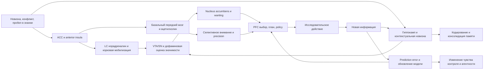

# Механизм искания и любопытства у человека

## Executive summary

Искание и любопытство у человека лучше всего понимать не как одну "черту", а как многослойный режим работы организма, в котором встречаются телесная регуляция, аффективная валентность, вычисление неопределенности, дофаминергическая мотивация, гиппокампальная память, фронтальная оценка и субъективное чувство "это делаю я". На физиологическом уровне любопытство связано с мобилизацией внимания, ориентировочным ответом, изменением уровня бодрствования и перераспределением ресурсов между исследованием и эксплуатацией. На биохимическом и нейробиологическом уровнях ключевую роль играют дофаминовые системы среднего мозга, locus coeruleus и норадреналин, ацетилхолин, а также взаимодействие VTA/SN с nucleus accumbens, гиппокампом и префронтальной корой. На психологическом уровне конкурируют, но и взаимно дополняют друг друга, по меньшей мере четыре линии: competence/effectance, arousal-conflict, information-gap и computational-epistemic accounts. citeturn13search2turn3search0turn29search0turn32search0turn0search2turn61search0turn35search0

Наиболее продуктивная аналитическая позиция для книги такова: человеческое любопытство есть частный, культурно и когнитивно усложненный случай более широкого SEEKING-режима, описанного Панксеппом, но этот режим не сводится к "дофамину" и тем более не равен "удовольствию". Дофаминовые сигналы лучше описывать через prediction error, incentive salience и субъективную ценность информации; норадреналин и ацетилхолин - через управление неопределенностью и вниманием; гиппокамп - через новизну, контекст и консолидацию; префронтальные системы - через оценку, планирование, выбор и агентность. В этой оптике любопытство - это не просто тяга к новому, а способ активного приведения мира к более понятному, управляемому и лично значимому состоянию. citeturn60search3turn4search9turn52search6turn57search1turn0search2turn61search0turn32search0turn35search0

Связь с самостью, агентностью и активной позицией проходит по трем линиям. Во-первых, через embodied self: организм стремится уменьшать неопределенность не абстрактно, а из позиции телесного субъекта, для которого предсказуемость и контроль имеют аффективную цену. Во-вторых, через sense of agency: искание превращается в активную позицию тогда, когда человек переживает себя источником действия и видит связь между вопросом, выбором, усилием и результатом. В-третьих, через автономию: по Ryan и Deci, внутренняя мотивация и устойчивая исследовательская активность расцветают в контекстах, поддерживающих автономию, компетентность и связанность, и деградируют под контролем, отчуждением и принуждением. citeturn9search2turn22view0turn49search4turn19view0turn21search10

Для книги в первую очередь стоит строить аргумент не вокруг одного "главного центра любопытства", а вокруг архитектуры переходов: неопределенность -> аффективная мобилизация -> оценка значимости -> эпистемическая или прагматическая ценность -> выбор действия -> получение информации -> обновление модели мира -> изменение памяти и саморегуляции. Это позволяет связать классические психологические теории, аффективную нейронауку, reinforcement-learning линию, active inference и современные исследования information seeking в одну общую рамку, достаточно широкую и для научного, и для философского разговора. citeturn3search0turn29search0turn4search9turn35search0turn38search1turn57search1turn59search0

## Аналитическая рамка и линии синтеза

Удобнее всего различать четыре уровня объяснения. На уровне организма любопытство есть форма регуляции взаимодействия со средой: поиск сигналов, снижающих критически значимую неопределенность и расширяющих зону компетентного действия. На уровне систем мозга оно опирается на контуры ориентировки, оценки значимости, дофаминергического "подхватывания" цели, памяти и планирования. На уровне субъективного опыта это может переживаться и как приятное предвкушение, и как дефицит, неснятое напряжение, "ментальный зуд". На уровне личности и культуры любопытство становится чертой, практикой, исследовательским стилем и, в пределе, способом быть субъектом по отношению к миру. citeturn13search14turn18view1turn29search0turn38search1turn21search4turn49search4

Важная развилка проходит между тремя классами объяснений. Берлайновская линия подчеркивает коллативные переменные - новизну, сложность, конфликт, неопределенность - и рассматривает любопытство как реакцию на оптимально возбуждающую неоднозначность. Лёвенштейн делает шаг в сторону когнитивной точности: любопытство возникает, когда внимание фиксируется на разрыве в знании. Панксепповская линия помещает все это на более глубокий аффективно-эволюционный уровень: SEEKING - это базовая система активного приближения, разведки и мотивированного "идти к". Современные computational accounts затем переводят это в язык value of information, expected free energy и policies that reduce uncertainty. Эти подходы не исключают друг друга; они описывают разные срезы одного феномена. citeturn16view0turn18view1turn29search0turn35search0turn38search1

Ниже - рабочая сравнительная таблица, которую можно почти без изменений превратить в основу главы или приложений книги.

| Теория или линия | Что объясняет лучше всего | Уровень объяснения | Ключевые структуры | Ключевые медиаторы | Сильная эмпирическая опора | Главные ограничения |
|---|---|---|---|---|---|---|
| Competence/effectance | Почему организмы ищут эффективное взаимодействие со средой даже без явного дефицита | Мотивационная психология развития | Широкая функциональная рамка, без точной локализации | Не специфицированы | Наблюдения исследования и игры у детей и животных | Слабо связывает мотив с конкретными нейронными механизмами |
| Arousal-conflict | Почему неоднозначность, сложность и новизна возбуждают исследование | Психология и физиология активации | ACC, insula, ориентировочные сети | NE, ACh, неспецифическая активация | Поведенческие и fMRI-данные по перцептивному любопытству | Плохо объясняет длительное эпистемическое искание |
| Information-gap | Почему "дырка в знании" чувствуется как мотивационный дефицит | Когнитивная психология и поведенческая экономика | PFC, valuation/memory systems | Дофамин и системы оценки информации | Сильная поддержка в trivia-парадигмах и выборе информации | Недостаточно телесной и аффективной глубины |
| SEEKING | Почему поиск сам по себе энергетизирует поведение | Аффективная нейронаука | VTA/SN, NAc, медиальный передний мозговой пучок, гипоталамо-лимбические узлы | Дофамин в связке с широкими аффективными системами | Межвидовые данные, стимуляция, фармакология, поведение | Иногда чересчур широко очерчивает "искание" |
| Reward prediction error | Как обучение переносит ценность на сигналы и ожидания | Вычислительная нейрофизиология | Допаминовые нейроны среднего мозга, стриатум | Дофамин | Приматная электрофизиология, моделирование RL | Не равен полноценной феноменологии любопытства |
| Incentive salience | Почему хочется, даже если это не равно удовольствию | Мотивационная нейронаука | NAc, ventral pallidum, striatum | Дофамин для wanting, опиоиды для liking | Фармакология, lesion studies, taste reactivity | Нужна стыковка с эпистемическими формами искания |
| LC-NE и ACh-неопределенность | Как мозг распределяет внимание между ожидаемой и неожидаемой неопределенностью | Нейровычислительный уровень | Locus coeruleus, базальный передний мозг, корковые сети внимания | NE, ACh | Модели, внимание, pupil-linked arousal | Непрямая привязка к субъективному любопытству |
| VTA-hippocampus memory loop | Почему любопытство усиливает запоминание | Системная память и мотивация | SN/VTA, NAc, hippocampus | Дофамин, NE | fMRI и поведенческие эффекты на память | Чаще изучено на trivia и лабораторных задачах |
| Active inference | Как свести поиск информации и целевое действие к единой норме выбора | Нормативно-вычислительный уровень | Распределенные иерархические сети | Формально не медиатор-центрично, но связывается с дофамином и precision | Сильная теоретическая связность и растущие эмпирические тесты | Риск чрезмерной общности и свободной пост-хок интерпретации |
| Sense of agency и SDT | Когда искание становится "моим" действием и поддерживает самость | Психология действия и личности | Fronto-parietal circuits, interoceptive/self systems | Медиаторно разнородно | Поведенческие, fMRI, социально-контекстные данные | Требует аккуратного мостика от моторной агентности к эпистемической |

Сводка в таблице опирается на White, Loewenstein, Panksepp, Schultz, Berridge and Robinson, Aston-Jones and Cohen, Yu and Dayan, Gruber, Friston, Haggard, Ryan and Deci, Gottlieb and Oudeyer, Kobayashi and Hsu, Bromberg-Martin и др. citeturn13search2turn18view1turn29search0turn4search9turn52search6turn0search2turn61search0turn32search0turn35search0turn22view0turn49search4turn38search1turn57search1turn59search0

Нейронную логику феномена можно для книги подать так:



Эта схема не изображает один "центр любопытства"; она показывает, как неопределенность становится телесным возбуждением, мотивацией, выбором, памятью и изменением саморегуляции. В такой подаче особенно хорошо видно, почему любопытство может быть одновременно и аверсивным, и привлекательным: индукция может быть напряженной, а снятие неопределенности - вознаграждающим. citeturn45search3turn32search0turn0search2turn61search0turn57search1turn22view0

Исторический таймлайн для главы о развитии идей:

```mermaid
timeline
    title Историческое развитие идей об искании и любопытстве
    1959 : White
         : competence и feeling of efficacy
    1960 : Berlyne
         : novelty, complexity, conflict, arousal
    1994 : Loewenstein
         : information-gap
    1997 : Schultz, Dayan, Montague
         : reward prediction error
    1998 : Berridge and Robinson
         : wanting vs liking, incentive salience
    1998 : Panksepp
         : SEEKING как базовая аффективная система
    1999 : Ikemoto and Panksepp
         : accumbens dopamine и flexible approach
    2005 : Aston-Jones and Cohen
         : adaptive gain, explore-exploit
    2005 : Yu and Dayan
         : ACh и NE как вычисление неопределенности
    2009 : Kang et al.
         : curiosity activates reward circuitry
    2012 : Jepma et al.
         : induction и relief of curiosity
    2013 : Seth
         : interoceptive self
    2014 : Gruber et al.
         : VTA-hippocampus и memory benefits
    2015 : Friston et al.
         : epistemic value и expected free energy
    2017 : Haggard
         : sense of agency
    2018 : Gottlieb and Oudeyer
         : active sampling and curiosity
    2019 : Kobayashi and Hsu
         : common neural code for reward and information
    2021 : Kelly and Sharot
         : three diverse motives
    2024 : Bromberg-Martin et al.
         : habenula integrates information and reward
```



Таймлайн полезен тем, что уводит от ложной идеи "была одна правильная теория, потом ее заменили". На деле происходило накопление уровней: от общей мотивационной психологии к нейровычислительным и нейрофизиологическим моделям, а затем к обратному движению - снова к вопросам самости, ценности информации и социального контекста. citeturn13search2turn3search0turn4search9turn52search6turn12search0turn60search3turn0search2turn61search0turn33search0turn45search3turn9search2turn32search0turn35search0turn22view0turn38search1turn57search1turn58search0turn59search0

## Ключевые первоисточники и базовые эмпирические опоры

Источник. White, R. W. (1959). Motivation reconsidered: the concept of competence. Psychological Review, 66(5), 297-333. DOI: 10.1037/h0040934. PMID: 13844397. Доступ: PubMed; доступен авторский PDF-копиархийный скан. Полный текст и метаданные доступны на официальной записи PubMed и в доступной PDF-копии. Резюме: White радикально расширяет разговор о мотивации за пределы drive-reduction и показывает, что игра, исследование и овладение средой нельзя убедительно свести к голоду, жажде или снижению тревоги. Он вводит competence как фундаментальную тенденцию к эффективному взаимодействию со средой и связывает ее с "feeling of efficacy". Для книги это отправная точка, без которой позднейшие разговоры об автономии, curiosity и active inference теряют психологическую глубину. Ключевые выводы: человеческая активность направлена не только на устранение дефицитов, но и на рост способности действовать. Методология: большая теоретическая статья-обзор с опорой на ранние данные по животным и детскому развитию. Цитата: "the feeling of efficacy". Как встроить в книгу: поставить в начало главы о "самости как растущей способности к эффективному действию". citeturn13search2turn13search14turn23view0

Источник. Loewenstein, G. (1994). The Psychology of Curiosity: A Review and Reinterpretation. Psychological Bulletin, 116(1), 75-98. DOI: 10.1037/0033-2909.116.1.75. Доступ: free author PDF на сервере Carnegie Mellon. Полный текст доступен на авторской странице CMU. Резюме: это главный психологический первоисточник для современной "эпистемической" трактовки любопытства. Лёвенштейн переописывает любопытство как форму cognitively induced deprivation, возникающую из воспринимаемого разрыва между тем, что уже известно, и тем, что хочется знать. Сила текста в том, что он объясняет, почему любопытство может быть и приятным, и мучительным, почему оно усиливается при частичном знании и почему люди часто намеренно помещают себя в ситуации, где будут заинтригованы. Ключевые выводы: информационный пробел - не метафора, а операциональная единица мотивации. Методология: теоретический обзор с реинтерпретацией классической литературы и поведенческих данных. Цитата: "a gap in one's knowledge". Как встроить в книгу: сделать на нем центральную главу о "дефиците знания как аффекте и двигателе действия". citeturn3search0turn18view1turn18view2turn3search14

Источник. Panksepp, J. (2010). Affective neuroscience of the emotional BrainMind: evolutionary perspectives and implications for understanding depression. Dialogues in Clinical Neuroscience, 12(4), 533-545. DOI: 10.31887/DCNS.2010.12.4/jpanksepp. PMID: 21319497. PMCID: PMC3181986. Доступ: open access via PubMed Central. Резюме: хотя статья формально о депрессии, для вашей темы она важна как компактная поздняя формулировка панксепповской программы. Панксепп утверждает, что первичные эмоции организованы в древних субкортикальных системах, общих для млекопитающих, и что именно эти системы задают "intrinsic values", ориентирующие организм в поведении. Для мотива искания это важно потому, что SEEKING в его модели - не высшая когнитивная роскошь, а базовая аффективная инфраструктура активной жизни. Ключевые выводы: первичные аффекты являются эволюционно встроенными регуляторами поведения, а не эпифеноменами. Методология: межвидовой теоретико-эмпирический обзор. Цитата: "Emotional feelings are intrinsic values". Как встроить в книгу: использовать как мост от биологии эмоций к исканию как базовой форме витальности. citeturn29search0

Источник. Ikemoto, S., & Panksepp, J. (1999). The role of nucleus accumbens dopamine in motivated behavior: a unifying interpretation with special reference to reward-seeking. Brain Research Reviews, 31(1), 6-41. DOI: 10.1016/S0165-0173(99)00023-5. PMID: 10611493. Доступ: PubMed abstract; доступна авторская полнотекстовая выкладка. Резюме: одна из важнейших работ для связи SEEKING с accumbens dopamine, но без редукции до "гедонии". Авторы пытаются примирить данные, где accumbens dopamine вовлечен и в аппетитивные, и в аверсивные контексты, и приходят к формулировке о flexible approach responses. Это один из лучших текстов для книги, если вы хотите показать, что "искание" - это моторно-аффективная готовность входить в мир и перерабатывать его, а не просто бег к сладкому. Ключевые выводы: accumbens dopamine помогает сенсомоторным интеграциям, поддерживающим гибкое приближение к значимому. Методология: большой обзор поведенческих, микродиализных, фармакологических и lesion-данных. Цитата: "flexible approach responses". Как встроить в книгу: в главу о нейробиологии активной позиции и поведенческой энергетике. citeturn31search0turn60search0turn60search2turn60search3

Источник. Schultz, W., Dayan, P., & Montague, P. R. (1997). A neural substrate of prediction and reward. Science, 275(5306), 1593-1599. DOI: 10.1126/science.275.5306.1593. PMID: 9054347. Доступ: PubMed abstract; журнал по подписке. Резюме: это поворотный текст, задавший нейрофизиологическую канву reward prediction error. Его значение для любопытства в том, что искание информации и новизны трудно понять без механизма, который кодирует разницу между ожидаемым и полученным. Через эту статью книга может показать, что "вопрос" - это не только феномен сознания, но и вычислительная ситуация ошибки прогноза. Ключевые выводы: дофаминовые нейроны приматов кодируют изменения или ошибки в предсказаниях будущих значимых событий. Методология: обзор на основе приматной однонейронной электрофизиологии и вычислительных моделей. Цитата: "signals changes or errors". Как встроить в книгу: в главу о том, как из неожиданности рождается обучение и тяга к доуточнению мира. citeturn4search9turn4search8

Источник. Berridge, K. C., & Robinson, T. E. (1998). What is the role of dopamine in reward: hedonic impact, reward learning, or incentive salience? Brain Research Reviews, 28(3), 309-369. DOI: 10.1016/S0165-0173(98)00019-8. PMID: 9858756. Доступ: PubMed abstract; доступна лабораторная PDF-копия. Резюме: одна из самых важных корректировок популярного мифа "дофамин = удовольствие". Авторы показывают, что дофамин лучше понимать как механизм incentive salience, то есть придания стимулам мотивационной привлекательности и захвата поведения, а не как простой носитель удовольствия. Для книги это центрально: любопытство часто ощущается как "хочу узнать", а не как "мне уже приятно". Ключевые выводы: wanting и liking - разные компоненты; дофамин сильнее связан с первым. Методология: обзор плюс собственные данные по dopamine depletion и taste reactivity. Цитата: "incentive salience of rewards". Как встроить в книгу: как ключ к различению искания, удовольствия и удовлетворения знания. citeturn4search2turn52search5turn52search6

Источник. Aston-Jones, G., & Cohen, J. D. (2005). An integrative theory of locus coeruleus-norepinephrine function: adaptive gain and optimal performance. Annual Review of Neuroscience, 28, 403-450. DOI: 10.1146/annurev.neuro.28.061604.135709. PMID: 16022602. Доступ: abstract/open metadata; полный текст обычно по подписке. Резюме: важнейший текст для понимания того, как организм переключается между устойчивой работой на текущей задаче и поиском альтернатив. Теория adaptive gain связывает locus coeruleus с балансом exploit-explore и позволяет физиологически описать ситуации, когда человек "не удерживается" на известном и начинает сканировать среду в поиске лучшего. Для книги это помогает встроить любопытство в общую архитектуру арousal, performance и выбора режима поведения. Ключевые выводы: LC-NE регулирует gain нейронных систем и тем самым влияет на эксплуатацию и исследование. Методология: интегративный обзор приматной нейрофизиологии, моделирования и когнитивной психологии. Цитата: "adaptive gain". Как встроить в книгу: в главу о бодрствовании, ориентировке и переходе от устойчивости к поиску. citeturn0search2

Источник. Yu, A. J., & Dayan, P. (2005). Uncertainty, neuromodulation, and attention. Neuron, 46(4), 681-692. DOI: 10.1016/j.neuron.2005.04.026. PMID: 15944135. Доступ: PubMed abstract; есть PDF журнала и авторские списки публикаций. Резюме: одна из самых важных работ для строгого различения expected и unexpected uncertainty. Авторы предлагают, что acetylcholine и norepinephrine реализуют разные формы вычисления неопределенности и тем самым по-разному настраивают внимание и обучение. Для книги это бесценно: любопытство перестает быть туманной "страстью к новому" и становится чувствительностью к разным типам неопределенности. Ключевые выводы: ACh ближе к ожидаемой неопределенности, NE - к неожиданным изменениям, требующим перенастройки. Методология: нейровычислительная теория на стыке Байесовского моделирования и нейромодуляции. Цитата: "a major role". Как встроить в книгу: в отдельный раздел о том, что не вся неопределенность одинакова феноменологически и нейрохимически. citeturn61search0turn61search2turn61search5

## Дополняющий корпус для книги

Источник. Kang, M. J., Hsu, M., Krajbich, I. et al. (2009). The wick in the candle of learning: epistemic curiosity activates reward circuitry and enhances memory. Psychological Science, 20(8), 963-973. DOI: 10.1111/j.1467-9280.2009.02402.x. PMID: 19619181. Доступ: PubMed abstract. Резюме: одно из ранних и до сих пор ключевых исследований, доказавших, что эпистемическое любопытство активирует reward-related области и улучшает память. Именно отсюда начинается сильная современная fMRI-линия curiosity-as-reward. Ключевые выводы: уровень curiosity по trivia-вопросам коррелирует с активностью caudate и последующим лучшим запоминанием. Методология: trivia-task, оценки любопытства, fMRI, поведенческая память. Цитата: "activates reward circuitry and enhances memory". Как встроить в книгу: как первый современный эмпирический мост между information-gap и reward circuitry. citeturn33search0

Источник. Jepma, M., Verdonschot, R. G., van Steenbergen, H., Rombouts, S. A. R. B., & Nieuwenhuis, S. (2012). Neural mechanisms underlying the induction and relief of perceptual curiosity. Frontiers in Behavioral Neuroscience, 6, 5. DOI: 10.3389/fnbeh.2012.00005. PMID: 22347853. PMCID: PMC3277937. Доступ: open access. Резюме: очень важная работа для вашей книги, потому что она показывает двойную природу любопытства: его индукция связана с конфликтом и арousal, а его снятие - с reward-related activation и улучшением incidental memory. Иначе говоря, любопытство может начинаться как напряжение, а заканчиваться как вознаграждение. Ключевые выводы: induction вовлекает anterior insula и ACC; relief - striatum и hippocampus. Методология: blurred pictures paradigm, fMRI, incidental memory. Цитата: "an aversive condition of increased arousal". Как встроить в книгу: идеальный эмпирический кейс для главы "любопытство как напряжение и как награда". citeturn45search1turn45search2turn45search3

Источник. Gruber, M. J., Gelman, B. D., & Ranganath, C. (2014). States of curiosity modulate hippocampus-dependent learning via the dopaminergic circuit. Neuron, 84(2), 486-496. DOI: 10.1016/j.neuron.2014.08.060. PMID: 25284006. PMCID: PMC4252494. Доступ: open access via PMC. Резюме: это, вероятно, главный эмпирический источник для вашей книги, если в центре - взаимодействие VTA и hippocampus. Авторы показывают, что состояния высокого любопытства усиливают не только запоминание ответов, но и incidental material, а variability in memory benefit связана с anticipatory activity и connectivity между midbrain и hippocampus. Ключевые выводы: любопытство открывает "окно обучения", в котором мозг запоминает больше и шире. Методология: fMRI с вопросами trivia, phase of anticipation, face-memory probe. Цитата: "influences memory". Как встроить в книгу: как осевой эмпирический материал для главы о памяти, обучении и познавательной пластичности. citeturn32search0

Источник. Gottlieb, J., & Oudeyer, P.-Y. (2018). Towards a neuroscience of active sampling and curiosity. Nature Reviews Neuroscience, 19, 758-770. DOI: 10.1038/s41583-018-0078-0. PMID: 30397322. Доступ: abstract/open metadata; полный текст обычно по подписке. Резюме: лучший обзор, если вам нужно вывести любопытство из узкой trivia-парадигмы в широкий класс active-sampling behaviors. Авторы различают information sampling и information search, обсуждают learning progress, uncertainty, novelty и preferences over cognitive states. Это почти готовый каркас для книги, где любопытство есть не событие, а политика исследования мира. Ключевые выводы: вопрос не только в том, какую информацию мы берем, но и как строим стратегии ее добычи. Методология: концептуальный обзор нейронауки внимания, обучения и мотивации. Цитата: "question-and-answer strategies". Как встроить в книгу: в главу о любопытстве как активной сенсомоторной и когнитивной разведке. citeturn38search0turn38search1

Источник. Friston, K., Rigoli, F., Ognibene, D., Mathys, C., Fitzgerald, T., & Pezzulo, G. (2015). Active inference and epistemic value. Cognitive Neuroscience, 6(4), 187-214. DOI: 10.1080/17588928.2015.1020053. PMID: 25689102. Доступ: PubMed abstract; доступна UCL PDF-версия. Резюме: это ключевой текст для вычислительной главы книги. В нем action selection, learning и exploration связываются через expected free energy, где epistemic value выступает как ожидаемое уменьшение неопределенности. Для вашей темы это особенно ценно, потому что книга может показать: человек ищет не только ради награды, но и потому, что информация сама входит в ценность политики действия. Ключевые выводы: полезные policies ищут наблюдения, которые уменьшают uncertainty о hidden states. Методология: формальная теория, POMDP-style modeling, симуляции goal-directed behavior. Цитата: "conditioned stimuli have epistemic value". Как встроить в книгу: как математический слой над Панксеппом, Лёвенштейном и Грубером. citeturn35search0turn48view0

Источник. Seth, A. K. (2013). Interoceptive inference, emotion, and the embodied self. Trends in Cognitive Sciences, 17(11), 565-573. DOI: 10.1016/j.tics.2013.09.007. PMID: 24126130. Доступ: PubMed; free article listing. Резюме: это лучший короткий источник для линии "любопытство, тело и самость". Seth показывает, что subjective feelings и conscious selfhood связаны с actively inferred models of interoceptive causes. Для вашей книги это дает плотный мост: субъект ищет не просто факты, а режимы предсказуемости, которые одновременно когнитивны и телесны. Ключевые выводы: selfhood и body ownership становятся частью предсказательной регуляции. Методология: концептуально-теоретический обзор predictive coding/interoception. Цитата: "conscious selfhood". Как встроить в книгу: в главу о том, почему искание укоренено в живом теле, а не только в коре и символах. citeturn9search2

Источник. Haggard, P. (2017). Sense of agency in the human brain. Nature Reviews Neuroscience, 18(4), 196-207. DOI: 10.1038/nrn.2017.14. PMID: 28251993. Доступ: доступна repository PDF UCL. Резюме: Haggard аккуратно различает sense of agency как чувство контроля над собственными действиями и их последствиями от более широкой everyday self-efficacy usage. Для вашей книги это крайне важно, потому что активная позиция строится не только на curiosity, но и на переживаемой связи "я инициировал действие - мир изменился - я это распознаю". Через Haggard можно построить сильную главу о том, как вопрос становится поступком. Ключевые выводы: агентность - это не абстрактная философская категория, а вычисляемое и измеряемое состояние. Методология: обзор поведенческих, fronto-parietal, comparator-model и intentional-binding исследований. Цитата: "the feeling of making something happen". Как встроить в книгу: центральный текст для главы об агентности как продолжении искания. citeturn22view0turn21search4

Источник. Ryan, R. M., & Deci, E. L. (2000). Self-determination theory and the facilitation of intrinsic motivation, social development, and well-being. American Psychologist, 55(1), 68-78. DOI: 10.1037//0003-066X.55.1.68. PMID: 11392867. Доступ: PubMed abstract; free PDF на официальном SDT-сайте. Резюме: если Haggard дает нейрокогнитивную агентность, то Ryan and Deci дают социально-психологическую агентность. Авторы показывают, что при удовлетворении потребностей в autonomy, competence и relatedness люди становятся более self-motivated, креативными и устойчивыми. Это ключ к активной позиции: искание поддерживается не только медиаторами, но и контекстами, которые не ломают субъектность. Ключевые выводы: внутренняя мотивация и well-being зависят от автономии, компетентности и связанности. Методология: обзор большой эмпирической программы SDT. Цитата: "three innate psychological needs". Как встроить в книгу: в финальную часть, где из нейробиологии вы переходите к экологии развития и институтов. citeturn49search4turn19view0

Источник. Deci, E. L., & Ryan, R. M. (2000). The "What" and "Why" of Goal Pursuits: Human Needs and the Self-Determination of Behavior. Psychological Inquiry, 11(4), 227-268. DOI: 10.1207/S15327965PLI1104_01. Доступ: free PDF на официальном SDT-сайте. Резюме: это вторая обязательная SDT-работа, потому что она связывает не только силу мотивации, но и содержание целей с качеством саморегуляции. Для темы любопытства это позволяет различать искание, которое действительно расширяет самость, и искание, захваченное внешней оценкой, статусной тревогой или контролем. Ключевые выводы: важны не только энергия и направление действия, но и то, насколько цели self-determined. Методология: теоретическая статья с опорой на исследования goals and needs. Цитата: "human needs and the self-determination of behavior". Как встроить в книгу: в главу о различии между живым исследованием и компульсивным/отчужденным поиском. citeturn5search16turn49search2

Источник. Kobayashi, K., & Hsu, M. (2019). Common neural code for reward and information value. Proceedings of the National Academy of Sciences USA, 116(26), 13061-13066. DOI: 10.1073/pnas.1820145116. PMID: 31186358. PMCID: PMC6600919. Доступ: open access. Резюме: статья особенно важна для соединения reward- и information-based accounts. Авторы показывают, что information-seeking guided by subjective value включает и instrumental, и noninstrumental motives, а субъективная ценность информации кодируется в striatum и vmPFC общим кодом с reward value. Это очень сильный аргумент против искусственного развода "любопытство" и "вознаграждение". Ключевые выводы: мозг использует common currency для награды и информации. Методология: поведенческая задача покупки информации о лотерее, computational modeling, fMRI-decoding. Цитата: "common neural code". Как встроить в книгу: как поздний и убедительный нейроэкономический аргумент за то, что "знание стоит чего-то само по себе". citeturn57search1

Источник. Kelly, C. A., & Sharot, T. (2021). Individual differences in information-seeking. Nature Communications, 12, 7062. DOI: 10.1038/s41467-021-27046-5. PMID: 34862360. Доступ: open access. Резюме: одна из лучших современных статей, если вы хотите уйти от упрощения "все люди ищут информацию одинаково". Авторы показывают по пяти исследованиям, что information-seeking guided by at least three motives: usefulness for action, expected affective impact и self-relevance/concept frequency. Для книги это чрезвычайно полезно, потому что позволяет различить curiosity, тревожное monitoring, нарциссическую фиксацию и практический поиск. Ключевые выводы: любопытство - это не единичный драйв, а устойчивый индивидуальный профиль весов разных выгод информации. Методология: серия поведенческих исследований и моделирование индивидуальных различий. Цитата: "three diverse motives". Как встроить в книгу: в главу о типологии любопытства и различиях исследовательского стиля. citeturn58search0turn58search1

Источник. Bromberg-Martin, E. S., Feng, Y.-Y., & Monosov, I. E. (2024). A neural mechanism for conserved value computations integrating information and rewards. Nature Neuroscience, 27, 159-175. DOI: 10.1038/s41593-023-01511-4. PMID: 38177339. Доступ: open access. Резюме: это один из самых важных новых первоисточников для книги. Статья показывает у людей и обезьян согласованные вычислительные принципы интеграции ценности информации и внешнего вознаграждения, а также выделяет lateral habenula как структуру, где сходятся эти сигналы и где они причинно влияют на ongoing decisions. Это современный, очень сильный аргумент, что искание будущего и оценка награды имеют общий нейронный механизм, но не сводятся к старой картине "дофамин и все". Ключевые выводы: value of information интегрируется с reward value в консервативном механизме выбора. Методология: межвидовой behavioral paradigm, single-unit recording, causal manipulations, human modeling. Цитата: "integrating information's value with extrinsic rewards". Как встроить в книгу: как финал научной части перед философским выводом о человеческой активной позиции. citeturn59search0turn59search1

Для исторической и обзорной надстройки без перегруза основного текста особенно полезны еще шесть работ: Berlyne 1960 как классика collative variables и arousal-подхода; Panksepp 1998 как фундаментальная монография по аффективной нейронауке; Gruber and Ranganath 2019 с PACE framework; Sharot and Sunstein 2020 о том, как люди решают, что хотят знать; Kelly and Sharot 2021 как карта индивидуальных мотивов; и Bromberg-Martin et al. 2024 как новейшая межвидовая интеграция reward and information value. Для книги это дает правильную дугу: от мотивационного дефицита и arousal через reward/memory к policy-level explanations, самости и социальным условиям агентности. citeturn12search0turn16view0turn37search1turn54search1turn58search0turn59search0

## Архитектура книги, пробелы и приоритет чтения

Рабочая структура книги может выглядеть так. Вступление: "Почему человек не ограничивается выживанием". Здесь White, Berlyne и Loewenstein задают переход от drive-reduction к competence, arousal и information-gap. Первая большая часть - "Биология искания": Панксепп, Ikemoto and Panksepp, Schultz, Berridge and Robinson, Aston-Jones and Cohen, Yu and Dayan. Вторая часть - "Как вопрос становится памятью и выбором": Kang, Jepma, Gruber, Kobayashi and Hsu, Bromberg-Martin et al. Третья часть - "Почему ищет именно субъект": Seth, Haggard, Friston, Ryan and Deci. Финальная часть - "Активная позиция, культура и институты": autonomy-support, coercion, digital information seeking, education, work, psychopathology. citeturn13search2turn3search0turn29search0turn60search3turn4search9turn52search6turn0search2turn61search0turn32search0turn57search1turn59search0turn9search2turn22view0turn35search0turn49search4turn21search10

Если нужен порядок чтения "сначала только самое важное", я бы поставил такой стек. Сначала Loewenstein 1994, Ryan and Deci 2000 и Haggard 2017, чтобы не потерять психологический и агентный язык. Затем Panksepp 2010 плюс Ikemoto and Panksepp 1999, чтобы получить базовый аффективно-мотивационный фундамент. Потом Schultz 1997 и Berridge and Robinson 1998, чтобы не впасть в наивный "дофамин = удовольствие". Дальше Aston-Jones and Cohen 2005 и Yu and Dayan 2005 для неопределенности и arousal. После этого - Kang 2009, Jepma 2012, Gruber 2014 и Gottlieb and Oudeyer 2018 как эмпирический корпус curiosity neuroscience. И уже на этом всерьез читать Friston et al. 2015, Kobayashi and Hsu 2019, Kelly and Sharot 2021 и Bromberg-Martin et al. 2024. Именно такой порядок делает книгу не эклектичной, а нарастающей по сложности. citeturn3search0turn49search4turn22view0turn29search0turn60search3turn4search9turn52search6turn0search2turn61search0turn33search0turn45search3turn32search0turn38search1turn35search0turn57search1turn58search0turn59search0

Самые перспективные пробелы, которые стоит закрывать дополнительными исследованиями, таковы. Во-первых, нужна прямая мультимодальная диссоциация dopamine, norepinephrine и acetylcholine в задачах curiosity, а не только косвенная интерпретация по fMRI и pupil size. Во-вторых, недоразработан мост между embodied/interoceptive self и эпистемическим curiosity: у нас есть сильные идеи у Seth и active inference line, но мало прямых экспериментов, где телесная предсказательная регуляция систематически меняет характер поиска информации. В-третьих, мало исследований, где автономия-поддержка и принуждение прямо модулируют curiosity вместе с sense of agency. В-четвертых, trivia-парадигмы дали многое, но для книги стоит критически подчеркнуть их ограниченность и необходимость более экологичных задач - реальный поиск, программирование, навигация по знаниям, социальное выяснение и moral curiosity. citeturn61search0turn9search2turn35search0turn49search4turn21search10turn32search0turn38search1

Конкретный исследовательский план для заполнения пробелов я бы задал так. Эксперимент A: trivia плюс pharmacological manipulation или хотя бы fMRI plus pupillometry plus neuromelanin-sensitive LC proxies, чтобы разложить curiosity на prediction error, arousal и memory gating. Эксперимент B: парадигма "автономия против контроля" в которой участник сам выбирает направление исследования либо выполняет навязанный поиск, а затем измеряются curiosity, intentional binding и качество памяти. Эксперимент C: interoceptive manipulation - например, через heartbeat-feedback, дыхательные режимы или vagal interventions - и проверка, меняют ли они willingness to seek uncertain information. Эксперимент D: longitudinal digital phenotyping, где реальные паттерны чтения, browsing и mood отслеживаются месяцами, чтобы различить здоровое исследование, тревожный контроль и compulsive checking. Эксперимент E: developmental and cross-cultural studies, потому что значение uncertainty, usefulness и valence для information seeking меняется с возрастом и социальным контекстом. citeturn32search0turn22view0turn49search4turn9search2turn58search2turn58search12

Ограничения текущего корпуса тоже стоит честно проговорить в книге. Часть классических монографий доступна скорее как библиотечные просмотры, чем как полнотекстовые официальные open access-издания; поэтому исторические главы проще опирать на теоретические статьи и обзоры авторов, чем на длинные цитаты из книг. Кроме того, разные линии говорят о разных феноменах под общим словом curiosity: perceptual curiosity, epistemic curiosity, novelty seeking, uncertainty reduction, intrinsic motivation и exploratory behavior лишь частично перекрываются. Именно поэтому в книге важно с самого начала развести термины, иначе нейробиологическая и психологическая литература начнут противоречить друг другу только потому, что измеряли разное. citeturn12search0turn16view0turn45search3turn38search1turn58search0

## Рабочий BibTeX-пакет

Ниже - компактный BibTeX-пакет для основного корпуса, который можно сразу импортировать в Zotero, Better BibTeX, Obsidian Citations или любой LaTeX-пайплайн. Он покрывает центральные источники аналитической рамки, ключевые эмпирические статьи и тексты по агентности, самости и автономии.

```bibtex
@article{White1959Competence,
  author = {White, Robert W.},
  title = {Motivation reconsidered: The concept of competence},
  journal = {Psychological Review},
  year = {1959},
  volume = {66},
  number = {5},
  pages = {297--333},
  doi = {10.1037/h0040934},
  pmid = {13844397}
}

@book{Berlyne1960Conflict,
  author = {Berlyne, Daniel E.},
  title = {Conflict, Arousal, and Curiosity},
  year = {1960},
  publisher = {McGraw-Hill},
  address = {New York}
}

@article{Loewenstein1994Curiosity,
  author = {Loewenstein, George},
  title = {The Psychology of Curiosity: A Review and Reinterpretation},
  journal = {Psychological Bulletin},
  year = {1994},
  volume = {116},
  number = {1},
  pages = {75--98},
  doi = {10.1037/0033-2909.116.1.75}
}

@book{Panksepp1998AffectiveNeuroscience,
  author = {Panksepp, Jaak},
  title = {Affective Neuroscience: The Foundations of Human and Animal Emotions},
  year = {1998},
  publisher = {Oxford University Press},
  address = {New York},
  isbn = {9780195096736}
}

@article{Panksepp2010BrainMind,
  author = {Panksepp, Jaak},
  title = {Affective neuroscience of the emotional BrainMind: evolutionary perspectives and implications for understanding depression},
  journal = {Dialogues in Clinical Neuroscience},
  year = {2010},
  volume = {12},
  number = {4},
  pages = {533--545},
  doi = {10.31887/DCNS.2010.12.4/jpanksepp},
  pmid = {21319497},
  pmcid = {PMC3181986}
}

@article{IkemotoPanksepp1999Accumbens,
  author = {Ikemoto, Satoshi and Panksepp, Jaak},
  title = {The role of nucleus accumbens dopamine in motivated behavior: a unifying interpretation with special reference to reward-seeking},
  journal = {Brain Research Reviews},
  year = {1999},
  volume = {31},
  number = {1},
  pages = {6--41},
  doi = {10.1016/S0165-0173(99)00023-5},
  pmid = {10611493}
}

@article{SchultzDayanMontague1997PredictionReward,
  author = {Schultz, Wolfram and Dayan, Peter and Montague, P. Read},
  title = {A neural substrate of prediction and reward},
  journal = {Science},
  year = {1997},
  volume = {275},
  number = {5306},
  pages = {1593--1599},
  doi = {10.1126/science.275.5306.1593},
  pmid = {9054347}
}

@article{BerridgeRobinson1998DopamineReward,
  author = {Berridge, Kent C. and Robinson, Terry E.},
  title = {What is the role of dopamine in reward: hedonic impact, reward learning, or incentive salience?},
  journal = {Brain Research Reviews},
  year = {1998},
  volume = {28},
  number = {3},
  pages = {309--369},
  doi = {10.1016/S0165-0173(98)00019-8},
  pmid = {9858756}
}

@article{AstonJonesCohen2005AdaptiveGain,
  author = {Aston-Jones, Gary and Cohen, Jonathan D.},
  title = {An integrative theory of locus coeruleus-norepinephrine function: adaptive gain and optimal performance},
  journal = {Annual Review of Neuroscience},
  year = {2005},
  volume = {28},
  pages = {403--450},
  doi = {10.1146/annurev.neuro.28.061604.135709},
  pmid = {16022602}
}

@article{YuDayan2005Uncertainty,
  author = {Yu, Angela J. and Dayan, Peter},
  title = {Uncertainty, neuromodulation, and attention},
  journal = {Neuron},
  year = {2005},
  volume = {46},
  number = {4},
  pages = {681--692},
  doi = {10.1016/j.neuron.2005.04.026},
  pmid = {15944135}
}

@article{KangEtAl2009Wick,
  author = {Kang, Min Jeong and Hsu, Ming and Krajbich, Ian and Loewenstein, George and McClure, Samuel M. and Wang, Joseph T.-Y. and Camerer, Colin F.},
  title = {The wick in the candle of learning: epistemic curiosity activates reward circuitry and enhances memory},
  journal = {Psychological Science},
  year = {2009},
  volume = {20},
  number = {8},
  pages = {963--973},
  doi = {10.1111/j.1467-9280.2009.02402.x},
  pmid = {19619181}
}

@article{JepmaEtAl2012PerceptualCuriosity,
  author = {Jepma, Marieke and Verdonschot, Rinus G. and van Steenbergen, Henk and Rombouts, Serge A. R. B. and Nieuwenhuis, Sander},
  title = {Neural mechanisms underlying the induction and relief of perceptual curiosity},
  journal = {Frontiers in Behavioral Neuroscience},
  year = {2012},
  volume = {6},
  pages = {5},
  doi = {10.3389/fnbeh.2012.00005},
  pmid = {22347853},
  pmcid = {PMC3277937}
}

@article{Seth2013InteroceptiveInference,
  author = {Seth, Anil K.},
  title = {Interoceptive inference, emotion, and the embodied self},
  journal = {Trends in Cognitive Sciences},
  year = {2013},
  volume = {17},
  number = {11},
  pages = {565--573},
  doi = {10.1016/j.tics.2013.09.007},
  pmid = {24126130}
}

@article{GruberGelmanRanganath2014CuriosityMemory,
  author = {Gruber, Matthias J. and Gelman, Bernard D. and Ranganath, Charan},
  title = {States of curiosity modulate hippocampus-dependent learning via the dopaminergic circuit},
  journal = {Neuron},
  year = {2014},
  volume = {84},
  number = {2},
  pages = {486--496},
  doi = {10.1016/j.neuron.2014.08.060},
  pmid = {25284006},
  pmcid = {PMC4252494}
}

@article{FristonEtAl2015EpistemicValue,
  author = {Friston, Karl and Rigoli, Francesco and Ognibene, Dimitri and Mathys, Christoph and Fitzgerald, Thomas and Pezzulo, Giovanni},
  title = {Active inference and epistemic value},
  journal = {Cognitive Neuroscience},
  year = {2015},
  volume = {6},
  number = {4},
  pages = {187--214},
  doi = {10.1080/17588928.2015.1020053},
  pmid = {25689102}
}

@article{Haggard2017Agency,
  author = {Haggard, Patrick},
  title = {Sense of agency in the human brain},
  journal = {Nature Reviews Neuroscience},
  year = {2017},
  volume = {18},
  number = {4},
  pages = {196--207},
  doi = {10.1038/nrn.2017.14},
  pmid = {28251993}
}

@article{GottliebOudeyer2018ActiveSampling,
  author = {Gottlieb, Jacqueline and Oudeyer, Pierre-Yves},
  title = {Towards a neuroscience of active sampling and curiosity},
  journal = {Nature Reviews Neuroscience},
  year = {2018},
  volume = {19},
  pages = {758--770},
  doi = {10.1038/s41583-018-0078-0},
  pmid = {30397322}
}

@article{RyanDeci2000SDT,
  author = {Ryan, Richard M. and Deci, Edward L.},
  title = {Self-determination theory and the facilitation of intrinsic motivation, social development, and well-being},
  journal = {American Psychologist},
  year = {2000},
  volume = {55},
  number = {1},
  pages = {68--78},
  doi = {10.1037//0003-066X.55.1.68},
  pmid = {11392867}
}

@article{DeciRyan2000WhatWhy,
  author = {Deci, Edward L. and Ryan, Richard M.},
  title = {The "What" and "Why" of Goal Pursuits: Human Needs and the Self-Determination of Behavior},
  journal = {Psychological Inquiry},
  year = {2000},
  volume = {11},
  number = {4},
  pages = {227--268},
  doi = {10.1207/S15327965PLI1104_01}
}

@article{KobayashiHsu2019RewardInformation,
  author = {Kobayashi, Kenji and Hsu, Ming},
  title = {Common neural code for reward and information value},
  journal = {Proceedings of the National Academy of Sciences of the United States of America},
  year = {2019},
  volume = {116},
  number = {26},
  pages = {13061--13066},
  doi = {10.1073/pnas.1820145116},
  pmid = {31186358},
  pmcid = {PMC6600919}
}

@article{KellySharot2021InfoSeeking,
  author = {Kelly, Christopher A. and Sharot, Tali},
  title = {Individual differences in information-seeking},
  journal = {Nature Communications},
  year = {2021},
  volume = {12},
  pages = {7062},
  doi = {10.1038/s41467-021-27046-5},
  pmid = {34862360}
}

@article{BrombergMartinEtAl2024InfoReward,
  author = {Bromberg-Martin, Ethan S. and Feng, Yang-Yang and Monosov, Ilya E.},
  title = {A neural mechanism for conserved value computations integrating information and rewards},
  journal = {Nature Neuroscience},
  year = {2024},
  volume = {27},
  pages = {159--175},
  doi = {10.1038/s41593-023-01511-4},
  pmid = {38177339}
}
```

Этот пакет собран по метаданным официальных страниц журналов, PubMed/PMC, издательских страниц и репозиториев авторов, использованных в отчете. Для монографий доступность полнотекста менее стандартизована, чем для статей; поэтому для книг разумно сразу добавить ISBN, издателя, библиотечный шифр и предпочитаемую страницу цитирования в вашей собственной заметочной системе. citeturn12search0turn16view0turn49search4turn21search4turn57search1turn59search0
