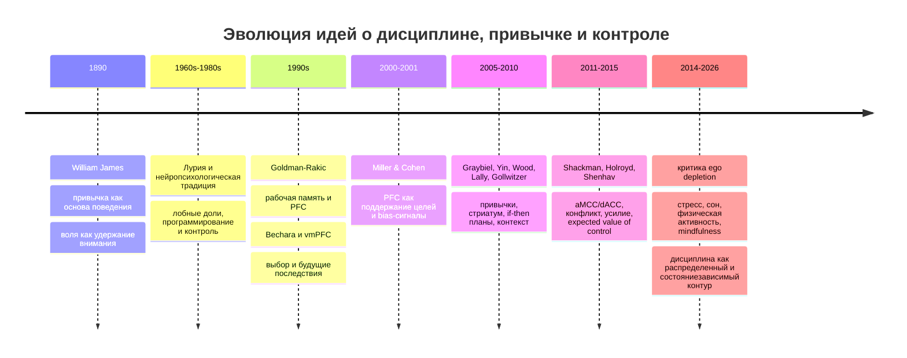
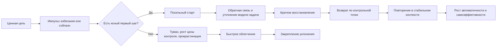

# Нейробиология дисциплины и зрелой воли

## Executive summary

Дисциплина в нейробиологическом смысле не сводится ни к одной "зоне воли", ни к простой схеме "сильная префронтальная кора подавляет плохие желания". Современные данные лучше описывают ее как распределенный контур, в котором дорсолатеральная префронтальная кора и связанные с ней сети удерживают цель и правила, вентромедиальная префронтальная кора кодирует субъективную ценность и значение вариантов, aMCC/dACC оценивает конфликт, цену усилия и ожидаемую ценность контроля, стриатум и базальные ганглии участвуют в выборе, запуске и автоматизации действий, а миндалина, BNST, PAG, островок и гиппокамп задают угрозу, телесную цену, контекст и память о прежних исходах. Поэтому "воля" - это не один модуль, а согласованная работа систем контроля, оценки, привычек, угрозы и восстановления. citeturn0search0turn3search0turn0search2turn5search1turn12search0turn11search0turn10search5turn28search2

Исторически поле прошло путь от философско-психологических описаний привычки и воли у Уильяма Джеймса, клинико-нейропсихологической линии Лурии и представлений о лобных долях как органе программирования и контроля, через модели рабочей памяти и "контекстного сигнала" префронтальной коры у Goldman-Rakic и Miller & Cohen, к современным вычислительным моделям, где контроль рассматривается как выбор дорогостоящего, но полезного режима обработки информации, а привычка - как результат повторений в стабильном контексте и перестройки кортико-стриарных контуров. В последние годы эта картина дополнена исследованиями стресса, сна, телесной нагрузки и mindfulness-практик, которые показывают, что зрелая дисциплина зависит не только от "силы торможения", но и от качества состояния организма, среды и системы восстановления. citeturn27search4turn16search6turn0search1turn0search0turn0search2turn6search2turn8search0turn31search16turn9search0

Практически наиболее надежную доказательную базу сегодня имеют не "тренировки силы воли" в старом смысле, а более прикладные инструменты: if-then планы, повышение стабильности контекста, самонаблюдение и обратная связь, ситуации с ранним контролем соблазнов, регулярный сон, физическая активность и в более умеренной форме mindfulness-практики. Для "рабочего журнала", протоколов первого шага и специальных ритуалов входа в интеллектуально сложную работу прямых нейробиологических RCT немного; их разумнее рассматривать как практические комбинации трех лучше поддержанных механизмов: intention offloading, self-monitoring и graded tasks. Это важная граница уверенности: многие инженерные и продуктивностные протоколы правдоподобны и полезны, но чаще опираются на косвенную, а не прямую экспериментальную базу. citeturn2search9turn6search2turn22search3turn23search0turn22search11turn21search0turn31search2turn25search15turn30search15turn9search2

Главный практический вывод для книги такого уровня звучит так: зрелая способность "браться за сложное и доводить до конца" развивается не из принуждения к постоянному страданию, а из повторяемой петли "ценная цель -> контакт с трудностью -> посильный первый шаг -> обратная связь -> восстановление -> возврат". Эта петля должна быть достаточно трудной, чтобы вызывать рост, и достаточно управляемой, чтобы не закреплять беспомощность, хронический стресс или выгорание. citeturn0search2turn4search0turn5search0turn8search0turn24search8turn15search2

## История идей и смена моделей

Классическая линия исследований дисциплины и воли начиналась не с fMRI, а с философии и ранней психологии привычки. Уильям Джеймс в "Principles of Psychology" подчеркивал, что поведение человека в огромной степени организовано привычками, а воля тесно связана с удержанием внимания на трудном объекте; в дальнейшем эти интуиции стали основой современных исследований автоматизации, самоконтроля и привычек. В русскоязычной традиции XX века лобные доли и исполнительные функции получили влиятельное описание в нейропсихологии Лурии и последующих обзорах, где акцент делался на программировании, регуляции и контроле поведения, хотя уже тогда было очевидно, что одной только "лобной" локализацией картина не исчерпывается. citeturn27search4turn16search6turn16search2

В 1990-е и начале 2000-х произошел переход от очень общих "лобных" объяснений к более точным моделям. Goldman-Rakic связала префронтальную кору с рабочей памятью и активным удержанием информации вне непосредственного стимула, а Miller и Cohen предложили влиятельную интегративную теорию: префронтальная кора поддерживает паттерны активности, представляющие цели и средства их достижения, и через bias-сигналы направляет обработку в других системах мозга. Параллельно исследования vmPFC и Iowa Gambling Task показали, что повреждение вентромедиальной префронтальной коры нарушает выбор в условиях неопределенности и делает человека более "близоруким" по отношению к будущим последствиям. citeturn0search1turn0search0turn34search4turn34search1

Следующий поворот состоял в том, что дисциплина перестала трактоваться как чистое "торможение". Модели dACC/aMCC сместили фокус на выбор контроля как ресурсоемкого действия. В теории expected value of control dACC не просто регистрирует ошибку, а оценивает, когда имеет смысл вкладывать усилие в контроль, исходя из ожидаемой выгоды, стоимости и альтернатив. Одновременно исследования базальных ганглиев и стриатума показали, что повторяющееся поведение постепенно "чанкуется" и становится более автоматическим, а привычки в стабильном контексте уменьшают зависимость действия от каждый раз заново принимаемого решения. citeturn0search2turn4search0turn5search1turn18search2turn5search0

В 2010-е и 2020-е годы поле стало еще менее наивным. Во-первых, данные по ego depletion и силовой модели самоконтроля стали противоречивее: крупная пререгистрированная мультилабораторная репликация не подтвердила классический эффект в ожидаемой форме, а альтернативные процессуальные модели стали акцентировать переключение мотивации, внимания и приоритетов, а не истощение единого "ресурса". Во-вторых, вырос интерес к ситуационным стратегиям самоконтроля, к обучению привычкам, к нейробиологии стресса и сна, а также к фактору телесного состояния. Сегодня дисциплина понимается скорее как инженерия контуров саморегуляции, чем как победа абстрактной воли над телом. citeturn20search0turn20search1turn21search0turn8search0turn31search16

Русскоязычная литература по теме существует, но по состоянию на июнь 2026 года она в основном представлена обзорными и учебными текстами об исполнительных функциях и развитии, а основная масса первичных эмпирических работ, мета-анализов и вычислительных моделей по дисциплине, усилию, привычке и контролю опубликована по-английски в международных рецензируемых журналах. citeturn16search2turn16search6turn13search0turn0search2turn5search0

Ключевой сдвиг всей этой истории состоит в том, что зрелая дисциплина перестала пониматься как сугубо моральное качество. В современной науке это скорее свойство системы "мозг - тело - среда - привычки - социальный контур", в которой человек умеет не просто подавлять импульс, а поддерживать цель, переносить фрустрацию неопределенности, выдерживать цену усилия, запускать действие в нужном контексте и возвращаться после срыва. citeturn13search15turn0search0turn0search2turn5search0turn24search8

## Контур дисциплины в мозге

Современная карта дисциплины начинается с DLPFC. Дорсолатеральная префронтальная кора наиболее тесно связана с рабочей памятью, удержанием правил, планированием и top-down управлением поведением. Она особенно нужна там, где задача еще не автоматизирована, где нужно удерживать несколько ограничений одновременно и сопротивляться привычным, но неуместным ответам. В этом смысле DLPFC не "создает" мотивацию, а держит в системе то, что должно управлять действием поверх текущего стимула. citeturn0search1turn0search0turn13search0

VMPFC решает другую задачу. Эта область тесно связана с субъективной ценностью, эмоционально значимыми исходами, выбором под неопределенностью и, в контексте страха и безопасности, с подавлением выражения страха и поддержанием extinction memory. Работы Hare и коллег показали, что при самоконтроле в пищевом выборе vmPFC кодирует общую ценность варианта, а DLPFC может сдвигать этот сигнал так, чтобы в расчет входили не только "вкусные", но и долгосрочные аспекты выбора. Работы по extinction показывают также, что vmPFC тесно работает вместе с гиппокампом и миндалиной, особенно когда человеку нужно удержать "это неприятно, но не опасно" или "эта угроза сейчас не релевантна". citeturn3search0turn17search0turn28search2turn28search1

aMCC/dACC - вероятно, наиболее важный узел для переживания усилия. На эмпирическом уровне эта область участвует в мониторинге конфликта, ошибок, боли, отрицательного аффекта и когнитивного контроля, но современнее говорить не о "детекторе конфликта" как таковом, а о системе, оценивающей, стоит ли вкладываться в контроль и выдерживание трудности. Именно поэтому дисциплина часто ломается не на уровне ценности цели, а на уровне оценки "цена входа слишком велика" или "этот контроль сейчас не окупится". Отсюда следует важное прикладное следствие: хороший первый шаг и ясный критерий прогресса снижают не только психологическую, но и вычислительную стоимость контроля. citeturn0search2turn4search1turn4search0

Стриатум и базальные ганглии обеспечивают действие в более "операционном" смысле: выбор, запуск, селекцию конкурирующих программ и постепенную автоматизацию повторяемых последовательностей. Работы по привычке у Yin, Knowlton, Graybiel и других показали, что повторяемые действия в стабильном контексте постепенно все меньше требуют явной deliberation и все больше управляются кортико-стриарными петлями. Для дисциплины это означает, что зрелость - не только в умении каждый раз героически заставлять себя, но и в переводе части поведения в режим низкой стоимостной автоматичности. citeturn18search3turn18search2turn18search0turn5search0

Миндалина, BNST и PAG относятся к защитному блоку, но их роли различаются. Миндалина особенно важна для быстрого, фазического ответа на конкретную угрозу и для обучения значимости стимулов. BNST, по классической формулировке Davis и коллег, больше вовлечен в длительное состояние тревожного ожидания, связанное с неопределенной и непредсказуемой угрозой. PAG координирует оборонительные реакции по мере приближения угрозы и связан с переходом от планирования к более автоматическим режимам защиты и бегства. Для дисциплины это критично: сложная задача может восприниматься не как "работа", а как размазанная неопределенная угроза статусу, самооценке, времени или телесному ресурсу, и тогда запускается тревожный контур уклонения. citeturn11search0turn10search5turn10search0turn17search5

Островок и связанные с ним сети важны потому, что дисциплина всегда телесна. Островковая кора участвует в интероцепции, представлении телесного состояния и salience-сигналах, которые помогают мозгу решать, что сейчас "важно". Если задача сопряжена с напряжением, усталостью, нехваткой воздуха, сердцебиением, дискомфортом неопределенности или голодом, островок помогает кодировать это как часть текущей ценности действия. Поэтому субъективное "не могу" часто является смесью когнитивной трудности и интероцептивной стоимости, а не чистой "лени". citeturn12search0turn12search1turn12search4

Гиппокамп завершает этот контур, добавляя память о контексте. Он нужен не только для декларативной памяти, но и для связи целей с местами, состояниями, временными окнами и прежними исходами. В системах страха и безопасности он помогает различать, где угроза действительно релевантна, а где нет; в более общем плане - помогает использовать прошлый опыт для текущего выбора. Чем богаче у человека память о пережитых циклах "было трудно -> я сделал первый шаг -> стало понятнее", тем вероятнее, что новая трудность будет кодироваться как преодолимая, а не как катастрофа. citeturn28search2turn17search0turn13search5

Отсюда следует важное обобщение: дисциплина - это не процесс "PFC против лимбики". Это координация, в которой PFC удерживает модель цели, vmPFC придает ценность долгосрочным исходам, aMCC/dACC решает, стоит ли платить цену усилия, стриатум запускает и автоматизирует действие, а системы угрозы и интероцепции либо препятствуют работе, либо, в хорошо настроенном контуре, перестают доминировать. citeturn0search0turn3search0turn0search2turn5search1turn12search1turn11search0

## Функциональные модели и модификаторы состояния

Рабочая память - одна из самых фундаментальных моделей для понимания дисциплины. Пока цель, правило и ближайший шаг не удерживаются "в онлайне", поведение управляется ближайшим стимулом, привычкой или эмоциональным уклонением. Поэтому дисциплина почти всегда начинается с "поднять цель в рабочее состояние" - сформулировать, что именно делается сейчас, по какому правилу, где критерий завершения и что считать следующим действием. Это объясняет, почему туманные задачи так быстро превращаются в прокрастинацию: они съедают рабочую память, не давая ясной операциональной структуры. citeturn0search1turn0search0turn13search0

Модель expected value of control добавляет второй слой. Даже если цель ясна, мозг должен решить, стоит ли вкладывать усилие в контроль. Когда задача важна, но очень дорога по цене входа, неясна по обратной связи или конкурирует с более легкими источниками немедленного вознаграждения, система может "рационально" уклониться. Именно в этом месте взрослый самоконтроль оказывается не чистым подавлением, а дизайном задач: уменьшить цену старта, сделать обратную связь ближе, определить первый шаг и снизить число альтернатив. Иначе человек будет снова и снова проигрывать не потому, что мало хочет, а потому, что архитектура контроля слишком затратна. citeturn0search2turn4search0turn21search0

Привычка - это не враг дисциплины, а ее экономичный финал. Обзоры Wood и Runger, Yin и Knowlton, а также работы Lally показали, что повторение поведения в стабильном контексте постепенно превращает намерение в автоматичность. Более новые лонгитюдные данные показывают, что стабильность контекста повышает automaticity и goal attainment; это особенно ценно для поведения, которое не должно каждый раз заново "зарабатывать право на старт". В реальной жизни зрелая дисциплина почти всегда сочетает контролируемый и привычный уровень: новое и трудное требует DLPFC и aMCC, но повторяемые ритуалы запуска, гигиена рабочего места, сон, тренировки и порядок начала дня должны как можно раньше уйти в режим привычки. citeturn5search0turn18search3turn7search4turn6search2

Implementation intentions - один из самых практичных мостов между целями и действиями. Литература по if-then планам показывает, что спецификация ситуации и реакции в формате "если X, то Y" помогает преодолеть разрыв между намерением и действием, особенно когда человек сталкивается с проблемами старта, помехами и соблазнами. В теоретическом смысле это форма стратегической автоматизации: часть контроля заранее выносится в правило "сигнал -> ответ", снижая нагрузку на спонтанное решение в самый слабый момент. citeturn2search9turn2search7turn2search0

Параллельно с этим ослабла сила старой метафоры "ресурс силы воли". Мультилабораторная пререгистрированная репликация не дала ожидаемой поддержки классическому ego depletion, а альтернативные модели подчеркивают, что после напряжения люди могут смещать приоритеты от "надо" к "хочу", менять мотивационный баланс и искать когнитивный досуг вместо когнитивного труда. Для книги это принципиально: дисциплину стоит строить не на мифе о магическом истощаемом баке, а на реальных механизмах утомления, мотивационного сдвига, стресса, сна, контекста и альтернативных вознаграждений. citeturn20search0turn20search1

Стресс - один из самых мощных разрушителей зрелой дисциплины. Обзоры Arnsten и McEwen показывают, что острый и хронический стресс ослабляют PFC-зависимые функции и одновременно усиливают более древние, реактивные системы. На субъективном уровне это выглядит как сужение времени до "сейчас", импульсивность, ригидность, трудность держать в голове сложную структуру и склонность к быстрому облегчению. При хроническом стрессе и истощении это может переходить в стойкие нарушения памяти и исполнительных функций. citeturn8search0turn15search6turn15search23turn15search2

Сон дает столь же сильный, но противоположный эффект. Недосып стабильно ухудшает внимание, скорость и вариативность ответов, рабочую память, торможение и принятие решений; хроническое ограничение сна до 6 часов и меньше на протяжении дней накапливает дефициты, которые субъективно недооцениваются. Консенсусные рекомендации для взрослых сходятся на том, что регулярные 7 и более часов сна связаны с лучшими исходами для здоровья; для большинства молодых и средневозрастных взрослых диапазон 7-9 часов считается нормой. Если дисциплина важна, сон перестает быть "восстановлением после жизни" и становится частью самой архитектуры контроля. citeturn31search16turn24search22turn31search2turn31search6

Физическая активность помогает не только через настроение, но и через исполнительные функции. Классические обзоры и более новые мета-анализы показывают малые, но устойчивые эффекты острой и регулярной физической нагрузки на executive functions, особенно на внимание, обновление рабочей памяти и когнитивную гибкость; величина эффекта зависит от возраста, вида нагрузки и дизайна исследования, но направление результата в целом благоприятное. На уровне рекомендаций официальные руководства WHO и U.S. Physical Activity Guidelines советуют взрослым не менее 150-300 минут умеренной аэробной активности в неделю плюс силовые нагрузки не реже двух раз в неделю. citeturn8search2turn30search15turn30search0turn30search2turn25search15turn25search10

Mindfulness и медитация занимают промежуточное место. С одной стороны, обзоры и мета-анализы показывают малые или малые-до-умеренных улучшения по ряду показателей внимания, рабочей памяти и executive attention, а также снижение стресса. С другой стороны, эффекты неоднородны, программы сильно различаются, а у части людей возникают неприятные или даже клинически значимые adverse effects, особенно при высокой интенсивности, ретритном формате, предшествующей травме или психиатрической уязвимости. Поэтому медитацию разумно предлагать не как универсальную заплатку для дисциплины, а как инструмент развития мета-осознавания и снижения реактивности у подходящих людей и в дозируемом режиме. citeturn9search0turn9search2turn9search12turn32search0turn32search4turn32search11

Эта петля важна потому, что соединяет нейробиологию контроля с практикой взросления. Если человек многократно проживает цикл "трудно -> я остаюсь -> делаю первый шаг -> получаю сдвиг", то гиппокамп и vmPFC начинают кодировать трудность как преодолимую и ценную, aMCC получает более благоприятный прогноз окупаемости усилия, а стриатум получает шанс автоматизировать старт. Если же многократно повторяется "трудно -> избегание -> облегчение", то закрепляется обратный контур. citeturn0search2turn5search0turn28search2turn23search0

## Практические интервенции и протоколы

В прикладной работе с дисциплиной наиболее сильна логика "сначала дизайн контура, потом героизм". Если человек каждый день должен в одиночку выигрывать один и тот же внутренний спор, контур спроектирован плохо. Исследования ситуационных стратегий самоконтроля показывают, что раннее управление ситуацией обычно эффективнее, чем позднее сдерживание уже разогнанного соблазна. Поэтому первое практическое правило - убирать триггеры импульсивного переключения до того, как они успели стать центральным объектом внимания: физически убирать телефон, откладывать мессенджеры до первого смыслового блока, заранее открывать нужный документ и делать начало дня более однотипным. citeturn21search0turn5search0

If-then планы - один из лучших низкозатратных инструментов. Хороший план не "я постараюсь работать больше", а "если начинается первый рабочий слот, то я открываю журнал задачи и делаю 7 минут первого шага", "если ловлю позыв проверить сообщения, то сначала записываю, чего именно избегаю", "если прерываюсь, то оставляю в журнале точку входа". Исследования implementation intentions показывают, что такой формат помогает при инициации действия, подавлении неуместных ответов и удержании цели в условиях помех. citeturn2search9turn2search7turn2search0

Стабильность контекста - второй базовый инструмент. Лонгитюдные данные по intentional habit building показывают, что одно и то же время, одно и то же место или один и тот же порядок запуска ускоряют рост автоматичности и повышают вероятность достижения цели. Это значит, что дисциплина любит не абстрактную решимость, а повторяемую сценографию: первый слот, один и тот же контейнер задачи, единый порядок входа, финальная контрольная точка. citeturn6search2turn7search4

"Рабочий журнал" как отдельная практика плохо изучен именно под этим названием, но его компоненты поддержаны косвенно и местами прямо. Во-первых, self-monitoring и обратная связь входят в наиболее воспроизводимые техники изменения поведения. Во-вторых, intention offloading и использование внешних напоминаний повышают вероятность исполнения отсроченных намерений. Отсюда хорошо следует журнал минимального формата: перед блоком - цель, текущий вопрос, первый шаг; после блока - что понял, где остановился, что открыть первым в следующий раз. Для интеллектуальной работы это снижает нагрузку на рабочую память и цену возврата после перерыва. Прямых нейровизуализационных RCT на "рабочий журнал программиста" я не нашел; это зона обоснованной, но все же экстраполяции. citeturn22search3turn22search11turn23search0turn23search1turn21search1

Протокол первого шага и graded task полезны в тех случаях, где проблема не в глобальной мотивации, а в высокой цене старта и страхе неопределенности. Выигрывает не тот первый шаг, который "достоин цели", а тот, который уменьшает вычислительную туманность: выписать три неизвестных, построить минимальную гипотезу, открыть логи и зафиксировать один паттерн ошибки, сформулировать критерий готовности черновика, а не попытаться "разобраться со всем". Литература по behavior change techniques систематически выделяет graded tasks, goal setting, self-monitoring and feedback как полезные компоненты, хотя именно для сложной аналитической работы они часто применяются в адаптированном виде. citeturn22search13turn22search3turn0search2

Восстановление - часть дисциплины, а не ее противоположность. Данные о психологическом detachment от работы, о влиянии коротких дрем и о роли отдыха при высоких demands показывают, что без восстановления эффективность контроля и устойчивость участия падают. Особенно важно, чтобы отдых не превращался в еще один сильный источник переключения контекста, после которого цена возврата к трудной задаче резко растет. Практически это означает: короткие перерывы без погружения в захватывающие альтернативы, полноценное выключение из работы в нерабочее время и уважение к сну как к ограничению, а не к бонусу. citeturn24search2turn24search8turn24search1turn31search16

Ниже - сводка практик и ожидаемых нейробиологических эффектов. Здесь важна оговорка: для многих практик эффекты на конкретные зоны мозга частично выводятся из механистических моделей и поведенческих данных, а не из прямых доказательств типа "эта практика избирательно увеличивает активность DLPFC". Там, где evidence более косвенный, это отмечено в формулировках. citeturn0search0turn23search0turn22search3turn9search2

### Таблица B. Практики и ожидаемые нейробиологические эффекты

| Практика | Что делать practically | Ожидаемый механизм | Вероятный нейробиологический эффект | Уровень уверенности | Источник |
|---|---|---|---|---|---|
| If-then планы | Формат "если X, то Y" для старта, срыва, возврата | Снижение нагрузки на спонтанное решение, стратегическая автоматизация | Меньше требований к online-контролю, быстрее связывание сигнала с ответом | Высокий | citeturn2search9turn2search7turn2search0 |
| Стабильность контекста | Фиксировать время, место, порядок запуска | Усиление cue-behavior связи | Быстрее формирование automaticity в кортико-стриарных контурах | Высокий | citeturn6search2turn5search0turn18search3 |
| Рабочий журнал | До блока: цель, вопрос, первый шаг. После: вывод, точка возврата | Self-monitoring + intention offloading | Разгрузка рабочей памяти, повышение вероятности возврата к цели | Средний, в основном косвенный | citeturn22search3turn23search0turn23search1 |
| Первый шаг малого размера | Делить вход не по смысловому пафосу, а по снижению тумана | Снижение expected cost of control | Более благоприятная оценка усилия aMCC/dACC, легче старт | Средний | citeturn0search2turn22search13 |
| Ситуационный самоконтроль | Убирать телефон, ленты и чаты до первого смыслового сдвига | Раннее подавление соблазна через отбор ситуации | Меньше конкуренции salience-сигналов, меньше импульсивных переключений | Высокий | citeturn21search0turn12search1 |
| Регулярный сон | Держать 7+ часов, по возможности стабильный график | Поддержка PFC-зависимых функций и бдительности | Лучше рабочая память, торможение, решение задач | Высокий | citeturn31search2turn31search16turn24search22 |
| Физическая активность | 150-300 мин умеренной активности в неделю + 2 силовые сессии | Улучшение когнитивной и телесной готовности | Малые, но устойчивые улучшения EF, внимания и гибкости | Средне-высокий | citeturn25search15turn30search15turn30search0turn30search2 |
| Mindfulness в умеренной дозе | Короткие регулярные практики, не как ретритный стресс-тест | Рост мета-осознавания и снижения реактивности | Небольшие улучшения executive attention; снижение стресса | Средний, с рисками | citeturn9search2turn9search12turn32search4turn32search11 |
| Полное отключение от работы | Выделять оффлайн-периоды без "полу-работы" | Психологическое detachment и восстановление | Снижение истощения, лучшая готовность к следующему циклу контроля | Средне-высокий | citeturn24search2turn24search8 |

## Сценарий развития зрелой способности делать трудное

Созревание дисциплины лучше рассматривать стадийно. Это не обязательно жесткая возрастная последовательность, а скорее логика развития от опоры на внешнее к внутренне и ситуационно встроенному самоуправлению. Нейробиологически этот путь связан с развитием исполнительных функций, интеграцией PFC с памятью и эмоциональными сетями, а также переходом части поведения из режима сознательного регулирования в режим привычки. citeturn13search1turn13search14turn14search5turn13search15

### Внешняя рамка

На первой стадии регуляция в основном внешняя: расписание, дедлайны, родители, школа, начальник, команда, последствия. В детстве и подростковом возрасте это закономерно, потому что исполнительные функции и сети когнитивного контроля еще развиваются, а баланс между системой вознаграждения и системой контроля часто сдвинут в сторону большей чувствительности к новизне, социальной значимости и немедленной выгоде. Нейробиологически здесь важны продолжающееся созревание префронтальной коры и развитие ее связи с гиппокампом и мезолимбическими системами. citeturn13search1turn14search0turn14search1turn13search5

### Интериоризация правил

Дальше внешние требования постепенно интериоризируются: человек начинает удерживать правила без постоянного надзора. Это соответствует укреплению рабочей памяти, торможения и когнитивной гибкости. На этой стадии формируется важный нейропсихологический переход: цель может направлять поведение даже в отсутствие поддерживающего стимула. Практически это тот момент, когда человек способен не просто реагировать на требования, а строить последовательность действий по внутреннему плану. citeturn13search0turn0search0turn14search2

### Овладение фрустрацией и неопределенностью

Зрелость не начинается там, где человек научился делать легкое по расписанию. Она начинается там, где он учится выдерживать фрустрацию, ошибку, туман и временное отсутствие награды. Здесь на передний план выходят aMCC/dACC, vmPFC, миндалина и островок: задача должна перестать автоматически кодироваться как невыносимая угроза, а стать переносимой ценой за значимую цель. Если этот переход не происходит, многие взрослые остаются на уровне вроде бы развитых исполнительных функций, но все еще живут по схеме "делаю, пока приятно и ясно". citeturn0search2turn12search0turn11search0turn34search2

### Переход от усилия к системе

Следующая стадия - перестройка дисциплины из героического режима в системный. Человек начинает проектировать среду, контекст и ритуалы так, чтобы ценное трудное действие не каждый раз зависело от вдохновения. Нейробиологически здесь важно, что часть старта и поддержания действия уходит в привычку и cue-driven режимы, разгружая рабочую память и уменьшая цену контроля. Это не ослабление воли, а признак зрелости: зрелый человек не просто "умеет терпеть", а умеет снижать число моментов, в которых терпение вообще должно сработать. citeturn5search0turn18search3turn6search2turn21search0

### Самоэффективность и возврат после сбоя

Высшая практическая стадия - когда идентичность строится не вокруг идеала "я никогда не срываюсь", а вокруг более реалистичной и взрослой схемы "я умею возвращаться". С точки зрения обучения это критически важно: repeated success in re-entry укрепляет ожидание, что трудность переживаема, а срыв не равен провалу личности. В исследованиях прокрастинации и self-regulation на этом уровне особенно значимы self-efficacy for self-regulation и снижение fear of failure; иначе человек может иметь высокий интеллект и неплохую DLPFC, но все равно проваливаться всякий раз, когда задача затрагивает самооценку. citeturn29search14turn29search6turn13search15

Если переводить это в сценарий взросления личности, то наиболее благоприятная траектория выглядит так: достаточная внешняя структура в раннем периоде, постепенное предъявление посильной трудности, опыт успешного преодоления, развитие языка описания собственного состояния, освоение ситуационных стратегий, формирование устойчивых привычек сна и действия, укрепление tolerable frustration и, наконец, переход к идентичности человека, который ценит не мгновенное облегчение, а долгую способность делать значимое. Такая траектория не гарантирует совершенства, но дает именно то, что пользователь описывает как зрелую способность "браться за сложное и выполнять, преодолевать, стараться, терпеть, закаляться вопреки позывам соскочить". citeturn13search17turn13search6turn14search5turn5search0turn0search2

## Риски, ограничения и архитектура книги

У дисциплины есть темная сторона, и ее нельзя игнорировать. Первая группа рисков - перегруз и выгорание. Если человек систематически строит жизнь на хроническом превышении ресурса, недосыпе и высоких demands без detachment и восстановления, то получит не "закалку", а ослабление PFC-зависимых функций, эмоциональное истощение и снижение качества решений. Это не моральная неудача, а предсказуемый исход слишком дорогого режима. citeturn8search0turn15search23turn24search8turn15search2

Вторая группа рисков связана с травмой и хронической тревогой. У людей с травматическим опытом или выраженной тревожностью трудная задача может запускать не просто неприятие усилия, а полноценный defensive mode с диссоциацией, гипервозбуждением, избеганием и нарушением интеграции PFC-amygdala-vmPFC контуров. В таких случаях грубые дисциплинарные техники могут усиливать симптомы вместо роста. Здесь нужны более медленные и клинически информированные подходы: stabilisation, дозирование нагрузки, работа с телом, безопасностью и контекстом. citeturn15search12turn15search3turn17search0turn32search12

Третья группа рисков - слишком романтизированное использование медитации и "стресс-тренировок". У mindfulness-практик есть польза, но есть и adverse effects, особенно при высокой интенсивности, уязвимой психике, диссоциативных тенденциях и плохом сопровождении. Аналогично, систематическое подталкивание себя к экстремальному дискомфорту без ясной обратной связи и восстановления скорее тренирует беспомощность, чем зрелую волю. Хорошая дисциплина всегда остается управляемой. citeturn32search0turn32search4turn32search11

Четвертая группа рисков - редукционизм. Литература об executive functions и лобных долях давно показывает, что нет простого соответствия "одна функция - одна зона". Поэтому книга о дисциплине, которая сведет все к DLPFC или к дофамину, будет удобной, но научно слабой. Точнее говорить о динамическом распределенном контуре, который зависит от задачи, стадии автоматизации, уровня стресса и телесного состояния. citeturn26search2turn13search15turn0search0

### Таблица A. Ключевые исследования и источники

| Авторы, год | Тип и метод | Выборка | Основной вывод | Ссылка |
|---|---|---:|---|---|
| James, 1890 | Классический теоретический труд | н/д | Привычка - базовый организатор поведения; воля тесно связана с удержанием внимания | citeturn27search4 |
| Goldman-Rakic, 1995 | Обзор нейрофизиологии рабочей памяти | н/д | PFC участвует в активном удержании информации, необходимой для goal-directed behavior | citeturn0search1 |
| Miller & Cohen, 2001 | Интегративный обзор | н/д | Когнитивный контроль опирается на активное поддержание целей и bias-сигналы PFC | citeturn0search0 |
| Bechara et al., 1994 | Нейропсихологическое исследование | пациенты с поражением PFC и контроли | Повреждение vmPFC связано с нечувствительностью к будущим последствиям в принятии решений | citeturn34search4 |
| Hare, Camerer, Rangel, 2009 | fMRI во время реального пищевого выбора | здоровые молодые взрослые-диетеры | Самоконтроль связан с модуляцией vmPFC-ценности со стороны DLPFC | citeturn3search0 |
| Shenhav, Botvinick, Cohen, 2013 | Теоретико-эмпирический обзор | н/д | dACC/aMCC оценивает expected value of control, а не просто "ошибку" | citeturn0search2 |
| Holroyd & Yeung, 2012 | Обзор ACC | н/д | ACC поддерживает выбор и удержание протяженных целенаправленных опций поведения | citeturn4search0 |
| Yin & Knowlton, 2006 | Обзор базальных ганглиев и привычки | н/д | Базальные ганглии и стриатум критичны для habit formation | citeturn18search3 |
| Barnes et al., 2005 | Нейрофизиология стриатума у животных | крысы | Активность нейронов стриатума динамически перестраивается при формировании, угасании и восстановлении привычек | citeturn18search2 |
| Lally et al., 2010 | Лонгитюдное исследование habit formation | взрослые, реальная повседневная жизнь | Автоматичность растет постепенно и не линейно; привычки формируются не мгновенно | citeturn7search4 |
| Gollwitzer & Sheeran, 2006 | Мета-анализ implementation intentions | 94 теста из 63 отчетов | If-then планы надежно улучшают достижение целей | citeturn2search9turn2search0 |
| Duckworth, Gendler, Gross, 2016 | Обзор situational self-control | н/д | Раннее управление ситуацией часто эффективнее позднего подавления соблазна | citeturn21search0 |
| Arnsten, 2009 | Обзор стресса и PFC | н/д | Стресс нарушает функции PFC и смещает поведение к более реактивным режимам | citeturn8search0 |
| Killgore, 2010 | Обзор лишения сна | н/д | Недосып особенно бьет по executive functions и решениям, зависящим от PFC | citeturn8search1 |
| van Dongen et al., 2003 | Эксперимент со sleep restriction | здоровые взрослые | Хроническое ограничение сна до 6 ч и меньше вызывает кумулятивные когнитивные дефициты | citeturn24search22 |
| Hillman, Erickson, Kramer, 2008 | Крупный обзор exercise-cognition | н/д | Аэробная физическая активность благоприятно влияет на мозг и когнитивные функции | citeturn8search2 |
| Ludyga et al., 2016 | Мета-анализ acute exercise | разные возрастные группы | Один эпизод умеренной аэробной нагрузки может улучшать отдельные аспекты executive function | citeturn30search4 |
| Tang et al., 2007 | RCT краткой медитативной тренировки | здоровые взрослые | Краткая тренировка улучшала внимание и self-regulation | citeturn9search1 |
| Zainal et al., 2024 | Мета-анализ mindfulness и cognition | 100+ эффектов | MBI дают малые-до-умеренных эффекты на глобальное познание, executive attention и working memory | citeturn9search2 |
| Britton et al., 2021 | Исследование adverse effects mindfulness-based programs | n = 96 | У части участников возникают meditation-related negative effects, иногда длительные | citeturn32search4 |

### Таблица C. Предлагаемый план глав книги

| Глава | Примерный объем | Цель главы |
|---|---:|---|
| Введение: что такое дисциплина на самом деле | 25-35 стр. | Развести мифы о "силе воли", ввести распределенную модель дисциплины |
| История идей о воле, привычке и контроле | 35-45 стр. | Показать путь от Джеймса и Лурии до PFC, habit science и EVC |
| Нейроанатомия дисциплины | 50-70 стр. | Подробно разобрать DLPFC, VMPFC, aMCC/dACC, стриатум, миндалину, островок, гиппокамп, PAG, BNST |
| Как мозг решает, стоит ли напрягаться | 40-55 стр. | Объяснить рабочую память, expected value of control, конфликт, усилие, соблазн и быстрые награды |
| Как из усилия возникает привычка | 35-50 стр. | Показать переход от контролируемого действия к автоматичности и роль стабильного контекста |
| Тело как фундамент дисциплины | 40-60 стр. | Разобрать стресс, сон, движение, интероцепцию, усталость и восстановление |
| Практики зрелой дисциплины | 55-75 стр. | Собрать доказательные интервенции: if-then, рабочий журнал, первый шаг, контекст, обратная связь |
| Развитие личности и зрелой воли | 45-60 стр. | Описать стадийный сценарий взросления саморегуляции и его нейробиологические корреляты |
| Когда дисциплина ломается | 35-50 стр. | Показать выгорание, травму, тревогу, перфекционизм, диссоциацию и ложные стратегии |
| Заключение: от воли к архитектуре жизни | 20-30 стр. | Свести воедино модель зрелой дисциплины как контур "цель - действие - восстановление - возврат" |

На уровне gaps in evidence важно быть честным. Я не нашел хороших первичных исследований, которые бы напрямую валидировали именно тот формат "рабочего журнала", которым пользуются разработчики и knowledge workers, как отдельную интервенцию с четкими нейробиологическими исходами. Я также не нашел надежной поддержки идее, что "силу воли" можно существенно нарастить универсальными упражнениями на самоподавление вне контекста реальных целей и среды. Напротив, лучше всего поддержаны многокомпонентные подходы, где сочетаются ясная цель, структурированный контекст, снижение цены входа, обратная связь, сон, движение и возможность возврата после сбоя. citeturn21search1turn22search3turn23search0turn20search0turn21search0

В итоге, если писать книгу на современном научном уровне, ее центральный тезис должен быть довольно строгим. Зрелая дисциплина - это не постоянное насилие над собой и не врожденный дар. Это выращиваемая система, в которой мозг постепенно учится удерживать ценное, не теряться от тумана, выдерживать цену усилия, запускать первый шаг, извлекать урок из обратной связи и возвращаться после срыва без разрушения себя. Именно эта система, а не "героическая" мотивация, и делает человека способным делать сложное долго, глубоко и по-взрослому. citeturn0search0turn0search2turn5search0turn24search8turn31search16