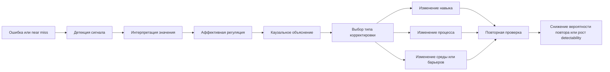
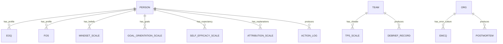
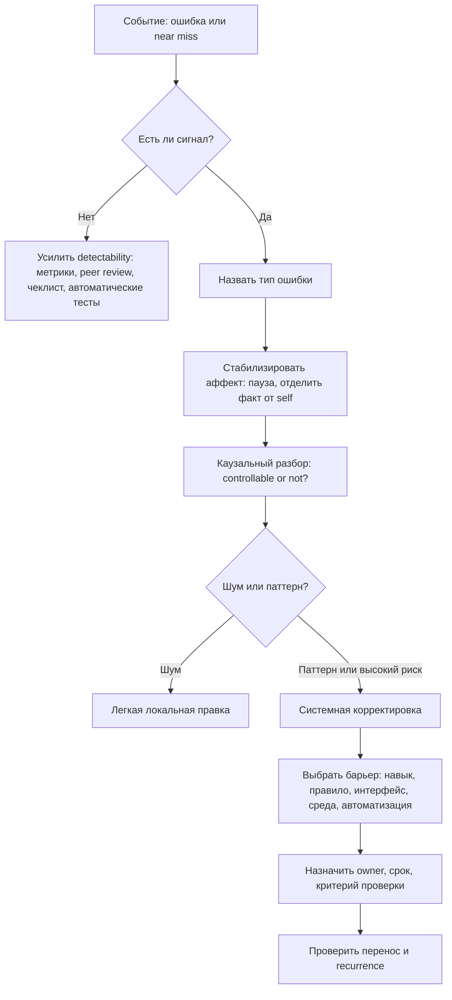
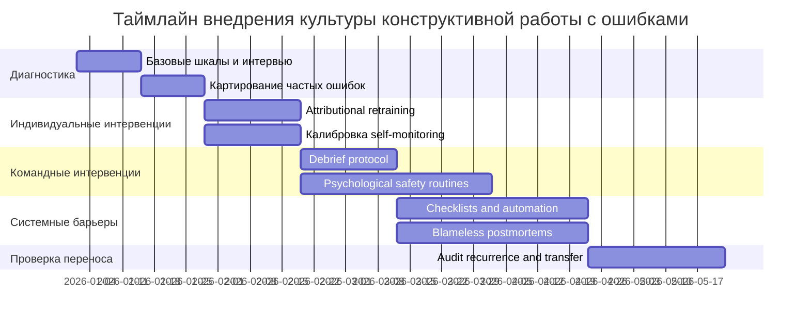

# Материалы для книги о различиях в отношении к ошибкам и переводе ошибок в конструктивные действия

## Executive summary

Исследуемое явление реально существует, но в литературе оно не закреплено одним-единственным термином. Ближе всего к нему подходит связка из нескольких конструктов: error orientation, feedback orientation, mindset, goal orientation, self-efficacy, attributional style, psychological safety, learned helplessness и моделей feedback interventions. В сумме они описывают не просто "болезненность" ошибки, а то, как человек замечает ошибку, приписывает ей значение, выдерживает неприятный аффект, извлекает причинный урок и меняет последующее действие или систему работы. Именно эта связка, а не один фактор, и образует то, что для книги разумно называть "конструктивной чувствительностью к ошибкам". citeturn0search1turn0search6turn1search0turn2search0turn1search13turn20view0turn12search7turn2search7turn2search3

Главный практический вывод строгой литературы такой: ошибка становится полезной не сама по себе, а только если она переводится в корректирующее действие на уровне стратегии, навыка, среды или процесса. Это подтверждается сразу несколькими линиями данных. В мета-анализе Kluger и DeNisi feedback interventions в среднем улучшали performance, но более чем в трети случаев ухудшали его; их теория показывает, что эффект ослабевает, когда внимание уходит от задачи к self-related processes. В образовании Hattie и Timperley показали, что полезнее всего feedback, направленный на задачу, процесс и саморегуляцию, а не на "личность". В организационном обучении это же видно в error management training, structured debriefing, postmortems и checklist-based barriers. citeturn20view0turn21view0turn24view3turn22view0turn15search0

По силе доказательств наиболее надежно выглядят пять утверждений. Во-первых, error orientation и feedback orientation измеримы и действительно различаются между людьми. Во-вторых, self-efficacy и goal orientation систематически связаны с тем, будет ли человек после ошибки входить в "режим обучения" или "режим самозащиты". В-третьих, psychological safety на уровне команды повышает вероятность сообщения об ошибках, обсуждения проблем, information sharing и learning behavior. В-четвертых, error management training и debriefing дают осмысленные прикладные эффекты, особенно на перенос в новые задачи. В-пятых, системные барьеры вроде чеклистов, автоматизации проверок и blameless postmortems снижают повторяемость дорогих ошибок лучше, чем призывы "быть внимательнее". citeturn0search1turn9view1turn2search1turn26view0turn31search2turn31search0turn24view3turn22view0turn3search18turn15search0turn15search8

При этом популярные идеи нужно калибровать. Growth mindset важен, но его нельзя романтизировать: исследования показывают, что growth mindset связан с лучшим вниманием к ошибке и лучшими post-error adjustments, однако мета-аналитические эффекты mindset-интервенций на achievement в среднем невелики и зависят от контекста. Поэтому для книги безопаснее рассматривать mindset как одну деталь более широкой системы, а не как объяснение всего. citeturn1search16turn1search2turn13search0

Для практической книги оптимальна не моральная риторика "ошибки полезны", а инженерная рамка: "ошибка -> классификация -> приписывание причины -> выбор барьера/правки -> проверка переноса". Такая рамка лучше согласуется с Reason, Hattie and Timperley, Feedback Intervention Theory, error management training, дебрифингом и организационными практиками постмортемов. Это позволяет писать книгу и как аналитический труд, и как рабочее руководство с шаблонами, шкалами, чеклистами, кейсами и упражнениями. citeturn12search7turn21view0turn20view0turn23view0turn22view0turn15search0

## Теоретическая карта явления

Строгое описание интересующего вас предмета можно сформулировать так: это индивидуальные и средовые различия в том, как человек и группа обращаются с ошибкой как с сигналом для адаптации. В литературе этот контур распадается на несколько уровней. Error orientation описывает установки и типичные способы обращения с ошибками, feedback orientation - общую восприимчивость к обратной связи, mindset и goal orientation - то, интерпретируется ли ошибка как угроза способности или как материал для роста, self-efficacy - ощущение "я могу что-то изменить", attribution theory - каузальные объяснения неудачи, learned helplessness - состояние, в котором ошибка перестает вести к действию, а psychological safety и error management culture - условия, при которых люди вообще готовы сообщать об ошибках и учиться на них. citeturn0search1turn18view0turn1search0turn26view0turn2search0turn2search7turn2search3turn1search13turn29view0

Для книги стоит сразу развести две вещи. Первая - чувствительность к ошибке как к сигналу. Вторая - способность конвертировать этот сигнал в преднамеренное изменение поведения или системы. Kluger и DeNisi показали, что feedback сам по себе может как помогать, так и вредить performance, а Hattie и Timperley уточнили, что критична не просто "обратная связь", а ее уровень: задача, процесс, self-regulation или self. Ваша центральная тема находится на пересечении именно task/process/self-regulation, а не на уровне self-condemnation. citeturn20view0turn21view0

Ниже приведена рабочая сводка конструктов, которую удобно превратить в первую теоретическую главу книги.

| Конструкт | Что именно измеряет | Какой механизм после ошибки предполагает | Что надежно поддержано данными | Где легко ошибиться в интерпретации |
|---|---|---|---|---|
| Error orientation | Установки и способы совладания с ошибками: компетентность, обучение на ошибках, риск, напряжение, предвосхищение, сокрытие и др. citeturn0search1turn19view0 | Ошибка запускает либо анализ и обучение, либо strain и covering up. citeturn0search1turn19view0 | Конструкт измерим и валиден на индивидуальном уровне; из него вырастает error management culture на уровне организации. citeturn0search1turn29view0 | Нельзя сводить его к "любви к ошибкам"; отрицательные шкалы имеют самостоятельное значение. citeturn19view0 |
| Feedback orientation | Общая восприимчивость к feedback; включает utility, accountability, social awareness, feedback self-efficacy. citeturn18view0turn9view1turn11search1 | После ошибки человек либо использует feedback для goal striving, либо избегает его. citeturn9view1 | По мета-анализу feedback orientation положительно связана с learning goal orientation, feedback seeking, work performance и job satisfaction. citeturn9view1 | Высокая восприимчивость не равна автоматическому улучшению: feedback может быть плохим по дизайну. citeturn20view0 |
| Growth vs fixed mindset | Имплицитные теории интеллекта и развития способностей. citeturn1search0turn1search16 | Growth mindset повышает внимание к ошибке и воспринимаемую исправимость, fixed mindset усиливает трактовку ошибки как индикатора "неспособности". citeturn1search16 | Есть данные о связи growth mindset с Pe и better post-error accuracy; интервенции работают умеренно и не всегда. citeturn1search16turn1search2turn13search0 | Нельзя обещать крупные универсальные эффекты от одной mindset-переформулировки. citeturn1search2 |
| Goal orientation | Learning/mastery, prove performance, avoid performance goals. citeturn26view0turn10search21 | Learning goals ведут к challenge-seeking и mastery-oriented response to failure; avoidance - к защите и уходу. citeturn1search10turn26view1 | Метаданные подтверждают, что learning и performance-avoid goals дают разные паттерны адаптации. citeturn26view0turn26view1 | Важна разница между объективной адаптацией и субъективными оценками адаптации. citeturn26view1 |
| Self-efficacy | Вера в способность организовать действия и добиться результата в конкретном домене. citeturn2search0 | Ошибка ведет к действию, если сохраняется ощущение контролируемости и способности исправить контур. citeturn2search0turn11search26 | С meta-analytic correlation около .38 связана с work-related performance; это один из самых устойчивых предикторов persistence. citeturn2search1turn11search26 | Высокая self-efficacy без калибровки может поддерживать самоуверенность. citeturn11search2turn8search2 |
| Psychological safety | Ощущение, что в команде безопасно идти на interpersonal risk, признавать ошибки и задавать вопросы. citeturn1search13turn31search2 | Ошибка становится обсуждаемой, а не скрываемой. citeturn1search13turn31search0 | Положительно связана с learning behavior, information sharing и performance-related outcomes. citeturn1search13turn31search0turn31search6 | Это не "мягкость" и не отсутствие стандартов; safety работает вместе с accountability. citeturn1search13turn15search0 |
| Attribution theory | Каузальные объяснения успеха и неудачи по locus, stability, controllability. citeturn2search7turn2search2 | После ошибки адаптивны объяснения типа "контролируемо и изменяемо" - стратегия, усилие, способ проверки. citeturn2search7turn11search19 | Контролируемые атрибуции связаны с более адаптивным goal adoption after failure. citeturn11search19 | Простое "все зависит от усилий" тоже ошибочно: часть причин лежит в среде и дизайне процесса. citeturn12search7turn29view0 |
| Learned helplessness | Состояние, где повторные неконтролируемые неудачи подрывают ожидание, что действие поможет. citeturn2search3 | Ошибка перестает вести к корректировке; человек либо не действует, либо делает ритуальные действия без ожидания эффекта. citeturn2search3turn1search4 | Классическая теория и современные данные на работе поддерживают связь helplessness с ухудшением вовлеченности. citeturn2search3turn1search4 | Нельзя путать helplessness с ленью: это часто продукт среды неконтролируемости. citeturn2search3 |

Практически полезнее всего читать эти теории не по отдельности, а как одну многошаговую модель.



Эта диаграмма - синтез, а не цитата из одной статьи. Ее логика опирается на Feedback Intervention Theory, self-regulation, attribution theory, Reason и error management training. Для книги это хороший "каркас главы", потому что он связывает микропсихологию ошибки и системный дизайн коррекции. citeturn20view0turn2search0turn2search7turn12search7turn23view0

## Эмпирическая база

Ниже собраны исследования, которые стоит сделать опорными в рукописи. Я отобрал те источники, которые либо закладывают теорию, либо дают мета-аналитическое или очень сильное прикладное основание.

| Исследование | Метод и выборка | Основной результат | Ограничения и как использовать в книге |
|---|---|---|---|
| Rybowiak et al., 1999, EOQ citeturn0search1turn19view0 | Разработка и валидизация опросника; Study I на репрезентативной выборке немецкого города, N=478; далее проверки валидности и языковой эквивалентности. citeturn0search1 | Error orientation распадается на осмысленные шкалы, в том числе learning from errors, error competence, risk taking, error strain, anticipation, covering up. citeturn0search1turn19view0 | Это self-report и рабочий контекст; нет прямой связи с "жизненным успехом". В книге использовать как базовый язык индивидуальных различий. citeturn0search1 |
| Linderbaum & Levy, 2010, FOS citeturn18view0 | Разработка и валидизация multidimensional scale feedback orientation. citeturn18view0 | Feedback orientation - это измеримая receptivity to feedback, а не просто "любовь к критике". citeturn18view0turn9view1 | Исходный контекст - организации; перенос в образование требует адаптации. citeturn11search25 |
| Katz et al., 2023, meta-analysis of feedback orientation citeturn9view1 | Мета-анализ k=46 independent samples, n=12,478 workers. citeturn9view1 | Feedback orientation положительно связана с learning goal orientation, feedback seeking, work performance и job satisfaction. citeturn9view1 | Литература в основном корреляционная; причинность ограничена. Для книги это сильное обоснование раздела про индивидуальные различия в восприимчивости к feedback. citeturn9view1 |
| Dweck & Leggett, 1988 citeturn1search0turn1search10 | Теоретическая и экспериментальная программа по learning vs performance goals. citeturn1search0turn1search10 | Learning goals способствуют challenge-seeking и mastery-oriented response to failure; performance goals чаще запускают helpless response. citeturn1search0turn1search10 | Основа чрезвычайно важна, но в прикладной главе важно отделять theory from intervention magnitudes. citeturn1search2 |
| Moser et al., 2011, Mind Your Errors citeturn17view0 | Лабораторный EEG study на 25 undergraduates в flanker task. citeturn17view0 | Growth mindset ассоциирован с более высоким Pe и лучшей точностью после ошибки; Pe медиировал связь mindset и post-error accuracy. citeturn17view0 | Очень полезно для книги как нейрокогнитивное доказательство, но выборка мала и лабораторна. Не стоит переобещать перенос на реальную работу без оговорок. citeturn17view0 |
| Sisk et al., 2018, mindset meta-analysis citeturn1search2turn1search7 | Два мета-анализа по связи mindset и academic achievement, а также mindset interventions. citeturn1search2turn1search7 | Усредненные эффекты малы; сильнее для academically at-risk groups. citeturn1search2turn1search7 | В книге это ключ к интеллектуальной честности: mindset важен, но не всемогущ. citeturn1search2 |
| Yeager et al., 2019, National Study of Learning Mindsets citeturn13search0turn13search2 | Крупный национальный randomized experiment в США с короткой online intervention. citeturn13search0turn13search2 | Эффекты проявляются не везде, а особенно там, где среда поддерживает сообщение growth mindset. citeturn13search0turn13search15 | Очень важный аргумент против "чисто внутренней" модели: среда модифицирует эффект установки. citeturn13search0 |
| Payne et al., 2007, goal orientation meta-analysis citeturn26view0 | Meta-analytic examination of goal orientation nomological net. citeturn26view0 | Learning, prove, avoid dimensions имеют разные antecedents и consequences; self-efficacy входит в сеть связей. citeturn26view0 | Полезно для теоретической главы и для шкал диагностики, но не дает простого one-size-fits-all алгоритма. citeturn26view0 |
| Stajkovic & Luthans, 1998, self-efficacy meta-analysis citeturn2search1turn11search26 | 114 studies, k=157, N=21,616. citeturn2search1 | Средняя связь self-efficacy с work-related performance около .38. citeturn2search1turn11search26 | Корреляция не равна причинности, но эффект устойчив и практически значим. Для книги - опора тезиса "без веры в управляемость ошибка не станет действием". citeturn2search1 |
| Edmondson, 1999 citeturn1search13 | Multimethod field study teams. citeturn1search13 | Team psychological safety - общая вера, что команда безопасна для interpersonal risk taking; learning behavior медиирует связь safety и performance. citeturn1search13 | Источник foundational, но старый; для обобщения лучше дополнять meta-review. citeturn31search2 |
| Frazier et al., 2017, psychological safety meta-review citeturn31search0turn31search2turn31search6 | Meta-analytic review of 117 studies, 136 samples. citeturn31search0 | Psychological safety устойчиво связана с learning behavior, information sharing, engagement и task performance. citeturn31search0turn31search6 | Большая часть исследований cross-sectional. В книге честно отметить ограничение причинности. citeturn31search6 |
| Kluger & DeNisi, 1996 citeturn20view0 | Historical review + meta-analysis of 131 papers, 607 effect sizes, 23,663 observations. citeturn20view0 | Feedback interventions в среднем дают d=.41, но более 38% эффектов отрицательны; механизм - locus of attention. citeturn20view0 | Это центральный контраргумент против банальности "любая обратная связь полезна". Для книги обязателен. citeturn20view0 |
| Keith & Frese, 2008, EMT meta-analysis citeturn24view3 | Meta-analysis controlled studies of error management training. citeturn24view3 | EMT в среднем превосходит alternative training methods, d=.44; особенно силен на adaptive transfer, d=.80. citeturn24view3 | Работает не везде одинаково; требует задач, где важен перенос и metacognition, а не одно "правильное" действие. citeturn23view0 |
| Keith & Frese, 2005 citeturn23view0 | Эксперимент по EMT и медиаторам. citeturn23view0 | Эффект EMT опосредуется emotion control и metacognitive activity. citeturn23view0 | Для книги это один из лучших мостов от теории к тренингу: учить нужно не только навыку, но и способу обращения с ошибкой. citeturn23view0 |
| Tannenbaum & Cerasoli, 2013, debrief meta-analysis citeturn22view0 | 46 samples, N=2,136. citeturn22view0 | Properly conducted debriefs improve effectiveness примерно на 20-25%, d=.67. citeturn22view0 | Эффект зависит от facilitation, structure и alignment. Для книги это основа главы о ретроспективах и after-action review. citeturn22view0 |
| Haynes et al., 2009, surgical checklist citeturn3search3turn3search18 | Многоцентровое до-после исследование внедрения 19-item checklist. citeturn3search3 | Снижение inpatient complications с 11.0% до 7.0% и mortality с 1.5% до 0.8%. citeturn3search18 | Не чистое RCT, но клинический эффект огромен. Для книги - образцовый кейс "ошибка не лечится только мотивацией, ее лечат барьерами". citeturn3search18 |
| Tucker & Edmondson, 2003 citeturn28search9turn28search3 | In-depth qualitative field research in nine hospitals. citeturn28search9 | Даже там, где ошибки часты и дороги, системы не учатся автоматически: проблемы чинят локально, но не всегда переводят в system change. citeturn28search9turn28search3 | Качественное исследование, но блестяще показывает разрыв между "устранили сбой" и "научились". citeturn28search9 |
| Weiner, 1985; Song et al., 2020 citeturn2search7turn11search19 | Теория атрибуции + эксперимент о failure, controllability attribution и goal adoption. citeturn2search7turn11search19 | После неудачи важна не просто "внутренность" причины, а ее controllability; controllability attribution медиирует часть эффекта growth mindset на goal adoption. citeturn11search19 | В книге стоит подчеркнуть, что адаптивное самопризнание ошибки - это "я могу изменить способ", а не "я плохой". citeturn2search7turn11search19 |
| Abramson, Seligman, Teasdale, 1978; современное рабочее исследование citeturn2search3turn1search4 | Теоретическая reformulation helplessness + эмпирика на работе. citeturn2search3turn1search4 | Неконтролируемость и определенный attributional style ведут к генерализации helplessness; на работе helplessness связана с меньшей вовлеченностью. citeturn2search3turn1search4 | Полезно как негативный полюс вашего предмета: высокий аффект без действия и ожидание бесполезности усилий. citeturn2search3 |

Эмпирический итог можно сформулировать жестко. Наиболее воспроизводимая часть феномена - не "ошибки заставляют людей меняться", а "люди отличаются по тому, как они обрабатывают ошибку как feedback, и эти различия зависят от установок, саморегуляции и среды". Прямых данных в формулировке "низкий порог значимости ошибки ведет к жизненному успеху" литература не дает; это гипотеза более высокого уровня, которую нужно разложить на измеримые механизмы: detectability, controllability, self-regulation, public discussability и transfer actions. citeturn20view0turn21view0turn23view0turn31search2

## Диагностика и классификация

Для книги полезно различать две системы описания. Первая - "как человек относится к ошибке". Вторая - "что это была за ошибка". Без этого любая практика быстро становится либо морализаторством, либо бессмысленным самобичеванием. citeturn0search1turn12search7

### Диагностические инструменты

| Инструмент | Что измеряет | Для чего годится в книге и практике | Ограничения |
|---|---|---|---|
| Error Orientation Questionnaire, EOQ citeturn0search1turn19view0 | Индивидуальную error orientation; 37 items, 8 scales: Analysis, Learning, Correction, Communication, Anticipation, Risk taking, Strain, Covering up. citeturn19view0 | Лучший базовый инструмент для главы о личном профиле реагирования на ошибку. Можно адаптировать в рабочую диагностическую карту. citeturn0search1turn19view0 | Создавался для work context; русскоязычная стандартизованная версия не обнаружена в доступных источниках. citeturn0search1 |
| Error Management Culture Scale / EMCQ lineage citeturn29view0 | Error management culture на уровне организации: обсуждение, быстрый анализ, координация исправления, а также error aversion. citeturn29view0 | Для главы о командах и организациях. Позволяет показать, что "отношение к ошибке" - не только личностный фактор. citeturn29view0 | Требует агрегации и осторожности при межотраслевом сравнении. citeturn29view0 |
| Feedback Orientation Scale, FOS citeturn18view0turn11search1 | Utility, Accountability, Social Awareness, Feedback Self-Efficacy. citeturn11search1turn9view1 | Подходит для раздела о том, что одни люди ищут feedback и используют его, а другие обороняются. citeturn9view1 | Сильнее про feedback в целом, чем specifically про ошибки. citeturn18view0 |
| Goal Orientation scales, включая VandeWalle / meta-analytic tradition citeturn26view0turn10search16 | Learning, prove performance, avoid performance goals. citeturn26view0 | Нужны для главы о мотивационном профиле после неудачи. citeturn26view0 | Субъективные меры адаптации могут завышать связи. citeturn26view1 |
| Implicit theories / mindset scales citeturn1search0turn1search16 | Fixed vs growth beliefs about malleability of ability. citeturn1search0 | Полезны, если не делать из них монопояснение. citeturn1search2 | Эффекты интервенций умеренные и контекст-зависимые. citeturn1search2turn13search0 |
| General Self-Efficacy or domain self-efficacy scales citeturn2search0turn11search26 | Уверенность в собственной способности организовывать действия. citeturn2search0 | Нужны для объяснения, почему одни после ошибки действуют, а другие замирают. citeturn2search1 | Domain specificity критична; общая шкала хуже предсказывает конкретный corrective action. citeturn2search0 |
| Team Psychological Safety Scale и специализированные варианты citeturn1search13turn30view1 | Безопасность для признания ошибок, вопросов, несогласия и межличностного риска. citeturn1search13turn30view1 | Для организационной и спортивной части книги. citeturn30view1 | Обзор мер 2024 показывает проблему концептуальной неоднородности измерений. citeturn11search16 |
| Attributional style / attributional retraining measures citeturn2search7turn14search14 | Как человек объясняет неудачу: контролируемо или нет, стабильно или нет, глобально или локально. citeturn2search7 | Ключ к практической работе с фразами типа "у меня не получается". citeturn11search19 | Легко превратить в примитивную проповедь "винить надо себя". Это неверно. citeturn12search7turn2search7 |

Ниже - удобная схема связей между доменами и инструментами.



Эта ER-диаграмма - проектная схема для книги и приложений, а не стандартная академическая классификация. Она полезна тем, что сразу показывает, где измерять "личное", где "командное", а где "системное". citeturn0search1turn18view0turn1search13turn29view0

### Классификации ошибок

Самая полезная для прикладной книги классификация - human factors tradition Джеймса Reason. Она различает slips и lapses как ошибки исполнения, mistakes как ошибки планирования/суждения и violations как сознательные отступления от правил. Reason также прямо противопоставляет person approach и system approach: первая ищет виноватого, вторая строит барьеры и исследует, почему защиты не сработали. citeturn12search7turn12search14turn12search8

Вторая удобная линия - Rasmussen skill-rule-knowledge. Она позволяет описывать, был ли сбой на уровне автоматизированного навыка, применения известного правила или решения новой задачи в условиях недостатка знаний. Эта классификация особенно полезна для вашей темы, потому что подсказывает, какую корректировку выбирать: тренировка автоматизма, уточнение правила, улучшение обратной связи или наращивание знания и диагностической проверки. citeturn12search1turn12search21

Для книги я рекомендую объединить эти традиции в простую прикладную матрицу:

| Тип ошибки | Пример | Типичная ложная реакция | Конструктивная реакция |
|---|---|---|---|
| Slip | "Знал, как надо, но нажал не ту кнопку" citeturn12search14 | "Надо просто собраться" | Снижение отвлечений, UI changes, confirmation prompts, checklist, automation. citeturn12search7turn3search18 |
| Lapse | "Забыл шаг или параметр" citeturn12search14 | Стыд и клятва "больше не забывать" | External memory aids, checklists, reminders, standard handoff. citeturn3search18turn15search0 |
| Mistake | "Неверно понял задачу или причинную связь" citeturn12search14 | Усиление усилия без пересмотра модели | Review of assumptions, alternative explanations, deliberate feedback, mentoring. citeturn21view0turn2search7 |
| Violation | "Осознанно обошел правило" citeturn12search8 | Искать только злонамеренность | Анализ incentives, feasibility of rule, workload, production pressure, leadership signals. citeturn12search7turn29view0 |
| Near miss | "Катастрофы не случилось, но дыра была" citeturn12search0 | "Раз пронесло, значит, не страшно" | Treat as learning event; examine barriers before severe recurrence. citeturn12search7turn15search0 |

## Причины индивидуальных различий

Различия в отношении к ошибкам многофакторны. Биологические причины существуют, но их вклад нельзя понимать как судьбу. Когнитивные и мотивационные факторы объясняют значительную часть вариативности, а социальная среда часто решает, превратится ли ошибка в изменение или в сокрытие. citeturn6search2turn16search16turn20view0turn31search2

На биологическом и нейрокогнитивном уровне хорошо подтвержден сам факт индивидуальных различий в error monitoring. Gehring et al. показали ERN как специфическую нейрофизиологическую реакцию на ошибку, а Holroyd и Coles связали error processing с reinforcement learning, дофаминовой системой и anterior cingulate cortex. Отдельная линия исследований показывает, что тревожность, особенно worry/anxious apprehension, ассоциирована с усиленным ERN. Это означает важную вещь для книги: "чувствительность к ошибке" может быть высокой и у человека, который адаптируется, и у человека, который тревожится; различает их не только амплитуда сигнала, но и последующая регуляция, осознание и направленность внимания. citeturn2search9turn6search2turn16search16

На когнитивном уровне ключевыми выглядят metacognitive monitoring и calibration. У людей сильно различается точность оценки своих знаний и качества выполнения; overconfidence и metacognitive inaccuracy ухудшают распознавание необходимости корректировки. Современный мета-анализ интервенций по monitoring accuracy в problem solving показывает небольшой, но устойчивый общий эффект g=0.25, а наиболее полезными оказываются interventions through whole task, metacognitive knowledge and external standards. Это почти напрямую отвечает на ваш тезис о "пороге значимости": часть людей просто хуже калибрует собственную ошибочность и поэтому позже видит, что "здесь уже надо менять способ". citeturn4search3turn4search8turn8search2

На мотивационном уровне самый сильный пакет причин - goal orientation, mindset, self-efficacy и controllability attribution. Learning goals и growth mindset увеличивают вероятность трактовать ошибку как обучающий сигнал; self-efficacy поддерживает попытку изменения, а controllability attribution задает мост от признания ошибки к действию. Напротив, avoidance goals, фиксированное объяснение способности и learned helplessness повышают вероятность, что человек либо оборонится, либо капитулирует. Здесь важна тонкость: не любая "внутренняя" атрибуция полезна. Адаптивна не формула "я виноват", а формула "я отвечаю за изменение управляемых причин". citeturn1search10turn1search16turn2search1turn11search19turn2search3

На эмоциональном уровне разница определяется не столько силой аффекта, сколько его переработкой. Keith и Frese показали, что emotion control и metacognition являются независимыми медиаторами эффективности error management training. Это значит, что резкая неприятность после ошибки не бесполезна сама по себе, но без эмоциональной регуляции она мешает перейти к анализу. Для книги это сильный аргумент против популярной иллюзии, будто "если человеку достаточно больно, он сам изменится". Нет: нужна способность выдержать ошибку и не свалиться в self-focused rumination. citeturn23view0turn20view0

На социальном уровне решает feedback environment. Feedback orientation в организациях связана с эмоциональным интеллектом и feedback environment, а psychological safety - с learning behavior, information sharing и speak-up. Проще говоря, один и тот же человек может выглядеть "зрелым" в среде, где ошибку можно разобрать, и "закрытым" в среде, где ошибка ведет к унижению, санкциям или потере статуса. В литературе по больницам и high-risk teams это проявляется особенно ясно: проблемы много кто видит, но в system change они превращаются далеко не всегда. citeturn8search0turn8search10turn31search0turn28search9

На средовом и организационном уровне лучше всего поддержаны два фактора: error management culture и системные барьеры. Исследование van Dyck et al. показало, что error management culture положительно связана с performance indicators организаций, а Tucker и Edmondson показали, что даже в hospitals learning from failures тормозится, если реакция остается локальной, а причины не переводятся в redesign of routines. Это очень важный для книги вывод: индивидуальная зрелость без системных опор быстро упирается в потолок. citeturn29view0turn28search9

Для практического раздела удобно сформулировать итог так: индивидуальные различия возникают из взаимодействия пяти слоев - neural sensitivity, metacognitive calibration, motivational framing, emotional regulation и social permissibility. Никакой один слой не объясняет все. Поэтому и интервенции должны быть многоуровневыми. citeturn6search2turn4search3turn26view0turn23view0turn31search2

## Интервенции, кейсы и операционализация

Если свести литературу к практической модели, то конструктивная работа с ошибкой выглядит не как "стать строже к себе", а как последовательность из шести операций: обнаружить сигнал, не дать аффекту захватить контур, классифицировать тип ошибки, выбрать контролируемую причину, построить corrective action, затем проверить перенос и снижение повторяемости. Это не прямой пересказ одной статьи, а синтез Reason, FIT, Hattie and Timperley, attributional retraining, EMT, debriefing и SRE postmortem practice. citeturn12search7turn20view0turn21view0turn14search14turn23view0turn22view0turn15search0

### Практическая операционализация контура

Ниже приведена рабочая модель, которой можно посвятить центральную главу и комплект листов.



Эта схема соответствует данным о том, что feedback полезен тогда, когда сфокусирован на задаче и процессе, EMT работает на перенос через metacognition и emotion control, а postmortems и checklists сильнее всего там, где превращают ошибку в owner-assigned corrective action. citeturn20view0turn21view0turn23view0turn15search8turn3search18

### Сравнение интервенций

| Интервенция | Механизм | Сила и характер доказательств | Где особенно уместна | Ресурсозатраты | Основные риски |
|---|---|---|---|---|---|
| Error management training | Допускает ошибки в обучении и учит использовать их как материал; усиливает metacognition и emotion control. citeturn23view0turn24view3 | Meta-analysis: overall d=.44, adaptive transfer d=.80. citeturn24view3 | Сложные задачи, где нужен перенос на новые ситуации. | Средние | Слабее там, где есть один жестко правильный алгоритм и высокая цена учебной ошибки. citeturn23view0 |
| Structured debrief / after-action review | Ретроспектива, реконструкция событий, goal setting, collective reflection. citeturn22view0 | 46 samples, N=2,136, d=.67; прирост performance порядка 20-25%. citeturn22view0 | Команды, смены, проекты, спорт, медицина, обучение. | Низкие-средние | Без фасилитации превращается в пересказ без изменений. citeturn22view0 |
| Checklists | Внешняя память, стандартизация и барьер против slips/lapses. citeturn3search18turn4search4 | В хирургии ассоциированы со снижением осложнений и смертности; систематические обзоры в медицине в целом благоприятны. citeturn3search18turn4search4 | Повторяемые high-stakes процессы, handoffs, complex routine work. | Низкие | Плохой дизайн чеклиста рождает формализм и checkbox compliance. citeturn4search14 |
| Blameless postmortem | Изучение contributing causes без обвинения личности; закрепление action items. citeturn15search0turn15search8 | Сильная инженерная и организационная практика; особенно хорошо поддержана case-based evidence. citeturn15search0turn15search9 | Software, platform operations, incident management, любые knowledge-intensive systems. | Средние | "Безвиновность" без accountability может превратиться в бездействие. citeturn15search0turn15search8 |
| Attributional retraining | Смещает объяснение ошибки к controllable and changeable causes. citeturn14search14turn11search19 | Есть экспериментальные данные на студентах и классическая обзорная линия. citeturn14search14turn14search10 | Образование, коучинг, onboarding, работа с деморализацией после провалов. | Низкие | Если делать грубо, может звучать как обвинение жертвы среды. citeturn2search7turn12search7 |
| Growth mindset intervention | Меняет beliefs о развиваемости способностей. citeturn13search0turn1search2 | Эффекты умеренные и контекст-зависимые; лучше в поддерживающей среде и у at-risk groups. citeturn1search2turn13search0 | Образование, early talent development, адаптация к новым нагрузкам. | Низкие | Если использовать как лозунг, отвлекает от процессов и среды. citeturn1search2 |
| Psychological safety interventions | Делают признание ошибки и ask-for-help поведенчески безопасным. citeturn1search13turn31search2 | Meta-analytic support для learning behavior, information sharing и performance-related outcomes. citeturn31search0turn31search6 | Команды, медицина, спорт, R&D, кросс-функциональные среды. | Средние-высокие | Не заменяет стандарты и компетентность; нужна связка с clear expectations. citeturn31search6turn1search13 |
| Metacognitive calibration training | Улучшает распознавание собственных пробелов и точность self-monitoring. citeturn4search3turn4search8 | Small positive effect g=.25; полезнее всего whole-task, external standards, metacognitive knowledge. citeturn4search3 | Обучение, экспертиза, аналитическая работа, оценка качества решений. | Низкие-средние | Неправильная "тайминговая" калибровка может ухудшать monitoring accuracy. citeturn4search3 |
| CBT-oriented perfectionism work | Снижает страх ошибки, self-criticism и maladaptive standards. citeturn14search2turn14search7 | Meta-analyses поддерживают эффективность CBT for perfectionism, но follow-up effects и неоднородность остаются вопросом. citeturn14search2turn14search7 | Когда ошибка переживается слишком остро и блокирует действие. | Средние-высокие | Это уже клинический/психотерапевтический контекст, а не просто self-help. citeturn14search7 |

### Таймлайн внедрения практик



Это не эмпирически единственно правильный график, а проектная логика внедрения. Она отражает надежный общий вывод литературы: сначала нужно повысить detectability и discussability ошибок, затем - индивидуальную интерпретацию и способность к коррекции, и уже после этого закреплять изменения на уровне барьеров и рутины. citeturn31search2turn20view0turn23view0turn22view0turn15search8

### Калибровка порога значимости ошибки

Прямого стандартизированного конструкта "порог значимости ошибки" в изученной литературе я не нашел; это следует отметить в книге как неустоявшийся авторский термин. Но его можно операционализировать рабоче и строго через четыре параметра: тяжесть последствий, вероятность повтора, detectability до ущерба и controllability corrective action. Такая калибровка идейно опирается на Reason, checklists, postmortems и learning-focused feedback. citeturn12search7turn3search18turn15search0turn21view0

Практический рабочий лист можно задать так:

```text
Индекс значимости ошибки = Severity + Recurrence + Exposure + DetectabilityInverse

Severity: насколько дорог повтор?
Recurrence: насколько часто такое уже случалось?
Exposure: сколько людей/процессов затронет повтор?
DetectabilityInverse: насколько поздно мы обычно замечаем это до ущерба?

0-5: локальная заметка
6-9: обязательная личная корректировка
10-13: командный разбор и изменение процесса
14+: системный барьер, автоматизация или redesign
```

Это синтетическая шкала для книги, а не валидированный опросник. Ее ценность не в психометрии, а в том, что она переводит vague feeling в decision rule. Она особенно полезна, чтобы уйти от двух крайностей: "ну тут каждый бы ошибся" и "каждую мелочь надо разбирать как катастрофу". citeturn12search7turn20view0turn15search8

### Кейсы и примеры по доменам

В бизнесе сильнейший кейс - error management culture и postmortem culture. Van Dyck et al. показали, что error management culture статистически связана с performance indicators компаний. В software and SRE официальная практика Google формулирует blameless postmortem как разбор contributing causes без обвинения личности, с обязательной фиксацией preventive actions. Это хорошая пара для книги: первая показывает организационную психологию, вторая - инженерную операционализацию. citeturn29view0turn15search0turn15search8

В образовании показательна тройка из mindset, attributional retraining и feedback design. Yeager et al. показали, что даже короткое mindset intervention работает лучше там, где среда это поддерживает. Attributional retraining снижает вероятность провала курса, смещая объяснение к controllable causes. Hattie and Timperley показывают, что feedback полезен не тогда, когда он просто "негативный" или "позитивный", а когда отвечает на вопросы "куда иду?", "как иду?" и "что дальше?". citeturn13search0turn14search14turn21view0

В медицине очень нагляден переход от person approach к system approach. Tucker и Edmondson показали, как hospitals могут многократно сталкиваться с process failures и при этом мало учиться системно. Haynes et al. показали, что checklist, который улучшает коммуникацию и consistency of care, существенно уменьшает осложнения и смерть. Для книги это идеальный пример того, что "реакция на ошибку" не должна останавливаться на эмоции или даже insight - она должна доходить до барьеров. citeturn28search9turn3search18

В спорте литература подтверждает, что elite environments нуждаются в собственной версии psychological safety и debrief practice. Sport Psychological Safety Inventory был разработан и психометрически валидирован на выборке elite athletes, coaches и support staff; higher scores были связаны с более благоприятными mental-health indicators. Спортивная и военная литература по debriefing подтверждает пользу структурированных post-performance reviews для iterative adaptation. citeturn30view1turn22view0turn7search4

### Практические шаблоны

Ниже - три шаблона, которые хорошо встраиваются в книгу как рабочие листы.

```text
Лист разбора ошибки

Событие:
Что именно произошло?
Почему это было значимо?
Какого типа это ошибка: slip / lapse / mistake / violation / near miss?
Какая причина была управляемой?
Что я меняю: навык / правило / среду / интерфейс / автоматизацию?
Какой один барьер я ставлю?
Как пойму через 2 недели, что это сработало?
```

```text
Протокол короткого дебрифа

Что планировали?
Что произошло?
Где сигнал ошибки был виден раньше, но не распознан?
Что было сделано правильно, несмотря на ошибку?
Какой один change item берем в процесс?
Кто owner?
Когда проверка?
```

```text
Рабочий лист калибровки порога

Если я не сделаю ничего, насколько дорог повтор?
Это повторяемый паттерн или шум?
Замечаем ли мы ошибку до ущерба?
Можно ли исправить это усилием памяти, или нужен внешний барьер?
Не скрываю ли я ошибку потому, что защищаю self, статус или лицо?
```

Эти шаблоны хорошо согласуются с evidence on debriefing, feedback levels, attribution retraining, EMT and postmortem action items. В книге стоит прямо показать, что "чувствовать ошибку" и "создать owner-based corrective action" - разные навыки. citeturn22view0turn21view0turn14search14turn23view0turn15search8

## Архитектура книги

Для вашей темы лучше всего подходит книга из двух больших дуг: сначала аналитика различий в отношении к ошибкам, затем инженерия перевода ошибки в действие. Идеальный объем - около 260-340 страниц: этого достаточно, чтобы не скатиться в манифест, но и не превратить труд в академическую монографию без практики. Эта оценка - редакционная рекомендация, а не эмпирический факт. Опорой для структуры служат многослойность конструктов и наличие проверяемых практик на индивидуальном, командном и системном уровнях. citeturn0search1turn20view0turn31search2turn22view0

### Предлагаемый план книги

| Глава | Примерный объем | Цель | Что включить внутрь |
|---|---:|---|---|
| Ошибка как психологический и системный факт | 20-25 стр. | Снять морализм и дать базовый словарь | Reason, slips/lapses/mistakes/violations; person vs system approach; why error is signal, not proof of сущности. citeturn12search7turn12search14 |
| Почему люди так по-разному относятся к ошибкам | 25-30 стр. | Показать индивидуальные различия | EOQ, feedback orientation, mindset, goal orientation, self-efficacy, attribution, helplessness. citeturn0search1turn9view1turn1search0turn2search0turn2search7turn2search3 |
| Ошибка как feedback | 20-25 стр. | Переопределить feedback строго и без мифов | Kluger & DeNisi, Hattie & Timperley, почему feedback иногда вреден. citeturn20view0turn21view0 |
| От переживания к действию | 25-35 стр. | Дать главный практический контур | Emotion control, metacognition, controllability attribution, detection -> action loop. citeturn23view0turn11search19 |
| Личный профиль реагирования на ошибку | 20-25 стр. | Дать читателю диагностику | Самотесты, рабочие листы, карта привычных защит, карта причин бездействия. citeturn0search1turn18view0turn2search0 |
| Учиться на ошибках в работе и в командах | 25-30 стр. | Перевести индивидуальную тему в group context | Psychological safety, error management culture, speak-up, blame, trust. citeturn1search13turn31search0turn29view0 |
| Инструменты уменьшения повторяемости ошибок | 25-35 стр. | Перейти к системным барьерам | Checklists, automation, standard work, postmortems, incident actions. citeturn3search18turn15search0turn15search8 |
| Обучение через ошибки | 20-25 стр. | Показать, как тренировать этот навык | Error management training, debriefing, transfer, feedback literacy. citeturn24view3turn22view0turn9view1 |
| Ошибка в образовании, медицине, бизнесе, спорте | 25-30 стр. | Дать доменные кейсы | Yeager, attributional retraining, Haynes, Tucker & Edmondson, SRE, elite sport safety. citeturn13search0turn14search14turn3search18turn28search9turn15search0turn30view1 |
| Калибровка порога значимости | 15-20 стр. | Научить отличать шум от паттерна | Severity/recurrence/exposure/detectability rubric, near misses, when to do postmortem. citeturn12search7turn15search9 |
| Личная система против повторяющихся ошибок | 20-25 стр. | Сборка персональной operating system | Weekly review, error log, check points, owner and due date, audit recurrence. citeturn15search8turn22view0 |
| Заключение | 10-15 стр. | Свести тему в зрелую позицию | Ошибка не пустяк и не приговор; это сигнал к переработке контура. Основано на всей книге. citeturn20view0turn12search7 |

### Подглавы, упражнения и контрольные вопросы

Для каждой главы стоит держать единую структуру: короткий кейс, аналитический раздел, одна схема, один рабочий лист, три контрольных вопроса и один "контур переноса". Эта повторяемость уменьшит когнитивную стоимость чтения и сделает книгу реально рабочей. Лучшими кандидатами на упражнения будут: личный error log, карта защит после ошибки, атрибутивный рефрейм, шкала значимости ошибки, mini-debrief, checklist design exercise и postmortem without blame. Такая структура хорошо соотносится с evidence on debriefing, metacognitive calibration, feedback literacy and system barriers. citeturn22view0turn4search3turn21view0turn15search8

Ниже - минимальный набор повторяющихся элементов по главам.

| Элемент | Назначение | Примеры |
|---|---|---|
| Кейс на входе | Связать теорию с переживаемой реальностью | "провал релиза", "ошибка врача в handoff", "атлет после промаха", "студент после первой двойки". citeturn15search9turn3search18turn30view1 |
| Рабочий лист | Перевести insight в action | Error log, post-error card, interpretation audit, barrier design sheet. Основано на синтезе литературы. citeturn23view0turn15search8 |
| Контрольные вопросы | Проверить понимание | "Я сейчас анализирую ошибку или защищаю self?", "Это skill, rule or knowledge failure?", "Я выбрал внутреннее усилие или внешний барьер?". citeturn12search21turn20view0 |
| Контур переноса | Избежать ложного завершения | "Какой change item войдет в рутину и как я проверю recurrence?" citeturn22view0turn15search8 |

## Источники, пробелы и программа дальнейших исследований

### Приоритетные источники

Ниже - источникоряд для книги в порядке приоритета. Я разделяю его на ядро первоисточников и полезные русскоязычные входы. Если нужен строгий аппарат с минимальным шумом, опирайтесь прежде всего на ядро.

| Тип | Источник | Почему это high priority |
|---|---|---|
| Первоисточник | Rybowiak, Garst, Frese, Batinic, 1999, EOQ. citeturn0search1turn19view0 | Базовый текст для индивидуальной error orientation. |
| Первоисточник | Linderbaum & Levy, 2010, FOS. citeturn18view0 | Основной инструмент по feedback orientation. |
| Первоисточник | Kluger & DeNisi, 1996. citeturn20view0 | Обязателен для главы о feedback and performance. |
| Первоисточник | Dweck & Leggett, 1988. citeturn1search0 | Основание для goal/mindset architecture. |
| Первоисточник | Moser et al., 2011. citeturn17view0 | Нейрокогнитивный мост между mindset и post-error adjustment. |
| Мета-анализ | Sisk et al., 2018. citeturn1search2 | Нужен для калибровки claims о mindset. |
| Первоисточник | Bandura, 1977. citeturn2search0 | Основание главы о self-efficacy. |
| Мета-анализ | Stajkovic & Luthans, 1998. citeturn2search1 | Сильное эмпирическое обоснование self-efficacy. |
| Первоисточник | Edmondson, 1999. citeturn1search13 | Основание главы про psychological safety. |
| Мета-анализ | Frazier et al., 2017. citeturn31search0turn31search2 | Лучшее обобщение outcomes psychological safety. |
| Первоисточник | Weiner, 1985. citeturn2search7 | Основание атрибутивной логики после ошибки. |
| Первоисточник | Abramson, Seligman, Teasdale, 1978. citeturn2search3 | Основание для раздела о helplessness. |
| Мета-анализ | Keith & Frese, 2008. citeturn24view3 | Главный источник об эффективности EMT. |
| Первоисточник | Keith & Frese, 2005. citeturn23view0 | Источник по медиаторам EMT. |
| Мета-анализ | Tannenbaum & Cerasoli, 2013. citeturn22view0 | Основа дебрифинг-раздела. |
| Прикладной первоисточник | Haynes et al., 2009. citeturn3search18 | Пример системного снижения ошибок через checklist. |
| Первоисточник | Tucker & Edmondson, 2003. citeturn28search9 | Классика про failure without learning in hospitals. |
| Первоисточник | Reason, 2000, Human error: models and management. citeturn12search7 | Классификация ошибок и system approach. |
| Первоисточник | Google SRE, Postmortem Culture; Postmortem Action Items. citeturn15search0turn15search8 | Лучший modern operationalization главы про corrective actions. |

### Русскоязычные входы

Русскоязычных первоисточников именно по error orientation и feedback orientation практически нет в доступном открытом массиве; это стоит зафиксировать как "неуточнено / вероятно ограниченно". Но для читателя полезны качественные переводы нескольких опорных книг. Русский перевод книги Carol Dweck доступен как "Гибкое сознание", а книга Amy Edmondson доступна как "Работа без страха". Для линии human factors и safety полезны русскоязычные материалы, пересказывающие Reason и Swiss Cheese model, но их лучше использовать только как вход, а не как финальный академический источник. citeturn27search12turn27search13turn27search2turn27search6

### Исследовательские пробелы

В литературе есть несколько заметных лакун. Во-первых, почти нет работ, которые измеряли бы именно то, что вы описываете как "порог значимости ошибки" в прямой форме. Ближайшие конструкции изучены по отдельности, но не объединены в один validated "action threshold" instrument. Во-вторых, значительная часть данных по psychological safety и feedback orientation корреляционна; причинность приходится собирать из нескольких линий. В-третьих, далеко не всегда различают "сильное переживание ошибки" и "последующее изменение процесса". В-четвертых, у goal orientation и adaptation заметна проблема различия объективных и субъективных исходов. В-пятых, почти нет качественной русскоязычной психометрики по EOQ/FOS для профессиональных выборок. citeturn31search6turn9view1turn26view1turn11search16

### Предложения для эмпирических исследований

Для вашей книги полезно добавить не только обзор пробелов, но и конкретную исследовательскую программу. Самыми перспективными выглядят такие направления.

| Направление | Дизайн | Что даст |
|---|---|---|
| Шкала action threshold after error | Разработка и validation battery на основе EOQ, FOS, self-efficacy, attribution and behavioral logs | Позволит проверить вашу центральную гипотезу как отдельный конструкт. Основание - существующие шкалы, но объект будет новый. citeturn0search1turn18view0turn2search0turn2search7 |
| Longitudinal study "ошибка -> action" | Experience sampling + weekly error logs + objective action completion | Разделит аффект, interpretation и action implementation, чего сейчас сильно не хватает. citeturn20view0turn23view0 |
| Multilevel model person x team x system | EOQ/FOS + team psychological safety + process metrics + recurrence data | Покажет, где индивидуальные различия усиливаются или гасятся средой. citeturn31search2turn29view0 |
| Experimental calibration interventions | Сравнить attribution retraining, metacognitive calibration, EMT-style framing и combined condition | Ответит, что лучше снижает "ну и ладно" и что лучше снижает self-condemnation without action. citeturn14search14turn4search3turn24view3 |
| Domain comparison | Business vs medicine vs education vs sport | Проверит, насколько "конструктивная чувствительность к ошибкам" переносима между доменами. citeturn3search18turn13search0turn30view1turn15search0 |

Итоговый научный тезис для книги может звучать так: устойчивое превосходство в сложной деятельности опирается не на страдание от ошибочности и не на расслабленное принятие ошибки как "нормальности", а на калиброванную способность превращать достаточно значимую ошибку в изменение модели, навыка, процесса или среды. Это утверждение как синтез хорошо поддержано литературой, хотя его прямая формализация как отдельного конструкта пока остается задачей для будущих исследований. citeturn20view0turn21view0turn23view0turn31search2turn12search7
