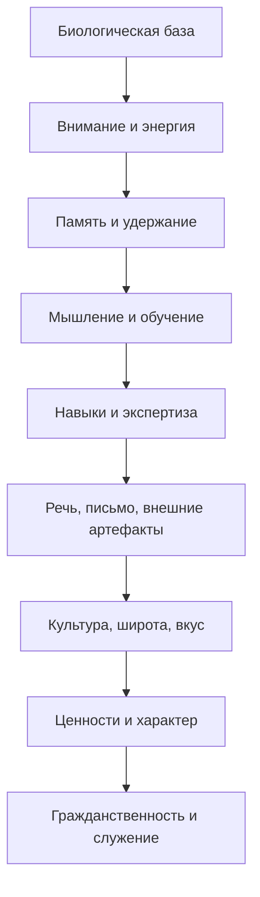
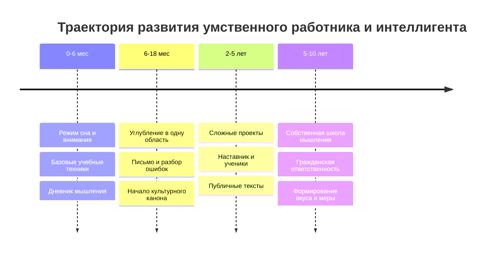

# Подготовка высококлассного работника умственного труда и формирование интеллигента

## Executive summary

Для книги о подготовке высококлассного работника умственного труда и формировании интеллигента лучше всего подходит не узкий жанр "self-help" и не чистая академическая монография, а гибрид: исследовательски строгая, но практически пригодная книга, соединяющая когнитивную науку, психологию обучения, исследования экспертности, риторику, историю образования и корпус классических гуманитарных текстов. По совокупности доказательств наиболее надежными слоями являются: биологическая база умственного труда, стратегии обучения и памяти, управление когнитивной нагрузкой, саморегуляция, deliberate practice в ограниченном смысле, наставничество, техники целеполагания и привычек, а также часть методов развития письма и аргументации. Наиболее спорными и неоднородными остаются: "тренировка интеллекта вообще" через рабочую память, сильные обещания о far transfer, значительная часть поп-психологических советов о продуктивности, а также почти весь разговор о "вкусе", "культурной широте" и "интеллигентности" как о предметах экспериментальной науки. Эти последние слои нужно строить на исторических источниках, первоисточниках, философских текстах и документированной биографике, а не выдавать за область, где существуют RCT уровня медицины. citeturn0search9turn7search0turn7search20turn1search6turn1search10turn2search0turn1search1turn13search4turn5search2

Если проект делать как "книгу на годы", разумный базовый формат - 500-650 страниц основного текста плюс 120-180 страниц приложений, библиографии, предметного указателя, хронологий, таблиц методов и комментариев к источникам. Для популярной версии можно ужать материал до 280-350 страниц; для академической монографии, напротив, развернуть до 700-900 страниц с обстоятельным историографическим аппаратом. Этот выбор зависит от неуточненных параметров проекта: кто целевой читатель, каков желаемый стиль, и нужен ли главным образом инструментальный результат или культурно-философская полнота. citeturn7search6turn11search0turn9search0turn9search6

Содержательно книга должна исходить из трех опорных тезисов. Во-первых, работник умственного труда не формируется "только мозгом": сон, стресс, восстановление, движение и телесный режим прямо связаны с памятью, вниманием и качеством мышления. Во-вторых, обучение высокого уровня лучше всего опирается на retrieval practice, spacing, self-explanation, структурированную практику и внешние когнитивные артефакты; перечитывание, "ощущение знакомости" и общие обещания "прокачки мозга" значительно слабее. В-третьих, интеллигентность в сильном смысле нельзя свести ни к IQ, ни к профессии, ни к эрудиции: здесь необходим отдельный корпус источников о нравственной форме жизни, интеллектуальной скромности, гражданственности, культурной ответственности и свободе суждения. citeturn10search11turn10search3turn10search4turn1search0turn7search0turn7search3turn1search6turn13search4turn9search0turn9search6turn11search0

## Неуточненные параметры и редакционные допущения

Пользовательский запрос крайне подробен, но не задает три редакционных параметра: целевого читателя, желаемую степень академичности и приоритет между "книгой для формирования человека" и "руководством для подготовки профессионала". Это не мешает исследованию, но влияет на архитектуру рукописи. В текущем отчете по умолчанию предлагается "исследовательски строгая практическая книга": читатель - взрослый образованный человек, преподаватель, исследователь, инженер, врач, гуманитарий, руководитель, наставник, а также редактор крупного образовательного или издательского проекта. Такой формат позволяет честно разделять то, что хорошо подтверждено, и то, что принадлежит преимущественно области культурной и нравственной педагогики. citeturn0search9turn13search4turn9search0turn11search0

Ниже - три вариантных профиля книги.

| Формат | Рекомендуемый объем | Для кого | Что выигрывает | Что теряется |
|---|---:|---|---|---|
| Короткая популярная книга | 280-350 стр. | широкий читатель | ясность, скорость чтения, высокий охват | меньше источникового аппарата, меньше историографии |
| Гибридная исследовательская книга | 500-650 стр. | образованный читатель, преподаватели, управленцы, специалисты | баланс глубины и применимости; можно честно показать доказательность и гуманитарный слой | требует более строгой редакции и приложений |
| Академическая монография | 700-900 стр. | исследователи, авторы курсов, университетские издательства | почти исчерпывающий аппарат, полемика со школами и традициями | меньше массовой читабельности |

Для такого проекта термин "интеллигент" следует трактовать как историко-культурную, а не лабораторно-психометрическую категорию. Наиболее релевантны здесь не только современные обзоры по intellectual humility, но и классические тексты о назначении образования, нравственном долге, свободе мысли и культурной ответственности - от Цицерона и Марка Аврелия до Ньюмана, Милля, Лихачева и Сахарова. citeturn13search4turn11search1turn11search2turn11search0turn11search3turn9search0turn9search3

## Архитектура книги

Ниже предложен план книги, который покрывает все слои из запроса, но вместо 24 мелких глав собирает их в 8 больших, чтобы книга оставалась композиционно сильной, а не рассыпалась на справочник. Такая структура соответствует как современной науке об обучении, так и классической логике "воспитания ума и характера". citeturn0search9turn7search6turn11search0turn9search0

| Глава | Охватываемые слои | Зачем нужна в книге | Рекомендуемая длина |
|---|---|---|---:|
| Мозг как инфраструктура умственного труда | биологическая база | Дает нижний этаж всей конструкции: сон, стресс, движение, питание, восстановление | 45-60 стр. |
| Внимание, память и когнитивная нагрузка | внимание, память, управление нагрузкой | Объясняет, как вообще удерживать и структурировать сложную мысль | 60-80 стр. |
| Как учиться и как развивать мышление | когнитивные способности, умение учиться | Отделяет реальные механизмы роста от мифов про "общую прокачку интеллекта" | 60-80 стр. |
| Навык, ремесло и профессиональная экспертиза | навыки, профессиональная экспертиза | Показывает переход от знания к исполнению, от упражнений к экспертности | 60-80 стр. |
| Речь, письмо и внешняя когнитивная система | речь и письмо, привычки/ОС, продуктивность | Показывает, как текст, заметки, обратная связь и саморегуляция становятся станком мышления | 70-90 стр. |
| Культура, широта и вкус | культурные знания, предметная широта, вкус | Дает гуманитарный, исторический и эстетический слой, без которого остается только эффективный специалист | 70-100 стр. |
| Ценности, характер, среда и гражданственность | ценности, характер, социальная среда, гражданственность | Соединяет внутреннюю этику, наставничество, общественный долг и интеллектуальную скромность | 70-90 стр. |
| Творчество, траектория развития и зрелость | творчество, этапы развития, ежедневные/недельные протоколы, ошибки, критерии зрелости | Делает из книги не только теорию, но и жизненный маршрут | 60-80 стр. |

К этим главам стоит добавить приложения на 120-180 страниц: протоколы сна и глубокой работы; образцы учебных карт; карты чтения; формы ведения дневника решений; шаблоны "if-then plans"; протоколы интервального повторения; рубрики для оценки письма; примеры годового маршрута развития; таблицы доказательности методов; указатель первоисточников по культуре и интеллектуальной истории. citeturn4search15turn1search3turn7search3turn2search1turn4search27

Предлагаемая визуальная схема слоев:

Предлагаемая схема траектории развития:

## Источниковый каркас по главам

Ниже дан не "полный список литературы", а каркас для рукописи: ключевые источники по каждой главе, краткая аннотация и пояснение релевантности. Для рабочей библиографии книги разумно закладывать 450-700 позиций в гибридной версии и 700-1200 - в академической. citeturn0search9turn7search6

| Глава | Ключевые источники | Краткая аннотация и релевантность | Дополнительное чтение |
|---|---|---|---|
| Мозг как инфраструктура умственного труда | National Academies of Sciences, Engineering, and Medicine. How People Learn II: Learners, Contexts, and Cultures. Washington, DC: National Academies Press, 2018. doi:10.17226/24783. citeturn0search9turn7search10  Richard Stickgold. "Sleep and Memory", Harvard Medical School, Division of Sleep Medicine. citeturn0search2turn10search11  Garrett, J. et al. "A systematic review and Bayesian meta-analysis provide evidence for an effect of acute physical activity on cognition in young adults." Communications Psychology, 2024. citeturn1search0  Newbury, C. R. et al. "Sleep Deprivation and Memory: Meta-Analytic Reviews..." 2021. citeturn10search3  Klier, C. et al. "Stress and long-term memory retrieval: a systematic review." 2020. citeturn10search4 | Это базовый набор для главы о сне, движении, стрессе и восстановлении. Здесь уже можно твердо говорить, что сон критичен для консолидации памяти; острая физическая активность дает небольшой, но реальный когнитивный выигрыш; стресс действует неоднозначно, но ретривал при высоком стрессе страдает; по питанию доказательства для здоровых работающих взрослых слабее, чем по сну и физической активности. citeturn0search2turn10search3turn1search0turn10search4turn10search13 | WHO. Physical Activity Fact Sheet. citeturn10search22  CDC. Physical Activity Boosts Brain Health. citeturn10search2  SACN Statement on Diet, Cognitive Impairment and Dementias. citeturn10search13 |
| Внимание, память и когнитивная нагрузка | Dunlosky, J. et al. "Improving Students' Learning With Effective Learning Techniques." Psychological Science in the Public Interest, 14(1), 2013. doi:10.1177/1529100612453266. citeturn7search0turn7search8turn7search20  Bisra, K. et al. "Inducing Self-Explanation: a Meta-Analysis." Educational Psychology Review, 2018. citeturn7search3turn7search19  Paas, F., & van Merrienboer, J. "Cognitive-Load Theory: Methods to Manage Working Memory Load in the Learning of Complex Tasks." Current Directions in Psychological Science, 2020. citeturn1search6  Sweller, J. "The Development of Cognitive Load Theory." Educational Psychology Review, 2023. citeturn1search10  APA. "Multitasking: Switching costs." citeturn3search16 | Для главы о внимании и памяти это ядро: retrieval practice, spacing и self-explanation имеют лучшую общую доказательность; когнитивная нагрузка помогает объяснить, почему внешние схемы, примеры, пошаговая проработка и грамотная декомпозиция работают лучше, чем "держать все в голове"; многозадачность несет издержки переключения, а литература по media multitasking неоднородна и методологически спорна, что стоит отдельно проговорить как ограничение. citeturn7search0turn7search3turn1search6turn1search10turn3search16turn3search4turn3search25 | Langner, R., et al. "Sustaining Attention to Simple Tasks." citeturn3search2  Whitfield, T. et al. "The Effect of Mindfulness-based Programs on Cognitive Function." citeturn3search15  Zainal, N. H. et al. "Mindfulness Enhances Cognitive Functioning." citeturn3search3 |
| Как учиться и как развивать мышление | Hemmler, Y., & Ifenthaler, D. "Self-regulated learning strategies in continuing education: a systematic review and meta-analysis." Educational Research Review, 45, 100629, 2024. citeturn2search5  Melby-Lervag, M. et al. "Working Memory Training Does Not Improve Performance on Measures of Intelligence or Other Measures of Far Transfer." 2016. citeturn1search1  Syed, M. et al. "Examining Working Memory Training for Healthy Adults." 2024. citeturn1search5  Andreucci-Annunziata, P. et al. "Conceptualizations and instructional strategies on critical thinking in higher education: A systematic review of systematic reviews." Frontiers in Education, 2023. citeturn12search19  Dwyer, C. P. et al. "The promotion of critical thinking skills through argument mapping." 2015. citeturn6search11 | Эта глава должна трезво разводить "обучаемость", "мышление" и "general intelligence". Сильная линия - саморегулируемое обучение, явное обучение стратегиям мышления, аргументация и метакогнитивный мониторинг. Слабая линия - большие обещания far transfer от тренажеров рабочей памяти. Честная позиция: near transfer иногда есть, but far transfer remains uncertain; критическое мышление лучше развивать через содержательные практики, аргументирование, рефлексию и дисциплинарные задачи. citeturn2search5turn1search1turn1search5turn12search19turn6search11 | National Academies. How People Learn II. citeturn0search9  Porter, T. et al. "Intellectual humility predicts mastery behaviors when learning." citeturn13search2turn13search9 |
| Навык, ремесло и профессиональная экспертиза | Ericsson, K. A. "Expertise." WIREs Cognitive Science, 2010. citeturn2search3  Ericsson, K. A. et al. "The Influence of Experience and Deliberate Practice on the Development of Superior Expert Performance." citeturn2search15  Macnamara, B. N., Hambrick, D. Z., & Oswald, F. L. "Deliberate practice and performance..." Psychological Science, 2014. citeturn2search0turn2search4  Hambrick, D. Z. et al. "Is the Deliberate Practice View Defensible?" 2020. citeturn2search19  Ericsson, K. A. "Deliberate Practice and Proposed Limits..." 2019. citeturn2search20 | Это ядро для главы о ремесле и экспертности. Здесь важно показать не лозунг "10 000 часов", а спор: deliberate practice важна, но объясняет лишь часть различий; экспертность опирается на ментальные представления, качественную обратную связь, сложные задачи и длительную работу в домене. Глава должна подробно разбирать, почему профессиональная мощность доменно-специфична и почему "просто много работать" недостаточно. citeturn2search3turn2search15turn2search0turn2search19turn2search20 | How People Learn II. citeturn0search9  Watrin et al. обзоры по conscientiousness и performance, как дополнительный мост к характеру и работе. citeturn5search0turn5search16 |
| Речь, письмо и внешняя когнитивная система | Graham, S. et al. "The Effects of Writing on Learning in Science, Social Studies, and Mathematics." Review of Educational Research, 2020. citeturn2search2  Quitadamo, I. J., & Kurtz, M. J. "Learning to Improve: Using Writing to Increase Critical Thinking..." 2007. citeturn6search14  Huisman, B. et al. "The impact of formative peer feedback on higher education students' academic writing." 2019. citeturn6search16  Lee, H., & Lee, J. H. "Interpreting the effectiveness of academic English writing programmes in higher education: A meta-analysis." 2022. citeturn6search12turn6search0  Gollwitzer, P. M., & Sheeran, P. "Implementation intentions and goal achievement: A meta-analysis of effects and processes." Advances in Experimental Social Psychology, 38, 69-119, 2006. citeturn4search15turn4search7 | Эту главу нужно строить вокруг двух идей. Первая: письмо - не только способ фиксации, но и инструмент обучения и прояснения мысли; по writing-to-learn уже есть добротные мета-аналитические данные. Вторая: личная "операционная система" интеллектуала должна опираться не на модные методологии, а на доказательные элементы саморегуляции: планирование, if-then intentions, регулярный review, внешние артефакты и обратную связь. citeturn2search2turn6search14turn6search16turn6search12turn4search15 | Singh, B. et al. "Time to Form a Habit: A Systematic Review and Meta-Analysis." 2024. citeturn1search3  Wang, G. et al. "A Meta-Analysis of the Effects of Mental Contrasting With Implementation Intentions." 2021. citeturn4search27 |
| Культура, широта и вкус | Newman, J. H. The Idea of a University Defined and Illustrated. 1852/1858. Текст доступен в Project Gutenberg. citeturn11search0turn11search4  Cicero. De Officiis. 44 BCE. Доступное академическое издание и публичные тексты. citeturn11search1turn11search17  Marcus Aurelius. Meditations. II век. Публичные тексты и издания. citeturn11search2turn11search14  Mill, J. S. On Liberty. 1859. Публичный текст. citeturn11search3turn11search7  Likhachev, D. S. Письма о добром и прекрасном. Официальные публикации на портале наследия Д. С. Лихачева. citeturn9search0turn9search5 | Для этой главы экспериментальная доказательная база ограничена по определению: здесь нужны не RCT, а образцы и аргументы о назначении образования, нравственном долге, самовоспитании, культурной памяти, свободе суждения и мере. Ньюман дает философию университетского образования, Цицерон - язык долга, Марк Аврелий - практику самонаблюдения, Милль - свободу мысли, Лихачев - русскую традицию интеллигентности как культурно-нравственной формы. citeturn11search0turn11search1turn11search2turn11search3turn9search0turn9search6 | Для расширения: русская интеллигентская традиция через Лихачева и Сахарова. citeturn9search3turn9search6 |
| Ценности, характер, среда и гражданственность | Porter, T. et al. "Predictors and consequences of intellectual humility." Nature Reviews Psychology, 2022. citeturn13search4turn5search10  Porter, T. et al. "Intellectual humility predicts mastery behaviors when learning." Learning and Individual Differences, 80, 101888, 2020. citeturn13search2turn13search9  Porter, T. et al. "Clarifying the Content of Intellectual Humility..." Journal of Personality Assessment, 2022. citeturn5search2  Dudley, N. M. et al. "A Meta-Analytic Investigation of Conscientiousness in the Prediction of Job Performance." 2006. citeturn5search0  Eby, L. T. et al. "Does Mentoring Matter? A Multidisciplinary Meta-Analysis..." 2008. citeturn4search17 | Глава должна соединять интеллектуальную скромность, добросовестность, наставничество и общественную ответственность. Научно здесь лучше всего подтверждены: полезность intellectual humility для обучения и эпистемической открытости; связь conscientiousness с рабочей эффективностью; благоприятные эффекты менторства. Гражданственность и интеллигентность как общественный идеал придется опирать на более широкий корпус нормативных и исторических текстов. citeturn13search4turn13search2turn5search2turn5search0turn4search17turn4search14 | OECD. Civic Education as a Pathway to Inclusive Societies, 2025. citeturn4search14  Raposa, E. et al. "The Effects of Youth Mentoring Programs..." citeturn4search1  Sakharov, A. Биографический очерк Нобелевской премии мира. citeturn9search3 |
| Творчество, траектория развития и зрелость | Sio, U. N., & Lortie-Forgues, H. "The impact of creativity training on creative performance: a meta-analytic review..." 2024. citeturn4search16turn4search8  McKay, A. S. et al. "A meta-analysis of creativity training in organizational settings." 2024. citeturn4search0turn4search12  Franklin, B. Autobiography. Project Gutenberg edition. citeturn8search0turn8search8  Darwin Correspondence Project. Официальный цифровой корпус писем Чарльза Дарвина. citeturn8search1  Nobel Prize. "Marie Curie - Biographical"; "Andrei Sakharov - Biographical". citeturn8search2turn9search3 | Творчество в книге лучше трактовать не как мистику, а как сочетание глубокой доменной подготовки, широкой ассоциативной базы, времени инкубации и дисциплины производства черновиков. Мета-анализы по creativity training позволяют говорить о работоспособности тренинга, но с оговорками по качеству дизайнов. Кейсы Франклина, Дарвина, Кюри и Сахарова дают биографические модели: самодисциплина и гражданские добродетели; наблюдение и долгое созревание идей; исследовательская стойкость; нравственная смелость интеллектуала. citeturn4search16turn4search0turn8search0turn8search1turn8search2turn9search3 | Для русской линии культуры и зрелости: Лихачев. citeturn9search0turn9search6 |

Главный пробел, который нужно честно вынести в книгу и в редакторское предисловие, выглядит так. Для биологической базы, памяти, саморегуляции, самопланирования, письма как учебной практики и части методов формирования навыков есть умеренно сильная эмпирическая база. Для "вкуса", "культурной глубины", "интеллигентности", "жизненной мудрости", "порядочности" и "гражданского мужества" база в основном не экспериментальная, а историко-философская, биографическая и нормативная. Научно добросовестная книга должна разделять эти режимы знания, а не имитировать одинаковую доказательность там, где ее нет. citeturn0search9turn7search6turn13search4turn9search0turn11search0

## Практические методы, сравнительные таблицы и кейсы

Ниже - практический каркас приложений. Я включаю только те методики, для которых есть хотя бы умеренно надежная доказательная база, и отдельно отмечаю спорные или ограниченные области. citeturn7search0turn7search3turn1search6turn4search15turn1search3turn4search27

| Метод / техника | Что показывает база | Для каких слоев годится | Ограничения |
|---|---|---|---|
| Retrieval practice | Один из наиболее надежных общих методов для долговременного удержания и переноса знаний. citeturn7search0turn7search20turn0search9 | память, обучение, профессиональное освоение | Нужна правильная дозировка сложности; не заменяет понимание |
| Spacing | Повторение, разнесенное во времени, лучше массированного "запоя" перед дедлайном. citeturn7search0turn7search5turn7search21 | память, учебная ОС | Требует календаря и review-ритма |
| Self-explanation | Мета-анализ показывает положительный эффект на понимание и применение. citeturn7search3turn7search19 | мышление, понимание, письмо | Работает хуже при формальном, а не содержательном объяснении |
| Cognitive-load management | Снижение лишней нагрузки и внешняя декомпозиция помогают освоению сложных задач. citeturn1search6turn1search10 | внимание, проектирование, обучение | Неправильное упрощение может обеднить задачу |
| Working-memory training apps | Доказательства far transfer слабые; near transfer возможен. citeturn1search1turn1search5 | узкие тренировки | Не стоит строить на этом центральную стратегию книги |
| Acute exercise before work | Эффект небольшой, но положительный. citeturn1search0turn10search2 | энергия, внимание | Не заменяет сон и режим |
| Mindfulness-based programs | Есть малые и умеренные положительные эффекты на ряд когнитивных функций, но результаты неоднородны. citeturn3search3turn3search15 | внимание, стресс, саморегуляция | Сильная вариативность программ и измерений |
| Implementation intentions | Классический if-then planning устойчиво помогает достижению целей. citeturn4search15turn4search7 | привычки, продуктивность, саморегуляция | Плохо работает без подлинного намерения и реалистичных триггеров |
| MCII | Mental contrasting + implementation intentions усиливает целевое поведение. citeturn4search27 | сложные поведенческие изменения | Метод чувствителен к качеству формулировки цели |
| Writing-to-learn | Письмо о содержании предмета улучшает обучение. citeturn2search2turn6search14 | речь, письмо, профессиональное мышление | Нужны задания, которые требуют анализа, а не пересказа |
| Peer feedback on writing | Есть полезные эффекты в высшем образовании. citeturn6search16 | письмо, критика, среда | Нужны рубрики и культура обратной связи |
| Mentoring | В среднем связано с лучшими академическими, карьерными и психосоциальными исходами. citeturn4search17turn4search1 | социальная среда, характер, траектория | Эффекты зависят от качества отношений и контекста |
| Creativity training | Совокупные эффекты умеренные, но качество дизайнов разнородно. citeturn4search16turn4search0 | творчество, инновации | Много публикационного шума, нужна осторожность |

В приложениях к книге можно развернуть следующие протоколы.

Первый протокол - "режим биологического минимума": фиксированное окно сна, утренняя световая экспозиция, короткая физическая нагрузка перед первым глубоким блоком, вечерний выход из цифровой стимуляции и журнал качества сна. Это имеет самую надежную внешнюю опору, потому что сон и физическая активность стабильно связаны с когнитивным функционированием, а дефицит сна прямо бьет по консолидации и извлечению памяти. citeturn0search2turn10search3turn10search22turn10search2

Второй протокол - "учебный цикл высокого качества": предварительное чтение карты темы, 25-40 минут активного изучения, затем короткий retrieval, затем self-explanation, затем отложенное повторение через 1-3-7-21 день. Это наиболее доказательно для глав о памяти и умении учиться. citeturn7search0turn7search3turn0search9

Третий протокол - "письмо как станок мышления": один ежедневный аналитический абзац, один еженедельный разбор сложного понятия, один ежемесячный длинный текст, обязательный peer review или наставническая правка. Для приложений здесь нужны шаблоны рубрик: ясность тезиса, структура аргумента, корректность доказательств, работа с контраргументами, стиль и тон. Письмо как учебная и мыслительная практика поддержано лучше, чем многими модными системами "продуктивности". citeturn2search2turn6search14turn6search16turn6search12

Четвертый протокол - "саморегуляция и привычка": формулировка 2-3 ключевых if-then plans на неделю, отдельное mental contrasting для самой трудной задачи, недельный review, журнал отклонений, пересборка триггеров, а не самобичевание. Это хороший мост между психологией целей и реальной рабочей дисциплиной. Во встроенном комментарии к приложению нужно обязательно предупредить читателя, что "сколько формируется привычка" не имеет одной магической цифры: систематический обзор 2024 года показывает существенную вариативность между людьми и поведениями. citeturn4search15turn4search27turn1search3

Пятый протокол - "архитектура сложной задачи": явное описание цели, карты зависимостей, разбивка по подзадачам, внешний черновик решения, контроль когнитивной нагрузки через схемы и примеры, а по завершении - postmortem. Это особенно пригодно для инженеров, аналитиков, исследователей, юристов и врачей. citeturn1search6turn1search10

Шестой протокол - "культурный минимум интеллигента": годовой цикл из четырех потоков - история, философия, литература, общественная мысль; для каждого потока - 3-5 первоисточников и 1 историко-критический комментарий. Здесь приложение должно быть честно маркировано как гуманитарное, а не экспериментально-психологическое. В нем полезны каноны чтения, вопросы к тексту, контекстные справки и сравнительные таблицы традиций. citeturn11search0turn11search1turn11search3turn9search0

Для кейсов развития реальных людей я бы рекомендовал четыре опорные истории.

Франклин подходит для линии "самоформирование, нравственная бухгалтерия и гражданские институции". В "Автобиографии" подробно зафиксирован его проект нравственного самосовершенствования с таблицей добродетелей и дисциплиной самонаблюдения; одновременно это не частная аскеза, а путь к общественным делам и институциональному строительству. citeturn8search0turn8search8

Дарвин подходит для линии "наблюдение, переписка, длительное созревание идей, терпение к сложности". Darwin Correspondence Project дает документируемый материал для реконструкции его исследовательского режима: работу с письмами, вопросами, сомнениями, медленным накоплением данных и интеллектуальной осторожностью. citeturn8search1

Мария Кюри подходит для линии "научная стойкость, высокая профессиональная дисциплина, работа в неблагоприятных условиях". Официальный биографический очерк Nobel Prize удобен как проверяемая опорная точка для главы о профессиональной экспертизе и гражданской скромности ученого. citeturn8search2

Сахаров подходит для линии "ученый как гражданин". Его нобелевская биография дает документированный пример перехода от научной мощи к нравственной и общественной ответственности - ключевой для главы о формировании интеллигента, а не только специалиста. citeturn9search3

## Библиографический аппарат, проверка фактов и план подготовки рукописи

Для такой книги нужен полноценный аппарат, иначе она быстро скатится либо в популярную публицистику, либо в нечитаемую диссертационность. Рекомендуемый стандарт - автор-дата в тексте, длинная библиография в конце, отдельный перечень первоисточников, отдельный перечень обзоров и мета-анализов, хронология ключевых понятий, указатель имен, предметный указатель и список таблиц/диаграмм. Для русскоязычного издания можно использовать гибрид: основной текст с упрощенными ссылками, а в электронной версии - расширенные DOI, примечания о переводах и краткие комментарии по статусу источника. citeturn0search9turn7search6turn13search4

Проверка фактов должна быть встроена в производственный процесс книги. Рабочая иерархия источников должна выглядеть так: первичные исследования и оригинальные статьи; затем систематические обзоры и мета-анализы; затем официальные сайты научных институтов и академий; затем классические книги и первоисточники; и только в последнюю очередь - качественные вторичные синтезы. Для каждого значимого эмпирического утверждения полезно завести claim register: формулировка утверждения, тип утверждения, основной источник, уровень доказательности, возможные ограничения, дата последней проверки, есть ли мета-анализ, есть ли известные репликационные проблемы. Для современных исследований следует дополнительно проверять DOI, статус retraction/correction, размер эффекта, тип контрольной группы и пригодность выборки для взрослых работающих людей, а не только для студентов. citeturn1search0turn1search1turn7search0turn1search6turn2search0turn4search16

Полезно также заранее разделить источники на четыре корзины. Первая - "сильная эмпирика": сон, exercise-cognition, retrieval/spacing, self-explanation, cognitive load, SRL, implementation intentions, mentoring. Вторая - "смешанная эмпирика": mindfulness, creativity training, note-taking formats, часть критического мышления, habit formation time estimates. Третья - "спорная зона": far transfer от cognitive training, сильные обещания productivity-systems, медиа-мультитаскинг как источник долговременных когнитивных повреждений. Четвертая - "нормативно-гуманитарная зона": интеллигентность, вкус, достоинство, гражданская совесть, широта культуры. Именно такая разметка делает книгу честной и сильной. citeturn10search3turn1search0turn7search0turn7search3turn1search6turn2search5turn4search15turn4search17turn3search15turn4search16turn1search1turn3search4turn9search0turn11search0

План подготовки рукописи для одного основного автора и одного исследовательского ассистента может выглядеть так:

| Этап | Содержание | Реалистичный срок |
|---|---|---:|
| Скоупинг и источниковая карта | уточнение читателя, жанра, структуры, сбор ядра источников | 2-3 недели |
| Аннотированная библиография | 250-350 первичных записей с разметкой по главам | 4-6 недель |
| Главные исследовательские мемо | по 8 главам, по 8-15 тыс. слов каждая | 6-8 недель |
| Черновая рукопись | полный draft глав и приложений | 12-16 недель |
| Научное редактирование и fact-check | проверка эффектов, DOI, первоисточников, переводов | 4-6 недель |
| Литературная редактура | стиль, связность, сокращение повторов | 3-4 недели |
| Иллюстрации, указатели, финальная верстка | диаграммы, таблицы, индекс | 3-4 недели |

Итого для гибридной книги - примерно 7-9 месяцев плотной работы; для академической монографии - 10-14 месяцев. Если проект делать в издательском режиме с внешними рецензентами по когнитивной науке, гуманитаристике и истории образования, это повышает качество, особенно в спорных главах о культуре и интеллигентности. Такая многопрофильная проверка особенно желательна, потому что книга принципиально междисциплинарна. citeturn13search5turn4search14turn0search9

Для иллюстративного аппарата, кроме mermaid-диаграмм выше, я бы рекомендовал еще четыре визуализации: "матрица доказательности" по слоям; "карта временного горизонта развития" от 3 месяцев до 10 лет; "радар зрелости" по критериям умственного работника и интеллигента; "сеть источников" с разделением на эмпирику, гуманитарные первоисточники, биографии и нормативные тексты. В печатной версии это лучше делать как строгие, почти учебниковые схемы, а не как инфографику в стиле поп-нонфикшна: предмет слишком серьезный, чтобы его стилизовать под мотивационную картинку.
