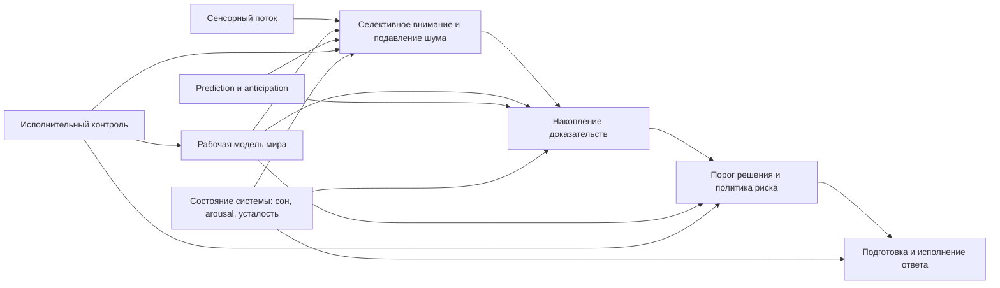
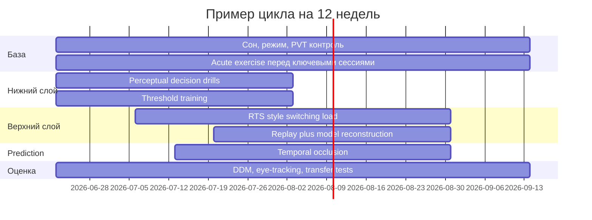
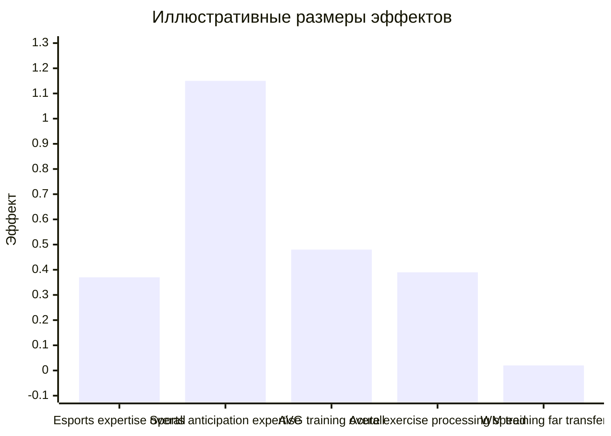

# Скорость мышления в играх и вне игр

## Executive summary

Главный вывод этого обзора такой: "быстрота" в играх не сводится ни к одному фактору и тем более не сводится к одному только "чанкингу". Она возникает как произведение по меньшей мере шести частично независимых механизмов: качества сенсорного отбора, скорости и устойчивости накопления доказательств, политики порога решения, скорости немоторных и моторных стадий ответа, силы исполнительного внимания, а также качества внутренней рабочей модели мира, которая позволяет заранее отсекать ветви, предсказывать развитие сцены и уменьшать вычислительную нагрузку до того, как она попадет в сознательное рассуждение. Именно поэтому "быстрые" люди часто выглядят быстрыми и в FPS, и в RTS, и в квестах, и в головоломках, хотя вклад отдельных механизмов в этих жанрах разный. В шутерах больше весит сенсомоторная петля и калибровка speed-accuracy tradeoff, в RTS - переключение рамок, распределение внимания, работа с множеством параллельных потоков и управление внутренней моделью, в квестах и головоломках - качество репрезентации задачи, скорость смены гипотез и "frame breaking". citeturn15search0turn15search7turn37view0turn41view0turn5search0turn23search0

Если выразить это инженерно, то "скорость мышления" - это не одна ось, а латентный вектор. Его базовые компоненты: drift rate или эффективность накопления доказательств; boundary separation, то есть сколько доказательств человек требует перед действием; non-decision time, включающее кодирование стимула и подготовку ответа; attention control, позволяющий удерживать релевантное и отбрасывать шум; working model update, то есть скорость перестройки внутренней карты ситуации; prediction, снижающий потребность в позднем вычислении за счет опережающего моделирования. Различия между людьми по этим параметрам устойчивы, умеренно связаны с интеллектом и внимательным контролем, частично связаны с белым веществом и наследуемостью, но не редуцируются к ним полностью. citeturn15search0turn16search0turn16search1turn22search0turn22search2turn22search4turn22search11

Для FPS и других задач с жестким временем ключевой феномен состоит в том, что сильные игроки часто не просто "рискуют и кликают раньше", а реально быстрее кодируют стимул, быстрее копят релевантные доказательства и быстрее исполняют корректный ответ без пропорциональной потери точности. Это видно и в классической литературе по action video games, и в недавних данных по Counter-Strike, где у опытных игроков преимущество в простых двоичных решениях было около 88.94 мс, а вычислительное моделирование указало на более быстрое кодирование стимула и исполнение ответа, а в более сложной задаче - на более быстрое накопление доказательств. citeturn8search2turn18search16turn31search2turn13view0

Для RTS объяснение глубже. Исследования StarCraft показывают, что решающим может быть не моторное "склеивание" действий в чанки, а общая глобальная скорость переработки и управления множеством информационных источников. В работе Glass, Maddox и Love именно версия StarCraft, которая требовала поддерживать и быстро переключать внимание между несколькими пространственно разделенными базами, дала крупный прирост когнитивной гибкости после 40 часов тренировки. В другой линии работ по телеметрии StarCraft и моторным последовательностям было показано, что классическая motor chunking theory плохо объясняет разнообразие и скорость поведения: профессионалы действительно используют больше чанков, но доля действий внутри чанков по мере роста мастерства не растет, а сами чанки почти не дают выигрыша во времени; эксперты становятся "быстрее вообще", а не только "более чанковыми". citeturn41view0turn42view3turn23search0turn6search11

Для квестов и головоломок главное отличие "быстрых" людей часто находится не на уровне микро-латентностей, а на уровне представления задачи. Люди сильно различаются по тому, как быстро строят рабочую модель, замечают инварианты, меняют рамку, отбрасывают бесперспективные ветви, переносят навыки на новую задачу и не застревают в ложной репрезентации. Исследования insight problem solving связывают такие различия с "breaking frame", а не просто с общей памятью или моторикой. Исследования образовательных и puzzle-игр вроде Portal показывают, что улучшения ближе всего к тем задачам, где есть общий набор требований, прежде всего пространственное моделирование и симуляция. citeturn5search0turn5search3turn20search1turn26search1

Самый практичный вывод по тренировкам такой: лучше всего меняют релевантные механизмы не абстрактные "brain games" сами по себе, а нагрузки, которые одновременно заставляют быстро извлекать слабый сигнал из шума, динамически перенастраивать порог решения, управлять несколькими конкурирующими потоками информации, строить предсказания и исполнять ответ под ограничением времени. Отсюда и сравнительно хорошие результаты action video games, некоторых RTS-парадигм и temporal occlusion training, и отсюда же слабые результаты большинства программ "тренировки рабочей памяти" на дальний перенос. citeturn29search0turn31search2turn33search0turn41view0turn39search1turn3search2turn39search0turn36search0

Наконец, "быстрота" ограничивается не только когнитивной архитектурой, но и состоянием системы. Сон, циркадная фаза, утомление, физическая форма, арousal и модуляция LC-NE системы заметно влияют на внимательную устойчивость, скорость реакции и стабильность исполнения. Депривация сна понижает бдительность и увеличивает lapses; краткая физическая нагрузка дает небольшой, но воспроизводимый подъем processing speed и attention; кофеин после недосыпа временно восстанавливает часть показателей. Поэтому хороший протокол ускорения мышления всегда должен включать не только "когнитивные" упражнения, но и режимные меры. citeturn17search4turn17search18turn17search23turn17search12turn17search20turn28search5turn16search3

## Модель скорости мышления

С инженерной точки зрения скорость мышления удобно представлять как конвейер, где выигрыши и потери времени распределены по стадиям perception -> evidence -> decision -> motor, а поверх него работает более медленный, но еще более важный слой: построение и обновление модели мира. На нижнем слое человек должен быстро выделить релевантный сигнал, подавить шум, оценить достоверность признаков, накопить доказательства и выпустить команду. На верхнем слое он должен выбрать правильную рамку задачи, предсказать ход событий, удержать приоритеты, переключить режим внимания и отсечь ненужные ветви до того, как они захламят вычисление. Поэтому один игрок может быть очень быстр в aim-задачах, но посредственен в RTS, а другой - наоборот. Но "по-настоящему быстрые" люди чаще всего сильны сразу на обоих слоях. citeturn15search0turn15search7turn37view0turn16search0turn41view0

В терминах drift-diffusion models и смежных sequential-sampling frameworks различия между людьми особенно хорошо раскладываются на drift rate, boundary separation и non-decision time. Drift rate соответствует тому, насколько эффективно человек извлекает полезную информацию из сцены; boundary separation - насколько агрессивно он торгует скоростью против надежности; non-decision time - насколько быстро кодируется стимул и подготавливается ответ. В обучении эти параметры меняются не одинаково: перцептивная чувствительность может улучшаться плавно по мере практики, а порог решения - перенастраиваться короткими адаптациями внутри сессий и между сессиями. Это особенно полезно для понимания как FPS, так и RTS, где одна и та же поведенческая "быстрота" может быть получена совершенно разными внутренними путями. citeturn15search0turn37view0turn38search0turn18search23

Для общей когнитивной "быстроты" решающее значение имеет не только память, сколько attention control. Современные обзоры по индивидуальным различиям показывают, что внимание как способность удерживать цель, фильтровать интерференцию и быстро disengage/reengage часто лучше предсказывает реальное поведение, чем грубые меры рабочей памяти. Это хорошо согласуется и с игровыми данными: топ-игрок, по сути, это не человек с "большой RAM" в голове, а человек с лучшим scheduler и лучшим control policy на потоке данных. citeturn16search0turn16search1turn16search4turn3search3

Во втором слое системы находится рабочая модель мира. В RTS она включает состояние экономики, тайминги, вероятные ветки tech-tree, карту угроз и возможности переключения внимания между фреймами "микро", "макро", "разведка", "экономика", "позиционка". В квестах и головоломках это модель пространства ограничений, скрытых правил, аналогий и инвариантов. Здесь же работает prediction: чем лучше модель, тем меньше нужно позднего сенсорного доказательства, потому что часть вычисления уже сделана заранее в виде ожиданий. Поэтому эксперт часто "видит дальше" не из-за мистической интуиции, а потому что раньше и лучше подготавливает пространство решений. citeturn41view0turn11search3turn9search2turn5search0turn20search1

Из этой архитектуры следует важное следствие: в RTS и puzzle-играх различия в скорости могут быть даже больше, чем в шутерах, потому что там цена слабой модели мира и плохого переключения внимания накапливается каскадом. В шутере ошибка иногда стоит один промах; в RTS неверная рамка мышления порождает десятки лишних операций и неправильную аллокацию времени; в головоломке плохая репрезентация может удерживать человека в ложном пространстве решений минуты или часы. Именно поэтому объяснение через "просто больше практиковался именно в этой игре" недостаточно: практикой тренируется не только содержимое, но и сама архитектура управления вычислением. citeturn23search0turn41view0turn5search0turn26search1

## Структура книги

Ниже - рабочий план книги в формате, пригодном для реального черновика.

| Глава | Содержание | Оценка объема |
|---|---|---|
| Введение | Что такое "скорость мышления" и почему интуитивные объяснения ломаются на RTS и головоломках; различие между reaction time, processing speed, decision speed и problem-representation speed. | 18-22 стр. |
| Архитектура быстрого мышления | Сенсомоторная петля, DDM, скорость-accuracy tradeoff, non-decision time, роль prediction и active sensing. | 28-35 стр. |
| Индивидуальные различия | Processing speed, executive attention, working memory, cognitive flexibility, белое вещество, наследуемость, LC-NE, arousal, сон и усталость. | 35-45 стр. |
| Быстрота в FPS | Перцептивный отбор, evidence accumulation, gaze, моторная точность, тренировочные режимы и реальные ограничения переноса. | 30-40 стр. |
| Быстрота в RTS | Множественные потоки данных, переключение рамок, глобальный контроль, телеметрия StarCraft, почему chunking недостаточен. | 35-45 стр. |
| Быстрота в квестах и головоломках | Репрезентация задачи, frame breaking, поиск инвариантов, пространственное моделирование, Portal и puzzle-transfer. | 30-38 стр. |
| Что реально тренируется | Action games, RTS training, perceptual decision drills, threshold training, prediction/occlusion, gaze training, физическая подготовка и сон как когнитивные множители. | 40-50 стр. |
| Новая экспериментальная программа | Как строить исследования нового поколения: telemetry, eye-tracking, EEG, fMRI, DTI, hierarchical Bayes, preregistration, open data. | 28-36 стр. |
| Практическая инженерия быстроты | Протоколы на 6, 12 и 24 недели для игроков и исследователей, метрики прогресса, ловушки. | 25-35 стр. |
| Заключение | Единая теория "быстроты" как совместной оптимизации внимания, предсказания, решения и действия. | 12-16 стр. |

Итоговый целевой размер книги получается около 280-360 страниц, что достаточно для серьезного нон-фикшн текста с обзором литературы, методологией и практическими приложениями. Такая структура логична и с точки зрения науки, и с точки зрения читателя: от механизма к жанрам, от жанров к тренировкам, от тренировок к методологии. citeturn15search0turn16search0turn41view0turn23search0turn5search0turn39search1

## Обзор литературы и критический разбор

### Processing speed, внимание, рабочая память и гибкость

Связь processing speed с общими когнитивными способностями воспроизводится стабильно, но ее нельзя понимать наивно. Современный обзор по neural processing speed подчеркивает, что поведенческие меры скорости и интеллект обычно разделяют лишь часть дисперсии, а скорость ERP-компонентов, связанных с более высокими процессами, оказывается особенно важной для объяснения различий. При этом twin-данные показывают, что у IQ есть значимая генетическая ковариация с choice RT, но существенная доля генетической вариации интеллекта не объясняется ни RT, ни рабочей памятью. Другими словами, "быстрота" - это важный, но не исчерпывающий слой более широкой архитектуры интеллекта. citeturn22search0turn22search2turn22search6

Рабочая память важна, но не как самостоятельный "ящик объема". Обзоры последних лет все чаще ставят в центр attention control: способность сопротивляться отвлечению, поддерживать goal state и быстро перестраивать фокус. Именно она, а не n-back как таковой, лучше предсказывает реальную производительность. Это хорошо согласуется с тем, что тренировки рабочей памяти обычно дают near transfer, но мало far transfer: мета-анализы Melby-Lervag и соавт. и Sala и соавт. показывают, что повышение интеллекта или широкой когнитивной эффективности от WM-training либо отсутствует, либо пренебрежимо мало. Для "ускорения мышления" это означает, что изолированная "загрузка буфера" почти никогда не является главным рычагом. citeturn16search0turn16search1turn16search12turn3search2turn39search0turn36search0

Когнитивная гибкость тоже не сводится к task switching cost в одном тесте. Теоретические обзоры по flexibility подчеркивают ее многокомпонентность: set-shifting, task-set reconfiguration, disengagement and re-engagement, а также зависимость от контекста и требований задачи. Это важно для объяснения RTS и puzzle-expertise, потому что здесь "быстрота" часто выглядит как возможность резко сменить способ кодирования задачи, а не просто быстрее нажать кнопку при неизменной постановке. citeturn3search18turn41view0turn5search0

Отдельно стоит LC-NE и arousal-уровень. Обзор Tsukahara и коллег связывает fluid intelligence и адаптивную регуляцию LC-NE системы, а обзор 2025 года по LC-NE и вниманию подчеркивает ее роль в модуляции signal-to-noise ratio. Это прямо стыкуется с игрой: "быстрый" игрок часто не только лучше думает, но и лучше удерживает режим активации, при котором релевантные сигналы усиливаются, а нерелевантные подавляются. citeturn16search3turn16search11

### Evidence accumulation и speed-accuracy tradeoff

Для понимания "скорости мышления" DDM и родственные модели сегодня практически незаменимы. Классический обзор Ratcliff и McKoon показывает, как совместный анализ точности и распределений RT раскладывает поведение на компоненты обработки. Gold и Shadlen систематизировали нейронную основу простых решений как накопления доказательств до границы, а Roitman и Shadlen еще раньше показали пороговую динамику в LIP, связанную с tradeoff между скоростью и точностью. citeturn15search0turn15search7turn18search31

Для задач обучения особенно важно, что разные параметры меняются на разных временных шкалах. Cochrane и коллеги на четырехдневном training-парадигме случайного движения точек показали, что drift rate улучшается как непрерывная экспоненциальная функция накопленной практики, а response boundary перестраивается внутри каждой сессии независимо. Работа Zhang и Rowe показывает, что инструкции на скорость и на точность по-разному влияют на параметры во времени: обучение повышает drift rate и снижает boundary separation, а акцент на точности поддерживает более высокий порог. Для игровых тренировок отсюда следует очень практичная мысль: мало "нагружать быстро"; нужно отдельно управлять и качеством извлечения сигнала, и политикой порога. citeturn37view0turn38search0

Современная литература также усложняет простую картину. Исследования по dynamic divisive normalization, history biases и graded decisions показывают, что накопление доказательств может быть нелинейным, контекстно зависимым и подверженным искажениям из истории проб. Для игр это важно потому, что реальный игрок действует не в лабораторной бинарной задаче, а в среде, где priors, urgency, предыдущие решения и ожидания постоянно сдвигают исходную точку накопителя еще до нового сенсорного входа. citeturn2search19turn15search10turn15search12turn18search30

### Экспертиза в FPS, RTS, MOBA и puzzle-задачах

Наиболее надежные данные по широкому когнитивному эффекту игрового опыта исторически пришли из action video games. Семинальные работы Green и Bavelier показали улучшения визуального селективного внимания и распределения внимания; Dye, Green и Bavelier суммировали данные о снижении RT без потери точности; Green, Pouget и Bavelier предложили улучшенное probabilistic inference как механизм широкого переноса; поздний мета-анализ Bediou и соавт. пришел к выводу, что наиболее устойчивые эффекты action gaming касаются top-down attention и spatial cognition, при более осторожной оценке эффектов на прочие домены. Мета-анализ Wang и соавт. показал умеренные улучшения общего когнитивного функционирования у здоровых взрослых, особенно по visuospatial ability и processing speed/attention. citeturn8search0turn8search1turn8search2turn18search16turn31search2turn29search0

Но критика здесь обязательна. Boot и коллеги давно указывали на методологические ловушки, а Oei и Patterson показали, что transfer зависит от общих требований между игрой и тестом. Sala и Gobet в более широкой критике когнитивного тренинга утверждали, что широкое far transfer обычно завышено. Это значит, что популярная формула "играй во что угодно и станешь быстрее во всем" ложна. Более точная формула: игра ускоряет те механизмы, которые она систематически нагружает, и перенос возникает там, где новые задачи используют те же механизмы. citeturn34search9turn26search1turn36search0turn7search16

RTS - особый случай. Glass, Maddox и Love показали, что 40 часов StarCraft у негеймеров, особенно в версии с двумя пространственно разделенными базами, создают выраженный прирост именно когнитивной гибкости, а не только "быстрой перцепции". Более поздняя тренинговая работа со StarCraft II показала улучшения перцептивных и внимательных способностей после 30 часов, но не явного executive functioning в широком смысле. Cross-sectional работа 2024 года показала, что RTS-игроки имеют преимущества в visual attentional control на компьютерных задачах, но не обязательно в аудиальных или VR-задачах. То есть RTS особенно хорошо тренирует сложный визуальный scheduling, многопоточность и переключение в плоском экране, но не гарантирует универсальный перенос на любой формат внимания. citeturn41view0turn42view3turn19search1turn19search2

Ключевой удар по банальному объяснению через "чанки" дает линия работ по StarCraft-телеметрии. Телеметрический анализ тысяч RTS-игроков выявил набор переменных, связанных с экспертизой. А работа 2019 года прямо показала, что классическая motor chunking theory не объясняет ни разнообразие, ни скорость экспертного поведения: пропорция действий внутри чанков не растет с навыком, а выигрыш во времени от самих чанков минимален; эксперты просто ускоряются глобально. Это особенно важно для вашего запроса: разные люди "быстрее" не потому, что у одних есть чанки, а у других нет, а потому, что у них быстрее и эффективнее вся система управления действием и вниманием. citeturn6search11turn23search0

Новые данные по Counter-Strike усиливают именно эту интерпретацию. Исследование Шеффилда с градацией от новичков до полупрофессионалов показало, что лучшие игроки быстрее делают правильные решения и исполняют действие; преимущество в простой задаче составило около 88.94 мс, а моделирование указало на более быстрое кодирование и исполнение, в сложной задаче - на более быстрое evidence accumulation. Это очень сильный аргумент против объяснения "они просто бездумно рискуют". citeturn13view0

MOBA-литература важна тем, что смещает внимание вверх по иерархии. В League of Legends топ-игроки показывают лучшие показатели executive control, а исследования связи рейтинга в MOBA с когнитивными способностями указывают на связь навыка с более высокими умственными ресурсами, особенно в молодом возрасте. Нейровизуализационные данные по LoL сообщают о лучшей локальной функциональной интеграции executive areas у топ-игроков. Это согласуется с мыслью, что по мере усложнения среды возрастает роль контроля, гибкости и вероятностной модели ситуации. citeturn24search0turn24search1turn24search3

Для квестов и головоломок ситуация менее изучена, и это важный пробел литературы. Но имеющиеся данные последовательны: puzzle- и пространственные игры ближайшим образом улучшают spatial cognition и физические интуиции там, где есть общий representational demand. Portal в ряде работ улучшал spatial cognition и physics intuitions; обзоры на русском языке также отмечают, что puzzle и arcade игры дают наиболее заметные эффекты на пространственное мышление, тогда как эффекты на executive functions обычно слабее. Для insight-задач именно breaking frame и способность изменить репрезентацию оказываются критичными. citeturn20search1turn10search0turn10search3turn5search0

### Gaze, prediction и anticipation

Экспертное поведение в быстрых средах почти всегда связано с иными стратегиями взгляда и предсказания. Метанализ Mann и соавт. давно показал крупные различия между экспертами и новичками в sport perceptual-cognitive expertise. Недавний мета-анализ по temporal occlusion в спорте оценил экспертное преимущество в anticipation как сильное, около Hedges' g = 1.15, и при этом показал, что это преимущество плохо переносится на незнакомые виды спорта; значит, prediction требует обучения на специфических структурных регулярностях домена. citeturn4search2turn9search0

Для самого StarCraft есть прямое eye-tracking исследование: у сильных игроков лучше gaze control, что соответствует более эффективному перебросу внимания между участками экрана. В broader esports- и action-gaming литературе сообщаются более короткие фиксации, иные паттерны саккад и преимущества в temporally demanding visual attention. Важен и электрофизиологический след: у expert video-game players обнаруживали более ранние визуальные N1-латентности, а у action gamers - более быстрые visually guided responses с иным временем onset visuomotor-related brain activity. Это указывает на ускорение не только "мысленного" слоя, но и ранних стадий сенсорного отбора и подготовки действия. citeturn21search1turn21search0turn6search2turn21search13turn29search11

### Белое вещество, наследуемость и состояние системы

Структурная нейробиология поддерживает идею "быстроты" как свойства сети, а не локального модуля. Ассоциации между processing speed и сетевыми показателями белого вещества устойчиво обнаруживаются в обзорах и когортах; недавняя работа по frontal aslant tract прямо предполагает его роль как пути, связанного с ускорением когнитивной обработки, которая затем поддерживает другие функции. На уровне макросетей speed особенно чувствительна к качеству интеграции fronto-parietal и long-range pathways. citeturn22search4turn22search11

Наследуемость есть, но она не абсолютна. Twin study Luciano и коллег показала генетические корреляции между choice RT и IQ, но также показала, что значительная доля генетической дисперсии интеллекта не сводится к RT или delayed response. Это означает две вещи. Во-первых, да, у некоторых людей стартовые условия по "быстроте" лучше. Во-вторых, нет, из этого не следует биологический фатализм: тренируемых составляющих слишком много, и они лежат как в перцептивной, так и в управляющей архитектуре. citeturn22search2

Состояние системы влияет резко. Сонная депривация и хроническое недосыпание ухудшают vigilant attention, увеличивают lapses и замедляют response times; acute exercise дает малые и умеренные выигрыши в processing speed и attention; кофеин после недосыпа демонстрирует выраженные улучшения внимания, скорости реагирования и информационной обработки. Поэтому попытки обсуждать "скорость мышления", игнорируя сон, физнагрузку и усталость, методологически неполны. citeturn17search4turn17search18turn17search23turn17search12turn28search5

## Что реально меняют тренировки

### Сравнение эффектов интервенций

Ниже дана рабочая сравнительная таблица. В ней смешаны не полностью сопоставимые популяции и меры, поэтому величины нужны не для "рейтинга", а для ориентировки по механизму и надежности.

| Интервенция | Что тренирует | Данные по эффекту | Материал исследований | Вывод |
|---|---|---|---|---|
| Action video game training | Top-down attention, spatial cognition, processing speed, вероятностное извлечение сигнала | Умеренные эффекты в общей когниции; особенно на visuospatial ability и processing speed/attention; robust effects на top-down attention и spatial cognition. citeturn29search0turn31search2 | Мета-анализы и классические RCT/action-game studies. citeturn8search0turn8search1turn18search16turn31search0 | Одна из немногих игровых интервенций с действительно повторяемым переносом, но перенос избирателен и зависит от общих требований. |
| RTS training | Переключение между потоками данных, maintenance plus switching, visual scheduling | 40 часов StarCraft дали крупный прирост когнитивной гибкости; 30 часов StarCraft II улучшили перцепцию и внимание, но не дали сильного общего executive transfer. citeturn41view0turn42view3turn19search1 | Небольшие RCT, в том числе StarCraft/StarCraft II. citeturn43search0turn19search1 | Сильная интервенция именно на многопоточность и гибкость, если дизайн игры заставляет мониторить и переключать несколько независимых контекстов. |
| Перцептивно-решающие дриллы с DDM-логикой | Drift rate и response boundary | Обучение в perceptual learning меняет drift rate непрерывно, а response boundary - на других шкалах времени. citeturn37view0turn38search0 | Лабораторные motion-discrimination training studies. | Очень сильный научный кандидат для "чистой" тренировки механизмов, но пока редко переносится прямо в киберспорт. |
| Temporal occlusion training | Prediction, extraction of early cues, anticipation | Крупный мета-аналитический эффект; 12 studies, 25 effect sizes; есть перенос в лабораторные и field-based tests. citeturn39search1turn40search2turn40search4 | Спортивные видео- и поле-ориентированные интервенции. | Один из лучших способов тренировать prediction/anticipation; вероятно перспективен и для игр с богатыми kinematic cues и чтением намерений. |
| Working memory training | Near-transfer по WM-task навыкам | Для far transfer на интеллект и общую когницию результаты в основном нулевые или очень слабые. citeturn3search2turn39search0turn36search0 | Крупные мета-анализы. | Плохо подходит как главный рычаг ускорения мышления. |
| Acute exercise | Arigility, arousal, signal readiness, processing speed | ES около 0.39 для processing speed, 0.34 для attention, 0.32 для inhibition в acute interventions. citeturn17search12 | Мета-анализы exercise studies. | Работает как состояние-усилитель, а не как полная замена когнитивной тренировки. |
| Caffeine under sleep loss | Vigilance, RT, attention under fatigue | В условиях недосыпа улучшает response time, accuracy на attention tests и executive function; некоторые эффекты крупные. citeturn28search5 | Систематический обзор и мета-анализ. | Временный компенсатор, не механизм долгосрочного обучения. |
| Multi-task game training in older adults | Cognitive control and sustained attention | NeuroRacer улучшил multitasking costs и дал перенос на sustained attention и working memory; EEG-маркеры control также изменились. citeturn44search0turn44search1 | Nature RCT. | Подтверждает, что игровые среды могут менять контрольные сети, если они специально спроектированы. |

Критически важно, что лучшие эффекты обычно приходят не от "любой игры", а от богатой многомерной нагрузки. Action games работают не магией жанра, а сочетанием высокой скорости, плотного потока сигналов, сенсорной неопределенности, потребности в периферийном внимании, частой перенастройки порога решения и немедленной обратной связи. RTS работают тогда, когда заставляют удерживать несколько контекстов и быстро переключаться. Temporal occlusion training работает потому, что тренирует чтение ранних информативных кусков сцены, то есть prediction under partial observability. citeturn34search5turn41view0turn39search1turn9search2

### Практические протоколы

Ниже даны протоколы не как "волшебная таблетка", а как механистически обоснованные программы.

#### Микро-протокол для сенсомоторной петли

Подходит для FPS и для нижнего слоя быстроты в любой игре.

| Блок | Длительность | Содержание | Механизм | Ожидаемый эффект |
|---|---|---|---|---|
| Detection drill | 10-12 мин | Шумные бинарные discrimination tasks с адаптацией сложности и обязательным учетом RT плюс accuracy | Повышение drift rate, улучшение выделения сигнала из шума. citeturn37view0turn38search0 | Более быстрый "чистый" perceptual pick-up. |
| Threshold drill | 8-10 мин | Серии с чередованием инструкций "максимум скорость" и "максимум точность", затем reward-rate режим | Тонкая настройка boundary separation и urgency policy. citeturn38search0turn18search23turn18search27 | Меньше лишней осторожности, меньше импульсивных ошибок. |
| Visuomotor drill | 12-15 мин | Быстрые eye-hand tasks, tracking/flicking с вариативностью и шумом цели | Уменьшение non-decision time, связь perception-action. citeturn6search9turn21search13turn6search2 | Быстрее исполнение без деградации точности. |
| State reset | 5-8 мин | Короткая аэробная вставка умеренной интенсивности | Подъем arousal, attention readiness. citeturn17search12turn17search20 | Небольшой немедленный выигрыш в бодрости и скорости. |

Такой блок лучше делать 4-5 раз в неделю по 35-45 минут, а не редко и долго. Важно сохранять попытки около границы сложность/успех, потому что именно там DDM-параметры обучаются наиболее содержательно. Прогресс желательно измерять не только средним RT, но и совместно RT плюс accuracy, ideally через иерархические DDM-параметры. citeturn15search0turn37view0

#### Макро-протокол для RTS и высокоуровневого контроля

Подходит для StarCraft-подобных, MOBA и сложных management games.

| Недели | Режим | Акцент | Почему это должно работать |
|---|---|---|---|
| 1-2 | 4 сессии по 45-60 мин | Двухконтекстные задачи: параллельный мониторинг двух независимых потоков, чередование макро и микро, обязательный recall внешних событий | Именно поддержание и быстрое переключение между несколькими удаленными источниками информации было механизмом сильнейшей ветки StarCraft-тренинга. citeturn41view0turn42view3 |
| 3-4 | 4 сессии по 60 мин | Внешняя разгрузка запретами: меньше подсказок, меньше автоматических алертов, больше reliance on internal model | Увеличивает нагрузку на maintenance, prediction и flexible control. citeturn41view0 |
| 5-6 | 3 игровые сессии плюс 2 аналитические | Replay with model reconstruction: остановки каждые 30-60 с, формулировка "что я думал, чего ждал, что отсек" | Ускоряет не действие само по себе, а rebuild рабочей модели и branch pruning. Инструмент особенно важен для puzzle и RTS. citeturn5search0turn41view0 |
| 7-8 | 3 игровые сессии плюс 2 prediction blocks | Частично скрытая информация, forced prediction, opponent modeling | Сдвиг вверх по иерархии - от реакции к anticipation. citeturn9search2turn39search1 |

Ключевая метрика здесь - не APM как таковой, а effective decision density: сколько корректных решений на единицу времени человек принимает при фиксированной ошибочности. Для StarCraft нужны еще normalized task-switch cost, build-order deviation under pressure, scout-to-update latency, gaze entropy и screen-transition latency. Сырые APM без контекста очень легко обманывают исследователя. citeturn23search0turn6search11turn21search1

#### Протокол для prediction и чтения намерений

Этот блок более "домен-агностичен", чем pure game practice.

| Блок | Длительность | Содержание | Обоснование |
|---|---|---|---|
| Occlusion | 12-15 мин | Видео игровых или спортивных сцен с обрезкой до наступления события; ответ на намерение, направление, исход | Temporal occlusion training дает крупные эффекты на anticipation и перенос на полевые задачи. citeturn39search1turn40search4 |
| Cue isolation | 10 мин | Отдельная тренировка по ранним кинематическим и контекстным признакам | Эксперты выигрывают на раннем pickup релевантных cues. citeturn9search2turn4search2 |
| Prediction under uncertainty | 10-12 мин | Явная оценка вероятностей нескольких исходов вместо бинарного ответа | Ближе к реальным играм с частичной наблюдаемостью и конкурирующими гипотезами. citeturn18search16turn15search10 |

#### Протокол, который я бы не ставил в центр

Если цель - именно ускорение мышления в широком смысле, не стоит ставить в центр программы isolated WM-training, generic commercial brain games и бесконечный low-variability repetition без перенастройки критериев решения. По сумме мета-анализов это дает либо near transfer, либо слабый и нестабильный far transfer. Такие инструменты можно использовать локально, но не как ядро системы. citeturn3search2turn39search0turn36search0turn26search3

### Примерные данные для графиков

Ниже - пример набора данных для обзорных графиков. Это не единая метрика одного мета-анализа, а иллюстративная сводка репрезентативных эффектов из разных линий работ; напрямую сравнивать столбцы как "что сильнее" нельзя.

Эти числа опираются на следующие ориентиры: esports expertise overall g около 0.373; sports anticipation expert advantage g около 1.15; AVG training overall effect около 0.48 в раннем мета-анализе и "умеренный" в более узком AVG meta-analysis; acute exercise processing speed ES около 0.39; WM-training far transfer близок к нулю по нескольким мета-анализам. citeturn26search8turn9search0turn26search10turn29search0turn17search12turn3search2turn39search0

## Методология для новых исследований

Лучший следующий шаг для науки - уйти от бинарной оппозиции "быстрый vs небыстрый" и перейти к латентной факторной модели, которая оценивает отдельно: drift rate, boundary separation, non-decision time, attention control, update speed рабочей модели, prediction gain и motor implementation efficiency. Для этого нужны многозадачные батареи, а не один reaction-time test. citeturn15search0turn16search0turn37view0

Оптимальный дизайн - пререгистрированное, многорукавное, longitudinal исследование на 8-12 недель с как минимум четырьмя ветками: action-like perceptual speed training, RTS-like multiple-context switching, temporal-occlusion prediction training и активный контроль. Нужны baseline-matched randomization, active control, контроль ожиданий и мотивации, а также обязательный follow-up через 1-3 месяца. Слишком многие ранние игровые исследования страдали от selection effects, expectation effects и слабых контролей; Boot, Oei и более поздние методологические обзоры неоднократно на это указывали. citeturn34search9turn26search1turn7search16

По метрикам я бы рекомендовал следующий обязательный минимум. Поведенческий слой: RT-distributions, accuracy, conditional accuracy functions, DDM parameters, PVT-lapses, antisaccade accuracy, task-switch costs, sustained attention variability. Игровой слой: telemetry in the wild, measured in effective actions, context-switch latency, replay reconstruction accuracy, state-update latency after scout/information event. Eye-tracking слой: fixation duration, saccade amplitude, scanpath entropy, time to first relevant cue, dwell on cue clusters. Нейрофизиология: EEG N1, N2, P3, midline frontal theta, centroparietal positivity как маркер evidence accumulation; fMRI для fronto-parietal control и dorsal attention networks; DTI для long-range tracts, включая superior longitudinal fasciculus, corpus callosum и frontal aslant tract. citeturn6search2turn44search1turn15search2turn22search11turn21search1turn6search11

Для RTS и киберспорта особенно перспективна связка telemetry plus psychophysics. В отличие от большинства лабораторных задач, игровые данные дают естественную плотность принятия решений и эволюцию навыка на тысячах действий. Работы по StarCraft telemetry и age-related decline в эколого-валидной игровой задаче показывают, насколько богаты эти данные. Уже есть и первые крупные esports datasets, в том числе для StarCraft II replays и multimodal eSports datasets. citeturn6search11turn45search0turn11search2turn32academia10

С исследовательской точки зрения особенно интересны четыре недостающих эксперимента.

Первый: факториальный RCT, где сравниваются "чистый drift training", "чистый switching training" и "чистый prediction training", чтобы отделить вклады нижнего и верхнего слоев архитектуры. Второй: одновременный eye-tracking plus DDM plus telemetry в StarCraft и Counter-Strike, чтобы увидеть, как gaze policy связана с drift rate и non-decision time в реальной среде. Третий: transfer-эксперимент из игровой среды в complex yet non-game tasks, например air-traffic-like monitoring или medical triage simulators, поскольку именно такие применения часто обещаются, но редко доказываются. Четвертый: генетически информированная и DTI-informed longitudinal программа, чтобы оценить, какие стартовые structural constraints предсказывают отклик на тренировку. citeturn13view0turn21search1turn22search2turn22search11

## Приоритетные источники и аннотированная библиография

Ниже - приоритетный список первоисточников и обзоров, достаточный для работы над книгой. Я сознательно дал краткие аннотации, чтобы список был рабочим, а не декоративным.

### Базы данных и корпуса

- PubMed. Базовая медицинская и нейрокогнитивная база, пригодна для систематического обзора по processing speed, EEG, sleep, exercise, training studies. citeturn3search16
- arXiv. Полезен для AI/StarCraft, telemetry, multimodal datasets и методологических препринтов в смежных областях. citeturn11search0turn32academia10
- OpenReview. Нужен для современных dataset papers и conference-style работ по StarCraft II, agents и benchmark-платформам. citeturn11search2turn11search10
- Nature portfolio. Ключевой источник сильных работ по gaming, decision-making и neuroplasticity. citeturn8search4turn44search1turn37view0
- PLOS. Важен для открытых игровых и behavioral studies, особенно StarCraft, gaze и sensorimotor work. citeturn41view0turn21search1turn23search0
- Frontiers. Полезен для perceptual learning, SAT, AVG-mechanisms и игровых EEG-работ. citeturn38search0turn34search5turn29search12
- PsyJournals. Лучший из доступных русскоязычных источников для современных обзоров и отдельных исследований по играм и когнитивным функциям. citeturn10search0turn10search6turn10search8

### Обработка информации, внимание и интеллект

- Schubert et al., 2023. Сильный обзор robustness связи neural processing speed с cognitive abilities; полезен как вход в тему нейронной скорости. citeturn22search0
- Luciano et al., 2001. Twin-данные по генетической ковариации IQ, choice RT и working memory; показывает, что RT объясняет важную, но не всю генетическую основу интеллекта. citeturn22search2
- Draheim et al., 2022. Современный обзор, ставящий attention control в центр объяснения сложного поведения. citeturn16search0
- Kane et al., 2002. Классическая статья о связи working-memory capacity, executive attention и fluid intelligence. citeturn16search1
- Tsukahara et al., 2021. Обзор роли locus coeruleus-norepinephrine system в биологической основе интеллекта. citeturn16search3
- Unsworth and Robison, 2020. Связь WMC и sustained attention через cognitive-energetic account. citeturn16search4
- Unsworth et al., 2017. Роль arousal в индивидуальных различиях WMC и attention control. citeturn16search8
- Luck and Vogel line review, 2013. Визуальная рабочая память как один из ограничителей перцептивной производительности. citeturn16search9
- Dajani and Uddin, 2015. Обзор cognitive flexibility, useful для теоретической рамки set shifting и task switching. citeturn3search18
- Diamond, 2013. Один из самых цитируемых обзоров по executive functions; хорош для фундаментальной главы. citeturn3search0
- Tschepelevich and Bolshakov, 2024. Русскоязычный обзор когнитивных аспектов спортивного мастерства; полезен для сопоставления экспертного, когнитивного и ecological dynamics подходов. citeturn10search6
- Voytov, 2015. Русскоязычный обзор по рабочей памяти как конструкта; полезен для вводной главы на русском языке. citeturn10search8

### Drift-diffusion, evidence accumulation и speed-accuracy tradeoff

- Ratcliff and McKoon, 2008. Главный теоретический текст по diffusion decision model. citeturn15search0
- Gold and Shadlen, 2007. Классический обзор нейронной базы decision formation. citeturn15search7
- Roitman and Shadlen, 2002. Пороговая динамика LIP и speed-accuracy tradeoff. citeturn18search31
- Cochrane et al., 2023. Одна из лучших работ о том, как learning меняет drift rate и response boundary на разных шкалах времени. citeturn37view0
- Zhang and Rowe, 2014. Отличная работа про dissociable mechanisms SAT during perceptual learning. citeturn38search0
- Murphy et al., 2016. Об urgency signals и динамической настройке SAT. citeturn18search23
- Pereira et al., 2021. Evidence accumulation как мост между decision dynamics и perceptual consciousness. citeturn15search18
- Zhang et al., 2022. Локальная роль parietal cortex в evidence accumulation. citeturn15search8
- Xie et al., 2024. Graded decisions в человеческом мозге; важен для ухода от чрезмерно бинарных моделей. citeturn15search12
- Gupta et al., 2024. Trial-history biases как источник apparent lapses; полезно для понимания "почему игрок внезапно тупит". citeturn15search10
- Keung et al., 2020. Divisive normalization model of evidence accumulation; помогает обсуждать нелинейность интеграции. citeturn2search19
- van Vugt et al., 2014. LRP и накопление доказательств; полезен для EEG-главы. citeturn2search16
- Dmochowski et al., 2015. Показал роль motor variability в RT distributions perceptual decisions. citeturn2search12
- Weigard et al., 2021. Обзор task-general efficiency of evidence accumulation как индикатора индивидуальных различий. citeturn15search3

### Action video games и общая игровая пластичность

- Green and Bavelier, 2003. Семинальная работа по visual selective attention у action gamers. citeturn8search0turn8search4
- Green and Bavelier, 2006. Расширение пространства visuospatial attention. citeturn8search1
- Feng, Spence and Pratt, 2007. Снижение половых различий в spatial cognition после action game training. citeturn8search3turn8search19
- Dye, Green and Bavelier, 2009. Обзор по ускорению processing speed без потери accuracy. citeturn8search2turn8search10
- Green, Pouget and Bavelier, 2010. Improved probabilistic inference как общий механизм переноса. citeturn18search16
- Bavelier et al., 2012. Обзор "learning to learn" и brain plasticity через action gaming. citeturn5search2
- Powers et al., 2013. Мета-анализ по video-game play и information processing; хороший для исторического контекста. citeturn31search0turn26search10
- Wang et al., 2016. Мета-анализ именно по AVG-training у здоровых взрослых; умеренные эффекты, особенно по spatial and attention domains. citeturn29search0
- Bediou et al., 2018. Наиболее авторитетный мета-анализ по AVG impact; strongest evidence for top-down attention and spatial cognition. citeturn31search2
- Zhang et al., 2021. "Learning to learn" как механизм быстрого освоения новых задач. citeturn33search0turn33search1
- Boot et al., 2011. Критический обзор методологии исследований AVG. citeturn34search9turn34search4
- Oei and Patterson, 2014. Гипотеза common demands, объясняющая, когда перенос есть, а когда нет. citeturn21search9turn26search1
- Oei et al., 2015. Показывает, что для улучшения perceptual/attentional skills нужны конкретные игровые требования. citeturn34search5
- Schenk et al., 2020. EEG-данные по action gamers в categorization learning и attention-driven exploration. citeturn34search0
- Hilla et al., 2020. Faster visual information processing in video gamers plus EEG alpha findings. citeturn29search12
- Latham et al., 2013. Earlier visual N1 latencies in expert video-game players. citeturn6search2
- Gorbet and Sergio, 2018. Более быстрые visually guided responses и иная visuomotor timing dynamics у action gamers. citeturn21search13
- Li et al., 2016. AVG improves visuomotor control в эколого-подобной задаче. citeturn6search9
- Sampalo, 2023. Современный обзор по AVG и вниманию у молодых взрослых. citeturn25search6
- Bavelier and Green, 2025. Современное перспективное эссе о learning and transfer from action video game play. citeturn7search0turn7search1

### RTS, MOBA и esports expertise

- Glass, Maddox and Love, 2013. Ключевая StarCraft-интервенция на cognitive flexibility. citeturn41view0turn42view3
- Basak et al., 2008. RTS training у older adults, 23.5 часа, улучшение executive control и visuospatial skills. citeturn43search0
- Dobrowolski et al., 2021. 30 часов StarCraft II дали перцептивный и внимательный, но не широкий executive transfer. citeturn19search1
- He et al., 2024. Cross-sectional данные по RTS gamers: лучше visual attentional control, но перенос ограничен модальностью. citeturn19search2
- Thompson et al., 2013. Телеметрия 3360 RTS players, один из лучших естественных источников по skill development. citeturn6search11
- Thompson et al., 2019. Chunking fails to explain expert StarCraft speed; обязательный текст против банальной chunk-theory. citeturn23search0turn23search1
- Thompson et al., 2014. Age-related slowing in ecologically valid game task begins around 24 years. citeturn45search0
- Jeong et al., 2022. Eye-tracking in StarCraft: различия gaze control между high- и low-skill players. citeturn21search1
- Hyde et al. and Sheffield team, 2025. Counter-Strike players faster at decision-making; особенно важны 88.94 ms и faster evidence accumulation in complex task. citeturn13view0
- Pluss et al., 2020. Perceptual-motor abilities underlying expertise in esports; useful as bridge between laboratory motor tasks and esports. citeturn32search0
- Li et al., 2020. Top League of Legends players have better executive control. citeturn24search0
- Kokkinakis et al., 2017. Связь между video game expertise и intelligence в MOBA. citeturn24search1
- Gong et al. line on LoL functional integration, 2019. Top-ranking LoL players show superior local functional integration in executive areas. citeturn24search3
- Miao et al., 2024. Мета-анализ esports expertise: общий эффект небольшой, но надежный, особенно по attention and spatial cognition. citeturn26search8turn32search1
- Toth et al., 2019. Stroop не различает esports expertise levels; полезный отрицательный результат. citeturn6search3
- Toth et al., 2020. Dual systematic review, связывающий навыки esports с когнитивными способностями и тренингом. citeturn25search2
- Pedraza-Ramirez et al., 2025. Rapid review по psychology of esports; полезна как современная карта поля. citeturn25search7turn32search8

### Prediction, anticipation, gaze и решение в сложных сценах

- Mann et al., 2007. Метанализ perceptual-cognitive expertise in sport; классический ориентир. citeturn4search2
- Song et al., 2025. Трехуровневый мета-анализ action anticipation in sport; expert advantage g = 1.15. citeturn4search0turn9search0
- Muller et al., 2024. Temporal occlusion training meta-analysis; большой training effect с transfer. citeturn39search1turn40search2turn40search4
- Abreu et al., 2017. Обзор bodily and brain anticipatory mechanisms, predictive coding и motor simulation в спорте. citeturn9search2
- Broadbent et al., 2015. Обзор perceptual-cognitive skill training и transfer в expert sport. citeturn18search8
- Hadlow et al., 2018. Классификация modified perceptual training in sport; полезна для проектирования интервенций. citeturn18search28
- Renshaw et al., 2019. Критика слабых мест perceptual-cognitive training программ и их генерализации. citeturn18search24
- Brenton et al., 2019. Пример temporal occlusion training с motor practice. citeturn9search3
- Fortin-Guichard et al., 2020. Decision-making and eye movement dynamics у волейбольных экспертов с decisional responsibility. citeturn21search14
- Roca et al., 2018. Creative decision making and visual search behavior in soccer; хорошая модель взаимодействия gaze и решения. citeturn21search22
- Roca et al., 2021. Перцептивно-когнитивные процессы, лежащие в основе creative expert performance. citeturn21search11
- Guo et al., 2025. Time pressure and visual search in decision making; современный материал по speed under pressure. citeturn21search23

### Головоломки, инсайт и репрезентация задачи

- DeYoung et al., 2008. Insight problem solving uniquely связан с divergent thinking и breaking frame. citeturn5search0turn5search3
- Adams, Pilegard and Mayer, 2015. Portal and short-duration play: spatial cognition and physics intuitions. citeturn20search1
- Kellman et al., 2010. Perceptual learning modules в математике; важны как модель ускорения pattern recognition. citeturn5search25
- Granic et al., 2014. Общий обзор benefits of playing video games; полезен как широкой рамочный текст. citeturn26search2
- Lapteva, 2023. Русскоязычный обзор: puzzle и arcade показывают наиболее заметные эффекты на spatial thinking, executive effects слабы. citeturn10search0turn10search3
- Plotnikova et al., 2023. Русскоязычные данные о более высокой скорости обработки информации у детей, предпочитающих логические игры. citeturn10search18

### Сон, физнагрузка и состояние как модификаторы скорости

- Lim and Dinges line review, 2008. Sleep deprivation and vigilant attention. citeturn17search4
- Lim and Dinges, 2010. Мета-анализ short-term sleep deprivation on cognition. citeturn17search18
- Van Dongen et al., 2003. Хроническое ограничение сна кумулятивно снижает performance. citeturn17search23
- Basner and Dinges, 2011. PVT как чувствительный тест недостатка сна. citeturn17search0
- Chang et al., 2012. Мета-анализ acute exercise on cognitive performance. citeturn17search1turn28search14
- Haverkamp et al., 2020. Acute interventions: ES 0.39 processing speed, 0.34 attention, 0.32 inhibition. citeturn17search12
- Irwin et al., 2020. Caffeine after sleep loss improves attention, RT and information processing. citeturn28search5

## Открытые вопросы и ограничения

Несмотря на большой массив работ, у поля есть три серьезных ограничения. Во-первых, по RTS и особенно по puzzle/quest-играм все еще очень мало больших preregistered RCT с хорошими активными контролями и follow-up. Во-вторых, большая часть доказательств по играм все еще либо кросс-секционна, либо привязана к лабораторным задачам, которые лишь частично отражают реальную игровую вычислительную архитектуру. В-третьих, почти нет исследований, которые одновременно соединяют telemetry, DDM, eye-tracking и нейрофизиологию в одной и той же продольной программе. citeturn25search2turn26search8turn23search0turn20search1

Поэтому самая честная итоговая формула звучит так. Одни люди "быстрее" не потому, что у них больше чанков и не потому, что они просто больше "задротили". Они быстрее потому, что у них лучше совместно настроены сенсорный фильтр, скорость накопления доказательств, порог решения, устойчивость внимания, переключение рамок, предсказание и рабочая модель ситуации. Тренировать это можно, но только если тренировка действительно нагружает эти механизмы, а не имитирует "умственную активность" в общем виде. На сегодня лучшие кандидаты - action-like perceptual training, RTS-like multiple-context control, temporal occlusion/prediction training и жесткая оптимизация сна, бодрствования и физического состояния. citeturn23search0turn41view0turn31search2turn39search1turn17search12turn17search4
