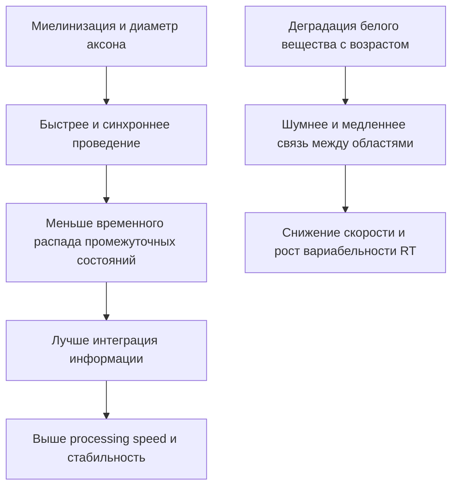
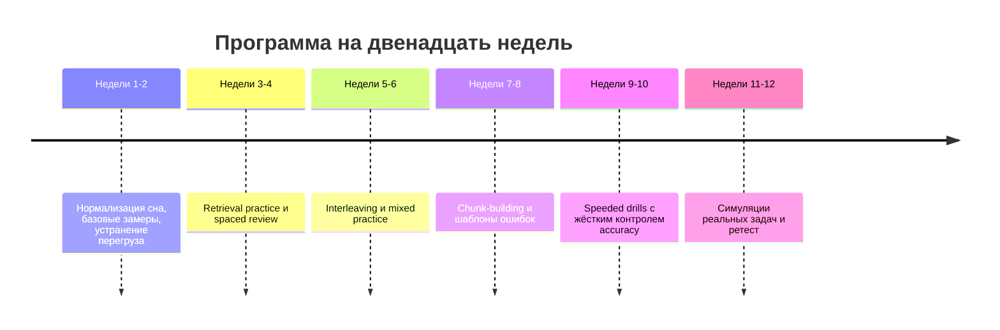
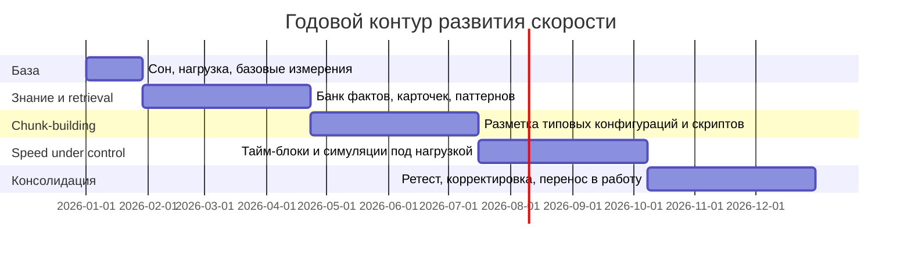

# Скорость мышления

## Исполнительное резюме и структура книги

Под "скоростью мышления" нельзя понимать один-единственный внутренний "такт процессора". На наблюдаемую быстроту решения задачи почти всегда накладываются как минимум шесть разных компонентов: скорость сенсорного кодирования и ориентировки, качество внимания, объём и управляемость рабочей памяти, скорость извлечения подходящих представлений из долговременной памяти, степень автоматизации операций и выбранный порог "достаточно уверен, можно отвечать". Поэтому один человек может быть очень быстрым в распознавании паттернов, но не в устном счёте; другой - в счёте, но не в диагностике или программировании. Это не противоречие, а следствие многоуровневой природы скорости. citeturn40search0turn41search3turn40search9turn41search1turn28view8

Самый надёжный общий вывод из литературы такой: "базовую" скорость частично ограничивают биологические факторы - проводимость по аксонам, миелинизация, состояние белого вещества, катехоламинергическая модуляция, сон, возраст, стресс, генетические различия, - но колоссальные различия между людьми в реальных задачах чаще возникают не из-за "сырой" нейронной скорости, а из-за различий в представлениях, чанках, автоматизации и доменно-специфическом знании. Именно поэтому шахматный мастер, опытный радиолог, сильный программист и клиницист-эксперт выглядят "поразительно быстрыми": они не столько считают быстрее поэлементно, сколько видят готовые структуры и быстро исключают ненужный поиск. citeturn18view0turn30view4turn38view0turn32search1turn32search11

Тренировать скорость можно, но с важной оговоркой. Что тренируется хорошо: автоматизация конкретных операций, извлечение из памяти, паттерн-распознавание в знакомом домене, устойчивость внимания и часть исполнительных функций, а также работа в условиях помех и ограниченного времени. Что тренируется намного хуже: широкая "наддоменная" прибавка к общему интеллекту или далеко идущий far transfer от абстрактных когнитивных тренажёров. Мета-аналитически near transfer обычно малый или умеренный, а far transfer либо очень слабый, либо после коррекций близок к нулю. citeturn24search0turn43search0turn43search3turn43search2turn43search15

Это означает практический принцип для книги: ускорение мышления почти всегда строится в таком порядке. Сначала убираются биологические тормоза - нехватка сна, перегрузка, плохой режим, низкая физическая форма. Затем наращиваются внимание и рабочая память под задачу. После этого строятся чанки, схемы, скрипты и автоматизируются повторяющиеся операции. И только потом имеет смысл жёстко оптимизировать скорость ответа под тайминг и trade-off со точностью. citeturn21search1turn20search12turn26search0turn39search11turn41search1

Ниже - структура книги, которая логично вытекает из этих данных.

| Предлагаемая глава | Что в ней должно быть | Зачем она нужна |
|---|---|---|
| Введение в скорость мышления | Определения, разграничение "сырой" скорости и экспертной быстроты | Чтобы не смешивать базовые и доменные эффекты |
| Архитектура быстрого мышления | Processing speed, attention, working memory, chunking, automaticity, dual-process | Чтобы задать общую модель |
| Нейробиология | Миелин, белое вещество, нейромодуляторы, возраст, генетика, сон, стресс, питание | Чтобы показать реальные биологические ограничения |
| Эмпирика | Мета-анализы, effect sizes, near/far transfer, deliberate practice | Чтобы отсечь мифы |
| Доменные главы | Счёт, паттерн-распознавание, шахматы, программирование, диагностика | Чтобы показать, где растут большие ускорения |
| Измерение | RT, DSST, PVT, inspection time, BIS, DDM, дизайн задач | Чтобы не путать скорость со смелостью отвечать |
| Протоколы | Программы на 6, 12, 24 и 52 недели | Чтобы перевести теорию в практику |
| Риски и этика | Ошибки, выгорание, стимуляторы, неравенство, ложные ожидания | Чтобы ускорение не разрушало качество |
| Перспективы | Открытые вопросы и дизайн будущих исследований | Чтобы книга была не только обзором, но и исследовательской повесткой |

## Понятийная рамка скорости мышления

### Что именно следует называть скоростью мышления

В строгом смысле "скорость мышления" - это не просто время до ответа. Это функция от того, как быстро система кодирует стимул, выделяет релевантный сигнал, удерживает промежуточные состояния, извлекает подходящие представления, накапливает доказательства до порога решения и запускает ответ. Поэтому одно и то же сокращение времени ответа может означать три очень разных вещи: человек стал лучше различать сигнал, человек стал быстрее доставать готовый шаблон, или человек просто снизил критерий уверенности и начал рисковать точностью. Именно по этой причине скорость всегда надо рассматривать вместе с точностью. citeturn40search0turn41search1turn28view8turn28view7

Диаграмма выше отражает основной консенсусный взгляд: в реальной задаче "быстро соображать" значит либо быстрее проходить несколько ступеней подряд, либо уметь обходить часть ступеней за счёт готового паттерна, либо держать более выгодный порог решения. Ускорение на одной ступени не гарантирует ускорения всей цепочки. citeturn40search0turn41search3turn40search9turn41search1turn28view8

### Ключевые модели, без которых книга будет неполной

| Конструкт | Строгое содержание | Для скорости полезен тем, что... | Критический источник |
|---|---|---|---|
| Processing speed | Общая быстрота выполнения элементарных операций; у Salthouse связана с механизмами limited time и simultaneity | более медленные ранние операции оставляют меньше времени поздним и ухудшают интеграцию результатов | `10.1037/0033-295X.103.3.403` citeturn40search0turn16view5turn16view6 |
| Working memory | Многокомпонентная система удержания и манипулирования информацией | ограничивает число промежуточных состояний, которые можно держать "живыми" при решении | `10.1146/annurev-psych-120710-100422` citeturn41search0turn41search9 |
| Executive attention | Управление фокусом, подавление отвлечений, поддержание цели | определяет, насколько быстро система выделит релевантное и не утонет в шуме | citeturn3search6turn20search12 |
| Automaticity | Переход от пооперационного алгоритма к извлечению хранящихся "экземпляров" | драматически уменьшает время на повторяющиеся операции | `10.1037/0033-295X.95.4.492` citeturn40search9turn40search17 |
| Chunking | Кодирование множества элементов как одной структурной единицы | снижает нагрузку на внимание и рабочую память, ускоряя распознавание и поиск | `10.1016/0010-0285(73)90004-2` citeturn18view0turn40search18 |
| Speed-accuracy tradeoff | Ускорение часто покупается снижением критерия решения | объясняет, почему "быстрее" не всегда значит "лучше" | `10.3389/fnins.2014.00150` citeturn41search1turn16view4 |
| Dual-process | Быстрые автоматизированные процессы и более медленные аналитические | показывает, что быстрая мысль не всегда примитивна, а медленная не всегда точнее | `10.1177/1745691612460685` citeturn40search3turn16view0turn16view1 |

Особенно важно не искажать dual-process-модель. Evans и Stanovich прямо предупреждают, что "быстро" не тождественно Type 1, а Type 2 не гарантирует правильность. Быстрые процессы могут давать правильный ответ, если опираются на хорошо обученные репрезентации; медленные - ошибаться, если анализ строится на плохом знании. Это критично для книги, иначе она скатится в ложную оппозицию "быстрое = поверхностное, медленное = умное". citeturn16view0turn16view1

### Почему в реальной жизни разница во времени бывает огромной

Разница "на порядки" в практических задачах чаще всего рождается не из одного фактора, а из перемножения многих малых преимуществ. Если у человека быстрее ориентировка, лучше рабочая память, меньше отвлечений, ниже вариабельность реакции, есть готовые чанки и автоматизированы микрошаги, выигрыши суммируются и даже мультиплицируются. В экспертизе это видно особенно ярко: мастер шахмат не считает все ходы заново, радиолог не сканирует всю картинку одинаково, сильный программист не читает код как текст, а трассирует исполнение, клиницист извлекает illness scripts, а не разворачивает с нуля исчерпывающий поиск. citeturn18view0turn30view2turn29view5turn38view0turn32search11

Отсюда важный практический тезис для книги: "базовая" быстрота существует, но в сложных доменах именно представления и организация знания обычно дают самый большой выигрыш. Это не умаляет роли биологии; просто объясняет, почему простые когнитивные тренажёры редко производят чудо far transfer, а грамотное доменное обучение - производит. citeturn39search11turn24search0turn43search0turn43search15

## Нейробиология и физиология

### Проводимость, миелин и белое вещество

На самом нижнем уровне скорость ограничивается физикой нервных цепей. Немиелинизированные аксоны проводят импульс примерно со скоростью от 0.5 до 10 м/с, тогда как миелинизированные - до 150 м/с; кроме того, скорость зависит от диаметра аксона и числа "дорогих по времени" точек, в которых приходится регенерировать потенциал действия. Это не означает, что интеллект равен скорости одного аксона, но означает, что когнитивная быстрота не может быть полностью оторвана от параметров проводимости и синхронизации сетей. citeturn39search10turn39search16turn19view4

Исследования белого вещества последовательно связывают более высокую целостность трактов с более высокой скоростью обработки информации, особенно в старшем возрасте. Fields суммирует картину так: миелинизация продолжается десятилетиями, модифицируется опытом и влияет на скорость и синхронность проведения. Penke и коллеги показали, что общий фактор integrity белого вещества предсказывает скорость информационной обработки у здоровых пожилых людей; Kerchner и соавторы показали, что снижение целостности белого вещества статистически медиирует связь возраста со снижением processing speed. citeturn39search11turn39search2turn19view3turn14search5

Эта схема особенно хорошо согласуется с Salthouse: slower processing ухудшает performance и потому, что на поздние операции остаётся меньше времени, и потому, что результаты ранних операций успевают "распасться" до момента интеграции. На биологическом уровне это естественно сочетается с идеей более медленного и менее синхронного межрегионального обмена. citeturn16view5turn16view6turn39search11turn19view3

### Нейромодуляторы, рабочая память и "режим" сети

Дофамин и норадреналин не просто "включают бодрость". В современной литературе они описываются как системы gain control: меняют отношение сигнал/шум, поддерживают устойчивую активность префронтальных контуров и влияют на рабочую память, селективное внимание и скорость перехода к решению. При этом зависимость нелинейна - типичной считается inverted-U: и дефицит, и избыток ухудшают работу. citeturn19view0turn5search4

Это объясняет сразу две наблюдаемые вещи. Во-первых, умеренная стимуляция или мобилизация может ускорять относительно простые или хорошо выученные ответы. Во-вторых, перегрузка стрессом способна одновременно делать человека быстрее в простом "жми-не жди" и хуже в рабочей памяти, когнитивной гибкости и сложной аналитике. Именно такую картину даёт литература по acute stress: мета-анализ Shields показал ухудшение working memory и cognitive flexibility, при этом эффекты на inhibition были неоднородными; отдельное экспериментальное исследование той же группы показало, что mild acute stress может сокращать время ответа без проигрыша по точности в задачах селективного внимания. citeturn20search12turn20search11turn20search1

### Возраст, генетика, сон, питание, нагрузка

С возрастом processing speed снижается особенно надёжно. Salthouse рассматривал этот фактор как один из основных посредников возрастных различий в fluid cognition; более поздние обзоры и мета-анализы показывают, что у пожилых выше как среднее время реакции, так и intra-individual variability, причём эффекты сильнее в choice RT, чем в simple RT. В sustained-attention задачах у пожилых go-реакции заметно медленнее, но иногда при этом возрастает осторожность и точность на no-go, что хорошо иллюстрирует trade-off. citeturn40search0turn14search9turn14search6turn14search3

Генетический вклад реален, но полигенен и далёк от "гена скорости мышления". Поведенческо-генетические данные показывают наследуемость processing speed и overlap с рабочей памятью и интеллектом; более новые исследования executive functions и белого вещества указывают на общие генетические влияния, но с малыми индивидуальными вкладом локусов и сильной зависимостью от среды и возраста. Это означает: биология задаёт диапазон и чувствительность к нагрузкам, но не создаёт заранее готовую "судьбу" экспертной быстроты. citeturn7search23turn14search7turn7search25

Сон - один из самых мощных и недооценённых факторов. Мета-анализ Lim и Dinges по кратковременной депривации сна показывает ухудшение по нескольким когнитивным категориям, особенно по бдительности и вниманию; PVT остаётся одним из самых чувствительных индикаторов этих сдвигов. В практическом смысле недостаток сна почти всегда сначала "бьёт" по стабильности и вниманию, а затем - по скорости решения сложных задач. citeturn21search1turn21search5turn12search7

По физической нагрузке картина умеренно оптимистична: байесовский мета-анализ 2024 года нашёл небольшой, но достоверный положительный эффект acute exercise на когницию в целом, около `g = 0.13`, плюс сокращение RT; тренировки у здоровых пожилых дают небольшие улучшения исполнительных функций, особенно при умеренной интенсивности и сессиях до 60 минут, хотя при active control эффекты заметно уменьшаются. citeturn26search0turn26search1

С питанием выводы существенно менее уверенные, чем любят популярные тексты. Для широких nutritional interventions данные по accuracy и reaction time неоднородны и часто малы; систематический обзор и мета-анализ в контексте mental fatigue не нашёл убедительного эффекта углеводных стратегий на RT. Наиболее надёжный краткосрочный эффект - у кофеина: мета-анализ 2025 года показывает острое улучшение внимания и одновременно RT, и accuracy, но это не эквивалент долговременного роста базовой способности. Долгосрочные диетические паттерны вроде средиземноморской диеты выглядят обещающе для общего когнитивного здоровья, однако прямых, сильных и универсальных эффектов именно на "скорость соображения" пока недостаточно. citeturn27search0turn26search2turn27search19

## Что показывает эмпирика

### Мета-аналитическая карта того, что реально работает

Если собрать вместе мета-анализы и большие обзоры, получится довольно жёсткая и полезная картина. Техники, которые усиливают извлечение и организацию знаний внутри домена, работают лучше, чем абстрактные "универсальные тренажёры". При этом значение имеют и величина эффекта, и тип переноса.

| Метод | Что обычно улучшается | Эффект | Перенос | Ограничения и риски | Источник |
|---|---|---:|---|---|---|
| Practice testing / retrieval practice | Запоминание и доступность материала | часто умеренный, в ряде обзоров `g` около `0.50-0.70` | хороший near transfer в учебных и профессиональных знаниях | зависит от дизайна теста, обратной связи и интервала | citeturn42search7turn42search0turn42search12 |
| Spaced retrieval | Долговременное удержание и доступ к знаниям | spaced vs massed retrieval: `g = 0.74` в одном мета-анализе | хороший near transfer; far transfer не гарантирован | нужен достаточный начальный уровень усвоения | citeturn42search8turn23search10 |
| Interleaving | Различение категорий, индуктивное распознавание | общий эффект `g = 0.42`; в математике `g = 0.34` | переносит на похожие задачи различения | не универсален; для словесных материалов эффект может быть нулевым или отрицательным | citeturn28view4 |
| Deliberate practice | Доменные навыки и мастерство | объясняет около 26% дисперсии в играх, 21% в музыке, 18% в спорте, 4% в образовании, <1% в профессиях | сильный внутри домена | не объясняет всё; качество практики и исходные различия важны | citeturn22search3turn22search6 |
| N-back / WM training | Улучшение на похожих задачах обновления | untrained n-back: средний effect; другие transfer-домены очень малы | near transfer есть, far transfer слаб | после коррекций общая польза для "реального" мышления ограничена | citeturn28view3turn43search0turn43search3 |
| Общие brain-training программы | Выполнение близких тренировочных задач | обычно малый или нулевой far transfer | far transfer в среднем близок к нулю | сильный риск маркетингового преувеличения | citeturn43search2turn43search15 |
| Acute exercise | Внимание, RT, иногда WM/inhibition | малый эффект, около `g = 0.13` | скорее state effect, чем мощный trait effect | эффект кратковременный и зависит от интенсивности | citeturn26search0 |
| UFOV / speed-of-processing training у пожилых | Визуальная processing speed, часть everyday outcomes | в ACTIVE эффекты на таргет-способность держались годами | перенос ограниченный и популяционно-специфичный | не следует безоговорочно переносить на молодых и все домены | citeturn25search1turn25search4turn25search21 |

Главный вывод из таблицы: наиболее надёжное ускорение строится не вокруг абстрактного "разгона мозга", а вокруг улучшения retrieval, spacing, discrimination, chunking и deliberate practice. То есть скорость чаще растёт как свойство знания в действии, а не как изолированная психометрическая переменная. citeturn42search7turn28view4turn22search3turn43search15

### Near transfer, far transfer и пределы тренируемости

Мета-анализ Melby-Lervag и Hulme 2013 года сформулировал неудобный, но устойчивый вывод: memory training обычно производит краткосрочные, специфические эффекты, которые плохо генерализуются. Обновлённый обзор 2016 года делает тезис ещё жёстче: нет хороших доказательств, что working-memory training повышает интеллект или другие real-world far-transfer исходы. Второй порядок мета-анализа Sala и Gobet доводит эту линию до предела: после контроля публикационных и плацебо-артефактов общий far transfer cognitive training практически исчезает. citeturn43search0turn43search3turn43search2turn43search15

Это не значит, что тренировка бесполезна. Это значит, что нужно честно различать три уровня целей. Первый уровень - стать быстрее именно в этой задаче. Второй - стать быстрее в классе похожих задач того же домена. Третий - повысить абстрактную "универсальную мощность мышления". Для первого и второго у нас много положительных данных. Для третьего - намного меньше. Именно здесь проходит граница между строгой книгой и популярной мифологией. citeturn24search0turn43search0turn43search15

### Почему deliberate practice важна, но не всемогуща

Мета-анализ Macnamara и коллег показал, что deliberate practice существенно связана с достижениями, но объясняет только часть различий. Для игр это около 26% дисперсии, для музыки 21%, для спорта 18%, для образования 4%, для профессий меньше 1%. Это означает двойной вывод. С одной стороны, целенаправленная практика критически важна. С другой - даже в хорошо тренируемых областях значимы иные факторы: исходные когнитивные различия, качество обратной связи, мотивация, среда, здоровье, доступ к сильным образцам и, вероятно, удачность набора представлений. citeturn22search3turn22search6

Для книги это важный защитный механизм от двух крайностей: от наивного "талант решает всё" и от столь же наивного "достаточно часов". Часы сами по себе мало что объясняют; имеет значение, чему именно учится система, насколько быстро она получает правильную коррекцию и превращает алгоритм в узнавание паттерна. citeturn22search3turn40search9turn18view0

## Почему доменные различия бывают огромными

### Устный счёт и ментальный абакус

У сильных вычислителей резкое ускорение обычно строится на смене представления, а не на увеличении "голой" мощности. Исследования abacus experts показывают, что они используют устойчивое визуально-пространственное внутреннее представление счёт, а нейровизуализация связывает это с иным паттерном вовлечения корковых областей, чем у неэкспертов. Более новые работы показывают, что extraordinary arithmetic feats не обязаны автоматически означать широкий рост рабочей памяти: часть преимуществ очень специфична к стратегии и типу числовых представлений. citeturn8search8turn8search12turn8search0

Практический смысл прост: если цель - ускорить устный счёт, тренировать надо не "общую мыслительную скорость", а мгновенное кодирование чисел в устойчивые структуры, быстрый доступ к таблицам фактов, композицию разрядов и процедуру проверки ошибки. В этом домене representation engineering важнее почти всего остального. citeturn8search8turn8search0

### Шахматы и классический случай chunking

Работа Chase и Simon остаётся одним из самых ясных эмпирических кейсов. Мастера почти идеально восстанавливали содержательные позиции после 5 секунд просмотра, но теряли это преимущество на случайно расставленных фигурах. Авторы прямо интерпретировали данные через chunking: мастер видит не набор отдельных фигур, а знакомые конфигурации, и потому выигрывает по скорости восприятия и извлечения. При этом кратковременные ограничения сами по себе у мастеров не исчезают - меняется то, что именно попадает в память как единица. citeturn18view0

Это, пожалуй, лучший аргумент против идеи, что эксперт "думает быстрее вообще". В шахматах он думает быстрее прежде всего потому, что иначе кодирует поле поиска. Сильный шахматный пример следует использовать в книге не как курьёз, а как общий шаблон для любой экспертизы. citeturn18view0turn40search18

### Распознавание образов и радиология

В радиологии скорость эксперта проявляется как более быстрое наведение взгляда на аномалию, меньшее число фиксаций, более короткий общий search time и возможность иногда заметить отклонение по очень краткому первому взгляду. Обзор Waite и коллег подчёркивает, что experts generally fixate abnormalities faster than novices, делают fewer eye movements и чаще используют быстрый global impression или gist для ограничения последующего поиска; в некоторых 2D-задачах subtle abnormalities удавалось детектировать даже после предъявления порядка 250 мс. citeturn30view4turn30view2

Но именно здесь видны и границы упрощений. Для volumetric imaging вроде CT/MRI чистая "глобальная вспышка" уже недостаточна, и теория holistic processing становится неполной. Следовательно, даже внутри одного домена механизмы быстрой экспертизы меняются вместе с типом данных. Это важный урок для всей темы: нельзя переносить одну модель быстроты на все классы задач. citeturn30view2

### Программирование

В программировании особенно хорошо видно, что годы опыта не эквивалентны скорости мышления. Исследование Peitek и коллег с EEG и eye-tracking показало, что программисты с высокой efficacy читают код более прицельно, с меньшей когнитивной нагрузкой, меньшим числом рефиксаций и лучше комбинируют speed и correctness; вместе с тем обычные меры опыта предсказывают эффективность плохо. Авторы прямо отмечают, что в компаниях наблюдаются различия производительности до десятикратного масштаба, а seniority сам по себе коррелирует со skill слабо. citeturn38view0

Работы по eye-tracking также показывают, что novices читают код более линейно, ближе к естественному тексту, тогда как experts чаще идут по execution order и пропускают промежуточные элементы, если уже знают, где искать смысл. fMRI-исследования подтверждают, что code comprehension опирается в основном на fronto-parietal сети, связанные с domain-general executive processing и формальными символическими системами, а не просто на языковые механизмы. citeturn29view5turn29view3turn29view4

Для книги это один из лучших современных кейсов. Он показывает две вещи сразу. Первая: "скорость соображения" у разработчика - это скорость работы с репрезентацией исполнения, а не скорость чтения текста. Вторая: годы стажа без активного переучивания и расширения чанков могут почти не прибавлять реальной скорости решения. citeturn38view0turn29view5

### Диагностика и клиническое мышление

Современные обзоры clinical reasoning описывают экспертную быстроту как быструю активацию diagnostic hypotheses и illness scripts, а не как избавление от анализа. Norman в 2024 году формулирует System 1 как rapid retrieval of possible hypotheses, largely automatic; более старые обзоры illness scripts подчёркивают, что восприятие клинической картины активирует скрипты, которые позволяют быстро интерпретировать признаки и направлять сбор данных. citeturn32search1turn32search11

Критически важно, что быстрые ошибки и медленные ошибки имеют разную природу. Быстрая диагностика рушится, когда активирован неподходящий скрипт или сработал неверный паттерн. Медленная - когда аналитический поиск построен на слабом знании или неэффективном problem representation. Поэтому в сложных профессиях "ускорять мышление" значит прежде всего делать знания более легко извлекаемыми и лучше организованными, не убивая при этом переключение в аналитический режим, когда паттерн нестандартен. citeturn32search1turn37view1

## Как измерять скорость без самообмана

### Скорость нужно измерять вместе с точностью

Обычный RT сам по себе опасен как метрика, потому что не различает два сценария: участник стал лучше различать сигнал или просто стал отвечать смелее. Heitz показывает, что в sequential sampling models увеличение decision bounds ведёт к более медленным, но более точным ответам. Поэтому любое исследование "ускорения мышления" должно либо явно моделировать speed-accuracy tradeoff, либо использовать совместные показатели скорости и точности. citeturn16view4turn41search1turn28view8

Liesefeld и Janczyk продемонстрировали на симуляциях, что популярные интегральные меры вроде IES, RCS и LISAS могут быть чувствительны к различным SAT-паттернам и давать спурии. В их анализе Balanced Integration Score оказывается более устойчивым способом интеграции RT и accuracy, потому что даёт им равные веса. Если книга будет включать методологическую главу, BIS и DDM стоит сделать её центральными инструментами. citeturn28view7turn41search20turn41search17

### Набор тестов, который действительно нужен

| Тест | Что он преимущественно измеряет | Сильные стороны | Главные ловушки |
|---|---|---|---|
| Simple RT | Базовое сенсомоторное реагирование | простота, высокая чувствительность к усталости и возрасту | слабая доменная специфичность; сильный вклад моторики |
| Choice RT | Выбор между альтернативами, часть processing speed | лучше отражает когнитивную нагрузку и возрастные различия | сильный SAT; сложнее интерпретировать без accuracy | citeturn14search3turn12search8 |
| DSST | Быстрое сканирование, ассоциативное кодирование, внимание, моторика | очень чувствителен к дисфункции и aging | не является "чистой" скоростью; моторный вклад велик | citeturn11search1 |
| Inspection Time | Скорость элементарной дискриминации при минимальном моторном вкладе | хороший кандидат на ближний к "сырой" скорости показатель | тоже не полностью вне стратегии и внимания | citeturn13search15turn13search12 |
| PVT | Бдительность и устойчивое внимание | чрезвычайно чувствителен к недосыпу и циркадианике | измеряет прежде всего vigilant attention, а не богатое рассуждение | citeturn21search5turn12search7 |
| UFOV | Визуальная processing speed и распределение внимания | хорошо валидирован для older adults и driving-related outcomes | перенос ограничен популяцией и типом задач | citeturn25search4turn25search14 |

Оптимальный дизайн измерения для книги и для практики такой. Нужны как минимум: одна "низкоуровневая" мера скорости с малым влиянием знаний, одна мера устойчивого внимания, один speeded task внутри нужного домена и одна интегральная метрика speed x accuracy. Плюс обязательное отслеживание вариабельности RT, потому что именно нестабильность реакции часто первой отражает усталость, сонный долг и возрастные изменения. citeturn13search7turn14search9turn21search5turn28view7

### Практический минимум статистики

Если цель - оценить "ускорился ли человек", нельзя ограничиваться средним временем. Нужно хранить:
- среднее RT,
- медиану RT,
- intra-individual variability,
- accuracy,
- BIS или другую совместную метрику,
- по возможности параметры DDM: drift rate, boundary separation, non-decision time. citeturn28view7turn28view8

Интерпретация тогда становится намного чище. Если RT упал, accuracy не изменилась, BIS вырос, а boundary не снизился - вероятнее улучшилось качество обработки. Если RT упал, accuracy просела, BIS стоит на месте - произошёл сдвиг критерия, а не реальное ускорение. Если RT тот же, но variability упала - возможно выросла устойчивость, что в жизни иногда ценнее, чем несколько миллисекунд среднего выигрыша. citeturn28view7turn13search7turn21search5

## Практические протоколы тренировки

### Общие принципы

Практический протокол ускорения мышления должен быть построен не вокруг лозунга "делай brain games", а вокруг пяти контуров: восстановление биологических ресурсов, селективное внимание, retrieval/spacing, построение чанков и speeded performance under control. Именно такой порядок вытекает из совокупности данных по сну, стрессу, exercise, retrieval practice, interleaving, deliberate practice и ограниченности far transfer от абстрактного WM training. citeturn21search1turn20search12turn26search0turn42search8turn28view4turn22search3turn43search15

### Программа на шесть-двенадцать недель

Эта программа подходит для большинства доменов, если цель - заметно ускориться без заметной потери точности.

Первые две недели должны быть посвящены не "тренировке мозга", а созданию условий, в которых мозг вообще может работать быстро: стабильный сон, одно и то же время когнитивной работы, умеренная аэробная нагрузка, отказ от многозадачности во время основного блока и выведение недосыпа из системы. Если это не сделать, большая часть дальнейшей "тренировки скорости" будет шумом. citeturn21search1turn21search5turn26search0

В блоке retrieval practice материал надо извлекать, а не перечитывать. Для фактов, формул, идиом, кода-идиом, клинических паттернов и микроалгоритмов это обычно самый дешёвый и надёжный способ ускорить последующий доступ. Оптимально: короткие тесты без конспекта, затем spaced re-test через сутки, три дня, неделю, три недели. Мета-анализы именно здесь дают наиболее стабильные и практически полезные эффекты. citeturn42search7turn42search0turn42search8

В mixed/interleaving-блоке следует перемежать близкие, но различимые типы задач, чтобы ускорять не только ответ, но и правильный выбор способа решения. Для устного счёта это могут быть разные классы преобразований; для шахмат - тактические мотивы; для программирования - типовые баги и паттерны исполнения; для диагностики - сходные синдромы с перекрывающимися симптомами. Interleaving особенно полезен там, где узкое место - discriminative pattern recognition. citeturn28view4

В speeded drills надо фиксировать не только время, но и допустимую полосу точности. Хорошее правило: не ускорять серию, если accuracy упала ниже заранее заданного порога. Это дисциплинирует trade-off и не позволяет превратить "ускорение" в тренировку поспешности. citeturn41search1turn28view7

### Программа на двадцать четыре - пятьдесят две недели

Этот горизонт нужен, если цель - не просто стать быстрее на упражнениях, а перестроить репрезентации внутри домена.

На длинном горизонте ключевая задача - собирать library of chunks. Для каждой области это выглядит по-разному. В устном счёте - микросхемы преобразований, пары операций, стандартные разрядные ходы, "опорные числа". В программировании - idioms, execution motifs, smell-patterns, типовые трассы ошибок. В диагностике - illness scripts, красные флаги, discriminative features между похожими состояниями. В радиологии - наборы нормальных и атипичных образов, которые сравниваются почти мгновенно. Именно этот библиотечный компонент чаще всего и создаёт ощущение "он схватывает сразу". citeturn18view0turn30view2turn38view0turn32search11

### Дневник и метрики

Для книги полезно предложить единый шаблон дневника, пригодный для любого домена. Он должен содержать:
- дата, время суток, длительность сна, субъективная бодрость;
- блок задачи;
- среднее и медианное время;
- accuracy;
- BIS или эквивалент;
- тип ошибок;
- что стало автоматическим;
- какой новый chunk был сформирован;
- что сегодня тормозило: отвлечение, усталость, перегрузка, неясное представление, слабое извлечение. citeturn28view7turn21search10

Смысл дневника не в самонаблюдении ради самонаблюдения. Он позволяет разделить четыре разных причины медлительности: слабая бдительность, слабая репрезентация, слабое извлечение и слишком осторожный критерий ответа. Пока эти причины смешаны, тренировка почти всегда стреляет мимо. citeturn28view8turn21search5turn40search0

### Доменные упражнения

Для устного счёта лучше всего работают серии из very short drills с immediate feedback и смешиванием типов преобразований. Нужно тренировать не только правильный ответ, но и мгновенный выбор представления: разбить число на удобные части, перевести в опорную форму, использовать обратные операции для проверки. Под это особенно хорошо подходят spacing и retrieval, а не бесконечное однотипное повторение. citeturn42search8turn28view4turn8search0

Для распознавания образов нужны банки примеров с контролируемой вариативностью и принудительным сравнением очень похожих случаев. Радиология показывает, что быстрый first-pass и ограничение поиска подозрительными зонами - не врождённый дар, а функция накапливаемых схем и perceptual learning. citeturn29view1turn30view4

Для программирования самые эффективные упражнения - это не "скоростная печать кода", а быстрая comprehension under constraint: трассировка выполнения, определение invariants, локализация дефекта, объяснение куска кода по execution order, классификация snippets по типу управления. Именно здесь развиваются targeted reading и уменьшается лишняя когнитивная нагрузка. citeturn29view5turn38view0

Для диагностики хороши короткие кейсы с forced problem representation, обязательным извлечением ведущих hypotheses и последующим сравнением с близкими синдромами. Если задача только "думать дольше", экспертная скорость не строится. Если задача "активировать правильный illness script и вовремя переключиться на аналитику при конфликте", скорость и точность начинают расти вместе. citeturn32search1turn32search11turn37view1

## Риски, этика и открытые вопросы

### Побочные эффекты ускорения

Самый распространённый побочный эффект ускорения - не ошибка как таковая, а незаметное смещение trade-off. Человек искренне считает, что стал лучше, хотя на деле просто снизил порог ответа. В профессиях это особенно опасно: в диагностике - риск premature closure, в программировании - риск поверхностного понимания и роста invisible rework, в радиологии - пропуски subtle findings, в обучении - иллюзия гладкости вместо реального переноса. citeturn41search1turn37view1turn10news36

Второй риск - биологическое саморазрушение ради скорости. Недосып временно может "компенсироваться" кофеином или мобилизацией, но объективные меры вроде PVT показывают ухудшение vigilant attention и рост нестабильности. То есть субъективное чувство "я в потоке" часто переоценивает реальную остроту мышления. citeturn21search1turn21search10

Третий риск - фармакологическое переобещание. По стимуляторам и модифинилу данные для здоровых взрослых указывают скорее на умеренные, task-specific улучшения, часто теснее связанные с бодростью, мотивацией и ощущаемым effort, чем с глобальным усилением "базовой способности". При этом вне медицинских показаний остаются проблемы сна, побочных эффектов, немедицинского использования и искажённых ожиданий. citeturn44search9turn44search14turn44search1turn44search2

### Что пока неясно

Данных всё ещё недостаточно по нескольким критическим вопросам. Не до конца понятно, какие именно формы тренировки способны в здоровых взрослых сдвигать не только performance, но и latent parameters вроде drift rate, а не только decision thresholds. Неясно также, какие биомаркеры лучше всего предсказывают индивидуальный отклик на training: когнитивная вариабельность, качество сна, миелин/white matter, полигенные индексы, learning eagerness или сочетание этих факторов. По питанию и большинству "биохаков" доказательная база для именно базовой скорости соображения остаётся слабой и очень неоднородной. citeturn28view8turn43search15turn27search0turn26search2

### Приоритетные источники для книги

Ниже не "полная библиография", а рабочий каркас источников, на который действительно стоит опираться при написании книги.

#### Англоязычные источники

| Тип | Источник | Почему приоритетен |
|---|---|---|
| Теория | Salthouse, T. A. "The Processing-Speed Theory of Adult Age Differences in Cognition", 1996, DOI: `10.1037/0033-295X.103.3.403` citeturn40search0 | Базовая теория связи скорости и cognition |
| Теория | Baddeley, A. "Working Memory: Theories, Models, and Controversies", 2012, DOI: `10.1146/annurev-psych-120710-100422` citeturn41search9 | Лучший обзор рабочей памяти для общей рамки |
| Теория | Logan, G. D. "Toward an Instance Theory of Automatization", 1988, DOI: `10.1037/0033-295X.95.4.492` citeturn40search9 | Классическое объяснение автоматизации как извлечения экземпляров |
| Теория | Evans, J. S. B. T., Stanovich, K. E. "Dual-Process Theories of Higher Cognition", 2013, DOI: `10.1177/1745691612460685` citeturn40search3 | Самый удобный источник для строгого dual-process раздела |
| Методология | Heitz, R. P. "The Speed-Accuracy Tradeoff", 2014, DOI: `10.3389/fnins.2014.00150` citeturn41search1 | История, физиология и методология SAT |
| Методология | Liesefeld, H. R., Janczyk, M. "Combining speed and accuracy to control for speed-accuracy trade-offs(?)", 2019, DOI: `10.3758/s13428-018-1076-x` citeturn41search20 | Для BIS и критики упрощённых composite scores |
| Нейробиология | Fields, R. D. "White matter in learning, cognition and psychiatric disorders", 2008, DOI/URL через citation citeturn39search2turn39search11 | Ключевой мост между миелином и cognition |
| Нейробиология | Penke et al. "A General Factor of Brain White Matter Integrity Predicts Information Processing Speed", 2010, DOI/URL через citation citeturn19view3 | Сильная связь white matter и processing speed |
| Сон | Lim, J., Dinges, D. F. "A Meta-Analysis of the Impact of Short-Term Sleep Deprivation on Cognitive Variables", 2010, DOI: `10.1037/a0018883` citeturn21search15turn21search1 | Один из самых надёжных обзоров по sleep loss |
| Стресс | Shields et al. "The Effects of Acute Stress on Core Executive Functions", 2016, DOI/URL через citation citeturn20search12turn20search11 | Лучший мета-анализ по stress x EF |
| Обучение | Adesope et al. "Rethinking the Use of Tests", 2017, DOI/URL через citation citeturn42search0turn42search3 | Практически важный мета-анализ retrieval practice |
| Обучение | Brunmair, Richter "A meta-analysis of interleaved learning", 2019, DOI/URL через citation citeturn28view4 | Лучшая опора для interleaving |
| Обучение | Macnamara et al. "Deliberate Practice and Performance", 2014, DOI/URL через citation citeturn22search3 | Для главы о deliberate practice и её пределах |
| Cognitive training | Melby-Lervag, Hulme, 2013 и 2016, DOI/URL через citation citeturn43search0turn43search3 | Основной антидот против завышенных обещаний WM training |
| Cognitive training | Sala, Gobet "Near and Far Transfer in Cognitive Training", 2019, DOI/URL через citation citeturn43search2turn43search15 | Наиболее жёсткий синтез по far transfer |
| Экспертиза | Chase, W. G., Simon, H. A. "Perception in Chess", 1973, DOI: `10.1016/0010-0285(73)90004-2` citeturn40search18turn18view0 | Классический эмпирический фундамент chunking |
| Домены | Waite et al. "A Review of Perceptual Expertise in Radiology", 2020, URL via citation citeturn29view1 | Лучший обзор по быстрой visual expertise в радиологии |
| Домены | Ivanova et al. "Comprehension of computer code relies primarily on domain-general executive brain regions", 2020, URL via citation citeturn29view3 | Базовый neurocognitive источник для programming |

#### Русскоязычные источники

| Тип | Источник | Как использовать |
|---|---|---|
| Учебник | Хомская Е. Д. "Нейропсихология", 2005, URL via citation citeturn34search1 | Для русскоязычной базы по мозговым механизмам |
| Учебник | Солсо Р. "Когнитивная психология", рус. изд., URL via citation citeturn34search0 | Для введения и понятийной рамки |
| Лекция/обзор | "Теории когнитивного старения", русскоязычный материал с цитированием международной литературы, URL via citation citeturn34search2 | Для главы об aging и скорости |
| Русскоязычный обзор | "Динамика когнитивных функций при старении...", URL via citation citeturn34search6 | Для локального контекста исследований старения |
| Популярно-научный мост | Материалы о рабочей памяти с участием Алана Бэддели на русском, URL via citation citeturn34search3 | Для адаптации объяснений без потери сути |

Главная неопределённость в русскоязычном массиве состоит в том, что по теме "скорость мышления" лучшие первоисточники и мета-анализы всё ещё почти полностью англоязычны. Русские источники полезны прежде всего как учебная и терминологическая опора, а не как равная замена международной эмпирике. citeturn34search1turn34search2turn40search0turn43search15

### Итоговая позиция для книги

Строго сформулированный вывод звучит так. Базовая способность "соображать быстро" существует, но она не единична и не абсолютно пластична. Её нижние границы задают биология, состояние и возраст; её реальные прикладные вершины определяются тем, как мозг кодирует, группирует и извлекает знания в конкретном домене. Потому быстрый мыслитель - это обычно не тот, у кого "мозг работает в два раза быстрее", а тот, у кого меньше шума, лучше внимание, устойчивее рабочая память, выше стабильность, богаче библиотека чанков, грамотнее trade-off и точнее момент переключения от pattern recognition к аналитике. Это можно тренировать. Но тренируется прежде всего не некая мистическая "общая скорость", а хорошо организованная, биологически поддержанная, доменно-настроенная быстрота мышления. citeturn40search0turn41search3turn39search11turn18view0turn30view2turn38view0turn32search1turn43search15