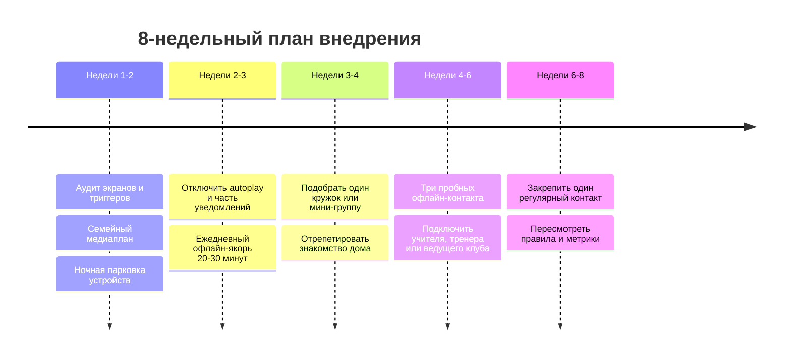
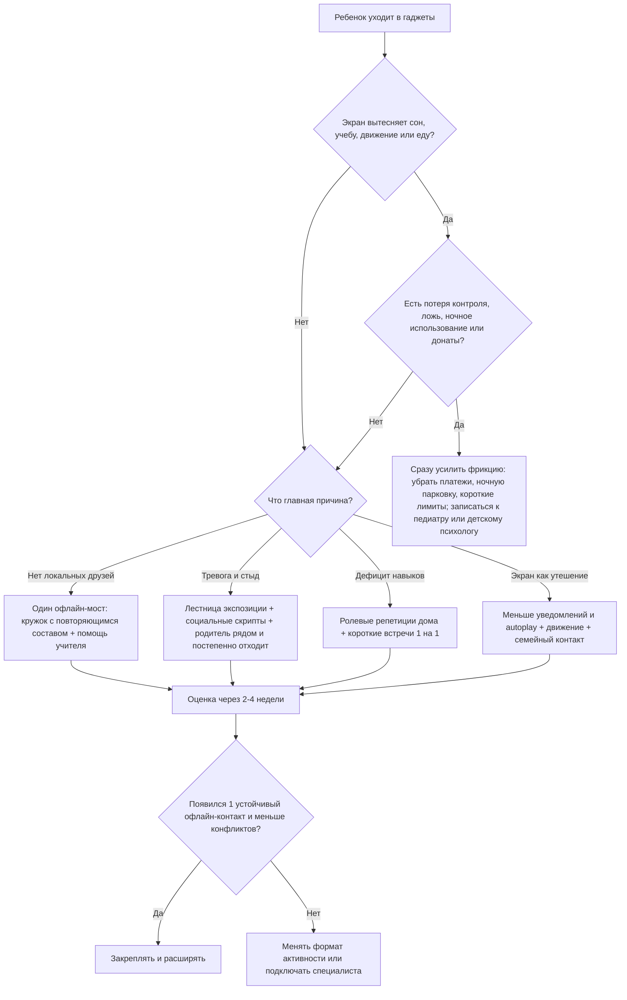

# Социализация детей 9-11 лет в эпоху гаджетов

## Executive summary

- В 9-11 лет ребенок уже сильнее ориентируется на сверстников, заметнее проявляет эмпатию и тянется к самостоятельности, но самоконтроль, выдержка к неловкости и "социальная выносливость" еще дозревают. Поэтому живое общение ему уже очень нужно, но дается не так легко, как взрослым часто кажется. citeturn27search0turn2search1turn3search0turn3search6

- Когда старые друзья уехали или исчезли из повседневной среды, гаджет часто становится не "врагом", а быстрым заменителем сразу нескольких дефицитов: контакта, предсказуемости, достижения, развлечения и утешения. В такой ситуации жесткий запрет без офлайн-альтернатив обычно усиливает конфликт, а не социализацию. citeturn26search0turn19view0turn7search4

- Лучший курс для семьи - не "убрать экраны любой ценой", а восстановить баланс: чтобы экран не вытеснял сон, движение, учебу, семейный контакт и хотя бы один регулярный офлайн-мост к сверстникам. Именно так сейчас предлагают мыслить AAP и WHO: не вокруг магического числа часов, а вокруг контекста, содержания и того, что экран вытесняет. citeturn20view0turn20view1turn18search1turn18search4

- Практически это работает как тройная стратегия: снизить "фрикшн-фри" стимулы дома, создать предсказуемую повторяющуюся офлайн-среду с одними и теми же детьми, и отдельно тренировать навыки общения и переносимость тревоги. Цель на старте - не "много друзей", а один устойчивый, взаимный, локальный контакт. Даже один друг может заметно смягчать негативный опыт со сверстниками. citeturn20view2turn22search1turn21view5turn11search14

- Повод подключать педиатра или детского психолога раньше, а не позже: потеря контроля над игрой, ложь, ночное использование, тайные донаты, резкое ухудшение сна или школы, сильная тревога перед офлайн-контактом, почти полное исчезновение других интересов. WHO подчеркивает, что клиническое gaming disorder бывает у меньшинства, но реальное ядро проблемы - не часы сами по себе, а нарушение функционирования. citeturn9search0turn20view0turn27search1

## Что показывает научная база

Коротко: данные не поддерживают простую формулу "чем больше экранов, тем хуже ребенок". Картина сложнее. Национальная академия наук США отмечает, что средние связи между соцмедиа и благополучием обычно малы и неоднородны, причинность на уровне популяции не доказана, а эффекты зависят от конкретного ребенка, платформы и того, что именно экран заменяет. При этом те же платформы могут и поддерживать связь с друзьями, особенно если офлайн-поддержка просела. citeturn19view0

Для родителей полезнее не спорить о "норме часов", а смотреть на три вещи: что ребенок делает в экране, что это ему дает и что из жизни экран вытесняет. Это прямо соответствует актуальной позиции AAP: универсального "безопасного" лимита для всех школьников нет; более полезны правила про баланс, контент, совместное обсуждение и коммуникацию, чем чисто количественные запреты. citeturn20view0turn20view1turn20view2

Для детей 9-10 лет данные тоже неоднозначны. В исследовании ABCD большее экранное время было умеренно связано с худшими показателями сна, поведения и учебы, но одновременно с более высокими показателями количества и качества контактов со сверстниками; при этом социально-экономический статус объяснял больше вариации, чем сам экран. Отсюда важный вывод: экран может быть и фактором риска, и каналом поддержания связей, а не только "разрушителем дружбы". citeturn21view2

Но риск проблемного использования реален. WHO Europe сообщала, что среди подростков проблемное использование соцмедиа выросло с 7% в 2018 году до 11% в 2022 году, а 12% подростков находились в зоне риска проблемного гейминга. WHO отдельно определяет gaming disorder как утрату контроля и приоритет игры над другими делами при заметном ущербе для жизни и обучения. citeturn0search2turn9search0

| Источник | Что брать в практику |
| --- | --- |
| AAP | Не искать "магическое число часов", а строить семейный медиаплан вокруг Child, Content, Calm, Crowding Out, Communication. citeturn20view0turn20view1 |
| WHO | Для 5-17 лет важны в среднем 60 минут движения в день и ограничение сидячего, особенно рекреационного экранного времени; тревожит не сам экран, а вытеснение базовых режимов. citeturn18search1turn18search4 |
| NASEM | Средние эффекты соцмедиа невелики и смешанны, но у уязвимых детей могут быть существенны; возможны и польза, и вред. citeturn19view0 |
| Лонгитюдные данные | Связь двусторонняя: экран может усиливать социоэмоциональные трудности, а трудности - повышать тягу к экрану как к способу совладания. citeturn7search4 |

## Возраст 9-11 лет и ловушки быстрого дофамина

В этом возрасте дружба становится психологически центральной. AAP прямо пишет, что в 9 лет у большинства детей уже формируются значимые дружбы, они начинают яснее видеть чувства других; к 10 годам мнение друзей часто начинает звучать громче родительского. Одновременно исследования middle childhood показывают продолжающееся развитие executive functions, cooperation и cognitive empathy. Иначе говоря: мотивация "быть со своими" уже высокая, а устойчивость к отказу, паузе, смущению и неоднозначности еще хрупкая. citeturn27search0turn2search1turn3search0turn3search2turn3search6

Поэтому "быстрый дофамин" здесь лучше понимать не как магическую химию, а как быструю петлю вознаграждения: мгновенный стимул, короткий путь к награде, предсказуемая победа, новый триггер. Алгоритмы рекомендаций, autoplay и уведомления специально устроены так, чтобы удерживать внимание; AAP прямо советует отключать уведомления и autoplay, потому что они продлевают использование. Непредсказуемые игровые награды и лутбоксы дополнительно усиливают удержание за счет переменного подкрепления. citeturn19view0turn20view2turn10search1turn10search2turn8search10turn8search0

Живое общение в сравнении дает "медленный" выигрыш: нужно подойти, выдержать неловкость, разделить очередность, считывать реакцию другого, иногда получить отказ. Но именно эта среда и тренирует социальную компетентность, эмоциональную регуляцию и чувство принадлежности. Систематические обзоры по middle years подчеркивают, что supportive peer relationships связаны с лучшим психическим здоровьем, а сильнее всего с ними коррелируют emotion regulation, affective social cognition, prosocial motivation и social competence. citeturn26search0turn26search5turn21view5

## Семейная стратегия, которая реально работает

Ключевой принцип такой: не просите ребенка прыгнуть из среды "быстро, легко, предсказуемо" в среду "страшно, медленно, непонятно". Сначала сделайте офлайн хоть в чем-то легче экрана: меньше неопределенности, меньше размер группы, понятный сценарий, взрослый рядом, повторяемость. Родительская связь в middle years все еще очень значима, а connectedness с семьей, школой и сверстниками работает как защитный фактор. citeturn25search2turn25search16turn20view0

Практически это выглядит так:

| Рычаг | Что делает родитель | Фраза, которая обычно работает лучше |
| --- | --- | --- |
| Назвать функцию гаджета | Сначала признать, что экран дает ребенку реальную выгоду: связь, отдых, чувство успеха | "Я вижу, что игры и телефон сейчас помогают тебе не скучать и не чувствовать себя одному. Я не хочу просто отнять это. Я хочу добавить в жизнь еще что-то живое." |
| Изменить среду дома | Ночная "парковка" устройств вне спальни, один экран за раз, отключить autoplay и часть уведомлений, убрать сохраненные карты и покупки без взрослого | "Мы меняем не тебя, а настройки среды. Так мозгу проще не зависать." |
| Договор на короткий срок | Не "навсегда", а тест на 2 недели с 2-3 четкими правилами | "Давай не спорить на год вперед. Пробуем 14 дней и смотрим, что реально помогает." |
| Один офлайн-мост | Выбрать одну повторяющуюся активность, где один и тот же состав детей встречается еженедельно | "Нам не нужен сразу круг друзей. Нам нужен один нормальный маршрут, где можно примелькаться." |
| Школа как союзник | Просить не абстрактно "помочь подружиться", а дать постоянного партнера в проекте, посадить рядом со спокойным ребенком, предложить кружок | "После потери прежней компании ребенку трудно заново встроиться. Нам помогут 1-2 мягких школьных моста." |
| Нематериальное подкрепление | Поощрять смелость, попытку, выдержку, а не покупать "за общение" | "Мне понравилось, как ты выдержал первые 20 минут и не ушел. Это и есть рост." |

Такой подход лучше совпадает и с логикой AAP, и с мотивационной теорией: больше всего устойчивую внутреннюю мотивацию поддерживают autonomy, competence и relatedness, а не постоянные внешние призы. Жесткие подарки "за друзей" иногда работают кратко, но хуже для внутренней опоры. citeturn20view0turn20view2turn30search0turn30search11turn30search7

Ниже - реалистичный 8-недельный ритм внедрения, а не "переворот за выходные". Он лучше соответствует тому, как на практике формируются привычки и дружбы. citeturn22search1turn21view5turn26search0

## Офлайн-активности, где легче всего начать дружбу

Исследования по extracurriculars и peer relationships сходятся в одном: лучшие форматы для новых дружб - повторяющиеся, структурированные, с общей задачей и ощущением принадлежности. Командные и "командоподобные" активности особенно полезны, а организованный спорт в среднем дает небольшой, но стабильный плюс к ментальному благополучию. Для preteens особенно важны те среды, где ребенок "делает вместе", а не просто "находится рядом". citeturn22search1turn22search0turn22search16turn21view5turn12search14

Оценки ниже - практические, а не "рейтинг науки"; они помогают выбрать стартовую точку под конкретного ребенка.

| Формат | Доступность | Стоимость | Нужные навыки на старте | Шанс завести друзей | Как начать |
| --- | --- | --- | --- | --- | --- |
| Командный спорт | Средняя | Средняя | Средние | Высокий | Идти на пробную тренировку и заранее попросить тренера мягко познакомить новичка с 1-2 детьми |
| Боевые искусства, скалодром, плавание в группе | Средняя | Средняя | Низкие-средние | Средний | Хорошо, если ребенку легче входить через правила и структуру |
| Театр, хор, ансамбль | Средняя | Средняя | Низкие-средние | Высокий | Подходит тревожным детям: есть сценарий, роль и повторяемость |
| Шахматы, настолки, робототехника, coding club | Средняя | Средняя | Низкие | Высокий | Лучший вход для интровертных и "гиковых" детей: общий интерес сразу снимает часть неловкости |
| Арт-студия, мейкерская, комиксы, лепка | Высокая | Низкая-средняя | Низкие | Средний | Старт через проект, который можно показать или обсудить |
| Скауты, походный, outdoor-клуб | Низкая-средняя | Средняя | Низкие-средние | Высокий | Хорошо работает за счет совместного дела и ритуалов группы |
| Семейное волонтерство, школьный сервис-проект | Средняя | Низкая | Низкие | Средний | Начинать вместе с родителем, потом постепенно отходить |
| Родительская микрогруппа 1 раз в неделю | Высокая | Низкая | Низкие | Очень высокий | 2-3 ребенка, короткая структура: перекус, настолка, движение, завершение по таймеру |

Если выбирать с нуля, то для ребенка с дефицитом друзей обычно лучше не самый "престижный" кружок, а тот, где совпадают 4 условия: маленькая группа, понятный сценарий, повторяемый состав и интерес самого ребенка. Формула "общая задача + повторяемость + взрослый-фасилитатор" почти всегда надежнее, чем свободная площадка "иди и знакомься". citeturn21view5turn22search1turn26search5

## Что делать при сопротивлении, тревоге и признаках зависимости

Сопротивление чаще означает не лень, а один из четырех барьеров: у ребенка нет локальной среды для дружбы, ему не хватает навыков, он тревожится и стыдится, или экран уже стал основным способом регуляции состояния. Важно сначала понять барьер, а уже потом усиливать правила. Особенно это актуально после потери прежней компании: positive peer relationships в middle years реально смягчают стресс переходов. citeturn23search2turn26search0turn26search1turn7search4

| Ситуация | Что делать | Что сказать |
| --- | --- | --- |
| "Не хочу, там скучно" | Не спорить о вкусе; дать выбор из 2-3 форматов и правило "3 пробных посещения" | "Тебе не надо это полюбить с первого раза. Наша задача - проверить, где тебе хотя бы на 10% легче." |
| "У меня друзья только онлайн" | Не обесценивать; сохранить 1 запланированный слот с прежним другом, но добавить офлайн-формат по тому же интересу | "Онлайн-дружба засчитывается. Но нам нужен еще один локальный канал, чтобы твоя жизнь не зависела только от сети." |
| "Мне стыдно/боюсь" | Использовать лестницу экспозиции: сначала посмотреть, потом зайти на 15-20 минут, потом остаться на все занятие; дома репетировать social scripts | "Страшно - не значит нельзя. Мы сделаем так, чтобы было не легко, а посильно." |
| "Не могу остановиться, злюсь, прошу донаты" | Сразу убрать карты и покупки, устройство не в спальне, короткие лимиты, один и тот же ритуал завершения; если срывов много - к специалисту | "Я не обсуждаю донаты, когда мозг уже на крючке. Сначала меняем среду, потом обсуждаем правила." |

Ролевые репетиции, "социальные скрипты" и спокойные, неосуждающие разговоры здесь действительно важны. Child Mind отдельно советует родителям тренировать социальные сценарии дома; AAP в разговорах о ментальном здоровье подчеркивает факты вместо ярлыков, больше слушать, допускать паузы и не усиливать стыд. citeturn23search0turn23search11turn27search1

## Как оценивать прогресс и чем опираться родителю

Оценивать лучше не по одному "хорошему" или "плохому" дню, а по окнам в 2-4 недели и 8-12 недель. Дружба формируется медленнее, чем привычка к гаджету. Реалистичная цель первой фазы - уменьшить вытеснение жизни экраном и получить один повторяющийся локальный контакт. Это уже значимый прогресс. citeturn21view5turn22search1

| Что измерять | Старт | Через 2-4 недели | Через 8-12 недель |
| --- | --- | --- | --- |
| Дни, когда экран вытеснил сон, уроки или движение | Базовый показатель | Минус 20-30% | Минус 40-60% |
| Офлайн-социальные экспозиции в неделю | 0-1 | 1-2 | 2-3 стабильных |
| Инициированные контакты | 0 | 1 короткая попытка в неделю | 1-2 в неделю |
| Взаимные контакты | Нет | Один повторный контакт | Один устойчивый локальный контакт |
| Конфликты дома из-за гаджетов | Часто | Реже и короче | Управляемо, без эскалаций |
| Самооценка "мне одиноко" и "мне хватает смелости" по шкале 0-10 | База | Сдвиг на 1-2 пункта | Сдвиг на 2-3 пункта |
| Тайные донаты или обход правил | Да/нет | Должны исчезать быстро | Если сохраняются, нужен специалист |

Ниже - три типовые успешные траектории. Это композитные примеры, а не истории конкретных детей.

| Исходная ситуация | Что изменили | Что сработало |
| --- | --- | --- |
| После переезда ребенок почти жил в игре и держался только за старого друга онлайн | Оставили 2 запланированных онлайн-созвона в неделю, добавили robotics club и проектную пару в школе | Онлайн-связь перестала быть единственной; к 6-8 неделе появился один местный приятель |
| Ребенок хотел друзей, но избегал кружков из-за стыда и тревоги | Выбрали театр, сначала родитель ждал рядом, дома репетировали 3-4 фразы знакомства | Сценарий и роль снизили неловкость; ребенок начал оставаться без родителя |
| Были срывы на лимитах и просьбы о донатах | Убрали карты, зарядку перенесли из комнаты, ввели ритуал завершения и настольный клуб по интересу | Ушли тайные покупки, сократились конфликты, экран перестал быть единственным источником возбуждения |

Ресурсы, на которые реально стоит опираться:

| Ресурс | Зачем нужен |
| --- | --- |
| AAP Family Media Plan и 5 Cs of Media Use citeturn20view1turn20view2 | Самый практичный набор семейных правил и разговорных рамок |
| WHO: gaming disorder FAQ и guidelines on physical activity/sedentary behaviour citeturn9search0turn18search1 | Для понимания красных флагов и базовых режимов дня |
| UNICEF на русском: безопасный интернет дома, кибербуллинг citeturn14search3turn14search13 | Русскоязычные памятки для родителей и детей |
| NASEM Social Media and Adolescent Health citeturn19view0 | Лучший сжатый обзор пользы, вреда и ограничений текущих данных |
| Child Mind Institute: loneliness, friendship, social scripts, healthy video game limits citeturn23search2turn23search0turn23search6 | Практика для повседневных разговоров и поведения |
| Книги: Nancy Petry "Pause and Reset"; Регина Галанти "Уверенный ребенок" citeturn32search3turn33search7 | Для семей, где есть выраженная тревога или уже проблемный гейминг |

Главная мысль простая: если у ребенка мало живых связей, гаджет часто лечит не "плохой характер", а социальную пустоту. Поэтому рабочая стратегия - не стыдить и не рубить с плеча, а постепенно собирать новую экосистему вознаграждения: меньше бесконечных цифровых триггеров, больше предсказуемой принадлежности, совместного дела и хотя бы одной живой взаимной дружбы. citeturn26search0turn21view5turn20view0turn19view0
