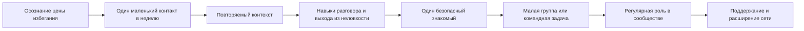
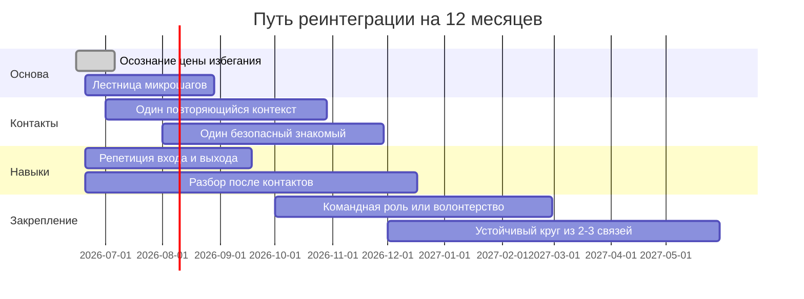

# Социализация детей 9-11 лет и взрослых, избегающих общения

## Краткий executive summary

Для детей 9-11 лет главный вывод такой: в этом возрасте дружба становится психологически очень значимой, а качество отношений обычно важнее их количества. Именно в эти годы дети сильнее ориентируются на peers, лучше начинают видеть точку зрения другого, становятся чуть более независимыми от семьи и одновременно намного чувствительнее к отвержению, смене школы и выпадению из привычной компании. Поэтому потеря старых друзей после переезда или перехода в другую школу - не "мелочь", а реальный фактор риска для одиночества, снижения самооценки и ухода в экран как в более легкую и управляемую среду. При этом родители все еще критически важны: они помогают ребенку создавать условия для контакта, а не только "учат общению". citeturn25view0turn25view1turn27view0turn27view1turn27view3

Про гаджеты и игры важен нюанс. Современные исследования не поддерживают примитивную идею "любое экранное время одинаково вредно". Национальные академии США подчеркивают, что средние связи между social networking и психическим здоровьем часто малы и неоднородны, а AAP рекомендует смотреть не только на длительность, но и на ребенка, контент, функцию использования, вытеснение сна и офлайн-жизни и качество семейного общения. Однако большие недавние исследования показывают, что именно проблемное, компульсивное, "аддиктивное" использование экранов, а также рост social media use в ранней подростковости связаны с худшим психическим состоянием, а не просто минутами "по счетчику". citeturn26view0turn24view0turn24view1turn24view6turn9search5turn13search0

Практически это означает, что цель не в "запретить гаджет", а в том, чтобы заменить его более сильными источниками дофамина и принадлежности: повторяющимися офлайн-ритуалами, структурированными активностями с предсказуемым составом группы, микро-встречами один на один, мягкой лестницей социальных шагов и письменными семейными правилами, которые соблюдают и взрослые тоже. Наиболее устойчивые офлайн-каналы для ребенка 9-11 лет - те, где регулярно повторяются люди и роли: секции, кружки, after-school programs, наставничество, настольные игры, семейные и соседские ритуалы. Организованные активности в среднем дают небольшие, но положительные эффекты для психического благополучия; спорт, особенно командный, чаще связан с лучшими социальными и психологическими исходами; after-school programs, которые целенаправленно развивают personal and social skills, улучшают self-perceptions, social behaviors и school bonding. citeturn31search0turn32search0turn31search1turn31search11turn23search9

Для взрослых, которые называют себя "самодостаточными", критично различать добровольную малую потребность в контакте и избегание, которое поддерживается тревогой, чувствительностью к отвержению, депрессией, травмой, autistic communication differences или устоявшейся привычкой к withdrawal. Social anxiety - это не просто застенчивость: по NHS это страх, который не проходит и начинает заметно ухудшать отношения, работу или учебу. Лучшие подтвержденные стратегии реинтеграции - не "просто выйти к людям", а комбинация мотивационного прояснения, поведенческой активации, cognitive-behavioral work, graded exposure с маленькими шагами, тренировки конкретных социальных навыков и повторяющихся контекстов, где общение структурировано. Для social anxiety у взрослых NICE считает индивидуальную CBT лечением первой линии. citeturn24view17turn26view3turn36view0turn24view15turn33search5

В обоих случаях насильственное ускорение часто ухудшает ситуацию. Если у ребенка или взрослого есть выраженная social anxiety, депрессия, признаки травмы, school refusal, сильная дезорганизация, self-harm risk, резкое ухудшение сна, естества и функционирования, нужна не просто "социализация", а маршрутизация к специалисту. WHO, CDC, NIMH, NICE и NHS сходятся в одном: социальная изоляция и одиночество реально вредят здоровью, но решение должно быть ступенчатым, поддерживающим и учитывающим причину избегания, а не только его внешнюю форму. citeturn24view4turn26view7turn24view15turn24view16turn28view1turn28view0

## Научная рамка и что важно учитывать

Социализация - это не просто наличие контактов, а развитие способности входить в отношения, выдерживать неловкость, распознавать эмоции, договариваться, восстанавливаться после конфликтов и чувствовать принадлежность. В middle years, примерно 8-14 лет, positive peer relationships связаны с лучшим психическим благополучием, меньшим количеством внешних проблем и большей школьной включенностью; при этом исследования отдельно подчеркивают, что для благополучия ребенка обычно важнее качество дружбы, а не просто число знакомых. citeturn27view0

Родительская роль в 9-11 лет не исчезает, а меняется. В этом возрасте peer influence растет, но positive parenting по-прежнему помогает детям строить здоровые отношения. Практически это означает, что взрослый уже не "собеседник вместо друзей", но еще очень значимый архитектор среды: он знакомит с повторяющимися контекстами, организует возможности для встреч, поддерживает предсказуемые ритуалы и учит не избегать неловкости. citeturn27view1turn25view0

По цифровой среде картина сложнее, чем миф "телефон испортил детей". National Academies отмечают, что в среднем ассоциации между social networking и mental health часто малы и зависят от того, что именно измеряется, а также что у цифровой среды есть не только риски, но и потенциальные выгоды. AAP поэтому предлагает смотреть через "5 Cs": child, content, calm, crowding out, communication. На практике это полезнее любых жестких универсальных лимитов, особенно для детей старше 5 лет. citeturn26view0turn26view1turn24view0

Но "не все так просто" не значит "опасности нет". WHO Europe сообщала о росте problematic social media use среди подростков с 7% в 2018 году до 11% в 2022 году, а 12% были в группе риска по problematic gaming. Большие cohort studies также показывают, что рост social media use в early adolescence предсказывает последующий рост depressive symptoms, а addictive use of social media, mobile phones and video games связан с более высоким риском suicidal ideation, suicidal behavior и эмоционально-поведенческих проблем. То есть риск связан не только с экраном как таковым, а с его функцией: регуляция эмоций, compulsive pull, вытеснение сна, движения и face-to-face connection. citeturn24view3turn13search0turn9search1turn9search5

Для взрослых важно понимать: social connectedness - не "приятное дополнение", а один из факторов психического и физического здоровья. WHO пишет, что loneliness переживает примерно каждый шестой человек в мире, а social isolation and loneliness серьезно вредят quality of life, mental and physical health и longevity. CDC различает social isolation как дефицит отношений и поддержки и loneliness как субъективное чувство disconnectedness. Scoping review по social connectedness показывает, что longitudinal studies в целом подтверждают защитную роль connectedness от depressive symptoms и disorders. citeturn24view4turn26view7turn33search5

Одновременно важно не переоценивать силу отдельных интервенций. Наиболее уверенная evidence base есть у CBT и связанных с ней ступенчатых поведенческих подходов для social anxiety, а для volunteering и social prescribing данные более смешанные: umbrella review по volunteering находит потенциальные социальные, mental и physical benefits, но качество обзоров часто невысокое и большинство данных получено на older adults. Meta-analytic review loneliness interventions показывает, что психологические интервенции в среднем наиболее эффективны, а structured social activities тоже полезны, но не дают универсального решения "для всех и сразу". citeturn26view3turn34search11turn36view3turn37search0turn37search5

## Дети 9-11 лет

### Психологические особенности возраста

Для 9-11 лет типичны более сильные и сложные дружбы, рост значимости друзей, усиление peer pressure, возрастание независимости от семьи, лучший perspective-taking и более длинный attention span. Bright Futures AAP добавляет, что для 9-10 лет нормальным developmental expectation является способность ладить с другими, контролировать эмоции и формировать caring, supportive relationships с семьей, взрослыми и peers. Это значит, что ребенок уже способен на дружбу "по взаимности", но еще очень нуждается в scaffolding и безопасной структуре. citeturn25view0turn25view1

Отсюда важный практический вывод: если у ребенка "не получается дружить", это не повод для стыда и тем более не доказательство "неправильного характера". Часто проблема не в отсутствии способностей, а в несовпадении между developmental needs и средой: нестабильный круг общения, слишком много времени в индивидуализированных цифровых сценариях, слишком мало повторяющихся офлайн-контекстов, неудачный первый опыт, смена школы, высокая чувствительность к отвержению или скрытая тревога. Качество дружбы и ощущение support влияют на wellbeing сильнее, чем простое число контактов. citeturn27view0turn27view1

### Барьеры к офлайн-дружбе

Переезд друзей, переход в другую школу и разрыв старой повседневной структуры - очень частые и недооцененные барьеры. Исследование friendship stability across school transition показывает, что устойчивость дружбы в этот период вообще не очень высока, а сохранение stable best friend связано с лучшей академической адаптацией и меньшим числом emotional and conduct problems. Другими словами, если прежние друзья "выпали", ребенку нередко приходится строить social life почти с нуля. citeturn27view3turn27view4

Застенчивость и social anxiety - не одно и то же, но оба состояния могут затруднять вход в группу. Для school-aged children interventions for shyness and social anxiety в целом могут уменьшать psychosocial difficulties, а NICE и другие обзоры по child social anxiety указывают, что психологические интервенции с exposure, practice и feedback имеют наибольший смысл. То есть застенчивого ребенка чаще надо не "ломать", а вести по маленькой лестнице безопасных социальных шагов. citeturn30search0turn30search5turn26view2

Цифровая среда становится барьером, когда выполняет функцию эмоционального обезболивания и вытесняет живые связи. AAP подчеркивает важность "calm" и "crowding out" в использовании media, а HealthyChildren рекомендует screen-free zones за столом, во время homework и перед сном, правило "one screen at a time", отключение autoplay и notifications и выбор quality content. Большие cohort studies дополнительно показывают, что именно addictive patterns screen use, а не только total time, лучше указывают на риск. citeturn24view0turn24view6turn24view1turn9search5turn9search1

### Стратегии, которые обычно работают лучше запретов

Самая рабочая логика - не "лишить экрана", а "увеличить плотность живых повторяющихся контактов". Для этого ребенку обычно нужны три параллельных слоя: домашняя рамка, один регулярный групповой контекст и одна-две микросвязи один на один. Organized sport activities в среднем дают небольшой положительный вклад в mental health outcomes; team sport часто связан с более выраженными social and psychological benefits, вероятно из-за социальной природы участия; after-school programs, которые прямо развивают personal and social skills, улучшают self-perceptions, school bonding, positive social behaviors и снижают problem behaviors. citeturn31search0turn32search0turn31search11

Из этого следует хороший практический приоритет. Сначала ищется не "идеальный друг", а "повторяющаяся среда с предсказуемыми лицами": секция 2 раза в неделю, кружок настольных игр, школьный клуб, библиотечный клуб, музыкальная группа, scout-like организация, кружок робототехники или шахмат. Потом внутри этой среды взрослый помогает вычленить одного-двух потенциально совместимых детей для коротких встреч one-to-one. Такая последовательность обычно эффективнее, чем попытка сразу "подружить" ребенка на большой шумной площадке. citeturn27view0turn31search1turn31search0turn32search0

Наставничество и mentoring полезны не как магическая замена дружбе, а как дополнительная стабильная связывающая фигура. Rapid evidence summary по youth mentoring показывает small but significant improvements across academic, behavioral, emotional and social outcomes; более длительные отношения, training и goal-oriented design связаны с лучшими результатами. Это особенно полезно ребенку, который временно "обнулился" по дружбам и сейчас нуждается не только в peers, но и в спокойной опоре. citeturn25view2turn22search3

Волонтерство для 9-11 лет лучше рассматривать как семейную practice prosociality, а не как основной инструмент дружбы. Evidence по service-learning для personal and social skills неоднозначна, но семейное volunteer involvement может служить low-pressure контекстом для empathy, agency и совместного действия. Поэтому семейное мини-волонтерство полезно как дополнение к социализации, но не как ее ядро. citeturn15search0turn15search10

### Сравнение офлайн-активностей

Оценки в таблице ниже - практическая шкала, а не универсальная истина. Колонки "социальный эффект" и "уровень взрослой поддержки" построены как аналитический синтез данных о peer relationships, organized activities, team sports, after-school programs и mentoring. В реальности многое зависит от доступности в вашем районе, транспортной нагрузки и темперамента ребенка. citeturn27view0turn31search0turn32search0turn31search11turn25view2

| Активность | Доступность | Стоимость | Социальный эффект | Нужна взрослая поддержка | Когда особенно полезна |
|---|---|---:|---|---|---|
| Школьный кружок после уроков | Высокая/средняя | Низкая | Высокий | Средняя | После смены школы, когда нужен быстрый вход в среду |
| Командный спорт | Средняя | Средняя | Высокий | Средняя/высокая | Если ребенку подходит ритм команды и правил |
| Индивидуальный спорт с группой занятий | Средняя | Средняя | Средний | Средняя | Для shy children, которым тяжело сразу в команду |
| Клуб настольных игр или DnD junior | Средняя | Низкая/средняя | Высокий | Средняя | Для детей, которым легче общаться через общую задачу |
| Творческая студия | Средняя | Средняя | Средний/высокий | Средняя | Для детей, которым проще сначала общаться "через дело" |
| Библиотечный или книжный клуб | Средняя/низкая | Низкая | Средний | Низкая/средняя | Для спокойных детей и мягкого входа |
| Scout-like организация, турклуб | Средняя | Средняя | Высокий | Средняя/высокая | Для развития принадлежности и роли в группе |
| Наставничество | Низкая/средняя | Низкая/средняя | Средний/высокий | Высокая на старте | Если у ребенка мало безопасных взрослых опор |
| Семейное мини-волонтерство | Высокая | Низкая | Средний | Высокая | Для agency, empathy и общего социального опыта |
| Домашние micro-playdates | Высокая | Низкая | Высокий | Высокая на старте, потом снижается | Лучший мост от "знаю в группе" к "дружу лично" |

### Пошаговый сценарий после потери круга общения

Этот сценарий лучше рассматривать как цикл на 6-8 недель, а не как разовую акцию. Его задача - не немедленно "найти лучшего друга", а вернуть ребенку повторяющиеся живые точки контакта и снизить привлекательность экрана как единственного предсказуемого источника удовольствия. Логика сценария опирается на семейный media plan, structured activities, peer support и stepwise exposure. citeturn24view6turn31search1turn27view0turn26view2turn26view5

1. В течение недели спокойно фиксируйте, где ребенок все же оживляется рядом с людьми: спорт, LEGO, животные, настолки, coding, рисование, движение, "делать руками". Это нужно не для диагностики, а для выбора наиболее естественного social entry point.

2. Вводите только одно регулярное правило про гаджеты на старте: без экранов за столом и за 60 минут до сна. Не начинайте с тотального "режима". AAP прямо советует screen-free zones и revisiting the plan often. citeturn24view6turn24view1

3. Выберите один повторяющийся офлайн-контекст в неделю, желательно с небольшим постоянным составом. Не ищите "самый полезный" кружок, ищите "тот, куда ребенок реально начнет ходить".

4. После 2-3 посещений помогите ребенку выделить одного ребенка, с которым было хоть чуть-чуть легче. Цель - перевести групповое знакомство в короткий one-to-one формат: 45-90 минут дома, во дворе, в парке, в библиотеке, на катке.

5. Проводите первые micro-playdates структурировано. Свободное "ну играйте" часто ломается у детей, которые и так тревожатся. Лучше заранее задать 2-3 activity blocks: перекус, игра с правилами, совместное дело, короткий активный эпизод.

6. Сохраняйте старые дружбы в слабой, но регулярной форме: один video/audio contact в неделю или раз в две недели с конкретной темой. Не endless chat, а предсказуемый "ритуал связи".

7. Каждые 2 недели смотрите на три показателя: был ли один повторный живой контакт, есть ли одна регулярная офлайн-среда, снизились ли конфликты вокруг выключения устройства.

### Пошаговый сценарий для застенчивого ребенка

Для shy child ключевая ошибка взрослых - бросать в ситуацию, которая сразу имеет "уровень порога" 8/10, а потом считать отказ "леностью". Гораздо логичнее использовать "лестницу смелости": дробить challenging situations на маленькие части и подниматься только после нескольких повторов на текущей ступени. Такой подход соответствует child anxiety guidance и adult CBT-style behavioral experiment stepladders. citeturn30search0turn30search5turn26view5turn28view1

Пример лестницы на 4 недели может выглядеть так:

- Ступень 1: сказать "привет" двум знакомым детям на кружке.
- Ступень 2: задать один нейтральный вопрос по общему делу: "Ты тоже собираешь это?".
- Ступень 3: предложить микро-совместность на 5 минут: "Пойдем вместе выберем колоду" или "Давай сыграем еще раунд".
- Ступень 4: предложить короткую встречу после кружка или дома.
- Ступень 5: самому написать или продиктовать сообщение родителю для организации следующей встречи.

Если на ступени ребенок стабильно испытывает напряжение выше 7/10 и после нескольких попыток не становится легче, это повод не давить, а снижать уровень сложности и смотреть, нет ли более выраженной anxiety picture. citeturn28view1turn26view5

### Домашние правила, ритуалы и семейные практики

Ниже - практический набор, который обычно лучше работает, чем отдельные наказания. Он основан на AAP Family Media Plan, "5 Cs" и принципе, что у семьи должны быть не только запреты, но и заранее встроенные офлайн-альтернативы. citeturn24view0turn24view6turn24view1turn20search0

Шаблон семейных правил:

> Наши семейные правила про гаджеты
> 1. За столом, во время homework и за 60 минут до сна экраны выключены.
> 2. Одновременно используем только один экран.
> 3. Автовоспроизведение и лишние уведомления отключены.
> 4. Если скучно, сначала пробуем "список офлайн-старта", а не автоматически берем устройство.
> 5. Родители соблюдают те же базовые правила.
> 6. Каждое воскресенье мы пересматриваем правила и обсуждаем, что реально работает.

Полезные ритуалы:

- "10 минут после школы": сначала вода, еда, выдох, короткий разговор без допроса.
- "Имя дня": ребенок называет одного человека, с которым сегодня было хоть немного легче.
- "Один совместный эпизод в день": настолка, прогулка, готовка, мяч, LEGO, поход за хлебом.
- "Субботний контакт": раз в неделю семья помогает организовать одну живую встречу, даже короткую.

Игры и домашние practice formats, которые действительно тренируют social skills:

- кооперативные настольные игры;
- "угадай эмоцию" и короткие storytelling games;
- мини-роль-игры "как пригласить", "как начать разговор", "как красиво выйти, если устал";
- совместные дела, где нужно распределение ролей, а не "каждый сидит в своем углу".

### Примеры диалогов родителя с ребенком

Ниже не "правильные слова навсегда", а образец тона: без стыда, без лекции и без борьбы за власть. Такой стиль соответствует рекомендациям по открытому разговору о media use и supportive parenting. citeturn24view1turn28view2turn29search0

Пример про гаджеты:

> "Я вижу, что в телефоне тебе сейчас легче и спокойнее. Я не собираюсь просто все отобрать. Но я вижу и то, что телефон забирает место у вещей, после которых тебе по-настоящему хорошо. Давай не воевать с гаджетами, а сделаем так, чтобы у тебя снова появились живые ситуации, где тебе не так одиноко."

Пример после смены школы:

> "То, что старые друзья выпали, правда тяжело. Это не значит, что с тобой что-то не так. Сейчас задача не найти сразу лучшего друга, а снова набрать повторяющихся людей вокруг. Я помогу с первым шагом, дальше будем двигаться маленькими кусочками."

Пример для shy child:

> "Тебе не нужно сразу уметь дружить на всю перемену. Нам достаточно одного короткого шага. Сегодня задача только поздороваться и задать один вопрос. Все. Больше ничего геройского."

Пример перед micro-playdate:

> "Чтобы было не неловко, у нас будет план. Сначала перекус, потом игра, потом что-то активное. Если устанешь, ты можешь подойти ко мне и сказать кодовую фразу."

### Критерии успеха и метрики

Для семьи полезнее смотреть не только на минуты screen time, а на то, вытесняет ли экран sleep, movement, homework и face-to-face connection. Именно этот принцип лежит в AAP approach, а research по problematic use тоже показывает, что ключевой маркер - interference with daily functioning and relationships. citeturn24view0turn24view6turn9search5turn9search14

Практическая dashboard-метрика на 8-12 недель может быть такой:

| Метрика | Старт | Цель на 8-12 недель | Что считается тревожным |
|---|---:|---:|---|
| Часы офлайн после школы в будни |  | +20-30% от старта | Все свободное время уходит в экран |
| Живые встречи с peers в неделю |  | 1-2 стабильных контакта | 0 встреч несколько недель подряд |
| Повторные встречи с одним и тем же ребенком в месяц |  | не меньше 2 | Есть знакомства, но нет продолжения |
| Регулярные офлайн-активности |  | хотя бы 1 | Нет ни одной повторяющейся среды |
| Конфликты при выключении устройства |  | заметное снижение | Резкая раздражительность, срывы, ложь |
| Эмоциональное самочувствие ребенка 1-5 |  | рост на 1 пункт | Устойчивое снижение, слезы, раздражительность |
| Сон |  | стабильный | Позднее засыпание из-за экрана, сонная вялость |

Практический критерий "мы идем в правильную сторону" выглядит так: у ребенка есть хотя бы одна регулярная офлайн-среда, хотя бы один повторяющийся живой контакт, меньше конфликтов при выходе из устройства и больше эпизодов, где он сам готов на небольшой социальный шаг. Это не clinical endpoint, а ориентир для семьи. Если за 8-12 недель при бережной работе с рутиной и средой прогресса почти нет, стоит думать не о "лени", а о тревоге, bullying, депрессии, neurodivergence или перегрузе. citeturn27view0turn28view1turn28view0

### Короткий композитный кейс

Мальчик 10 лет после смены школы почти перестал общаться офлайн, вечером уходил в YouTube и игры, а на предложение "пойди погуляй" злился. Семья не вводила тотальный запрет. Вместо этого появились два правила: без экрана за столом и перед сном, плюс один школьный настольный клуб по средам. Через три недели родители заметили одного ребенка, с кем сын смеялся дольше обычного, и организовали 60-минутную встречу дома по заранее понятному сценарию. Через два месяца у мальчика остался примерно тот же интерес к играм, но экран перестал быть единственным местом принадлежности: появился один повторяющийся товарищ и один стабильный офлайн-контекст. Это типичная успешная траектория: не "любовь к гаджетам исчезла", а "появилась конкурентная живая среда".

## Взрослые, избегающие общения

### Что часто стоит за "самодостаточностью"

Не всякое малое количество социальных контактов - проблема. Некоторым людям действительно комфортнее с узким кругом связей. Признак неблагополучного avoiding pattern не в том, что человек мало общается, а в том, что он хотел бы больше связи или лучшего качества связи, но стабильно уходит от контакта из-за тревоги, стыда, усталости, чувствительности к отвержению или ощущения "я не умею". NHS прямо подчеркивает: social anxiety - это больше, чем shyness, и она начинает мешать everyday activities, confidence, relationships and work. citeturn24view17turn28view1

Наиболее частые причины social avoidance у взрослых:

- social anxiety, когда контакт заранее воспринимается как риск унижения или оценки;
- depression, при которой social withdrawal становится и симптомом, и фактором поддержания;
- trauma and PTSD, где близость может ощущаться как небезопасная;
- avoidant personality patterns, когда есть сильная потребность в близости, но почти болезненная чувствительность к rejection;
- autistic communication differences и sensory overload, когда трудна не только уверенность, но и сама механика social processing;
- долгий опыт одиночной удаленной жизни, когда исчезает навык "включаться" без специальной подготовки. citeturn28view1turn28view0turn28view6turn26view8turn18search0

Для психического здоровья социальная связь - не роскошь. WHO, CDC и several reviews сходятся в том, что isolation and loneliness ухудшают mental and physical health. CDC отдельно отмечает, что social isolation and loneliness shaped not only by individual traits but also by community resources like parks, libraries, transportation and programs. Это полезный corrective lens: часть проблемы находится не "в характере", а в структуре повседневности. citeturn24view4turn26view7turn33search5

### Этапная программа реинтеграции

Самый реалистичный путь - не "сразу расширить круг общения", а поэтапно строить tolerable contact. Для social anxiety NICE рекомендует individual CBT как first-line treatment. NHS self-help guidance советует break down challenging situations into smaller parts. Behavioural activation полезна, когда withdrawal связан с depression. А более новые reviews loneliness interventions показывают, что psychological interventions в среднем наиболее эффективны, structured social activities тоже помогают, но не заменяют работы с собственными установками и avoidance loops. citeturn26view3turn28view1turn36view0turn37search0turn37search5

Практически этапы выглядят так.

Первый этап - мотивация. Здесь вопрос не "нужно ли мне стать экстравертом", а "какую цену я уже плачу за avoidance". Хорошие вопросы: что я теряю из-за избегания, где мне не хватает не людей вообще, а именно поддержки, и какой тип social life мне нужен минимально. Если ответа нет, реинтеграция быстро превращается в самонасилие. В этом этапе полезна короткая письменная формулировка цели: "Мне нужен не широкий круг, а 2-3 устойчивых контакта и один командный контекст". Такой фокус уменьшает тревогу и делает процесс измеримым. citeturn33search5turn26view7

Второй этап - микрошаги. Начинать лучше не с networking event, а с маленьких, предсказуемых, низкоценовых контактов: короткий разговор с коллегой, 15 минут в coworking, один вопрос в учебной группе, один комментарий на хобби-встрече, один voice contact вместо большого ужина. Именно такой подход соответствует logic of graded exposure и CBT-based self-help. citeturn26view4turn26view5turn28view1

Третий этап - навыки. Многим "самодостаточным" взрослым не хватает не глубины, а моторики: как начать разговор, как поддержать его 2-3 минуты, как задать follow-up question, как красиво завершить контакт, как выдержать паузу, как не уходить в excessive self-monitoring. Для social anxiety это особенно важно, потому что проблема часто поддерживается не отсутствием интереса к людям, а постоянной проверкой "как я выгляжу". citeturn24view17turn26view4turn17search2

Четвертый этап - повторяющийся контекст. Самый сильный формат для взрослой реинтеграции - не случайные встречи, а регулярные роли: группа изучения языка, проектная команда, спортивная секция, volunteer shift, читательский клуб, хор, tabletop RPG group, мастерская, инженерный митап по интересу. Для loneliness interventions в целом structured and psychological formats оказываются полезнее, чем пассивное ожидание, что "со временем кто-то появится". Если social anxiety выражена, group work и role practice могут быть полезны как дополнение, хотя при classic SAD first-line по NICE - индивидуальная CBT. citeturn37search0turn34search0turn26view3

Пятый этап - закрепление. Цель уже не "выходить к людям", а удерживать 1) один repeated context, 2) один-двух повторяющихся знакомых, 3) одно действие на инициативу в неделю. Именно повторяемость, а не интенсивность, создает social confidence.

### Упражнения и ролевые практики

Ниже - практики, которые хорошо сочетаются с CBT-логикой, behavioural activation и graded exposure. Их сила не в оригинальности, а в регулярности. citeturn26view4turn26view5turn36view0turn28view1

Упражнение "30 секунд начала".
Задача - не произвести впечатление, а открыть контакт. Шаблон: наблюдение + вопрос.
Примеры: "Ты тоже сюда на регулярной основе ходишь?" / "Как тебе эта группа?" / "Что тут обычно самое полезное?".
Тренировка: 3 репетиции вслух дома, потом 1 реальный запуск в неделю.

Упражнение "лестница социальной сложности".
Составьте 8-10 ситуаций от 2/10 до 9/10 по тревоге.
Пример: поздороваться с соседом -> задать вопрос коллеге -> посидеть 20 минут в общей зоне -> прийти на meetup и остаться до конца -> пригласить знакомого на кофе.
Не переходите выше, пока текущая ступень не перестанет ощущаться как катастрофа. citeturn26view5turn28view1

Упражнение "послеконтактный разбор".
После каждой социальной попытки записывайте 4 пункта:
1. чего я боялся;
2. что реально произошло;
3. что я сделал лучше, чем думал;
4. какой будет следующий микрошаг.
Это помогает перестать судить себя по внутреннему ощущению и начать опираться на данные.

Ролевая практика "вход и выход".
Отрабатываются две фразы входа и две фразы выхода, чтобы снизить social freeze.
Вход: "Можно к вам присоединиться?" / "Я здесь впервые, как обычно все устроено?"
Выход: "Спасибо, мне было полезно, я пойду переварю информацию" / "Рад был поговорить, предлагаю продолжить в следующий раз".
Когда у человека есть "разрешенный выход", уровень тревоги перед входом заметно падает.

Упражнение "командная полезность".
Если прямой small talk очень тяжел, начните с роли, где есть задача: помочь на регистрации, вести заметки, модерировать чат, приносить материалы, настраивать звук, организовывать маршрут, координировать volunteer shift. Task-based contact часто легче, чем "просто поговорить". Это особенно полезно людям с social fatigue, engineering mindset и выраженным self-consciousness.

### План на 3/6/12 месяцев

Ниже - не универсальная норма, а realistic reintegration roadmap. Основа взята из CBT, behavioural activation, structured social activities и repeated-context logic. citeturn26view3turn36view0turn37search0

| Период | Главная цель | Контрольные точки | Метрики прогресса |
|---|---|---|---|
| Первые 3 месяца | Сломать инерцию избегания | 1 повторяющийся контекст, 1 социальный микрошаг в неделю, 1-2 коротких контакта/нед | Число инициаций, тревога до/после контакта 0-10, степень избегания 0-10 |
| До 6 месяцев | Перевести контакты в знакомство | 1-2 повторяющихся знакомых, 2 встречи или разговора в месяц вне случайных пересечений | Кол-во повторных контактов, субъективное чувство принадлежности 0-10 |
| До 12 месяцев | Создать устойчивую социальную систему | 2-3 стабильных контакта, 1 роль в группе/команде, способность самому инициировать встречу | Частота участия, одиночество 0-10, доля недель без полного withdrawal |

Дополнительные метрики, если есть подозрение именно на social anxiety: ответы на screening questions NICE "Do you find yourself avoiding social situations or activities?" и "Are you fearful or embarrassed in social situations?", а также Mini-SPIN по специалисту. Для повседневного self-tracking обычно достаточно более простых показателей: тревога до контакта, фактическое поведение и ощущение восстановления после контакта. citeturn21search1turn28view1

### Короткий композитный кейс

Мужчина 34 лет, remote developer, называл себя "самодостаточным", но при этом испытывал одиночество, откладывал очные встречи и после любых meetup-ситуаций неделями избегал общения. Вместо попыток "стать общительным" он зафиксировал цель: один технический контекст, один повторяющийся знакомый и одна нерабочая встреча в месяц. Сначала он стал ходить в маленькую board-game группу, где можно было общаться через правила и ход игры, затем взял на себя организационную роль, а позже перевел один регулярный разговор в кофе-разговор на 40 минут. К 6 месяцу social anxiety не исчезла полностью, но перестала управлять маршрутом жизни. Это и есть реалистичный успех.

## Риски и когда нужен специалист

### Для детей

Направление к специалисту желательно не откладывать, если есть одно или несколько условий: выраженный school refusal, стойкая social withdrawal после смены школы, резкое ухудшение сна или настроения, слезливость, раздражительность, вспышки при отключении устройства, bullying or victimization, заметное снижение functioning, самоповреждение или разговоры о бессмысленности жизни. Positive peer relationships защищают mental health, а их полное выпадение на фоне distress - не просто "фаза". citeturn27view0turn28view0

Если похоже именно на social anxiety, ориентир простой: страх общения не проходит, ребенок избегает ситуаций, испытывает выраженный стыд или panic-like reactions, а трудности уже заметно влияют на school, friendships или family life. NICE рассматривает social anxiety disorder у детей и подростков как состояние, влияющее на emotional, educational and social needs; лекарства у детей не должны быть routine first-line, приоритет у psychological interventions. citeturn24view16turn26view2turn30search5

Если основная проблема выглядит как gaming disorder, ориентир дает WHO: это не просто "много играет", а impaired control over gaming, growing priority of gaming over other activities и continuation despite negative consequences, приводящие к significant impairment, обычно не менее 12 месяцев. Если игра разрушает сон, учебу, офлайн-отношения и саморегуляцию, нужна профессиональная оценка, а не просто новый лимит на часы. citeturn0search4turn9search5

Важно и еще одно противопоказание: не форсируйте социализацию без учета neurodivergence и sensory factors. Autistic children and adults могут нуждаться не в большем "нажиме", а в иной форме социальной среды: меньшая группа, более понятные правила, меньше шума, больше task-based interaction. citeturn26view8

### Для взрослых

Для взрослых обращение к психологу, психотерапевту или психиатру особенно важно, если avoidance связано с marked functional impairment, если человек перестал ходить на важные встречи, не может строить рабочие отношения, постоянно отменяет контакты из страха оценки, если есть panic responses, suicidality, выраженная depression, substance misuse, trauma symptoms или подозрение на avoidant personality disorder. NHS прямо рекомендует обращаться за помощью, если social anxiety оказывает big impact on life. citeturn28view1turn28view0turn28view6

Если доминирует depression, полезно помнить: social withdrawal часто не только следствие, но и часть поддерживающего цикла. NHS указывает avoiding contact with friends and taking part in fewer social activities как social symptom of depression, а behavioural activation specifically useful when depression has led to withdrawal from social activities. Это тот случай, где "соберись и общайся" обычно работает хуже, чем structured treatment. citeturn28view0turn36view0

Если есть trauma or PTSD, не стоит начинать с интенсивных exposure-type задач без оценки семантики угрозы. Loneliness and PTSD часто связаны, и social withdrawal может быть попыткой self-protection, а не просто социальной неумелостью. В таких случаях реинтеграция должна идти через trauma-informed support. citeturn18search0

## Шаблоны, приоритетные источники и ограничения

### Шаблон письменного договора для семьи

Этот шаблон совместим с логикой AAP Family Media Plan: правила должны быть written down, обсуждены с детьми и пересматриваться регулярно. citeturn24view6turn20search12

> Семейный договор о гаджетах и живом общении
> Цель: не уменьшить "радость", а вернуть баланс между экраном, сном, движением, учебой и живыми отношениями.
>
> Мы договорились:
> - экраны не используются за столом, на homework и за 60 минут до сна;
> - уведомления и autoplay отключены там, где это возможно;
> - у ребенка есть не меньше одной регулярной офлайн-активности в неделю;
> - родители помогают организовать не меньше одной живой встречи в неделю или две;
> - если ребенок устал или тревожится, сначала используются офлайн-способы "переключения", а не только экран;
> - раз в неделю семья обсуждает, что было трудно и что реально помогает.
>
> Подписи: ______ / ______ / ______
> Дата пересмотра: ______

### Чек-лист для родителей

Этот чек-лист опирается на evidence по peer relationships, positive parenting, structured activities и balanced digital parenting. citeturn27view0turn27view1turn24view0turn28view2

- У ребенка есть хотя бы одна повторяющаяся офлайн-среда.
- Я не только ограничиваю экран, но и создаю офлайн-альтернативы.
- Я замечаю не только "сколько сидит", но и "что экран вытесняет".
- Я отслеживаю, есть ли хотя бы один повторный живой контакт.
- Я не стыжу за неловкость и не романтизирую одиночество.
- Я помогаю с первым шагом, а не делаю все вместо ребенка.
- Я сам соблюдаю базовые семейные digital rules.
- Если progress не идет 8-12 недель или есть red flags, я иду за профессиональной оценкой.

### Шаблон weekly review для взрослого

Шаблон ниже основан на CBT self-monitoring, behavioural activation и graded exposure. citeturn26view4turn26view5turn36view0

> Еженедельный review
> На этой неделе я инициировал: ______ контактов
> Самый маленький, но полезный шаг: __________________
> До контакта тревога была: __/10
> После контакта тревога стала: __/10
> Что я предсказывал: __________________
> Что реально случилось: __________________
> Какой следующий шаг на лестнице: __________________
> Один повторяющийся контекст, в который я вернусь: __________________

### Приоритетные источники

Официальные и консенсусные материалы по детям и цифровой среде: AAP "5 Cs of Media Use", AAP Family Media Plan и HealthyChildren guidance; CDC Middle Childhood tips; WHO Europe data on problematic social media use and gaming; National Academies report on social media and adolescent health. citeturn24view0turn24view6turn24view1turn25view0turn24view3turn26view0

Научные обзоры по детской социализации: AIFS evidence review on peer relationships in the middle years; umbrella review of organized activities; systematic review on sports participation; meta-analysis of after-school programs; meta-analysis and rapid review on youth mentoring; systematic review on interventions for shyness and social anxiety in school-aged children. citeturn27view0turn31search0turn32search0turn31search11turn25view2turn22search3turn30search0

Официальные и обзорные материалы по взрослым: WHO and CDC on loneliness and isolation; NICE and NHS on social anxiety; NIMH statistics and overview materials; review on social connectedness as determinant of mental health; umbrella review on volunteering; meta-analytic review of loneliness interventions. citeturn24view4turn26view7turn26view3turn28view1turn24view15turn33search5turn36view3turn37search0turn37search5

Русскоязычные практические материалы, которые можно использовать как дополнение, а не как основную доказательную базу: UNICEF digital parenting hub и русскоязычные заметки UNICEF; русскоязычные материалы ITU по child online protection. citeturn28view2turn28view3turn29search1turn29search2turn29search9

### Open questions и ограничения

Самые сильные ограничения evidence base здесь такие. Во-первых, большая часть high-quality digital evidence касается adolescents, а не чисто 9-11-летних, поэтому выводы для 9-11 надо применять осторожно. Во-вторых, по volunteering, social prescribing и части loneliness interventions качество исследований неоднородно, а эффекты зависят от контекста и исходной уязвимости. В-третьих, для взрослых очень важно различать introversion, social anxiety, depression, trauma and autism-related communication differences: внешне они могут выглядеть похоже, а стратегии помощи отличаются. В-четвертых, ни одна семейная или поведенческая стратегия не заменяет оценки специалиста, если есть выраженное ухудшение functioning или риски безопасности. citeturn26view0turn36view3turn37search0turn26view8turn24view16
