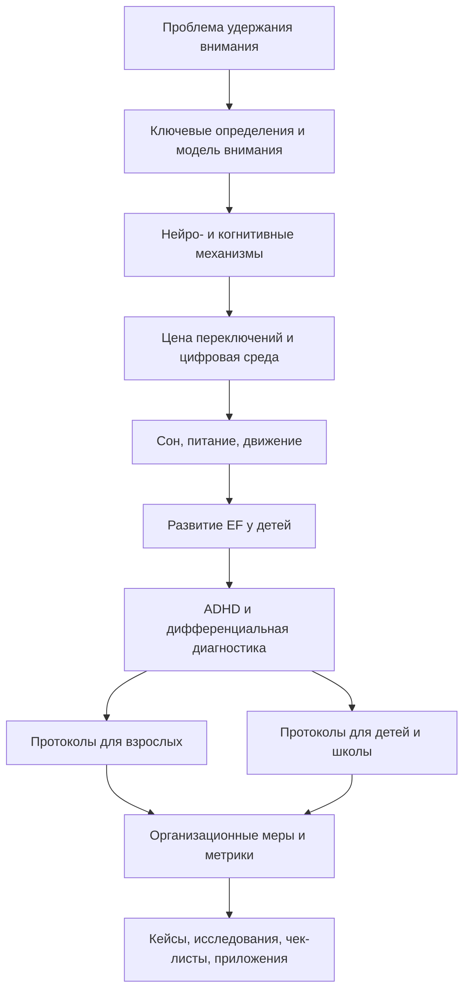
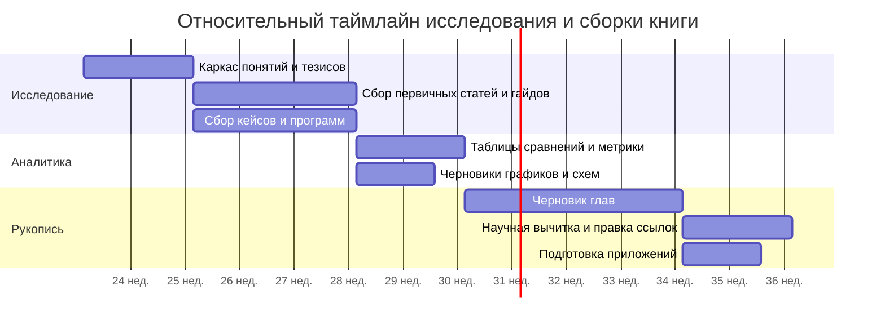

# Удержание внимания у взрослых и детей при выполнении сложной когнитивной работы

## Исполнительная сводка

Проблема удержания внимания при сложной умственной работе почти никогда не сводится к "слабой воле". На уровне механизмов обычно сочетаются как минимум пять факторов: ограниченная емкость рабочей памяти, необходимость удерживать "task set" или текущую конфигурацию задачи, неизбежная цена переключения между контекстами, накопленный недосып и внешние цифровые прерывания. Современные обзоры связывают устойчивую работу с динамикой нескольких сетей мозга, прежде всего frontoparietal, dorsal attention, ventral attention и default mode network; при переключениях люди становятся медленнее и ошибаются чаще, а незавершенные цели продолжают занимать внимание, пока не оформлены в конкретный план. citeturn17view1turn17view2turn26view0turn26view1turn38search5

Для взрослых центральная проблема обычно выглядит как перегрузка WIP, то есть слишком большого числа одновременно "открытых" контекстов, плюс высокая плотность уведомлений, почты, мессенджеров и самопрерываний. Для детей та же феноменология чаще сильнее зависит от стадии развития исполнительных функций, качества сна, внешней структуры среды, школьных требований и, в части случаев, от ADHD или состояний, которые его имитируют: тревоги, депрессии, расстройств сна, трудностей обучения, языковых нарушений, тиков, аутизма и т.д. Во всех возрастах клинически важен не сам факт отвлекаемости, а ее устойчивость во времени, выраженность, наличие в нескольких средах и функциональный ущерб. citeturn30view0turn28view0turn28view1turn28view2

Наиболее устойчиво поддержанные меры не сводятся к "тренируй силу воли". Сильнее всего данные поддерживают: достаточный и регулярный сон; уменьшение прерываний и входящих уведомлений; поведенческую и организационную структуризацию среды; у детей с ADHD - обучение родителей, поведенческие классные интервенции и организационные навыки; у взрослых с ADHD - когнитивно-поведенческие подходы, часто как дополнение к медикаментозному лечению; для детей и подростков - физическую активность с когнитивной нагрузкой. Напротив, коммерческое "тренирование рабочей памяти" уверенно дает в основном near transfer, а far transfer на реальные академические и рабочие результаты остается слабым или непоследовательным. citeturn39view0turn39view2turn35view0turn36view1turn36view3turn30view0turn30view1turn12search1turn12search8turn21search0turn21search7turn32view0turn11search5turn11search14turn11search16

Для книги сильнейшая рамка выглядит так: не "почему люди ленятся", а "как система внимания рушится под действием долгов по сну, незавершенных целей, лишнего WIP, цифровой среды, незрелых исполнительных функций и нераспознанных клинических состояний". Практическое ядро книги должно опираться не на тайм-менеджерскую риторику, а на строгие, проверяемые конструкции: снижение WIP, защищенные фокус-блоки, "парковку" новых стимулов, обязательный шлюз переключения, блок-замок против входящих прерываний, а также метрики, ориентированные на завершенные блоки и выпущенные результаты, а не на сырое "время за задачей". citeturn24search1turn24search4turn24search11turn26view0turn37search7turn25search0

## Понятийная рамка и рабочие определения

В литературе стандартизированы прежде всего понятия sustained attention, working memory, executive functions, task set и switch cost. Термины "рабочая модель", "фокус-блок", "замок блока", "парковка" и "шлюз переключения" в таком виде не являются принятыми нейрокогнитивными диагнозами или каноническими переменными. Ниже они задаются как операционные понятия, привязанные к существующим конструктам рабочей памяти, когнитивного контроля, прерываний и управления потоком работы. Это полезно именно для книги: читатель получает практический язык, но он не подменяет клиническую терминологию. citeturn17view2turn17view1turn24search1turn24search11

| Термин | Рабочее определение для книги | Опора в литературе | Статус |
|---|---|---|---|
| Удержание внимания | Способность в течение времени поддерживать актуальную цель, релевантные признаки задачи и сопротивляться внутренним и внешним интерференциям | Связь внимания и рабочей памяти; sustained attention и switch cost. citeturn17view2turn17view1turn38search5 | Стандартизированный научный конструкт |
| Рабочая модель | Краткое внутреннее и по возможности внешне зафиксированное представление текущего состояния задачи: цель, следующий шаг, ограничения, критерий завершения, "открытые петли" | Ближайшие аналоги - working memory, task set, goal state, problem state. citeturn17view2turn17view1turn26view1 | Операционное понятие отчета |
| WIP | Число начатых, но не завершенных рабочих единиц или контекстов, конкурирующих за внимание | В канбане WIP - число work items, которые started but not finished; для когнитивной работы полезен перенос как числа одновременно активных контекстов. citeturn24search1turn24search4turn24search11turn17view1 | Управленческий термин, адаптированный к когнитивной работе |
| Фокус-блок | Ограниченный по времени и условиям отрезок работы с одной явной целью, одним ожидаемым выходом и WIP = 1 | Обоснован снижением switch cost и уменьшением частоты переключений. citeturn17view1turn37search7turn37search10 | Операционное понятие отчета |
| Замок блока | Набор внешних ограничений, не позволяющих в блок "войти" новым задачам без порога срочности: отключенные уведомления, телефон вне поля досягаемости, закрытые вкладки, парковочный лист, фиксированное правило ответа | Обоснован экспериментами по уведомлениям и прерываниям. citeturn35view0turn36view1turn36view3turn37search5 | Операционное понятие отчета |
| Парковка | Быстрое вынесение новой мысли или входящей задачи во внешний список с минимальным планом возврата, чтобы не держать ее в рабочей памяти | Незавершенные цели вызывают интрузии; формирование конкретного плана снижает интерференцию. citeturn26view0turn26view1 | Практический протокол |
| Шлюз переключения | Обязательная короткая процедура перед выходом из блока: почему переключаюсь, что уже сделано, что следующий шаг, какой явный cue на возврат | Теория прерываний и goal memory показывает важность cue для последующего возобновления. citeturn17view1turn26view0turn26view1 | Практический протокол |

Ключевая идея для книги такова: внимание лучше описывать не как "ресурс без контекста", а как способность временно удерживать рабочую модель под защитой от конкурирующих целей. Из этого напрямую вытекают три прикладных тезиса: нужно снижать WIP, выносить незавершенные цели наружу и делать цену входа для новых прерываний высокой. Именно поэтому "замок блока" и "парковка" - не мотивационные трюки, а технические протоколы разгрузки рабочей памяти и уменьшения switch cost. citeturn17view2turn26view0turn26view1turn24search4

## Механизмы удержания внимания и цена переключений

Рабочая память и внимание тесно связаны: в современной трактовке рабочая память - это механизмы, которые удерживают представления, "наиболее нужные для текущей когнитивной задачи", а внимание можно рассматривать как селекцию информации и управление приоритетом обработки. Когда задача меняется, меняется и task set - конфигурация целей, правил, признаков и действий, актуальная для текущей работы. Именно необходимость перестроить этот task set и лежит в основе switch cost. citeturn17view2turn17view1

Нейрокогнитивно удержание и переключение опираются не на одну область мозга, а на паттерн взаимодействия сетей: frontoparietal network, dorsal attention network, ventral attention network и default mode network. Обзоры 2024 года подчеркивают, что flexible cognitive control возникает из динамики между сетями контроля и сетями mind-wandering, а не из "одной кнопки фокуса". Поэтому идеал непрерывного, совершенно ровного внимания в течение всего дня плох как научная и практическая модель: внимание колеблется, а задача системы - не устранить колебания полностью, а снижать их цену и ускорять возврат к рабочей модели. citeturn17view1turn16search5turn16search0

Почти любой переход между задачами несет измеримую цену. В лабораторных парадигмах ответы после переключения "существенно медленнее и обычно более ошибочны", а классические обзоры подчеркивают, что стоимость переключения уменьшается при подготовке, но не исчезает полностью; даже при предсказуемом переключении остается residual switch cost. В жизненной среде это означает не просто потерю секунд, а потерю состояния задачи, которое потом приходится реконструировать. citeturn38search5turn38search6turn38search16turn17view1

Отдельный механизм связан не с внешним уведомлением, а с "незавершенной петлей". Masicampo и Baumeister показали, что незавершенные цели вызывают intrusive thoughts во время нерелевантных задач и ухудшение выполнения на другой когнитивной работе; при этом формулирование конкретного плана "как, когда и где" устраняло или заметно снижало эти эффекты. Для книги это очень сильное основание под практику "парковки": не просто записать новую задачу, а сразу приписать ей конкретный следующий шаг и точку возврата. citeturn26view0turn26view1

Полевая работа Gloria Mark и коллег показала еще более неприятную вещь: прерывания иногда внешне ускоряют завершение эпизода работы, но ценой роста стресса, фрустрации, усилия и давления времени. То есть простое сокращение "времени на задачу" не тождественно лучшей продуктивности при сложной работе; иногда это лишь более нервная и более поверхностная форма выполнения. citeturn37search5turn18view2

Ниже - авторская реконструкция двух важных эмпирических идей. Первая показывает накопительный характер умеренного хронического недосыпания у здоровых взрослых; вторая нормирует показатели из полевого исследования прерываний к базовой линии без прерываний. Эти графики не воспроизводят издательские рисунки, а пересчитывают опубликованные результаты в более удобную для книги форму. citeturn39view0turn39view2turn39view3turn18view2


Хронический недосып - один из самых сильных и недооцененных факторов разрушения внимания. В классическом дозозависимом исследовании Van Dongen и соавт. 14 дней сна по 6 часов в сутки доводили lapses in behavioral alertness и working memory до уровня, сопоставимого с 1 ночью полной депривации сна, а 4 часа сна в сутки - до уровня, сопоставимого с 2 ночами без сна; авторы прямо заключили, что 6 часов сна и меньше могут давать дефициты, эквивалентные "до двух ночей" total sleep deprivation. Это важно для книги потому, что субъективная сонливость растет слабее, чем объективное ухудшение, и человек легко переоценивает свою "адаптацию". citeturn39view0turn39view2turn39view3

Для детей и подростков диапазоны сна выше, чем у взрослых. Консенсус AASM рекомендует детям 6-12 лет 9-12 часов сна в сутки, подросткам 13-18 лет 8-10 часов; достаточный сон связан с лучшими вниманием, поведением, когнитивным функционированием и эмоциональной регуляцией. Отдельные обзоры и мета-анализы показывают связь недостаточного сна и плохого качества сна со снижением учебной результативности, вниманием и исполнительными функциями у детей и подростков. citeturn41search0turn41search5turn41search14turn31search0turn31search11turn31search13


Цифровая среда сама по себе является вмешательством в систему внимания. Даже простое получение уведомления - без чтения сообщения - ухудшает выполнение задачи на sustained attention task; авторы Stothart и соавт. отдельно подчеркивают, что один ding или buzz уже достаточно, чтобы derail focus. В полевом эксперименте Kushlev и соавт. участники, которые неделю держали alerts on и телефон рядом, сообщали о более высоких уровнях inattentiveness и hyperactivity, чем в неделю с alerts off и телефоном вдали; inattention, в свою очередь, статистически опосредовала снижение ощущаемой продуктивности и психологического благополучия. У детей и подростков проблема добавочно усугубляется тем, что сама архитектура платформ - endless scroll, autoplay, уведомления - способна сдвигать внимание и сон; политика AAP 2026 прямо указывает на уведомления, нарушающие school or sleep. citeturn35view0turn36view1turn36view3turn36view4turn34view2

В детской популяции наиболее свежие продольные данные тоже тревожны. Исследование Nivins и соавт. на 8 324 детях показало, что среднее использование социальных сетей было связано с постепенным ростом inattention symptoms over time; эффект для отдельного ребенка мал, но авторы подчеркивают возможную значимость на уровне популяции. Важная тонкость: этот результат был специфичнее для social media, а не для video games или television/videos, и обратная причинность в анализе не получила сопоставимой поддержки. Это сильное основание для отдельной главы книги о цифровой среде как не нейтральной среде, а как архитектуре конкурирующего внимания. citeturn34view1

Влияние питания и движения на внимание и исполнительные функции реальнее всего в двух формах. Во-первых, для детей и подростков обзоры показывают положительную связь более здорового питания и лучших executive functions, особенно для более длительных паттернов питания; по завтраку результаты в целом скорее положительные, но эффект зависит от качества завтрака и выражен сильнее в группах Nutritionally at risk. Во-вторых, for children and adolescents cognitively engaging physical activity interventions дают небольшой, но статистически значимый прирост executive function в мета-анализе 2024 года, особенно по inhibitory control и working memory. Для взрослых образ жизни также рекомендуется клиническими руководствами, но как практический вывод для книги нужно прямо сказать: доказательная база strongest для сна, затем для снижения прерываний, тогда как nutrition и exercise чаще выступают как фоновые модификаторы, а не как самостоятельная замена структурирования работы или лечения ADHD. citeturn33view0turn33view3turn32view0turn28view2

## Дети, развитие исполнительных функций и дифференциальная диагностика с ADHD

Исполнительные функции не "даны" ребенку в готовом виде. Даже обзорные статьи по детскому питанию и когнитивному развитию напоминают, что executive functioning включает inhibitory control, working memory, attention и planning и что эти навыки развиваются на протяжении детства и подростничества параллельно созреванию мозга. Отсюда следует важный практический вывод: детская проблема удержания внимания чаще является проблемой незавершенного развития системы саморегуляции и нехватки внешнего каркаса, тогда как взрослая - чаще проблемой перегруженной и плохо защищенной системы. citeturn33view0turn17view1

ADHD важно обсуждать отдельно, но без диагностической инфляции. NIMH прямо указывает, что стресс, sleep disorders, anxiety, depression и другие физические состояния могут вызывать симптомы, похожие на ADHD, а потому нужен thorough evaluation. CDC и AAP подчеркивают: симптомы должны присутствовать до 12 лет, наблюдаться в двух и более средах и реально снижать качество социального, школьного или рабочего функционирования; кроме того, необходимо исключать другие объяснения и screen for co-occurring conditions, включая anxiety, depression, learning and language disorders, autism spectrum disorder, tics, sleep disorders и apnea. Для взрослых дополнительная сложность состоит в том, что диагноза недостаточно "по ощущению сейчас": нужно подтверждать детское начало симптомов, хотя проявления с возрастом часто меняются и гиперактивность может уменьшаться сильнее, чем inattentiveness. citeturn28view0turn28view1turn30view0

NICE дает полезный для книги баланс: с одной стороны, ADHD - распознаваемое и лечимое состояние у детей, подростков и взрослых; с другой - lifestyle advice не должен превращаться в псевдолечение. Руководство рекомендует подчеркивать значение balanced diet, good nutrition и regular exercise, но не советует делать elimination diet или fatty acid supplementation "общим" лечением ADHD. Для книги это удобно как критерий строгости: образ жизни важен, но не заменяет диагностику, поведенческие интервенции, школьную поддержку и, когда показано, фармакотерапию. citeturn28view2

| Область | Взрослые: типичные причины распада внимания | Дети: типичные причины распада внимания | Наиболее опорные решения для взрослых | Наиболее опорные решения для детей | Основание |
|---|---|---|---|---|---|
| Базовый механизм | Перегруженный task set, лишний WIP, самопрерывания, множественные открытые контексты | Незрелые EF, слабое удержание правил, зависимость от внешней структуры | Снижать WIP, делать фокус-блоки с одним выходом, вводить шлюз переключения | Визуальные расписания, короткие четкие инструкции, внешние опоры и совместная регуляция | citeturn17view1turn17view2turn24search1turn24search11turn33view0 |
| Сон | Хроническое ограничение сна, сменная работа, ложное чувство "адаптации" | Сон ниже возрастной нормы, нерегулярный bedtime, экран перед сном | Жесткий сон как инфраструктура когнитивной работы | Семейный режим сна, screen-off перед сном, возрастные нормы сна | citeturn39view0turn39view2turn41search0turn41search5turn41search14 |
| Цифровая среда | Почта, мессенджеры, notifications, постоянная доступность | Social media, autoplay, endless scroll, notifications, school-device distraction | Alerts off, phone away, batched mail, protected response windows | Ограничение уведомлений, возрастные правила, parental mediation, school hygiene | citeturn35view0turn36view1turn36view3turn34view1turn34view2 |
| Незавершенные цели | Множество "открытых петель" и незакрытых обещаний | Невозможность удержать в уме длинную многошаговую задачу | Парковка + конкретный план возврата | Разбивка на маленькие шаги + внешний трекинг прогресса | citeturn26view0turn26view1 |
| Дифференциальная диагностика | Стресс, anxiety, depression, sleep disorders, substance use, истинный ADHD | Sleep disorders, learning/language disorders, ASD, anxiety, tics, apnea, ADHD | Не самодиагностика по мемам, а оценка начала симптомов и функционального ущерба | Педиатрическая/психиатрическая оценка, teacher and parent reports, rating scales | citeturn28view0turn28view1turn30view0turn28view2 |
| Интервенции с лучшей применимостью | Environment design, CBT for ADHD, снижение interruptions | Parent training, behavioral classroom interventions, OST/HOPS, school supports | Индивидуальный протокол блока, блок-замок, CBT при ADHD | Родительский тренинг, classroom supports, organization skills interventions | citeturn21search0turn21search7turn30view0turn30view1turn12search1turn12search8turn22search9 |

Практический вывод для книги должен быть недвусмысленным: "быстро отвлекаюсь" не равно ADHD. Если проблема эпизодическая, возникает только в скучных или плохо структурированных задачах и резко уменьшается при хорошей среде, сне и снижении прерываний, это больше похоже на экологическую и организационную проблему внимания. Если же симптомы хронические, выраженные, были с детства, проявляются в нескольких средах и дают устойчивый функциональный ущерб, тогда раздел про ADHD и диагностику должен выводить читателя к клинической оценке, а не к очередному productivity-hack. citeturn28view0turn28view1turn30view0

## Практические интервенции, метрики и организационные меры

Если перевести литературу в рабочий протокол, ядро выглядит так: уменьшить число одновременно активных контекстов, защитить текущий блок от новых входов, вынести незавершенные цели из головы наружу, а переключение делать не по импульсу, а через обязательный короткий gate. Этот дизайн следует не из моды на "глубокую работу", а из совмещения switch-cost literature, interruption studies, goal-intrusion studies и практик WIP control. citeturn17view1turn26view0turn26view1turn24search4turn37search7

| Интервенция | Целевая группа | Синтез уровня доказательности | Что реально поддержано данными | Практическая применимость | Ограничения | Источники |
|---|---|---|---|---|---|---|
| Регулярный достаточный сон | Взрослые и дети | Высокая | Недосып ухудшает alertness, working memory, attention; у детей адекватный сон связан с лучшими attention/behavior/cognition | Очень высокая | Требует системного режима, а не разовой "компенсации" | citeturn39view0turn39view2turn41search0turn41search5 |
| Отключение уведомлений и удаление телефона | Взрослые и подростки | Умеренно-высокая | Даже notification without checking impairs attention; минимизация alert improves self-reported inattention/hyperactivity | Очень высокая | Не решает root causes сама по себе | citeturn35view0turn36view1turn36view3turn36view4 |
| Батчинг почты и windows для связи | Взрослые команды | Умеренная | Without email people multitask less, focus longer, show lower stress; interruptions increase stress even if tasks finish faster | Высокая | Часто упирается в культуру организации | citeturn37search7turn37search10turn37search5 |
| WIP-лимиты на уровне человека/команды | Взрослые команды | Умеренная как организационная экстраполяция | Limiting started-but-not-finished work improves flow and reduces context switching pressure | Высокая | Нужна дисциплина канала входа задач | citeturn24search1turn24search4turn24search11turn17view1 |
| Parent training in behavior management | Дети с ADHD, особенно младшие | Высокая | У маленьких детей parent-delivered behavior therapy first line; улучшает self-control/behavior/self-esteem | Очень высокая | Требует вовлеченных взрослых и последовательности | citeturn30view0turn30view1turn22search4turn22search5 |
| Behavioral classroom interventions | Школьники с ADHD/Off-task behavior | Высокая-умеренная | Classroom interventions reduce off-task and disruptive behavior; school is necessary part of treatment plan | Высокая | Эффект зависит от учителей и внедрения | citeturn30view0turn22search9turn22search6 |
| Organizational Skills Training, HOPS и близкие программы | Дети и подростки с ADHD | Умеренно-высокая | OST improves organizational skills; более скромные, но заметные эффекты на inattention/academic performance | Высокая | Не универсально переносится без поддержки среды | citeturn12search1turn12search8turn12search16turn12search6 |
| CBT для взрослых с ADHD | Взрослые с подтвержденным ADHD | Умеренно-высокая | Meta-analyses show reduction of core and emotional symptoms; CBT + medication often stronger than medication alone | Высокая | Требует квалифицированного терапевта; не замена диагностике | citeturn21search0turn21search7turn21search14 |
| Mindfulness-based interventions | Взрослые и дети с ADHD; общая популяция как adjunct | Умеренная у взрослых, низко-умеренная у детей | Есть сигналы пользы по core symptoms и attention, но у детей высока неоднородность и есть сомнения в стойкости follow-up effects | Средняя | Риск переобещания эффекта | citeturn13search0turn13search1turn13search6turn13search16 |
| Когнитивно нагруженная физическая активность | Дети и подростки | Умеренная | Small but significant positive effect on EF, especially inhibition and working memory | Высокая в школе/доме | Эффект не гигантский, зависит от дозы и дизайна | citeturn32view0 |
| Здоровый рацион и качественный завтрак | Прежде всего дети/подростки | Низко-умеренная | Longer-term healthier diet associates positively with EF; breakfast effects generally positive but context-dependent | Средняя | Сильная гетерогенность; не "волшебная еда для фокуса" | citeturn33view0turn33view3turn28view2 |
| Working memory training apps | Дети и взрослые | Низкая для far transfer | Надежный near transfer, слабый и нестойкий far transfer на интеллект/академию/повседневное функционирование | Средняя | Часто продается сильнее, чем поддержано данными | citeturn11search5turn11search14turn11search16 |

Ниже - короткие протоколы, которые годятся как приложение книги. Их ценность в том, что они переводят общую идею "не отвлекаться" в наблюдаемые действия. Доказательная база касается не самих названий протоколов, а механизмов, из которых они собраны: planning to reduce intrusions, reducing interruptions, cueing resumption and limiting WIP. citeturn26view0turn35view0turn36view3turn37search7

Протокол "Парковка":

```text
Новая мысль / новая задача:
Почему она сейчас пытается войти:
Следующий физический шаг:
Когда я к ней вернусь:
Нужно ли переключение прямо сейчас: да / нет
```

Протокол "Шлюз переключения":

```text
Порог переключения выполнен:
1) Внешняя срочность подтверждена? да / нет
2) Что уже сделано в текущем блоке?
3) Какой следующий шаг при возвращении?
4) Какой cue на возврат я оставляю?
5) Когда возвращаюсь?
```

Протокол "Шаблон блока":

```text
Цель блока:
Ожидаемый выход:
Допустимые материалы:
Недопустимые входы:
WIP = 1
Лист парковки рядом: да / нет
Закрывающая запись в конце блока:
```

Организационные меры должны следовать той же логике. На уровне команды это означает: явные WIP-лимиты, ожидание асинхронного ответа по умолчанию, окна коммуникации вместо постоянной реактивности, защищенные интервалы без встреч, и правила для устройств и уведомлений. На уровне семьи и школы это означает: routines, parent/teacher consistency, classroom accommodations, а не надежду, что ребенок "сам соберется". Особо важен принцип: если организация требует непрерывной реактивности, она одновременно подрывает и качество сложной когнитивной работы, и саму возможность честно измерять продуктивность. citeturn24search4turn30view0turn30view1turn37search7turn37search10

Метрики тоже нужно менять. Для сложной работы сырое "время за задачей" - слабый показатель: interrupted workers могут тратить на эпизод меньше времени, но при этом быть более перегруженными и работать более поверхностно. Поэтому для книги разумнее продвигать outcome-anchored metrics: закрытые блоки, низкий WIP, количество прерываний на блок, время до законченного результата, rework, и субъективную нагрузку по NASA-TLX. citeturn18view2turn25search0turn28view3turn24search1

| Метрика | Что измеряет | Почему полезна | Слабое место | Рекомендуемый статус в книге | Основание |
|---|---|---|---|---|---|
| Закрытые блоки | Число блоков, завершенных с заранее определенным выходом и closing note | Привязывает внимание к завершению, а не к видимости занятости | Не стандартная научная шкала; требует дисциплины определения "closed" | Основная операционная метрика | citeturn24search1turn37search5 |
| Время за задачей | Время, проведенное в приложении/документе/таске | Простой лог | Легко путает focus с pseudo-work и реактивностью | Вспомогательная, не основная | citeturn18view2turn37search5 |
| Средний WIP | Сколько контекстов started but not finished одновременно активны | Хорошо показывает перегрузку и прогнозирует switching pressure | Не отражает качество завершения | Основная системная метрика | citeturn24search1turn24search11 |
| Прерывания на блок | Внешние и внутренние входы в блок | Наиболее прямой индикатор разгерметизации блока | Нужны простые правила учета | Основная диагностическая метрика процесса | citeturn35view0turn36view3turn37search5 |
| Время до первого полноценного результата | Cycle time от старта блока до пригодного deliverable | Лучше отражает реальную knowledge-work output | Зависит от размера задачи | Основная метрика результата | citeturn24search1turn24search11 |
| Доля возвратов без потери контекста | Сколько переключений удалось пережить по resume-note без длительной реконструкции | Проверяет качество шлюза переключения | Требует простой формы resumption log | Полезная прикладная метрика | citeturn26view0turn17view1 |
| Rework / ошибки / переписывания | Цена поверхностной работы | Защищает от культа "быстрее = лучше" | Нужно заранее определить критерии качества | Обязательна для сложных текстов, кода, анализа | citeturn37search5turn18view2 |
| NASA-TLX после блока | Субъективная ментальная нагрузка по 6 шкалам | Нужен, чтобы видеть скрытую цену "успешной" скорости | Субъективен; не заменяет output-metrics | Стандартная дополнительная метрика | citeturn25search0turn28view3 |

Для детей и взрослых примеры упражнений логично выбирать не по маркетинговой привлекательности, а по уровню переноса на реальную жизнь. Для взрослых: ежедневный блок с блок-замком, паркинг-лист, weekly email batching rule, CBT-подходы к оценке времени и разбиению задач при ADHD. Для детей: visual schedule, parent training techniques, consequence-based classroom supports, organizational skills training, cognitively engaging movement, bedtime routine и, где клинически нужно, план лечения по pediatric/adult ADHD guidelines. Работающее упражнение - это упражнение, которое снижает WIP, повышает вероятность возврата к задаче и дает перенос на школу или работу, а не просто на результат в тренировочном приложении. citeturn30view0turn30view1turn12search1turn12search8turn22search9turn21search0turn11search5

## Проект книги, источники и ограничения

Исходные параметры книги, которых в запросе нет, нужно прямо пометить как не заданные. Это важно, чтобы не закладывать скрытых допущений о жанре. В текущем виде можно проектировать аналитический нон-фикшн с прикладным ядром, но метаданные пока выглядят так: целевая аудитория - не указано; издательский формат - не указано; печатный или цифровой приоритет - не указано; допустимая доля клинического материала - не указано; допустимая доля школьно-родительской практики - не указано. citeturn28view2turn30view0



Ниже - рабочая архитектура книги. Объемы даны как проектные диапазоны для строгой аналитико-прикладной версии; это не предположение о финальном издательском формате, а удобный ориентир для разработки рукописи. В колонке "Обязательные ссылки" используются коды из карты источников ниже. citeturn39view0turn17view1turn30view0turn34view1

| Глава | Примерный объем | Ключевые подпункты | Обязательные ссылки |
|---|---:|---|---|
| От чего на самом деле рушится внимание | 4 000-5 000 слов | Почему "не могу сосредоточиться" не равно одной причине; внимание как система, а не как черта характера; обзор доказательной базы | S1, S2, S3, S5, S7 |
| Язык книги и рабочие определения | 3 000-4 000 слов | Удержание внимания; рабочая модель; WIP; фокус-блок; замок блока; парковка; шлюз переключения | S2, S3, S4, S13, S18 |
| Мозг внимания и цена переключения | 5 000-6 000 слов | Task set; switch cost; DMN vs control networks; attentional residue; resumption problem | S2, S3, S4, S5, S6 |
| Сон, еда, движение и цифровая среда | 6 000-7 000 слов | Хронический недосып; детский сон; питание и завтрак; физическая активность; уведомления; социальные сети | S1, S6, S7, S8, S9, S10 |
| Детство, школа и развитие EF | 5 000-6 000 слов | Как развиваются inhibitory control, working memory и planning; зачем ребенку внешние опоры; когда школа усиливает проблему | S9, S10, S11, S12 |
| ADHD и состояния-двойники | 6 000-7 000 слов | Критерии; differential diagnosis; дети vs взрослые; сон, тревога, депрессия, learning disorders, ASD, tics, apnea | S11, S12, S13 |
| Протоколы для взрослых | 4 000-5 000 слов | Парковка, шлюз переключения, шаблон блока, block lock, batching communication, WIP-limits | S4, S5, S6, S7, S13, S18 |
| Протоколы для детей, родителей и школы | 5 000-6 000 слов | Parent training, classroom supports, OST/HOPS, movement breaks, sleep routine, school accommodations | S11, S12, S14 |
| Метрики и качество продуктивности | 3 500-4 500 слов | Закрытые блоки; cycle time; WIP; interruption rate; NASA-TLX; почему time-on-task вторичен | S5, S13, S18 |
| Кейсы и приложения | 4 000-5 000 слов | Полевые исследования; сценарии внедрения; чек-листы; шаблоны мониторинга | S1, S4, S5, S7, S14, S18 |

Чтобы исследование и написание книги не расползлось, полезно сразу разложить проект по этапам. Поскольку календарные даты в ТЗ не заданы, ниже - относительный таймлайн по неделям, а не абсолютный график. citeturn24search1turn25search0



Для книги особенно полезны следующие ключевые источники. Здесь же указан практический статус прав на использование: "OA/официальный доступ" означает, что материал открыт или официально доступен на сайте; "rights-managed/paywalled" означает, что для воспроизведения исходных таблиц и рисунков безопаснее запрашивать разрешение или делать собственные синтетические таблицы и графики. Для paywalled статей в книге лучше использовать краткие цитаты в допустимом объеме, пересказ и собственные, заново сверстанные таблицы. Это особенно актуально для AAP/Pediatrics, APA journals, Elsevier, Cambridge Core и части Wiley-материалов. citeturn17view2turn40view0turn28view2turn33view0turn26view1

| Код | Полная ссылка и аннотация | Доступ и возможный режим использования |
|---|---|---|
| S1 | Van Dongen H.P.A., Maislin G., Mullington J.M., Dinges D.F. "The cumulative cost of additional wakefulness: dose-response effects on neurobehavioral functions and sleep physiology from chronic sleep restriction and total sleep deprivation." Sleep, 2003. Ключевой первичный источник о том, что 14 дней по 6 часов сна дают дефициты уровня 1 ночи без сна, а 4 часа - уровня 2 ночей без сна. Ссылка: `https://doi.org/10.1093/sleep/26.2.117` citeturn39view0turn39view2turn39view3 | Доступ: paywalled/original rights-managed; безопасно пересказывать и строить собственные графики по опубликованным данным |
| S2 | Lee Y., Schumacher E.H. "Cognitive flexibility in and out of the laboratory: task switching, sustained attention, and mind wandering." Current Opinion in Behavioral Sciences, 2024. Сильный современный обзор по сетям контроля, task switching и внутренним колебаниям внимания. Ссылка: `https://doi.org/10.1016/j.cobeha.2024.101434` citeturn17view1 | Доступ: PDF доступен; права издателя сохраняются, лучше не копировать рисунки без разрешения |
| S3 | Oberauer K. "Working Memory and Attention - A Conceptual Analysis and Review." Journal of Cognition, 2019. Лучший теоретический источник для строгой связки между working memory, attention и task control. Ссылка: `https://doi.org/10.5334/joc.58` citeturn17view2 | Доступ: OA, CC BY 4.0; высокоудобен для аккуратного цитирования и пересборки концептуальных схем |
| S4 | Masicampo E.J., Baumeister R.F. "Consider It Done! Plan Making Can Eliminate the Cognitive Effects of Unfulfilled Goals." JPSP, 2011. Прямое основание для протоколов "парковки" и "плана возврата": незавершенные цели мешают; конкретный план снижает интерференцию. Ссылка: `https://doi.org/10.1037/a0024192` citeturn26view0 | Доступ: PDF доступен; оригинальные таблицы/рисунки лучше не копировать без проверки прав |
| S5 | Mark G., Gudith D., Klocke U. "The cost of interrupted work: More speed and stress." CHI, 2008. Полевое исследование о том, что прерывания могут ускорять завершение эпизода, но повышают стресс, effort и time pressure. Ссылка: `https://ics.uci.edu/~gmark/chi08-mark.pdf` citeturn37search5turn18view2 | Доступ: PDF доступен; очень полезен для главы о метриках и мнимой "скорости" |
| S6 | Stothart C., Mitchum A., Yehnert C. "The attentional cost of receiving a cell phone notification." JEP:HPP, 2015. Экспериментальное основание утверждать, что само уведомление уже ломает внимание. Ссылка: `https://doi.org/10.1037/xhp0000100` citeturn29search0turn35view0 | Доступ: rights-managed/paywalled; безопасно цитировать кратко и пересказывать |
| S7 | Kushlev K. et al. "Silence Your Phones: Smartphone Notifications Increase Inattention and Hyperactivity Symptoms." CHI, 2016. Важный полевой эксперимент о снижении inattention/hyperactivity при минимизации alerts. Ссылка: `https://interruptions.net/literature/Kushlev-CHI16.pdf` citeturn36view1turn36view3turn36view4 | Доступ: PDF доступен; хорошо годится для организационных и поведенческих рекомендаций |
| S8 | Nivins S. et al. "Digital Media, Genetics, and Risk for ADHD Symptoms in Children: A Longitudinal Study." Pediatrics Open Science, 2026. Ключевой новый лонгитюдный источник по связи social media use и роста inattention symptoms у детей. Ссылка: `https://publications.aap.org/pediatricsopenscience/article/2/1/1/205729` citeturn34view1 | Доступ: OA на сайте издателя; очень ценный для главы о цифровой среде |
| S9 | AAP. "Digital Ecosystems, Children, and Adolescents: Policy Statement." Pediatrics, 2026. Политико-клиническая рамка по дизайну digital ecosystem: notifications, autoplay, endless scroll, school/sleep disruption. Ссылка: `https://publications.aap.org/pediatrics/article/157/2/e2025075320/206129` citeturn34view2 | Доступ: официальный доступ; права AAP следует проверять перед воспроизведением таблиц |
| S10 | Paruthi S. et al. "Recommended Amount of Sleep for Pediatric Populations." AASM, 2016; плюс pediatric summaries AAP. Нормы сна для детей и подростков и связь со здоровьем, behavior and cognition. Ссылки: `https://pubmed.ncbi.nlm.nih.gov/27250809/` и `https://publications.aap.org/pediatrics/article/138/2/e20161601/52457` citeturn41search0turn41search5turn41search23 | Доступ: официальный/PMC; пригодны для прямого табличного цитирования с проверкой лицензии |
| S11 | CDC / AAP clinical care pages for ADHD in children. Базовый клинический каркас по критериям, коморбидности, parent training и школьным интервенциям. Ссылки: `https://www.cdc.gov/adhd/hcp/clinical-care/index.html` и `https://www.cdc.gov/adhd/treatment/behavior-therapy.html` citeturn30view0turn30view1 | Доступ: официальный; безопасная опора для книги и приложений |
| S12 | NIMH. "Attention-Deficit/Hyperactivity Disorder: What You Need to Know" и "ADHD in Adults: 4 Things to Know." Лучшие официальные краткие источники для adult ADHD, дифференциальной диагностики и признака childhood-onset. Ссылки: `https://www.nimh.nih.gov/health/publications/attention-deficit-hyperactivity-disorder-what-you-need-to-know` и `https://www.nimh.nih.gov/health/publications/adhd-in-adults-four-things-to-know` citeturn28view0turn28view1 | Доступ: официальный; годятся для прямых фактов и проверяемых формулировок |
| S13 | NICE NG87. "Attention deficit hyperactivity disorder: diagnosis and management." Руководство для детей, подростков и взрослых; полезно для разделения lifestyle advice и core treatment. Ссылка: `https://www.nice.org.uk/guidance/ng87` citeturn28view2 | Доступ: официальный PDF; действует Notice of Rights |
| S14 | Mao F. et al. "Effects of cognitively engaging physical activity interventions on executive function in children and adolescents." Frontiers in Psychology, 2024. Мета-анализ по movement interventions и EF. Ссылка: `https://doi.org/10.3389/fpsyg.2024.1454447` citeturn32view0 | Доступ: OA на Frontiers; удобный источник для главы о детских программах |
| S15 | Cohen J.F.W. et al. "The effect of healthy dietary consumption on executive cognitive functioning in children and adolescents: a systematic review." British Journal of Nutrition, 2016; и Lundqvist M. et al. review on breakfast, 2019. Ссылки: `https://doi.org/10.1017/S0007114516002877` и `https://doi.org/10.29219/fnr.v63.1618` citeturn33view0turn33view3 | Доступ: mixed; первую статью лучше использовать как пересказ, вторую - как OA review |
| S16 | Bikic A. et al. "Meta-analysis of organizational skills interventions for children and adolescents with ADHD." 2017; плюс более новые school-based reviews. Ключевой корпус по organizational skills training и academic effects. Ссылка: `https://pubmed.ncbi.nlm.nih.gov/28088557/` citeturn12search1turn12search8turn12search16 | Доступ: abstract/restricted; лучше пересказ и собственные таблицы |
| S17 | Liu C.I. et al. 2023 и Liu Y. et al. 2026 meta-analyses CBT for adult ADHD. Основа для главы о взрослых с ADHD и прикладных CBT-протоколах. Ссылки: `https://pubmed.ncbi.nlm.nih.gov/36794797/` и `https://pubmed.ncbi.nlm.nih.gov/41483880/` citeturn21search0turn21search14 | Доступ: abstract-level/rights-managed; безопасен пересказ результатов |
| S18 | NASA TLX official materials. Стандартная шкала subjective workload для приложений и главы о метриках. Ссылки: `https://www.nasa.gov/human-systems-integration-division/nasa-task-load-index-tlx/` и `https://www.nasa.gov/wp-content/uploads/2026/03/nasa-tlx-v1-0-searchable-text-and-forms.pdf` citeturn25search0turn28view3 | Доступ: официальный; почти обязательный инструмент для приложений книги |

Если делать книгу особенно строго, в приложения стоит включить не только чек-листы, но и 3 готовые рабочие формы: "Лист парковки", "Журнал фокус-блоков", "Краткая нагрузка NASA-TLX после блока". Тогда книга перестанет быть просто обзором и станет инструментом, который позволяет читателю превращать субъективное "не могу удержать внимание" в измеряемые паттерны: сколько у него WIP, сколько прерываний на блок, сколько блоков реально закрывается, и где растет hidden cost в виде workload, stress и rework. citeturn25search0turn28view3turn24search1turn37search5

Открытые вопросы и ограничения. В доказательной базе остаются слабые места, которые стоит честно обозначить в самой книге. Во-первых, для питания и части mindfulness-интервенций данные гетерогенны и часто слабее, чем это подается в популярной литературе. Во-вторых, большая часть данных о цифровой среде у детей наблюдательна, хотя качество лонгитюдных работ уже заметно выросло. В-третьих, "фокус-блок", "замок блока", "закрытый блок" и часть метрик в этом отчете - это полезные операционные конструкции, а не стандартизированные клинические термины. В-четвертых, русскоязычные авторитетные материалы удалось уверенно включить прежде всего по сну и инсомнии; для ADHD, executive functions и цифровой среды ядро доказательной базы по-прежнему дают англоязычные первичные статьи и клинические руководства. citeturn33view0turn33view3turn13search6turn13search16turn34view1turn23search3turn23search5turn23search7turn23search9
