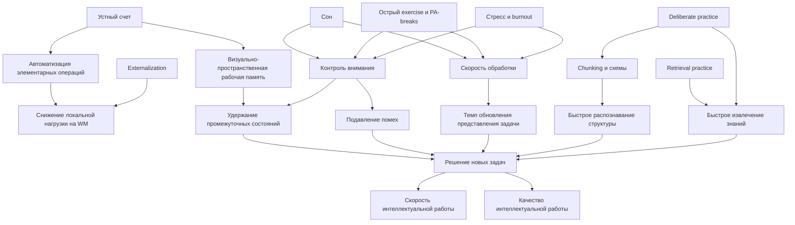

# Влияние устного счёта и смежных когнитивных навыков на скорость и качество интеллектуальной работы

## Executive summary

Короткий ответ на главный вопрос книги такой: способность и скорость устного счёта действительно связаны с общей интеллектуальной работоспособностью, но в основном как индикатор более базовых механизмов, а не как самостоятельный "двигатель" общего интеллекта. Наиболее устойчиво с качеством и скоростью решения новых задач связаны рабочая память, контроль внимания, скорость обработки информации, способность к chunking, извлечению знаний из долговременной памяти и снижению лишней когнитивной нагрузки. Скорость устного счёта коррелирует с этими механизмами и с математической компетентностью, но сама по себе не является надёжным рычагом широкого ускорения мышления в новых, плохо структурированных ситуациях. citeturn8view6turn24search0turn43search6turn38search1turn38search6

Если человек делает задачи качественно, но медленно и с большим усилием, тренировка устного счёта может дать полезный, но обычно узкий выигрыш: повысить арифметическую автоматизацию, частично снизить нагрузку на рабочую память при числовых операциях и, в некоторых форматах вроде ментального абакуса, улучшить визуально-пространственную рабочую память. Однако качественные мета-анализы и длительные РКИ не подтверждают устойчивого далёкого переноса таких тренировок на флюидный интеллект, общий reasoning или универсальное ускорение интеллектуальной работы. Иначе говоря: устный счёт полезен как один из кирпичей, но не как главный "ускоритель мозга". citeturn8view0turn22view0turn23search1turn19search3turn8view5turn40search0

Самые сильные практические рычаги для ускорения работы в новых ситуациях выглядят иначе. По сумме данных, лучший профиль вмешательств сочетает: доменно-специфическую автоматизацию элементарных операций; тренировку удержания и переключения внимания; retrieval practice для быстрого доступа к знаниям; стратегии externalization и cognitive offloading для разгрузки рабочей памяти; deliberate practice с быстрыми циклами обратной связи; режим сна без хронических провалов; короткие физические перерывы и умеренную острую физическую активность; снижение стресса и избыточного workload; а также архитектурные меры по уменьшению extraneous cognitive load в инструментах и процессах. Именно это, а не изолированная "гимнастика для ума", наиболее вероятно ускоряет решение новых задач без деградации качества. citeturn15search1turn17search2turn13search1turn12view3turn10view3turn29search0turn42search0turn31view0turn32view1

Для книги рационально занять строгую позицию:
первое, сильная связь между когнитивной скоростью и интеллектуальной продуктивностью существует;
второе, устный счёт является полезным, но ограниченным маркером и тренируемым навыком;
третье, для ускорения интеллектуальной работы в инженерных и профессиональных контекстах важнее тренировать не "счёт сам по себе", а систему из внимания, автоматизации, извлечения знаний, chunking, внешних опор и режима восстановления. citeturn24search0turn43search6turn31view0turn9search0turn9search6

## Область обзора и оценка доказательств

Этот отчёт опирается прежде всего на обзоры и мета-анализы последних 10 лет, затем на ключевые первичные исследования и РКИ, а также на современные нейронаучные и прикладные работы в образовательных, офисных, инженерных и selection/performance контекстах. В качестве приоритетных баз для полноценной книжной разработки стоит использовать PubMed, PsycINFO, Web of Science и Google Scholar; arXiv и SSRN полезны для свежих прикладных работ по software engineering и HCI, но их следует всегда перепроверять по peer-reviewed версии. Включённые здесь обзоры нередко сами делали поиск в PubMed, PsycINFO, Scopus, Web of Science и смежных базах. citeturn12view3turn22view0turn10view3

Я использую практическую шкалу доказательности:

| Уровень | Что означает |
|---|---|
| Высокий | Вторичные обзоры и мета-анализы РКИ, second-order meta-analyses, крупные мета-анализы с современными выборками |
| Средний | Хорошо спланированные РКИ, крупные лонгитюдные исследования, структурное моделирование, нейронаучные мета-анализы |
| Ограниченный | Небольшие прикладные исследования, лабораторные работы с ограниченной внешней валидностью, косвенные данные |

Ключевое ограничение поля: литература по "ускорению интеллектуальной работы в новых ситуациях" фрагментирована. Есть очень хорошие данные по рабочей памяти, вниманию, арифметике, сну, exercise, retrieval practice и burnout, но мало прямых РКИ, где конечной точкой была бы именно скорость решения новых инженерных или профессиональных задач. Поэтому для прикладных выводов приходится соединять несколько линий доказательств, а не ждать одного "универсального" исследования. citeturn8view0turn31view0turn10view3turn29search0

### Timeline ключевых сдвигов в понимании проблемы

```text
2013  Redick et al.: активный контроль + РКИ -> нет улучшения интеллекта после WM training
2016  Barner et al.: mental abacus улучшает арифметику, но не базовые когнитивные способности
2019  Wang et al.: abacus training -> арифметика + visuospatial WM, но не Raven
2019  Sala et al.: second-order meta-analysis -> near transfer мал, far transfer ~ ноль
2021  Yang et al.: retrieval practice в классах даёт устойчивый выигрыш по учебным результатам
2021  Yakobi et al.: mindfulness даёт малые эффекты на внимание и executive control, не на WM
2022  Gavelin et al.: burnout связан с малым/умеренным когнитивным дефицитом
2022  Watrin et al.: 2 года WM training -> нет переноса на интеллект
2023  Sokolowski et al.: разная нейронная архитектура retrieval и procedural arithmetic
2024  Rodas et al.: общий эффект cognitive training на WM мал; fluid intelligence не улучшается
2024  Garrett et al.: acute exercise даёт малый выигрыш в cognition
2024  Feter et al.: прерывание сидения физической активностью даёт малый острый выигрыш в cognition
2024  Mashburn et al.: attention control лучше объясняет complex multitasking work performance
2024  Sackett et al.: современная валидность GCA для job performance скромнее исторических оценок, но реальна
2025  Goettfried et al.: арифметика во взрослом возрасте опирается на domain-general и domain-specific факторы
2026  Schwarz et al.: дневные колебания сна заметно связаны со speed на следующий день
```

Источники таймлайна: citeturn40search7turn19search3turn8view5turn23search1turn15search1turn41search0turn29search0turn40search0turn36search2turn8view0turn13search1turn12view3turn31view0turn9search0turn38search1turn30search15

## Что именно связано со скоростью интеллектуальной работы

Главная линия данных такова: когда речь идёт о новых задачах без готового шаблона, на первый план выходят не быстрые арифметические рефлексы, а контроль внимания, ёмкость и устойчивость рабочей памяти, скорость обработки, а также способность быстро строить, удерживать и перестраивать внутреннее представление задачи. Мета-анализ по working memory и математическому problem solving показал устойчивую положительную связь, причём связь сильнее для "одетых" в реальный контекст задач, чем для чисто формальных, а центральный исполнительный компонент рабочей памяти связан с решением задач сильнее, чем phonological loop. Это именно тот паттерн, который и ожидается для сложной интеллектуальной работы в новых ситуациях. citeturn8view6

Теоретические и эмпирические работы последних лет также поддерживают более общую картину: индивидуальные различия в processing speed и executive attention являются важными объяснениями различий в когнитивных способностях, но скорость сама по себе не исчерпывает картину. Более того, свежая нейрогенетическая работа показывает, что когнитивная скорость и точность не тождественны ни фенотипически, ни по мозговым и генетическим коррелятам. Это важно для книги: "быстрый" и "умный" пересекаются, но не совпадают, а ускорение без падения качества почти всегда требует улучшения управления вниманием и представления задачи, а не просто форсирования темпа. citeturn24search0turn24search2turn43search6

В прикладном контексте особенно ценно исследование simulated work performance: в двух выборках молодых взрослых attention control предсказывал multitasking work performance лучше традиционных knowledge-тестов; в одной модели контроль внимания на латентном уровне объяснял около 55 процентов дисперсии multitasking ability, а добавление Wonderlic и AFQT почти не увеличивало общую объяснённую дисперсию. Во второй модели attention control полностью медиировал связь performance-based psychomotor measures с multitasking ability, тогда как AFQT и processing speed сохраняли собственный вклад. Для книги это один из сильнейших практических аргументов: в сложной многозадачной работе скорость мысли сильнее ограничена не "арифметическим мотором", а способностью удерживать фокус, подавлять помехи и координировать несколько потоков. citeturn31view0turn32view1

С другой стороны, общая когнитивная способность всё же остаётся значимым предиктором работы. В современном мета-анализе по данным XXI века средняя наблюдаемая валидность GCA для общей job performance составила около 0.16, а скорректированная около 0.22, то есть меньше классических исторических оценок, но всё ещё практическая и устойчивая. Отдельный мета-анализ показал, что эта валидность для job-specific performance существенно не снижается с накоплением опыта. Иначе говоря, когнитивные различия не "исчезают" после того, как люди освоились в работе; просто их влияние проявляется через более сложные механизмы, включая обучение, разбор новых ситуаций и качество адаптации. citeturn9search0turn11view2turn9search6turn10view2

Для арифметики это означает следующее. Взрослая арифметическая компетентность опирается как на domain-specific numerical skills, так и на domain-general механизмы вроде working memory, inhibition и processing speed. Исследования по взрослым и по всему жизненному циклу сходятся в том, что арифметический performance нельзя понимать как изолированный навык: он встроен в более общую архитектуру контроля, скорости и долгосрочных знаний. Поэтому хороший устный счёт действительно часто идёт рядом с хорошей интеллектуальной работой, но не потому, что "счёт создаёт интеллект", а потому, что оба частично питаются из общих когнитивных источников. citeturn38search1turn38search6

### Mermaid ER-диаграмма механизмов



Схема синтезирует данные о working memory, attention control, arithmetic, retrieval, externalization, sleep, stress и acute exercise. citeturn8view6turn31view0turn13search1turn12view3turn29search0turn17search2

## Что реально работает в тренировке, а что почти не переносится

Самый надёжный вывод из современных meta-analyses по cognitive training неприятен для рынка "brain hacks", но полезен для книги: near transfer есть, far transfer слаб или отсутствует. Мета-анализ Rodas et al. показал небольшой общий эффект когнитивного тренинга на working memory, SMD = 0.18, но при использовании задач оценки, похожих на тренировочные, эффект раздувался до SMD = 1.15. Улучшения fluid intelligence не обнаружено, а изменения WM не были связаны с изменениями fluid intelligence. Это очень сильный аргумент против обещаний универсального ускорения мышления через однотипные когнитивные упражнения. citeturn8view0

Second-order meta-analysis по здоровым взрослым тоже дал лишь небольшой выигрыш по working memory, SMD = 0.335, 95% CI [0.223; 0.447], причём авторы прямо отмечают, что практический эффект в реальной жизни может быть ограниченным. Важно, что этот выигрыш агрегирует разные типы вмешательств - когнитивные программы, mindfulness, физическую активность, видеоигры - и не показывает явного "чемпиона", который бы резко превосходил остальные подходы. citeturn22view0

Second-order meta-analysis Sala et al. особенно важен для архитектуры книги: скорректированный near transfer после cognitive training остаётся небольшим, а far transfer после учёта активных контролей падает практически к нулю, около g = 0.01. Это означает, что книга должна осторожно разделять три уровня результата: улучшение на тренировке, улучшение на похожих задачах и реальное ускорение reasoning в новых рабочих ситуациях. Между первым и третьим пропасть намного больше, чем обычно предполагают популярные интерпретации. citeturn23search1

Долгие РКИ и лонгитюдные интервенции усиливают этот скепсис. Двухлетнее исследование working memory training не обнаружило переноса на интеллект. Ещё раньше активный placebo-controlled RCT у молодых взрослых также не нашёл положительного переноса ни на fluid intelligence, ни на multitasking, ни на processing speed. Это не означает, что когнитивные тренировки бесполезны; это означает, что их основной выигрыш чаще всего локален и специфичен. citeturn40search0turn40search7

### Ментальный счёт и абакус

Здесь картина более интересная, но всё равно ограниченная. Трёхлетний classroom-randomized trial mental abacus instruction показал, что дети, обучавшиеся ментальному абакусу, лучше справлялись с арифметическими задачами, однако тренинг не изменил базовые когнитивные способности; дополнительно было показано, что исходные различия в spatial working memory предсказывали, кто лучше освоит абакус. Пятилетний RCT Wang et al. показал улучшения в арифметике и visuospatial working memory, сопровождавшиеся изменениями активации во фронтально-теменно-затылочных зонах, но преимуществ по Raven's Intelligence Test снова не было. То есть абакус хорошо обучает конкретному вычислительному формату и частично тянет визуально-пространственную WM, но не делает скачка в общий интеллект. citeturn19search3turn19search2turn8view5

Нейронаучно это логично. Функциональный нейроимиджинговый мета-анализ показывает, что retrieval-based arithmetic и procedural arithmetic частично пересекаются в inferior parietal regions, но для retrieval характернее левая angular gyrus, а для procedural strategies - большее вовлечение inferior frontal gyrus и superior parietal lobule. Отдельный обзор по angular gyrus усиливает вывод, что эта область особенно важна для извлечения арифметических фактов. Практический вывод: тренировка устного счёта может реально ускорять вычисление тогда, когда она переводит операции из медленного procedural режима в быстрый retrieval, но это не равнозначно общему "ускорению мышления" вне числового домена. citeturn36search2turn37search0turn37search2

### Что из смежных интервенций выглядит полезнее

Retrieval practice имеет гораздо более убедительную прикладную базу, чем классические brain training protocols. Крупный мета-анализ classroom studies показал средний эффект quizzing/test-enhanced learning порядка g = 0.499, причём более частое и более длительное использование тестирования связано с большими выгодами. Это не просто "лучше помнить"; это ускорение доступа к релевантным знаниям и снижение времени на вспоминание в реальных задачах. Именно retrieval, а не n-back, выглядит высокоприоритетным рычагом для книги про скорость интеллектуальной работы. citeturn15search1turn16search0turn15search9

Mindfulness-based interventions дают меньшие и более селективные эффекты. В мета-анализе РКИ у здоровых взрослых общий эффект был около g = 0.2, с небольшими выигрышами по attention и executive control, но без надёжного улучшения working memory. Более крупный мета-анализ 111 РКИ сообщил small-to-moderate benefits по global cognition, executive attention и некоторым executive subdomains, однако диапазон эффектов варьировал и внешний перенос в рабочую производительность прямо не доказан. Для книги это скорее инструмент стабилизации внимания и снижения помех, а не прямой "ускоритель". citeturn41search0turn41search7turn41search10

Острая физическая активность выглядит более практически полезной, чем принято считать. Байесовский мета-анализ acute exercise у молодых взрослых обнаружил небольшой положительный эффект на cognition, g = 0.13 +- 0.04, с улучшением reaction time; отдельные анализы указывали на выгоды для executive function tasks. Мета-анализ по прерыванию длительного сидения физической активностью показал острый выигрыш для cognition g = 0.17, 95% CI [0.05; 0.29], а для multiple PA bouts - g = 0.20, 95% CI [0.06; 0.35]. Для профессиональной интеллектуальной работы это означает, что короткие двигательные вставки и умеренная acute activity имеют более прямую доказательную базу, чем классический "тренажёр рабочей памяти". citeturn13search1turn13search7turn12view3

### Сравнение ключевых мета-анализов

| Направление | Главный вывод | Эффект |
|---|---|---|
| Cognitive training -> WM | Малый общий выигрыш; сильная зависимость от похожести тестов | SMD = 0.18; при похожих тестах SMD = 1.15 |
| Cognitive training -> fluid intelligence | Надёжного улучшения нет | нулевой / незначимый |
| Working-memory interventions in healthy adults | Небольшой общий выигрыш по WM, практический перенос ограничен | SMD = 0.335, 95% CI [0.223; 0.447] |
| Second-order cognitive training transfer | Near transfer малый; far transfer после активных контролей почти нулевой | near g около 0.21; far g около 0.01 |
| Retrieval practice | Устойчивый прикладной выигрыш по учебным результатам | g около 0.499 |
| Mindfulness in healthy adults | Малые эффекты на attention/executive control, не на WM | g около 0.20; attention/executive control около 0.18 |
| Acute exercise | Малый острый cognitive boost | g = 0.13 +- 0.04 |
| PA breaks interrupting sitting | Малый острый выигрыш на cognition | g = 0.17; multiple bouts g = 0.20 |

Источники таблицы: citeturn8view0turn22view0turn23search1turn15search1turn16search0turn41search0turn13search1turn12view3

### Forest-style график основных эффектов

```text
Отрицательный <----------------------- 0 -----------------------> Положительный

Burnout -> cognition                 -0.36 |====|                         (episodic memory domain)
Far transfer from cognitive training  0.01 |-|                            (practically null)
WM training -> WM overall             0.18 |==|
Mindfulness -> cognition overall      0.20 |==|
PA-breaks -> cognition                0.17 |==|      [0.05, 0.29]
Multiple PA-breaks -> cognition       0.20 |===|     [0.06, 0.35]
Healthy adult WM interventions        0.34 |====|    [0.223, 0.447]
Retrieval practice                    0.50 |======|
Training on similar WM tests          1.15 |==============|               (mostly near/same-task gain)
```

График сопоставляет эффекты разной природы и не предполагает их прямой эквивалентности по практической ценности. Он нужен как эвристика: самый крупный "эффект" часто возникает там, где измерение близко к самой тренировке; самые переносимые прикладные эффекты здесь у retrieval practice, sleep/exercise hygiene и управлении когнитивной нагрузкой, а не у узкого WM training. citeturn8view0turn22view0turn23search1turn15search1turn41search0turn12view3turn29search2

## Сон, физическая активность, стресс, externalization, chunking и timeboxed problem solving

По влиянию на повседневную когнитивную скорость сон недооценён сильнее, чем устный счёт. Реалистичное 21-дневное study design с многократным измерением processing speed показало, что внутриличностные отклонения вниз по sleep duration и субъективному sleep quality предсказывают хужее performance на следующий день. Это особенно важно для книги: не только хронический недосып, но и обычные "провальные ночи" реально замедляют скорость интеллектуальной обработки. citeturn8view4turn30search15

Стресс и burnout также не просто ухудшают самочувствие, а бьют по когнитивной эффективности. Систематический обзор влияния рабочих факторов на когнитивные функции показал устойчиво неблагоприятные эффекты shift work, occupational stress и, вероятно, prolonged working hours. Метa-анализ по clinical burnout обнаружил малое, но статистически значимое снижение общего cognitive performance, а в доменных анализах - малые и умеренные дефициты, включая episodic memory около g = -0.36. Для книги это важнейший тезис: часть "медленности" коллег может быть не чертой интеллекта, а функцией нагрузки, сна и истощения. citeturn10view3turn11view0turn11view1turn29search0turn29search2

В прикладной среде, особенно офисной, краткие и систематические micro-breaks выглядят разумным компромиссом. Мета-анализ по micro-breaks показывает улучшение благополучия и смешанные, но нередко положительные эффекты на performance; новые работы по cognitive tasks и рабочим дневниковым данным указывают, что регулярные короткие перерывы помогают стабилизировать концентрацию и снижают усталость. Эти данные слабее, чем для сна и retrieval practice, но ощутимо практичнее, чем для brain training. citeturn42search1turn42search0turn42search11

Externalization и cognitive offloading имеют сильную теоретическую и растущую эмпирическую поддержку. Исследование математического problem solving показало, что возможность offload информации помогала learners с более низкой working memory capacity лучше справляться с задачами. Для инженерной и аналитической работы это переводится в очень конкретные техники: черновики, схемы, таблицы состояний, decision logs, визуальные модели, issue trees, тесты и промежуточные фиксации. Они ускоряют мышление не "магией", а тем, что освобождают рабочую память для поиска и проверки гипотез. citeturn17search2turn17search5

Данные по chunking и expert scaffolding согласуются с опытом сильных специалистов. Scoping review по expert scaffolding в visual problem solving описывает scaffolding как регулирование потока информации в рабочей памяти через cueing и chunking. В инженерном обучении и collaborative programming структурированное scaffolding снижает cognitive load и улучшает problem-solving. Это прямая опора для книги: скорость эксперта во многом рождается не из "врождённой быстроты", а из более крупных смысловых блоков и лучших внешних подсказок для распознавания структуры задачи. citeturn10view5turn25search0turn25search9

Что касается timeboxed problem solving, прямых высококачественных РКИ именно по timeboxing как методу индивидуального reasoning мало. Поэтому здесь степень доказательности ограниченная. Косвенные данные говорят, что time pressure обычно ускоряет скорость, но ухудшает accuracy в cognitive tasks; одновременно организационные данные по innovation performance допускают нелинейный эффект, где умеренное давление иногда помогает, а чрезмерное - вредит. Практический вывод для книги должен быть осторожным: timeboxing полезен не как "ускоритель любой ценой", а как инструмент против бессрочного блуждания, если он сочетается с checkpoint review, явной фиксацией гипотез и правом выйти из ложной ветки. citeturn28search11turn28search8turn28search2turn28search5

## Предлагаемая структура книги

Ниже структура из 12 глав. Она рассчитана на русскоязычного автора, который хочет одновременно научную строгость и практическую применимость. Списки источников в ячейках обозначены кратко по автору и году; полные приоритетные записи приведены в заключительной библиографии. Базовый корпус для всех глав: Rodas 2024, Syed 2024, Sala et al. 2019, Sokolowski et al. 2023, Mashburn et al. 2024, Sackett et al. 2024, Yang et al. 2021, Garrett 2024, Feter 2024, Gavelin 2022, Bufano et al. 2024. citeturn8view0turn22view0turn23search1turn36search2turn31view0turn9search0turn15search1turn13search1turn12view3turn29search0turn10view3

| Глава | Краткое содержание | Ключевые источники | Упражнения и интервенции | Ожидаемый эффект | Целевая аудитория |
|---|---|---|---|---|---|
| Устный счёт как маркер, а не миф | Что на самом деле измеряет быстрый счёт и где он переоценивается | Goettfried 2025; Avcil 2025; Sokolowski 2023; Rodas 2024; Mashburn 2024 | Базовый числовой скрининг, self-assessment effort log | Корректная диагностика узких мест | Все |
| Скорость, внимание и рабочая память | Почему новые задачи зависят от executive attention и WM сильнее, чем от зубрёжки | Mashburn 2023; Mashburn 2024; Frontiers WM-MPS 2023; Rodas 2024; Syed 2024 | n-back как диагностика, not main therapy; antisaccade-like attention drills; distraction blocking | Небольшой прямой прирост, сильный диагностический выигрыш | Разработчики, аналитики |
| Нейронаука арифметики | Retrieval vs procedural arithmetic; angular gyrus; frontoparietal control | Sokolowski 2023; angular gyrus review 2023; Wang 2019; Barner 2016; Grabner 2007 | Факт-ретривал, процедурная декомпозиция, verbal-free and visuospatial variants | Ускорение числовых операций и снижение effort | Аналитики, инженеры |
| Почему brain training редко делает вас "умнее" | Near transfer, bias, lack of far transfer | Rodas 2024; Syed 2024; Sala 2019; Watrin 2022; Redick 2013 | Ограниченное использование WM drills; жёсткий active-control mindset | Защита от ложных ожиданий | Все |
| Что действительно ускоряет доступ к знаниям | Retrieval practice, spaced retrieval, pattern libraries | Yang 2021; Xu 2024; Opitz 2024; Agarwal 2021 review; STEM spaced retrieval 2024 | Closed-book recall; problem flashcards; architect decision recall | Средний прикладной выигрыш в доступности знаний | Все |
| Chunking, схемы и expertise | Как опыт превращается в скорость | van Nooijen 2024; Ding 2024; Ericsson 2019; Gonçales 2021; Fakhoury 2020 | Worked examples, reverse engineering of expert traces, pattern notebooks | Ускорение распознавания структуры | Разработчики, аналитики |
| Externalization как ускоритель мышления | Почему черновики и диаграммы ускоряют, а не тормозят | Medrano 2025 offloading; cognitive offloading literature; software cognitive load mapping; code visualization studies | Issue trees, state tables, architecture sketches, decision logs | Снижение WM load, меньше тупиков | Разработчики, менеджеры |
| Сон, стресс, fatigue | Биологические лимиты темпа и качества | Schwarz 2026; Gavelin 2022; Bufano 2024; Mahdavi 2024; Fan 2020 | Sleep regularity, deep-work slots after good sleep, stress audit | Часто заметный выигрыш в daily speed | Все |
| Движение и micro-breaks | Острые, а не только долгосрочные эффекты активности | Garrett 2024; Feter 2024; Albulescu 2022; Dianita 2024 | 5-10 мин ходьбы, 2-3 мин movement breaks, pre-meeting activation | Малый, но надёжный острый boost | Все |
| Timeboxing без самообмана | Когда ограничение времени помогает, а когда ломает точность | Time pressure meta-analysis 2007; Wu 2022; Song 2023; workplace time studies | 25-45 мин hypothesis sprint, forced stop-point, rebuttal review | Помогает бороться с блужданием; риск избыточной поспешности | Разработчики, менеджеры |
| Профессиональная скорость в инженерной работе | Code comprehension, multitasking, cognitive load | Mashburn 2024; Gonçales 2021; Fucci 2019; Fakhoury 2020; Shin 2024 | refactoring for readability, interrupt budgets, complexity journals | Быстрее onboarding, fewer context switches | Разработчики |
| Личный протокол ускорения мышления | Как собрать систему тренировки без нейромифов | Все основные обзоры и РКИ отчёта | 12-week protocol, weekly metrics, retrospective | Реальный перенос на работу | Все |

Ожидаемый эффект по главам не следует понимать как гарантированный клинический outcome; это ориентиры по вероятности практического переноса, основанные на совокупности доказательств. citeturn8view0turn12view3turn15search1turn31view0

## Практическое приложение и 12-недельные планы

Ниже три протокола. Все они построены на одном принципе: не тратить большую часть времени на "тренажёры рабочей памяти", а сочетать небольшую дозу устного счёта и attention drills с retrieval practice, externalization, chunking, sleep discipline и короткими exercise-breaks. Это соответствует текущему балансу доказательств. citeturn8view0turn22view0turn15search1turn12view3turn30search15

### Общие метрики

| Метрика | Как мерить | Частота |
|---|---|---|
| Время до первой рабочей гипотезы | минуты до первой проверяемой схемы решения новой задачи | 2-3 раза в неделю |
| Время решения новой задачи | time-to-first-correct-solution или time-to-stable-solution | еженедельно |
| Число переключений контекста | interruptions/context switches на deep-work блок | ежедневно |
| Ошибки от перегруза | missed constraints, arithmetic slips, forgotten steps | ежедневно |
| Скорость retrieval | closed-book recall of ключевых паттернов, формул, API, фактов | 2 раза в неделю |
| Сон | длительность, regularity, self-rated quality | ежедневно |
| Subjective effort | шкала 1-10 после сложного блока | ежедневно |

### Профиль разработчик-инженер

Цель: ускорить разбор новых кодовых баз, архитектурных решений и ill-structured задач.

| Недели | Основной акцент | Практика |
|---|---|---|
| Первые недели | Диагностика и разгрузка WM | 10 мин устного счёта 3 раза в неделю; 15 мин retrieval по архитектурным паттернам; обязательный architecture scratchpad при любой новой задаче; 5-мин walk break после 50-60 мин deep work |
| Средние недели | Chunking и code comprehension | 3 сессии в неделю: reverse engineering чужого модуля с issue tree; refactor-for-readability; closed-book recall по системным инвариантам |
| Поздние недели | Перенос на реальные задачи | 2 timeboxed hypothesis sprints по 30-40 мин в неделю с postmortem; 1 симуляция незнакомой задачи; review логов контекстных переключений |
| Финальные недели | Стабилизация и ретроспектива | Снижение счётных drill до 1-2 раз в неделю; фокус на sleep, interrupt hygiene, externalization by default |

Ожидаемые реалистичные улучшения: более быстрое построение задачи, меньше тупиков из-за перегруза, умеренное сокращение времени на новые инженерные задачи; наибольший выигрыш обычно идёт не от арифметики, а от externalization, retrieval и снижения extraneous cognitive load. Это согласуется с данными по multitasking performance, software cognitive load и offloading. citeturn31view0turn32view1turn26search7turn17search2

### Профиль аналитик

Цель: ускорить работу с числами, моделями, гипотезами и отчётами.

| Недели | Основной акцент | Практика |
|---|---|---|
| Первые недели | Арифметическая автоматизация | 15 мин устного счёта и estimation drills 4 раза в неделю; retrieval ключевых формул и бизнес-правил; error log по вычислительным промахам |
| Средние недели | Связка числа плюс reasoning | word-problem transformation drills; табличная externalization всех ограничений; 2 сессии closed-book explanation of model logic |
| Поздние недели | Скорость в новых кейсах | 2 case sprints в неделю по 35 мин с forced assumptions list; post-hoc review качества гипотез и допущений |
| Финальные недели | Daily performance hygiene | приоритет сна, PA-breaks, снижение перегрузки встречами, предподготовка retrieval cards |

Ожидаемые улучшения: заметное ускорение в числовой рутине и умеренный перенос на аналитические задачи, если считать не изолированно, а в связке с retrieval и представлением задачи. По данным abacus/mental arithmetic ждать большого скачка в общем интеллекте не стоит. citeturn19search3turn8view5turn15search1turn12view3

### Профиль менеджер

Цель: ускорить разбор сложных ситуаций, решений, рисков и коммуникации.

| Недели | Основной акцент | Практика |
|---|---|---|
| Первые недели | Attention control и workload hygiene | календарный аудит нагрузки; 2 ежедневных окна без уведомлений; 10 мин closed-book recall по текущим приоритетам и рискам |
| Средние недели | Externalization управленческих задач | risk matrix, decision log, stakeholder map, premortem checklist |
| Поздние недели | Timeboxed decision cycles | 20-30 мин problem framing; 10 мин alternative generation; 10 мин rebuttal; отсрочка финального решения до review при высоком stakes |
| Финальные недели | Сон, stress, micro-breaks | meeting spacing, walk-and-think blocks, fatigue flags для решений после плохого сна |

Ожидаемые улучшения: меньше "вязкости" мышления, быстреее формирование качественных решений, меньше ошибок от overload. Для менеджеров целенаправленная тренировка устного счёта вторична; внимание, retrieval и externalization гораздо важнее. citeturn29search0turn10view3turn30search15turn42search1

## Пробелы литературы и приоритетная библиография

Главные пробелы в литературе таковы. Во-первых, почти нет больших РКИ, где конечной точкой была бы скорость решения реально новых профессиональных задач, а не performance на лабораторных proxy tasks. Во-вторых, очень мало работ, которые напрямую сравнивают разные "ускорители" - например, устный счёт против retrieval practice, или n-back против externalization. В-третьих, engineering и software-полевые исследования пока богаты на cognitive load measures, но бедны на долгие интервенции с бизнес-метриками. В-четвёртых, timeboxing и offloading обсуждаются практиками постоянно, но доказательная база тут всё ещё заметно слабее, чем по sleep, exercise и retrieval. citeturn26search7turn31view0turn28search11turn17search2

Для будущих исследований книги стоило бы продвигать три дизайна. Первый: multi-arm RCT у knowledge workers, где сравниваются устный счёт, retrieval practice, externalization training и комбинированный протокол по скорости решения новых кейсов. Второй: интенсивные within-person designs, где ежедневно измеряются sleep, workload, PA-breaks, attention state и performance на "микрозадачах" рабочего дня. Третий: инженерные полевые эксперименты, где меняют архитектуру рабочего пространства - количество уведомлений, формат документации, визуальные схемы, chunked code review - и смотрят на time-to-comprehension и error rate. citeturn8view4turn12view3turn26search0turn27search1

### Приоритетная библиография

Ниже не полный, а приоритетный корпус для книги. Там, где точные N или effect sizes не были доступны в просмотренном сниппете, это честно отмечено.

| Авторы | Год | Журнал | Дизайн | N | Основные результаты | Effect sizes | Ссылка |
|---|---|---|---|---|---|---|---|
| Rodas et al. | 2024 | Journal of Cognitive Enhancement | Мета-анализ | 52 независимых сравнений | Малый общий эффект на WM; fluid intelligence не улучшается; сильный bias при похожих тестах | WM SMD = 0.18; similar-task SMD = 1.15 | citeturn8view0 |
| Syed et al. | 2024 | Journal of Intelligence | Second-order meta-analysis | 6 мета-анализов РКИ | У здоровых взрослых возможен малый выигрыш по WM; реальный перенос ограничен | SMD = 0.335, 95% CI [0.223; 0.447] | citeturn22view0 |
| Sala et al. | 2019 | Collabra Psychology | Second-order meta-analysis | Несколько десятков мета-анализов | Near transfer мал; far transfer почти нулевой после активных контролей | near около g = 0.21; far около g = 0.01 | citeturn23search1 |
| Yang et al. | 2021 | Psychological Bulletin | Систематический обзор и мета-анализ | 573 classroom experiments; 839 assessments | Quizzing/test-enhanced learning устойчиво улучшает учебные результаты | g = 0.499 | citeturn15search1turn16search0 |
| Xu et al. | 2024 | Medical Science Educator | Systematic review | не указан в сниппете | Active recall связан с higher achievement и self-efficacy | не указан | citeturn14search0 |
| Garrett et al. | 2024 | Communications Psychology | Систематический обзор и Bayesian meta-analysis | 113 studies; 651 effect sizes; 4,390 participants | Acute exercise даёт малый положительный эффект на cognition и ускоряет RT | g = 0.13 +- 0.04 | citeturn13search1 |
| Feter et al. | 2024 | British Journal of Sports Medicine | Systematic review and meta-analysis of RCTs | 25 RCTs; n = 1,289 | Interrupting sedentary time with PA acutely improves cognition; chronic evidence inconclusive | g = 0.17 [0.05; 0.29]; multiple bouts g = 0.20 [0.06; 0.35] | citeturn12view3 |
| Yakobi et al. | 2021 | Cognitive Therapy and Research | Мета-анализ РКИ | 27 RCTs; N = 1,632 | Малые эффекты mindfulness на attention и executive control; не на WM | overall g = 0.2; attention/executive control g = 0.18 | citeturn41search0turn41search7 |
| Zainal et al. | 2024 | Psychological Bulletin | Мета-анализ РКИ | 111 RCTs; n = 9,538 | Mindfulness даёт small-to-moderate gains по global cognition и нескольким subdomains | g = 0.257-0.643 vs no-treatment; 0.192-0.394 vs active controls | citeturn41search10 |
| Barner et al. | 2016 | Child Development | Classroom-randomized trial | 204 children | Mental abacus improves arithmetic; no change in basic cognitive abilities/WM as general mechanism | не указан в сниппете | citeturn19search3turn19search2 |
| Wang et al. | 2019 | Journal of Neuroscience | RCT + fMRI | 144 children; fMRI subset 64 | Abacus training improves arithmetic and visuospatial WM, but not Raven; neural changes in frontal/parietal/occipital areas | correlations up to r = 0.56 within AMC group; no Raven gain | citeturn8view5 |
| Watrin et al. | 2022 | JEP: Learning, Memory, and Cognition | Longitudinal intervention | 112 training + 113 controls | Двухлетний WM training не дал переноса на intelligence | no transfer | citeturn40search0turn40search1 |
| Redick et al. | 2013 | Journal of Experimental Psychology: General | Randomized, placebo-controlled study | не указан в сниппете | Нет улучшения fluid intelligence, multitasking, WM capacity beyond trained tasks | no positive transfer | citeturn40search7turn40search11 |
| Sokolowski et al. | 2023 | Human Brain Mapping | Functional neuroimaging meta-analysis | retrieval n = 18; procedural n = 19 | Retrieval и procedural arithmetic имеют разные neural signatures | qualitative neural dissociation | citeturn36search2turn37search2 |
| Sokolowski et al. | 2023 | Brain Structure and Function | Literature review | n/a | Angular gyrus особенно важна для arithmetic fact retrieval | qualitative | citeturn37search0 |
| Mashburn et al. | 2024 | Intelligence | Два прикладных исследования с latent modeling | Study 1 N = 474; Study 2 N = 321 | Attention control better predicts simulated work multitasking than knowledge tests; large practical relevance | attention control explained 55% latent variance in multitasking in one model; beta = 0.70 in full SEM | citeturn31view0turn32view1 |
| Sackett et al. | 2024 | Journal of Applied Psychology | Мета-анализ | 153 samples; N = 40,740 | GCA remains related to job performance, but effect smaller than classic estimates | observed r = 0.16; corrected r = 0.22 | citeturn9search0turn11view2 |
| Hambrick et al. | 2024 | Journal of Applied Psychology | Мета-анализ | N = 10,088 | Validity of GCA for job-specific performance stable across job experience | near-zero interaction with job experience | citeturn9search6 |
| Frontiers WM-MPS meta-analysis | 2023 | Frontiers in Psychology | Three-level meta-analysis | не указан в сниппете | WM positively related to mathematical problem solving; strongest for central executive and realistic problems | dressed-up problems r = 0.309; central executive r = 0.303 | citeturn8view6 |
| Goettfried et al. | 2025 | European Journal of Investigation in Health, Psychology and Education | Observational adult study | dataset 134 adults | Adult arithmetic depends on domain-general and domain-specific factors | не указан в сниппете | citeturn38search1turn7search8 |
| Bufano et al. | 2024 | Frontiers in Psychology | Systematic review | 64 studies | Shift work, occupational stress and likely long hours harm cognition; expertise effects heterogeneous | qualitative | citeturn10view3turn11view1 |
| Gavelin et al. | 2022 | Work & Stress | Systematic review and meta-analysis | 17 studies; 176 effect sizes | Clinical burnout associated with small overall cognitive impairment; domain deficits small to moderate | episodic memory g = -0.36; overall small significant effect | citeturn29search0turn29search2 |
| Schwarz et al. | 2026 | Sleep | Intensive longitudinal study | 158 young + 168 older adults | Shorter-than-usual sleep and poorer sleep quality predict worse next-day processing speed | significant within-person effects; exact beta not in snippet | citeturn8view4turn30search15 |
| Albulescu et al. | 2022 | PLOS ONE | Systematic review and meta-analysis | не указан в сниппете | Micro-breaks improve well-being and могут поддерживать performance, особенно при recovery от strain | overall effects not extracted here | citeturn42search1 |
| Dianita et al. | 2024 | Discover Psychology | Experimental study | не указан в сниппете | Systematic micro-breaks support concentration stability during cognitive comparisons | qualitative / quantitative support | citeturn42search0 |
| Medrano et al. | 2025 | British Journal of Educational Psychology | Primary study | sample size not recovered from snippet | Offloading helps lower-WM learners in math problem solving | not recovered | citeturn17search2turn17search5 |
| van Nooijen et al. | 2024 | Educational Psychology Review | Scoping review | 18 studies from 6,533 screened | Expert scaffolding works through cueing and chunking to regulate WM load | qualitative | citeturn10view5turn33search5 |
| Gonçales et al. | 2021 | Information and Software Technology | Systematic mapping study | 33 primary studies | In software engineering cognitive load is central for comprehension; better load measures may outperform raw completion time | qualitative | citeturn5search3turn26search7 |
| Fakhoury et al. | 2020 | Empirical Software Engineering | Experimental study | not recovered | Lexical inconsistencies in code significantly increase developers' cognitive load | significance reported; precise ES not recovered | citeturn27search1 |
| Shin et al. | 2024 | Education and Information Technologies | Randomized collaborative programming study | 110 participants | Scaffolding reduces cognitive load and improves problem-solving in programming | precise ES not recovered | citeturn25search0 |

### Итоговая позиция для книги

Строгая формулировка, которая лучше всего выдерживает текущие данные, звучит так: быстрый устный счёт полезен как частный индикатор автоматизации, рабочей памяти и числового retrieval, но его тренировка редко даёт широкий перенос на флюидный интеллект и скорость решения новых профессиональных задач. Если цель - реально ускорить интеллектуальную работу в новых ситуациях, более оправдано тренировать систему, а не один навык: attention control, retrieval practice, chunking, externalization, sleep regularity, exercise-breaks и deliberate practice в целевом домене. Именно эта комбинация сегодня имеет наилучшее отношение "доказательность/практическая полезность". citeturn8view0turn23search1turn31view0turn15search1turn12view3turn8view4
