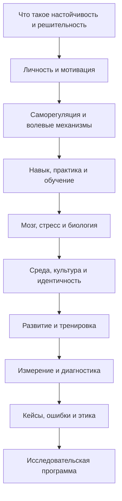
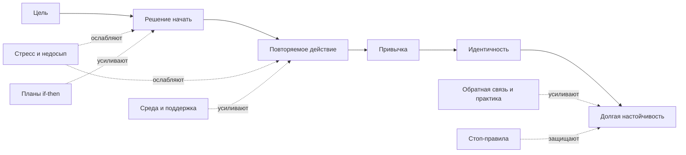

# Настойчивость и решительность

Executive summary

Настойчивость и решительность лучше понимать не как "силу характера вообще", а как результат взаимодействия нескольких слоев психики и среды: личностных предрасположенностей вроде добросовестности и самоконтроля, качества мотивации, чувства самоэффективности, навыков саморегуляции, конкретных волевых инструментов вроде if-then-планов, структуры среды, идентичности и биологических ограничений мозга под стрессом. Современная литература показывает, что устойчивое продвижение к долгим целям обычно объясняется не одним фактором, а композицией: добросовестность и самоконтроль дают базовую надежность, автономная мотивация и самоэффективность поддерживают энергию, implementation intentions переводят намерение в действие, deliberate practice конвертирует усилие в рост навыка, а среда и идентичность уменьшают "цену воли". При этом популярная идея, что "успеха добиваются не образованные, а настойчивые", слишком груба: настойчивость действительно один из сильнейших некогнитивных предикторов результата, но ее эффект складывается с интеллектом, качеством обучения, возможностями среды, обратной связью и здоровьем. citeturn15search21turn15search0turn44search0turn39view0turn33view6turn37search0turn43search21

Главный практический вывод такой: настойчивость развивается не столько через "мобилизацию", сколько через архитектуру поведения. Самые надежные способы усилить ее - выбирать цели, которые переживаются как свои, поднимать самоэффективность через маленькие подтвержденные победы, заранее связывать ситуации с действиями, превращать повторяемые действия в привычки, учиться deliberate practice вместо тупого повторения, защищать префронтальные функции сном, физической активностью и снижением хронического стресса, а также вводить стоп-правила, чтобы настойчивость не вырождалась в упрямство, перфекционизм и выгорание. Исследования также показывают, что решительность - это не просто "быстро решать", а сочетание своевременного выбора, низкой руминации, способности начинать действие и готовности корректировать курс при новых данных. Именно поэтому хорошие модели решительности ближе к action orientation и low indecisiveness, чем к импульсивности. citeturn10search0turn42search11turn42search10turn37search0turn29search0turn23search0turn23search1turn24search18turn9search0turn26search2turn27search2turn26search1

## Ключевой синтез

Если собрать классические и современные модели в одну карту, получится следующая логика: настойчивость возникает там, где человек одновременно "хочет", "верит, что может", "умеет запускать действие", "получает обратную связь" и "не разрушает себя в процессе". Добросовестность и самоконтроль дают общую надежность поведения; grit добавляет компонент долговременного удержания цели, но его полезность в основном несет подфактор perseverance of effort, а не consistency of interest; самоопределенная мотивация задает качество энергии; self-efficacy определяет, начнет ли человек действовать, сколько вложит усилий и как долго продержится; implementation intentions связывают намерение с ситуационным триггером; deliberate practice делает усилие продуктивным; а привычки, поддерживающая среда и идентичность уменьшают зависимость от "чистой силы воли". citeturn15search21turn44search0turn34search3turn34search2turn10search7turn39view0turn46search9turn42search11turn42search10turn37search0turn22search2turn43search21turn29search0turn10search0

Важно и обратное: настойчивость не тождественна ценности любой ценой. Качественная настойчивость гибка, а плохая настойчивость ригидна. Новые инструменты измерения persistence прямо различают flexible persistence и rigid persistence; первая связана с гармоничной вовлеченностью и самоэффективностью, вторая - с более обсессивной формой привязанности к деятельности. Это один из самых полезных современных поворотов темы, потому что он позволяет отделить зрелую волю от истощающего зацикливания. citeturn36search2turn36search11

```mermaid
flowchart LR
A[Личностная база<br/>добросовестность<br/>самоконтроль] --> B[Качество мотивации<br/>автономия<br/>смысл<br/>интерес]
B --> C[Самоэффективность<br/>я могу]
C --> D[Волевой перевод<br/>цели<br/>if-then планы<br/>action orientation]
D --> E[Практика<br/>обратная связь<br/>deliberate practice]
E --> F[Результат<br/>прогресс<br/>удержание курса]
G[Среда<br/>сон<br/>стресс<br/>поддержка<br/>SES<br/>культура] --> A
G --> B
G --> D
H[Идентичность<br/>"я из тех, кто..."] --> B
H --> D
I[Стоп-правила<br/>пересмотр<br/>анти-выгорание] --> F
```

Из этого следует трезвая формула для исходного тезиса пользователя. Не "образование против настойчивости", а: образование, способности и практика без настойчивости часто не конвертируются в длинный цикл достижения; настойчивость без навыка, поддержки, обратной связи и корректировки курса часто превращается в бесплодное перенапряжение. Лучшие данные по академическим и профессиональным исходам показывают, что добросовестность - один из сильнейших некогнитивных предикторов результата, но не единственный и не магический; ее вклад идет поверх когнитивных способностей, а не вместо них. citeturn44search0turn44search7turn15search0turn15search3turn43search21

## Каркас книги

Ниже - проект книги, который можно разворачивать в полноценную монографию. Он построен так, чтобы сначала определить феномен, затем пройти от личности и мотивации к нейробиологии и среде, потом перейти к программам развития, измерению, кейсам, рискам и исследованиям. Логика глав опирается на классические работы по goal setting, self-efficacy, SDT, executive functions, grit, а также на современные мета-анализы по самоконтролю, deliberate practice, habit formation и burnout. citeturn7search0turn46search9turn10search7turn14search4turn12search0turn33view6turn43search21turn10search1turn13search1



| Глава | Объемная аннотация | Опорные источники |
|---|---|---|
| Введение | Глава задает рабочие определения. Нужно развести настойчивость, решительность, самоконтроль, grit, resilience, hardiness, conscientiousness и упрямство. Центральная идея: это не одна черта, а функциональная система целеудержания и запуска действия. | citeturn34search3turn15search21turn14search4turn26search2turn26search1 |
| Личностный фундамент | Здесь разбираются добросовестность, самоконтроль, grit и их перекрытия. Глава показывает, что добросовестность - более широкий и надежный "зонтичный" фактор, а grit полезен прежде всего через компонент perseverence of effort. Отдельно нужен разбор того, как trait-level различия задают стартовые издержки усилия. | citeturn15search21turn15search0turn44search0turn34search2turn12search0turn12search1 |
| Мотивация и качество энергии | Эта глава отвечает на вопрос, почему одни умеют долго работать без внутреннего распада, а другие быстро истощаются. Базовый тезис SDT: автономная мотивация лучше поддерживает настойчивость и благополучие, чем контролируемая. Внутри главы нужно связать автономию, компетентность, связанность и self-efficacy. | citeturn10search7turn39view0turn46search9turn12search2turn33view5 |
| Саморегуляция и волевой перевод | Глава о том, как намерение превращается в действие. В центре - goal setting, implementation intentions, mental contrasting, action orientation, привычки и борьба с intention-behavior gap. Это "инженерная" глава книги. | citeturn7search0turn37search1turn42search11turn42search10turn37search0turn10search9turn27search2 |
| Практика и наращивание мастерства | Здесь показывается, что настойчивость эффективна только тогда, когда усилие устроено как deliberate practice, а не как бессистемная загрузка. Глава должна развести количество усилия и качество усилия, а также показать роль обратной связи, сложности задач и целевых микроциклов. | citeturn22search2turn43search21turn43search1turn7search0 |
| Нейробиология воли и истощения | В этой главе нужно показать роль префронтальной коры, исполнительных функций, reward circuitry, стрессовых сигнальных путей и сна. Главное сообщение: "воля" - не мистическая субстанция, а функция нейросетей, сильно зависящая от нагрузки, тревоги, сна, дофаминовой оценки ценности и переключения между goal-directed и habitual control. | citeturn8search0turn14search4turn9search0turn9search6turn9search8turn24search18 |
| Среда, идентичность и социальная архитектура | Эта глава показывает, почему упорство нельзя считать сугубо внутренним качеством. Социальный класс, культура, поддержка, учителя, семья, цифровая среда и identity-based valuation могут облегчать или удорожать реализацию целей. | citeturn10search0turn11search3turn24search7turn25search6turn25search3turn24search2 |
| Развитие в детстве и подростковом возрасте | Здесь нужно разобрать, как саморегуляция развивается с ранних лет и почему она предсказывает учебные, социальные и поведенческие исходы спустя годы. Важный фокус - что именно можно тренировать у детей, родителей и школ. | citeturn45search2turn25search1turn25search7turn25search6 |
| Измерение и психометрика | Глава описывает существующие шкалы: grit, self-control, self-efficacy, conscientiousness, action orientation, indecisiveness, habit automaticity, burnout и новые шкалы persistence. Она объясняет, что измерения покрывают разные слои одной системы и не должны смешиваться в одну "магическую" цифру. | citeturn12search0turn12search1turn12search2turn12search3turn27search2turn26search1turn28search1turn36search2 |
| Кейсы и биографии | Глава нужна не для мифологии успеха, а для сравнительного анализа паттернов. Хорошие кейсы показывают повторяющиеся механизмы: долгое удержание цели, смена стратегии, опора на смысл, обучение на провалах, сохранение достоинства под давлением и развитая способность к пересборке идентичности. | citeturn31search0turn16search1turn16search10turn16search7turn17search0turn20search8turn17search3turn19search3turn20search12turn18search5 |
| Ошибки, патологии и этика | В этой главе нужно развести продуктивную настойчивость от sunk-cost trap, перфекционизма, burnout и идеологии бесконечной продуктивности. Сюда же входит этика организационного давления, когда "упорство" используется как оправдание плохих условий труда или социального неравенства. | citeturn30search5turn13search0turn13search1turn13search9turn11search2turn11search3 |
| Исследовательская повестка | Финальная глава переводит книгу в программу исследований: какие RCT, longitudinal designs, ecological momentary assessment и neurobehavioral paradigms нужны, чтобы лучше понять развитие настойчивости и решительности. Особо важны исследования доменной специфичности, культурных различий и отличий между гибкой и ригидной настойчивостью. | citeturn37search0turn45search2turn36search2turn10search0turn25search28 |

## Теории и модели

Если говорить строго, "настойчивость" в современной психологии лучше всего ложится на пересечение добросовестности, самоконтроля, perseverance of effort, автономной мотивации и self-efficacy. Добросовестность исторически оказывается самым устойчивым личностным предиктором учебной и рабочей надежности; обзоры более чем столетнего пласта исследований называют ее самым сильным некогнитивным предиктором профессиональной результативности, а крупные мета-анализы по учебе показывают, что именно conscientiousness стабильно предсказывает академические результаты даже рядом с когнитивными способностями. Это делает ее лучшей "психологической базой" настойчивости, чем более модное, но уже более спорное понятие grit. citeturn15search21turn15search0turn44search0turn44search7

Grit был введен как "perseverance and passion for long-term goals", и ранняя статья Duckworth показала, что он связан с разными long-term success outcomes. Но более поздний мета-анализ Credé и коллег существенно отрезвил поле: grit не так уж отчетливо отделим от conscientiousness, а наиболее полезным компонентом оказывается perseverance of effort, тогда как consistency of interests часто слабее предсказывает результат. Поэтому для книги разумно использовать grit не как центральную "мастер-концепцию", а как один из частных индикаторов долгосрочного волевого удержания цели. citeturn34search3turn34search2turn12search8

По линии мотивации наиболее мощную рамку дает self-determination theory. Она показывает, что настойчивость резко меняется в зависимости от качества мотивации: когда деятельность переживается как автономная, соответствующая своим ценностям и поддерживающая потребности в автономии, компетентности и связанности, удержание усилия обычно устойчивее и психологически дешевле. В крупном мета-анализе Howard и коллег разные типы мотивации в 344 выборках и у 223,209 участников по-разному соотносились с 26 исходами: intrinsic и identified regulation систематически лучше связаны с effort, engagement, positive affect и well-being, тогда как amotivation надежно уходит в противоположную сторону. citeturn10search7turn39view0turn39view2

Self-efficacy закрывает другой критический вопрос: почему один человек вступает в трудную задачу, а другой избегает ее еще до старта. В классической статье Bandura самоэффективность определяется как ожидание собственной способности выполнить требуемое действие; теория прямо предсказывает, будет ли поведение инициировано, сколько усилия человек вложит и как долго выдержит препятствия. Позднейший обзор по академической self-efficacy показывает умеренную связь с учебной результативностью и выделяет медиаторы этого эффекта - effort regulation, deep processing strategies и goal orientations. Практически это значит: вера "я справлюсь" не равна пустому оптимизму; она работает, когда встроена в навыки, опыт успеха и понятную задачу. citeturn46search9turn46search11turn33view5turn12search2

Саморегуляторный слой лучше всего объясняется через goal setting, implementation intentions и action control. Цели работают не потому, что "мотивируют сами по себе", а потому что фокусируют внимание, мобилизуют усилие, усиливают persistence и направляют поиск стратегий. В обзоре Locke и Latham суммированы десятилетия данных о том, что конкретные и сложные цели обычно превосходят расплывчатые призывы "делать лучше". Но между целью и выполнением есть систематический разрыв; именно его закрывают implementation intentions: связывание критических ситуаций с заранее выбранной реакцией в формате "если X, то Y". К этому добавляется action orientation Куля: люди различаются по способности быстрее переходить от колебаний и руминации к действию и поддержанию курса. Этот слой ближе всего к тому, что в бытовом языке называют решительностью. citeturn7search0turn37search1turn42search11turn42search10turn27search2turn26search2

Привычки и deliberate practice отвечают на два разных, но комплементарных вопроса. Привычка уменьшает стоимость запуска поведения, а deliberate practice повышает доходность затраченного усилия. Работа Adriaanse и коллег показывает, что высокий самоконтроль часто проявляется не в постоянном героическом сопротивлении соблазнам, а в формировании лучших привычек; новые обзоры habit formation указывают, что автоматизация может начаться примерно за два месяца, но диапазон огромен и зависит от контекста и человека. Deliberate practice, в свою очередь, действительно важна, но не всемогуща: мета-анализ Macnamara и коллег показал, что она объясняет заметную, но не тотальную долю различий в результатах, причем сильнее в музыке, играх и спорте, чем в образовании и профессиях. Это хорошая защита от двух мифов сразу: "все решает талант" и "достаточно просто долго пахать". citeturn29search0turn28search6turn43search21turn22search2

Наконец, identity-based и value-based модели показывают, почему одни волевые программы "прилипают", а другие нет. В identity-value model цель легче реализуется, когда целесообразное поведение ощущается как часть "кто я", а не просто как внешний норматив. Поэтому устойчивое развитие настойчивости обычно требует перехода от фразы "мне надо" к фразе "я из тех, кто делает X". Этот переход особенно важен для решительности: решение становится стабильнее, когда встроено в идентичность, но не превращается в догму, если рядом есть механизмы пересмотра курса. citeturn10search0turn10search2turn11search17

## Ключевые исследования и мета-анализы

Ниже - компактный, но насыщенный обзор исследований, которые лучше всего держат тему на "уровне книги". Я сделал акцент на первичных статьях, мета-анализах и официальных или университетских репозиториях. Там, где точные детали выборки недоступны из открытого сниппета, это прямо указано. citeturn46search9turn7search0turn37search0turn43search21

| Автор | Год | Метод | Выборка | Основные выводы | Источник |
|---|---:|---|---|---|---|
| Bandura | 1977 | Теоретическая статья + серия экспериментов | В классической статье выборка не сводится к одному N | Self-efficacy определяет запуск поведения, объем усилия и длительность выдерживания препятствий; изменение perceived efficacy выступает общим механизмом поведенческих изменений. | citeturn46search9turn46search11 |
| Locke, Latham | 2002 | Теоретический обзор десятилетий исследований | Сотни исследований, точный суммарный N не указан в сниппете | Конкретные и трудные цели обычно повышают производительность через фокус внимания, усилие, persistence и стратегизацию. | citeturn7search0turn7search2 |
| Duckworth et al. | 2007 | Первичная статья, серия исследований | Несколько выборок; в сниппете дан общий итог | Grit как perseverance and passion for long-term goals объяснял в среднем около 4% вариации success outcomes. | citeturn34search3 |
| Duckworth, Quinn | 2009 | Разработка и валидация шкалы | Несколько выборок self-report и informant-report | Short Grit Scale стала стандартным коротким инструментом для измерения grit, но последующие работы спорят о структуре фактора. | citeturn12search0turn12search8 |
| Poropat | 2009 | Мета-анализ личности и учебы | 70,926 студентов | Добросовестность - наиболее сильный Big Five предиктор академической успешности. | citeturn0search6 |
| Mammadov | 2022 | Мета-анализ | 267 независимых выборок, N = 413,074 | Conscientiousness остается мощным предиктором академической успешности и добавляет инкрементальную валидность помимо интеллекта. | citeturn44search0turn44search7 |
| Credé, Tynan, Harms | 2017 | Мета-анализ grit-литературы | 88 независимых выборок, более 66,000 участников | Grit частично перекрывается с conscientiousness; его predictive utility в основном идет от perseverance of effort. | citeturn34search2turn34search10 |
| Howard et al. | 2021 | Мета-анализ SDT | 344 выборки, 223,209 участников | Intrinsic и identified regulation сильнее всего связаны с effort, engagement и позитивным благополучием; amotivation систематически связана с maladaptive outcomes. | citeturn39view0turn39view2 |
| Honicke, Broadbent | 2016 | Систематический обзор self-efficacy и учебы | 59 работ | Academic self-efficacy умеренно связана с academic performance; важными медиаторами выступают effort regulation, deep processing и goal orientations. | citeturn33view5 |
| de Ridder et al. | 2012 | Мета-анализ trait self-control | 102 исследования, N = 32,648 | Самоконтроль положительно связан с желаемым поведением и торможением нежелательного; особенно силен там, где поведение уже автоматизировано. | citeturn33view6 |
| Epton, Currie, Armitage | 2017 | Систематический обзор и мета-анализ goal setting | RCT; в доступном сниппете упомянут скрининг 141 работ | Goal setting - эффективная поведенческая техника; контекст и форма постановки цели модифицируют эффект. | citeturn37search1turn37search4 |
| Wang, Wang, Gai | 2021 | Мета-анализ MCII | 21 исследование, 24 независимых эффекта, N = 15,907 | Mental contrasting with implementation intentions имеет малый-средний положительный эффект на goal attainment, g = 0.336. | citeturn37search0turn37search3turn37search18 |
| Macnamara, Hambrick, Oswald | 2014 | Мета-анализ deliberate practice | Суммарный N в сниппете не указан | Deliberate practice объясняет 26% вариации performance в играх, 21% в музыке, 18% в спорте, 4% в образовании и менее 1% в профессиях. | citeturn43search21turn43search2 |
| Robson, Allen, Howard | 2020 | Мета-аналитический обзор развития self-regulation | 150 исследований, 745 effect sizes, n = 215,212 | Детская self-regulation предсказывает achievement, interpersonal outcomes, mental health и healthy living спустя годы; task-based и teacher-report меры часто сильнее parent-report. | citeturn45search2turn45search15 |
| Arnsten | 2009 | Нейробиологический обзор | Не применимо | Даже умеренный uncontrollable stress резко ухудшает функции PFC; стресс смещает контроль от goal-directed к более примитивным режимам реагирования. | citeturn9search0 |
| Zainal, Newman, et al. | 2024 | Мета-анализ mindfulness-based interventions | Суммарная выборка не указана в сниппете | Mindfulness-интервенции дают малые-средние, но практически значимые улучшения глобальной когниции и ряда поддоменов. | citeturn23search0 |
| Ren et al. | 2023 | Мета-анализ тренировки упражнением и executive function | Суммарная выборка не указана в сниппете | Exercise training улучшает executive function, включая working memory и cognitive flexibility. | citeturn23search1 |
| Singh et al. | 2024 | Систематический обзор и мета-анализ habit formation | 20 исследований, N = 2,601 | Формирование привычки часто начинается примерно за 59-66 дней по медиане, но разброс огромен - от 4 до 335 дней; интервенции заметно усиливают habit scores. | citeturn10search1turn28search6 |
| Hill, Curran | 2016 | Мета-анализ perfectionism и burnout | Точный суммарный N не указан в сниппете | Perfectionistic concerns устойчиво связаны с burnout сильнее, чем perfectionistic strivings; стремление к идеалу без гибкости повышает риск истощения. | citeturn13search0turn13search8 |
| Maslach, Schaufeli, Leiter | 2001 | Классический обзор burnout | Не применимо | Burnout - это хронический ответ на стрессоры работы с тремя измерениями: exhaustion, cynicism, reduced efficacy. | citeturn13search1 |
| Peixoto et al. | 2023 | Психометрика новой шкалы persistence | 400 профессионалов | RFPS различает flexible persistence и rigid persistence; flexible persistence положительно связана с occupational self-efficacy, rigid persistence - с obsessive passion. | citeturn36search2turn36search11 |

Из этой таблицы вытекают четыре надежных вывода. Во-первых, настойчивость действительно важна, но надежнее говорить о conscientiousness, self-control и autonomous motivation, чем о каком-то одном "секретном" свойстве. Во-вторых, решительность правильнее рассматривать как волевой перевод намерения в действие, а не как простую уверенность. В-третьих, развитие идет не только через мотивацию, но и через дизайн поведения и среды. В-четвертых, ригидные формы persistence могут давать краткосрочную продуктивность ценой долгосрочного истощения. citeturn15search21turn33view6turn39view0turn42search11turn36search2turn13search0

## Мозг, среда, идентичность и культура

На нейробиологическом уровне "воля" не сводится к одному центру в мозге. Для goal-directed behavior особенно важны сети префронтальной коры, включая dlPFC и связанный executive control, а также frontostriatal circuits, которые участвуют в оценке ценности, выборе и торможении импульсов. Классические работы по executive functions показывают, что inhibition, working memory updating и shifting - частично различимые, но связанные функции; именно они позволяют удерживать цель, подавлять более привлекательные краткосрочные альтернативы и корректировать стратегию. citeturn8search0turn14search4turn7search12turn9search6

Стресс - один из главных "затупляющих" факторов настойчивости и решительности. Обзор Arnsten показывает, что даже умеренный неконтролируемый стресс быстро ухудшает работу префронтальной коры; при высоком стрессе мозг легче переключается от более сложного goal-directed режима к более привычным, реактивным и привычкообразным шаблонам. Это особенно важно для практики: человек нередко делает не "слабый выбор", а выбор в уже ухудшенном нейрокогнитивном режиме. Именно поэтому хроническое напряжение, тревога и перегрев задачи так часто производят субъективное чувство "я стал менее решительным и более рассыпанным". citeturn9search0turn9search8turn9search7turn25search19

Сон и физическая активность - не второстепенные "советы по ЗОЖ", а прямые модераторы волевой функции. Метаданные показывают, что стабильный сон не менее 7 часов связан с лучшими показателями working memory и response inhibition, а ограничение сна ухудшает внимание, обучение и контроль. Параллельно мета-анализы по exercise training показывают улучшение executive functioning. Если формулировать жестко: недосып и седентарность не просто "портят самочувствие", а системно увеличивают цену самоконтроля и повышают вероятность срыва. citeturn24search18turn24search4turn24search19turn24search29turn23search1turn23search17

Среда не менее важна, чем биология. Социальная поддержка давно описана как буфер стресса; более новые обзоры показывают механизмы этого эффекта через социальное влияние, социальный контроль, роль и смысл, самооценку и чувство контроля. Для детей семья и способы parenting заметно влияют на развитие self-regulation и executive function, а школьные интервенции в социально-эмоциональной сфере систематически улучшают как поведение, так и учебные результаты. Это означает, что настойчивость нельзя честно сводить к "индивидуальной добродетели": она выращивается, поддерживается или подрывается институционально. citeturn24search3turn24search7turn25search6turn25search7

Идентичность и социальный класс вносят еще один критический слой. Identity-value model предсказывает, что goal-consistent behaviors легче выбираются и выдерживаются, если воспринимаются как self-relevant. Работы Oyserman и коллег показывают, что социальный класс и культура влияют на то, как люди интерпретируют легкость и трудность: не просто "мне трудно", а "трудно - значит это не мое" или, наоборот, "трудно - значит это важно". В культурах и контекстах, где индивидуальная неудача чрезмерно персонализируется, человек чаще делает выводы о дефектности себя, а не о структуре задачи или среды. Это напрямую влияет и на настойчивость, и на решительность. citeturn10search0turn11search3turn11search10turn11search13

Цифровая среда и перегрузка вниманием - современный фактор притупления волевого контроля. Метаданные по screen time связывают чрезмерную экранную экспозицию с внимательностными и поведенческими проблемами, особенно у детей и подростков; часть эффекта проходит через ухудшение сна, многооконность и фрагментацию внимания. Для взрослых прямые выводы скромнее, но общий механизм тот же: настойчивость требует длительного удержания фокуса, а среда, оптимизированная под быстрые дофаминовые переключения, системно конкурирует с ним. citeturn24search2turn24search10turn25search12turn24search28



## Развитие, измерение, кейсы и риски

Для развития настойчивости и решительности лучше использовать не абстрактный "тренинг силы воли", а конкретные протоколы. Самая надежная комбинация из литературы выглядит так: 1) выбрать одну-две действительно автономные цели, 2) разложить их на конкретные трудные, но достижимые подцели, 3) прописать if-then планы для типичных узких мест, 4) ввести deliberate practice с быстрой обратной связью, 5) сделать стартовые действия автоматически повторяемыми, 6) регулярно поднимать самоэффективность через малые проверяемые победы, 7) поддерживать PFC сном, физической активностью и антистрессовыми ритуалами, 8) использовать stop-rules, чтобы не путать упорство с sunk-cost trap. citeturn7search0turn42search11turn37search0turn43search21turn29search0turn46search9turn24search18turn23search1turn23search3turn30search5

| Программа | Что делать пошагово | На чем основана |
|---|---|---|
| Протокол перехода от намерения к действию на 14 дней | День 1: выбрать одну цель на 14 дней, сформулировать метрику результата и одну ежедневную метрику процесса. День 2: выписать 3 типовых препятствия. День 3: на каждое बाधствие создать if-then план: "Если X, то делаю Y". Дни 4-14: утром 2 минуты mental contrasting, затем запуск первого микрошага в первые 30 минут окна работы. Вечером короткий лог: сделал или нет, почему, что поправить завтра. | Goal setting + implementation intentions + MCII. citeturn7search0turn42search11turn42search10turn37search0 |
| Протокол усиления настойчивости на 8 недель | Неделя 1: базовые измерения и выбор 1 ключевой цели. Недели 2-3: ежедневный повтор одного стартового действия в одном и том же контексте. Недели 4-5: добавить deliberate practice-блоки 3-4 раза в неделю по 45-90 минут с конкретной обратной связью. Недели 6-7: увеличить сложность, но оставить стабильный trigger. Неделя 8: ревизия - что стало привычкой, где нужен redesign среды, а не большее усилие. | Habit formation + self-control as habit + deliberate practice. citeturn10search1turn29search0turn43search21turn22search2 |
| Протокол решительности перед сложным выбором | Шаг 1: записать решение в одном предложении. Шаг 2: выписать 3 критерия успеха решения и 3 stop-criteria. Шаг 3: ограничить время на сбор данных. Шаг 4: прописать pre-commitment и дату ревизии. Шаг 5: отдельно выписать sunk costs, которые не должны учитываться. Шаг 6: после выбора немедленно назначить первый необратимый микроакт исполнения. | Action orientation + indecisiveness research + anti-sunk-cost design. citeturn27search2turn26search1turn30search5 |
| Протокол анти-выгорания для высоких достиженцев | Каждую неделю фиксировать нагрузку, сон, субъективную усталость, удовольствие, раздражительность и ощущение смысла. При 2 неделях подряд падения сна, смысла и эффекта - не "дожимать", а урезать конкурирующие цели, уменьшать perfect standards и возвращать recovery blocks. | Burnout literature + perfectionism research + sleep/stress evidence. citeturn13search1turn13search9turn13search0turn24search18turn9search0 |

Пример простого дневника, который хорошо ложится на данные о self-regulation, habit formation и self-efficacy:

```text
Дата:
Главная цель цикла:
Сегодняшний минимальный шаг:
Если помеха X, то я делаю Y:
Где и когда я стартую:
Сколько минут deliberate practice:
Что было самым трудным:
Что подтвердило мою компетентность:
Что нужно изменить в среде, а не в себе:
Сон:
Энергия:
Стресс:
Итог дня: 0 / 1
```

Для кратких ежедневных ритуалов имеет смысл использовать очень короткие, но повторяемые связки: 1-2 минуты дыхания перед стартом, verbal self-cue вроде "сначала 10 минут без оценки результата", запуск одного и того же стартового действия в одном и том же контексте, вечерняя фиксация не "успеха", а факта запуска. Такие ритуалы работают не потому, что мотивируют сами по себе, а потому что снижают когнитивное трение старта, уменьшают стресс-реактивность и усиливают связь cue-action. Исследования по breathwork, self-talk и mindfulness поддерживают умеренные, но воспроизводимые эффекты для управления стрессом, уверенностью и когнитивной продуктивностью. citeturn23search3turn23search27turn23search2turn23search10turn23search0turn23search20

Для измерения темы книги не стоит пытаться втиснуть все в один опросник. Лучше использовать многомерный профиль. Минимальный набор выглядит так. citeturn12search0turn12search1turn12search2turn12search3turn27search2turn26search1turn28search1turn36search2

| Что измерять | Шкала | Что она ловит | Комментарий |
|---|---|---|---|
| Долговременное удержание цели | Grit-S | perseverance of effort и consistency of interest | Полезна, но интерпретировать отдельно по подшкалам. citeturn12search0turn34search2 |
| Самоконтроль в повседневности | Brief Self-Control Scale | общий behavioral self-control | Хорошо работает как общий индекс надежности поведения. citeturn12search1turn33view6 |
| Общая вера в способность справиться | General Self-Efficacy Scale | generalized coping confidence | Нужна для оценки "стартую ли я вообще". citeturn12search2turn46search9 |
| Широкая личностная база | BFI-2, домен conscientiousness | надежность, дисциплина, порядок, ответственность | Лучше чем grit для общей диспозиции. citeturn12search3turn15search21 |
| Волевой стиль запуска и поддержания действия | Action Control Scale | action vs state orientation | Ближе всего к решительности как переходу к действию. citeturn27search2turn26search2 |
| Склонность к колебанию | Frost Indecisiveness Scale | хроническая indecisiveness | Полезна для обратной стороны решительности. citeturn26search1turn27search9 |
| Автоматизация полезного поведения | SRBAI | habit automaticity | Важна для понимания, сколько поведения уже не требует воли. citeturn28search1 |
| Гибкая и ригидная настойчивость | RFPS | flexible persistence vs rigid persistence | Ключевой современный инструмент для отделения здоровой настойчивости от зацикливания. citeturn36search2turn36search11 |
| Риск истощения | MBI или OLBI | exhaustion, cynicism/disengagement, efficacy | Обязательно, если речь о высоких нагрузках. citeturn13search1turn13search9 |

Если нужна новая авторская шкала именно для книги, я бы предложил структуру "Индекс настойчивости и решительности" из пяти субшкал по 4 пункта каждая. Первая - goal endurance: удержание долгой цели несмотря на скуку и отсроченную награду. Вторая - volitional translation: скорость перехода от решения к первому действию. Третья - decision commitment: способность ограниченно собирать данные, выбирать и не тонуть в руминации. Четвертая - adaptive revision: готовность менять стратегию, не бросая цель, и прекращать заведомо убыточные курсы. Пятая - recovery discipline: сон, восстановление, границы, защита когнитивного контроля. Такая шкала была бы сильнее большинства существующих, потому что она собирала бы в одном дизайне trait, volition, flexibility и anti-burnout layers, а не только "я очень стараюсь". Основание для такой структуры дают Grit-S, ACS, FIS, BSCS, GSE, SRBAI и RFPS. citeturn12search0turn12search1turn12search2turn27search2turn26search1turn28search1turn36search2

Кейсы и биографии особенно полезны, когда их рассматривать не как вдохновляющие истории, а как наблюдения над механизмами. Ниже - 10 коротких разборов. citeturn31search0turn16search1turn16search10turn16search7turn17search0turn20search8turn17search3turn19search3turn20search12turn18search5

| Кейc | Что было препятствием | Какая форма настойчивости проявилась | Урок |
|---|---|---|---|
| Marie Curie | Политические ограничения, тяжелые условия научной работы, физически опасная среда | Долговременная научная persistence и высокая tolerance for hardship | Настойчивость особенно сильна, когда цель переживается как интеллектуально и морально значимая. citeturn31search0turn31search6 |
| Katherine Johnson | Расовые и гендерные барьеры, высокая цена ошибки | Точная, дисциплинированная, не-драматичная настойчивость | Решительность часто выглядит не как громкий риск, а как спокойное повторяемое mastery under scrutiny. citeturn16search1turn17search2 |
| Shinya Yamanaka | Неудачный старт в хирургии, смена профессиональной траектории | Persistence через стратегический поворот, а не через упрямое удержание роли | Настойчивость включает способность сменить арену, сохранив ядро цели. citeturn16search10turn16search2 |
| Malala Yousafzai | Прямое насилие и угроза жизни | Ценностная решительность и публичная persistence | Смысл и идентичность иногда радикально поднимают threshold выдерживания риска. citeturn16search3turn16search7 |
| Nelson Mandela | Длительное заключение и политический конфликт | Долгая настойчивость с сохранением стратегической гибкости | Величайшая решительность не мешает пересмотру тактики и выбору переговоров вместо мести. citeturn17search0turn17search4 |
| Helen Keller | Потеря слуха и зрения в раннем детстве | Persistence через обучение коммуникации и общественную работу | Настойчивость усиливается, когда есть партнерское "scaffolding" среды. citeturn20search8turn20search14 |
| Wilma Rudolph | Тяжелые болезни и физические ограничения в детстве | Трансформация восстановления в спортивную настойчивость | Решительность часто растет как эффект накопленных побед над ограничением. citeturn17search3turn17search7 |
| James Dyson | Тысячи неудачных прототипов и трудности коммерциализации | Инженерная persistence через длинный цикл проб и ошибок | Хорошая настойчивость совместима с культурой экспериментальных неудач, а не только с "терпением". citeturn19search1turn19search3turn19search4 |
| Thomas Edison | Низкий объем формального образования, длинные итерации изобретений | Самообучающаяся, лабораторная настойчивость | Один из лучших контрпримеров тезису о решающей роли формального образования, но не контрпример к роли обучения вообще. citeturn20search12turn20search0 |
| Viktor Frankl | Экстремальная травма и лагерный опыт | Meaning-centered persistence | Смысл не устраняет страдание, но может radically stabilize volition under adversity. citeturn18search5turn18search13turn18search7 |

Самые серьезные ошибки и риски темы тоже достаточно ясны. Первая ошибка - спутать настойчивость с эскалацией обязательств и sunk-cost fallacy: человек продолжает, потому что уже много вложил, а не потому что курс все еще разумен. Вторая - превратить дисциплину в perfectionistic concerns, где каждая ошибка переживается как угроза ценности личности; мета-анализы устойчиво связывают именно этот слой перфекционизма с burnout и депрессивной уязвимостью. Третья - строить настойчивость на контролируемой мотивации, стыде или внешнем давлении: так можно получить некоторое краткосрочное упорство, но за счет более высокой психологической цены. Четвертая - этически романтизировать "выдерживай больше" там, где на самом деле нужны лучшие условия, поддержка, справедливое распределение ресурсов или смена цели. citeturn30search5turn13search0turn13search8turn13search1turn13search9turn39view2turn11search2turn11search3

Практические рекомендации по предотвращению выгорания поэтому должны быть очень конкретными. Нужны заранее заданные пределы нагрузки, stop-rules для проектов, еженедельный аудит сна и раздражительности, периодизация сложных интервалов, сохранение источников автономной мотивации, уменьшение perfectionistic concerns, а также ритуалы физиологического восстановления. Для последнего лучше всего подтверждены сон, регулярная физическая активность, mindfulness-based techniques и дыхательные практики как способы снизить стрессовую реактивность и поддержать когнитивный контроль. citeturn13search1turn13search9turn24search18turn23search1turn23search0turn23search3turn23search20

Для дальнейшей научной работы я бы предложил такую программу исследований. Первое: длительный longitudinal study, который разносит conscientiousness, grit, self-control, identity и flexible/rigid persistence и проверяет, какие из них реально предсказывают длинные outcomes после учета интеллекта и SES. Второе: RCT, сравнивающее goal setting, implementation intentions и MCII по отдельности и в комбинации. Третье: EMA-исследование, которое ловит моментные провалы решительности под стрессом, недосыпом и перегрузкой уведомлениями. Четвертое: кросс-культурные исследования, потому что российские и другие неанглоязычные результаты иногда показывают иной профиль связей Big Five с успеваемостью, чем англоязычные базы. Пятое: разработка и валидация интегральной шкалы, которая вместе измеряет endurance, action orientation, adaptive revision и recovery discipline. Шестое: исследования на тему, когда "решительность" перестает быть добродетелью и становится эскалацией невозвратных затрат. citeturn45search2turn37search0turn25search19turn44search5turn36search2turn30search5

Открытые вопросы и ограничения остаются. Литература по grit уже довольно критична и не поддерживает чрезмерных популярных обещаний. Решительность как отдельный конструкт изучена слабее, чем настойчивость, поэтому ее приходится собирать из action orientation, indecisiveness, decision-style и self-regulation literatures. Кроме того, значительная часть эмпирики опирается на self-report, а значит подвержена common-method bias и социальной желательности. Наконец, многие "успешные" outcomes в популярной культуре плохо различают высокое достижение, благополучие и социальную цену этих достижений. citeturn34search2turn26search2turn26search1turn15search21turn13search1

## Библиография

Ниже - отобранная библиография с приоритетом первичных статей, мета-анализов, университетских репозиториев и официальных сайтов. Для русскоязычного блока надежных первичных материалов заметно меньше, поэтому он короче и местами вторичен.

Русскоязычные и русскоязычно-релевантные источники:

Nye, J. V. C., Orel, E., Kochergina, E. "Big Five Personality Traits and Academic Performance in Russian Universities". HSE Working Paper, 2013. Исследование важно как пример возможной культурной вариативности связей personality-performance. citeturn44search5turn44search12

Обзор ВШЭ по теории самодетерминации в организационном контексте. Полезен не как первичный источник, а как качественная русскоязычная навигация по SDT. citeturn21search6

Если нужен именно книжный русский слой по grit, на рынке есть русское издание Duckworth; использовать его лучше как популярную входную книгу, но не как главный научный источник. citeturn21search1turn21search5

Англоязычные первичные и обзорные источники:

Bandura, A. "Self-efficacy: Toward a Unifying Theory of Behavioral Change", 1977. citeturn46search9turn46search0

Locke, E. A., Latham, G. P. "Building a Practically Useful Theory of Goal Setting and Task Motivation", 2002. citeturn7search0turn7search2

Ryan, R. M., Deci, E. L. "Self-Determination Theory and the Facilitation of Intrinsic Motivation, Social Development, and Well-Being", 2000. citeturn10search7

Duckworth, A. L. et al. "Grit: Perseverance and Passion for Long-Term Goals", 2007. citeturn34search3

Duckworth, A. L., Quinn, P. D. "Development and Validation of the Short Grit Scale", 2009. citeturn12search0

Credé, M., Tynan, M. C., Harms, P. D. "Much Ado About Grit: A Meta-Analytic Synthesis of the Grit Literature", 2017. citeturn34search2turn34search10

de Ridder, D. T. D. et al. "Taking Stock of Self-Control", 2012. citeturn33view6

Tangney, J. P., Baumeister, R. F., Boone, A. L. "High Self-Control Predicts Good Adjustment...", 2004. citeturn12search1

Howard, J. L. et al. "Student Motivation and Associated Outcomes: A Meta-Analysis From Self-Determination Theory", 2021. citeturn39view0turn37search17

Honicke, T., Broadbent, J. "The Influence of Academic Self-Efficacy on Academic Performance", 2016. citeturn33view5

Gollwitzer, P. M. "Implementation Intentions: Strong Effects of Simple Plans", 1999; Gollwitzer & Brandstätter, "Implementation Intentions and Effective Goal Pursuit", 1997. citeturn42search11turn42search10

Wang, G., Wang, Y., Gai, X. "A Meta-Analysis of the Effects of Mental Contrasting With Implementation Intentions on Goal Attainment", 2021. citeturn37search0turn37search3

Ericsson, K. A. "Deliberate Practice and Acquisition of Expert Performance", 2008. citeturn22search2

Macnamara, B. N., Hambrick, D. Z., Oswald, F. L. "Deliberate Practice and Performance in Music, Games, Sports, Education, and Professions", 2014. citeturn43search21turn43search9

Robson, D. A., Allen, M. S., Howard, S. J. "Self-Regulation in Childhood as a Predictor of Future Outcomes", 2020. citeturn45search2turn45search15

Arnsten, A. F. T. "Stress Signalling Pathways that Impair Prefrontal Cortex Structure and Function", 2009. citeturn9search0

Miyake, A. et al. "The Unity and Diversity of Executive Functions", 2000. citeturn7search12

Friedman, N. P., Robbins, T. W. "The Role of Prefrontal Cortex in Cognitive Control and Executive Function", 2022. citeturn9search6

Gardner, B. et al. "Towards Parsimony in Habit Measurement", 2012; Singh, B. et al. "Time to Form a Habit", 2024. citeturn28search1turn28search6

Berkman, E. T. et al. "Finding the Self in Self-Regulation: The Identity-Value Model", 2017. citeturn10search0

Fisher, O., O'Donnell, S. C., Oyserman, D. "Social Class and Identity-Based Motivation", 2017. citeturn11search3

Peixoto, E. M. et al. "Psychometric Properties and Measurement Invariance of the Rigid and Flexible Persistence Scale", 2023. citeturn36search2

Maslach, C., Schaufeli, W. B., Leiter, M. P. "Job Burnout", 2001; Demerouti, E. et al. "The Job Demands-Resources Model of Burnout", 2001. citeturn13search1turn13search9

Hill, A. P., Curran, T. "Multidimensional Perfectionism and Burnout: A Meta-Analysis", 2016. citeturn13search0

Для биографических кейсов особенно надежны официальные страницы Nobel Prize, NASA, Mandela Foundation, American Foundation for the Blind, Olympics и Dyson. citeturn31search0turn16search1turn16search10turn16search7turn17search0turn20search8turn17search3turn19search3turn20search12turn18search5
