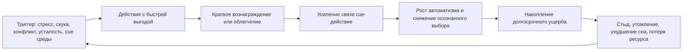
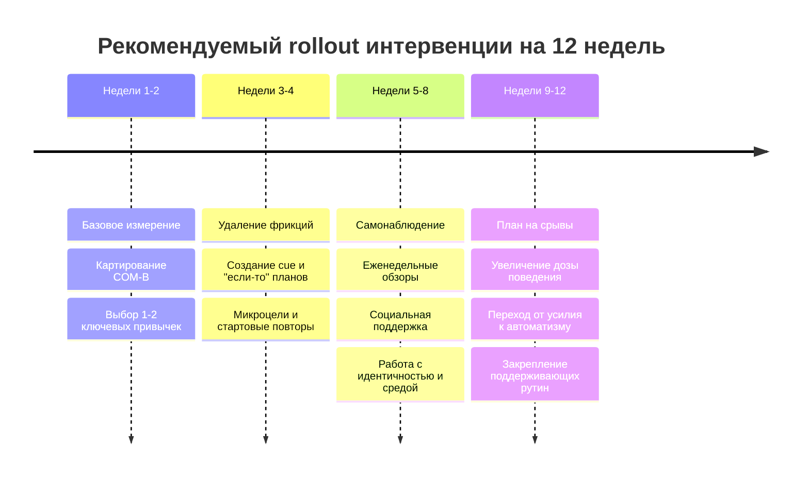

# Механизмы закрепления вредного поведения и внедрения полезных привычек на протяжении жизни

## Резюме для руководителя

Вредное поведение удерживается не потому, что люди "не понимают, что это плохо", а потому, что краткосрочная выгода почти всегда организована лучше, чем долгосрочная польза. Нездоровая еда обычно доступнее и немедленно вознаграждает, избегание неприятной задачи мгновенно снижает напряжение, грубость дает короткое чувство силы или контроля, а малоподвижность экономит усилие прямо сейчас. На этом фоне задержанное вознаграждение, или temporal discounting, делает далекие выгоды менее психологически "реальными", тогда как повторение поведения в стабильных контекстах постепенно переводит его в автоматизм привычки. Эту картину усиливают стресс, дефициты исполнительных функций, социальные нормы, дисфункциональная идентичность и среда, устроенная в пользу быстрых вознаграждений. citeturn35search0turn36search0turn15search0turn22search7turn37search0

Полезные привычки внедряются трудно по зеркальной причине. Им нужны усилие, планирование, повторение, терпимость к временному дискомфорту, поддерживающая среда и часто новая идентичность: "я человек, который так живет". Если у человека нет ощущения автономии, компетентности и связи с другими, устойчивость поведения резко падает; если же среда создает возможности для действия, а человек видит поведение как часть себя, вероятность сохранения новой привычки возрастает. Это хорошо описывают COM-B, теория самодетерминации, модели привычки и современные модели поддержания поведения. citeturn37search0turn24search1turn8search3turn3search12turn3search8turn3search3

С точки зрения доказательной базы наиболее надежно поддержаны следующие выводы. Когнитивно-поведенческая терапия бессонницы дает клинически значимые эффекты; contingency management дает средние эффекты для абстиненции при расстройствах, связанных с употреблением психоактивных веществ; краткие алкогольные интервенции в первичной помощи дают небольшой, но устойчивый эффект; психотерапия прокрастинации имеет небольшой общий эффект, но CBT-подходы заметно сильнее среднего; программы обучения коммуникации и relationship education улучшают навыки общения умеренно; интервенции по изменению физической активности, идентичности и коучингу обычно работают, но их эффекты чаще небольшие и зависят от качества дизайна и поддержки среды. citeturn12search1turn12search5turn33search1turn33search3turn17search27turn17search15turn5search2turn7search3turn23search1turn23search2turn16search0

Практически это означает, что самый слабый путь изменения поведения - это чистая "просветительская" модель: сказать человеку, что нужно лучше есть, больше двигаться, меньше срываться и лучше спать. Самый сильный путь - это многослойный дизайн: изменить фрикции и стимулы, ввести микро-действия, самонаблюдение, планы "если-то", замены вместо запретов, социальную поддержку, работу с идентичностью и, где возможно, политику среды. Для детей и подростков решающим становится не назидание, а настройка отношений, рутин, опыта успешности и языка, которым взрослые описывают усилие, ошибки, тело, эмоции и ответственность. Для взрослых ключом становится системность. Для пожилого возраста - сохранение функциональной способности, автономии, движения, связи с людьми и смысла. citeturn12search19turn13search0turn13search3turn12search23turn14search3turn14search19turn19view2turn28search2

Этот отчет организован так, чтобы его можно было развернуть в книгу: теоретические главы, прикладные протоколы, возрастные программы, блок измерения и приложений, а также аннотированная библиография. При этом важно сразу отметить границы знания: термин "токсичное общение" не является строгой научной категорией; доказательства здесь чаще идут через смежные области - агрессию, враждебность, деструктивные паттерны пары, деэскалацию и эмоциональную дисрегуляцию, - и потому требования к осторожности выше, чем, например, в области сна или физической активности. citeturn7search2turn7search3turn21search3turn6search2

## Обзор литературы и концептуальная модель

Современная литература сходится в том, что устойчивое поведение формируется на стыке нескольких систем. Первая система - привычка: повторяемое действие в устойчивом контексте становится автоматически вызываемым сигналом среды; в знаменитой полевой работе Лалли и коллег автоматичность росла асимптотически, а время достижения 95% индивидуального плато колебалось от 18 до 254 дней, что разрушает популярный миф о "21 дне". Вторая система - оценка будущего: люди психологически обесценивают отдаленные выгоды, причем эта склонность устойчиво связана и с ожирением, и с зависимостями. Третья система - обучение подкреплением и избегание: если действие приносит быстрое облегчение, вероятность повторения возрастает, даже если долгосрочный итог разрушителен. Четвертая система - исполнительные функции: планирование, торможение импульса, переключение, удержание целей. Пятая система - идентичность: поведение удерживается лучше, если оно переживается как "это про меня". Шестая система - мотивационный и социальный контекст, который в COM-B раскладывается на capability, opportunity и motivation, а в SDT - на автономию, компетентность и связанность. citeturn15search0turn35search0turn36search0turn31search2turn22search7turn3search8turn37search0turn24search1turn8search3

Привычка не равна частоте повторения. В классической работе Verplanken и Orbell Self-Report Habit Index был разработан именно как многокомпонентная мера, включающая повторяемость, автоматичность и оттенок идентичности. Более поздние обзоры показали, что привычка и идентичность тесно связаны: в мета-анализе 2025 года корреляция между ними для здоровых поведений была большой, r = 0.55. Это значит, что "делать" и "быть" почти всегда срастаются: человек не просто бегает, он начинает быть "тем, кто бегает"; не просто курит, а начинает быть "курильщиком"; не просто язвит, а переживает резкость как часть "своего характера". citeturn32search10turn32search3turn3search3

Временное дисконтирование - один из наиболее мощных механизмов, объясняющих, почему вредный выбор кажется разумным в моменте. Для ожирения мета-анализ Amlung и коллег показал устойчивую среднюю связь со steep delay discounting, d = 0.43, а для аддиктивного поведения MacKillop и коллег показали средний эффект около d = 0.58 при сопоставимых методах оценки. Иначе говоря, люди с некоторыми устойчивыми вредными паттернами чаще предпочитают меньший, но немедленный выигрыш большему, но отсроченному. Это не моральный провал, а воспроизводимый поведенческий профиль. citeturn35search0turn36search0

Избегание - отдельный двигатель самоподдержания вреда. В краткосрочном окне избегание почти всегда "работает": не пошел на тренировку - исчез дискомфорт; не начал задачу - уменьшилась тревога; сорвался на другого - появилось чувство разрядки; не обсуждал проблему в паре - снизилось напряжение. Современные обзоры по avoidance learning подчеркивают, что чрезмерное избегание из адаптивного механизма превращается в патологию, а также ослабляет обучение новому безопасному опыту, который мог бы разрушить старый цикл. Именно поэтому полезное поведение часто не внедряется: оно требует пройти через дискомфорт, который избегающее поведение как раз и обещает быстро убрать. citeturn31search1turn31search2turn31search5

Исполнительные функции выступают как "операционная система" изменения. Они позволяют удерживать цель, тормозить импульс, переносить неудобство и следовать плану в конфликте с немедленным желанием. Когда человек перегружен стрессом, хронически не высыпается, испытывает тревогу или живет в хаотичной среде, эта система работает хуже. Стресс в среднем мешает физической активности, а когнитивный и аффективный контроль под нагрузкой ослабевает. Поэтому "просто быть дисциплинированнее" в неблагоприятной среде - плохая психологическая модель: сначала нужно разгрузить систему. citeturn22search7turn22search8turn2search7turn2search8

COM-B и SDT удобны тем, что объединяют эти уровни в один рабочий каркас. COM-B утверждает: без достаточной способности, возможности и мотивации поведение не случится; SDT добавляет, что наиболее устойчивой становится та мотивация, которая переживается как автономная, связанная с собственным выбором, ощущением компетентности и поддерживающими отношениями. Мета-аналитические данные показывают, что SDT-информированные интервенции обычно дают небольшой, но значимый эффект на изменение здорового поведения, а техники, усиливающие автономную поддержку, автономию, компетентность и мотивацию, в среднем производят эффекты от малых до умеренных и выше на психологические медиаторы. citeturn37search0turn24search0turn24search3turn24search5

Таблица ниже сводит центральные механизмы, типичные проявления и степень силы доказательств.

| Механизм | Как он удерживает вред | Типичные примеры | Сила доказательств | Основание |
|---|---|---|---|---|
| Контекстная автоматизация привычки | Поведение запускается по сигналу среды почти без размышления | перекусы "на автомате", вечерний алкоголь, пассивный скроллинг, резкий тон в привычном конфликте | Высокая | Lally 2010, Gardner 2012, SRHI-литература citeturn15search0turn15search2turn32search10 |
| Временное дисконтирование | Немедленная выгода субъективно перевешивает отдаленную пользу | переедание, зависимость, откладывание сна и задач | Высокая | мета-анализы по ожирению и аддикциям citeturn35search0turn36search0 |
| Положительное подкрепление | Поведение повторяется из-за удовольствия или облегчения | сладкое, никотин, лайки и новости, доминирование в ссоре | Высокая для зависимостей и питания; умеренная для коммуникации | nicotine/addiction evidence, UPF evidence, aggression literature citeturn17search6turn14search0turn5search1turn7search2 |
| Негативное подкрепление и избегание | Поведение временно уменьшает тревогу, стыд, усилие или конфликт | не начинать задачу, не идти на тренировку, не обсуждать проблему, срываться вместо диалога | Высокая для тревоги и прокрастинации; умеренная для коммуникации | avoidance reviews, procrastination meta citeturn31search1turn31search2turn5search2 |
| Ограничения исполнительных функций | Не хватает торможения, планирования, переключения и удержания цели | хаотичное питание, срывы режима сна, импульсивные ответы | Высокая | Diamond, Harvard, stress reviews citeturn22search7turn22search0turn2search7turn22search8 |
| Идентичность и самокатегоризация | "Я такой человек" делает паттерн самоподдерживающимся | "я не спортивный", "я всегда говорю правду жестко", "я ночной человек" | Умеренно-высокая | identity reviews and meta-analysis citeturn3search8turn3search3turn3search12 |
| Социальные нормы и модели | Поведение подкрепляется окружением и ролевыми ожиданиями | компания пьет, семья мало двигается, на работе принят грубый стиль | Высокая | norms and identity evidence citeturn3search17turn7search22 |
| Дизайн среды и политики | Среда делает вред легким, а пользу дорогой по усилию | ультрапереработанная еда, автомобильная зависимость, табачная доступность | Высокая | WHO, SSB tax, walkability, tobacco tax citeturn5search1turn11search7turn14search2turn14search0 |
| Дефицит автономии, компетентности и связи | Полезное действие переживается как чужое, непосильное или социально пустое | "меня заставляют", "у меня все равно не выйдет", "мне не с кем" | Умеренно-высокая | SDT meta and APA overview citeturn24search0turn24search1turn8search3 |
| Структурные ограничения и хронический стресс | Плохие выборы оказываются рациональными в ограниченной среде | дешевые калории, сменный график, отсутствие безопасного места для прогулок | Высокая | WHO physical activity, obesity, healthy ageing, built environment reviews citeturn19view1turn19view0turn19view2turn14search14 |

## Как формируются самоподдерживающиеся циклы

Для питания и веса особенно важна комбинация высокой доступности, сенсорной привлекательности и немедленного подкрепления. Ультрапереработанная пища в контролируемом исследовании Hall и коллег привела к избыточному потреблению калорий и набору веса по сравнению с незаведомо переработанным рационом, а WHO в русскоязычных материалах подчеркивает, что в 2022 году ожирением жил уже более 1 миллиарда человек, то есть примерно каждый восьмой человек в мире. Поэтому цикл "усталость - быстрое сверхвкусное решение - краткое облегчение - рост массы - больше стыда и утомляемости - снова поиск быстрого облегчения" имеет не только психологическую, но и выраженную средовую подпитку. citeturn5search1turn28search19turn28search1

Для физической активности основной парадокс такой: движение полезно уже с одной сессии, улучшает сон, тревогу и ряд метаболических исходов, но вход в него ощущается как стоимость, а не как награда. WHO сообщает, что в 2022 году 31% взрослых и 81% подростков не достигают рекомендованных уровней активности, а недостаточная активность ассоциирована с повышением риска смерти на 20-30%. Когда человек в стрессе, сидячая среда и привычка к экономии усилия выигрывают у долгосрочной пользы. Поэтому "ленивый человек" часто является не ленивым, а захваченным контуром низкой активности, высокой фрикции и низкой идентичности активного человека. citeturn19view1turn28search0turn4search20turn22search8

Для зависимостей особенно мощно работают reinforcement, discounting и cue-reactivity. Никотин, алкоголь и другие вещества дают быстрый эффект на состояние, а условные сигналы среды - место, время, компания, эмоциональное состояние - начинают запускать тягу автоматически. В мета-анализах более крутое дисконтирование устойчиво связано с аддиктивным поведением, а ВОЗ подчеркивает, что ценовые меры и налоги на табак остаются самым экономически эффективным способом сокращать употребление, особенно у молодежи и групп с низким доходом. Это один из лучших примеров того, что проблема редко решается только "силой воли": среда должна быть переделана так, чтобы вред был дороже и менее доступен. citeturn36search0turn17search1turn14search0turn14search4

Для сна цикл чуть тоньше, но не менее жесткий. Человек откладывает отход ко сну ради короткой компенсации - тишины, развлечения, чувства контроля над днем. Затем недосып бьет по исполнительным функциям, эмоциональной регуляции и вероятности физической активности, а на следующий вечер мозг снова ищет быстрый дофаминовый "долг" вместо своевременного сна. CDC и AASM дают четкие возрастные рекомендации по сну, а мета-анализы показывают, что CBT-I дает клинически значимые эффекты на латентность сна и поддержание сна. Это означает, что нарушения сна часто поддерживаются не только биологией, но и обученными поведенческими циклами, которые можно переучивать. citeturn11search0turn11search1turn11search4turn12search1turn12search5

Для прокрастинации центральны избегание, аверсивность задачи и плохая связь текущего усилия с будущим "я". Мета-анализ Rozental и коллег показал небольшой общий эффект психологического лечения, но CBT-подходы дали отчетливо лучший результат, g = 0.55. Это согласуется с базовой моделью: прокрастинация поддерживается не столько дефицитом знания, сколько краткосрочной выгодой от откладывания, и лечится не морализированием, а снижением аверсивности старта, разметкой следующего шага, работой с эмоциями и волевым планированием. citeturn5search2turn5search4turn25search1

Для грубого, враждебного и "токсичного" общения цикл обычно включает интерпретацию угрозы, быстрое возбуждение, защитную или атакующую реакцию, временное чувство контроля и последующий каскад отчуждения. Классические работы Gottman связывали деструктивные паттерны конфликта с последующим распадом отношений, а современные обзоры показывают, что отрицательные восприятия эмоций партнера и защитно-враждебные ответы образуют устойчивые петли. Здесь особенно важно, что доказательная литература меньше стандартизирована: нет единого "мета-анализа токсичности", а есть узлы доказательств по коммуникации в паре, агрессии, гневу, эмоциональной дисрегуляции и деэскалации. citeturn21search0turn21search1turn7search2turn21search3

Эти доменные различия можно свести к одному общему паттерну.



Диаграмма выше описывает общий контур для набора веса, гиподинамии, зависимости, откладывания сна, прокрастинации и деструктивной коммуникации. Вред не просто "повторяется"; он сам производит условия, из-за которых следующий полезный шаг становится еще труднее. citeturn15search0turn31search2turn22search8turn12search1turn5search2

Короткие иллюстративные виньетки помогают увидеть механизм в жизни. Ирина хочет "начать правильно питаться", но приходит домой истощенной; пока она думает о готовке, доставка уже предлагает сверхвкусное и быстрое решение. Артем хочет заняться спортом, но живет рваным графиком, плохо спит и считает себя "не спортивным типом"; каждый пропуск закрепляет эту идентичность. Сергей и Ольга давно перешли на язык уколов и сарказма; каждый конфликт временно разряжает напряжение, но еще сильнее повышает ожидание угрозы в следующем разговоре. Эти истории вымышлены, но их цикл типичен и хорошо совпадает с тем, как литература описывает закрепление вредных паттернов. citeturn3search8turn3search12turn21search0turn7search3

## Интервенции и протоколы изменения привычек

Главный прикладной вывод литературы таков: интервенция должна бить не в "общую мотивацию", а в конкретный механизм. Если проблему поддерживает discounting, полезны техники приближения будущего "я" и конкретизации отсроченной выгоды; если избегание - экспозиция к дискомфорту старта и дробление задачи; если привычка - перепривязка к сигналам и редизайн контекста; если среда - изменение доступности, цены, фрикции и норм; если движение не удерживается - добавление идентичности, удовольствия и социальной опоры. Именно поэтому самые сильные программы обычно комбинируют поведенческие, когнитивные, средовые и социальные компоненты. citeturn20view10turn13search0turn37search0turn12search19turn14search2

| Интервенция | Целевой механизм | Итог по данным | Типичный размер эффекта | Комментарий | Основание |
|---|---|---|---|---|---|
| CBT-I | дисфункциональные убеждения о сне, стимул-контроль, плохая ассоциация "кровать = бодрствование" | Эффективна и клинически значима | примерно 0.65-0.88 по ключевым исходам сна | одна из самых надежных поведенческих интервенций | Morin 1994, Trauer 2015 citeturn12search5turn12search1 |
| Contingency management | положительное подкрепление вреда, слабая ценность долгой выгоды | Улучшает абстиненцию и удержание | средний эффект; r около 0.32, для MOUD - средние эффекты | особенно сильна, когда награда объективна и немедленна | citeturn33search3turn33search1turn17search4 |
| Motivational interviewing и brief counselling | амбивалентность, низкая готовность к изменению | Малый, но значимый эффект | d около 0.17; в real-world brief care g около 0.19 краткосрочно | хорошо как старт, хуже как единственная мера | citeturn6search15turn6search17 |
| CBT для прокрастинации | избегание, аверсивность задачи, дефицит волевого старта | Работает лучше среднего лечения | общий g = 0.34; CBT subgroup g = 0.55 | эффект выше, когда есть структура и практика | citeturn5search2turn5search4 |
| Эпизодическое future thinking | temporal discounting | Улучшает выбор в пользу будущего | g = 0.55 для discounting; g = 0.31 для food choice | перспективно для избыточной массы тела | citeturn20view10 |
| Identity-based интервенции для PA | слабая самокатегоризация "я активный человек" | Эффект есть, но мал | g = 0.18 на идентичность | полезно как добавка к средовым мерам | citeturn23search1 |
| Health coaching | низкая автономная поддержка, слабая обратная связь | Малые значимые улучшения | малые эффекты | лучше работает с самонаблюдением и адаптацией | citeturn23search2turn6search27 |
| Wearables и self-monitoring | низкая осознанность, отсутствие обратной связи | Увеличивают движение и немного снижают массу | SMD 0.3-0.6; около 1800 шагов/день, 40 мин ходьбы/день, около 1 кг веса | результат лучше при персонализации | citeturn34search3turn12search3turn12search23 |
| Relationship education и навыки коммуникации | деструктивные паттерны конфликта | Улучшает коммуникацию умеренно | d около 0.43-0.45 | доказательства лучше для пар, чем для "токсичности" вообще | citeturn7search3turn7search1 |
| Anger management / DBT | эмоциональная дисрегуляция, враждебность, импульсивная агрессия | Уменьшает dysregulated anger и внешнюю агрессию | от малых до умеренных | важна культурная и клиническая адаптация | citeturn6search2turn7search21 |
| Краткие алкогольные интервенции в primary care | низкая осознанность риска, амбивалентность | Малый, но устойчивый эффект | небольшой | хороший баланс стоимости и пользы | citeturn17search27turn17search3turn17search11 |
| Политики среды: SSB tax, tobacco tax, smoke-free laws, walkability | доступность и цена вреда, фрикция полезного | Работают на уровне популяции | 10% SSB tax -> около 10% снижения покупок; 10% рост цены табака -> примерно 4-5% снижения потребления; walkability позитивно связана с активностью | самые мощные для массового сдвига | citeturn11search7turn14search0turn14search25turn14search26 |

Ниже - компактная "карта веса" нескольких интервенций по эффектам из мета-анализов. Это не рейтинг "лучше-хуже", а сравнение по разным целям и метрикам.

```text
Приблизительные размеры эффекта из мета-анализов

CBT-I                       0.65-0.88  | ########
Contingency management      ~0.32-0.50 | ######
Episodic future thinking    0.55       | ######
CBT procrastination         0.55       | ######
Communication training      0.43-0.45  | #####
Wearables for PA            0.30-0.60  | #####
Motivational interviewing   0.17-0.19  | ##
PA identity intervention    0.18       | ##
```

Такая шкала хорошо показывает важную вещь: "малый" эффект не равен бесполезности. Для популяционного поведения маленькие эффекты часто очень значимы, особенно когда интервенция дешева, масштабируема и адресует распространенный риск. Именно поэтому налоги на табак и сладкие напитки, brief interventions и шагомеры имеют такое большое общественное значение, хотя их индивидуальный эффект часто не выглядит "чудесным". citeturn14search0turn11search7turn34search3turn17search27

Практический протокол изменения привычки, работающий лучше всего в свете обзоров, можно формулировать как восьмишаговый цикл. Сначала измерить базовую линию: что именно, когда, где, с кем и после какого состояния происходит. Затем разложить проблему по COM-B: человеку не хватает способности, возможности или мотивации, и каких именно. Далее убрать фрикцию полезного шага и увеличить фрикцию вредного: заранее подготовить еду, положить форму на видное место, убрать приложения-дистракторы с первого экрана, увести сигналы конфликта из "горячего" пространства. После этого нужен "микростарт": цель не "я начну бегать", а "я надену обувь и выйду на 5 минут". Потом - if-then plans, самонаблюдение, еженедельная обратная связь и замена, а не пустой запрет: не "не курить", а "при тяге: вода, 3 минуты ходьбы, сообщение поддержке, отложить на 10 минут"; не "не грубить", а "если голос поднимается, то пауза 20 секунд и фраза ремонта". Наконец, нужен протокол срыва: срыв считается не провалом, а данными о слабом звене системы. citeturn37search0turn13search3turn12search23turn12search3turn13search0turn3search12

Для питания и веса к этому протоколу стоит добавить редизайн продовольственной среды. Литература по семейным и цифровым вмешательствам показывает, что самоконтроль работает заметно лучше, когда дома изменены правила доступности, когда есть семейные цели, когда обратная связь идет быстро и когда выбор полезного уменьшает когнитивную нагрузку, а не увеличивает ее. Там, где это возможно, индивидуальная работа должна идти вместе с популяционными политиками: качество школьного питания, регулирование маркетинга для детей, налоги на сладкие напитки и изменение улиц в пользу ходьбы и транспорта без двигателя. citeturn14search3turn14search15turn12search11turn34search12turn11search15turn14search2

Для физической активности самый рабочий набор выглядит так: начать с очень малого объема, быстро найти субъективно приятную форму движения, привязать ее к стабильному cue, видеть данные прогресса, включить другого человека или группу и специально строить идентичность активного человека. Движение удерживается не только силой мотивации, но и удовольствием, удобством, безопасностью маршрута и ощущением "это мой стиль жизни". citeturn23search1turn34search3turn19view1turn14search14

Для прокрастинации и токсичной коммуникации критична работа с первым звеном цепи. Задача лечится в моменте не "довести до конца все", а "сделать вход без драматизации"; конфликт лечится не "стать идеально мягким", а "прервать автоматическое escalation". В практическом языке это выглядит так: формулировать следующий шаг размером 2-5 минут; снижать оценочную стигму задачи; при конфликте использовать repair bids, паузы, отражение состояния собеседника и возвращение к предмету разговора после физиологического спада возбуждения. Пара-терапия, anger management и DBT-подходы здесь сильнее простых увещеваний. citeturn5search2turn7search3turn7search2turn6search2



## Возрастные программы убеждений и установок

Возрастные программы ниже построены по жесткому условию пользователя: каждая установка как будто начинает внедряться только в этот возрастной период и не опирается на ранее хорошо усвоенные установки. Поэтому формулировки сделаны максимально "самодостаточными". Для детских когорт опора идет на WHO, CDC и Harvard Center on the Developing Child; для подростков - на WHO, APA и рекомендации по сну и активности; для взрослых и пожилых - на WHO, CDC и литературу по здоровому старению, функциональной способности и падениям. citeturn8search0turn22search3turn18search3turn29search1turn18search10turn11search0turn19view2turn28search11

| Возраст | Какие установки прививать | Практики, среда, короткие скрипты | Канал внедрения | Метрики исхода | Основания |
|---|---|---|---|---|---|
| 0-1 | "Мир откликается"; "сигналы тела важны"; "ритм, безопасность и контакт нормальны" | serve-and-return; tummy time; предсказуемые ритуалы сна; скрипт взрослого: "Я вижу тебя, я отвечаю" | caregiver coaching, рутины дома | число ответных взаимодействий/день, минуты активности, часы сна | citeturn8search0turn22search3turn29search5turn11search0 |
| 1-3 | "Я могу пробовать"; "эмоции можно назвать; действие можно направить" | выбор из двух безопасных опций; игры на ожидание очереди; скрипт: "Ты злишься. Давай покажу, что делать руками и словами" | родители, ясли, короткие игровые ритуалы | число истерик с восстановлением, словарь эмоций, сон, активность | citeturn8search5turn18search7turn22search3turn29search5 |
| 3-6 | "Ошибаться можно"; "правила помогают"; "тело любит движение и сон" | простые обязанности; чтение; активная игра; скрипт: "Сначала маленький шаг, потом помощь" | семья, дошкольная среда | участие в chores, минуты активной игры, соблюдение рутины сна | citeturn18search7turn29search0turn29search2turn11search1 |
| 6-9 | "Усилие важнее ярлыка"; "чувства можно обсуждать"; "двигаться каждый день - норма" | 60 минут активности; семейные разговоры о чувствах; visible checklist; скрипт: "Что твой первый шаг?" | семья, школа, внеурочная деятельность | latency старта домашнего задания, активность, сон, частота открытых разговоров | citeturn29search8turn30search2turn29search16turn11search0 |
| 9-12 | "Я отвечаю за выбор, а не за настроение момента"; "дружба не требует саморазрушения" | план "если друзья давят, то..."; участие в команде/кружке; скрипт: "Нет - это полный ответ" | школа, родители, тренеры | число ситуаций peer pressure с успешным отказом, сон, активность, screen limits | citeturn30search7turn19view1turn11search0turn22search19 |
| 12-15 | "Мое будущее - не абстракция"; "соцсети не должны съедать сон, движение и самооценку" | EFT-упражнения; цифровые границы; вечерний off-screen час; скрипт: "То, что хочется сейчас, и то, что мне важно завтра" | школа, родители, peer programs | 8-10 часов сна, 60 минут движения, self-report по настроению и start-on-time tasks | citeturn29search1turn18search10turn18search2turn11search20 |
| 15-18 | "Свобода = способность держать договор с собой"; "помощь - не слабость" | weekly planning; if-then plans; обучение коммуникации и согласию; скрипт: "Я могу взять паузу и сказать это без атаки" | школьные программы, наставник, семья | доля задач, начатых вовремя; сон; активность; эпизоды substance use | citeturn29search1turn17search25turn7search3turn11search20 |
| 18-25 | "Идентичность строится практикой"; "режим, сон и движение - инфраструктура карьеры и психики" | трекеры, коучинг, social accountability; скрипт: "Я не жду мотивации, я строю контекст" | университет, работа, цифровые сервисы | BSCS/PPS, GPAQ/IPAQ, PSQI/ISI, AUDIT-C | citeturn23search2turn34search3turn27search1turn9search9turn27search0 |
| 25-35 | "Системы сильнее намерений"; "партнеру нужна безопасность, а не победа" | redesign дома и календаря; деньги/еда/сон как системы; скрипт пары: "Я не атакую, я формулирую запрос" | семейные ритуалы, workplace wellness, терапия при необходимости | adherence к routines, вес/талия, PA, качество коммуникации | citeturn12search23turn7search3turn21search0turn19view1 |
| 35-50 | "Цена игнорирования тела растет"; "гордость без саморегуляции дорого обходится семье и работе" | медосмотры; силовые 2 раза/нед.; деэскалация конфликтов; скрипт: "Стоп. Я хочу решить, а не разрядиться" | первичная помощь, корпоративные программы, семейные договоры | PA, сон, BP, AUDIT/FTND, частота конфликтов без эскалации | citeturn19view1turn17search11turn26search1turn21search3 |
| 50-65 | "Сохранить функцию важнее, чем выглядеть молодо"; "регулярность важнее героических рывков" | силовые, баланс, ходьба, социальные связи; скрипт: "Я инвестирую в следующие 20 лет функции" | семейный врач, группы здоровья, сообщество | активность, сон, талия, сила, adherence к лечению | citeturn18search17turn19view2turn29search13 |
| 65-75 | "Движение - лекарство"; "автономия требует практики, а не покоя"; "связь с людьми защищает" | аэробная, силовая и balance activity; проверка дома на риск падений; скрипт: "Мне нужна независимость, значит мне нужна тренировка" | primary care, senior centers, family support | минуты движения, дни balance training, falls, social contacts/week | citeturn18search5turn18search1turn28search11turn29search13 |
| 75+ | "Цель - функциональная способность, достоинство и участие"; "каждое небольшое действие имеет цену для независимости" | chair-based exercise, walk-and-talk, сохранение ролей; скрипт: "Делать по чуть-чуть лучше, чем ждать силы" | междисциплинарная команда, семья, community care | ADL/IADL proxy, число падений, mobility, loneliness, sleep | citeturn19view2turn28search2turn28search8turn28search11 |

В терминах учебных программ это можно читать так. В раннем возрасте ядром является опыт отклика и телесной регуляции. В дошкольном - язык эмоций, ритм и действие в правилах. В среднем детстве - усилие, ответственность, рутинность движения и открытый разговор о чувствах. В подростковом - будущее "я", цифровая гигиена, давление сверстников, право на границы и отказ. В ранней взрослости - системное самоуправление, сон, деньги, тело и качество выбора окружения. В зрелости - профилактика накопленного вреда, поддержание функции и ремонт коммуникации. В пожилом возрасте - фокус на functional ability, падениях, социальной связи и ежедневном маленьком действии, а не на героических целях. citeturn8search0turn22search15turn29search1turn18search10turn19view2turn28search11

## Измерение, риски, пробелы и аннотированная библиография

Для измерения прогресса лучше совмещать поведенческие, субъективные и средовые показатели. Для привычек подойдут SRHI и более короткие производные automaticity-скал; для temporal discounting - Monetary Choice Questionnaire и шкала Consideration of Future Consequences; для самоконтроля - Brief Self-Control Scale; для физической активности - GPAQ WHO или IPAQ; для сна - PSQI и ISI; для алкоголя - AUDIT WHO; для никотиновой зависимости - FTND; для прокрастинации - PPS или IPS; для агрессии и враждебности - Buss-Perry AQ; для отношений и коммуникации в паре - RDAS. Их ценность в том, что они позволяют уйти от расплывчатого "кажется, стало лучше" к сопоставимым точкам наблюдения. citeturn32search10turn10search1turn10search4turn9search1turn27search1turn9search9turn26search28turn27search0turn26search1turn9search6turn26search3turn10search6

Этические риски в работе с привычками недооцениваются. Первое - стыд и морализирование: они часто усиливают избегание и срывы, особенно при ожирении, зависимостях и прокрастинации. Второе - чрезмерная внешняя регуляция: если вмешательство ломает автономию, оно может дать краткий результат, но плохую долгую устойчивость. Третье - культурная и социальная слепота: рекомендации, игнорирующие бедность, небезопасность среды, сменную работу, инвалидность, нейроразнообразие или семейную систему, часто превращаются в обвинение жертвы. Четвертое - риск расстройств пищевого поведения при неосторожной работе с весом и телом. Пятое - в пожилом возрасте нельзя подменять поддержку функциональной способности лишением автономии. citeturn24search1turn8search3turn34search5turn19view2turn28search8

Есть и прямые пробелы доказательств. Термин "токсичность" слишком размыт; нужны более строгие операционализации и long-term trials вне контекста только романтических пар. Для identity-based интервенций эффекты пока есть, но чаще небольшие, и мало работ по долговременной поддержке. Для будущего мышления и discounting в питании эффекты обнадеживающие, но число исследований ограничено. По цифровым средствам важнее всего не "есть ли эффект", а какие конкретные компоненты, дозы и сценарии реально удерживают результат на горизонте года и более. В детских и подростковых программах все еще недостаточно данных о том, как именно культурная адаптация и семейный стресс меняют перенос навыков в реальную жизнь. citeturn23search1turn20view10turn34search12turn21search3

Исследовательская повестка, вытекающая из текущих пробелов, выглядит так. Нужны многоуровневые исследования, где одновременно моделируются cue, эмоция, среда и социальная динамика; прагматические RCT и microrandomized trials для цифровых подсказок; больше долгосрочных follow-up в темах сна, прокрастинации и коммуникации; лучшее соединение developmental science с preventions across the life course; а для позднего возраста - интеграция behavior change research с WHO-подходом к healthy ageing и functional ability. Отдельный важный вектор - исследования, где исходом становится не только симптом или килограмм, а функция, автономия, качество отношений и социальное участие. citeturn19view2turn18search12turn24search5turn37search0

Ниже - компактная аннотированная библиография ядра отчета. В ней сознательно смешаны первичные работы, мета-анализы и официальные документы, чтобы обеспечить и теорию, и практику, и политику.

| Источник | Тип | Почему это опорная работа |
|---|---|---|
| Lally et al., "How are habits formed" citeturn15search0turn15search4 | первичная эмпирика | Классическое полевое исследование реального формирования привычек; лучший antidote против мифа о "быстром привыкании". |
| Michie et al., "The Behaviour Change Wheel" citeturn37search0 | теоретическая статья | Один из самых практичных каркасов для проектирования вмешательств через capability, opportunity и motivation. |
| Ryan and Deci; APA overview on SDT citeturn8search11turn8search3 | теория + официальный обзор | Базовый источник по автономии, компетентности и связанности как условиям устойчивой мотивации. |
| Amlung et al., delay discounting in obesity citeturn35search0 | мета-анализ | Прямо связывает present bias с избыточной массой тела. |
| MacKillop et al., delayed reward discounting and addictive behavior citeturn36search0 | мета-анализ | Один из ключевых источников по связи discounting и зависимости. |
| Hall et al., ultra-processed diet RCT citeturn5search1 | первичное РКИ | Редкий строгий эксперимент, показывающий, как пищевая среда сама повышает потребление энергии. |
| Trauer et al.; Morin et al. on CBT-I citeturn12search1turn12search5 | мета-анализы | Наиболее надежная поведенческая база по сну и бессоннице. |
| Rozental et al., treatments for procrastination citeturn5search2 | мета-анализ | Ключевая точка входа в доказательную работу с прокрастинацией. |
| WHO fact sheets on physical activity and obesity, включая русские версии citeturn19view1turn28search0turn28search1turn28search19 | официальные документы | Лучший официальный источник по масштабам проблемы и рекомендациям по движениям и массе тела. |
| WHO healthy ageing and Russian Decade of Healthy Ageing materials citeturn19view2turn28search2 | официальные документы | Формируют правильный фокус позднего возраста: не "борьба со старостью", а поддержание функциональной способности. |
| CDC positive parenting and sleep guidance; Harvard Center on the Developing Child citeturn8search1turn11search0turn22search0turn22search3 | официальные/академические ресурсы | Практическая опора для возрастных программ, особенно в раннем развитии и саморегуляции. |
| Hawkins et al. and related communication meta-analyses citeturn7search3turn7search1 | мета-анализы | Лучший доступный мост от общей "токсичности" к измеримым коммуникационным навыкам и их изменению. |

Общий вывод строг и неудобен одновременно. Люди редко меняются потому, что "прозрели". Они меняются, когда новые действия становятся короче до старта, дешевле по усилию, быстрее вознаграждаются, поддерживаются средой, согласуются с идентичностью и не разрушаются хроническим стрессом. И наоборот, вред живет долго не потому, что человек глуп или плох, а потому, что вред организован как удобная, быстрая, социально встроенная и часто биологически подкрепляемая система. Задача науки и практики - не стыдить человека за эту систему, а перестраивать ее слой за слоем. citeturn37search0turn24search1turn15search0turn35search0turn19view2
