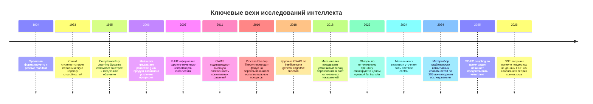
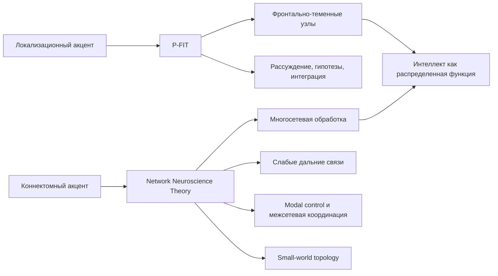
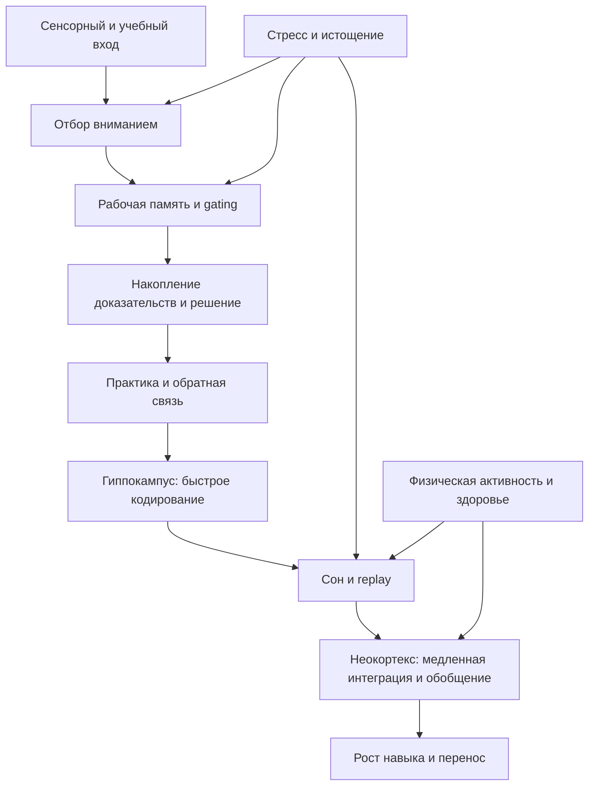

# Современная научная картина различий в интеллекте, оценивании и развитии

## Executive summary

Современный научный консенсус можно сжать в несколько тезисов. Во-первых, устойчивые межиндивидуальные различия в когнитивной эффективности реальны и хорошо реплицируются на уровне психометрии: разнообразные когнитивные тесты положительно коррелируют, а иерархические модели с общим фактором g остаются самым сильным описанием этих данных. Во-вторых, g сегодня рассматривают не как "один центр" или "одну молекулу", а как итог согласованной работы нескольких систем: рабочей памяти, контроля внимания, скорости и качества накопления доказательств, структурной и функциональной связности мозга, а также процессов консолидации знания. В-третьих, различия в интеллекте имеют заметную генетическую компоненту, но это не тождественно генетическому детерминизму: наследуемость есть свойство вариации в популяции и конкретной среде, а не "процент человека, созданный генами". В-четвертых, развитие интеллекта возможно, но эффекты интервенций очень неоднородны: самым устойчивым средовым фактором остается образование; сон, физическая активность и коррекция дефицитов помогают надежнее, чем "тренажеры интеллекта" и тем более "ноотропные" обещания. citeturn25view3turn1search0turn6search2turn11view6turn5search1turn33search3turn19search2

Если смотреть именно "по-современному", то картина смещается от спора "g против всего остального" к более богатой модели. Психометрически g никуда не исчезает; скорее, он становится верхним уровнем описания, а под ним обсуждаются CHC-способности, взаимное усиление когнитивных процессов в развитии, перекрытие исполнительных процессов, а на нейроуровне - глобальная архитектура коннектома, слабые дальние связи, small-world-организация, структурно-функциональное сопряжение и гибкая перенастройка task-positive сетей под нагрузку. Это не отменяет роль локальных узлов, особенно фронтально-теменных цепей, но делает локализационную картину недостаточной без сетевой. citeturn3search24turn11view1turn25view0turn31search0turn3search2

Самое важное практическое следствие такое: в реальной продуктивности большие различия возникают не только из "базового IQ", а из произведения нескольких множителей - общей когнитивной мощности, предзнаний, качества внимания, устойчивости к стрессу, сна, здоровья, мотивации, качества обучения и используемых инструментов. Поэтому в жизни нередко наблюдаются действительно очень большие разрывы в скорости и полноте обучения, но они обычно объясняются не одной причиной, а взаимодействием нескольких факторов. Это особенно хорошо видно в данных по шахматам, изучению языков и профессиональному обучению. citeturn7search8turn13search17turn13search12turn23view0turn22view3

Ни генетические оценки, ни нейровизуализация пока не дают оснований для высокоставочных решений об отдельном человеке в образовании или найме. Психометрия остается основным инструментом, но и она требует культурной и языковой осторожности, проверки измерительной инвариантности, комбинирования с рабочими пробами, структурированными интервью и данными о траектории обучения. citeturn35search15turn14search12turn23view0turn8search2turn36search17

Ниже приведена временная линия, которая помогает увидеть, как менялся фокус науки - от факторного описания к сетям, геномике и механистическим моделям обучения. Исторические точки и современные мета-анализы взяты из классических и недавних работ. citeturn25view3turn1search1turn3search24turn6search4turn21view5turn11view6turn5search1turn14search10



## Современные модели интеллекта и измерение

Аналитический обзор. На уровне описания данных g остается самым сильным и самым воспроизводимым фактом: разные когнитивные тесты образуют positive manifold, а иерархические модели хорошо объясняют совместную вариацию результатов. CHC-модель при этом стала де-факто наиболее полезной рабочей картой способностей для практики и тестостроения: она разделяет общий уровень, широкие домены и узкие навыки. Но CHC в основном описательна. Модели mutualism и process overlap пытаются объяснить, откуда берется positive manifold: первая - через развитие взаимно усиливающихся когнитивных процессов, вторая - через частичное перекрытие доменно-общих исполнительных процессов, особенно связанных с рабочей памятью и контролем внимания. Complementary Learning Systems добавляет другой слой объяснения: почему вообще интеллектуальные системы должны совмещать быстрое запоминание эпизодов и медленное накопление абстрактной структуры. В современной картине эти теории скорее дополняют друг друга на разных уровнях анализа, чем полностью взаимно исключают друг друга. citeturn25view3turn1search0turn1search1turn27search12turn27search3turn29view0

С точки зрения силы доказательств, ситуация асимметрична. Для существования g и для полезности CHC доказательства сильные. Для mutualism и process overlap доказательства умеренные: они хорошо объясняют некоторые эмпирические факты и дают более реалистичную динамическую картину, но пока не вытеснили классические иерархические модели как основной стандарт измерения. Для CLS доказательства очень сильны в памяти и консолидации, а вот перенос от моделей памяти к широким различиям в интеллекте концептуально продуктивен, но эмпирически более косвенен. Иначе говоря: g и CHC - сегодня лучшие дескриптивные рамки; mutualism, process overlap и CLS - важные механистические надстройки. citeturn1search0turn25view3turn27search3turn29view0turn2search15

### Сравнение ключевых теорий

| Теория | Основное положение | Эмпирическая поддержка | Слабые места | Рабочий вывод | Ключевые источники |
|---|---|---|---|---|---|
| g | Общий фактор объясняет значимую часть общей дисперсии разных когнитивных тестов | Очень сильная психометрическая репликация positive manifold; в современной факторной практике g остается доминирующим верхним уровнем модели citeturn25view3turn1search0 | Сам по себе не раскрывает механизм | Лучший верхнеуровневый дескриптор, но не завершенная причинная теория | Kovacs K, Conway ARA. 2016. Process Overlap Theory. DOI `https://doi.org/10.1080/1047840X.2016.1153946`; URL `https://coglab.eu/wp-content/uploads/2023/07/kovacs-conway-process-overlap-theory.pdf` [EN] citeturn25view3 |
| CHC | Интеллект организован иерархически: g, broad abilities, narrow abilities | Очень сильная поддержка в тестостроении и интерпретации; современный WJ V прямо опирается на contemporary CHC theory citeturn21view9turn9search2turn1search0 | В основном таксономия, а не механизм | Лучшая практическая рамка для assessment battery и профиля сильных/слабых сторон | Schrank, McGrew, Mather tradition; WJ V Technical Abstract 2025. URL `https://info.riversideinsights.com/hubfs/Clinical%20-%20Sales%20and%20Services%20Collateral/WJ%20V/WJ%20V%20Technical%20Abstract.pdf` [EN] citeturn21view9 |
| Mutualism | g возникает как развивающийся итог положительных взаимодействий между когнитивными процессами | Умеренная поддержка в developmental/network-работах; хорошо объясняет рост корреляций в развитии citeturn1search1turn25view4 | Меньше прямых строгих тестов, чем у иерархических моделей | Сильная динамическая альтернатива для developmental explanation, не замена психометрии | van der Maas HLJ et al. 2006. PNAS. URL `https://pmc.ncbi.nlm.nih.gov/articles/PMC1635518/` [EN]; Kan KJ et al. 2019/2017 review [EN] citeturn1search1turn25view4 |
| Process overlap | Positive manifold создают перекрывающиеся доменно-общие исполнительные процессы и специфические процессы | Умеренная поддержка; особенно сильна там, где задачи нагружают executive/attention control citeturn25view3turn2search15turn17search0 | Спор о том, какие именно процессы являются источником общего фактора и как их измерять без загрязнения задачами | Очень полезна как мост между психометрией и когнитивными механизмами | Kovacs K, Conway ARA. 2016. DOI `https://doi.org/10.1080/1047840X.2016.1153946`; Wang T et al. 2021. PMID `33917495` [EN] citeturn25view3turn2search22 |
| Complementary Learning Systems | Интеллектуальная система должна совмещать быстрое эпизодическое обучение и медленное извлечение структуры | Очень сильна в теории памяти, консолидации и обобщения; современные модели сна и retrieval practice расширяют CLS citeturn27search12turn27search3turn29view0 | Не является прямой психометрической теорией IQ | Ключ к пониманию обучаемости, консолидации и generalization | McClelland JL et al. 1995. DOI `https://doi.org/10.1037/0033-295X.102.3.419`; O'Reilly RC et al. 2014. PMID `22141588`; Liu XL et al. 2024. DOI `https://doi.org/10.3758/s13423-024-02489-1` [EN] citeturn27search12turn27search3turn29view0 |

Психометрия. В прикладной практике 2026 года самый важный сдвиг не в том, что "старые тесты устарели", а в том, что новые редакции стараются лучше отразить CHC-структуру, упростить администрирование, улучшить нормы и цифровую инфраструктуру. WAIS-5 - наиболее актуальная взрослая батарея Wechsler, охватывающая возраст 16:0-90:11, с 10 основными субтестами и пятью доменами. SB5 остается полезной широкой индивидуальной шкалой с сильным охватом высоких и низких уровней способности. Raven's 2 - удобный невербальный инструмент с широким возрастным диапазоном и сниженной языковой нагрузкой, но он принципиально уже по охвату конструкции. WJ V особенно важен там, где нужно связать когнитивный профиль, язык и академические достижения в одной CHC-ориентированной системе. citeturn10search3turn10search7turn28view0turn21view8turn21view7turn9search5turn21view9turn28view3

### Сравнение основных тестов

| Тест | Цель | Возраст | Форматы | Что известно о валидности | Ограничения | Когда особенно полезен | Ключевые источники |
|---|---|---|---|---|---|---|---|
| WAIS-5 | Комплексная оценка взрослых когнитивных способностей | 16:0-90:11 citeturn10search3turn24view2 | Индивидуальное администрирование; paper, Q-interactive, Q-global citeturn10search15turn10search7 | Официально заявлены обновленные нормы, 5 доменов, сокращенное время, расширенная клиническая полезность; уже есть первые независимые анализы структуры citeturn10search3turn10search15turn37search5 | Независимая публичная проверка факторной структуры еще активно идет; в 2026 появились работы, по которым FSIQ/g может быть интерпретационно сильнее, чем новые групповые факторы citeturn37search3turn37search13 | Нейропсихологическая и клиническая оценка взрослых; сложные случаи, где нужен профиль по доменам | Pearson official: URL `https://www.pearsonassessments.com/en-us/Store/Professional-Assessments/Cognition-%26-Neuro/Wechsler-Adult-Intelligence-Scale-%7C-Fifth-Edition/p/P100071002` [EN] citeturn10search7; Brochure URL `https://www.pearsonassessments.com/content/dam/school/global/clinical/us/assets/wais-5/wais-5-overview-brochure.pdf` [EN] citeturn10search3; Canivez GL et al. 2026. PMID `41693426` [EN] citeturn37search5 |
| Stanford-Binet 5 | Широкая оценка интеллекта, включая giftedness и low-functioning range | 2-85 лет по официальной странице PAR citeturn28view0 | Индивидуальное администрирование | Дает Full Scale IQ, Verbal/Nonverbal и 5 факторов; сильный охват диапазона способности citeturn21view8turn28view0 | Более длительное и требовательное администрирование; меньше современных открытых независимых исследований, чем у Wechsler-линейки | Когда нужен широкий диапазон, в том числе для очень высоких или низких уровней | PAR official URL `https://www.parinc.com/products/SB5` [EN] citeturn21view8turn28view0 |
| Raven's 2 | Невербальная оценка reasoning/observational ability с минимизацией языкового фактора | 4-90 лет citeturn9search5turn10search0 | Paper, digital, mixed citeturn21view7turn9search9 | Снижает языковую нагрузку и удобен для межъязыковых ситуаций citeturn21view7turn9search5 | Уже по содержанию, чем полные батареи; не должен подменять многодоменную оценку интеллекта | Скрининг reasoning, низкая языковая нагрузка, межкультурные контексты | Pearson official URL `https://www.pearsonassessments.com/en-us/Store/Professional-Assessments/Cognition-%26-Neuro/Raven%E2%80%99s-Progressive-Matrices-Second-Edition-%7C-Raven%27s-2/p/100001960` [EN] citeturn21view7 |
| WJ V | Интегрированная CHC-ориентированная система для g, broad/narrow abilities, языка и достижений | 4-90+; опубликованные нормы тянутся до 100:0 в technical abstract citeturn28view2 | Digital-first платформа, кластеры по когнитивным, языковым и achievement-доменам citeturn11view9turn28view3 | Технический abstract прямо описывает evidence for validity и CHC-структуру; сильная экосистема для educational decision-making citeturn21view9 | Новизна означает, что большая часть технических деталей пока в материалах издателя; интерпретация требует высокой квалификации | School neuropsychology, learning difficulties, связь cognition-language-achievement | Riverside official URL `https://riversideinsights.com/clinical-assessments/wj-v` [EN] citeturn11view9turn28view3; Technical Abstract URL `https://info.riversideinsights.com/hubfs/Clinical%20-%20Sales%20and%20Services%20Collateral/WJ%20V/WJ%20V%20Technical%20Abstract.pdf` [EN] citeturn21view9 |

Критическая оценка. Наиболее современный аккуратный вывод по тестам такой: полные батареи лучше матриц, профиль лучше одного числа, а один показатель лучше интерпретировать в контексте языковой компетентности, образования, мотивации, состояния сна и тревоги. Для WAIS-5 дополнительно важно, что уже появились независимые работы, где заявленная пятифакторная структура оценивается критически, а FSIQ и сильный g-фактор оказываются интерпретационно более устойчивыми, чем некоторые групповые факторы. Это не делает WAIS-5 плохим тестом; это означает, что клиницисту не стоит автоматически "овер-интерпретировать" тонкие различия между индексами без внешней конвергенции. Для межгрупповых сравнений отдельная системная проблема - редкая проверка измерительной инвариантности в психологии вообще; систематический обзор 2023 года по 426 статьям с открытыми данными показал, что MI testing проводилось лишь в 4 процентах из 929 сравнений. citeturn37search5turn37search13turn14search12

Практические рекомендации. Для высококачественной оценки различий в интеллекте сегодня лучшая практика - это не "выбрать самый модный тест", а собрать мультиметодный пакет: полная батарея общего интеллекта, отдельная оценка внимания/рабочей памяти и processing speed, при необходимости невербальный инструмент, а для образовательных решений - интеграция с achievement и language-данными. В найме и в образовании один тест не должен быть единственным фильтром: его нужно дополнять рабочими пробами, структурированными интервью, данными об учебной траектории и, когда вопрос касается обучаемости, - динамической оценкой роста от короткого стандартизированного обучения. citeturn23view0turn8search2turn21view9turn10search3

## Генетическая архитектура и интерпретация различий

Аналитический обзор. Современная генетика интеллекта опирается на три уровня доказательств. Первый - классические twin/adoption-дизайны, которые десятилетиями показывают, что доля межиндивидуальной вариации в когнитивных способностях, объясняемая генетическими различиями, значительна и обычно растет с возрастом, тогда как вклад shared environment со временем снижается. Второй - молекулярная генетика: GWAS начала 2010-х показали, что интеллект высоко полигенен, а крупные исследования 2018 года идентифицировали сотни локусов. Третий - polygenic scores, которые начинают захватывать заметную, но все еще ограниченную долю вариации и зависят от ancestry composition обучающей выборки. citeturn20search1turn20search6turn6search17turn6search4turn21view5turn6search3turn35search15

По крупным GWAS 2018 года: исследование Savage et al. на N = 269,867 сообщило 205 связанных геномных локусов и 1,016 генов, а Davies et al. на N = 300,486 - 148 независимых локусов для general cognitive function. Эти результаты не означают, что найдены "гены интеллекта" в бытовом смысле. Они означают, что различия крайне распределены по геному, эффекты отдельных вариантов малы, а биологические пути распылены по множеству нейрональных и развивающихся систем. Именно поэтому большие выборки так критичны. citeturn6search4turn21view5

Главная интерпретационная ошибка в публичных дискуссиях - путать наследуемость с неизменяемостью. Обзор "The Paradox of Intelligence" хорошо формулирует современную позицию: высокую наследуемость и высокую пластичность не надо считать противоречием. Если среда меняет средний уровень у всех, среднее может сильно сдвинуться вообще без снижения наследуемости. И наоборот, в благополучных средах генетические различия часто лучше "проявляются", потому что экстремальные средовые ограничения слабее маскируют индивидуальные различия. citeturn6search2turn11view6

По polygenic scores картина быстро развивается, но на 2026 год с практической точки зрения вывод все еще сдержанный. PGS для cognitive ability уже статистически содержательны, в том числе в sibling/within-family дизайнах, однако остаются намного слабее близнецовых оценок heritability. Кроме того, переносимость между ancestry-группами по-прежнему заметно хуже из-за различий частот аллелей, LD-структуры и представительности обучающих выборок. Даже в оптимистичной интерпретации 2026 года центральный вывод не меняется: PGS полезны как исследовательский инструмент популяционного уровня, но слишком ограничены и социально рискованны для высокоставочного индивидуального решения. citeturn6search3turn35search15turn6search15

Сила доказательств и ограничения. Для полигенности и значительной наследуемости доказательства сильные. Для конкретных биологических путей и тем более для индивидуального прогноза - доказательства существенно слабее. Молекулярные оценки пока не закрывают "missing heritability"; они сильно зависят от того, как именно измерена когнитивная способность; они чувствительны к ancestry mismatch; и они не дают морального или научного основания для эссенциализма. Также важно, что стабильность когнитивных различий с возрастом высока: мета-анализ 2024 года по 205 лонгитюдным исследованиям показал высокую rank-order stability, достигающую пика около 20 лет и далее остающуюся высокой. Это укрепляет вывод, что гены и ранняя среда влияют на долгую траекторию, но не делает развитие "закрытым". citeturn20search3turn36search21turn6search2

Практические выводы. В исследовании генетические данные полезны для понимания архитектуры различий, gene-environment interplay и долговременных траекторий. В клинике, образовании, найме и тем более репродуктивных решениях использовать PGS на интеллект как индивидуальный ранжирующий инструмент на сегодня научно и этически неоправданно. Самые разумные стратегии развития по-прежнему средовые: качественное образование, устранение дефицитов, сон, контроль стресса, тренировка навыков и доступ к сложной когнитивной деятельности. citeturn35search4turn35search17turn11view6turn19search2turn33search3

Ключевые работы по теме генетики. Savage JE et al. "Genome-wide association meta-analysis in 269,867 individuals identifies new genetic and functional links to intelligence". Nat Genet. 2018. DOI `https://doi.org/10.1038/s41588-018-0152-6`; PMID `29942086`; URL `https://pmc.ncbi.nlm.nih.gov/articles/PMC6411041/` [EN]. Davies G et al. "Study of 300,486 individuals identifies 148 independent genetic loci influencing general cognitive function". Nat Commun. 2018. DOI `https://doi.org/10.1038/s41467-018-04362-x`; PMID `29844566`; URL `https://www.nature.com/articles/s41467-018-04362-x` [EN]. Briley DA, Tucker-Drob EM. "Explaining the increasing heritability of cognitive ability across development". Psychol Sci. 2013. URL `https://pmc.ncbi.nlm.nih.gov/articles/PMC3954471/` [EN]. Bouchard TJ Jr. "The Wilson Effect". Twin Res Hum Genet. 2013. URL `https://www.cambridge.org/core/journals/twin-research-and-human-genetics/article/wilson-effect-the-increase-in-heritability-of-iq-with-age/FF406CC4CF286D78AF72C9E7EF9B5E3F` [EN]. Sauce B, Matzel LD. "The Paradox of Intelligence". Psychol Bull. 2018. PMID `29083200`; URL `https://pmc.ncbi.nlm.nih.gov/articles/PMC5754247/` [EN]. Wolfram T et al. "Interpreting Polygenic Prediction of Cognitive Ability". 2026. URL `https://icajournal.scholasticahq.com/article/158459-interpreting-polygenic-prediction-of-cognitive-ability-evidence-for-direct-reliable-and-portable-genetic-effects` [EN]. citeturn6search4turn21view5turn20search1turn20search6turn6search2turn6search3

## Нейрофизиология интеллекта и обучаемости

Аналитический обзор. Если коротко, нейронаука интеллекта за последние два десятилетия прошла путь от вопроса "где расположен интеллект?" к вопросу "какая архитектура мозга делает возможной интеллектуальную работу?". P-FIT у Jung и Haier был большим шагом вперед, потому что впервые свел разрозненные нейровизуализационные данные к распределенной фронто-теменной системе. Но более новые connectome-подходы показывают, что этого уже мало: интеллект лучше понимать как свойство глобальной архитектуры сети, а не только набора "умных областей". В 2026 году Network Neuroscience Theory получила прямую поддержку на данных 831 участника HCP: более высокий g был связан с многосетевой организацией, с опорой на слабые дальние связи, c модальным контролем межсетевых переключений и с small-world-топологией. citeturn3search24turn11view1turn22view4

Ниже - концептуальная схема, которая суммирует современный сдвиг от локализации к коннектомной логике. Она синтезирует P-FIT и Network Neuroscience Theory по Jung & Haier 2007 и Wilcox et al. 2026. Для иллюстративных фигур особенно полезны схема P-FIT в обзоре 2007 года и network-figures в статье 2026 года. citeturn3search24turn11view1



Современная нейрофизиология различий в интеллекте складывается как минимум из пяти взаимосвязанных блоков. Первый - структурная связность и белое вещество. Исследования показывают, что микроструктура трактов может предсказывать будущие различия в learning outcomes, причем селективно для разных типов обучения; в 2024 году было показано, что микроструктура ассоциативных трактов предсказывала разные виды sensorimotor learning, а интенсивное изучение второго языка сопровождалось longitudinal white matter plasticity. Второй - функциональная и структурно-функциональная связность. В 2025 году SC-FC coupling во время задач на HCP начал надежно предсказывать индивидуальные различия в интеллекте, причем cognitively demanding tasks давали самые устойчивые предсказания. Третий - динамика сетей. Более высокий интеллект связан не просто с "большей активацией", а с лучшей перенастройкой сетей под нагрузку, в том числе task-positive frontoparietal и dorsal attention networks. Четвертый - нейромодуляция: дофамин и норадреналин в PFC регулируют gating, поддержание и обновление содержимого рабочей памяти и общий signal-to-noise режим cognitive control. Пятый - пластичность и консолидация: LTP, системы hippocampus-neocortex и сон обеспечивают превращение опыта в устойчивые изменения, а хронический стресс повреждает именно те функции, которые нужны для обучаемости - гибкость, рабочую память и ингибирование. citeturn30view0turn13search7turn25view0turn31search0turn32search3turn32search10turn4search2turn29view0turn11view8turn19search2

Особенно важно различать "нейронную мощность" и "нейронную экономику". Новые работы поддерживают идею, что сильные когнитивные различия возникают у людей, чьи сети умеют экономно распределять ресурсы: меньше лишней активации на простой задаче, больше адаптивной мобилизации на сложной. Работа 2024 года по efficiency of evidence accumulation показала, что люди с более высокой EEA демонстрируют разные профили активации task-positive сетей в 0-back и 2-back. Это очень близко к тому, что в прикладном языке можно назвать "sample efficiency": на единицу опыта или сигнала человек извлекает больше целевой информации. В human cognition этот термин пока не стандарт теории интеллекта, а удобная аналитическая аналогия, но она хорошо стыкуется с data по attention control, working memory, evidence accumulation и consolidation. citeturn31search0turn17search0turn29view0turn7search8

Модель обучаемости. В самом грубом приближении продуктивность и скорость обучения можно описывать так:

```text
Эффективная продуктивность ~= g_or_general_efficiency
                          x attention_control
                          x working_memory_gating
                          x prior_knowledge
                          x consolidation_quality
                          x health_sleep_stress_factor
                          x motivation_and_effort
                          x environment_and_tools
```

Это не опубликованная стандартная формула, а рабочая синтетическая модель, которая следует из современной литературы: general efficiency дает базовый уровень, attention control и working memory определяют, сколько релевантного сигнала человек удержит и обработает, prior knowledge повышает скорость распознавания структуры, consolidation закрепляет результат, а сон и стресс могут резко усиливать или ломать эту цепь. citeturn17search0turn31search0turn29view0turn11view8turn19search2turn32search3



Критическая оценка силы доказательств. Для того, что интеллект связан с распределенными фронто-теменно-сетевыми системами, доказательства сильные. Для того, что глобальная network topology и SC-FC coupling улучшают предсказание, доказательства уже убедительные, но пока в основном корреляционные и MRI-proxy based. Для дофамина, норадреналина и LTP как механизмов когнитивной работы доказательства в базовой нейронауке очень сильные; для перевода этих механизмов в объяснение стабильных индивидуальных различий по IQ - умеренные, потому что bridge from synapse to trait is long. Для сна и стресса доказательства практически безупречны на уровне state effects и executive impairments, но гораздо слабее в вопросе, насколько длительное улучшение сна поднимает именно общий интеллект, а не текущее выполнение задач. Наконец, у individual-differences neuroimaging остается серьезная проблема воспроизводимости: group-level активации видны лучше, чем устойчивые person-specific patterns, а heterogenous individual activations often localize to a common network rather than the same exact voxels. citeturn3search24turn11view1turn25view0turn4search2turn19search2turn3search19

Практические выводы. Для развития обучаемости наиболее реалистичные нейрофизиологические мишени - не "качать IQ" напрямую, а укреплять режимы, которые поддерживают attention control, sleep-dependent consolidation, стрессоустойчивость и накопление специализированных схем. Это значит: регулярный сон, ритм обучения с интервалами и повторным извлечением, физическая активность, ограничение хронического стресса и постепенное усложнение задач с немедленной обратной связью. Нейрофизиология сегодня гораздо сильнее поддерживает такой дизайн среды, чем обещания прямого "биохакинга интеллекта". citeturn29view0turn19search2turn11view8turn33search3turn32search3

Ключевые эмпирические работы по нейронауке. Jung RE, Haier RJ. "The Parieto-Frontal Integration Theory (P-FIT) of intelligence". Behav Brain Sci. 2007. DOI `https://doi.org/10.1017/S0140525X07001185`; PMID `17655784`; URL `https://www.cambridge.org/core/journals/behavioral-and-brain-sciences/article/parietofrontal-integration-theory-pfit-of-intelligence-converging-neuroimaging-evidence/175ECF09153B51136C21325465C6A86F` [EN]. Wilcox RR et al. "The network architecture of general intelligence in the human connectome". Nat Commun. 2026. DOI `https://doi.org/10.1038/s41467-026-68698-5`; URL `https://www.nature.com/articles/s41467-026-68698-5` [EN]. Popp JL et al. "Structural-functional brain network coupling during cognitive demand reveals intelligence-relevant communication strategies". Commun Biol. 2025. DOI `https://doi.org/10.1038/s42003-025-08231-4`; URL `https://www.nature.com/articles/s42003-025-08231-4` [EN]. Weigard A et al. "Flexible adaptation of task-positive brain networks predicts efficiency of evidence accumulation". Commun Biol. 2024. DOI `https://doi.org/10.1038/s42003-024-06506-w`; URL `https://www.nature.com/articles/s42003-024-06506-w` [EN]. Brosnan MB et al. "Evidence accumulation during perceptual decisions in humans varies as a function of dorsal frontoparietal organization". Nat Hum Behav. 2020. DOI `https://doi.org/10.1038/s41562-020-0863-4` [EN]. Abraham WC et al. "Long-term potentiation: 50 years on". Philos Trans R Soc B. 2024. URL `https://pmc.ncbi.nlm.nih.gov/articles/PMC11343267/` [EN]. Girotti M et al. "Effects of chronic stress on cognitive function". Neurosci Biobehav Rev. 2024. PMID `39295772` [EN]. Liu XL et al. "A complementary learning systems model of how sleep moderates retrieval practice effects". Psychon Bull Rev. 2024. DOI `https://doi.org/10.3758/s13423-024-02489-1` [EN]. citeturn3search24turn14search10turn25view0turn31search0turn31search12turn4search2turn11view8turn29view0

## Прикладные данные и интервенции

Аналитический обзор. Самая практическая часть современной науки об интеллекте - данные о том, как когнитивные различия "материализуются" в обучаемости и производительности. Здесь полезно различать general efficiency и domain performance. General efficiency помогает быстрее извлекать структуру, меньше терять релевантный сигнал под нагрузкой и лучше переносить навыки; но реальная производительность в профессии или сложном домене почти всегда является результатом умножения этой общей эффективности на объем и качество практики, знания предметной области и стабильность исполнения. Шахматное лонгитюдное исследование 2019 года показало именно это: и интеллект, и практика важны, а более интеллектуальные игроки при том же объеме практики быстрее росли, достигали более высокого пика и позже начинали снижаться. В данных по второму языку working memory и aptitude положительно связаны и с процессингом, и с proficiency outcomes. В профессиональной сфере GCA по-прежнему значим, но современные мета-анализы дают более скромные корреляции, чем классическая литература конца XX века. citeturn7search8turn13search17turn13search12turn23view0turn22view3

По работе и найму вывод уже нельзя формулировать старой фразой "g - все". Современный мета-анализ Sackett et al. на 153 выборках XXI века сообщил mean observed validity .16 и mean corrected validity .22 для связи GCA с overall job performance; шведская мета-аналитика 2025 года дала более высокий corrected estimate около .30-.32, в зависимости от коррекций и чувствительности. Это не "слабый" предиктор в прикладном смысле, но и не магическая .51 из классической Schmidt-Hunter эпохи. Сегодня более точный вывод такой: GCA остается важным и часто одним из лучших одиночных предикторов, особенно для сложных ролей и обучаемости, но для хорошего selection design его надо комбинировать со structured interviews, work samples и job-related assessments. citeturn23view0turn22view3turn36search8turn8search2

Интервенции. Здесь градация по силе доказательств довольно четкая. Образование - самая надежная и долговечная интервенция: мета-анализ Ritchie и Tucker-Drob по 42 датасетам и более чем 600,000 участникам оценил эффект дополнительного года образования примерно в 1-5 IQ points. Когнитивный тренинг дает near transfer почти всегда, но far transfer на общий интеллект в среднем нулевой или очень малый; критические обзоры 2022-2023 годов говорят об этом прямо, хотя отдельные мета-анализы working memory training по-прежнему находят небольшие эффекты на WMC или иногда на Gf. Физическая активность имеет умеренно положительные эффекты на executive function, особенно у пожилых и при умеренной интенсивности. Сон - не просто "хорошая привычка", а обязательное условие нормальной executive performance и консолидации; мета-анализы 2025-2026 показывают устойчивое ухудшение working memory, inhibitory control и flexibility при sleep loss. Питание помогает прежде всего через долгосрочное dietary quality и устранение дефицитов; железо выглядит полезным в основном при anemia/deficiency, а не как универсальный enhancer. Наконец, nootropics: для healthy adults evidence либо скромный и доменно-узкий, либо разнородный, при том что риски, правовые вопросы и побочные эффекты не исчезают. citeturn11view6turn5search1turn17search25turn33search3turn33search22turn19search2turn34search0turn25view6turn18search1turn25view7

### Интервенции и их текущий статус

| Интервенция | Что показывает литература | Сила доказательств | Главные ограничения | Практический вывод | Источники |
|---|---|---|---|---|---|
| Образование | Дополнительный год образования связан с устойчивым ростом когнитивных показателей примерно на 1-5 IQ points | Сильная | Эффект неоднороден по качеству образования и дизайну | Самая надежная "масштабируемая" интервенция | Ritchie SJ, Tucker-Drob EM. 2018. DOI `https://doi.org/10.1177/0956797618774253`; PMID `29911926`; URL `https://pubmed.ncbi.nlm.nih.gov/29911926/` [EN] citeturn11view6 |
| Когнитивный тренинг | Near transfer есть; far transfer к общему интеллекту в среднем мал или нулевой | От умеренной до сильной против сильных заявлений | Publication bias, активные контроли, task impurity | Использовать для тренировки навыка, а не как надежный способ "поднять IQ" | Gobet F, Sala G. 2022/2023. PMID `35939827` [EN] citeturn5search1; Syed M et al. 2024 [EN] citeturn17search25 |
| Физическая активность | Улучшает executive function; эффекты обычно небольшие или умеренные, особенно в aging | Умеренно сильная | Эффект зависит от возраста, интенсивности, контроля и исходного статуса | Стоит рекомендовать как базовый enhancer когнитивной устойчивости | Chen W et al. 2026 [EN] citeturn33search3; Ye M et al. 2024. PMID `39326271` [EN] citeturn33search22 |
| Сон | Потеря сна надежно ухудшает WM, inhibition, flexibility и консолидацию | Сильная | Лучше доказано ухудшение от дефицита, чем "подъем IQ" от улучшения сна | Сон - обязательный элемент любой программы развития | Cao Y et al. 2026. PMID `40946426` [EN] citeturn19search2; Hyndych A et al. 2025 [EN] citeturn19search0 |
| Питание | Полезно через dietary patterns и коррекцию дефицитов; железо особенно при anemia/deficiency | Умеренная | Много observational data, гетерогенность diet trials | Исправлять дефициты и улучшать рацион, а не ждать "умных" добавок | Gutierrez L et al. 2021. PMID `34835984` [EN] citeturn34search4; Caballero-Apaza LM et al. 2026 [EN] citeturn25view6 |
| Нootropics | Для healthy adults эффекты обычно скромные, доменно-специфические и неоднородные | Слабая или умеренная для отдельных веществ | Риски, право, small samples, плохая обобщаемость | Не рассматривать как основной путь развития интеллекта | Battleday RM et al. 2015/2016. PMID `26708317` [EN] citeturn18search1; Schifano F et al. 2025 [EN] citeturn25view7 |

Критическая оценка. Если отбросить маркетинговый шум, то "улучшение интеллекта" лучше делить на три уровня. Первый - подъем текущего выполнения за счет устранения state-deficits: сон, стресс, усталость, дефициты питания. Второй - рост доменной компетентности и обучаемости через хорошее обучение, retrieval practice, обратную связь, scaffolding и физическое благополучие. Третий - долгосрочный подъем broad cognitive measures. На третьем уровне самые сильные доказательства у образования и, возможно, у долгой сложной когнитивной среды; у brain-training and pills доказательства заметно слабее. Именно поэтому в серьезной прикладной практике разумнее говорить не "как поднять IQ", а "как повысить эффективную обучаемость и устойчивую продуктивность". citeturn11view6turn29view0turn19search2turn11view8turn5search1

Практические рекомендации. Для оценки обучаемости в профессиях лучше всего работают комбинированные дизайны: краткий GMA-индикатор или reasoning-test, затем короткое стандартизированное обучение с последующей оценкой прироста, плюс work sample. Для развития - режим "сложные задачи + интервал + извлечение + сон + физическая активность + контроль стресса". Для языков - больше значат частые циклы восприятия, извлечения и интеграции, чем абстрактные "тренажеры мозга". Для знаний высокой сложности - early schema building и deliberate practice обычно оказываются важнее попыток ускорить мозг фармакологией. citeturn36search8turn29view0turn13search17turn7search8

## Этика, открытые данные и каркас книги

Этические и практические выводы. Наиболее разумная современная позиция по найму и policy такова: когнитивные различия нужно признавать, но нельзя редуцировать человека к одному числу или одному биомаркеру. В найме GCA допустим и полезен как один из элементов battery, но в одиночку он усиливает риск adverse impact, а без job analysis и без дополнительных job-related методов не дает оптимальной системы отбора. Современная литература о selection design подчеркивает необходимость комбинирования GCA с structured interviews, work samples, прозрачными критериями и последующим utility analysis. Использование генетических или нейровизуализационных данных для доступа к образованию, работе или страхованию на сегодня не выдерживает ни научной, ни этической проверки. citeturn36search0turn23view0turn22view3turn35search14turn35search4turn35search17

Открытые данные и репликационные проблемы. Огромный плюс этой области в том, что она все сильнее опирается на крупные открытые или квазиоткрытые ресурсы: HCP предоставляет multimodal connectome data с open/restricted tiers, ABCD и новый NBDC Data Hub дают лонгитюдные данные о развитии мозга и поведения у детей и подростков, UK Biobank стал ключевым ресурсом для large-scale genetics, а OpenNeuro - инфраструктурой для открытого обмена neuroimaging data. Но открытость не решает автоматически проблему воспроизводимости: small-sample neuroimaging, analytic flexibility, слабая person-level reproducibility и редкое тестирование измерительной инвариантности остаются системными ограничениями. Самый продуктивный путь вперед - preregistration, held-out prediction, multi-site replication, within-family genetics и явная проверка fairness/invariance. citeturn16search2turn16search8turn16search16turn16search1turn16search19turn3search19turn14search12

Пробелы и будущие направления. Неуточненным остается многое. До сих пор нет общепринятой мостовой модели, которая напрямую и количественно связывала бы g, CHC-профиль, attention control, evidence accumulation, white matter microstructure, нейромодуляцию и долговременную продуктивность в реальных доменах. Недостаточно исследований, где одновременно измерялись бы cognition, connectome, sleep, stress physiology, training gain и later job performance. Слабо развиты cross-cultural invariance studies для новых редакций тестов. Наконец, слишком мало проспективных работ, где "обучаемость" измеряется не ретроспективно, а как slope of gain under standardized instruction. Именно эти направления лучше всего подходят для книги, которая хочет быть не только обзором, но и программой исследований. citeturn31search0turn30view0turn14search12turn23view0

### План глав книги

| Название главы | Краткое содержание | Ключевые источники |
|---|---|---|
| Что именно различается между людьми | История вопроса, positive manifold, g, почему спор "IQ существует или нет" сегодня уже плохо поставлен | Spearman 1904 через современные обзоры; Kovacs & Conway 2016 [EN] citeturn25view3 |
| Карта способностей | CHC как рабочая таксономия, broad и narrow abilities, связь с тестами и образованием | WJ V Technical Abstract 2025 [EN] citeturn21view9 |
| Как g может возникать | Mutualism и process overlap как механистические объяснения positive manifold | van der Maas et al. 2006 [EN] citeturn1search1; Wang et al. 2021 [EN] citeturn2search22 |
| Как интеллект измеряют сейчас | WAIS-5, SB5, Raven's 2, WJ V, достоинства и ловушки интерпретации | Официальные материалы Pearson, PAR, Riverside [EN] citeturn10search3turn21view8turn21view7turn21view9 |
| Генетика без мифов | Heritability, GWAS, PGS, portability, within-family analyses, почему генетика не равна судьбе | Savage 2018 [EN] citeturn6search4; Davies 2018 [EN] citeturn21view5; Sauce & Matzel 2018 [EN] citeturn6search2 |
| От локализации к коннектому | P-FIT, network neuroscience, small-world architecture, SC-FC coupling | Jung & Haier 2007 [EN] citeturn3search24; Wilcox et al. 2026 [EN] citeturn11view1; Popp et al. 2025 [EN] citeturn25view0 |
| Нейрофизиология обучаемости | Working memory, attention control, evidence accumulation, neuromodulators, white matter | Unsworth et al. 2024 [EN] citeturn17search0; Weigard et al. 2024 [EN] citeturn31search0; Vinci-Booher et al. 2024 [EN] citeturn30view0 |
| Сон, стресс и консолидация | CLS, replay, LTP, sleep deprivation, chronic stress | McClelland et al. 1995 [EN] citeturn27search12; Liu et al. 2024 [EN] citeturn29view0; Girotti et al. 2024 [EN] citeturn11view8 |
| Интеллект в реальном мире | Job performance, training success, шахматы, языки, deliberate practice | Sackett et al. 2024 [EN] citeturn23view0; Sjöberg & Sjöberg 2025 [EN] citeturn22view3; Vaci et al. 2019 [EN] citeturn7search8 |
| Что реально развивает, а что только обещает | Образование, тренинг, exercise, nutrition, nootropics | Ritchie & Tucker-Drob 2018 [EN] citeturn11view6; Gobet & Sala 2022 [EN] citeturn5search1; Chen et al. 2026 [EN] citeturn33search3 |
| Этика, найм и политика | Fairness, adverse impact, misuse of genetics, AI in recruiting | Te Nijenhuis 2024 [EN] citeturn36search0; Hunkenschroer & Luetge 2022 [EN] citeturn35search14 |
| Репликация и новая исследовательская программа | Open data, preregistration, invariance, multi-level modeling, future agenda | HCP, ABCD, OpenNeuro [EN] citeturn16search2turn16search8turn16search19; MI review [EN] citeturn14search12 |

Рекомендуемые первоисточники для чтения. Ниже - список работ, с которых действительно можно начинать книгу или систематический курс. Все - на английском; современных сильных русскоязычных первоисточников именно по WAIS-5, WJ V, large-scale GWAS intelligence и connectome-based models по состоянию на 2026 год практически не найдено. citeturn10search3turn21view9turn6search4turn11view1

1. Jung RE, Haier RJ. The Parieto-Frontal Integration Theory (P-FIT) of intelligence. Behav Brain Sci. 2007;30(2):135-154. DOI `https://doi.org/10.1017/S0140525X07001185`; PMID `17655784`; URL `https://www.cambridge.org/core/journals/behavioral-and-brain-sciences/article/parietofrontal-integration-theory-pfit-of-intelligence-converging-neuroimaging-evidence/175ECF09153B51136C21325465C6A86F` [EN]. citeturn3search24
2. van der Maas HLJ, Dolan CV, Grasman RPPP, Wicherts JM, Huizenga HM, Raijmakers MEJ. A dynamical model of general intelligence: the positive manifold of intelligence by mutualism. PNAS. 2006. URL `https://pmc.ncbi.nlm.nih.gov/articles/PMC1635518/` [EN]. citeturn1search1
3. Kovacs K, Conway ARA. Process Overlap Theory: A Unified Account of the General Factor of Intelligence. Psychol Inq. 2016;27(3):151-177. DOI `https://doi.org/10.1080/1047840X.2016.1153946`; URL `https://coglab.eu/wp-content/uploads/2023/07/kovacs-conway-process-overlap-theory.pdf` [EN]. citeturn25view3
4. McClelland JL, McNaughton BL, O'Reilly RC. Why There Are Complementary Learning Systems in the Hippocampus and Neocortex. Psychol Rev. 1995;102(3):419-457. DOI `https://doi.org/10.1037/0033-295X.102.3.419`; URL `https://philpapers.org/rec/MCCWTA-4` [EN]. citeturn27search12
5. O'Reilly RC, Bhattacharyya R, Howard MD, Ketz N. Complementary learning systems. Cogn Sci. 2014. PMID `22141588`; URL `https://pubmed.ncbi.nlm.nih.gov/22141588/` [EN]. citeturn27search3
6. Savage JE et al. Genome-wide association meta-analysis in 269,867 individuals identifies new genetic and functional links to intelligence. Nat Genet. 2018;50:912-919. DOI `https://doi.org/10.1038/s41588-018-0152-6`; PMID `29942086`; URL `https://pmc.ncbi.nlm.nih.gov/articles/PMC6411041/` [EN]. citeturn6search4
7. Davies G et al. Study of 300,486 individuals identifies 148 independent genetic loci influencing general cognitive function. Nat Commun. 2018;9:2098. DOI `https://doi.org/10.1038/s41467-018-04362-x`; PMID `29844566`; URL `https://www.nature.com/articles/s41467-018-04362-x` [EN]. citeturn21view5
8. Sauce B, Matzel LD. The Paradox of Intelligence: Heritability and Malleability Coexist in Hidden Gene-Environment Interplay. Psychol Bull. 2018. PMID `29083200`; URL `https://pmc.ncbi.nlm.nih.gov/articles/PMC5754247/` [EN]. citeturn6search2
9. Ritchie SJ, Tucker-Drob EM. How Much Does Education Improve Intelligence? A Meta-Analysis. Psychol Sci. 2018. DOI `https://doi.org/10.1177/0956797618774253`; PMID `29911926`; URL `https://pubmed.ncbi.nlm.nih.gov/29911926/` [EN]. citeturn11view6
10. Gobet F, Sala G. Cognitive Training: A Field in Search of a Phenomenon. Perspect Psychol Sci. 2022/2023. PMID `35939827`; URL `https://pmc.ncbi.nlm.nih.gov/articles/PMC9903001/` [EN]. citeturn5search1
11. Unsworth N et al. Individual differences in attention control: A meta-analysis and re-analysis of latent variable studies. 2024. PMID `38769271`; URL `https://pubmed.ncbi.nlm.nih.gov/38769271/` [EN]. citeturn17search0
12. Wilcox RR et al. The network architecture of general intelligence in the human connectome. Nat Commun. 2026. DOI `https://doi.org/10.1038/s41467-026-68698-5`; URL `https://www.nature.com/articles/s41467-026-68698-5` [EN]. citeturn11view1
13. Popp JL et al. Structural-functional brain network coupling during cognitive demand reveals intelligence-relevant communication strategies. Commun Biol. 2025. DOI `https://doi.org/10.1038/s42003-025-08231-4`; URL `https://www.nature.com/articles/s42003-025-08231-4` [EN]. citeturn25view0
14. Weigard A et al. Flexible adaptation of task-positive brain networks predicts efficiency of evidence accumulation. Commun Biol. 2024. DOI `https://doi.org/10.1038/s42003-024-06506-w`; URL `https://www.nature.com/articles/s42003-024-06506-w` [EN]. citeturn31search0
15. Sackett PR et al. A Contemporary Look at the Relationship Between General Cognitive Ability and Job Performance. J Appl Psychol. 2024. DOI `https://doi.org/10.1037/apl0001159`; PMID `38059952`; URL `https://pubmed.ncbi.nlm.nih.gov/38059952/` [EN]. citeturn23view0turn8search16
16. Vaci N et al. The joint influence of intelligence and practice on skill development throughout the life span. PNAS. 2019. DOI `https://doi.org/10.1073/pnas.1819086116`; PMID `31451633`; URL `https://www.pnas.org/doi/10.1073/pnas.1819086116` [EN]. citeturn7search8
17. Linck JA et al. Working memory and second language comprehension and production: A meta-analysis. Psychon Bull Rev. 2014. PMID `24366687`; URL `https://pubmed.ncbi.nlm.nih.gov/24366687/` [EN]. citeturn13search17
18. Liu XL et al. A complementary learning systems model of how sleep moderates retrieval practice effects. Psychon Bull Rev. 2024. DOI `https://doi.org/10.3758/s13423-024-02489-1`; PMID `38530592`; URL `https://link.springer.com/article/10.3758/s13423-024-02489-1` [EN]. citeturn27search4turn29view0

Итог для книги. Самая современная научная картина различий в интеллекте такова: различия реальны, многомерны, частично устойчивы, частично пластичны; лучше всего описываются психометрически через g и CHC, лучше всего объясняются через взаимодействие executive control, learning systems и сетевой архитектуры мозга; заметно связаны с генетической вариацией, но не сводятся к ней; и проявляются сильнее всего не в абстрактном "IQ", а в обучаемости, переносе, темпе автоматизации и устойчивости продуктивности под нагрузкой. Именно в этой комбинации психометрии, генетики, нейронауки и прикладной науки сегодня и лежит материал, достаточный для полноценной научно-популярной или академической книги. citeturn1search0turn6search2turn11view1turn23view0turn11view6
