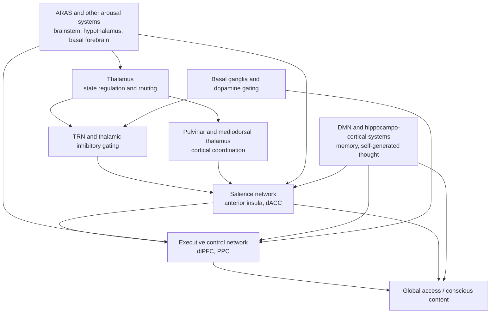
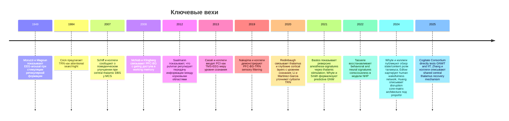

# Роль ретикулярной формации, таламуса, таламического ретикулярного ядра и крупных корковых сетей в выборе содержания сознания

## Executive summary

Современная литература все менее поддерживает идею о едином "центре сознания" или одном "генераторе мыслей". Вместо этого складывается многоуровневая модель, где выбор содержания сознания возникает из взаимодействия по меньшей мере пяти классов механизмов: поддержание бодрствования и общей возбудимости мозга, таламо-кортикальное маршрутизирование и тормозная фильтрация, оценка значимости внутренних и внешних сигналов, целевая стабилизация представлений в рабочей памяти и генерация внутреннего контента на основе памяти, самореференции и прогнозирования. В этом смысле вопрос "кто вбрасывает мысль в сознание" сегодня лучше формулировать как вопрос о том, какие механизмы повышают вероятность того, что некоторое представление победит в конкуренции за глобальный доступ. Такая постановка согласуется с современными обзорами по нейробиологии сознания, моделями global neuronal workspace, predictive processing и исследованиями таламуса как узла, участвующего и в состоянии сознания, и в его содержании. citeturn37search0turn32search0turn3search0turn23search0

Ретикулярная формация и более широкий восходящий арousal-субстрат, обычно обсуждаемый как ARAS, необходимы прежде всего для уровня бодрствования, а не для тонкого выбора конкретной мысли. Классический опыт Moruzzi и Magoun показал, что стимуляция стволовой ретикулярной формации вызывает десинхронизацию ЭЭГ и арousal-реакцию, а современные обзоры и высокоразрешающие картирования у человека подтверждают, что мозговой ствол, гипоталамус, базальный передний мозг и центральный таламус образуют субкортикальную сеть, поддерживающую бодрствование. Но сама по себе эта система не объясняет, почему в сознание входят именно "мысль о работе", "воспоминание" или "ощущение угрозы": она скорее задает режим доступности, усиления и переключаемости обработки. citeturn1search0turn18search0turn19search0turn27search7

Таламус, напротив, в последние годы все чаще рассматривается не как пассивное реле, а как активный координатор выбора, связывания и маршрутизации содержаний. Обзор Whyte, Redinbaugh, Shine и Saalmann делает сильный вывод: таламус занимает центральную топологическую позицию в системах, управляющих и состоянием сознания, и его содержанием. Это особенно убедительно для нескольких подсистем: intralaminar/central thalamus связан с arousal и восстановлением сознания; pulvinar участвует в синхронизации корковых областей в зависимости от внимания; mediodorsal thalamus модулирует исполнительный контроль и работу с неопределенностью; thalamic reticular nucleus, TRN, выступает как тормозной интерфейс между корой и таламусом, реализующий фильтрацию и селективное усиление. citeturn37search0turn12search1turn16search0turn37search1turn16search1

Крупные корковые сети в этой схеме играют разные роли. DMN не является просто "сетью безделья": она систематически связывается с автобиографической памятью, внутренним моделированием, самореференцией и self-generated thought. Salience network, с ведущей ролью передней инсулы и дорсальной передней поясной коры, оценивает биологическую и поведенческую значимость событий и помогает переключать мозг между внутренними и внешне-ориентированными режимами. Executive, или frontoparietal control network, стабилизирует выбранное содержание, удерживает цели, подавляет конкурентные представления и обеспечивает доступ к рабочей памяти. Текущая сильная позиция в литературе состоит не в том, что одна из этих сетей "создает сознание", а в том, что их динамическая координация определяет, какой контент будет удержан, развернут и использован для действия. citeturn22search1turn24search7turn23search0turn22search2turn22search3

Базальные ганглии и нейромодуляторные системы добавляют критически важный слой "политики доступа". Исследования рабочей памяти показали, что префронтальная кора и базальные ганглии предшествуют фильтрации иррелевантной информации и контролируют доступ содержаний к рабочей памяти. Норадреналиновая LC-система меняет neural gain и баланс между сенсорной и ассоциативной обработкой; ацетилхолин способствует вниманию и бдительности; дофамин участвует в gating и обновлении рабочих представлений; серотонин связан с бодрствованием, тонусом arousal и межсистемной регуляцией sleep-wake dynamics, хотя его роль особенно зависима от рецепторного и контекстного уровня анализа. citeturn10search1turn6search21turn2search19turn6search3turn27search2

Лучший рабочий синтез на 2026 год выглядит так: "вбрасывание" мыслей в сознание не производится одной структурой. ARAS и другие системы бодрствования поддерживают доступность обработки; таламус и TRN реализуют routing и gating; salience network присваивает приоритет; executive network удерживает выбранное представление и подавляет конкурентов; DMN и гиппокампально-корковые системы поставляют внутренний материал; базальные ганглии и neuromodulators определяют, что будет усилено, обновлено или отброшено. В сознание попадает не случайная мысль и не команда из единого центра, а представление, которое выиграло многоуровневую конкуренцию по точности прогноза, значимости, новизне, мотивационной ценности и совместимости с текущими целями. citeturn32search0turn32search2turn37search0turn23search0turn10search1

## Теоретические рамки

Для аналитики этой темы полезно различать три уровня: state of consciousness, то есть уровень бодрствования и доступности обработки; contents of consciousness, то есть что именно представлено в опыте; и conscious access, то есть становится ли представление глобально доступным для отчета, рабочей памяти, планирования и действия. Именно смешение этих уровней исторически создавало путаницу: ретикулярная формация часто описывалась как "делающая сознание", хотя в действительности она ближе к поддержанию state; наоборот, выбор конкретного контента чаще распределен между таламо-кортикальными петлями, корковыми сетями и модуляторными системами. Современные обзоры сознания и таламической литературы настойчиво подчеркивают эту трехчленную дифференциацию. citeturn37search0turn26search1turn21search19

Global neuronal workspace, GNW, в классической форме Dehaene и в современном изложении Mashour, Roelfsema, Changeux и Dehaene утверждает, что сознательным становится представление, которое достигает нелинейного "ignition", усиливается рекуррентной обработкой и становится глобально доступным множеству специализированных систем. В этой перспективе внимание не равняется сознанию, но повышает вероятность доступа; префронтально-париетальные и высокоуровневые таламо-кортикальные петли играют ключевую роль в стабилизации и распространении сигнала. Обзор Dehaene и Changeux 2011 сделал эту схему канонической, а статья 2020 года уточнила ее как гипотезу о conscious processing, а не о "месте сознания". citeturn32search1turn32search0

Predictive processing, а в более формальной версии active inference, сдвигает акцент: содержанием опыта становятся не просто наиболее сильные входы, а наилучшие иерархические гипотезы мозга о причинах сенсорных и интероцептивных сигналов. В этой логике внимание трактуется как precision-weighting, то есть как контроль доверия к prediction errors. Поэтому "вбрасывание" мысли может быть переописано как усиление некоторой гипотезы или модели мира, когда ее error, prior relevance или expected precision оказываются достаточно высокими. Современные обзоры по теориям сознания прямо указывают predictive processing как одну из наиболее влиятельных рамок, а Whyte и Smith предложили predictive global workspace как попытку формально совместить GNW и active inference. citeturn3search0turn32search2turn3search3

Attention-gating family of models не образует одной законченной теории сознания, но предлагает важнейший механизм отбора содержания. Здесь ключевые идеи связаны с TRN как "searchlight" или тормозным селектором, pulvinar как координатором межкорковой передачи и с fronto-thalamo-basal ganglia loops как системами conditional routing. Исторически метафору "attentional searchlight" для TRN сформулировали Crick и Koch, а позднейшие обзоры Pinault и эмпирические работы Halassa/Halassa-lab показали, что TRN и ассоциированные таламические петли могут действительно обеспечивать модально-специфичную фильтрацию и усиление поведения релевантной информации. citeturn2search0turn16search1turn35search0

Наиболее перспективным сегодня выглядит не выбор одной из этих рамок, а их иерархическое совмещение. Predictive processing хорошо описывает, откуда берутся конкурирующие гипотезы и как вычисляется их приоритет; attention-gating models объясняют, как таламус, TRN, pulvinar и исполнительные цепи физически маршрутизируют и усиливают потоки; GNW описывает, как победившее представление становится глобально доступным. В такой композиции ARAS и neuromodulators обеспечивают условие возможности, таламус и TRN - routing и gating, крупные сети коры - оценку значимости и целевую стабилизацию, а глобальный workspace - финальную фазу доступности. Это не окончательная теория, но именно такая гибридная архитектура лучше всего соответствует разнородным данным последних лет. citeturn32search2turn37search0turn23search0turn32search0

Особенно важным контекстом стала adversarial collaboration Cogitate Consortium 2025, где GNWT и IIT были напрямую сопоставлены в preregistered протоколе с fMRI, MEG и intracranial EEG. Исследователи нашли данные, частично совместимые с обеими теориями, но одновременно серьезно проблематизирующие их сильные версии: для IIT не подтвердилось устойчивое задне-корковое синхронное "ядро" как достаточное основание содержания, а для GNWT не обнаружилось ожидаемого универсального ignition на момент выключения стимула и оказалась ограниченной репрезентация некоторых измерений сознательного содержания в PFC. Практический вывод из этого для нашей темы важен: выбор содержания сознания, по-видимому, не сводится ни к чисто задне-корковому субстрату, ни к простому префронтальному broadcast-сценарию. citeturn38view0

## Анатомия и физиология отбора содержания сознания

Анатомически наиболее полезно представлять систему выбора содержания сознания как каскад от ствола мозга к таламусу и далее к крупным корковым сетям. Ретикулярная формация, парабрахиальная область, locus coeruleus, холинергические ядра, гипоталамические системы бодрствования и базальный передний мозг формируют субкортикальную инфраструктуру arousal. Таламус и его ретикулярное ядро реализуют routing, temporal coordination и inhibitory gating. Поверх этого работают крупные сети коры: DMN как генератор и интегратор внутреннего контента, salience network как система приоритизации и переключения, executive/frontoparietal network как поддержка цели, рабочей памяти и произвольного контроля. Базальные ганглии и neuromodulators соединяют эти уровни через loops, меняющие пороги доступа, усиление и обновление содержаний. citeturn18search0turn37search0turn23search0turn22search1turn22search2

Эта схема является синтезом современных обзоров и эмпирических работ по arousal-системам, таламусу, TRN и крупным сетям. Для онлайновых анатомических и функциональных схем особенно полезны: Fig. 1-2 в обзоре intralaminar thalamus и neurosurgery Arnts et al. 2023, Fig. 1-4 в работе Saalmann et al. 2012 по pulvinar-cortical synchrony, фигуры в обзорах Buckner et al. 2019 и Geng et al. 2024 по DMN/SN/ECN, а также многомодальное картирование субкортикальной сети бодрствования Edlow et al. 2024. citeturn13search0turn16search0turn22search1turn22search3turn37search11

Важнейшее отличие ARAS от остальных узлов состоит в том, что он в основном регулирует не содержание, а режим. Ранние опыты Moruzzi и Magoun показали, что стимуляция ретикулярной формации активирует ЭЭГ подобно естественному пробуждению. Более поздние обзоры и анализы указывают, что "восходящая ретикулярная активирующая система" - это не одна анатомическая дорожка, а распределенный ансамбль глутаматергических, моноаминергических, холинергических и нейропептидергических компонентов, связанных с таламусом, гипоталамусом, базальным передним мозгом и корой. Современная human-connectomics работа Edlow et al. показала у человека связный subcortical arousal network, поддерживающий wakefulness, но и этот результат скорее подтверждает роль ARAS как системы поддержания состояния, а не автора конкретных мыслей. citeturn1search0turn27search18turn18search0turn19search0

Таламус действует иначе. Он разделяется функционально как минимум на несколько блоков. Intralaminar and central thalamus тесно связаны с регуляцией arousal, устойчивости cortical activation и recovery in disorders of consciousness. Pulvinar регулирует синхронизацию между корковыми областями и приоритизацию сенсорных потоков. Mediodorsal thalamus участвует в executive control, гибкости поведения и работе с неопределенностью. Core-matrix architecture задает важный физиологический контраст: "core" loops более фокальны и сенсорно-специфичны, тогда как "matrix" loops шире и могут быть лучше приспособлены к диффузному broadcast и интеграции. Именно из-за этой гетерогенности сегодня бессмысленно спрашивать о "роли таламуса" в единственном числе. citeturn37search0turn13search0turn37search1turn25search0turn17search3

Таламическое ретикулярное ядро, TRN, заслуживает отдельного статуса. Это тонкая GABAergic оболочка, окружающая таламус и получающая входы как от таламуса, так и от коры, чтобы затем тормозно воздействовать на таламические relay- и association-nuclei. В теоретической литературе TRN давно описывается как возможный "attentional searchlight", а современные работы уточняют эту метафору: TRN не просто подавляет лишнее, а может осуществлять субмодально-специфичную фильтрацию, переключение режима и регулировку длительности тормозного окна. Исследования 2020 года показали молекулярно и физиологически различимые subnetwork'и TRN и два динамически различных тормозных контура в sensory thalamus, что укрепило представление о TRN как о вычислительной, а не только анатомической структуре. citeturn2search0turn16search1turn35search13turn35search6

С позиции крупных корковых сетей DMN представляет собой главный источник self-generated candidate contents. Современный взгляд на DMN описывает ее как систему, интегрирующую автобиографическую память, воображаемое будущее, социальное моделирование, семантическую интеграцию и внутреннее повествование. Важная методологическая поправка: DMN не означает "внутренние мысли всегда сознательны"; она означает, что у мозга есть сеть, систематически поддерживающая внутреннее моделирование, из которого часть содержаний затем может быть отобрана в фокус внимания и сознательный доступ. Это делает DMN естественным кандидатом на роль "генератора материала", но не "последнего селектора". citeturn22search1turn24search7turn24search5

Salience network и executive network занимают комплементарные позиции. Menon и Uddin предложили influential model, где передняя инсула чувствительна к значимым событиям и инициирует переключение между DMN и central executive network. Позднейшие обзоры triple-network модели и динамики эмоции и контроля усилили эту идею: salience network превосходно подходит на роль системы быстрой оценки "важности" сигнала, а executive network - на роль удержания релевантного представления и подавления конкурентов. В практической перспективе это означает, что спонтанно всплывшая мысль чаще всего не "выбрана" прямо DMN или прямо таламусом: ее появление отражает совпадение внутреннего генератора, приоритизационной оценки и исполнительной стабилизации. citeturn23search0turn22search2turn22search3

Базальные ганглии и neuromodulators делают эту архитектуру по-настоящему селективной. McNab и Klingberg показали, что активность PFC и basal ganglia предшествует фильтрации нерелевантной информации и определяет доступ в working memory. Nakajima, Schmitt и Halassa затем показали causal pathway, по которому PFC регулирует sensory filtering через basal ganglia-to-thalamus pathway с участием modality-specific TRN circuits. Это критично для темы "вбрасывания" мыслей: обновление содержаний в сознательном контексте, вероятно, зависит не только от таламо-кортикального route, но и от striatal gating. citeturn10search1turn35search0

Нейромодуляторы правомерно описывать как системы управления gain и policy, а не как код отдельных содержаний. LC-NE система регулирует arousal, uncertainty-driven gain и глобальную переключаемость сетей; optogenetic work 2024 показала, что tonic и burst patterns LC-входа по-разному склоняют мозг к ассоциативной или сенсорной обработке. Холинергические системы связаны с vigilance, attention и тонкой настройкой коркового сигнала. Дофаминовые механизмы участвуют в gating and updating of working memory, а также в cortico-basal ganglia-thalamic coordination. Серотонин помогает поддерживать wakefulness и влияет на arousal/sleep architecture, но его интерпретация особенно сложна из-за функциональной разнонаправленности рецепторов и контекстов. citeturn2search19turn6search0turn6search3turn10search1turn27search2

| Система | Каноническая анатомия | Основная роль в выборе содержания | На каком временном масштабе работает | Что она, вероятно, не делает в одиночку |
|---|---|---|---|---|
| ARAS | Ретикулярная формация, LC, парабрахиальная область, гипоталамус, базальный передний мозг | Поддерживает бодрствование, cortical activation, общий gain | От сотен миллисекунд до состояний минут-часы | Не кодирует детально семантику конкретной мысли |
| TRN | GABAergic оболочка таламуса | Тормозный gating, sensory filtering, attentional selection windows | Быстрые окна: миллисекунды-сотни миллисекунд | Не обеспечивает сам по себе полноценный conscious broadcast |
| Таламус | Intralaminar/central nuclei, pulvinar, MD и др. | Routing, межкорковая координация, state/content coupling | Миллисекунды-секунды | Не заменяет корковые репрезентации и долгую целевую стабилизацию |
| DMN | mPFC, PCC/precuneus, angular gyrus, медиальные темпоральные компоненты | Генерация внутреннего контента, self-generated thought, память, self-reference | Секунды и дольше | Не является единственным механизмом приоритизации и селекции |
| Salience network | Передняя инсула, dACC, подкорковые узлы | Быстрая оценка значимости, переключение между режимами | Сотни миллисекунд-секунды | Не удерживает долго сложный целевой контент без ECN |
| Executive network | dlPFC, posterior parietal cortex и связанные узлы | Целевая стабилизация, рабочая память, топ-down suppression | Сотни миллисекунд-секунды и дольше | Не производит arousal-state и не генерирует весь внутренний материал |

Примечание к таблице: синтез основан на классических и современных обзорах по arousal systems, thalamus/TRN и triple-network dynamics. citeturn27search18turn18search0turn37search0turn16search1turn22search1turn23search0turn22search2

## Эмпирические данные, ключевые эксперименты и методы

Эмпирическая база по теме складывается из нескольких почти независимых линий. Первая линия - классическая neurophysiology of arousal: от стволовой стимуляции и электроэнцефалографии до современных картирований у человека. Вторая - thalamic and TRN work на животных и у людей: записи, оптогенетика, causal manipulations, DBS, tractography. Третья - network neuroscience of spontaneous thought and cognitive control, где fMRI, EEG/MEG и lesion studies исследуют DMN, salience и executive systems. Четвертая - clinical consciousness science, включая anesthesia, sleep, disorders of consciousness, covert consciousness и neuromodulation. Именно совмещение этих линий делает нынешнюю картину убедительной. citeturn21search19turn20search1turn37search0

Хронология выше опирается на классические и недавние работы, которые изменили само понятие о том, что именно выбирает содержание сознания и на каком уровне происходит отбор. citeturn1search0turn2search0turn1search1turn10search1turn16search0turn9search0turn35search0turn36search0turn35search13turn35search6turn35search3turn32search2turn36search4turn37search0turn37search15turn25search0turn38view0turn36search5

В animal work таламо-кортикальная линия особенно сильна. Saalmann et al. показали у макак, что pulvinar синхронизирует активность между связанными корковыми областями в зависимости от allocation of attention. Это был переломный результат: он указывал, что таламус не только передает сенсорику, но и регулирует межкорковую коммуникацию в соответствии с поведенческими требованиями. Позже Redinbaugh et al. показали, что нейроны таламуса и глубоких корковых слоев особенно чувствительны к уровням consciousness across anesthetics, а Bastos et al. - что thalamic stimulation у обезьян способна обратить электрофизиологические признаки propofol-induced unconsciousness. Еще один важный шаг сделан Tasserie et al.: central thalamic DBS у anesthetized nonhuman primates восстанавливала behavioral and neural signatures, которые многие трактуют как маркеры возврата consciousness-related processing. citeturn16search0turn36search0turn35search3turn36search4

TRN-ориентированная animal literature делает выводы более конкретными. Nakajima et al. показали, что префронтальная кора causal образом регулирует sensory filtering через basal ganglia-to-thalamus route с involvement of modality-specific TRN circuits. Li et al. и Martinez-Garcia et al. затем уточнили, что TRN не однородно: в нем существуют субсети и разные inhibitory motifs, по-разному обрабатывающие классы таламической информации. Вместе эти работы сильно поддерживают attention-gating view: содержание не просто "входит" в сознание, а проходит через динамические тормозные фильтры, управляемые как корой, так и subcortical loops. citeturn35search0turn35search13turn35search6

Human lesion, stimulation and neurosurgery literature особенно важны, потому что они показывают, что central thalamus и связанные сети не просто коррелируют с состоянием сознания, а могут его причинно модифицировать. В классическом кейсе Schiff et al. bilateral DBS central thalamus привела к устойчивым поведенческим улучшениям у пациента в minimally conscious state. Проспективное исследование CATS 2016 подтвердило улучшение clinical status и EEG-desynchronization при bilateral thalamic stimulation, пусть и без полного возвращения полноценного сознательного поведения у всех пациентов. Ближайшие современные расширения этой линии - connectomic analyses и intracranial studies 2024-2025 годов, где исход DBS все лучше связывают с конкретными preserved brain networks. citeturn1search1turn13search1turn13search5turn36search5

Исследования arousal network у человека тоже стали существенно точнее. Edlow et al. 2024 с использованием multimodal MRI показали brainstem connections, поддерживающие wakefulness in human consciousness, а обзор Taran et al. 2023 систематизировал клиническое значение ARAS для disorders of consciousness и расстройств бодрствования. При этом, как подчеркивает обзор Grady et al. 2022, после "столетия поисков" вопрос о том, какие именно нейроны brainstem are necessary for wakefulness, все еще открыт: arousal system лучше понимать как ансамбль частично избыточных и частично специализированных контуров, а не как одну "кнопку бодрствования". citeturn18search0turn18search1turn19search0

EEP/MEG and intracranial evidence важны для разделения ранних и поздних correlates of consciousness. Обзор Förster et al. 2020 показывает, что наиболее устойчивым EEG/MEG correlate onset of visual consciousness является visual awareness negativity, VAN, тогда как поздний P3/P300 часто отражает уже post-perceptual processing, including report and task demands. Это хорошо согласуется с no-report program Tsuchiya et al. и недавними no-report masking studies, которые стремятся отделить "истинные" NCC от процессов отчета, решения и моторной подготовки. Для темы "вбрасывания" мыслей отсюда следует сильный методологический урок: то, что мы видим как фронтальную активацию при осознании, нередко содержит примесь процессов контроля и отчета, а не чистого отбора содержания. citeturn32search4turn9search1turn33search3

TMS-EEG complexity research добавляет еще один слой. Casali et al. ввели perturbational complexity index, PCI, показав, что сознательные состояния характеризуются более сложными и одновременно интегрированными паттернами ответов на perturbation, чем unconscious states. Более поздние разработки, включая fractal-dimension approaches и многочисленные qEEG studies in disorders of consciousness, поддерживают идею, что для consciousness essential не просто "активация", а сложная распределенная причинная динамика cortico-thalamic system. Однако PCI больше измеряет capacity for consciousness, чем конкретный content, и поэтому оно полезно как state-marker, но слабее как прямое объяснение механизма выбора мысли. citeturn9search0turn8search0turn39search5turn39search17

Наконец, сеть DMN-SN-ECN изучалась главным образом у человека через resting-state and task fMRI. Buckner et al. систематизировали DMN как сеть внутреннего моделирования, Menon и последующие авторы - salience network как переключатель и priority-detector, а большое число clinical and cognitive studies показало, что нарушения взаимодействия этих сетей сопровождают mind-wandering pathology, depression, PTSD, ADHD and post-traumatic attention problems. В контексте предмета это означает: large-scale network literature хорошо поддерживает идею competition between internal mentation, salience-driven interruption and executive stabilization, хотя реальный механизм перехода от "subthreshold candidate" к "conscious thought" все еще описан скорее на уровне моделей, чем исчерпывающе прямых наблюдений. citeturn22search1turn23search0turn22search2turn7search1turn7search2turn12search2

| Метод | Что дает для темы | Сильные стороны | Основные ограничения | Где особенно полезен |
|---|---|---|---|---|
| fMRI | Карты large-scale networks, thalamocortical connectivity, DMN/SN/ECN dynamics | Высокое пространственное разрешение, whole-brain coverage | Низкое временное разрешение, гемодинамические confounds, корреляционность | Сопоставление внутренних режимов, network switching, anesthesia/DoC |
| EEG/MEG | Временная динамика доступа, oscillations, complexity, VAN/P3, microstates | Миллисекундное разрешение, bedside feasibility, чувствительность к state changes | Обратная задача, слабая локализация deep sources | Conscious access timing, sleep/anesthesia, covert consciousness |
| Intracranial recordings | Single-neuron/LFP, laminar and deep recordings, causal timing | Наилучшее сочетание temporal/spatial resolution, доступ к thalamus при SEEG/DBS | Редкие и клинически обусловленные выборки, sparse sampling | Thalamus-cortex coupling, report vs awareness dissociation |
| Stimulation | Causal tests: TMS, DBS, tFUS, direct electrical stimulation | Причинный inference, возможность rescue или disruption | Targeting issues, safety, heterogeneous protocols | Проверка gating hypotheses и клиническая neuromodulation |
| Lesion studies и lesion-network mapping | Необходимость структуры/сети для consciousness/attention | Сильный causal leverage, клиническая валидность | Негомогенные повреждения, plasticity, network diaschisis | Coma, neglect, executive deficits, awareness disorders |
| Optogenetics и chemogenetics | Клеточно-типовая причинность в animals | Высочайшая специфичность, circuit dissection | Ограниченная переносимость на человека, species differences | ARAS microcircuits, TRN subnetworks, LC gain control |

Примечание к таблице: обобщение опирается на современные обзоры и методологические работы по consciousness diagnostics, no-report paradigms, TMS-EEG/PCI, human neuromodulation и circuit-level animal studies. citeturn21search1turn9search1turn9search0turn20search2turn21search2turn35search13

| Авторы, год | Метод | Основной вывод | DOI / PMID | Источник |
|---|---|---|---|---|
| Moruzzi, Magoun, 1949 | Стимуляция ствола, EEG | Ретикулярная формация вызывает cortical arousal и десинхронизацию ЭЭГ | PMID 18421835 | citeturn1search0 |
| Crick, 1984 | Теоретическая статья | TRN предложено как attentional searchlight | PMID 6589612 | citeturn2search0 |
| Schiff et al., 2007 | Central thalamic DBS, clinical case | Bilateral CT-DBS улучшила поведенческую responsiveness у MCS пациента | PMID 17671503 | citeturn1search1 |
| McNab, Klingberg, 2008 | Human fMRI | PFC и basal ganglia контролируют доступ в working memory | DOI 10.1038/nn2024; PMID 18066057 | citeturn10search1 |
| Saalmann et al., 2012 | DTI + multi-site recording in monkeys | Pulvinar регулирует межкорковую передачу информации в зависимости от внимания | DOI 10.1126/science.1223082; PMID 22879517 | citeturn16search0 |
| Casali et al., 2013 | TMS-EEG | PCI различает сознательные и бессознательные состояния независимо от поведения | DOI 10.1126/scitranslmed.3006294; PMID 23946194 | citeturn9search0 |
| Nakajima et al., 2019 | Mouse circuit study, optogenetics/physiology | PFC causal образом регулирует sensory filtering через BG-thalamus pathway/TRN | DOI 10.1016/j.neuron.2019.05.026; PMID 31202541 | citeturn35search0 |
| Li et al., 2020 | Single-cell atlas + physiology | В TRN существуют distinct subnetworks, связанные с функциональной организацией | DOI 10.1038/s41586-020-2504-5; PMID 32699411 | citeturn35search13 |
| Martinez-Garcia et al., 2020 | Circuit physiology | В sensory thalamus действуют два динамически различных inhibitory circuits | DOI 10.1038/s41586-020-2512-5; PMID 32699410 | citeturn35search6 |
| Redinbaugh et al., 2020 | NHP, laminar recordings under anesthesia | Thalamus и deep cortical layers особенно чувствительны к уровню consciousness | DOI 10.1016/j.neuron.2020.01.005; PMID 32053769 | citeturn36search0 |
| Bastos et al., 2021 | NHP electrophysiology + thalamic stimulation | Thalamic stimulation обращает signatures propofol-induced unconsciousness | DOI 10.7554/eLife.60824; PMID 33904411 | citeturn35search3 |
| Whyte, Smith, 2021 | Computational active inference model | Predictive GNW формализует conscious access как inference + workspace dynamics | DOI 10.1016/j.pneurobio.2020.101918; PMID 33039416 | citeturn32search2 |
| Tasserie et al., 2022 | NHP DBS under anesthesia | Central thalamic DBS восстанавливает behavioral и neural signatures consciousness | DOI 10.1126/sciadv.abl5547; PMID 35302854 | citeturn36search4 |
| Edlow et al., 2024 | Multimodal MRI in humans | Картирование brainstem connections, поддерживающих wakefulness | DOI 10.1126/scitranslmed.adj4303; PMID 38691619 | citeturn37search15 |
| Whyte et al., 2024 | Neuron review | Таламус играет центральную топологическую роль в state and contents of consciousness | DOI 10.1016/j.neuron.2024.04.019; PMID 38754373 | citeturn37search0 |
| Wolff, Halassa, 2024 | Neuron review | Mediodorsal thalamus регулирует activity within and across frontal cortical networks | DOI 10.1016/j.neuron.2024.01.002; PMID 38295791 | citeturn37search1 |
| Huang et al., 2024 | Human anesthesia neuroimaging | Propofol disrupts thalamic core-matrix functional architecture | PMID 38328136 | citeturn25search0 |
| Cogitate Consortium, 2025 | Adversarial collaboration, fMRI/MEG/iEEG | Данные частично совпадают с IIT и GNWT, но бросают вызов сильным версиям обеих | DOI 10.1038/s41586-025-08888-1 | citeturn38view0 |
| Zhang et al., 2025 | DoC patients, central thalamus recordings | Описан shared central thalamus mechanism of recovery across DoC | DOI 10.1038/s41467-025-65360-4; PMID 41285808 | citeturn36search5 |

## Рабочая синтетическая модель, противоречия, ограничения и приложения

Наиболее продуктивная рабочая гипотеза сегодня состоит в том, что выбор содержания сознания реализуется как многоэтапная конкуренция представлений. Источники-кандидаты поставляются из сенсорики, интероцепции, памяти и self-generated thought. Salience network и neuromodulatory systems назначают этим кандидатам приоритет, зависящий от угрозы, новизны, вознаграждения, ошибки прогноза и актуальной телесной/мотивационной значимости. Таламус, pulvinar и TRN маршрутизируют и фильтруют сигналы, а executive loop удерживает те из них, которые совместимы с текущей задачей или становятся слишком значимыми, чтобы быть проигнорированными. Если представление достигает достаточного уровня устойчивости и глобальной доступности, оно становится содержанием сознания; если нет, оно остается фоновым, прайминговым или быстро угасающим. Эта схема согласуется с predictive-gating-GNW synthesis лучше, чем любая из рамок по отдельности. citeturn32search2turn37search0turn23search0turn32search0

Внутри этой модели можно выделить по меньшей мере три механизма. Gain control означает, что arousal- и neuromodulatory systems меняют соотношение сигнала и шума, делая систему более восприимчивой к определенному классу входов; примером служат LC-mediated changes in processing mode и thalamocortical excitability modulation under uncertainty. Gating означает, что конкретные петли - прежде всего TRN, thalamus и basal ganglia - регулируют сам доступ потока к рабочей памяти и к последующей межсетевой интеграции. Priority maps означают, что spatial, sensory, interoceptive and goal-related variables конвертируются в ранжирование конкурирующих репрезентаций: в это, по-видимому, вносят вклад superior colliculus-thalamus interactions, pulvinar and salience-executive coupling, although единая и полностью верифицированная нотация таких priority maps для человеческого сознательного мышления пока отсутствует. citeturn2search19turn2search17turn35search0turn12search3turn23search0

Крупные противоречия сосредоточены вокруг четырех вопросов. Первый: насколько префронтальная кора несет собственно содержание, а насколько - процессы отчета, метакогниции и действия. Second: требуется ли таламус только для state regulation и cortical coordination, или отдельные thalamic nuclei вносят вклад в семантически/когнитивно определяемое содержание. Third: как exactly соотнести spontaneous thought, DMN dynamics и conscious access - ведь значительная часть внутренней генерации может не доходить до устойчивого осознания. Fourth: насколько neural signatures, полученные во сне, под anesthesia и при DoC, действительно изоморфны нормальному механизму возникновения мысли в бодрствовании. Эти противоречия не являются peripheral detail; они определяют, как именно интерпретировать все поле. citeturn38view0turn37search0turn24search8turn21search10

Методологические ограничения здесь особенно серьезны. fMRI прекрасно показывает whole-brain network topology, но слишком медленна для microdynamics of thought onset. EEG/MEG быстро фиксируют динамику, но глубинные источники, включая thalamus and brainstem, восстанавливаются неточно. Intracranial recordings дают мощнейшую каузальную и временную информацию, но выборки по необходимости клинические, анатомически неполные и культурно далеки от "нормальной" популяции. Lesion studies ценны своей причинностью, но страдают от diaschisis и сетевых вторичных эффектов. Animal optogenetics почти идеальна для клеточно-типового вывода, но особенно рискованна при переносе на человеческие ассоциативные и самореференциальные процессы. Наконец, report-based paradigms систематически загрязняют истинные NCC процессами решения, моторики и metacognitive framing. citeturn21search1turn9search1turn20search2turn21search2

С практической точки зрения особенно перспективны приложения в медитации. Исследования показывают, что meditation связана со снижением активности DMN, изменениями coupling between DMN, salience and executive networks и, в predictive-processing terms, может быть понята как тренировка precision control над внутренними моделями и self-related inference. Это не означает "выключение мыслей", но означает изменение вероятности того, что внутренне сгенерированный контент будет автоматически захвачен conscious access. Для темы выбора содержания сознания это почти идеальная естественная лаборатория. citeturn24search3turn7search0turn7search10turn3search1

В ADHD и родственных расстройствах внимания ключевой мотив - нарушенная деактивация DMN и атипичное взаимодействие DMN с executive systems, из-за чего mind-wandering и goal-irrelevant thought чаще прорываются в поток задачи. В депрессии мета- и систематические обзоры десятилетия стабильно указывают на altered connectivity within anterior DMN и нарушения в SN/ECN coupling, что хорошо согласуется с клинической картиной руминативного захвата сознания. Triple-network interpretation депрессии и ADHD потому ценна, что превращает субъективные жалобы "мысли сами лезут", "не могу их остановить", "задача распадается" в операционализируемый neurocircuit-level framework. citeturn7search1turn7search2turn22search2turn7search6

Для снотворных, анестетиков и седативных средств самое интересное не то, что они "выключают сознание", а то, что они показывают разную организацию его разрушения и восстановления. PCI-исследования, propofol work, analyses of core-matrix architecture и thalamic rescue paradigms показывают, что потеря сознательного доступа связана не только с уменьшением активации, но с распадом определенных patterns of integration, complexity and thalamocortical routing. Это делает фармакологические манипуляции одним из лучших инструментов для тестирования mechanistic models of conscious selection. citeturn9search0turn35search3turn25search0turn32search6

Нейроинтерфейсы и нейромодуляция - еще одно быстро растущее приложение. Task-based EEG/fMRI, TMS-EEG, neural decoding и BCI-подходы позволяют выявлять covert consciousness у части поведенчески неотвечающих пациентов; DBS, TMS и tFUS рассматриваются как способы causally модулировать узлы, участвующие в доступе к сознательному содержанию. Но здесь есть пределы: текущие системы лучше детектируют preserved command following или state capacity, чем "текущую мысль" как богатый семантический объект. Переход от оценки наличия сознания к декодированию содержания мысли только начался и сопровождается серьезными интерпретационными и этическими ограничениями. citeturn21search4turn21search24turn39search6turn39search9turn20search2

Если свести все противоречия к одному тезису, он будет таким: сегодняшняя наука очень хорошо описывает условия, сети и контуры, повышающие или понижающие шанс некоторого представления стать сознательным, но все еще не имеет исчерпывающей обще-принятой формулы, которая бы по единичной пробе предсказала конкретное содержание следующей мысли человека. В этом смысле проблема "вбрасывания мыслей" сейчас находится на границе между описанием state-control, network routing, self-generated thought и computational selection, а не в одной локальной карте мозга. citeturn37search0turn38view0turn24search5

## Структура книги и программа дальнейшей работы

Если превращать этот материал в книгу исследовательского уровня, разумна структура из десяти глав общим объемом порядка 380-460 страниц. Ниже - рабочий каркас, ориентированный на академический текст, где читатель получает и теорию, и анатомию, и методы, и критический анализ. Это предложение авторской архитектуры, а не вывод конкретной статьи.

| Глава | Содержание | Примерный объем |
|---|---|---|
| Введение в проблему | Что такое state, content, access, thought onset; почему вопрос о "вбрасывании" мыслей не сводится к одной структуре | 20-25 стр. |
| История идей | От Moruzzi-Magoun и reticular formation до GNW, predictive processing и triple-network frameworks | 30-40 стр. |
| Анатомия arousal systems | Ретикулярная формация, ARAS, hypothalamus, basal forebrain, LC, raphe, cholinergic systems | 40-50 стр. |
| Таламус как координатор | Intralaminar nuclei, pulvinar, mediodorsal thalamus, core-matrix architecture, central thalamus | 45-60 стр. |
| Таламическое ретикулярное ядро | TRN anatomy, inhibitory motifs, searchlight theory, sensory filtering, cognitive gating | 30-40 стр. |
| Крупные корковые сети | DMN, salience, executive/control, hippocampo-cortical loops, self-generated thought | 45-55 стр. |
| Базальные ганглии и neuromodulators | Dopamine, norepinephrine, serotonin, acetylcholine; gating, gain, updating, policy selection | 35-45 стр. |
| Эмпирические методы и ключевые эксперименты | EEG/MEG, fMRI, iEEG, lesion studies, stimulation, optogenetics, anesthesia, DoC | 50-65 стр. |
| Интегративные модели и споры | GNW, predictive processing, attention-gating, Cogitate, no-report debates, posterior vs frontal controversies | 45-55 стр. |
| Приложения и будущее | Медитация, ADHD, depression, anesthesia, neurotechnology, BCI, precision neuromodulation | 25-35 стр. |

Для такой книги особенно полезно строить каждую главу вокруг пары "mechanism + falsifiable prediction". Это позволит не просто пересказать литературу, а постоянно возвращать читателя к вопросу: что именно мы ожидаем увидеть, если данный механизм действительно участвует в выборе сознательного содержания.

Ниже - рекомендуемый набор экспериментов и моделей для дальнейшей работы, уже не как обзор прошлого, а как agenda for research.

| Эксперимент или модель | Что проверяет | Предпочтительный дизайн | Наиболее информативные readouts |
|---|---|---|---|
| Simultaneous thalamus-insula-PFC recording during spontaneous thought | Как внутренний контент становится приоритетным | Human SEEG/DBS patients + experience sampling without mandatory report on every trial | LFP coherence, spiking, pupil, behavioral probes |
| Closed-loop perturbation at mind-wandering onset | Можно ли causally сдвигать вероятность сознательного захвата мысли | EEG/MEG + pupil-triggered TMS or tFUS to salience/thalamic targets | VAN/P3, network switching, subjective reports |
| Predictive-gating computational model | Можно ли совместить precision control, thalamic routing и workspace ignition | Active inference model with TRN, thalamus, basal ganglia and ECN/DMN modules | Trial-wise predictions for awareness, RT, confidence |
| Laminar thalamocortical recordings under anesthesia and recovery | Какие слои и ядра первыми восстанавливают content-capacity | NHP laminar probes + DBS + graded anesthesia | Spike-LFP coupling, complexity, causal connectivity |
| Meditative state perturbation study | Как training меняет "захват" внутренним контентом | Experienced meditators vs controls; no-report and report blocks | DMN coupling, salience switching, meta-awareness markers |
| Depression-rumination gating study | Почему негативный self-content получает аномальный приоритет | Rest-task hybrid fMRI/EEG with affective and neutral internal cues | DMN-SN-ECN coupling, thalamic connectivity, pupil/LC proxies |
| Human thalamic focused ultrasound pilot | Можно ли неинвазивно менять access/gain without DBS | tFUS to central thalamic or pulvinar-associated targets | Vigilance, working memory gating, subjective internal mentation |
| Dataset standardization program | Как уменьшить confirmation bias в теориях сознания | Pre-registered, multi-site, multi-method, adversarial design | Shared benchmark metrics, open annotations, reproducibility |

С точки зрения моделирования я бы рекомендовал не ограничиваться чистой graph-theory или только classifier-подходами. Наиболее обещающей выглядит трехслойная архитектура моделей: слой state-control, где ARAS и neuromodulators задают global gain; слой routing/gating, где thalamus, TRN и basal ganglia реализуют селекцию каналов и обновление контекста; слой representational competition, где DMN, salience и executive modules соревнуются за доступ к workspace. Такой подход лучше, чем плоские network models, потому что он соответствует иерархии анатомии и реально наблюдаемым dissociations between wakefulness, attention, report and conscious content. citeturn18search0turn37search0turn23search0turn10search1turn32search2

Финальный исследовательский тезис книги мог бы звучать так. Ретикулярная формация не "вбрасывает мысли" в сознание в содержательном смысле; она и связанные arousal systems создают режим, в котором сознательный доступ вообще возможен. Таламус и TRN не "думают", но маршрутизируют, синхронизируют и фильтруют вероятных кандидатов. DMN и гиппокампально-корковые контуры производят значительную долю внутреннего материала. Salience network решает, что должно быть срочно переоценено. Executive network удерживает то, что имеет наибольшую ценность для текущей задачи. Базальные ганглии и neuromodulators определяют, что будет усилено, обновлено или закрыто для доступа. Сознательная мысль поэтому есть не продукт одной зоны, а кратковременная победа распределенного коалиционного процесса в мозге. citeturn37search0turn23search0turn22search1turn10search1turn18search0