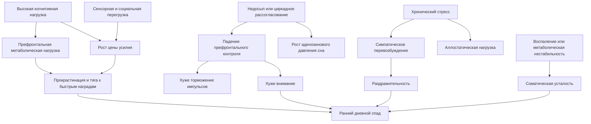
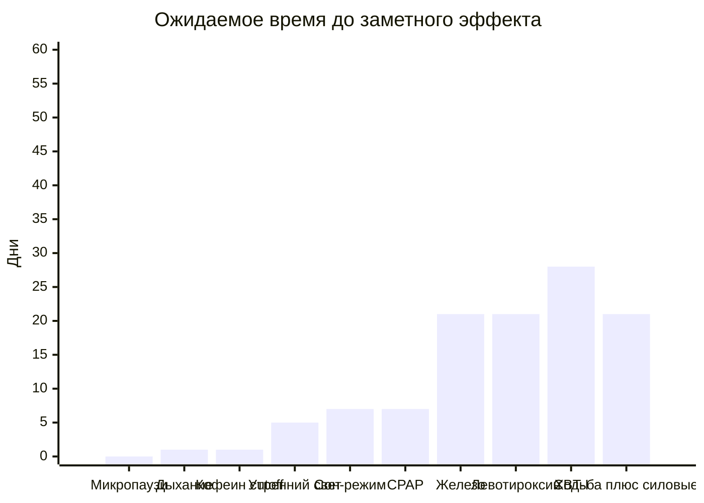
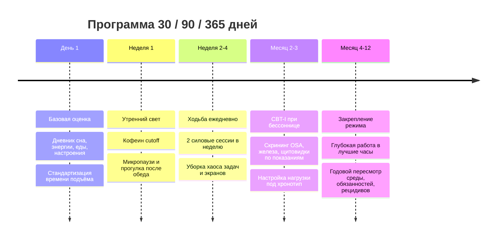
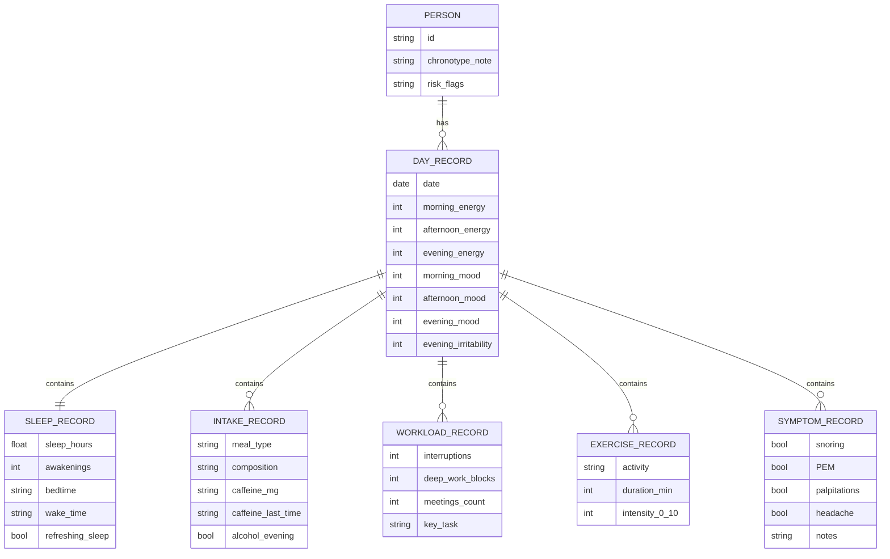

# Системные способы увеличить дневную энергию и ментальную выносливость

## Executive summary

Дневная энергия и ментальная выносливость - это не одно свойство, а итог взаимодействия нескольких систем: сна и циркадной синхронизации, префронтального когнитивного контроля, нейромедиаторных систем мотивации и бодрствования, автономной нервной системы, воспалительного фона, метаболической стабильности, а также скрытых клинических состояний вроде обструктивного апноэ сна, железодефицита, гипотиреоза и ME/CFS. Поэтому устойчивый дефицит энергии почти никогда не исправляется одной "силой воли" или одним стимулятором; он требует последовательного устранения "утечек" и лечения причин. citeturn6search0turn22search1turn2search0turn13search6turn3search12turn26search3turn14search0

Самые надёжные системные рычаги, по совокупности обзоров, мета-анализов, RCT и клинических руководств, это: регуляризация сна и лечение бессонницы через CBT-I, устранение циркадного рассогласования, регулярная физическая активность, снижение рабочей фрагментации и микропаузами, адресное лечение сонных расстройств, а также коррекция железодефицита и явного гипотиреоза, если они обнаружены. Напротив, поздний кофеин, компенсаторное "дожимание" на фоне недосыпа, хаотичная многозадачность и попытка лечить ME/CFS схемой фиксированного наращивания нагрузки часто ухудшают состояние. citeturn32search1turn1search2turn27search1turn6search1turn1search3turn13search1turn13search6turn3search12turn26search0turn14search4turn16search8turn9search2

Нейрофизиологически ключевой узел - префронтальная кора. Она удерживает цель, рабочую память, торможение импульсов и эмоциональную регуляцию, поэтому именно она особенно уязвима к недосыпу, затяжной когнитивной нагрузке, высокому норадренергическому стрессу и накоплению "стоимости усилия". Работа Wiehler и соавт. в Current Biology показала, что день напряжённой когнитивной работы связан с ростом глутамата в латеральной префронтальной коре и более частым выбором "лёгких" опций с быстрым вознаграждением; это хорошо согласуется с более широкими моделями когнитивной усталости, где утомление понимается как рост субъективной цены контроля, а не просто "кончилась глюкоза". citeturn22search1turn21search4turn21search19

Дофамин, норадреналин, серотонин, аденозин, глутамат и ГАМК в этой системе играют разные роли. Дофамин больше связан с готовностью платить усилием за результат, норадреналин - с уровнем активации и селективностью внимания, аденозин - с нарастающим гомеостатическим давлением сна, глутамат и ГАМК - с балансом возбуждения и торможения, а серотонин - в большей степени с регуляцией настроения, сонливости и мотивационного тона, чем с узко понимаемой "умственной мощностью". Это объясняет, почему человек может быть одновременно "энергичным" и малоустойчивым: высокая активация не равна хорошей саморегуляции. citeturn21search0turn21search1turn21search2turn21search4turn21search20turn31search2turn31search6

Для людей с ADHD и аутизмом дневной ресурс особенно сильно зависит от цены регуляции, сенсорной нагрузки и требований к маскированию или длительному самоконтролю. У взрослых с ADHD чаще встречаются усталость и эмоциональная дисрегуляция; у аутичных взрослых описаны хроническое истощение, потеря навыков и сниженная толерантность к сенсорной и социальной нагрузке как часть феномена autistic burnout. Для ME/CFS текущие руководства NICE и CDC акцентируют pacing и предотвращение post-exertional malaise, а не фиксированные инкременты физической нагрузки. citeturn11search0turn11search1turn12search0turn12search1turn14search0turn14search4turn14search6

Если цель - системно помочь другому человеку, то лучший подход состоит не в моральном давлении, а в снижении цены его дня: больше ясности, меньше неопределённости и фрагментации, лучшее согласование графика с хронотипом, защита сна, уменьшение сенсорной перегрузки, создание автономии и раннее распознавание клинических причин истощения. Это соответствует WHO Guidelines on Mental Health at Work и Framework U.S. Surgeon General по рабочему благополучию, где организационные вмешательства, обучение менеджеров и изменение условий труда считаются более фундаментальными, чем попытки "чинить" индивидуальные симптомы изолированно. citeturn19search1turn19search3turn19search5turn19search15turn19search0

## Архитектура дневной энергии и ключевые механизмы

Полезнее всего рассматривать дневную энергию как произведение пяти величин: базовой ёмкости, стоимости усилия, устойчивости эмоциональной регуляции, скорости восстановления и общего "бремени болезни". У двух людей может быть одинаковый интеллект и даже сходная мотивация, но разные расходы на одну и ту же работу: один решает задачи автоматизированно и в подходящий биологический час, другой платит префронтальной корой за каждый шаг, потому что плохо спал, живёт вне своего хронотипа или компенсирует тревогу и сенсорную перегрузку постоянным самоконтролем. citeturn22search1turn25search1turn0search1turn23search11

Префронтальная кора - главный "дорогой" ресурс дня. Она поддерживает рабочую память, выбор по правилам, подавление лишних реакций, удержание цели и регуляцию эмоций. Длительная нагрузка на когнитивный контроль связана с тем, что более "дорогие" решения начинают восприниматься как субъективно менее выгодные. В той же линии работ было показано, что утомление смещает выбор к быстрым и менее усилиеёмким наградам, а латеральная префронтальная кора участвует в кодировании способности прикладывать ментальное усилие. citeturn22search1turn21search19turn21search4

Дофаминовая система особенно важна не для "удовольствия вообще", а для готовности инвестировать усилие. Обзоры по effort-based decision making и PET-исследования у людей показывают, что дофамин связан с готовностью тратить больше усилия ради большего вознаграждения, особенно когда оно отсрочено или менее гарантировано. Практический вывод такой: низкая дневная энергия часто переживается как "не могу заставить себя", но на уровне механизма это нередко рост стоимости усилия, а не дефицит понимания задачи. citeturn21search0turn21search8turn21search12

Норадреналин из locus coeruleus регулирует бодрствование, переключение между исследованием и фокусом, а также отношение между тревожной мобилизацией и оптимальной настороженностью. В этом смысле "много энергии" может означать две разные вещи: либо спокойную активацию в рабочем диапазоне, либо стрессовую избыточную активацию с резким вечерним откатом. Именно поэтому человек на высоком стрессе может утром быть очень быстрым и ярким, а к полудню стать нетерпимым, раздражительным и когнитивно негибким. citeturn21search1turn21search5turn21search16turn21search24

Аденозин отвечает за нарастающее давление сна во время бодрствования. Современные обзоры подтверждают классическую двухпроцессную модель регуляции сна Борбели: гомеостатическое давление сна растёт по мере бодрствования, а циркадный процесс управляет временем максимальной сонливости и бодрости. Кофеин временно блокирует аденозиновые рецепторы и поэтому способен резко улучшить субъективную бодрость, но при позднем употреблении он сокращает общее время сна, снижает эффективность сна и долю глубокого сна. Это превращает кофе в хороший краткосрочный инструмент и плохой фундамент. citeturn0search6turn21search2turn21search25turn9search2

Глутамат и ГАМК задают общий баланс возбуждения и торможения. Наиболее интересные данные последних лет касаются именно когнитивной усталости: при многократном включении контроля у части людей может расти метаболическая цена дальнейшего усилия, а сон и отдых, вероятно, нужны в том числе для восстановления этого баланса. При этом важно не переупростить картину: глутаматная гипотеза когнитивной усталости убедительна, но пока не объясняет всех форм усталости, особенно клинических синдромов с системным воспалением, болью или постинфекционными нарушениями. citeturn22search1turn22search4turn21search22turn21search30

Серотонин в контексте дневной выносливости действует главным образом через сонливость, аффективный тон и субъективную "тяжесть" усилия. Классическая центральная гипотеза усталости связывала более высокий серотонин относительно дофамина с чувством вялости и сонливости, но для повседневной когнитивной усталости роль серотонина более косвенная и заметно менее специфичная, чем роль сна, дофамина, норадреналина и циркадных факторов. Поэтому серотонин важен для настроения и общей регуляции, но не должен объяснять всё один. citeturn31search2turn31search5turn31search6turn31search7

Стресс и аллостаз добавляют в систему ещё одну цену. Краткий стресс может помогать, но хронический стресс переводит организм в состояние накопленной аллостатической нагрузки. В этой модели мозг сам является центральным органом стресса: он не только реагирует на угрозы, но и меняется под их действием. Хроническая активация стрессовых систем связана с нарушением сна, воспалением, ухудшением когнитивной гибкости и уязвимостью к перепадам настроения. citeturn2search0turn2search3turn2search5turn10search10

Автономная нервная система - это не "приятное дополнение", а часть регуляторного каркаса. Модель neurovisceral integration и последующие обзоры показывают, что более высокий вагальный тонус и более высокая вариабельность сердечного ритма в среднем связаны с лучшими исполнительными функциями и саморегуляцией. Однако HRV - не универсальный оракул: это полезный биомаркер тренда, а не диагноз. Гораздо важнее практический принцип: хорошая выносливость требует не вечного симпатического "газа", а способности быстро включаться и так же быстро возвращаться в восстановительный режим. citeturn4search0turn4search9turn4search24turn4search1turn4search7

Воспаление и метаболизм тоже участвуют в дневной энергии. Нарушения сна связаны с повышением системных воспалительных маркеров, а хронический стресс может сдвигать иммунную систему в сторону воспаления. Со стороны питания и метаболики наиболее практичен не спор о "идеальной диете", а принцип стабильной гликемии, достаточного белка, клетчатки и минимизации крупных постпрандиальных провалов. В исследованиях прерывание длительного сидения короткими физическими вставками уменьшало постпрандиальную гликемию и отсрочивало снижение бодрости и рост усталости после еды. citeturn10search0turn2search5turn10search10turn16search2turn16search8turn16search16

Хронотип и циркадная синхронизация задают, когда мозг вообще готов к сложной работе. Обзоры по времени суток и хронотипу подтверждают, что когнитивная продуктивность зависит не только от сна как количества, но и от совпадения внешнего расписания с внутренним временем. Отсюда важный практический вывод: часть "недостатка энергии" у вполне здоровых людей - это не патологическая усталость, а хронический social jetlag. citeturn25search1turn0search0turn25search7

Нейроразнообразие меняет не столько "заряд батарейки", сколько цену регуляции. У взрослых с ADHD чаще описываются эмоциональная дисрегуляция, усталость, больший разброс работоспособности в зависимости от интереса и более высокая цена для длительного поддержания внимания. У аутичных взрослых сенсорная перегрузка, социальное маскирование и постоянная адаптация к неподходящей среде могут приводить к хроническому истощению и "autistic burnout". Поэтому для этих групп полезно думать не только о лечении, но и о дизайне среды. citeturn11search0turn11search1turn11search2turn12search0turn12search1turn29search20

Схема выше - это синтетическая модель, а не одна доказанная линия причинности. Она объединяет современные данные по сну, когнитивной усталости, стрессу, ANS и циркадным механизмам: у реального человека обычно работают сразу несколько путей, а не один. citeturn22search1turn21search2turn2search0turn4search0turn10search0turn25search1

## Обзор литературы и сравнительная оценка вмешательств

Если смотреть на доказательную базу не по громкости обещаний, а по качеству сигналов, то лидируют четыре класса вмешательств. Первый - сон и циркадная синхронизация. Второй - физическая активность и снижение сидячей фрагментации дня. Третий - лечение клинических причин, если они есть. Четвёртый - изменение структуры работы и среды, чтобы снизить ежедневную цену когнитивного контроля. Для большинства "здоровых, но истощённых" людей именно эти четыре класса дают наибольшую отдачу. citeturn6search0turn32search1turn6search1turn1search3turn13search6turn3search12turn19search3

Для хронической бессонницы консенсус руководств и мета-анализов очень устойчив: CBT-I - первая линия лечения, а её эффекты касаются не только ночного сна, но и дневных симптомов, функционального здоровья и психологического благополучия. И очная, и цифровая формы работают, хотя величина дневного эффекта по мета-анализам чаще малая или умеренная, а не "чудесная". Это важно для реалистичных ожиданий: бессонница редко исчезает за два дня, но системная работа со сном меняет именно whole-day functioning. citeturn32search1turn32search3turn1search2turn27search1turn27search6

Регулярная физическая активность - второй столп. Руководства CDC и WHO сохраняют ориентир не менее 150 минут умеренной аэробной активности в неделю плюс минимум два дня силовой нагрузки. Мета-анализы показывают, что упражнения улучшают сон, снижают депрессивную симптоматику, а также благоприятно влияют на кортизол и качество восстановления. На практике особенно хорошо масштабируются ходьба, бег трусцой, йога и силовые упражнения; решающим фактором чаще оказывается регулярность, а не экстремальная интенсивность. citeturn6search1turn5search12turn1search7turn24search10turn10search7

Яркий утренний свет и циркадная гигиена - вмешательство с малым риском и хорошей биологической логикой. Экспериментальные и обзорные данные показывают, что правильно выбранное световое время сдвигает циркадную фазу, а утренний яркий свет у офисных работников улучшал последующий сон и бодрость на следующий день. Но сила эффекта зависит от исходной проблемы: для людей с выраженным поздним хронотипом или тусклым утренним светом выигрыш будет больше, чем для тех, кто и так живёт в хорошем световом режиме. citeturn18search2turn18search5turn18search8turn25search1

Короткие внутридневные перерывы и разрыв длительного сидения - не "мелочи", а вмешательства с хорошей прикладной ценой. Мета-анализ по micro-breaks показал улучшение самочувствия и снижение усталости, а RCT с физическими вставками во время сидячего дня показали отсрочку падения бодрости и роста сонливости после еды. Эффекты обычно не огромные, но это редкий пример вмешательства, которое может давать заметный прирост уже в тот же день. citeturn1search3turn1search9turn16search2turn16search8

Практики замедленного дыхания и breathwork дают скорее малый или умеренный, но быстрый эффект через автономную регуляцию. Мета-анализы показывают, что slow breathing увеличивает показатели вагальной активности, а breathwork способен уменьшать стресс и улучшать настроение; отдельно в RCT exhale-focused cyclic sighing давал больший прирост настроения, чем простая mindfulness-медитация. Это не лечение скрытого апноэ или анемии, но хороший инструмент для уменьшения стоимости стресса и вечерней раздражительности. citeturn24search1turn24search11turn24search15

Кофеин остаётся полезным, но требующим дисциплины. С одной стороны, он улучшает внимание и бдительность, с другой - систематически ухудшает последующий сон, если используется слишком поздно; мета-анализ 2023 года показал сокращение общего времени сна примерно на 45 минут и снижение эффективности сна на 7 процентов. Поэтому для дефицита дневной энергии кофеин лучше рассматривать как "тактический усилитель", а не как основу режима. citeturn9search0turn9search2turn33search0

Из клинически адресных вмешательств наиболее предсказуемы PAP/CPAP при OSA, железо при железодефиците и левотироксин при явном гипотиреозе. PAP-терапия снижает дневную сонливость и улучшает качество жизни, но решающее значение имеет приверженность. Железо у взрослых с железодефицитом без анемии снижает субъективную усталость, хотя не всегда даёт быстрый прирост объективной физической работоспособности. При субклиническом гипотиреозе рутинное назначение тиреоидных гормонов большинству взрослых не рекомендовано, тогда как при явном гипотиреозе заместительная терапия обычно улучшает самочувствие. citeturn13search6turn13search2turn13search0turn3search12turn3search4turn3search9turn26search0turn26search3

Для ME/CFS картина принципиально иная. Старые обзоры допускали пользу graded exercise в некоторых выборках, но современные NICE и CDC прямо подчеркивают риск post-exertional malaise и не рекомендуют fixed incremental GET. Поэтому любой протокол "больше двигайся, и энергия придёт" должен быть условным: он работает для декондиции, бессонницы и офисной усталости, но может быть вреден при ME/CFS. citeturn28search8turn14search0turn14search4turn14search6

### Сравнительная таблица вмешательств

| Вмешательство | Для кого особенно полезно | Когда обычно появляется заметный эффект | Ожидаемый вклад в дневную энергию | Доказательность | Основные риски и ограничения |
|---|---|---:|---|---|---|
| Регуляризация сна и времени подъёма | Почти для всех с хроническим недосыпом или плавающим режимом | 3-14 дней | Умеренный, иногда высокий | Высокая | Нужна консистентность; первые 3-7 дней бывают "ломкими" |
| CBT-I или dCBT-I | При хронической бессоннице, ранних пробуждениях, тревожном сне | 2-8 недель | Умеренный для дневных симптомов, высокий для сна | Высокая | Требует вовлечения; краткосрочно может быть дискомфорт из-за sleep restriction |
| Утренний яркий свет и циркадное выравнивание | Поздний хронотип, social jetlag, тяжёлый запуск утром | 3-14 дней | Малый-умеренный, иногда высокий при выраженной рассинхронизации | Средняя | Неправильное время света может мешать; меньше пользы без исходной проблемы |
| Ходьба плюс силовые 2 раза в неделю | Большинство малоподвижных взрослых | 2-6 недель | Умеренный- высокий | Высокая | Слишком резкий старт усиливает откаты; отдельная осторожность при ME/CFS |
| Микропаузи и разрывы сидения | Люди с офисной фрагментацией и послеобеденным провалом | В тот же день - 2 недели | Малый-умеренный, но быстрый | Средняя | Эффект мал, если сохраняются недосып и хаос приоритетов |
| Замедленное дыхание и breathwork | При стрессовой перевозбудимости, раздражительности, тревожном "перегреве" | Минуты - 2 недели | Малый-умеренный | Средняя | Не лечит клинические причины усталости; важна переносимость |
| Кофеин с ранним cutoff | При эпизодической сонливости и как тактический инструмент | Минуты | Малый-умеренный краткосрочно | Высокая | Поздний приём ухудшает сон и закрепляет цикл усталости |
| PAP/CPAP | При OSA, храпе, неосвежающем сне, дневной сонливости | Дни - недели | Высокий, если OSA есть и есть приверженность | Высокая | Низкая приверженность резко уменьшает эффект |
| Коррекция железодефицита | При низком ферритине, анемии, дефиците без анемии | 2-8 недель | Умеренный | Средняя- высокая | Нельзя назначать вслепую; GI-побочные эффекты у перорального железа |
| Левотироксин | При явном гипотиреозе | 2-8 недель | Умеренный- высокий | Высокая для явного гипотиреоза | Для субклинического гипотиреоза рутинное назначение часто не оправдано |
| Pacing | При ME/CFS и постнагрузочном ухудшении | Дни - недели | Высокий по предотвращению ухудшений | Высокая для symptom management | Не равен "больше отдыхай"; требует точного наблюдения границ |
| Добавки с более слабой базой | Например, креатин или тирозин в специальных сценариях | Дни - недели | Обычно малый, контекстный | Низкая- средняя | Польза ограничена и сильно зависит от контекста |

Основание для сравнительной оценки: рекомендации по сну и физической активности от CDC и WHO; CBT-I в европейских и американских руководствах и в сетевом мета-анализе; цифровая CBT-I в RCT JAMA Psychiatry; micro-breaks в систематическом обзоре и мета-анализе; bright light в RCT и обзоре; PAP при OSA в AASM guideline и мета-анализах; железо при железодефиците в RCT и мета-анализах; гипотиреоз и субклинический гипотиреоз в обзорах и BMJ Rapid Recommendation; pacing при ME/CFS в NICE и CDC. Таблица сравнивает не единые стандартизованные эффект-сайзы, а практическую отдачу с поправкой на контекст. citeturn6search0turn6search1turn5search12turn32search1turn1search2turn27search1turn1search3turn18search2turn13search1turn13search6turn3search12turn3search4turn26search0turn14search0turn14search6turn1search12turn28search11

График выше - это практическая шкала ожиданий, а не единый pooled estimate из одной мета-аналитической модели. Он нужен для управления ожиданиями: быстрые вмешательства обычно дают меньший эффект, а самые мощные системные рычаги часто требуют 2-8 недель последовательности. citeturn1search3turn24search11turn9search2turn18search2turn6search0turn13search6turn3search12turn26search3turn1search2turn6search1

## Клинические проверки и карта "утечек энергии"

Начинать системную работу с дневной энергией нужно не с оптимизации добавок, а с исключения самых частых клинических причин. NHS прямо рекомендует обращаться к врачу, если усталость длится несколько недель, мешает нормальной жизни или сочетается с ухудшением общего самочувствия; среди возможных причин перечисляются апноэ сна, анемия, заболевания щитовидной железы, диабет и ME/CFS. Mayo Clinic дополнительно считает неотложными случаи, когда усталость сопровождается болью в груди, одышкой, тахиаритмией, предобмороком, необычным кровотечением или сильной головной болью. citeturn5search1turn5search5turn33search1

Для клинического мышления удобно разделить "утечки энергии" на семь доменов: сон, циркадный режим, дыхание во сне, кроветворение и железо, щитовидка и другие эндокринные причины, воспалительные и постинфекционные состояния, а также нейропсихиатрический и средовой домен. Такой каркас помогает не сводить всё к психологии и одновременно не сводить всё к анализам. citeturn13search14turn26search1turn26search3turn14search0turn11search1turn12search0

### Чек-лист диагностики "утечек энергии"

| Домен | Что спросить или наблюдать | Что проверять в первую очередь | Почему это важно |
|---|---|---|---|
| Сон как количество и качество | Сколько часов сна фактически, есть ли ночные пробуждения, ощущается ли сон восстанавливающим | 1-2 недели дневника сна, стабильность подъёма, признаки бессонницы | Недосып и плохой сон системно ухудшают внимание, настроение и самоконтроль |
| Циркадное рассогласование | Тяжёлый запуск утром, резкое оживление вечером, сильная разница между буднями и выходными | Хронотип, утренний свет, social jetlag, время кофеина и экранов | Можно ошибочно принять биологическое рассогласование за "леность" |
| Обструктивное апноэ сна | Храп, остановки дыхания, неосвежающий сон, разбитость по утрам, дневная сонливость | Скрининг по симптомам, при необходимости PSG/HSAT по врачебному маршруту | OSA часто маскируется под хроническую усталость и раздражительность |
| Железодефицит и анемия | Утомляемость, слабость, одышка, сердцебиение, бледность, тяжёлые менструации, ЖКТ-кровопотери | Hb, ферритин, насыщение трансферрина и поиск причины дефицита | Железодефицит может давать усталость даже без яркой анемии |
| Щитовидная железа | Зябкость, прибавка веса, запоры, сухая кожа, заторможенность, "туман" | TSH, свободный T4 по клинической оценке | Явный гипотиреоз часто проявляется утомляемостью и снижением концентрации |
| Воспаление, постинфекционные и аутоиммунные состояния | Болезненность, субфебрилитет, постнагрузочное ухудшение, длительный хвост после инфекции | Медицинская оценка, не форсировать нагрузку при PEM | Здесь стандартная схема "тренируйся больше" может навредить |
| Настроение и тревога | Ангедония, тревожная руминация, утрата удовольствия, вечерняя раздражительность | Скрининг психического состояния вместе с качеством сна | Депрессия и тревога могут выглядеть как "нет энергии" |
| ADHD и аутизм | Нестабильность работоспособности, огромная цена рутинных задач, сенсорная перегрузка, истощение после общения | Нейропсихиатрическая оценка при устойчивом паттерне | Здесь речь часто о перегрузке регуляции, а не о низкой воле |
| Лекарства, алкоголь, поздний кофеин | Антигистаминные, седативные, алкоголь вечером, кофеин во второй половине дня | Разбор всех веществ и времён приёма | Часто именно это створит искусственный круг сон-усталость |
| ME/CFS | Усталость плюс постнагрузочное ухудшение через 12-48 часов, когнитивные симптомы, неосвежающий сон | Оценка по текущим руководствам, pacing вместо фиксированных инкрементов | Это особый клинический режим, не сводимый к обычной декондиции |

Основание для чек-листа: NHS и CDC по сну, усталости и ME/CFS; AASM и NHS по OSA; WHO и современные обзоры по железодефициту; NHS и современные обзоры по гипотиреозу; NICE по ME/CFS; данные по ADHD, аутизму и эмоциональной дисрегуляции. citeturn5search1turn6search0turn13search10turn13search14turn5search13turn26search1turn26search2turn26search11turn29search0turn26search3turn14search0turn14search6turn11search1turn12search0

С практической точки зрения первичный лабораторный минимум при стойком дефиците энергии часто обсуждает с врачом общий анализ крови, ферритин или другие маркеры железа, TSH и свободный T4, а по показаниям - глюкозу или HbA1c, B12, витамин D, маркеры воспаления и оценку лекарств и алкоголя. Это не универсальный список "сдать всем", а типичный каркас первичной оценки, который далее уточняется по симптомам и анамнезу. citeturn26search1turn26search2turn26search3turn5search1

Для русскоязычной практики полезно, что по части тем есть доступные материалы на русском: русскоязычные рекомендации по OSA доступны у московской системы здравоохранения и на сайте Российского общества сомнологов; русскоязычные материалы по гипотиреозу доступны в отечественных клинических рекомендациях и их пересказах; по взрослому ADHD есть русская переводная памятка Royal College of Psychiatrists. Однако при конфликте между пересказами и первоисточниками приоритет всё же лучше отдавать актуальным клиническим руководствам и оригинальным публикациям. citeturn7search0turn7search4turn7search2turn7search10turn7search3

Отдельная оговорка нужна для субклинического гипотиреоза и "скрытого дефицита всего". BMJ Rapid Recommendation 2019 не поддерживает рутинное назначение тиреоидных гормонов большинству взрослых с субклиническим гипотиреозом, а по железу коррекция оправдана тогда, когда дефицит подтверждён, а не "на всякий случай". На языке системной стратегии это значит: лечить надо не абстрактную усталость, а установленный механизм. citeturn26search0turn3search12turn26search1

## Программы вмешательства на 30, 90 и 365 дней

Самая частая ошибка - пытаться изменить всё сразу. Более эффективна ступенчатая модель: сначала стабилизировать ритм и собрать данные, затем увеличить ёмкость, а потом встраивать изменения в образ жизни и среду. Такой дизайн совпадает с тем, как в исследованиях проявляются эффекты: микроперерывы и дыхательные практики работают быстро, сон и свет требуют нескольких дней, физическая активность и CBT-I - нескольких недель, а долгосрочная устойчивость появляется только после месяцев повторения. citeturn1search3turn24search11turn18search2turn1search7turn1search2

### Временная логика программы

Эта временная линия - практический синтез доказательной базы. Для людей с явными клиническими причинами, особенно OSA, железодефицитом, гипотиреозом или ME/CFS, линия должна адаптироваться под диагностику и лечение, а не идти по шаблону "сначала спорт". citeturn13search6turn3search12turn26search3turn14search0

### Программа на 30, 90 и 365 дней с метриками

| Период | Главная цель | Ключевые действия | Базовые метрики | Критерий успеха |
|---|---|---|---|---|
| 30 дней | Найти главные "утечки" и стабилизировать базовый ритм | Фиксированное время подъёма, утренний свет, кофеин cutoff, дневник сна и энергии, 10-20 минут ходьбы ежедневно, 1-2 технологических окна без отвлечений | Время подъёма, общее время сна, субъективная энергия 3 раза в день, латентность сна, число пробуждений, последний кофеин | Менее хаотичный день, падение резких вечерних провалов, лучшее понимание паттернов |
| 90 дней | Повысить ёмкость и выровнять настроение | 150 минут умеренной активности в неделю, 2 силовые сессии, прогулка после обеда, micro-breaks, CBT-I при бессоннице, клиническая проверка OSA/железа/щитовидки по симптомам | Средняя дневная энергия, число "плохих" дней в неделю, шаги или минуты активности, силовые тренировки, сонливость, настроение | Устойчивая прибавка к дневной энергии, меньше раздражительности к вечеру, меньше нужды в компенсаторном кофеине |
| 365 дней | Сделать результат самоподдерживающимся | Подстройка графика под хронотип, redesign workload и среды, сезонная коррекция света, поддержание движений, ежегодный пересмотр рецидивов и триггеров | Квартальные средние по сну, энергии, настроению, количеству дней с провалом, биомаркеры по показаниям | Большинство дней проходят без раннего "обвала", человек не живёт в режиме постоянной компенсации |

Основание для программы: рекомендации CDC и WHO по сну и физической активности, данные по bright light, micro-breaks и CBT-I, а также руководства по ME/CFS и OSA. Пороговые значения и последовательность вмешательств здесь являются прикладной интеграцией источников, а не прямой цитатой из одного руководства. citeturn6search0turn6search1turn18search2turn1search3turn32search1turn14search6turn13search6

Внутри этих программ есть два особых ветвления. Если доминирует бессонница, дневные симптомы лучше всего улучшает не "отоспаться в выходные", а полноценная работа по CBT-I и режиму. Если же доминирует post-exertional malaise, особенно с отсроченным ухудшением через 12-48 часов, то вместо наращивания тренировок приоритетом становится pacing и предотвращение рецидивов. citeturn1search2turn27search1turn14search2turn14search6

В качестве рабочих шкал для самонаблюдения хорошо подходят очень простые, но стабильные метрики: энергия по шкале 0-10 утром, после обеда и вечером; настроение 0-10; раздражительность 0-10; сонливость 0-10; число глубоких рабочих блоков; часы сна; число пробуждений; последний кофеин; прогулка после обеда; число эпизодов "сорвался или резко ответил". Для системной программы важнее тренды, чем отдельные идеальные дни. citeturn1search3turn24search11turn6search0

## Как системно помогать другому человеку

Системная помощь другому человеку работает лучше всего тогда, когда мы воздействуем не на его "характер", а на цену его дня. WHO и HHS сходятся в том, что организационные и управленческие вмешательства должны снижать психосоциальные риски, а не сводиться к советам "будь устойчивее". На бытовом языке это означает: больше ясности, меньше внезапности, меньше сенсорной и коммуникативной перегрузки, лучшее разделение восстановительных и напряжённых часов, а также раннее распознавание клинических причин усталости. citeturn19search1turn19search3turn19search17turn19search0

Самая результативная помощь строится вокруг пяти принципов. Первый - валидировать усталость как физиологическую и когнитивную проблему, а не автоматически объяснять её слабостью. Второй - менять среду раньше, чем менять человека: шум, свет, встречи, мессенджеры, поздние разговоры, хаотичные поручения. Третий - давать автономию и ясность. Четвёртый - помогать отличать обычную нагрузочную усталость от клинических признаков OSA, железодефицита, гипотиреоза, депрессии или ME/CFS. Пятый - не толкать к универсальным советам, которые могут быть вредны в особых режимах, особенно при PEM. citeturn19search15turn19search5turn13search14turn26search1turn26search3turn14search6

Для партнёра, родственника или близкого человека полезнее всего три вещи: предсказуемость, защита восстановления и уменьшение лишних решений. Практически это выглядит так: не начинать тяжёлые разговоры поздно вечером, помогать с логистикой еды и сна, не превращать вечер в контрольную проверку "почему ты снова без сил", а вместе искать паттерны расходов. Такой подход особенно важен для людей с ADHD и аутизмом, где значительная часть истощения может быть вторичной к постоянному контролю, маскированию и сенсорной перегрузке. citeturn11search1turn12search0turn29search20turn19search17

Для руководителя или тимлида центральный рычаг - уменьшить фрагментацию и конфликтующие приоритеты. В рамках WHO mental health at work речь идёт об организационных интервенциях, а не только о тренингах резильентности. Это значит: защищённые блоки без встреч, разумные правила ответа в чате, прозрачное "что сегодня главное", меньше срочностей без предупреждения, уважение границ после рабочего дня и менеджерская способность замечать признаки перегрева. Такой дизайн повышает не только комфорт, но и фактическую когнитивную производительность к концу дня. citeturn19search1turn19search3turn19search15turn19search0

### Кейсы

Синтетический кейс "Офисный специалист с храпом и вечной разбитостью". Мужчина 42 лет, много кофе, утренние головные боли, раздражительность к вечеру, "сон вроде 8 часов, но будто не спал". Системно самый сильный рычаг здесь не дыхание и не продуктивность-трекер, а диагностика OSA; при подтверждении и приверженности PAP именно она с наибольшей вероятностью уменьшит дневную сонливость и вернёт ресурс вечерней саморегуляции. citeturn5search13turn13search6turn13search1

Синтетический кейс "Разработчик с ADHD и утечкой на переключениях". Человек быстро решает сложные интересные задачи, но разваливается после дня из чатов, созвонов и мелких просьб. Его системный план - не только медикация или мотивация, а блоки глубокой работы, пакетирование коммуникации, меньше прерываний, явные критерии завершённости и поддержка по эмоциональной дисрегуляции. Здесь средовой дизайн часто даёт такой же большой выигрыш, как и личные усилия. citeturn11search0turn11search1turn29search20turn19search17

Синтетический кейс "Женщина с низким ферритином и нормальным гемоглобином". Жалобы на усталость, зябкость невыраженная, но нет яркой анемии. При подтверждённом дефиците железа у таких людей симптомы усталости могут уменьшаться на фоне коррекции железа, хотя эффект на объективную физическую мощность может быть менее заметным. Поэтому здесь ошибкой было бы объяснять всё стрессом без поисков биологического механизма. citeturn3search4turn3search9turn3search12turn26search1

Синтетический кейс "Поствирусное истощение с PEM". Человек пытается "вернуться в форму", но после нагрузок получает отсроченное ухудшение на 1-2 дня. В таком режиме системная помощь состоит в распознавании PEM, ограничении фиксированного наращивания активности, выстраивании pacing и клинической оценки по ME/CFS-guidelines. Именно здесь шаблон "спорт решает всё" наиболее опасен. citeturn14search0turn14search4turn14search6

## Практические приложения и шаблоны

### Шаблоны дневника сна, энергии, питания и настроения

| Дата | Подъём | Отбой | Время сна | Пробуждения ночью | Утренний свет | Кофеин и время последней дозы | Приём пищи и состав | Движение | Энергия утром / днём / вечером | Настроение утром / днём / вечером | Раздражительность вечером | Главные задачи и число переключений | Комментарий |
|---|---|---|---:|---:|---|---|---|---|---|---|---:|---|---|
| 2026-__-__ | 07:00 | 23:15 | 7.2 ч | 2 | 20 мин улица | 180 мг, 13:30 | Завтрак: белок+овёс; обед: белок+овощи+рис | 25 мин ходьбы | 5 / 4 / 3 | 6 / 5 / 4 | 7 | 2 ключевые задачи, ~18 прерываний | После позднего созвона резкий спад |
| 2026-__-__ | 07:00 | 22:50 | 7.8 ч | 1 | 25 мин улица | 120 мг, 10:30 | Ровно по плану | 40 мин ходьбы + силовая | 6 / 6 / 5 | 6 / 6 / 5 | 4 | 2 ключевые задачи, ~7 прерываний | После прогулки после обеда лучше |

Этот шаблон позволяет увидеть типичные причинные цепочки: поздний кофеин, отсутствие утреннего света, углеводный провал после обеда, слишком много прерываний, плохой сон после алкоголя, ухудшение через 12-48 часов после чрезмерной нагрузки. Для системной работы ценнее 14-21 дней простых записей, чем разовая "идеальная" неделя. citeturn6search0turn18search2turn16search8turn14search6

Если нужен более формальный минимальный набор метрик для 30-дневного старта, достаточно пяти строк в день: общее время сна, дневная энергия 3 раза, настроение 3 раза, число прерываний и последний кофеин. Этого уже хватает, чтобы принять первые системные решения: двигать время кофеина, защищать утро, менять обед, вводить прогулку после еды, сокращать число встреч подряд и понимать, нужен ли врачебный маршрут. citeturn9search2turn1search3turn6search0

ER-диаграмма показывает, как лучше структурировать самонаблюдение, если дневник ведётся в таблице или приложении. Отдельное поле PEM стоит завести только тогда, когда есть подозрение на post-exertional malaise: для обычной офисной усталости такая детализация часто не нужна. citeturn14search6turn14search0

### Пробелы в знаниях и направления будущих исследований

Несмотря на рост литературы, у области остаются серьёзные пробелы. Во-первых, "усталость", "энергия", "бодрость", "психическая утомляемость" и "сонливость" нередко измеряются разными шкалами и смешиваются в одной выборке, из-за чего трудно сравнивать вмешательства напрямую. Во-вторых, реальная величина эффекта многих популярных практик, особенно света, дыхания, техники микропауз и нутрицевтиков, сильно зависит от исходного фенотипа: бессонница, поздний хронотип, ADHD-профиль, железодефицит, OSA и стрессовая перевозбудимость - это очень разные состояния. citeturn21search4turn18search8turn24search11turn1search3

Ключевой научный запрос на ближайшие годы - переход от средних эффектов к фенотипированию. Самые перспективные исследования должны заранее стратифицировать участников по хронотипу, качеству сна, признакам OSA, железному статусу, нейроразнообразию, воспалительным маркерам и наличию PEM. Только так можно понять, какие пакеты вмешательств действительно работают для конкретных подтипов дефицита энергии. citeturn25search1turn13search10turn26search1turn11search1turn12search0turn14search6

Нужны и более сильные механистические исследования. Работа Current Biology о глутамате в латеральной префронтальной коре стала важным шагом, но пока не ясно, насколько этот механизм объясняет хроническую "обычную" дневную усталость, выгорание, ADHD-усталость или постинфекционные формы истощения. В этом смысле наиболее интересны дизайны, которые соединяют MRS или другие нейробиологические маркеры с повседневными данными о сне, стрессе, HRV, питании и рабочей фрагментации. citeturn22search1turn4search1turn24search10turn21search4

Для прикладной практики самый разумный вывод звучит просто. Если человеку не хватает дневной энергии, надо сначала понять, что именно ломает систему: сон, хронотип, стресс, апноэ, железо, щитовидка, воспаление, хаос задач, сенсорная перегрузка или постнагрузочное ухудшение. И только после этого выбирать вмешательство. Системный подход почти всегда выглядит скучнее стимуляторов, но именно он даёт то, что обычно и нужно: больше жизненных сил и более уравновешенное настроение не только утром, но и до самого конца дня. citeturn6search0turn13search6turn26search1turn26search3turn19search3turn14search6
