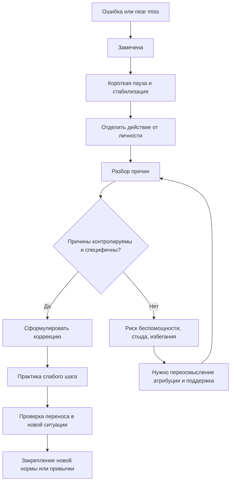
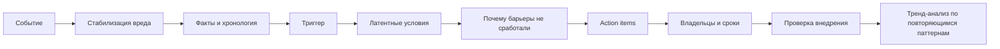

# Как максимизировать обучение на ошибках

## Резюме для руководителя

Люди учатся на ошибках не автоматически. Ошибка становится источником роста только тогда, когда одновременно происходят как минимум пять процессов: ошибка замечена, эмоциональная реакция не обрушивает саморегуляцию, объяснение причины не уводит в беспомощность, среда допускает честный разбор без унижения, а затем появляется конкретная коррекция поведения с последующей практикой и проверкой результатов. Когда хотя бы одно звено выпадает, ошибка либо переживается как катастрофа и закрепляет избегание, либо нормализуется как "ну так бывает" и не превращается в новое умение. Это следует из классических и современных линий исследований по атрибуции, выученной беспомощности, стыду и вине, обратной связи, психологической безопасности, управлению ошибками и "productive failure". citeturn35search5turn34search12turn22search1turn13view3turn10search3turn31search0turn15view1

Наиболее надежные выводы из корпуса исследований такие. Во-первых, объяснение причины ошибки имеет решающее значение: приписывание провала стабильным, глобальным и внутренним факторам вроде "я в целом неспособен" предсказывает хроническую демотивацию и снижение самооценки, тогда как перенос внимания на контролируемые и специфические факторы вроде стратегии, подготовки, времени и качества проверки поддерживает настойчивость и повторную попытку. Это ядро теории атрибуции Вайнера и переформулированной теории выученной беспомощности. citeturn35search5turn33view1turn33view2turn34search12

Во-вторых, не вся негативная эмоция одинаково полезна. Вина, направленная на конкретное действие, чаще побуждает к исправлению и эмпатии; стыд, направленный на "плохое Я", чаще связан с внешним обвинением, агрессией, уходом и замораживанием. Для практики это означает простое правило: разбирать поступок, решение и процесс, а не идентичность человека. citeturn4search1turn22search0turn22search1turn4search13

В-третьих, обратная связь и "культура ошибки" полезны не сами по себе, а в определенной форме. Мета-анализ Клюгера и ДеНизи показал средний положительный эффект обратной связи на производительность d = 0.41, но более чем в трети случаев вмешательства ухудшали результаты; эффективность падала, когда внимание смещалось с задачи на "самость". Более новая образовательная мета-аналитика показала средний эффект feedback на обучение d = 0.48 и более высокую эффективность информационно насыщенных комментариев по сравнению с голой оценкой. Иными словами, бесполезно говорить "ты молодец" или "ты подвел"; полезно говорить "вот где именно решение свернуло не туда, вот что проверить в следующий раз". citeturn13view3turn19search5turn13view4

В-четвертых, "growth mindset" важен, но как контекстуальная гипотеза, а не как магическое заклинание. Мета-анализ Сиска и коллег обнаружил очень слабую общую связь установки на рост с академическими результатами, r = .10, а средний эффект интервенций на достижения был небольшим, d около 0.08. Обзор Макнамары и Бургойна показал, что в исследованиях более высокого качества эффект часто становится близким к нулю. Вместе с тем другая мета-аналитическая линия и крупные полевые эксперименты показывают, что скромные, но реальные эффекты возможны в "фокальных" группах и в поддерживающем контексте, особенно если интервенция встроена не только в слова ученика, но и в действия учителя и нормы среды. Практический вывод: лозунги не работают; работают средовые сигналы, качество преподавания, тип похвалы и повторяемые ритуалы анализа ошибок. citeturn14view4turn14view3turn36search8turn36search4turn17search1turn17search8turn17search7turn9search13

Для детей и сотрудников это означает разные акценты. Маленьким детям нужны, прежде всего, уважительное отношение к промахам, процессная похвала и отсутствие унижения; школьникам и подросткам - обучение причинному разбору и эмоциональной саморегуляции; взрослым специалистам - психологическая безопасность, стандартизированные postmortem/AAR-процессы и перенос индивидуальной вины на системный анализ без отказа от ответственности. Американская академия педиатрии прямо рекомендует не использовать стыжение и унижение как дисциплину, а обзоры по психологической безопасности показывают устойчивые связи этого конструкта с обучающим поведением и эффективностью команд. Google SRE и WHO институционализировали именно такой подход: системный разбор, blameless postmortem, root cause analysis и обязательное извлечение уроков. citeturn8search2turn32search2turn32search17turn10search3turn20view4turn20view2turn20view3turn25view2turn25view1turn30search0turn30search1

Практически лучший "универсальный" протокол после ошибки выглядит так: остановка и стабилизация, краткое фиксирование факта, отделение действия от личности, поиск управляемых причин, составление одной-двух поведенческих корректировок, тренировка именно слабого шага, и затем follow-up в реальной деятельности. Для организаций к этому добавляются хронология события, разбор триггера и корневых причин, классы системных дефектов, action items с владельцами и сроками, а также обзор повторяющихся паттернов по нескольким инцидентам. Такой цикл наиболее согласуется и с данными, и с лучшими практиками высоконадежных отраслей. citeturn13view3turn20view2turn20view3turn12search5turn30search1

## Подход к исследованию и шкала доказательности

В этом обзоре приоритет отдан первичным исследованиям, рецензируемым мета-анализам и институциональным руководствам высокого доверия: Psychological Review, Psychological Bulletin, Journal of Applied Psychology, Nature, Review of Educational Research, Frontiers in Psychology, BMJ, а также материалам Harvard Business School, WHO, AAP и Google SRE. Это особенно важно для темы ошибок, где популярная литература часто опережает качество доказательств, особенно вокруг "growth mindset" и корпоративных "feedback frameworks". citeturn35search5turn13view3turn17search1turn13view5turn19search0turn34search5turn26search2turn25view2turn8search2turn20view2

Для удобства я использую следующую шкалу доказательности. Уровень A - несколько высококачественных мета-анализов и/или крупные РКИ; уровень B - один сильный мета-анализ или несколько сходящихся полевых и лабораторных исследований; уровень C - надежные наблюдательные, лонгитюдные или теоретически насыщенные исследования при меньшей причинной строгости; уровень D - экспертные и институциональные практики, полезные, но пока слабее подтвержденные каузально. Эта шкала является аналитической рамкой данного отчета, а не внешним стандартом.

Ниже приведена сводка ключевых направлений и силы доказательств.

| Направление | Основной вывод | Уровень доказательности | Ключевые источники |
|---|---|---:|---|
| Атрибуции и объяснение провала | Контролируемые, специфические и нестабильные объяснения лучше поддерживают повторную попытку, чем глобальные и стабильные | A | Weiner, 1985, doi:10.1037/0033-295X.92.4.548; Abramson et al., 1978, doi:10.1037/0021-843X.87.1.49 citeturn35search5turn34search12 |
| Выученная беспомощность | Ожидание неконтролируемости разрушает мотивацию, обучение и аффект | A | Maier & Seligman, 1976, doi:10.1037/0096-3445.105.1.3; Maier, 2016 citeturn34search16turn1search7 |
| Стыд и вина | Вина чаще связана с ремонтом поведения и эмпатией, стыд - с уходом/обороной/внешним обвинением | B | Tangney et al., 2007; сопутствующие обзоры и эмпирика citeturn4search1turn22search0turn22search1 |
| Обратная связь | Feedback в среднем полезен, но часть вмешательств ухудшает результат; лучше работает задача-центричная, информационно насыщенная обратная связь | A | Kluger & DeNisi, 1996, doi:10.1037/0033-2909.119.2.254; Hattie & Timperley, 2007, doi:10.3102/003465430298487; Wisniewski et al., 2020, doi:10.3389/fpsyg.2019.03087 citeturn13view3turn13view4turn19search17 |
| Error management training | Поощрение исследовательских ошибок и активного поиска улучшает перенос на новые задачи | A | Keith & Frese, 2008, doi:10.1037/0021-9010.93.1.59; Keith & Frese, 2005, doi:10.1037/0021-9010.90.4.677 citeturn31search0turn31search7 |
| Productive failure | Ошибочное предварительное решение с последующим качественным разбором улучшает концептуальное понимание и перенос, но не всегда процедурную точность | A | Sinha & Kapur, 2021, doi:10.3102/00346543211019105 citeturn15view1 |
| Психологическая безопасность | Связана с обучающим поведением и результативностью команд; интервенции нужны многокомпонентные и длительные | B | Edmondson, 1999, doi:10.2307/2666999; Frazier et al., 2017, doi:10.1111/peps.12183; O'Donovan & McAuliffe, 2020, doi:10.1186/s12913-020-4931-2 citeturn0search26turn21search27turn20view4 |
| Growth mindset | Общие эффекты малы и неоднородны; в targeted/high-fidelity условиях возможны умеренные выгоды | A, но с существенной неоднородностью | Sisk et al., 2018; Yeager et al., 2019, doi:10.1038/s41586-019-1466-y; Burnette et al., 2023, doi:10.1037/bul0000368; Macnamara & Burgoyne, 2023 citeturn14view4turn14view3turn17search1turn36search4turn36search2 |
| Самосострадание | Снижает самокритику и дистресс, поддерживает адаптивный coping после неудач | A | Ewert et al., 2021, doi:10.1007/s12671-020-01563-8; Ferrari et al., 2019 citeturn3search18turn14view2 |
| Blameless culture, postmortem, AAR | Сильная практическая база, особенно в здравоохранении и SRE; причинная оценка процессов ограничена, но системная логика хорошо обоснована | B-D | Reason, 2000; To Err Is Human, 1999/2000; WHO AAR guidance 2019; Google SRE postmortem culture citeturn34search5turn6search6turn30search0turn20view2turn20view3 |

## Исторический контекст и теоретический каркас

Современное понимание обучения на ошибках выросло не из одной теории, а из слияния нескольких традиций. Первая линия - экспериментальная психология контроля и мотивации: работы Маера и Селигмана показали, что переживание неконтролируемости ухудшает последующее обучение и снижает инициативу; позднее Абрамсон, Селигман и Тисдейл добавили к этому атрибутивное измерение и объяснили, почему у одних беспомощность становится глобальной и хронической, а у других остается ситуационной. Вторая линия - теория атрибуции Вайнера, которая связала объяснения успеха и провала с эмоциями, ожиданиями и дальнейшим поведением. Третья - организационная и медицинская безопасность: Ризон противопоставил "person approach" и "system approach", а доклад To Err Is Human перевел вопрос из морализаторства в проектирование систем. Четвертая - исследования обратной связи и обучения в классах и организациях. Пятая - более новые практики высоконадежных отраслей, от симуляционного дебрифинга в медицине до blameless postmortem в SRE. citeturn34search16turn34search12turn35search5turn34search5turn6search6turn13view3turn20view2

Коротко ядро этих теорий можно выразить так. Ошибка сама по себе не "хорошая" и не "плохая"; важнее, что человек и система делают сразу после нее. Теория атрибуции говорит, что после провала человек почти неизбежно задает себе вопрос "почему?". Если ответ звучит как "я в целом неспособен" или "со мной всегда так", это бьет по ожиданию будущего успеха. Если ответ - "стратегия не сработала", "я неверно проверил шаг", "я не заметил маркер риска", то сохраняется ощущение агентности и вероятности улучшения. В этом смысле обучение на ошибках - это не только когнитивный, но и интерпретационный процесс. citeturn35search5turn33view1turn34search18

Теория выученной беспомощности и ее дальнейшие нейронаучные расширения особенно важны для понимания того, почему некоторые люди "перестают пытаться". Если опыт неоднократно кодируется как "мой ответ ничего не меняет", возникает не просто плохое настроение, а нарушение ожиданий контроля, что ведет к мотивационным, когнитивным и аффективным дефицитам. Поэтому обучение после ошибки требует не только разбора содержания ошибки, но и восстановления чувства контролируемости. Иначе даже хороший совет не превратится в новое действие. citeturn33view3turn34search16turn1search7

Линия исследований стыда и вины добавляет эмоциональную точность. Когда человек переживает вину, фокус обычно остается на конкретном действии: "я сделал плохо". Когда переживается стыд, фокус смещается на глобальную идентичность: "я плохой". Из этого следует практический принцип почти для любой воспитательной или управленческой ситуации: обсуждать необходимо решение, шаг, проверку, коммуникацию, а не достоинство человека. Этот сдвиг не делает разбор мягким; он делает его обучающим. citeturn4search1turn22search1turn22search0

История организационного обучения на ошибках тоже учит важной вещи: обучение требует системы. Reason показал, что "дыры" в защите редко выстраиваются из-за одного "плохого человека"; WHO прямо пишет, что большинство ошибок, приводящих к вреду, возникают в системе процессов и условий, а не из-за злого умысла отдельных работников. Поэтому "без вины" не означает "без ответственности": это означает, что ответственность распределяется между человеком, задачей, интерфейсом, нормами, подготовкой и условиями. Именно эту логику подхватили Google SRE и современные AAR/postmortem-подходы. citeturn34search5turn25view2turn20view2turn20view3

Наконец, исследования "growth mindset" и "productive failure" внесли полезную, но часто искаженно популяризированную мысль: ошибки могут быть продуктивны только в правильной архитектуре обучения. "Ростовая установка" без хорошего преподавания, поддерживающих норм и конкретных стратегий дает в среднем малые эффекты. "Продуктивная неудача" работает не как романтизация провала, а как тщательно спроектированная последовательность "самостоятельная попытка - столкновение с пределом - качественная инструкция - интеграция". Без второй фазы это не productive failure, а просто failure. citeturn14view4turn36search8turn36search4turn17search1turn15view1

### Краткая хронология

| Период | Веха | Почему это важно |
|---|---|---|
| 1976 | Maier & Seligman формализуют learned helplessness | Показали, что неконтролируемость подрывает мотивацию, обучение и аффект citeturn34search16 |
| 1978 | Abramson, Seligman, Teasdale реформулируют helplessness через атрибуции | Появляется язык internal/stable/global как риска хронической демотивации citeturn34search12turn33view1 |
| 1985 | Weiner публикует атрибутивную теорию достижений и эмоций | Связал объяснение ошибки, эмоции и последующее поведение citeturn35search5 |
| 1996 | Kluger & DeNisi показывают, что feedback иногда вредит | Возник запрет на feedback, который бьет по "самости", а не по задаче citeturn13view3 |
| 1998 | Mueller & Dweck: похвала за "ум" ухудшает реакцию на неудачу | Ключевое основание для процессной похвалы в детском развитии citeturn8search3turn21search22 |
| 1999 | Edmondson вводит team psychological safety | Ошибки, вопросы и несогласие становятся темой группового климата, а не только чертой личности citeturn0search26 |
| 1999-2000 | To Err Is Human и Reason расширяют system approach | Ошибка становится объектом системного дизайна, а не только наказания citeturn6search6turn34search5 |
| 2005-2008 | Error management culture и error management training получают сильную эмпирику | Ошибки начинают рассматриваться как источник transfer и организационного обучения citeturn29search5turn31search0 |
| 2007 | Hattie & Timperley; Tangney et al. | Уточняются условия полезной обратной связи и различие shame/guilt citeturn13view4turn4search1 |
| 2019-2023 | Большие споры о growth mindset и крупные полевые данные | Появляется более трезвое понимание: эффекты есть, но они малы, неоднородны и контекстны citeturn17search1turn36search4turn36search2turn36search10 |
| 2020-е | WHO AAR, healthcare speaking-up reviews, Google SRE postmortem maturity | Практика учится закреплять уроки из ошибок на организационном уровне citeturn30search0turn20view4turn20view2turn20view3 |

## Механизмы, через которые ошибка превращается в обучение или в тупик

После ошибки человек сначала проходит через фильтр внимания. Если ошибка не замечена, обучения не будет. Здесь полезны данные по error awareness: исследование Moser и коллег показало, что более выраженная установка на рост связана с усиленной нейронной обработкой ошибки и лучшей постошибочной корректировкой. Это не означает, что mindset сам по себе "лечит" ошибки; это означает, что одна из развилок обучения лежит в готовности действительно заметить и удержать ошибку в фокусе, а не проскочить мимо нее или защититься от нее. citeturn28search3turn28search0

Второй фильтр - эмоциональная регуляция. Если ошибка вызывает сильный стыд, унижение или страх статуса, когнитивные ресурсы уходят на защиту самооценки, а не на анализ. Именно поэтому исследования error management training так подчеркивают роль emotion control и metacognition как медиаторов эффекта: люди лучше учатся не потому, что "больше ошибаются", а потому, что по-другому реагируют на неизбежные ошибки во время освоения нового. Когда эмоция регулируется, появляется доступ к разбору, а не к руминации. citeturn31search0turn31search7turn31search4

Третий фильтр - причинное объяснение. Здесь разница между адаптивным и разрушающим циклом особенно резкая. Если после промаха у ученика, ребенка или сотрудника активируется глобальная идентичностная формула вроде "я безнадежен", это одновременно снижает ожидание успеха, усиливает стыд и делает повторную попытку бессмысленной. Если же ошибка связывается с конкретным поддающимся изменению механизмом - "не хватило проверки", "использовал неверную эвристику", "не задал уточняющий вопрос", "не сверился с чек-листом" - появляется топливо для коррекции. Это и есть прикладная ценность атрибутивного переобучения. citeturn35search5turn23search0turn23search12turn23search5

Четвертый фильтр - социальная среда. В условиях низкой психологической безопасности человек склонен скрывать ошибки, говорить полуправду, оправдываться или молчать. В условиях безопасности он чаще признает неопределенность и делится near miss-сигналами. При этом безопасность - не "теплая ванна". Harvard и Edmondson подчеркивают, что высокая эффективность возникает из сочетания безопасности и высоких стандартов, а не из одного только снижения угрозы. Без стандартов безопасность вырождается в комфорт без роста; без безопасности стандарты вырождаются в ритуализованный страх. citeturn21search7turn26search2turn7search8

Пятый фильтр - качество последующего действия. Даже хороший разбор бесполезен, если он заканчивается только "понятно". Из мета-аналитики feedback и productive failure следует один устойчивый вывод: обучение усиливается, когда после ошибки есть конкретизация следующего шага и возможность переноса на новую задачу. Поэтому лучшие форматы всегда требуют action item: переписать чек-лист, провести репетицию, добавить паузу в алгоритм, изменить интерфейс, ввести парную проверку, заменить тип похвалы, отработать трудный момент в симуляции. citeturn13view3turn19search5turn15view1turn20view3

Синтез этих механизмов можно представить так.

Схема выше синтезирует логику атрибуции, эмоциональной регуляции, error management training, feedback research и postmortem-практик. citeturn35search5turn34search12turn31search0turn13view3turn20view2

### Сравнение вмешательств по данным исследований

Важно не только то, "что помогает", но и насколько велика типичная величина эффекта. Ниже - ориентировочная карта по мета-аналитическим данным. Показатели d, g и r напрямую не эквивалентны, поэтому таблица нужна для грубой калибровки, а не для механического ранжирования. citeturn13view3turn19search5turn15view1turn14view4turn14view2

| Интервенция или конструкт | Ориентировочный эффект | Что это означает practically | Источник |
|---|---:|---|---|
| Обратная связь для обучения | d = 0.48 | В среднем помогает, но нужна качественная форма feedback | Wisniewski et al., 2020, doi:10.3389/fpsyg.2019.03087 citeturn19search5turn19search17 |
| Feedback в производительности | d = 0.41, но > 1/3 случаев с ухудшением | Feedback не нейтрален; плохой feedback реально мешает | Kluger & DeNisi, 1996, doi:10.1037/0033-2909.119.2.254 citeturn13view3 |
| Productive failure для концептуального знания и transfer | g = 0.36 | Полезно для понимания и переноса, если затем идет хорошая инструкция | Sinha & Kapur, 2021, doi:10.3102/00346543211019105 citeturn15view1 |
| Productive failure для процедурной точности | g = -0.03 | Не стоит ждать выигрыша в "натаске" без специальных условий | Sinha & Kapur, 2021 citeturn15view1 |
| Growth mindset как коррелят достижений | r = .10 | Связь есть, но она слабая | Sisk et al., 2018 citeturn14view4 |
| Growth mindset interventions в среднем | d около 0.08 | Эффект мал и контекстно зависит от среды и адресности | Sisk et al., 2018 citeturn14view3 |
| Growth mindset interventions при строгом контроле качества | d около 0.02-0.04 | Часто почти нулевой эффект | Macnamara & Burgoyne, 2023 citeturn36search8 |
| Growth mindset in focal/high-fidelity conditions | d = 0.14 по academic achievement | Возможна скромная, но значимая польза при точной настройке | Burnette et al., 2023, doi:10.1037/bul0000368 citeturn16search3turn36search4 |
| Self-compassion interventions | g = 0.56-0.75 по ряду исходов | Хороший кандидат для снижения самокритики и восстановления после ошибок | Ferrari et al., 2019 citeturn14view2 |

## Интервенции и протоколы для личности, детей и сотрудников

### Для взрослого человека, работающего над собой

Лучший индивидуальный протокол после ошибки должен поддерживать и точность, и достоинство. Он не должен превращаться ни в самообвинительный допрос, ни в обесценивающее "ладно, бывает". Для этого полезно удерживать четыре вопроса: что произошло; что я заметил слишком поздно; что здесь было под моим контролем; какую одну корректировку я попробую уже в следующем цикле. Такая конструкция укладывается в данные по атрибутивному переобучению, самосостраданию и задачно-ориентированной обратной связи. citeturn23search12turn3search3turn14view2turn13view3

Практический индивидуальный протокол можно оформить в виде "разбора за десять минут".

1. Зафиксировать факт без интерпретации: "Я сдал отчет с неверной таблицей", а не "Я идиот".
2. Назвать эмоцию и снизить ее интенсивность: 3-5 медленных выдохов, короткая пауза, письменная маркировка эмоции.
3. Сформулировать причину в контролируемых терминах: "Не сделал вторую проверку", "Использовал знакомую, но неверную эвристику".
4. Выбрать один механизм коррекции: чек-лист, предохранительная пауза, парная проверка, замена инструмента.
5. Отрепетировать слабое место отдельно, а не только обещать "быть внимательнее".
6. Назначить follow-up: когда и в каком следующем эпизоде я проверю, что коррекция сработала.

Этот протокол особенно полезен для людей с высокой самокритикой, потому что снижает вероятность перехода из вины в стыд. Данные по self-compassion показывают, что более высокое самосострадание связано с более адаптивным coping, а интервенции по самосостраданию дают умеренные улучшения по стрессу, депрессии, тревоге и самокритике. citeturn13view7turn14view0turn14view2

Пример внутреннего скрипта:
"Ошибка реальна. Она что-то стоит. Но она не равна мне целиком. Сейчас моя задача не защищаться, а понять точку сбоя. Я ищу не виновного внутри себя, а управляемый механизм".

### Для детей и подростков

В случае детей главный принцип звучит так: взрослый должен регулировать не только поведение ребенка, но и значение ошибки для его самости. Исследования Двек и Мюллер показали, что похвала за "ум" после успеха делает детей уязвимее после провала: у них чаще падают настойчивость и удовольствие от задачи, усиливаются low-ability атрибуции и ухудшается последующая производительность. Напротив, усилие и стратегия как объект похвалы формируют более обучающую рамку, а лонгитюдные данные Gunderson и коллег показывают, что process praise в раннем возрасте предсказывает более "incremental" мотивационные рамки позже. citeturn8search3turn21search6turn21search22turn21search1turn21search13

Практически это означает, что взрослому стоит заменить идентичностный язык на процессный. Не "ты такой умный, как ты мог ошибиться?", а "в этой задаче ты попробовал один способ; давай посмотрим, какой шаг дал сбой и что можно проверить по-другому". AAP также подчеркивает, что стыжение, унижение, крик и телесные наказания неэффективны в долгосрочной перспективе и связаны с рисками негативных поведенческих и эмоциональных исходов. citeturn8search2turn32search2turn32search17

Для школьников работает короткий "разбор по действиям":
1. Что ты пытался сделать?
2. На каком шаге задача "сломалась"?
3. Что ты уже сделал правильно?
4. Какой следующий способ попробуем?
5. Что ты проверишь сам перед тем, как спросить помощь?

Здесь взрослый одновременно поддерживает агентность, точность и опыт мастерства. Это особенно важно для детей со склонностью к helplessness-профилю и у подростков, у которых ошибки часто тесно связаны со статусом и угрозой идентичности. Данные о self-compassion у подростков показывают сильную обратную связь с психологическим дистрессом, поэтому для этой группы особенно полезны приемы нормализации ошибок, обучение самосострадательному внутреннему диалогу и эмоциональному коучингу, а не только "разбор дисциплины". citeturn32search4turn32search10turn32search0

Пример родительского/учительского скрипта:
"Ошибаться в новом деле нормально. Сейчас не обсуждаем, какой ты. Обсуждаем, что сработало, что не сработало и какой шаг ты попробуешь следующим. Я помогу, но часть проверки сделаешь ты сам".

### Для подчиненных сотрудников и команд

У сотрудников главный риск другой: защита статуса, скрытие near miss и перенос фокуса на оправдание. Поэтому руководителю нужна двойная оптика: ошибку нельзя ни криминализировать автоматически, ни растворять в безответственности. На уровне evidence разумнее всего опираться на сочетание психологической безопасности, task-focused feedback, error management climate и blameless postmortem. Edmondson показала, что психологическая безопасность предсказывает обучающее поведение в командах; Frazier и коллеги мета-аналитически подтвердили ее связи с индивидуальными и групповыми результатами; O'Donovan и McAuliffe при этом показали, что "поговорить о безопасности" недостаточно - интервенции работают непоследовательно, особенно если они только образовательные и не меняют процесс и среду. citeturn10search13turn21search27turn20view4

Поэтому для сотрудников самый рабочий формат - короткий оперативный разбор инцидента плюс более глубокий postmortem по шаблону. Google SRE прямо определяет blameless postmortem как анализ, который ищет contributing causes без обвинительного приговора отдельному человеку и исходит из предположения, что люди действовали добросовестно с той информацией, которая у них была. Стандартный шаблон затем позволяет проводить trend analysis по тысячам инцидентов и исправлять системные типы сбоев. Это сильно отличает реальное обучение от ритуальной "работы над ошибками". citeturn20view2turn20view3

Руководительский протокол после ошибки сотрудника:
1. Сначала стабилизировать ситуацию и устранить вред.
2. Отделить assessment от blame: "Нам нужно понять цепочку причин".
3. Восстановить timeline без интерпретаций.
4. Выявить триггер, латентные условия, барьеры, которые не сработали, и недостающие сигналы.
5. Спросить: "Что в системе и процессе сделало эту ошибку вероятной?".
6. Назначить не больше 3-5 action items, у каждого - владелец, срок, критерий закрытия.
7. Через 2-6 недель проверить, были ли action items действительно внедрены и изменили ли повторяемый паттерн.

Пример скрипта руководителя:
"Ошибка существенная, и последствия мы разбираем всерьез. Но сейчас нас интересует не поиск козла отпущения, а карта условий, в которых разумный человек мог принять именно это решение. После этого мы определим, где нужна личная доработка навыка, а где системное изменение процесса".

### Сравнение вмешательств по аудиториям, затратам и рискам

| Интервенция | Для кого лучше всего | Издержки | Основные риски | Как снижать риск | Основание |
|---|---|---|---|---|---|
| Процессная похвала вместо похвалы за "ум" | Дети 3-12 лет | Низкие | Может скатиться в пустое "старайся сильнее" без стратегии | Хвалить не только усилие, но и способ, проверку, пересмотр | Mueller & Dweck, 1998; Gunderson et al., 2013 citeturn8search3turn21search1 |
| Attributional retraining | Школьники, студенты, взрослые после серии неудач | Низкие-средние | Сведение всех причин к "мало старался" усиливает вину | Переводить к controllable causes, включая стратегию, условия, помощь | Weiner, 1985; Robertson, 2000 citeturn35search5turn23search0 |
| Self-compassion practices | Подростки и взрослые с высокой самокритикой | Низкие | Может быть ошибочно воспринято как indulgence | Связывать самосострадание с ответственным действием и repair | Ewert et al., 2021; Ferrari et al., 2019; Marsh et al., 2018 citeturn3search18turn14view2turn32search4 |
| Error management training | Взрослые новички и специалисты в обучении сложным задачам | Средние | Без ограничителей может увеличить ошибочные действия в боевой среде | Использовать в тренинге/симуляции и сочетать с дебрифингом | Keith & Frese, 2008; Rudolph et al., 2007 citeturn31search0turn21search0 |
| Productive failure | Ученики и взрослые в концептуально сложных доменах | Средние | У младших и при слабом scaffolding возможна путаница и потеря времени | Обязательно давать последующую instruction phase и scaffold | Sinha & Kapur, 2021 citeturn15view1 |
| Психологическая безопасность | Команды, особенно межфункциональные и медицинские | Средние-высокие | "Мягкость без стандартов", символическая безопасность без process change | Сочетать с high standards, role clarity, speak-up routines | Edmondson, 1999; O'Donovan, 2020; Harvard guidance citeturn10search13turn20view4turn26search2 |
| Blameless postmortem | Технические, медицинские, операционные команды | Средние | Псевдо-blameless, где никто ни за что не отвечает | Отдельно фиксировать behavior issues, process issues и system design | Google SRE; WHO; Reason citeturn20view2turn20view3turn30search1turn34search5 |

### Возрастные и ролевые различия

| Группа | Что особенно важно после ошибки | Чего избегать | Почему |
|---|---|---|---|
| Раннее детство | Процессная похвала, спокойная ко-регуляция, моделирование проверки | Стыжение, ярлыки, сравнение личности | Ранние сообщения взрослых формируют мотивационные рамки и отношение к провалу citeturn21search1turn8search2 |
| Младшие школьники | Разбор по шагам, нормализация проб и пересмотров | Похвала врожденных качеств и обобщения "ты всегда..." | Эффект praise type на настойчивость после провала хорошо задокументирован citeturn8search3turn21search22 |
| Подростки | Работа со стыдом, статусом, самосостраданием и безопасностью в группе | Публичное унижение, сарказм, моральная драматизация промаха | Подростки уязвимы к идентичностному смыслу ошибки; self-compassion связан с меньшим distress citeturn32search4turn32search10 |
| Индивидуальный взрослый | Атрибутивная точность, self-compassion, deliberate correction | Руминация, глобальные выводы о себе | После серии неудач легко запускать helplessness-цикл citeturn34search12turn13view7 |
| Сотрудник в команде | Психологическая безопасность плюс четкие стандарты и review-ритуалы | Ретроспективное обвинение и отсутствие action items | Ошибки скрываются при угрозе статуса; learning behavior зависит от командного климата citeturn10search13turn20view2turn20view4 |
| Руководитель | Построение speak-up норм, blameless postmortem, системное устранение повторяемых причин | "Все понятно, будьте внимательнее" | Без процессных изменений организация повторяет одни и те же сбои citeturn20view3turn30search1turn34search5 |

## Практические модели, шаблоны и предлагаемая структура книги

### Протоколы процесса

Ниже - две рабочие схемы, которые можно использовать как базовую операционную модель.

Эта схема объединяет Reason, WHO root-cause learning, AAR и Google SRE postmortem culture. citeturn34search5turn25view1turn30search0turn20view2turn20view3

Ниже - краткие шаблоны, которые можно вставлять в книгу практически без правок.

#### Шаблон индивидуального разбора

Тема ошибки:
Что произошло фактически:
Последствие:
Что я заметил слишком поздно:
Какая причина была наиболее вероятно под моим контролем:
Какую одну проверку, вопрос или задержку я добавлю в следующий цикл:
Когда я протестирую это снова:
Что будет считаться признаком улучшения:

#### Шаблон взрослого разговора с ребенком

"Стоп. Ошибка - это не ты целиком. Давай посмотрим на один шаг, где задача сломалась. Что ты хотел сделать? Что у тебя уже почти получилось? Какой другой способ мы попробуем сейчас? Я помогу тебе проверить, но первый вариант решения скажешь ты."

#### Шаблон обратной связи сотруднику

"Разберем эпизод по шагам. Сначала факты и timeline. Затем - где сигнал был пропущен, какой барьер не сработал и что было неоднозначно в процессе. После этого выберем одну личную доработку навыка и одно системное изменение, чтобы уменьшить вероятность повтора."

#### Шаблон blameless postmortem

Инцидент:
Дата и длительность:
Воздействие:
Обнаружение:
Хронология:
Триггер:
Корневые и способствующие причины:
Почему существующие барьеры не остановили развитие события:
Что было сделано хорошо:
Что нужно изменить в системе, интерфейсе, чек-листе, оповещениях, ролях, обучении:
Action items с владельцами, сроками и метрикой закрытия:

### Предлагаемая структура книги

Ниже - проект книги, достаточный для рукописи примерно на 95 000-115 000 слов. Я делаю главы такими, чтобы они опирались на теорию, но каждая заканчивалась практическими протоколами и шаблонами.

| Глава | Краткое содержание | Уровень доказательности | Ключевые исследования и руководства | Практические рекомендации | Шаблоны/скрипты | Шаги внедрения | Оценка объема |
|---|---|---|---|---|---|---|---:|
| Ошибка как объект науки, а не морали | Почему люди так по-разному реагируют на ошибки; person vs system approach | A-B | Reason, 2000, doi:10.1136/bmj.320.7237.768; To Err Is Human, 1999/2000; WHO patient safety framework citeturn34search5turn6search6turn25view2 | Отделить событие от обвинения; ввести язык случая, процесса и барьеров | Словарь "факт - интерпретация - причина" | Ввести единый глоссарий и правила разбора | 9 000 |
| Почему одни учатся, а другие ломаются | Атрибуции, helplessness, expectancy, controllability | A | Weiner, 1985; Maier & Seligman, 1976; Abramson et al., 1978 citeturn35search5turn34search16turn34search12 | Переход от identity-attribution к process-attribution | Индивидуальный лист разбора | Еженедельный журнал ошибок и причин | 11 000 |
| Эмоции ошибки | Стыд, вина, угроза статуса, self-compassion | A-B | Tangney et al., 2007; Ewert et al., 2021; Ferrari et al., 2019 citeturn4search1turn3search18turn14view2 | Переход от shame talk к repair talk; самосострадание без самоиндульгенции | Скрипты repair-focused language | Встроить "эмоция - причина - коррекция" в диалоги | 10 000 |
| Обратная связь, которая действительно учит | Почему часть feedback вредит; task vs self focus | A | Kluger & DeNisi, 1996; Hattie & Timperley, 2007; Wisniewski et al., 2020 citeturn13view3turn13view4turn19search17 | Давать information-rich feedback; не ограничиваться оценкой | Шаблон task-focused feedback | Переписать формы review и one-on-one | 10 000 |
| Дети и школа | Process praise, discipline, mindset, class error climate | A-B | Mueller & Dweck, 1998; Gunderson et al., 2013; AAP 2018; ростовые интервенции и споры о них citeturn21search22turn21search1turn32search17turn17search1turn36search8 | Хвалить стратегию, нормализовать пересмотр, не стыдить | Родительские и учительские скрипты | Внедрить weekly error reflection и process praise map | 12 000 |
| Productive failure и обучение на сложных задачах | Когда полезно сначала ошибаться, а потом учить | A | Sinha & Kapur, 2021; Kapur line of work citeturn15view1 | Использовать PF для концептов, не для любой тренировки | Сценарий урока PF | Проектировать цикл "попытка - разбop - instruction" | 8 000 |
| Навык работы с ошибкой у взрослых специалистов | Error management training, metacognition, transfer | A | Keith & Frese, 2008; Keith & Frese, 2005; Rybowiak et al., 1999 citeturn31search0turn31search7turn11search21 | Тренировать не осторожность вообще, а конкретные режимы обнаружения и коррекции | Лист error rehearsal | Ввести симуляции и deliberate correction drills | 10 000 |
| Психологическая безопасность и speak-up | Ошибки в командах, voice, silence, high standards | B | Edmondson, 1999; Frazier et al., 2017; O'Donovan, 2020; Harvard guidance citeturn10search13turn21search27turn20view4turn26search2 | Создавать безопасность вместе с требовательностью | Скрипт leader opening и invitation to dissent | Ритуалы "кто видит риск?" и "что мы не замечаем?" | 10 000 |
| Blameless culture, postmortem, AAR, SRE | Как закреплять уроки из инцидентов на уровне систем | B-D | Google SRE; WHO AAR guidance; WHO learning from error; Reason citeturn20view2turn20view3turn30search0turn25view1turn34search5 | Фиксировать contributing causes, тренды и action items | Шаблон postmortem и AAR | Завести единый реестр инцидентов и near misses | 12 000 |
| Полевое руководство по внедрению | Метрики, ошибки внедрения, аудит, research agenda | B-D | WHO, Google SRE, O'Donovan, recent educational reviews citeturn25view2turn20view3turn20view4turn11search7 | Измерять не только attitudes, но и поведение, transfer и повторяемость | Чек-листы внедрения | 30-60-90 day rollout plan | 8 000 |

### Минимальный комплект метрик для внедрения

Для индивидуального уровня подойдут: частота повторов одного и того же типа ошибки, время до обнаружения, количество самостоятельных corrective actions, субъективная шкала стыда/вины/контролируемости сразу после ошибки, а также простые дневниковые записи по атрибуциям. Для командного уровня нужны: число near miss reports, доля postmortem с выполненными action items, среднее время закрытия corrective actions, повторяемость одинаковых корневых причин, а также психологическая безопасность и voice-показатели. Для организационного уровня стоит отслеживать тренды по типам сбоев, а не только по числу инцидентов. Такая логика полностью согласуется с WHO patient safety, Google SRE trend analysis и обзором интервенций по psychological safety, где особенно подчеркивается дефицит объективных мер. citeturn25view2turn20view3turn20view4

## Пробелы в знаниях и программа дальнейшего исследования

Самые заметные научные пробелы сейчас три. Первый - дефицит качественных долгосрочных данных о том, какие именно интервенции по психологической безопасности устойчиво меняют реальное speaking up, а не только самоотчет. O'Donovan и McAuliffe прямо указывают на смешанные результаты, слабость объективных метрик и необходимость длительных, многокомпонентных вмешательств. Второй - разрыв между популярностью growth mindset и качеством доказательств: поле все еще спорит о том, какой именно дизайн реально меняет результаты и у кого. Третий - относительно слабая интеграция эмоциональных механизмов ошибки с организационными ритуалами postmortem и AAR. То есть у нас есть хорошая психология и есть хорошие process frameworks, но не всегда есть их причинно проверенное соединение. citeturn20view4turn36search4turn36search2turn36search10

Из этого вытекает полезная программа полевой работы для книги и для последующих проектов.

Во-первых, серия полуструктурированных интервью с тремя группами: родители детей 6-15 лет, руководители инженерных и операционных команд, а также взрослые специалисты после профессиональных ошибок. Цель - собрать реальные "народные теории" ошибки: что люди считают причиной, чего боятся, как оправдываются, что помогает им вернуться к действию. Это даст материал для главы о языках ошибки и для типологии maladaptive scripts.

Во-вторых, дневниковое исследование на 30 дней с ежедневной регистрацией ошибок и near misses. Измерять стоит не только сам факт ошибки, но и: тип эмоции, первую атрибуцию, степень контролируемости, факт repair action и повторяемость паттерна. Такой дизайн позволит проверить, какие комбинации "эмоция + атрибуция + контекст" лучше всего предсказывают реальное исправление.

В-третьих, cluster RCT в школах: сравнить три режима - process praise + error discussion, neutral teaching, и praise-as-ability. Основные исходы: persistence after failure, strategy switching, error correction quality, дистресс после ошибки и учебные результаты. Это позволит соединить линию Mueller/Dweck, AAP и современный classroom error climate.

В-четвертых, stepped-wedge испытание в командах разработки или операциях: поэтапно внедрять blameless postmortem, near miss reporting и leader scripts для invite-to-dissent. Основные исходы: число сигналов риска, время до обнаружения, повторяемость одинаковых корневых причин, закрытие action items и показатели психологической безопасности. Это особенно ценно потому, что у корпоративных практик много рациональности, но мало хороших полевых сравнений. На этот пробел косвенно указывают и Google SRE, и healthcare reviews. citeturn20view3turn20view4turn30search1

В-пятых, эксперимент в симуляции для взрослых специалистов: error avoidance training против error management training плюс дебрифинг with good judgment. Здесь можно измерять не только производительность, но и динамику эмоций, постошибочное восстановление и transfer на новую задачу. Это позволило бы напрямую связать Keith & Frese с Rudolph-линией дебрифинга. citeturn31search0turn21search0turn21search12

## Аннотированная библиография

Ниже - компактная аннотированная библиография работ, которые образуют самый прочный "скелет" для книги.

Weiner, B. (1985). An Attributional Theory of Achievement Motivation and Emotion. Psychological Review, 92(4), 548-573. doi:10.1037/0033-295X.92.4.548.
Классическая работа, без которой нельзя всерьез писать о реакции на ошибки. Дает язык locus, stability, controllability и связывает причинные объяснения с эмоциями и последующим действием. citeturn35search5

Maier, S. F., & Seligman, M. E. P. (1976). Learned helplessness: Theory and evidence. Journal of Experimental Psychology: General, 105(1), 3-46. doi:10.1037/0096-3445.105.1.3.
Основание для понимания того, как неконтролируемость разрушает инициативу и последующее обучение. Особенно полезна для глав о повторяющихся провалах и "сдаче". citeturn34search16

Abramson, L. Y., Seligman, M. E. P., & Teasdale, J. D. (1978). Learned helplessness in humans: Critique and reformulation. Journal of Abnormal Psychology, 87(1), 49-74. doi:10.1037/0021-843X.87.1.49.
Ключевой переход от общей helplessness-теории к атрибутивному риску хронической демотивации. Очень важна для практики интервью и саморефлексии после ошибки. citeturn34search12

Tangney, J. P., Stuewig, J., & Mashek, D. J. (2007). Moral emotions and moral behavior. Annual Review of Psychology, 58, 345-372.
Лучший обзор различий между shame и guilt для задач воспитания, руководства и саморегуляции. Полезна тем, что не романтизирует негативные эмоции, а различает их функции. citeturn4search1turn22search1

Kluger, A. N., & DeNisi, A. (1996). The effects of feedback interventions on performance: A historical review, a meta-analysis, and a preliminary feedback intervention theory. Psychological Bulletin, 119(2), 254-284. doi:10.1037/0033-2909.119.2.254.
Одна из самых важных работ против наивной идеи, что любой feedback полезен. Особенно хороша для главы о том, почему морализирующая обратная связь часто портит обучение. citeturn13view3

Hattie, J., & Timperley, H. (2007). The Power of Feedback. Review of Educational Research, 77(1), 81-112. doi:10.3102/003465430298487.
Структурирует feedback вокруг вопросов "куда иду, как иду, что дальше" и помогает сделать практические шаблоны для учителей и руководителей. citeturn13view4

Wisniewski, B., Zierer, K., & Hattie, J. (2020). The Power of Feedback Revisited: A Meta-Analysis of Educational Feedback Research. Frontiers in Psychology, 10, 3087. doi:10.3389/fpsyg.2019.03087.
Полезна как обновление evidence base: показывает средний эффект и важность информационной насыщенности feedback. Хороша для главы, где нужно уйти от абстрактных советов к конкретной форме комментариев. citeturn19search5turn19search17

Edmondson, A. (1999). Psychological Safety and Learning Behavior in Work Teams. Administrative Science Quarterly, 44(2), 350-383. doi:10.2307/2666999.
Одна из базовых работ для связи ошибок с командным климатом. На ней держится вся глава о speak-up и безопасности. citeturn0search26turn10search13

Frazier, M. L., Fainshmidt, S., Klinger, R. L., Pezeshkan, A., & Vracheva, V. (2017). Psychological Safety: A Meta-Analytic Review and Extension. Personnel Psychology, 70(1), 113-165. doi:10.1111/peps.12183.
Хороший источник для сдержанного, не hype-подхода к psychological safety: она важна, но ее нельзя сводить к "быть милыми друг к другу". citeturn21search27

Keith, N., & Frese, M. (2008). Effectiveness of Error Management Training: A Meta-Analysis. Journal of Applied Psychology, 93(1), 59-69. doi:10.1037/0021-9010.93.1.59.
Одно из сильнейших оснований для идеи "ошибка в тренинге может быть ресурсом". Особенно важно для взрослых специалистов и сложных навыков. citeturn31search0turn31search7

Keith, N., & Frese, M. (2005). Self-regulation in error management training: Emotion control and metacognition as mediators of performance effects. Journal of Applied Psychology, 90(4), 677-691. doi:10.1037/0021-9010.90.4.677.
Показывает, что сам факт ошибки не обучает; обучают emotion control и metacognitive processing после нее. Это центральный мост между психологией эмоций и обучением навыкам. citeturn31search7

Sinha, T., & Kapur, M. (2021). When Problem Solving Followed by Instruction Works: Evidence for Productive Failure. Review of Educational Research, 91(5), 761-798. doi:10.3102/00346543211019105.
Лучший обзор по productive failure. Особенно полезен для проектирования учебных эпизодов и для предупреждения против "сделаем просто похардкорнее". citeturn15view1

Mueller, C. M., & Dweck, C. S. (1998). Praise for Intelligence Can Undermine Children's Motivation and Performance. Journal of Personality and Social Psychology, 75(1), 33-52. doi:10.1037/0022-3514.75.1.33.
Классика для глав о детях, похвале и реакции на неудачу. Очень прикладная работа. citeturn21search22

Gunderson, E. A., et al. (2013). Parent Praise to 1- to 3-Year-Olds Predicts Children's Motivational Frameworks 5 Years Later. Child Development, 84(5), 1526-1541. doi:10.1111/cdev.12064.
Показывает долгую тень раннего языка взрослых о мире ошибок и усилий. Полезна для глав о семье и раннем воспитании. citeturn21search13turn21search1

Sisk, V. F., Burgoyne, A. P., Sun, J., Butler, J. L., & Macnamara, B. N. (2018). To What Extent and Under Which Circumstances Are Growth Mind-Sets Important to Academic Achievement? Two Meta-Analyses. Psychological Science.
Нужна для честного разговора о growth mindset без мифологии. Отличный "антидот" от популярной литературы. citeturn14view4turn14view3

Yeager, D. S., et al. (2019). A national experiment reveals where a growth mindset improves achievement. Nature, 573, 364-369. doi:10.1038/s41586-019-1466-y.
Показывает, что context matters: эффект зависит от среды и того, поддерживает ли она challenge-seeking. Это один из лучших источников против упрощений "mindset works/doesn't work". citeturn17search1turn17search7

Burnette, J. L., et al. (2023). A systematic review and meta-analysis of growth mindset interventions: For whom, how, and why might such interventions work? Psychological Bulletin. doi:10.1037/bul0000368.
Полезна тем, что вводит гетерогенность как центральную проблему и дает более нюансированную картину targeted interventions. citeturn36search4turn16search3

Macnamara, B. N., & Burgoyne, A. P. (2023). Do Growth Mindset Interventions Impact Students' Academic Achievement? A Systematic Review and Meta-Analysis With Recommendations for Best Practices. Psychological Bulletin.
Ключевой контраргумент в debate о mindset. Нужна, чтобы книга не скатывалась в подтверждающее мышление. citeturn36search2turn36search8

Ewert, C., Vater, A., & Schröder-Abé, M. (2021). Self-Compassion and Coping: a Meta-Analysis. Mindfulness, 12, 1063-1077. doi:10.1007/s12671-020-01563-8.
Одна из лучших опор для раздела о том, как снижать деструктивную самокритику без снижения ответственности. citeturn3search18turn13view7

Ferrari, M., et al. (2019). Self-Compassion Interventions and Psychosocial Outcomes: a Meta-Analysis of RCTs. Mindfulness.
Практически ценна тем, что показывает measurable effects of intervention, а не только корреляции. citeturn14view2turn13view8

O'Donovan, R., & McAuliffe, E. (2020). A systematic review exploring the content and outcomes of interventions to improve psychological safety, speaking up and voice behaviour. BMC Health Services Research, 20, 101. doi:10.1186/s12913-020-4931-2.
Очень важна для главы о внедрении: показывает, что плакатами и разовыми тренингами безопасность не построить. citeturn20view4

Google SRE. Blameless Postmortem for System Resilience; Postmortem Analysis.
Это не академическая психология, но образцовая инженерная институционализация обучения на ошибках: хороший шаблон для приложений книги и корпоративных внедрений. citeturn20view2turn20view3

WHO. Guidance for After Action Review (2019); The global practice of after action review (2019); Learning from patient safety incidents.
Сильнейшая институциональная база для разделов о здравоохранении, high-reliability организациях и разборе ошибок как коллективном процессе. У WHO также есть материалы с русскими субтитрами для обучения на ошибках в patient safety. citeturn30search0turn30search1turn25view1

AAP. Effective Discipline to Raise Healthy Children (2018); Healthy discipline strategies.
Ключевые институциональные материалы для детского раздела: очень полезны для главы о том, как не переводить ошибку ребенка в стыд и страх. citeturn32search17turn8search2