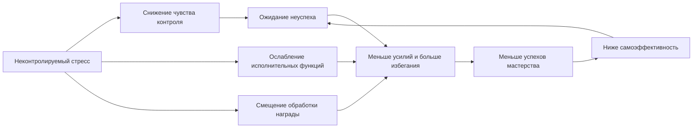
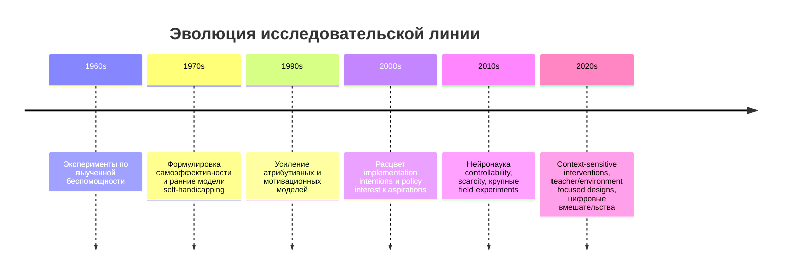

# Почему люди сдаются раньше своего потенциала

## Executive summary

Исследовательская литература довольно последовательно показывает, что "ранняя сдача" и хронически заниженная планка обычно не сводятся к простой "слабости характера". Это чаще результат взаимодействия нескольких уровней причин: субъективного опыта неконтролируемости, низкой самоэффективности, стратегий защиты самооценки, обучения избеганию через быстрое облегчение, стресса и дефицита ресурсов, а также социальных и институциональных контекстов, которые делают высокие усилия либо психологически опасными, либо экономически неокупаемыми. В этой совокупности особенно хорошо подтверждены механизмы выученной беспомощности и контролируемости, самоэффективности, избегания как отрицательного подкрепления, а также роль стресса в ухудшении исполнительных функций и гибкого целенаправленного поведения. citeturn0search0turn15search5turn6search0turn1search1turn1search2turn15search3

Наиболее надежный вывод не в том, что "нужно просто поднять амбиции", а в том, что устойчивое изменение обычно требует перестройки контура "опыт -> ожидание -> усилие -> результат -> новое ожидание". Интервенции, которые дают человеку повторяющиеся переживания управляемости и мастерства, уменьшают избегание, делают следующий шаг конкретным и снижают цену неудачи, имеют более устойчивую эмпирическую поддержку, чем чисто вдохновляющие послания. В этой логике лучше всего выглядят поведенческая активация, планы типа "если-то" и mental contrasting with implementation intentions, поэтапные mastery experiences, а также изменения среды: наставничество, поддерживающие нормы, роль моделей и структурные меры, уменьшающие дефицит ресурсов. citeturn10search8turn22search4turn10search13turn20search1turn25search2turn19search0turn23search17

Однако доказательная база неоднородна. Для growth mindset эффект в среднем мал и сильно зависит от контекста, качества реализации и того, поддерживает ли среда саму идею развития способностей; крупные мета-аналитические обзоры и споры вокруг них показывают, что здесь особенно важно избегать упрощений. Для наставничества, денежных трансфертов и цифровых вмешательств эффект чаще modest, но практически значим и лучше работает в сочетании с другими опорами. Для нейробиологических коррелятов данные убедительны на уровне механистических моделей, но прямой перевод "из мозга в вмешательство" пока ограничен. citeturn1search4turn12search10turn13search1turn27search2turn23search17turn25search2turn15search9turn15search2

Для книги базовая аналитическая позиция может быть сформулирована так: низкие притязания и ранняя сдача - это не единичная черта, а динамическая система, в которой психологические механизмы, нейробиология стресса, семейное и культурное научение, дефицит ресурсов и структура возможностей взаимно усиливают друг друга. Устойчивое изменение возможно, но обычно не через один "секрет мотивации", а через согласованное изменение поведения, среды и ожиданий. citeturn2search0turn19search18turn18search1turn18search2turn15search17turn4search24

## Теоретическая рамка и ключевые механизмы

### Выученная беспомощность и контролируемость

Классическая линия Селигмана и Майера, а затем современная нейронаука контролируемости, показывают, что повторяющийся опыт неконтролируемых негативных событий смещает индивида к пассивности, снижению поиска решения, более мрачным ожиданиям и ухудшению последующего обучения даже в новых ситуациях, где контроль уже возможен. В современной трактовке важно не только "обучение беспомощности", но и "обучение контролируемости": опыт того, что усилие реально меняет исход, сам по себе становится защитным фактором. Это один из самых сильных механизмов ранней сдачи, потому что он подрывает саму связь между усилием и ожидаемым результатом. citeturn0search0turn15search5turn15search17turn17search21

Методологически этот блок опирается на очень сильную экспериментальную традицию, особенно в лабораторных моделях controllable vs uncontrollable stress, с хорошей внутренней валидностью. Слабое место - перенос на человеческие жизненные траектории: повседневная "ранняя сдача" обычно многократно более сложна, чем лабораторный стрессор, и включает социальный смысл, биографию и институты. Тем не менее, как объяснительный каркас для "зачем мне стараться, если от меня ничего не зависит", эта теория остается одной из наиболее фундаментальных. citeturn15search9turn15search13turn15search25turn17search5

Практический вывод высокий по силе доказательств: человеку нужно не внушение, а серия переживаний реального контроля. Поэтому интервенты, ориентированные на малые управляемые шаги, видимый прогресс и быструю обратную связь, теоретически и эмпирически лучше совпадают с тем, как этот механизм устроен. citeturn0search0turn15search17turn10search13

### Самоэффективность

Теория Бандуры остается центральной для понимания того, почему два человека при схожих способностях ведут себя по-разному. Самоэффективность - это не общая самооценка, а вера, что в конкретной задаче я способен произвести желаемый эффект. Бандура выделил четыре базовых источника: собственный опыт успеха, наблюдение за подобными себе моделями, социальное убеждение и интерпретацию физиологических и аффективных состояний; из них mastery experiences обычно оказываются наиболее мощным источником. Более поздние эмпирические обзоры и рейтинги источников самоэффективности это в целом подтверждают. citeturn6search0turn6search7turn6search10turn0search1turn32search5

В прикладных областях самоэффективность стабильно связана с выбором целей, усилием, настойчивостью и устойчивостью к сбоям. В образовательных данных она связана с удержанием в обучении, академической успеваемостью и persistence; продольные исследования показывают, что self-efficacy for self-regulated learning предсказывает достижение и вероятность остаться в школе. В этом смысле занижение планки часто является не отсутствием желания, а отсутствием убежденности, что "это для меня достижимо". citeturn28search10turn28search26turn6search18turn32search3

Качество доказательств здесь высоко для коррелятивной и продольной связи, но умеренно для универсальных интервенций: повышать самоэффективность можно, но generic-программы работают неровно, а перенос между доменами ограничен. На практике это означает, что вмешательство должно быть конкретно привязано к задаче и опираться на реальные эпизоды компетентности, а не на абстрактное "поверь в себя". citeturn6search4turn32search11turn32search17

### Фиксированная и развивающаяся установка

Mindset-литература показывает, что вера в изменяемость способностей может влиять на то, как люди интерпретируют трудность, неудачу и усилие. В лучшем случае growth mindset уменьшает чтение неудачи как приговора и поддерживает учебную настойчивость. Но именно здесь литература наиболее спорная. С одной стороны, крупные полевые РКИ показывали значимые, хотя и небольшие, эффекты у определенных групп и в определенных контекстах: в Национальном исследовании learning mindsets у ранее слабоуспевающих девятиклассников наблюдалось улучшение GPA в ядре предметов примерно на 0.10 балла, s.d. около 0.11; teacher-delivered intervention давал около 0.27 SD у struggling students; teacher-targeted values-aligned intervention снижал неравенство в неблагополучных классах. citeturn13search1turn13search9turn27search2turn27search13turn19search0turn27search3

С другой стороны, несколько обзоров и критических мета-анализов указывают, что средний эффект mindset-интервенций на академические достижения мал, чувствителен к качеству дизайна и часто исчезает после более строгого контроля смещений. Сводка Sisk et al. дала для интервенций очень маленький средний эффект около d = 0.08, а Macnamara и Burgoyne заключили, что заметные положительные результаты в значительной степени связаны с более слабыми исследованиями; Yeager, напротив, настаивает, что малые средние эффекты скрывают важную гетерогенность и что интервенция работает, когда совпадает с "affordances" контекста. Для книги это не повод отвергать тему, а повод описать ее как контекстно-зависимую, а не как универсальное решение. citeturn12search9turn12search10turn13search13turn1search0turn1search4

Практическая рекомендация здесь умеренной силы: mindset полезнее трактовать как часть более широкой архитектуры, а не как отдельную "таблетку". Лучше всего она работает там, где среда реально допускает рост, ошибки не чрезмерно наказуемы, а взрослые и правила не противоречат посланию о развиваемости. citeturn27search6turn19search0turn27search17

### Самосаботаж и защита самооценки

Self-handicapping - это классическая защитная стратегия: человек заранее создает или подчеркивает препятствие, чтобы в случае неудачи сохранить представление о своей способности. Исходная экспериментальная работа Berglas и Jones показала, что после неинформативного успеха испытуемые могли выбирать реальное препятствие к будущему выступлению как способ защитить образ себя. Позднейшая литература описывает self-handicapping как механизм, позволяющий externalize failure и internalize success. В повседневности сюда относятся прокрастинация, подготовка "в полсилы", хроническое недосыпание перед важными задачами и выбор условий, усложняющих собственный успех. citeturn29search0turn29search11turn29search22

В образовательных и мотивационных исследованиях self-handicapping устойчиво связан с тревогой, страхом неудачи и фиксированными представлениями о способности. Экспериментальные работы о praise показывают, что praise for ability чаще ведет к атрибуции неудачи на низкую способность и к большему claimed and behavioral self-handicapping по сравнению с praise for effort. Есть также данные, что краткие growth mindset manipulations могут снижать behavioral self-handicapping, хотя это пока не самый воспроизводимый и самый крупный эффект в литературе. citeturn14search0turn14search4turn7search9turn7search21

По качеству доказательств это сочетание сильной теории, убедительных микролабораторных демонстраций и более смешанных полевых данных. Практический вывод умеренной силы: если человек систематически "не доигрывает матч", это может быть не отсутствие мотивации, а попытка не столкнуться с диагностической неудачей. Вмешательство должно снижать угрозу идентичности и нормализовать статус новичка. citeturn29search15turn14search19

### Избегание, отрицательное подкрепление и обучение награде

Один из наиболее практичных механизмов ранней сдачи - избегание как отрицательное подкрепление. Когда человек не делает сложное действие и тревога сразу падает, мозг учится: "отказ приносит немедленное облегчение". Так поддерживается цикл, в котором краткосрочная выгода конкурирует с долгосрочной потерей развития. Современные обзоры avoidance learning и experiential avoidance практически одинаково подчеркивают этот принцип. citeturn1search1turn1search5turn1search13turn1search17

С reward learning это связывается так: если усилие систематически не вознаграждается или вознаграждение отсрочено и невидимо, система ценности начинает переоценивать непосредственное облегчение и недооценивать долгосрочный выигрыш. Работы по effort-based decision making и dopamine показывают, что мотивация вкладывать усилие зависит от того, как мозг кодирует ожидаемую ценность, вероятность награды и стоимость усилия; исполнительные функции при этом помогают расширять "окно расчета" за пределы непосредственного импульса. citeturn15search24turn15search4turn15search0turn15search3turn26search10

Практически это означает, что устойчивые изменения требуют не только дисциплины, но и переделки контингентности подкреплений: сделать усилие более заметным, награду ближе, прогресс измеримым, а избегание менее выгодным. Именно на этом основаны поведенческая активация, implementation intentions и многие механизмы habit formation. citeturn10search8turn22search4turn20search1turn31search16

## Нейробиология и психофизиология

Современная нейробиология не дает простого "локуса низких амбиций", но хорошо описывает функциональные узлы, через которые хронический стресс, восприятие неконтролируемости и дефицит вознаграждения могут толкать человека к ранней сдаче. В модели learned helplessness ключевыми оказываются цепи medial prefrontal cortex и dorsal raphe nucleus: контролируемый стресс активирует префронтальные механизмы, которые сдерживают дистресс-реакцию, тогда как неконтролируемый стресс легче ведет к пассивности и генерализации беспомощности. Human neuroimaging также показывает, что сама переживаемая controllability уменьшает реактивность threat-related сетей. citeturn15search17turn15search32turn15search13turn15search25turn15search1

Стресс надежно ухудшает компоненты executive function - рабочую память, торможение, cognitive flexibility, set shifting и устойчивое целенаправленное внимание. А именно эти функции нужны, чтобы удерживать далекие цели, не сдаваться после неудачи, переносить фрустрацию и переключаться с автоматического избегания на более стратегическое действие. Обзоры по стрессу и executive function довольно единообразны в этом выводе. citeturn1search2turn1search26turn1search6turn1search10

Наградная система важна не только потому, что "дофамин = мотивация", а потому, что mesolimbic dopamine участвует в оценке стимулов, готовности вкладывать усилие ради награды и выборе между легким и трудным путем при разной ожидаемой ценности. Исследования effort allocation и reward processing показывают, что стресс и депрессивная симптоматика могут менять reward sensitivity и cost-benefit weighing. Это не означает нейродетерминизм, но объясняет, почему при хроническом напряжении человеку субъективно "слишком дорого" давать еще один рывок. citeturn15search0turn15search24turn15search16turn15search35turn1search18

Отдельная линия касается scarcity и "туннелирования". Финансовый и временной дефицит увеличивает когнитивную нагрузку, сужает внимание и может изменять нейронную обработку goal-directed decisions. Классический результат Mani et al. состоит в том, что бедность сама по себе может временно снижать когнитивную функцию через озабоченность дефицитом; более новые работы показывают как поведенческие, так и нейронные эффекты scarcity mindset на принятие решений. Для книги это критично: часть "низких амбиций" - это не психологическая капитуляция, а адаптация мозга под режим дефицита. citeturn2search1turn1search7turn15search2turn15search26turn15search14

Методологически нейробиологический блок силен в механистической правдоподобности, но слабее в прямом переводе на долговременные жизненные траектории. Поэтому корректнее говорить о коррелятах и правдоподобных каналах, а не о готовых биомаркерах "заниженной планки". citeturn15search18turn15search3turn1search20

Схема выше отражает наиболее воспроизводимую причинную петлю: стресс и неконтролируемость снижают субъективный контроль, это уменьшает усилие и опыт мастерства, а дальше самоэффективность падает еще сильнее. Эмпирическая опора для каждого ребра неравномерна, но общая архитектура хорошо согласуется с экспериментами controllability, исследованиями стресса и reward/executive function. citeturn15search9turn15search17turn1search2turn15search35

## Развитие, среда и социальная структура

### Воспитание, обратная связь и автономия

Семья влияет на раннюю готовность выдерживать трудность как минимум тремя путями: через чувство базовой безопасности, через то, как объясняются успех и неудача, и через баланс автономии и контроля. Продольные исследования показывают, что authoritative parenting ассоциирован с более высокими self-efficacy и академическими достижениями, причем самоэффективность и намерение частично медиируют этот путь. Связи не абсолютно универсальны и различаются по контекстам, но общий паттерн устойчив: сочетание структуры, тепла и автономии лучше, чем хаотичность, гиперконтроль или обесценивание. citeturn14search2turn14search6turn14search1turn14search5

Важен не только стиль воспитания, но и микросигналы. Исследования praise показывают, что через seemingly small feedback loops можно неосознанно выращивать либо ориентацию на усилие и обучение, либо хрупкую ориентацию на доказательство способности. Praise for ability чаще делает неудачу более угрожающей для идентичности и усиливает self-handicapping, тогда как praise for effort чаще удерживает интерпретацию задачи как тренируемой. Эти данные особенно полезны для глав о детстве, школе и управлении командами. citeturn14search0turn14search4turn14search19

### Нормы сверстников, культура и принадлежность

Работы по peer influence показывают, что люди, особенно подростки, часто регулируют уровень заметного усилия в соответствии с нормами группы. Когда старание социально наказуемо или "некруто", часть молодежи буквально скрывает инвестиции в учебу, если решение наблюдаемо сверстниками. Эксперимент Bursztyn и Jensen показал, что observable effort меняется под давлением peer norms; в некоторых учебных средах публичность академического усилия снижала участие. Отсюда следует важный тезис: низкая планка может быть стратегией принадлежности, а не только индивидуальной психологией. citeturn18search1turn18search9turn18search17turn4search24

Школьные и групповые нормы тоже могут работать в обратную сторону. Есть данные, что engagement norms буферизуют риски у уязвимых школьников, а peer achievement goals и peer mindset culture влияют на индивидуальные achievement goals и чувство принадлежности. Для взрослых аналогами выступают организационная культура, нормы о допустимости ошибок и статус роста в группе. citeturn14search3turn4search28turn4search1turn4search32

### Социально-экономические ограничения и структура возможностей

Экономическая литература по aspirational failure делает сильный ход: низкие притязания во многих случаях не первопричина бедности, а ее следствие. Модель Dalton, Ghosal и Mani показывает поведенческую ловушку, в которой бедность, дефицит возможностей и поведенческие смещения усиливают друг друга; бедность повышает вероятность выбора низких притязаний и низких усилий относительно собственного потенциального лучшего исхода. Эту линию усиливают исследования cognitive bandwidth under poverty и scarcity mindset. citeturn2search0turn8view3turn2search1turn1search15

Не менее важна structure of opportunity. Opportunity Atlas и работа Chetty и коллег показывают огромную вариативность будущих экономических исходов в зависимости от района и социальной инфраструктуры, причем традиционные индикаторы вроде уровня бедности объясняют лишь часть различий. Иными словами, высокая или низкая планка не существует в вакууме: люди делают выводы о разумности усилий на основании реально доступных траекторий. citeturn19search2turn19search10turn19search18

Очень показателен естественный эксперимент с женским лидерством в Индии. Рандомизированное резервирование руководящих постов для женщин в पंचायतских советах повысило у девочек карьерные притязания и образовательные результаты, без прямого увеличения образовательных ресурсов. Это один из лучших примеров того, как role models и изменение "окна мыслимого" реально поднимают aspiration set. citeturn18search0turn18search2turn18search24

С точки зрения качества доказательств именно социально-структурный блок нередко недооценивают в популярной литературе. Здесь есть сильные natural experiments, крупные административные массивы и эконометрические исследования, поэтому для книги важно не редуцировать проблему к индивидуальной психике. citeturn19search18turn18search0turn2search0

## Измерение, лонгитюд и причинность

Для серьезной книги важно заранее операционализировать, что именно считать "низкими притязаниями" и "недостаточным усилием". В литературе это измеряют по-разному. С одной стороны, есть self-report меры: General Self-Efficacy Scale, Aspiration Index, Self-Handicapping Scale, опросники learned helplessness, а также новые меры потребности в контроле и предсказуемости. Эти инструменты полезны для больших выборок и продольного отслеживания, но уязвимы к социальной желательности и к тому, что человек может рационализировать свое состояние задним числом. citeturn16search16turn16search18turn16search6turn16search5turn17search9turn17search1turn17search2

С другой стороны, есть поведенческие меры: выбор между легким и трудным заданием при разной награде, persistence after failure, attendance, completion, вовлеченность в сложные опции, а в лаборатории - EEfRT и C-EEfRT как показатели willingness to expend effort for reward. Они лучше отражают фактическое распределение усилия, но сами по себе не различают "не хочет" и "не может" и чувствительны к физическим и когнитивным ограничениям. Именно поэтому сегодня подчеркивается, что низкая производительность в effort tasks нельзя автоматически читать как низкую мотивацию. citeturn26search10turn26search1turn26search6turn26search20

Практически полезна тройная операционализация:
первая - aspiration level относительно объективной базы, например ожидания образования или престижности профессии с контролем по prior achievement и ресурсам;
вторая - effort allocation, то есть реальные выборы затрат времени, persistence и склонность к избеганию;
третья - aspiration-attainment gap, то есть разрыв между желаемым и достигнутым или между ожиданием и последующим исходом. Исследования aspiration-attainment gaps показывают, что и недостижение, и превышение некоторых притязаний могут иметь последствия для благополучия, а высокая определенность и высокий уровень карьерных притязаний в подростковом возрасте в среднем связаны с более престижной и лучше оплачиваемой взрослой занятостью. citeturn26search0turn30search19turn30search20turn26search7

Лонгитюдные данные особенно важны, потому что они позволяют отличать временный спад от траектории. Исследования по self-regulatory efficacy показывают, что она может снижаться по мере продвижения по школе и при этом предсказывает achievement и academic continuance; новые панельные данные по learned helplessness у подростков указывают, что динамика беспомощности вообще поддается траекторному анализу и связана с parental autonomy support и психологическим контролем. В классическом longitudinal work depressive explanatory style and helplessness-related cognitions также демонстрировали относительную стабильность у детей. citeturn28search10turn28search1turn28search5turn28search17

Причинные данные есть, но по-разному сильны. Для контролируемости, avoidance learning и reward-related effort сильны лабораторные эксперименты. Для mindset, teacher practice, peer pressure, role models и cash transfers сильны РКИ, natural experiments и policy evaluations. Для более широких жизненных историях причинность чаще строится на сочетании продольных моделей, инструментальных переменных и квазиэкспериментов. Самая частая methodological gap - доменная узость: слишком много данных получено либо в школьных выборках, либо в клинической депрессии, а не в "обычном взрослом населении". citeturn15search17turn18search1turn18search0turn13search1turn23search17

### Подходящая матрица измерения

| Конструкт | Предпочтительная операционализация | Преимущества | Ограничения |
|---|---|---|---|
| Самоэффективность | GSES и domain-specific шкалы | Хорошая валидность, удобно для лонгитюда | Не различает реальную способность и субъективную оценку citeturn16search16turn16search0 |
| Притязания | Aspiration Index; образовательные и карьерные ожидания | Схватывает содержание целей | Не отделяет реалистичность от ценности цели citeturn16search18turn30search13 |
| Беспомощность | Learned Helplessness Scale; доменные адаптации | Полезно для пассивности и uncontrollability beliefs | Много версий, мало полной стандартизации между доменами citeturn17search9turn17search1 |
| Самосаботаж | Self-Handicapping Scale; академические шкалы | Диагностирует защитные стратегии | Часть поведения лучше видно в эксперименте, чем в опроснике citeturn16search5turn29search20 |
| Поведенческое усилие | EEfRT, C-EEfRT, persistence tasks, attendance/completion | Ближе к реальному выбору усилия | Чувствительно к утомлению, здоровью и контексту задачи citeturn26search10turn26search6 |
| Динамика в реальной жизни | Daily diary, experience sampling, weekly goal attainment | Видна внутриличностная вариативность | Дорого и методически сложнее citeturn26search17turn26search9 |

## Интервенции и устойчивое изменение поведения

Наиболее устойчиво меняют траекторию не интервенции, которые "заставляют хотеть большего", а те, что уменьшают избегание, повышают субъективный контроль, создают опыт мастерства и меняют норму среды. Ниже приведена рабочая сравнительная таблица, пригодная как основа для книги и для практического приложения.

### Сравнение интервенций

| Интервенция | Основной механизм | Эффект | Длительность и фоллоу-ап | Целевая группа | Реализуемость | Стоимость |
|---|---|---|---|---|---|---|
| Поведенческая активация | Разрыв цикла избегания, восстановление подкрепления, рост управляемости | Для депрессии BA превосходила контролы в мета-анализе 2014, SMD около -0.74 против control; в более новом обзоре эффективна против inactive controls по депрессии, тревоге и activation, но мало отличалась от active controls; цифровая iBA дала SMD около -0.49 post-treatment против inactive controls citeturn10search13turn10search20turn31search16 | Краткосрочный эффект убедителен; долгосрочные follow-up часто короче, чем хотелось бы; NICE и WHO рекомендуют BA как опцию для депрессии citeturn20search0turn20search1 | Взрослые с depression/avoidance-dominant presentation; демография часто клиническая и не всегда специфицирована | Высокая, в том числе при delivery неспециалистами citeturn20search3turn7search27 | unspecified |
| Implementation intentions | Перевод намерения в заранее привязанный к ситуации поведенческий скрипт | Классический мета-анализ: d = 0.65 по goal attainment; у клинических выборок также полезно, но данных меньше citeturn10search8turn10search22 | Эффект хорошо виден на коротком и среднем горизонте; длительная устойчивость зависит от контекста и напоминаний citeturn10search5turn0search27 | Широкие неклинические и некоторые клинические выборки; демография часто mixed/unspecified | Очень высокая | unspecified |
| Mental contrasting with implementation intentions | Уточнение желаемого будущего + препятствия + плана "если-то" | Малый-средний pooled effect, g = 0.336 на goal attainment; стиль реализации модифицирует эффект citeturn22search4turn22search6 | Как правило, short-to-medium term; нужны данные о долгом удержании | Широкие поведенческие цели | Высокая | unspecified |
| Mastery experiences и domain-specific self-efficacy training | Рост самоэффективности через поэтапный успех, моделирование и обратную связь | Источники самоэффективности хорошо подтверждены; РКИ цифрового self-efficacy training у стрессированных студентов показало снижение hopelessness и trait anxiety post-intervention, но это пока не универсальная база для всех популяций citeturn6search0turn0search1turn32search17turn32search21 | Обычно нужны повторения и работа в конкретном домене | Домен-специфические группы, часто учащиеся или пациенты | Средняя-высокая | unspecified |
| Наставничество | Ролевая модель, социальная поддержка, повышение ожиданий и self-efficacy | Для youth mentoring средний эффект modest: g около 0.21 в мета-анализе Raposa; плюс modest effects по delinquency/academic functioning в обзорах Tolan/DuBois citeturn25search2turn24search10turn25search1 | Длительность важна, качество матчинга и завершения сильно влияет | Прежде всего дети, подростки, группы риска; general adult evidence слабее | Средняя | unspecified |
| Изменение среды преподавателя или руководителя | Меняет affordances: ошибки становятся обучаемыми, усилие - социально допустимым | Teacher-delivered mindset intervention дала +0.27 SD у struggling students; teacher values-aligned intervention снизила inequality в неблагополучных классах citeturn27search2turn19search0 | Есть данные за один учебный год; долгий хвост еще изучается | Учащиеся; возможно перенесение на организации как гипотеза | Средняя | unspecified |
| Роль моделей и "расширение окна возможного" | Сдвиг aspiration set через наблюдение похожих успешных фигур | Female leadership in India повышало карьерные притязания и образовательные результаты у девочек в natural experiment citeturn18search0turn18search2 | Эффект накопительный и контекстный | Гендерно и культурно специфичные группы | Средняя | unspecified |
| Денежные трансферты и антидефицитные меры | Снижение scarcity, стресса и когнитивной нагрузки, расширение пространства решений | Для LMIC meta-analysis показал small but significant effect на depression/anxiety; в США более щедрый CTC уменьшал self-reported bad mental health days, эффект около 0.094 SD в период выплат citeturn23search17turn23search14turn23search11 | Работает, пока снижается дефицит; часть эффектов исчезает после отмены меры | Populations under economic strain | Зависит от институций | высокая бюджетная нагрузка |

В сравнении интервенций видно несколько устойчивых закономерностей. Во-первых, наиболее универсальны по переносимости и дешевизне implementation intentions и MCII, но их эффект ограничен, если у человека нет минимального чувства контроля или если среда активно саботирует выполнение. Во-вторых, BA имеет наиболее зрелую клиническую базу для ситуаций, где избегание уже стало поддерживающим механизмом ухудшения. В-третьих, средовые и структурные меры дают особенно важный эффект там, где проблема не в одном человеке, а в норме, роли модели или дефиците ресурсов. citeturn10search8turn22search4turn10search13turn19search0turn23search17

### Практические рекомендации с оценкой силы доказательств

Рекомендация высокой силы - строить изменение вокруг быстро проверяемых контуров управляемости. Это означает микрозадачи с ясным критерием успеха, немедленную обратную связь и видимую фиксацию прогресса. Такой подход напрямую адресует helplessness, усиливает mastery experiences и уменьшает ценность избегания как источника облегчения. citeturn0search0turn6search0turn1search1

Рекомендация высокой силы - использовать планы "если-то" и, когда цель сложна, связку "желаемый исход -> главное препятствие -> скрипт ответа". Эта стратегия достаточно дешева, масштабируема и опирается на одну из наиболее стабильных линий мета-аналитических данных в self-regulation. citeturn10search8turn22search4

Рекомендация средней-высокой силы - при доминировании избегания, апатии и "сначала мне надо почувствовать мотивацию" использовать поведенческую активацию или BA-подобную логику: не ждать внутреннего подъема, а возвращать действие, которое приносит подкрепление и чувство эффективности. Эта рекомендация особенно сильна, если у человека есть депрессивная симптоматика или выраженная руминация/withdrawal. citeturn10search13turn20search1turn20search0

Рекомендация средней силы - менять социальную экологию. Для подростков это означает peer norms, teacher practice, mentoring и role models; для взрослых - менеджерскую практику, культуру ошибок, прозрачность критериев роста и доступ к людям, "похожим на меня", которые уже прошли путь. Прямых универсальных мета-анализов для взрослых меньше, но данные из образования и молодежных программ здесь достаточно убедительны, чтобы переносить принципы осторожно и без мистификации. citeturn18search1turn27search2turn25search2turn18search0

Рекомендация средней силы - устранять дефицит ресурсов, если он реален. Когда проблема поддерживается scarcity, индивидуальное "работай над мышлением" без структурного буфера будет иметь ограниченный потолок. Поэтому policy-level levers - денежные трансферты, снижение бюрократических барьеров, стабильность расписаний, доступ к support services - это не посторонняя тема, а часть поведенческой архитектуры усилия. citeturn2search1turn23search17turn19search3turn19search15

### Мини-кейсы для книги

Кейс с female leadership in India показывает, что повышение притязаний возможно даже без прямого увеличения материальных ресурсов, если меняется горизонт социально мыслимого и появляется убедимая роль модели. Это отличный пример для главы о "социальном окне возможного". citeturn18search0turn18search2

Кейс с peer pressure in educational investments показывает обратную сторону: иногда люди не прикладывают усилие не из-за отсутствия желания, а потому что старание в конкретной группе социально дорого. Это важный пример для разбора "низких притязаний как стратегии принадлежности". citeturn18search1turn18search17

Кейс National Study of Learning Mindsets хорош тем, что показывает и возможность эффекта, и его ограниченность: короткая интервенция может работать, но не как магия, а как катализатор в конкретных контекстах и для конкретных групп. Это помогает избежать идеологизации темы. citeturn13search1turn13search4turn1search4

Кейс cash transfers полезен для главы о ресурсных ограничениях: даже modest улучшение mental health и agency после снижения дефицита указывает, что часть "личной проблемы" на деле структурна. citeturn23search17turn23search11turn19search3

## Каркас книги и исследовательские материалы

### Предлагаемая структура книги

| Глава | Предлагаемое содержание | Оценка объема |
|---|---|---|
| Введение | Что именно значит "сдаваться раньше потенциала"; почему это не просто отсутствие воли; карта уровней анализа | 6-8 тыс. слов |
| Психология ранней сдачи | Выученная беспомощность, самоэффективность, избегание, self-handicapping, mindset | 12-15 тыс. слов |
| Мозг под давлением | Стресс, контролируемость, reward systems, executive function, scarcity | 8-10 тыс. слов |
| Детство и социальное научение | Семья, похвала, автономия, школьные нормы, сверстники, культура | 8-10 тыс. слов |
| Бедность, класс и структура возможностей | Scarcity, cognitive bandwidth, opportunity structures, aspirational traps | 8-10 тыс. слов |
| Как это измерять | Шкалы, поведенческие задачи, лонгитюд, causal inference, частые methodological traps | 6-8 тыс. слов |
| Что реально меняет траекторию | BA, implementation intentions, mastery experiences, mentoring, environmental redesign, policy levers | 10-12 тыс. слов |
| Кейсы | Школа, работа, взрослая жизнь, переходы, бедность, recovery after failure | 8-10 тыс. слов |
| Практический синтез | Многоуровневая модель изменения: человек, отношения, среда, институты | 5-7 тыс. слов |

Эта архитектура даст книгу примерно на 70-90 тысяч слов - достаточный объем для серьезной научно-популярной или прикладной монографии без разрастания в энциклопедию. Структура опирается на то, что лучшие данные распределены по нескольким дисциплинам, а не лежат внутри одной "школы мотивации". citeturn0search0turn15search5turn2search0turn19search18

### Предлагаемые фигуры и диаграммы

Для книги здесь особенно полезны не декоративные иллюстрации, а причинные схемы. Минимальный набор я бы задал так:
причинная петля "неконтролируемость -> избегание -> меньше мастерства -> ниже самоэффективность -> еще меньше усилий";
временная шкала развития исследовательских подходов от learned helplessness к controllability neuroscience и далее к context-sensitive interventions;
сравнительная карта измерений "опросник vs поведенческая задача vs административный исход";
диаграмма multi-level intervention map "индивид -> отношения -> среда -> институт". Эти фигуры лучше помогают читателю удерживать архитектуру причинности, чем длинные описания. citeturn15search9turn1search4turn19search3

### Mermaid-диаграмма временной линии

Эта линия отражает реальную эволюцию поля: от лабораторных моделей пассивности к более экологичным и контекстно-чувствительным моделям, в которых учитываются среда, неравенство и дизайн поведенческой архитектуры. citeturn15search9turn6search0turn29search0turn10search8turn2search0turn13search1turn19search0

### Аннотированная подборка ключевых источников

Maier and Seligman, "Learned Helplessness at Fifty". Базовый обзор, который связывает классическую теорию с современной нейронаукой controllability; один из самых весомых источников для теоретического каркаса. citeturn0search0turn15search9

Bandura, "Self-Efficacy: Toward a Unifying Theory of Behavioral Change". Семинальная статья для разделов о самоэффективности, целях и настойчивости. citeturn6search0

Yeager, "What Can Be Learned from Growth Mindset Controversies?". Лучший источник для честного, небинарного обзора споров о mindset, включая условия работы интервенций. citeturn1search4

Dalton, Ghosal, Mani, "Poverty and Aspirations Failure". Ключевая экономическая модель поведенческой ловушки низких притязаний под давлением бедности. citeturn2search0turn8view3

Mani et al., "Poverty Impedes Cognitive Function". Семинальная статья о bandwidth tax дефицита. citeturn2search1

Bursztyn and Jensen, "How Does Peer Pressure Affect Educational Investments?". Один из лучших причинных кейсов о социальном наказании за effort. citeturn18search1turn18search17

Beaman et al., "Female Leadership Raises Aspirations and Educational Attainment for Girls". Эталонный natural experiment о роли моделей и сдвиге aspiration set. citeturn18search0turn18search2

Gollwitzer and Sheeran, "Implementation Intentions and Goal Achievement". Классика по bridge from intention to action. citeturn10search8turn22search3

Wang et al., "A Meta-Analysis of the Effects of Mental Contrasting With Implementation Intentions". Современная компактная база для практических техник goal pursuit. citeturn22search4

Ekers et al. и Stein et al. по behavioral activation. Вместе дают хороший баланс между семинальной и современной оценкой BA. citeturn10search13turn10search20turn31search14

Raposa et al. и Tolan et al. по наставничеству. Нужны, чтобы не преувеличивать mentoring, но и не списывать его. citeturn25search2turn24search10

WHO mhGAP, NICE NG222, OECD 2026. Лучшие официальные источники, когда нужно соединить исследование с policy-level и service-design implications. citeturn20search1turn20search0turn19search3turn19search7

### Русскоязычные материалы, которые стоит использовать как локальные обзорные опоры

Шиленкова, обзор по самоэффективности в обучении. Полезен как русскоязычный мост к международной литературе, но не как основной первичный источник. citeturn5search10

Поздняков и Хрушкова, обзор методолого-теоретических подходов к беспомощности. Полезен для главы об истории понятия и различиях школ. citeturn5search2

Митина и Митин, обсуждение личностной и ситуативной беспомощности. Полезно как русскоязычная концептуальная рамка, но требует обязательного сопоставления с международными первичными работами. citeturn5search0turn5search6

Зарецкий, case-oriented материал о преодолении признаков выученной беспомощности в обучении. Это хороший иллюстративный материал для книги, но по доказательной силе он ниже мета-анализов и РКИ. citeturn5search14

### Главные пробелы и спорные точки, которые стоит честно удержать в книге

Во многих ветвях литературы по-прежнему слишком много школьных и студенческих выборок и слишком мало работ по взрослым неклиническим популяциям. Понятия "низкие притязания", "избегание", "пассивность", "депрессия" и "реалистичность целей" часто пересекаются, но не совпадают. Mindset-исследования демонстрируют, насколько опасно превращать контекстно-зависимый эффект в универсальную идеологию. Наконец, структурные ограничения нередко недооцениваются в популярных мотивационных объяснениях, хотя именно они часто делают усилие либо рациональным, либо нерациональным. citeturn1search4turn12search10turn2search0turn19search18turn23search17

Общая исследовательская позиция для книги поэтому должна быть строгой: ранняя сдача - это многопричинная адаптация, а не моральный дефект. Ее поддерживают петли отрицательного подкрепления, опыт неконтролируемости, дефицит мастерства, стресс, неблагоприятные нормы и узкие структуры возможностей. Устойчиво меняется она при помощи многоуровневого дизайна, а не одного лозунга. citeturn0search0turn1search1turn6search0turn2search0turn19search18
