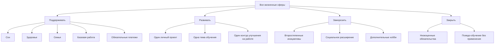
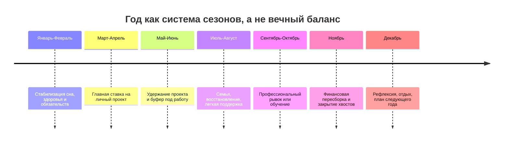
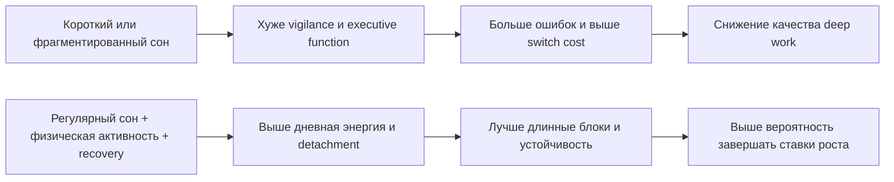

# Стратегии распределения времени, энергии и денег при конфликте между глубокой концентрацией и обслуживанием жизненного портфеля

## Executive summary

Главный вывод исследования такой: на уровне одного рабочего отрезка лучший режим - монофокус; на уровне недели, квартала и года лучшая система - не "один проект до полного завершения", а портфель с разными режимами обслуживания сфер. Эмпирическая база довольно устойчива в трех вещах. Во-первых, переключения между задачами имеют измеримую цену: есть switch costs, attention residue, resumption lag и рост субъективного стресса при частых прерываниях. Во-вторых, качество когнитивной работы сильно зависит не только от календарных часов, но и от сна, восстановления, физической активности, рабочих границ и соответствия нагрузки реальному "пространству внимания". В-третьих, в деньгах и времени важнейшие контуры почти всегда проигрывают, если финансируются "из остатков", а не как заранее защищенные статьи бюджета. citeturn1search5turn1search2turn1search4turn16search19turn27view1turn16search11turn2search12turn10search7turn18search5turn7search4turn28search8

Практически это означает следующее. Выигрышные стратегии строятся вокруг "пола, ставки и буфера": задать минимальные уровни обслуживания для сна, здоровья, семьи, обязательств и базовой надежности работы; выбрать лишь 1-2 активные ставки роста на цикл; защитить для них длинные блоки без прерываний; оставлять резерв времени и денег на неизбежные сбои. Проигрышные стратегии - это реактивное тушение пожаров, раздача ресурса всем сферам понемногу каждый день, хронический овертайм, отсутствие emergency reserve и метание между приоритетами. citeturn13search2turn13search5turn24view0turn25view0turn3search2turn11search0turn11search7turn30view4turn7search1turn7search4

Сильнее всего подтверждены: вред частых переключений, роль сна и восстановления, польза регулярной физической активности, эффект конкретных и сложных целей, полезность implementation intentions, ценность внешних систем выгрузки задач и необходимость финансового резерва. Слабее подтверждены или зависят от контекста: универсальность "идеального" размера блока 90-180 минут, универсальная эффективность Pomodoro, прямой причинный эффект OKR сам по себе, а также старая сильная версия "ego depletion" как модели истощаемой воли. Поэтому 12-недельный цикл, несгораемые блоки, time blocking, GTD, Pomodoro и OKR стоит использовать как инженерные интерфейсы к более фундаментальным механизмам, а не как догмы. citeturn26search16turn29search5turn21search6turn5search1turn5search8turn15search0turn20view0turn8search2turn8search3turn8search8turn8search17

Параметры книги, которые в запросе остаются неуточненными: целевая аудитория, желаемый объем, баланс между популярным и академическим стилем, требуемая доля практики против теории, а также желаемая глубина охвата личных финансов относительно производительности. Поэтому ниже материал собран как исследовательский "book-grade dossier": сначала аналитический вывод, затем рабочие модели, далее - структура книги, таблицы, визуализации, шаблоны и библиография.

## Исследовательская рамка и границы применимости

Эта тема требует различать как минимум четыре уровня анализа. Первый уровень - когнитивный: что происходит с вниманием, рабочей памятью и восстановлением при переключениях и длинных отрезках работы. Второй - поведенческий: какие ритуалы и системы реально помогают переводить намерения в действие. Третий - организационный: как среда работы, встречи, коммуникации и распределение задач влияют на производительность и удовлетворенность, особенно в knowledge work и software engineering. Четвертый - финансовый: как строить личные контуры обязательств, резерва и роста так, чтобы будущие приоритеты не жили "на сдачу". citeturn1search7turn21search6turn26search16turn12search1turn12search4turn28search4turn7search8

Полезно сразу развести "исполнительный фокус" и "жизненную моногамию цели". Научная литература хорошо поддерживает первое: в моменте сложную задачу выгоднее делать без переключений. Но она не поддерживает простую бытовую интерпретацию "значит, нужно игнорировать все остальное до завершения большого проекта". Напротив, данные по сну, долгим часам, восстановлению и фрагментации работы показывают, что игнорирование критических контуров со временем разрушает саму способность к deep work. Человеку нужен не вечный баланс, а инженерно собранная система ограничений, в которой разные сферы живут в разных режимах: поддерживать, развивать, замораживать или закрывать. citeturn2search12turn10search0turn13search2turn3search10turn24view0turn27view1

Важное методологическое замечание: часть популярных продуктивностных систем основана не на RCT и не на мета-анализах, а на практиках управления, консультирования и self-experimentation. Это не делает их бесполезными, но требует двух фильтров. Первый: связывать метод с более простыми и проверенными механизмами. Например, GTD можно защищать не "потому что книга легендарная", а потому что внешняя выгрузка задач снижает нагрузку на рабочую память и помогает intention offloading. Второй: проверять метод на себе короткими циклами с метриками, а не верой. citeturn5search8turn21search6turn21search12turn21search26turn31search0

Три короткие формулировки из первоисточников здесь особенно полезны. Про сон: "Adults should sleep 7 or more hours per night" - это краткое резюме консенсусного заявления AASM/SRS. Про внешнюю систему: "Your mind is for having ideas, not holding them" - официальный тезис GTD. Про финансовый резерв: CFPB определяет emergency fund как "a cash reserve ... set aside for unplanned expenses". В совокупности это и есть фундамент портфельной модели: не хранить все в голове, не резать сон ради видимой продуктивности и не жить без денежного амортизатора. citeturn2search12turn5search0turn28search8

## Что говорит доказательная база

Цена переключения внимания хорошо задокументирована. Rubinstein, Meyer и Evans показали switch costs в task switching и связали их с этапами goal shifting и rule activation; обзор Monsell суммировал, что даже при подготовке "стоимость смены задачи" не исчезает. Leroy ввела понятие attention residue: после незавершенной задачи часть внимания остается на предыдущем контексте и ухудшает производительность на следующей задаче. Для сложной проектной работы это означает простую вещь: календарь, построенный как цепь коротких разнотипных отрезков, системно съедает реальную глубину даже при высокой субъективной занятости. citeturn1search5turn1search2turn1search4

Полевые исследования Gloria Mark и коллег показывают, что проблема не теоретическая, а структурная. В наблюдении 24 information workers работа была "highly fragmented": люди проводили мало времени в одном рабочем контуре, 57% рабочих сфер прерывались, а к прерванной работе возвращались обычно не сразу, а после более чем двух промежуточных активностей. В лабораторном исследовании прерывания не обязательно ухудшали формальную скорость завершения, но сопровождались большим стрессом, фрустрацией, ощущением дефицита времени и усилия. Это важнейший нюанс: некоторые проигрышные режимы кажутся "эффективными", потому что человек ускоряется, но расплачивается качеством состояния и долгосрочной устойчивостью. citeturn27view1turn16search11

Когнитивная нагрузка усиливает этот эффект. Теория cognitive load показывает, что рабочая память ограничена и особенно уязвима к extraneous load, то есть нагрузке, не продвигающей основное решение. Исследования cognitive offloading показывают, что внешние напоминания и выгрузка намерений часто повышают непосредственную результативность, особенно под высокой нагрузкой, хотя могут частично ослаблять запоминание того, что полностью "аутсорсится" во внешнюю среду. Для автора, разработчика или исследователя отсюда следует практический принцип: систему списков, заметок, next actions и чек-листов нужно рассматривать не как бюрократию, а как разгрузку рабочей памяти под задачи высокой сложности. citeturn1search7turn21search6turn21search3turn21search12

Данные по сну и восстановлению еще жестче. Консенсус AASM/SRS рекомендует здоровым взрослым 7 и более часов сна на регулярной основе; CDC дает те же ориентиры по возрастным группам. Мета-анализ Lim и Dinges показал, что краткосрочная депривация сна ухудшает скорость и точность в нескольких когнитивных доменах, особенно vigilance. Более новый обзор по organizational behavior показывает устойчивые связи сна с рабочими исходами, а исследования executive function у взрослых указывают на нелинейную, близкую к квадратичной связь между длительностью сна и исполнительными функциями: важно не только "не слишком мало", но и в целом качественный, регулярный сон без сильной фрагментации. citeturn2search12turn2search1turn10search0turn10search4turn10search7turn10search3turn10search2

Перегрузка работой бьет не только по продуктивности, но и по здоровью. WHO и ILO сообщили, что работа 55+ часов в неделю связана с более высоким риском инсульта и смерти от ишемической болезни сердца по сравнению с диапазоном 35-40 часов. Поэтому любая стратегия, которая системно "покупает" проектное время за счет длительного переразгона рабочей недели, должна считаться не просто тяжелой, а структурно проигрышной, если она не краткосрочная и не сопровождается ясным управлением риском. citeturn13search2turn13search5

Физическая активность и восстановление дают не "бонус", а поддерживают сам производящий механизм. WHO рекомендует взрослым 150-300 минут умеренной или 75-150 минут интенсивной аэробной активности в неделю. Современные мета-анализы показывают, что тренировки улучшают executive function, working memory и cognitive flexibility, хотя величина эффекта зависит от возраста, исходного статуса и протокола. Восстановление после работы тоже имеет собственную доказательную базу: Recovery Experience Questionnaire валидирует четыре компонента - detachment, relaxation, mastery и control; longitudinal данные по weekend recovery показывают, что качество выходных связано со здоровьем и job performance; мета-анализы по psychological detachment interventions подтверждают, что такие вмешательства в среднем работают. citeturn18search5turn0search7turn2search22turn2search6turn18search1turn3search1turn3search2turn3search9

Короткие перерывы работают, но не как магия, а как элемент периодизации нагрузки. Мета-анализы по micro-breaks и short rest breaks показывают улучшения vigor/уменьшение fatigue и небольшие положительные эффекты на performance без роста strain. Microsoft в исследовании по мозговой активности на виртуальных встречах и в полевом исследовании Focus Time показала, что паузы и защищенное время ассоциируются с лучшей вовлеченностью, меньшим стрессом и лучшим detachment. Следовательно, "несгораемый блок" должен включать не только защиту от прерываний, но и запланированную разгрузку до того, как качество внимания начинает резко падать. citeturn11search0turn11search7turn11search1turn24view0

В управлении целями доказательная база тоже сильна, но с важными оговорками. Locke и Latham суммировали десятилетия исследований: конкретные и достаточно сложные цели устойчиво превосходят размытые призывы "сделай как можно лучше". Мета-анализ implementation intentions сообщает средне-крупный эффект на достижение целей, когда человек заранее формулирует "если X, то я делаю Y". Поэтому рабочие циклы, weekly commitments и защищенные слоты нужны не для красоты, а потому что они переводят высокоуровневое намерение в поведенческий триггер. В этом смысле хорошие 12-недельные планы ближе к goal-setting theory и implementation intentions, чем к мотивационному плакату. citeturn26search16turn26search0turn29search5turn29search6

Самые противоречивые зоны стоит назвать прямо. Теория ego depletion в старой сильной версии спорна: мета-анализ 2010 года сообщил средний эффект, но более поздние переоценки с поправкой на publication bias и preregistered replications поставили под вопрос саму "ресурсную" модель; новые multilab-репликации находят скорее малый и протокол-зависимый эффект. Вывод для книги практический: лучше не строить систему вокруг идеи "воля - это бензобак", который неизбежно опустеет после первой тяжелой задачи. Надежнее опираться на переключения, нагрузку, сон, границы, planning и environment design. citeturn8search2turn8search3turn8search8turn8search17

Похожая осторожность нужна и с deliberate practice. Исходная линия Ericsson крайне влиятельна и полезна: рост мастерства требует не просто часов, а структурированной целенаправленной практики с feedback. Но мета-анализы Macnamara показали, что deliberate practice объясняет лишь часть вариативности performance и делает это по-разному в разных доменах; последующие ответы Ericsson утверждали, что мета-анализы недооценили эффект из-за слишком широкого определения практики. Практический вывод: для автора или разработчика структурированная тренировка навыка очень важна, но "больше часов" не гарантирует прорыв без задачи, обратной связи, среды и восстановительного ресурса. citeturn9search1turn9search0turn9search7turn9search12turn23search16

Литература по деньгам лучше всего поддерживает идею многослойного портфеля. Behavioral Portfolio Theory описывает естественное стремление людей строить слои с разными целями - защитный уровень и уровень восходящего потенциала. OECD и CFPB последовательно называют emergency savings, budget discipline и planning первой линией финансовой защиты от шоков; CFPB отдельно подчеркивает пользу автоматизации сбережений. Для личной экономики это почти прямо переводится в контуры "обязательства - резерв - среднесрочные фонды - рост". citeturn28search15turn28search12turn7search1turn7search4turn28search8turn7search9

## Выигрышные и проигрышные стратегии распределения

Ниже - сжатая сравнительная таблица стратегий, которые по данным и по их механике чаще проигрывают или выигрывают.

| Стратегия | Почему обычно проигрывает или выигрывает | Оценка |
|---|---|---|
| "Всем по чуть-чуть каждый день" | Съедает разгон, повышает частоту context switching, не дает набрать критическую массу на сложных задачах. Особенно плоха для авторской, исследовательской и инженерной работы с высокой ценой входа. citeturn1search5turn27view1turn16search19 | Чаще проигрышная |
| "Один большой проект любой ценой" | Может дать краткий спринт, но в долгую бьется о сон, здоровье, отношения и риск переработки; 55+ часов в неделю уже связаны с медицинским риском. citeturn13search2turn2search12turn3search10 | Проигрышная вне коротких рывков |
| Реактивная жизнь по пожарам | Поддерживает высокий fragmentation load, не дает защищать важное раньше, чем оно станет срочным, и усиливает стресс. citeturn27view1turn16search11turn6search0 | Проигрышная |
| Финансирование будущего "из остатков" | Резерв, рост и долгосрочные цели системно получают ноль; OECD и CFPB прямо связывают resilience с планированием и savings buffers. citeturn7search4turn7search1turn28search8 | Проигрышная |
| Минимальные уровни обслуживания | Сохраняют рабочую способность системы: сон, физическая активность, базовые обязательства, family maintenance, резерв. Это снижает риск развала проекта из-за соседних контуров. citeturn2search12turn18search5turn28search8 | Выигрышная |
| Ограниченный портфель активных ставок | Согласуется с goal-setting research: внимание направляется на малое число конкретных целей, а остальные сферы переводятся в режим поддержки. citeturn26search16turn20view0 | Выигрышная |
| Длинные защищенные блоки без прерываний | Уменьшают attention residue и fragmentation; field evidence по protected focus time показывает улучшение wellbeing и work engagement. citeturn1search4turn24view0turn27view1 | Выигрышная |
| Буфер времени и денег | Время: absorbs interruptions and recovery needs. Деньги: emergency fund снижает уязвимость к шокам. citeturn11search7turn7search4turn28search8 | Выигрышная |
| Внешняя выгрузка и weekly review | Поддерживает cognitive offloading и снижает цену держать всё "в голове"; GTD-подобные системы хорошо сочетаются с evidence on reminders and offloading. citeturn5search8turn21search6turn21search12 | Выигрышная |
| Сезонность и периодизация | Прямых RCT для "жизненной сезонности" почти нет, но логика опирается на periodization в тренировке, quarterly OKR cadence и ограниченность ресурса. Лучший статус - evidence-informed design, а не доказанный закон. citeturn22search5turn20view0turn31search2 | Выигрышная как инженерная гипотеза |

Из этой матрицы вытекает рабочая архитектура распределения ресурсов.

| Контур | Минимум обслуживания | Активная ставка роста | Что замораживать первым | Денежный эквивалент |
|---|---|---|---|---|
| Сон и здоровье | Сон 7+ часов, 150-300 мин активности в неделю, базовая профилактика. citeturn2search12turn18search5 | Улучшение fitness, лечение, восстановление. | Экстремальные эксперименты и "опциональные" переработки. | Медицина, спорт, профилактика |
| Работа | Надежность, предсказуемость, ключевые deliverables. | 1 контур улучшения: архитектура, автоматизация, качество, влияние. citeturn12search4turn12search1 | Низкоценная операционка без SLA, лишние встречи. | Доход, репутация, инструменты |
| Главный личный проект | 2-4 несгораемых блока в неделю. | Один квартальный outcome. | Побочные идеи и новые параллельные проекты. | Фонд роста или MVP |
| Семья и близкие | Ритм присутствия, не только реакция на кризисы. | Отдельные сезоны для крупных семейных задач. | Случайные социальные обязательства. | Родители, дети, бытовые фонды |
| Обучение | Только поддержание актуальности по работе/ставке. | Одна ключевая тема за цикл. | Информационный FOMO и распыление. | Образование, книги, курсы |
| Культура и хобби | Легкий регулярный ритм восстановления. | Сезонно, когда не растет основной проект. | KPI-подход к каждому хобби. | Радость/досуг |
| Финансы | Обязательства + резерв + базовые фонды. | Рост: инвестиции, свое дело, skill-capex. | Спонтанное потребление без лимита. | Резерв, рост, среднесрочные фонды |

Проигрышная финансовая модель - одна "ведро-куча", из которой сначала оплачивается текущее, а потом "если останется". Выигрышная модель - слоистая. На уровне личных денег ее можно описать так: сначала обязательства, затем резерв и страхующие фонды, потом фонды средней дальности, и только потом агрессивные ставки роста и discretionary spending. Это не классическая теорема личных финансов в академическом смысле; это прикладной синтез Behavioral Portfolio Theory и guidance OECD/CFPB по resilience. citeturn28search15turn7search1turn7search4turn28search8

По методикам лучше думать не "какая система победит все", а "какой инструмент обслуживает какой слой проблемы".

| Методика | Что реально решает | Где сильна | Где слаба | Уровень опоры |
|---|---|---|---|---|
| Pomodoro | Снижает сопротивление старту, дает ритм микропауз, полезна при тревоге и прокрастинации. citeturn5search1turn11search0 | Старт, рутина, учеба, низкий порог входа | Для сложной maker work может быть слишком короткой; 25 минут - не "научный оптимум" | Низко-средний, в основном practitioner + break literature |
| Deep Work | Нормализует длинные отвлекаемо-свободные отрезки для сложной работы. citeturn31search7turn4search13turn1search4 | Авторство, архитектура, research, код | Без системной защиты календаря останется лозунгом | Средний как концепт, сильный через базовую когнитивную литературу |
| GTD | Внешняя выгрузка, next actions, обзоры, снижение cognitive clutter. citeturn5search8turn31search0turn21search6 | Большой поток обязательств и открытых циклов | Не решает сам по себе приоритет роста | Средний как синтез с cognitive offloading |
| OKR | Преводит стратегию в измеримые результаты и cadence обзора. citeturn20view0turn5search14turn12search3 | Командная и квартальная фокусировка | Легко сделать бюрократией; прямое causal evidence на уровне индивида ограничено | Средний как applied management |
| Time blocking | Связывает приоритеты с календарем, а не только со списками. citeturn15search0turn15search4turn5search3 | Защита deep blocks, баланс urgent vs important | Требует перепланировки и буфера | Средний, преимущественно practitioner, хорошо согласуется с evidence |
| 12-недельный цикл | Укорачивает горизонт для execution, повышает urgency и review frequency. citeturn31search2turn14search1 | Личный проект, квартальный рывок | Непосредственная академическая валидация слаба; это инженерный контейнер, а не закон | Низко-средний, practitioner |

## Практические модели, расписания и визуализации

Ниже - evidence-informed Operating System для человека, у которого почти все время бодрствования занято работой, но есть крупный личный проект, семья, здоровье и финансовые задачи.

Смысл этой схемы прост: у большинства взрослых проблема не в отсутствии дисциплины, а в том, что слишком много сфер одновременно претендуют на режим "развивать". Научно лучше всего поддерживается модель, в которой минимумы обслуживания защищены, а число активных целей роста ограничено и конкретизировано. citeturn26search16turn29search5turn13search2turn2search12

Для длинных блоков разумно использовать не жесткий догмат, а диапазоны под тип задачи. Точные "идеальные" длительности недостаточно жестко установлены, зато хорошо подтверждено, что сложной работе вредят частые переключения, а короткие специальные паузы помогают с fatigue. Поэтому диапазоны ниже лучше понимать как инженерные defaults. citeturn1search4turn27view1turn11search0turn11search7

| Тип блока | Когда использовать | Практический размер | Комментарий |
|---|---|---|---|
| Стартовый блок | Сильное сопротивление, тревога, запуск задачи | 25-30 мин | Здесь Pomodoro полезен как "дверь", а не как единственный режим. citeturn5search1 |
| Блок bounded focus | Анализ, письмо, review, coding в понятном контуре | 50-90 мин | Хороший базовый размер для будней |
| Несгораемый deep block | Архитектура, глава книги, исследование, сложное проектирование | 90-180 мин | Не научный стандарт, а лучший компромисс при высокой цене входа и ограниченном календаре. Опирается на interruption cost, deliberate practice и break literature. citeturn16search19turn27view1turn17search2turn11search7 |
| Recovery block | Прогулка, растяжка, detachment, еда без экрана | 10-30 мин | Защищает качество следующих блоков. citeturn11search0turn3search9 |

Пример недельной схемы для человека с полной занятостью и одним личным проектом:

| День | Утро | Рабочее ядро | Вечер | Комментарий |
|---|---|---|---|---|
| Пн | 20-30 мин weekly reset | Работа + буфер на входящие | Легкая физическая активность, ранний сон | Понедельник не перегружать дополнительными ставками |
| Вт | Несгораемый блок проекта 90 мин | Работа | Семья | Лучшее качество внимания отдать ставке роста |
| Ср | Сон/восстановление приоритетно | Работа + блок надежности/стратегии | 30-60 мин обучение по одной теме | Не раздувать до второго проекта |
| Чт | Несгораемый блок проекта 90-120 мин | Работа | Социальный или семейный слот | Поддержание отношений как ритм, не случайность |
| Пт | Короткий обзор недели | Работа, закрытие циклов | Легкая культура/отдых | Не добивать себя "героическим" пятничным вечером |
| Сб | Главный deep block 120-180 мин | Быт и семья | Отдых/хобби | Лучший длинный слот для maker work |
| Вс | Финансы и планирование 45-60 мин | Восстановление | Подготовка сна и недели | Буферный день, а не скрытый рабочий |

Эта схема согласуется с данными о защищенном focus time, recovery, необходимости буфера и роли конкретных планов. Главное здесь не эстетика таблицы, а две инженерные идеи: deep work получает лучшие часы, а поддерживающие сферы получают минимально надежный ритм до того, как начнут "болеть". citeturn24view0turn3search2turn3search10turn29search5turn7search4

Шаблон 12-недельного цикла лучше строить как комбинацию квартального outcome, lead measures и floor commitments.

| Элемент цикла | Заполняемое поле |
|---|---|
| Главная ставка цикла | Один outcome, а не направление. Пример: "Запустить рабочий прототип и провести 10 интервью" |
| Граница цикла | 12 недель + 1 неделя закрытия и resize |
| Не более 2 supporting goals | Например: "Стабилизировать сон" и "Создать резерв N" |
| Lead measures | Сколько блоков, сколько интервью, сколько страниц, сколько релизов, сколько тренировок |
| Floor commitments | Сон, здоровье, семья, обязательные платежи, weekly review |
| Несгораемые блоки | Конкретные слоты в календаре на все 12 недель |
| Stop list | Что не запускается в этом цикле |
| Buffer budget | Процент свободного времени и денежный резерв под непредвиденное |
| Метод обзора | Еженедельный обзор 20-30 мин и mid-cycle review на 6-й неделе |
| Критерий закрытия | Что считается завершением, переносом, заморозкой |

Этот шаблон не доказан как "лучший" формат цикла в академическом смысле, но хорошо сочетается с goal specificity, implementation intentions и quarterly OKR-like cadence. А вот его отсутствие почти гарантирует размывание приоритетов. citeturn26search16turn29search5turn20view0turn31search2

Шаблон несгораемого блока:

| Фаза | Правило |
|---|---|
| До блока | Записать один ожидаемый результат, закрыть мессенджеры, подготовить материалы, определить первый физический шаг |
| Во время | Один контекст, ноль "быстрых ответов", все входящие только в capture list |
| После | Короткий log: что сделано, где стоп, какой следующий шаг, что мешало |
| Если блок сорвался | Перенос в заранее оставленный буфер, а не стирание |
| Если блок постоянно срывается | Это уже не дисциплина, а конфликт архитектуры недели |

Для финансового слоя полезен такой шаблон контура:

| Контур денег | Цель | Принцип наполнения |
|---|---|---|
| Обязательства | Жилье, еда, транспорт, счета, базовые семейные расходы | Финансируются первыми |
| Резерв | Непредвиденные траты и шоки | Автоматический перевод сразу после дохода |
| Фонды средней дальности | Отпуск, медицина, техника, налоги, помощь родителям | Малые регулярные отчисления |
| Рост | Свое дело, инструменты, обучение, капитализация | Отдельная статья, а не остаток |
| Свободные траты | Радость и гибкость | Лимитированы заранее |

Это почти точная личная версия layered portfolio logic: нижние слои защищают от катастрофы, верхние дают рост. OECD и CFPB прямо поддерживают budget/savings/emergency structure как базу resiliency. citeturn28search15turn7search1turn30view4turn28search8

Визуально сезонность года можно собирать так:

И схема связи сна, энергии и результата лучше показывается как причинная, а не как псевдо-точная кривая, потому что литература расходится в величине эффектов, но согласна в направлении.

Эта схема основана на консенсусе по сну, мета-аналитике по sleep deprivation, physical activity и work recovery. citeturn2search12turn10search0turn10search7turn18search5turn18search1turn3search10

Для эмпирической валидации вашей модели в книге стоит прямо предложить читателю не "поверить", а измерить. Для IT и knowledge work удобно использовать многомерный подход SPACE плюс outcome-метрики: Satisfaction/well-being, Performance, Activity, Communication, Efficiency/flow. Для инженерной стороны - DORA metrics на уровне команды или личные proxy наподобие cycle time, defect escape, planned-vs-done ratio. Для индивидуальной системы - sleep regularity, deep-block completion, self-rated focus, perceived stress, detachment, number of protected hours, reserve coverage in months, automated savings rate, % времени проекта в лучшие часы, % недели, съеденной входящими запросами. Лучший дизайн для self-validation - 6-12 недель ABAB или crossover: например, 3 недели реактивного режима против 3 недель с несгораемыми блоками и буфером; либо 6 недель Pomodoro-first против 6 недель long-block-first. citeturn12search1turn12search2turn12search4turn29search5

## Архитектура книги и библиография

Ниже - рабочая структура книги на уровень серьезного нон-фикшна с исследовательской опорой.

| Глава | Что раскрывает | Ключевые источники |
|---|---|---|
| Введение в парадокс фокуса | Почему "делать одно" и "жить одним" - не одно и то же; постановка конфликта между большим проектом и обслуживанием жизни | Mark о фрагментации работы, Leroy об attention residue, WHO/ILO о long hours. citeturn27view1turn1search4turn13search2 |
| Архитектура внимания | Task switching, cognitive load, resumption lag, цена входа в сложную задачу | Rubinstein, Monsell, Sweller, Altmann & Trafton/Monk. citeturn1search5turn1search2turn1search7turn16search19turn16search10 |
| Почему занятость не равна прогрессу | Фрагментация, meetings overload, reactive work, "скорость ценой стресса" | Mark 2005/2008, Microsoft WorkLab, Focus Time. citeturn27view1turn16search11turn6search0turn24view0 |
| Энергия как ограничитель глубокой работы | Сон, циркадность, хронотип, физическая активность, microbreaks, detachment | AASM/CDC, Lim & Dinges, WHO, Sonnentag, Albulescu, Wendsche. citeturn2search12turn2search1turn10search0turn18search5turn3search1turn11search0turn11search7 |
| Минимальные уровни обслуживания | Пол жизни: что нельзя ронять, даже когда ставка идет на проект | WHO/ILO long hours, WHO activity, CFPB/OECD resilience. citeturn13search2turn18search5turn7search4turn28search8 |
| Портфель времени | Режимы "поддерживать/развивать/заморозить/закрыть", ограничения активных ставок, сезонность | Goal-setting theory, implementation intentions, periodization analogies, OKR cadence. citeturn26search16turn29search5turn22search5turn20view0 |
| Портфель денег | Обязательства, резерв, среднесрочные фонды, рост; почему будущее не должно жить на остатках | Behavioral Portfolio Theory, OECD, CFPB. citeturn28search15turn7search1turn30view4turn28search11 |
| Операционные системы продуктивности | Deep Work, GTD, Pomodoro, time blocking, OKR: что каждый метод делает на самом деле | Newport, Allen, Cirillo, HBR/Google re:Work/What Matters. citeturn31search7turn5search8turn5search1turn15search0turn20view0turn20view2 |
| 12-недельный режим исполнения | Как переводить стратегию в квартальные outcome и weekly commitments | 12 Week Year, goal-setting, implementation intentions. citeturn31search2turn14search1turn26search16turn29search5 |
| Кейсы IT, науки и бизнеса | Developer productivity, protected focus time, ideal vs actual week, measurement traps | Microsoft Research, SPACE, DORA. citeturn24view0turn25view0turn12search1turn12search4 |
| Противоречия и ошибки популярной литературы | Ego depletion, переоценка deliberate practice, ложные универсальные советы | Hagger, Carter, Dang, Macnamara, Ericsson. citeturn8search2turn8search3turn8search8turn8search17turn9search1turn9search7turn23search16 |
| Эксперименты читателя | Метрики, пилоты, дневники, опросы, self-audit, недельные и квартальные review | SPACE, DORA, implementation intentions, recovery measures. citeturn12search1turn12search4turn29search5turn3search1 |

Ниже - компактная, но уже пригодная для книги библиография с кликабельными ссылками через цитаты.

**Первичные исследования и мета-исследования**

- Rubinstein, Meyer, Evans. Executive control of cognitive processes in task switching. PubMed/JEPHPP. citeturn1search5
- Monsell. Task switching. Trends in Cognitive Sciences. citeturn1search2
- Leroy. Why is it so hard to do my work? The challenge of attention residue when switching between work tasks. citeturn1search4
- Sweller. Cognitive Load During Problem Solving: Effects on Learning. citeturn1search7
- Mark, Gonzalez, Harris. No Task Left Behind? Examining the Nature of Fragmented Work. citeturn27view1
- Mark, Gudith, Klocke. The cost of interrupted work: more speed and stress. citeturn16search11
- Altmann, Trafton. Task interruption: Resumption lag and the role of cues. citeturn16search19
- Monk et al. The Effect of Interruption Duration and Demand on Resumption Lag. citeturn16search10
- Watson et al. Recommended Amount of Sleep for a Healthy Adult. PubMed. citeturn2search12
- Lim, Dinges. A Meta-Analysis of the Impact of Short-Term Sleep Deprivation. citeturn10search0
- Henderson, Horan. A meta-analysis of sleep and work performance. citeturn10search7
- Sen et al. Sleep Duration and Executive Function in Adults. citeturn10search2
- Sonnentag, Fritz. Development and validation of a measure for assessing recovery experiences. PubMed. citeturn3search1
- Fritz, Sonnentag. Recovery, health, and job performance: effects of weekend experiences. citeturn3search2
- Karabinski et al. Interventions for improving psychological detachment from work: meta-analysis. citeturn3search9
- Albulescu et al. "Give me a break!" systematic review and meta-analysis on micro-breaks. citeturn11search0
- Wendsche, Lohmann-Haislah, Wegge. The impact of supplementary short rest breaks on task performance. citeturn11search7
- Locke, Latham. Building a Practically Useful Theory of Goal Setting and Task Motivation. citeturn26search16
- Gollwitzer, Sheeran. Implementation intentions and goal achievement: a meta-analysis. citeturn29search5
- Hagger et al. Ego depletion and the strength model of self-control: meta-analysis. citeturn8search2
- Carter et al. Self-control does not seem to rely on a limited resource. citeturn8search3
- Hagger et al. A Multilab Preregistered Replication of the Ego-Depletion Effect. citeturn8search8
- Dang et al. A Multilab Replication of the Ego Depletion Effect. citeturn8search17
- Ericsson et al. Deliberate practice and acquisition/maintenance of expert performance. citeturn9search2turn9search17
- Macnamara et al. Deliberate practice and performance meta-analyses. citeturn9search1turn9search0
- Ericsson. Deliberate Practice and Proposed Limits on the Effects of Practice. citeturn9search7turn23search16
- Burnett et al. Meta-analytic investigations of the effect of cognitive offloading. citeturn21search6

**Официальные рекомендации и отчеты**

- CDC. About Sleep. citeturn2search1
- WHO. Physical activity fact sheet. citeturn18search5
- WHO/ILO. Long working hours increasing deaths from heart disease and stroke. citeturn13search2
- OECD. Supporting the financial resilience of citizens. citeturn7search4
- OECD/G20-INFE. Supporting Financial Resilience and Transformation through Digital Financial Literacy. citeturn7search1
- CFPB. Emergency Savings and Financial Security. citeturn28search17turn30view4
- CFPB. An essential guide to building an emergency fund. citeturn28search8
- Google re:Work. Set goals with OKRs. citeturn12search3turn20view0
- DORA metrics. Official guide. citeturn12search4
- Microsoft Research. The SPACE of Developer Productivity. citeturn12search1turn12search2
- Microsoft Research. Focus Time study. citeturn24view0turn30view0
- Microsoft/Georgia Tech. Time Warp: ideal vs actual developer workweeks. citeturn25view0turn30view2

**Книги и practitioner frameworks, полезные для книги как интерфейс к доказательной базе**

- Cal Newport. Deep Work. Официальный сайт автора и издатель. citeturn4search9turn31search7
- David Allen. Getting Things Done. Официальный GTD и Penguin Random House. citeturn5search0turn31search0
- Daniel Kahneman. Thinking, Fast and Slow. Официальный издатель. citeturn4search16
- Francesco Cirillo. Pomodoro Technique. Официальный сайт. citeturn5search1turn5search5
- John Doerr / What Matters. OKR course and resources. citeturn5search2turn20view2
- Brian Moran, Michael Lennington. The 12 Week Year. Wiley и официальный сайт. citeturn31search2turn14search1

С точки зрения критической оценки лучший общий вывод для книги будет таким. Сильное ядро доказательств поддерживает необходимость защищать когнитивную целостность работы, сон, восстановление, движение, конкретные цели и экономический резерв. Среднее ядро поддерживает time blocking, GTD-подобную внешнюю выгрузку и ограничение числа активных ставок. Более слабое, но полезное практическое ядро включает OKR, 12-недельные циклы, Pomodoro и сезонность как прикладные контейнеры. Поэтому самая честная формула книги может звучать так: не "как успеть всё", а "как проектировать жизнь, чтобы большое дело росло без краха несущих контуров". citeturn1search4turn24view0turn2search12turn18search5turn7search4turn26search16turn29search5turn5search8turn20view0turn31search2
