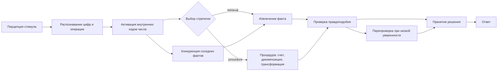
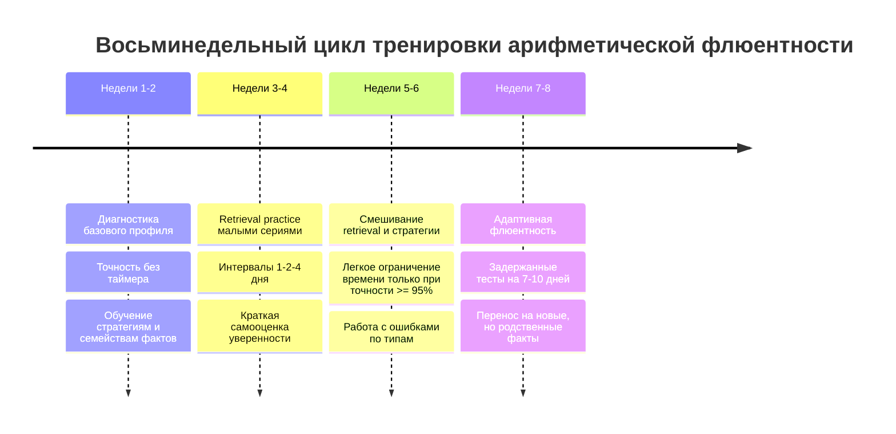

# Почему скорость и точность ментальных арифметических вычислений различаются и как их улучшать

## Исполнительное резюме

С инженерной точки зрения ментальная арифметика не является одним "модулем счета". Это конвейер из нескольких стадий: восприятие записи задачи, распознавание формата и операции, перевод чисел в внутренние коды, выбор стратегии, собственно вычисление или извлечение факта из памяти, проверка результата и моторный ответ. Для простых задач вроде 11-4 время ответа зависит не только от "силы памяти" для ответа, но и от того, какой внутренний код активируется первым, насколько быстро система выбирает между извлечением и процедурой, как много конкурирующих ответов поднимается из ассоциативной сети, и насколько человек склонен перепроверять себя перед ответом. Эта многостадийность хорошо согласуется с triple-code model, поведенческими данными по problem-size effect, моделями ACT-R, сетевыми моделями интерференции и работами по онлайн-декодированию стадий арифметической обработки. citeturn37view0turn14view0turn7view2turn20view0turn23view0

Индивидуальные различия в скорости и точности складываются из взаимодействия доменно-специфических факторов и доменно-общих факторов. К первым относятся качество символических числовых представлений, прочность ассоциаций "задача-ответ", плотность и чистота сети арифметических фактов, сила интерференции от соседних фактов и накопленная образовательная история. К доменно-общим относятся рабочая память, скорость переработки, rapid automatized naming, проактивный контроль, уверенность в выборе стратегии и математическая тревожность. В обзорах развития числовых навыков и метаанализах по рабочей памяти показано, что арифметическая производительность опирается на распределенную систему, а не на один локальный дефицит или одну универсальную способность. citeturn37view0turn28view2turn11view1turn36view0turn29search1

Нейронно это обычно выглядит так. Внутритеменная борозда, особенно IPS, систематически связана с представлением количества и процедурной обработкой, особенно когда задача требует преобразования, счетной процедуры или движения по "ментальной числовой линии". Угловая извилина, особенно слева, чаще вовлекается в вербально опосредованное извлечение арифметических фактов. Префронтальная кора и ACC участвуют в контроле, выборе стратегии и мониторинге конфликта. Гиппокамп особенно важен на этапах формирования и консолидации фактов: по мере обучения дети переходят от более выраженной гиппокампальной зависимости к более неокортикальной, автоматизированной системе решения. citeturn12view10turn34view0turn12view0turn13view2turn37view0

Практически это означает три вещи. Во-первых, скорость и точность лучше всего улучшаются не "голым таймером", а сочетанием retrieval practice, распределенной практики, обучения стратегиям и постепенного ускорения только после стабилизации точности. Во-вторых, целенаправленная работа с арифметическими фактами дает более надежный эффект, чем абстрактные программы "прокачки рабочей памяти", для которых метаанализы не подтверждают устойчивого far transfer на арифметику. В-третьих, математику нельзя стабильно ускорять, игнорируя тревожность: интервенции, снижающие math anxiety, в среднем улучшают и эмоциональное состояние, и математические результаты. citeturn7view10turn22view0turn7view9turn11view4

Этот отчет подготовлен под аудиторию "научно-популярная и практическая для педагогов и исследователей". Параметры "точный профиль читателя" и "точный объем книги" в исходной постановке не указаны; ниже материал организован так, чтобы его можно было развернуть в книгу примерно на 150-250 страниц.

## Механизмы вычисления

Если разложить ментальное вычисление как инженерный pipeline, то простая задача проходит через несколько функциональных узлов. Вариант "11-4" обычно не решается у всех одинаково: у одних доминирует быстрый доступ к заученному шаблону или к стабилизированному преобразованию, у других запускается мини-процедура на числовой линии или декомпозиция "11-1=10, затем 10-3=7". Исследования по finger tracking показывают, что при сложении и вычитании операнды могут обрабатываться последовательно: движение сначала тянется к большему операнду, а потом постепенно смещается к ответу, что хорошо согласуется с пошаговой операцией над ментальной числовой линией. Для subtraction это особенно правдоподобно. citeturn20view0turn12view10turn34view0

Ниже схема является синтезом поведенческих, ERP/EEG, MEG и вычислительных работ по арифметике. Временные окна зависят от формата задачи, возраста, операции и стратегии, но сама последовательность стадий воспроизводится устойчиво. citeturn23view0turn12view2turn23view2turn19search9

В triple-code model число представлено как минимум в трех кодах: визуальная арабская форма, вербальный код числа и аналоговое представление величины. Современные обзоры развития арифметики по сути удерживают ту же архитектурную идею: визуально-символический код, вербальный код и количественный код образуют ядро, а рабочая память, пространственные и языковые процессы играют роль вспомогательных систем. В исходной анатомической схеме Dehaene и Cohen это показано как распределение visual number form, magnitude representation, verbal system и arithmetic facts по связанным кортикальным системам; в современном npj-обзоре эта же логика сохранена и прямо обозначена как core components of the triple-code model. citeturn14view0turn37view0

С точки зрения измеряемой латентности полезна следующая инженерная аппроксимация:

`RT = t_перцепции + t_парсинга + t_кодирования + t_выбора_стратегии + t_извлечения/процедуры + t_проверки + t_ответа + шум`

Это не буквальная формула статьи, а обобщение архитектурных моделей и данных по ERP/RT. В ACT-R соответствующие стадии реализуются через взаимодействие declarative chunks и productions: арифметические факты хранятся как chunks, процедуры - как productions, а извлечение управляется субсимвольной активацией, шумом, порогом извлечения и конкуренцией совпадающих кандидатов. Именно эти параметры помогают объяснить, почему один и тот же человек может отвечать то быстро, то медленно, а другой - стабильно, но с редкими "соседними" ошибками. citeturn7view2turn12view7turn12view8

ERP-данные дают полезный каркас для временной разметки. В ряде работ ранняя фаза до примерно 200-250 мс интерпретируется как идентификация стимула и его базового значения, а более поздняя позитивная медленная волна, начинающаяся примерно от 250-400 мс и тянущаяся до 800-1000 мс, связывается с собственно арифметическим вычислением и problem-size effect. Для детей наблюдается похожая архитектура, но с большими амплитудами, большими латентностями и более диффузным паттерном, что согласуется с большей когнитивной стоимостью решения. В более поздних ERP-работах на multiplication problem-size effect показано также, что амплитуда и латентность P300 чувствительны к размеру задачи и арифметическому навыку. citeturn23view0turn12view2turn11view8turn23view2

Поведенчески один из самых устойчивых законов здесь - problem-size effect: большие по операндам задачи решаются медленнее и менее точно, чем маленькие. Важный нюанс: этот эффект не сводится к "больше число - больше время" в грубом смысле. Он возникает как смесь как минимум трех причин: меньшая частота практики больших фактов, большая интерференция соседних ассоциаций и более частый уход в процедуры вместо прямого извлечения. В ERP-работах этот эффект особенно отчетливо связывается с поздней позитивной волной, а в ряде исследований - именно с неретривальными процедурами. citeturn23view0turn23view1turn24search1turn16view0

Разные стратегии имеют разный профиль по скорости, точности и переносимости. Сравнение ниже обобщает поведенческие и нейрокогнитивные результаты.

| Стратегия | Что происходит вычислительно | Обычно быстрее на | Типичные риски ошибок | Нейрокогнитивный профиль | Когда полезна в обучении | Источники |
|---|---|---|---|---|---|---|
| Прямое retrieval | Из памяти поднимается готовая пара "задача-ответ" | Малых, хорошо переученных фактах | Интерференция от "соседей" таблицы, уверенное ложное извлечение | Вербальный код, AG, снижение необходимости в фронтальном контроле | После формирования стабильной ассоциации | citeturn12view10turn31view0turn7view2 |
| Счет или сдвиг по числовой линии | Старт от опорного числа и поэтапное добавление/вычитание | Незнакомых или менее автоматизированных задачах | Потеря шага, ошибки промежуточного состояния, замедление | IPS, количественные коды, более выраженные поздние ERP-компоненты | На раннем этапе как опора для понимания | citeturn20view0turn34view0turn23view1 |
| Декомпозиция | Разложение на более простые факты: 11-4 = 11-1-3 | Средних задачах, где есть удобные опоры | Ошибки на промежуточном шаге, забывание переноса | Фронто-париетальная координация, рабочая память | Для гибкости и осмысленного ускорения | citeturn12view0turn28view3turn30search0 |
| Трансформация | Использование правил: 8x9 = 8x10-8, 13-6 = 13-3-3 | Задачах с заметной структурой | Неполная трансформация, неверное завершение | Повышенный контроль, выбор стратегии, ACC/DLPFC | Для обучения адаптивности | citeturn12view0turn24search1 |
| Compacted counting | Очень быстрая, почти неосознаваемая процедура | Очень малых сложениях | Иллюзия retrieval там, где работает автоматизированная процедура | Дебатируемый статус; EEG-данные для very small additions скорее поддерживают сходство с retrieval | Как объяснительная гипотеза, а не как учебная цель | citeturn31view0 |

Для диагностики полезно помнить: одинаково правильные ответы могут получаться разными алгоритмами. Именно поэтому одна и та же точность может сопровождаться разной скоростью, разной устойчивостью к отвлечению и разной подверженностью anxiety. RT без стратегии - слабый индикатор. RT вместе со стратегией, problem-size slope и типом ошибок - уже хороший. citeturn18view2turn11view8turn23view0turn7view3

## Когнитивные модели и нейронные реализации

Triple-code model остается самой удобной картой высокого уровня. Она утверждает, что арифметика не обслуживается единой амодальной сущностью "число", а строится на взаимодействии по меньшей мере трех представлений: визуального символического, вербального и количественного. Современный обзор developmental brain dynamics прямо воспроизводит эту архитектуру и добавляет, что к ней динамически подключаются domain-general функции: рабочая память, зрительно-пространственная обработка, языковые и исполнительные процессы. Это важно не только теоретически: если у ребенка слабое symbolic number comparison, а у другого - слабый verbal access, внешне они могут одинаково "медленно считать", но внутренние причины будут различаться. citeturn37view0turn14view0

ACT-R предлагает более "механистическую" картину. В этой архитектуре арифметические факты представлены как declarative chunks, процедуры - как productions, а вероятность и скорость извлечения зависят от активации, шума и порогов. Чем чаще и недавнее факт использовался, тем выше его base-level activation. Но retrieval не детерминирован: слабые chunks иногда прорываются, сильные иногда не достигают порога, а при частичном совпадении система может поднять неправильный, но похожий факт. Из этого естественно вытекают speed-accuracy tradeoff, тренировочная динамика, случайные соседние ошибки и то, почему "больше практики" не сводится к одному только укорачиванию RT, а меняет еще и саму вероятность перехода от процедур к retrieval. citeturn7view2turn12view8turn13view3

Connectionist и attractor-подходы полезны там, где нужно объяснить не просто скорость, а форму ошибок. В модели network interference задание активирует не один ответ, а множество связанных фактов; сила активации кандидатов определяется сходством по признакам и величине, поэтому крупные задачи, менее частые и более "плотно окруженные" похожими ответами, труднее чисто отделить от соседей. В современных connectionist-моделях retrieval single-digit multiplication проверяется именно по тому, насколько модель воспроизводит problem-size effect и распределение ошибок. Общий язык attractor networks здесь особенно удобен: состояние сети стремится к одному из устойчивых минимумов, и при слабой сепарации паттернов или сильном шуме сеть легче падает в "не тот" соседний аттрактор. citeturn15search5turn16view0turn32view0

Нейронно-реализационная картина сегодня выглядит достаточно согласованной. В обзоре Dehaene и коллег IPS связывается с quantity-based processing, тогда как angular gyrus - с более лингвистически опосредованными арифметическими операциями, особенно такими, как multiplication fact retrieval. В том же обзоре приводится клинически сильное наблюдение: стимуляция более переднего участка левого IPS нарушала subtraction, а более заднего углового участка - multiplication. Это не означает, что subtraction никогда не может извлекаться из памяти, но показывает, что доминирующие маршруты обработки по операциям частично различаются. citeturn12view10turn7view0

Функция угловой извилины не сводится к "кнопке retrieval", и литература по AG специально подчеркивает, что часть наблюдаемых эффектов может смешиваться с языковыми и default-mode процессами. Тем не менее тренинговые и контрастные fMRI-результаты по арифметике последовательно показывают: по мере автоматизации уменьшается фронто-париетальная нагрузка и усиливается вовлечение AG. В работах Ischebeck и Grabner это описывается как сдвиг от IPS и inferior frontal regions к angular gyrus при изучении арифметических фактов. citeturn26search5turn26search0turn9search2

Гиппокамп оказался критически важен для понимания того, как формируется арифметическая автоматичность у детей. В исследовании Qin и коллег longitudinal changes in hippocampal-neocortical connectivity предсказывали gains in memory-based strategy use; авторы прямо связывают функциональную реорганизацию гиппокамп-неокортекс с переходом от effortful counting к efficient memory-based problem solving. В исследовании De Smedt, Holloway и Ansari у детей small problems и addition, которые ожидаемо чаще решаются через fact retrieval, сопровождались выраженной активацией левого гиппокампа, а дети с низкой арифметической флюентностью продолжали сильнее опираться на right IPS там, где более флюентные сверстники уже извлекали ответ из памяти. citeturn13view2turn12view5turn34view0

Префронтальная кора и ACC особенно важны не столько для "арифметики вообще", сколько для выбора между арифметическими маршрутами. В fMRI-работе по strategy selection greater activation in ACC, DLPFC and angular gyrus наблюдалась именно тогда, когда участник должен был выбрать лучшую стратегию, а не просто выполнить уже заданную. Это хорошо стыкуется с идеей, что слабый вычислитель иногда проигрывает не на этапе "умения вычесть", а на этапе быстрой оптимальной оркестровки стратегии. citeturn12view0turn11view3

Есть и важный образовательный вывод: нейронный маршрут зависит от истории обучения. В сравнении китайских и американских взрослых multiplication problem-size effect имел разные neural correlates: у китайских участников сильнее проявлялись superior temporal regions, связанные с phonological processing, а у американских - right IPS, связанный с calculation procedures. Авторы интерпретируют это как различие между более вербально-мемориальным и более процедурным маршрутом, зависящим от школьной практики. Иными словами, тренировка не просто делает человека "быстрее" - она может изменить сам тип вычислительного маршрута. citeturn24search1

Поддерживает эту картину и обзор по развитию brain networks. В нем подчеркивается, что arithmetic опирается на динамическую интеграцию frontal, parietal и temporo-occipital systems, что связи fronto-parietal и prefrontal-occipitotemporal white matter трактов положительно соотносятся с arithmetic performance, а environmental factors, tutoring и schooling реально перестраивают functional connectivity relevant regions. Это сильный аргумент против идеи, что различия в скорости счета "просто врожденные". Пластичность здесь есть, но она избирательная и маршруто-зависимая. citeturn25search8turn37view0

Для быстрой ориентации полезна сводная таблица по моделям.

| Модель | Базовая идея | Что хорошо объясняет | Что объясняет хуже | Практический вывод | Источники |
|---|---|---|---|---|---|
| Triple-code | Три внутренних кода числа и их перекодировка | Различие между символом, словом и величиной; связь математики с языком и количеством | Детальную динамику trial-by-trial выбора | Подбирать интервенцию по реальному "узкому месту", а не по общему баллу | citeturn14view0turn37view0 |
| ACT-R | Retrieval chunks + procedural productions + activation/noise | Переход от процедур к retrieval, скорость, вероятности ошибок, влияние практики | Тонкую нейронную топографию | Практика должна наращивать доступность фактов и снижать стоимость выбора | citeturn7view2turn12view7turn12view8 |
| Network interference | Задача активирует множество похожих фактов; ошибки из-за интерференции | Neighbor errors, problem-size effect, ложные уверенные ответы | Развитие стратегий во времени | Нужно тренировать различимость фактов и семейства задач, а не только частоту | citeturn15search5turn24search1 |
| Connectionist retrieval models | Факты представлены распределенно; retrieval - результат динамики сети | Реалистичное моделирование multiplication retrieval и size effect | Явную метакогницию | Полезны смешанные задания на близкие факты и подавление конкурентов | citeturn16view0 |
| Attractor networks | Сеть стремится к устойчивым состояниям-аттракторам | Почему память и выбор устойчивы, но иногда "сваливаются" в соседние ответы | Конкретные школьные стратегии без дополнительных слоев модели | Снижение шума и усиление разделения паттернов важнее простого ускорения | citeturn32view0 |

Ниже - полезные первоисточники, где стоит смотреть именно визуализации, если готовить книгу или лекцию.

| Что смотреть | Почему это полезно | Где смотреть |
|---|---|---|
| Анатомическая схема triple-code | Каноническая карта visual number form, magnitude representation, verbal system, arithmetic facts | Figure 2 у Dehaene & Cohen 1995 citeturn14view0 |
| Карта HIPS и префронтальных областей у человека и макаки | Хорошо показывает эволюционный и анатомический контекст quantity system | Figure 2 у Dehaene et al. 2004 citeturn13view1 |
| Схема динамического взаимодействия domain-specific и domain-general функций | Удобна для современного учебного изложения | Fig. 1 у Vogel & De Smedt 2021 citeturn37view0 |
| Гиппокампально-неокортикальная реорганизация | Показывает, как меняется память-опора по мере обучения арифметике | Qin et al. 2014; особенно раздел и фигуры вокруг hippocampal-neocortical changes citeturn13view2 |
| Траектории пальца при счете | Практически идеальная визуализация скрытых арифметических стадий | Pinheiro-Chagas et al. 2017, figures on trajectories and time course citeturn20view0 |
| ERP-кривые для problem-size effect | Хорошо объясняют, где возникают различия по размеру задачи | Núñez-Peña et al. 2005 и Van Beek et al. 2014 citeturn23view0turn24search3 |

## Индивидуальные различия

Скорость вычисления у разных людей различается прежде всего потому, что различается "архитектура короткого пути" к ответу. У одного человека факт уже лежит в хорошо сепарированном ассоциативном кармане, и задача вызывает почти мгновенное retrieval. У другого тот же пример активирует несколько конкурирующих ответов, требует перехода к процедуре или запускает дополнительную проверку. Именно поэтому variance в RT часто растет не только на сложных примерах, но и на примерах формально "простых", если они попадают в плохо стабилизированный участок сети фактов. citeturn15search5turn16view0turn7view2

Ключевой доменно-специфический предиктор - качество символических числовых представлений. В продольном исследовании Vanbinst и коллег symbolic numerical magnitude processing был по силе предсказания арифметического развития сопоставим с тем, как phonological awareness предсказывает чтение. Это принципиально: если ребенок или взрослый медленно и неточно карабкается по символическому числовому пространству, то retrieval и процедуры будут работать на "грязном входе". В подростковом возрасте пути к arithmetic fact retrieval тоже остаются связанными с linguistic pathway, quantitative pathway, symbolic number comparison и processing speed, а не только с "запомненными фактами". citeturn11view2turn16view3

Рабочая память - не просто "добавочный ресурс", а системный ограничитель пропускной способности. Метаанализ 46 исследований на 11 224 участниках показал overall correlation between WM and arithmetic r = 0.312; verbal WM была связана с арифметикой сильнее, чем visuospatial WM, а additive operations показывали более сильную связь с verbal WM, чем multiplicative. При этом dual-task и developmental studies показывают, что working memory нужна не только для явных процедур, но и для поддержания операндов, промежуточных состояний, контроля выбора стратегии и интеграции извлеченного факта в текущий контекст ответа. citeturn28view0turn28view3turn30search0

При этом роль рабочей памяти не статична по возрасту и стадии обучения. В том же метаанализе зафиксировано, что связь verbal WM с арифметикой ослабевает с возрастом внутри начальной школы, а visuospatial WM остается более стабильной по вкладу. Это хорошо сочетается с developmental view: на ранних этапах дети сильнее используют речевое удержание, counting and rehearsal, а затем часть нагрузки уходит в автоматизированные или более пространственно организованные схемы и в долговременное хранение фактов. citeturn28view3turn37view0

Processing speed тоже связан с флюентностью, но его вклад нельзя путать с "просто быстрее жать кнопку". В продольной работе по reading and arithmetic fluency speed of processing и working memory предсказывали arithmetic fluency, тогда как RAN предсказывал и reading, и arithmetic fluency. В другом исследовании number-specific RAN measures, особенно digit RAN and finger-numeral configuration RAN, были наиболее полезны для предсказания arithmetic fluency. Это говорит о том, что скорость ментальной арифметики связана не только с общей скоростью реакции, а с быстрой серийной идентификацией, доступом к хорошо знакомым символам и быстрым доступом к их семантике и названию. citeturn11view1turn36view0turn36view1turn36view3

Математическая тревожность влияет и на скорость, и на точность, и на стратегический профиль. Классическая линия работ Ashcraft показывает, что math anxiety подрывает working memory, фактически действуя как вторичная задача, съедающая доступные ресурсы. Более новый метаанализ Barroso et al. оценивает связь между math anxiety и math achievement как small-to-moderate negative correlation, r = -0.28. Для timed mental arithmetic это особенно токсично: тревожность усиливает избегание retrieval under uncertainty, повышает склонность к медленной перепроверке, а иногда, наоборот, вызывает поспешные ответы under pressure. citeturn3search0turn29search1turn3search8

Стратегическая адаптивность и метакогниция - еще один слой различий. Люди отличаются не только по тому, какие стратегии у них вообще есть, но и по тому, умеют ли они выбирать лучшую стратегию на конкретном примере. fMRI показывает, что strategy selection вызывает отдельную нагрузку на ACC/DLPFC/ANG, а исследования метакогниции показывают, что retrospective judgments готовы быть достаточно точными и влияют на выбор стратегии на следующем задании: низкая уверенность на текущем примере повышает вероятность лучшего стратегического выбора на следующем. Это означает, что быстрая арифметика у эксперта - это не только сильные факты, но и хороший online-controller. citeturn12view0turn18view2

Развитие и обучающая среда меняют сам маршрут решения. В обзоре Vogel и De Smedt подчеркивается, что возраст, performance level, task constraints, education и socio-economic context модифицируют brain networks arithmetic. А сравнение китайских и американских взрослых на multiplication problem-size effect показывает, что образовательная история влияет даже на то, будет ли крупная задача решаться преимущественно через phonological retrieval или через calculation procedures. Следовательно, различия между людьми - это не просто "врожденный талант", а результат накопленного распределения практик, стратегий и аффективного опыта. citeturn37view0turn24search1

Ниже сводная таблица факторов влияния.

| Фактор | Как влияет на скорость | Как влияет на точность | Типичный поведенческий след | Что можно тренировать рядом | Источники |
|---|---|---|---|---|---|
| Качество symbolic number processing | Ускоряет доступ к внутреннему числовому коду | Снижает ошибки входного кодирования и ложные маршруты | Медленное сравнение чисел, плохая устная флюентность | Number comparison, ordinal processing | citeturn11view2turn37view0 |
| Прочность сети фактов | Ускоряет retrieval | Снижает neighbor errors | Малый RT на small facts, низкий problem-size slope | Retrieval practice, related-fact families | citeturn7view2turn15search5turn16view0 |
| Интерференция | Замедляет выбор кандидата | Повышает близкие по таблице ошибки | Confusion errors типа "сосед таблицы" | Разведение похожих фактов, контрастная практика | citeturn24search1turn15search5 |
| Рабочая память | Ускоряет/стабилизирует процедуру и выбор стратегии | Снижает ошибки промежуточных состояний | Рост RT при dual-task, эффекты на сложных задачах | Strategy practice, controlled decomposition | citeturn28view0turn30search0 |
| Processing speed | Снижает стоимость каждого этапа конвейера | Косвенно повышает точность при меньшей нагрузке на WM | Общая замедленность при сохранной логике | Low-stakes fluency drills, serial access | citeturn11view1turn10search0 |
| RAN | Ускоряет серийный доступ к знакомым символам и именам | Помогает стабильному symbol-to-name/meaning access | Медианный RT в arithmetic fluency, связь со reading fluency | Digit RAN, finger-number mapping, rapid naming | citeturn36view0turn11view1 |
| Math anxiety | Замедляет через перегрузку контроля и WM | Может снижать и точность, и стратегическую гибкость | Медленная проверка, избегание, стресс под таймером | Emotion regulation, low-stakes retrieval, confidence work | citeturn3search0turn29search1turn11view4 |
| Метакогниция и strategy selection | Ускоряет выбор правильного маршрута | Снижает неадаптивные переключения | Высокая/низкая уверенность предсказывает последующий выбор | Strategy comparison, confidence rating | citeturn18view2turn12view0 |
| Образовательная история | Меняет доминирующий маршрут решения | Меняет профиль ошибок | Культурные различия в problem-size effect | Format-specific practice, verbal vs procedural balance | citeturn24search1turn37view0 |

Связанные когнитивные способности, которые могут тренироваться одновременно, - это прежде всего symbol access, рабочая память для промежуточного удержания, скорость серийного называния, метакогнитивный мониторинг уверенности, языковые коды числа и зрительно-пространственное оперирование числовой линией. Но степень переноса не бесконечна: тренировка работает лучше, когда соседняя способность разделяет с арифметикой конкретные механизмы, а не только абстрактную метку "умственная нагрузка". Именно поэтому digit RAN или symbolic comparison чаще дают осмысленную ковариацию с arithmetic fluency, чем общий когнитивный тренажер без числового содержания. citeturn11view1turn36view0turn11view2turn7view9

## Обучение и тренировка

Главный вывод из современной литературы звучит так: наращивание скорости должно следовать за стабилизацией внутренних представлений и стратегий, а не заменять их. Обзор developmental brain dynamics прямо предупреждает, что развитие арифметики нельзя свести к одному механизму или одной интервенции. Поэтому эффективная тренировка - это не "таймер + много примеров", а архитектура из нескольких компонентов: построение фактов, обучение стратегиям, мониторинг уверенности и дозированное повышение скорости. citeturn37view0

Для автоматизации арифметических фактов strongest evidence сейчас у retrieval practice и распределенной практики. В классовом исследовании multiplication fact fluency у второклассников retrieval practice через flashcards, распределенная в трех сессиях, дала более сильный краткосрочный и недельный выигрыш, чем restudy/chanting. Это важно: факт лучше становится доступным не тогда, когда его чаще "смотрят", а когда его чаще достают из памяти. citeturn7view10

Но схема spacing в математике не тождественна классическому spacing для слов и текстов. В крупной работе Jazbutis et al. timed practice ускоряла последующий RT только при very short spacing, например daily или every other day; для более редких интервалов timed practice уже замедляла последующие ответы, при этом elevating perceived stress. Untimed practice, напротив, давала более благоприятную картину для unpracticed and conceptually related facts across test phases. Это очень сильный аргумент против безусловной педагогической догмы "таймер всегда полезен для флюентности". citeturn22view0

Следующий компонент - explicit strategy instruction. Нейро- и когнитивные данные показывают, что выбор лучшей стратегии сам по себе требует ресурсов и имеет измеримый neural signature. Поэтому тренировка должна учить не только "решить", но и "распознать тип задачи". Для subtraction и более сложных additions полезны семейства преобразований: близость к десятку, doubles and near-doubles, decomposition, compensation, commutativity, inverse relation between addition and subtraction. Это не "обход памяти", а путь к ее построению, потому что новые ассоциации интегрируются в уже растущую сеть символических зависимостей. Данные Xu et al. о hierarchical process and integration of arithmetic associations хорошо согласуются именно с таким подходом. citeturn12view0turn38view0

Третий компонент - chunking, но не в смысле произвольного "разбить на части", а в двух конкретных смыслах. Первый - ACT-R-style chunking: каждое успешное retrieval усиливает chunk и повышает его доступность при следующем вызове. Второй - структурное chunking в обучении: ученик не учит разрозненные факты, а организует их в семействах и графах зависимостей, где 6+7, 7+6, 13-6, 13-7 и 2x6+1 образуют связанную структуру. Продольные данные по symbolic integration прямо указывают, что новые арифметические навыки интегрируются в развивающуюся associative network, а не просто "наклеиваются сверху". citeturn12view8turn38view0

Четвертый компонент - anxiety-sensitive fluency training. Когда человек решает правильно untimed, но резко теряет результат under pressure, обычная ошибка обучения - еще больше давить таймером. По данным метаанализа интервенций по math anxiety, решения, направленные на cognitive support и emotion regulation, в среднем уменьшают тревожность и одновременно улучшают math performance; средний эффект в метаанализе составил g = -0.467 для снижения anxiety и g = 0.502 для роста performance. Для практики это означает: сначала нужно вернуть ощущение контролируемости задачи, а уже затем делать наращивание скорости. citeturn11view4

Наконец, важно разграничить targeted skill training и generic WM training. Метаанализ Melby-Lervåg, Redick и Hulme показывает надежные short-term gains on trained WM tasks, но не подтверждает убедительного far transfer на intelligence, reading, comprehension или arithmetic. Проще говоря, "натренировать n-back" не равнозначно "ускорить ментальный счет". Если цель - именно arithmetic fluency, то лучше тренировать арифметические маршруты напрямую, включая retrieval, strategy selection и symbolic access. citeturn7view9

Ниже - evidence-aligned схема восьминедельного цикла, собранная как синтез результатов о retrieval practice, распределенной практике, стратегии и работе с тревожностью. Это не "канонический протокол одной статьи", а практический шаблон, согласованный с несколькими источниками. citeturn7view10turn22view0turn11view4turn12view0

Практически удобнее всего мыслить не "упражнениями", а пакетами упражнений.

| Протокол | Цель | Пример упражнений | Режим | Критерий повышения сложности | Ожидаемый эффект | Основание |
|---|---|---|---|---|---|---|
| Retrieval-first fact fluency | Ускорить доступ к фактам | Карточки или экран с короткими сериями из 8-15 фактов, ответ до проверки | 4-5 раз в неделю по 8-12 минут | 2-3 сессии подряд с точностью не ниже 95% | Рост скорости извлечения и недельного удержания | citeturn7view10turn22view0 |
| Strategy families | Повысить адаптивность | Doubles, near-doubles, до десятка, инверсия сложения и вычитания, декомпозиция | 3 раза в неделю по 15 минут | Ученик объясняет, почему выбрал стратегию | Стабильность на незнакомых и средних задачах | citeturn12view0turn38view0 |
| Contrastive interference control | Снизить neighbor errors | Близкие факты рядом: 6x7, 7x6, 6x8, 7x8; сравнение и проговаривание различий | 2-3 раза в неделю по 10 минут | Ошибки соседства падают ниже заданного порога | Меньше интерференции и ложных retrieval | citeturn15search5turn24search1 |
| Confidence-calibrated arithmetic | Улучшить мониторинг | После каждого ответа оценка уверенности 1-3; разбор mismatch "был уверен, но ошибся" | 2 раза в неделю по 10 минут | Снижение overconfidence или excessive checking | Лучше strategy selection и контроль ошибок | citeturn18view2 |
| Anxiety-safe fluency | Снять блокировку под давлением | Untimed -> lightly timed -> mixed; дыхание, reappraisal, low-stakes feedback | 2-4 раза в неделю, коротко | Таймер вводится только после стабилизации | Улучшение скорости без срыва точности | citeturn22view0turn11view4turn3search0 |
| Symbolic access booster | Ускорить входной этап | Быстрое сравнение чисел, digit RAN, number-word matching | 3 раза в неделю по 5-8 минут | RT и ошибки на symbol tasks улучшаются | Косвенное ускорение arithmetic fluency | citeturn11view2turn36view0turn11view1 |

Есть два практических правила, которые особенно часто нарушаются. Первое: если точность ниже примерно 90-92 процентов, ускорение по таймеру обычно преждевременно, потому что оно укрепляет не тот маршрут или повышает стресс. Второе: если человек уже точен, но медленен, полезнее сначала разбирать типичную форму задержки - retrieval difficulty, excessive verification, slow symbol access или strategy indecision, - чем просто увеличивать объем задач. Это вывод не одной статьи, а инженерный синтез всех описанных механизмов. citeturn7view2turn11view4turn36view0turn12view0

## Измерение, диагностика и приложения

На практике слабое место нужно искать не по одному суммарному баллу, а по профилю признаков. Пара "высокая точность + высокая латентность" означает совсем не то же самое, что "низкая точность + нормальная латентность". Первая часто указывает на слабое retrieval или на чрезмерную verification cost, вторая - на импульсивность, плохую сепарацию фактов или стратегическую недоразвитость. Особенно информативны здесь problem-size slope, тип ошибок, self-report strategy, delayed retention и индивидуальная чувствительность к time pressure. citeturn23view0turn24search1turn18view2turn22view0

Ниже - практическая таблица метрик, которые действительно имеют смысл для диагностики ментальной арифметики.

| Метрика | Что измеряет | Как интерпретировать | Минимальный инструмент | Что часто видно при дефиците | Источники |
|---|---|---|---|---|---|
| Median RT по операциям | Общую скорость конвейера | Отдельно по addition, subtraction, multiplication | Серия однотипных примеров | Global slowing, медленный symbol access или verification | citeturn23view0turn34view0 |
| Accuracy | Надежность маршрута | Нужна отдельно untimed и timed | Те же задачи без и с мягким лимитом | Импульсивность, интерференция, stress collapse | citeturn22view0turn11view4 |
| Problem-size slope | Рост RT/ошибок с размером задачи | Индикатор зависимости от процедуры и интерференции | Малые vs большие задачи | Сильная procedural dependence | citeturn23view0turn23view1turn24search1 |
| Strategy report | Как реально решается задача | Retrieval vs procedure vs transformation | Trial-by-trial report | Человек "правильный, но дорогой" по стратегии | citeturn7view3turn31view0 |
| Confidence calibration | Насколько уверенность соответствует результату | Нужна для разведения checking и true uncertainty | Оценка уверенности после ответа | Overconfidence или compulsive overchecking | citeturn18view2 |
| Neighbor error profile | Характер ошибок | Близкие факты указывают на interference network | Анализ ошибочных ответов | Ошибки типа 8x6=56, parity/five-like confusions | citeturn24search1turn15search5 |
| Digit RAN / number-specific RAN | Скорость серийного доступа к символам и значениям | Полезно для прогноза arithmetic fluency | Стандартные RAN-листы | Медленный входной этап и serial access | citeturn36view0turn36view3 |
| Working memory span | Ресурс удержания и манипуляции | Важен для procedure and selection costs | Digit span, backward span, spatial span | Падение на multi-step и strategy-heavy задачах | citeturn28view0turn38view0 |
| Math anxiety score | Аффективная стоимость решения | Сильнее проявляется на timed tasks | Краткий опросник + timed/untimed contrast | Медленная перепроверка, избегание, провал под давлением | citeturn29search1turn3search0 |
| Delayed retention | Консолидацию, а не только performance now | Критична для проверки истинной автоматизации | Тест через 7-10 дней | Быстрое забывание фактов | citeturn7view10turn22view0 |

Из этих метрик можно извлекать довольно точные диагностические гипотезы. Если у человека хорошие untimed accuracy и плохой timed score, а anxiety высокая, это скорее anxiety-speed phenotype, чем "не знает математику". Если ошибок мало, но RT резко растет на subtraction и large problems, вероятен procedural bottleneck с опорой на IPS-like quantity route. Если accuracies на малых фактах плавают, а ошибки близки к связанным answers, вероятна strong interference in fact network. Если arithmetic и reading fluency одновременно страдают, а RAN слабый, стоит смотреть серийный доступ и символьно-вербальное соответствие, а не только "математическое понимание". Это уже синтез разных линий исследований, но он хорошо согласуется с их эмпирическими сигнатурами. citeturn34view0turn24search1turn11view1turn36view0turn29search1

Для edtech отсюда следует очень практичный дизайн. Хорошая система обучения арифметике должна логировать не только:right/wrong, но и RT, размер задачи, тип операции, тип ошибки, частоту self-corrections, confidence и delayed retention. Адаптация должна строиться не как "дал больше сложных задач", а как выбор следующего маршрута: еще retrieval practice, еще стратегия, снятие time pressure или тренировка symbol access. Обзор developmental brain dynamics прямо предупреждает, что neuroscientific findings нельзя просто "уронить" в класс без критической трансляции, но именно для teacher training and classroom analytics такая механистическая модель особенно ценна. citeturn37view0

Для высокоставочного тестирования это тоже важно. Оценка, основанная только на timed arithmetic fluency, смешивает знание фактов, скорость доступа, аффективную устойчивость и метакогнитивную стратегию. Поэтому при отборе, профилировании или клинической диагностике лучше использовать multi-metric battery: untimed and timed arithmetic, strategy sampling, RAN, symbolic number comparison, WM and math anxiety. Иначе тест легко перепутает slow expert with high verification cost и genuinely weak calculator. citeturn11view1turn36view3turn28view0turn29search1

## Практические рекомендации, план книги и направления исследований

Если нужен короткий набор практических правил, то он выглядит так. Сначала повышать точность и различимость внутренних представлений, потом - скорость. Сначала делать retrieval attempts, потом показывать ответ. Сначала тренировать маленькие семейства связанных фактов, затем смешивать их. Таймер вводить только после стабилизации accuracy и только в low-stakes формате. При заметной math anxiety тренировку скорости разворачивать через graded exposure, а не через жесткий pressure. Generic WM training не ставить в центр программы, если целевая метрика - именно arithmetic fluency. И, наконец, собирать не один итоговый балл, а профиль метрик. Все эти рекомендации являются прямой или косвенной операционализацией исследований, разобранных выше. citeturn7view10turn22view0turn11view4turn7view9turn37view0

Ниже - план книги, который можно почти без перестройки разворачивать в рукопись.

| Глава | Содержание | Комментарий |
|---|---|---|
| Введение | Зачем изучать арифметическую флюентность, определения скорости, точности, автоматизации | Не указано в запросе: целевой читатель; принято допущение "педагог + исследователь" |
| Когнитивный конвейер | Перцепция, парсинг, внутренние коды, retrieval/procedure, verification, response | Основа инженерной рамки |
| Теории и модели | Triple-code, ACT-R, network interference, attractor/connectionist models | Сопоставление предсказаний |
| Эмпирика RT и ошибок | Problem-size effect, switch costs, error patterns, confidence, strategy reports | Поведенческий фундамент |
| Нейронные реализации | IPS, AG, PFC, ACC, hippocampus, white matter, developmental reorganization | Соединить с моделями |
| Индивидуальные различия | WM, processing speed, RAN, symbolic comparison, anxiety, education | Профили, а не средние |
| Обучение фактам | Retrieval practice, spacing, contrastive practice, delayed retention | Практика автоматизации |
| Обучение стратегиям | Декомпозиция, инверсия, near-doubles, компенсация, metacognitive cues | Практика адаптивности |
| Диагностика | Метрики, батареи, interpretation rules, кейс-профили | Для педагогов и исследователей |
| Приложения | Edtech, адаптивные тренажеры, low-stakes assessment, classroom dashboards | Перенос в практику |
| Ограничения и мифы | Почему "скорость = интеллект" неверно, почему generic WM training ограничен | Развенчание упрощений |
| Открытые вопросы | Причины vs следствия, causal neuroscience, personalized tutoring | Завершение книгой в будущее |

Список рекомендованных первоисточников ниже подобран так, чтобы он закрывал теорию, нейронауку, поведение и практику. Я привожу DOI там, где он особенно удобен для дальнейшей работы.

| Источник | Что в нем главное | Зачем читать |
|---|---|---|
| Dehaene, Cohen. 1995. "Towards an anatomical and functional model of number processing". DOI не указан в исходном PDF | Исходная формулировка triple-code architecture | Канонический теоретический старт citeturn14view0 |
| Dehaene et al. 2004. "Arithmetic and the brain". DOI: 10.1016/j.conb.2004.03.008 | Связь IPS, AG и арифметики; мозговая карта числа | Лучший короткий обзор классической нейрокогнитивной картины citeturn7view0turn13view1 |
| Lebiere. "The dynamics of cognition" | ACT-R описание chunks, productions, retrieval threshold, noise | Нужен для инженерной формализации скорости и ошибок citeturn7view2turn13view3 |
| Verguts & Fias. 2005. "Interacting neighbors". DOI: 10.3758/BF03195293 | Connectionist retrieval model single-digit multiplication | Хорош для моделирования problem-size effect и interference citeturn16view0 |
| Qin et al. 2014. "Hippocampal-neocortical functional reorganization...". DOI: 10.1038/nn.3788 | Как дети переходят к memory-based strategies | Ключевой источник по роли hippocampus в обучении арифметике citeturn13view2 |
| De Smedt, Holloway, Ansari. 2011. DOI: 10.1016/j.neuroimage.2010.12.037 | Problem size, operation, fluency level, hippocampus and IPS in children | Лучший мост между skill level и нейронным маршрутом citeturn34view0 |
| Taillan et al. 2015. DOI: 10.3389/fpsyg.2015.00061 | fMRI strategy selection | Полезен для понимания control costs выбора стратегии citeturn12view0 |
| Zhang, Tolmie, Gordon. 2022. DOI: 10.3390/brainsci13010022 | Метaанализ WM-arithmetic relation | Базовый ориентир по роли WM и ее подкомпонентов citeturn28view0 |
| Vanbinst et al. 2016. DOI: 10.1371/journal.pone.0151045 | Symbolic magnitude processing и arithmetic development | Очень важен для screening и early predictors citeturn11view2 |
| Hornung et al. 2017. DOI: 10.3389/fpsyg.2017.01746 | Specific RAN contributions to arithmetic fluency | Нужен для связи arithmetic with RAN and screening citeturn36view0 |
| Barroso et al. 2021. DOI: 10.1037/bul0000307 | Метаанализ math anxiety and achievement | Основной источник по масштабу влияния anxiety citeturn29search3 |
| Sammallahti et al. 2023. "A Meta-Analysis of Math Anxiety Interventions" | Какие интервенции реально снижают anxiety и поднимают performance | Практическая опора для учебных программ citeturn11view4 |
| Melby-Lervag, Redick, Hulme. 2016. DOI: 10.1177/1745691616635612 | Ограничения WM training and lack of far transfer | Нужен, чтобы не строить программу на ложных обещаниях transfer citeturn7view9 |
| Ophuis-Cox et al. 2023. DOI: 10.1002/acp.4141 | Retrieval practice vs restudy for multiplication facts | Один из лучших прикладных источников по fact fluency | citeturn7view10 |
| Jazbutis et al. 2023. DOI: 10.5964/jnc.7721 | Distributed practice x time pressure interaction | Важнейший источник против наивной веры в таймер | citeturn22view0 |
| Vogel & De Smedt. 2021. DOI: 10.1038/s41539-021-00099-3 | Современный интегративный обзор developmental brain dynamics | Лучший современный scaffold для всей книги citeturn37view0 |

Открытые вопросы в этой области уже хорошо видны. Первый - причинность: многие нейронные корреляты арифметической флюентности остаются cross-sectional и не позволяют отличить причину от следствия. Второй - персонализация: мы уже знаем, что одинаковая низкая скорость может порождаться разными механизмами, но пока слишком редко строим truly mechanism-based interventions. Третий - экологическая валидность: timed laboratory fluency не всегда тождественна реально полезной математической компетентности. Четвертый - пределы переноса: остается открытым, в каких именно случаях тренировка symbol access, RAN-like speed или WM действительно переносится на arithmetic route, а в каких - нет. Пятый - нейробиологическая точность: роль AG, hippocampus и white matter connections становится яснее, но нейронные механизмы формирования стабильных арифметических representations еще недостаточно каузально разложены. Эти пробелы прямо подчеркиваются и в современном developmental review, и в литературе по интервенциям и transfer. citeturn37view0turn7view9turn11view4

Если свести весь отчет к одной инженерной формуле, то она будет такой: скорость ментального счета растет, когда уменьшается стоимость входного кодирования, выбора стратегии, retrieval competition и verification, а точность растет, когда улучшаются сепарация фактов, контроль интерференции и калибровка уверенности. Лучшие программы обучения бьют именно по этим компонентам по отдельности и в правильной последовательности. citeturn7view2turn15search5turn12view0turn22view0turn11view4
