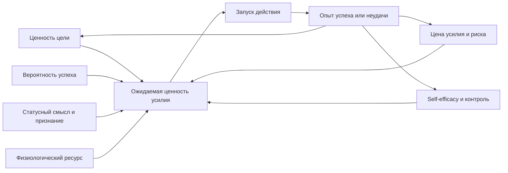
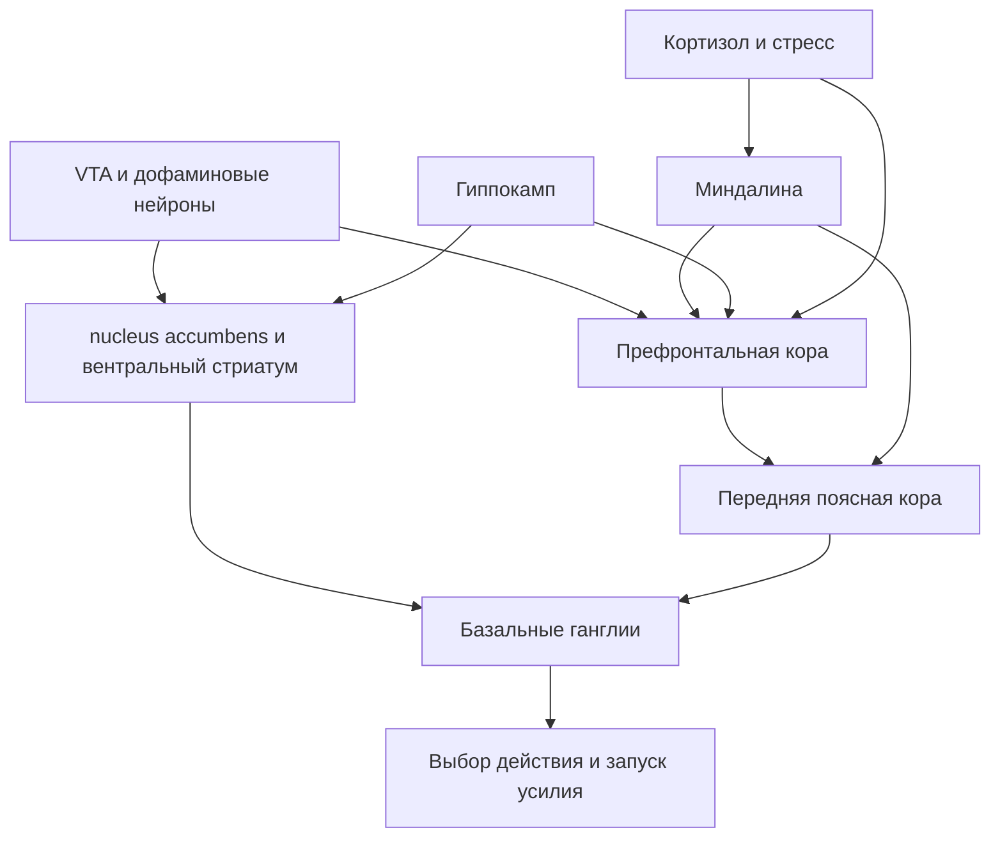

# Честолюбие как многоуровневый феномен

## Исполнительное резюме

Честолюбие в современном научном смысле лучше понимать не как один "порок" или одну "добродетель", а как многоуровневую систему, которая связывает оценку будущей награды, готовность платить цену усилия, чувствительность к статусу, опыт контроля над результатами и доступный физиологический ресурс. В русской словарной традиции "честолюбие" определяется как стремление добиться высокого, почетного положения, известности и славы; в англоязычной науке ближайшие операциональные термины - ambition, achievement motivation, status-seeking, striving, effort-based decision-making. При этом амбиция не тождественна ни потребности в достижении, ни потребности во власти: у Judge и Kammeyer-Mueller она описывается как относительно устойчивая ориентация на внешние результаты успеха, статус и социально распознаваемое продвижение, тогда как achievement motivation сильнее привязана к самому стандарту мастерства, а power motive - к контролю и влиянию как таковым. citeturn8search3turn8search7turn17search1turn13view9

Нейробиологически честолюбие не локализуется в одной "точке мозга" и не сводится к дофамину. Наиболее надежная картина такая: дофаминергические системы среднего мозга и вентрального стриатума участвуют в кодировании ожидаемой ценности, обучении на ошибках предсказания награды и выборе высокоусильных вариантов; префронтальная кора поддерживает цель и план; передняя поясная кора вычисляет ожидаемую ценность контроля и усилия; nucleus accumbens помогает переводить мотивационную ценность в действие; миндалина делает значимыми угрозу и стимулы вознаграждения; гиппокамп связывает память, контекст и воображение будущего; базальные ганглии участвуют в выборе действия и переходе от целенаправленного действия к привычке. Нейрохимически дофамин особенно важен для "wanting" и усилия, серотонин - для обработки затрат, терпения и части социальных решений, кортизол - для стрессовой перенастройки системы приоритетов, тестостерон - для статусного поведения в контекстно-зависимой форме, часто в связке с кортизолом. citeturn21search4turn22search0turn22search1turn20search7turn19search10turn22search23turn12search9turn12search24turn2search7turn18search4turn17search17

Психологически честолюбие держится на трех опорах: "это важно", "я могу повлиять", "усилия окупятся". Отсюда центральные теории для книги: self-efficacy Бандуры объясняет, почему опыт успеха и наблюдение за моделями усиливают смелость ставить высокие цели; self-determination theory Райана и Деси показывает, почему амбиция устойчивее, когда удовлетворены автономия, компетентность и связанность; learned helplessness показывает, как хроническая неконтролируемость превращает стремление в пассивность; исследования effort-based decision-making объясняют, как мозг оценивает цену усилия; литература по анедонии, депрессии и выгоранию показывает, что у части людей исчезает не "моральный стержень", а способность ощущать будущую награду как стоящую затраты. scarcity-исследования добавляют социально-экономический слой: дефицит ресурсов сам по себе отнимает когнитивную пропускную способность и сокращает горизонт планирования. citeturn19search4turn19search1turn20search4turn20search6turn21search2turn21search3turn24search2turn19search7turn13view7

Социально-культурно честолюбие формируется не в вакууме. Исторически отношение к нему менялось: античность легко связывала стремление к великому с добродетелями magnanimity и civic excellence; христианская традиция сместила нормативный центр к смирению как противовесу гордыне; ранний капитализм придал амбиции форму дисциплинированного призвания; современная меритократия одновременно разжигает амбицию и легитимирует неравенство, хотя реальные каналы социальной мобильности распределены крайне неравномерно. При этом люди поднимаются к статусу двумя разными дорогами - через dominance и через prestige; для здорового честолюбия в устойчивых институтах обычно важнее престиж, компетентность и польза для группы, чем принуждение. Гендерные стереотипы, ожидаемая мобильность и экономическое неравенство заметно меняют форму и интенсивность амбиций. citeturn8search5turn8search0turn9search0turn29search1turn17search0turn9search2turn25search12turn25search17turn26search13turn26search12

Для книги я бы рекомендовал научно-популярный исследовательский формат на 100 000-120 000 слов. Целевая аудитория не указана; оптимальны три варианта: академический нон-фикшн для широкой аудитории, более строгая монография для психологов и нейроученых, либо гибрид "science + practice" для управленцев, предпринимателей и специалистов по развитию. Ниже пакет построен так, чтобы его можно было разворачивать в любой из трех форматов.

## Исследовательская рамка и рабочая модель

Для исследовательской книги о честолюбии важнее сразу развести несколько близких, но не совпадающих конструктов. Иначе текст быстро скатится либо в морализм, либо в поверхностную "дофаминную" популяризацию. Судя по литературе, честолюбие лучше рассматривать как trait-level tendency to value upward movement in rank, recognition, achievement visibility and socially legible success; мотивацию достижения - как стремление соответствовать стандарту превосходства; внутреннюю мотивацию - как интерес к самому занятию; мощностной мотив - как стремление к контролю; а статус - как социальный результат, который можно получать или через престиж, или через доминирование. citeturn17search1turn13view9turn19search1turn17search0

Практическая формула, которая выдерживает и нейронаучную, и психологическую литературу, выглядит так: честолюбие растет, когда увеличиваются субъективная ценность цели, ожидаемая контролируемость исхода, допустимость цены усилия и ощущение, что результат будет замечен и признан; оно снижается, когда усиливается неконтролируемость, анедония, хронический стресс, дефицит ресурсов или социальная среда, в которой повышение ставки опасно или бессмысленно. Эта формула хорошо согласуется с Bandura, Shenhav, Salamone, Maier и исследованиями scarcity. citeturn19search4turn19search10turn20search6turn20search4turn19search7

Эта схема особенно полезна для книги, потому что позволяет не спорить о том, "хорошо" или "плохо" честолюбие, а вместо этого анализировать, какие механизмы его поддерживают, и в каком месте систему "ломает". В качестве рабочей гипотезы книги можно принять следующее: честолюбие - это не просто желание успеха, а устойчивое предпочтение дорогостоящего пути к будущим и часто социально распознаваемым вознаграждениям. citeturn17search1turn20search6turn19search10

Ниже - компактная карта различий между ключевыми конструктами, чтобы они не смешивались в главах.

| Конструкт | Что в центре | Что усиливает | Что подавляет | Ключевые источники |
|---|---|---|---|---|
| Честолюбие | Продвижение, признание, видимый успех | Статусные стимулы, понятные траектории роста, социально различимые результаты | Бессмысленность усилий, низкая мобильность, неясные правила | Judge & Kammeyer-Mueller, 2012; Gramota citeturn17search1turn8search3 |
| Мотивация достижения | Стандарт превосходства и мастерство | Задачи средней трудности, критерии качества, обратная связь | Невозможные задачи, отсутствие критериев | Judge & Kammeyer-Mueller, 2012; Atkinson review citeturn13view9turn6search2 |
| Внутренняя мотивация | Интерес к самому действию | Автономия, компетентность, связанность | Контролирующая среда, внешнее давление | Ryan & Deci, 2000 citeturn19search1 |
| Мотив власти | Контроль, влияние | Роли власти, конкурентный контекст | Пассивные роли, санкции за контроль | Judge & Kammeyer-Mueller, 2012 citeturn13view9 |
| Статус | Положение в иерархии | Компетентность, ресурсы, коалиции, страх или уважение | Потеря легитимности, репутации или силы | Cheng et al., 2013 citeturn17search0 |

## Биология, нейрохимия и нейроанатомия честолюбия

Самая распространенная ошибка в популярной литературе - описывать амбицию как прямую функцию "высокого дофамина". Современная картина сложнее. Дофаминергические нейроны среднего мозга, особенно в VTA и смежных системах, участвуют в кодировании ошибок предсказания награды и в присвоении стимулам мотивационной значимости; это делает цель "стоящей преследования", но не означает, что дофамин равен удовольствию. В классической и последующей литературе Schultz показал, что дофаминовые нейроны кодируют разницу между ожидаемой и фактической наградой, а Berridge и Robinson систематически развели "wanting" и "liking": человек может сильно хотеть то, что уже не приносит пропорционального гедонического удовольствия. Для книги это центральный тезис: честолюбие питается скорее wanting, чем liking. citeturn22search0turn22search1turn21search4turn21search1

Вентральный стриатум и особенно nucleus accumbens - не просто "центр награды", а узел, который помогает переводить мотивационную ценность в действие. Обзоры Haber и Knutson, а также Klawonn и соавторов, описывают accumbens как часть кортико-базально-ганглионарной схемы, где встречаются сигналы ценности, контекста, внутреннего состояния и доступных действий. Именно поэтому честолюбие нельзя изучать без анализа того, как цель связывается с возможностью действия: можно ценить награду, но не двигаться к ней, если система effort-cost считает путь слишком дорогим. citeturn20search7turn22search23turn22search19

Латеральная и медиальная префронтальная кора нужны для удержания цели, планирования, самоконтроля и перехода от импульса к стратегии. Теории goal maintenance рассматривают PFC как место, где активно поддерживаются целевые представления, необходимые для длительных иерархических программ поведения. Это особенно важно для честолюбия, потому что амбициозные цели почти всегда отложены во времени и требуют сохранения курса вопреки сиюминутным отвлечениям. citeturn12search3turn12search7turn12search31

Передняя поясная кора занимает в этой системе особое место: она не просто "обнаруживает конфликт", а, по модели expected value of control, участвует в оценке того, стоит ли вообще включать дорогой когнитивный контроль, какой уровень усилия оправдан и где окупается концентрация. Для книги эта идея бесценна, потому что позволяет перевести честолюбие из языка характера в язык распределения контроля: амбициозный человек не просто "больше хочет", он чаще считает дорогое усилие оправданным. citeturn19search10turn16search13

Миндалина и гиппокамп добавляют к амбиции аффективную и временную глубину. Миндалина кодирует не только угрозу, но и положительную ценность наградных сигналов; более новые обзоры подчеркивают ее роль в икономике будущего вознаграждения и в оценке того, когда pursuit of reward опасен, но все же оправдан. Гиппокамп, в свою очередь, важен не только для памяти о прошлом, но и для воображения будущих сценариев и для представления ценных будущих состояний. Поэтому честолюбие можно описать как сцепку между памятью об успехах и поражениях, эмоциональной значимостью цели и способностью вообразить привлекательное будущее "я". citeturn12search24turn12search0turn12search28turn12search9turn12search1

Базальные ганглии встраивают все это в выбор действия. Они помогают отбирать желательные программы поведения и подавлять конкурирующие варианты; при хроническом стрессе и перегрузе мозг нередко сдвигается от гибкого префронтального контроля к более автоматизированным, привычечным паттернам. Отсюда важный для книги вывод: честолюбие рассыпается не только тогда, когда цель перестает нравиться, но и тогда, когда нейронная архитектура начинает предпочитать немедленную стабилизацию, привычку и избегание сложного контроля. citeturn2search7turn2search3turn20search5

Нейрохимически книгу полезно строить не вокруг мифов, а вокруг сравнительной таблицы.

| Система | Наиболее надежная роль | Связь с честолюбием | Что известно твердо | Что спорно |
|---|---|---|---|---|
| Дофамин | Ошибка предсказания награды, incentive salience, готовность платить усилие | Усиливает "wanting", поддерживает выбор дорогостоящих вариантов ради большей награды | Дофамин не равен удовольствию; он тесно связан с обучением и effort-based choice citeturn22search0turn21search4turn20search6 | Нельзя линейно выводить личностную амбицию из "уровня дофамина" |
| Серотонин | Обработка затрат, терпение, часть социальных и усилиевых решений | Может уменьшать субъективную тяжесть усилия и влиять на иерархическое обучение | Есть экспериментальные данные о роли серотонина в overcoming effort cost и social hierarchy learning citeturn18search4turn18search6turn3search1 | Универсальная формула "серотонин = статус" плохо подтверждается |
| Кортизол | Стрессовая мобилизация, при хронизации - сужение гибкого контроля | При высоком хроническом стрессе амбиция сдвигается к защите и избеганию | Стресс быстро ухудшает PFC-функции и меняет приоритеты выбора citeturn20search5turn3search11 | Разные режимы острого и хронического стресса дают разные эффекты |
| Тестостерон | Контекстно-зависимое статусное и конкурентное поведение | Может усиливать статусное стремление, особенно при низком кортизоле | Dual-hormone literature показывает зависимость от кортизола и ситуации citeturn17search17turn3search14turn3search10 | Эффект неоднороден, есть нулевые и слабые репликации |

Отсюда вытекает фундаментальная для книги мысль. Биологически честолюбие - это не "жажда славы", пришитая к одному гормону, а режим, в котором система будущей ценности перевешивает систему избегания, префронтальный контроль выдерживает горизонт планирования, а цена усилия не кажется невыносимой. Когда же хронический стресс поднимает кортизол и разрушает префронтальное удержание цели, даже высокоценная цель может перестать инициировать действие. citeturn20search5turn17search17turn20search6

## Психология, развитие и клинические срывы честолюбия

На психологическом уровне честолюбие невозможно объяснить без self-efficacy. Бандура показал, что ожидания собственной эффективности формируются как минимум из четырех источников - личного опыта овладения, наблюдения за моделями, социальной поддержки и интерпретации собственных состояний. Для книги это означает простую вещь: люди различаются не только по силе желания, но и по убедительности своих внутренних доказательств, что усилие вообще имеет смысл. Если биография многократно подкрепляла связку "я пробую - и это меняет исход", то честолюбие становится вероятнее и устойчивее. Если же прошлый опыт говорит "инициатива бесполезна или опасна", то система цели гаснет еще до начала действия. citeturn19search4turn14search14turn23search14

Self-determination theory добавляет следующий слой: люди готовы долго и глубоко стремиться к целям, когда поддержаны автономия, компетентность и связанность. Это не романтическая формула, а мощно подтвержденная рамка. Классический обзор Райана и Деси и более новые мета-анализы по need support показывают, что поддержка автономии и компетентности усиливает вовлеченность, внутреннюю мотивацию и благополучие, а их фрустрация повышает риск истощения и disengagement. Для книги здесь особенно важна развилка: амбиция, поддержанная автономией, переживается как "мой путь"; амбиция, навязанная извне, легче превращается в тревожный социальный рефлекс. citeturn19search1turn23search4turn30search8turn30search13

Learned helplessness объясняет, почему некоторым людям "важно", но они все равно не борются. Современная нейронаучная версия теории Маиера и Селигмана делает акцент не на пассивном "усвоении беспомощности", а на контуре controllability: мозг должен научиться, что контроль существует. Когда субъект сталкивается с хронической неконтролируемостью, снижается мотивация к действию, растут пассивность и страх, а позднее человек может не использовать даже реальную возможность повлиять на исход. Для честолюбия это ключевой механизм: многие формы "меня не трогайте" - не отсутствие желания, а биография неконтролируемости. citeturn20search4turn28search20

Исследования effort-based decision-making позволяют перевести это на язык выбора. Работы Salamone и коллег, а также EEfRT-парадигма Тредуэя показывают, что люди и животные не просто максимизируют вознаграждение; они постоянно сопоставляют ценность награды и цену усилия. В депрессии и особенно при анедонии люди чаще отказываются от высокоусильных опций даже при привлекательных наградах. Это радикально важно для книги, потому что разрушает бытовое объяснение "ему просто лень": иногда человек все еще ценит результат, но система effort allocation больше не считает ставку разумной. citeturn20search6turn18search3turn21search3turn1search11

Тreadway и Zald убедительно показали, что анедонию нельзя сводить только к утрате удовольствия. В современной клинической рамке она включает нарушения anticipatory pleasure, motivational drive, decisional components и reinforcement learning. Иначе говоря, человеку может нравиться результат в моменте, но не хватать силы его предвосхитить, выбрать и преследовать. Для темы честолюбия это один из самых важных клинических мостов: амбиция часто ломается раньше удовольствия, на стадии предвкушения и решения "вкладываться или нет". citeturn21search2turn16search25

Выгорание - другой путь распада честолюбия. WHO определяет burnout как occupational phenomenon, связанный с хроническим рабочим стрессом, который не был успешно управлен, а не как отдельную медицинскую нозологию. При этом обзорная литература подчеркивает, что выгорание концептуально неоднородно, частично пересекается с депрессией, а его измерение и границы остаются спорными. Для книги это дает важное различие: не вся потеря амбиции есть депрессия, но хроническая организационная среда с высоким давлением, низкой автономией и падением профессиональной эффективности может систематически "съедать" честолюбие даже у изначально мотивированных людей. citeturn4search0turn4search4turn24search3turn24search2

scarcity-исследования добавляют социально-экономический механизм. Mani, Mullainathan, Shafir и Zhao показали в лабораторном и полевом дизайне, что бедность и финансовая озабоченность могут сами по себе сокращать когнитивную мощность, занимая ментальный bandwidth. Это особенно важно для книги, потому что позволяет объяснить, почему в условиях дефицита люди часто выглядят "менее амбициозными": в действительности часть их когнитивных ресурсов уже оплачивает выживание. В тех же терминах недосып снижает готовность вкладывать именно когнитивное, а не обязательно физическое усилие, то есть бьет по той части амбиции, которая требует планирования, самоорганизации и длительного контроля. citeturn13view7turn19search7turn4search7

Полезно свести эти теории в одну сравнительную матрицу.

| Теория | Главный вопрос | Что предсказывает рост честолюбия | Что предсказывает его падение | Ключевые источники |
|---|---|---|---|---|
| Self-efficacy | Верит ли человек, что может повлиять на результат | Mastery experiences, модели, подкрепляющая обратная связь | Повторы неуспеха, стыд, интерпретация возбуждения как беспомощности | Bandura, 1977; Stajkovic & Luthans meta citeturn19search4turn23search14 |
| Self-determination theory | Насколько цель переживается как своя | Автономия, компетентность, связанность | Контроль, принуждение, need thwarting | Ryan & Deci, 2000; Howard et al., 2025 citeturn19search1turn23search4 |
| Learned helplessness | Есть ли опыт контролируемости | Реальный контроль, обнаруживаемая причинность | Неконтролируемость и последующая пассивность | Maier & Seligman, 2016 citeturn20search4 |
| Effort-based decision-making | Стоит ли награда цены усилия | Высокая ценность и переносимая цена усилия | Рост effort cost, неопределенность, истощение | Salamone et al., 2018 citeturn20search6 |
| Анедония | Работает ли anticipatory reward system | Сохранная способность предвосхищать награду | Мотивационная анедония, дефицит выбора усилия | Treadway & Zald, 2011; Treadway et al., 2012 citeturn21search2turn21search3 |
| Burnout | Разрушает ли хроническая работа ресурс и смысл | Управляемая нагрузка, автономия, адекватная среда | Хронический стресс, цинизм, падение эффективности | WHO; Bes et al., 2023 citeturn4search0turn24search12 |
| Scarcity | Сколько ментального bandwidth уже занято выживанием | Снижение дефицита, разгрузка решений | Финансовая и временная перегрузка | Mani et al., 2013 citeturn19search7turn13view7 |

Психологически это приводит к жесткому, но ясному выводу. Одни люди "готовы стараться" не потому, что они просто лучше по морали, а потому, что их опыт, среда и нейрофизиологический ресурс сложились в устойчивую систему контролируемой, осмысленной и вознаграждаемой траектории. Другие хотят лишь, чтобы их не трогали, часто потому, что мозг и биография научили их: ставка высока, контроль низок, энергия мала, а цена ошибки унизительна. citeturn19search4turn20search4turn13view7turn24search3

## Социальный, культурный и исторический контекст

История честолюбия - это история смены моральных режимов. В античной и ранней добродетельной традиции стремление к великому было тесно связано с magnanimity и civic excellence; в обзорах по аристотелевой этике и истории морального характера ambition фигурирует не как чистая патология, а как один из естественных добродетельных векторов, если он соразмерен благу и достоинству. Это важно для книги: изначально вопрос звучал не "иметь ли амбицию", а "какую и в каком масштабе". citeturn8search1turn8search5

Христианская рамка смещает акцент. Прямую историю амбиции и смирения нужно писать осторожно, избегая упрощений, но общая интеллектуальная тенденция ясна: теологические дискуссии о humility ставят в центр правдивое отношение к собственным достоинствам и опасность гордыни. Для книги это дает важный переход: честолюбие начинает мыслиться не только как энергия к великому, но и как риск self-exaltation. Это не простой запрет на амбицию, а смена главного морального вопроса - от величия к смирению и правдивости себя. citeturn8search0

С наступлением модерности амбиция перестраивается еще раз. Weber в "Протестантской этике" описал, как дисциплинированное мирское призвание и систематическая самоорганизация стали культурным двигателем капиталистического порядка. Даже если спорить с масштабом его тезиса, для книги это важная историческая сцена: честолюбие выходит из аристократического поля славы и все сильнее входит в поле профессионального, экономического и организационного самосозидания. citeturn9search0turn9search4

Современность добавляет меритократический парадокс. С одной стороны, массовая культура почти повсеместно прославляет ambition. С другой, исследования социальной мобильности и критики меритократии показывают, что структуры возможности распределены неравно. OECD подчеркивает, что upward mobility зависит от образования, классового происхождения и институтов; Mijs показывает, что обещание полной меритократии неисполняемо и может легитимировать существующее неравенство. Поэтому для книги нужен не только психологический, но и политэкономический тезис: честолюбие всегда формируется в поле perceived opportunity. Там, где ожидаемая восходящая мобильность низка, сама рациональность больших усилий ослабевает. citeturn9search2turn9search18turn25search12

Это особенно заметно в исследованиях status anxiety. Экспериментальные работы Melita и коллег показывают, что воспринимаемое экономическое неравенство может усиливать статусную тревогу через снижение ожиданий восходящей мобильности. Для книги это позволяет связать внутреннюю мотивацию с макроструктурой: у части людей честолюбие не исчезает, а превращается в болезненную status vigilance; у других оно гаснет, потому что социальная лестница воспринимается как почти заблокированная. citeturn25search17turn25search1

Внутри самих иерархий статус добывается разными способами. Cheng, Tracy и коллеги показали, что dominance и prestige - разные, но жизнеспособные пути к вершине. Доминирование использует страх и принуждение; престиж - компетентность, щедрость знания и добровольно предоставляемое уважение. Для книги это один из лучших инструментариев: он позволяет описывать честолюбие не по степени интенсивности, а по типу маршрута. "Здоровое" честолюбие в науке, ремесле, предпринимательстве или лидерстве чаще идет через престиж; паттерны токсичной и деструктивной амбиции чаще опираются на доминирование, унижение и силовое удержание позиции. citeturn17search0turn1search16

Гендер и социализация также нельзя оставлять за скобками. Обзор по gender stereotypes and career progress и исследования gendered political socialization показывают, что девочки и женщины нередко получают более слабые сигналы о легитимности публичного продвижения, а стереотипы и организационные барьеры уменьшают частоту и форму заявляемых амбиций. Для книги это означает: различия в честолюбии - не только различия темперамента, но и различия санкций. Если за одну и ту же статусную заявку разные группы получают разную цену репутационного штрафа, то амбиция становится не просто индивидуальной чертой, а расчетом социального риска. citeturn26search13turn26search12

Наконец, важно удержать русскоязычный слой. В современной русской словарной традиции честолюбие по-прежнему определяется через стремление к высокому положению, известности и славе; одновременно доступен сильный отечественный теоретический ресурс в традиции П. В. Симонова, где поведение и эмоции анализируются через потребности, вероятности удовлетворения и информационную оценку ситуации. Прямой мост между Симоновым и современной нейроэкономикой нельзя проводить без оговорок, но для русскоязычной книги это плодотворная линия сопоставления: честолюбие можно описывать как потребностно-информационную оценку возможностей роста, осложненную современными нейронными данными о награде, усилии и контроле. citeturn8search3turn27search16turn27search1

## Практики развития честолюбия и кейс-стади

Если переводить литературу в практику, главное различие проходит между "раздуванием желания" и реальной перестройкой системы целеполагания. Наиболее надежные практические меры увеличивают не фантазию о величии, а предсказуемость связи "усилие - результат". Именно поэтому из теории self-efficacy следуют маленькие мастерские победы, из SDT - автономно выбранные цели, из effort-literature - снижение цены входа в работу, из scarcity-literature - разгрузка когнитивной полосы, а из стресс-литературы - защита сна и восстановление PFC-ресурса. citeturn19search4turn19search1turn20search6turn19search7turn20search5

Для главы о развитии честолюбия я бы предлагал не абстрактные советы, а сравнительную таблицу вмешательств.

| Вмешательство | Механизм | Где доказательства сильнее | Для чего годится | Ограничения |
|---|---|---|---|---|
| Серия мастерских побед | Повышает self-efficacy через опыт контроля | Социально-когнитивная теория и мета-анализ self-efficacy-performance citeturn19search4turn23search14 | Запуск инициативы, выход из избегания | Слабее работает, если среда реально не вознаграждает усилия |
| Поддержка автономии | Переводит цель из "надо" в "я выбираю" | SDT и мета-анализы need support/interventions citeturn19search1turn23search4turn30search8 | Устойчивое, не невротическое честолюбие | Не заменяет навыка и ресурса |
| Разбиение усилия и if-then planning | Снижает стоимость старта и автоматизирует запуск | Мета-аналитическая литература по implementation intentions citeturn28search3turn28search15 | Прокрастинация, низкая инициация действия | Не решает проблему бессмысленной цели |
| Защита сна | Снижает когнитивную цену контроля | Эксперимент по sleep restriction and cognitive motivation citeturn4search7 | Долгие проекты, учеба, интеллектуальная работа | Эффект не заменяет мотивационный смысл |
| Регулярная физическая нагрузка | Повышает стресс-устойчивость, влияет на мотивированное поведение | Greenwood review; обзоры exercise-dopamine links citeturn28search0turn28search1 | Восстановление энергии и resilience | Данные о прямом росте "амбиции" косвенные |
| Организационная перестройка работы | Уменьшает хронический exhaustion tax | WHO и мета-анализ burnout interventions citeturn4search0turn24search12 | Профессиональное честолюбие и карьерная устойчивость | Индивидуальные техники бессильны против токсичной системы |
| Снижение scarcity load | Высвобождает bandwidth для долгого горизонта | Mani et al., 2013 citeturn19search7turn13view7 | Бедность, финансовый хаос, многозадачный пожар | Требует структурных, а не только личных решений |

Теперь о кейс-стади. Для книги исторические фигуры полезны не как объекты дистанционной диагностики, а как модели разных режимов амбиции.

| Кейс | Что иллюстрирует | Как читать в книге |
|---|---|---|
| Наполеон | Переход от престижной компетентности к персоналистскому dominance-проекту; огромная работоспособность, стратегическая дальность и экспансионизм | Britannica подчеркивает его исключительную трудоспособность и неутолимую амбицию, а также превращение власти в династический и имперский проект. Это кейс честолюбия, которое перестает быть только мастерством и становится политической экспансией. citeturn10search4turn11search1turn10search12 |
| Екатерина II | Государственное честолюбие, самоконструирование через реформы и "славу" | Ее правление сочетает модернизационный, культурный и внешнеполитический проект; Britannica прямо говорит о поиске славы во внешней политике. Это кейс амбиции как imperial statecraft. citeturn10search1turn11search2turn10search13 |
| Мария Кюри | Престижный путь к статусу через компетентность и научное величие, а не через dominance | официальный сайт Nobel Prize и Britannica фиксируют двойную нобелевскую траекторию и институциональное первенство Кюри. Это образцовый кейс честолюбия мастерства и prestige under constraint. citeturn11search0turn11search12 |
| Стахановское движение | Институционализация честолюбия государством | Бриттаника описывает, как повышенная продуктивность и новая организация труда стали основой массовой модели трудового героизма. Это кейс того, как система превращает личное продвижение в идеологию соревнования. citeturn11search3turn11search7 |
| Депрессия и мотивационная анедония | Потеря не мечты, а willingness to expend effort | Лабораторные работы Тредуэя показывают, что при MDD снижается выбор усилия ради награды. Это нужен как клинический контрпример к морализаторскому "нет амбиций = слабый характер". citeturn21search3turn21search2 |
| Профессиональное выгорание | Разрушение карьерной амбиции хронической средой | WHO и мета-анализы burnout показывают, что истощение и снижение профессиональной эффективности могут быть структурным продуктом организации труда. Это кейс не личной дефектности, а сломанной экологии достижений. citeturn4search0turn24search12 |

Практический вывод из этих кейсов жесткий. Честолюбие "прокачивается" не лозунгом "хоти сильнее", а через реконструкцию контура: цель должна быть значима, путь - разбит на переносимые блоки, среда - давать видимый контроль, а организм - иметь ресурс удерживать горизонт. Любая глава о self-help, которая игнорирует ресурс, классовую структуру и стрессовую биологию, будет интеллектуально слабой. citeturn19search4turn20search5turn19search7turn24search12

## Каркас книги, аннотированная библиография и исследовательские пробелы

Для книги на 100 000-120 000 слов я бы предложил такую архитектуру. Желаемый объем и целевая аудитория не указаны, поэтому план ниже рассчитан на максимально универсальный формат между академическим нон-фикшном и исследовательской монографией.

| Глава | Содержание | Примерный объем |
|---|---|---|
| Введение | Почему честолюбие - центральный двигатель и источник разрушений | 6 000 |
| Понятие и история | От честолюбия и magnanimity к meritocracy и status anxiety | 10 000 |
| Нейронная архитектура | VTA, NAc, PFC, ACC, миндалина, гиппокамп, базальные ганглии | 12 000 |
| Нейрохимия | Дофамин, серотонин, кортизол, тестостерон, стресс и ресурс | 10 000 |
| Психология действия | Self-efficacy, SDT, expectancy-value, goal systems | 12 000 |
| Контроль и беспомощность | Learned helplessness, controllability, avoidance | 8 000 |
| Когда система ломается | Анедония, депрессия, выгорание, тихий отказ от продвижения | 12 000 |
| Статус и общество | Dominance, prestige, гендер, класс, мобильность, культура | 12 000 |
| Биография амбиции | Детство, социализация, образование, модели успеха | 8 000 |
| Институции | Школа, работа, лидерство, платформенные среды | 8 000 |
| Практики роста | Как строить здоровое честолюбие без самонасилия | 10 000 |
| Заключение | Честолюбие после меритократии | 4 000 |

Ниже - ядро аннотированной библиографии. Это не "полный список", а опорный корпус, с которого уже можно писать книгу. Я ставлю в приоритет первичные исследования, затем обзоры и мета-анализы, затем официальные материалы и только после этого сильные книги.

| Источник | Тип и метод | Ключевой вывод для книги | Ограничения | DOI / доступ |
|---|---|---|---|---|
| Bandura, 1977, "Self-efficacy: Toward a Unifying Theory of Behavioral Change" citeturn19search4 | Классическая теоретическая статья | Самоэффективность - центральная переменная между опытом и действием; источники эффективности задают силу притязаний и устойчивость | Теория широка и требует domain-specific operationalization | DOI: 10.1037/0033-295X.84.2.191 |
| Ryan & Deci, 2000, "Self-Determination Theory..." citeturn19search1turn19search5 | Классический обзор | Устойчивая мотивация держится на автономии, компетентности и связанности | Ранний обзор, не мета-анализ; поздние уточнения обязательны | DOI: 10.1037/0003-066X.55.1.68 |
| Howard et al., 2025, meta-analysis of need support / thwarting citeturn23search4 | Мета-анализ, 637 выборок | Need support систематически связан с положительными мотивационными исходами, need thwarting - с отрицательными | В основном образовательные и преимущественно корреляционные выборки | DOI: 10.1177/01461672231225364 |
| Maier & Seligman, 2016, "Learned helplessness at fifty" citeturn20search4 | Концептуальный обзор с нейронаучной реинтерпретацией | Центральна не только "беспомощность", но и обучение контролируемости | Основная опора на животные модели, перенос на человека требует осторожности | DOI: 10.1037/rev0000033 |
| Schultz, Dayan, Montague, 1997, "A Neural Substrate of Prediction and Reward" citeturn22search0turn22search4 | Первичное нейрофизиологическое исследование | Ошибки предсказания награды - базовый механизм обучения, важный для честолюбия как обучения на продвижении | Не изучает личностную амбицию напрямую | DOI: 10.1126/science.275.5306.1593 |
| Schultz, 1998, "Predictive Reward Signal of Dopamine Neurons" citeturn22search1turn22search5 | Классический обзор/расширение нейрофизиологии | Детализирует, как дофаминовые нейроны кодируют предсказуемость награды | Та же проблема: от уровня нейрона до черты личности путь длинный | DOI: 10.1152/jn.1998.80.1.1 |
| Berridge & Robinson, 2016, "Liking, Wanting..." citeturn21search4 | Теоретико-обзорная статья | "Wanting" и "liking" диссоциируемы; амбиция ближе к wanting | Основана на широкой программе, но терминология часто искажается в популяризации | DOI: 10.1037/amp0000059 |
| Berridge, 2007, "The debate over dopamine's role in reward" citeturn21search1 | Большой обзор | Дофамин сильнее связан с incentive salience, чем с простым удовольствием | Полемический формат; полезен вместе с более новыми обзорами | DOI: 10.1007/s00213-006-0578-x |
| Haber & Knutson, 2010, "The Reward Circuit" citeturn20search7 | Нейроанатомический обзор | Кортико-базально-ганглионарная система - сердце reward circuits | Обзор, а не единый эксперимент | DOI: 10.1038/npp.2009.129 |
| Shenhav, Botvinick, Cohen, 2013, "Expected Value of Control" citeturn19search10 | Интегративная теория ACC | Передняя поясная кора участвует в решении, стоит ли вообще платить цену контроля | Теория мощная, но требует эмпирической декомпозиции по задачам | DOI: 10.1016/j.neuron.2013.07.007 |
| Salamone et al., 2018, "Dopamine, Effort-Based Choice..." citeturn20search6turn18search11 | Обзор и трансляционный синтез | Усилие - отдельное измерение мотивации; дофамин нужен для high-effort/high-reward choice | Основной массив данных из животных моделей | DOI: 10.3389/fnbeh.2018.00052 |
| Meyniel et al., 2016, "A specific role for serotonin in overcoming effort cost" citeturn18search4turn18search8 | Первичное фармакологическое исследование | Серотонин, вероятно, участвует в уменьшении субъективной тяжести усилия | Один кусок сложной серотониновой картины; не универсальное объяснение | DOI: 10.7554/eLife.17282 |
| Arnsten, 2009, "Stress signalling pathways that impair prefrontal cortex..." citeturn20search5 | Обзор по стресс-нейробиологии | Стресс быстро ослабляет PFC и усиливает более примитивные режимы ответа | Механистический обзор; связь с честолюбием требует интерпретации | DOI: 10.1038/nrn2648 |
| Treadway & Zald, 2011, "Reconsidering anhedonia in depression" citeturn21search2turn21search21 | Большой обзор | Анедония включает не только pleasure loss, но и мотивационные нарушения | Клиническая гетерогенность MDD остается большой | DOI: 10.1016/j.neubiorev.2010.06.006 |
| Treadway et al., 2012, "Effort-Based Decision-Making in Major Depressive Disorder" citeturn21search3 | Первичное исследование EEfRT у MDD | При депрессии снижается выбор усилия ради награды; хороший мост к честолюбию | Лабораторная задача не тождественна жизненным карьерным инвестициям | DOI: 10.1037/a0028813 |
| Cheng et al., 2013, "Two Ways to the Top" citeturn17search0turn17search9 | Первичное социально-психологическое исследование | Статус достигается через dominance и prestige, а не одним путем | Вопросы культурной универсальности и изменения стратегий со временем | DOI: 10.1037/a0030398 |
| Judge & Kammeyer-Mueller, 2012, "On the Value of Aiming High" citeturn17search1turn17search7 | Лонгитюдный анализ и концептуализация амбиции | Амбиция предсказывает карьерные результаты, но не сводится к achievement motive | Фокус на карьерных и статусных исходах, а не на всех типах амбиции | DOI: 10.1037/a0028084 |
| Mani et al., 2013, "Poverty Impedes Cognitive Function" citeturn19search7turn13view7 | Лабораторный и полевой дизайн | Дефицит ресурсов уменьшает когнитивную мощность и сужает bandwidth | Нельзя редуцировать всю бедность к cognition; важны структуры и политика | DOI: 10.1126/science.1238041 |
| Bes et al., 2023, burnout interventions meta-analysis citeturn24search12turn24search4 | Мета-анализ организационных вмешательств | Выгорание требует не только индивидуальных, но и организационных решений | Эффекты неоднородны и умеренны | DOI: 10.1007/s00420-023-02009-z |
| WHO, ICD-11 burnout pages citeturn4search0turn4search4 | Официальная классификационная позиция | Выгорание - occupational phenomenon, а не самостоятельная болезнь | Не решает научный спор о границах конструкта | DOI отсутствует; URL через цитату |

Для русскоязычного слоя книги полезны три направления. Первое - словарные и энциклопедические определения для семантики термина "честолюбие". Второе - классический отечественный корпус Симонова о потребностно-информационном подходе к эмоциям и поведению. Третье - русскоязычные обзоры по дофамину как мост для читателя, входящего в нейробиологию, при обязательной сверке с англоязычными primary sources. citeturn8search3turn27search16turn27search2turn5search3

Для дополнительного книжного списка я бы рекомендовал: Deborah Rhode, "Ambition: For What?" как сильную нормативно-социальную рамку; Weber, "The Protestant Ethic and the Spirit of Capitalism" как историческую точку сборки модерной амбиции; Mullainathan & Shafir, "Scarcity" как книгу о cognitive bandwidth under deficit; Simonov, "Эмоциональный мозг" как отечественный теоретический ресурс; Daniel Lieberman & Michael Long, "The Molecule of More" - только как популярную вторичную книгу для иллюстрации дофаминовой темы, а не как научный первоисточник. citeturn29search1turn9search0turn29search8turn29search12turn27search16turn29search14

Главные пробелы в знаниях и спорные вопросы сейчас такие. Во-первых, сама конструкция ambition измеряется хуже, чем близкие ей понятия achievement motivation, grit или self-efficacy; нужны лучшие longitudinal tools, особенно вне карьерного контекста. Во-вторых, гормональная литература по тестостерону и кортизолу страдает от сильной контекстной зависимости и неоднородных репликаций. В-третьих, серотонин для амбиции - явно важная, но пока недостаточно интегрированная тема. В-четвертых, большая часть мотивциионных задач - лабораторные и часто WEIRD-sample heavy; их экологическая валидность для долгих жизненных проектов ограничена. В-пятых, граница между выгоранием и депрессией остается спорной. Наконец, у нас все еще слишком мало данных о том, как амбиция меняется по жизненному циклу в связке с классом, гендером, платформенной экономикой и изменением структуры возможностей. citeturn17search1turn17search17turn18search4turn21search3turn24search3turn24search2

Если суммировать исследовательскую программу книги в одной фразе, она может звучать так: честолюбие - это не одна черта и не один гормон, а динамическое равновесие между желанием будущего, верой в контролируемость пути, ценой усилия, биологическим ресурсом и социальным устройством лестницы, по которой человек пытается подняться. citeturn19search4turn19search1turn20search6turn19search7turn17search0
