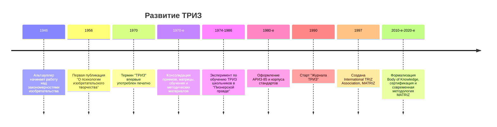
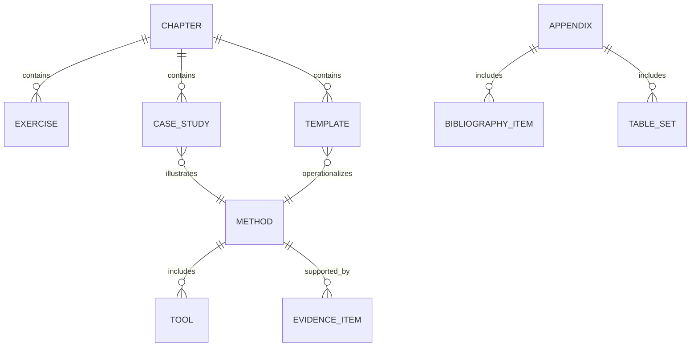

# Методы нестандартного решения задач

## Executive summary

Нестандартное решение задач не сводится к одной "лучшей" методике. По собранным источникам, ТРИЗ особенно силен там, где задача может быть сведена к противоречию, системной функции, ресурсам и идеальности; дизайн-мышление сильнее при высокой неопределенности пользовательских потребностей; Lean Startup и A/B-эксперименты сильнее на этапе проверки гипотез и отбора решений; CPS, SCAMPER, аналогии, инверсия и морфологический анализ полезны как инструменты расширения пространства вариантов. На практике лучший результат дает не выбор одной школы, а связка: корректная постановка задачи -> дивергентная генерация -> сужение и валидация -> внедрение. citeturn19search13turn12view6turn3search4turn24view0turn14view0turn12view5turn6search4turn39search20turn8search17turn41search0

По уровню доказательности картина неоднородна. Общие программы развития креативности в среднем дают положительный эффект умеренной величины; современный мета-анализ по взрослым сообщает средний эффект Hedges' g = 0.53, а более ранний мета-анализ Scott, Leritz и Mumford показывал особенно заметные эффекты для дивергентного мышления и creative problem solving. Для инкубации существует отдельный мета-анализ 117 исследований с положительным суммарным эффектом, причем дивергентные задачи выигрывают больше, чем лингвистические и визуально-инсайтные. Нейрокогнитивные обзоры сходятся в том, что креативность опирается не на один "центр творчества", а на взаимодействие default mode, executive control и salience networks. citeturn28search3turn28search9turn28search0turn28search11turn3search0turn3search10turn3search1turn9search4turn9search9

ТРИЗ исторически является одной из наиболее проработанных систематических школ изобретательского мышления. По официальным материалам фонда Альтшуллера и MATRIZ, работа началась в 1946 году, первая публикация вышла в 1956 году, печатное употребление термина "ТРИЗ" зафиксировано в 1970 году, в 1970-е и 1980-е оформился классический корпус инструментов, а международная институционализация получила устойчивую форму с созданием MATRIZ в 1997 году. В классическом ядре ТРИЗ находятся противоречия, ИКР, 40 приемов, матрица противоречий, оператор системного мышления, вепольный анализ, 76 стандартов, АРИЗ и законы развития технических систем. citeturn31search0turn1search11turn23search8turn21search0turn12view4turn19search2turn19search13turn19search19

При этом именно для ТРИЗ доказательная база слабее, чем для "общих" программ креативности и экспериментального предпринимательства: есть отдельные контролируемые и полевые исследования, в том числе с ростом novelty и variety, но нет обнаруженного в этом обзоре специального мета-анализа по ТРИЗ как целостной методике. То же относится к SCAMPER, lateral thinking, inversion и "9 окнам" как самостоятельным вмешательствам: для них есть локальные исследования и практические корпуса, но не сопоставимый с медициной или evidence-based education массив высококачественных репликаций. citeturn20search0turn35view0turn22search0turn41search1turn29search0turn29search1

Вывод для книги как проекта строгий: материал нужно строить не как панегирик "творчеству", а как инженерную дисциплину работы с неопределенностью. Нужны одновременно: историко-теоретическое ядро ТРИЗ, сравнительная карта соседних методов, отдельный блок когнитивной науки, раздел по доказательности, детальные кейсы, а затем рабочие шаблоны для индивидуальной и групповой практики. Такая архитектура лучше всего соответствует и классическим источникам, и современной эмпирике. citeturn12view4turn12view5turn12view6turn24view0turn28search3turn41search1

## История и эволюция ТРИЗ

История ТРИЗ начинается с работы Генриха Альтшуллера в патентной сфере в 1946 году. Официальная хронология фонда Альтшуллера указывает именно этот год как старт работы не над отдельными изобретениями, а над закономерностями их создания; первая публикация о разрабатываемой теории вышла в 1956 году в журнале "Вопросы психологии"; печатное употребление термина "ТРИЗ" официально фиксируется 1970 годом; в 1974-1986 годах Альтшуллер вел масштабный эксперимент по обучению ТРИЗ школьников; в 1990-х появилась периодика "Журнал ТРИЗ"; в 1997 году была создана MATRIZ как международная ассоциация, продолжающая традицию Альтшуллера. citeturn31search0turn1search11turn23search8turn32search2turn32search6turn32search7turn21search0



Эта линия развития важна не только исторически. Она показывает, что ТРИЗ выросла не из одной техники генерации идей, а из попытки превратить изобретательское мышление в воспроизводимую технологию. Именно поэтому в классическом корпусе ТРИЗ есть не только приемы, но и модели задачи, правила перехода между моделями, алгоритмы и критерии "силы" решения. Официальный TRIZ Body of Knowledge MATRIZ перечисляет как базовые компоненты: идеальность, ИКР, противоречия, оператор системного мышления, АРИЗ, вепольный анализ, 76 стандартов, 40 приемов, матрицу противоречий, принципы разделения и законы эволюции технических систем. citeturn12view4turn13view0turn21search12

Важное следствие для современного чтения ТРИЗ состоит в том, что ее развитие шло "в ширину" и "в глубину". "В ширину" - за счет выхода из сугубо инженерных задач в образование, менеджмент, прогнозирование и развитие мышления; "в глубину" - за счет усложнения самих моделей, от каталогов приемов к АРИЗ, вепольному анализу и законам эволюции. Поэтому сводить ТРИЗ к "40 приемам" методологически неверно: это лишь наиболее доступный слой системы. citeturn19search2turn1search4turn19search19turn17view3turn21search6

Классическое ядро ТРИЗ удобно представить как рабочую иерархию инструментов.

| Компонент | Зачем нужен | Ключевая мысль |
|---|---|---|
| Противоречие | Сжимает задачу до конфликтующей пары требований | Улучшение одного параметра ухудшает другой; сильное решение не "компромисс", а снятие конфликта |
| ИКР | Задает направление поиска | Чем ближе решение к идеальному, тем меньше лишних затрат и проб |
| 40 приемов и матрица | Дают типовые ходы при технических противоречиях | Это банк переносимых шаблонов перехода |
| Физическое противоречие и принципы разделения | Нужны, когда один и тот же элемент должен иметь несовместимые свойства | Разделение во времени, в пространстве, по условиям, на макро/микроуровне |
| Оператор системы экранов | Помогает выйти из локального кадра | Объект рассматривается в системе, подсистеме, надсистеме и во времени |
| Вепольный анализ и 76 стандартов | Формализуют типовые трансформации технических систем | Минимальная модель системы и стандартные линии ее усиления/перестройки |
| АРИЗ | Служит для сложных, "неподдающихся" задач | Проводит через последовательное уточнение модели и ресурсов |
| Законы эволюции систем | Нужны для прогнозирования | Системы развиваются не хаотично, а по узнаваемым направлениям |

Таблица синтезирована по официальным материалам фонда Альтшуллера и MATRIZ. citeturn12view4turn19search2turn19search6turn19search13turn19search19turn1search4turn1search18

Для книги критично удержать два исторических напряжения. Первое: ТРИЗ создавалась как строгая технология, но распространялась в значительной степени через семинары, сообщества и учебно-методические практики, а не через классическую академическую институционализацию. Второе: именно поэтому современному читателю нужен двойной комментарий - "как это понимал Альтшуллер" и "что из этого лучше всего подтверждается современными исследованиями". Без этого ТРИЗ либо превращается в культ, либо несправедливо редуцируется до "интересной, но недоказанной экзотики". citeturn21search0turn40search3turn22search0turn40search6

## Карта методов и механизмов

Если смотреть не по школам, а по когнитивной функции, методы нестандартного решения задач распадаются на четыре кластера: переопределение проблемы, систематическое расширение пространства вариантов, сужение и оценка, практическая валидация. ТРИЗ и SIT в первую очередь структурируют пространство поиска; SCAMPER, морфологический анализ, аналогии и инверсия расширяют его; CPS организует цикл "понимание проблемы -> идея -> действие"; дизайн-мышление усиливает эмпатию, прототипирование и тест; Lean Startup и Agile дисциплинируют отбор и внедрение через короткие циклы обратной связи. citeturn12view5turn12view6turn3search4turn5search2turn6search4turn4search19turn24view0turn12view7turn4search1turn39search20turn8search17turn41search0

| Метод | На что лучше всего нацелен | Сильные стороны | Слабые стороны | Ресурсы | Состояние доказательной базы |
|---|---|---|---|---|---|
| ТРИЗ | Технические и организационные противоречия, сложные инженерные задачи | Сильная формализация, перенос опыта между доменами, хороший язык для "жестких" задач | Высокий порог входа, риск формального применения, не все инструменты одинаково удобны вне инженерии | Средние/высокие | Есть отдельные контролируемые и полевые исследования, но в этом обзоре не найдено специализированного мета-анализа по ТРИЗ как целому citeturn12view4turn20search0turn35view0turn22search0 |
| SIT и TRIZ-SIT | Идеация "внутри ограничений", продуктовые и сервисные идеи | Простота относительно ТРИЗ, принцип "inside the box", практичность | Меньше глубины для сложных конфликтов, чем у полной ТРИЗ | Низкие/средние | Эмпирика локальная; есть теоретическая и прикладная литература, но база уже, чем у общих программ креативности citeturn5search2turn18search9turn18search3 |
| SCAMPER | Модификация существующих продуктов, услуг и учебных задач | Простота, низкий порог, хорош для разморозки мышления | Часто ведет к инкрементальным, а не системным новшествам | Низкие | Есть квазиэксперименты и учебные исследования, но массив доказательств ограничен citeturn6search4turn29search1turn29search0 |
| Дизайн-мышление | Задачи с высокой пользовательской неопределенностью | Эмпатия, рефрейминг, быстрое прототипирование, совместная работа | Может давать рост fluency без роста originality; нередко расплывается в "воркшопизм" | Средние | Есть обзоры и полевые эксперименты; эффекты чувствительны к дизайну вмешательства и метрикам citeturn12view6turn3search4turn17view3turn7search10 |
| CPS | Организация полного цикла продуктивного мышления | Сильная фасилитационная рамка, баланс дивергентного и конвергентного | Менее специализирован для технических противоречий, чем ТРИЗ | Средние | Длинная исследовательская традиция и обзоры эффективности, особенно в образовании и training citeturn12view5turn27search3turn28search0 |
| Lateral thinking | Разрыв фиксированных паттернов и допущений | Хорош для провокации и смены перспективы | Труднее стандартизировать и валидировать | Низкие | Сильный практический корпус, но слабее прямая экспериментальная база как у формализованных программ тренинга citeturn4search3turn4search11turn41search1 |
| Systems thinking | Сложные взаимосвязанные ситуации | Позволяет видеть петли обратной связи, запаздывания, рычаги | Сам по себе не генерирует решения; легко перейти в абстракцию | Средние | Сильная концептуальная традиция; прямая доказательная база именно по идеации слабее citeturn39search9turn39search6 |
| Lean | Улучшение потока ценности и снижение потерь | Жесткая ориентация на ценность и поток, дисциплина эксперимента | Инновации радикального типа рождает не всегда; опасность локальной оптимизации | Средние/высокие | Доказательность выше для операционных улучшений, чем для creative ideation как таковой citeturn4search1turn4search9 |
| Agile | Итерационная разработка и быстрая адаптация | Короткие циклы, быстрая обратная связь, высокая адаптивность | Не является самостоятельной ideation-методикой; может закреплять локальный тактизм | Средние | Систематические обзоры есть, но они относятся прежде всего к разработке и процессным результатам citeturn12view7turn4search8turn12view12 |
| Analogical reasoning | Поиск структуры решения в других доменах | Часто поднимает novelty и transfer | Возможен поверхностный перенос по внешнему сходству | Низкие/средние | Есть обзорные и экспериментальные данные, поддерживающие эффективность аналогий при ideation citeturn39search20turn18search11turn18search5 |
| Inversion | Поиск через "анти-цель", ошибки и обратную постановку | Хорошо вскрывает провалы, риски и скрытые предпосылки | Чаще дает негативные критерии, чем готовые решения | Низкие | Есть обзорная поддержка для assumption reversals и opposites, но прямых сильных мета-данных немного citeturn41search0turn41search6 |
| Morphological analysis | Систематический перебор комбинаций параметров | Прозрачность, полнота, удобство для сложных конфигураций | Комбинаторный взрыв, риск "мертвых" сочетаний, нужна фильтрация | Средние | Есть классический корпус и отдельные учебные исследования, но эмпирика как у standalone-метода ограничена citeturn8search17turn8search1turn7search4 |

Главный практический вывод из этой карты: методы не конкурируют по принципу "кто прав", они закрывают разные провалы мышления. ТРИЗ и SIT лучше ломают функциональную фиксированность через ограничения; аналогии и SCAMPER лучше расширяют ассоциативный доступ; CPS и дизайн-мышление лучше организуют групповую работу; Lean Startup и Agile лучше всего удерживают связь идеи с внешней реальностью. Поэтому в книге стоит строить не "энциклопедию методов", а операционную матрицу: какой метод нужен при каком типе неизвестности, какой цене ошибки и какой длительности цикла. citeturn5search2turn6search4turn12view5turn12view6turn24view0turn12view7turn41search0

## Что говорит когнитивная наука

Современная когнитивная литература плохо согласуется с популярным мифом, будто креативность - это просто "дивергентность". Исследования по executive functions, attentional control и creative problem solving показывают, что продуктивная новизна требует сочетания ассоциативного расширения и контролируемого отбора. Обзоры и эмпирические работы показывают вклад working memory, inhibition, shifting и semantic control как в дивергентные, так и в конвергентные задачи; при этом конвергентные задачи в среднем сильнее зависят от управляемого внимания и отбора, а дивергентные - от гибкого переключения и управляемого развертывания семантического пространства. citeturn10search1turn10search2turn10search4turn10search7turn10search9turn10search20turn10search24

Нейросетевые данные усиливают этот тезис. Обзоры Beaty и коллег и исследования network coupling показывают, что креативное мышление связано не с "расслабленным мечтанием" само по себе, а с кооперацией default mode network, executive control network и salience network. DMN обеспечивает внутренне направленное воображение и спонтанные ассоциации; executive network - удержание цели, оценку и селекцию; salience network - переключение и маркировку значимых внутренних событий. Практический смысл прямой: хорошие творческие методики должны специально разводить режим генерации и режим оценки, но не изолировать их слишком далеко друг от друга. citeturn3search1turn9search4turn9search14turn9search9turn9search19

Инкубация - один из наиболее устойчиво подтверждаемых эффектов в этой области. Мета-анализ Sio и Ormerod по 117 исследованиям обнаружил положительный инкубационный эффект, причем дивергентные задачи выигрывают больше других. Более поздние обзоры и новые исследования добавляют важную деталь: не любая пауза полезна, а прежде всего такая, в которой внимание не перегружено конкурирующей задачей; кроме того, степень mind wandering во время инкубации может предсказывать прирост последующей креативности. Для книги это означает, что "пауза" должна описываться как управляемая процедура, а не как романтизированное "отпустить и ждать вдохновения". citeturn3search0turn3search10turn9search2turn9search12turn9search27

Ограничения также оказываются не врагом, а двусмысленным ресурсом. Междисциплинарный обзор Acar и коллег показывает, что ограничения могут как подавлять, так и катализировать творчество в зависимости от их природы и механизма воздействия; серия обзоров и экспериментов Le Masson, Hatchuel и Weil подчеркивает, что грамотно заданные ограничения могут выполнять дефиксирующую функцию. Именно поэтому TRIZ работает через противоречие, а SIT - через closed world: хорошие рамки уменьшают шум не за счет урезания творчества, а за счет повышения структурного давления на поиск. citeturn3search7turn9search23turn5search2turn19search22turn19search13

Когнитивный смысл ключевых методов можно сжать в прикладную таблицу.

| Когнитивный механизм | Что известно | Методический вывод |
|---|---|---|
| Дивергентное расширение | Нужно для роста числа и разброса идей, но не гарантирует их ценность | SCAMPER, морфология, аналогии, провокации полезны в начале поиска |
| Конвергентный отбор | Нужен для ценности, реализуемости и выбора | CPS, ИКР, критерии, lean-эксперименты обязательны после генерации |
| Внутреннее воображение + когнитивный контроль | Лучшие творческие результаты связаны с их сотрудничеством, а не с доминированием одного контура | Сессию надо делить на режимы, но сохранять между ними быструю петлю |
| Инкубация | Пауза часто улучшает последующую продуктивность, особенно в дивергентных задачах | Встраивать короткие паузы, смену модальности, "сонные" промежутки без сильной нагрузки |
| Ограничения | Хорошо подобранные ограничения улучшают фокус и дефиксацию | Формулировать противоречие, closed world, ресурсные рамки, анти-цель |

Синтез основан на обзорах и мета-анализах по креативности, вниманию, инкубации и ограничениям. citeturn10search4turn3search1turn3search0turn3search7turn9search23

## Что показывает эмпирика

С точки зрения строгой оценки полезно различать не "научные" и "ненаучные" методы, а уровни подтверждения.

| Уровень | Что считается подтверждением | Как интерпретировать |
|---|---|---|
| Высокий | Мета-анализы, систематические обзоры, несколько независимых RCT или больших квази-экспериментов | Метод или механизм можно считать устойчиво полезным в очерченной области |
| Средний | Один сильный RCT, крупные панели, повторяемые квази-эксперименты | Польза вероятна, но зависит от контекста и дизайна применения |
| Низкий | Отдельные лабораторные и полевые исследования, учебные кейсы, case study | Метод перспективен, но обобщать нужно осторожно |
| Очень низкий | Экспертные руководства, отдельные примеры, популярные описания | Это скорее источник гипотез и практик, чем доказанный стандарт |

Такую шкалу оправдывают различия между, например, мета-анализами по creativity training и единичными кейсами по специализированным эвристикам. citeturn28search3turn28search0turn41search1

Ниже - исследования, которые дают наиболее полезный каркас для книги.

| Метод или механизм | Тип исследования | Дизайн и выборка | Краткий результат | Вывод для книги |
|---|---|---|---|---|
| Creativity enhancement methods | Мета-анализ | 332 effect sizes, взрослые выборки | Средний положительный эффект g = 0.53; существенная вариативность между методами и условиями | Нужна глава не только о методах, но и о модераторах эффекта citeturn28search3turn28search9 |
| Creativity training | Мета-анализ | 70 программ тренинга | Более сильные эффекты для divergent thinking и problem solving, чем для attitudes и продуктов | Глубокие программы процесса обычно сильнее разовых "креативных игр" citeturn28search0turn28search11 |
| Инкубация | Мета-анализ | 117 исследований | Положительный инкубационный эффект; дивергентные задачи выигрывают больше | В книге нужна отдельная техника управления паузами и сменой режима citeturn3search0turn3search10 |
| TRIZ | Контролируемый эксперимент | Инженерная ideation-задача по redesign LED traffic lights | TRIZ повышал novelty и variety, но слегка снижал quantity по сравнению с ad hoc ideation | ТРИЗ полезен не для "идей побольше", а для идей более структурно сильных citeturn2search18turn20search0 |
| TRIZ в инженерном образовании | Пятилетний полевой кейс | INSA Strasbourg, 2006-2010 | Введение software-supported TRIZ улучшило освоение и педагогическую эффективность | Для сложных формализованных методов критична когнитивная разгрузка через цифровые среды и шаблоны citeturn35view0turn36view1 |
| Design thinking | Полевой эксперимент "lab in the field" | 270 подростков, 195 завершивших, рандомизация на treatment/control | Рост confidence, ideational fluency и elaboration; снижение originality и flexibility; нет эффекта на perspective taking | Дизайн-мышление не надо романтизировать: оно может усиливать продуктивность без усиления оригинальности citeturn15view0turn17view0turn17view3 |
| Lean scientific entrepreneurship | RCT | 116 итальянских стартапов, 16 временных точек | Научный подход к предпринимательским решениям улучшал процесс принятия решений и фирменные исходы | Для книги нужен раздел о том, как строить эксперимент, а не только как генерировать гипотезы citeturn26search0turn26search1 |
| Репликация научного подхода в стартапах | Несколько RCT | 759 фирм, четыре randomized control trials | Обнаружен положительный эффект на idea termination и нелинейный эффект на radical pivots | Отсев плохих идей - такой же показатель прогресса, как генерация новых citeturn26search3turn26search19 |
| A/B testing в стартапах | Большая панель, квази-каузальные модели | Долгосрочная фирменная панель | Эффект A/B testing на рост со временем увеличивается; через три года близок к 30%; результаты положительны и устойчивы в разных моделях | Валидация идеи должна быть долгим режимом обучения, а не разовым тестом citeturn14view0turn14view4 |
| Lean Startup capability | Количественное исследование | Операционализация LSC и анализ связи с результативностью | Обнаружена сильная и устойчивая связь LSC с performance | Lean Startup уместен как глава о capability, а не только о наборе инструментов citeturn24view0turn25view0 |
| SCAMPER | Квази-эксперимент | 21 + 21 gifted students в эксперименте и контроле | Сообщается положительное влияние на creative thinking | SCAMPER уместен как входной и учебный инструмент, но evidence-base пока узкая citeturn29search1turn29search0 |
| Analogical reasoning | Эксперименты в дизайне | Новички и опытные дизайн-студенты; разные типы подсказок | Аналогические визуальные clues улучшают по крайней мере часть показателей креативности | Глава об аналогиях должна содержать правила отбора "дальних", а не поверхностных аналогий citeturn18search5turn18search11turn39search20 |

Если перевести эту таблицу в общий рейтинг доказательности, получится следующая схема. Высокий уровень имеет не ТРИЗ как школа, а более общий класс creativity training и отдельные когнитивные механизмы, такие как инкубация. Средний уровень имеют экспериментальное предпринимательство, A/B testing в цифровых средах, CPS как часть длинной традиции тренинга, отдельные исследования design thinking. Низкий или низко-средний уровень имеют ТРИЗ, SCAMPER, SIT, аналогическое мышление и морфологический анализ как самостоятельные вмешательства: они не "слабы", но менее накоплены и хуже реплицированы. Очень низкий - у lateral thinking и inversion как самостоятельных программ, если судить именно по строгим экспериментальным данным, а не по популярности. citeturn28search3turn3search0turn27search3turn24view0turn14view0turn17view3turn20search0turn29search1turn41search1

Явный пробел обзора: в найденных источниках не обнаружен мета-анализ, который бы отдельно оценивал 40 приемов, "9 окон", оператор экранов, ИКР или lateral thinking как самостоятельные интервенции с сопоставимыми outcome measures. Для книги это не недостаток, а методологическая обязанность: прямо отделять "классический корпус и практическую ценность" от "уровня эмпирической подтвержденности". citeturn41search1turn22search0turn20search0

## Практические кейсы и инструменты

Самые полезные кейсы для будущей книги - не "легенды успеха", а разборы того, как метод менял ход поиска.

Кейс по инженерному образованию и ТРИЗ во Франции показателен именно тем, что проблема была не в отсутствии идей, а в трудности освоения метода. В INSA Strasbourg преподаватели выделили типичный барьер: ТРИЗ требует слишком много времени и когнитивного усилия для учебной среды. Решение состояло не в упрощении содержания до банальности, а в программной поддержке алгоритма: шаги метода были встроены в software-assisted workflow, а качество освоения отслеживалось по отчетам и шкале понимания концептов. За годы кейса авторы фиксируют рост педагогической эффективности и качества усвоения inventive design. Это "процессный кейс": он показывает, что для сложных методов ключевой инновацией часто является не новая эвристика, а новая форма носителя и фасилитации. citeturn35view0turn36view1

Кейс по design thinking в Agastya полезен как редкий пример экспериментального дизайна. Исследователи не тестировали весь свободный "дух дизайна", а выделили три конкретных упражнения из программы: Bag Exercise, Cartographer и Be a Detective. Затем был проведен четырехдневный "lab in the field" эксперимент с рандомизацией на три treatment-группы и контроль; итогом стал рост confidence, ideational fluency и elaboration, но снижение originality и flexibility. Это важнейший анти-мифический результат: метод может улучшать объем и разработанность идей, но одновременно сужать поисковое пространство. Для книги это аргумент против языка "любой креативный метод повышает креативность вообще". citeturn15view0turn16view1turn17view0turn17view3

Кейс Lean Startup и scientific entrepreneurship показывает, что нестандартное решение задач без режима проверки превращается в коллекцию симпатичных фантазий. В RCT по итальянским стартапам научный подход к предпринимательским решениям преподавался как практическая дисциплина явных гипотез, тестов и смены курса по результатам. Более поздняя крупная репликация на 759 фирмах уточнила картину: особенно важен не только прирост удачных идей, но и idea termination, то есть своевременное прекращение плохих направлений, а эффекты радикальных pivot-решений оказываются нелинейными. Это показывает, что в книге нужно рассматривать "убийство идеи" как столь же ценный навык, как ее рождение. citeturn26search0turn26search1turn26search3turn26search19

Кейс A/B testing в цифровых стартапах уже не про генерацию, а про накопление организационного интеллекта. Исследование Koning и коллег показывает, что сама установка на экспериментирование меняет темп обучения фирмы; в одной из оценок эффект A/B testing через три года оказывается близким к 30%, а разные спецификации модели дают устойчиво положительные результаты. Важный перенос на более широкий контекст таков: "креативность" команды следует измерять не количеством придуманных идей, а скоростью перехода от гипотезы к знанию. citeturn14view0turn14view4

Кейс по redesign психологической интервенции на основе design thinking полезен для медицины и социальной инженерии. В работе Yeager и коллег качественное исследование пользователей и быстрые итеративные randomized A/B experiments с примерно 3000 участниками использовались для доработки intervention design; две экспериментальные оценки показали, что revised growth mindset intervention превосходила прежние версии по краткосрочным proxy outcomes. Это сильный пример того, как дизайн-мышление может работать не как "brainstorming with empathy", а как дисциплина micro-experimentation. citeturn38search0turn38search5turn38search8

Наконец, controlled ideation study по ТРИЗ в инженерной задаче redesign LED traffic lights показывает специфический профиль ТРИЗ: novelty и variety выросли, quantity слегка снизилась. Это почти образцовый контраст с design thinking из кейса выше: ТРИЗ нередко платит меньшим числом вариантов за большую структурную силу части решений. Для книги это означает необходимость отдельной главы о разных метриках идеи: количество, новизна, разнообразие, разработанность, полезность, проверяемость. citeturn2search18turn20search0

Практические шаблоны, которые стоит включить в книгу, должны быть не декоративными, а печатными рабочими листами. Ниже - минимальный набор.

```text
Лист постановки задачи

Контекст:
Кто владелец проблемы?
Какой процесс или система затронуты?
Какой ущерб или упущение наблюдаются?

Текущее нежелательное явление:
Что именно происходит?
Когда это возникает?
Как это измеряется?

Целевое полезное изменение:
Что должно появиться или исчезнуть?
Какой критерий успеха?

Ограничения:
Бюджет
Срок
Регуляторика
Технологические рамки
Запреты
```

```text
Лист противоречия ТРИЗ

Если мы улучшаем:
____________________

То ухудшается:
____________________

Почему компромисс нас не устраивает:
____________________

Физическое противоречие:
Элемент должен быть ____________________
и одновременно ____________________

ИКР:
Система сама ____________________
не усложняясь и не дорожая больше, чем необходимо.

Доступные ресурсы:
Время
Пространство
Материалы
Поля/энергия
Информация
Отходы/побочные эффекты
```

```text
Шаблон "9 окон"

Прошлое / Настоящее / Будущее
Подсистема / Система / Надсистема

Для каждой клетки:
Что изменялось?
Что можно убрать?
Что можно передать наверх/вниз?
Где скрыт ресурс?
Где возникнет новый конфликт?
```

```text
Морфологическая матрица

Проблема:
____________________

Параметр 1: __________ | Варианты: ____________________
Параметр 2: __________ | Варианты: ____________________
Параметр 3: __________ | Варианты: ____________________
Параметр 4: __________ | Варианты: ____________________

Комбинация A:
Комбинация B:
Комбинация C:

Фильтры:
Полезность
Новизна
Стоимость
Проверяемость
```

```text
Карта валидации идеи

Гипотеза:
____________________

Какой факт должен быть правдой, чтобы идея сработала?
____________________

Самый дешевый тест:
____________________

Метрика:
____________________

Порог решения:
Если метрика >= ________, продолжаем
Если метрика < ________, меняем или закрываем
```

Для групповых сессий оптимальный протокол должен учитывать эмпирические ограничения brainstorming. Классическая литература показывает, что интерактивные малые brainstorming-группы часто производят меньше идей, чем эквивалентное число людей, работающих индивидуально, из-за production blocking, evaluation apprehension и других потерь; structured alternatives вроде nominal group technique и electronic brainstorming частично уменьшают эти эффекты. Поэтому фасилитационный стандарт для книги стоит строить как "индивидуальная генерация -> агрегирование -> структурное развитие -> оценка", а не как бесконечный разговор у доски. citeturn11search7turn11search13turn11search2turn11search0turn11search6

Рекомендуемый базовый сценарий сессии на 90 минут выглядит так: 10 минут на постановку задачи и критерии, 10 минут на "тихую" индивидуальную генерацию, 15 минут на один структурный метод расширения пространства вариантов, 15 минут на ТРИЗ-рефрейм через противоречие/ИКР, 10 минут паузы или смены модальности, 15 минут на отбор по критериям, 15 минут на формирование тестируемых гипотез. Такой протокол опирается одновременно на данные по инкубации, ограничениям brainstorming и эффективности структурированных инструментов. citeturn3search0turn9search2turn11search13turn11search2turn41search0

## Архитектура книги и приложения

Лучший формат книги по теме - не линейный учебник "от метода к методу", а трехслойная структура: теория, доказательства, практика. Теория нужна, чтобы не деградировать до сборника карточек; доказательства - чтобы отделять рабочее от модного; практика - чтобы читатель мог действительно проводить сессии, принимать решения и обучать других. Эта трехслойная архитектура лучше всего соответствует разрыву, обнаруженному в источниках: сильные методические традиции часто имеют более слабую эмпирику, а сильная эмпирика часто касается более общих механизмов, чем конкретных брендов методов. citeturn28search3turn41search1turn22search0turn24view0



Рекомендуемая структура книги:

| Глава | Содержание | Что должен сделать читатель |
|---|---|---|
| Введение | Что такое нестандартное решение задач и почему "креативность" без дисциплины бесполезна | Самодиагностика своих типовых ошибок поиска |
| Наука о креативности | Дивергентное и конвергентное мышление, внимание, инкубация, ограничения | Провести двухрежимный мини-эксперимент на себе |
| История ТРИЗ | Альтшуллер, эволюция корпуса, школы, интернационализация | Сопоставить мифы о ТРИЗ с первоисточниками |
| Постановка задачи | Противоречие, ИКР, ресурсы, физическое противоречие | Заполнить лист постановки и лист противоречия |
| Классические инструменты ТРИЗ | 40 приемов, матрица, 9 окон, веполь, стандарты, АРИЗ | Решить одну техническую и одну организационную задачу |
| Смежные методы | CPS, SCAMPER, SIT, lateral thinking, morphology, analogy, inversion | Выбрать метод под тип задачи |
| Пользователь и контекст | Дизайн-мышление, эмпатия, наблюдение, рефрейм | Провести короткое интервью и собрать инсайты |
| Валидация решений | Lean Startup, A/B testing, Agile loops, метрики, пороги решения | Сформулировать гипотезу и самый дешевый тест |
| Групповая работа | Фасилитация, NGT, anti-brainstorming traps, оценка идей | Провести сессию по готовому протоколу |
| Индустриальные кейсы | Инжиниринг, софт, медицина, производство, стартапы, образование | Разобрать кейс по шагам "задача -> метод -> результат" |
| Личная практика | Как внедрять методы в личную и командную рутину | Собрать личную систему творческого труда |
| Организационная система | Как строить культуру эксперимента и problem solving capability | Составить roadmap внедрения на 90 дней |

Эта структура - авторская рекомендация на основе собранного материала.

Для приложений нужен не декоративный, а рабочий корпус. Минимум включает: библиографию первоисточников; краткие аннотации к ключевым исследованиям; таблицу 40 приемов с переводом на нетехнический язык; пустые и заполненные морфологические матрицы; шаблон 9 окон; набор SCAMPER-вопросов; чеклист фасилитатора; формы постановки гипотез, плана эксперимента и журнала решений; таблицу метрик ideation outcome с определениями novelty, variety, fluency, elaboration, usefulness и testability. Такой набор делает книгу не только читаемой, но и операционной. citeturn19search2turn8search17turn12view6turn24view0turn14view0

Ниже - перечень первоисточников и официальных сайтов, которые обязаны войти в справочный аппарат книги.

| Категория | Источник |
|---|---|
| Классика ТРИЗ | Г. С. Альтшуллер: "Как научиться изобретать", "Алгоритм изобретения", "Найти идею", "Творчество как точная наука", "Введение в ТРИЗ. Основные понятия и подходы" citeturn23search8turn23search1turn1search23 |
| Официальный архив автора | Официальный Фонд Г. С. Альтшуллера: биография, хронология, классические тексты, АРИЗ, стандарты, приемы citeturn1search7turn1search11turn19search2turn1search4 |
| Международная институциональная линия ТРИЗ | MATRIZ: about, methodology, certification, academia, TRIZ Review, Level manuals, Body of Knowledge citeturn21search0turn21search12turn21search15turn21search6turn40search3turn12view4 |
| CPS | Center for Applied Imagination, Buffalo State; CPS model и исторические материалы Osborn-Parnes citeturn12view5turn6search13 |
| Design thinking | Stanford d.school Bootleg; IDEO Design Thinking citeturn12view6turn3search4 |
| Lean и Agile | Agile Manifesto; Lean Enterprise Institute citeturn12view7turn4search8turn4search1turn4search9 |
| Lateral thinking | de Bono / de Bono Thinking официальные сайты citeturn4search3turn4search15turn4search19 |
| SIT | SIT official method pages и литература Goldenberg-Mazursky-Horowitz citeturn5search2turn18search3turn18search9 |
| Morphological analysis | Zwicky - Ritchey, Swedish Morphological Society, General Morphological Analysis citeturn8search1turn8search17 |
| Доказательная база по креативности | Scott et al.; Haase et al.; Sio & Ormerod; Beaty et al.; Acar et al.; Vernon review citeturn28search0turn28search3turn3search0turn3search1turn3search7turn41search1 |

Итоговая редакционная рекомендация проста. Если эта книга должна быть "достаточной по объему и глубине", то ее центр тяжести должен лежать не на перечне техник, а на вопросе: как меняется вероятность найти сильное решение, если мы по-разному формулируем задачу, управляем вниманием, вводим ограничения, структурируем групповой процесс и проверяем идеи в контакте с реальностью. Именно на этом стыке ТРИЗ и смежные подходы перестают быть набором популярных методик и становятся дисциплиной мышления. citeturn19search13turn3search1turn3search7turn11search13turn14view0turn24view0
