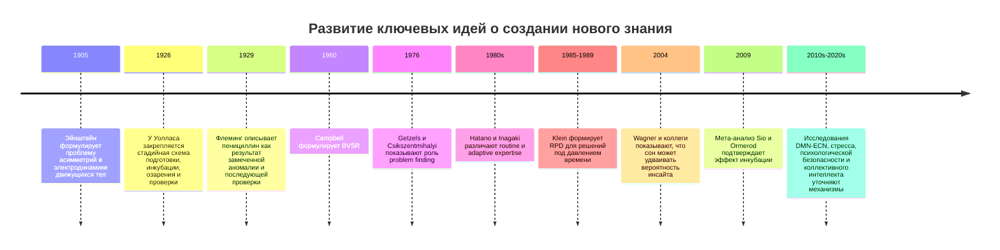
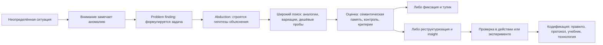
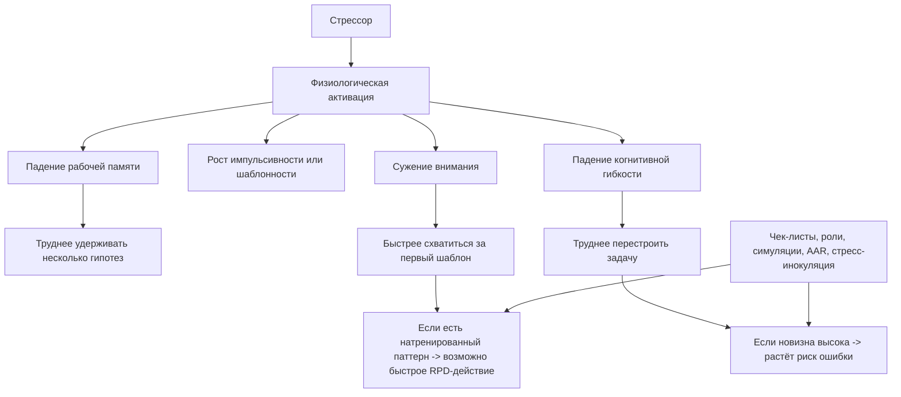

# Как формируется способность находить новые решения и действовать в уникальных задачах

## Executive summary

Главный вывод литературы таков: способность находить новые решения не сводится ни к "таланту", ни к объёму накопленных знаний. Она возникает на пересечении пяти контуров: умения замечать саму проблему до того, как она чётко сформулирована; способности строить правдоподобные объяснения при неполных данных; механизма генерации и отбора вариантов; быстрого распознавания паттернов и мысленного проигрывания действий в реальном времени; а также последующей проверки и институционализации найденного решения. В терминах теории это связывает problem finding, abduction, BVSR, recognition-primed decision making и insight в единую архитектуру "поиска в неопределённости", где новые решения появляются не из пустоты, а из управляемого взаимодействия опыта, внимания, памяти, среды и проб. citeturn13search4turn37view0turn34search4turn33view0turn0search1

По силе эмпирической поддержки лучше всего подтверждены: феномен инсайта как особой формы решения задач; инкубация как реальный, хотя умеренный по величине, эффект; связь креативности с исполнительным контролем, семантической памятью и рабочей памятью; отрицательное влияние острого стресса на рабочую память и когнитивную гибкость; мощная роль openness to experience; польза хорошо проведённых дебрифов/AAR; значение психологической безопасности для командного обучения, информационного обмена и творчества. Намного слабее подтверждены универсальные, "всё объясняющие" модели вроде BVSR; ещё слабее - прямые утверждения о том, что grit сам по себе делает человека более способным к прорывам. Для runbooks и некоторых кризисных практик доказательная база во многом практическая и организационная, а не экспериментальная; это нужно честно считать областью "частично подтверждено" или "недостаточно данных". citeturn0search1turn0search3turn5search4turn38search11turn40search8turn24search2turn24search1turn21view2turn16search4turn14search0turn34search4turn18search15

Если перевести всё это в практику, то "ценный уникальный субъект" - не обязательно человек с самым высоким IQ и не обязательно самый узкий эксперт. Это человек, у которого одновременно развиты: глубокая доменная база; широкий репертуар аналогий из других областей; метакогнитивное наблюдение за собственным поиском; готовность к дешёвым пробам и ревизии гипотез; устойчивость к двусмысленности; навык разбирать ошибки без самообмана; привычка работать с реальными ограничениями, ответственностью и обратной связью. В команде такие качества усиливаются культурами психологической безопасности, ясными ролями, постмортемами без поиска виноватых и тренировками на симуляциях. citeturn31view0turn17search2turn14search5turn40search10turn28view4turn20view5turn16search6

Практический вывод ещё жёстче: новаторство почти никогда не рождается из пассивного чтения и "общего развития" само по себе. Его катализируют специальные режимы тренировки: переописание задач, сравнение дальних аналогий, interleaved practice, deliberate practice по поднавыкам, инкубация, сон, симуляции под давлением времени, after-action review, стресс-инокуляция, чек-листы для действий под перегрузкой и регулярные дешёвые эксперименты. Но эффект таких программ обычно умеренный и нередко переоценивается в публикациях; особенно это видно в крупнейшем современном мета-анализе тренингов креативности, где исходный эффект около 0.53 SD после поправок на publication bias снижается примерно до 0.29-0.32 SD. Иными словами: тренировка работает, но чудес не делает, а дизайн программы и качество измерения решают очень много. citeturn19view7turn20view7turn21view1turn20view6turn24search2turn22view3turn27view3

Ниже дан материал, достаточный не для "статьи", а для скелета книги: теоретическая карта, критический разбор доказательств, исторические и современные кейсы, практические программы на 6 месяцев и 2 года, командные протоколы и предложения по будущим экспериментам. Там, где доказательная база слабая, это помечено явно как "неопределено/недостаточно данных". citeturn34search2turn24search8turn18search1

## Теоретические модели возникновения нового решения

Полезнее всего мыслить не одной "теорией креативности", а конвейером из нескольких механизмов. Сначала человек или группа должны вообще увидеть, что перед ними не просто "помеха", а новая проблема. Именно поэтому problem finding так важен: в классических работах Getzels и Csikszentmihalyi творческий результат связывался не только с качеством решения, но и со способом постановки художественной задачи; в прикладных организационных работах Basadur и коллег тренировка problem finding повышала идеацию и качество решения проблем в промышленной среде. Проблема здесь в том, что эмпирические операционализации problem finding очень разнородны, поэтому сила поддержки у механизма хорошая концептуально, но умеренная по строгим сопоставимым метрикам. citeturn13search1turn13search4turn36search16turn36search10

Abduction, или вывод к лучшему объяснению, особенно полезна там, где данных мало, а цель ещё не формализована. В философии и методологии науки это один из базовых кандидатов на объяснение "первого хода мысли" в неопределённости: наблюдается удивляющий факт, затем ищется гипотеза, которая делает его понятным. Однако в эмпирической психологии именно процесс абдукции долго был измерим плохо; современные работы прямо отмечают, что абдукция вездесуща в клинике, расследовании, науке и повседневном мышлении, но инструментов для надёжного захвата процесса гипотезирования было мало. Поэтому абдукция очень сильна как метамодель генерации гипотез, но её экспериментальная база пока слабее, чем у исследований инсайта, памяти или стресса. citeturn37view0turn37view1

BVSR, восходящая к Campbell и развитая Simonton, предлагает рассматривать творчество как слепую вариацию и последующий отбор. Сильная сторона этой линии в том, что она хорошо описывает режим поиска в огромном пространстве возможностей, когда заранее неясно, какой вариант сработает. Слабая сторона в том, что критики давно и обоснованно указывают: в реальном творчестве вариации часто не полностью "слепые", а направляемые знаниями, контекстом и оценкой; кроме того, дарвиновская аналогия применима не ко всем случаям. Потому BVSR полезна как надмодель "генерация плюс селекция", но плохо работает как исчерпывающая теория конкретных когнитивных процессов. citeturn34search3turn34search4turn34search2turn34search21

Recognition-Primed Decision making у Klein особенно важна для уникальных, опасных и срочных ситуаций. Исследования пожарных, военных и других специалистов показали, что опытные люди часто не перебирают длинный список вариантов и не проводят формальное сравнение альтернатив. Они распознают ситуацию как знакомый класс, генерируют первый правдоподобный ход и быстро мысленно "проигрывают" его на пригодность. Это один из лучших описаний того, как работает продуктивная интуиция под давлением времени. Ограничение модели очевидно: она лучше объясняет деятельность опытных специалистов в богатых на паттерны средах, чем радикально новые области, где паттернов ещё нет. citeturn33view0turn33view1

Insight-модель описывает другой класс событий: решение появляется как резкая перестройка представления задачи, субъективно переживаемая как "Aha!". Современные обзоры считают феномен реальным, но подчёркивают важную тонкость: субъективная внезапность не означает, что весь процесс был полностью скачкообразным. Работы с eye-tracking и временной динамикой решения показывают, что под "внезапным" озарением часто скрывается более постепенная реструктуризация и накопление признаков правильного хода. То есть инсайт - не магия, а особый режим переработки, где сознанию решение становится доступно резко, хотя подготавливается постепенно. citeturn0search1turn15search1turn34search16turn34search23

### Сравнение основных моделей творчества и их эмпирической поддержки

| Модель | Основной механизм | Где особенно полезна | Эмпирическая поддержка | Ключевые ограничения | Практический вывод |
|---|---|---|---|---|---|
| Problem finding | Обнаружение и формулирование самой задачи до её решения | Инновации, дизайн, исследование, предпринимательство | Умеренная: есть сильные классические и прикладные работы, но разнородные меры усложняют сравнение citeturn13search1turn13search4turn36search10 | Слабая стандартизация измерений | Тренировать не только решение, но и переописание ситуации |
| Abduction | Генерация лучшего объяснения при неполных данных | Диагностика, расследование, ранние стадии исследований | Умеренная концептуально, слабее экспериментально как отдельный процесс citeturn37view0turn37view1 | Нормативный статус и измерение процесса спорны | Учить строить и ранжировать альтернативные объяснения |
| BVSR | Генерация вариантов и их последующий отбор | Большие пространства поиска, портфели идей | Смешанная/оспариваемая: модель влиятельна, но критика существенна citeturn34search3turn34search4turn34search2 | Слишком обща; "слепота" часто неполная | Полезна как эвристика портфельного поиска, не как полная теория |
| RPD | Распознавание паттерна + мысленная симуляция первого правдоподобного действия | Кризисы, операционное управление, медицина, пожарные, SRE | Сильная в естественных средах и исследованиях экспертов citeturn33view0turn33view1 | Опирается на качественный опыт; хуже переносится в "совсем новые" миры | Строить опыт на сценариях, а не только на правилах |
| Insight | Реструктуризация представления задачи с субъективной внезапностью | Нестандартные задачи, скрытые ограничения, научные и технические прорывы | Сильная: поведенческие, нейрокогнитивные и temporal studies citeturn0search1turn15search1turn34search16 | Субъективная внезапность не равна объективной моментальности | Надо тренировать разрыв фиксированных репрезентаций |

Над всем этим можно наложить одну рабочую схему: problem finding отвечает за "что здесь вообще происходит?"; abduction - за "какая гипотеза лучше всего объясняет происходящее?"; BVSR - за "как расширить пространство вариантов и не застрять?"; RPD - за "как действовать быстро, если медлить нельзя?"; insight - за "как прорвать ложную репрезентацию?". Вместе это даёт не одну кнопку "стать гением", а систему рычагов под разные типы новизны. citeturn13search4turn37view0turn34search4turn33view0turn0search1

## Нейрокогнитивные и личностные механизмы

Креативное решение не противоположно контролю; оно возникает из напряжённого союза спонтанности и контроля. Современная нейрокогнитивная линия показывает, что творческое мышление связано не с одним "центром креативности", а с совместной работой сетей, отвечающих за самогенерируемое мышление и исполнительный контроль. Работы Beaty и коллег, а также обзоры Dietrich и Kanso, указывают на важность взаимодействия default mode network и executive control network: спонтанная генерация идей помогает расширить пространство поиска, а контроль - удерживать задачу, подавлять банальные ответы и дорабатывать решения. citeturn15search12turn15search0turn15search1

Рабочая память и внимание действительно важны, но не линейно. Большой мета-анализ памяти и креативности показал небольшую, но надёжную общую связь, причём особенно важными оказались семантическая память и стратегический доступ к содержимому долгосрочной памяти; рабочая память поддерживает в большей степени конвергентные творческие задачи, где нужно сдерживать шум и доводить идею до решающего шага. Отдельный мета-анализ по working memory capacity дал меньшую, но значимую связь с креативностью. Одновременно есть исследования, где перегрузка рабочей памяти ухудшает решение, а слишком жёсткий контроль мешает реструктуризации. Следовательно, полезно различать два режима: "широкий поиск" и "точная сборка". citeturn5search0turn5search16turn25view1turn15search22turn15search14

Внимание играет роль фильтра и переключателя. Исследование Frith и коллег показало, что control of attention объясняет заметную часть связи между fluid intelligence и divergent thinking, а mind-wandering в исполнительных задачах не даёт стабильного выигрыша и часто оказывается отрицательным или нулевым предиктором. Это согласуется с более широкой идеей: новые идеи полезно допускать, но не бесконтрольно; творчески продуктивен не хаос внимания, а управляемая проницаемость фильтра. citeturn25view4

Инкубация - один из самых устойчивых эффектов в области творческого решения. Мета-анализ Sio и Ormerod показал, что отвлечение от задачи после периода подготовки действительно увеличивает шанс решения; последующие теоретические модели связывают это либо с бессознательной переработкой, либо со снятием фиксации и восстановлением доступности неочевидных элементов памяти. Но инкубация работает не всегда одинаково: её эффект зависит от типа задачи, активности в паузе и того, успел ли человек сформировать достаточно богатое представление задачи до перерыва. citeturn0search3turn15search3turn15search23turn8search12

Сон - потенциальный усилитель именно реструктуризации и аналогического переноса, а не универсальный "генератор гениальности". В классическом эксперименте Wagner и коллег после сна инсайт в hidden rule возникал более чем вдвое чаще, чем после бодрствования; при этом более поздние работы показали, что эффект зависит от типа задачи и не гарантируется для всех классических insight problems. Дополнительные исследования по аналогическому переносу показывают, что сон и даже дневной сон могут повышать вероятность заметить структурное сходство между задачами. Практический вывод простой: если задача требует реструктуризации, бессмысленно пытаться "дожать" её только усилием воли без сна и пауз. citeturn27view3turn27view0turn5search10turn39search14turn39search2

Острый стресс почти всегда враг для новизны, когда задача требует удержания нескольких гипотез, когнитивной гибкости и обновления модели ситуации. Мета-анализ Shields и коллег показал, что стресс ухудшает working memory и cognitive flexibility; влияние на inhibition неоднородно и зависит от её типа. Для творчества это означает: под стрессом человек чаще сужает поиск, хватается за знакомые шаблоны и хуже перестраивает представление задачи. Однако это не означает, что под давлением нельзя действовать блестяще: если в системе уже есть натренированные паттерны, роли и протоколы, стресс может не разрушить исполнение, а перевести деятельность в режим RPD. citeturn38search11turn38search7turn5search19turn33view0

Личностные факторы показывают похожую картину: самый устойчивый предиктор - openness to experience. Классический мета-анализ Feist и последующие синтетические обзоры показывают, что творческие люди в среднем более открыты новому, менее конвенциональны и отличаются по ряду черт, но именно openness воспроизводится наиболее стабильно. Tolerance of ambiguity тоже связана с креативностью, но база здесь слабее и больше опирается на корреляционные исследования. Grit полезен для долгих проектов и выдерживания фрустрации, но мета-анализ Credé показал, что его уникальный предиктивный вклад часто переоценивается и во многом перекрывается conscientiousness; прямых сильных доказательств того, что grit делает человека генератором прорывных идей, нет. Зато метакогниция выглядит гораздо более перспективно: обзоры и интервенционные работы показывают, что знание о собственных стратегиях, мониторинг и коррекция поиска действительно улучшают creative problem solving и поддаются тренировке. citeturn40search8turn40search5turn40search10turn14search0turn14search5turn16search11

## Опыт, карьерные траектории и социальная среда

Разница между заурядным и по-настоящему ценным специалистом обычно не в "годах стажа", а в качестве опыта. Концепция adaptive expertise у Hatano и Inagaki противопоставляет routine expertise, где человек становится всё быстрее и точнее в типовых сценариях, и adaptive expertise, где он сохраняет эффективность, но ещё и перестраивает знания в новых условиях. Позднейшие работы подчёркивают ту же мысль: adaptive expertise - это баланс эффективности и инновации, а не просто накопление часов. Современное эмпирическое исследование на преподавателях медицинских профессий прямо показало, что adaptive expertise связана с воспринимаемой эффективностью в необычной ситуации, но не связана автоматически с возрастом и стажем; авторы формулируют вывод предельно ясно: adaptive expertise не "происходит сама", её нужно развивать намеренно. citeturn32view1turn32view2turn31view0

Из этого следует важное правило для карьеры: лучший опыт - это не просто повторение одной и той же задачи, а вариативная практика с высокой ответственностью, обратной связью и рефлексией. Hatano и Inagaki ещё в ранней формулировке отмечали, что повторение навыка в среде с вариативностью и необходимостью модификации скорее ведёт к adaptive expertise, а стандартизированная среда без вариаций - к routine expertise. Отсюда практическая польза ротаций, междоменных проектов, участия в авариях, разборов сложных случаев и задач, где нельзя просто "нажать знакомую кнопку". citeturn32view2turn31view0

Междисциплинарность работает не как романтический лозунг, а как способ расширить репертуар аналогий и структур. Исследования cross-domain influences показывают, что источники вдохновения и творческих сдвигов часто приходят извне домена, а не из него самого. Но здесь нужно различать два режима: поверхностная "широта интересов" редко создаёт сильные решения без глубины; зато сочетание глубины в одном домене с осмысленной широтой повышает вероятность увидеть новый перенос. Карьерно это означает: сначала построить ядро мастерства, затем системно увеличивать дальность аналогий, а не распыляться без опоры. citeturn17search2turn17search5turn31view0

Социальная среда не менее важна, чем личные черты. Психологическая безопасность - не "мягкая" роскошь, а условие командного поиска нового. Мета-анализ Frazier и коллег по 117 исследованиям показал, что psychological safety положительно связана с task performance, information sharing, creativity и learning behaviors. Классическая работа Edmondson связала психологическую безопасность с обучающим поведением команды. Это особенно критично там, где новые решения рождаются из сигналов о нештатности: если люди боятся показаться глупыми или быть наказанными, аномалии скрываются, гипотезы не высказываются, а команда учится хуже. citeturn21view3turn21view2turn16search5

Почти тем же языком говорит литература о collective intelligence. Метa-аналитическое исследование Riedl и коллег на 22 выборках, 5279 участниках и 1356 группах поддержало существование общего фактора коллективного интеллекта. Для книги это важно потому, что "уникальный субъект" в сложных системах почти всегда должен уметь не только думать сам, но и запускать более умное мышление группы: строить общие модели ситуации, перераспределять внимание, слышать более слабые сигналы и превращать локальное озарение в командный ход. citeturn16search0turn16search4

### Компетенции и метрики для оценки адаптивного эксперта

| Компетенция | Что наблюдать | Возможные метрики | Почему это важно |
|---|---|---|---|
| Глубокое доменное понимание | Не только правильные действия, но понимание причин | Время до корректной диагностики; качество объяснения причинно-следственных связей | Adaptive expertise требует не просто процедур, а концептуальной репрезентации citeturn32view0turn31view0 |
| Когнитивная гибкость | Способность отходить от первого шаблона | Доля успешных решений на novel cases; switch cost; performance after rule change | Стресс и рутина особенно бьют по гибкости citeturn38search11turn31view0 |
| Problem finding | Умение переопределять задачу | Количество и качество альтернативных формулировок; novelty/usefulness экспертных оценок | Многие прорывы начинаются с изменения самой задачи citeturn13search4turn36search10 |
| Абдуктивное мышление | Генерация и ранжирование гипотез | Precision/recall гипотез; время до правдоподобной гипотезы; change-of-mind quality | Критично при неполных данных и диагностике citeturn37view1turn37view0 |
| Метакогниция | Мониторинг собственной ошибки и тупика | Accuracy self-assessment; frequency of strategic resets; quality of AAR notes | Поддаётся тренировке и усиливает перенос citeturn14search5turn16search11 |
| Работа под давлением | Сохранение качества при времени и риске | Performance degradation slope under stress; checklist compliance; recovery time | В кризисе важны не героизм, а управляемое снижение функции citeturn38search7turn20view5 |
| Командная адаптивность | Умение делать группу умнее | Team learning behaviors; info sharing; speaking-up frequency; CI tasks | Индивидуальные решения должны масштабироваться через команду citeturn21view2turn16search4 |
| Обучаемость из ошибки | Скорость преобразования неудачи в новое правило | Closure rate action items; repeat incident rate; postmortem quality | Без этого редкий опыт не превращается в капитал мастерства citeturn28view4turn24search2 |

## Тренировочные практики и протоколы обучения

Крупнейший свежий мета-анализ тренингов креативности показывает двойной урок. С одной стороны, тренировать креативность действительно можно: исходный агрегированный эффект умеренный. С другой стороны, литература сильно искажена publication bias и методологическими слабостями; после поправок ожидаемый реалистичный эффект заметно меньше. Поэтому взрослому человеку или организации нужен не "семинар по креативности", а системный учебный дизайн, где каждая практика привязана к конкретному механизму. citeturn19view7

Deliberate practice необходима, но недостаточна. Мета-анализ Macnamara и коллег показал, что deliberate practice объясняет существенную, но далеко не всю долю вариации в результатах: в наиболее предсказуемых доменах вроде игр и музыки вклад гораздо выше, чем в образовании и профессиях. Для уникальных задач это означает: deliberate practice создаёт сырьё в виде паттернов, скорости и безошибочности, но сама по себе не гарантирует новаторства. Она незаменима для поднавыков, но должна сочетаться с практиками вариативности, рефлексии и переноса. citeturn21view0turn21view1

Interleaved practice полезна там, где важно различать классы задач и выбирать между стратегиями. Обзор Rohrer и коллег показывает, что перемежающаяся практика улучшает отложенное распознавание нужного метода и перенос в новую задачу. Для креативного мышления это не "магия идей", а способ уменьшить иллюзию владения при блочной тренировке и научить мозг распознавать, когда какой ход уместен. Особенно полезно это при обучении диагностике, incident response, инженерным сценариям и клиническому мышлению. citeturn20view6

After-action review и дебрифинг - одна из самых практически недооценённых технологий. Мета-анализ Tannenbaum и Cerasoli показал, что дебрифы способны повышать эффективность примерно на 20-25 процентов; более поздний мета-анализ Keiser и Arthur подтвердил значимый общий эффект AAR и показал, что особенно важны согласование дебрифа с учебными целями и использование объективных средств разбора, например видео или журналов событий. Иначе говоря, разбор - это не "разговор после события", а способ конвертации опыта в адаптивную экспертизу. citeturn24search2turn24search8turn24search1

Стресс-инокуляция перспективна, но требует осторожности. Обзор RAND по SIT описывает три классические фазы - conceptualization, skills acquisition and rehearsal, application and follow-through - и подчёркивает, что доказательства по performance under stress есть, но они менее зрелые, чем принято считать. Авторы прямо указывают на ограниченность базы по критическим компонентам и дозировке стрессоров, а также на риски контрпродуктивной или вредной экспозиции. Следовательно, стресс-инокуляцию нужно строить не как "ломающее испытание", а как поэтапную тренировку когнитивных и поведенческих навыков с контролируемой нагрузкой. citeturn22view1turn22view3turn21view4

Переописание задачи, работа с аналогиями и дешёвые пробы особенно важны именно для ухода от заурядности. Эмпирические исследования и обзоры по CPS-инструментам показывают, что restating the problem, analogy-based techniques, mapping similarities/differences и problem-solving pedagogy в целом могут давать выигрыш, но база по отдельным инструментам неравномерна: хорошая по некоторым, слабая по многим. Наиболее надёжный вывод здесь такой: не один конкретный инструмент важен, а регулярный режим, в котором человек вынужден ломать первую формулировку задачи, строить минимум три объяснения и делать быстрые малозатратные проверки. citeturn20view7turn36search22turn12search19turn12search2

Симуляции и crisis resource management особенно полезны для уникальных задач под риском. Систематический обзор по CRM в здравоохранении показал, что simulation-based training улучшает приобретение CRM-навыков, а в части исследований сопровождался и лучшими поведенческими или клиническими исходами. Исследования crisis checklists в операционных и отделениях неотложной помощи также показывают заметные улучшения качества выполнения критических действий в симуляциях, хотя и здесь результаты зависят от качества внедрения и контекста. citeturn26view5turn10search14turn11search5turn11search1

### Набор тренировочных практик, ожидаемый эффект, время и риски

| Практика | Целевой механизм | Ожидаемый эффект | Минимальный горизонт | Основные риски |
|---|---|---|---|---|
| Deliberate practice по поднавыкам | Паттерны, скорость, точность | Сильнее всего укрепляет основу мастерства; не гарантирует новизну citeturn21view1 | 3-12 мес. | Рутинизация без переноса |
| Interleaved practice | Дискриминация задач и выбор стратегии | Лучше перенос и распознавание класса задач citeturn20view6 | 6-12 нед. | Субъективно кажется тяжелее, вызывает ложное ощущение "я стал хуже" |
| Problem restatement | Разрушение первой репрезентации | Повышает шанс увидеть скрытые ограничения и новые ходы citeturn13search4turn36search22 | Сессии по 15-30 мин. | Без критериев может уводить в бесконечные формулировки |
| Аналогии из дальних доменов | Расширение пространства поиска | Повышает вероятность структурного переноса citeturn17search2turn39search14 | 6-8 нед. | Поверхностные аналогии дают красивый, но ложный перенос |
| Дешёвые пробы и low-fidelity prototypes | Быстрый отбор гипотез | Снижают цену ошибки и ускоряют обучение citeturn39search0turn39search16 | Дни-недели | Псевдоэксперименты без валидных критериев |
| Инкубация и сон | Реструктуризация, снятие фиксации | Умеренный рост шанса решения отдельных задач citeturn0search3turn27view3 | От часов до суток | Иллюзия, что "надо просто ждать вдохновения" |
| AAR / дебриф | Конвертация опыта в правило | Прирост эффективности порядка 20-25% в среднем по дебрифам citeturn24search2 | После каждого кейса | Без структуры превращается в обмен мнениями |
| Stress inoculation | Функционирование под нагрузкой | Переносимый навык действия под стрессом, особенно при поэтапном дизайне citeturn22view3 | 8-16 нед. | Перегрузка, травматизация, ложная героизация |
| Симуляции / tabletop exercises | RPD, CRM, распределённое внимание | Улучшают кризисные non-technical skills и готовность команд citeturn11search3turn11search2 | Ежемесячно/ежеквартально | Театр без реалистичного сценария и последующего разбора |

## Кейс-логика, кризисные инструменты и протоколы

Исторические кейсы важны не как легенды о "гениях", а как материал для разборки процесса. В статье 1905 года Эйнштейн начинает не с ответа, а с problem finding: "асимметрии" в применении максвелловской электродинамики к движущимся телам. Затем он опирается на два принципа - относительности и постоянства скорости света - и перестраивает базовые понятия времени и одновременности. Это очень показательный пример того, как прорыв возникает из смены постановки задачи и реконфигурации концептуальной рамки, а не только из накопления фактов. citeturn30view0turn30view1turn30view3

Флеминговский кейс показывает другой механизм: замеченная аномалия плюс немедленная проверка. В оригинальной статье 1929 года он описывает, как заметил, что вокруг случайной плесени стафилококковые колонии становятся прозрачными и подвергаются лизису; далее следуют субкультуры и серия проверок свойств вещества, которое он называет penicillin. Здесь хорошо видно сочетание серендипности и дисциплины: случай дал сигнал, но открытие стало знанием только после наблюдения, именования, экспериментов и описания границ действия. citeturn29view0

Современные технологические кейсы подтверждают ту же логику, но на уровне команд. Публичный постмортем GitLab по инциденту 31 января 2017 года фиксирует типичный провал сложной системы: случайное удаление данных на primary, ручные и плохо документированные процедуры восстановления, неустойчивая репликация, отсутствие части защитных механизмов. Ценность кейса не в самой ошибке, а в том, что команда превратила сбой в детальное организационное знание о single points of failure, резервировании, автоматизации и recovery procedure design. citeturn28view6

Литература и практика SRE показывают, что в кризисе "уникальное решение" почти никогда не должно рождаться как чистая импровизация с нуля. Google SRE прямо описывает incident management через ясную линию командования, заранее определённые роли и "three Cs" - coordinate, communicate, control. Там же постмортем понимается не как наказание, а как способ зафиксировать корни инцидента и превратить их в системные изменения. Это важнейший парадокс: чем выше новизна и цена ошибки, тем сильнее ценность заранее подготовленной рамки, внутри которой уже можно импровизировать. citeturn28view5turn20view5turn28view4

В медицине картина сходная. Simulation-based crisis resource management и crisis checklists улучшают выполнение ключевых действий и командную координацию в симуляциях реанимационных и операционных кризисов, но отдельные мета-анализы и обзоры также показывают, что внедрение чек-листов даёт неодинаковый эффект и сильно зависит от соблюдения, обучения и локальной культуры. Следовательно, checklist - не "бумага от хаоса", а внешний когнитивный scaffold, который работает только вместе с подготовкой, ролями и разбором. citeturn26view5turn10search14turn11search0turn11search12

### Чек-лист индивидуального кризисного мышления

Этот чек-лист опирается на доказательства по стрессу, RPD, CRM и AAR и должен использоваться как инструмент стабилизации мышления, а не как ритуал. citeturn38search11turn20view5turn24search2

1. Остановить импульс и назвать класс угрозы.
2. Сформулировать, что уже известно, что предположительно, что критически неизвестно.
3. Отделить симптом от гипотезы.
4. Сгенерировать минимум две альтернативные гипотезы, даже если первая кажется очевидной.
5. Проверить "дешёвый тест", который быстрее всего различит гипотезы.
6. Если время критично, выбрать первый правдоподобный ход и мысленно проиграть его на вторичные последствия.
7. Явно сказать себе, что рабочая память и гибкость под стрессом ухудшаются; перейти на запись, доску, журнал.
8. Определить триггер эскалации: при каком сигнале нужно звать помощь или менять стратегию.
9. После события провести краткий AAR до того, как память "перепишет" историю.

### Чек-лист командного инцидент-ответа

Основание для такого чек-листа дают ICS-подобные схемы в SRE и данные по командным дебрифам, CRM и psychological safety. citeturn20view5turn28view5turn24search2turn21view2

1. Назначить incident commander, communication lead и operation lead.
2. Зафиксировать один источник правды: таймлайн, журнал действий, решения, гипотезы.
3. Отделить поток устранения от потока коммуникации.
4. Объявить текущую рабочую модель инцидента и уровень уверенности.
5. Явно разрешить членам команды озвучивать сомнения и несоответствия без наказания.
6. Создать короткий цикл: гипотеза -> проверка -> обновление модели.
7. Использовать runbook и checklist как опору, но не как догму; документировать, где пришлось отойти от шаблона.
8. Определить критерии выхода из инцидента и критерии обязательного постмортема.
9. Закрыть событие с action items, владельцами, сроками и повторной проверкой.

## Практические программы развития и структура книги

### Программа на шесть месяцев

Эта программа подходит сильному индивидуальному специалисту или small team lead, у которого уже есть базовый домен и цель - перейти от "хорошо выполняю" к "нахожу новое". Её логика: сначала стабилизировать когнитивную базу, затем расширить пространство поиска, потом перенести навыки в стресс и команды. Эмпирическая опора программы - на deliberate practice, interleaving, incubation, metacognitive training, AAR и simulation/CRM. citeturn21view1turn20view6turn0search3turn14search5turn24search2turn26view5

Первый месяц должен быть посвящён калибровке. Нужны: журнал сложных задач; фиксация эпизодов ступора и ложной уверенности; базовые метрики - время до гипотезы, число альтернативных формулировок, число возвратов к первой ошибочной модели. Параллельно вводится привычка после каждого нетривиального кейса делать мини-AAR на 10-15 минут. citeturn24search2turn14search5

Второй и третий месяцы - это систематический problem finding. Каждую неделю выбираются 2-3 задачи из своей практики и переописываются как минимум в трёх формулировках: как симптом, как противоречие ограничений, как неиспользованная возможность. Параллельно выполняется упражнение на дальние аналогии: к каждой задаче подбираются структурно похожие случаи из другой отрасли. Это нужно делать не ради красоты, а ради поиска тестируемой гипотезы переноса. citeturn13search4turn17search2

Четвёртый месяц - дешёвые пробы и interleaving. Ставится правило: не обсуждать длинно гипотезу, пока не придуманы два недорогих способа её опровергнуть или быстро проверить. Учебные задачи и симуляции перемешиваются так, чтобы человек каждый раз распознавал тип ситуации, а не повторял один и тот же приём. Раз в неделю проводится одна короткая симуляция с ограничением по времени и последующим дебрифом. citeturn20view6turn24search2turn39search0

Пятый месяц - controlled stress. Здесь добавляются time pressure, социальная оценка, параллельные помехи, но только на фоне уже выстроенных чек-листов и ролей. Это не "закаливание характером", а обучение не терять структуру мысли при падении рабочей памяти. Одновременно вводится обязательный сон/паузы для задач реструктуризации, чтобы не путать упрямство с продуктивностью. citeturn22view3turn38search7turn27view3

Шестой месяц - перенос на реальный проект. Выбирается один реальный, неопределённый и значимый проект; к нему применяются: журнал гипотез, еженедельный AAR, дешёвые пробы, аналогические заимствования и один полноценный tabletop. На выходе должны быть не только результаты проекта, но и собственный playbook: "как я думаю в новой задаче". citeturn11search2turn24search1

### Программа на два года

Двухлетний горизонт нужен для превращения навыков в устойчивую адаптивную экспертизу. В первый полугодовой цикл строится доменная глубина и ритм AAR. Во второй - расширяется междисциплинарный репертуар и накапливаются controlled variations опыта. В третий - человек получает ответственность за реальные новизные ситуации: инциденты, архитектурные переломы, кризисные кейсы, продуктовые ставки. В четвёртый - учится строить среду для других: проводить дебрифы, вводить психологическую безопасность, проектировать учения, выращивать коллективный интеллект. Только на этой стадии "уникальность" становится не вспышкой, а воспроизводимой функцией системы. citeturn31view0turn21view2turn16search4

### Предлагаемая структура книги

| Глава | Содержание | Ключевые источники |
|---|---|---|
| Откуда берётся новое | Что значит "новое решение" и почему оно не появляется из пустоты | Runco/определение креативности, Getzels, Peirce/Douven citeturn13search1turn37view0 |
| Замечать проблему раньше других | Problem finding, аномалии, смена формулировки | Getzels & Csikszentmihalyi, Basadur citeturn13search4turn36search10 |
| Первый шаг в неизвестность | Abduction, hypothesis generation, early scientific reasoning | Douven, Żelechowska et al. citeturn37view0turn37view1 |
| Как мозг собирает новое | Память, внимание, сети мозга, инсайт, инкубация | Beaty, Dietrich & Kanso, Gerver et al., Sio & Ormerod citeturn15search12turn15search1turn5search0turn0search3 |
| Почему стресс всё ломает и как не дать ему выиграть | Стресс, рабочая память, гибкость, SIT | Shields et al., RAND SIT citeturn38search7turn22view3 |
| Черты и привычки людей, которые делают прорывы | Openness, ambiguity tolerance, grit, metacognition | Feist, da Costa, Zenasni, Credé, Jia et al. citeturn40search8turn40search5turn40search10turn14search0turn14search5 |
| От routine к adaptive expertise | Карьера, вариативный опыт, ответственность | Hatano & Inagaki, Schwartz et al., Jayawardena et al. citeturn32view1turn31view0 |
| Команды, которые умнеют в кризисе | Psychological safety, CI, CRM, SRE | Edmondson, Frazier, Riedl, Google SRE, CRM reviews citeturn16search5turn21view2turn16search4turn20view5turn26view5 |
| Исторические и современные кейсы | Эйнштейн, Флеминг, GitLab, медицина | Einstein 1905, Fleming 1929, GitLab postmortem citeturn30view0turn29view0turn28view6 |
| Как тренировать новое системно | Программы, метрики, экспериментальные протоколы | Sio 2024, Tannenbaum, Keiser, Macnamara citeturn19view7turn24search2turn24search1turn21view1 |

### Практические упражнения

Хорошая книга по этой теме должна не просто описывать механизмы, а заставлять читателя прожить их. Минимальный набор упражнений такой. Первое: "три переописания" - переписать одну и ту же задачу в трёх логиках и сформулировать, какие данные становятся релевантными в каждой версии. Второе: "две альтернативные гипотезы" - запрещено продолжать работу, пока нет минимум двух соперничающих объяснений. Третье: "аналогический мост" - найти структурно похожий случай из далёкого домена и выписать не похожие слова, а соответствие ролей и ограничений. Четвёртое: "дешёвый фальсификатор" - для каждой идеи придумать минимальный тест, который быстрее всего скажет, что она не работает. Пятое: "sleep-based reset" - перенос сложной задачи на следующий день после конспекта структуры, а не после бессмысленного dеbugging-marathon. Шестое: "AAR в 5 вопросах" - что ожидали, что произошло, что сработало, что не сработало, что изменим в протоколе. citeturn13search4turn37view1turn39search14turn24search2

### Источники с краткими аннотациями

Getzels и Csikszentmihalyi - классика о problem finding; важны для понимания, что новизна начинается с постановки задачи, а не только с ответа. citeturn13search1

Douven, "Abduction" - лучший краткий философский вход в вывод к лучшему объяснению; полезен как концептуальный каркас, но не как доказательство массовых экспериментальных эффектов. DOI не указан в самой энциклопедической записи. citeturn37view0

Campbell 1960, "Blind variation and selective retention..." DOI: 10.1037/h0040373 - исходный текст BVSR. citeturn34search3

Simonton 2022/2023, обновление BVSR - современная защита модели; важна вместе с критикой Gabora, а не отдельно. DOI: 10.1080/10400419.2022.2059919. citeturn34search4turn34search2

Klein по RPD - основа для понимания решений под давлением времени. Ключевой ранний источник: "Recognition-Primed Decisions", 1989. citeturn33view0turn33view1

Kounios и Beeman - обзор инсайта как когнитивного и нейронного феномена. DOI: 10.1146/annurev-psych-010213-115154. citeturn0search1

Sio и Ormerod 2009, мета-анализ инкубации. DOI: 10.1037/a0014212. citeturn0search3

Wagner et al. 2004, сон и инсайт. DOI: 10.1038/nature02223. citeturn7search1turn27view3

Shields et al. 2016, острый стресс и исполнительные функции. DOI: 10.1016/j.neubiorev.2016.07.038. citeturn38search7

Feist 1998, личность и креативность. DOI: 10.1207/s15327957pspr0204_5. citeturn40search8

Credé et al. 2017, grit. DOI: 10.1177/1745691616655484. citeturn14search0

Jia et al. 2019, метакогниция и creative thinking. DOI: 10.3389/fpsyg.2019.02405. citeturn14search5

Macnamara et al. 2014, deliberate practice. DOI: 10.1177/0956797614535810. citeturn20view0

Tannenbaum и Cerasoli 2013, мета-анализ дебрифов. DOI: 10.1177/0018720812448394. citeturn24search2

Keiser и Arthur 2021, мета-анализ AAR. DOI: 10.1037/apl0000811. citeturn24search1

Edmondson 1999 и Frazier et al. 2017 по psychological safety. DOI Edmondson: 10.2307/2666999; DOI Frazier: 10.1111/peps.12183. citeturn16search5turn13search15

Riedl et al. 2021 по collective intelligence. DOI: 10.1073/pnas.2005737118. citeturn16search4

## Открытые вопросы, ограничения и предложения для будущих исследований

Самые слабые места текущей литературы такие. Во-первых, в креативности и adaptive expertise слишком много разных метрик, из-за чего трудно сравнивать исследования и синтезировать реальные механизмы. Во-вторых, training studies исторически страдают publication bias и слабым дизайном; это уже показано в крупнейшем современном мета-анализе. В-третьих, по абдукции как процессу, по роли runbooks как отдельного инструмента и по переносу stress inoculation на реальные сложные гражданские домены остаётся много "неопределено/недостаточно данных". В-четвёртых, немало исследований измеряют divergent thinking как суррогат, тогда как уникальные решения в инженерии, науке, медицине или incident response имеют другую структуру критериев. citeturn19view7turn37view1turn18search15

Поэтому следующая волна исследований должна уходить от общих лозунгов к протоколам. Наиболее полезен был бы многофакторный, рандомизированный дизайн на 6-12 месяцев с четырьмя рукавами: baseline deliberate practice; deliberate practice + AAR; deliberate practice + AAR + problem reframing/analogical training; deliberate practice + AAR + problem reframing + controlled stress simulation. Исходы нужно измерять не одним тестом креативности, а батареей: novel-case performance, quality of hypothesis generation, adaptive transfer, speaking-up in teams, postmortem quality, repeat-incident rate и устойчивость функции под стрессом. Это позволило бы впервые проверить не "креативность вообще", а сборку адаптивного новаторства как операционального навыка. citeturn21view1turn24search1turn31view0turn38search7

Отдельный перспективный протокол - longitudinal diary + experience sampling для специалистов высокого риска: SRE, анестезиология, emergency medicine, incident command. Нужно связывать реальные микрособытия "заметил аномалию -> сменил репрезентацию -> сделал дешёвую пробу -> сообщил команде -> обновил протокол" с последующими результатами. Это дало бы значительно более честную картину того, как новые решения действительно возникают в полевых условиях, где классические лабораторные задачи слишком бедны. citeturn28view4turn26view5turn11search3

Самый практичный итог всего отчёта можно сформулировать жёстко. Людей, которые снова и снова находят новые решения, отличает не загадочный внутренний "дар", а повторяемая конфигурация: они лучше замечают аномалии, не прилипают к первой формулировке, умеют строить и проверять конкурирующие гипотезы, держат баланс между шириной поиска и качеством отбора, не разваливаются полностью под стрессом благодаря внешним опорам, извлекают максимум из AAR и помещены в среду, где можно говорить о слабых сигналах без страха. Всё остальное - мифология вокруг этого механизма. citeturn13search4turn37view0turn33view0turn38search11turn24search2turn21view2