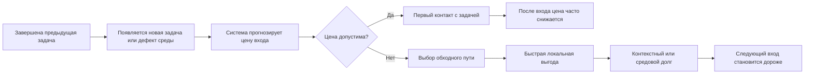
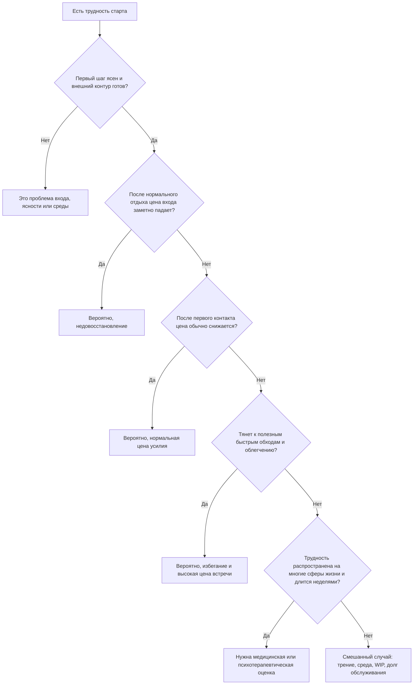
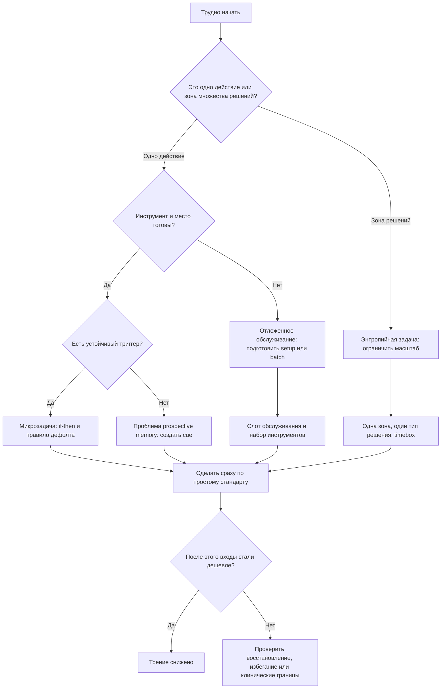

# Доработка разделов учебника о пороге мобилизации и обслуживании среды

## Краткий диагноз пробела

Главный пробел учебника не в том, что в нем мало сказано о цели, ясности шага, ритуале входа или цене усилия. Пробел в том, что между "задача ясна" и "действие началось" отсутствует отдельный слой модели: предвосхищаемая цена входа в режим контроля. Современные рамки по cognitive control, effort discounting и cognitive fatigue сходятся в том, что человек нередко избегает не саму задачу как таковую, а ожидаемую стоимость мобилизации: включения контроля, переключения контекста, отказа от более легкой альтернативы, встречи с неопределенностью и риском ошибки. Именно поэтому возможно состояние "я знаю, что делать, но сейчас вход дорог". citeturn0search0turn0search1turn15search0turn1search0turn8search0

Для книги это означает следующее. Нужна отдельная глава или вставка, где "порог мобилизации" будет описан как вычисляемая системой цена включения контроля, а не как моральная слабость, не как недостаток мотивации и не как "все дело в дофамине". В литературе есть сильная опора для такой рамки: Expected Value of Control описывает выделение контроля как выбор между ожидаемой пользой и стоимостью контроля; opportunity cost model трактует субъективное усилие как сигнал конкурирующих альтернатив; effort discounting показывает, что награда систематически обесценивается, если к ней привязана когнитивная работа. citeturn0search0turn0search1turn0search2turn0search9turn15search3

Второй пробел касается обслуживания среды. Микрозадачи вроде "пополнить чай", "подтянуть ручку", "разгрести стол" плохо объясняются только через модели deep work. Здесь часто нет когнитивной сложности содержания, но есть другое: низкая немедленная награда, малая срочность, высокая относительная цена переключения, prospective memory, intention-action gap, default behavior, status quo bias и накопление "долга среды". Поэтому учебнику нужна отдельная линия, в которой обслуживание среды не смешивается ни с глубокой интеллектуальной работой, ни с клинической усталостью. citeturn2search0turn17search0turn17search1turn21search0turn5search3turn6search2

Наконец, для полезности книги нужно жестко развести пять разных состояний: нормальную цену полезного усилия; лишнее трение из-за плохого входа или среды; недовосстановление; избегание; клинические и медицинские границы. Это разведение не следует оставлять на уровне интуиции автора. Его можно собрать в рабочую диагностическую схему, опираясь на литературу по effort, fatigue, ACT, behavioral activation, sleep/circadian research и официальные клинические материалы NIMH, CDC и CDC ME/CFS. citeturn1search0turn11search2turn12search4turn3search1turn3search2turn14view11turn14view12turn20search1turn20search0

## Карта механизмов

### Синтетическая модель порога мобилизации

Как рабочую синтетическую формулу для учебника можно предложить такую модель:

```text
Порог мобилизации =
ожидаемая цена включения контроля
+ ожидаемая цена переключения контекста
+ ожидаемая цена удержания неопределенности
+ ожидаемая цена отказа от более легких альтернатив
+ ожидаемая телесная цена на текущем ресурсном полу
- ожидаемая ценность ближайшего сдвига
- ожидаемая эффективность контроля
- поддержка среды и внешнего контура
```

Это не цитата из одной статьи, а сборка из нескольких направлений. EVC дает основу для строки "ценность контроля - стоимость контроля"; уточнения Shenhav и коллег добавляют, что мотивацию к усилию полезно разбирать на вознаграждение, усилие и ожидаемую эффективность, а literature on effort discounting показывает, что люди систематически занижают субъективную ценность награды, если для нее требуется когнитивная нагрузка. citeturn0search0turn15search0turn15search3turn0search2turn0search13

Отсюда важное уточнение для книги: порог мобилизации не равен трудности самой задачи. Он выше при переходе между задачами, при незавершенном WIP, при усталости, при слабой эффективности первого шага, при высоком выборе между "войти в новое" и "сделать что-то полезное-быстрое". Это хорошо согласуется и с opportunity cost model, и с современными работами, где fatigue влияет именно на willingness to choose effortful options, а не только на raw performance. citeturn0search1turn8search0turn8search6turn1search0

В книге полезно не спорить, какая из этих моделей "единственно верная". На сегодняшнем уровне знаний разумнее представить их как совместимые уровни описания: effort discounting дает поведенческую метрику цены усилия; EVC дает вычислительную схему распределения контроля; opportunity cost и fatigue models объясняют, почему цена входа растет при конкуренции альтернатив и истощающем предшествующем контроле. При этом сильная версия "мозг просто тратит некий конечный ресурс" выглядит хуже подтвержденной, чем более современные модели, где ощущение усилия и усталости зависит от оценки ценности дальнейшего усилия, reward context, efficacy и состояния восстановления. citeturn0search2turn0search0turn0search1turn8search3turn8search10turn8search14



Диаграмма синтезирует идеи EVC, opportunity cost, effort discounting, present bias и default effects: система выбирает не между "важным" и "неважным", а между вариантами с разной немедленной ценой и разной временной структурой выгоды. citeturn0search0turn0search1turn0search2turn6search0turn6search1turn21search0

### Пять состояний, которые нельзя смешивать

Нормальная цена полезного усилия выглядит так: задача остается трудной и после хорошего входа, но усилие имеет рабочую функцию. Оно требуется для удержания модели, проверки гипотез, многокритериального выбора, терпимости к черновику и неопределенности. В литературе есть основание не романтизировать усилие, но и не считать его дефектом: effort is both costly and valued; усилие может быть одновременно неприятным и значимым. citeturn0search3turn0search7

Лишнее трение проявляется иначе. Субъективная цена сосредоточена не в содержании работы, а в интерфейсе входа: найти материалы, восстановить контекст, решить "с чего начинать", достать инструмент, очистить стол, открыть нужные окна, отбиться от конкурирующих сигналов среды. Эту часть модели разумно связывать не столько с "волей", сколько с choice architecture, situational self-control, cueing и visual competition. Небольшие изменения default options и ситуации действительно могут заметно менять поведение, но эффект не магический и сильно зависит от контекста. citeturn2search2turn21search0turn21search17turn7search4turn7search8

Недовосстановление должно быть отделено от избегания. При недовосстановлении повышена цена не только одной "страшной" задачи, а шире: падает готовность к усилию в целом, легче срывается контроль, сильнее страдают внимание и executive functions. На это указывает литература по sleep loss, circadian regulation, fatigue and effort-based choice. При клинически значимом fatigue рисунок может быть еще жестче: например, при ME/CFS характерно постнагрузочное ухудшение симптомов даже после малых физических или умственных усилий, и это уже не вопрос "правильного старта". citeturn3search1turn3search2turn16search3turn16search0turn20search1turn20search0

Избегание имеет собственный профиль. Его признак не просто "я не начал", а "я тянусь к действию, которое дает локальное облегчение и выглядит полезным, но поддерживает невстречу с новой глубиной, неопределенностью или уязвимостью". Литература по ACT и behavioral activation полезна здесь именно потому, что она показывает: ждать исчезновения внутреннего сопротивления как условия старта не обязательно; малый ценностный контакт с неприятной, но важной задачей может быть более надежной единицей действия, чем ожидание идеального состояния. Но это не следует выдавать за инженерный хак: ACT и BA остаются психотерапевтическими рамками с собственными пределами применимости. citeturn11search2turn11search0turn11search6turn12search4turn12search14turn12search15

Клинические и медицинские границы надо вынести отдельно и написать без двусмысленности. NIMH относит к симптомам депрессии fatigue, lack of energy, difficulty concentrating, memory and decision problems, sleep and appetite changes, а также нарушение выполнения обязанностей. CDC прямо указывает, что ADHD-подобные трудности требуют исключения сна, тревоги, депрессии, substance misuse и других состояний; CDC по ME/CFS отдельно описывает severe fatigue not improved by rest и post-exertional malaise. Все это нельзя редуцировать к "неправильной организации труда". citeturn14view11turn14view12turn20search1turn20search10

### Визуальный триаж для книги



Этот триаж не является диагностическим инструментом в медицинском смысле. Это инженерная схема различения рабочих механизмов, собранная из исследований по effort, fatigue, recovery и клинических официальных материалов. citeturn0search0turn1search0turn3search2turn14view11turn14view12turn20search1

## Таблица направлений исследований, доказательности и практического перевода

### Направления, которые лучше всего объясняют порог мобилизации

| Направление | Главный механизм | Что подтверждено лучше всего | Где доказательства слабые, спорные или контекстные | Практический перевод без нейромифов | Ключевые источники и идентификаторы |
|---|---|---|---|---|---|
| Perceived effort / effort discounting | Награда обесценивается, если за нее нужно платить усилием; цену усилия можно измерять через выборы между более легкими и более трудными вариантами | Когнитивное усилие систематически имеет субъективную стоимость; COG-ED и родственные парадигмы устойчиво показывают discounting наград при росте нагрузки | Лабораторные задачи далеки от реальных проектов; перенос на знаниевую работу требует осторожности | В учебнике вводить не "силу воли", а "ожидаемую цену входа", которую можно снижать через better setup, первый контакт и рост эффективности шага | Westbrook & Braver, 2013, DOI: 10.1371/journal.pone.0068210, PMCID: PMC3718823. citeturn0search2turn0search13 |
| Expected Value of Control | Контроль включается, когда ожидаемая выгода контроля выше его стоимости | Модель дала интегративную рамку для allocation of control; современные уточнения разбирают reward, effort cost и efficacy как разные вклады в готовность к усилию | Это вычислительная теория, а не бытовая кнопка "ACC включился"; нейроанатомические популяризации легко превращаются в нейромиф | Порог мобилизации можно описывать как точку, где система не готова платить цену контроля за ожидаемый ближайший сдвиг | Shenhav et al., 2013, PMCID: PMC3767969; Shenhav et al., 2021, PMID: 34675454. citeturn0search0turn15search0turn15search2 |
| Opportunity cost of mental effort | Субъективное усилие сигнализирует ценность альтернатив, от которых мы отказываемся ради текущей задачи | Теория хорошо объясняет, почему трудные задачи кажутся дороже при наличии легких и немедленно вознаграждающих альтернатив | Теория спорна как исчерпывающее объяснение fatigue; не все эффекты сводятся к альтернативной ценности | Полезный перевод: между задачами система часто избегает не работу вообще, а отказ от доступных обходных путей с низкой ценой входа | Kurzban et al., 2013, PMCID: PMC3856320. citeturn0search1turn8search12 |
| Cognitive fatigue | После длительного контроля растет субъективная цена дальнейшего усилия, меняется выбор и willingness to continue | Mental fatigue лучше понимать как сдвиг в мотивации и effort-based choice, а не просто как "кончилась энергия"; часть работ показывает рост effort discounting после fatigue и sleep loss | Механизмы неоднородны; нет одной общепринятой "биохимической" причины; популярные нейрообъяснения часто чрезмерны | В книге описывать fatigue как рост цены продолжения и нового входа, а не как моральный дефект или буквальную пустую батарейку | Boksem & Tops, 2008, PMID: 18652844; Steward et al., 2024, PMCID: PMC11275777; Dora et al., 2022, PMID: 34472958. citeturn1search0turn8search0turn8search6 |
| ACT / willingness / acceptance | Не ждать исчезновения неприятных мыслей и ощущений; двигаться в сторону ценностей при наличии дискомфорта | ACT имеет широкую базу обзоров и мета-анализов; change-process literature связывает эффект с psychological flexibility | Это психотерапия, а не productivity protocol; данные разнородны по доменам, качеству и follow-up | Консервативный перевод: не требовать от себя "легкого состояния" перед важным действием; выбирать минимальный ценностный контакт при допустимой цене | Levin, 2024, PMID: 38724128; Arch et al., 2022, PMCID: PMC10665126; Beygi et al., 2023, PMCID: PMC10293686. citeturn11search0turn11search2turn11search6 |
| Behavioral activation | Действие и контакт с подкрепляющей средой могут запускать изменение, даже если мотивация низка | Для депрессии BA хорошо подтверждена как эффективная психотерапевтическая интервенция; graded task assignment и activation считаются ее ядром | За пределами клинической депрессии перенос требует оговорок; механизмы change изучены не полностью | Для книги годится идея "малый управляемый контакт раньше, чем появится желание", но с ясной пометкой, что это адаптация клинической логики | Ekers et al., 2014, PMCID: PMC4061095; Cuijpers et al., 2006, PMID: 17184887; Cuijpers et al., 2023. citeturn12search4turn12search7turn12search15 |
| Implementation intentions | If-then план связывает конкретный cue с действием и облегчает старт, remembering to act и shield от конкурирующих целей | Мета-анализ показывает надежный эффект на goal attainment и особенно на "getting started"; есть отдельная meta-analysis по prospective memory | Эффект зависит от качества cue, реалистичности действия и стабильности контекста; if-then не заменяет мотивацию и восстановление | Отличный инструмент для микрозадач обслуживания среды: правило пополнения, возврата, инструмента, закрытия | Gollwitzer & Sheeran, 2006, DOI: 10.1016/S0065-2601(06)38002-1; Chen et al., 2015, PMID: 25639373. citeturn1search7turn2search0turn2search8 |
| Prospective memory / intention-action gap | Надо не только захотеть действие, но и вспомнить его в правильный момент; намерение само по себе не гарантирует поведение | Разрыв intention-behavior устойчиво подтверждается; изменение намерений обычно дает более слабое изменение поведения, чем ожидается; implementation intentions улучшают prospective memory | Это большая смешанная область; сила разрыва зависит от домена, привычек, времени и внешних ограничений | Для бытовых микродел учебник должен различать "хочу сделать" и "система гарантирует вспоминание и запуск" | Sheeran, 2002, DOI: 10.1080/14792772143000003; Webb & Sheeran, 2006, DOI: 10.1037/0033-2909.132.2.249, PMID: 16536643; Chen et al., 2015, PMID: 25639373. citeturn17search0turn17search1turn2search0 |
| Habit formation | Повторение в стабильном контексте связывает cue и response, снижая потребность в новом решении | Привычки зависят от cue-contingent automaticity, а не просто от частоты; время до автоматизации сильно варьирует, но средние оценки часто около нескольких месяцев, а не "21 день" | Сложные и редкие действия хуже привычкообразуются; habit formation не заменяет стартовую мотивацию | Для среды: повторяющиеся микродействия стоит проектировать как привязанные к устойчивому cue, а не как постоянно обсуждаемые заново | Wood & Neal, 2007, PMID: 17907866, DOI: 10.1037/0033-295X.114.4.843; Lally et al., 2010, DOI: 10.1002/ejsp.674; Singh et al., 2024, PMCID: PMC11641623. citeturn2search1turn10search0turn10search3 |
| Situational self-control | Самоконтроль работает лучше, когда ситуация заранее модифицирована, а не когда человек героически сдерживает импульс в последнюю секунду | Рамка process model of self-control хорошо поддерживает более ранние, ситуационные стратегии | Эффекты зависят от того, насколько среда вообще поддается модификации | Для учебника это мост между deep work и бытом: менять ситуацию до конфликта, а не надеяться на постоянную мобилизацию | Duckworth et al., 2016, PMCID: PMC4736542, DOI: 10.1177/1745691615623247. citeturn2search2turn2search14 |
| Subjective vitality / SDT | Субъективная энергия связана не только с телесной бодростью, но и с автономией, компетентностью и качеством мотивации | Subjective vitality как переживание "живости и энергии" надежно описана; SDT последовательно связывает autonomy support и better motivation/well-being | Это не измеритель "реального запаса энергии" и не замена сна, медицины и нагрузки | Для книги: вопрос "я сейчас не в том состоянии" стоит разбирать и по bodily state, и по autonomy/competence fit задачи | Ryan & Frederick, 1997, PMID: 9327588; Ryan & Deci, 2000; Ryan & Deci, 2020/2022. citeturn2search3turn3search12turn3search0turn3search4 |
| Recovery / sleep / circadian effects | Сон, циркадная фаза и восстановление меняют доступность внимания, рабочей памяти, inhibitory control и willingness to expend effort | Recent reviews и meta-analyses подтверждают влияние sleep loss на executive function; circadian system влияет на cognition прямо и через sleep-wake regulation; sleep restriction снижает готовность к cognitive effort | Универсальных рецептов "лучшего времени суток" нет; есть хронотип, task fit и продуктивностные trade-offs | Не ставить заведомо дорогой вход в плохое окно состояния; ритуал не лечит недосып и circadian misalignment | Annual Review 2025, DOI: 10.1146/annurev-psych-022824-043825; Cao et al., 2025, PMID: 40946426; Libedinsky et al., 2013, PMCID: PMC3649832; Jurgelis et al., 2022, PMCID: PMC9642807. citeturn14view9turn3search2turn16search0turn16search3 |
| Exercise | Физическая активность может поддерживать executive function и recovery, но эффект зависит от дозы, типа и популяции | Umbrella and meta-analytic evidence в целом благоприятна, особенно для executive function, но эффекты неодинаковы по возрасту и задачам | Нельзя обещать универсальный "энергетический лайфхак"; эффект на знаниевую работу вариативен | В книге упражнение лучше позиционировать как модификатор ресурсного пола и восстановления, а не как кнопку мобилизации | Guzmán-Muñoz et al., 2025, PMCID: PMC12651547; Singh et al., 2025 umbrella review. citeturn3search3turn3search19 |
| Stress / allostasis | Хроническая нагрузка имеет кумулятивную физиологическую цену; allostatic load описывает не момент усилия, а накопленный износ регуляции | Systematic reviews связывают higher allostatic load with poorer health outcomes; концепт полезен для описания фона хронического перенапряжения | Измерение allostatic load остается неоднородным; это плохой бытовой инструмент самодиагностики | Для учебника allostasis полезнее как язык о долгой цене режима, чем как практический "индекс батареи" | Guidi et al., 2021, PMID: 32799204; Rosemberg et al., 2020, PMCID: PMC7841966. citeturn19search0turn4search0 |

### Короткая карта силы опоры

| Направление | Тип опоры | Практическая пригодность для книги |
|---|---|---|
| Effort discounting, implementation intentions, habit formation, sleep loss | Высокая | Можно использовать как ядро объяснения и протоколов, если не обещать универсальности. citeturn0search2turn1search7turn2search1turn3search2 |
| EVC, opportunity cost, situational self-control, subjective vitality/SDT | Средне-высокая | Хорошо подходят как объяснительные рамки, но не как прямые рецепты. citeturn0search0turn0search1turn2search2turn2search3turn3search0 |
| ACT, behavioral activation | Высокая в клиническом контексте; адаптационно полезная вне клиники | Допустимы как ограниченный перевод идей "willingness" и "graded action", но с явной границей: это не замена терапии. citeturn11search0turn11search2turn12search4turn12search15 |
| Exercise, clutter/visual load, defaults/nudges, allostatic load | Умеренная и контекстная | Использовать как модуляторы среды и восстановления, а не как чудо-рычаг. citeturn3search3turn7search4turn7search13turn21search0turn21search17turn19search0 |

## Микрозадачи обслуживания среды

### Почему простое действие может субъективно стоить дорого

Для книги важно прямо написать: субъективная цена действия не равна объективной длительности исполнения. Микрозадача может быть физически на две минуты, но когнитивно дорогой, если у нее высокий relative setup cost, слабая немедленная награда, нет встроенного триггера, а обходной путь удовлетворяет потребность здесь и сейчас. Это хорошо описывается через combination of implementation gap, prospective memory, temporal discounting, defaults and habits. Человек не "не знает, что сделать"; система не считает выгодным именно сейчас переходить из текущего режима в режим обслуживания. citeturn2search0turn17search0turn17search1turn6search0turn21search0turn2search1

Это и есть главное отличие от deep work. При глубокой интеллектуальной работе основную цену часто составляет восстановление содержательного контекста и работа с неопределенностью. При обслуживании среды содержание обычно ясное, но дорожают переключение роли, доставание инструмента, крошечная, но реальная потеря темпа, и отсутствие немедленной субъективной награды. Поэтому формула "если действие маленькое, значит оно должно быть легким" неверна. В поведенческом смысле маленькое действие может быть дороже сложной мысли, если первое требует отдельного режима запуска, а второе уже лежит внутри текущего рабочего состояния. citeturn0search1turn0search2turn2search2turn21search17

### Три типа бытовых задач, которые нужно различать

| Тип | Как распознать | Главный механизм срыва | Пример | Рабочий протокол |
|---|---|---|---|---|
| Двухминутная микрозадача | Действие понятно, инструмент под рукой или не нужен, DoD очевиден | Сбой вспоминания и запуска; default "пройти мимо" | Пополнить чайную подставку, когда берешь последнюю порцию | Стабильный cue + if-then правило + минимальный стандарт пополнения. citeturn1search7turn2search0turn2search1 |
| Отложенное обслуживание | Само действие несложно, но нужен инструмент, mini-setup, подходящий момент | Высокий relative setup cost и choice deferral | Подтянуть дверную ручку | Batch-слот на обслуживание + набор инструментов в постоянном месте + правило эскалации при повторном замечании. citeturn2search2turn21search0turn21search17 |
| Энтропийная задача | Это уже не одно действие, а серия решений и сортировок; DoD расплывчат | Decision load, visual competition, avoidance due to scale ambiguity | Уборка стола | Ограничение масштаба, timebox, одна зона, один тип решения за проход. citeturn7search4turn7search8turn7search13turn18search5turn18search0 |

### Микрокейсы

Случай с чаем лучше объяснять как failure of maintenance default. Текущая цель "получить чай" достигается обходом через большой контейнер. Пополнение подставки платит не текущему эпизоду потребления, а будущему удобству. Это типичная ситуация present bias: немедленная выгода обходного пути перевешивает распределенную будущую пользу обслуживания. If-then plans и habit cues подходят здесь особенно хорошо, потому что связывают именно пограничный момент "взял последнее" с заранее решенным действием. citeturn6search0turn6search1turn1search7turn2search0turn2search1

С дверной ручкой ситуация иная. Здесь субъективная цена кроется в запуске режима "микро-ремонт": найти отвертку, решить "сейчас или потом", столкнуться с микрориском, что работа окажется чуть неприятнее, чем казалось. Поскольку дефект не мешает пройти дверь прямо сейчас, status quo и inertia держат поведение в режиме откладывания. Для такого класса дел лучше работает не правило "делай сразу", а правило "если замечаю дефект N-й раз, он автоматически попадает в maintenance batch". Это соответствует литературе о defaults, situational strategies и choice architecture лучше, чем апелляция к постоянному самоконтролю. citeturn5search3turn21search0turn2search2turn21search17

Уборка стола — не микродело, а, как правило, энтропийная задача. Здесь дорожает не только действие, но и количество решений: мусор или хранить, куда положить вещь, к какому контексту она относится, что делать с неопределенными предметами. Визуальная clutter literature и работы по attention поддерживают осторожный вывод, что перегруженная среда действительно конкурирует за внимание и может ассоциироваться со стрессом, но данные о "пользе порядка" не однозначны: disorder может усиливать креативность в отдельных лабораторных задачах, а эффект на повседневную продуктивность и благополучие зависит от контекста. Поэтому книгу лучше писать не в эстетическом и не в моралистическом ключе, а в терминах visual competition и decision overhead. citeturn7search4turn7search8turn7search13turn18search0turn18search5

### Долг обслуживания среды

Предлагаемый для учебника термин "долг обслуживания среды" не является стандартным названием в литературе, но очень хорошо ложится на наблюдаемые механизмы. Речь идет о накапливающейся цене непринятых малых обслуживающих действий, которая повышает стоимость будущих входов. На уровне поведения это совместимо с present bias, default adherence, intention-action gap и habit failure: каждый обход локально рационален, но оставляет систему чуть хуже настроенной к следующему действию. citeturn6search0turn17search0turn17search1turn21search0

Для книги это стоит описать примерно так:

```text
малое обслуживание субъективно кажется невыгодным сейчас
-> выбирается обход
-> среда чуть ухудшается
-> будущая задача требует больше поиска, терпения и решений
-> мобилизационный порог растет
-> следующее обслуживание уже воспринимается как "слишком большое"
```

Эта логика особенно полезна потому, что она соединяет deep work и быт в одной рамке: среда тоже может быть источником скрытого WIP и лишнего входного трения. При этом не стоит делать сильный вывод "любая clutter обязательно снижает продуктивность". Корректнее писать: среда может увеличивать visual and decision load, а также поддерживать избегание и будущий cost of entry. citeturn7search4turn7search13turn7search24turn18search0turn18search5

## Предложения по структуре учебника

### Новые главы или крупные вставки

Первая необходимая глава — "Порог мобилизации". Ее функция не повторить главу о прокрастинации, а объяснить, почему даже при ясной задаче и соблюденном ритуале возможен устойчивый предвходовой сигнал "сейчас будет дорого включаться". Каркас главы логично строить так: EVC и цена контроля; effort discounting; opportunity costs; fatigue and recovery; полезное усилие против лишнего трения; первый контакт против ожидания легкого состояния; границы инженерной модели. citeturn0search0turn0search1turn0search2turn1search0turn3search2

Вторая глава — "Обслуживание среды и долг энтропии". Здесь нужны intention-action gap, prospective memory, implementation intentions, habits, defaults, friction costs, visual load и классификация дел: микродело, отложенное обслуживание, энтропийная задача. Эта глава должна прямо отвечать на вопрос, почему человек решает ближайшую потребность обходным путем, но не ремонтирует среду. Именно здесь уместны кейсы с чаем, дверной ручкой и столом. citeturn2search0turn17search0turn17search1turn1search7turn2search1turn21search0turn7search4turn7search13

Третья вставка — "Триаж усилия и красные флаги". Это может быть раздел внутри главы о границах модели или отдельное приложение. Он должен давать не вдохновляющий текст, а последовательность различений: полезное усилие, лишнее трение, недовосстановление, избегание, клиническая граница. Здесь же должны стоять официальные red flags: симптомы депрессии, ADHD overlap, sleep-related impairment, severe fatigue not improved by rest, post-exertional worsening, общая потеря функционирования. citeturn14view11turn14view12turn20search1turn20search10

### Предлагаемая композиция

| Элемент | Содержание | Формат | Объем |
|---|---|---|---|
| Глава "Порог мобилизации" | Теория цены входа, карта механизмов, различение нормального усилия и поломки | Полноценная глава | не указано |
| Глава "Обслуживание среды и долг энтропии" | Бытовые микрозадачи, средовой долг, классификация дел, правила обслуживания | Полноценная глава или длинная вставка | не указано |
| Вставка "Триаж усилия" | Диагностическая схема, flowchart, red flags, границы книги | Вставка/приложение | не указано |

### Что еще добавить кроме глав

Нужен отдельный блок "Практики без нейромифов". В нем стоит прямо написать, что учебник не обещает стереть трудность, не лечит сон, депрессию, ADHD или ME/CFS, не сводит поведение к дофамину и не выносит моральных приговоров за высокую цену входа. Такое явное заявление полезно не только этически, но и методологически: оно защищает инженерную рамку от скатывания в медицинские и психотерапевтические обещания, которые она выполнить не может. citeturn14view11turn14view12turn20search1

## Практические протоколы, упражнения и готовые шаблоны

### Протокол "как принимать неизбежное усилие и не путать его с поломкой"

Первый шаг — не "мотивировать себя", а назвать класс задачи: новая глубокая задача, микропополнение среды, отложенное обслуживание, энтропийная уборка, восстановление, клиническая граница. Это резко снижает риск ошибочно предъявлять к бытовой задаче требования deep work или, наоборот, лечить fatigue маленьким организационным хаком. Такая классификация имеет хорошую опору в различиях между effort discounting, habit/cue models, prospective memory и recovery literature. citeturn0search2turn2search0turn2search1turn13search4turn3search1

Второй шаг — отделить неизбежную цену от лишнего трения. Нормальная цена — это трудно удерживать модель, терпеть неполную ясность, проверять гипотезу, выбирать между альтернативами. Лишнее трение — это искать материалы, вспоминать контекст, поднимать инструмент, сражаться с визуальным хаосом, разруливать слишком большой WIP. Для книги полезно дать этот тест как короткую серию вопросов: "Что здесь является рабочей ценой содержания? Что здесь — ценой плохого входа?" citeturn0search3turn2search2turn7search4turn21search17

Третий шаг — проверить ресурсный пол. Если нормальный короткий отдых, сон, еда, вода, пауза между блоками и снижение предшествующего WIP заметно меняют цену входа, это аргумент в пользу underrecovery or state effects rather than purely task-specific avoidance. Sleep loss and circadian research дают здесь очень сильную опору; fatigue literature дополняет ее тем, что рост subjective cost может влиять на выбор усилия до заметного обвала performance. citeturn3search1turn3search2turn16search3turn8search0

Четвертый шаг — сделать не старт всей задачи, а первый контакт. Это точка, где полезно взять осторожный перевод из ACT и BA: не ждать, пока исчезнет неприятное ощущение, а выбирать минимальный ценностный контакт при допустимой цене. Для deep work это может быть "20 минут на восстановление журнала, текущей гипотезы и первого проверяемого хода", а не "сейчас полностью войду и все решу". Для микрозадачи это может быть "пополнить подставку до минимума N", а не "навести порядок на кухне". citeturn11search2turn12search4turn12search14

Пятый шаг — после контакта проверить траекторию цены. Если после начала цена снижается, вероятнее всего это был высокий порог мобилизации, а не поломка. Если цена не снижается почти ни для каких действий, особенно неделями, и это сопровождается снижением функционирования, нужно выйти из инженерного контура и рассматривать клиническую оценку. Для депрессии NIMH подчеркивает длительность не менее двух недель и interference with daily activities; CDC указывает на необходимость исключения сна, тревоги, депрессии и иных причин за ADHD-подобными трудностями; CDC по ME/CFS подчеркивает severe fatigue not improved by rest и post-exertional worsening. citeturn14view11turn14view12turn20search1turn20search10

### Flowchart триажа для книги



Диаграмма собрана из habit formation, implementation intentions, prospective memory, situational self-control, clutter/visual load и recovery research. citeturn1search7turn2search0turn2search1turn2search2turn7search4turn3search2

### Чек-лист красных флагов

Если трудность старта сопровождается следующими признаками, учебник должен прямо рекомендовать медицинскую или психотерапевтическую оценку, а не углубление протоколов саморегуляции:

| Красный флаг | Почему это уже не просто инженерная проблема |
|---|---|
| Симптомы держатся не эпизодами, а большую часть дней не менее двух недель | Это соответствует официальному порогу, на котором NIMH предлагает оценку депрессии, особенно при interference with daily activities. citeturn14view11 |
| Есть выраженные fatigue, low energy, concentration/decision problems, sleep or appetite changes, утрата интереса | Это входит в официальный симптомный профиль депрессии. citeturn14view11 |
| Трудность касается не только работы, но и базовой жизни: гигиена, еда, документы, простые бытовые действия | Распространенное снижение functioning хуже согласуется с локальным "порогом входа" и сильнее требует клинической оценки. citeturn14view11turn14view12 |
| Есть подозрение на ADHD-подобный рисунок, но также есть сон, тревога, депрессия, substances или иные факторы | CDC прямо указывает на необходимость исключать эти состояния; самодиагностика по "люблю откладывать" не годится. citeturn14view12 |
| После даже малой умственной или физической нагрузки наступает delayed crash или worsening of symptoms, не исправляемое обычным отдыхом | Это уже совместимо с клинической логикой ME/CFS and PEM, а не с нормальной учебной ценой усилия. citeturn20search0turn20search1turn20search10 |
| Есть суицидальные мысли, ощущение небезопасности, резкая деградация функционирования | Это требует немедленной профессиональной помощи, а не работы по книге. citeturn14view11 |

### Упражнения для книги

Полезное упражнение "Карта порога мобилизации" должно просить автора не описывать эмоции в общем, а раскладывать цену входа по компонентам: контроль, переключение, туман, социальная уязвимость, недовосстановление, среда, альтернатива с быстрой наградой. Это хорошо согласуется с decomposition logic в EVC tradition и помогает не скатываться к общему "не хочу". citeturn15search0turn0search0

Упражнение "Дневник обходных путей" должно отслеживать не только отложенные глубокие задачи, но и полезные-быстрые действия, которые занимают их место. Это делает видимым opportunity cost profile: какие дешевые альтернативы система предпочитает, когда мобилизационный порог кажется слишком высоким. citeturn0search1turn6search1

Упражнение "Инвентаризация долга среды" должно разделять три колонки: микропополнение, отложенный ремонт, энтропийная зона. Его задача — не устроить генеральную уборку, а превратить безымянную средовую тяжесть в классифицированный список, для которого уже можно назначить if-then rules, batch-слоты и lowering-friction changes. citeturn1search7turn2search1turn21search0

### Готовые шаблоны

Ниже — формулировки, которые пригодны для книги как уже отредактированный материал.

#### If-then шаблоны для микрозадач

```text
Если я беру последнюю порцию чая из подставки, то сразу пополняю ее до минимума 10.
Если я достаю чай из большого контейнера, то перед уходом пополняю подставку.
Если я замечаю один и тот же мелкий дефект в третий раз, то заношу его в ближайший maintenance-batch.
Если я открываю drawer с инструментами, то после завершения возвращаю отвертку в одно и то же место.
Если на столе больше трех чужих предметов текущему проекту, то я делаю 5-минутный проход только по категории "вернуть на место".
Если я закрываю рабочий блок, то оставляю один явный следующий шаг и одну видимую точку входа.
```

Такие формулы опираются на implementation intentions, habits and cue-based automaticity. Они особенно полезны там, где проблема не в понимании действия, а в старте и вспоминании. citeturn1search7turn2search0turn2search1

#### Шаблон различения усилия и поломки

```text
Сейчас мне дорого не обязательно потому, что задача неправильная.
Я сначала проверяю:
1) это цена содержания или цена входа;
2) это локальная трудность или общий провал состояния;
3) после первого контакта цена падает или нет;
4) мне нужен ремонт среды, отдых, или помощь вне рамки учебника.
```

Этот шаблон является синтезом, а не цитатой; его смысл поддержан литературами по effort, fatigue, recovery и clinical boundaries. citeturn0search2turn1search0turn3search2turn14view11turn14view12

#### Шаблон maintenance-batch

```text
Слот: 20-30 минут, 1-2 раза в неделю.
Вход: только задачи типа "отложенное обслуживание".
Критерий включения: дефект замечен не менее 3 раз или мешает повторяющейся рутине.
Инструменты: заранее собранный минимальный набор.
Запрет: не превращать слот в генеральную уборку или прокрастинацию от главной работы.
```

Логика batch полезна именно для задач с высоким relative setup cost: это поведенческое снижение трения и расходов переключения, а не призыв "быть более собранным". citeturn2search2turn21search0turn21search17

## Ключевые источники для книжной главы

### Базовый список, на который можно опереться как на "скелет" библиографии

| Тема | Источник | Тип | Идентификатор |
|---|---|---|---|
| Expected Value of Control | Shenhav, Botvinick, Cohen, 2013 | Классическая теоретическая статья | PMCID: PMC3767969. citeturn0search0 |
| Декомпозиция мотивации к умственному усилию | Shenhav, Prater Fahey, Grahek, 2021 | Современное уточнение | PMID: 34675454. citeturn15search2 |
| Opportunity-cost model | Kurzban et al., 2013 | Классическая теоретическая статья | PMCID: PMC3856320. citeturn0search1 |
| Cognitive effort discounting | Westbrook, Braver, 2013 | Эмпирическая / поведенческая экономика | DOI: 10.1371/journal.pone.0068210; PMCID: PMC3718823. citeturn0search2turn0search13 |
| Effort paradox | Inzlicht, Shenhav, Olivola, 2018 | Обзор | PMID: 29477776; PMCID: PMC6172040. citeturn0search3turn0search7 |
| Mental fatigue: costs and benefits | Boksem, Tops, 2008 | Классический обзор | PMID: 18652844. citeturn1search0 |
| Cognitive fatigue and effort-based choice | Steward et al., 2024 | Современная нейро-/decision study | PMCID: PMC11275777. citeturn8search0 |
| ACT research overview | Levin, 2024 | Современный обзор обзоров | PMID: 38724128. citeturn11search0 |
| ACT processes and mediation | Arch et al., 2022 | Process review | PMCID: PMC10665126. citeturn11search2 |
| ACT overview of reviews | Beygi et al., 2023 | Обзор обзоров | PMCID: PMC10293686. citeturn11search6 |
| Behavioral activation depression | Ekers et al., 2014 | Meta-analysis | PMCID: PMC4061095. citeturn12search4 |
| Behavioral activation depression | Cuijpers et al., 2006 | Meta-analysis | PMID: 17184887. citeturn12search7 |
| Behavioral activation mechanisms | Janssen et al., 2021 | Systematic review | не указано. citeturn12search14 |
| Implementation intentions | Gollwitzer, Sheeran, 2006 | Meta-analysis | DOI: 10.1016/S0065-2601(06)38002-1. citeturn1search7 |
| Prospective memory and implementation intentions | Chen et al., 2015 | Systematic review and meta-analysis | PMID: 25639373. citeturn2search0 |
| Intention-behavior gap | Sheeran, 2002 | Концептуальный и эмпирический обзор | DOI: 10.1080/14792772143000003. citeturn17search0 |
| Intentions -> behavior | Webb, Sheeran, 2006 | Meta-analysis | DOI: 10.1037/0033-2909.132.2.249; PMID: 16536643. citeturn17search1turn17search3 |
| Habits and habit-goal interface | Wood, Neal, 2007 | Классический обзор | PMID: 17907866; DOI: 10.1037/0033-295X.114.4.843. citeturn2search1turn2search21 |
| Habit formation in real world | Lally et al., 2010 | Классическая эмпирическая статья | DOI: 10.1002/ejsp.674. citeturn10search0turn10search16 |
| Time to form a habit | Singh et al., 2024 | Systematic review and meta-analysis | PMCID: PMC11641623. citeturn9search0 |
| Situational self-control | Duckworth, Gendler, Gross, 2016 | Обзор/рамка | PMCID: PMC4736542; DOI: 10.1177/1745691615623247. citeturn2search2turn2search14 |
| Subjective vitality | Ryan, Frederick, 1997 | Классическая эмпирическая статья | PMID: 9327588. citeturn2search3 |
| SDT foundations | Ryan, Deci, 2000 | Классический обзор | не указано. citeturn3search12 |
| SDT book/overview | Ryan, Deci, 2020/2022 | Современное сведение теории | не указано. citeturn3search0turn3search4 |
| Circadian brain and cognition | Cajochen, Schmidt, 2025 | Annual Review | DOI: 10.1146/annurev-psych-022824-043825. citeturn14view9 |
| Sleep loss and executive functions | Cao et al., 2025 | Meta-analysis | PMID: 40946426. citeturn3search2 |
| Sleep deprivation and effort discounting | Libedinsky et al., 2013 | Эмпирическая статья | PMCID: PMC3649832; DOI: 10.5665/sleep.2720. citeturn16search0turn16search8 |
| Sleep restriction and cognitive motivation | Jurgelis et al., 2022 | Эмпирическая статья | PMCID: PMC9642807. citeturn16search3 |
| Exercise and executive functions | Guzmán-Muñoz et al., 2025 | Systematic review / umbrella-style synthesis | PMCID: PMC12651547. citeturn3search3 |
| Allostatic load and health | Guidi et al., 2021 | Systematic review | PMID: 32799204. citeturn19search0 |
| Interventions targeting allostatic load | Rosemberg et al., 2020 | Scoping review | PMCID: PMC7841966. citeturn4search0 |
| Defaults and choice architecture | Jachimowicz et al., 2019 | Meta-analysis | DOI: 10.1017/bpp.2018.43. citeturn21search0turn21search11 |
| Nudges overall | Mertens et al., 2022 | Meta-analysis | DOI: 10.1073/pnas.2107346118. citeturn6search2turn21search17 |
| Present bias heterogeneity | Imai, Rutter, Camerer, 2021 | Meta-analysis | не указано. citeturn6search0 |
| Temporal discounting and procrastination | Zhang et al., 2024 | Современное исследование | PMCID: PMC11199680. citeturn6search1 |
| Home clutter, mood, cortisol | Saxbe, Repetti, 2010 | Наблюдательное исследование | PMID: 19934011. citeturn7search1turn7search13 |
| Visual clutter and attention | Ognjanovic et al., 2019; Rosenholtz et al., 2007 | Эргономика / attention research | PMID: 31280801; не указано. citeturn7search4turn7search24 |
| Порядок и disorder | Vohs et al., 2013; Manzi et al., 2019 | Лабораторные исследования и уточнения | PMID: 23907542; PMCID: PMC6340966. citeturn18search0turn18search5 |
| Official depression resource | NIMH Depression | Official clinical reference | URL через цитату. citeturn14view11 |
| Official adult ADHD resource | CDC ADHD in Adults | Official clinical reference | URL через цитату. citeturn14view12 |
| Official ME/CFS basics | CDC ME/CFS Basics | Official clinical reference | URL через цитату. citeturn20search1 |
| Official PEM resource | CDC Post-Exertional Malaise | Official clinical reference | URL через цитату. citeturn20search0 |

### Редакционный вывод для книги

Если свести весь массив литературы к одному книжному тезису, он будет таким: человек часто не избегает "важную задачу" как абстракцию. Он избегает прогнозируемую цену входа в режим контроля и обслуживания. В deep work эта цена складывается из нагрузки на контроль, контекст, неопределенность и альтернативную стоимость. В микрозадачах среды — из относительной цены переключения, слабой немедленной награды, отсутствия cue, memory failure и накапливающихся default loops. Полезная задача учебника не в том, чтобы обещать легкость, а в том, чтобы научить различать, где усилие неизбежно и осмысленно, где его цена надута плохим интерфейсом входа, где нужен сон и восстановление, где работает avoidance logic, а где начинается территория клиники. citeturn0search0turn0search1turn0search2turn2search0turn2search1turn3search1turn14view11turn14view12turn20search1
