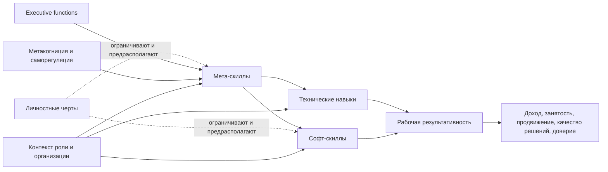
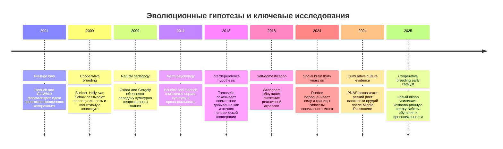

# Софт-скиллы и мета-скиллы

## Executive summary

Современная картина показывает, что спор вокруг "софт-скиллов" и "мета-скиллов" связан не с тем, важны ли они, а с тем, как их лучше называть, моделировать, измерять и развивать. В официальных и научных рамках сегодня конкурируют и частично перекрываются термины soft skills, social and emotional skills, transversal skills, human-centric skills, durable skills, power skills и meta-skills. ESCO описывает transversal skills как межотраслевые навыки и компетенции, являющиеся "строительными блоками" для профессиональных навыков; LifeComp структурирует личностные, социальные и learning-to-learn компетенции; OECD строит работу вокруг social and emotional skills; Skills Development Scotland трактует meta-skills как переносимые поведенческие и более высокоуровневые способности, помогающие адаптироваться и успешно действовать в жизни, учебе и работе. На практике различие такое: софт-скиллы обычно описывают наблюдаемые межличностные, саморегуляторные и коммуникативные способности, а мета-скиллы - более общие механизмы, которые позволяют осваивать и перестраивать и сами софт-скиллы, и технические навыки. В этом смысле метакогниция, саморегуляция, адаптивность, sense-making и learning to learn занимают "надстроечное" положение. citeturn22view2turn22view3turn22view1turn13view4turn31search1

Эволюционно эти навыки выглядят не как роскошь поздней истории, а как функциональный ответ на кооперативную жизнь Homo. Несколько линий объяснения хорошо дополняют друг друга. Social brain hypothesis связывает рост когнитивной сложности с необходимостью держать большие и многоуровневые социальные сети; cooperative breeding-гипотеза связывает человеческую просоциальность и социальное познание с длительным уходом за зависимым потомством; interdependence hypothesis выводит уникально человеческое сотрудничество из взаимозависимого совместного добывания; natural pedagogy и более широкая культурная передача объясняют, почему человек особенно эффективно учится у других; prestige bias и norm psychology объясняют, почему мы копируем не просто успешные действия, а статусно и социально валидированные образцы; self-domestication связывает снижение реактивной агрессии с ростом кооперации, доверия и социального контроля. Ни одна из этих гипотез не является исчерпывающей, но в совокупности они хорошо объясняют, почему для человека критичны не только интеллект и память, но и координация внимания, распознавание намерений, самоконтроль, обучение через наблюдение, гибкость и способность удерживать нормы. При этом современная литература подчеркивает, что многие свидетельства косвенные, а отдельные гипотезы подвергаются критике за избыточную универсализацию. citeturn6search4turn6search6turn8search19turn6search13turn6search11turn7search0turn8search17turn7search16turn7search12turn7search3turn8search12

С точки зрения рынка труда картина стала еще более однозначной после резкого ускорения AI. World Economic Forum фиксирует, что к 2030 году работодатели ожидают изменение 39% ключевых навыков работников; в топе текущих core skills остаются analytical thinking, resilience/flexibility/agility, leadership/social influence, creative thinking и motivation/self-awareness. LinkedIn показывает, что к 2030 году 70% навыков, используемых в большинстве профессий, изменятся, а темп добавления новых навыков в профили пользователей вырос на 140% с 2022 года. PwC показывает, что в наиболее AI-exposed профессиях набор навыков меняется более чем вдвое быстрее, чем в наименее AI-exposed ролях, а новые задачи в таких ролях в 2,5 раза чаще опираются на empathy, judgement и creativity; junior AI-exposed roles в семь раз чаще требуют "традиционно старших" навыков, включая leadership и strategic thinking. Для ИТ это особенно важно: в Европе CEDEFOP фиксирует, что software developers and analysts остаются наиболее востребованной ICT-профессией, а будущий спрос все больше смещается к T-shaped и даже pi-shaped профилям, где глубокая техническая специализация сочетается с широкими кооперативными и бизнес-навыками. citeturn36view2turn13view0turn23view0turn13view1turn13view2turn29view0turn20view2

Научная база стала гораздо аккуратнее в разграничении навыков, черт и когнитивных механизмов. OECD прямо подчеркивает, что социально-эмоциональные навыки следует отличать от personality traits: навыки больше выражаются в maximal behaviour и поддаются обучению, тогда как черты описывают типичные паттерны. При этом Big Five остается полезным "организующим каркасом" для многих моделей social and emotional skills, хотя сам OECD признает ограничения такого хода, включая неполную универсальность и риск концептуальной путаницы. Обзоры 2024-2026 годов также усиливают связку между executive functions, metacognition, self-regulation и self-regulated learning: эти конструкты не тождественны, но тесно переплетены, а метакогниция все яснее рассматривается как один из ключевых механизмов навыков более высокого порядка. citeturn13view4turn32view0turn14view1turn18search8turn25view0turn25view1

Измерение остается слабым местом области. Самоотчеты все еще доминируют, потому что дешевы, масштабируемы и дают приемлемо устойчивые результаты, но они страдают от социальной желательности, контекстной нестабильности и ограниченной связи с реальным поведением. OECD в последних материалах прямо рекомендует движение к более прямым и performance-based assessments. Одновременно обзор OECD по innovative tools показывает, что по ряду важных навыков у нас все еще мало хороших task-based инструментов: например, литература почти не нашла task-based assessments для отдельного блока "engaging with others", а task-based measures для critical thinking в этой линии обзора вообще не были обнаружены. Поэтому сейчас наиболее зрелый путь - мультиметодный дизайн: self-report + situational judgment tests + поведенческие задачи/симуляции + наблюдение + 360/peer feedback + рабочие артефакты. citeturn24view2turn24view3turn24view0turn18search5turn18search15

С точки зрения HR-практики наиболее надежный вывод сегодня не в том, что надо "оцифровать soft skills", а в том, что их нужно оценивать через реальные проявления в контексте работы. Новые метааналитические пересмотры в personnel selection показали, что часть старых оценок валидности была систематически завышена; при обновленных оценках structured interviews выходят в число самых сильных методов, а work samples сохраняют хорошую прогностическую ценность, хотя и более умеренную, чем считалось раньше. SHRM по существу идет в том же направлении: behavioral interviewing, project-based assessments, live tasks, portfolio review и job simulations дают более содержательную оценку навыков, чем резюме или диплом сами по себе, но должны быть стандартизированы, чтобы не перегружать кандидата и не усиливать bias. При этом правовые риски уже реальны: EEOC подчеркивает, что алгоритмические инструменты в найме могут маскировать и тиражировать дискриминацию, а в ЕС AI Act относит AI for employment and worker management к high-risk use cases. citeturn15view3turn15view4turn17view0turn27view0turn27view1turn27view3turn28view0turn28view1

Развитие навыков "выше среднего" возможно, но требует отказа от магического мышления. Простое "прошел тренинг по коммуникации" редко дает устойчивый сдвиг. Рабочая комбинация по данным обзоров выглядит так: deliberate practice на узких поведенческих микро-навыках, регулярная обратная связь, метакогнитивная надстройка "планирование - мониторинг - оценка", simulation-based learning на приближенных к работе сценариях, coaching или apprenticeship для переноса в реальную среду, а также прозрачные поведенческие метрики. Evidence base по interventions неровная, но в целом подтверждает: метакогнитические интервенции дают небольшой, но устойчивый прирост точности самонаблюдения; workplace coaching в среднем эффективен; simulation-based learning особенно хорошо работает для problem solving, situation management, а также умеренно помогает communication/collaboration. WEF дополнительно указывает, что human-centric skills развиваются медленно: для большинства людей это не "быстрый курс", а месяцы устойчивой практики. citeturn14view3turn15view2turn15view1turn15view0turn26view3

Главный практический вывод для профессионала, особенно в ИТ, таков: больше нельзя мыслить навыки как "hard vs soft". Актуальная единица развития - это стек из трех слоев: доменные технические навыки, софт-скиллы как видимое рабочее поведение, и мета-скиллы как механизмы адаптации, рефлексии и ускоренного переобучения. Для разработчика уровня выше среднего это обычно означает не просто писать лучший код, а быстрее распознавать контекст, точнее задавать вопросы, лучше превращать неопределенность в решения, удерживать доверие и организовывать совместное мышление команды. Именно эти качества AI пока не отменяет, а в ряде контекстов, наоборот, делает дороже. citeturn13view2turn13view3turn26view3turn20view2turn14view5turn14view4

## План книги

Ниже - рабочий план книги, который логично разворачивается из собранного исследования.

| Глава | Содержание |
|---|---|
| Введение | Почему спор о soft skills и meta-skills обострился именно сейчас: AI, skills-first hiring, ускорение смены ролей, рост значения человеческого поведения там, где рутинные задачи автоматизируются. |
| Язык и карты навыков | Разбор терминов soft skills, social and emotional skills, transversal skills, human-centric skills, durable/power skills, meta-skills, LifeComp, ESCO, WEF, OECD. Что на самом деле различается: словарь, цель рамки, единица анализа или объект развития. |
| Эволюционная предыстория | Как cooperative breeding, social brain, prestige bias, norm psychology, cultural transmission и self-domestication могли подготовить почву для современных человеческих навыков кооперации, самоконтроля и обучения через других. |
| Научный фундамент | Связи с личностными чертами, executive functions, metacognition, self-regulation, self-regulated learning. Что в этой области считается установленным, а что пока спорно. |
| Рынок и ценность | Глобальный и региональный спрос, включая ИТ. Как AI меняет профиль востребованности. Почему entry-level роли "стареют" по ожиданиям быстрее, чем раньше. |
| Измерение и оценка | Что реально можно измерить, а что только приблизительно оценить. Self-report, performance tasks, SJT, structured interview, work samples, simulations, 360, portfolios. |
| Развитие до уровня выше среднего | Принципы deliberate practice, coaching, apprenticeship, simulation, reflective practice, metacognitive scaffolding. Как построить долгую, а не декоративную траекторию роста. |
| Профессиональные протоколы | Матрицы навыков для специалиста и команды, особенно в ИТ: артефакты, поведенческие маркеры, 6-недельные протоколы, roadmaps, role architecture. |
| Этические и институциональные риски | Bias, exclusion, credential inflation, privacy, surveillance, геймификация, культурная асимметрия, юридические рамки EU/US. |
| Заключение | Почему навыки будущего - это не перечень модных слов, а архитектура адаптивности человека и организации. |

План книги согласован с тем, как официальные рамки и свежие обзоры описывают навыки, их измерение и связь с рынком труда. citeturn22view2turn22view3turn13view4turn36view2turn13view2turn20view2

## Терминология и концептуальные рамки

Терминологическая путаница в этой теме реальна, и OECD прямо связывает ее с jingle-jangle fallacy: разные ярлыки часто описывают пересекающиеся конструкты, а один и тот же ярлык может обозначать разные вещи в образовании, HR и психологии. Для современного аналитического употребления полезно держать следующее разграничение. Софт-скиллы - это относительно наблюдаемые межличностные, саморегуляторные и коммуникативные способности, которые проявляются в работе: слушание, влияние, кооперация, эмоционическая регуляция, ведение обратной связи, переговоры, адаптивность. Мета-скиллы - это более высокоуровневые механизмы, которые помогают осваивать, перенастраивать и комбинировать и софт-, и hard-скиллы: metacognition, learning to learn, sense-making, self-regulation, agency, adaptive problem framing. Именно поэтому в шотландской линии SDS/SQA meta-skills вынесены в отдельную надстройку, а в LifeComp learning to learn образует отдельную область компетентности. citeturn32view0turn22view1turn22view3turn37view0

OECD предлагает различать навыки и личностные черты так: social and emotional skills проявляются в maximal behaviour, зависят от ситуации, поддаются развитию и связаны с ключевыми жизненными исходами; personality traits же больше описывают typical behaviour. Это различие не отменяет сильной эмпирической связи с Big Five, но помогает избежать ошибки "раз черта устойчива, значит навык нельзя развить". Walton и коллеги дали дополнительную эмпирическую поддержку идее, что Big Five может служить организующей рамкой для social and emotional skills, но не исчерпывает всех practically relevant skills. citeturn13view4turn32view0turn18search8

Для рынка труда особенно полезно различать четыре семейства языков. Первое - "soft/social-emotional", которое ближе к психологии и образованию. Второе - "transversal/human-centric", которым пользуются ЕС и WEF для описания переноса навыков между ролями и секторами. Третье - "durable/power skills", которое подчеркивает устойчивость человеческих навыков при технологических сдвигах. Четвертое - "meta-skills", которое говорит уже не только о поведении, но и о способности человека перестраивать собственный skill stack под новую среду. citeturn22view2turn26view3turn31search11turn31search1turn22view1

### Сравнение ключевых рамок

| Рамка | Какой язык использует | Базовая логика | Что особенно полезно | Ограничения |
|---|---|---|---|---|
| WEF | human-centric skills, core skills | Смотрит на навыки через призму трансформации труда и спроса работодателей; top skills связываются с будущими job transitions | Хорошо показывает, какие навыки дорожают на рынке и как AI усиливает ценность человеческих способностей | Это прежде всего labor-market lens, а не психометрическая теория навыка citeturn36view2turn26view3 |
| OECD | social and emotional skills | Строит модель вокруг измеряемых характеристик, связанных с жизненными исходами; опирается на Big Five как organizing framework | Наиболее аккуратная научно-политическая линия для связи навыков, измерения, teachability и outcomes | Big Five как каркас полезен, но не исчерпывает все practically relevant constructs; само OECD это признает citeturn13view4turn14view1turn32view0 |
| ESCO | transversal knowledge, skills and competences | Межотраслевой каталог для рынка труда и квалификаций; 6 главных категорий, 24 skill groups, 96 single skills | Очень полезно для job architecture, skills mapping, internal mobility и skills-first HR | Это классификатор и инфраструктура языка, а не теория развития навыков citeturn22view2 |
| LifeComp | personal, social, learning to learn | Девять компетенций в трех зонах: personal, social, learning to learn | Сильная рамка для образования, L&D и развития self-regulation/flexibility/learning to learn | Менее удобна для точного HR-assessment под конкретные роли citeturn22view3 |
| Skills Development Scotland | meta-skills | Self-management, social intelligence, innovation; 12 meta-skills как переносимые higher-order abilities | Очень сильна как практическая карта "навыков над навыками", особенно для развития адаптивности и рефлексии | Научная психометрия слабее, чем у OECD; сила рамки больше в design-for-learning, чем в строгой validated measurement | citeturn22view1turn37view0turn38search8 |

Набор названий важен не сам по себе, а потому, что от него зависит дизайн оценки и развития. Если организация говорит о "soft skills", но оценивает только самопрезентацию на интервью, она измеряет не то. Если она говорит о "meta-skills", но не отслеживает learning loops, transfer across contexts и reflective practice, она тоже использует термин пусто. Наиболее зрелая позиция сегодня - держать несколько рамок одновременно: WEF для рынка, OECD для научной строгости, ESCO для skills architecture, LifeComp для развития, SDS для meta-layer. citeturn26view3turn13view4turn22view2turn22view3turn22view1

Диаграмма выше - авторская интеграция, но она согласуется с тем, как OECD, LifeComp и современные обзоры связывают traits, skills, executive functions, metacognition и outcomes. citeturn13view4turn14view1turn25view0turn25view1turn22view3

## Эволюционные корни

Если смотреть на софт- и мета-скиллы эволюционно, то становится видно: они решали не "офисные" задачи, а задачи выживания в сверхсоциальном, кооперативном и культурно насыщенном виде. Social brain hypothesis связывает рост неокортекса у приматов с усложнением социальных отношений; Данбар в обзоре 2024 года по-прежнему считает эту линию эмпирически сильной, хотя в критической литературе ей ставят в упрек избыточную редукцию сложной социальности к одной оси "brain size - group size". Для нашей темы это важно потому, что сам факт крупных и многослойных человеческих сетей делает ценными именно те способности, которые сегодня называются "коммуникацией", "социальным влиянием", "эмоционической регуляцией", "кооперацией" и "sense-making". citeturn6search4turn8search8turn8search12

Cooperative breeding-гипотеза добавляет другой слой. Burkart, Hrdy и van Schaik аргументировали, что человеческая когнитивная эволюция шла в среде длительного совместного ухода за зависимым потомством, а свежий обзор 2025 года рассматривает cooperative breeding как вероятный ранний катализатор целого "nexus" взаимосвязанных черт: крупный мозг, длительное детство, просоциальность, распределенный уход, совместное обучение. Эта логика особенно хорошо объясняет, почему у человека столь развиты эмпатия, чувствительность к намерениям и долговременное обучение при высокой зависимости от других. citeturn6search6turn8search19

Interdependence hypothesis Томаселло лучше всего описывает происхождение именно кооперативной составляющей soft skills. Ее центральная идея: видоспецифическая человеческая кооперация выросла не из абстрактного альтруизма, а из взаимозависимого совместного добывания, где успех отдельного индивида зависел от партнера. В такой среде отбор благоприятствовал механизмам совместного внимания, координации, справедливого распределения, отслеживания вкладов, подавления читерства и коммуникации о совместной задаче. Если перевести это на современный язык, то значительная часть "командных" навыков - от active listening до stakeholder alignment - выглядит дальним культурным продолжением этих механизмов. citeturn6search13turn6search1

Cultural transmission и natural pedagogy объясняют, почему мета-скиллы человека не ограничиваются непосредственным поведением. Csibra и Gergely предложили идею natural pedagogy: человеческая коммуникация специально приспособлена к передаче generic knowledge, в том числе когнитивно непрозрачного. Новые данные о каменной индустрии в PNAS 2024 также поддерживают идею, что по-настоящему кумулятивная культура - с заметным ускорением роста сложности орудий - становится выраженной примерно с Middle Pleistocene. Это делает правдоподобным вывод: способность быстро учиться у других, распознавать достойные подражания модели, строить обучение через демонстрацию и создавать цепочки cultural scaffolding была для Homo не побочным бонусом, а ключевым адаптивным преимуществом. citeturn6search11turn7search3

Prestige bias и norm psychology дают еще одно объяснение. Henrich и Gil-White показали, что склонность подражать престижным носителям навыка может быть адаптивной, поскольку снижает стоимость поиска качественной модели. Chudek и Henrich развили это в norm-psychology: человеческая просоциальность частично укоренена в coevolutionary system "культура - гены - нормы", где люди учатся не только действиям, но и допустимым способам совместной жизни. Для soft skills это означает, что многие из них по определению культурно нагружены: что считается "хорошей коммуникацией", "лидерством", "инициативой" или "уважением", частично универсально, а частично локально нормировано. Это одновременно усиливает их значение и делает сложнее их оценку без культурного bias. citeturn7search0turn7search16turn8search17

Наконец, self-domestication-гипотеза объясняет часть основания доверия и самоконтроля. Работы Wrangham и соавторов связывают человеческую эволюцию с снижением реактивной агрессии при сохранении способности к инструментальному насилию. В мягкой формулировке это не означает "люди стали добрыми", а означает, что кооперативные системы стали стабильнее там, где уменьшалась взрывная реактивная агрессия и усиливались социальные механизмы ее контроля. Даже археологические находки вроде исследования неандертальского ребенка с синдромом Дауна, выжившего достаточно долго за счет ухода группы, напоминают: социальная забота и поддержка у рода Homo имеют гораздо более глубокие корни, чем современная моральная риторика. citeturn7search2turn7search12turn7search4turn7search14

Главное ограничение эволюционной главы таково: она хорошо объясняет, почему эти навыки вообще возникли и закрепились, но гораздо хуже отвечает на вопрос, какие из них обязаны быть универсальными, а какие радикально зависят от культуры и институций. Поэтому эволюционный аргумент полезен как background explanation, но плохо годится как прямой шаблон для современной оценки человека. citeturn8search12turn8search17turn32view0

## Рынок, AI и ценность для IT

Спрос на человеческие навыки не исчез на фоне AI, а сместился в более дорогой сегмент. В WEF Future of Jobs 2025 работодатели ожидают изменение 39% core skills работников к 2030 году, а в текущем топе essential core skills находятся analytical thinking, resilience/flexibility/agility, leadership/social influence, creative thinking и motivation/self-awareness. Это означает, что работодатель не противопоставляет технические и человеческие навыки; он ожидает их совместной работы в одном профиле. Дополнительный WEF-репорт 2025 про human advantage подчеркивает ту же мысль: работодатели считают human-centric skills главными differentiators новой экономики, несмотря на рост важности AI, big data и technological literacy. citeturn36view2turn26view3

LinkedIn даёт еще более жесткую динамику. По Work Change Report 2025, к 2030 году 70% навыков, используемых в большинстве работ, изменятся; темп добавления новых навыков в профили вырос на 140% с 2022 года; доля вакансий с AI literacy requirement за год выросла более чем в шесть раз, хотя сама доля таких вакансий пока все еще мала; а AI Engineer входит в число fastest-growing jobs в 15 странах и занимает первое место по темпам роста в Нидерландах, Великобритании и США. Одновременно LinkedIn прямо говорит, что alongside AI literacy быстрее растут и human skills - communication, leadership, adaptability, curiosity. Это очень важный сигнал: AI literacy становится baseline-гигиеной, а человеческие навыки - differentiator. citeturn23view0turn29view0

PwC AI Jobs Barometer 2026 усиливает этот вывод. По данным барометра, навыки в наиболее AI-exposed jobs меняются более чем вдвое быстрее, чем в наименее exposed roles, а новые задачи в AI-exposed jobs в 2,5 раза чаще требуют empathy, judgement и creativity. Особенно важен вывод про "seniorised entry-level roles": junior jobs в AI-exposed секторах в семь раз чаще требуют traditionally senior skills, а такие entry-level roles выросли на 35% с 2019 года. Это один из самых практичных выводов всего исследования: AI не просто меняет списки инструментов, он поднимает поведенческую планку на ранних этапах карьеры. citeturn13view2

OECD в свежем brief 2026 делает более нюансированный вывод. В большинстве случаев social and emotional skills вроде empathy, communication и teamwork остаются essential, однако в части Европы уже видны сигналы, что algorithmic management может снижать perceived demand на отдельные социальные навыки; в частности, в Германии, Франции, Италии и Испании 20% менеджеров считают, что такие инструменты уменьшают потребность в empathy, тогда как 12% - что увеличивают. OECD отдельно предупреждает: это еще не твердый вывод, а ранний сигнал, который надо интерпретировать осторожно. Практический смысл этого наблюдения в том, что AI может одновременно повышать премию за качественные high-level human skills и обесценивать часть низкоуровневой эмоциональной рутины. citeturn13view5turn34view2

Для ИТ и разработки ситуация особенно интересна. CEDEFOP показывает, что software developers and analysts остаются наиболее востребованной ICT-профессией в OJAs, а ICT professional roles составляют уже более 80% ICT job openings в онлайн-объявлениях; среди профессиональных jobs 15% OJAs уже содержат хотя бы один AI skill; employment of ICT professionals в Европе ожидается на уровне примерно +30% в 2022-2035; рынок при этом остается tight, особенно в странах вроде Германии, Франции, Чехии, Польши и Швеции. Параллельно CEDEFOP ссылается на данные ESSA: для сектора важны T-shaped и pi-shaped profiles, где разработчик должен сочетать глубину с широтой, включая business relations, process improvement и cross-functional interface. citeturn20view2turn29view2

IT-специфика усиливается и через AI-инструменты разработки. GitHub в white paper 2025 пишет о 98% годовом росте публичных generative AI projects на платформе и о том, что AI coding tools стали центральны для software development, а GitHub ссылается на рост productivity на 55% в ряде контекстов. При этом Stack Overflow Developer Survey 2025 показывает массовую вовлеченность разработчиков в освоение AI tools: более 36% респондентов учились использовать AI-enabled tools в последний год именно для работы или карьеры. Наконец, GitHub Octoverse-related materials 2026 описывают "convenience loops", где совместимость технологий с AI начинает влиять на выбор стека, а не только на чисто инженерные критерии. Это значит, что для разработчика растет ценность не только coding skill itself, но и умения задавать рамку задачи, проверять выводы AI, синхронизироваться с командой и держать архитектурный смысл решения. citeturn20view1turn20view0turn9search6

### Данные для графиков трендов

| Рекомендуемый график | Что показать | Источники |
|---|---|---|
| Линейный график | Доля меняющихся core skills: 35% в 2016, 44% в 2023, 39% ожидаемо к 2030 | WEF Future of Jobs 2025 citeturn36view2 |
| Столбчатый график | Топ current core skills: analytical thinking, resilience/flexibility/agility, leadership/social influence, creative thinking, motivation/self-awareness | WEF Future of Jobs 2025 citeturn13view0turn36view2 |
| Линейный график | 140% рост темпа добавления skills с 2022 года; 6x рост вакансий с AI literacy за год | LinkedIn Work Change Report 2025 citeturn23view0turn29view0 |
| Столбчатый график | В AI-exposed jobs: >2x faster skills change, 2.5x чаще demand for empathy/judgement/creativity, 7x senior-skill pressure in junior roles | PwC AI Jobs Barometer 2026 citeturn13view2 |
| Столбчатый график | ICT employment forecast +30% 2022-2035; tightness by country | CEDEFOP ICT professionals 2023 update citeturn20view2 |
| Секторная диаграмма / bar chart | Доля job postings, явно упоминающих human-centric skills, по секторам; отдельно редкость creative thinking и curiosity in postings | WEF New Economy Skills 2025 / Indeed analysis citeturn29view1 |

Рынок сейчас оценивает не "приятность" человека, а его способность функционировать в среде высокой неопределенности и человеко-машинного разделения труда. Поэтому самые дорогие навыки - не те, что просто "не автоматизируются", а те, что повышают качество решения там, где AI ускоряет производство черновиков, но не берет на себя окончательный контекст, доверие, этику и организацию совместного мышления. citeturn13view2turn14view5turn14view4

## Научная база, измерение и оценка

Научно сегодня разумно мыслить область как пересечение минимум трех слоев. Первый слой - traits/personality. Второй - skills as capabilities and behaviours. Третий - underlying cognitive regulators: executive functions, metacognition, self-regulation и self-regulated learning. OECD и последние обзоры предлагают не смешивать эти слои, но и не разрывать их искусственно: traits создают предрасположенности, executive and metacognitive systems поддерживают контроль и перенос, а skills выражаются в задачах и поведении. citeturn13view4turn25view0turn25view1

Данные OECD 2025 особенно ценны тем, что переводят тему из риторики в outcomes. В Survey of Adult Skills social and emotional skills независимо связаны с employment, wages, job satisfaction, health и civic engagement. По занятости higher emotional stability и extraversion во многих странах связаны с более высокой вероятностью быть employed даже после учета literacy и education; по job satisfaction эмоциональная стабильность и экстраверсия дают вклад, сопоставимый или больший, чем literacy; по wages социально-эмоциональные навыки объясняют меньшую долю вариации, чем literacy и education, но вклад статистически значим и сопоставим, например, с job tenure. Особенно интересен compensatory effect: при низкой literacy влияние extraversion, conscientiousness и emotional stability на employability усиливается. citeturn14view2turn39view2turn39view1turn39view0turn39view3

Это важная коррекция против двух крайностей. Первая крайность - считать soft skills "важнее всего". Вторая - считать их "субъективной болтовней". OECD показывает более трезвую картину: они не заменяют cognitive skills, но дают частично независимый вклад и иногда усиливают результат именно там, где когнитивные сигналы ослаблены. Для design of talent systems это означает: лучший прогноз обычно строится не на одном типе сигналов, а на композиции cognitive, behavioural и socio-emotional indicators. citeturn14view2turn39view3turn15view4

### Self-report против task-based assessment

Большинство масштабных измерений по-прежнему используют self-report, и OECD прямо признает это. Причина понятна: такие опросники дешевы, просты в администрировании и, в ряде случаев, дают достаточно устойчивые приближения. Но современная позиция уже не в том, что self-report "достаточен". OECD 2025 рекомендует систематически двигаться к performance assessments relevant behaviours; обзор OECD 2024 по innovative tools подчеркивает, что прямые, task-based formats лучше приближаются к actual actions and performances, снижая проблемы социальной желательности и неточности самоописания. citeturn24view2turn24view3turn24view0

При этом task-based line тоже далека от зрелости. В обзоре OECD не было найдено task-based инструментов, специально сфокусированных на Engaging with others; для critical thinking в этой конкретной линии обзора также не было найдено task-based assessments; по creativity наблюдаются расхождения между self-report и direct measures, а для части новых цифровых инструментов не хватает данных по reliability и criterion validity. Иными словами, рынок навыков опережает науку об их измерении. Это одна из главных причин, почему любые single-score "индексы soft skills" следует использовать очень осторожно. citeturn24view0

### Практики оценки

| Метод | Что хорошо ловит | Сильные стороны | Слабые стороны и риски | Когда использовать |
|---|---|---|---|---|
| Structured behavioral interview | Опыт, поведенческие паттерны, judgement, communication | После пересмотра selection meta-analyses структурированные интервью остаются среди сильнейших predictors; хорошо стандартизируются | Если интервьюер не обучен, легко скатывается в impression management и affinity bias | Основной универсальный метод для большинства knowledge roles citeturn15view3turn15view4turn27view3 |
| Work samples | Реальное поведение на фрагменте работы | Высокая ecological validity; напрямую показывают, как человек действует | Дороже; классическая валидность ниже старых завышенных оценок, но все еще полезна; требует аккуратного scoring | Для ИТ, аналитики, менеджмента, support, leadership simulations citeturn17view0 |
| Job simulations / assessment exercises | Coordination, decision-making, collaboration, pressure handling | Ближе к реальности, чем тест или разговор; SHRM считает их сильным элементом skills-first hiring | Могут перегружать кандидата и быть дорогими; нужен хороший rubric | Для критичных ролей, leadership, client-facing, product roles citeturn27view0turn27view1 |
| Situational judgment tests | Judgement in contextualized scenarios | Хороший мост между self-report и direct assessment; стандартизируемы и масштабируемы | Остаются гипотетическими; часть валидности зависит от формата и ключей scoring | Массовый screening и early-stage selection, learning diagnostics citeturn24view0turn33search22 |
| 360 feedback | Репутационные поведенческие проявления, blind spots | Дает взгляд с нескольких сторон; полезен в development contexts | Риск bias, office politics и плохого дизайна; лучше для развития, чем для отбора | Для leadership development и командной работы, не как единственный критерий продвижения citeturn33search6turn33search20turn33search14 |
| Psychometric self-report tools | Склонности, self-perception, broad domains | Масштабируемы, удобны для baseline и cohort analytics | Social desirability, response styles, self-insight limitations; нельзя считать прямой мерой поведения | Для диагностики гипотез, а не как единственный gatekeeper citeturn24view2turn24view0 |
| Portfolio / artifact review | Качество коммуникации, reasoning, ownership, collaboration footprints | В ИТ особенно полезно: ADRs, PR discussions, postmortems, design docs показывают поведение | Требует trained reviewers и rubric, иначе bias высок | Для senior IC, product/engineering leadership, design, consulting citeturn27view0turn27view1 |

С практической точки зрения лучший assessment stack сегодня выглядит так: сначала job analysis и skills mapping; затем structured interview; затем work sample или simulation; затем optional psychometric or SJT layer; для развития - 360 и reflection on artifacts. Именно такая логика лучше согласуется и с свежими selection meta-analyses, и с SHRM skills-first guidance, и с ограничениями современной психометрики. citeturn15view3turn15view4turn27view0turn27view1turn24view2

## Развитие навыков и практическая модель

Главное, что подтверждает современная evidence base: большинство социально-эмоциональных навыков teachable, но teachability различается по навыкам, возрастам, контекстам и качеству дизайна интервенции. OECD 2024 и 2023 прямо говорят, что большинство social and emotional skills можно развивать, но их benefit profile и susceptibility to change различаются; именно поэтому работа с "навыками вообще" хуже, чем прицельная работа с конкретными behavioural units. citeturn13view4turn32view0

Наиболее доказательные механизмы развития складываются в повторяющийся цикл. Во-первых, explicit modelling: человеку показывают, что именно считать хорошим выполнением навыка. Во-вторых, deliberate practice: навык разбивается на короткие наблюдаемые компоненты и тренируется в сложных, но контролируемых условиях. В-третьих, feedback и reflection: человек учится видеть собственные промахи и корректировать паттерн. В-четвертых, transfer to context: навык закрепляется в реальной работе через наставничество, peer loops, apprenticeship и разбор артефактов. В-пятых, metacognitive overlay: планирование, мониторинг, оценка. Именно это и отличает развитие "до уровня выше среднего" от обычного разового тренинга. citeturn15view0turn14view3turn15view2turn10search2

Данные по конкретным форматам это подтверждают. Meta-analysis по monitoring accuracy показывает небольшой, но устойчивый эффект метакогнитических интервенций на точность самонаблюдения в задачах problem solving. Workplace coaching meta-analysis 2023 подтверждает положительный эффект coaching на организационные outcomes. Simulation-based learning meta-analysis показывает особенно сильные эффекты по problem solving и situation management и умеренные, но полезные эффекты по communication and collaboration. Иными словами, если ставить цель "быть заметно выше среднего", то для soft и meta skills особенно важно сочетать cognition-aware practice и context-rich practice. citeturn14view3turn15view2turn15view1

AI в этой части двойственен. С одной стороны, он может резко удешевить practice and feedback: симулировать разговоры, делать red-team сценарии, помогать с journaling, разметкой рефлексий и ролевыми playbooks. С другой стороны, исследования 2024-2026 предупреждают о снижении critical engagement и overconfidence. Microsoft Research пишет, что GenAI снижает воспринимаемое усилие для критического мышления и может уменьшать независимое problem solving; Nature Human Behaviour показывает, что human-AI combinations в среднем не гарантируют выигрыша и особенно слабы в decision tasks; обзор по AI-assisted metacognition фиксирует систематическое смещение к переоценке собственного качества с AI assistance. Поэтому AI полезен в развитии только в режимах, где человек сохраняет ownership of judgement и проходит через обязательный этап self-explanation and verification. citeturn14view4turn14view5turn9search15

### Матрица развития навыков для индивида и команды

| Уровень | Фокус навыков | Основные практики | Метрики | Артефакты |
|---|---|---|---|---|
| Индивид, базовый | Коммуникация, self-regulation, planning | Reflective journal, micro-feedback, 1 simulation per week, pre/post self-rating | Частота clarifying questions, соблюдение commitments, latency to response, доля исправленных повторяющихся ошибок | Journal, feedback log, 1-page weekly review |
| Индивид, выше среднего | Metacognition, conflict handling, influence, ambiguity framing | Deliberate practice на узких сценариях, call review, writing review, after-action review | Качество framing, точность самооценки, peer-rated clarity, reduction of rework | Decision memo, postmortem notes, annotated chat/email samples |
| Индивид, сильный | Leadership, coaching, sense-making, cross-functional collaboration | Apprenticeship, mentoring, facilitation of difficult meetings, role rotation | Team trust signals, speed of alignment, stakeholder satisfaction, escalation quality | Facilitation plans, mentoring notes, retrospectives |
| Команда, базовый | Working agreements, feedback hygiene, async clarity | Definition of done for communication, PR/ADR templates, retro cadence | Handover defects, meeting load, review cycle time | Team handbook, templates, retro board |
| Команда, выше среднего | Shared mental models, conflict quality, learning loops | Simulation of incidents, blameless postmortems, peer coaching circles | Incident recurrence, decision turnaround, onboarding speed | Runbooks, postmortems, learning backlog |
| Команда, сильная | Collective adaptability, psychological safety, apprenticeship culture | Shadowing, pair/mob work, calibrated standards, internal teaching | Internal mobility, promotion quality, knowledge diffusion, retention of juniors | Skills map, mentorship graph, internal curriculum |

Эта матрица - авторская, но она собрана так, чтобы опираться на WEF human-centric framing, OECD teachability/measurement logic, Deloitte findings про trust and apprenticeship, а также evidence по coaching, metacognition и simulations. citeturn26view3turn13view4turn13view3turn15view2turn14view3turn15view1

### Шестинедельный протокол для профессионала в ИТ

| Неделя | Основной фокус | Практика | Что считать прогрессом |
|---|---|---|---|
| Первая | Baseline | Собрать 5 реальных артефактов: PR, design note, incident reply, async discussion, stakeholder update | Появилась map повторяющихся слабых мест |
| Вторая | Коммуникация и framing | Каждый день 1 короткий exercise: issue summary в 5 строк, decision with trade-offs, explicit ask | Меньше уточняющих циклов, выше ясность сообщений |
| Третья | Метакогниция | До и после каждой значимой задачи фиксировать: что думаю, насколько уверен, где могу ошибаться | Снижается разрыв между уверенностью и фактическим качеством |
| Четвертая | Collaboration under ambiguity | 2 симуляции: конфликт приоритетов и неясный бриф; обязательен after-action review | Улучшается качество clarifying questions и alignment |
| Пятая | Influence и feedback | Дать 3 структурированные обратные связи и провести 1 difficult conversation по шаблону SBI/COIN | Feedback становится конкретнее, меньше defensiveness |
| Шестая | Transfer | Взять реальную задачу с межфункциональным контекстом и провести через новый цикл поведения | Новые паттерны видны не только в тренировке, но и в рабочем артефакте |

Для команды тот же цикл лучше проводить квартально: baseline по артефактам, skills map, одна общая симуляция, одна ретроспектива по коммуникации, apprenticeship loop и повторное измерение по observable metrics. Это заметно надежнее, чем отправить всех на единый тренинг "по soft skills". citeturn15view2turn15view1turn13view3turn27view1

### Шаблон assessment для команды

1. Какие 5-7 навыков реально критичны для роли или команды.
2. Какие observable behaviours доказывают каждый навык.
3. Какие рабочие артефакты несут сигнал по этим behaviours.
4. Какие методы оценки используются и на каком этапе.
5. Как отделить skill gap от context gap, workload gap или tooling gap.
6. Где нужен development use, а где selection use.
7. Как контролируются fairness, privacy и candidate burden.

Этот шаблон следует из общего консенсуса свежих официальных и научных материалов: без job-relevant context и без multimethod evidence область быстро превращается в субъективизм. citeturn27view0turn27view1turn24view2turn28view0turn28view1

## Риски, выводы и библиография

Этические, культурные и институциональные риски здесь не вторичны, а встроены в сам предмет. Во-первых, bias. Любая оценка soft skills легко перепутает реальный навык с культурной близостью, акцентом, стилем самопрезентации или классовым кодом. EEOC прямо предупреждает, что алгоритмические hiring tools могут сохранять или усиливать дискриминацию; SHRM указывает, что плохо спроектированные assessments создают disparate impact; в ЕС employment AI относится к high-risk domain и должен соответствовать требованиям по данным, oversight, traceability, accuracy и mitigation of discriminatory outcomes. citeturn28view0turn27view2turn28view1

Во-вторых, риск credentialing inflation. Как только "soft skills" превращаются в модную управленческую валюту, рынок начинает продавать сомнительные сертификаты и overly compressed scores. Это особенно опасно потому, что measurement science здесь еще незрелая: OECD прямо говорит о необходимости двигаться к более robust direct assessments, а обзор innovative tools показывает реальные лакуны по ряду важнейших навыков. Значит, слишком уверенные claims о точной количественной оценке metacognition, empathy или collaboration нередко методологически слабее, чем выглядят. citeturn24view2turn24view0

В-третьих, риск skill erosion under AI. Современные исследования не поддерживают простую идею "AI автоматически делает людей сильнее". Скорее наблюдается trade-off: AI может повышать результат и снижать effort, но одновременно ослаблять самостоятельную проверку, метакогнитический мониторинг и глубину reasoning. Поэтому организациям опасно развивать AI literacy без параллельной дисциплины critical thinking, verification and reflective practice. citeturn14view4turn14view5turn9search15

В-четвертых, риск геймификации. Как только soft skills кладутся в KPI, люди начинают оптимизировать видимость навыка вместо самого навыка: демонстрировать pseudo-empathy, performative leadership, over-communication без смысловой плотности. Это еще одна причина, почему лучшие системы опираются не на декларации, а на рабочие артефакты, поведение в сценариях и репутационные данные из длительного взаимодействия. citeturn27view1turn13view3turn24view0

Итоговый вывод исследования можно сформулировать прямо. Софт-скиллы и мета-скиллы - это не "приятное дополнение" к hard skills и не модный гуманитарный шум. Это ключевые механизмы человеческой адаптивности в сложной кооперативной среде. Эволюционно они выросли из задач выживания в культурно насыщенном, взаимозависимом виде. На рынке они дорожают по мере того, как AI берет на себя все больше рутины и выталкивает человека в зоны ответственности, где нужны judgement, framing, trust, adaptation and learning velocity. Научно их уже можно описывать и частично измерять довольно аккуратно, но измерение еще далеко от зрелости, поэтому лучшие практики - мультиметодные и контекстные. Практически же развитие "выше среднего" требует не вдохновляющих разговоров, а циклов deliberate practice, reflection, simulation, apprenticeship и проверки прогресса на реальных рабочих артефактах. citeturn36view2turn13view2turn13view4turn15view2turn15view1turn13view3

### Open questions and limitations

Часть академических источников по selection science и 360 feedback доступна в открытом виде только через препринты, abstract pages или вторичные открытые копии, поэтому по отдельным методам глубина проверки ниже, чем по OECD/WEF/ESCO/SHRM/CEDEFOP. Кроме того, данные по AI-effect on social skills в работе пока ранние и местами противоречивые; OECD прямо рекомендует трактовать их как сигналы, а не как окончательный verdict. Наконец, по мета-скиллам в строгом научном смысле поле пока менее стандартизировано, чем по social and emotional skills: здесь больше сильных практических рамок, чем единой психометрической ортодоксии. citeturn13view5turn24view0turn22view1

### Приоритетная библиография с аннотациями

World Economic Forum, The Future of Jobs Report 2025. Один из сильнейших источников по рыночной динамике навыков: дает оценку будущей disruption of core skills, текущие core skills, differentiators growing vs declining jobs и стратегию upskilling. Особенно полезен для связки навыков с labor market transformation. citeturn36view2

World Economic Forum, New Economy Skills: Unlocking the Human Advantage, 2025. Специализированный доклад о human-centric skills как основном differentiator на фоне AI. Ценен тем, что соединяет skills taxonomy, hiring signals, recognition data и gap analysis по обучению human skills. citeturn26view3

OECD, Skills that Matter for Success and Well-being in Adulthood, 2025. На сегодня один из наиболее важных официальных источников: впервые масштабно связывает adult social and emotional skills с employment, wages, job satisfaction, health и civic engagement. Очень сильная база для разделов про outcomes и measurement. citeturn14view1turn14view2

OECD, How to Advance the Teaching and Assessment of Social and Emotional Skills, 2024. Короткий, но содержательный policy brief о том, что такое SES, чем они не являются, как они teachable, почему нужны direct and standardized assessments и почему skill-specific evidence важнее общих лозунгов. citeturn13view4

OECD, Innovative Tools for the Direct Assessment of Social and Emotional Skills, 2024. Ключевой обзор по problem of measurement. Особенно важен для честного разговора о self-report limitations, task-based approaches и lacunae in direct assessment. citeturn24view0

LinkedIn, Work Change Report: AI Is Coming to Work, 2025. Полезен как макроисточник по world-of-work change: 70% skills change by 2030, 140% acceleration in adding skills, rapid rise of AI literacy and growth of AI roles. Один из лучших актуальных data-rich market reports. citeturn23view0

LinkedIn, Skills on the Rise 2026. Хороший оперативный источник по fastest-growing skills, где особенно важны cross-functional collaboration, people management, mentorship и stakeholder communication. Полезен как индикатор практического employer demand language. citeturn13view1

PwC, AI Jobs Barometer, 2026. Очень важный источник для связи AI с "seniorisation" entry-level work and human premium. Особенно полезен для тезиса о том, что empathy, judgement, creativity и strategic thinking дорожают, а junior roles становятся поведенчески сложнее. citeturn13view2

CEDEFOP, ICT professionals: skills opportunities and challenges, 2023 update. Лучший региональный источник для Европы по ИТ-рынку: software developers and analysts, AI-skill mentions in OJAs, forecasted ICT growth, tightness and T-shaped / pi-shaped logic. citeturn20view2turn29view2

ESCO, Transversal knowledge, skills and competences. Базовый официальный европейский классификатор для разговора о transferable skills across sectors. Особенно полезен для skills architecture, job design и internal talent marketplaces. citeturn22view2

European Commission JRC, LifeComp Conceptual Reference Model. Одна из лучших рамок для личностных, социальных и learning-to-learn компетенций. Особенно сильна для design of development programs и образовательной логики. citeturn22view3

Skills Development Scotland / SQA, Skills 4.0 and Meta-skills resources. Практический, очень полезный источник по meta-skills: self-management, social intelligence, innovation. Особенно ценен для построения development roadmaps и language of higher-order transferable skills. citeturn22view1turn37view0turn38search8

Dunbar, The Social Brain Hypothesis - Thirty Years On, 2024. Современная оценка одной из самых влиятельных эволюционных гипотез о связи социальной сложности и когнитивной эволюции. Полезна как обзор и как точка входа в критику. citeturn8search8

Burkart, Hrdy, van Schaik, Cooperative Breeding and Human Cognitive Evolution, и Burkart 2025 review. Базовая и обновленная линии по cooperative breeding как источнику просоциальности, social cognition и расширенного обучения у человека. citeturn6search6turn8search19

Tomasello et al., Two Key Steps in the Evolution of Human Cooperation. Ключевой текст для понимания взаимозависимости, совместной интенциональности и происхождения человеческой кооперации. Полезен как bridge between evolution and modern teamwork constructs. citeturn6search13

Csibra and Gergely, Natural Pedagogy. Классический, но до сих пор фундаментальный текст по человеческой приспособленности к передаче культурно непрозрачного знания. Особенно важен для главы о мета-скиллах и social learning. citeturn6search11

Fleming, Metacognition and Confidence, Annual Review of Psychology, 2024. Один из лучших современных обзоров по metacognition: помогает аккуратно связать self-monitoring, confidence and performance without popular simplifications. citeturn25view1

Theobald et al., Executive Functions, Metacognition, Self-Regulation, and Self-Regulated Learning, 2026. Сильный интегративный обзор, полезный для разведения и одновременного связывания EF, MC, SR и SRL. Особенно ценен для раздела о meta-skills. citeturn25view0

Sackett et al., Revisiting Meta-Analytic Estimates of Validity in Personnel Selection, 2021, и Berry et al., updated matrix, 2023. Эти работы важны потому, что они резко охлаждают чрезмерную уверенность в старых validity tables и поднимают значимость structured interviews and composite selection systems. citeturn15view3turn15view4

Cannon-Bowers et al., Workplace Coaching: a Meta-Analysis, 2023, и Chernikova et al., Simulation-Based Learning in Higher Education: A Meta-Analysis, 2020. Вместе они дают надежную базу под практики развития: coaching работает, а simulations особенно полезны для problem solving, situation management и умеренно для communication and collaboration. citeturn15view2turn15view1