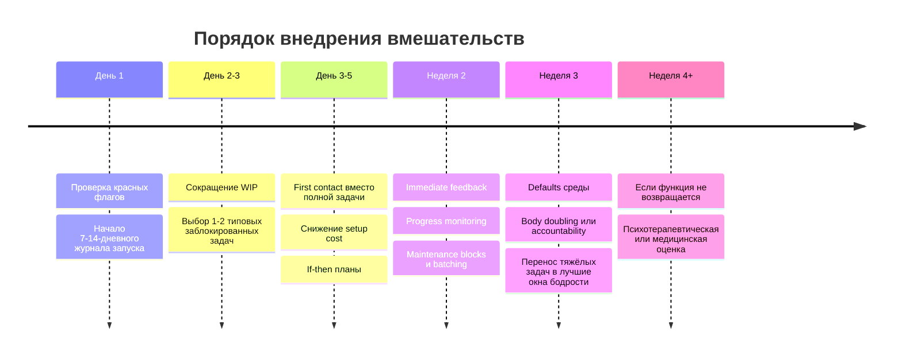

# Избирательный порог мобилизации усилия

## Исполнительное резюме

Феномен, который вы описываете, лучше всего понимать не как "лень" и не как один-единственный диагноз, а как селективный сбой в допуске усилия: система действия пропускает то, что дает достаточно быструю ценность, ясность, новизну, автономию или немедленную обратную связь, и тормозит то, что кажется дорогим на входе, неопределенным, скучным, социально обязанным или полезным только потом. В научной литературе это раскладывается на несколько пересекающихся семейств моделей: Expected Value of Control, cognitive effort discounting, opportunity-cost models of effort, temporal discounting и Temporal Motivation Theory, procrastination-as-mood-regulation, executive dysfunction/task initiation, а также клинические механизмы мотивационного дефицита при ADHD, депрессии, выгорании, хроническом стрессе и нарушении сна. Ни одна из этих рамок по отдельности не покрывает весь феномен; в книге разумнее давать именно карту механизмов, а не одну "главную причину". citeturn0search0turn16search0turn0search5turn0search2turn1search13turn1search0turn2search0turn11search0turn2search3turn3search3

Самая практичная формула для книги может звучать так: "порог мобилизации усилия" растет, когда одновременно повышаются цена входа, задержка выгоды, аверсивность, неясность границ задачи, сомнение в управляемости и конкуренция со стороны быстрых наград; он снижается, когда задача получает короткий вход, быстрый сигнал прогресса, ясный следующий шаг, внешний каркас запуска и более благоприятный ресурсный фон. Это хорошо согласуется и с лабораторными данными о том, что люди избегают когнитивного спроса при равных прочих условиях, и с данными о том, что включение контроля зависит от ожидаемой награды, а прокрастинация часто служит краткосрочной регуляцией настроения. citeturn29search2turn0search5turn1search3turn0search0turn1search0turn0search3

Для практики важно жестко разделять три слоя. Первый слой - инженерный: дизайн входа в задачу, снижение setup cost, if-then планы, maintenance blocks, batching, внешние дефолты, наблюдение за WIP, быстрый feedback и, иногда, body doubling. Второй слой - психотерапевтический: behavioral activation, CBT для прокрастинации или ADHD-стратегий, ACT/willingness, работа с избеганием, стыдом, learned helplessness и сниженной самоэффективностью. Третий слой - медицинский: сон, циркадные нарушения, депрессия, ADHD, выгорание, соматические причины усталости, а также красные флаги вроде ангедонии или post-exertional malaise при ME/CFS. citeturn5search16turn27search18turn3search1turn15search13turn25search14turn2search1turn9search1turn17search0turn18search1

По доказательности наиболее сильны: качественная база по sleep deprivation и когнитивным нарушениям; implementation intentions; progress monitoring; поведенческая активация при депрессии; exercise for depression; клинические рекомендации и консенсус по ADHD; валидные скрининги PHQ-9, GAD-7, ASRS. Средняя доказательность у моделей EVC, effort discounting, opportunity cost, procrastination-as-mood-regulation и allostatic load как объяснительных рамок. Более слабая и пока неоднородная - у body doubling, household/clutter-темы и прямых исследований "первого контакта" как отдельной техники под этим названием, хотя они логично выводятся из более сильных базовых механизмов. citeturn2search3turn5search16turn27search18turn3search1turn25search3turn25search5turn2search0turn4search0turn4search1turn4search2turn6search2turn7search0

Для книги объемом примерно 10-20 печатных страниц я бы рекомендовал разделить материал на core и extended. В core должны войти: карта механизмов, протокол различения случаев, инженерные практики входа, границы клиники и красные флаги. В extended - нейрокогнитивные модели усилия, transdiagnostic-мосты к ADHD и депрессии, отдельный блок про household maintenance и средовой долг, а также приложения со скринингами и литературой. Это позволит не свалить в одну кучу бытовую прокрастинацию, усталость, executive dysfunction и клинические состояния. citeturn0search0turn1search0turn2search0turn3search0turn2search2turn17search0

## Краткий диагноз феномена и карта механизмов

Краткий диагноз в аналитическом смысле: это не "нет сил вообще", а избирательное повышение порога допуска усилия. Система может действовать, но предпочитает действия с высоким немедленным payoff и низкой входной ценой, а действия с отложенной полезностью, высоким setup cost, неопределенной структурой и эмоциональной аверсивностью получает как слишком дорогие. Ближайшие научные аналоги - control allocation under cost-benefit tradeoff, effort discounting, delay discounting, avoidance as mood repair, task-initiation dysfunction и мотивационные дефициты клинического уровня. citeturn0search0turn16search0turn0search5turn0search2turn1search0turn11search0

Почему интересное может быть доступно, а обязательное - нет? Потому что "интересное" обычно одновременно выигрывает по нескольким переменным: оно быстрее вознаграждает, дает новизну, содержит автономию, обещает ясный feedback и уменьшает субъективную цену контроля. "Обязательное" часто проигрывает по тем же переменным: delayed reward, низкая intrinsic value, высокий switching cost, необходимость предварительной организации и риск столкнуться со скукой, фрустрацией или чувством некомпетентности. Модели EVC и reward-driven engagement прямо предсказывают, что контроль будет включаться чаще, когда ожидаемая выгода выше и/или яснее; temporal models предсказывают, что отложенная выгода будет недооцениваться; SDT добавляет, что более автономные и внутренне значимые действия переживаются иначе, чем внешне навязанные. citeturn0search0turn1search3turn1search13turn22search0turn22search1

Важная практическая развилка состоит в том, что один и тот же рисунок поведения может возникать на разных основаниях. У одного человека это будет нормальная экономия усилия и плохой task design. У другого - прокрастинация как mood regulation. У третьего - хронический недосып, высокая allostatic load или mental fatigue. У четвертого - ADHD-подобная проблема task initiation и delay discounting. У пятого - депрессивная ангедония/анергия, где падает уже не только запуск обязательного, но и способность хотеть и ощущать ценность вообще. У шестого - burnout, ограниченный рабочим контекстом. У седьмого - ME/CFS или другое состояние, где ключевым признаком будет не просто нежелание усилия, а ухудшение после усилия. citeturn1search0turn2search3turn3search3turn2search0turn13search1turn3search0turn11search0turn2search2turn17search0turn4search15

Ниже - синтетическая карта механизма. Она не утверждает одну причину; она показывает, где именно может "заваливаться" допуск усилия. Схема собрана из литературы по EVC, effort discounting, temporal discounting, executive dysfunction, mood regulation, sleep/fatigue и stress-load models. citeturn0search0turn0search5turn0search2turn1search13turn1search0turn2search3turn10search0turn3search3

```mermaid
flowchart TD
    A[Требование к действию] --> B{Будет ли выдано усилие}
    B -->|Да| C[Запуск действия]
    B -->|Нет| D[Отмена / уход в альтернативу / откладывание]

    A --> E[Ожидаемая ценность контроля]
    A --> F[Субъективная цена усилия]
    A --> G[Задержка и неопределенность выгоды]
    A --> H[Ожидаемая управляемость]
    A --> I[Текущее состояние системы]
    A --> J[Привычка и дефолт среды]
    A --> K[Конкурирующие быстрые награды]

    E --> E1[Интерес]
    E --> E2[Новизна]
    E --> E3[Автономия]
    E --> E4[Смысл и ценность]
    F --> F1[Setup cost]
    F --> F2[Переключение контекста]
    F --> F3[Много микрорешений]
    G --> G1[Present bias]
    G --> G2[Отсутствие немедленного feedback]
    H --> H1[Самоэффективность]
    H --> H2[Опыт беспомощности]
    H --> H3[Task initiation / EF]
    I --> I1[Сон и циркадность]
    I --> I2[Ментальная усталость]
    I --> I3[Аллостатическая нагрузка]
    I --> I4[Выгорание]
    I --> I5[Депрессия / ангедония]
    I --> I6[ME/CFS / PEM]
    J --> J1[Средовой долг]
    J --> J2[Беспорядок]
    J --> J3[Нет готового следующего шага]
    K --> K1[Быстрый reward]
    K --> K2[Социальное или цифровое отвлечение]
    K --> K3[Более легкая интересная альтернатива]
```

Полезно также отделять "интересные" и "обязательные" задачи не по морали, а по профилю затрат и сигналов:

| Параметр | Интересная задача | Обязательная полезная задача | Что это обычно значит |
|---|---|---|---|
| Награда | Быстрая, живая, часто во время действия | Отложенная, часто только после завершения | Чем длиннее задержка, тем сильнее temporal discounting и прокрастинация. citeturn1search13turn0search3 |
| Ясность | Часто понятен следующий эксперимент или ход | Часто размытый объем, много неизвестного | Неясность повышает subjective effort и avoidance. citeturn16search0turn0search5 |
| Эмоция | Любопытство, игра, автономия | Скука, обязанность, возможность самокритики | Прокрастинация часто регулирует аверсивное состояние, а не время. citeturn1search0turn1search10 |
| Контроль | Высокий: можно исследовать, остановиться, менять рамку | Низкий: "надо", "должен", внешний критерий | Более автономная мотивация устойчивее, чем чисто внешняя. citeturn22search0turn22search1 |
| Цена входа | Часто один клик, один файл, один разговор | Часто нужна уборка контекста, настройка, сборка среды | Setup cost и context switching часто являются реальным барьером. citeturn0search2turn14search0 |
| Обратная связь | Немедленная | Слабая или отсутствует | Без feedback мозг хуже кодирует прогресс и выгоду. citeturn27search18turn5search1 |

## Таблица evidence-base

Ниже - рабочая таблица для книги. Она не пытается диагностировать человека по одной строке. Ее задача - дать читателю механизм, наблюдаемую картину, быстрый способ проверки, рабочие интервенции и границы применимости.

| Механизм | Как проявляется | Как проверить | Что помогает | Границы и доказательность |
|---|---|---|---|---|
| Нормальная экономия усилия | Человек откладывает дорогие и неясные задачи, но после упрощения входа идет нормально | Сравнить "полная задача" против "10-минутный первый контакт" | Снижение setup cost, явный следующий шаг, меньше WIP | Сильная общая база по avoidance of cognitive demand и cost-benefit models; это не патология само по себе. citeturn29search2turn0search5turn16search0 |
| Procrastination as mood regulation | Есть намерение делать, но запуск ломается в момент неприятного аффекта; после откладывания кратковременно легче | Записать состояние прямо перед откладыванием: скука, тревога, стыд, раздражение, скука от неопределенности | Behavioral activation, когнитивная работа с аверсивностью, first contact, короткие циклы запуска | Хорошая обзорная база; психотерапевтические эффекты есть, но неоднородны. citeturn1search0turn1search10turn15search13turn31search2 |
| Низкая ожидаемая управляемость и самоэффективность | Задача кажется "слишком большой", "я не знаю с чего", "все равно не получится" | Оценить по каждой задаче: знаю ли следующий шаг, верю ли, что он под контролем | Разрезание задачи, graded tasks, ясный критерий успеха для первого шага, problem solving | Сильная связь с прокрастинацией и control models; прямые РКИ именно по этому маркеру реже. citeturn0search3turn0search0turn23search8 |
| Expected Value of Control | Контроль включается только когда payoff виден и перевешивает цену | Варьировать reward visibility: сделать видимый выигрыш, дедлайн, внешний смысл | Immediate feedback, быстрый "видимый выигрыш", ограничение объема шага | Сильная теоретическая и экспериментальная база; перевод в бытовые практики - средняя уверенность. citeturn0search0turn16search0turn1search3 |
| Cognitive effort discounting | При равной пользе выбираются менее cognitively demanding варианты | Дать выбор между большим сложным и меньшим простым шагом; смотреть, не уходит ли выбор систематически в легкое | Снизить когнитивную сложность, вынести решения наружу, шаблоны, чек-листы | Хорошая лабораторная база; бытовая экстернализация логична и правдоподобна. citeturn0search5turn24search14turn16search2 |
| Opportunity cost model | Во время скучной/долгой задачи растет чувство "я трачу время не туда" даже без истощения | Отследить потери от альтернатив: что именно "зовет" в момент труда | Защита фокуса, закрытие альтернатив, timebox, выделенные maintenance blocks | Сильная объяснительная обзорная база; интервенции выводятся косвенно. citeturn0search2turn24search8 |
| Present bias / temporal discounting / TMT | Быстрые награды выигрывают у отсроченной пользы; дедлайн резко повышает мобилизацию | Проверить, становится ли задача "возможной" только рядом с дедлайном | Сокращать delay to reward, создавать промежуточные награды и видимый прогресс, if-then планы | Очень сильная база по discounting; для конкретных бытовых задач - умеренно хорошая. citeturn1search13turn0search3turn13search1 |
| Executive dysfunction / task initiation | Человек знает, что делать, но не может начать; особенно при многошаговости и переключении | Сравнить "умею описать" против "могу запустить за 2 минуты" | Внешний стартовый триггер, body doubling, супер-короткий вход, внешняя структура | Хорошо описано в EF/ADHD литературе, но само по себе не равно ADHD. citeturn12search0turn2search0turn2search1 |
| ADHD-подобные механизмы | С детства или давно повторяется: интересное доступно, скучное и delayed reward непропорционально трудны; часты time-blindness, distractibility, inconsistent performance | Скрининг ASRS, история с детства, первазивность в нескольких контекстах, функциональное снижение | Специализированная оценка, ADHD-ориентированная психообразовательная и медицинская помощь, внешняя структура | Очень сильная база и официальные гайдлайны; нельзя ставить диагноз по продуктивности. citeturn2search0turn2search1turn4search2turn13search1 |
| Недостаток восстановления / mental fatigue | После длительной нагрузки ощущение "пихать надо", особенно на demanding tasks; простое интересное еще идет | 3-7 дней лучшего сна и снижения нагрузки: если порог резко падает, ресурсный фактор велик | Сон, снижение перегруза, окна глубокой работы в лучшее время дня, меньше task switching | Хорошая база по mental fatigue и sleep deprivation. citeturn10search0turn10search6turn2search3turn2search7 |
| Sleep / circadian effects | Усилие резко доступнее в одни часы и почти недоступно в другие; daytime sleepiness, weekend catch-up | Короткий sleep log, ESS, сравнение дней после нормального и плохого сна | Стабилизация сна, коррекция графика, перенос тяжёлых задач в лучшие окна | Очень сильная база для когнитивных эффектов сна; менее точная для конкретно "обязательное против интересного", но вывод практичен. citeturn2search3turn20search0 |
| Allostatic load / chronic stress | Человек не обязательно "сонный", но система постоянно дороже запускается; легко раздражается, быстро "нет запаса" | Оценить длительность перегруза, физиологическое напряжение, невозможность восстановиться | Снижение хронических обязательств, восстановление, организационная разгрузка, иногда терапия | Концепт силен как обзорная рамка, но менее точен как повседневный инструмент измерения. citeturn3search3turn3search15 |
| Депрессия / ангедония / анергия | Падает не только запуск обязательного, но и интерес, удовольствие, энергия, надежда; возможны нарушения сна/аппетита | PHQ-9, оценка длительности не менее 2 недель, наличие ангедонии, общего снижения функции | Медицинская и психотерапевтическая оценка; BA, психотерапия, иногда медикаменты | Высокая клиническая доказательность; путать с бытовой прокрастинацией нельзя. citeturn9search1turn9search4turn4search0turn3search0turn28search2 |
| Выгорание | Истощение, цинизм и снижение профессиональной эффективности, в основном в рабочем контексте | Проверить привязку к работе: вне работы лучше или нет | Работа с workload, восстановлением, организационными факторами; при тяжести - клиническая оценка | WHO определяет burnout как occupational phenomenon, а не универсальное объяснение "всей жизни". citeturn2search2turn2search6turn2search10 |
| Learned helplessness | После повторяющегося опыта "ничего не меняется" падает готовность вообще пробовать | Проверить, нет ли истории бесплодных попыток в том же классе задач | Очень маленькие controllable steps, восстановление опыта контроля, терапия при устойчивости | Хорошая теоретическая база, но бытовые проявления часто смешаны с тревогой и стыдом. citeturn30search1turn30search6turn30search15 |
| Habit / defaults / environmental friction | То, что "на ходу не доделано", копится; мелкое обслуживание среды откладывается без дефолта | Изменить default и cue: подготовить среду вечером, сделать правило пополнения, разместить предметы по пути | Implementation intentions, defaults, reusable routines, batching maintenance tasks | Сильная база для defaults и if-then; для household batching прямых РКИ мало, это инженерный перенос. citeturn14search0turn5search16turn5search2 |
| Household clutter / environmental debt | Беспорядок и незавершенность повышают фоновый стресс и цену входа в действия | Сравнить запуск в очищенной и захламленной среде; вести "долг среды" как отдельный backlog | Reduction of visual clutter, one-home-per-item, maintenance blocks | Доказательства в основном наблюдательные; полезно, но не переоценивать. citeturn7search0turn7search3 |
| ME/CFS / post-exertional malaise | После физического или умственного усилия становится заметно хуже позже, а не только "не хочется сейчас" | Спросить о delayed crash после нагрузки, длительном ухудшении функции, ортостатических и системных симптомах | Не push-through; pacing и медицинская оценка | Это красный флаг, а не задача продуктивности. citeturn17search0turn4search3turn4search15 |

Короткая GRADE-подобная оценка по основным направлениям:

| Направление | Оценка доказательности | Комментарий |
|---|---|---|
| Сон и когнитивное функционирование | Высокая | Мета-анализы и крупная экспериментальная база. citeturn2search3turn2search7 |
| Implementation intentions | Высокая | Давний и устойчивый мета-аналитический эффект для goal attainment. citeturn5search16turn5search4 |
| Progress monitoring | Высокая | Мета-анализ экспериментальных исследований. citeturn27search18turn5search1 |
| Behavioral activation при депрессии | Умеренно высокая | Систематические обзоры и Cochrane; качество отдельных исследований не идеально. citeturn3search1turn3search9turn25search3 |
| Exercise при депрессии | Умеренно высокая | Крупная сеть РКИ и сетевой мета-анализ, но риск bias в первичке остается. citeturn25search5turn25search13 |
| ADHD как differential diagnosis | Высокая | Международный консенсус, NICE, мета-анализы EF и delay discounting. citeturn2search0turn2search1turn12search0turn13search1 |
| EVC / effort discounting / opportunity cost как объяснительные модели | Умеренная | Сильные теории и лабораторные данные, но меньше прямых полевых РКИ. citeturn0search0turn16search0turn0search5turn24search8 |
| Procrastination-as-mood-regulation | Умеренная | Хорошая обзорная и корреляционная база, терапевтические эффекты небольшие или неоднородные. citeturn1search0turn31search2 |
| ACT / willingness | Умеренная | Мета-анализ РКИ есть, но эффект зависит от задачи и comparators. citeturn27search5turn25search14 |
| Body doubling | Низкая | Есть опросы, HCI-работы и маленькие исследования; пока мало строгих РКИ. citeturn6search2turn6search1turn6search0 |
| Clutter / household maintenance | Низкая-умеренная | Есть наблюдательные исследования и хорошие теоретические основания, но мало интервенционных данных. citeturn7search0turn7search3 |

## Практический диагностический протокол

Этот протокол лучше рассматривать как triage: сначала исключить случаи, где вопрос уже не про самоменеджмент, потом проверить базовые механизмы, и только после этого закреплять инженерные практики.

### Шаг нулевой

Если есть хотя бы часть следующих признаков, рамка "продуктивности" должна отойти на второй план: выраженное общее снижение функционирования; стойкая усталость; ангедония; нарушения сна или аппетита; заметное падение концентрации и работоспособности; симптомы с длительностью не менее двух недель, похожие на депрессию; признаки ADHD с детства и в нескольких жизненных доменах; ухудшение после усилия с delayed crash; выраженная дневная сонливость; соматические симптомы, заставляющие думать об анемии, эндокринных нарушениях, sleep apnea, побочных эффектах лекарств или другой медицинской причине. Для этого уже нужны клинические, а не только инженерные решения. citeturn9search1turn9search4turn17search0turn4search15turn18search1

### Шаг наблюдения

На 7-14 дней полезно вести очень короткий журнал не "сколько сделал", а "при каких условиях система пустила меня в действие". Для каждой заметной попытки запуска достаточно фиксировать: тип задачи; интерес; новизну; ясность следующего шага; задержку выгоды; setup cost; эмоциональную аверсивность; веру в управляемость; часы сна; состояние тела; наличие альтернативных быстрых наград; был ли рядом другой человек; был ли явный feedback. Такой дизайн нужен потому, что лучшие предикторы в литературе - task aversiveness, delay, self-efficacy, emotional state, progress visibility и resource state, а не абстрактная "сила воли". citeturn0search3turn1search0turn27search18turn2search3

### Шаг различения механизма через мини-эксперименты

Первый мини-эксперимент - "первый контакт против полной задачи". Возьмите одну заблокированную задачу и сравните два режима: "сделать всю задачу" и "только 10-15 минут входа без обязательства заканчивать". Если второй режим заметно легче, то проблема, вероятно, не в общем отсутствии сил, а в пороге входа, масштабе представления задачи и цене переключения. Это инженерный, а не моральный вывод. Он хорошо сочетается с BA/graded tasks и cost-of-control models. citeturn23search8turn3search1turn0search0turn0search5

Второй мини-эксперимент - "немедленный сигнал результата". Для скучной задачи добавьте видимый payoff в течение первых 5-10 минут: отметить прогресс в чек-листе, зафиксировать before/after, записать один дефект, который перестал существовать, или показать себе/другому конкретный выход. Если старт резко улучшается, у вас, скорее всего, силен механизм delayed reward / poor feedback, а не глобальная incapacity. citeturn1search13turn27search18turn0search0

Третий мини-эксперимент - "if-then". Сформулируйте план вида: "Если я закрываю завтрак, то открываю файл X и пишу только заголовок следующего шага" или "Если вижу чемодан, то вынимаю только грязное белье". Если это заметно повышает вероятность запуска, значит, блок много обязан не отсутствию энергии, а слабости cue-to-action transition. Это один из самых надежно поддержанных поведенческих приемов. citeturn5search16turn5search4

Четвертый мини-эксперимент - "body doubling / публичный прогресс". Сделайте одну такую же задачу в присутствии другого человека или хотя бы с внешним таймером и отчетом о старте и стопе. Если улучшение значимо, вероятно, вашей системе помогает внешнее удержание намерения, социальное присутствие и снижение дрейфа внимания. Но это следует считать полезной практикой с еще ограниченной строгой доказательностью, а не "доказанным лечением". citeturn6search2turn6search1turn6search3

Пятый мини-эксперимент - "ресурсная разгрузка". Дайте себе 3-7 дней с более стабильным сном, меньшим WIP и меньшим количеством переключений. Если после этого снижется именно порог входа в неприятные задачи, значит, ресурсный слой и fatigue-подобные механизмы у вас значимы. Если не меняется почти ничего, ищите не только ресурсный, но и control/mood/initiation механизм. citeturn2search3turn10search0turn10search6

Шестой мини-эксперимент - "интерес еще жив?". Если интересные, любимые, новые или игровые действия по-прежнему доступны, а обязательные нет, это больше похоже на selectivity problem. Если же пропадает интерес почти ко всему, включая то, что раньше тянуло само, следует быстрее переходить к оценке депрессии, burnout или соматических причин. При депрессии часто падает не только willing-to-do, но и ability-to-want. citeturn3search0turn11search0turn9search4

### Шаг со скринингами

Для первичной самооценки уместны короткие валидированные инструменты, но только как поводы для дальнейшей оценки, а не как "самодиагноз". Для депрессивных симптомов - PHQ-9. Для тревоги - GAD-7. Для ADHD-подобных симптомов у взрослых - ASRS. Для выраженной дневной сонливости - Epworth Sleepiness Scale. Полезность этих экранов хорошо подтверждена их валидизационными исследованиями и клиническим использованием. citeturn4search0turn4search1turn4search2turn20search0

### Шаг эскалации

Переход к специалистам нужен быстрее, если: провалы запуска длятся неделями или месяцами; они сопровождаются общим снижением функции; есть ангедония, выраженная тревога или депрессивные симптомы; подозревается ADHD; есть признаки sleep disorder; наблюдается post-exertional malaise; появились соматические симптомы или выраженная хроническая усталость. Первичная медицинская оценка хронической усталости обычно опирается на анамнез, осмотр и ограниченный набор базовых лабораторных исследований, а не на бесконечный self-optimization. citeturn18search1turn17search0turn2search1turn9search1

## Инженерные практики и практические границы

Инженерные практики здесь уместны тогда, когда задача состоит в снижении порога запуска, а не в лечении клинического состояния. Их сила в том, что они меняют не характер, а экономику входа в действие.

### Первый контакт вместо полной задачи

Самая полезная формула: не "сделать задачу", а "войти в задачу". Для проблемного проксирования это не "починить схему", а "открыть текущую конфигурацию, записать 3 симптома нестабильности и выбрать один проверяемый слой". Для чемоданов это не "разобрать все", а "вынуть только белье" или "только технику". Это почти буквальный перенос graded task assignment и behavioral activation на инженерный быт. У этой практики хорошая косвенная поддержка через BA и behavior therapy, даже если под названием first contact отдельная литература невелика. citeturn23search8turn3search1turn25search3

### Graded tasks

Если задача вызывает "отмену" уже на стадии представления объема, разбиение должно идти не по подзадачам вообще, а по возрастанию порога мобилизации: от шага, который почти не требует внутренней торговли, к шагу, который требует больше. Важно, что grading строится по субъективной трудности запуска, а не по технической логике проекта. Обычно это дает лучший эффект при избегании, low self-efficacy и task initiation проблемах, чем простое "разбить на подпункты". citeturn23search8turn0search3turn31search2

### Maintenance blocks и batching

Мелкий бытовой долг редко делается "по вдохновению", потому что цену создает не само действие, а переключение режима. Поэтому практика weekly maintenance block - это разумная инженерная защита от накопления среды. Один-два коротких слота в неделю под "чай, ручки, зарядки, чемоданы, стол, мелкий ремонт" часто эффективнее попыток выполнять это ровно в момент обнаружения. Прямых РКИ на "batching household maintenance" почти нет, но логика хорошо согласуется с теориями setup cost, defaults, habit formation и данными о том, что clutter повышает фоновый стресс. citeturn14search0turn5search2turn7search0turn0search2

### Immediate feedback и reward design

Скучные полезные дела часто не вознаграждают, а просто перестают быть проблемой. Это слишком слабый сигнал. Поэтому полезно проектировать видимый выход: before/after фото, короткий лог "что исчезло", счетчик maintenance debt, check-off лист, внешний отчет. Progress monitoring сам по себе является поддержанной behavioral strategy, а reward visibility - центральная переменная в control allocation. citeturn27search18turn5search1turn0search0turn1search3

### Defaults и снижение setup cost

Для задачи, которая системно проигрывает в момент запуска, выгоднее менять default, чем просить у себя еще мотивации. Подготовленная с вечера среда, открытые вкладки, убранный стол, заранее налитая вода, на видном месте пакет для грязного белья, место для зарядок, правило "если взял последнее - пополни" - это не банальности, а снижение субъективной цены выбора и перехода. Эффекты defaults как класса воздействий хорошо задокументированы; в бытовом контексте их правильнее называть архитектурой поведения. citeturn14search0turn14search4

### If-then планы

Если задача страдает не отсутствием понимания, а провалом перехода "увидел -> начал", if-then планы остаются одним из самых надежных средств. Важно, чтобы "then" описывал не всю задачу, а минимальное observable action. Хорошие формулы: "Если закрыл ноутбук после ужина, то кладу чемодан на кровать и вынимаю только белье". "Если заметил пустой чай, то записываю в maintenance-log, а не пытаюсь сделать сейчас". "Если открываю дев-окружение, то сначала запускаю один smoke-test". citeturn5search16turn5search4

### Body doubling и external accountability

Для части людей, особенно при task initiation difficulties, присутствие другого человека или внешний ритм заметно снижают входной порог. Научное положение здесь честно такое: эмпирический материал накапливается, есть опросные и HCI-данные, а также небольшие современные исследования, но строгая доказательная база пока слабее, чем у implementation intentions или BA. Поэтому body doubling разумно описывать как перспективную, низкорисковую поддержку, а не как доказанную универсальную технику. citeturn6search2turn6search1turn6search0turn6search3

### Сон и физическая активность

Если у человека выраженный ресурсный или депрессивный слой, сон и движение перестают быть "общими советами" и становятся реально причинными вмешательствами. При sleep deprivation страдают внимание, working memory и другие когнитивные функции. При депрессии structured exercise имеет клинически значимые эффекты, хотя качество первичных исследований неоднородно. Это уже мост между инженерией и здоровьем: техника полезна, но если сон системно плохой, одной техникой вопрос не закрывается. citeturn2search3turn25search5turn25search13

### Поведенческая активация и ACT

Если феномен уже завязан на избегание, стыд, тревогу перед неприятным внутренним состоянием или депрессивный цикл "меньше делаю -> хуже себя чувствую -> еще меньше делаю", то одни инженерные процедуры зачастую недостаточны. Тогда нужна BA: не ждать мотивации, а строить дозированное возвращение в действие с учетом ценности, избегания и подкрепления. ACT полезна там, где главный барьер - нежелание соприкасаться с внутренним дискомфортом; ее язык "willingness" хорошо ложится на тему "входа с преодолением", но лучше работает как психотерапевтическая, а не purely productivity-практика. citeturn3search1turn25search3turn27search5turn25search14

Ниже - практическая последовательность внедрения вмешательств. Это не клинический протокол, а инженерный rollout с понятной точкой остановки, если вместо улучшения появляется подозрение на клинику. Поддержка этой последовательности - синтез из более общей литературы по control, BA, implementation intentions, sleep и clinical triage. citeturn0search0turn3search1turn5search16turn2search3turn18search1

### Красные флаги и границы направления к медицине

Признаки, что это уже не вопрос продуктивности: почти полная недоступность не только обязательного, но и приятного; падение интереса и удовольствия; длительная усталость с заметным падением функции; нарушения сна и аппетита; выраженная тревога; постоянная дневная сонливость; давняя история ADHD-симптомов; ухудшение после нагрузки; соматические причины усталости или когнитивного торможения. Для ME/CFS ключевой red flag - post-exertional malaise: ухудшение после усилия, иногда даже тривиального, особенно с задержкой. Для burnout - рабочая привязка, истощение, цинизм и снижение профессиональной эффективности. Для депрессии - depressed mood или loss of interest/pleasure плюс другие симптомы. citeturn17search0turn4search15turn2search2turn2search6turn9search4turn18search1

## Рекомендации для структуры Учебника

Раз объем книги не уточнен, разумно проектировать материал как раздел на 10-20 печатных страниц с четким делением на core и extended. Core должен объяснять феномен просто и инженерно: "почему система пускает интересное и не пускает обязательное". Extended должен уже разворачивать differential diagnosis, чтобы читатель не пытался чинить депрессию чек-листами и не называл строительный дефолт "ADHD" без основания. Такое разделение прямо следует из того, что в литературе соседствуют нормальная экономия усилия, self-regulatory failures и клинические синдромы мотивации. citeturn0search3turn2search0turn3search0turn11search0

Внутри вашей текущей логики я бы вставлял этот материал после блока про "цену усилия" и "ресурсный пол", но до главы о прокрастинации как самостоятельной теме. Причина простая: прокрастинация - только один частный механизм, а "избирательный порог мобилизации" шире. Он захватывает и дизайн задачи, и средовой долг, и восстановление, и control allocation, и клинические границы. Поэтому новая глава может работать как мост между ресурсностью и прокрастинацией. citeturn0search0turn1search0turn10search0

Я бы предложил такую структуру core-версии:

| Блок | Что в нем должно быть | Зачем он нужен |
|---|---|---|
| Что это за феномен | Определение селективного порога мобилизации; 2-3 бытовых примера | Снять моральный ярлык и задать инженерный язык |
| Экономика запуска | Цена входа, задержка награды, ясность, feedback, управляемость | Связать с EVC, effort cost и temporal discounting. citeturn0search0turn0search5turn1search13 |
| Почему интересное проходит | Новизна, immediate reward, autonomy, curiosity, short feedback loops | Объяснить асимметрию "интересно доступно, полезное недоступно". citeturn1search3turn22search0turn21search0 |
| Когда это еще бытовое | Нормальная экономия усилия, setup cost, плохой task design, clutter | Дать инженерные вмешательства без клинизации. citeturn14search0turn7search0 |
| Когда это уже не бытовое | ADHD, depression, burnout, ME/CFS, sleep disorder, chronic fatigue | Провести жесткие границы. citeturn2search1turn9search1turn17search0turn18search1 |
| Что делать practically | First contact, graded tasks, if-then, maintenance blocks, defaults, body doubling, sleep triage | Дать рабочий протокол |

Для extended-версии я бы добавил четыре подглавы. Первая - "Expected Value of Control и цена необходимости": как система оценивает, стоит ли вообще включать контроль. Вторая - "Прокрастинация как регуляция состояния, а не только времени". Третья - "Executive dysfunction и интерес-зависимый запуск". Четвертая - "Средовой долг: clutter, maintenance, friction". Это даст книге редкое преимущество: читатель увидит, что бытовая прокрастинация, ADHD-подобная инициация, депрессивное снижение мотивации и плохой дизайн среды могут создавать похожее поведение, но требуют разных ответов. citeturn16search0turn1search0turn2search0turn7search0

Лучшие кейсы для вставки в текст - именно те, которые вы уже описали: нестабильный прокси на ноутбуке; стоящие чемоданы после отпуска; накопление мелкого maintenance; семейный рисунок "неинтересное без немедленного результата не стартует". Эти примеры сильны тем, что охватывают и knowledge work, и household work, и межличностный уровень. Я бы прямо показывал на них разные механизмы: в прокси - преимущественно неясность объема и cognitive demand; в чемоданах - много микрорешений и слабый payoff; в мелком быту - отсутствие default и низкая salience reward; в семье - shared defaults and norms plus possibly shared attentional style. Последний пункт нужно подавать осторожно: прямых сильных данных на "семейную передачу избирательного порога" как единого феномена нет, но модель shared environment и observed defaults очень правдоподобна. citeturn14search0turn5search2turn7search0turn2search0

## Обзор ключевых исследований и библиография

Ниже сначала дан краткий обзор наиболее опорных направлений, затем - список первоисточников и обзоров в формате, пригодном для книги.

### Ключевые направления исследований

Литература по control allocation и effort-based decision-making задает базовую рамку: усилие не просто "есть или нет", а распределяется как функция ожидаемой выгоды, субъективной цены контроля и конкурирующих альтернатив. Самые опорные тексты здесь - Shenhav и коллеги по EVC, Westbrook и Braver по cognitive effort discounting, Kurzban и коллеги по opportunity cost, а также обзор Shenhav et al. 2017 по ментальному усилию. Для книги это главный теоретический стержень. citeturn0search0turn16search0turn0search5turn24search8

Литература по procrastination показывает, что дихотомия "надо, но не делаю" не сводится к time management. Steel систематизировал связи procrastination с task aversiveness, delay, self-efficacy и impulsiveness, а Sirois и Pychyl убедительно укрепили линию "короткий ремонт настроения за счет будущего себя". Это особенно полезно для объяснения, почему неприятная и полезная задача может быть недоступна при наличии энергии на что-то иное. citeturn0search3turn1search13turn1search0

Литература по ADHD и executive dysfunction важна потому, что она показывает: у части людей задача инициируется не по морали, а по особенностям контроля внимания, response inhibition, working memory, delay discounting и sensitivity to reward timing. Международный консенсус и NICE дают здесь надежную клиническую рамку. Для книги это нужно не для гипердиагностики, а чтобы правильно проводить границу между "нужно лучше спроектировать старт" и "нужна полноценная оценка ADHD". citeturn2search0turn2search1turn12search0turn13search1

Литература по депрессии, ангедонии и апатии показывает, что мотивированное поведение распадается не только на "получаю удовольствие" и "не получаю", но и на "готов вкладывать усилие ради награды" или нет. Treadway и Zald, а затем Husain и Roiser, сделали усилие за награду центральным мостом между депрессией, апатией и общими моделями motivated action. Это отличный антидот против объяснения "все про дофамин": речь идет о более широкой архитектуре усилия, ценности и действия. citeturn3search0turn28search2turn11search0turn28search23

Литература по поведенческим вмешательствам наиболее сильна для behavioral activation, implementation intentions, progress monitoring, а в клиническом контексте - для exercise in depression. ACT поддержана мета-анализами, но ее лучше позиционировать как психотерапевтическую рамку willingness, а не как простой productivity hack. Body doubling и household-clutter interventions пока имеют более слабую прямую эмпирику, но могут быть полезны как low-risk supports. citeturn3search1turn5search16turn27search18turn25search5turn27search5turn6search2turn7search0

### Ключевые источники

| Тема | Источник | Тип | Идентификаторы | Язык | Официальный доступ |
|---|---|---|---|---|---|
| EVC | Shenhav A, Botvinick MM, Cohen JD. The Expected Value of Control. Neuron, 2013. | Обзор/теория | DOI: 10.1016/j.neuron.2013.07.007; PMID: 23889930; PMCID: PMC3767969 | EN | citeturn0search0turn0search4 |
| Mental effort overview | Shenhav A et al. Toward a Rational and Mechanistic Account of Mental Effort. Annu Rev Neurosci, 2017. | Обзор | DOI: 10.1146/annurev-neuro-072116-031526; PMID: 28375769 | EN | citeturn16search0turn16search6 |
| Cognitive effort discounting | Westbrook A, Kester D, Braver TS. What Is the Subjective Cost of Cognitive Effort? PLoS ONE, 2013. | Лабораторное исследование | DOI: 10.1371/journal.pone.0068210; PMID: 23894295; PMCID: PMC3718823 | EN | citeturn24search2turn24search14turn24search6 |
| Demand avoidance | Kool W et al. Decision Making and the Avoidance of Cognitive Demand. J Exp Psychol Gen, 2010. | Лабораторное исследование | DOI: 10.1037/a0020198; PMID: 20853993 | EN | citeturn29search2turn24search1 |
| Opportunity cost model | Kurzban R et al. An Opportunity Cost Model of Subjective Effort and Task Performance. Behav Brain Sci, 2013. | Теория/обзор | DOI: 10.1017/S0140525X12003196; PMID: 24304775; PMCID: PMC3856320 | EN | citeturn24search0turn24search8turn24search4 |
| Effort paradox | Inzlicht M et al. The Effort Paradox. Trends Cogn Sci, 2018. | Обзор | PMID: 29477776; PMCID: PMC6172040 | EN | citeturn24search3turn24search15 |
| Temporal Motivation Theory | Steel P, König CJ. Integrating Theories of Motivation. Acad Manage Rev, 2006. | Теоретическая статья | DOI: 10.5465/amr.2006.22527462 | EN | citeturn1search13turn1search5 |
| Procrastination meta-analysis | Steel P. The Nature of Procrastination. Psychol Bull, 2007. | Мета-анализ | PMID: 17201571 | EN | citeturn0search3turn0search15 |
| Mood regulation view | Sirois FM, Pychyl TA. Procrastination and the Priority of Short-Term Mood Regulation. Soc Personal Psychol Compass, 2013. | Обзор | DOI: 10.1111/spc3.12011 | EN | citeturn1search0turn1search8 |
| Classical procrastination longitudinal | Tice DM, Baumeister RF. Longitudinal Study of Procrastination, Performance, Stress, and Health, 1997. | Лонгитюдное исследование | DOI: 10.1111/j.1467-9280.1997.tb00460.x | EN | citeturn1search10turn1search18 |
| Psychological treatments for procrastination | Rozental A et al. Targeting Procrastination Using Psychological Treatments. Front Psychol, 2018. | Систематический обзор и мета-анализ | DOI: 10.3389/fpsyg.2018.01588; PMID: 30214421; PMCID: PMC6125391 | EN | citeturn31search0turn31search2turn31search8 |
| CBT for severe procrastination | Rozental A et al. Treating Procrastination Using Cognitive Behavior Therapy, 2018. | Pragmatic RCT | PMID: 29530258 | EN | citeturn31search1turn31search3 |
| ADHD consensus | Faraone SV et al. World Federation of ADHD International Consensus Statement, 2021. | Консенсусный обзор | DOI: 10.1016/j.neubiorev.2021.01.022; PMID: 33549739; PMCID: PMC8328933 | EN | citeturn2search0turn28search17turn2search8 |
| ADHD guideline | NICE NG87. Attention deficit hyperactivity disorder: diagnosis and management. | Официальное руководство | Official guideline; last reviewed 2025 | EN | citeturn2search1turn2search5 |
| EF and ADHD | Willcutt EG et al. Validity of the Executive Function Theory of ADHD, 2005. | Мета-анализ | PMID: 15950006 | EN | citeturn12search0turn12search2 |
| Delay discounting and ADHD | Jackson JNS, MacKillop J. ADHD and Monetary Delay Discounting, 2016. | Мета-анализ | DOI: 10.1016/j.bpsc.2016.01.007; PMID: 27722208; PMCID: PMC5049699 | EN | citeturn13search1turn29search12turn13search0 |
| Anhedonia in depression | Treadway MT, Zald DH. Reconsidering Anhedonia in Depression, 2011. | Обзор | PMID: 20603146; PMCID: PMC3005986 | EN | citeturn3search0turn3search4 |
| Effort for reward in MDD | Treadway MT et al. Effort-Based Decision-Making in Major Depressive Disorder, 2012. | Case-control | DOI: 10.1037/a0028813; PMID: 22775583; PMCID: PMC3730492 | EN | citeturn29search1turn28search6turn29search16 |
| Apathy and anhedonia | Husain M, Roiser JP. Neuroscience of Apathy and Anhedonia, 2018. | Обзор | DOI: 10.1038/s41583-018-0029-9; PMID: 29946157 | EN | citeturn28search3turn28search23turn28search19 |
| Mental fatigue | Boksem MAS, Tops M. Mental Fatigue: Costs and Benefits, 2008. | Обзор | DOI: 10.1016/j.brainresrev.2008.07.001; PMID: 18652844 | EN | citeturn10search0turn10search6 |
| Allostatic load | McEwen BS. Stress, Adaptation, and Disease: Allostasis and Allostatic Load, 1998. | Обзор | DOI: 10.1111/j.1749-6632.1998.tb09546.x; PMID: 9629234 | EN | citeturn3search3turn3search19 |
| Sleep deprivation | Lim J, Dinges DF. Meta-analysis of Short-Term Sleep Deprivation on Cognitive Variables, 2010. | Мета-анализ | PMID: 20438143; PMCID: PMC3290659 | EN | citeturn2search3turn2search7 |
| Subjective vitality | Ryan RM, Frederick C. On Energy, Personality, and Health, 1997. | Конструкт/валидация | DOI: 10.1111/j.1467-6494.1997.tb00326.x; PMID: 9327588 | EN | citeturn21search0turn21search2 |
| Self-determination theory | Ryan RM, Deci EL. Self-Determination Theory and the Facilitation of Intrinsic Motivation, 2000. | Обзор | PMID: 11392867 | EN | citeturn22search0turn22search2 |
| Extrinsic rewards and intrinsic motivation | Deci EL, Koestner R, Ryan RM. Meta-analytic Review of Extrinsic Rewards, 1999. | Мета-анализ | DOI: 10.1037/0033-2909.125.6.627; PMID: 10589297 | EN | citeturn22search1turn22search11 |
| Implementation intentions | Gollwitzer PM, Sheeran P. Implementation Intentions and Goal Achievement, 2006. | Мета-анализ | DOI: 10.1016/S0065-2601(06)38002-1 | EN | citeturn5search16turn5search4 |
| Goal progress monitoring | Harkin B et al. Does Monitoring Goal Progress Promote Goal Attainment? 2016. | Мета-анализ | DOI: 10.1037/bul0000025; PMID: 26479070 | EN | citeturn27search18turn27search6turn25search0 |
| Habit formation | Lally P et al. How Are Habits Formed? 2010. | Натуралистическое лонгитюдное исследование | DOI: 10.1002/ejsp.674 | EN | citeturn5search2turn5search10 |
| Defaults | Jachimowicz JM et al. When and Why Defaults Influence Decisions, 2019. | Мета-анализ | Behavioural Public Policy; DOI на официальной странице | EN | citeturn14search0turn14search4 |
| Behavioral activation for depression | Uphoff E et al. Behavioural Activation Therapy for Depression in Adults, 2020. | Cochrane review | PMID: 32628293 | EN | citeturn3search1turn3search9 |
| BA beyond depression | Stein AT et al. Looking Beyond Depression, 2021. | Мета-анализ | DOI: 10.1017/S0033291720000239; PMID: 32138802 | EN | citeturn25search3turn27search10turn27search13 |
| ACT | A-Tjak JGL et al. Meta-analysis of ACT, 2015. | Мета-анализ | DOI: 10.1159/000365764; PMID: 25547522 | EN | citeturn27search5turn27search14turn25search2 |
| Exercise for depression | Noetel M et al. Effect of Exercise for Depression, 2024. | Систематический обзор и сеть РКИ | DOI: 10.1136/bmj-2023-075847; PMID: 38355154; PMCID: PMC10870815 | EN | citeturn25search5turn25search1turn8search6 |
| Burnout definition | WHO. Burn-out is an occupational phenomenon. | Официальная классификация | ICD-11 occupational phenomenon | EN | citeturn2search2turn2search6 |
| Depression guideline | NICE NG222. Depression in adults: treatment and management. | Официальное руководство | last reviewed 2026 | EN | citeturn9search1turn9search9 |
| PHQ-9 | Kroenke K et al. The PHQ-9, 2001. | Валидация скрининга | DOI: 10.1046/j.1525-1497.2001.016009606.x; PMID: 11556941; PMCID: PMC1495268 | EN | citeturn4search0turn4search8 |
| GAD-7 | Spitzer RL et al. GAD-7, 2006. | Валидация скрининга | PMID: 16717171 | EN | citeturn4search1 |
| Adult ADHD screener | Kessler RC et al. ASRS, 2005. | Валидация скрининга | PMID: 15841682 | EN | citeturn4search2 |
| Epworth Sleepiness Scale | Johns MW. A New Method for Measuring Daytime Sleepiness, 1991. | Валидация скрининга | DOI: 10.1093/sleep/14.6.540; PMID: 1798888 | EN | citeturn20search0turn20search6 |
| ME/CFS guideline | NICE NG206. ME/CFS: diagnosis and management. | Официальное руководство | guideline NG206; surveillance 2025 confirms no update | EN | citeturn17search0turn17search1 |
| PEM basics | CDC. ME/CFS Basics. | Официальный обзор | official page updated 2024 | EN | citeturn4search3 |
| Fatigue evaluation | Latimer KM et al. Fatigue in Adults: Evaluation and Management, 2023. | Практический обзор | PMID: 37440739 | EN | citeturn18search1turn18search8 |
| Clutter and stress | Saxbe DE, Repetti RL. Home Tours Correlate with Mood and Cortisol, 2010. | Наблюдательное исследование | PMID: 19934011 | EN | citeturn7search0turn7search3 |
| Body doubling | Eagle T et al. An Investigation of Body Doubling with Neurodivergent Participants, 2024. | Опрос/HCI | ACM Trans. Access. Comput. | EN | citeturn6search2 |
| Body doubling VR | Ara Z et al. Designing Body Doubling for ADHD in Virtual Reality, 2025. | Малое экспериментальное исследование | arXiv preprint | EN | citeturn6search1turn6search22 |
| Learned helplessness | Maier SF, Seligman MEP. Learned Helplessness at Fifty, 2016. | Обзор | DOI: 10.1037/rev0000033; PMID: 27337390; PMCID: PMC4920136 | EN | citeturn30search1turn30search6turn30search0 |

### Дальнейшее чтение

Для расширенной версии главы имеет смысл добавить еще несколько направлений: "Mental labour" Kool & Botvinick для более философской рамки усилия; Bianchi 2023 по evidence base burnout; Baratta 2023 по controllability вместо helplessness; обзоры по digital/Internet BA; и последние HCI-работы по assistive tools for task initiation and body doubling. Эти материалы полезны скорее для авторского аппарата и примечаний, чем для core-текста главы. citeturn16search2turn2search10turn30search15turn25search19turn6search4

Итоговая редакционная формула для книги может быть такой: "Избирательный порог мобилизации усилия" - это не дефект характера, а переменный порог допуска действия, возникающий на пересечении субъективной цены усилия, задержки подкрепления, ожидаемой управляемости, состояния системы и архитектуры среды. Инженерные практики уменьшают входную цену и увеличивают видимую отдачу. Психотерапевтические практики работают с избеганием, аверсивным аффектом и мотивационными циклами. Медицина нужна там, где меняется уже не только запуск задач, но и базовое функционирование, удовольствие, сон, выносливость или восстановление после усилия. citeturn0search0turn1search0turn3search1turn2search1turn17search0turn18search1
