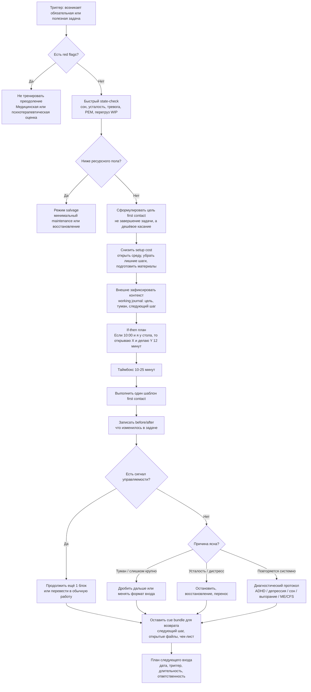

# Системная настройка рабочего контура практики преодоления для первого контакта

## Executive summary

Наблюдаемый феномен лучше всего описывать не как "лень" и не как единый "дефицит дофамина", а как селективный сбой инициации при неблагоприятном балансе "ожидаемая отдача контроля - цена входа - задержка пользы - цена переключения/настройки - доступный ресурсный пол". В норме человек избегает лишнего когнитивного труда, потому что умственное усилие субъективно дорого; это показано в парадигмах effort discounting и моделях opportunity cost. Но когда к высокой цене усилия добавляются низкая ожидаемая управляемость, отложенная награда, плохая сохранность контекста и слабая внешняя опора, система начинает пропускать "интересное и быстро окупаемое" и блокировать "обязательное, скучное и отложенно полезное". Именно такой паттерн согласуется с Expected Value of Control, cognitive effort discounting, Temporal Motivation Theory и современными моделями когнитивного offloading. citeturn22search0turn22search3turn0search12turn0search1turn23search0turn17search0

В литературе почти нет самостоятельной, стандартизованной школы под названием "first contact", но есть очень близкие операционализации: graded task assignment и activity scheduling в behavioral activation, implementation intentions, progress monitoring, intention offloading, task-resumption cues и дизайн среды через дефолты и снижение friction costs. Их общая идея одна: не "сделать задачу целиком", а перевести ее из режима абстрактной угрозы в режим дешевого, конкретного, обратимoго первого касания. Самая практичная формула, которая хорошо выдерживает научную проверку, звучит так: сначала уменьшить лишнюю цену входа, затем сделать очень малый запуск, затем оставить внешние следы для возобновления. citeturn15search16turn1search1turn1search2turn1search7turn8search2turn17search0turn17search17turn17search3

Для инженерной практики это означает: строить рабочий контур вокруг "первого контакта", а не вокруг абстрактной силы воли. Для клинической границы это означает: если недоступность полезных действий становится глобальной, длительной, ухудшает базовое функционирование, сопровождается ангедонией, стойкой усталостью, нарушениями сна/аппетита, выраженной тревогой, признаками ADHD, депрессивным эпизодом, выгоранием или post-exertional malaise, вопрос перестает быть вопросом только продуктивности. Особенно важно не путать обычную aversive-task procrastination с ME/CFS, где даже небольшое физическое или умственное усилие может вызывать отсроченное ухудшение состояния; это требует медицинской логики pacing, а не тренировки преодоления. citeturn19search1turn19search3turn2search1turn2search0turn19search2turn19search5turn19search8turn28search5turn28search3

Практический вывод строгий. "Тренировать преодоление" полезно только для той части входной платы, которая действительно является нормальной ценой запуска. Но системное решение почти всегда трехкомпонентное: уменьшить setup cost и потери контекста; встроить быстрый сигнал результата; ограничить первый блок так, чтобы он был посилен и оставлял дешевый след для повторного входа. При депрессии и выраженной апатии evidence strongest у behavioral activation; при проблемах перевода намерения в действие - у implementation intentions и progress monitoring; при высоких costs of remembering/returning - у external reminders, intention offloading и cue-based resumption aids. Для body doubling и household batching данные пока заметно слабее: они многообещающи, но прямых RCT для обычной взрослой knowledge work-популяции практически нет. citeturn1search1turn1search2turn21search2turn1search7turn14search18turn17search0turn17search6turn24search0turn24search4

## Карта механизма рабочего контура первого контакта

Рабочий контур первого контакта удобно понимать как последовательность из шести слоев. Первый слой - базовая оценка "стоит ли вообще сейчас запускать контроль". Модель Expected Value of Control предполагает, что система распределяет контроль в зависимости от ожидаемой выгоды, цены усилия и вероятности, что контроль действительно изменит исход. Это хорошо объясняет, почему интересная задача, дающая новизну, быстрый feedback и высокую субъективную компетентность, "проходит", а обязательная полезная задача без немедленного сигнала - "не проходит". citeturn22search0turn22search3turn6search1turn6search0

Второй слой - собственно субъективная цена усилия. Парадигмы COG-ED показали, что люди систематически дисконтируют награду, требующую большего когнитивного труда; эта цена зависит и от нагрузки, и от индивидуальных различий. Opportunity-cost model дополняет это тем, что переживание "умственного усилия" можно трактовать как сигнал конкурирующих выгод: текущая задача удерживает ресурсы, которые могли бы быть пущены на что-то более rewarding. Поэтому "интересно исследовать" и "невозможно заполнить скучную административную форму" не противоречат друг другу: первая задача окупает цену контроля прямо сейчас, вторая - нет. citeturn13view0turn0search1turn22search1turn22search13

Третий слой - временная структура награды. Temporal Motivation Theory и исследования temporal discounting показывают, что мотивационная ценность резко падает, когда полезный результат отложен, а альтернатива доступна сразу. Это особенно важно для бытового обслуживания среды, refactoring, борьбы с "долгом обслуживания" и прочих задач, где выигрыш обычно не ощущается как положительный event, а только как исчезновение будущей проблемы. Именно поэтому "разобрать чемоданы", "пополнить чай", "исправить ручку двери" часто проигрывают короткому cognitively interesting behavior. citeturn0search2turn23search0turn23search1turn23search2turn31search0

Четвертый слой - контекст и цена возврата. Решение "сделаю позже" оказывается гораздо дороже, если система не сохраняет внешнюю точку продолжения. Исследования intention offloading и task resumption consistently показывают, что внешние напоминания и cues улучшают выполнение отложенных намерений, а interruption/resumption без cue bundle увеличивает resumption lag. Для knowledge work это означает, что working journal, сохранение последнего состояния, "следующий проверяемый шаг" и минимальные checklists - не просто удобства, а прямые инструменты снижения цены входа. citeturn17search0turn9search12turn17search6turn17search17turn17search3turn10search22

Пятый слой - состояние организма и клинические модуляторы. Sleep deprivation, mental fatigue и allostatic load уменьшают доступность контроля, а не только субъективное настроение. Depression и anhedonia связаны со снижением willingness to expend effort for reward; ADHD - с delay discounting, delay aversion и трудностями executive control; burnout характеризуется истощением, цинизмом и снижением профессиональной эффективности, хотя как отдельный диагноз концепт debated; ME/CFS принципиально отличается тем, что даже малое усилие может провоцировать delayed symptom worsening. Это и есть главная граница, где инженерия продуктивности должна уступать медицине и психотерапии. citeturn3search2turn3search0turn3search1turn2search6turn4search1turn27search0turn27search1turn28search5turn28search3turn19search2turn19search5turn19search8

Шестой слой - привычка, дефолт и среда. Behavior repeats more automatically in stable contexts; progress monitoring работает лучше, когда запись физически фиксируется или становится публичной; defaults reliably меняют поведение, хотя эффект зависит от домена и заметно слабее, когда от человека требуется длительное последующее effortful enactment. Отсюда инженерный вывод: first contact должен быть встроен в предсказуемые контексты, ограниченный WIP, видимые статусы и maintenance blocks, а не зависеть от случайной волны вдохновения. citeturn14search7turn8search2turn14search18turn8search0turn16search12

## Схема рабочего контура

Ниже дана синтетическая схема рабочего контура первого контакта. Это не "клинический алгоритм", а инженерный каркас, собранный из evidence по behavioral activation, implementation intentions, progress monitoring, intention offloading, resumption cues и клинических red flags. citeturn1search1turn1search7turn14search18turn17search0turn17search17turn19search3turn2search1turn19search8

Ключевой критерий продолжения здесь не "мне понравилось", а "после первого контакта цена следующего входа стала ниже". Если после 10-25 минут задача стала конкретнее, появился край, появились симптомы/гипотезы/следующий шаг, а уровень дистресса не ушел вверх, то контур сработал. Если ясность не выросла или вырос только дистресс, нужен не акт дополнительного продавливания, а переразметка задачи, снижение setup cost или triage на клинические причины. Это хорошо согласуется и с behavioral activation, и с literature on resumption cues and cognitive offloading. citeturn15search16turn1search1turn17search0turn17search17turn17search6

## Таблицы evidence-base

### Механизм, проявление, проверка, интервенция, доказательность

| Механизм | Как проявляется | Как быстро проверить | Что помогает | Доказательность |
|---|---|---|---|---|
| Нормальная экономия усилия | Интересные и лёгкие по входу задачи идут; скучные и отложенно полезные слабо тянут, но после старта становятся доступнее | Спросить: "Если я уже начал, дальше легче?" | Уменьшение цены входа, таймбокс, immediate progress signal | Умеренная: сильная механистическая база по effort cost и effort discounting, но прямых клинических протоколов мало. citeturn13view0turn22search1turn18search12 |
| Низкая ожидаемая ценность контроля | Возникает "отмена" при мысли о большом и мутном объёме; задача ощущается как дорогая и слабо управляемая | Спросить: "Какой конкретный исход изменит мой следующий шаг?" Если ответа нет, EVC низок | Формулировка first contact, one-next-testable-step, visible before/after | Умеренная: обзорные и вычислительные модели, хорошая концептуальная поддержка, но мало RCT именно на EVC-интервенции. citeturn22search0turn22search3turn22search13 |
| Present bias и temporal discounting | Немедленно доступное интересное поведение легко побеждает важное, но отложенное | Сравнить: "Если бы польза была сегодня, задача бы пошла?" | Ближние подцели, промежуточные дедлайны, immediate rewards, precommitment | Высокая для механизма, умеренная для интервенций: TMT, time discounting, исследования дедлайнов и immediate rewards согласованы. citeturn23search0turn23search1turn31search0turn26search1turn26search8 |
| Прокрастинация как краткосрочная регуляция настроения | Задача неприятна уже при мысли о ней; избегание даёт мгновенное облегчение, но ухудшает будущее состояние | Спросить: "Мне стало лучше сейчас, но хуже по отношению к задаче?" | Эмоционально нейтральный first contact, graded tasks, внешняя отчётность | Высокая для общей модели, умеренная для переноса в конкретные рабочие практики. citeturn0search2turn30search5turn30search23turn30search10 |
| Потеря контекста и высокая цена возврата | "Не хочу открывать эту задачу, потому что придётся заново разбираться" | Измерить: сколько минут уходит просто на восстановление контекста | Working journal, next-action note, cue bundle, сохранение состояния | Умеренная: intention offloading и task-resumption литература надёжна, но mostly laboratory/HCI. citeturn17search0turn17search6turn17search17turn17search3 |
| Высокий setup cost | Само открытие среды, подготовка инструментов, поиск ссылок уже убивает запуск | Список обязательных шагов до первого содержательного действия > 3-5 | One-click entry, чек-листы setup, подогретая среда, автоматизация | Умеренная: прямые данные по reminder-setting effort и defaults, плюс сильная indirect support из human factors. citeturn17search6turn16search0turn8search0turn29search14 |
| Executive dysfunction / ADHD-подобный профиль | Инициация, удержание порядка шагов и возврат к скучным делам особенно трудны; instant reward тянет сильнее | ASRS как скрининг, developmental history, функциональный ущерб; не ставить диагноз по productivity-паттерну | Внешняя структура, краткий старт, reminders, body doubling, formal assessment | Высокая для механизма ADHD, низкая-умеренная для body doubling. citeturn2search1turn2search0turn27search0turn27search1turn5search2turn24search0turn24search4 |
| Депрессивная анергия / ангедония | Недоступны не только обязательные дела, но и обычно приятные вещи; энергия, концентрация, сон, аппетит меняются | PHQ-9, двухнедельная динамика, ангедония, снижение общего функционирования | Behavioral activation, клиническая оценка, psychotherapy/medication as indicated | Высокая для red flags и BA; не путать с бытовой прокрастинацией. citeturn19search1turn19search3turn5search0turn2search6turn1search1turn1search2 |
| Mental fatigue, sleep loss, allostatic load | Задачи кажутся "дорогими" в целом, контроль менее устойчив, мелкие решения утомляют | Sleep diary, Epworth, длительность восстановления, накопленный стресс | Сон, управление нагрузкой, уменьшение WIP, перенос трудных стартов на лучшее время | Высокая для sleep/fatigue как факторов; умеренная для персонализированного протокола. citeturn3search2turn5search3turn3search0turn3search1 |
| Burnout | Истощение, дистанцирование от работы, цинизм, падение профэффективности | Контекст именно рабочий; отличать от депрессии и общесоматических причин | Снижение хронической перегрузки, отдых, организационные изменения, оценка депрессии | Умеренная для occupational phenomenon, низкая для burnout как самостоятельного нозологического синдрома. citeturn28search5turn28search3turn28search0 |
| Learned helplessness / низкая ожидаемая действенность | "Что бы я ни сделал, это не важно"; пассивность сильнее после повторных неудач или неконтролируемых условий | Проверить историю неконтролируемых провалов и общую генерализацию "ничего не меняется" | Возврат controllability, very small wins, доказуемые причинные шаги | Умеренная: сильная теоретическая и нейробиологическая база, но перенос в everyday productivity требует аккуратности. citeturn6search2turn6search6 |
| ME/CFS / post-exertional malaise | Даже небольшой умственный или физический effort вызывает отсроченное ухудшение на часы-дни | Спросить про delayed crash 12-48 часов, unrefreshing sleep, cognitive impairment, длительность > 6 недель/месяцев | Не тренировать преодоление; pacing; медицинская диагностика | Высокая для red flags и management boundary. citeturn19search2turn19search5turn19search8turn3search3 |

### Практические шаблоны first-contact

| Шаблон | Таймбокс | Мини-чек-лист | Что записать в working journal | Когда это лучший вариант | Evidence |
|---|---|---|---|---|---|
| Диагностический касательный вход | 10-15 мин | Открыть объект работы; выписать 3 наблюдаемых симптома/препятствия; назвать 1 самый вероятный слой проблемы | "Что не так", "что уже известно", "один следующий тест" | Техническая задача, сильный туман, сильная отмена при виде объёма | Indirect, но сильный: graded tasks + resumption cues + offloading. citeturn15search16turn17search0turn17search17 |
| Один слой среды | 10 мин | Убрать только одну категорию: бельё, документы, зарядки, посуда, мусор | "Какой шум убран", "что осталось", "следующий слой" | Чемоданы, стол, кухонные хвосты, clutter | Indirect, moderate: activity scheduling, habit formation, cues. citeturn15search5turn14search7turn8search2 |
| If-then старт | 2-3 мин на план + 10-20 мин на выполнение | Формула: "Если X, то я делаю Y в месте Z в течение N минут" | Точный триггер, место, длительность, первый шаг | Когда намерение есть, а переход в действие срывается | Высокая для перевода намерения в действие. citeturn1search7turn21search27turn14search21 |
| Поведенческая активация малого шага | 10-20 мин | Выбрать одну meaningful activity; сделать её в упрощённой версии; оценить mood/mastery | До/после по шкале 0-10: энергия, напряжение, мастерство | При анергии, депрессивной инерции, потере ритма | Высокая: RCT и обзоры BA. citeturn1search1turn1search2turn21search2 |
| Публично зафиксированный прогресс | 5 мин setup + 10-25 мин работа | Выбрать партнёра/канал; объявить micro-goal; после блока сделать report | Что обещал, что сделал, что дальше | Когда нужна external accountability | Умеренная: progress monitoring лучше работает при публичности. citeturn14search18turn8search2 |
| Body doubling session | 25 мин | Договориться о присутствии; сформулировать одну простую цель; убрать социальную болтовню | Выполнен ли запуск; помогла ли сама присутствующая фигура | Простые, повторяемые, aversive, но не слишком cognitively novel tasks | Низкая-умеренная: survey/HCI evidence; direct RCT почти нет. Для сложных задач возможны costs due social facilitation. citeturn24search0turn24search4turn24search24 |
| Maintenance block | 20-30 мин | Только maintenance backlog; без больших проектов; 3 мелких хвоста максимум | Было, стало, что теперь не будет ломаться | Пополнение расходников, мелкий ремонт, профилактика clutter | Прямых RCT на household batching не найдено; поддержка косвенная через scheduling/defaults/habits. citeturn15search5turn8search0turn14search7 |
| Cue bundle на выходе | 2-5 мин | Оставить открытые артефакты, next-action note, список файлов/команд | "Начать с..." | Всегда после первого контакта | Умеренная, особенно для возврата после прерываний. citeturn17search17turn17search3turn17search0 |

### Системные изменения среды

| Изменение среды | Что делает | Затраты внедрения | Ожидаемый эффект | Границы и evidence |
|---|---|---|---|---|
| Working journal по каждой активной задаче | Сохраняет контекст и следующий шаг, снижает цену возврата | Низкие | Высокий эффект на resumption cost | Сильная косвенная база из intention offloading и resumption literature; прямых RCT на "journal" как брендированную практику нет. citeturn17search0turn17search17turn17search3 |
| Cue bundle на выходе | Делает следующий вход почти механическим | Низкие | Высокий | Хорошо поддержано исследованиями cues after interruption. citeturn17search17turn17search21 |
| Setup checklist для повторяющихся запусков | Убирает лишние решения и память-нагрузку | Низкие | Умеренно высокий | Для knowledge work evidence косвенное; в structured domains checklists работают лучше всего. citeturn29search1turn29search2turn29search14 |
| Default-open workspace | Оставляет IDE/документы/инструменты в готовом состоянии | Средние | Умеренно высокий | Поддерживается логикой defaults и friction-cost; при задачах с длительным ongoing effort эффект не безграничен. citeturn8search0turn16search12turn16search14 |
| WIP-лимит и визуальная доска | Уменьшает конкуренцию между хвостами и видит bottlenecks | Средние | Умеренный | Данные прямее для Kanban/operations, косвеннее для личной self-regulation; nonetheless согласуется с opportunity-cost logic. citeturn0search1turn12image2turn12image4 |
| Scheduled maintenance blocks | Выносит обслуживание среды из режима "когда вдохновит" в режим дефолта | Низкие | Умеренный | Прямых RCT по family/household maintenance scheduling почти нет; поддержка косвенная. citeturn15search5turn14search7 |
| Автоматические reminders и повторяющиеся события | Снимают prospective-memory burden | Низкие | Умеренно высокий | Хорошая база по intention offloading; эффективность падает, если сам reminder слишком трудоёмок или игнорируется. citeturn17search0turn17search6turn16search17 |
| Visible before/after | Возвращает задаче немедленный signal gain | Низкие | Умеренный | Прямых RCT на этой технике не найдено; supported indirectly by progress monitoring literature. citeturn14search18turn8search2 |
| External accountability cadence | Делает успех/неуспех социально наблюдаемым | Низкие-средние | Умеренный | Эффект варьирует; лучший для запуска и завершения простых/среднеструктурированных задач. citeturn14search18turn24search4 |
| Body doubling room / virtual coworking | Уменьшает одиночное сопротивление запуску | Средние | Низкий-умеренный и контекст-зависимый | Перспективно, но пока evidence слабее, чем у implementation intentions or BA. citeturn24search0turn24search17 |

Для книги подойдут два типа иллюстраций: before/after рабочей среды и схемы визуального управления работой. Их важно пометить как "иллюстративные примеры среды", а не как scientific evidence. Ниже - подходящие визуальные референсы из открытых веб-источников. citeturn12image1turn12image2turn12image4turn12image7

iturn12image1turn12image2turn12image4turn12image7

## Диагностический и внедренческий протокол

Практический протокол лучше строить в двух независимых ветках: сначала triage "можно ли вообще тренировать first contact", затем 30-дневный пилот внедрения. На triage-этапе сначала исключают red flags. Если есть длительная усталость, глобальное падение функционирования, ангедония, нарушения сна или аппетита, стойкая тревога, подозрение на ADHD, профессиональное истощение с выраженным цинизмом или признаки PEM после небольших усилий, сначала нужна клиническая оценка. Для первичного скрининга в самоотчёте разумны PHQ-9, GAD-7, ASRS и ESS, но они не заменяют диагноз; по NICE и WHO решение о лечении должно опираться на полноценную клиническую оценку. citeturn5search0turn5search1turn5search2turn5search3turn19search3turn2search1turn19search1turn19search2turn19search5

Если red flags нет или они не доминируют, следующая задача - различить механизм срыва запуска. Практически это делается четырьмя вопросами. "Если бы задача уже была открыта и начата, стало бы легче?" - отделяет высокую цену входа от глобальной недоступности. "Что именно изменит мой следующий шаг?" - проверяет expected controllability. "Что в этой задаче даёт немедленную отдачу, а что только отложенную?" - проверяет temporal discounting. "Сколько шагов нужно сделать до первого содержательного действия?" - проверяет setup cost. Такая короткая функциональная диагностика лучше, чем разговор о чертах характера, потому что она связывает ощущение "отмены" с изменяемыми элементами контура. citeturn22search0turn13view0turn23search0turn17search6

30-дневный пилот в семье или организации имеет смысл строить как small-scale operations experiment. На входе выбирают 3-5 типов регулярно зависающих задач: одна техническая, одна бытовая, одна maintenance-задача, одна административная и одна "долг обслуживания среды". Для каждой задачи вводится один и тот же минимальный протокол: first-contact goal, таймбокс 10-25 минут, working journal/карточка, before/after signal, next-action cue. Раз в неделю делают не общий morale meeting, а review дефектов контура: где слишком высок setup cost, где пропала контекстная нить, где дефолт среды тянет к отвлечению, где задача на самом деле требует клинического triage, а не дисциплины. Такая логика ближе к human factors, чем к self-blame. citeturn29search14turn17search0turn17search3turn14search18

Метрики пилота должны быть операциональными. Базовые четыре метрики: доля задач, по которым состоялся first contact в течение 24-48 часов после триггера; среднее время до первого касания; субъективная цена входа по шкале 0-10 до и после; доля задач, по которым оставлен resumption cue. Полезны и две метрики среды: количество maintenance-хвостов в открытом списке и среднее число шагов setup до первого содержательного действия. Если через 30 дней time-to-first-contact падает, cue compliance растёт, а субъективная цена входа сокращается хотя бы на 1-2 пункта, контур работает. Если нет - проблема, вероятно, не в "недостатке воли", а в неверной диагностике механизма, завышенном WIP или медицинской границе. citeturn8search2turn14search18turn17search0turn17search17

Ролевая ответственность в семье или организации должна быть минимальной, иначе accountability превращается в дополнительную угрозу. Один человек отвечает за шаблоны first contact, один - за визуальную доску/WIP и maintenance schedule, один - за review метрик. В семье достаточно общего правила: "мы не спорим о характере, мы ищем, где дорогой вход и как его удешевить". В организациях стоит добавить правило escalations: если задача трижды не проходит first contact, её нельзя просто сильнее давить; её нужно перевести в review на предмет scope, controllability, setup cost и ownership. Для трудных и эмоционально нагруженных задач полезно вводить body doubling или публичный микрорепорт, но не как обязательный стандарт для всех. citeturn14search18turn24search0turn24search4

Когда направлять на медико-психологическую помощь, а не донастраивать контур: если трудности инициации почти генерализованы; если раньше интересные действия тоже были доступны, а теперь и они исчезли; если есть депрессивные симптомы более двух недель; если выраженно нарушены сон, аппетит, энергия или концентрация; если есть история ADHD-симптомов с детства и устойчивый функциональный ущерб; если утомление непропорционально и сопровождается delayed crash; если выгорание привязано именно к рабочему контексту и сопровождается цинизмом и снижением профэффективности. В этих случаях инженерные практики остаются поддержкой, но не должны masquerade as treatment. citeturn19search1turn19search3turn2search1turn2search0turn19search2turn19search5turn28search5

## Рекомендации для Учебника

Для "Учебника по когнитивному инженерству" я бы добавил отдельный раздел не про "силу воли", а про "рабочий контур первого контакта". Его центральный тезис: сбой запуска почти всегда происходит не в момент исполнения, а в момент первичной оценки задачи как слишком дорогой, слишком туманной или слишком малоокупаемой. Это позволяет связать уже существующие ваши рамки - цена усилия, ресурсный пол, WIP, порог мобилизации, восстановление и долг обслуживания среды - в один единый operational loop. Хорошее название главы: "Первый контакт как объект инженерии" или "Цена входа и контур запуска". citeturn22search0turn13view0turn23search0turn17search0

Структурно в эту главу стоит включить четыре подмодуля, но без превращения её в клинический учебник. Первый - "модели": EVC, effort discounting, opportunity cost, temporal discounting, SDT, curiosity и mood-regulation view of procrastination. Второй - "инженерные переменные": setup cost, сохранение контекста, cue bundle, visible progress, WIP, maintenance blocks, defaults. Третий - "шаблоны": first-contact templates для кода, переписки, clutter, ремонта, административных хвостов, семейного обслуживания среды. Четвёртый - "границы": когда речь всё ещё о рабочем контуре, а когда уже о депрессии, ADHD, burnout, sleep disorder или ME/CFS. Такое разделение не смешивает бытовую прокрастинацию с клиникой и не превращает весь феномен в нейрохимический миф. citeturn30search5turn6search1turn6search0turn17search0turn19search3turn2search1turn19search8

Лучшие примеры для книги - не абстрактные лозунги, а контрастные пары. Например: "надо улучшить механизм проксирования" против "открыть текущую схему, выписать три симптома нестабильности, назвать один слой вероятной причины". Или: "разобрать чемоданы" против "вынуть только грязное бельё и зарядки". Или: "починить всю среду" против "двадцатиминутный maintenance block по трём хвостам". Такие пары хорошо демонстрируют разницу между задачей как комом и задачей как first-contact object. Визуально полезны две схемы: рисунок контура first contact и таблица "лишняя цена входа / полезная цена входа / разрушительная цена входа". citeturn15search16turn17search0turn19search8

Отдельно стоит вставить разворот с шаблонами. Один шаблон для technical diagnosis, один для environment maintenance, один для emotional avoidance, один для family protocol. В каждом шаблоне должны быть четыре строки: триггер, минимальный таймбокс, stop-rule, запись на выходе. Это лучше, чем глава про "преодоление", потому что переводит разговор из морализаторства в операционный дизайн. Если нужна одна обобщающая формула для страницы-шпаргалки, то она может звучать так: "Не завершай задачу. Сначала удешеви следующий вход". Эта формула полностью согласуется с evidence по progress monitoring, implementation intentions и cue-based resumption. citeturn14search18turn1search7turn17search17

## Библиография

Ниже - ядро первоисточников, которого уже достаточно для серьёзной главы и стартовой book-length библиографии. Оценка доказательности дана по практической GRADE-подобной шкале: A - высокая, B - умеренная, C - низкая, D - очень низкая/поисковая.

- Shenhav A, Botvinick MM, Cohen JD. The expected value of control: An integrative theory of anterior cingulate cortex function. Neuron. 2013;79(2):217-240. DOI: 10.1016/j.neuron.2013.07.007. PMID: 23889930. PMCID: PMC3767969. Оценка: B для прикладного контурного дизайна, A для теоретической модели. citeturn22search0turn22search3turn22search6

- Westbrook A, Kester D, Braver TS. What Is the Subjective Cost of Cognitive Effort? Load, Trait, and Aging Effects Revealed by Economic Preference. PLoS One. 2013;8(7):e68210. DOI: 10.1371/journal.pone.0068210. PMCID: PMC3725698. Оценка: A для effort discounting. citeturn13view0

- Kurzban R, Duckworth A, Kable JW, Myers J. An opportunity cost model of subjective effort and task performance. Behav Brain Sci. 2013;36(6):661-679. DOI: 10.1017/S0140525X12003196. PMID: 24304775. PMCID: PMC3856320. Оценка: B. citeturn0search1turn0search4

- Steel P. The nature of procrastination: a meta-analytic and theoretical review of quintessential self-regulatory failure. Psychol Bull. 2007;133(1):65-94. DOI: 10.1037/0033-2909.133.1.65. PMID: 17201571. Оценка: A. citeturn0search2turn0search11

- Steel P, König CJ. Integrating theories of motivation. Academy of Management Review. 2006;31:889-913. DOI: 10.5465/AMR.2006.22527462. Оценка: B. citeturn23search0

- Frederick S, Loewenstein G, O'Donoghue T. Time discounting and time preference: A critical review. J Econ Lit. 2002;40(2):351-401. DOI: 10.1257/002205102320161311. Оценка: A. citeturn23search1

- Ariely D, Wertenbroch K. Procrastination, deadlines, and performance: self-control by precommitment. Psychol Sci. 2002;13(3):219-224. DOI: 10.1111/1467-9280.00441. PMID: 12009041. Оценка: A для precommitment/deadlines. citeturn31search0turn31search2

- Zhang PY et al. Temporal discounting predicts procrastination in the real world. Sci Rep. 2024. DOI/PMID см. по статье издателя. Оценка: B. citeturn23search2

- Gollwitzer PM, Sheeran P. Implementation intentions and goal achievement: A meta-analysis of effects and processes. Adv Exp Soc Psychol. 2006;38:69-119. DOI: 10.1016/S0065-2601(06)38002-1. Оценка: A. citeturn1search7turn14search17

- Sheeran P, Webb TL, et al. Does monitoring goal progress promote goal attainment? A meta-analysis of the experimental evidence. Psychol Bull. 2016;142(2):198-229. DOI: 10.1037/bul0000025. PMID: 26479070. Оценка: A. citeturn8search2turn14search18

- Lally P, van Jaarsveld CHM, Potts HWW, Wardle J. How are habits formed: Modelling habit formation in the real world. Eur J Soc Psychol. 2010;40:998-1009. DOI: 10.1002/ejsp.674. Оценка: B. citeturn14search7turn14search11

- Jachimowicz JM, Duncan S, Weber EU, Johnson EJ. When and why defaults influence decisions: a meta-analysis of default effects. Behav Public Policy. 2019;3(2):159-186. DOI см. у издателя. Оценка: A для default effects, B для effortful post-default tasks. citeturn8search0turn16search12

- Gilbert SJ, Boldt A, et al. Outsourcing memory to external tools: A review of "intention offloading". Trends Cogn Sci. 2023. PMID: 35789477. PMCID: PMC9971128. Оценка: B. citeturn17search0turn9search12

- Chiu G, Gilbert SJ. Influence of the physical effort of reminder-setting on strategic intention offloading. Q J Exp Psychol. 2024. DOI: 10.1177/17470218231199977. PMID: 37642279. PMCID: PMC11103908. Оценка: B. citeturn16search0turn17search6turn16search5

- Altmann EM, Trafton JG. Task interruption: Resumption lag and the role of cues. Proc CogSci. 2004. Оценка: B. citeturn17search17

- Parnin C, Rugaber S. Resumption strategies for interrupted programming tasks. Software Qual J. 2011;19:5-34. DOI: 10.1007/s11219-010-9104-9. Оценка: B для knowledge-work resumption. citeturn17search3turn17search19

- Dimidjian S et al. Randomized trial of behavioral activation, cognitive therapy, and antidepressant medication in the acute treatment of adults with major depression. J Consult Clin Psychol. 2006. PMID: 16881773. Оценка: A. citeturn1search2turn14search0

- Uphoff E et al. Behavioural activation therapy for depression in adults. Cochrane Database Syst Rev. 2020. PMID: 32628293. Оценка: A, но с оговоркой о низкой/умеренной certainty части сравнений. citeturn1search1turn1search19

- Cuijpers P et al. Individual behavioral activation in the treatment of depression. Psychother Res. 2023. PMID: 37068380. Оценка: A-. citeturn21search2turn21search10

- A-Tjak JGL et al. A meta-analysis of the efficacy of acceptance and commitment therapy for clinically relevant mental and physical health problems. Psychother Psychosom. 2015. PMID: 25547522. Оценка: B. citeturn21search0turn21search12

- Woolley K, Fishbach A. It's About Time: Earlier Rewards Increase Intrinsic Motivation. J Pers Soc Psychol. 2018;114(6):877-890. DOI: 10.1037/pspa0000116. PMID: 29771568. Оценка: B. citeturn26search1turn26search10turn26search8

- Clay G et al. Rewarding cognitive effort increases the intrinsic value of mental labor. Proc Natl Acad Sci USA. 2022;119(5):e2111785119. DOI: 10.1073/pnas.2111785119. PMID: 35101919. PMCID: PMC8812552. Оценка: B. citeturn25search2turn25search7turn26search13

- Ryan RM, Deci EL. Self-determination theory and the facilitation of intrinsic motivation, social development, and well-being. Am Psychol. 2000;55:68-78. PMID: 11392867. Оценка: B/A как макротеория мотивации. citeturn6search1turn6search5

- Kidd C, Hayden BY. The psychology and neuroscience of curiosity. Neuron. 2015. PMID: 26539887. PMCID: PMC4635443. Оценка: B. citeturn6search0turn6search4

- Ryan RM, Frederick CM. On Energy, Personality, and Health: Subjective Vitality as a Dynamic Reflection of Well-Being. J Pers. 1997. PMID: 9327588. Оценка: B. citeturn4search3turn4search15

- Boksem MAS, Tops M. Mental fatigue: Costs and benefits. Brain Res Rev. 2008;59(1):125-139. DOI: 10.1016/j.brainresrev.2008.07.001. PMID: 18652844. Оценка: B. citeturn3search0turn3search8

- Lim J, Dinges DF. A meta-analysis of the impact of short-term sleep deprivation on cognitive variables. Psychol Bull. 2010;136(3):375-389. PMID: 20438143. PMCID: PMC3290659. Оценка: A. citeturn3search2turn3search18

- McEwen BS. Stress, adaptation, and disease. Allostasis and allostatic load. Ann N Y Acad Sci. 1998;840:33-44. PMID: 9629234. Оценка: B. citeturn3search1turn3search17

- Faraone SV et al. The World Federation of ADHD International Consensus Statement: 208 Evidence-based conclusions about the disorder. Neurosci Biobehav Rev. 2021;128:789-818. PMID: 33549739. PMCID: PMC8328933. Оценка: A. citeturn2search0turn2search12

- NICE. Attention deficit hyperactivity disorder: diagnosis and management. NG87. Last reviewed 2025. Официальное руководство. Оценка: A для clinical boundary. citeturn2search1turn2search5

- Jackson JNS, MacKillop J. Attention-Deficit/Hyperactivity Disorder and Monetary Delay Discounting: A Meta-Analysis of Case-Control Studies. Biol Psychiatry Cogn Neurosci Neuroimaging. 2016. PMID: 27722208. PMCID: PMC5049699. Оценка: A. citeturn27search0turn27search3

- Willcutt EG et al. Validity of the executive function theory of ADHD: A meta-analytic review. Biol Psychiatry. 2005;57:1336-1346. DOI: 10.1016/j.biopsych.2005.02.006. PMID: 15950006. Оценка: A-. citeturn27search1turn27search20

- Treadway MT et al. Effort-based decision-making in major depressive disorder. J Abnorm Psychol. 2012. PMID: 22775583. PMCID: PMC3730492. Оценка: A- для механизма. citeturn2search6turn2search2

- WHO. Depression fact sheet. 2025. Также доступна русскоязычная версия. Официальный источник по симптомам, лечению и red flags. Оценка: A для public-health boundary. citeturn19search1turn11search13

- WHO. Burn-out an occupational phenomenon in ICD-11. Официальная позиция WHO: burnout не классифицируется как заболевание. Оценка: A для boundary statement. citeturn28search5turn2search3

- Bianchi R, Schonfeld IS. Examining the evidence base for burnout. Bull World Health Organ. 2023;101(11):743-745. DOI: 10.2471/BLT.23.289996. PMID: 37961064. PMCID: PMC10630726. Оценка: B. citeturn28search3turn28search0

- CDC. ME/CFS Basics; Clinical Overview; Strategies to Prevent Worsening of Symptoms. 2024. Официальные страницы по PEM и pacing. Оценка: A. citeturn19search2turn19search5turn19search8

- NICE. Myalgic encephalomyelitis/chronic fatigue syndrome: diagnosis and management. NG206. 2021. Оценка: A. citeturn3search3

- Noetel M et al. Effect of exercise for depression: systematic review and network meta-analysis of randomised controlled trials. BMJ. 2024;384:e075847. DOI: 10.1136/bmj-2023-075847. PMID: 38355154. Оценка: A- для adjunctive intervention, не для замены диагностики. citeturn20search0turn20search1turn20search4

- Eagle T, Baltaxe-Admony L, Ringland KE. An Investigation of Body Doubling with Neurodivergent Participants. ACM Trans Comput-Hum Interact. 2024. DOI: 10.1145/3689648. Оценка: C. citeturn24search0turn24search8

- Bond CF, Titus LJ. Social facilitation: a meta-analysis of 241 studies. Psychol Bull. 1983;94(2):265-292. PMID: 6356198. Оценка: B для механизма присутствия других; перенос на body doubling требует осторожности. citeturn24search4turn24search24

- Ngai C et al. Metacognitive training facilitates optimal cognitive offloading. 2026. PMCID: PMC12982714. Оценка: C, но очень перспективное направление для будущих интервенций по first contact. citeturn18search1turn16search21

- Escobar GG et al. A systematic review of effort discounting research in humans. Judgm Decis Mak. 2025. Оценка: B и полезный современный обзор для расширения главы. citeturn18search12

Из русскоязычных источников, пригодных для книги как опорные, но не как основное evidence ядро, полезны: русскоязычная страница WHO о депрессии и обзорные публикации по МЭ/СХУ; однако целевых русскоязычных RCT или сильных систематических обзоров именно по "первому контакту" и инженерии запуска задач мне в найденном массиве не встретилось. Для ядра книги опираться лучше на англоязычные первичные исследования и официальные руководства, а русскоязычные материалы использовать для мостиковых объяснений и приложений. citeturn11search13turn11search3turn11search11
