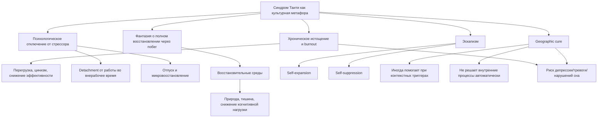
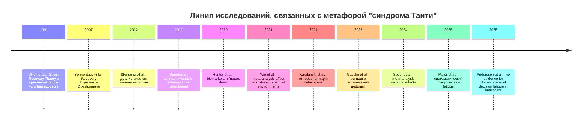

# Синдром Таити как культурная метафора и ее научные аналоги в психологии

## Executive summary

"Синдром Таити" не является признанным научным термином, диагнозом или нозологией в ICD-11, DSM-5, WHO, PubMed-индексируемых обзорах по выгоранию и современной психологии труда. В реальности это лучше понимать как культурную метафору: фантазию о том, что "другое место" само по себе радикально восстановит психику, вернет смысл, снимет хроническое напряжение и обнулит внутренние конфликты. Ближайший реальный аналог этой метафоры - не один синдром, а кластер явлений: выгорание, затрудненное психологическое отключение от работы, иногда избегающее совладание и вера в "geographic cure", то есть в исцеляющую силу переезда или бегства из текущего контекста. citeturn37view0turn31view6turn13view8turn9search9

Самые сильные эмпирические основания имеют не идеи "волшебного побега", а исследования выгорания, восстановления после работы и восстановительных сред. WHO определяет burnout как синдром хронического рабочего стресса, который не был успешно преодолен, и подчеркивает, что он относится именно к профессиональному контексту, а не ко всем сферам жизни. Мета-анализы показывают, что психологическое отключение от работы связано с меньшей усталостью, а интервенции, повышающие detachment, дают небольшой, но надежный эффект. Отпуск и контакт с природой в среднем действительно улучшают самочувствие, но эффект обычно умеренный и не равен лечению причины. citeturn37view0turn32view5turn13view1turn11search0turn31view2turn31view3

Понятие decision fatigue частично пересекается с метафорой "синдрома Таити", но как научный аналог оно заметно слабее и более спорно. Современный систематический обзор в медицине нашел, что лишь около 45% количественных проверок гипотезы о decision fatigue дают значимые эффекты, при этом определения и операционализация крайне неоднородны. Крупное preregistered исследование на реальных медицинских решениях вообще не нашло убедительных доказательств доменно-общего эффекта decision fatigue. Аналогично, известная линия ego depletion пережила серьезный репликационный кризис. citeturn31view1turn32view0turn12search11turn12search17

Главный практический вывод такой: если под "синдромом Таити" понимать состояние "мне кажется, что только побег куда-то далеко спасет меня", то наиболее вероятная реальность - это сочетание истощения, перегруженности, плохого detachment и избегающе-эскапистского мышления. Научно обоснованные ответы - не романтизация бегства, а снижение хронических требований, восстановление сна и границ, изменение роли и нагрузки, когнитивно-поведенческие интервенции, а при выраженной симптоматике - дифференциальная диагностика депрессии, тревоги, расстройств сна, зависимости и других состояний. citeturn37view0turn23search1turn35search1turn20search2turn27search8

## Определение метафоры

В аналитическом смысле "синдром Таити" удобно определить как метафору идеализированного "иного места", где субъект рассчитывает получить не просто отдых, а почти магическое внутреннее исправление: "уеду - и мне станет хорошо", "сменю декорации - и исчезнут истощение, пустота, цинизм, тяжелые мысли". В научной литературе именно такого термина нет; ближайший язык описания - "occupational burnout", "psychological detachment", "escapism" и folk/recovery-термин "geographic cure". WHO не использует "синдром Таити", а burnout определяет строго как феномен хронического рабочего стресса, не применимый автоматически к остальной жизни. citeturn37view0turn31view6

В этой рамке "Таити" - не география как таковая, а символ обещания простоты, мягкости, дистанции от требований и возможности "начать заново". Это делает метафору двуслойной. Первый слой реалистичен: дистанция от стрессора, отпуск, сон, природа, снижение информационной нагрузки действительно могут улучшать состояние. Второй слой иллюзорен: если источники проблемы встроены в паттерны мышления, хронический режим работы, дефицит контроля, конфликты ролей, депрессивную симптоматику или зависимость, то одна смена места обычно не решает вопроса полностью. Именно поэтому recovery-литература относится к "geographic cure" скорее как к ограниченной или ложной универсализации. citeturn11search0turn31view2turn31view3turn9search9turn31view6

Ниже - схема понятийной связи между метафорой и ее научными аналогами. Это синтетическая модель на основе обзоров по burnout, detachment, escapism и restorative environments. citeturn37view0turn13view1turn32view5turn13view8turn31view2

## Реальные научные аналоги

Наиболее близкий и хорошо валидизированный аналог - burnout. WHO в ICD-11 описывает его тремя измерениями: истощение, ментальная дистанция/цинизм в отношении работы и снижение профессиональной эффективности; при этом подчеркивает, что речь идет об occupational phenomenon, а не о медицинском диагнозе и не о любой жизненной усталости. Это важно: "синдром Таити" как метафора может включать более широкую жизненную дезадаптацию, тогда как burnout формально уже и жестче привязан к работе. citeturn37view0

Второй важный аналог - psychological detachment, то есть способность ментально выключаться из работы во внерабочее время. Мета-анализы показывают, что detachment является существенным recovery-процессом, связанным с меньшей усталостью и формируемым рабочими требованиями, ресурсами и привычками контакта с работой после окончания дня. Если человек не может "выйти из головы" и ему кажется, что только перелет на другой край мира заставит мозг замолчать, это часто описывается именно языком нарушенного detachment, а не особого "экзотического синдрома". citeturn32view5turn13view1turn15search0

Третий аналог - restorative environments, прежде всего природные среды. Здесь идея метафоры частично подтверждается данными: контакт с природой действительно связан с лучшим аффектом, меньшим стрессом и частичным восстановлением внимания. Но это поддерживающее, а не магическое действие. Даже хорошие мета-анализы сообщают о существенной гетерогенности и риске bias, поэтому природу стоит понимать как ресурс восстановления, а не как прямой эквивалент "переезда в рай". citeturn31view2turn31view3turn30search1turn16search0

Эскапизм - еще один полезный аналог, но он двоякий. Современная линия исследований различает как минимум два мотива: self-expansion, когда человек ищет новизну, рост и положительный опыт, и self-suppression, когда он пытается заглушить неприятные эмоции, самокритику и стресс. "Синдром Таити" как метафора нередко колеблется между этими полюсами: в здоровом варианте это тяга к восстановлению и обновлению, в нездоровом - избегающее "лишь бы не чувствовать это здесь и сейчас". citeturn34search2turn34search13turn13view8

Наконец, "geographic cure" - это не стандартный психиатрический construct, а язык recovery-сообщества и клинической культуры вокруг зависимости и бегства от проблем через перемену места. Он полезен как метафорический мост к "синдрому Таити", но не как строгая диагнозоподобная категория. При этом литература по контекстным cue в зависимости показывает важный нюанс: смена окружения иногда реально уменьшает триггеры и может помогать, но не потому, что "новое место исцеляет", а потому, что меняется контекст, доступность вещества, социальные нормы и cue-reactivity. citeturn9search9turn10search1turn10search2turn10search13

### Сравнение понятий

| Термин | Определение | Типичные признаки | Методы измерения | Типичные вмешательства | Статус аналога для "синдрома Таити" | Источник |
|---|---|---|---|---|---|---|
| Burnout | Синдром хронического рабочего стресса, не успешно управляемого | Истощение, цинизм/ментальная дистанция, снижение эффективности | MBI/MBI-GS, BAT | Снижение нагрузки, рост контроля и поддержки, комбинированные person + organization interventions | Самый сильный аналог, но только в рабочем контексте | citeturn37view0turn36search19turn36search7turn35search1 |
| Decision fatigue | Переход к менее усиливающим, более простым решениям по мере накопления бремени выбора | Склонность к дефолтам, эвристикам, консервативным решениям | Нет единого "золотого стандарта"; чаще time-on-task и последовательности решений | Упрощение рабочих потоков, перерывы, протоколы решений | Частичный, но спорный аналог | citeturn31view1turn32view0 |
| Psychological detachment | Ментальное отключение от работы во внерабочее время | Неспособность перестать думать о работе, вечерняя руминация | Recovery Experience Questionnaire, шкалы detachment | Границы, отключение after-hours связи, mindfulness/CBT, redesign workload | Очень близкий механизмный аналог | citeturn13view1turn32view5turn15search8 |
| Restorative environments | Среды, способствующие восстановлению внимания и снижению стресса | Улучшение аффекта, субъективное "отпускание", снижение напряжения | Аффективные шкалы, cortisol/HRV, nature-dose protocols | Природа, зеленые маршруты, короткие "nature breaks" | Аналог ресурса восстановления, не диагноза | citeturn31view2turn31view3turn31view4 |
| Escapism | Уход в деятельность ради self-expansion или self-suppression | Фантазирование о "другой жизни", избегание чувств, погружение в отвлекающую активность | Escapism Scale: self-expansion/self-suppression | Разбор мотивации, CBT/ACT, развитие активного копинга | Близок как описание мотива "бежать", не как синдром | citeturn34search2turn34search13turn13view8 |
| Geographic cure | Вера, что перемена места сама по себе решит внутреннюю проблему | Идеализация переезда/отпуска как универсального лекарства | Стандартизированного измерения нет | Работа с триггерами, поддержка, изменение контекста плюс внутренняя работа | Самый прямой культурный аналог, но не валидированный clinical construct | citeturn9search9turn9search19turn10search13 |

## Эмпирическая база

Сильнее всего под метафору "синдрома Таити" подходят данные о восстановлении, а не о "побеге". Мета-анализ по отпуску показал, что отпуск в среднем улучшает благополучие сотрудников с небольшим, но надежным эффектом около d = 0.25; при этом дальнейшее увеличение длительности отпуска не означает автоматической максимизации эффекта, а после возвращения наблюдается fade-out. То есть "уехать" действительно полезно, но в среднем это временное восстановление, а не исправление всей системы причин. citeturn11search0turn11search6

По detachment картина более прикладная. Интервенции, специально направленные на улучшение психологического отключения от работы, в мета-анализе дали средний положительный эффект d = 0.36; более длинные и более "дозированные" программы работали лучше. Более ранний мета-анализ antecedents/outcomes показал, что job demands уменьшают detachment, ресурсы его поддерживают, а вовлеченность в рабочие активности в нерабочее время имеет среднюю по размеру отрицательную связь с detachment. citeturn13view1turn32view5

Исследования восстановительных сред подтверждают, что "маленькое Таити" иногда можно построить локально, без эмиграции. Мета-анализы показывают, что контакт с природой связан с ростом positive affect и снижением negative affect, а также со снижением показателей стресса; при этом исследования неоднородны и часто неидеальны по качеству. В полевом biomarker-исследовании urban nature dose ассоциировалась со снижением salivary cortisol примерно на 21% в час и alpha-amylase примерно на 28% в час. citeturn31view2turn31view3turn30search1turn31view4

С другой стороны, decision fatigue как эквивалент "я настолько перегружен, что мне нужно исчезнуть" имеет гораздо менее устойчивую доказательную базу. Систематический обзор в healthcare-контексте нашел, что значимые эффекты были примерно в 45% количественных тестов, но одновременно отметил непоследовательные определения и слабую операционализацию. Большое preregistered field study на телефонном медицинском триаже в Швеции не обнаружило доказательств доменно-общего decision fatigue. А известная программа ego depletion не смогла воспроизвести ожидаемый эффект в крупной preregistered multilab replication. citeturn31view1turn32view0turn12search11turn12search17

Для burnout есть более устойчивые данные: систематический обзор и meta-analysis по cognitive burnout показали небольшие или малые-умеренные дефициты по нескольким когнитивным доменам, включая эпизодическую память, рабочую память, executive function и внимание/скорость обработки. Это важно для метафоры "Таити": желание "исчезнуть" может быть не романтической мечтой, а субъективным ответом на реальное когнитивное истощение. При этом обзор о статусе burnout как mental disorder подчеркивает, что доказательства пока не позволяют считать burnout самостоятельным психическим расстройством. citeturn30search0turn6search14turn31view6

### Ключевые исследования и обзоры

| Авторы, год | Метод | Выборка | Основные выводы | Источник |
|---|---|---:|---|---|
| Wendsche, Lohmann-Haislah, 2017 | Мета-анализ antecedents/outcomes detachment | Множественные выборки | Job demands снижают detachment, job resources повышают; after-hours work activities средне отрицательно связаны с detachment | citeturn32view5 |
| Karabinski et al., 2021 | Мета-анализ интервенций на detachment | 30 исследований, 34 интервенции, N = 3725 | Интервенции улучшают detachment в среднем на d = 0.36; большая длительность и доза лучше | citeturn13view1 |
| Speth, Wendsche, Wegge, 2024 | Мета-анализ отпусков | 13 исследований, N = 1428 | Отпуск улучшает well-being, но эффект умеренный и частично угасает после возвращения | citeturn11search0turn11search6 |
| Yao et al., 2021 | Систематический обзор и meta-analysis affect | 20 исследований, 9 стран | Nature exposure повышает positive affect (SMD = 0.61) и снижает negative affect (SMD = -0.47), но гетерогенность высокая | citeturn31view2 |
| Yao et al., 2021 | Мета-анализ stress reduction | 31 исследование, 12 стран | Контакт с природой снижает стресс, но качество части исследований невысокое | citeturn31view3 |
| Hunter et al., 2019 | Полевое biomarker-исследование "nature dose" | Взрослые городские жители | "Nature experience" ассоциировался со снижением cortisol на 21%/ч и amylase на 28%/ч | citeturn31view4 |
| Gavelin et al., 2022 | Систематический обзор и multivariate meta-analysis | 17 исследований, 176 effect sizes | Clinical burnout связан с небольшим, но значимым снижением общей когнитивной продуктивности | citeturn30search0turn6search14 |
| Maier et al., 2025 | Preregistered systematic review decision fatigue | 82 исследования | Только около 45% количественных тестов находят эффект; определения и операционализация неоднородны | citeturn31view1 |
| Andersson et al., 2025 | Registered report, field data | Крупные высокоразрешенные реальные данные triage | Не найдено evidence for decision fatigue как общего эффекта | citeturn32view0 |
| Bes et al., 2023 | Meta-analysis organizational burnout interventions | 21 study estimate | Общий эффект небольшого снижения exhaustion, качество доказательств очень низкое | citeturn20search2 |

Ниже - упрощенная временная линия, показывающая, как развивались ключевые линии, связанные с метафорой "синдрома Таити". Это синтетическая визуализация по основным обзорам и landmark studies. citeturn4search2turn34search2turn26search0turn32view5turn13view1turn11search0turn31view1turn32view0

## Механизмы

Если перевести метафору "Таити" на язык механизмов, то ядро выглядит так: хронические demands и недостаток recovery истощают способность префронтальных систем поддерживать top-down control, а повторяющийся стресс создает физиологическое "wear and tear", часто описываемое через allostatic load. Обзоры по нейробиологии стресса показывают, что acute uncontrollable stress повышает catecholamine release в PFC, что ухудшает рабочую память, внимание и executive control; хронический стресс дополнительно ослабляет префронтальные сети и смещает поведение в сторону более эмоциональных и привычных реакций. citeturn33search2turn33search3turn33search5turn25search0turn25search1

Именно поэтому субъективное желание "сбежать на Таити" можно интерпретировать как попытку резко уменьшить входящий поток требований и восстановить когнитивную управляемость. Это не просто романтическая фантазия: при burnout наблюдаются measurable cognitive impairments, а высокий allostatic load ассоциируется с хроническим стрессом и симптомами burnout. Но это же объясняет ограниченность простого переезда. Если не снижаются сами demands, не восстанавливаются сон и границы и не меняются coping-стратегии, система после короткого улучшения часто вновь входит в тот же цикл. citeturn6search14turn25search2turn11search0

Для восстановительных сред предполагаются два базовых механизма. Первый - stress reduction: безопасная и неугрожающая природная среда быстрее снижает физиологическое возбуждение и негативный аффект. Второй - attention restoration: природа дает "soft fascination", позволяя directed attention восстановиться после перегрузки. Современные meta-analyses в целом поддерживают оба направления, но также показывают высокую гетерогенность и неидеальное качество исследований. citeturn4search2turn31view2turn30search1

В области эскапизма механизм зависит от мотива. Self-expansion может временно работать как адаптивное самообновление - новизна, mastery, positive affect. Self-suppression ближе к избеганию: человек не решает проблему, а глушит доступ к неприятным переживаниям. В контексте "синдрома Таити" это ключевое различие. Не вся тяга к отъезду патологична; патологизируется не сам побег, а его функция - развитие или подавление. citeturn34search2turn34search13turn13view8

## Клинические и прикладные последствия

С точки зрения диагностики "синдром Таити" лучше использовать не как ярлык, а как клинический сигнал. Если жалоба выглядит как "мне нужен только остров/переезд/полное исчезновение, иначе я развалюсь", первичный вопрос - что именно требует escape: рабочая перегрузка, отсутствие detachment, депрессивная симптоматика, тревога, бессонница, зависимость, травматические триггеры или межличностный конфликт. WHO прямо ограничивает burnout рабочим контекстом, а обзор по концептуальному статусу burnout подчеркивает нехватку четких differential criteria и биопсихосоциальной уникальности. citeturn37view0turn31view6

Для скрининга уместны разные инструменты под разные гипотезы. При подозрении на burnout обычно используют MBI/MBI-GS или BAT; для detachment - Recovery Experience Questionnaire; для эскапизма - Escapism Scale с различением self-expansion и self-suppression. Для decision fatigue единого надежного стандартного инструмента нет, что само по себе отражает концептуальную незрелость области. citeturn36search19turn36search7turn13view1turn34search2turn31view1

Интервенции с наибольшей эмпирической поддержкой имеют гораздо менее "кинематографический" вид, чем мечта о Таити. Для индивида это, прежде всего, восстановление detachment: ограничение after-hours email и связи, выделение переходных ритуалов "выхода из работы", сон, регулярные короткие паузы и локальные restorative practices, включая контакт с природой. Для выраженного выгорания эффективнее комбинированные подходы, где person-directed and organization-directed меры идут вместе: индивидуальная работа с копингом и одновременно изменение job control, social support и stressors на рабочем месте. citeturn13view1turn35search1turn20search2turn27search8

Для организаций выводы однозначны. Нельзя перекладывать проблему на сотрудника через идею "тебе просто нужен отпуск". Отпуск полезен, но временно; более надежные результаты дают организационные меры, уменьшающие перегрузку и after-hours intrusions, а также повышающие контроль, поддержку и предсказуемость. В RCT-обзоре по врачебному burnout эффекты вмешательств были статистически значимы лишь в некоторых доменах и клинически, вероятно, невелики; это говорит не о бесполезности помощи, а о том, что маленькие индивидуальные программы не могут компенсировать большие системные причины. citeturn11search0turn28view0turn28view1turn35search1turn20search2

Практически это означает следующее. Для человека: если отдых помогает только на дни, а затем все быстро возвращается, проблема, вероятно, находится не только в дефиците отпуска, но и в структуре повседневной нагрузки и способе совладания. Для организации: если сотрудники систематически мечтают "просто исчезнуть", это не HR-мелочь, а возможный индикатор хронически неуправляемого demand-recovery imbalance. citeturn11search0turn32view5turn27search8

## Ограничения и открытые вопросы

Прямой эквивалент "синдрома Таити" в научной психологии не установлен. Это аргументированный вывод, а не доказанная идентичность: имеется сильная литература по соседним construct, но нет общепринятого диагностикума, который бы называл именно такую комбинацию фантазии о побеге, истощения и идеализации "другого места" отдельным синдромом. Кроме того, burnout сам по себе остается спорным в нозологическом смысле: WHO признает его occupational phenomenon, но не medical condition, а современные концептуальные обзоры считают преждевременным вводить burnout как самостоятельное психическое расстройство. citeturn37view0turn31view6

Decision fatigue особенно требует осторожности. В массовой культуре и управленческом языке этот термин почти стал аксиомой, но научная база сейчас неоднородна: много ретроспективных observational-паттернов, мало строгих preregistered проверок, много свободы интерпретации. Поэтому использовать decision fatigue как центральное объяснение "синдрома Таити" нельзя; максимум - как одну из возможных частных компонент перегруженности. citeturn31view1turn32view0turn12search11

Открытый вопрос касается и самого "побега". Есть данные, что контекст действительно влияет: более зеленая среда, временная дистанция от требований и смена cue-окружения могут заметно помогать. Есть даже работы, где переезд в более зеленые районы связан с улучшением mental health. Но пока слабо понятно, для кого именно "внешняя смена контекста" является частью решения, а для кого - лишь продленной отсрочкой внутренней проблемы. citeturn8search15turn31view2turn10search13

## Ключевые ссылки

Ниже - компактный список самых полезных и самых "несущих" источников. Для статей с DOI указан DOI; для документов WHO используйте кликабельную ссылку в цитате.

- WHO. ICD-11 definition of burnout as occupational phenomenon; burnout is not classified as a medical condition. citeturn37view0
- Nadon L., De Beer L.T., Morin A.J.S. 2022. Should Burnout Be Conceptualized as a Mental Disorder? DOI: 10.3390/bs12030082. citeturn31view6
- Wendsche J., Lohmann-Haislah A. 2017. A Meta-Analysis on Antecedents and Outcomes of Detachment from Work. DOI: 10.3389/fpsyg.2016.02072. citeturn32view5
- Karabinski T. et al. 2021. Interventions for Improving Psychological Detachment From Work. DOI: 10.1037/ocp0000280. citeturn13view1
- Bennett A.A. et al. 2018. Recovery from work-related effort: a meta-analysis. DOI: 10.1002/job.2217. citeturn15search0
- Speth F., Wendsche J., Wegge J. 2024. We Continue to Recover Through Vacation! DOI: 10.1027/1016-9040/a000518. citeturn11search0
- Yao W. et al. 2021. Impact of Exposure to Natural and Built Environments on Positive and Negative Affect. DOI: 10.3389/fpubh.2021.758457. citeturn31view2
- Yao W. et al. 2021. The effect of exposure to the natural environment on stress reduction: A meta-analysis. DOI: 10.1016/j.ufug.2020.126932. citeturn31view3
- Hunter M.C.R. et al. 2019. Urban Nature Experiences Reduce Stress in the Context of Daily Life Based on Salivary Biomarkers. DOI: 10.3389/fpsyg.2019.00722. citeturn31view4
- Gavelin H.M. et al. 2022. Cognitive function in clinical burnout: A systematic review and meta-analysis. DOI: 10.1080/02678373.2021.2002972. citeturn30search0turn6search14
- Maier M. et al. 2025. Systematic review of the effects of decision fatigue in healthcare professionals on medical decision-making. DOI: 10.1080/17437199.2025.2513916. citeturn31view1
- Andersson D. et al. 2025. No evidence for decision fatigue using large-scale field data from healthcare. DOI: 10.1038/s44271-025-00207-8. citeturn32view0
- Arnsten A.F.T. 2015. Stress weakens prefrontal networks: molecular insults to higher cognition. DOI: 10.1038/nn.4087. citeturn33search2
- Guidi J. et al. 2021. Allostatic Load and Its Impact on Health: A Systematic Review. DOI: 10.1159/000510696. citeturn25search1

Взвешенное заключение: в нашей реальности "синдром Таити" лучше всего трактовать не как самостоятельный синдром, а как культурную метафору, описывающую пересечение burnout, дефицита detachment, потребности в восстановительных средах и иногда избегающе-эскапистской надежды на "geographic cure". Наиболее точные и научно опирающиеся аналоги здесь - burnout и impaired psychological detachment; restorative environments и отпуск могут быть полезной частью решения, но не его полным эквивалентом. citeturn37view0turn13view1turn32view5turn31view2turn31view3turn11search0