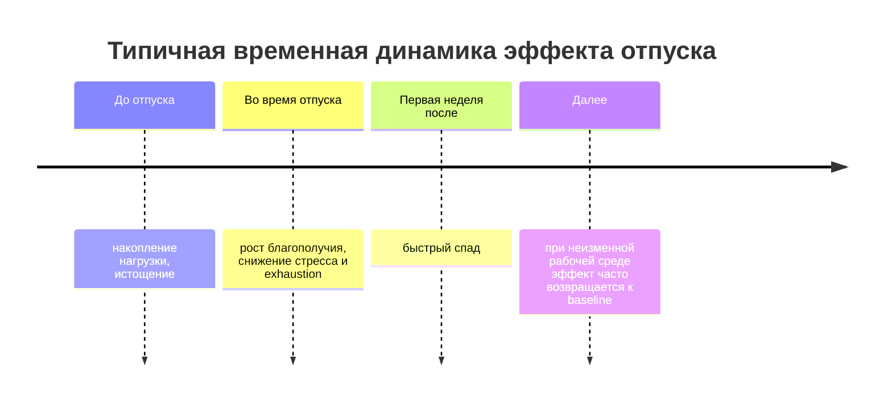
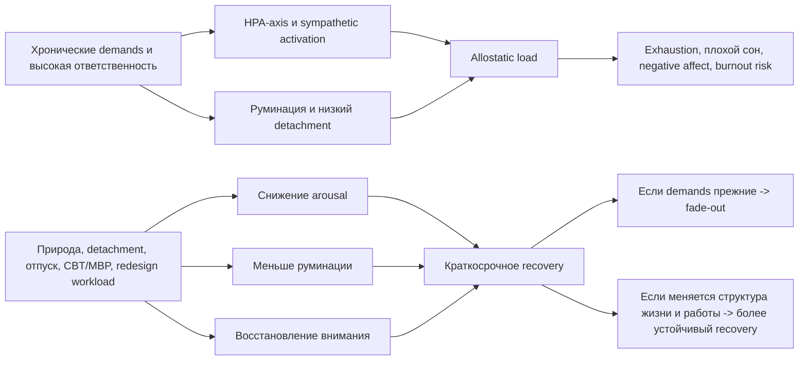

# Восстановление от хронического стресса и феномен "синдрома Таити"

## Executive summary

- В научной психологии и медицине "синдром Таити" не существует как официальный диагноз. Но сама идея хорошо узнаваема: это тяга к среде с низкими требованиями, малым числом решений и высокой восстановительной силой. Ее лучше всего описывают пересекающиеся конструкции хронического стресса, allostatic load, burnout, psychological detachment и restorative environments. Термин "geographic cure" близок к этому мотиву, но в клинической литературе он обычно означает ошибочную надежду, что одних лишь перемен места достаточно для решения внутренних проблем. citeturn0search4turn26view1turn26view2turn13search14

- Наиболее надежные эмпирические данные показывают не "магический" эффект бегства, а небольшие или умеренные улучшения от конкретных механизмов восстановления: контакта с природой, психологического отключения от работы, отпусков и стресс-менеджмент интервенций. Для природы эффекты наиболее устойчивы по аффекту и некоторым физиологическим показателям; для отпусков и detachment эффекты реальны, но часто быстро угасают после возвращения к прежним нагрузкам. citeturn16search0turn16search5turn14view0turn22view2turn24view2turn1search5

- Механистически восстановление выглядит как частичное разведение трех процессов: снижение нейроэндокринной и вегетативной активации, ослабление руминации и "персеверативного" мышления, восстановление направленного внимания. Хронический стресс действует в обратную сторону: поддерживает HPA-axis и автономную активацию, нарушает кортизоловый ритм, ухудшает сон и мешает психическому "выходу" из стрессора. citeturn18search9turn11search7turn11search3turn27search5turn27search3turn0search2

- Практический вывод строгий и не очень романтичный: устойчивое восстановление обычно требует не только "Таити", а изменения структуры повседневной жизни - нагрузки, границ, рабочей среды, режима восстановления и иногда терапии. Иначе отпуск, ретрит или переезд нередко дают лишь временное облегчение. citeturn10search22turn4search14turn10search12turn22view2turn13search14

## Введение и метод поиска

Под "синдромом Таити" в этом отчете понимается поп-культурная метафора: желание выйти из среды хронических требований и ответственности в сторону более простой, предсказуемой и психофизиологически восстановительной среды. В научной литературе эта тяга не описывается как единый синдром; вместо этого она распадается на изучаемые компоненты - хронический стресс и allostatic load, burnout, усталость от постоянных решений, дефицит psychological detachment, а также эффекты restorative environments. citeturn26view1turn26view2turn0search4turn12search0turn8view5turn0search2turn0search7

Для подготовки отчета был проведен целевой поиск по WHO, PubMed, Cochrane, PLOS Medicine, Annual Reviews, ScienceDirect, Frontiers и ряду университетских репозиториев. Приоритет отдавался мета-анализам, систематическим обзорам, официальным определениям и классическим первичным статьям по ART, Stress Recovery Theory и allostasis. Ниже я отдельно отмечаю, где данные сильные, а где литература остается неоднородной или спорной.

## Ключевые определения и модели

Ниже - рабочие определения, которые лучше всего переводят метафору "Таити" на язык науки.

| Понятие | Научно точное значение | Что это значит для "синдрома Таити" |
|---|---|---|
| Хронический стресс | Длительное воздействие стрессоров, поддерживающее продолжительную физиологическую и психологическую активацию, в отличие от краткого острого стресса. Ключевые системы - HPA-axis и autonomic nervous system. citeturn18search18turn18search9 | Не "один плохой день", а режим жизни, в котором организм плохо возвращается к базовой линии. |
| Allostasis | "Стабильность через изменения": адаптивная перенастройка систем организма под требования среды. citeturn28search1turn28search11 | Способ выживания под нагрузкой. |
| Allostatic load | Кумулятивная многосистемная биологическая dysregulation или "износ" мозга и тела при повторяющейся цене адаптации к стрессу. Консенсус по измерению пока неполный. citeturn26view1turn26view2turn20search1 | Когда "держаться" становится физиологически дорого. |
| Burnout | В ICD-11 - occupational phenomenon, возникающий из хронического рабочего стресса, с истощением, дистанцированием/цинизмом и снижением профессиональной эффективности. Это не общая медицинская болезнь и не термин для всех сфер жизни. citeturn0search4turn0search0 | Типичный контекст для фантазии "уйти туда, где от меня ничего не требуют". |
| Decision fatigue | Тенденция к менее effortful, более пассивным или импульсивным решениям по мере накопления бремени решений. Но большие теории ego depletion и "общего иссякающего ресурса" получили неоднозначную поддержку и слабую репликацию. citeturn12search0turn12search9turn12search1turn12search19 | "Таити" как мечта о мире с минимальным числом решений. |
| Psychological detachment | Умственное отключение от работы во внерабочее время: не делать рабочие задачи и не продолжать их мысленно. citeturn8view5turn5view2 | Не просто быть вне офиса, а действительно выйти из роли. |
| Restorative environments | Среды, помогающие восстановлению внимания и/или снижению стресса; природные среды здесь наиболее изучены. ART подчеркивает восстановление directed attention, SRT - быстрый аффективно-физиологический stress recovery. citeturn0search2turn0search7 | "Таити" как пространство низкой когнитивной и аффективной цены. |
| Geographic cure | Неформальный термин из клиническо-психотерапевтической и аддиктологической литературы: вера, что личные дилеммы можно решить одним переездом. citeturn13search14 | Темная сторона метафоры: спутать смену места с решением проблемы. |

Теоретически феномен держится на четырех взаимодополняющих моделях. ART у Каплана объясняет восстановление через отдых directed attention в средах с "мягким захватом" внимания; SRT у Ульриха - через быструю аффективную и вегетативную разрядку в безопасных, предпочитаемых, часто природных сценах. Модель allostasis/allostatic load описывает цену хронической адаптации. Модели recovery from work, особенно stressor-detachment model, показывают, что самые перегруженные люди одновременно больше нуждаются в восстановлении и хуже его достигают; это и называют recovery paradox. citeturn0search2turn0search7turn26view1turn26view2turn8view5turn2search12

Важно и то, что allostatic load - не идеально стандартизированный показатель. IPD-мета-анализ 2023 года прямо отмечает, что конструкт широко используется, но measurement varies widely across studies; при этом даже более короткие индексы могут предсказывать жесткие исходы вроде смертности почти не хуже длинных батарей. citeturn26view2turn11search11

## Эмпирические данные

По данным мета-анализов, природа дает наиболее последовательные краткосрочные эффекты по настроению и аффекту. В мета-анализе Yao и коллег контакт с природной, а не застроенной средой повышал positive affect и снижал negative affect, но с высокой гетерогенностью. Более старый обзор Bowler также пришел к выводу, что у природы есть прямые положительные эффекты на эмоциональное самочувствие, особенно по снижению негативных эмоций. Однако по когнитивным исходам картина сложнее: мета-анализ 2025 года по attention restoration нашел в среднем преимущество природы для overall cognitive capacity, но эффекты были небольшими, гетерогенными и наиболее надежными лишь для working memory и attentional control; максимальная разница чаще наблюдалась примерно около 30 минут экспозиции. Систематический обзор 2025 года тоже описывает по cognition и stress более смешанные результаты, чем по mood. citeturn16search5turn16search0turn14view0turn14view1

По физиологии есть умеренно убедительные краткосрочные данные. Мета-анализ по forest therapy показал снижение systolic blood pressure на 3.44 мм рт. ст. и diastolic blood pressure на 3.07 мм рт. ст. у городских жителей. Систематический обзор и мета-анализ Antonelli и коллег показал более низкий salivary cortisol после forest bathing по сравнению с urban exposure, а отдельные экспериментальные работы находят, что сама ходьба в лесу снижает salivary cortisol больше, чем ходьба в городской среде. Это поддерживает физиологическую часть SRT, но все же в основном для краткосрочной разрядки, а не для долговременного "лечения" хронического стресса. citeturn17search5turn17search6turn17search0turn17search14

С отпуском данные надежны, но прозаичны. Обновленный мета-анализ 2024 года нашел улучшение employee well-being с маленьким средним эффектом d = 0.25; заметнее менялись positive affect, negative affect, stress и exhaustion, а life satisfaction почти нет. Ключевой результат: после первой пост-отпускной недели значимые отличия от доотпускного уровня уже не обнаруживались. Более ранний мета-анализ 2009 года оценивал общий эффект отпуска как d = 0.43 и fade-out после возвращения как d = -0.38. Отдельные лонгитюдные исследования также показывали пик благополучия во время отпуска и быстрое возвращение к baseline в первую неделю или в пределах месяца. citeturn22view2turn6search16turn23search4turn23search17

При этом литература по отпускам не полностью закрыта: мета-анализ 2025 года пришел к более оптимистичной оценке, сообщив о большем эффекте и более медленном fade-out, чем считалось раньше. Самый осторожный вывод здесь такой: отпуск работает, но точная величина и длительность эффекта чувствительны к тому, какие исследования включать, как измерять well-being и что именно люди делают во время отпуска. citeturn23search0turn22view2

Psychological detachment выглядит одним из самых центральных механизмов. Мета-анализ Wendsche и Lohmann-Haislah показал, что detachment связан с меньшим exhaustion, лучшим well-being и sleep, а по физиологическим индикаторам данных пока мало и они не дали надежного среднего эффекта. Отдельный мета-анализ интервенций сообщил, что программы, специально улучшающие detachment, дают средний положительный эффект d = 0.36; более длинные и "дозированные" вмешательства работают лучше, а люди с исходными нарушениями восстановления выигрывают больше. Это очень близко к научной версии "Таити": не исчезнуть навсегда, а реально выйти из role-related mental load. citeturn24view2turn24view3turn1search5

Снижение нагрузки решений как отдельное направление изучено хуже, чем природа или detachment. Концептуально decision fatigue описывает переход к более пассивным и менее effortful решениям по мере накопления decision burden, и в healthcare это выглядит правдоподобно. Но широкая теория ego depletion, на которой исторически строилась часть объяснений, не выдержала крупную preregistered replication. Поэтому тверже всего можно сказать так: высокая плотность решений и самоконтроля действительно переживается людьми как изматывающая, но объяснять ее единым "исчерпывающимся ресурсом" сегодня научно слишком смело. Лучше поддержаны более "экологические" интервенции - уменьшение workload, ограничение прерываний, рутинзация и снижение after-hours demands - чем глобальная теория decision depletion. citeturn12search0turn12search9turn12search1turn12search19

Сильнее всего из не-"пейзажных" интервенций выглядят структурные и психотерапевтические подходы. В классическом мета-анализе occupational stress management programs общий эффект составлял d = 0.526, а cognitive-behavioural interventions имели крупнейший эффект d = 1.164; более современные интернет-форматы CBT для стресса дают controlled effect около d = 0.78. В не-клинических взрослых mindfulness-based programmes по сравнению с отсутствием вмешательства снижают anxiety, depression и distress и слегка повышают well-being. Для burnout организационные интервенции дают в среднем небольшой эффект на exhaustion порядка -0.30, причем combined interventions выглядят лучше, чем чисто индивидуальные. citeturn15search3turn15search12turn15search20turn9view3turn4search14turn10search6turn10search22

Наконец, сама среда проживания тоже имеет значение, но снова не как магия переезда, а как изменение ежедневной нагрузки. Количественные обзоры показывают, что более высокий уровень neighborhood greenspace связан с меньшим риском depression и anxiety, а reviews по allostatic load отмечают связь более качественных и зеленых neighborhoods с более "нормальным" уровнем AL. Это делает "Таити" не только внутренней фантазией, но и частично реальным вопросом environmental exposure. citeturn8view2turn26view3

### Сравнение вмешательств

Сравнивать величины эффектов между разными исходами надо осторожно: где-то используются d/SMD, где-то корреляции r, где-то клинические единицы вроде мм рт. ст.

| Вмешательство | Наиболее надежный исход | Величина эффекта | Типичная длительность | Качество доказательств |
|---|---|---:|---|---|
| Природа / green exposure | Улучшение аффекта | positive affect SMD 0.61; negative affect SMD -0.47, но высокая гетерогенность citeturn16search5 | Краткосрочно, минуты - часы; для хронических исходов слабее | Среднее |
| Forest therapy | BP, cortisol | SBP -3.44 мм рт. ст.; DBP -3.07 мм рт. ст.; cortisol обычно снижается против urban exposure citeturn17search5turn17search6 | Краткосрочно | Среднее |
| Отпуск | Well-being | d = 0.25 в мета-анализе 2024; ранее d = 0.43 citeturn22view2turn6search16 | Часто быстро угасает; в 2024 - без значимых различий после первой недели, но 2025 обзор дает более оптимистичную оценку citeturn22view2turn23search0 | Среднее |
| Psychological detachment interventions | Detachment | d = 0.36 citeturn1search5 | Пока есть практика и границы; долгосрочно зависит от job demands | Среднее |
| CBT / stress-management | Self-rated stress | d = 0.526 overall; CBT d = 1.164 в классическом occupational meta-analysis; iCBT d = 0.78 citeturn15search3turn15search20 | Недели - месяцы; иногда до года citeturn10search12 | Среднее - высокое |
| Mindfulness-based programmes | Distress, anxiety, depression, well-being | anxiety -0.56; depression -0.53; distress -0.45; well-being +0.33 vs no intervention citeturn9view3 | Недели - месяцы | Среднее |
| Organizational redesign | Exhaustion / burnout core | около -0.30 по exhaustion citeturn4search14 | Более устойчиво, если меняет demands, autonomy, schedules | Среднее, но данных пока меньше |
| Смена места как таковая | Нет отдельного надежного recovery effect | Формального pooled effect нет; термин "geographic cure" скорее предупреждающий citeturn13search14 | Часто кратко или непредсказуемо | Низкое |

## Механизмы восстановления

Физиологически хронический стресс удерживает активными HPA-axis и автономную нервную систему. Ключевые звенья - CRH/AVP в гипоталамусе, далее адренокортикальная ось с выбросом cortisol и параллельная sympathetic activation. При длительном напряжении литература описывает не просто "высокий кортизол", а более сложную dysregulation: возможны нарушения циркадного ритма, ослабление negative feedback, измененная immune signaling и накопление multisystem dysregulation, которое и фиксируется концептом allostatic load. Систематические обзоры по biomarkers chronic stress перечисляют cortisol, ACTH, catecholamines, inflammatory markers, glucose/HbA1c и липидные показатели; высокие уровни AL ассоциированы с большей all-cause и cardiovascular mortality. citeturn18search9turn11search3turn21search0turn21search1turn21search7turn11search11

Когнитивно "Таити" - это, вероятно, желание выйти из режима истощенного directed attention и непрерывной руминации. ART предполагает, что направленное внимание восстанавливается в средах, которые не требуют постоянного top-down control и одновременно удерживают внимание "мягко". Современный мета-анализ по attention restoration действительно показывает небольшие, но реальные cognitive benefits природы, особенно по attentional control и working memory, хотя гетерогенность велика. С другой стороны, руминация и worry могут prolong stress-related physiological activation даже после самого стрессора; это одна из лучших причин, почему psychological detachment важен сам по себе. citeturn0search2turn14view0turn27search5turn27search3

Эмоционально и аффективно восстановление обычно идет через снижение negative affect, чувства угрозы и внутреннего напряжения. Природа наиболее стабильно показывает именно это, а не чудесный когнитивный апгрейд. Для detachment картина похожа: меньше exhaustion, лучше sleep, больше well-being. То есть научная версия "Таити" - это не столько про счастье, сколько про временное уменьшение defensive mode. citeturn16search5turn16search0turn24view2turn24view3

Схема выше хорошо согласуется с stressor-detachment model, meta-analytic data по отпуску и с allostasis framework: краткосрочное восстановление возможно довольно быстро, но долговременный эффект требует уменьшения постоянного "стоимости адаптации". citeturn8view5turn22view2turn26view1turn26view2

## Границы и ограничения

Главное ограничение - временной масштаб. Для природы и отпусков большая часть надежных эффектов краткосрочная. Даже там, где настроение, давление или cortisol улучшаются, это не означает автоматического долговременного снижения chronic stress burden. Именно поэтому по allostatic load как outcome интервенций база пока небольшая: в scoping review было всего несколько исследований, и хотя в четырех из пяти interventions AL улучшался уже к 7 неделе, измерения оставались очень неоднородными. citeturn17search5turn22view2turn25search4turn26view2

Второе ограничение - heterogeneity. По природе эффекты для mood стабильнее, чем для cognition или stress biomarkers; по отпускам разные мета-анализы уже дают не вполне одинаковую картину; по burnout сам конструкт полезен, но обсуждается его overlap с depression и широта применения вне работы. По allostatic load тоже нет единого "золотого стандарта" расчета. citeturn14view1turn23search0turn22view2turn10search22turn26view2

Третье - индивидуальные различия. Interventions that improve detachment работают лучше у более старших участников и у людей с исходными health/recovery impairments. Для mindfulness-based programs доказана wide variability between participants. При природных экспозициях модераторами выступают длительность, тип среды, исходная cognitive fatigue и способ измерения результата. Это значит, что один и тот же "Таити" для двух людей может дать очень разный эффект. citeturn1search5turn4search8turn14view0

Четвертое - риск эскапизма и "geographic cure". Клиническая литература использует этот термин именно как предупреждение: personal dilemmas rarely solve themselves simply by moving. Смена места может быть полезной, если она действительно изменяет повседневные стрессоры - например, commute, noise, housing precarity, workplace exposure, доступ к зеленой среде. Но если сохранены work style, rumination, постоянная доступность и несбалансированные требования, то меняется декорация, а не stress process. citeturn13search14turn26view3

## Практические выводы

Самый доказательный подход - перестроить не только "место отдыха", но и архитектуру повседневной нагрузки. Для организаций это означает корректировку workload, control over schedule, защиту внерабочего времени и комбинирование структурных изменений с индивидуальными программами. Именно такой путь согласуется с тем, что организационные интервенции уменьшают exhaustion, а чисто coping-based меры без изменения условий часто дают затухающие эффекты. citeturn4search14turn10search6turn10search22

На уровне человека полезнее всего проектировать detachment как навык и как инфраструктуру: фиксированный ритуал завершения работы, снижение after-hours messaging, отдельные устройства или хотя бы profiles, физическое разделение work/non-work space, планирование "восстановительных" занятий, а не просто пустого времени. Данные по detachment interventions и stressor-detachment model хорошо поддерживают именно эту логику. citeturn1search5turn8view5turn24view2

Природу имеет смысл использовать как регулярную дозу, а не как редкий символический побег. По имеющимся мета-данным разумный pragmatic range - примерно 20-90 минут green activity, а для cognitive restoration наиболее выигрышной часто выглядит экспозиция порядка 30 минут. Если доступа к реальной природе нет, виртуальная природа тоже показывает умеренное снижение stress, anxiety и depression, хотя доказательств там меньше, чем для "настоящей" среды. citeturn8view0turn14view0turn8view9

Отпуска стоит рассматривать как размыкатель sustained stress, а не как единственное средство восстановления. Современный консенсус скорее таков: отпуск полезен, но при возвращении к прежней системе demands benefits frequently fade fast. Поэтому практичнее регулярные короткие паузы и микровосстановление в течение недели, чем ставка на одно большое бегство "раз в год". citeturn22view2turn23search4

Если уже есть выраженные признаки истощения, нарушения сна, сильная тревога или депрессивные симптомы, validated therapy usually stronger than any symbolic "Таити". Для stress reduction и субклинического distress существенно лучше обеспечены evidence-base у CBT и mindfulness-based programmes, чем у любых стратегий "переехать и начать заново". citeturn15search20turn15search3turn9view3turn13search14

## Ключевые ссылки

- WHO. ICD-11 definition of burnout - официальный базовый источник по burnout как occupational phenomenon. citeturn0search4turn0search0
- McEwen BS. Stress, adaptation, and disease: allostasis and allostatic load - классическая постановка рамки allostasis/allostatic load. citeturn28search1turn26view1
- McCrory et al. 2023. Towards a consensus definition of allostatic load - современный IPD-мета-анализ о проблеме измерения AL. citeturn26view2
- Kaplan S. 1995. The restorative benefits of nature - классический текст ART. citeturn0search2
- Ulrich et al. 1991. Stress recovery during exposure to natural and urban environments - классический текст SRT. citeturn0search7
- Wendsche & Lohmann-Haislah 2017. Meta-analysis on detachment from work - центральный источник по detachment и его исходам. citeturn24view2turn24view3
- Karabinski et al. 2021. Interventions for improving psychological detachment from work - мета-анализ интервенций. citeturn1search5
- Speth et al. 2024. Meta-analysis of vacation effects on well-being and fade-out - лучший источник по быстрой динамике отпускного эффекта. citeturn22view2
- Bell et al. 2025. Meta-analysis on nature exposure and attention restoration - аккуратная современная оценка когнитивных эффектов природы. citeturn14view0
- Qiu et al. 2023 и Antonelli et al. 2019 - лучшие компактные обзоры по forest therapy, blood pressure и cortisol. citeturn17search5turn17search0turn17search6
- Richardson & Rothstein 2008 и современные CBT/iCBT обзоры - для stress-management эффекты обычно сильнее, чем у разовых "побегов". citeturn15search3turn15search20
- Moss 1985. Variations on the geographic cure - короткий, но важный источник по самой идее "переезд как ложное решение". citeturn13search14