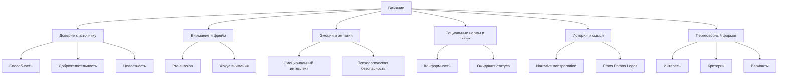
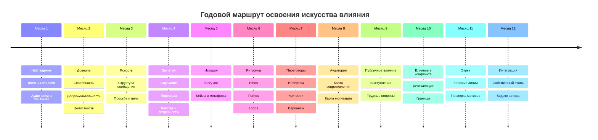

# Материалы для книги об искусстве влияния

## Executive summary

Для сильной книги об искусстве влияния я бы строил корпус не вокруг одного "секрета убеждения", а вокруг трех слоев. Первый слой - наука: социальная психология, теория убеждения, доверие, статус, эмоциональный интеллект, риторика, сторителлинг, переговоры. Здесь ядро составляют первоисточники и классические модели: Cialdini, Kahneman, Petty и Cacioppo, Mayer-Davis-Schoorman, Salovey-Mayer, Fisher-Ury-Patton, а также аристотелевская риторика как исторический фундамент. Второй слой - русскоязычная интерпретация и педагогика: Андреева, Бодалев, Лабунская, современные русскоязычные учебники по риторике и практики ясной коммуникации. Третий слой - реальные кейсы: бизнес, политика, терапия, образование, где влияние проявляется не как "давление", а как сочетание доверия, структуры, смысла, ролевого статуса, эмоциональной точности и уважения к автономии другого человека. citeturn32view12turn33view3turn34view0turn34view2turn39search7turn8search0turn25search0turn29search1turn6search0turn6search9turn6search10turn6search11turn17search2

Главный практический вывод из исследовательского корпуса таков: устойчивое влияние почти никогда не строится только на харизме. Оно строится на способности создавать у другого человека чувство безопасности, ясности и значимости; на умении выбирать правильный момент и правильную рамку; на доверии к источнику; на социальном контексте; на языке, который не ломает волю собеседника, а помогает ему увидеть смысл действия. В научной литературе этому соответствуют модели доверия как готовности к уязвимости, идеи "pre-suasion" и направленного внимания, narrative transportation, а также принципиальные переговоры, которые фокусируются не на победе над человеком, а на работе с интересами и критериями. citeturn33view3turn34view2turn9search0turn8search0turn8search8turn10search7

Для русскоязычной книги это означает следующее. Излагать лучше простым человеческим языком, но опираться на строгую эмпирику; не превращать влияние в "манипуляцию с приемами"; показывать читателю не только вдохновение и кейсы, но и систему тренировок: наблюдение, рефлексию, речевую практику, тренировку эмпатии, переговорные сценарии, работу с голосом и структурой мысли. Именно такая связка - наука, практика, этика, тренировка - даст материал, которого уже достаточно для полноценной книги. citeturn17search2turn21search6turn8search5turn6search3turn6search7

## Каркас исследования и рекомендуемая библиография

Хорошая книга о влиянии должна различать минимум четыре типа источников: первоисточники исследований, классические синтетические книги, русскоязычные академические работы и русскоязычные практические книги. Самая частая ошибка авторов в этой теме - опираться почти исключительно на популярные бестселлеры. Для читателя это удобно, но для книги недостаточно: нужна опора на оригинальные модели доверия, мотивации, изменения установок, narrative persuasion и переговорной логики. citeturn32view12turn9search0turn8search0turn29search8turn10search7

### Базовая библиография для рабочего ядра книги

| Источник | Зачем нужен книге | Основные темы | Для книги приоритет |
|---|---|---|---|
| Robert Cialdini, Influence | Классический каркас принципов социального влияния; нужен как "народная карта" темы | социальные сигналы, согласие, дефицит, авторитет, социальное доказательство | Очень высокий citeturn32view0turn34view0 |
| Robert Cialdini, Pre-Suasion | Дает важнейшую идею: влияние начинается до аргумента, через настройку внимания и контекста | внимание, фрейминг, контекст, подготовка восприятия | Очень высокий citeturn34view2 |
| Daniel Kahneman, Thinking, Fast and Slow | Нужен для главы о когнитивных искажениях и двух режимах мышления | System 1 / System 2, эвристики, ошибки суждения | Очень высокий citeturn39search1turn39search18 |
| Roger Fisher, William Ury, Bruce Patton, Getting to Yes | Лучший каркас для "влияния без силового давления" | интересы, варианты, объективные критерии, BATNA | Очень высокий citeturn8search0turn8search1 |
| Melanie Green, Timothy Brock, The Role of Transportation in the Persuasiveness of Public Narratives | Научное основание для главы о сторителлинге | narrative transportation, погружение, изменение установок | Очень высокий citeturn9search0 |
| Roger Mayer, James Davis, F. David Schoorman, An Integrative Model of Organizational Trust | Ключ к пониманию доверия как основания влияния | уязвимость, способность, доброжелательность, целостность | Очень высокий citeturn33view1turn33view2turn33view3 |
| Peter Salovey, John Mayer, Emotional Intelligence; далее four-branch model | Основа для эмоциональной точности влияющего человека | распознавание, использование, понимание, регуляция эмоций | Высокий citeturn29search0turn29search1turn29search2 |
| Aristotle, Rhetoric | Историческая несущая конструкция книги; хорошо работает в философской и эссеистической части | ethos, pathos, logos, enthymeme | Высокий citeturn25search0turn25search1 |
| Chip Heath, Dan Heath, Made to Stick | Практический мост от науки к "запоминаемости" идей | простота, конкретность, неожиданность, эмоция, история | Высокий citeturn28search0turn28search9 |
| Jonah Berger, Contagious; Invisible Influence | Полезно для глав о поведенческом заражении и социальной передаче идей | вирусность, word of mouth, незримое социальное влияние | Высокий citeturn28search4turn28search19turn28search10 |
| Г. М. Андреева, Социальная психология | Базовый русскоязычный академический фон | общение, взаимодействие, группы, социальное восприятие | Очень высокий для русской версии citeturn6search0turn6search4 |
| А. А. Бодалев, Восприятие и понимание человека человеком | Ключ к теме первого впечатления и межличностного понимания | социальная перцепция, понимание другого, образ партнера | Очень высокий для русской версии citeturn6search9turn6search5 |
| В. А. Лабунская, работы по невербальному поведению | Для главы о языке тела, выражении личности и интерпретации невербальных сигналов | невербалика, интерпретация, социальная перцепция | Высокий citeturn6search10turn6search2 |
| Дзялошинский, Пильгун; Черняк; Зверев и др., учебники по риторике | Русскоязычный учебный аппарат для построения понятной главы по речи и аргументации | структура речи, аргументация, публичное выступление | Высокий citeturn6search11turn6search3turn6search7 |
| Максим Ильяхов, Ясно, понятно | Силен именно как современная русскоязычная практика ясного объяснения | простота речи, смысловая упаковка, понятность | Средне-высокий как прикладной источник citeturn17search2 |
| Игорь Рызов, книги по переговорам | Практический русскоязычный слой, полезный для бытовых и деловых сценариев | переговоры, конфликты, позиции и уступки | Средний как практический источник, не как первоисточник науки citeturn17search0turn17search4 |
| Радислав Гандапас, Камасутра для оратора | Удобен для главы об ораторском мастерстве и сценическом присутствии | публичная речь, контакт, энергия выступления | Средний как практический источник citeturn17search14turn17search11 |

### Как работать с этим корпусом

Лучше разделить рабочую картотеку книги на четыре папки: "доказательства", "истории", "упражнения", "голос автора". В папку "доказательства" попадают академические модели и мета-анализы; в "истории" - речи, кризисные коммуникации, образовательные интервенции и организационные кейсы; в "упражнения" - все, что можно превратить в практику читателя; в "голос автора" - ваши эссе, метафоры, наблюдения и русскоязычные культурные примеры. Такой способ особенно хорош для книги, которая должна быть одновременно вдохновляющей, обучающей и взращивающей. citeturn30search17turn8search5turn21search9

## Ключевые теории влияния

В исследовательском поле влияние выглядит не как единый феномен, а как система пересекающихся каналов: доверие к источнику, когнитивная обработка сообщения, эмоциональное заражение, статус и нормы группы, смысловая рамка, история, а также переговорный формат, в котором сообщение подается. Для книги это удобно: каждая глава может брать один такой канал и показывать, как он работает отдельно, а затем как он соединяется с другими. citeturn10search7turn9search0turn15search0turn8search0turn25search0



Эта схема соответствует крупным ветвям литературы: доверие описывается через модель уязвимости и три компонента trustworthiness; сторителлинг - через transportation; риторика - через ethos, pathos, logos; переговоры - через principled negotiation; статус - через expectation states; а когнитивная обработка сообщения - через dual-process и эвристики. citeturn33view1turn33view2turn33view3turn9search0turn25search1turn8search0turn15search0turn39search18

### Сравнение ключевых теорий и практических следствий

| Теория | Ключевой тезис | Что это значит для книги | Практическое следствие |
|---|---|---|---|
| Социальное влияние у Cialdini | Люди часто отвечают на социальные сигналы автоматически, особенно в условиях когнитивной экономии | Показывать влияние как распознаваемые закономерности, а не магию | Учить читателя видеть социальное доказательство, дефицит, авторитет, взаимность и готовить контекст заранее citeturn34view0turn34view2 |
| Dual-process persuasion | Одни сообщения обрабатываются глубоко, другие - по периферийным признакам | В книге нужно различать "убеждение смыслом" и "убеждение сигналами" | Для важной аудитории усиливать качество аргумента; для перегруженной - упростить структуру и усилить источник и оформление citeturn10search7turn9search18 |
| Kahneman и эвристики | Быстрое мышление экономит ресурсы, но систематически ошибается | Хорошая глава о влиянии должна объяснить, почему люди не всегда решают рационально | Тренировать паузу, перепроверку, контраргументы и дизайн решений, а не только "силу воли" citeturn39search7turn39search18 |
| Trust model | Доверие - это готовность быть уязвимым; его питают способность, доброжелательность и целостность | Книга должна ставить доверие в центр влияния | В каждой важной коммуникации задавать три вопроса: "считают ли меня компетентным?", "верят ли в мои намерения?", "видят ли согласие слов и дел?" citeturn33view1turn33view2turn33view3 |
| Status and expectation states | Люди заранее приписывают другим компетентность и право вести за собой по статусным признакам | Нужно объяснить, почему одни голоса в группе слышнее других | Учить создавать легитимность: через ясность роли, надежность, вклад, полезность и признание других, а не только через доминирование citeturn15search0turn15search4turn15search16 |
| Эмоциональный интеллект | Влияние усиливается, когда человек умеет точно читать и регулировать эмоции | Нужна отдельная глава про чувствительность к состояниям людей | Тренировать эмоциональное называние, саморегуляцию, эмпатическое слушание и точность ответа, а не только харизму citeturn29search1turn15search2turn15search8turn15search11 |
| Аристотелева риторика | Убедительность рождается из доверия к говорящему, эмоциональной настройки аудитории и логики довода | Это идеальный "старший каркас" книги | Любой сильный текст можно редактировать по тройке: ethos, pathos, logos citeturn25search0turn25search1 |
| Narrative transportation | История влияет не только "содержанием", но и погружением | Нужны главы о том, как строить историю и как не подменять ею истину | История должна давать не абстрактную мораль, а переживаемую ситуацию выбора, цены и трансформации citeturn9search0turn9search14 |
| Principled negotiation | Устойчивое влияние ищет согласие на уровне интересов и критериев, а не победу позиций | Переговоры - часть искусства влияния, а не отдельная дисциплина | Перед разговором отличать позицию от интереса, генерировать варианты и держать объективные критерии под рукой citeturn8search0turn8search8turn8search12 |

### Наиболее важные выводы для автора книги

Самая сильная конструкция книги - показать, что влияние растет из сочетания трех вещей: доверия, фрейма и формы взаимодействия. Доверие отвечает на вопрос "почему тебя вообще слушать"; фрейм - на вопрос "что сейчас кажется важным"; форма взаимодействия - на вопрос "чувствует ли другой человек себя объектом давления или соавтором решения". Именно поэтому Cialdini, Mayer, Kahneman, Green и Fisher хорошо работают вместе, хотя обычно читаются отдельно. citeturn34view2turn33view1turn33view2turn39search18turn9search0turn8search0

Есть и важный отрицательный вывод. Нельзя писать книгу об искусстве влияния так, будто влияние исчерпывается жестами, энергетикой и "правильными триггерами". Исследовательское поле показывает обратное: слова, контекст, структура, социальные ожидания и качество отношений не менее важны, а часто важнее декоративной харизмы. Русскоязычная линия Бодалева и Лабунской особенно полезна здесь, потому что подталкивает смотреть на восприятие другого человека глубже, чем на поверхностный "язык тела". citeturn6search9turn6search10turn10search7turn29search1

## Кейсы и механизмы влияния

Ниже - корпус из 24 реальных кейсов. Для книги они полезны не как "примеры успеха", а как лаборатория механизмов. Каждый кейс отвечает на вопрос: чем именно было произведено влияние - моральным авторитетом, story arc, эмпатией, ролевой легитимностью, созданием общей идентичности, снижением угрозы, ясной структурой аргумента или последовательной этической позицией. citeturn37view7turn37view5turn37view6turn37view8turn37view9turn32view3turn32view4turn37view3turn36view1turn32view6turn32view7

### Корпус реальных кейсов для книги

| Сфера | Кейс | Механизмы влияния | Что взять в книгу |
|---|---|---|---|
| Бизнес | Steve Jobs, Stanford 2005 | Три личные истории, сильный story arc, уязвимость, ретроспективный смысл, авторитет через прожитую цену опыта | Глава о том, как личная история превращается в универсальный призыв к действию citeturn35view0turn35view1turn35view2turn35view3 |
| Бизнес | Satya Nadella и культурный сдвиг Microsoft | Эмпатия как управленческий принцип, снижение внутренних барьеров, право на межфункциональный диалог, миссия "empower" | Глава о влиянии через культуру и психологическую открытость citeturn37view3 |
| Бизнес | Patagonia "Don't Buy This Jacket" | Антипотребительская провокация, моральная согласованность, парадокс, вызов вниманию, доверие через ценностную цену | Глава о влиянии через этическое позиционирование и смелый фрейм citeturn32view2 |
| Бизнес | Johnson & Johnson и TYLENOL | Восстановление доверия через действия, а не оправдания; приоритет безопасности над краткосрочной выгодой | Кейc для главы о trust repair citeturn32view3turn20search6 |
| Бизнес | Airbnb, письмо хостам в пандемию | Прямое признание боли аудитории, объяснение решения, общинная идентичность, конкретные шаги поддержки | Глава о кризисной коммуникации и влиянии после потери доверия citeturn32view4 |
| Бизнес | Netflix culture memo | Влияние через нормы, прозрачность ожиданий, "people over process", культуру откровенной обратной связи | Глава о влиянии системы на поведение людей citeturn38view0turn38view1turn38view2 |
| Бизнес | CVS и отказ от табака | Влияние через ценностную согласованность бренда и поведения | Кейc для главы "не все влияние продает, часть влияния отказывается продавать" citeturn12search3 |
| Политика | Churchill, "Blood, Toil, Tears and Sweat" | Легитимация трудного пути без ложного оптимизма; лидерство через правду о цене | Глава о влиянии через мужественную ясность citeturn37view10 |
| Политика | Churchill, "We shall fight on the beaches" | Повтор, ритм, коллективная идентичность, мобилизация через достоинство и стойкость | Глава о риторическом темпе и моральном тонусе речи citeturn37view9 |
| Политика | Mandela, инаугурационная речь 1994 | Переход от травмы к общей надежде, национальная рамка выше мести, высокая моральная цель | Глава о примиряющем влиянии и лидерстве после конфликта citeturn37view6 |
| Политика | Martin Luther King Jr., Nobel Lecture | Ненасилие как способ убеждения словом и действием; моральный авторитет без дегуманизации врага | Глава о влиянии как нравственной силе, а не принуждении citeturn37view7 |
| Политика | Barack Obama, inaugural 2009 | Восстановление доверия через accountability, рациональность и моральную рамку общего блага | Глава о соединении logos и ethos в политической речи citeturn37view8 |
| Политика | Volodymyr Zelenskyy, обращение к Конгрессу США 2022 | Перевод местной боли в универсальные ценности свободы и демократии; сильный мост "как у вас, так и у нас" | Глава о влиянии через моральную эквивалентность и адресную аудиторию citeturn37view5 |
| Терапия и здоровье | Motivational Interviewing как стиль | Влияние без давления: совместность, автономия, "change talk", уважение к ambivalence | Центральный терапевтический кейс книги citeturn21search0turn21search6 |
| Терапия и здоровье | MI в широком спектре поведенческих проблем | Эмпатическое исследование мотивации часто превосходит прямое назидание | Кейс для главы "почему давление часто ослабляет изменение" citeturn21search1turn21search4 |
| Терапия и здоровье | MI и приверженность лечению при хронических заболеваниях | Эффект влияния не в приказе, а в внутреннем присвоении решения пациентом | Кейс для медицинских и коучинговых сцен citeturn14search0turn14search3turn21search23 |
| Терапия и здоровье | MI и физическая активность | Умеренный, но реальный эффект там, где нужно поддержать поведение, а не просто информировать | Глава о влиянии как сопровождении привычки citeturn21search2turn21search5 |
| Терапия и здоровье | MI в диабете и телемедицине | Особенно полезен там, где человеку нужно долго удерживать режим и самоэффективность | Кейс для главы о цифровом влиянии и заботе на дистанции citeturn31search1turn31search12 |
| Терапия и здоровье | Терапевтический альянс | Качество отношений само по себе связано с исходами терапии | Глава о том, что доверительный контакт - не "мягкое дополнение", а часть механизма помощи citeturn22search0turn22search7turn22search12turn22search16 |
| Переговоры и безопасность | FBI crisis negotiation | Сотрудничество в кризисе строится через искреннее эмпатическое вовлечение, а не через ранг | Глава о влиянии в экстремальных ситуациях citeturn32view10turn8search6 |
| Образование | Jigsaw classroom, Austin 1971 | Зависимость участников друг от друга снижает враждебность и повышает мотивацию | Глава о влиянии структуры среды на отношения и участие citeturn36view0turn36view1turn36view2 |
| Образование | Peer Instruction Эрика Мазура | Влияние сверстников в когнитивной работе повышает усвоение по сравнению с традиционным форматом | Глава о влиянии не учителя на ученика, а среды на мышление группы citeturn32view6turn19search6 |
| Образование | Process praise и growth mindset | Похвала усилий и стратегии меняет отношение к трудности лучше, чем похвала "врожденного ума" | Глава о влиянии обратной связи на идентичность человека citeturn14search2 |
| Образование | Social belonging intervention | Короткие интервенции, снимающие угрозу "я тут не свой", могут иметь долговременные последствия | Глава о влиянии через переинтерпретацию опыта | citeturn32view7turn37view1turn30search2 |
| Образование | Empathic discipline interventions | Когда учитель интерпретирует проступок не как вызов власти, а как повод к контакту, дисциплина работает лучше | Глава о влиянии через эмпатическую власть, а не карательную | citeturn31search2turn30search25 |

### Что эти кейсы показывают вместе

Во всех удачных кейсах влияние не сводится к напору. Jobs создает смысл через уязвимость, Mandela - через моральную высоту, Zelenskyy - через сцепку частного страдания и универсальных ценностей, МI - через уважение к автономии, а Jigsaw и Belonging interventions - через смену социальной архитектуры опыта. Иными словами, влияние - это не только то, что человек говорит, но и то, в какой реальности его слова оказываются услышаны. citeturn35view0turn37view6turn37view5turn21search0turn36view1turn32view7

## Практическая система развития влияния

Если книга хочет не только вдохновлять, но и выращивать навык, ей нужна тренировочная архитектура. Самая продуктивная логика здесь не "узнай 50 приемов", а "развивай 5 мышц": наблюдение, доверительность, речевую ясность, эмоциональную точность, и переговорную зрелость. Такое развитие хорошо согласуется с исследованиями по MI, эмоциональному интеллекту, peer learning, belonging и principled negotiation. citeturn21search6turn15search2turn32view6turn32view7turn8search5

### Программа тренировок

| Ритм | Цель | Практики | Метрика |
|---|---|---|---|
| Ежедневно | Развитие наблюдательности и точности контакта | 10 минут "дневника влияния"; одна осознанная беседа без советов; одно уточняющее резюме собеседника; одна мини-история из реального дня в 5-7 предложений | Сколько раз вы сначала поняли, а потом отвечали |
| Еженедельно | Развитие речевой формы и обратной связи | 1 короткое публичное выступление на 3-5 минут; 1 сложный разговор по модели интересов; 1 разбор чужой речи или переговоров; 1 упражнение на empathy mapping | Качество структуры, ясность просьбы, доля конструктивной обратной связи |
| Ежемесячно | Углубление авторского стиля | Написание эссе-вставки на 700-1000 слов; разбор одного большого кейса; запись и просмотр своего выступления; ревизия репутации и trust signals | Рост собственной выразительности и согласия слов с делами |
| Ежеквартально | Переход от навыка к системе | Проведение мини-проекта влияния: команда, рабочая группа, семейная договоренность, обучающий модуль | Изменилось ли поведение людей без усиления давления |
| Годовой цикл | Формирование зрелого влияния | Создание собственного "кодекса влияния", портфеля кейсов, библиотеки речей и набора проверенных ритуалов общения | Устойчивость эффекта, а не яркость эпизода |

### Таймлайн развития навыка



### Чек-листы для книги и для читателя

Ниже - не "трюки", а проверочные рамки. Они лучше работают в книге, если вынесены в поля, вклейки или мини-приложение.

#### Чек-лист перед важным разговором

| Вопрос | Да/нет |
|---|---|
| Я ясно понимаю, какого изменения хочу |
| Я понимаю, зачем это может быть важно другой стороне |
| У меня есть не только позиция, но и карта интересов |
| Я знаю, какой барьер у собеседника: страх, статус, усталость, недоверие, неясность |
| Я могу показать способность, доброжелательность и целостность |
| Я могу изложить мысль в 1 минуту и в 5 минут |
| У меня есть история, а не только тезис |
| Я заранее решил, где не буду давить |
| Я готов изменить свой план, если услышу важную новую информацию |

Этот список напрямую выводится из моделей trustworthiness, principled negotiation, narrative persuasion и MI. citeturn33view1turn33view2turn8search0turn9search0turn21search0

#### Чек-лист самопроверки после разговора

| Вопрос | Короткая запись |
|---|---|
| Где меня действительно слушали |  |
| Где включилось сопротивление |  |
| Что вызвало доверие |  |
| Где я слишком рано начал убеждать |  |
| Где я недооценил статусный контекст |  |
| Была ли у меня история, а не просто тезисы |  |
| Что я понял о настоящем интересе другой стороны |  |
| Что изменю в следующем разговоре |  |

### Шаблоны для практического приложения

#### Шаблон дневника влияния

```text
Дата:
Ситуация:
Кого я хотел поддержать, убедить или направить:
Какую перемену я хотел вызвать:
Какую эмоцию, вероятно, переживал другой человек:
Какие барьеры были у него:
Какие сигналы доверия я подал:
Что сработало:
Что вызвало сопротивление:
Что я понял о себе:
Одна корректировка на завтра:
```

#### Шаблон story canvas

```text
Герой:
Исходное состояние:
Чего он хотел:
Что мешало:
Какой внутренний страх стоял за внешней проблемой:
Что изменило ход событий:
Какой выбор пришлось сделать:
Какова цена:
Чему это учит читателя не в морали, а в действии:
Одно предложение-суть:
```

#### Шаблон переговорной подготовки

```text
Тема:
Моя позиция:
Мои реальные интересы:
Вероятные интересы другой стороны:
Объективные критерии:
Минимально приемлемый результат:
Лучший совместный результат:
Что я не готов делать:
Какие вопросы я задам первыми:
Какие уступки возможны:
Как я пойму, что разговор зашел в тупик:
```

#### Шаблон карты доверия

```text
Контакт:
Что подтверждает мою способность:
Что подтверждает мою доброжелательность:
Что подтверждает мою целостность:
Где есть риск недоверия:
Какой один поступок укрепит доверие сильнее слов:
```

## Архитектура книги и вставки

Для заявленной задачи лучше всего подойдет книга из 12 глав плюс большое практическое приложение. Такая структура позволит не распасться на "сборник приемов" и удержать главную линию: влияние как созидательная, обучающая и взращивающая сила. Ниже - структура, которая уже годится как рабочий оглавительный план рукописи. Она опирается на исследовательский корпус выше и на реальные кейсы. citeturn34view2turn33view3turn37view7turn32view3turn36view1

### Подробный план глав

| Глава | Ключевая идея | Основные примеры | Практика в конце |
|---|---|---|---|
| Влияние как человеческая сила | Влияние - это способность менять внимание, смысл и действие без уничтожения свободы другого | краткие зарисовки Jobs, MI, Mandela | самоаудит текущего стиля влияния |
| Почему одни влияют сильнее | Роль доверия, статуса, ясности, эмоциональной регуляции и контекста | Mayer trust model, expectation states | карта собственных сильных и слабых каналов |
| Доверие как основание | Без способности, доброжелательности и целостности влияние нестабильно | TYLENOL, Obama, терапевтический альянс | шаблон карты доверия |
| Внимание до аргумента | Люди сначала настраиваются, а потом соглашаются или спорят | Pre-Suasion, Patagonia, кризисные коммуникации | упражнение на фреймирование |
| Как работает быстрая психика | Эвристики помогают и мешают; влияние должно учитывать когнитивную экономию | Kahneman, source credibility | редактирование собственного сообщения под две системы |
| Речь, которая ведет | Ethos, pathos, logos; ритм, повтор, напряжение, облегчение | Churchill, Obama, русская риторическая школа | переработка одной слабой речи в сильную |
| История, которая меняет | История погружает, создает сопереживание и снижает сопротивление | Jobs, MLK, narrative transportation | story canvas |
| Эмпатия как рычаг | Людей меняют не только доводы, но и опыт "меня поняли" | MI, Nadella, empathic discipline | тренировка эмпатического перефраза |
| Влияние в группе и среде | Иногда влияет не человек, а структура взаимодействия | Jigsaw, Peer Instruction, belonging interventions | дизайн одной "умной среды" для команды или семьи |
| Переговоры без войны | Влияние через интересы, критерии и совместное создание решений | Getting to Yes, FBI negotiation | переговорная карта |
| Тень влияния | Манипуляция, культ личности, зависимость, статусное насилие, ложный авторитет | Stanford Prison Experiment как предупреждение, токсичные практики власти | личный кодекс красных линий citeturn10search0turn10search4 |
| Зрелое влияние | От техники к характеру; как не играть роль "влияющего", а стать человеком, рядом с которым меняются | Mandela, King, авторские эссе | годовой план роста |

### Вставки-эссе для книги

Ниже - 8 коротких авторских фрагментов, которые можно вставлять между главами. Это не цитаты, а заготовки авторского голоса.

#### О влиянии как присутствии

Иногда влияние приходит не тогда, когда ты нашел безупречный аргумент, а тогда, когда человек рядом с тобой вдруг перестал защищаться. Не потому, что ты его переломил. А потому, что ты не стал ломать. В эту секунду между вами возникает редкая вещь: не согласие еще, а возможность согласия. И вот с этой возможности начинается вся настоящая работа.

#### О доверии

Доверие не просит: "поверь мне на слово". Доверие говорит иначе: "понаблюдай за моими делами". Оно собирается не из впечатляющих жестов, а из мелкой согласованности. Из того, что человек не меняет тон, когда перестает нуждаться в тебе. Из того, что его слова не живут отдельной жизнью от его поступков.

#### О праве влиять

Влиять - не значит иметь власть над другим. Влиять - значит быть настолько ясным, честным и живым, что рядом с тобой человеку легче услышать лучшее в себе. В этом смысле влияние - не захват чужой воли, а приглашение к внутреннему действию.

#### О речи

Сильная речь не кричит. Она строит пространство, в котором слушатель сам доходит до следующего шага. Она дает не только ответ, но и опору, не только образ, но и направление. Она делает туман менее плотным.

#### О статусе

Есть люди, в чьем присутствии мы сразу уменьшаемся. И есть люди, рядом с которыми мы, наоборот, становимся выше ростом. Оба типа влияют. Но только второй оставляет после себя не след подчинения, а след развития.

#### О сторителлинге

История нужна не для украшения мысли. История - это мост, по которому смысл переходит из головы автора в опыт читателя. Без истории мысль знают. С историей ее начинают помнить. Через хорошую историю человек не просто понимает; он репетирует собственную трансформацию.

#### О переговорах

Переговоры становятся войной, когда обе стороны слишком рано выбирают гордость вместо интереса. Но в зрелом разговоре человек защищает не свою позу, а живую ценность, ради которой он пришел. Так разговор перестает быть схваткой и становится совместной инженерией будущего.

#### О зрелом влиянии

На раннем этапе мы хотим производить впечатление. Позже - добиваться результата. И только потом начинаем понимать, что настоящее искусство влияния измеряется тем, становится ли после встречи с нами другой человек свободнее, точнее и сильнее.

## Этика и первоисточники

Этическая глава в такой книге обязательна. Не как "страховка", а как центральная мысль: влияние без этики очень быстро деградирует в манипуляцию, культ статуса, зависимость, ложную близость и систематическое подавление автономии. Классическая риторика уже понимала, что техника убеждения может быть bent to immoral ends; современные исследования доверия и культуры организаций добавляют, что без целостности и ясных принципов даже эффективное влияние разрушает долгосрочное сотрудничество. citeturn25search3turn33view2turn38view1

### Что обязательно проговорить в этической части

| Риск | Как выглядит | Что противопоставить |
|---|---|---|
| Манипуляция страхом | Человека подталкивают через угрозу потери лица, статуса, безопасности | Добровольность, раскрытие намерения, право на отказ |
| Ложный авторитет | Влияние строится на мнимой экспертизе или borrowed credibility | Проверяемые критерии, прозрачность компетенций |
| Нарушение автономии | Человек формально соглашается, но психологически подавлен | MI-подход, уважение ambivalence, вопросы вместо давления citeturn21search0 |
| Культ харизмы | Стиль начинает подменять содержание | Возврат к структуре довода и проверке фактов |
| Токсическая групповая динамика | Конформность и статус гасят сомнение и мысль | Нормы возражения, ротация голоса, безопасные dissent-практики citeturn24search1turn15search0 |
| Силовая дисциплина | Власть наказывает, но не развивает | Эмпатическая дисциплина, справедливые критерии, объяснение смысла citeturn31search2 |

### Практический кодекс автора книги

Книге пойдет на пользу короткий авторский кодекс, например такой:

```text
Я не называю влиянием то, что разрушает автономию.
Я не считаю доверием слепое подчинение.
Я не считаю харизмой право на неясность.
Я не обучаю приемам, которые нельзя защищать открыто.
Я ставлю в центр не контроль над людьми, а качество связи, смысла и выбора.
```

### Приоритетные первоисточники и ссылки

Ниже - компактный список ссылок, с которых действительно стоит начинать работу. Я даю только источники, которые особенно полезны для написания книги. Язык указан в конце строки.

```text
Robert Cialdini / Influence At Work
http://www.influenceatwork.com/  [EN]

Pre-Suasion, official publisher page
https://www.simonandschuster.com/books/Pre-Suasion/Robert-Cialdini/9781501109805  [EN]

Thinking, Fast and Slow, official publisher page
https://www.penguinrandomhouse.com/books/89308/thinking-fast-and-slow-by-daniel-kahneman/  [EN]

Daniel Kahneman Nobel page
https://www.nobelprize.org/prizes/economic-sciences/2002/kahneman/facts/  [EN]

Principled Negotiation, Program on Negotiation at Harvard
https://www.pon.harvard.edu/daily/negotiation-skills-daily/principled-negotiation-focus-interests-create-value/  [EN]

Getting to Yes, official publisher page
https://www.penguinrandomhouse.com/books/324551/getting-to-yes-by-roger-fisher-and-william-ury/  [EN]

Green & Brock narrative transportation
https://pubmed.ncbi.nlm.nih.gov/11079236/  [EN]

Mayer, Davis, Schoorman trust model
https://www.makinggood.ac.nz/media/1270/mayeretal_1995_organizationaltrust.pdf  [EN]

Aristotle's Rhetoric, Stanford Encyclopedia of Philosophy
https://plato.stanford.edu/entries/aristotle-rhetoric/  [EN]

Motivational Interviewing Network of Trainers
https://motivationalinterviewing.org/understanding-motivational-interviewing  [EN]

Therapeutic alliance meta-analysis
https://pubmed.ncbi.nlm.nih.gov/29792475/  [EN]

FBI crisis negotiation retrospective
https://leb.fbi.gov/articles/featured-articles/fifty-years-of-fbi-crisis-hostage-negotiation  [EN]

Steve Jobs Stanford speech, official Stanford text
https://news.stanford.edu/stories/2005/06/youve-got-find-love-jobs-says  [EN]

Patagonia "Don't Buy This Jacket"
https://eu.patagonia.com/nl/en/stories/planet/activism/dont-buy-this-jacket-black-friday-and-the-new-york-times/story-18615.html  [EN]

Johnson & Johnson heritage timeline
https://www.jnj.com/our-heritage/timeline  [EN]

Netflix culture memo
https://jobs.netflix.com/culture  [EN]
https://jobs.netflix.com/netflix-culture-de.pdf  [DE]

Jigsaw Classroom official page
https://www.jigsaw.org/  [EN]

Mazur Group / Peer Instruction
https://mazur.harvard.edu/publications/peer-instruction-results-range-classrooms  [EN]

SPARQ Stanford / Belonging intervention
https://sparq.stanford.edu/solutions/when-students-feel-they-belong-they-thrive  [EN]

Mandela archive, inauguration speech
https://archive.nelsonmandela.org/index.php/za-com-mr-s-176  [EN]

Zelenskyy address to the US Congress
https://www.president.gov.ua/en/news/promova-prezidenta-ukrayini-volodimira-zelenskogo-pered-kong-73609  [EN]

MLK Nobel Lecture
https://www.nobelprize.org/prizes/peace/1964/king/lecture/  [EN]

Obama inaugural address archive
https://obamawhitehouse.archives.gov/blog/2009/01/21/president-barack-obamas-inaugural-address  [EN]

Churchill parliamentary speech archive
https://www.parliament.uk/about/living-heritage/transformingsociety/private-lives/yourcountry/collections/churchillexhibition/churchill-the-orator/fight-on-the-beaches/  [EN]

Андреева Г. М. Социальная психология
https://lib.ysu.am/disciplines_bk/3ad5fdbd9c15063857aba2e08016041d.pdf  [RU]

Бодалев А. А. Восприятие и понимание человека человеком
https://psychlib.ru/mgppu/BVo-001/BVo-001.htm  [RU]

Лабунская В. А. Публикации
https://psyjournals.ru/authors/3447  [RU]

Риторика, Юрайт
https://urait.ru/book/ritorika-560093  [RU]

Максим Ильяхов, Ясно, понятно
https://alpinabook.ru/catalog/book-yasno-ponyatno/  [RU]

Игорь Рызов, официальный сайт
https://ryzov.ru/  [RU]
```

### Что особенно важно удержать при написании

Самый сильный образ для всей книги такой: влияние - это искусство выращивать в другом человеке ясность, доверие и внутреннее движение. Не толкать, а направлять. Не захватывать, а соединять. Не побеждать любой ценой, а делать так, чтобы после разговора у человека было больше смысла, а не меньше. Научный корпус поддерживает именно эту версию влияния: там, где влияние устойчиво, оно почти всегда связано с доверием, уважением к автономии, ясной структурой, эмоциональной точностью и встроенной этикой. citeturn33view3turn33view2turn21search0turn8search0turn9search0turn22search7