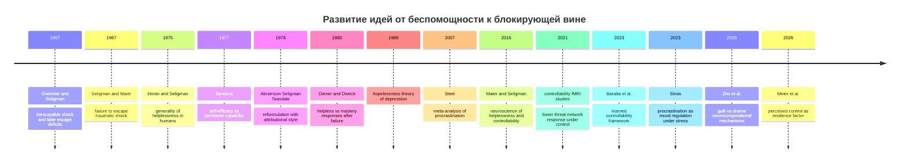
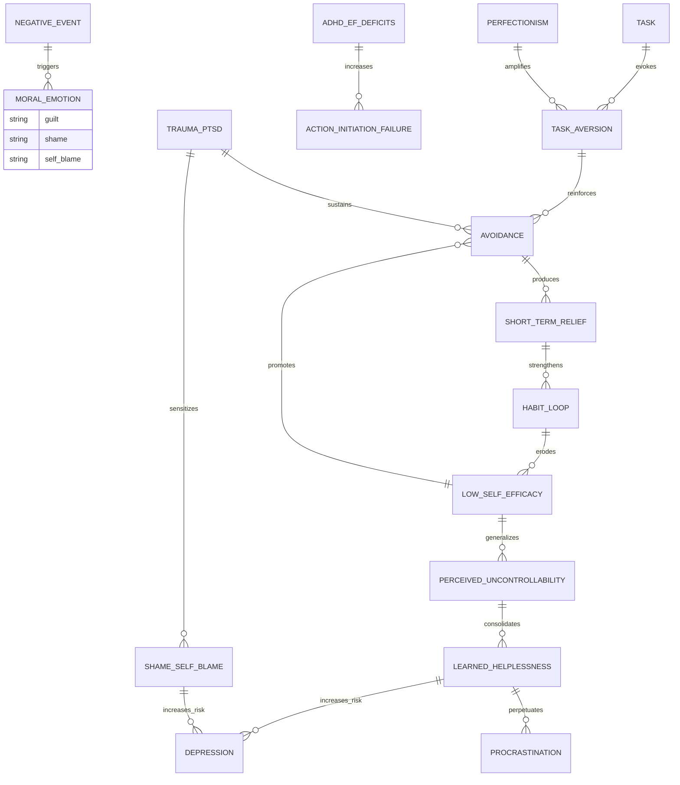

# Блокирующее чувство вины, мешающее началу действия, и его связь с выученной беспомощностью

## Executive summary

Блокирующее чувство вины, из-за которого человек не начинает важное дело, не является отдельным диагнозом в DSM-5 или ICD-11. В современной литературе это лучше понимать как трансдиагностический процесс на пересечении нескольких линий: моральных эмоций, прокрастинации как способа краткосрочной регуляции настроения, падения самоэффективности, искажений контроля, self-criticism, перфекционистских опасений, исполнительной дисфункции и, у части людей, травматических и посттравматических механизмов. Предлагаемые диагностические критерии существуют лишь для "патологической прокрастинации", но не для самой связки "вина - ступор - не-старт". citeturn9search3turn9search11turn31search1turn7search7

Самый важный клинический вывод такой: то, что субъективно называется "виной", очень часто функционально оказывается смесью нескольких состояний. Адаптивная вина обычно фокусируется на конкретном действии и подталкивает к исправлению. Дезадаптивная блокирующая вина чаще включает глобальную самооценочную компоненту, то есть сдвигается в сторону стыда, self-blame, страха оценки, катастрофизации и избегания. Именно поэтому вместо импульса "исправь" возникает импульс "замри, отвернись, не трогай". Это хорошо согласуется с классическим различением вины и стыда в моральной психологии и с современными моделями прокрастинации как mood-repair, а не как простого "тайм-менеджмент-дефицита". citeturn1search4turn1search2turn1search1turn3search15turn31search0

Связь с выученной беспомощностью не прямая и не тождественная, но она очень существенна. Выученная беспомощность в исходной формулировке возникала там, где организм усваивал, что его действия не контролируют исход. Блокирующая вина часто начинается раньше: как конфликт "надо делать" против "делать слишком больно". Но если таких циклов много, если человек многократно переживает "я снова не начал, снова подвел, снова ничего не изменил", то избегание начинает обучать именно тому, что усилия не работают, а собственное действие не меняет результат. В этот момент прокрастинация, стыд и self-blame начинают подкреплять беспомощность. Это уже не просто отсрочка, а обучение не-агентности. citeturn0search0turn26search0turn7search0turn7search8turn9search16

Наиболее надежная доказательная база по интервенциям сегодня есть у CBT, behavioral activation, problem-solving therapy, некоторых self-compassion и compassion-focused подходов, а при PTSD - у trauma-focused протоколов, прежде всего PE, CPT и EMDR. При ADHD нужна отдельная ветка вмешательства: не сводить все к "избеганию ответственности", а учитывать исполнительные функции, временную организацию, мотивационную чувствительность и, при показаниях, медикаментозную поддержку. На уровне организаций особенно важны предсказуемость, ясные контингенции, степень контроля над работой, психологическая безопасность и недопущение управленческих сред, в которых ошибка автоматически превращается в угрозу идентичности. citeturn19view3turn30search1turn5search0turn4search9turn11search1turn20view2turn10search2turn10search22

Наконец, прямая литература именно о "блокирующем чувстве вины перед стартом задачи" остается фрагментированной. По этой точной формулировке нет богатого корпуса мета-анализов и RCT. Поэтому наиболее честная научная позиция - не выдавать красивую единую теорию за доказанный факт, а строить интегративную модель из нескольких хорошо исследованных блоков: вина и стыд, learned helplessness and controllability, procrastination and mood regulation, perfectionistic concerns, executive dysfunction, depression, PTSD и ADHD. citeturn3search2turn7search7turn8search20turn24search6turn35search3

## Концептуальная рамка и хронология

Если говорить предельно прямо, "я виноват, поэтому не могу начать" почти никогда не означает только вину. В клинике и исследованиях это чаще выглядит как каскад: задача активирует память о долге или невыполнении; затем поднимаются вина, стыд, тревога, self-criticism и прогноз болезненного фейла; затем запускается краткосрочное облегчение через избегание; потом приходит вторичная вина за избегание; дальше падает ожидаемая эффективность собственных действий; и после повторений формируется устойчивая логика беспомощности. Это согласуется с развитием идей от классической learned helplessness к hopelessness theory, а затем к современным моделям controllability, self-regulation и transdiagnostic stress vulnerability. citeturn0search0turn26search0turn0search3turn7search8turn8search34

Классическая learned helplessness выросла из экспериментов 1967 года на собаках и других животных, где неконтролируемый аверсивный стимул вел к последующему дефициту escape/avoidance поведения. В 1975 году идея была распространена на человека. В 1978 году Abramson, Seligman и Teasdale провели когнитивную переработку модели, добавив атрибуции внутренности, стабильности и глобальности. Дальше теория разошлась в несколько ветвей: hopelessness theory депрессии, исследования perceived control и learned controllability, модели прокрастинации как краткосрочного mood repair, и современные нейрокогнитивные модели моральных эмоций, ответственности и self-related processing. citeturn26search0turn0search0turn34search3turn0search3turn7search8turn1search1turn31search2

Ниже - сжатая сравнительная карта теорий, которые реально полезны для книги по этой теме.

| Теоретическая линия | Основной вопрос | Что блокирует действие | Что предсказывает | Сильные стороны | Ограничения |
|---|---|---|---|---|---|
| Learned helplessness | Верит ли субъект, что действие влияет на исход | Ожидание неэффективности ответа | Пассивность, снижение инициативы, аффективные нарушения | Очень сильная экспериментальная традиция; ясная логика controllability | Исходная модель слишком общая для сложных человеческих случаев citeturn26search0turn0search0turn7search0 |
| Reformulated learned helplessness and hopelessness | Как атрибуции превращают неудачу в депрессию | Внутренние, стабильные, глобальные объяснения неудач | Безнадежность, депрессивная уязвимость | Хорошо объясняет различия между людьми | Всё еще не охватывает полностью эмоции стыда и современные EF-модели citeturn0search3turn0search1 |
| Mood-regulation model of procrastination | Почему человек откладывает, зная вред | Избегание краткосрочного дискомфорта | Повторяемая отсрочка, стресс, вторичная вина | Сильная валидность для повседневной отсрочки | Не всякая прокрастинация объясняется только эмоциями citeturn1search1turn9search11turn1search3 |
| Shame-guilt framework | На что направлена эмоция - на действие или на Я | Стыд, self-attack, страх оценки | Уход, скрывание, denial или repair | Очень полезно для дифференциальной диагностики | В самоотчете люди часто путают вину и стыд citeturn1search4turn1search2turn24search6 |
| Perfectionism model | Что не так с внутренними стандартами и ошибками | Perfectionistic concerns и fear of failure | Отсрочка старта, overchecking, непереносимость незавершенности | Хорошо объясняет "не начну, пока не смогу идеально" | Стремление к достижениям и перфекционистские опасения - не одно и то же citeturn35search10turn2search19 |
| Executive function and ADHD model | Может ли субъект реально организовать старт и поддержание действия | Inattention, poor planning, temporal disorganization, impulsive relief-seeking | Хронические срывы старта, неустойчивость усилия | Не даёт морализировать то, что частично нейрокогнитивно | Не объясняет полностью shame loops и moral self-attack citeturn20view2turn12search18turn8search6 |
| Trauma-shame model | Как травма меняет self-appraisal и агентность | Trauma-related shame/guilt, avoidance, hyperarousal | PTSD, moral injury, суицидальный риск у части пациентов | Особенно полезно при сексуальном насилии, боевой травме, complex trauma | Не каждый случай task paralysis травматичен по происхождению citeturn8search1turn8search5turn8search14turn11search1 |

С точки зрения истории идей, наиболее продуктивно не выбирать "одну правильную теорию", а видеть, что каждая отвечает на свой слой процесса. Learned helplessness объясняет падение контроля. Shame-guilt research объясняет аффективное качество этого падения. Procrastination research объясняет поведенческую петлю отрицательного подкрепления. ADHD and executive-function research объясняет, почему некоторые люди проваливают старт даже при высокой мотивации. Trauma research объясняет, почему сама задача может переживаться не как просто сложная, а как экзистенциально опасная для Я. citeturn7search0turn1search4turn9search11turn20view2turn8search1

Диаграмма ниже - это синтетическая временная линия этих идей, собранная по первоисточникам и крупным обзорам. citeturn26search0turn0search0turn34search3turn2search0turn35search15turn7search0turn7search8turn31search2turn7search2



## Механизмы

Самое принципиальное различие, без которого книга на эту тему получится мутной, это различие между виной и стыдом. Вина в классических исследованиях больше относится к конкретному поведению: "я сделал плохое". Стыд - к целостному Я: "я плохой". Поэтому вина чаще тянет к repair, apology, amends; стыд - к hiding, escape, denial, self-concealment и часто к агрессии на себя или на другого. Именно стыд чаще связан с эгоцентрическим фокусом на том, как Я выглядит в глазах других, а вина - с тем, какой вред причинен действием. citeturn1search4turn1search2turn1search0turn1search8

Отсюда вытекает ключевая клиническая гипотеза для вашего предмета: "блокирующее чувство вины" очень часто есть не чистая вина, а вина, зараженная стыдом. Человек говорит: "мне стыдно, что я не сделал" и "я виноват, что не начал", но функционально психика ведет себя так, как будто задача грозит разоблачением дефектного Я. В таком режиме старт действия переживается не как решение проблемы, а как вход в пространство, где тебя опять догонят подтверждения собственной несостоятельности. Это уже не repair-oriented affect, а threat-oriented self-state. Это интегративный вывод из исследований moral emotions и procrastination, а не одна-единственная экспериментальная демонстрация. citeturn1search4turn1search2turn9search11turn4search10

Современная нейролитература делает эту картину более тонкой. Meta-analysis нейровизуализационных исследований показал, что и вина, и стыд/смущение пересекаются по активации, в частности по левой передней островковой коре, связанной с осознанием аффективного состояния. Но различия тоже есть: в более новых нейрокомпьютейшн-работах вред для другого сильнее усиливал guilt, а чувство ответственности сильнее усиливало shame. У людей с ремиссией депрессии описана повышенная реактивность правой амигдалы и задней островковой коры на shame относительно guilt, что делает вполне правдоподобной мысль, что именно shame-heavy self-processing особенно опасен для депрессивных рецидивов и task paralysis. citeturn31search0turn31search2turn31search28

В прокрастинации центральный механизм не "лень", а отрицательное подкрепление. Задача вызывает aversive affect. Не начинать дело дает немедленное облегчение. Это облегчение закрепляет отсрочку. Чем выше стрессовый контекст, тем выше вероятность, что человек снова выберет не долгосрочную выгоду, а срочное снижение аффективной боли. Поэтому прокрастинация устойчиво связана со стрессом, отрицательными эмоциями и нарушениями emotion regulation, а не только с плохим календарем или недостатком дисциплины. citeturn1search1turn1search3turn9search11turn9search0

Блокирующая вина особенно легко встраивается в эту петлю, потому что она придает задаче дополнительную аверсивность. Человек не просто думает: "дело сложное". Он думает: "дело докажет, что я уже подвел", "я испорчу еще сильнее", "поздно начинать", "если открою документ, почувствую весь масштаб провала". Тогда избегание гасит сразу несколько видов боли: страх неудачи, стыд, тревогу, grief по потерянному времени и угрозу самообразу. Именно поэтому субъективное облегчение после решения "сделаю потом" может быть очень заметным. citeturn1search1turn35search10turn3search26turn22search1

Перфекционизм усиливает этот цикл не одинаково по всем своим компонентам. Наиболее проблематичны perfectionistic concerns - страх ошибки, постоянное ощущение несоответствия, чувство внешнего давления и условной ценности. Обзоры и последующие работы consistently показывают, что именно perfectionistic concerns положительно связаны с прокрастинацией, тогда как perfectionistic strivings дают слабые, отрицательные или смешанные связи. Иными словами, откладывание сильнее подпитывает не стремление к высокому качеству как таковому, а болезненная, карающая, условная форма стандарта. citeturn35search10turn2search19turn35search9

Самоэффективность здесь - отдельный узел. В классике Bandura self-efficacy описывается как вера в способность осуществить конкретное действие. Когда у человека многократно не удается ни старт, ни поддержание усилия, источники самоэффективности разрушаются прежде всего через отсутствие mastery experience. Тогда новая задача уже на входе ощущается как непосильная, а ожидаемое действие - как бессмысленное. Именно здесь мост к learned helplessness становится особенно прочным: repeated failure to initiate undermines perceived capability, а падение perceived capability делает следующий старт менее вероятным. citeturn33search5turn33search17turn33search2turn7search8

У части людей ключевой вклад вносит executive dysfunction и ADHD. Для них проблема не сводится к "не хочет" или "не может выдержать вину". ADHD связан с нарушениями внимания, организации, time management, мотивационной чувствительности к немедленному подкреплению и трудностями adherence to plans. NICE прямо рекомендует учитывать environmental modifications, а для взрослых при показаниях сочетать медикацию с structured supportive psychological intervention, которое может включать элементы CBT. Мета-анализы и систематические обзоры показывают, что CBT при adult ADHD может уменьшать core symptoms, особенно когда остаются резидуальные трудности несмотря на медикацию. citeturn20view2turn20view3turn12search18turn12search22turn12search26

Травма дает еще один путь к блокировке. Для людей с PTSD или trauma-related shame/guilt задача может служить триггером не потому, что она объективно сложна, а потому, что она активирует memory network беспомощности, самообвинения, нарушения границ, опасности наказания и collapse of agency. Meta-analysis показывает умеренную связь shame и PTSD-субъектов, а отдельный мета-анализ по trauma-related guilt подтверждает связь с PTSD symptoms и роль в onset and maintenance. При такой конфигурации "не могу начать" оказывается микрорепликой травматической логики: любое действие может закончиться болью, разоблачением или внутренним судом. citeturn8search1turn8search5turn8search14turn8search18

Диаграмма ниже показывает интегративную модель механизмов. Она не является одной опубликованной схемой, а синтезирует несколько линий доказательств. citeturn1search4turn9search11turn35search10turn20view2turn8search1turn7search8



## Эксперименты и нейробиология

Классический стержень темы - experiments on controllability. В работах Overmier and Seligman и Seligman and Maier 1967 года животные, подвергавшиеся неконтролируемому шоку, позже хуже учились escape/avoidance responses даже там, где контроль уже появился. Это дало первую формулировку learned helplessness: организм усваивает не просто "было больно", а "мое действие не влияет". Этот момент важен и для современной клиники: не всякая тяжелая эмоция дает беспомощность, а именно повторяющаяся несцепленность "действие - исход". citeturn26search0turn0search0turn7search0

У людей классическая линия началась с Hiroto and Seligman 1975, где неконтролируемые шумы и неразрешимые когнитивные задачи вызывали ухудшение последующего performance в условиях, где контроль уже был возможен. Позже линия получила развитие в детской психологии через работы Dweck и Diener, которые показали различие между "mastery-oriented" и "helpless" responses after failure: часть детей после неудачи искала новые стратегии, а часть - резко теряла качество мышления, persistence и problem solving. Для вашей темы это особенно важно, потому что блокирующая вина во взрослом возрасте часто выглядит как зрелая форма helpless response to anticipated failure. citeturn34search3turn2search0

Ниже - таблица ключевых экспериментов и поворотных эмпирических результатов, полезная как каркас главы книги.

| Исследование | Дизайн и выборка | Что манипулировали | Главный результат | Что это значит для темы |
|---|---|---|---|---|
| Overmier and Seligman, 1967 | Классический animal paradigm, собаки; точный n лучше брать из полной статьи | Inescapable shock | Позднейший дефицит escape/avoidance responding | Неконтролируемый аверсивный опыт обучает пассивности, а не только страху citeturn26search0 |
| Seligman and Maier, 1967 | Животные, шок и последующий test of escape | Failure to escape traumatic shock | Те же deficits в условиях последующего контроля | Основа для идеи, что нарушается ожидание controllability citeturn0search0 |
| Hiroto and Seligman, 1975 | Human learned helplessness tasks | Uncontrollable noise or unsolvable tasks | Generality of helplessness in humans | Переход от animal model к человеческой task-behavior literature citeturn34search3turn34search7 |
| Diener and Dweck, 1980 | Дети на задачах с успехом и неудачей | Failure after success | "Helpless" children показали ухудшение стратегии и performance | Failure может вести либо к mastery, либо к collapse of goal-directed behavior citeturn2search0 |
| Soares et al., 2012 | Human stress and decision-making study | Chronic stress | Сдвиг от goal-directed к habitual strategies | Под стрессом старт действия может становиться менее гибким и более автоматизированно-избегающим citeturn7search20 |
| Limbachia et al., 2021 | Human fMRI controllability paradigm | Controllable vs uncontrollable stressor | При контроле снижается response в threat-related brain areas | Субъективный и объективный контроль реально меняют мозговую обработку стресса citeturn7search26turn27search1 |
| Meier et al., 2026 | Human resilience study | Perceived control as stress factor | Perceived control ассоциирован с neural, physiological and affective stress responses | Даже восприятие контроля может быть фактором resilience, не только фактический контроль citeturn7search2turn7search12 |

Современная нейробиология сильно переработала исходную теорию беспомощности. Главный сдвиг такой: организм не просто "учится беспомощности". В норме базовым может быть как раз склонность к helplessness under uncontrollable stress, а protective factor возникает, когда субъект обучается controllability. В animal literature центральен путь vmPFC - dorsal raphe nucleus. Контроль над стрессором активирует префронтальные цепи, которые потом снижают стрессовую дебилитацию и способствуют learned controllability. При неконтролируемом стрессе, напротив, описано повышение участия dorsal raphe serotonergic systems и downstream behavioral effects. citeturn7search0turn7search8turn7search30turn7search18

Этот переход от "учения беспомощности" к "учению контроля" очень важен практически. Он означает, что лечение должно быть не просто про снижение симптомов, а про восстановление опыта действенности. Для человека с блокирующей виной это переводится буквально: недостаточно объяснить, что он "слишком себя ругает". Нужно сконструировать опыт, в котором действие снова начинает что-то менять, причем быстро, явно и повторяемо. Иначе когнитивная работа будет отскакивать от глубинной схемы "все равно бесполезно". citeturn7search8turn7search4turn33search5

У людей дополнительные данные дают исследования perceived control. В fMRI-работах controllability снижала реактивность ключевых threat-related brain areas. Более новые данные связывают perceived control с resilience across neural, physiological and affective domains. Иначе говоря, даже если внешний мир не идеально контролируем, субъективная оценка "мой ответ имеет смысл и последствия" сама по себе уже является буфером. Это объясняет, почему в одних и тех же объективных условиях один человек впадает в ступор, а другой - в напряженное, но продуктивное действие. citeturn27search1turn7search2turn7search12turn27search13

Есть и важные ограничения. Human learned helplessness paradigms остаются менее чистыми, чем animal models. Обзоры прямо отмечают, что перевод результатов с животных на комплексную человеческую депрессию ограничен. В частности, современная работа по human LH model отдельно подчеркивает, что у людей до сих пор мало прямых данных о том, что экспериментальная helplessness reliably induces anhedonia - один из core symptoms depression. Это значит, что learned helplessness полезна как процессуальная рамка, но ее нельзя превращать в универсальное объяснение всей депрессии или любой task paralysis. citeturn26search1turn7search7turn0search1

## Клинические последствия и коморбидность

Когда блокирующая вина закрепляется, последствия выходят далеко за пределы одной задачи. Лонгитюдные данные показывают, что прокрастинация связана с более плохими последующими исходами по depression, anxiety, stress, pain, sleep problems, loneliness и общему здоровью. В крупной шведской когорте студентов более высокий уровень procrastination ассоциировался с худшими последующими ментальными и физическими исходами, а в трехволновом исследовании прокрастинация предсказывала рост симптомов депрессии и тревоги во времени. Это уже не "безобидная привычка", а фактор риска накопления страдания. citeturn9search8turn9search1turn9search16

Для депрессии узловой механизм - переход от отдельных неудач к генерализованной hopelessness. Hopelessness theory показывает, что особенно опасны атрибуции по типу "это моя вина", "так будет всегда", "это касается всего". Если к этому добавляется повторяющееся избегание старта, то человек получает двойной удар: и аффективный, и поведенческий. Он не только чувствует себя плохим, но и перестает накапливать corrective evidence, то есть реальные эпизоды действия, которые могли бы опровергнуть схему. Ухудшается именно агентность. citeturn0search3turn3search26turn33search5

С PTSD картина иная, но не менее тяжелая. Meta-analysis по shame and PTSD обнаружил значимую умеренную связь между shame и посттравматическими симптомами. Meta-analysis по trauma-related guilt показал, что guilt также связан с PTSD symptoms и играет роль в onset and maintenance. Более новые prospective и clinical studies уточняют, что trauma-related shame у части пациентов имеет особенно сильную независимую связь с тяжестью PTSD, а guilt и shame могут быть путями к moral injury и suicidal risk. Поэтому у человека с history trauma "вина из-за несделанного" может быть поверхностью более глубокой системы: не "я ленюсь", а "я опасен, испорчен, не имею права, меня осудят, наказание неизбежно". citeturn8search1turn8search5turn8search4turn8search18turn21search5

С ADHD важно избегать моральной ошибки атрибуции. Взрослый ADHD по NICE - это не только inattentiveness, но и impairments in everyday functioning, organization, motivation and adherence. Исследования показывают положительную связь ADHD symptoms и procrastination, а некоторые работы указывают, что у людей с высокими ADHD symptoms откладывание сильнее связано с immediate reward motives и time-discounting. На практике это означает, что chronic failure to start может производить вторичную shame-guilt оболочку поверх первичной executive dysfunction. Тогда человек приходит с жалобой "я ничтожен и не могу начать", хотя часть проблемы - нейрокогнитивная, а не моральная. citeturn20view2turn8search6turn8search23turn12search0

С формальной диагностикой здесь пока нет простоты. Прокрастинация не является самостоятельным расстройством в основных классификациях, однако предложены диагностические критерии pathological procrastination. В одном из таких проектов требовались два фиксированных критерия - needless delay of important tasks и strong interference with personal goals - плюс по меньшей мере два из четырех дополнительных критериев. Это свидетельствует, что поле движется к более клинической операционализации, но пока научный консенсус окончательно не достигнут. citeturn9search3

Для организаций и работы последствия тоже серьезны. Обзоры и официальные документы NIOSH показывают, что work-related psychosocial hazards становятся крупным фактором ill-health, disability and cost. Longitudinal occupational studies связывают high demands and low job control с более выраженными depressive symptoms. Низкая psychological safety ассоциируется с худшей team effectiveness и, в здравоохранении, с худшими показателями patient safety. Переводя это на рассматриваемую тему: среда, где ошибка ведет к унижению, а усилие почти не меняет исход, системно производит shame, avoidance and helplessness. citeturn10search2turn10search0turn10search22turn10search1turn10search20

## Интервенции и практические протоколы

Главный принцип лечения - не спорить с феноменом на одном языке. Если проблема выглядит как "я виноват - поэтому не начинаю", то работать нужно минимум на четырех уровнях сразу: с моральной эмоцией, с поведенческой петлей избегания, с чувством контроля и, при необходимости, с коморбидностью. Попытка решать всё только мотивационными лозунгами обычно проваливается, потому что она не меняет ни отрицательное подкрепление, ни самоэффективность, ни переживание угрозы. citeturn9search11turn7search8turn33search5

Ниже - сжатая таблица того, что сегодня имеет лучшую доказательную поддержку.

| Подход | На что бьет | Ключевая доказательная база | Когда особенно уместен | Что важно помнить |
|---|---|---|---|---|
| CBT и cognitive restructuring | Глобальные атрибуции, catastrophizing, self-blame, fear of failure | Network meta-analysis: CR, BA и CBT эффективны сравнительно с waitlist/CAU при adult depression; CBT - одна из наиболее изученных психотерапий депрессии citeturn6search0turn23search22 | Когда доминируют мысли "я безнадежен", "слишком поздно", "если начну - опозорюсь" | Когнитивная работа слабеет, если не сопровождается реальным поведением |
| Behavioral activation | Избегание, loss of reinforcement, пассивность | RCT N = 241: при более тяжелой депрессии BA была сопоставима с antidepressant medication и превосходила CT; мета-анализы подтверждают эффективность BA citeturn30search1turn3search10turn23search24 | Когда человек застрял именно в не-начале и behavioral shutdown | BA особенно хороша там, где нужны быстрые mastery experiences |
| Problem-solving therapy | Problem orientation, helplessness around solvable tasks | Updated meta-analysis: PST probably effective; RCT Qin primary care: effective and deliverable by trained nurses or GPs, combo with antidepressants not superior citeturn5search0turn30search3 | Когда задача реально непрозрачна и субъект тонет в неопределенности | Отлично подходит для "не знаю, с чего начать" |
| Self-compassion and CFT | Shame, self-criticism, punitive self-relating | Meta-analysis: self-compassion interventions have small to medium effects on depression, anxiety and stress; CFT reduces self-criticism and improves soothing; compassion-focused PTSD interventions show moderate benefit for PTSD symptoms citeturn4search9turn24search3turn24search1 | Когда на первом плане стыд, самонаказание и вторичная вина за симптомы | Это не "пожалей себя и ничего не делай", а снижение токсичной угрозы для Я |
| Procrastination-focused CBT and iCBT | Task aversion, avoidance loop, dysfunctional delay | Meta-analysis: overall small but significant effect g = 0.34, CBT subgroup g = 0.61; RCT iCBT showed moderate effects, d around 0.50 to 0.81 on key scales citeturn35search3turn33search16 | Когда прокрастинация сама является центральной проблемой | Нужны follow-up и работа с рецидивами |
| PTSD trauma-focused therapy | Avoidance, trauma networks, guilt/shame after trauma | VA/DoD and VA National Center: PE, CPT and EMDR are most highly recommended and strongly supported citeturn16view13turn16view14 | При PTSD, complex trauma, moral injury | Shame-focused adjuncts полезны, но не заменяют trauma-focused core treatment |
| Adult ADHD treatment | EF deficits, planning, adherence, time organization | NICE: environmental modifications first, medication when significant impairment persists, nonpharmacological support may include CBT; meta-analyses support CBT in adults citeturn20view2turn20view3turn12search18turn12search26 | Когда есть признаки ADHD и chronic initiation failure с детства | Не перепутать shame from repeated failure с причиной failure |

С точки зрения содержания вмешательства, CBT нужна не как абстрактная "работа с мыслями", а как демонтаж трех повторяющихся ложных переходов. Первый: "если мне стыдно и страшно, значит задача действительно опасна". Второй: "если я запустил дело, то теперь уже поздно и начинать бессмысленно". Третий: "если я не начал сразу идеально, лучше не начинать совсем". Эти переходы желательно делать максимально операциональными: записывать, проверять на предсказаниях и связывать с конкретными стартовыми микродействиями. citeturn1search4turn19view3turn35search10turn33search5

Behavioral activation в этой теме особенно сильна, потому что она возвращает субъекту не убеждение, а опыт. Классический RCT Dimidjian показал, что у более тяжелых депрессивных пациентов BA была сопоставима с medication и превосходила CT. Позднейшие мета-анализы усилили этот вывод. Для блокирующей вины это критично, потому что именно опыт "я сделал кусок, и реальность не рухнула" начинает разрушать learned expectations of non-control. citeturn30search1turn3search10turn3search13

PST особенно хороша для случаев, где guilt смешана с реальной overload и cognitive fog. Там не всегда нужно сначала убеждать человека "ты не плохой"; иногда нужно восстановить problem orientation: отделить solvable from unsolvable, выписать варианты, выбрать первый шаг, оценить ресурс, предусмотреть препятствия. NICE даже для guided self-help при less severe depression включает structured BA и problem-solving материалы как валидные первые линии, а meta-analytic literature показывает, что PST в целом сопоставима с другими психотерапиями депрессии. citeturn19view3turn5search0turn23search23

Self-compassion и CFT нужны не в качестве "мягкого украшения" терапии, а как способ снизить threat loading of the self. Если задача для человека равна суду над Я, простой behavioral prescription может не сработать: он будет слишком overwhelmed, чтобы действовать. В таких случаях сначала требуется уменьшить shame-driven self-attack и страх контакта с собственным несовершенством. RCT по Mindful Self-Compassion и последующие мета-анализы показывают улучшения по self-compassion и связанным показателям неблагополучия; более того, self-compassion рассматривается как буфер между learned helplessness и distress в современных исследованиях. citeturn30search2turn4search9turn0search6

Для PTSD правила другие. Если блокировка явно сидит внутри trauma network, приоритет нужно отдавать evidence-based trauma-focused protocols, а не только transdiagnostic shame work. По VA/DoD и National Center for PTSD, strongest recommendations - это PE, CPT и EMDR. Shame- or compassion-focused компоненты могут быть полезными adjuncts, особенно при moral injury, но нельзя подменять ими основную PTSD treatment when full criteria are met. citeturn16view13turn16view14turn11search3

Для adult ADHD практический смысл такой: если есть признаки lifelong inattention, disorganization, time blindness, unstable follow-through и repeated failures despite intention, то treatment plan должен включать ADHD branch сразу, а не после "морального перевоспитания". NICE рекомендует holistic plan, environmental modifications, medication при persistent significant impairment и structured supportive psychological intervention, которое может включать CBT elements. Это особенно важно, потому что вторичный shame layer у ADHD-пациентов часто огромен и маскирует первичный механизм. citeturn20view2turn20view3turn12search0

Ниже - протокол вмешательства, который можно использовать как основу главы для клиницистов. Он синтетический, но опирается на действующие руководства и доказательные линии. citeturn19view3turn16view14turn20view2turn4search9

```mermaid
flowchart TD
    A[Старт: жалоба "не могу начать из-за вины"] --> B[Оценить риск: суицидальность, тяжелая депрессия, PTSD, substance use]
    B --> C[Дифференцировать аффект: вина vs стыд vs тревога]
    C --> D[Оценить контекст задачи: реально решаема или нет]
    D --> E[Скрининг коморбидности: депрессия, PTSD, ADHD, перфекционизм, EF deficits]
    E --> F[Карта цикла: триггер -> аффект -> избегание -> облегчение -> вторичная вина]
    F --> G[Базовая ветка для всех: psychoeducation + self-monitoring + graded task initiation]
    G --> H[Если доминирует hopelessness or depression -> BA + CBT]
    G --> I[Если доминирует task confusion -> PST]
    G --> J[Если доминирует shame and self-criticism -> self-compassion or CFT modules]
    G --> K[Если есть PTSD -> PE or CPT or EMDR pathway]
    G --> L[Если есть ADHD -> environmental modifications + ADHD-focused CBT +/- medication review]
    H --> M[Собирать mastery experiences и восстанавливать perceived control]
    I --> M
    J --> M
    K --> M
    L --> M
    M --> N[План профилактики рецидива: triggers, early signs, implementation intentions, relapse scripts]
```

В формате практических рекомендаций для клинициста я бы сформулировал это так. Во-первых, спрашивать не только "почему вы не начали", но и "что именно случается в первые 30 секунд контакта с задачей". Во-вторых, отделять moral affect from executive failure. В-третьих, оперативно выяснять, что из этого реально controllable сегодня. В-четвертых, строить лечение вокруг быстрых, честных, малых acts of agency. В-пятых, не подкреплять shame терапевтическим стилем: избыточной конфронтацией, неясными заданиями, обесцениванием вернувшегося избегания. Эти рекомендации хорошо согласуются с NICE depression guidance, VA/DoD PTSD guidance и NICE ADHD guidance, где везде подчеркиваются shared decision making, individualization и адаптация под функциональный профиль. citeturn18view0turn16view13turn16view15

Для self-help самая рабочая логика обычно не "исправь всю жизнь", а "сломай контур беспомощности". Практически это означает: назвать состояние, отличить вину от стыда, уменьшить непереносимую глобальность формулировки задачи, сделать старт настолько маленьким, чтобы вернуть contingent feedback, а затем выдержать аффект без отката в избегание. Хорошие данные в пользу guided self-help и structured materials есть даже в NICE depression guideline для less severe depression, а procrastination RCTs показывают, что guided and unguided iCBT могут снижать симптоматику задержки. citeturn19view3turn33search16turn28search4

Для организаций и менеджеров принцип еще проще: нельзя одновременно требовать инициативу и системно производить беспомощность. Если цели расплывчаты, обратная связь приходит поздно, наказание за ошибку непредсказуемо, а контроль сотрудника над способом выполнения минимален, то среда будет выращивать avoidance, concealment and defensive passivity. На уровне дизайна работы это означает: повышать decision latitude, делать критерии done ясными, разбивать большие deliverables на короткие feedback loops, переводить критику из shame-register в behavior-register, и строить psychological safety как норму, а не как бонус. Это соответствует данным по psychosocial hazards, job control и psychological safety. citeturn10search2turn10search22turn10search15turn10search9

## Ограничения, этика и программа книги

Методологически поле очень неоднородно. Learned helplessness, hopelessness, self-efficacy, procrastination, shame, guilt, self-criticism и executive dysfunction изучаются часто в разных школах, разными инструментами и на разных выборках. Human LH paradigms не идентичны animal models и не дают полного моделирования depression. В исследованиях shame and guilt остается проблема концептуального смешения с embarrassment, humiliation, self-blame и even socially desirable reporting. В литературе по прокрастинации много self-report, студенческих выборок и cross-sectional designs, хотя число longitudinal and intervention studies растет. citeturn26search1turn0search3turn24search6turn35search3turn8search24

Есть и более конкретные methodological caveats. Мета-анализ психологических treatments for procrastination показал небольшой общий эффект и прямо подчеркивал heterogeneity и качество исследований. По pathological procrastination критерии пока предложены, но не институционализированы в больших классификациях. По self-compassion effects результаты в целом положительные, но неоднородность по форматам, популяциям и quality of controls остается. Поэтому научно честно говорить не "найдено одно окончательное лечение", а "есть несколько работающих направлений с разной силой доказательств, и их нужно сочетать по механизму случая". citeturn35search3turn9search3turn4search9

Этический раздел в такой книге обязателен. Концепция learned helplessness имеет темную историю применений и обсуждений в контексте допросов и пыток. Официальная позиция APA прямо говорила, что классическая модель learned helplessness была неуместно и с катастрофическими последствиями приложена к torture detainees. Hoffman Report документировал взаимодействия вокруг этого контекста, а Senate Select Committee пришел к выводу, что enhanced interrogation techniques были неэффективны для получения точной информации и были более жестокими, чем представлялось. Для вашей книги это важно не как историческая сенсация, а как предупреждение: знание механизмов утраты контроля может использоваться не только для лечения, но и для целенаправленного разрушения агентности. citeturn32search0turn32search1turn32search6

Структуру книги я бы предложил такой:

| Предлагаемая глава | Содержание | Что вставить |
|---|---|---|
| Введение | Что такое блокирующая вина и почему это не просто "слабость воли" | Клинические виньетки, тезаурус понятий |
| История идей | Learned helplessness, hopelessness, self-efficacy, procrastination | Хронология, классические статьи |
| Моральные эмоции | Вина, стыд, self-blame, moral injury | Таблица дифференциальных признаков |
| Механизмы начала действия | Avoidance learning, task aversion, perfectionism, EF | ER-диаграмма механизмов |
| Нейробиология контроля | vmPFC, DRN, threat network, insula, amygdala | Схема контуров controllability |
| Клинические профили | Депрессия, PTSD, ADHD, burnout, work contexts | Дифференциальные алгоритмы |
| Лечение | CBT, BA, PST, self-compassion, trauma protocols, ADHD adaptations | Flowchart протоколов и case formulations |
| Организации | Job control, feedback loops, psychological safety | Чек-лист для менеджеров |
| Этические границы | Манипуляции, coercion, torture, institutional misuse | Исторический кейс и выводы |
| Будущее исследований | Mechanism-focused RCTs, JITAI, digital phenotyping | Roadmap исследований |

В приложения стоит вынести: чек-лист "вина или стыд?", дневник петли избегания, шкалы self-report, протокол graded task initiation, шаблон case formulation, менеджерский чек-лист redesign of work, и библиографию по приоритету доказательности. Это особенно полезно для русскоязычной книги, потому что позволит соединить академическую часть и прикладную без ощущения, что читателю сначала дали 300 страниц теории, а потом три банальных совета. Концептуально это хорошо соответствует современному process-based и protocol-informed подходу. citeturn5search26turn7search7

Если закладывать программу исследований и пилотных RCT, я бы предложил минимум три ветки.

Первая ветка - mechanism-targeted RCT для людей с выраженной task-blocking guilt без полного PTSD и без тяжелой эндогенной депрессии. Сравнить BA, BA + self-compassion module и PST + self-compassion module. Первичные исходы: latency to initiation, task completion rate, subjective controllability, guilt-vs-shame shift, functional impairment. Вторичные: PHQ-9, GAD-7, self-efficacy, procrastination scales. Идея здесь в том, чтобы проверить, достаточно ли поведенческого восстановления агентности или нужно специфически бить по shame and self-criticism.

Вторая ветка - stratified RCT для procrastination with ADHD features. Стратифицировать по ADHD symptom burden и randomize в CBT-for-procrastination versus ADHD-adapted CBT with externalization of structure, time aids and accountability. Первичные исходы: start latency, adherence, dropout, executive functioning proxies. Это позволит эмпирически проверить, насколько "одинаковая CBT для всех" проигрывает адаптированному протоколу в группе с EF deficits. Эта идея хорошо вытекает из NICE ADHD guidance и existing CBT-ADHD evidence. citeturn20view2turn12search18turn12search26

Третья ветка - trauma-sensitive trial для пациентов с PTSD or subthreshold trauma symptoms и выраженной procrastination/guilt paralysis. Сравнить стандартный procrastination-CBT against trauma-informed procrastination protocol, который встраивает shame reduction, pacing, safety-based exposure to task initiation и при необходимости step-up to PE/CPT/EMDR. Ключевой вопрос: у кого procrastination - первичная self-regulation problem, а у кого - secondary trauma-avoidance phenotype. Это одна из наиболее перспективных, но пока фактически пустых для литературы линий. citeturn11search1turn8search1turn8search5

Для поиска литературы и отбора источников я бы рекомендовал следующий скелет.

| Блок поиска | Базы | Примеры запросов |
|---|---|---|
| Learned helplessness | PubMed, PsycINFO, Web of Science, Scopus | "learned helplessness" AND controllability; "hopelessness theory" AND depression; "perceived control" AND stress AND fMRI |
| Guilt and shame | PubMed, PsycINFO | guilt shame self-criticism review; trauma-related guilt PTSD meta-analysis; shame depression meta-analysis |
| Procrastination | PsycINFO, PubMed, Web of Science | procrastination mood regulation review; procrastination depression longitudinal; procrastination CBT randomized trial |
| Perfectionism | PsycINFO, Web of Science | perfectionistic concerns procrastination meta-analysis; fear of failure procrastination |
| ADHD and EF | NICE, PubMed, PsycINFO | adult ADHD procrastination executive function; CBT adult ADHD meta-analysis |
| PTSD and trauma | VA/DoD, NICE, PubMed, Cochrane | PTSD shame guilt meta-analysis; trauma-focused CBT EMDR guideline |
| Russian-language layer | eLIBRARY, CyberLeninka, disserCat с осторожностью | "прокрастинация чувство вины", "стыд вина депрессия", "выученная беспомощность", "исполнительные функции прокрастинация" |

Критерии отбора источников для книги я бы зафиксировал явно. Приоритет номер один - official guidelines, primary studies, meta-analyses, network meta-analyses и systematic reviews. Приоритет номер два - narrative reviews в крупных журналах, если они синтезируют важный механизм. Для клинических рекомендаций - только официальные или крупные профессиональные руководства. Для русскоязычного массива - отдельно помечать, где источник вторичный, обзорный или ограниченный студенческой cross-sectional выборкой. Это особенно важно, потому что в русском сегменте по теме много полезной концептуализации, но значительно меньше высококачественных RCT и мета-анализов, чем в англоязычном. Действительно, в доступных русскоязычных публикациях часто обсуждаются прокрастинация, чувство вины, стыд, перфекционизм и локус контроля, но доказательная плотность этого слоя обычно ниже, чем у англоязычных первоисточников и руководств. citeturn13search0turn13search1turn13search4turn13search8turn14search2turn14search7

Если включать графики и дополнительные диаграммы в книгу, я бы предложил такие визуализации:
- forest plot по effect sizes: BA, PST, self-compassion interventions, procrastination CBT, CBT-ADHD;
- timeline of ideas from 1967 to 2026;
- network graph of comorbidity between procrastination, depression, PTSD, ADHD, shame and self-efficacy;
- Sankey diagram "task cue -> affect -> avoidance -> relief -> secondary guilt -> helplessness";
- Kaplan-Meier style graph for time-to-initiation in intervention trials;
- heatmap for differential indications: shame-heavy, ADHD-heavy, PTSD-heavy, depression-heavy presentations.

И последнее, самое важное. С научной точки зрения наиболее правдоподобная формулировка звучит так: блокирующее чувство вины - это не отдельная сущность, а устойчивый режим, в котором задача начинает переживаться как моральная угроза Я, избегание закрепляется как быстрый анестетик, а повторяющийся срыв действия обучает психику низкому контролю и беспомощности. Именно поэтому самые сильные вмешательства не просто "мотивируют", а возвращают различение вины и стыда, уменьшают self-attack, дробят задачу, создают быструю contingent feedback, адресуют коморбидность и шаг за шагом восстанавливают агентность. Это и есть точка, где теория выученной беспомощности соединяется с современной клиникой без упрощений и без мифологии. citeturn1search4turn3search2turn7search8turn19view3turn11search1turn20view2
