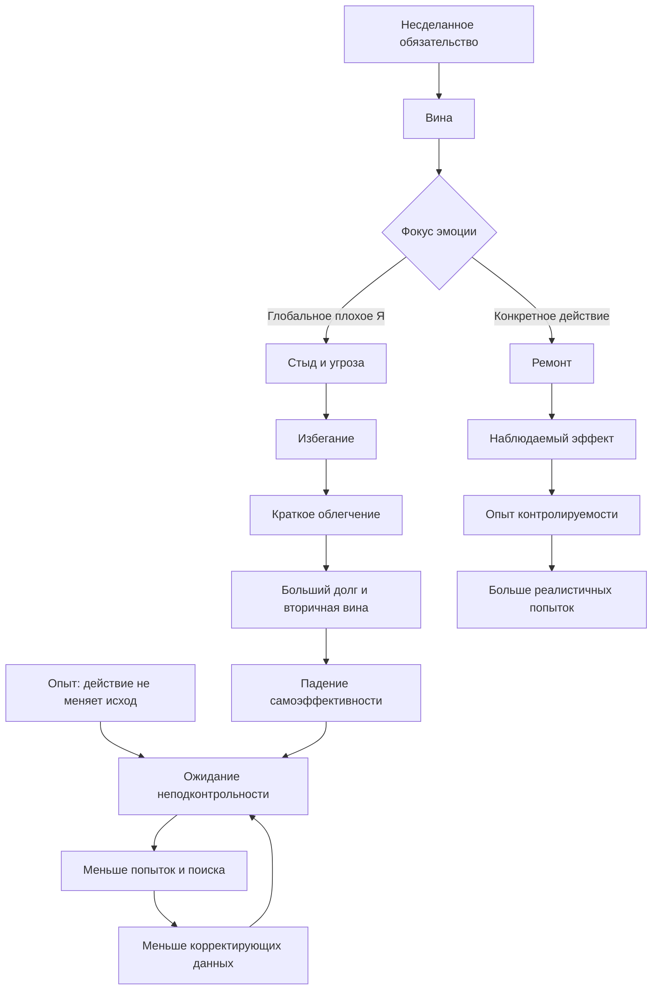

# Выжимка для книги

## Главный редакторский тезис

Выученную беспомощность стоит описывать не как черту человека и не как красивое объяснение любой пассивности, а как **ошибку переноса модели контролируемости**. В прежней среде действие действительно могло не менять исход или быть опасным. Проблема возникает, когда система продолжает действовать по старой статистике после появления нового рычага: не пробует, не замечает эффект или слишком быстро прекращает попытку.

Современный практический акцент лучше переносить с `как убрать беспомощность` на `как обучить и распознать контролируемость`. Человеку нужны не заверения, а достаточно безопасные повторяющиеся эпизоды, в которых его действие дает различимый эффект и обновляет прогноз следующего действия.

Вторая ключевая линия материала - **блокирующая вина**. Она не тождественна выученной беспомощности, но может быть путем к ней. Когда вина остается конкретной, она предлагает ремонт. Когда несделанное превращается в приговор личности, вина смешивается со стыдом, страхом оценки и самонаказанием. Задача становится угрозой Я; избегание дает немедленное облегчение; повторение цикла разрушает доверие к собственной способности начать.

## Рабочие определения

**Выученная беспомощность** - устойчивое снижение инициативы и поиска решения после опыта, в котором действия не влияли на аверсивный исход, особенно когда ожидание неподконтрольности переносится туда, где влияние снова возможно.

**Опыт контролируемости (learned controllability)** - усвоенная связь между определенным ответом и изменением хода событий, а также способность переносить этот опыт на новые стрессоры без обещания полного контроля над результатом.

**Блокирующая вина** - не отдельный диагноз, а трансдиагностический режим, в котором напоминание о невыполненном обязательстве вызывает смесь вины, стыда, тревоги и self-attack, а контакт с задачей переживается как угроза, поэтому краткосрочное избегание выигрывает у ремонта.

**Ремонт** - конкретное действие по отношению к факту и последствиям: восстановить контакт, сообщить статус, пересогласовать срок, уменьшить неопределенность, выполнить следующий наблюдаемый шаг или честно закрыть утратившее смысл обязательство.

## Причинная архитектура

Схема синтетическая. Она соединяет несколько исследовательских линий и не должна подаваться как единая экспериментально подтвержденная модель.

## Что обязательно различить

| Внешне похожее состояние | Главный вопрос | Риск ошибочного объяснения | Следующая проверка |
| --- | --- | --- | --- |
| Реальная неподконтрольность | Есть ли безопасный рычаг сейчас? | Обвинить человека за точную оценку среды | Безопасность, полномочия, ресурсы, реальные барьеры |
| Перенесенная беспомощность | Изменилась ли ситуация, но прогноз остался старым? | Требовать уверенности до нового опыта | Малый тест влияния и явная фиксация эффекта |
| Блокирующая вина/стыд | Эмоция предлагает ремонт или только приговор? | Использовать самонаказание как мотивацию | Факт, ущерб, минимальный ремонт, статус |
| Обычная task aversion | Дает ли избегание быстрое облегчение? | Считать проблему календарем | Карта `триггер -> аффект -> избегание -> облегчение` |
| Неясная задача | Понятно ли следующее физическое действие? | Лечить неопределенность самосостраданием | Problem-solving и декомпозиция |
| ADHD/executive dysfunction | Есть ли lifelong-паттерн запуска, времени и организации? | Морализировать нейрокогнитивный дефицит | Внешняя структура и профессиональная оценка |
| Депрессивный shutdown | Доступны ли энергия, интерес и ожидание будущего? | Продавливать микрошагами тяжелую депрессию | Клиническая оценка и evidence-based помощь |
| Травматическая реакция | Не активирует ли задача сеть угрозы и наказания? | Проводить обычный productivity-coaching | Trauma-informed оценка и профильное лечение |
| Истощение/недосып | Есть ли ресурс для мобилизации? | Тренировать преодоление поверх поломки | Сон, восстановление, здоровье, pacing |

## Ценные смысловые блоки

Полная двусторонняя сеть вынесена в [карту смысловых связей](<04-Карта-смысловых-связей.md>). Для будущей главы особенно важны следующие переходы:

1. [Реальная и выученная неподконтрольность](<04-Карта-смысловых-связей.md#real-vs-learned>) нельзя различить без анализа среды, полномочий и безопасности.
2. [Обучение контролируемости](<04-Карта-смысловых-связей.md#control-learning>) требует наблюдаемой связи действия с эффектом, а не общей веры в себя.
3. [Атрибуции](<04-Карта-смысловых-связей.md#attribution>) делают локальную неудачу временным уроком или глобальным приговором.
4. [Вина и стыд](<04-Карта-смысловых-связей.md#guilt-shame>) различаются по функциональному выходу: ремонт против скрывания и self-attack.
5. [Избегание](<04-Карта-смысловых-связей.md#avoidance>) подкрепляется реальным краткосрочным облегчением, поэтому лозунги проигрывают дизайну следующего контакта.
6. [Самоэффективность](<04-Карта-смысловых-связей.md#self-efficacy>) восстанавливается прежде всего через честные mastery experiences.
7. [Перфекционистские опасения](<04-Карта-смысловых-связей.md#perfectionism>) превращают просрочку в требование искупительного рывка и повышают порог входа.
8. [Исполнительные функции и ADHD](<04-Карта-смысловых-связей.md#executive>) требуют отдельной ветки, иначе следствие повторных срывов принимается за их причину.
9. [Травма и безопасность](<04-Карта-смысловых-связей.md#trauma-safety>) ограничивают self-help и запрещают путать адаптацию к угрозе с дефектом характера.
10. [Стресс и телесный ресурс](<04-Карта-смысловых-связей.md#body-stress>) определяют, способен ли человек вообще использовать появившийся контроль.
11. [Развитие и воспитание](<04-Карта-смысловых-связей.md#development>) должны давать ребенку посильные задачи, право на ошибку и видимую причинность.
12. [Организационный дизайн](<04-Карта-смысловых-связей.md#organization>) может выращивать инициативу или системно производить defensive passivity.
13. [Маршрутизация интервенций](<04-Карта-смысловых-связей.md#interventions>) важнее универсальной техники.
14. [Минимальный ремонт](<04-Карта-смысловых-связей.md#repair-protocol>) возвращает управление без компенсаторного героизма.
15. [Этика влияния](<04-Карта-смысловых-связей.md#ethics>) обязательна, потому что знание о неконтролируемости пригодно и для разрушения агентности.
16. [Границы доказательности](<04-Карта-смысловых-связей.md#evidence>) не позволяют объявлять этой моделью всякую депрессию, прокрастинацию или пассивность.

## Инженерная модель восстановления агентности

### Контур диагностики

1. Описать наблюдаемый факт без приговора личности.
2. Разделить `не контролирую`, `могу повлиять`, `контролирую действие`.
3. Найти первые 30 секунд контакта: какая эмоция, мысль, телесная реакция и импульс избегания возникают.
4. Проверить ясность задачи, цену старта, ресурс, безопасность, полномочия и клинические ветки.
5. Сформулировать проверяемый прогноз: `если я сделаю X, ожидаю Y`.

### Контур действия

1. Выбрать минимальный честный шаг, который дает новые данные, а не только символическую активность.
2. Ограничить первый контакт временем или одним наблюдаемым результатом.
3. Не требовать исчезновения вины, тревоги или сомнения до старта.
4. Зафиксировать не только выполненное, но и изменение состояния мира: уменьшилась неизвестность, появился ответ, создан черновик, пересогласован срок.
5. Повторить на следующей посильной ступени; расширять контроль только после нескольких устойчивых циклов.

### Контур ремонта обязательства

1. Перевести `я виноват` в `какой минимальный ремонт сейчас возможен`.
2. Отделить факт задержки от глобального приговора Я.
3. При необходимости отправить короткий статус: факт, сделанное, несделанное, следующий шаг, реалистичный срок.
4. Запретить компенсаторный героизм `сейчас за ночь искуплю все`.
5. Для накопленных хвостов использовать инвентаризацию: удалить, делегировать, пересогласовать, сделать быстро, отложить осознанно или закрыть с принятием последствий.

### Контур среды

1. Сделать правила и критерии `done` явными.
2. Связать ответственность с реальными полномочиями.
3. Сократить задержку обратной связи.
4. Перевести feedback с оценки личности на поведение, процесс и результат.
5. Разрешить безопасную эскалацию и малые обучающие ошибки.
6. Не забирать контроль у человека помощью, которая полностью исключает его действие.

## Развитие и воспитание

Для ребенка точкой роста является не серия побед и не искусственно созданные поражения, а опыт **посильной причинности**:

- задача немного выше автоматического уровня, но имеет доступный следующий ход;
- ошибка не обнуляет принадлежность и уважение;
- взрослый помогает увидеть стратегию, а не делает все вместо ребенка;
- усилие получает достаточно быструю и правдивую обратную связь;
- после неудачи обсуждаются изменяемые причины и следующий эксперимент;
- ребенок получает реальные выборы вместе с последствиями своего выбора.

Гиперопека лишает mastery experience, а хаотичное наказание разрушает карту причинности. Обе среды могут производить пассивность разными путями.

## Red flags

Протокол самопомощи недостаточен при суицидальных мыслях, тяжелой или стойкой депрессии, выраженной ангедонии, PTSD/диссоциации, продолжающемся насилии, зависимости, панических атаках, невозможности поддерживать базовый уход за собой, резком функциональном падении или подозрении на ADHD и другие клинические состояния, требующие профессиональной оценки.

При реальной опасности порядок другой: сначала безопасность, доступ к ресурсам и изменение внешних условий; затем тренировка агентности.

## Границы утверждений

- Блокирующая вина не является самостоятельным диагнозом.
- Связка `вина -> стыд -> избегание -> беспомощность` является интегративной моделью, а не одним подтвержденным причинным механизмом.
- Animal learned-helplessness paradigms нельзя напрямую отождествлять с человеческой депрессией.
- Воспринимаемый контроль важен, но не заменяет реальный контроль, безопасность и ресурсы.
- Малые шаги полезны не сами по себе: они должны создавать релевантный опыт причинности.
- Self-compassion не равна отказу от ответственности; ее функция здесь - уменьшить self-attack, мешающий ремонту.
- Доказательная база по терапии прокрастинации и self-compassion неоднородна; нельзя обещать универсальный эффект.
- Citation-токены `turn...` из Research-файла не являются библиографией.

## Редакторское размещение

Лучше не делать из темы изолированную главу с ярлыком `выученная беспомощность`. Сильнее будет сквозной узел:

1. В главе об избегании - отрицательное подкрепление и краткое облегчение.
2. В главе об управляемости - различие фактического, воспринимаемого и обученного контроля.
3. В главе о прокрастинации - блокирующая вина и стыдовая угроза Я.
4. В главе об опыте преодоления - mastery experiences и распознавание эффекта действия.
5. В главе о поломке мотивационного контура - генерализация неподконтрольности.
6. В главе о восстановлении - возврат способности использовать контроль после хронического стресса.
7. В лидерском блоке - job control, псевдоавтономия и психологическая безопасность.
8. В практикуме - дифференциальная диагностика и протокол минимального ремонта.
9. В главе о границах модели - клинические состояния, реальные барьеры и этический риск обвинения пострадавшего.
