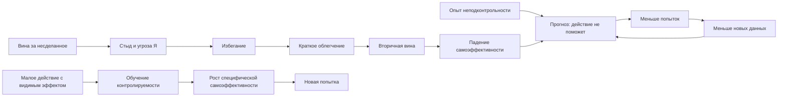

# Карта смысловых связей

## Назначение

Эта карта не пересказывает Research-файл по порядку. Она раскладывает материал на самостоятельные смысловые узлы, чтобы будущая редакция могла забрать каждый узел в подходящую главу и не потерять его связь с уже накопленным корпусом.

Связи двусторонние: релевантные карточки материалов содержат обратную ссылку на соответствующий узел этой карты. Это позволяет входить в сеть как из нового dossier, так и из прежней темы.

## Короткий граф

## 1. Реальная и выученная неподконтрольность

**Смысл.** Пассивность не доказывает ошибочного мышления. Иногда правила действительно непредсказуемы, полномочий нет, действие опасно, а цена попытки слишком высока. Выученная часть начинается там, где прежний вывод переносится на новую ситуацию без проверки изменившихся условий.

**Что не смешивать.** Нельзя лечить реальное насилие, бедность, бюрократическую ловушку, болезнь или псевдоавтономию одной сменой убеждений. Сначала проверяются безопасность, ресурсы и действительные рычаги.

**Связи.** [Индивидуальная агентность и хроническая пассивность](<../2026-06-18 - Индивидуальная агентность и хроническая пассивность/00-Карточка-материала.md>) задает широкую модель агентности; [почему люди сдаются раньше потенциала](<../2026-06-25 - Почему люди сдаются раньше потенциала/00-Карточка-материала.md>) показывает роль дефицита и институтов; [восстановление при постоянном стрессе](<../2026-07-05 - Восстановление при постоянном стрессе/00-Карточка-материала.md>) описывает систему, которая продолжает производить неподконтрольность.

## 2. Обучение контролируемости и распознавание вернувшегося контроля

**Смысл.** Современная поправка к классической теории переносит акцент на защитный опыт контроля. После длительной неподконтрольности человек может не заметить, что рычаг появился. Поэтому интервенция должна создавать ясную, повторяемую и достаточно быструю связь `ответ -> изменение`, а затем помогать переносить этот опыт.

**Что не смешивать.** Малый шаг, который ничего не проверяет и не меняет, может стать ритуалом занятости. Ценность имеет contingent feedback, а не микроскопический размер сам по себе.

**Связи.** [Агентность](<../2026-06-18 - Индивидуальная агентность и хроническая пассивность/00-Карточка-материала.md>) дает системный контекст; [порог мобилизации](<../2026-06-27 - Порог мобилизации и усилия/00-Карточка-материала.md>) объясняет цену первой попытки; [практика преодоления](<../2026-06-28 - Практика преодоления и первый контакт/00-Карточка-материала.md>) дает first-contact protocol; [зрелая воля](<../2026-06-19 - Нейробиология дисциплины и зрелой воли/00-Карточка-материала.md>) помещает повторяемый возврат в более длинный контур.

## 3. Атрибуции: локальный сбой или глобальный приговор

**Смысл.** Внутренние, стабильные и глобальные объяснения превращают конкретную неудачу в прогноз `это из-за меня, навсегда и во всем`. Специфическое, временное и изменяемое объяснение оставляет пространство для обучения.

**Что не смешивать.** Точное признание собственной ответственности не равно глобальному самообвинению. Полезная атрибуция должна указывать на проверяемую причину и возможную коррекцию, а не обязательно быть приятной.

**Связи.** [Отношение к ошибкам](<../2026-06-19 - Отношение к ошибкам и конструктивные действия/00-Карточка-материала.md>) задает контур `ошибка -> причина -> правка`; [обучение на ошибках](<../2026-06-25 - Обучение на ошибках/00-Карточка-материала.md>) связывает атрибуцию с feedback и психологической безопасностью; [ранняя сдача](<../2026-06-25 - Почему люди сдаются раньше потенциала/00-Карточка-материала.md>) показывает генерализацию ожиданий; [настойчивость и решительность](<../2026-06-20 - Настойчивость и решительность/00-Карточка-материала.md>) продолжает линию выбора новой стратегии после неудачи.

## 4. Вина как ремонт и стыд как угроза Я

**Смысл.** Конкретная вина относится к поступку и может вести к признанию, компенсации и исправлению. Стыд глобализирует событие до `я плохой`, смещает внимание с задачи на защиту Я и повышает вероятность скрывания, избегания и self-attack. Блокирующая вина часто функционально является смесью этих состояний.

**Диагностический вопрос.** Предлагает ли переживание конкретное ремонтное действие? Если оно только повторяет приговор и не порождает следующего хода, его функция уже не ремонтная.

**Связи.** [Конструктивная чувствительность к ошибкам](<../2026-06-19 - Отношение к ошибкам и конструктивные действия/00-Карточка-материала.md>) объясняет перевод feedback с Я на действие; [обучение на ошибках](<../2026-06-25 - Обучение на ошибках/00-Карточка-материала.md>) показывает, почему эмоциональная безопасность нужна вместе со стандартами; [практика преодоления](<../2026-06-28 - Практика преодоления и первый контакт/00-Карточка-материала.md>) дает способ действовать при сохранении неприятного аффекта.

## 5. Избегание как краткосрочный mood repair

**Смысл.** Не открывать задачу действительно помогает: тревога и стыд на время снижаются. Это облегчение отрицательно подкрепляет избегание. Поэтому цикл устойчив не вопреки рациональности, а благодаря локально работающей стратегии эмоционального обезболивания.

**Инженерный вывод.** Нужно снижать аверсивность первого контакта, сокращать задержку полезной обратной связи и проектировать альтернативный способ выдержать эмоцию, а не только улучшать календарь.

**Связи.** [Механизмы вредного поведения и привычек](<../2026-06-25 - Вредное поведение и полезные привычки/00-Карточка-материала.md>) дают язык подкрепления; [порог мобилизации](<../2026-06-27 - Порог мобилизации и усилия/00-Карточка-материала.md>) описывает входную цену; [самопланирование](<../2026-06-27 - Стратегии самопланирования/00-Карточка-материала.md>) выносит обязательства во внешний контейнер; [ранняя сдача](<../2026-06-25 - Почему люди сдаются раньше потенциала/00-Карточка-материала.md>) показывает долгосрочную генерализацию локального избегания.

## 6. Самоэффективность и опыт мастерства

**Смысл.** Self-efficacy относится к способности выполнить конкретное действие, а не к общей самооценке. Повторный срыв старта лишает человека mastery experiences; их отсутствие делает следующую попытку менее вероятной. Восстановление идет через честные эпизоды `смог инициировать -> увидел эффект -> выдержал следующий шаг`.

**Что не смешивать.** Похвала, визуализация и общая уверенность слабее собственного опыта. Слишком легкая задача тоже не всегда дает mastery: человек должен приписать результат собственному действию и увидеть его релевантность.

**Связи.** [Агентность](<../2026-06-18 - Индивидуальная агентность и хроническая пассивность/00-Карточка-материала.md>) разводит self-efficacy и соседние конструкты; [высокая активность](<../2026-06-19 - Высокая активность выдающихся людей/00-Карточка-материала.md>) показывает кумулятивный эффект успешных циклов; [зрелая воля](<../2026-06-19 - Нейробиология дисциплины и зрелой воли/00-Карточка-материала.md>) связывает мастерство с возвратом после трудности; [практика преодоления](<../2026-06-28 - Практика преодоления и первый контакт/00-Карточка-материала.md>) операционализирует первый цикл.

## 7. Перфекционистские опасения и компенсаторный героизм

**Смысл.** Задержка повышает субъективный долг, а стыд требует `искупить` его идеальным рывком. Чем дольше просрочка, тем больше воображаемый объем необходимой компенсации и тем выше порог старта. Особенно проблемны fear of failure, discrepancy и условная ценность Я, а не высокие стандарты сами по себе.

**Практический вывод.** Возврат должен быть маленьким и честным. Критерий - восстановленная причинность и коммуникация, а не символическое самонаказание переработкой.

**Связи.** [Порог мобилизации](<../2026-06-27 - Порог мобилизации и усилия/00-Карточка-материала.md>) объясняет рост входной платы; [практика первого контакта](<../2026-06-28 - Практика преодоления и первый контакт/00-Карточка-материала.md>) запрещает чрезмерную плату; [невозможность расслабиться после продуктивного дня](<../../Новые темы/2026-07-03 - Невозможность расслабиться после продуктивного дня/00-Карточка-материала.md>) показывает обратную сторону искупительного режима - невозможность засчитать достаточный результат и остановиться.

## 8. Исполнительные функции и ADHD против моральной атрибуции

**Смысл.** Lifelong-трудности запуска, времени, организации, удержания плана и чувствительности к немедленному подкреплению могут быть первичными. Стыд и недоверие к себе тогда накапливаются как вторичный слой повторных срывов.

**Что не смешивать.** Наличие вины не доказывает, что причиной является избегание ответственности. Нужна отдельная проверка developmental history, функционального профиля, сна, депрессии и среды.

**Связи.** [Агентность и хроническая пассивность](<../2026-06-18 - Индивидуальная агентность и хроническая пассивность/00-Карточка-материала.md>) задает клинические ветки; [удержание внимания](<../2026-06-19 - Удержание внимания у взрослых и детей/00-Карточка-материала.md>) описывает task set и рабочую память; [ментальная выносливость](<../2026-06-25 - Ментальная выносливость и дневная энергия/00-Карточка-материала.md>) проверяет состояние и медицинские причины; [самопланирование](<../2026-06-27 - Стратегии самопланирования/00-Карточка-материала.md>) дает внешнюю структуру без морализаторства.

## 9. Травма, реальная опасность и приоритет безопасности

**Смысл.** Задача может активировать память наказания, унижения, нарушения границ или moral injury. Тогда контакт с ней переживается не как обычная трудность, а как угроза. При продолжающемся насилии пассивность может быть точной защитной адаптацией.

**Граница.** Trauma-related guilt/shame, PTSD, диссоциация, насилие и суицидальный риск требуют профессионального и безопасностного маршрута. Productivity-протокол не должен заменять его.

**Связи.** [Восстановление при постоянном стрессе](<../2026-07-05 - Восстановление при постоянном стрессе/00-Карточка-материала.md>) показывает хроническую активацию; [упражнения практики преодоления](<../../Новые темы/2026-06-28 - Упражнения для практики преодоления/00-Карточка-материала.md>) содержат red flags и запрет на продавливание; [социализация детей и взрослых](<../2026-06-19 - Социализация детей 9-11 лет и взрослых/00-Карточка-материала.md>) добавляет безопасный социальный вход вместо насильственной экспозиции.

## 10. Хронический стресс, сон и способность воспользоваться контролем

**Смысл.** Даже реально доступный рычаг бесполезен, если система не имеет ресурса его использовать. Недосып, хроническая активация, депрессивное истощение, болезнь и перегруз повышают цену контроля, сужают поиск вариантов и усиливают защитные реакции.

**Что не смешивать.** Телесное восстановление не решает проблему власти, смысла или навыка, но отсутствие восстановления может делать психологическую интервенцию невыполнимой.

**Связи.** [Отдых и восстановление](<../2026-06-19 - Отдых и восстановление/00-Карточка-материала.md>) определяет готовность к следующему входу; [ментальная выносливость](<../2026-06-25 - Ментальная выносливость и дневная энергия/00-Карточка-материала.md>) дает диагностический слой; [выход из рабочего WIP](<../../Новые темы/2026-07-03 - Невозможность расслабиться после продуктивного дня/00-Карточка-материала.md>) снижает фоновый мониторинг; [хронический стресс](<../2026-07-05 - Восстановление при постоянном стрессе/00-Карточка-материала.md>) связывает личный и организационный контуры.

## 11. Развитие: mastery-oriented и helpless responses

**Смысл.** После неудачи ребенок может искать новую стратегию или перейти к глобальной оценке способности и ухудшить качество действия. Развивающая среда дает задачи в зоне посильного роста, конкретный process feedback, право на безопасную ошибку, реальные выборы и возможность самому завершить причинный цикл.

**Два риска.** Хаотичное наказание разрушает предсказуемость; гиперопека лишает собственного опыта контроля. В обоих случаях взрослый затрудняет обучение агентности, хотя внешне среды выглядят противоположно.

**Связи.** [Случайность обучения и lifelong learning](<../2026-06-18 - Случайность обучения и установки lifelong learning/00-Карточка-материала.md>) задает субъектное обучение; [обучение на ошибках](<../2026-06-25 - Обучение на ошибках/00-Карточка-материала.md>) описывает feedback и productive failure; [вовлекаемость в игровые механики](<../2026-06-18 - Вовлекаемость детей и взрослых в игровые механики/00-Карточка-материала.md>) показывает ценность ясных правил, быстрой обратной связи и управляемой цены ошибки.

## 12. Организационное производство беспомощности

**Смысл.** Среда выращивает defensive passivity, когда требует ownership без полномочий, меняет критерии после действия, задерживает feedback, наказывает инициативу и переводит ошибку в унижение. Псевдоавтономия особенно разрушительна: ответственность декларируется личной, а реальные рычаги влияния остаются у системы.

**Инженерный ответ.** Decision latitude, ясный `done`, короткие feedback loops, явные правила, безопасная эскалация, психологическая безопасность и реальная связь ответственности с полномочиями.

**Связи.** [Сотрудник-владелец области](<../2026-06-19 - Сотрудник-владелец области/00-Карточка-материала.md>) определяет здоровый локальный контур управления; [искусство влияния](<../2026-07-05 - Искусство влияния/00-Карточка-материала.md>) дает лидерскую коммуникацию и этику; [восстановление при постоянном стрессе](<../2026-07-05 - Восстановление при постоянном стрессе/00-Карточка-материала.md>) показывает цену demands при низком контроле; [обучение на ошибках](<../2026-06-25 - Обучение на ошибках/00-Карточка-материала.md>) связывает психологическую безопасность со стандартами и коррекцией.

## 13. Маршрутизация интервенций по механизму

**Смысл.** Нет единой техники `от беспомощности`. Behavioral activation возвращает действие и подкрепление; problem-solving therapy проясняет решаемую проблему; CBT работает с глобальными атрибуциями; self-compassion/CFT снижает shame-driven self-attack; trauma-focused protocols адресуют PTSD; ADHD-focused ветка добавляет внешнюю структуру и профильное лечение.

**Правило.** Базовая последовательность `оценить риск -> различить аффект -> проверить реальную контролируемость -> проверить коморбидность -> картировать цикл -> выбрать механизм` важнее популярности метода.

**Связи.** [Практика преодоления](<../2026-06-28 - Практика преодоления и первый контакт/00-Карточка-материала.md>) дает безопасный общий вход; [упражнения](<../../Новые темы/2026-06-28 - Упражнения для практики преодоления/00-Карточка-материала.md>) дают конкретные формы тренировки; [ранняя сдача](<../2026-06-25 - Почему люди сдаются раньше потенциала/00-Карточка-материала.md>) связывает self-efficacy и среду; [восстановление](<../2026-06-19 - Отдых и восстановление/00-Карточка-материала.md>) ограничивает тренировку при истощении.

## 14. Минимальный ремонт просроченного обязательства

**Смысл.** Человек должен делу действие и принятие последствий, а не страдание. Вход начинается с переключения `суд -> ремонт`: факт без приговора, минимальное физическое действие, короткий таймбокс, фиксация эффекта и запрет на искупительный марафон.

**Коммуникация.** В рабочем обязательстве полезен короткий статус: что задержано, что готово, что осталось, какой следующий шаг и реалистичный срок. Самоунижение не является дополнительной ответственностью.

**Связи.** [Практика первого контакта](<../2026-06-28 - Практика преодоления и первый контакт/00-Карточка-материала.md>) дает механику старта; [самопланирование](<../2026-06-27 - Стратегии самопланирования/00-Карточка-материала.md>) контейнирует хвосты и WIP; [выход из дня](<../../Новые темы/2026-07-03 - Невозможность расслабиться после продуктивного дня/00-Карточка-материала.md>) предотвращает накопление аморфного долга; [отношение к ошибкам](<../2026-06-19 - Отношение к ошибкам и конструктивные действия/00-Карточка-материала.md>) переводит признание сбоя в action item и проверку.

## 15. Этика: механизм можно использовать для разрушения агентности

**Смысл.** Неконтролируемость, непредсказуемость и унижение можно создавать намеренно. История обсуждения learned helplessness в контексте программ допросов показывает, что знание о потере контроля не является нейтральным.

**Граница для книги.** Описывать механизмы достаточно для распознавания и защиты, но не превращать раздел в инструкцию по подчинению. Влияние должно расширять информированную способность действовать, а не разрушать карту причинности человека.

**Связи.** [Искусство влияния](<../2026-07-05 - Искусство влияния/00-Карточка-материала.md>) получает жесткую границу между persuasion и coercion; [агентность](<../2026-06-18 - Индивидуальная агентность и хроническая пассивность/00-Карточка-материала.md>) задает объект защиты; [лидерская роль владельца области](<../2026-06-19 - Сотрудник-владелец области/00-Карточка-материала.md>) показывает конструктивную передачу контроля.

## 16. Границы доказательности и анти-нейромифный слой

**Смысл.** В dossier соединены разные поля: animal learned helplessness, human controllability paradigms, attributional style, shame/guilt, procrastination, self-efficacy, perfectionism, ADHD, PTSD и организационная психология. Их совместная модель правдоподобна, но не подтверждена одним корпусом RCT.

**Нельзя утверждать.** Нельзя выводить человеческую депрессию прямо из dorsal raphe animal model; объявлять всякую пассивность learned helplessness; считать perceived control заменой реальных полномочий; обещать универсальный эффект малых шагов, CBT, BA или self-compassion.

**Связи.** [Карта источников этого dossier](<05-Карта-источников.md>) задает evidence-ярусы; [полный Research-отчет](<02-Research - блокирующая вина и выученная беспомощность.md>) сохраняет исходные формулировки и citation-токены; [сырой список источников](<08-Источники-research-отчета.md>) нужен для будущей библиографической проверки.

## Как использовать карту при сборке новой версии

1. Выбирать не dossier целиком, а нужный смысловой узел.
2. Читать связанный прежний материал, чтобы избежать повторения уже сформулированной рамки.
3. Проверять evidence по `05-Карта-источников.md` и первоисточнику до переноса количественного или клинического утверждения.
4. В тексте книги ставить рядом механизм, наблюдаемое проявление, диагностическую развилку, интервенцию и границу применимости.
5. Сохранять различие между личным навыком, состоянием организма, клиническим профилем и устройством среды.
