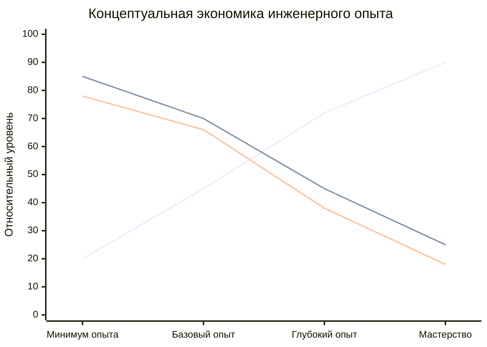
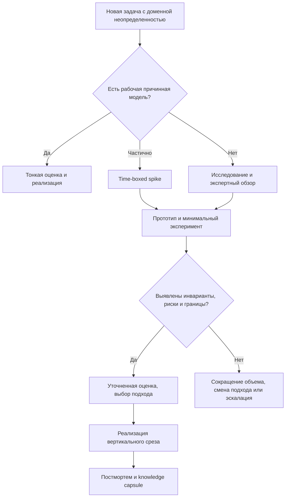
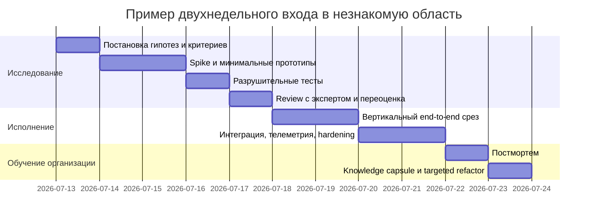

# Опыт, переданное знание и инженерная креативность

## Резюме для руководителя

Главный вывод литературы состоит в том, что инженерная компетентность бывает как минимум двух разных типов. Первый тип позволяет воспроизвести уже известное решение по правилам, документации и примерам. Второй позволяет распознавать скрытую структуру новой задачи, отбрасывать случайное, выделять инварианты и переносить принцип в другой контекст. Именно второй тип сильнее всего связан с креативностью, элегантностью решений и способностью изобретать, а формируется он заметно лучше через опыт, практику, ошибки, рефлексию и работу с реальными ограничениями, чем через одно только чтение готовых материалов. Это согласуется с классическими работами Колба, Полани, Дрейфуса, Шёна, Арджириса, Гентнер, Холиоака и исследованиями по экспертности, чанкингу, аналогии и организационному обучению. citeturn8search10turn1search14turn1search1turn16search12turn1search3turn17search6turn10search23

Однако из этого не следует, что "только собственный опыт" ценен, а переданное знание бесполезно. Более точный вывод такой: переданное знание становится продуктивным только тогда, когда человек заново "перепорождает" его внутри себя через предсказание, пробу, контрпример, разрушительное тестирование, сравнение альтернатив, рефлексию и повторное применение. Именно поэтому методы вроде deliberate practice, productive failure, apprenticeships, pair programming, симуляций и time-boxed research spikes работают лучше простого потребления информации: они встраивают в обучение напряжение выбора, ошибки и коррекцию ментальной модели. citeturn8search2turn12search5turn13search1turn13search9turn3search1turn23search13turn22search4turn28search8

Для engineering management это превращается в экономический вопрос. Когда команде не хватает пережитой компетентности в предметной области, она чаще страхует неизвестность дополнительными слоями абстракции, избыточной универсальностью, ранней архитектуризацией и более дорогими интеграционными контурами. Прямых рандомизированных исследований именно термина "overengineering из-за нехватки опыта" практически нет; но совокупность данных по различиям новичков и экспертов, трудности far transfer, стоимости сопровождения, архитектурному техническому долгу и крупным провалам сложных систем делает этот вывод сильной и правдоподобной инженерной гипотезой. При этом долгосрочная цена ошибки нередко выше первоначальной цены "красивого" старта: классические оценки жизненного цикла программных систем показывают, что существенная часть совокупной стоимости уходит на сопровождение и эволюцию, а архитектурный долг описывается как особенно дорогой и трудноустранимый. citeturn25search2turn25search0turn12search19turn5search2turn5search12turn26search1turn26search6

Для построения системы или процесса отсюда следуют четыре практических принципа. Во-первых, нужно отделять бюджет исследования и снижения неопределенности от бюджета исполнения. Во-вторых, вход в незнакомую область должен оформляться отдельным контрактом: time-boxed spike, прототип, destructive test, review с экспертом и только потом обязательство по полноценной реализации. В-третьих, каждая задача должна оставлять после себя "капсулу знания": инварианты, неработающие варианты, критерии выбора, примеры отказов, минимальные воспроизводимые сценарии. В-четвертых, организации надо измерять не только delivery, но и рост переносимой компетентности: скорость построения рабочей модели, качество аналогий, способность решать структурно похожие задачи и снижение стоимости последующих входов в новую область. Эти выводы поддерживаются исследованиями по организационному обучению, психологической безопасности, постмортемам и knowledge transfer в инженерных командах. citeturn27search8turn20search10turn9search8turn9search0turn9search2turn18search1turn18search16

Уровень строгости тоже важен. Данные по far transfer и deliberate practice сложнее, чем популярные пересказы. Generic cognitive training редко дает убедительный far transfer, а deliberate practice помогает, но его эффект и даже операционное определение остаются предметом спора. Поэтому лучшая стратегия для инженерной организации не "верить в чудесную переносимость", а строить перенос через работу с глубокими структурами задачи: сравнение кейсов, аналогическое кодирование, прототипирование, системные постмортемы и повторное применение одного и того же принципа в разных контекстах. citeturn12search19turn12search1turn17search9turn12search2turn12search14

## Теоретический каркас

Experiential learning в классической формулировке Дэвида Колба описывает обучение как цикл, в котором человек проходит через конкретный опыт, рефлексивное наблюдение, абстрактную концептуализацию и активное экспериментирование. Ключевой тезис Колба не в романтизации "практики ради практики", а в том, что знание возникает из преобразования опыта, а не просто из восприятия готовых объяснений. В инженерном образовании систематический обзор по Journal of Engineering Education показывает, что experiential learning используется очень широко, но часто остается теоретически недоопределенным; при этом авторы подчеркивают необходимость связки "self-school-community", то есть не только упражнения, но и контекста, рефлексии и социальной практики. citeturn8search10turn8search14turn14search1turn14search3

Практическое и воплощенное знание классически описывается через Полани и Шёна. Полани связал продуктивное знание с неявной компонентой: существенная часть того, что человек умеет, не сводится к явным формулировкам. Шён перенес эту линию в анализ профессиональной практики и показал, что сильные практики действуют не по схеме "сначала полностью сформулированная теория, потом применение", а через knowing-in-action и reflection-in-action, то есть через рефлексию прямо в процессе работы с неопределенной и уникальной ситуацией. Для инженерии это означает, что часть качества решения живет не в документации как таковой, а в способности замечать релевантное в живой ситуации. citeturn1search14turn15search4turn16search12turn16search0turn16search9

Различие между tacit и explicit knowledge в организационной теории обычно связывают с Nonaka. В его модели знание создается через взаимодействие неявного и явного знания, а не через простое "хранение лучших практик". Особенно важен для инженерных команд тезис, что неявное знание часто связано либо с concrete know-how, либо с когнитивными схемами и ментальными моделями. Поэтому knowledge management, ограниченный тикетами и wiki, почти неизбежно недооценивает то, что реально определяет качество технических решений: суждение, границы применимости, сигналы опасности и навыки problem framing. citeturn11search2turn19search8turn19search14

Модель skill acquisition Дрейфуса и Дрейфуса полезна потому, что связывает рост мастерства с переходом от контекстно-свободных правил к ситуативному распознаванию и интуитивной оценке релевантности. В этой линии novice опирается на правила, competent performer уже выбирает, что считать значимым, а expert распознает паттерны почти без пошаговой декомпозиции. Эта модель очень влиятельна, но ее не стоит превращать в догму: есть критика жестких stage-моделей и споры о том, насколько "стадии" эмпирически дискретны. Тем не менее общий результат устойчив: опыт меняет не только скорость, но и сам способ видеть задачу. citeturn1search1turn12search0turn12search3

Chunking, transfer, analogical reasoning и metacognition образуют связку, которая особенно важна для инженерной креативности. Чанкинг описывает, как повторяющийся опыт сворачивается в крупные смысловые блоки и паттерны распознавания. Transfer описывает перенос знания между задачами. Аналогическое мышление работает тогда, когда человек переносит не поверхностное сходство, а структуру отношений. Метакогниция добавляет сюда наблюдение за собственным мышлением: планирование, мониторинг, корректировку стратегии, оценку того, где твоя модель ненадежна. Именно эта комбинация позволяет не только решать знакомые задачи быстрее, но и генерировать нестандартные решения в новых доменах. citeturn2search21turn10search20turn17search0turn17search8turn10search0turn15search2

Таблица ниже сводит ключевые понятия и их инженерный смысл. Это синтез классической и современной литературы, а не конспект одного автора. citeturn8search10turn1search14turn16search12turn1search1turn17search6turn10search0

| Понятие | Краткое определение | Что это значит для инженерии |
|---|---|---|
| Experiential learning | Обучение через преобразование опыта в модель и последующее экспериментирование | Реальный прототип, инцидент, ревью или отказ часто обучают сильнее, чем 10 страниц документации |
| Неявное знание | То, что человек умеет и распознает, но не может полностью формализовать | Сюда попадают интуиция по сбоям, "чувство" опасной архитектуры, выбор упрощения |
| Явное знание | Формализованные правила, схемы, документы, процедуры | Необходимо для масштабирования, но недостаточно для мастерства |
| Чанк | Сжатый блок распознавания, связывающий признаки, причинность и вероятные действия | Ускоряет диагностику и повышает шанс на элегантное решение |
| Перенос | Использование ранее усвоенной структуры в новом контексте | Основа инженерных изобретений и повторного применения архитектурных принципов |
| Аналогия | Перенос отношений и структуры, а не только внешнего сходства | Позволяет увидеть, что "эта задача на самом деле как..." |
| Метакогниция | Мониторинг и управление собственным мышлением | Помогает вовремя понять, что ты уже исполняешь, а не изучаешь |

## Когнитивные механизмы

Ключевой когнитивный механизм, через который опыт становится переносимой компетентностью, - это не просто накопление фактов, а реорганизация восприятия задачи. Исследования экспертности показывают, что эксперты лучше распознают meaningful patterns, а не просто помнят больше деталей. National Academies summarizes this as a central property of expertise: сильные исполнители видят структуру проблемы, связывают ее с глубокой предметной организацией и тратят больше усилий на problem definition, а не только на перебор решений. Исследования по chunking и cognitive load similarly показывают, что repeated exposure создает unitized patterns, снижающие нагрузку на рабочую память и высвобождающие внимание для higher-order reasoning. citeturn10search23turn2search2turn2search21turn10search20turn2search22

Опыт особенно ценен тем, что он связывает признаки с причинностью. Человек не просто знает, что "в таких системах бывает backpressure" или "идемпотентность полезна". Он знает, от каких конкретных симптомов это начинается, какие ложные гипотезы обычно возникают первыми, какие меры лишь маскируют проблему и где находятся реальные рычаги. В terms of mental models это означает, что у опытного инженера модель является не только декларативной, но и функциональной: она позволяет предсказывать поведение системы, а не просто описывать ее на словах. Исследования по ментальным моделям и дизайну подтверждают, что shared mental models и accurate internal representations улучшают решение реальных задач и передачу опыта в инженерных и программных контекстах. citeturn2search1turn2search7turn2search11turn25search1

Роль неудачи в этой перестройке высока. Productive failure literature показывает, что попытка решить задачу до объяснения, даже с высокой вероятностью ошибки, может улучшать conceptual understanding и transfer по сравнению с instruction-first designs, если за этой попыткой следует качественная консолидация и сравнение решений. Но failure здесь не магия и не романтизация страдания. Он продуктивен лишь тогда, когда обучающийся генерирует различные варианты, получает обратную связь и собирает новое понятие поверх собственных ошибочных ходов. Когда дизайн низкого качества, productive failure может не сработать или даже уступить альтернативам. citeturn13search1turn13search9turn13search18turn13search2turn6search12

Аналогическое мышление - один из главных каналов инженерной креативности. Классическая structure-mapping theory у Гентнер говорит, что продуктивная аналогия опирается на relational structure, а не на поверхностное сходство. Holyoak и Gentner прямо связывают аналогию с выводом новых абстракций и переносом. При этом исследования по spontaneous analogical transfer показывают неприятный, но важный факт: люди часто не замечают релевантную аналогию, если она семантически далека, даже когда в принципе способны ее построить после подсказки. Это и есть одна из причин, почему глубоко прожитый опыт дает инженерное преимущество: он повышает вероятность того, что аналогия будет замечена без внешнего намека. citeturn17search17turn17search6turn17search7turn17search12

При этом literature on far transfer охлаждает чрезмерный оптимизм. Современные обзоры и second-order meta-analyses показывают, что generic cognitive training редко дает надежный far transfer. Иначе говоря, нельзя рассчитывать, что "натренируем общую креативность", а она затем автоматически поедет в архитектурные решения. Перенос становится более вероятным, когда обучение насыщено структурой домена, сравнением кейсов, аналогическим кодированием и рефлексией над тем, что именно переносится. Это важная граница: не опыт сам по себе делает человека сильным, а опыт, из которого извлечены инварианты. citeturn12search19turn12search1turn12search7turn17search9turn12search22

Метакогниция связывает все это в операционный цикл. Обзоры по self-regulated learning определяют ее как совокупность процессов планирования, мониторинга и регулирования собственной деятельности. Для инженера это означает особый тип профессиональной честности: уметь замечать, где у тебя рабочая модель, где - только правила, а где - слепое пятно. Без этого даже высокий IQ и большой объем прочитанного материала не превращаются в надежную способность входа в незнакомую задачу. citeturn10search0turn15search2turn10search21

Диаграмма ниже - концептуальная синтетическая кривая по мотивам литературы об экспертности, переносе, техническом долге и стоимости сопровождения. Это не единый эмпирический датасет, а рабочая модель для управленческих решений: по мере роста пережитой компетентности обычно растет шанс на элегантное и переносимое решение, а долгосрочная стоимость и вероятность оверинжиниринга снижаются. citeturn25search2turn10search23turn12search19turn5search2turn26search1



## Методы обучения, которые имитируют опыт

Если организация не может ждать годы, пока инженер "все проживет сам", ей нужны методы, которые частично симулируют свойства реального опыта. Судя по литературе, лучший эффект дают методы, заставляющие человека: сделать ставку до объяснения, столкнуться с ограничениями, увидеть отказ, сравнить альтернативы, проговорить причины выбора и вернуться к задаче позже для закрепления. То есть заменителем опыта выступает не контент, а правильно спроектированная последовательность напряжений и обратной связи. citeturn13search1turn20search1turn21search2turn3search1

Ниже приведено сравнение методов, которые наиболее полезны именно для инженерной креативности, transferability of competence и снижения стоимости входа в новые области. Колонка "доказательная опора" опирается на первичные или обзорные источники. citeturn8search2turn13search9turn3search1turn23search20turn22search4turn21search0turn20search1

| Метод | Что именно имитирует | Что показывает литература | Когда особенно полезен | Ограничения |
|---|---|---|---|---|
| Deliberate practice | Узкую, целенаправленную отработку с быстрым feedback loop | Связана с ростом performance, но сила эффекта и определение метода остаются предметом спора citeturn8search2turn12search2turn12search5turn12search14 | Для навыков с четкими критериями качества | Слабее работает как универсальный двигатель far transfer |
| Productive failure | Ошибку до объяснения и сборку понятия после нее | В среднем дает преимущества problem-solving before instruction, особенно для conceptual understanding и transfer citeturn13search1turn13search9turn13search12 | Для новых концептов и архитектурных идей | Легко проваливается без качественной консолидации citeturn13search2 |
| Прототипирование | Работа с реальными ограничениями и быстрым внешним ответом системы | В дизайне и agile spikes прототипы и малые эксперименты уменьшают неопределенность и улучшают оценку решений citeturn25search4turn28search6turn28search8 | Когда доменная модель неясна | Опасно путать прототип с production-ready основанием |
| Destructive testing | Контакт с границами применимости, отказами и скрытыми зависимостями | Исследования по learning from failure и design failures подчеркивают ценность осознанного анализа отказа citeturn6search0turn3search3turn3search7 | Для reliability, performance, safety | Высокая цена, если делать на production-системе |
| Prediction / pretesting | Ставку до объяснения, активизацию предшествующей модели | Prequestioning/pretesting improves memory and transfer in ряде контекстов, даже при множестве ошибок citeturn20search1turn20search13turn20search20 | Перед чтением документации, RFC, design docs | Недостаточно без разборов и feedback |
| Counterfactuals | Мысленное сравнение с альтернативной веткой событий | Может усиливать learning from experience, если качество контрфактической рефлексии высоко citeturn20search6turn20search14 | После инцидентов, архитектурных развилок, провалов | Низкокачественные counterfactuals быстро превращаются в фантазии |
| Spaced reflection | Повторный возврат к опыту после паузы | Reflection поддерживает адаптацию опыта к новым ситуациям; регулярное reflective writing в инженерных стажировках дало позитивные результаты citeturn21search2turn21search0turn21search6 | Для закрепления lessons learned | Требует дисциплины и нормально устроенной культуры |
| Pair programming | Наблюдение чужого thinking-in-action и совместную калибровку суждений | Meta-analysis и qualitative studies показывают выигрыш по качеству, скорости некоторых задач и knowledge transfer citeturn23search20turn23search0turn23search13 | При входе в незнакомый код или домен | Может быть дороже по effort и чувствителен к сочетанию пары |
| Cognitive apprenticeship | Ученичество с моделированием мышления эксперта | Делает скрытые когнитивные процессы видимыми: modelling, coaching, scaffolding, articulation, reflection, exploration citeturn3search1turn3search5turn3search21 | Для передачи инженерского суждения, а не только процедур | Плохо работает без времени эксперта |
| Симуляции и sandboxes | Безопасный контекст для действий, ошибок и повторов | Simulation-based learning сокращает разрыв между учебной и реальной средой и может поддерживать transfer; недавние обзоры по immersive tools отмечают рост вовлеченности и retention citeturn22search4turn22search10turn22search0turn22search23 | Для систем со сложной причинностью и высокой ценой ошибки | Не заменяет полностью реальную организационную среду |

Наиболее сильная комбинация для engineering learning обычно выглядит так: короткое предсказание или pretest, затем попытка решения, затем прототип или sandbox, затем сравнение альтернатив, затем destructive или stress-oriented test, затем разговор с более опытным инженером и, наконец, отложенная рефлексия. Такая последовательность заставляет сначала активировать текущую модель, затем сломать ее, затем собрать заново, а не просто "запомнить ответ". citeturn20search1turn13search9turn22search4turn3search1turn21search2

Отдельно важно, что pair programming, mentorship и apprenticeship сильны не потому, что экономят время в моменте любой ценой. Их ценность в том, что novice наблюдает живой процесс problem framing, выделения сигналов и отбора упрощений. Качественные исследования pair programming показывают, что knowledge transfer идет через разные стратегии, а benefit получают не только новички, но и эксперты. Это для системного дизайна важно: хороший ментор передает не "готовую архитектуру", а навык видеть архитектуру как пространство компромиссов. citeturn23search13turn23search10turn25search12

## Организационная операционная модель

Если принять всерьез различие между пережитой и переданной компетентностью, то становится очевидно: организация должна проектировать не только delivery process, но и процесс превращения чужого знания в свое. Иначе команда будет постоянно требовать "сеньоров с готовым опытом", а всякий новый домен будет запускать дорогостоящий цикл проб и ошибок в production. Организационное обучение в классике Crossan-Lane-White описывается как переход от интуиции к институционализации через интерпретацию и интеграцию; у Argyris и Schön learning становится по-настоящему сильным на уровне пересмотра самих управляющих предпосылок, а не только коррекции поведения. citeturn27search8turn27search0turn1search3turn1search7

Первый управленческий шаг - разделить бюджет исполнения и бюджет исследования. Agile literature о spikes определяет spike как time-boxed исследование, прототипирование или техническую разведку для снижения неопределенности до коммита на реализацию. Это очень близко к тому, как в современной engineering management практике стоит оформлять вход в новую область: не "обещаем фичу", а "покупаем знание, необходимое для надежной оценки и правильного выбора". citeturn28search10turn28search4turn28search8

Второй шаг - сделать learning-safe среду не мягкостью, а инженерной инфраструктурой. Edmondson показала, что psychological safety связана с learning behavior в командах. Современные работы по software engineering подтверждают, что в agile-командах психологическая безопасность поддерживает more open quality-related behavior, а systematic reviews фиксируют ее связь с learning, innovation и team performance. Google SRE формализует тот же принцип через blameless postmortems: задача постмортема - понять contributing causes и встроить preventive actions, а не наказать. Для высокотехнологичных команд это буквально механизм конвертации инцидентов в ускоренный experiential learning. citeturn9search8turn9search1turn0search11turn6search3turn9search0turn9search3

Третий шаг - знания нужно не просто хранить, а упаковывать в форму повторного входа. Исследования по project postmortem reviews в software engineering показывают, что постмортемы полезны как способ knowledge sharing, но компании часто делают их слабо или не умеют переносить lessons across projects. Отсюда практическая рекомендация: вместе с постмортемом делать capsule artifact из нескольких обязательных элементов - инварианты, ключевые решения, rejected alternatives, симптомы отказов, минимальные проверки и признаки того, что контекст изменился. Такая "капсула" лучше длинной энциклопедии, потому что она заточена на быстрый re-entry. citeturn9search2turn9search11turn9search15

Четвертый шаг - строить mentorship, ротацию и hiring вокруг transferability, а не только вокруг стажа. Обзоры по knowledge sharing in software teams и эмпирические работы по mentoring показывают, что системный knowledge transfer зависит от механизмов совместной работы, а не только от наличия документации. Research on learning agility likewise suggests, что способность учиться в новых контекстах и переносить выводы из одного опыта в другой является измеримым и ценным качеством для развития людей и лидерства. Для hiring это означает: кроме domain experience, нужно оценивать способность кандидата строить ментальные модели, объяснять решение через причинность, проводить корректные аналогии и учить других. citeturn18search1turn18search9turn18search16turn18search11turn18search5

Ниже - практический поток "входа в неизвестное", который соединяет теорию обучения и инженерное управление. Он является синтезом research spike practice, productive failure, mentorship и postmortem culture. citeturn28search8turn13search9turn3search1turn9search0



Таблица ниже предлагает рабочую budgeting heuristic для техлидов. Это не отраслевой стандарт и не "научно доказанные проценты"; это управленческая эвристика, выведенная из литературы о неопределенности, техническом долге, стоимости сопровождения и learning-intensive work. Ее цель - не точность до процента, а защита команды от ложного обещания "сначала сделайте, потом разберемся". citeturn26search1turn26search10turn5search2turn28search8

| Тип задачи | Характер новизны | Рекомендуемый бюджет на исследование | Что должно быть выходом spike |
|---|---|---:|---|
| Известный стек, знакомый домен | Низкая | 5-10% | Подтвержденный plan of record |
| Новый компонент в знакомом домене | Средняя | 10-20% | Рабочий thin prototype, список рисков |
| Новый домен или новая архитектурная связка | Высокая | 20-35% | Проверенные гипотезы, rejected options, revised estimate |
| Высокая цена ошибки, regulated or safety-critical | Очень высокая | 25-50% плюс обязательный expert review | Hazard list, verification plan, минимальные safety gates |

## Инженерные и экономические последствия

Самый важный engineering consequence недостатка глубокого опыта - рост вероятности дорогостоящего усложнения. Нужно быть аккуратным: исследований, где бы авторы напрямую мерили "нехватка пережитого опыта -> overengineering", почти нет. Но есть сильная цепочка косвенных оснований. Новички и менее опытные дизайнеры иначе ведут себя в early problem framing, иначе используют аналогии и прототипы, хуже видят скрытую структуру задачи, а far transfer без структуры домена слаб. В такой ситуации естественной реакцией становится не минимализм, а добавление страховочных слоев: больше абстракций, больше общности, больше универсальности, больше сценариев "на всякий случай". Это и есть рабочее определение многих форм overengineering. citeturn25search0turn25search1turn25search4turn12search19turn17search12

Отсюда вытекает жесткий trade-off between safety and elegance. Элегантность не равна рискованной компактности. Настоящая элегантность - это сжатие решения после того, как инженер понял, что можно отбросить без потери надежности. При низкой доменной компетентности более "тяжелое" решение иногда бывает честнее и безопаснее. Но если организация не возвращается потом к refactoring after understanding, это временное утяжеление превращается в долговременную стоимость. Именно по этой причине технический долг полезно рассматривать не только как "сделали быстро и плохо", но и как "зафиксировали в системе неопределенность, которую не смогли снять на этапе входа". citeturn4search8turn4search16turn26search13turn26search1

Экономика жизненного цикла здесь критична. Классические оценки Barry Boehm и последующие industry syntheses показывают, что maintenance и evolution забирают значительную долю total lifecycle cost, иногда около 60-70% и выше. Если архитектурные решения были сделаны без достаточного понимания domain invariants, команда как бы берет в долг у будущего сопровождения. Later changes then pay interest: каждая новая фича требует больше координации, больше обходов, больше regression-risk и больше времени на диагностику. citeturn5search2turn5search12turn4search12turn4search16

Эмпирическая литература по architectural technical debt усиливает этот вывод. Verdecchia и colleagues показывают, что архитектурный долг трудно идентифицировать, дорого устранять и организации часто склонны его избегать до последнего именно потому, что его remediation wide-ranging and daunting. Practitioner studies likewise report, что ATD заметно влияет на ежедневную разработку и эволюцию системы. Это означает, что ошибка входа в задачу на уровне architecture-level understanding обычно дороже ошибки на уровне локального кода. citeturn26search1turn26search4turn26search10turn26search6

С refactoring ситуация похожа. Данные по refactoring показывают не простую сказку "рефакторинг всегда окупается", а более сложную картину: refactoring practices heterogenous, результаты неоднородны, а benefits зависят от timing, scope и контекста. Но именно поэтому зрелый процесс должен включать не только initial delivery, а окно для compression after understanding, то есть сознательное сжатие первых громоздких конструкций после того, как команда накопила достаточно domain-specific evidence. Без этого refactoring становится вечной отсроченной обязанностью и обычно проигрывает срочным фичам. citeturn4search2turn4search18turn4search10

Отдельная экономическая проблема - handoff cost. Новые результаты по architectural debt показывают, что non-self-fixed debt, где долг погашает уже не тот, кто его создал, имеет другие и часто более тяжелые dynamics. Это особенно важно для вашей темы: если решение создается без глубокой внутренней модели, а потом передается другой команде или следующему поколению разработчиков, передается не понимание, а complexity surface. Тогда стоимость входа возрастает для каждого следующего участника. citeturn26search7turn26search3

В практическом виде эту экономику можно формулировать так. Ранний опыт и исследование увеличивают immediate cost, но снижают long-term cost of change. Отсутствие этого этапа удешевляет старт только бухгалтерски; инженерно оно часто просто переносит затраты вправо по времени, где они становятся менее видимыми и более дорогими. citeturn5search2turn26search1turn9search0

## Практический playbook

Если вам нужен процесс уровня книги и внедрения, а не только концепция, то базовой единицей управления должна стать не "задача реализации", а "задача входа". Цель такого протокола - как можно быстрее определить, есть ли у команды уже достаточная причинная модель, или сначала нужно купить знание: через spike, прототип, review, destructive test или pairing. Это прямо следует из literature on expertise, productive failure, spikes and reflection. citeturn10search23turn13search9turn28search8turn21search2

Ниже - рекомендуемый протокол "входа в неизвестное". Его лучше использовать всякий раз, когда задача новая по домену, архитектуре или уровню ответственности.

| Шаг | Вопрос | Артефакт | Критерий выхода |
|---|---|---|---|
| Framing | Что считается успешным результатом и как он будет проверяться? | Definition of success + verification notes | Есть проверяемый outcome |
| Unknowns | Какие неизвестные блокируют надежную оценку? | Список unknowns и assumptions | Unknowns ранжированы по риску |
| Cheapest truth | Какой минимальный эксперимент быстрее всего отрежет главный риск? | План spike/prototype/test | Есть time-box и ожидаемый signal |
| Domain review | Кто уже видел похожие решения или сбои? | Список экспертов, артефактов, похожих систем | Найден хотя бы один внешний anchor |
| Boundary test | Что должно сломаться, если наша модель неверна? | Destructive test checklist | Есть falsification path |
| Re-estimate | Что мы теперь знаем, чего не знали до spike? | Revised scope, budget, timeline | Можно честно коммититься или честно эскалировать |
| Capture | Что нужно сохранить для следующего входа? | Knowledge capsule | Появился re-entry artifact |

Шаблон research spike лучше делать максимально приземленным. Он должен заканчиваться не "мы почитали", а "мы получили новый класс решений, revised estimate или решение об остановке". Содержательно spike может быть оформлен так. Основа этого шаблона - практики spike solutions, problem-solving before instruction и blameless learning artifacts. citeturn28search10turn28search8turn13search1turn9search0

```text
Название spike:
Контекст задачи:
Что пока неизвестно:
Почему это мешает надежной оценке:
Гипотезы:
1)
2)
3)

Минимальные эксперименты:
- Эксперимент A
- Эксперимент B
- Эксперимент C

Критерии успеха:
Критерии провала:
Что намеренно не делаем в этом spike:
Срок time-box:
Кто нужен на review:
Ожидаемый выход:
- подтвержденный подход
- отвергнутый подход
- новая оценка
- решение о снижении объема
```

Для engineering managers полезно иметь стандартный набор экспериментов, которые особенно хорошо наращивают переносимую компетентность. Не все они должны выполняться каждый раз, но библиотека должна существовать.

| Тип эксперимента | Что он проверяет | Что он развивает |
|---|---|---|
| Thin vertical slice | Реализуемость end-to-end потока | Связь требований, интеграции и наблюдаемости |
| Shadow implementation | Сопоставление двух подходов на одном кейсе | Причины выбора, а не просто выбор |
| Failure injection | Реакцию системы на отказ или грязные данные | Инварианты и hidden coupling |
| Counterfactual review | "Что было бы, если бы мы сделали иначе?" | Качество причинного рассуждения |
| Prediction before reading | Активацию текущей модели до изучения материалов | Осознанный разрыв между своей и чужой моделью |
| Pair debugging | Наблюдение чужого thinking-in-action | Передачу tacit judgment |
| Simulation/sandbox rehearsal | Работа с безопасной, но причинно насыщенной моделью | Pattern recognition без production-risk |

Отдельный вопрос - как мерить acquisition of transferable competence. Литература не дает готового универсального KPI, но она позволяет спроектировать внятную систему оценки. Наиболее полезны не тесты на память, а доказательства изменения способа действия: более быстрый и надежный вход в похожие задачи, лучшая диагностика, снижение числа ложных универсализаций и способность объяснить решение через инварианты, а не через copy-paste прецедента. Ниже - предложенный measurement dashboard, который является моей синтетической рекомендацией на базе работ об экспертности, transfer, метакогниции и организационном обучении. citeturn10search23turn17search9turn10search0turn27search8

| Метрика | Как считать | О чем говорит |
|---|---|---|
| Time to validated model | Время от постановки задачи до первого проверенного объяснения и плана | Скорость входа, а не просто speed of coding |
| Reused principle count | Сколько раз команда применила один и тот же принцип в новых контекстах | Реальный transfer, а не повторение шаблона |
| Assumption kill rate | Сколько важных допущений было опровергнуто дешевыми экспериментами | Качество исследования и метакогниции |
| Refactor compression ratio | Насколько удалось сократить решение после накопления понимания | Превращается ли опыт в элегантность |
| Handoff friction | Сколько времени новой команде нужно до первого качественного изменения в модуле | Качество knowledge capture |
| Postmortem reuse rate | Как часто lessons from failure используются в следующих проектах | Учится ли организация, а не только отдельные люди |
| Analogical explanation quality | Может ли инженер объяснить решение через корректную структурную аналогию | Глубина модели и переносимость |

Ниже - пример двухнедельного входа в незнакомую техническую область. Это не "правильный календарь" для любой ситуации, а шаблон, который помогает не смешивать изучение и исполнение в один неразличимый комок работ. Логика таймлайна основана на time-boxed spikes, prototyping, review, reflection и postmortem practices. citeturn28search8turn28search10turn21search2turn9search0



## Кейсы и исторические примеры

Исторические кейсы полезны здесь не как украшение, а как проверка на реальность. Они показывают два разных пути: изобретение через перенос структуры и тяжелое инженерное наращивание из-за неверно понятых ограничений или отсутствия достаточного experiential grounding. citeturn7search5turn7search1turn7search8turn7search14turn19search8

| Кейс | Что переносилось или чего не хватило | Итог | Главный урок |
|---|---|---|---|
| Matsushita Home Bakery | Танаку отправили в apprenticeship к мастеру-пекарю, чтобы схватить tacit know-how процесса, а не только спецификацию | Удалось перевести неявное знание в конструктивные решения продукта citeturn19search8turn19search1 | Иногда breakthrough требует не еще одной схемы, а доступа к embodied practice |
| PageRank | В самом названии и концепции использована аналогия с citation ranking | Появился новый принцип ранжирования веб-страниц citeturn7search5 | Сильный transfer часто работает через relational analogy, а не через копирование приемов |
| MapReduce | Авторы прямо пишут, что абстракция inspired by map/reduce primitives from Lisp and functional languages | Был создан подход, который объединил знакомый принцип и масштабную распределенную реализацию citeturn7search1turn7search11 | Изобретение часто есть перенос старой идеи в новый операционный контекст |
| Shinkansen и kingfisher | Биомиметический перенос из наблюдения за птицей в аэродинамику и акустику поезда | Снижение шума, рост скорости и энергоэффективности citeturn7news45turn7search17 | Аналогия особенно сильна, когда инженер видит не форму, а функциональное отношение |
| Velcro | Наблюдение за burr hooks и перенос в fastening mechanism | Новый класс застежек citeturn24search4turn24search10 | Простые наблюдения становятся изобретением только при структурном распознавании |
| Denver Airport baggage system | Сверхновая, высокосложная автоматизация near capacity при недооценке сложности и с последующим упрощением системы | Масштабные задержки и перерасход; систему пришлось радикально упростить citeturn7search8turn7search3 | Когда причинная модель слаба, сложность растет быстрее, чем способность ею управлять |
| Therac-25 | Недостаточная system-level safety thinking, removal of hardware interlocks и неадекватная обратная связь о сбоях | Тяжелые аварии с летальными последствиями citeturn7search14turn7search4 | В safety-critical systems нельзя подменять пережитую и проверенную системную компетентность декларативной уверенностью |

Кейс Matsushita особенно важен для вашей темы, потому что в нем буквально видно, как чужое знание становится "своим". Инженерная команда не смогла решить задачу домашней хлебопечки, пока не получила доступ к реальной практике мастера. Apprenticeship позволил извлечь ключевое неявное движение, после чего прототипирование и инженерная работа перевели его в конструктивные параметры устройства. Это textbook example того, что переданное знание само по себе часто недостаточно, а вот социально и практически присвоенное знание становится источником инновации. citeturn19search8turn11search2

PageRank и MapReduce иллюстрируют другой тип инженерной креативности: invention via transfer. В одном случае веб был осмыслен через структуру цитирования, в другом distributed data processing был переосмыслен через знакомые map/reduce primitives. Эти кейсы особенно показательны тем, что "изобретение" выглядело не как хаотическая новизна, а как перенос зрелой структуры в новый масштаб и новый operational environment. Это именно тот тип творчества, который чаще появляется у людей с сильными chunks, analogical repertoire и domain models. citeturn7search5turn7search1turn17search6

Denver airport baggage system и Therac-25 полезны как напоминание о другой стороне картины. Первый кейс показывает, что novel complex systems near capacity очень плохо переносят чрезмерную уверенность и недооценку сложности; устойчивое решение там оказалось связано с резким сокращением сложности, а не с дальнейшим наращиванием. Второй кейс показывает, что в systems with high consequence of error отсутствие глубокого системного понимания и адекватных защитных механизмов может приводить не просто к дорогой разработке, а к катастрофе. Эти истории усиливают практический тезис отчета: чем выше цена ошибки, тем менее допустимы "псевдо-компетентность" и бумажное знание без насыщенного испытания. citeturn7search8turn7search14turn7search4

## Ограничения, исследовательская повестка и приложения

У этой темы есть важные ограничения. Во-первых, experiential learning не равен автоматическому росту мастерства. Если человек многократно повторяет плохие паттерны без feedback и reflection, он может укреплять не компетентность, а устойчивые искажения. Во-вторых, классические модели вроде Dreyfus helpful, но не бесспорны: stage boundaries могут быть размыты. В-третьих, deliberate practice - влиятельная, но спорная рамка; разные мета-анализы расходятся в силе эффекта и даже в том, что считать "настоящей" deliberate practice. В-четвертых, far transfer в generic form сильно переоценен popular discourse. Поэтому организации опасно превращать любой опыт в фетиш и любой тренировочный формат в обещание будущей инженерной креативности. citeturn12search3turn12search2turn12search5turn12search14turn12search19

Открытые research questions здесь очень практичны. Какие именно форматы spike лучше всего превращают explicit documentation в tacit engineering judgment? Каковы реальные leading indicators того, что команда накопила переносимую, а не только контекстно-приклеенную компетентность? Насколько эффективно human-AI pair programming передает причинные модели по сравнению с human-human pairing? Современные работы уже начали проверять последний вопрос и показывают, что AI can transfer some useful cues, но suggestions from AI often accepted with less scrutiny than advice from humans, что создает новый риск иллюзии понимания. citeturn23search23turn23search2turn23search4

Если вы строите систему или процесс, полезно сразу заложить внутренние эксперименты. Самые сильные кандидаты для validation выглядят так. Первое: A/B pilot, где часть команд получает mandatory research spike + destructive test + expert review before implementation, а часть работает как обычно; сравнивать нужно не только delivery speed, но и defect escape, change failure rate, re-estimation frequency и refactor compression after 30-60 days. Второе: compare onboarding tracks - documentation-first против apprenticeship-plus-pairing с одинаковыми задачами и transfer tasks на новой, но структурно похожей проблеме. Третье: compare postmortem-only против postmortem-plus-capsule, измеряя handoff friction через 2-3 месяца. Логика таких экспериментов прямо вытекает из literature on productive failure, reflection, pair programming, psychological safety and organizational learning. citeturn13search1turn21search2turn23search13turn9search8turn27search8

Ниже - компактная аннотированная библиография, с которой разумно начинать книгу или внутренний research program. Приоритет отдаю первичным источникам и работам, которые дают либо теоретический каркас, либо эмпирические опоры. Где доступны добротные русскоязычные материалы, я это отмечаю. citeturn8search10turn1search14turn1search1turn16search12turn1search3turn8search2turn13search1turn9search8

| Источник | Почему важен | Комментарий |
|---|---|---|
| Kolb, Experiential Learning citeturn8search10turn8search14 | Базовая модель опыта, рефлексии, концептуализации и эксперимента | Нужен как исходная рамка, но не как единственное объяснение |
| Polanyi, The Tacit Dimension / Personal Knowledge [есть русский перевод] citeturn1search14turn15search4 | Классическая постановка неявного знания | Основа для понимания why docs are not enough |
| Dreyfus, Five-Stage Model of Adult Skill Acquisition citeturn1search1 | Переход от правил к ситуативному распознаванию | Полезен для skill progression, но читать с учетом критики |
| Schön, The Reflective Practitioner citeturn16search12turn16search0 | Knowing-in-action и reflection-in-action | Центральный текст для профессий, работающих в неопределенности |
| Argyris, Double-Loop Learning in Organizations citeturn1search3turn1search7 | Показывает, как организации учатся не только менять действия, но и пересматривать предпосылки | Критически важен для postmortems и change processes |
| Ericsson et al., Deliberate Practice citeturn8search2 | Классический текст об expert performance | Читайте вместе с критикой Hambrick/Macnamara |
| Hambrick et al., critique of deliberate practice citeturn12search2 | Балансирует overly simple interpretations | Полезно для защиты от культов одного метода |
| Gentner and Holyoak on analogy citeturn17search6turn17search8 | Теоретическая база переноса и изобретения через аналогию | Очень важны для темы transfer-based creativity |
| Gobet on chunking citeturn2search21turn10search11 | Когнитивная механика экспертности | Помогает перевести "интуицию" в explainable mechanism |
| Kapur on productive failure citeturn13search9turn13search18 | Один из лучших empirically grounded подходов к симуляции опыта | Нужен для дизайна учебных и командных интервенций |
| Edmondson on psychological safety citeturn9search8turn9search1 | Learning behavior in teams | Основа для инженерной культуры без ложного обвинения |
| Google SRE on postmortems citeturn9search0turn9search3 | Практический operationalization learning-from-failure | Один из лучших мостов между теорией и инженерной практикой |
| Tembrevilla et al., experiential learning in engineering education citeturn14search1turn14search3 | Современный систематический обзор инженерного образования | Дает обзор поля и его пробелов |
| Verdecchia et al. on architectural technical debt citeturn26search1turn26search4 | Показывает высокую цену плохих архитектурных решений | Ключ к экономике system design |

Для русскоязычного дополнения полезны русское издание Полани "Личностное знание", обзор по метакогниции в русскоязычной академической среде и отдельные качественные русские популярные объяснения цикла Колба. Но для аргументации уровня книги лучше держать их как вспомогательный слой, а не как основу доказательной базы. citeturn15search4turn15search2turn15search13

Итоговый operational thesis отчета можно сформулировать так. Если вы хотите от инженеров не просто исполнения, а переноса, упрощения и изобретения, то система должна покупать не только время на написание решения, но и время на превращение знаний в личный опыт: через prediction, spike, prototype, failure, review, reflection and capture. Все остальное обычно приводит либо к хрупкой имитации мастерства, либо к дорогим системам, которые маскируют нехватку понимания технической сложностью. citeturn13search1turn28search8turn21search2turn26search1turn5search2
