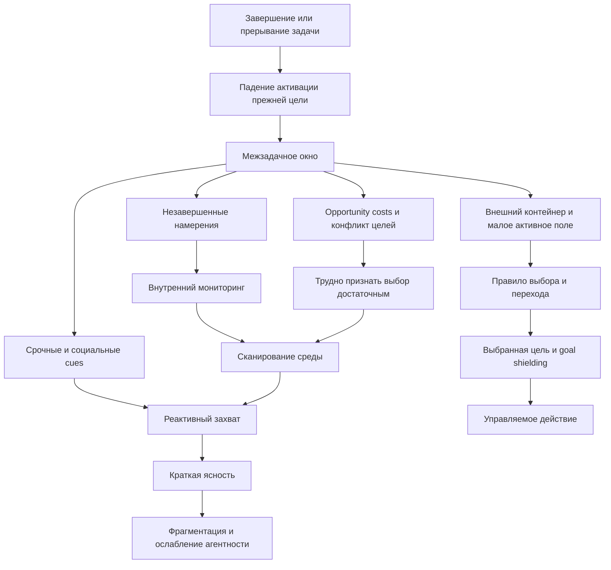

# Выжимка для книги

## Главный редакторский тезис

Часть прокрастинации начинается не перед неприятной задачей, а **между задачами**. В этот момент человек должен заново собрать поле обязательств, выбрать одно дело, признать выбор достаточно хорошим, временно отказать в обслуживании остальным и защитить новый фокус. Сама эта операция может быть дороже первых шагов уже выбранной работы.

Важно не выдавать эту рамку за уже валидированный единый конструкт. Наука хорошо поддерживает ее детали: switch cost, voluntary task switching, memory for goals, prospective memory, интерференцию незавершенных целей, goal shielding, goal conflict, implementation intentions, cognitive offloading, attention residue и recovery experiences. Но связь `часть прокрастинации = межзадачный диспетчерский сбой` остается авторским инженерным синтезом.

## Рабочие определения

**Личная диспетчеризация** - операция восстановления активного поля, выбора следующей цели, легитимации временного отказа от конкурентов и стабилизации нового объекта усилия.

**Межзадачное окно** - короткий период после остановки одной задачи и до защиты следующей, когда ни один task set не управляет поведением достаточно устойчиво.

**Легитимация выбора** - признание, что одна задача имеет право получить ограниченный блок внимания, а остальные важные дела не отменяются, но до контрольной точки временно не обслуживаются.

**Управляемая реактивность** - заранее спроектированные каналы, окна и правила, по которым входящее может законно изменить текущий план.

**Распад диспетчеризации** - сканирование и метание без выбранного направления и без полноценного detachment; это не равно ни работе, ни восстановлению.

## Причинная архитектура

Схема синтетическая. Она соединяет исследовательские линии с разными операционализациями и не является готовой экспериментально проверенной цепью.

## Что обязательно различить

| Внешне похожее состояние | Главный диагностический вопрос | Что не делать | Первая проверка |
| --- | --- | --- | --- |
| Сбой выбора между задачами | Становится ли легче после внешнего выбора конкретной задачи? | Морализировать или увеличивать весь backlog | Сузить активное поле до 2-3 кандидатов и применить правило достаточности |
| Task aversion выбранного дела | Выбор уже сделан, но неприятен сам контакт? | Бесконечно пересматривать приоритет | Проверить точку аверсии, неясность и первый физический шаг |
| Цена переключения | Остался ли контекст в предыдущей задаче? | Объявлять любое переключение нарушением дисциплины | Оставить exit note, затем восстановить context cue новой задачи |
| Перегруз намерений | Приходится ли удерживать в голове `не забыть`? | Добавлять еще один ненадежный список | Вынести намерение в контейнер с конкретным cue, датой обзора или next action |
| Дефицит восстановления | Есть ли вообще ресурс для выбора и запуска? | Маскировать истощение time blocking | Оценить сон, перегруз, стресс; сначала detachment и сужение поля |
| Тревожная неопределенность | Не превратился ли выбор в safety behavior: еще раз проверить, сверить, спросить? | Увеличивать объем данных без stop-rule | Ввести критерий достаточности и порог профессиональной оценки |
| Реактивная среда | Можно ли сохранять план при текущем числе входящих? | Лечить системную фрагментацию личной волей | Согласовать interrupt policy, аварийный канал, WIP и роли |
| ADHD, депрессия, выгорание или нарушение сна | Устойчив ли паттерн, пронизывает ли сферы жизни и есть ли соматические или клинические маркеры? | Подменять оценку еще одним productivity-протоколом | Профессиональная оценка и адаптированные внешние опоры |

## Ценные смысловые блоки

Полная двусторонняя сеть вынесена в [карту смысловых связей](<05-Карта-смысловых-связей.md>). Для будущей главы особенно важны:

1. [Межзадачное окно](<05-Карта-смысловых-связей.md#dispatch-window>) как отдельная фаза рабочего контура.
2. [Выбор и исполнение](<05-Карта-смысловых-связей.md#choice-vs-execution>) не являются одной и той же трудностью.
3. [Активация цели и context cues](<05-Карта-смысловых-связей.md#goal-activation>) объясняют, почему след выхода одновременно паркует прошлое и готовит возврат.
4. [Конкуренция целей и goal shielding](<05-Карта-смысловых-связей.md#goal-competition>) требуют не уничтожить альтернативы, а временно снять их с диспетчерского экрана.
5. [Легитимация выбора](<05-Карта-смысловых-связей.md#legitimacy>) имеет не только логическую, но и эмоциональную цену.
6. [Внешний cue](<05-Карта-смысловых-связей.md#external-cues>) может заменить внутреннюю генерацию приоритета, но не должен становиться единственным источником направления.
7. [Реактивная работа](<05-Карта-смысловых-связей.md#reactivity>) не равна бездействию, но может создавать много движения без авторского курса.
8. [Opportunity cost и EVC](<05-Карта-смысловых-связей.md#opportunity-cost>) дают более современное объяснение цены выбора, чем метафора исчерпанной силы воли.
9. [Незавершенные намерения](<05-Карта-смысловых-связей.md#unfinished-intentions>) можно освободить от мониторинга, не завершая, а надежно планируя их возврат.
10. [Cognitive offloading](<05-Карта-смысловых-связей.md#offloading>) полезен, только если внешняя система возвращает однозначный следующий контакт, а не новую бюрократию.
11. [Личный WIP](<05-Карта-смысловых-связей.md#wip>) полезен как инженерная гипотеза, но не имеет универсального научно установленного числа.
12. [Ритуал перехода](<05-Карта-смысловых-связей.md#transition>) должен парковать старый контекст, выбирать новый и заканчиваться раньше, чем станет еще одной задачей.
13. [Предварительное и условное планирование](<05-Карта-смысловых-связей.md#planning>) переносит микрорешения из дорогого момента в более дешевую контрольную точку.
14. [Восстановление или распад](<05-Карта-смысловых-связей.md#recovery>) различаются по наличию осознанного выбора, границы и detachment, а не по внешней пассивности.
15. [Агентность и ownership](<05-Карта-смысловых-связей.md#agency-ownership>) требуют не только внешней структуры, но и права самому задавать и пересобирать курс.
16. [Клинические и evidence-границы](<05-Карта-смысловых-связей.md#clinical-evidence>) запрещают диагностировать по одному поведенческому рисунку и обещать эффект инженерных техник при клинике.

## Инженерная архитектура

### 1. Развести хранение и выбор

Один огромный список плохо выполняет обе функции. Нужны четыре разных представления:

1. **Реестр обязательств** - все, что нельзя потерять.
2. **Активное поле** - малое число целей, которые имеют право конкурировать сейчас.
3. **Текущая задача** - единственный центр конкретного рабочего блока.
4. **Припарковано до обзора** - цели, которые не отменены, но не имеют права прерывать до указанной контрольной точки.

Это не утверждение об универсальном числе WIP. Число нужно подбирать по природе работы, длине цикла и реальной среде.

### 2. Протокол выхода из задачи

1. Зафиксировать, что сделано и какой результат изменил мир.
2. Описать точку остановки и открытый вопрос.
3. Указать следующее физическое действие, а не абстрактное `продолжить`.
4. Назначить cue возврата: время, событие, обзор или внешний ответ.
5. Закрыть инструменты и не позволять следу выхода разрастись в новый рабочий блок.

### 3. Протокол межзадачного перехода

1. Не открывать чаты или полный backlog по привычке.
2. Открыть малое активное поле, собранное на предыдущем обзоре.
3. Применить заранее заданное правило: последствия, срок, ценность, доступность next action и наличный ресурс.
4. Сказать: `этот выбор достаточен до конца блока`.
5. Изменять выбор только при настоящем сигнале из заранее определенного класса, а не после любого нового ощущения.

### 4. Протокол входа

1. Восстановить context cue и точку остановки.
2. Назвать один наблюдаемый результат блока.
3. Назвать первый физический шаг.
4. При высокой цене входа использовать if-then: `если открыл след, то делаю X`.
5. Не пересматривать приоритет до получения первой обратной связи.

### 5. Протокол прерываний

1. Отделить аварийные каналы от обычных входящих.
2. Заранее определить, какие сигналы имеют право прервать блок.
3. Для остального использовать if-then-правило `записать во входящий буфер -> вернуться`.
4. После вынужденного прерывания оставить короткий resumption cue.
5. Измерять не число прочитанных сообщений, а число незапланированных смен ведущей цели.

### 6. Weekly dispatch review

1. Выгрузить новые обязательства из головы и входящих каналов.
2. Закрыть, делегировать, пересогласовать или припарковать то, что не должно оставаться активным.
3. Выбрать малую активную поверхность на неделю.
4. Для каждой активной цели записать next action, cue и stop/review point.
5. Явно назвать, что на этой неделе **не делается**, и когда это решение будет пересмотрено.

## Как оценивать протокол

Метрики нужны не для тотального самонаблюдения, а для проверки, снижает ли система цену перехода:

- медиана времени от остановки до начала следующего осмысленного блока;
- доля переходов, в которых первым действием было сканирование чатов или полного backlog;
- число незапланированных смен ведущей цели за день;
- доля активных задач, у которых есть next action и cue возврата;
- число обязательств, которые просрочены из-за потери, а не осознанного выбора;
- субъективная трудность легитимации выбора до и после недели теста;
- восстанавливает ли пауза vigor и detachment или остается тревожным метанием.

Если трекинг сам по себе повышает цену системы, оставить одну метрику и короткий еженедельный разбор.

## Red flags

Инженерный протокол недостаточен, если трудность:

- пронизывает учебу, работу, быт и отношения и присутствует с детства;
- сопровождается стойким нарушением сна, аппетита, ангедонией, выраженной тревогой, паникой или руминацией;
- появилась после заметного истощения, перегруза или изменения когнитивного функционирования;
- не меняется на протяжении нескольких недель даже при достаточном сне, снижении перегруза и простой внешней структуре;
- сопровождается суицидальными мыслями или резкой утратой способности поддерживать базовый уход за собой.

При суицидальных мыслях нужна срочная профессиональная помощь. Когнитивное инженерство может дополнять лечение, но не заменять его.

## Границы утверждений

- `Personal task dispatching` не является признанным диагнозом или единым психометрическим конструктом.
- Не всякая прокрастинация начинается между задачами; task aversion, fear of failure, неясность и дефицит ресурса остаются самостоятельными механизмами.
- Сложный выбор может повышать субъективную цену контроля, но не следует объяснять это буквальным истощением запаса самоконтроля.
- Эффект choice overload не универсален и зависит от сложности набора, неопределенности предпочтений, цели и трудности решения.
- Цифры о switch/resumption time, размерах эффектов и клинической распространенности нужно повторно сверять с первоисточниками.
- Тайм-блокинг, личный Kanban/WIP-limit и shutdown ritual собираются из правдоподобных и частично поддержанных механизмов, но не имеют той же прямой evidence-базы, что implementation intentions или отдельные recovery experiences.
- Внешний запрос может теоретически менять EVC и снимать цену выбора, но это не прямой эксперимент на жизненном феномене личной диспетчеризации.

## Редакторское размещение

Тема лучше работает как сквозной контур, а не как изолированная глава о тайм-менеджменте:

1. После внешнего контура и рабочего журнала - зачем системе разные представления хранения и выбора.
2. В главах о мотивации и усилии - цена отказа от альтернатив и легитимация выбора.
3. В главе о прокрастинации - межзадачное избегание как отдельная ветка, не заменяющая task aversion.
4. В главах о WIP, времени и ресурсах - малая активная поверхность, припаркованные цели и режим пересмотра.
5. В главах об агентности и лидерстве - управляемая реактивность, полномочия, interrupt policy и риск выращивать исполнителя, который может действовать только по внешнему сигналу.
6. В практикуме - отдельные протоколы выхода, перехода, входа, прерываний и weekly dispatch review.
