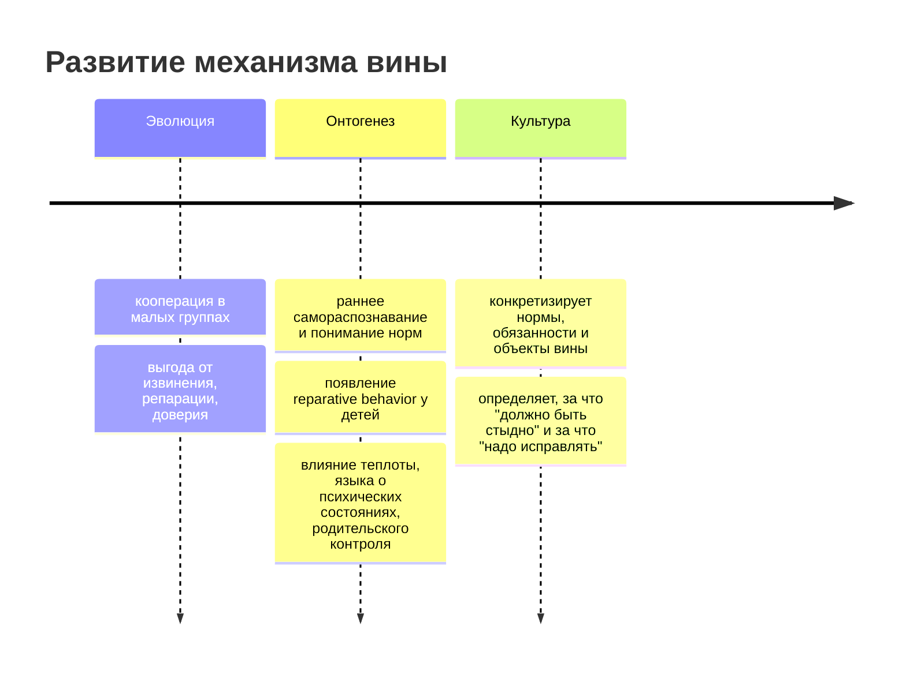
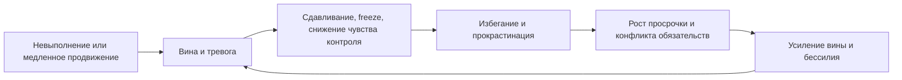

# Аналитический отчёт по переживанию вины, бессилия и блокировки действия

## Executive summary

Вина лучше понимать не как "просто неприятное чувство", а как морально-социальный механизм, который сообщает: "я нарушил важное обязательство, причинил вред или рискую это сделать". В отличие от стыда, который бьёт по целому "я", вина обычно привязана к конкретному действию и чаще ведёт к ремонту отношений, извинению, исправлению ущерба и более надёжному поведению в будущем. Тревога же связана прежде всего с угрозой и неопределённостью, а бессилие - с оценкой низкой контролируемости ситуации и тенденцией к пассивности. В реальных рабочих конфликтах эти состояния часто смешиваются: человек испытывает anticipatory guilt перед близкими и коллегами, тревогу из-за дедлайна и бессилие из-за ощущения, что "любое действие уже запоздало". citeturn23search1turn23search2turn23search15turn36search0turn36search3

Телесные симптомы вроде сдавливания груди, живота и горла, "комка" в горле, невозможности начать, а также замирания перед задачей хорошо укладываются в сочетание автономного возбуждения и торможения действия. Для вины уже показаны изменения электродермальной активности, желудочного ритма и частоты глотания; для freeze-реакции - обездвиживание и сердечная брадикардия в условиях угрозы, в том числе социальной. Но по одним только телесным ощущениям нельзя надёжно отличить вину от тревоги или бессилия: здесь пока недостаточно данных, и специфического "биомаркера вины" для повседневных состояний нет. citeturn22search0turn7search4turn10search3turn16search3turn10search11

В контексте конфликтов обязательств и прокрастинации ключевой механизм выглядит так: невыполнение усиливает негативный аффект, а прокрастинация временно регулирует этот аффект, покупая краткосрочное облегчение ценой худшего будущего состояния. Поэтому эффективные вмешательства почти всегда бьют не только по "дисциплине", но и по эмоциональной регуляции: разделение вины и стыда, восстановление чувства контроля, структурирование обязательств, конкретизация следующего шага, тренировка toleration of discomfort, а при травматической вине - CPT, PE и EMDR. Для прокрастинации лучшая доказательная база у CBT-подходов и структурированных поведенческих интервенций; ACT выглядит многообещающе, но данных меньше и они более неоднородны. citeturn29search5turn29search0turn29search7turn13search4turn13search16turn28search0turn28search4turn30search23

## Вина как адаптивный механизм

Современная литература описывает вину как self-conscious moral emotion: она возникает после саморефлексии, когда человек оценивает своё действие как причиняющее вред, нарушающее норму или предающее собственные ценности. Её адаптивная функция не в том, чтобы "наказать" человека, а в том, чтобы связать норму, ответственность и последующее восстановительное поведение: признание проступка, компенсацию, корректировку стратегии, повышение надёжности для других. Именно поэтому вина часто лучше предсказывает просоциальность, чем просто "хороший характер". citeturn23search1turn18search19turn35search0

Схема выше обобщает модельные и эмпирические данные: эволюционные работы рассматривают вину как механизм стабилизации сотрудничества и компенсации, а developmental research показывает, что её поведенческие предшественники появляются рано и дальше насыщаются культурными нормами. Прямых "ископаемых" доказательств эволюции вины, разумеется, нет; это реконструкция по моделям, сравнительной психологии и современному поведению. citeturn17search10turn17search2turn17search15turn25search18turn27search5

Ключевая работа здесь - Tangney, Stuewig, Mashek, 2007, Annual Review of Psychology, DOI 10.1146/annurev.psych.56.091103.070145. Это фундаментальный обзор, который различает вину и стыд, показывает их место среди moral emotions и подчёркивает роль anticipatory guilt: человек может избегать нарушения не только из-за наказания, но и потому, что заранее знает, как будет чувствовать себя после проступка. Ограничение обзора в том, что он синтезирует преимущественно западные и часто корреляционные данные. citeturn23search1

Модельная работа O'Connor, 2016, Philosophy of Science, DOI 10.1086/687873, и статья Rosenstock, O'Connor, Bruner, 2018, Frontiers in Robotics and AI, показывают, что guilt-prone стратегии могут быть эволюционно выгодны там, где отношения повторяются, извинение трудно подделать, а социальная репутация и будущая кооперация важны. Это важно для рабочего контекста: вина особенно "полезна" в мирах повторных взаимодействий, где нужно оставаться надёжным партнёром, а не просто избегать наказания. Но это всё же математические и концептуальные модели, а не прямое доказательство происхождения эмоции. citeturn17search10turn17search2turn17search15

Эмпирически эту логику поддерживают Levine et al., 2018, Journal of Personality and Social Psychology, DOI 10.1037/pspi0000136, и Wiltermuth & Cohen, 2014, JPSP, DOI 10.1037/a0037523. Первая работа показывает, что guilt-proneness хорошо предсказывает надёжное поведение через чувство межличностной ответственности. Вторая добавляет важную деталь: люди с высокой склонностью к вине могут избегать interdependence, если боятся подвести партнёра; то есть один и тот же механизм может вести и к ответственности, и к избеганию обязательств, если цена ошибки воспринимается как слишком высокая. Это очень близко к переживанию "лучше не начинать, чем снова подвести". citeturn35search0turn35search1

Практический вывод отсюда такой: вина не равна патологии. Её нормальная функция - сделать вред заметным и поправимым. Проблема начинается тогда, когда сигнал ремонта превращается в состояние самопаралича, либо когда обязательства конфликтуют так сильно, что система больше не может выбрать действие, сохраняющее отношения со всеми сторонами сразу. citeturn23search1turn35search1turn36search3

## Нейробиология, физиология и freeze

Нейробиология вины сегодня описывается не как один "центр вины", а как сеть, связанная с интероцепцией, социальной оценкой, ответственностью, обработкой вреда и выбором компенсирующего поведения. Мета-анализ нейровизуализации показал, что вина и стыд/смущение частично пересекаются в передней островковой коре, связанной с осознаванием телесного и эмоционального состояния, но расходятся по паттернам, связанным с самореференцией и социальной оценкой. Отдельные исследования указывают, что guilt-компутации особенно зависят от восприятия нанесённого вреда, а shame-компутации - от приписываемой ответственности и образа "я" в глазах других. citeturn12search6turn23search3turn21search4turn10search25

Ключевая работа Piretti et al., 2023, Brain Sciences, DOI 10.3390/brainsci13040559. Это voxel-based meta-analysis по fMRI/PET-исследованиям самосознательных эмоций, полезный тем, что не опирается на одну лабораторию и суммирует разрозненную нейровизуализацию. Его ограничение типично для meta-analysis этого типа: малые и методологически разные первичные исследования. citeturn12search6turn12search3

Работа Stewart et al., 2023, Cognitive, Affective, & Behavioral Neuroscience, DOI 10.3758/s13415-023-01079-3, особенно важна для телесной стороны. У здоровых взрослых при индукции вины были обнаружены отличия в желудочном ритме, электродермальной активности и частоте глотания по сравнению с рядом других эмоций. Это одна из немногих статей, где "вина" связывается не только с мыслями, но и с измеряемой физиологией; однако исследование лабораторное, с искусственной индукцией эмоций, поэтому переносить его напрямую на офисные дедлайны нужно осторожно. citeturn22search0turn7search4

Если перевести это на язык симптомов, то сдавливание горла может быть связано с изменением дыхания, мышечного напряжения и паттерна глотания; давление в животе - с изменением gastric rhythms и общей интероцептивной сенситизацией; давление в груди - с социальной угрозой, симпатической активацией и одновременным торможением действия. Но прямых данных, что именно сочетание "грудь-живот-горло" является signature-pattern для вины, нет. Здесь корректная формулировка - "совместимо с виной, тревогой и freeze", а не "доказывает вину". citeturn22search0turn7search4turn10search3

Отдельно стоит freeze. Обзор Roelofs, 2017, Neuroscience and Biobehavioral Reviews, показал, что freeze - это не "леность" и не сознательный отказ действовать, а древняя defensive response с иммобилизацией и брадикардией, которая помогает выиграть время для оценки угрозы и выбора дальнейшего поведения. В эксперименте Roelofs et al., 2010, DOI 10.1177/0956797610384746, даже социальная угроза в виде злых лиц вызывала bodily freezing у людей. Это делает рабочую блокировку понятнее: при переживании дедлайна как угрозы статусу, отношениям и самооценке организм может одновременно готовить вас к действию и тормозить действие. citeturn10search3turn16search3turn16search7turn10search11

Практическое следствие простое: если в момент "надо срочно начать" тело уходит в сдавливание и ступор, полезно не спорить с собой на уровне морали, а сначала вернуть моторный контроль. Для этого лучше работают короткие action-ориентированные шаги: удлинённый выдох, посадка корпуса, конкретизация первого физического действия на 2-5 минут, снижение степени неопределённости, а уже потом когнитивная оценка "виноват ли я и перед кем". Такой порядок лучше согласуется с данными о freeze и emotion regulation, чем попытка "пристыдить себя в движение". citeturn10search3turn29search5turn29search7

## Когнитивные модели, конфликты обязательств и прокрастинация

Когнитивно вина, стыд, тревога и бессилие отличаются не интенсивностью страдания, а содержанием оценки. Вина говорит: "я сделал или не сделал что-то плохое". Стыд: "со мной как с человеком что-то не так". Тревога: "впереди угроза". Бессилие: "исход не зависит от меня или любое действие бесполезно". На практике при конфликте обязательств переживания смешиваются, и именно эта смесь создаёт паралич: moral signal толкает к исправлению, threat signal толкает к защите, low-control appraisal стирает ожидание эффективности. citeturn23search1turn23search15turn36search0turn36search3

| Эмоция/состояние | Типичные триггеры | Телесные симптомы | Когнитивный контент | Поведенческие последствия | Наиболее релевантные подходы |
|---|---|---|---|---|---|
| Вина | причинённый вред, нарушение нормы, невыполненное обещание | тяжесть, внутреннее напряжение, "ком" в горле, дискомфорт в животе | "я сделал неправильное" | извинение, репарация, иногда избегание при высокой цене ошибки | CBT для переоценки ответственности, reparative action, CPT/EMDR при травме |
| Стыд | разоблачение, унижение, ощущение дефекта "я" | жар, желание исчезнуть, collapse-поза | "я плохой/недостойный" | спрятаться, отстраниться, атаковать или обесценить | compassion-based work, ACT, CBT, работа с самокритикой |
| Тревога | неопределённость, риск наказания, дедлайн, социальная угроза | грудное сжатие, учащённое дыхание, мышечное напряжение | "что-то плохое случится" | гипервнимание, суета, избегание | CBT, экспозиция, техники toleration of uncertainty |
| Бессилие | повторная неконтролируемость, ощущение бесполезности усилий | вялость, "отключение", пассивность, иногда freeze | "ничего не поможет" | отказ от попыток, пассивность, delayed action | восстановление controllability, task chunking, behavior activation, problem solving |

Источники для таблицы: различение вины и стыда, их типичных когниций и поведенческих тенденций суммировано по Tangney et al. и Kim et al.; телесные элементы и freeze - по Stewart et al. и Roelofs; бессилие - по исследовательской линии learned helplessness и controllability. citeturn23search1turn23search2turn22search0turn16search3turn10search3turn36search0turn36search3

Предвосхищаемая вина играет двоякую роль. С одной стороны, она делает человека более надёжным и тормозит неэтичные решения. С другой - если обязательства становятся конкурирующими и все исходы выглядят как "я кого-то подведу", anticipatory guilt может начать блокировать само вступление в действие. Тогда человек уже не "чинит нарушение", а пытается не столкнуться с переживанием того, что подвёл и работу, и семью одновременно. citeturn35search0turn35search1

Эта петля хорошо соответствует современной модели прокрастинации как краткосрочной регуляции настроения. Работа Sirois & Pychyl, 2013, DOI 10.1111/spc3.12011, стала программной: прокрастинация рассматривается не как дефицит знания о дедлайнах, а как попытка быстро уйти от неприятного аффекта. Steel, 2007, мета-анализ по прокрастинации, добавляет к этому стабильные связи с импульсивностью и self-regulatory failure. citeturn29search5turn5search0

Эмпирически это подтверждают Mohammadi Bytamar et al., 2020, DOI 10.3389/fpsyg.2020.524588, и Schuenemann et al., 2022, DOI 10.3389/fpsyg.2022.780675. Первая статья показывает, что трудности эмоциональной регуляции значимо связаны с академической прокрастинацией. Вторая демонстрирует, что улучшение эмоциональной регуляции может уменьшать прокрастинацию и улучшать благополучие; это важно, потому что направляет интервенции не только на "тайм-менеджмент", но и на переносимость неприятных эмоций. Ограничение обоих направлений - сильная доля студенческих выборок. citeturn29search3turn29search7

Практический вывод: в конфликтах обязательств полезно разделять два вопроса. Первый - "есть ли здесь реальный моральный ущерб, который нужно ремонтировать?" Второй - "какое минимальное действие восстановит контроль прямо сейчас?" Пока эти вопросы слиты, вина быстро конвертируется в бессилие, а бессилие - в избегание. citeturn35search1turn36search3turn29search5

## Развитие у детей и сравнительная психология

Самосознательные эмоции не даны в готовом виде с рождения: они развиваются по мере самораспознавания, понимания норм, перспективы другого и социального языка. Современные обзоры и мета-анализы показывают, что родительско-детские отношения действительно связаны с тем, как ребёнок переживает стыд и вину, но эффекты не сводятся к простой формуле "строгость плохо, мягкость хорошо". Теплота, поддержка и разговоры о намерениях, чувствах и последствиях обычно связаны с более адаптивными формами самосознательных эмоций; психологический контроль и унижающие практики чаще ассоциируются с более проблемным стыдом. citeturn15search5turn15search9turn26search1turn26search3turn25search18

Ключевая работа van Eickels et al., 2025, Child Development, DOI 10.1111/cdev.14212. Это meta-analytic systematic review по связи parent-child relationship с детскими shame/guilt, полезный тем, что сводит разрозненные исследования в одну карту факторов. Ограничение - сильная неоднородность измерений: разные шкалы, разные возраста, разные культурные контексты. citeturn15search5turn15search9

Работа Nikolic et al., 2023, Scientific Reports, DOI 10.1038/s41598-023-38502-1, ценна тем, что смотрит именно раннее детство: parental warmth и mental state language связаны с тем, как маленькие дети переживают mishap и переходят к prosocial repair. Это приближает развитие вины к её функции: не "страдать", а восстанавливать связь после причинённого вреда. citeturn26search0turn26search1

Ещё один важный блок - исследования toddlers' guilt and repair. Drummond et al., 2017, Child Development, DOI 10.1111/cdev.12653, и Donohue et al., 2019, показывают, что уже у маленьких детей guilt-like responses связаны с reparative prosocial behavior и что такие действия реально уменьшают переживание вины. Это сильный аргумент против бытового мифа, будто "вина нужна только чтобы мучиться": её developmental core - восстановление отношений. citeturn27search2turn27search5turn27search8

По сравнительной психологии картина осторожная. У шимпанзе есть убедительные данные о consolation и sympathetic concern: постконфликтное утешение снижает дистресс пострадавшего, а устойчивость такого поведения связана с эмпатическими чертами. Но это не равнозначно человеческой вине, потому что для вины нужна сложная связка саморефлексии, нормы, ответственности и контрфактического мышления. Здесь корректный вывод - "есть эволюционные предшественники эмпатии и репарации", но не "шимпанзе испытывают человеческую вину". citeturn37search2turn37search5turn37search11

Для собак данные ещё жёстче: знаменитый "guilty look" в эксперименте Horowitz, 2009, Behavioural Processes, DOI 10.1016/j.beproc.2009.03.014, лучше объясняется реакцией на поведение хозяина и сигналы возможного наказания, чем переживанием вины как внутреннего морального состояния. Повторные обсуждения этого эффекта поддерживают вывод, что антропоморфная интерпретация здесь ненадёжна. По вопросу "испытывают ли собаки вину" следует честно писать: недостаточно данных. citeturn37search0turn37search16turn37search4

## Когда вина становится патологической и что помогает

Патологическая вина - это не просто сильная вина. Обычно речь идёт о переживании, которое становится чрезмерным, неадекватным фактам, хроническим, генерализованным или переплетённым со стыдом, самоуничижением и беспомощностью. В депрессии excessive or inappropriate guilt входит в диагностическую картину; мета-анализ Kim et al., 2011, DOI 10.1037/a0021466, показывает, что shame гораздо сильнее связан с депрессивными симптомами, чем адаптивная guilt-proneness, но и вина может становиться клинически значимой, если теряет связь с реальным, ограниченным проступком и превращается в глобальное самообвинение. citeturn24search0turn24search27turn23search2turn24search20

В травматическом спектре данные тоже сильные. Метa-анализ Kip et al., 2022, Psychological Medicine, DOI 10.1017/S0033291722001866, показал устойчивую положительную связь trauma-related guilt с PTSD-симптомами. В линии survivor guilt Murray, 2021, описывает когнитивную модель, где вина поддерживается контрфактическими мыслями, завышенной ответственностью и конфликтом между самосохранением и лояльностью к пострадавшим; это особенно важно для людей, у которых вина сочетается с вопросами "почему выжил/успел/не сделал больше". citeturn14search11turn8search4turn24search3turn24search18

Для OCD вина тоже релевантна, но здесь она часто носит deontological и responsibility-loaded характер: человеку важно не столько не причинить реальный вред, сколько не быть тем, кто "мог нарушить правило" или "допустить виновную ошибку". По этой причине слишком общий совет "просто перестань винить себя" работает плохо: нужна работа с гиперответственностью, сомнением и ritualized avoidance. citeturn24search5turn24search2

| Подход | Основная цель | Влияние на вину/бессилие | Ключевые данные |
|---|---|---|---|
| CBT для прокрастинации | снизить избегание, реструктурировать мысли, запустить действие | уменьшает петлю "негативный аффект -> откладывание" | систематический обзор и мета-анализ Rozental et al., 2018, DOI 10.3389/fpsyg.2018.01588; RCT Rozental et al., 2018, DOI 10.1016/j.beth.2017.08.002 citeturn13search4turn13search16 |
| ACT | увеличить психологическую гибкость и ценностное действие | полезен, когда человека парализует борьба с внутренним состоянием; данные по прокрастинации обещающие, но слабее | pilot study Lopez-Lopez et al., 2020, DOI 10.5093/cc2020a3; обзоры по ACT показывают общую эффективность через psychological flexibility citeturn20search2turn34search18turn34search3 |
| CPT | переработать self-blame, ответственность и meaning of trauma | особенно полезен при trauma-related guilt | Nishith et al., 2005 показали снижение guilt в CPT; VA/DoD и VA считают CPT одним из наиболее исследованных PTSD-treatment'ов citeturn9search3turn28search0turn28search4 |
| EMDR | переработать дистресс и травматическую память | может снижать guilt/shame в trauma-related presentations; лучше обоснован для PTSD, чем для "обычной" житейской вины | VA/DoD рекомендуют EMDR для PTSD; Miccoli & Poli, 2024, DOI 10.3389/fpsyt.2024.1369216, показали улучшение guilt/shame в RCT-контексте citeturn28search0turn30search23turn31search1 |
| Self-compassion interventions | разорвать связь между ошибкой и самонаказанием | снижает стрессовое усиление прокрастинации и помогает отличать ответственность от самобичевания | Sirois, 2014, DOI 10.1080/15298868.2013.763404; Neff review summarises robust benefits self-compassion citeturn32search7turn19search2 |
| Implementation intentions и task chunking | вернуть controllability и перевести намерение в действие | особенно полезны, когда проблема не в ценностях, а в запуске поведения | Gustavson & Miyake, 2017, обучали SMART-goals и implementation intentions; обзор Salguero-Pazos et al., 2023 отмечает структурные интервенции как рабочее ядро citeturn20search1turn20search12 |
| TrIGR | адресно снижать trauma-related guilt и moral injury | перспективен именно для клинической вины после травмы | программа показала снижение guilt, PTSD и depression symptoms у ветеранов; пока это более узкая и контекстная база доказательств citeturn30search10 |

Для повседневной вины и рабочего паралича практические техники разумно выстраивать по ступеням. Сначала разделить "моральный ремонт" и "исполнительный запуск": отдельно ответить, перед кем действительно есть долг и какой минимальный repair нужен, и отдельно определить следующий физический шаг по задаче. Затем уменьшить глобальность обязательств: не "закрыть проект", а "открыть документ, выписать три невыполненных блока, отправить одно сообщение о статусе". После этого полезны implementation intentions вида "если наступает 19:00 и я хочу избежать задачи, то я делаю 5 минут только первого шага". Такой формат напрямую бьёт по узкому месту между намерением и действием. citeturn29search5turn20search1turn20search12

Если доминирует фраза "любой ход всё ухудшит", ключевой мишенью становится не вина, а controllability appraisal. Здесь лучше работают problem-solving, пересборка обязательств, явное ранжирование ущерба, временное согласование ожиданий с близкими и поведенческая активация маленьким шагом. Если же всплывают навязчивые сцены, ретроспективные "я должен был", выраженные стыд и самоунижение, особенно после травмы, тогда это уже не просто прокрастинация, и более уместны CPT, EMDR или другой trauma-focused protocol. citeturn36search3turn28search0turn28search4turn30search23turn14search11

Итог по ограничениям. Для обычной, не травматической вины в рабочих конфликтах прямых RCT меньше, чем для PTSD или академической прокрастинации; многие данные идут из студенческих выборок, лабораторных индукций эмоций и самоотчётов. По телесным симптомам "сдавливание груди/живота/горла" и по человеческой вине у животных данные тоже ограничены: в первом случае нет надёжной дифференциальной диагностики по физиологии alone, во втором - есть только поведенческие предшественники эмпатии и репарации, но не доказательство человеческой моральной вины. В этих пунктах корректная пометка - "недостаточно данных". citeturn22search0turn10search3turn37search2turn37search16turn13search4
