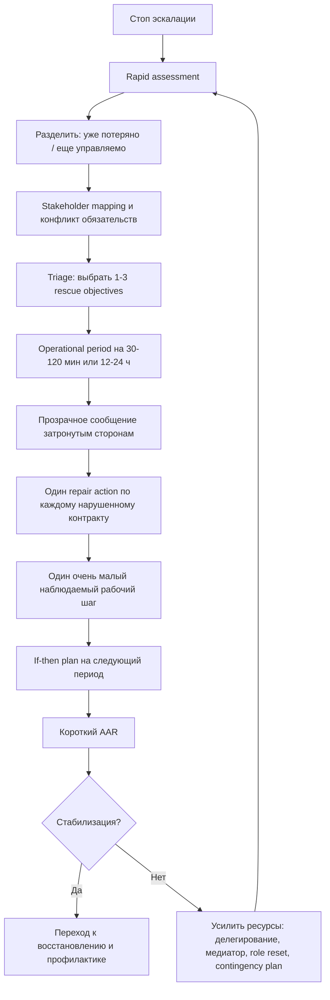

# Аналогия между личной психологической ловушкой и кризисом организации

## Краткое резюме

Описанное состояние - смесь вины, предвосхищаемой вины, тревоги, чувства безвыходности, конфликта обязательств и блокировки действия - действительно хорошо описывается как структурная аналогия организационного или государственного кризиса. На обоих уровнях возникает один и тот же паттерн: угроза значимым обязательствам, дефицит времени, неопределенность, конкурирующие требования заинтересованных сторон, ощущение нехватки ресурсов и риск потери легитимности или доверия. В психике это переживается как "я никуда не могу сдвинуться, не ухудшив что-то еще"; в организации - как паралич принятия решений, репутационный риск и нарастающий backlog под давлением дедлайнов. Такая аналогия опирается на хорошо установленные данные о кризисах как состояниях угрозы, неопределенности и срочности, а также на исследования вины, стыда, learned helplessness, defensive freezing и прокрастинации. citeturn9search1turn9search4turn9search16turn0search8turn0search2turn0search7turn0search1

Хорошо установлено следующее. Вина чаще связана с reparative action, а стыд - с уходом, скрыванием и самофокусом; прокрастинация часто работает как краткосрочная регуляция неприятных эмоций ценой долгосрочного ухудшения ситуации; learned helplessness и defensive freezing возникают, когда субъект перестает видеть контролируемый путь к улучшению; debriefs/after-action reviews, properly conducted, улучшают обучение и производительность; choice architecture и implementation intentions помогают переводить намерение в действие; поведенческая активация уменьшает депрессивную инерцию и повышает activation. citeturn0search8turn0search4turn0search28turn0search1turn0search25turn0search2turn0search6turn0search7turn21search3turn15search8turn2search7turn5search2turn6search2turn7search0turn17search6

Менее твердо установлено, но правдоподобно как рабочая гипотеза, что некоторые организационные инструменты можно переносить на одного человека почти "как есть": incident triage, stakeholder mapping, operational periods, restorative repair rituals, just culture, adaptive leadership и sensemaking. Для части из них есть сильная база на уровне команд и организаций, но перенос на индивидуальный уровень - это экстраполяция, а не прямое клиническое доказательство. Особенно это касается SCARF и части "нейролидерских" практик: как эвристика они полезны, но как самостоятельные доказанные кризисные интервенции они поддержаны намного слабее, чем AAR, BA, implementation intentions или psychological safety. citeturn11search10turn11search12turn11search14turn13search6turn20search15turn8search5turn8search11turn14search21turn15search18

Практический вывод простой. Наиболее переносимые методы из crisis management на такой личный тупик - это: быстрое переопределение ситуации через sensemaking, жесткий triage ресурсов и обязательств, перевод бесформенного "исправить все" в короткий operational period, отдельные ритуалы восстановления по каждому нарушенному контракту, прозрачная коммуникация со стейкхолдерами, ограничение WIP, минимально достаточный следующий шаг, внешний контур accountability и последующий short after-action review без саморазгрома. Именно эти методы уменьшают паралич, потому что они не пытаются отменить уже случившийся ущерб, а создают управляемый маршрут от "неразрешимой общей вины" к "локально исправимым обязательствам". citeturn26search10turn26search12turn26search17turn18search13turn12search2turn4search10turn21search3turn5search2turn7search0

## Насколько корректна сама аналогия

С точки зрения теории кризисов аналогия сильна. В классической литературе кризис определяется как ситуация, где люди сталкиваются с серьезной угрозой, высокой неопределенностью и дефицитом времени; при этом кризисы разрушают привычные схемы действия и могут подрывать легитимность институтов. Именно эти признаки почти дословно описывают и личное состояние, в котором человек чувствует, что все доступные действия плохи, а промедление усугубляет ущерб. citeturn9search1turn9search4turn9search10turn22search20

На уровне эмоций сходство тоже опирается на данные, а не только на метафору. Вина чаще мобилизует адресное восстановление ущерба, а не просто абстрактное "стать лучше"; стыд сильнее связан с уходом, скрытием и самоуничижением; freezing и avoidant responses могут временно тормозить переход к активному избеганию или исправлению; learned helplessness появляется, когда субъект начинает воспринимать результаты как слабо зависящие от его действий. В организационном эквиваленте это выглядит как репутационный долг, потеря лица, decision paralysis и ощущение, что "что бы мы ни сделали, будет плохо". citeturn0search8turn0search4turn0search28turn0search7turn0search3turn0search2turn0search6

Тем не менее аналогия не тождество. Индивид имеет нервную систему, телесные реакции и самосознательные эмоции; организация и государство - нет. Поэтому "вина организации" или "стыд государства" - это не буквальные эмоции, а системные проявления: loss of legitimacy, moral injury у профессионалов, blame spirals, репутационный риск, конфликт обязательств перед стейкхолдерами, распад sensemaking и институциональная неподвижность. Это не умаляет ценности аналогии, но требует не путать уровни анализа. citeturn22search2turn22search20turn22search6turn22search12turn20search15

## Карта соответствий между психологическими компонентами и кризисом системы

| Психологический компонент | Ближайший организационный или государственный аналог | Механизм аналогии | Уровень уверенности |
|---|---|---|---|
| Вина | Потеря легитимности, accountability debt, обязанность ремонта | Нарушение обязательства требует признания, компенсации и предотвращения повторения | Высокий для "ремонтной" логики, средний для прямой аналогии эмоции citeturn0search8turn0search28turn10view8turn22search20 |
| Предвосхищаемая вина | Репутационный риск, риск санкций стейкхолдеров | Ожидаемая цена будущего осуждения меняет поведение уже сейчас | Средний citeturn12search1turn12search6turn4search1 |
| Стыд | Loss of legitimacy, identity threat, defensive secrecy | Фокус смещается с "мы сделали ошибку" на "мы плохой актор"; это повышает скрывание и withdrawal | Высокий для различия guilt vs shame, средний для переноса на организации citeturn0search4turn0search8turn10view8turn22search8 |
| Тревога | Кризис как threat + uncertainty + time pressure | Рост срочности, ambiguity и threat overload ломает routine decision-making | Высокий citeturn9search1turn9search4turn9search16 |
| Learned helplessness | Паралич, strategic drift, ощущение неуправляемости | Субъект перестает видеть зависимость исхода от собственных действий и прекращает эффективные попытки влияния | Высокий для механизма controllability, средний для орг-переноса citeturn0search2turn0search6turn3search24 |
| Конфликт обязательств | Конкурирующие требования стейкхолдеров и double bind | Любой вариант решения ухудшает положение хотя бы одной значимой стороны | Высокий citeturn18search12turn16search1turn22search11 |
| Freeze / avoidance | Decision paralysis, procedural delay, escalation failure | Угроза тормозит действие именно тогда, когда ответ нужен быстрее всего | Высокий для механизма freezing, средний для орг-переноса citeturn0search7turn0search19turn9search14 |
| Прокрастинация | Отложенное реагирование, backlog growth, поздняя эскалация | Краткосрочное снижение эмоционального дискомфорта покупается ценой роста риска и долга | Высокий citeturn0search1turn0search25turn17search3 |
| Моральная боль | Moral injury у профессионалов и команд | Системные ограничения заставляют нарушать собственные нормы, порождая гнев, бессилие и отчуждение | Средний-высокий в healthcare/high-stakes settings citeturn22search6turn22search10turn22search12 |
| Руминативное самобичевание | Институциональный blame spiral | Энергия уходит в поиск виноватых и самооправдание, а не в ремонт и обучение | Средний citeturn8search11turn8search5turn21search13 |

Главная ценность этой карты в том, что она позволяет перевести вопрос из морального режима "что со мной не так" в операционный режим "какой тип кризиса передо мной и какие управленческие протоколы уместны". Это уже само по себе снижает вероятность stuck state, потому что sensemaking в кризисах служит переходным мостом между эмоцией и действием. citeturn20search15turn1search17turn1search9

## Какие академические фреймворки действительно применимы

| Фреймворк | Краткое описание | Основной механизм | Что известно об эффективности | Перенос на личный уровень |
|---|---|---|---|---|
| Crisis management | Классический подход к кризису как угрозе под давлением времени и неопределенности; включает sensemaking, response/coordination, meaning-making, accountability и learning | Структурирует хаос в управляемые задачи | Хорошо закреплен в литературе и кейсах государственного и организационного кризис-менеджмента citeturn9search4turn10view8 | Очень применим: сначала понять, потом координировать, затем коммуницировать, закрывать контуры ответственности и учиться |
| Turnaround management | Подход к выходу из упадка через стабилизацию, сокращение потерь, затем восстановление | Сначала stop the bleeding, потом recovery | База умеренно сильная; много кейсов и обзоров, меньше RCT-подобных данных по понятным причинам citeturn3search14turn3search6turn3search1turn3search24 | Полезен, когда личная система перегружена и нужна не "идеальная победа", а разворот тренда |
| Sensemaking | Построение правдоподобной общей картины происходящего под неопределенностью | Уменьшает ambiguity, восстанавливает ориентир для действий | Очень влиятельный и устойчивый теоретический корпус; эмпирика в кризисах поддерживает роль sensemaking и sensegiving citeturn20search15turn1search17turn1search9 | Критически применим: отделить уже потерянное от еще управляемого |
| Incident Command System и NIMS | Стандартизированная система командования, координации, модульной структуры, resource management и planning by operational periods | Снижает хаос через роли, цели, ресурсы и короткие циклы планирования | Очень сильна как доктрина и практика emergency management; высокий практический консенсус, но не RCT-тип доказательств citeturn11search10turn11search12turn11search21turn26search10turn26search17 | Отлично переносится в виде "личного incident action plan" на 12-24 часа |
| Adaptive leadership | Лидерство для задач, у которых нет готового технического решения и нужны обучение, адаптация и перераспределение ролей | Переводит внимание с "кто даст ответ" на "как мобилизовать систему к трудному изменению" | Сильная концептуальная база; эмпирическая поддержка растет, но неоднородна по секторам citeturn13search0turn13search6turn13search2turn2search8 | Полезно, когда проблема не в информации, а в болезненном изменении правил игры |
| Just Culture | Баланс системного анализа ошибок и индивидуальной ответственности без автоматического карательного подхода | Уменьшает silence/blame, повышает reporting и learning | Хорошая база в healthcare и safety-culture; есть обзоры и данные внедрения citeturn1search11turn1search23turn8search5turn8search15 | На личном уровне это переход от "я плохой" к "что было human error, at-risk behavior или recklessness" |
| After-Action Review и debrief | Краткий разбор "что ожидали, что произошло, почему, что меняем" | Создает learning loop и shared mental model | Сильная база: properly conducted debriefs повышают performance примерно на 20-25% в мета-анализах и смежных обзорах citeturn15search8turn21search3turn21search1turn11search14 | Очень полезно как короткий вечерний или утренний разбор без самонаказания |
| Psychological safety | Общая вера команды, что говорить о проблемах, ошибках и сомнениях безопасно | Повышает speaking up, learning behavior и coordination | Сильная эмпирическая поддержка на командном уровне, особенно для обучения и координации citeturn15search13turn15search18turn15search1turn15search6 | На личном уровне требует внешнего собеседника или режима самокоммуникации без карательного тона |
| Restorative justice и repair rituals | Ущерб рассматривается как повреждение отношений, которое требует признания, извинения, возмещения и диалога | Снижает moral deadlock и восстанавливает доверие | Для victim outcomes и reparative processes есть существенная поддержка; для больших национальных reconciliation processes evidence более смешанная и контекст-зависимая citeturn19search2turn12search2turn19search11turn19search6turn19search10 | Очень применимо к вине: вместо "искупить все" - признать конкретный вред и сделать repair |
| Organizational learning и error management | Ошибки рассматриваются не только как то, что надо предотвращать, но и как источник обучения и redesign | Не допускает повторения через системную коррекцию | Хорошая база в обзорах по error management и organizational learning after incidents citeturn21search13turn21search9turn4search8 | На личном уровне это "исправить алгоритм", а не просто "наказать себя" |
| Nudge и choice architecture | Изменение среды выбора без запрета альтернатив | Снижает трение между намерением и действием | Meta-analysis показывает small-to-medium average effect size; эффект зависит от домена и дизайна citeturn2search7turn2search3 | Полезно для запуска действия: упростить первый шаг, убрать лишние выборы, добавить prompts |
| SCARF | Эвристика социальных угроз и вознаграждений: status, certainty, autonomy, relatedness, fairness | Помогает проектировать взаимодействие без лишних threat signals | Как прикладная модель широко используется, но как independently validated crisis-resolution framework поддержана слабее, чем frameworks выше citeturn14search21turn14search0turn14search2 | Полезна как чек-лист коммуникации, но не как главный метод выхода из тупика |

Если свести это к минимуму, то для описанного состояния наилучший "стек" выглядит так: sensemaking + triage/turnaround + короткий incident planning cycle + restorative repair + AAR. Adaptive leadership, psychological safety и Just Culture усиливают этот стек, а Nudge, implementation intentions и BA помогают пробить action-blocking на уровне исполнения. citeturn20search15turn3search14turn26search10turn19search2turn21search3turn15search13turn8search5turn2search7turn5search2turn7search0

## Практические интервенции, переносимые на одного человека

Ниже перечислены интервенции, которые ближе всего к evidence-based и operationally useful переносу с уровня кризис-менеджмента на уровень отдельного человека.

| Интервенция | Цель | Шаги | Когда применять | Риски и ограничения | Ключевые источники |
|---|---|---|---|---|---|
| Decision protocol под неопределенностью | Снизить паралич выбора | Зафиксировать: угроза, срок, кто пострадает, что еще контролируемо, один лучший следующий шаг на период | Когда мысли крутятся, но решение не рождается | Может казаться слишком "холодным" при сильном аффекте; иногда нужен сначала физиологический спад активации | citeturn9search4turn26search10turn26search17 |
| Triage обязательств и WIP | Остановить рост ущерба | Рассортировать задачи по срочности, обратимости ущерба и числу затронутых стейкхолдеров; выбрать 1-2 rescue objectives | Когда "все горит" и ничего не двигается | Есть риск недооценить долгосрочные обязательства; требует честного отказа от части работы сегодня | citeturn16search2turn11search4turn25search19 |
| Reframing | Перевести проблему из морализующего режима в управленческий | Ясно разделить: что уже потеряно, что еще можно спасти, что требует ремонта, а что требует только признания | Когда доминирует "я все испортил" | Если делать слишком рано, может звучать как самооправдание | citeturn20search15turn0search4turn0search8 |
| Small-step restoration | Разбить большую вину на отдельные контуры ремонта | Для каждого пострадавшего контракта сделать по одному действию: признание, компенсация, новый срок или новый следующий шаг | Когда вина есть, но нет выхода | Не устраняет структурную перегрузку, если не менять систему | citeturn0search28turn12search2turn4search10 |
| Accountability ritual | Снять бесформенную моральную тяжесть и превратить ее в protocol | Формула: "признаю - возмещаю - предотвращаю"; желательно письменно в 3-5 строках | После промаха, задержки, нарушения обещания | Может превратиться в ритуальное самонаказание без реального repair | citeturn19search2turn12search2turn8search11 |
| Communication script и renegotiation | Снизить репутационный риск и неопределенность для других | Коротко: статус, риск, новый реалистичный срок, что именно будет сделано до него, что нужно от адресата | Когда уже есть внешние последствия | Без конкретики усиливает недоверие; позднее сообщение хуже раннего | citeturn18search13turn18search1turn12search1 |
| Delegation | Снять bottleneck и вернуть controllability | Выделить, что реально может сделать другой, и передать с четким outcome, а не с общей тревогой | При объективном перегрузе и узком горлышке | Делегирование в панике без ясного ожидания может только размазать ответственность | citeturn11search21turn11search24turn13search6 |
| Time-boxing как operational period | Уменьшить overwhelming effect и вернуть такт действий | Задать операционный период на 30-120 минут или до конца дня с 1-3 SMART objectives | Когда общий горизонт слишком страшный | Есть риск спутать time-boxing с "успеть все"; должен быть ограничен и реалистичен | citeturn26search12turn26search17turn26search7 |
| Externalization | Вынести хаос из головы на внешнюю карту | Написать список обязательств, рисков, кто затронут, что уже просрочено, что обратимо | Когда идёт руминативное "все плохо" | Не помогает, если документ превращается в неструктурированный dump без решения | citeturn20search15turn26search5 |
| Cognitive reappraisal | Снизить аффективную перегрузку без ухода от реальности | Переинтерпретировать событие как управленческую проблему, а не как доказательство собственной никчемности | Когда доминируют стыд, катастрофизация, самоуничижение | Нельзя подменять переоценкой реальный ремонт ущерба | citeturn6search10turn6search1turn6search13 |
| Behavioral activation | Пробить инерцию через действие, а не через дополнительное мышление | Выбрать простое наблюдаемое действие на 5-15 минут и выполнить его независимо от мотивации | Когда есть застывание, усталость, депрессивная инерция, прокрастинация | Не решает конфликт стратегических обязательств сам по себе | citeturn7search0turn7search9turn17search6turn17search19 |
| Implementation intentions | Перевести намерение в автоматизируемое действие | Составить if-then plan: "если 19:30, то я отправляю статус-апдейт"; "если открываю ноутбук, то первым делом запускаю файл X" | Когда известно, что нужно делать, но не удается начать | Слабеет, если цель нереалистична или среда перегружена отвлечениями | citeturn5search2turn6search2turn6search5turn6search8 |
| Precommitment | Снизить вероятность будущего избегания | Публичное обещание, календарный слот, ставка, совместный чек-ин, блокировка отвлечений | При повторяющихся срывах исполнения | Эффект зависит от удержания commitment; чрезмерная жесткость рождает откат | citeturn17search1turn17search12turn17search8turn17search30 |
| Safety planning | Обеспечить безопасность при эскалации дистресса | Заранее прописать warning signs, coping steps, людей и службы, к которым обращаться, и порог "когда нужно немедленно искать помощь" | Если состояние уходит в самоповреждение, суицидальные мысли, полную утрату контроля | Это не производственный инструмент, а кризисная защита; требует серьезного отношения | citeturn24search11turn24search0turn24search4turn24search16 |

Наиболее надежная комбинация для такого stuck state обычно не психологически "глубокая", а очень приземленная: triage + сообщение стейкхолдеру + один repair gesture + один видимый шаг по задаче + короткий AAR в конце периода. Это соответствует данным о том, что guilt more often resolves через адресное repair, а прокрастинационный цикл - через снижение эмоционального барьера к старту и уменьшение неоднозначности следующего шага. citeturn0search28turn0search20turn0search1turn5search2turn7search0

## Практические интервенции для команд, организаций и, с поправками, стран в кризисе

| Интервенция | Цель | Шаги | Когда применять | Риски и ограничения | Ключевые источники |
|---|---|---|---|---|---|
| Rapid assessment | Быстро понять масштаб угрозы и диапазон решений | Зафиксировать event, affected parties, severity, controllability, immediate options | В первые часы или при резком ухудшении | При слабых данных легко переоценить редкие угрозы или недооценить скрытые | citeturn25search19turn25search10turn25search7 |
| Stakeholder mapping | Увидеть конфликт обязательств не как хаос, а как карту требований | Определить ключевых стейкхолдеров, их ожидания, power, urgency и acceptable losses | Когда разные группы требуют несовместимого | Если карту не обновлять, она быстро устаревает | citeturn18search12turn16search1turn18search5 |
| Transparent communication | Сохранить доверие при неполной контролируемости | Сообщать рано, честно, с признанием неизвестного, с логикой решений и next steps | Как только кризис влияет на доверие и координацию | Пустая прозрачность без сервиса и действий подрывает доверие еще сильнее | citeturn18search13turn18search1turn18search29 |
| Apology и repair rituals | Восстановить доверие после ущерба | Признание, ответственность, компенсация, corrective action | После ошибки, вреда, срыва или этического провала | Извинение без реституции и preventive action часто воспринимается как манипуляция | citeturn12search1turn12search2turn12search4turn19search2 |
| Temporary role redefinition | Снять перегрузку и bottlenecks | Временно перераспределить роли, права решения и отчетность | Когда обычная структура мешает response | Временные меры нередко "прилипают" и создают новые конфликты границ | citeturn11search21turn11search18turn13search6 |
| Resource triage | Остановить ресурсное распыление | Правила приоритезации, отдельная triage function, явные критерии | При дефиците времени, людей, бюджета или критических мощностей | Триаж создает моральную нагрузку и политические споры; нужны критерии и separation of roles | citeturn16search2turn16search14turn16search26turn16search29 |
| Incident review и AAR | Перевести ответ на кризис в обучение | Сравнить ожидания с фактом, выявить разрывы, зафиксировать изменения процесса | После фазы ответа и на ключевых вехах | Если review превращается в blame session, learning исчезает | citeturn11search14turn11search5turn21search3turn21search1 |
| External mediator | Снизить эскалацию конфликта и восстановить переговороспособность | Подключить нейтральную третью сторону, зафиксировать процедуру и правила обсуждения | При заблокированном межстейкхолдерном конфликте | Посредник без мандата или доверия мало помогает | citeturn18search2turn18search18turn18search6 |
| Timeline compression | Разбить расплывчатый кризис на короткие периоды решения | Работать сериями operational periods с целями, briefing и review | Когда долгий горизонт делает систему неуправляемой | Слишком короткие циклы могут привести к реактивности и потере стратегии | citeturn26search0turn26search7turn26search22 |
| Contingency planning | Подготовить сценарии и заранее определить триггеры действий | Сценарии, thresholds, резервные роли, запасы ресурсов, fallback routines | До кризиса и во время стабилизации | Бумажные планы без тренировок мало дают | citeturn16search3turn25search22turn11search10 |

Эти методы наиболее полезны именно потому, что они принимают плохую новость как данность: в кризисе невозможно сразу вернуть систему в "идеальное прошлое". Работает не магический repair of everything, а последовательность: assessment, prioritization, communication, repair, review. На личном уровне это означает то же самое: сначала прекратить рост ущерба, потом адресно чинить отношения и процессы, а не пытаться одним героическим рывком стереть уже случившийся провал. citeturn25search19turn18search13turn12search2turn21search3

## Сравнение интервенций по масштабу, скорости эффекта, силе доказательств и ресурсам

В таблице ниже "сила доказательств" - это аналитическая оценка по типу источников и согласованности результатов, а не готовая метрика из одного исследования. Там, где стоит "высокая", обычно есть мета-анализы, систематические обзоры или сильный практический консенсус; "средняя" означает хорошие обзоры, но больше контекстной зависимости; "предварительная" - полезную, но более эвристическую базу. citeturn21search3turn2search7turn7search0turn5search2turn8search5turn14search21

| Интервенция | Масштаб | Время до эффекта | Сила доказательств | Требуемые ресурсы |
|---|---|---:|---|---:|
| Triage обязательств | Индивидуум / команда / организация | Минуты-часы | Средняя-высокая citeturn16search2turn25search19 | Низкие |
| Transparent communication | Индивидуум / команда / организация / государство | Часы | Средняя-высокая citeturn18search13turn12search1 | Низкие-средние |
| Small-step restoration / apology-repair | Индивидуум / команда / организация | Часы-дни | Средняя citeturn12search2turn19search2 | Низкие-средние |
| Time-boxing / operational periods | Индивидуум / команда / incident system | Минуты-часы | Средняя citeturn26search10turn26search17 | Низкие |
| Implementation intentions | Индивидуум | Часы-дни | Высокая citeturn5search2turn6search2 | Низкие |
| Behavioral activation | Индивидуум | Дни-недели, иногда быстрее по активации | Высокая citeturn7search0turn17search6 | Низкие-средние |
| Cognitive reappraisal | Индивидуум | Минуты-часы | Средняя-высокая citeturn6search10turn6search1 | Низкие |
| Commitment devices / precommitment | Индивидуум / команда | Дни-недели | Средняя citeturn17search1turn17search12 | Низкие-средние |
| AAR / debrief | Команда / организация / система | Дни | Высокая citeturn21search3turn15search8 | Низкие-средние |
| Psychological safety interventions | Команда / организация | Недели-месяцы | Средняя-высокая citeturn15search18turn15search13 | Средние |
| Just Culture | Команда / организация | Месяцы | Средняя-высокая citeturn8search5turn8search15 | Средние-высокие |
| ICS / NIMS-style role structuring | Команда / организация / государство | Часы-дни | Высокая практическая, умеренная исследовательская citeturn11search10turn11search12 | Средние-высокие |
| Adaptive leadership | Команда / организация / государство | Недели-месяцы | Средняя citeturn13search2turn13search6 | Средние |
| Restorative justice / reconciliation | Команда / организация / общество / государство | Дни-годы | Средняя и сильно контекстная citeturn19search2turn19search6turn19search10 | Средние-высокие |
| Nudge / choice architecture | Индивидуум / команда / организация | Дни-недели | Высокая для поведенческого эффекта, но не специально для кризисов citeturn2search7 | Низкие |
| SCARF | Индивидуум / команда | Часы-дни | Предварительная как crisis tool citeturn14search21turn14search2 | Низкие |

Если нужен один самый практичный вывод из этой таблицы, он такой: fastest wins дают triage, прозрачная коммуникация, ограниченный operational period, implementation intentions и small-step restoration; most durable wins дают AAR, Just Culture, psychological safety и adaptive redesign структуры работы. citeturn26search10turn18search13turn5search2turn21search3turn8search5turn15search18

## Пошаговый путь разрешения кризиса

Ниже - минимальный pathway, который одинаково хорошо читается как для человека, застрявшего в переживании "любое действие ухудшает ситуацию", так и для команды или организации в operational crisis. Он собран из crisis management, ICS planning cycle, restorative repair, behavioral activation и implementation intentions. citeturn9search4turn26search10turn26search17turn19search2turn7search0turn5search2

Практический смысл этого маршрута в том, что он последовательно разводит четыре разные задачи, которые в stuck state сливаются в одну мучительную массу: понять, что происходит; прекратить увеличение ущерба; восстановить отношения; вернуть действие. Кризис становится переносимым не тогда, когда исчезают все потери, а тогда, когда снова появляется контур "мое действие заметно меняет ситуацию". Именно восстановление controllability противостоит helplessness и freeze. citeturn0search2turn0search6turn0search7turn25search19

## Аннотированная библиография

Ниже - 12 источников, которые лучше всего держат логику всего отчета. Я отобрал их по сочетанию авторитетности, практической применимости и "несущей способности" для вашей темы.

1. Boin, 't Hart, Stern, Sundelius. "The Politics of Crisis Management" и глава "Managing Crises: Five Strategic Leadership Tasks".  
   Классический источник по кризису как сочетанию threat, uncertainty и urgency, плюс пять задач лидера: sensemaking, decision-making/coordination, meaning-making, accountability, learning. Это главный мост между личной ловушкой и кризисом системы. citeturn9search4turn10view8

2. Tangney, Stuewig, Mashek. "Moral Emotions and Moral Behavior".  
   Один из базовых обзоров по различию guilt и shame. Полезен для понимания, почему вина чаще ведет к repair, а стыд - к withdrawal. citeturn0search8

3. Cryder et al. "Guilty Feelings, Targeted Actions".  
   Важный источник для адресного характера вины: guilt ведет не просто к "быть хорошим", а к целевому исправлению ущерба. Это ключ к restorative interventions. citeturn0search28

4. Maier. "Learned Helplessness at Fifty: Insights from Neuroscience".  
   Лучший краткий вход в современное понимание helplessness и controllability. Особенно полезен для объяснения action-blocking как функции утраты воспринимаемого влияния. citeturn0search2

5. Roelofs. "Freeze for action".  
   Один из наиболее цитируемых обзоров о freezing. Помогает не путать паралич с "леностью" или "слабой волей". citeturn0search7

6. Sirois. "Procrastination and Stress: A Conceptual Review".  
   Сильный обзор о прокрастинации как mood regulation and self-regulation failure, а не просто плохом планировании. Полезен для объяснения, почему избегание на секунду облегчает состояние, но ухудшает кризис. citeturn0search1

7. Tannenbaum et al. "Do team and individual debriefs enhance performance?" и Keiser et al. meta-analysis of AAR.  
   Несущая база для debrief/AAR: разборы действительно улучшают эффективность и обучение. Это один из самых надежных переносимых инструментов из мира организаций в личную практику. citeturn15search8turn21search3

8. WHO. "Guidance for After Action Review" и AAR resources.  
   Превращает learning loop из абстракции в конкретный протокол. Особенно полезно, если нужен простой шаблон разбора без обвинения. citeturn11search14turn11search5

9. FEMA NIMS / ICS materials.  
   Лучшая прикладная база для идей modular structure, span of control, operational periods и incident action planning. Это мощный источник для личного и командного anti-paralysis design. citeturn11search10turn11search12turn11search21turn26search10turn26search17

10. Wieber et al. "Promoting the translation of intentions into action by implementation intentions" и Wang et al. meta-analysis of MCII.  
    Лучшие источники для if-then planning как способа пробить зазор между решением и действием. Высокая практическая плотность и хорошая доказательная база. citeturn5search2turn6search2

11. Ekers et al. "Behavioural Activation for Depression" и Stein et al. meta-analysis.  
    Сильный evidence base для действия как способа выйти из инерции и тревожно-депрессивной блокады. Для вашего случая BA ценна не как "лечение депрессии вообще", а как direct antidote к behavioral shutdown. citeturn7search0turn17search6

12. Murray et al. review on Just Culture и van Baarle et al. on fostering Just Culture.  
    Лучшие источники для перехода от blame к learning while retaining accountability. Это важный шаблон для личной "внутренней культуры" и для команд после ошибок. citeturn8search5turn8search15

В сумме картина выглядит так: описанное переживание действительно разумно рассматривать как микро-кризис с элементами legitimacy loss, moral burden, resource scarcity, stakeholder conflict и decision paralysis. Самые надежные методы выхода из него приходят не из общей морали и не из "мотивации", а из кризис-менеджмента, поведенческой науки и практик restorative repair. citeturn22search20turn22search12turn16search2turn18search12turn9search4turn5search2turn7search0turn19search2
