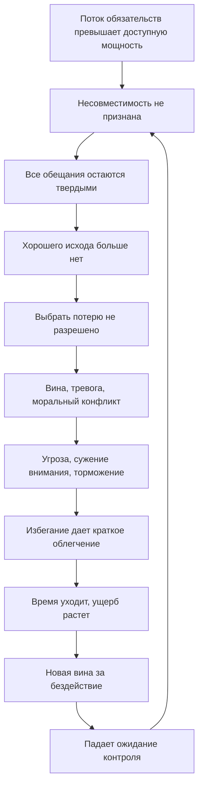

# Выжимка для книги: кризис исполнимости обязательств

## Редакторский тезис

Эта тема начинается с вопроса о чувстве вины, но не должна заканчиваться главой о вине. Ее центральный результат - модель ситуации, в которой несколько обязательств стали совместно невыполнимыми, а система выбора не имеет легитимного механизма ослабить хотя бы одно ограничение.

Проблема первично структурна:

```text
Требований больше, чем можно совместно выполнить.

Но отказ, задержка, ухудшение результата,
разочарование другого человека
и признание срыва считаются недопустимыми.

Допустимых решений не остается.
```

Вина, тревога, стыд, загнанность и торможение действия затем усиливают кризис, но не создают исходную несовместимость.

## Рабочее определение

**Кризис исполнимости обязательств** - это состояние личной или коллективной системы, в котором набор фактически принятых требований нельзя выполнить в доступной мощности и сроках, однако правила выбора не разрешают признать неизбежную потерю, ослабить ограничение, пересогласовать обещание или явно выбрать защищаемую сторону.

Более широкая формула:

**Кризис управляемости при неизбежных потерях** возникает, когда хорошего исхода уже нет, но система продолжает признавать допустимым только хороший исход.

Это инженерные термины для учебника, а не диагнозы.

## Перегрузка и кризис

| Состояние | Структура | Основной вопрос | Подход |
| --- | --- | --- | --- |
| Обычная нагрузка | Требования помещаются в мощность и сроки | Что делать следующим? | Планирование и исполнение |
| Перегрузка | Требований много, но приемлемый порядок еще существует | Что отложить и как защитить фокус? | Приоритезация, WIP-limit, offloading |
| Кризис исполнимости | Никакой порядок не удовлетворяет всем твердым ограничениям | Какую потерю принять и какой ущерб ограничить? | Triage, пересогласование, incident mode |
| Хроническая невыполнимость | Поток обещаний устойчиво выше доступной мощности | Какие правила приема работы и обязательства изменить? | Admission control, redesign, slack, полномочия |

В терминах constraint satisfaction кризис начинается, когда множество решений стало пустым:

```text
UNSAT:
хотя бы одно ограничение нужно ослабить.
```

Человек редко получает такой чистый сигнал. Он продолжает перебирать варианты, каждый из которых нарушает другое внутреннее правило, и принимает отсутствие безубыточного варианта за собственную неспособность выбрать.

## Три вида кризиса

### 1. Кризис ликвидности времени

Совокупная работа в принципе выполнима, но не до ближайших обязательных моментов. Трехчасовое поручение нельзя завершить за час до согласованного выезда.

Диагностический вопрос:

```text
Хватило бы мощности, если бы сроки были расположены иначе?
```

Ответом может быть перенос, частичная поставка, изменение порядка, дополнительный ресурс или раннее сообщение о риске.

### 2. Кризис долгосрочной выполнимости

Даже при переносе сроков текущий поток обещаний не помещается в устойчивую производительность. Повторяющиеся вечерние рывки означают не несколько случайно плохих дней, а операционную модель, которая занимает ресурс у сна, семьи, здоровья и следующего рабочего дня.

Диагностический вопрос:

```text
Можно ли выполнять этот поток неделями,
не расходуя защищенные функции и будущую мощность?
```

Если нет, отдельный героический рывок не устраняет дефицит. Он рефинансирует его более дорогим ресурсом.

### 3. Кризис полномочий

Участники понимают, что одно из обязательств придется нарушить, но никто не считает себя вправе выбрать какое. У человека это может выглядеть как набор запретов:

```text
Нельзя не закончить.
Нельзя задержаться.
Нельзя подвести коллег.
Нельзя расстроить близкого.
Нельзя признать срыв.
```

Здесь блокирует не только дефицит времени. Блокирует отсутствие легитимного механизма выбора ущерба.

## Почему несделанное нельзя использовать как моральную метрику

Размер очереди меняется не только из-за производительности:

```text
Изменение очереди =
входящий поток - завершение.
```

Если за день пришло больше работы, чем человек мог устойчиво завершить, backlog вырос бы и при качественной работе. Подмена выглядит так:

```text
Очередь выросла
-> я не справился
-> я подвел людей
-> я обязан компенсировать это вечером.
```

Дальше возникает долговая спираль:

```text
Рабочий долг
-> скрытая сверхурочная работа
-> долг перед семьей и восстановлением
-> меньшая мощность завтра
-> новый рабочий долг.
```

Поэтому книга должна различать:

- производительность человека;
- скорость входящего потока;
- возраст и структуру очереди;
- число жестких обещаний;
- резерв мощности;
- способность системы пересматривать обязательства.

## Аффективный стек кризиса

Нельзя выбирать одну эмоцию по телесному ощущению. В одном эпизоде могут одновременно работать разные механизмы.

| Компонент | Внутренняя формула | Возможный эффект |
| --- | --- | --- |
| Конфликт ролей | `Одна роль забирает ресурс другой` | Невозможность удовлетворить обе стороны |
| Вина | `Я нарушил конкретное обязательство и должен исправить` | Адресный ремонт или избегание при чрезмерной цене |
| Стыд | `Я сам ненадежен и плох` | Сокрытие, self-attack, отказ от контакта |
| Тревога | `Последствия приближаются, ясности нет` | Мониторинг, суета, сужение внимания |
| Моральный конфликт | `Несколько требований правильны, но несовместимы` | Невозможность выбрать морально чистый ход |
| Action crisis | `Продолжать или отказаться от цели?` | Полуисполнение без полноценного отказа |
| Загнанность | `Нужно выйти, но выхода не видно` | Субъективная безвыходность |
| Threat-rigidity / торможение | `Ошибка опасна` | Жесткость стратегии и задержка действия |
| Mood repair | `Не контактировать сейчас чуть легче` | Краткое облегчение и рост будущего ущерба |
| Падение контролируемости | `Мои действия ничего не меняют` | Более ранняя пассивность в следующем эпизоде |

Телесное сжатие груди, живота или горла совместимо с несколькими состояниями и не является биомаркером вины или freeze.

## Самоподдерживающийся контур



Краткая формула:

```text
Невыполнимость
-> непризнанная неизбежность потерь
-> отсутствие легитимного выбора
-> моральная угроза
-> блокировка
-> новые потери
-> подтверждение бессилия.
```

## Главная смена режима

В обычном режиме цель может звучать так:

```text
Выполнить план.
Сохранить все обещания.
Максимизировать поставку результата.
```

После исчезновения выполнимого плана эта цель становится частью проблемы. Кризисная цель:

```text
Признать уже неизбежную потерю.
Остановить скорость ухудшения.
Минимизировать необратимый ущерб.
Сохранить критические функции.
Вернуть системе управляемость.
```

Первый результат кризисного управления - не завершенная задача. Первый результат - принятое и сообщенное решение о том, какое ограничение ослабляется и что теперь защищается.

## Контур восстановления управляемости

### Шаг 1. Объявить кризис исполнимости

Триггер:

```text
Я больше не могу построить правдоподобный план,
в котором все твердые обязательства выполняются.
```

Это не драматизация. Это смена режима управления.

### Шаг 2. Удалить прошлое из пространства решений

Нельзя выбирать действие, которое вернет прошедшие часы или отменит уже случившуюся задержку.

```text
Уже потеряно:
-

Еще управляемо:
-
```

Признание необратимого не оправдывает ошибку. Оно запрещает создавать новые потери ради символического исправления прошлого.

### Шаг 3. Зафиксировать фактическое состояние

Без оценки личности:

- текущее время и доступная мощность;
- что реально готово;
- что осталось;
- ближайшие последствия по каждому обязательству;
- что обратимо, а что станет необратимым;
- какие полномочия и ресурсы доступны;
- какие неизвестные мешают оценить выполнимость.

### Шаг 4. Найти минимальный конфликтующий набор

Не нужно пересобирать всю жизнь. Нужно назвать два или несколько условий, которые нельзя выполнить одновременно:

```text
Нельзя одновременно:
1. ...
2. ...
```

Это переводит глобальное `я все испортил` в локальную задачу управления ограничениями.

### Шаг 5. Определить бюджет потерь

```text
Я уже не могу сохранить:
-

Я защищаю:
-

Я принимаю как наименее разрушительную потерю:
-
```

Критерии требуют контекста, но обычно полезно проверить:

1. безопасность и необратимость;
2. скорость роста ущерба;
3. жесткость внешнего срока;
4. число затронутых людей;
5. стоимость восстановления;
6. защищаемые ценности и отношения;
7. влияние на будущую мощность.

Это не универсальная моральная формула и не команда всегда выбирать работу или семью.

### Шаг 6. Пересогласовать обязательства

Раннее сообщение меняет контракт. Минимальный формат:

```text
Факт:
Риск:
Что уже готово:
Что предлагаю изменить:
Какое решение нужно от адресата:
Когда будет следующий статус:
```

Извинение полезно, когда адресно признает ущерб и сопровождается corrective action. Самоунижение не добавляет ответственности.

### Шаг 7. Ввести временный incident mode

Кризисный режим должен быть узким и конечным:

- один rescue objective;
- короткий operational period;
- явное право принимать нужные решения;
- закрытый список допустимых действий;
- критерий остановки;
- защита критических функций;
- время следующей переоценки.

Личный incident mode - авторский перенос из организационных практик, а не доказанный клинический протокол.

### Шаг 8. Совершить действие, меняющее внешнее состояние

Хорошее первое действие:

- сообщает реальный статус;
- меняет срок или объем;
- сохраняет текущий результат;
- получает решение владельца ограничения;
- останавливает быстро растущий ущерб;
- оставляет наблюдаемый артефакт;
- восстанавливает связь `действие -> изменение`.

Implementation intention полезна после выбора:

```text
Когда сообщение отправлено,
я сохраняю контекст,
закрываю рабочее место
и выполняю принятое решение.
```

If-then план не выбирает, кого подвести, и не разрешает конфликт ценностей.

## Карточка кризиса

```text
КРИЗИС ИСПОЛНИМОСТИ

1. Факты
Сейчас:
Доступная мощность:
Состояние работы:
Ближайшие последствия:

2. Несовместимые ограничения
Нельзя одновременно:
-
-

3. Уже необратимо
-

4. Еще можно предотвратить
-

5. Принятая потеря
Я принимаю:

6. Защищаемое
Я защищаю:

7. Передоговоренности
Кому сообщить:
Какое решение требуется:

8. Одно действие
Следующее действие, меняющее внешнее состояние:

9. Условие выхода
Кризисный режим закончен, когда:
```

## Разобранный пример

Ситуация:

```text
Вечер.
Для завершения рабочего поручения нужно еще около двух часов.
Согласованное время выезда домой уже пропущено.
Близкий человек ждет.
Ночью не произойдет аварии, потери данных
или другого необратимого рабочего ущерба.
```

Невыполнимая цель:

```text
Закончить поручение сегодня,
не опоздать еще сильнее,
никого не разочаровать,
не сообщать о срыве
и не оставить работу незавершенной.
```

Кризисная цель:

```text
Остановить рост семейной задержки,
не оставить рабочую сторону в неизвестности
и сохранить дешевый вход в поручение завтра.
```

Возможный ход:

1. Сообщить на работе фактическое состояние и риск срока.
2. Зафиксировать готовое, оставшееся, следующий физический шаг, нужные файлы и проверки.
3. Сохранить или отправить текущий артефакт.
4. Сообщить близкому реальное время выезда без нового оптимистического обещания.
5. Выехать в принятой точке и не открывать решение заново.

Принятая потеря: поручение сегодня не завершено.

Предотвращаемые потери: дальнейшая неопределенная задержка, неизвестность обеих сторон, потеря контекста, сокращение сна и меньшая мощность следующего дня.

Если вместо обычного поручения идет реальный производственный инцидент с риском безопасности, потери данных или крупного необратимого ущерба, triage способен дать противоположное решение. Работа временно получает высший приоритет, но режим объявляется явно, семейное обязательство пересогласуется, а условия окончания и восстановления фиксируются. Модель не предписывает выбор стороны; она запрещает тайно обещать обеим сторонам несовместимое.

## Почему стандартные советы дают сбой

### `Надо просто начать`

Начало автоматически выбирает одно обязательство, но не делает ущерб другому легитимным. Сопротивление возвращается. Первый контакт полезен после triage, а не вместо него.

### `Надо сначала успокоиться`

Снижение возбуждения может вернуть способность решать, но не делает несовместимые требования совместимыми. Нужна достаточная регуляция для выбора, а не полное отсутствие дискомфорта.

### `Надо сделать что-нибудь легкое`

Легкость не равна способности остановить ущерб. В crisis mode приоритет получает действие, сильнее всего меняющее внешнее состояние.

### `Надо остаться, пока день не будет исправлен`

Прошлое не исправляется дополнительной ставкой. Это риск escalation of commitment и рефинансирования долга за счет восстановления.

### `Сообщу, когда появится готовое решение`

Пока адресат не знает о риске, старый контракт считается действующим. Неопределенность и расхождение ожиданий продолжают расти.

### `Нужно отказаться от всего лишнего`

Сокращение без защиты восстановительной способности может стабилизировать очередь и одновременно разрушить возможность возврата. Нужны и остановка потерь, и сохранение функций восстановления.

## Профилактическая архитектура

### Admission control

Каждое новое обязательство должно отвечать на вопрос:

```text
Что будет снято, уменьшено или сдвинуто,
если мы принимаем это обещание?
```

Важность нового запроса не создает дополнительную мощность.

### WIP моральных контрактов

Активная задача несет не только переключение контекста. Она несет ожидания адресата, риск срока и моральный долг. Поэтому ограничивать нужно число одновременно открытых обещаний, а не только число карточек `в работе`.

### Разделение запроса, задачи и обещания

Полезны разные состояния:

```text
Запрос получен.
Принят в очередь.
Взят в работу.
Срок обсуждается.
Срок согласован.
Срок под риском.
Объем или срок пересмотрен.
Обязательство закрыто.
```

Backlog не должен автоматически превращаться в персональный долг.

### Ранний триггер

Кризис начинается не после срыва, а после исчезновения правдоподобного совместного плана. Ранняя эскалация сохраняет больше обратимых вариантов.

### Сверхурочная работа как объявленный инцидент

Она требует ответа:

- какой необратимый ущерб предотвращается;
- почему обычный режим недостаточен;
- когда инцидент заканчивается;
- кто согласовал нарушение других обязательств;
- как восстанавливается потраченная мощность;
- какое изменение предотвратит повтор.

Постоянный скрытый overtime маскирует реальную пропускную способность системы.

### Политика выбора ущерба

Заранее обсужденные принципы снижают кризис полномочий. Они не устраняют моральную цену, но дают процедуру выбора, когда сохранить все уже невозможно.

### Post-incident learning

После стабилизации нужно спросить:

```text
Какой ранний сигнал был пропущен?
Какое обязательство оказалось неявным?
Где отсутствовало право на эскалацию?
Какой буфер был фиктивным?
Что изменило внешний результат?
Какой guardrail нужен теперь?
```

Debrief не должен превращаться в ретроспективное доказательство личной плохости.

## Масштабы применения

### Один человек

Выход строится через локализацию конфликта, разрешение выбрать потерю, коммуникацию и наблюдаемое действие. При повторяемости нужен redesign портфеля, а не более жесткое самопринуждение.

### Команда

Нужны общая оперативная картина, владелец решения, triage, временное сужение целей, ясные статусы, защищенный канал эскалации и критерий выхода.

### Организация

Нужно различать ownership и полномочия. Нельзя требовать персональной ответственности за портфель, который сотрудник не вправе сократить, пересогласовать или отклонить.

### Лидер

Лидер отвечает не только за мотивацию исполнителя, но и за выполнимость системы обещаний:

- делает ограничения видимыми;
- дает право сигнализировать о несовместимости;
- выбирает или делегирует выбор ущерба;
- не использует скрытый overtime как постоянный буфер;
- защищает восстановление;
- переводит инциденты в изменение правил приема и планирования.

## Связь с восстановлением контролируемости

После кризиса важно фиксировать не только остаток несделанного, но и причинные связи:

```text
Я сообщил о риске
-> объем был сокращен.

Я отказался от нового обещания
-> сохранил действующий срок.

Я сохранил контекст
-> завтра восстановил задачу быстро.

Я остановился в принятой точке
-> следующий день начался с большей мощностью.
```

Это не позитивное мышление. Это обучение тому, какие действия действительно меняют внешнюю систему.

## Диагностические развилки

Перед применением протокола нужно проверить:

1. Есть ли реальная несовместимость или выбор лишь неприятен?
2. Не скрыта ли выполнимость недостатком информации или компетентности?
3. Есть ли право ослабить ограничение, и у кого оно находится?
4. Не является ли дефицит следствием болезни, тяжелого недосыпа, burnout, депрессии или другого состояния?
5. Не существует ли риска безопасности, насилия, потери данных или другого необратимого ущерба?
6. Является ли это единичным эпизодом или устойчивой операционной моделью?
7. Есть ли суицидальные мысли, тяжелая безнадежность, паника, навязчивое checking, выраженная бессонница или резкое нарушение функционирования?

В последних случаях это уже не только productivity-задача.

## Что нельзя утверждать

- `Кризис исполнимости обязательств` не является признанным диагнозом.
- Всякое чувство вины не означает структурный кризис.
- Телесное сжатие не доказывает вину, freezing или конкретную нейронную реакцию.
- Один рабочий эпизод не равен learned helplessness, клиническому entrapment или moral injury.
- Малый шаг не разрешает несовместимые обязательства автоматически.
- Implementation intentions не выбирают цель и не решают моральный конфликт.
- Отказ от цели не всегда полезен; эффекты goal adjustment зависят от контекста и часто изучены корреляционно.
- Методы ICS, HRO и turnaround не были напрямую валидированы как личная психотерапия.
- Принять потерю не значит снять ответственность за предотвратимый вред.
- Протокол не предписывает всегда выбирать работу, семью, здоровье или срок; он делает критерии и цену выбора явными.

## Редакторская конструкция для следующей версии

Раздел лучше строить в последовательности:

1. Короткий узнаваемый кейс.
2. Проверка совместной выполнимости ограничений.
3. Три вида кризиса.
4. Аффективный стек и блокирующая петля.
5. Смена обычной цели на кризисную.
6. Карточка кризиса и один разобранный пример.
7. Профилактика через admission control, WIP, буферы и полномочия.
8. Организационная ответственность и этика.
9. Evidence-границы и clinical red flags.

Финальная мысль раздела:

```text
Необходимость выбрать потерю
не доказывает личную несостоятельность.

Она означает, что система требований
уже вышла за границу совместной выполнимости
и теперь нуждается в управлении ущербом,
пересогласовании и восстановлении контроля.
```
